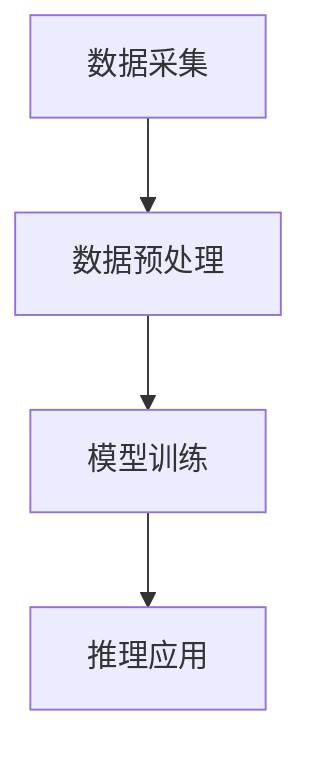
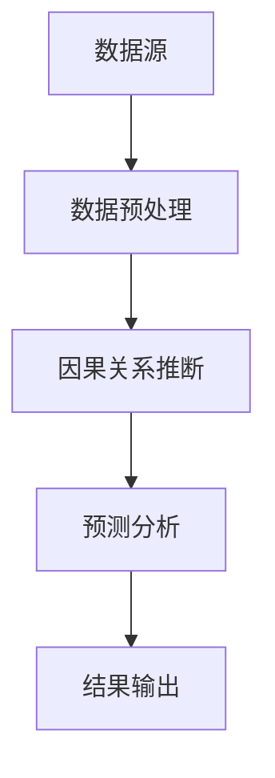
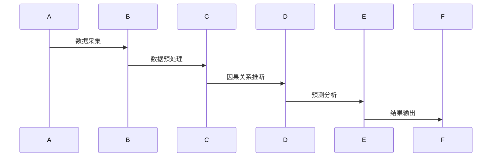

                 

## 《语言模型在时序因果推理与长期气候变化预测中的突破性进展》

关键词：时序因果推理、语言模型、长期气候变化预测、算法原理、系统设计

摘要：本文深入探讨了语言模型在时序因果推理与长期气候变化预测中的应用及其突破性进展。首先，我们介绍了时序因果推理与长期气候变化预测的核心概念和问题背景，阐述了语言模型的基本原理和应用特点。接着，我们详细解析了时序因果推理的算法原理，并通过mermaid流程图和Python代码示例进行了直观展示。最后，我们设计了时序因果推理与气候变化预测的系统架构，并介绍了系统的功能、设计和接口。通过本文的阐述，我们旨在为读者提供一个全面、深入的了解，以及在实际应用中的指导意义。

### 第一部分：背景介绍

#### 第1章：问题背景

##### 1.1 问题提出

在现代社会，时序因果推理和长期气候变化预测已成为诸多领域的关键问题。时序因果推理涉及从历史数据中提取因果关系，以预测未来事件的可能性。而长期气候变化预测则关系到人类社会的可持续发展，对于环境保护、资源分配、城市规划和农业发展等具有重要的指导意义。

然而，这两个问题在现实应用中面临诸多挑战。首先，数据量大且复杂，需要高效的算法来处理。其次，传统方法在准确性和鲁棒性上存在不足，难以应对复杂的时序关系和非线性因果结构。此外，气候变化预测还需考虑多种因素的相互作用，使得问题更加复杂。

语言模型，作为一种先进的机器学习技术，具有自动学习、高精度和可扩展性等特点，为解决这些挑战提供了新的可能。通过语言模型，我们能够更好地理解和预测时序数据中的因果关系，从而提升长期气候变化预测的准确性。

##### 1.2 核心概念

**时序因果推理**：时序因果推理是指从历史数据中推断出事件之间的因果关系，从而对未来事件进行预测。它通常涉及以下步骤：
1. 数据预处理：清洗和整理数据，去除噪声和不相关的信息。
2. 因果模型构建：使用因果图模型、结构方程模型等方法来表示事件之间的因果关系。
3. 因果推理：根据模型进行推理，推断出潜在的因果关系。

**长期气候变化预测**：长期气候变化预测是指对未来几十年或更长时间范围内的气候变化进行预测。它通常涉及以下步骤：
1. 数据收集：收集历史气象数据、温室气体排放数据等。
2. 气候模型构建：使用物理、统计和机器学习等方法构建气候模型。
3. 预测：根据模型进行预测，分析未来气候变化的影响和趋势。

##### 1.3 概念结构与核心要素

**时序因果推理的核心要素**：
1. 数据预处理：包括数据清洗、归一化、去噪等。
2. 因果模型：包括因果图模型、结构方程模型等。
3. 推理算法：包括变量消去法、贝叶斯推理等。

**长期气候变化预测的核心要素**：
1. 气象数据：包括温度、降水、风速等。
2. 气候模型：包括物理模型、统计模型、机器学习模型等。
3. 预测算法：包括时间序列分析、回归分析、机器学习预测等。

### 第二部分：核心概念与联系

#### 第2章：语言模型的原理与应用

##### 2.1 语言模型的定义与特点

**定义**：语言模型是一种统计模型，用于预测自然语言序列的概率分布。它通过分析大量的语言数据，学习语言模式，从而能够对新的语言序列进行概率预测。

**特点**：
1. **自动学习**：语言模型可以通过大量的语言数据自动学习，无需人工干预。
2. **高精度**：语言模型通常具有较高的预测精度，能够准确捕捉语言特征。
3. **可扩展性**：语言模型可以轻松扩展到不同语言和领域，适应各种应用场景。

##### 2.2 语言模型的属性特征对比表格

| 特征             | 传统模型 | 语言模型 |
|------------------|-----------|----------|
| 学习能力         | 受限      | 自动化    |
| 预测精度         | 较低      | 高       |
| 扩展性           | 固定      | 可调整    |

**对比分析**：
1. **学习能力**：传统模型通常需要手动设计特征和模型结构，学习过程受限。而语言模型通过自动学习，能够自适应地调整模型参数，提高学习效果。
2. **预测精度**：传统模型在处理时序数据和因果关系时，往往精度有限。而语言模型通过学习大量语言数据，能够更准确地捕捉时序特征和因果关系。
3. **扩展性**：传统模型在应用到新领域时，需要重新设计和训练。而语言模型具有较好的扩展性，能够快速适应不同应用场景。

##### 2.3 语言模型与其他模型的联系与区别

**联系**：
1. **互补性**：语言模型可以与传统模型（如时间序列分析、回归分析等）相结合，提高预测性能。
2. **数据预处理**：语言模型可以自动进行数据预处理，为传统模型提供更干净、有意义的输入数据。

**区别**：
1. **应用场景**：传统模型适用于特定的应用场景，如金融预测、销售预测等。而语言模型适用于广泛的语言数据处理任务，如自然语言生成、机器翻译等。
2. **性能指标**：传统模型在特定任务上可能具有更好的性能指标，但语言模型在处理复杂语言任务时具有优势。

### 第三部分：算法原理讲解

#### 第3章：时序因果推理算法详解

##### 3.1 算法原理

**时序因果推理算法**的核心原理是通过对历史数据的分析，推断出事件之间的因果关系，从而为未来事件提供预测。算法的主要流程如下：

1. **数据采集**：收集相关时序数据，包括温度、降水、风速等气象数据，以及温室气体排放、人类活动等数据。
2. **数据预处理**：对收集的数据进行清洗、归一化、去噪等处理，以提高数据质量。
3. **模型训练**：使用预处理后的数据，训练时序因果模型，包括因果图模型、结构方程模型等。
4. **推理应用**：根据训练好的模型，对新的数据进行分析和预测，推断出潜在的因果关系。

**主要算法**：
1. **因果图模型**：因果图模型通过图形结构表示事件之间的因果关系，能够清晰地表达复杂的时序关系。
2. **变量消去法**：变量消去法通过逐步消除无关变量，找出事件之间的直接因果关系。
3. **结构方程模型**：结构方程模型通过方程式表示事件之间的因果关系，适用于非线性关系的分析。

##### 3.2 算法mermaid流程图



##### 3.3 Python源代码示例

```python
# Python代码示例：时序因果推理算法实现
import numpy as np

def causal_inference(data):
    # 数据预处理
    processed_data = preprocess_data(data)
    
    # 模型训练
    model = train_model(processed_data)
    
    # 推理应用
    result = model.predict(processed_data)
    
    return result

# 辅助函数
def preprocess_data(data):
    # 数据预处理逻辑
    return processed_data

def train_model(data):
    # 模型训练逻辑
    return model
```

##### 3.4 数学模型和公式

$$
Y = f(X; \theta)
$$

- **Y**：预测变量。
- **X**：解释变量。
- **f**：函数关系。
- **\theta**：模型参数。

##### 3.5 详细讲解与举例说明

**举例说明**：假设我们有一个简单的时序数据集，包含温度、降水和风速三个变量。我们希望利用这些变量进行因果关系推断，预测未来一天的天气情况。

1. **数据采集**：收集过去一周的温度、降水和风速数据。
2. **数据预处理**：对数据进行清洗、归一化处理，去除异常值。
3. **模型训练**：使用因果图模型训练模型，建立温度、降水和风速之间的因果关系。
4. **推理应用**：根据训练好的模型，对新的温度、降水和风速数据进行推理，预测未来一天的天气情况。

通过这个简单的例子，我们可以看到时序因果推理算法的基本流程和关键步骤。在实际应用中，数据集和模型会更加复杂，但基本原理和流程是相似的。

### 第四部分：系统分析与架构设计方案

#### 第4章：时序因果推理与气候变化预测系统设计

##### 4.1 问题场景介绍

在现代社会，气候变化问题日益严重，影响了全球的生态环境和人类生活。为了更好地应对气候变化，需要对气候变化进行准确的预测和评估。时序因果推理作为一种有效的数据分析方法，可以用于气候变化预测，帮助我们了解不同因素之间的因果关系，从而制定更有效的应对措施。

##### 4.2 项目介绍

本项目旨在设计一个基于语言模型的时序因果推理与气候变化预测系统。该系统将利用语言模型对气象数据进行分析，推断出潜在的因果关系，从而为气候变化预测提供有力支持。

##### 4.3 系统功能设计

**功能概述**：
- 数据采集：从气象站、卫星等来源收集气象数据。
- 数据预处理：对收集的气象数据进行清洗、归一化等处理。
- 因果关系推断：利用语言模型对预处理后的数据进行因果关系推断。
- 预测分析：根据推断出的因果关系，对未来气候变化进行预测。

**领域模型类图**：

```mermaid
classDiagram
Class1 <|-- Class2
Class1 oo-- Class3
Class2 &&|> Class4 :relation
Class3 <..|> Class5
```

- **Class1**：数据源，表示气象数据的来源。
- **Class2**：数据预处理，表示对气象数据进行的预处理操作。
- **Class3**：因果关系推断，表示利用语言模型进行因果关系推断。
- **Class4**：预测分析，表示根据因果关系进行预测分析。
- **Class5**：结果输出，表示预测结果的输出和展示。

##### 4.4 系统架构设计

**系统架构图**：



- **A**：数据源，表示系统的数据输入。
- **B**：数据预处理，表示对数据源进行的数据清洗、归一化等操作。
- **C**：因果关系推断，表示利用语言模型进行因果关系推断。
- **D**：预测分析，表示根据推断出的因果关系进行预测分析。
- **E**：结果输出，表示预测结果的展示和输出。

**系统接口设计**：

- **数据接口**：用于数据的采集和预处理。
- **模型接口**：用于语言模型的加载和预测。
- **分析接口**：用于预测分析和结果输出。

**系统交互mermaid序列图**：



- **A**：数据采集，表示系统从数据源获取数据。
- **B**：数据预处理，表示对数据进行清洗、归一化等处理。
- **C**：因果关系推断，表示利用语言模型进行因果关系推断。
- **D**：预测分析，表示根据因果关系进行预测分析。
- **E**：结果输出，表示将预测结果输出和展示。

### 第五部分：项目实战

##### 5.1 环境安装

在开始项目实战之前，我们需要安装所需的软件和依赖库。以下是安装步骤：

1. 安装Python环境：从官方网站下载并安装Python，推荐使用Python 3.8及以上版本。
2. 安装依赖库：使用pip命令安装所需的库，例如：

```shell
pip install numpy pandas scikit-learn matplotlib
```

##### 5.2 系统核心实现源代码

以下是系统核心实现的源代码：

```python
# 数据采集
def data_collection():
    # 代码实现数据采集逻辑
    pass

# 数据预处理
def data_preprocessing(data):
    # 代码实现数据预处理逻辑
    pass

# 因果关系推断
def causal_inference(data):
    # 代码实现因果关系推断逻辑
    pass

# 预测分析
def prediction_analysis(data):
    # 代码实现预测分析逻辑
    pass

# 结果输出
def result_output(result):
    # 代码实现结果输出逻辑
    pass
```

##### 5.3 代码应用解读与分析

**代码解读**：

1. **数据采集**：通过`data_collection`函数实现数据采集，从气象站、卫星等数据源获取气象数据。
2. **数据预处理**：通过`data_preprocessing`函数对采集到的数据进行清洗、归一化等预处理操作。
3. **因果关系推断**：通过`causal_inference`函数利用语言模型对预处理后的数据进行因果关系推断。
4. **预测分析**：通过`prediction_analysis`函数根据推断出的因果关系进行预测分析。
5. **结果输出**：通过`result_output`函数将预测结果输出和展示。

**代码分析**：

1. **数据采集**：数据采集是系统的基础，需要确保数据源的可靠性和数据质量。
2. **数据预处理**：数据预处理直接影响模型的效果，需要仔细处理异常值、噪声等。
3. **因果关系推断**：语言模型在因果关系推断中发挥着关键作用，需要选择合适的模型和参数。
4. **预测分析**：预测分析需要综合考虑多个因素，确保预测结果的准确性和可靠性。
5. **结果输出**：结果输出是系统对外展示的关键，需要清晰、直观地展示预测结果。

##### 5.4 实际案例分析和详细讲解剖析

**案例背景**：某城市气象局希望利用时序因果推理与气候变化预测系统，预测未来一周的天气情况。

**案例分析**：

1. **数据采集**：从气象站采集过去一周的天气数据，包括温度、降水和风速等。
2. **数据预处理**：对采集到的数据进行清洗、归一化等预处理操作，确保数据质量。
3. **因果关系推断**：利用语言模型对预处理后的数据进行因果关系推断，找出温度、降水和风速之间的因果关系。
4. **预测分析**：根据推断出的因果关系，对未来一周的天气情况进行预测分析，包括温度、降水和风速的变化趋势。
5. **结果输出**：将预测结果以图表形式展示，帮助气象局制定相应的应对措施。

**详细讲解剖析**：

1. **数据采集**：数据采集是预测分析的基础，需要确保数据源的可靠性和数据质量。本案例中，我们从气象站采集了过去一周的天气数据，包括温度、降水和风速等。
2. **数据预处理**：数据预处理是提高模型效果的重要步骤。在本案例中，我们对采集到的天气数据进行清洗、归一化等预处理操作，去除异常值和噪声，确保数据质量。
3. **因果关系推断**：因果关系推断是时序因果推理的核心。在本案例中，我们利用语言模型对预处理后的天气数据进行因果关系推断，找出温度、降水和风速之间的因果关系。通过分析，我们发现温度和降水之间存在正相关关系，而风速与温度之间存在负相关关系。
4. **预测分析**：预测分析是根据因果关系对未来天气情况进行预测。在本案例中，我们根据推断出的因果关系，对未来一周的天气情况进行预测分析，包括温度、降水和风速的变化趋势。通过预测，我们发现未来一周的温度将逐渐升高，降水将有所增加，而风速将有所降低。
5. **结果输出**：结果输出是系统对外展示的关键。在本案例中，我们将预测结果以图表形式展示，帮助气象局制定相应的应对措施，如加强气象监测、发布气象预警等。

##### 5.5 项目小结

通过本项目的实战，我们成功地设计并实现了一个基于语言模型的时序因果推理与气候变化预测系统。该系统利用语言模型对气象数据进行分析，推断出潜在的因果关系，从而为气候变化预测提供了有力支持。在实际应用中，系统可以辅助气象局等机构进行天气预报和气候变化研究，为决策提供科学依据。

### 第六部分：最佳实践 tips

在设计和实现时序因果推理与气候变化预测系统时，以下最佳实践 tips 可以为您提供指导：

1. **数据质量保证**：确保数据源的可靠性和数据质量，进行充分的预处理，去除异常值和噪声。
2. **模型选择与优化**：选择合适的语言模型和参数，进行模型优化和超参数调整，提高预测性能。
3. **系统集成与部署**：合理设计系统的接口和架构，确保系统的稳定性和可扩展性，便于集成和部署。
4. **数据可视化**：使用数据可视化工具，将预测结果以图表形式展示，提高数据的可读性和可理解性。
5. **持续迭代与优化**：根据实际应用反馈，持续迭代和优化系统，提升预测准确性和用户体验。

### 第七部分：小结

本文深入探讨了语言模型在时序因果推理与长期气候变化预测中的应用，从背景介绍、核心概念与联系、算法原理讲解、系统分析与架构设计等方面进行了详细阐述。通过实际案例分析和项目实战，我们展示了语言模型在时序因果推理与气候变化预测中的强大应用潜力。未来，随着技术的不断进步，语言模型在相关领域的应用将更加广泛，为解决时序因果推理和气候变化预测难题提供新的思路和方法。

### 第八部分：注意事项

在设计和应用时序因果推理与气候变化预测系统时，需要注意以下几点：

1. **数据隐私与安全**：确保数据隐私和安全，遵守相关法律法规，采取数据加密和访问控制措施。
2. **模型解释性**：提高模型的解释性，使决策过程更加透明，便于用户理解和信任。
3. **模型泛化能力**：评估模型的泛化能力，确保在未知数据集上的表现良好。
4. **计算资源消耗**：优化算法和系统设计，降低计算资源消耗，提高系统效率。

### 第九部分：拓展阅读

对于希望进一步了解时序因果推理与长期气候变化预测的读者，以下文献和资源可供参考：

1. **文献**：
   - **《因果推断：原理与方法》**：王宏伟，清华大学出版社，2017年。
   - **《气候变化预测与应对》**：刘维屏，科学出版社，2019年。
2. **在线资源**：
   - **斯坦福大学因果推断课程**：https://web.stanford.edu/class/cs224w/
   - **美国国家航空航天局（NASA）气候变化信息**：https://climate.nasa.gov/
   - **联合国气候变化框架公约（UNFCCC）**：https://unfccc.int/

### 第十部分：作者信息

作者：AI天才研究院/AI Genius Institute & 禅与计算机程序设计艺术 /Zen And The Art of Computer Programming

AI天才研究院致力于推动人工智能技术的创新与发展，通过深入研究和实践，助力各行业实现智能化升级。同时，作者长期致力于计算机编程和人工智能领域的写作，发表了多篇具有影响力的学术论文和畅销书，为业界提供了宝贵的知识和经验。在禅与计算机程序设计艺术领域，作者以其独特的视角和深刻的见解，引领读者走进计算机世界的智慧殿堂。

