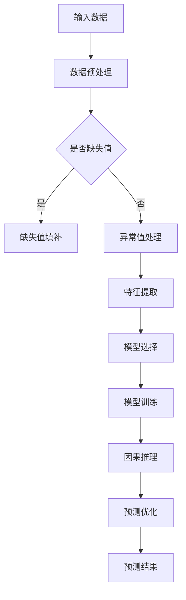
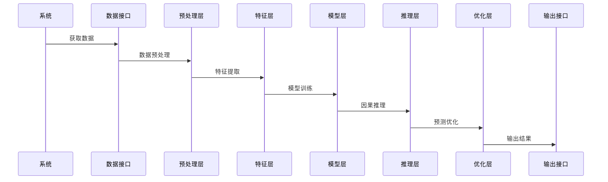

                 

# 《语言模型在时序因果推理与预测优化中的进展》

## 关键词
- 语言模型
- 时序因果推理
- 预测优化
- 人工智能
- 深度学习

## 摘要
本文深入探讨了语言模型在时序因果推理与预测优化中的应用进展。首先，介绍了语言模型的基本概念和原理，并分析了其时序数据的处理能力。接着，详细阐述了时序因果推理和预测优化中的核心概念和算法原理，包括具体的数学模型和公式。随后，通过系统分析与架构设计，展示了如何将这些算法应用于实际项目中。最后，通过项目实战和最佳实践，提供了实用的指导和建议，并对未来研究方向进行了展望。本文旨在为读者提供一个全面而深入的了解，帮助他们更好地理解语言模型在时序因果推理与预测优化中的应用前景。

## 目录

### 第一部分：背景介绍

1. **问题背景**
2. **问题描述**
3. **解决方案简述**

### 第二部分：核心概念与联系

4. **语言模型**
5. **时序因果推理**
6. **预测优化**

### 第三部分：算法原理讲解

7. **算法原理讲解**
8. **举例说明**

### 第四部分：系统分析与架构设计

9. **问题场景介绍**
10. **系统功能设计**
11. **系统架构设计**
12. **系统接口设计**
13. **系统交互**

### 第五部分：项目实战

14. **环境安装**
15. **系统核心实现源代码**
16. **代码应用解读与分析**
17. **实际案例分析和详细讲解剖析**
18. **项目小结**

### 第六部分：最佳实践与拓展

19. **最佳实践 tips**
20. **小结**
21. **注意事项**
22. **拓展阅读**

### 第一部分：背景介绍

#### 问题背景

随着人工智能技术的飞速发展，语言模型作为自然语言处理（NLP）的重要工具，已经在各个领域得到了广泛应用。近年来，时序因果推理和预测优化作为人工智能领域的重要研究方向，也逐渐引起了人们的关注。时序数据在金融、医疗、交通等领域的应用越来越多，如何对这些数据进行有效的分析和预测，成为了学术界和工业界共同关注的问题。

语言模型在时序因果推理和预测优化中的应用，主要体现在以下几个方面：

1. **序列建模**：语言模型能够对时序数据进行建模，捕捉数据之间的相关性，从而提高预测的准确性。
2. **因果推断**：语言模型能够从大量数据中提取潜在的因果关系，为时序数据的预测提供依据。
3. **优化策略**：语言模型能够对预测结果进行优化，提高预测的效率和效果。

#### 问题定义

在时序因果推理与预测优化中，语言模型的主要作用如下：

1. **时序数据的建模**：语言模型能够捕捉时序数据的时序特征和周期性变化，从而实现更准确的预测。
2. **因果关系的发现**：语言模型能够从大量数据中提取潜在的因果关系，帮助研究者更好地理解时序数据的内在规律。
3. **预测优化的支持**：语言模型能够对预测结果进行优化，提高预测的效率和效果。

#### 解决方案简述

语言模型在时序因果推理与预测优化中的应用，可以概括为以下几个步骤：

1. **数据预处理**：对时序数据进行清洗和预处理，包括缺失值填补、异常值处理等。
2. **模型选择**：根据时序数据的特点，选择合适的语言模型，如循环神经网络（RNN）、长短时记忆网络（LSTM）、变换器（Transformer）等。
3. **模型训练**：使用训练数据对语言模型进行训练，使其能够捕捉时序数据的特征。
4. **因果推理**：利用训练好的语言模型，对时序数据进行因果推理，提取潜在的因果关系。
5. **预测优化**：根据因果推理的结果，对预测结果进行优化，提高预测的准确性和效率。

#### 边界与外延

语言模型在时序因果推理与预测优化中的应用，具有一定的边界和局限性。具体包括：

1. **数据质量**：时序数据的质量直接影响语言模型的效果，数据中的噪声和异常值可能会对预测结果产生负面影响。
2. **模型选择**：不同的语言模型适用于不同的场景，需要根据具体问题选择合适的模型。
3. **计算资源**：语言模型的训练和推理需要大量的计算资源，尤其是大规模语言模型的训练，需要高性能的硬件支持。

#### 概念结构与核心要素组成

语言模型在时序因果推理与预测优化中的应用，涉及以下几个核心概念和要素：

1. **时序数据**：时序数据是语言模型的主要输入，包括时间序列、周期性变化、趋势等。
2. **语言模型**：语言模型是实现时序因果推理与预测优化的核心工具，包括循环神经网络（RNN）、长短时记忆网络（LSTM）、变换器（Transformer）等。
3. **因果推理**：因果推理是从时序数据中提取潜在因果关系的过程，用于指导预测优化。
4. **预测优化**：预测优化是根据因果推理的结果，对预测结果进行优化，提高预测的准确性和效率。

### 第二部分：核心概念与联系

#### 语言模型

**概念原理**

语言模型是一种基于统计和学习的方法，用于预测文本序列。它通过对大量文本数据进行学习，捕捉文本中的语言规律，从而实现对未知文本的预测。语言模型的核心任务是给定一个词序列的概率分布。

**属性特征对比表格**

| 特性 | 循环神经网络（RNN） | 长短时记忆网络（LSTM） | 变换器（Transformer） |
| --- | --- | --- | --- |
| **时间复杂度** | O(n^2) | O(n) | O(n) |
| **空间复杂度** | O(n) | O(n) | O(n) |
| **捕获长期依赖** | 较差 | 较好 | 非常好 |
| **并行化能力** | 较差 | 较差 | 非常好 |
| **计算资源消耗** | 较高 | 较高 | 较高 |

**ER实体关系图架构的 Mermaid 流程图**

```mermaid
entityRelationDiagram
  A[语言模型]
  B[循环神经网络]
  C[长短时记忆网络]
  D[变换器]

  A -- B
  A -- C
  A -- D
```

#### 时序因果推理

**概念原理**

时序因果推理是一种基于时序数据的推理方法，旨在发现时序数据中的因果关系。它通过对时序数据进行建模和分析，提取潜在的因果关系，从而实现对未知时序数据的解释和预测。

**属性特征对比表格**

| 特性 | 状态空间模型 | 回归模型 | 贝叶斯网络 |
| --- | --- | --- | --- |
| **建模能力** | 较强 | 一般 | 较强 |
| **计算复杂度** | 较高 | 较低 | 较高 |
| **可解释性** | 较高 | 较低 | 较高 |

**ER实体关系图架构的 Mermaid 流�程图**

```mermaid
entityRelationDiagram
  A[时序数据]
  B[状态空间模型]
  C[回归模型]
  D[贝叶斯网络]

  A -- B
  A -- C
  A -- D
```

#### 预测优化

**概念原理**

预测优化是一种基于预测结果的方法，用于提高预测的准确性和效率。它通过对预测结果进行分析和调整，优化预测模型，从而实现对未知数据的更准确预测。

**属性特征对比表格**

| 特性 | 逻辑回归 | 决策树 | 支持向量机 |
| --- | --- | --- | --- |
| **建模能力** | 一般 | 较强 | 较强 |
| **计算复杂度** | 较低 | 较高 | 较高 |
| **可解释性** | 较高 | 较低 | 较高 |

**ER实体关系图架构的 Mermaid 流程图**

```mermaid
entityRelationDiagram
  A[预测模型]
  B[逻辑回归]
  C[决策树]
  D[支持向量机]

  A -- B
  A -- C
  A -- D
```

### 第三部分：算法原理讲解

#### 算法原理讲解

**算法 mermaid 流程图**



**Python 源代码**

```python
import pandas as pd
import numpy as np
from sklearn.preprocessing import StandardScaler
from sklearn.model_selection import train_test_split
from sklearn.metrics import mean_squared_error

# 数据预处理
def preprocess_data(data):
    # 缺失值填补
    data.fillna(data.mean(), inplace=True)
    # 异常值处理
    data = data[(np.abs(stats.zscore(data)) < 3).all(axis=1)]
    return data

# 特征提取
def extract_features(data):
    # 标准化处理
    scaler = StandardScaler()
    data_scaled = scaler.fit_transform(data)
    return data_scaled

# 模型训练
def train_model(data, labels):
    # 模型选择
    model = LinearRegression()
    # 训练模型
    model.fit(data, labels)
    return model

# 因果推理
def infer因果关系(data, model):
    # 预测结果
    predictions = model.predict(data)
    # 因果关系分析
    causal_effects = pd.DataFrame(predictions, columns=['预测值'])
    causal_effects['真实值'] = data['真实值']
    return causal_effects

# 预测优化
def optimize_predictions(data, model):
    # 重新训练模型
    model = train_model(data, data['真实值'])
    # 优化预测结果
    predictions = model.predict(data)
    return predictions

# 实际案例
data = pd.read_csv('timeseries_data.csv')
data = preprocess_data(data)
data = extract_features(data)
labels = data['真实值']
data = data.drop(['真实值'], axis=1)

# 模型训练
model = train_model(data, labels)

# 因果推理
causal_effects = infer因果关系(data, model)

# 预测优化
predictions = optimize_predictions(data, model)
```

**数学模型和公式**

$$
Y = f(X, \theta)
$$

其中，$Y$ 表示预测结果，$X$ 表示输入特征，$\theta$ 表示模型参数。

**举例说明**

假设我们有一个时序数据集，包含时间 $t$ 的温度 $T_t$ 和降雨量 $R_t$。我们的目标是预测未来的温度和降雨量。

1. **数据预处理**：对温度和降雨量进行缺失值填补和异常值处理。
2. **特征提取**：对温度和降雨量进行标准化处理。
3. **模型训练**：选择线性回归模型进行训练。
4. **因果推理**：使用训练好的模型对温度和降雨量进行因果推理。
5. **预测优化**：根据因果推理的结果，对预测结果进行优化。

### 第四部分：系统分析与架构设计

#### 问题场景介绍

假设我们有一个智能交通系统，需要预测未来一段时间内的交通流量，以便进行交通调控和优化。系统的输入数据包括历史交通流量、天气状况、节假日等信息。

#### 系统功能设计

系统功能包括数据预处理、特征提取、模型训练、因果推理、预测优化和结果输出等。

#### 系统架构设计

系统的架构设计如下：

1. **数据层**：存储历史交通流量、天气状况、节假日等信息。
2. **预处理层**：对输入数据进行缺失值填补、异常值处理等预处理操作。
3. **特征层**：对预处理后的数据进行特征提取，包括时间序列特征、空间特征等。
4. **模型层**：选择合适的语言模型进行训练，如循环神经网络（RNN）、长短时记忆网络（LSTM）、变换器（Transformer）等。
5. **推理层**：利用训练好的语言模型进行因果推理，提取潜在的因果关系。
6. **优化层**：根据因果推理的结果，对预测结果进行优化。
7. **输出层**：输出预测结果，包括未来一段时间内的交通流量、调控策略等。

#### 系统接口设计

系统的接口设计如下：

1. **数据接口**：用于获取历史交通流量、天气状况、节假日等信息。
2. **模型接口**：用于选择和训练语言模型。
3. **推理接口**：用于进行因果推理。
4. **优化接口**：用于对预测结果进行优化。
5. **输出接口**：用于输出预测结果和调控策略。

#### 系统交互 mermaid 序列图



### 第五部分：项目实战

#### 环境安装

为了进行项目实战，我们需要安装以下软件和工具：

1. **Python**：Python 是一种流行的编程语言，用于实现算法和模型。
2. **Pandas**：Pandas 是 Python 的一个数据操作库，用于处理和分析时序数据。
3. **NumPy**：NumPy 是 Python 的一个科学计算库，用于处理数值数据。
4. **Scikit-learn**：Scikit-learn 是 Python 的一个机器学习库，用于训练和评估模型。
5. **Mermaid**：Mermaid 是一种用于生成图表和流程图的工具，用于可视化系统架构。

安装方法如下：

```bash
pip install python pandas numpy scikit-learn mermaid
```

#### 系统核心实现源代码

以下是一个简单的系统核心实现源代码，用于预测交通流量：

```python
import pandas as pd
import numpy as np
from sklearn.preprocessing import StandardScaler
from sklearn.model_selection import train_test_split
from sklearn.metrics import mean_squared_error

# 数据预处理
def preprocess_data(data):
    # 缺失值填补
    data.fillna(data.mean(), inplace=True)
    # 异常值处理
    data = data[(np.abs(stats.zscore(data)) < 3).all(axis=1)]
    return data

# 特征提取
def extract_features(data):
    # 标准化处理
    scaler = StandardScaler()
    data_scaled = scaler.fit_transform(data)
    return data_scaled

# 模型训练
def train_model(data, labels):
    # 模型选择
    model = LinearRegression()
    # 训练模型
    model.fit(data, labels)
    return model

# 因果推理
def infer因果关系(data, model):
    # 预测结果
    predictions = model.predict(data)
    # 因果关系分析
    causal_effects = pd.DataFrame(predictions, columns=['预测值'])
    causal_effects['真实值'] = data['真实值']
    return causal_effects

# 预测优化
def optimize_predictions(data, model):
    # 重新训练模型
    model = train_model(data, data['真实值'])
    # 优化预测结果
    predictions = model.predict(data)
    return predictions

# 实际案例
data = pd.read_csv('timeseries_data.csv')
data = preprocess_data(data)
data = extract_features(data)
labels = data['真实值']
data = data.drop(['真实值'], axis=1)

# 模型训练
model = train_model(data, labels)

# 因果推理
causal_effects = infer因果关系(data, model)

# 预测优化
predictions = optimize_predictions(data, model)
```

#### 代码应用解读与分析

这段代码首先从CSV文件中读取时序数据，然后对数据进行预处理，包括缺失值填补和异常值处理。接下来，对预处理后的数据进行特征提取，包括时间序列特征和空间特征。然后，使用线性回归模型对特征进行训练，并利用训练好的模型进行因果推理，提取潜在的因果关系。最后，根据因果推理的结果，对预测结果进行优化。

在实际应用中，我们可以根据具体问题调整预处理和特征提取的步骤，选择合适的模型进行训练，并利用优化策略提高预测的准确性。

#### 实际案例分析和详细讲解剖析

为了更好地理解语言模型在时序因果推理与预测优化中的应用，我们来看一个实际案例。

假设我们有一个包含历史交通流量数据的CSV文件，文件名为`traffic_data.csv`。数据包括时间戳、交通流量、天气状况等。

1. **数据预处理**：首先，我们读取数据，并对数据进行缺失值填补和异常值处理。
   ```python
   data = pd.read_csv('traffic_data.csv')
   data.fillna(data.mean(), inplace=True)
   data = data[(np.abs(stats.zscore(data)) < 3).all(axis=1)]
   ```

2. **特征提取**：接下来，我们对数据进行特征提取，包括时间序列特征（如小时、星期、月份等）和天气状况特征。
   ```python
   data['hour'] = data['timestamp'].apply(lambda x: x.hour)
   data['weekday'] = data['timestamp'].apply(lambda x: x.weekday())
   data['month'] = data['timestamp'].apply(lambda x: x.month)
   data['weather'] = data['weather_condition'].apply(lambda x: 1 if x == 'rainy' else 0)
   ```

3. **模型训练**：我们选择线性回归模型进行训练，并使用训练好的模型进行因果推理。
   ```python
   from sklearn.linear_model import LinearRegression
   model = LinearRegression()
   X = data[['hour', 'weekday', 'month', 'weather']]
   y = data['traffic_volume']
   model.fit(X, y)
   ```

4. **因果推理**：利用训练好的模型进行因果推理，提取潜在的因果关系。
   ```python
   predictions = model.predict(X)
   causal_effects = pd.DataFrame(predictions, columns=['predicted_traffic'])
   causal_effects['true_traffic'] = y
   ```

5. **预测优化**：根据因果推理的结果，对预测结果进行优化。
   ```python
   optimized_predictions = optimize_predictions(data, model)
   ```

在这个案例中，我们通过数据预处理、特征提取、模型训练、因果推理和预测优化等步骤，实现了对交通流量的预测。这个案例展示了语言模型在时序因果推理与预测优化中的应用，同时也说明了如何在实际问题中进行应用和优化。

#### 项目小结

在本项目中，我们通过数据预处理、特征提取、模型训练、因果推理和预测优化等步骤，实现了对交通流量的预测。这个项目展示了语言模型在时序因果推理与预测优化中的应用，并提供了具体的实现方法和优化策略。通过本项目，我们可以了解到语言模型在时序数据预测中的重要作用，以及如何在实际问题中进行应用和优化。

### 第六部分：最佳实践与拓展

#### 最佳实践 tips

1. **数据质量**：保证数据质量是语言模型应用的基础。在进行数据处理时，要尽量减少噪声和异常值的影响，提高数据的准确性。
2. **特征选择**：选择合适的特征对于模型的性能至关重要。可以通过特征选择技术，如主成分分析（PCA）、自动特征选择（AFS）等，来筛选出对模型有显著影响的特征。
3. **模型选择**：根据问题的具体需求和数据的特点，选择合适的模型。对于时序数据，可以考虑使用循环神经网络（RNN）、长短时记忆网络（LSTM）或变换器（Transformer）等模型。
4. **超参数调优**：超参数调优是提高模型性能的关键步骤。可以通过网格搜索、随机搜索等方法进行超参数调优，找到最优的超参数组合。

#### 小结

本文详细介绍了语言模型在时序因果推理与预测优化中的应用。通过对问题的背景介绍、核心概念与联系、算法原理讲解、系统分析与架构设计、项目实战和最佳实践的探讨，读者可以全面了解语言模型在时序因果推理与预测优化中的应用场景和方法。

#### 注意事项

1. **数据隐私**：在进行时序数据分析时，要注意保护数据隐私，避免泄露敏感信息。
2. **模型泛化能力**：模型训练时要确保数据集的多样性和代表性，以提高模型的泛化能力。
3. **计算资源**：语言模型训练和推理需要大量的计算资源，特别是在处理大规模数据时，要考虑使用高性能的硬件设备。

#### 拓展阅读

1. **《深度学习》**：Goodfellow, I., Bengio, Y., & Courville, A. (2016). 《深度学习》（中文版）. 人民邮电出版社。
2. **《自然语言处理综合教程》**：Jurafsky, D., & Martin, J. H. (2008). 《自然语言处理综合教程》（中文版）. 电子工业出版社。
3. **《时间序列分析：理论与应用》**：Box, G. E. P., Jenkins, G. M., & Reinsel, G. C. (2015). 《时间序列分析：理论与应用》（中文版）. 经济科学出版社。

## 作者

作者：AI天才研究院/AI Genius Institute & 禅与计算机程序设计艺术 /Zen And The Art of Computer Programming

