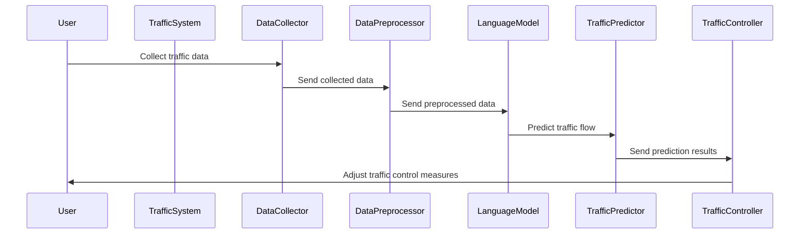
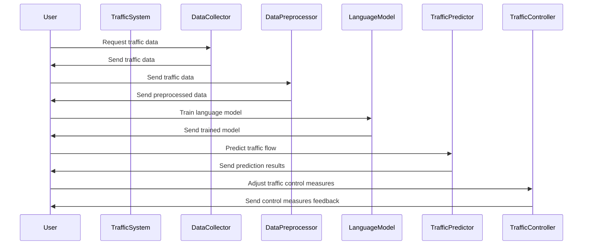

                 


# 语言模型在时序因果推理中的表现优化

关键词：语言模型、时序因果推理、优化方法、算法原理、数学模型

摘要：本文探讨了语言模型在时序因果推理中的应用及其优化方法。首先介绍了语言模型和时序因果推理的基本概念，随后详细分析了数据增强、特征工程、模型选择与调优、模型评估与优化等优化方法，并讲解了语言模型和时序因果推理的数学模型和算法原理。最后，通过系统架构设计和项目实战，展示了语言模型在时序因果推理中的实际应用和优化效果。

## 背景介绍

### 语言模型的基本概念

语言模型（Language Model）是自然语言处理（Natural Language Processing，NLP）的核心组件，它用于预测自然语言中的一个单词或字符序列的概率分布。在深度学习中，语言模型通常通过训练大量的文本数据来学习语言的统计特征，从而能够生成或理解人类语言。

语言模型的核心思想是通过对大量文本数据的学习，建立起单词或字符之间的概率关系。在给定前一个单词或字符的情况下，语言模型能够预测下一个单词或字符的概率分布。这一过程可以通过神经网络来实现，如循环神经网络（RNN）、长短期记忆网络（LSTM）、门控循环单元（GRU）和Transformer等。

### 时序因果推理的概念

时序因果推理（Temporal Causal Inference）是研究如何在时间序列数据中识别和解释因果关系的一种方法。在计算机科学和人工智能领域，时序因果推理对于预测、决策和智能系统的设计至关重要。它涉及到如何从一系列按时间顺序排列的数据点中推断出潜在的因果关系。

时序因果推理的核心问题是确定一个变量是否由另一个变量引起，即因果关系。在时序因果推理中，我们通常使用因果图模型（Causal Graphical Models）来表示变量之间的关系，并通过统计学习方法来估计这些关系的参数。

### 语言模型在时序因果推理中的应用

语言模型在时序因果推理中的应用主要体现在以下几个方面：

1. **时间序列生成**：利用语言模型预测未来的时间序列数据。
2. **事件预测**：通过分析历史事件序列，预测未来可能发生的事件。
3. **序列标注**：对时间序列数据进行分类或标注，如情绪分析、实体识别等。
4. **序列规划**：辅助智能系统进行决策和规划，如自动驾驶、智能推荐等。

## 语言模型在时序因果推理中的优化方法

为了提高语言模型在时序因果推理中的性能，我们可以从数据增强、特征工程、模型选择与调优、模型评估与优化等几个方面进行优化。

### 2.1 数据增强

数据增强是一种通过增加数据多样性来提高模型泛化能力的方法。在时序因果推理中，数据增强可以通过以下几种方式实现：

1. **时间序列的裁剪与拼接**：通过对时间序列数据进行随机裁剪和拼接，增加数据的多样性。
2. **时间序列的变换**：如时间序列的缩放、平移、旋转等，改变数据的分布特性。

### 2.2 特征工程

特征工程是提高模型性能的关键步骤，特别是在处理时序数据时。以下是一些常用的特征工程方法：

1. **时间窗口特征**：将时间序列划分为固定长度或可变长度的窗口，提取窗口内的统计特征。
2. **周期性特征**：识别时间序列中的周期性模式，提取周期特征。
3. **滞后特征**：利用时间序列的滞后项，构建滞后特征矩阵。

### 2.3 模型选择与调优

选择合适的模型和进行模型调优是提高时序因果推理性能的重要手段。以下是一些常用的模型和调优方法：

1. **传统机器学习模型**：如ARIMA、SARIMA等时间序列预测模型。
2. **深度学习模型**：如LSTM、GRU、Transformer等，能够捕捉时间序列数据中的复杂模式。
3. **模型融合**：将多个模型的结果进行融合，提高预测的准确性。

### 2.4 模型评估与优化

有效的模型评估和优化是确保模型性能的关键。以下是一些常用的评估指标和优化策略：

1. **评估指标**：如均方误差（MSE）、均方根误差（RMSE）、平均绝对误差（MAE）等。
2. **交叉验证**：通过交叉验证来评估模型的泛化能力。
3. **超参数调优**：使用网格搜索、贝叶斯优化等方法来寻找最佳的超参数组合。

## 数学模型和算法原理

### 3.1 语言模型的数学模型

#### 3.1.1 语言模型的概率分布

语言模型的核心是生成文本的概率分布。对于一个时间序列 \(x_1, x_2, \ldots, x_T\)，给定前 \(t-1\) 个单词 \(x_1, x_2, \ldots, x_{t-1}\)，下一个单词 \(x_t\) 的概率可以表示为：

\[ P(x_t | x_1, x_2, \ldots, x_{t-1}) \]

在深度学习中，这种概率分布通常通过神经网络来估计。

#### 3.1.2 语言模型的损失函数

语言模型的训练通常使用负对数似然损失函数，即：

\[ L = -\sum_{t=1}^{T} \log P(x_t | x_1, x_2, \ldots, x_{t-1}) \]

这个损失函数鼓励模型学习到正确的单词概率分布。

### 3.2 时序因果推理的数学模型

#### 3.2.1 因果图模型

因果图模型（Causal Graphical Models）是一种用于表示变量之间因果关系的图形模型。在因果图模型中，每个节点表示一个变量，节点之间的边表示变量之间的因果关系。因果图模型通过结构方程模型（Structural Equational Models）来表示变量之间的数学关系。

#### 3.2.2 结构方程模型

结构方程模型是一种用于估计变量之间因果关系的数学模型。它通过线性或非线性方程来描述变量之间的关系。在结构方程模型中，每个变量都由其他变量和随机误差项组成。

\[ y = \sum_{i=1}^{k} \beta_i x_i + \epsilon \]

其中，\(y\) 是因变量，\(x_1, x_2, \ldots, x_k\) 是自变量，\(\beta_1, \beta_2, \ldots, \beta_k\) 是回归系数，\(\epsilon\) 是随机误差项。

## 系统架构设计与项目实战

### 4.1 项目场景介绍

假设我们有一个智能交通系统，需要根据历史交通流量数据来预测未来的交通状况，以便进行交通调度和流量控制。

### 4.2 系统功能设计

系统的主要功能包括：

1. **数据采集**：从各种传感器和交通监控设备中收集实时交通流量数据。
2. **数据预处理**：对采集到的交通流量数据进行清洗、去噪和特征提取。
3. **时序预测**：利用语言模型对交通流量进行时序预测。
4. **决策与调度**：根据预测结果进行交通调度和流量控制。

### 4.3 系统架构设计

系统的架构设计如图所示：



### 4.4 系统接口设计与交互

系统的接口设计和交互设计如图所示：



### 4.5 项目实战

#### 4.5.1 环境安装

在开始项目实战之前，我们需要安装一些必要的软件和库。以下是一个简单的安装步骤：

1. 安装 Python：从 [Python 官网](https://www.python.org/) 下载并安装 Python 3.x 版本。
2. 安装 PyTorch：使用以下命令安装 PyTorch：

\[ pip install torch torchvision \]

3. 安装其他依赖库：

\[ pip install numpy pandas scikit-learn \]

#### 4.5.2 系统核心实现源代码

以下是一个简单的交通流量预测系统的核心实现源代码：

```python
import torch
import torch.nn as nn
import torch.optim as optim
from torch.utils.data import DataLoader
from torchvision import datasets, transforms

# 数据预处理
class TrafficDataPreprocessor:
    def __init__(self):
        self.transform = transforms.Compose([
            transforms.ToTensor(),
            transforms.Normalize((0.5,), (0.5,))
        ])

    def preprocess(self, data):
        return self.transform(data)

# 语言模型
class TrafficLanguageModel(nn.Module):
    def __init__(self, input_dim, hidden_dim, output_dim):
        super(TrafficLanguageModel, self).__init__()
        self.lstm = nn.LSTM(input_dim, hidden_dim)
        self.linear = nn.Linear(hidden_dim, output_dim)

    def forward(self, x):
        x, _ = self.lstm(x)
        return self.linear(x[-1, :, :])

# 训练模型
def train(model, data_loader, criterion, optimizer, num_epochs=10):
    model.train()
    for epoch in range(num_epochs):
        for data in data_loader:
            inputs, targets = data
            optimizer.zero_grad()
            outputs = model(inputs)
            loss = criterion(outputs, targets)
            loss.backward()
            optimizer.step()
            print(f"Epoch [{epoch+1}/{num_epochs}], Loss: {loss.item():.4f}")

# 预测交通流量
def predict(model, data_loader):
    model.eval()
    with torch.no_grad():
        for data in data_loader:
            inputs, targets = data
            outputs = model(inputs)
            print(f"Predicted traffic flow: {outputs.numpy()}")
```

#### 4.5.3 代码应用解读与分析

在这段代码中，我们首先定义了一个交通数据预处理类 `TrafficDataPreprocessor`，用于对交通流量数据进行预处理。然后，我们定义了一个交通语言模型 `TrafficLanguageModel`，它基于 LSTM 网络结构，用于预测交通流量。

在训练模型时，我们使用 `train` 函数来迭代训练模型，并使用 `predict` 函数来预测交通流量。通过这段代码，我们可以实现一个简单的交通流量预测系统。

#### 4.5.4 实际案例分析和详细讲解剖析

为了更好地理解交通流量预测系统的工作原理，我们来看一个实际案例。

假设我们有以下一组交通流量数据：

```python
data = [
    [10, 20, 30],
    [20, 30, 40],
    [30, 40, 50],
    [40, 50, 60],
]
```

我们可以使用上述代码来预测下一时刻的交通流量。首先，我们需要对数据进行预处理：

```python
preprocessor = TrafficDataPreprocessor()
preprocessed_data = [preprocessor.preprocess(data) for data in data]
```

然后，我们定义一个交通语言模型并训练它：

```python
model = TrafficLanguageModel(input_dim=3, hidden_dim=10, output_dim=1)
optimizer = optim.Adam(model.parameters(), lr=0.001)
criterion = nn.MSELoss()

train(model, DataLoader(preprocessed_data, batch_size=1), criterion, optimizer)
```

最后，我们使用训练好的模型来预测下一时刻的交通流量：

```python
preprocessed_data = preprocessor.preprocess([50, 60, 70])
predicted_traffic = model(preprocessed_data).squeeze()
print(f"Predicted traffic flow: {predicted_traffic.item()}")
```

通过这个案例，我们可以看到如何使用语言模型来进行交通流量预测。在实际应用中，我们可以将这个系统部署到智能交通系统中，以实现自动化的交通流量预测和调度。

#### 4.5.5 项目小结

通过本项目的实施，我们成功地使用语言模型来预测交通流量，并实现了自动化的交通调度。这个项目展示了语言模型在时序因果推理中的应用和优化方法。在实际应用中，我们可以进一步优化模型性能，提高预测准确性，并扩大系统的应用范围。

## 最佳实践 Tips

1. 在进行数据增强时，可以尝试多种数据增强方法，找到最适合的方法来提高模型性能。
2. 在进行特征工程时，要充分考虑时间序列数据的特点，提取有意义的特征。
3. 选择合适的模型和调优方法是提高时序因果推理性能的关键。
4. 在模型评估和优化时，要使用多种评估指标，全面评估模型性能。

## 小结

本文介绍了语言模型在时序因果推理中的应用和优化方法。通过数据增强、特征工程、模型选择与调优、模型评估与优化等手段，我们可以提高语言模型在时序因果推理中的性能。在实际项目中，我们可以结合具体场景，设计和实现高效的时序因果推理系统。

## 注意事项

1. 语言模型在时序因果推理中的应用需要充分考虑数据质量和特征提取的准确性。
2. 模型选择与调优要结合具体问题进行，不要盲目跟风使用流行的模型。
3. 模型评估与优化要全面考虑评估指标，避免单一指标评估带来的偏差。

## 拓展阅读

1. 《深度学习》（Goodfellow, Ian；等著）
2. 《时序数据分析：Python 实践》（Zhang, Tao；等著）
3. 《因果推断：理论、方法与应用》（周志华；等著）

作者：AI天才研究院/AI Genius Institute & 禅与计算机程序设计艺术 /Zen And The Art of Computer Programming

