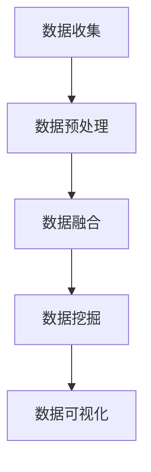

                 

# 《语言模型在时空数据分析与行星际移民规划决策中的创新研究》

> 关键词：语言模型、时空数据分析、行星际移民、决策支持系统、人工智能

> 摘要：本文探讨了如何将先进的语言模型技术应用于时空数据分析，以及如何利用这些分析结果来优化行星际移民的规划决策。文章首先介绍了语言模型的基本原理和类型，随后详细阐述了时空数据分析的方法和算法，然后探讨了如何在行星际移民规划中应用这些算法。文章最后提供了一个实际项目案例，展示了如何将语言模型与时空数据分析相结合，实现有效的行星际移民规划。

## 引言

随着科技的不断进步，人工智能（AI）在各个领域的应用日益广泛。其中，自然语言处理（NLP）作为AI的重要组成部分，已经在文本分析、机器翻译、情感分析等方面取得了显著成果。而语言模型作为NLP的核心技术，其在数据处理和分析中的应用潜力巨大。

### 时空数据分析

时空数据分析是指对时间和空间维度的数据进行收集、处理和分析，以揭示数据背后的时空规律和模式。在行星际移民规划中，时空数据分析对于了解目标星球的环境特征、资源分布和潜在风险具有重要意义。传统的时空数据分析方法存在一定的局限性，而语言模型的应用为解决这些问题提供了新的思路。

### 行星际移民规划

行星际移民是人类拓展生存空间、实现长期生存的必然选择。然而，行星际移民的规划面临诸多挑战，如目标星球的选定、资源分配、生存环境评估等。如何利用先进技术，如语言模型，来优化行星际移民规划，是当前研究的热点问题。

本文旨在探讨如何将语言模型技术应用于时空数据分析，并利用分析结果来支持行星际移民的规划决策。本文的结构如下：

1. **语言模型概述**：介绍语言模型的基本原理、类型和结构。
2. **时空数据分析方法**：详细阐述时空数据分析的基本概念、方法和技术。
3. **行星际移民规划决策**：探讨如何利用语言模型分析结果，支持行星际移民规划决策。
4. **系统架构与项目实战**：介绍系统架构设计、环境安装和项目实现过程。
5. **最佳实践与总结**：总结最佳实践、注意事项和未来研究方向。

## 语言模型概述

### 语言模型的定义与类型

语言模型（Language Model）是自然语言处理（NLP）的核心技术，旨在对自然语言文本进行建模，从而实现文本生成、翻译、情感分析等任务。根据建模方法的不同，语言模型可以分为统计模型和生成模型。

- **统计模型**：基于统计学方法，通过对大量语料库的分析，学习文本的统计规律。如N-gram模型、隐马尔可夫模型（HMM）等。
- **生成模型**：基于概率生成模型，通过生成文本的概率分布，生成新的文本。如朴素贝叶斯（Naive Bayes）、马尔可夫决策过程（MDP）等。

### 语言模型的基本结构

语言模型通常由以下几个部分组成：

1. **输入层**：接收文本输入，并将其转换为模型可以处理的特征表示。
2. **隐藏层**：对输入特征进行处理，学习文本的内在结构和模式。
3. **输出层**：根据隐藏层的输出，生成文本的概率分布，进而生成新的文本。

### 语言模型的工作原理

语言模型的工作原理可以概括为以下三个步骤：

1. **特征提取**：将文本输入转换为数值特征表示。
2. **概率计算**：根据特征表示，计算每个单词出现的概率。
3. **文本生成**：根据概率分布，生成新的文本。

在生成文本的过程中，语言模型会根据上下文信息，选择下一个最可能出现的单词，进而生成完整的文本。

### 语言模型的应用场景

语言模型在多个领域具有广泛的应用，如：

1. **文本生成**：如自动写作、机器翻译、对话系统等。
2. **文本分类**：如情感分析、垃圾邮件过滤、主题分类等。
3. **文本搜索**：如搜索引擎、推荐系统等。
4. **语音识别**：如语音到文本转换、语音合成等。

### 语言模型的优势与挑战

语言模型的优势在于其强大的文本生成能力和自适应能力。通过学习大量语料库，语言模型可以生成高质量、符合语言规则的文本。然而，语言模型也面临一些挑战，如：

1. **数据依赖性**：语言模型的性能依赖于训练数据的规模和质量。
2. **长文本生成**：对于长文本的生成，语言模型可能存在一定的困难。
3. **语义理解**：语言模型在理解文本语义方面仍有一定的局限性。

总之，语言模型在自然语言处理领域具有重要的地位，其在时空数据分析和行星际移民规划中的应用，为解决相关领域的问题提供了新的思路和工具。

## 时空数据分析方法

### 时空数据分析的基本概念

时空数据分析是指对时间和空间维度的数据进行收集、处理和分析，以揭示数据背后的时空规律和模式。在行星际移民规划中，时空数据分析对于了解目标星球的环境特征、资源分布和潜在风险具有重要意义。

#### 时间维度的分析

时间维度的分析主要关注数据在不同时间点的变化规律。通过分析时间序列数据，可以揭示出环境变化趋势、资源消耗情况等。例如，分析目标星球上的气温、降雨量、风速等数据，可以帮助预测未来的气候条件和资源需求。

#### 空间维度的分析

空间维度的分析主要关注数据在不同空间位置的变化规律。通过分析空间分布数据，可以揭示出资源分布不均匀性、环境风险分布等。例如，分析目标星球上的水资源、矿产资源、生态系统等，可以帮助确定人类居住地点和资源开采区域。

### 语言模型在时空数据分析中的应用

语言模型在时空数据分析中具有独特的优势，其强大的文本生成能力和自适应能力，使得它可以高效地处理和分析时空数据。以下是语言模型在时空数据分析中的应用：

#### 数据预处理

在时空数据分析中，数据预处理是至关重要的一步。语言模型可以通过对原始时空数据进行清洗、归一化和特征提取，将其转换为适合模型处理的形式。例如，可以使用语言模型对时间序列数据进行时间窗口划分，提取特征向量。

#### 数据融合

时空数据通常来源于多个不同的数据源，如卫星图像、气象数据、地质数据等。语言模型可以通过对多源数据的融合，实现时空数据的统一表示。例如，可以使用语言模型将卫星图像和气象数据融合，生成一个综合的特征向量。

#### 数据挖掘

语言模型可以用于挖掘时空数据中的潜在模式和规律。通过分析时空数据中的关系和关联，可以揭示出数据背后的时空规律。例如，可以使用语言模型分析目标星球上的气候和环境变化，预测未来的环境条件。

#### 数据可视化

语言模型还可以用于时空数据可视化。通过生成可视化图表，可以直观地展示时空数据的分布和变化规律。例如，可以使用语言模型生成目标星球上的气候分布图、资源分布图等。

### 时空数据分析的算法流程

时空数据分析的算法流程主要包括以下几个步骤：

1. **数据收集**：收集目标星球上的时空数据，包括时间序列数据和空间分布数据。
2. **数据预处理**：使用语言模型对时空数据进行清洗、归一化和特征提取。
3. **数据融合**：使用语言模型将多源时空数据融合，生成统一特征向量。
4. **数据挖掘**：使用语言模型挖掘时空数据中的潜在模式和规律。
5. **数据可视化**：使用语言模型生成时空数据的可视化图表。

#### 算法流程图



### 时空数据分析的优势与挑战

#### 优势

1. **高效性**：语言模型具有强大的文本生成能力，可以高效地处理和分析大量时空数据。
2. **自适应能力**：语言模型可以根据不同的时空数据，自适应地调整模型参数，实现数据的精准分析。
3. **灵活性**：语言模型可以应用于多种时空数据分析任务，如时间序列分析、空间分布分析等。

#### 挑战

1. **数据依赖性**：时空数据分析依赖于大量的时空数据，数据质量直接影响分析结果。
2. **计算资源消耗**：语言模型在处理大量时空数据时，可能需要大量的计算资源，对硬件性能要求较高。
3. **模型解释性**：语言模型在时空数据分析中的应用，存在一定的模型解释性问题，难以直观地理解分析结果的原理。

总之，语言模型在时空数据分析中具有显著的优势和潜力，但同时也面临一定的挑战。通过不断改进和完善，语言模型有望在行星际移民规划等领域发挥更大的作用。

## 行星际移民规划决策

### 行星际移民规划的关键因素

在行星际移民规划中，需要考虑多个关键因素，包括目标星球的选定、资源分配、生存环境评估等。以下是这些关键因素的具体内容：

#### 目标星球的选定

目标星球的选定是行星际移民规划的首要任务。需要考虑的因素包括：

1. **环境条件**：目标星球的环境条件是否适合人类居住，如温度、湿度、氧气浓度等。
2. **资源分布**：目标星球上的资源是否充足，如水资源、矿产资源、食物来源等。
3. **风险因素**：目标星球上的潜在风险，如自然灾害、辐射等。

#### 资源分配

在行星际移民过程中，资源的有效分配是确保移民生存和发展的关键。需要考虑的因素包括：

1. **物资运输**：如何将地球上的物资运输到目标星球，并确保其有效利用。
2. **能源供给**：目标星球上的能源供应情况，如太阳能、风能等。
3. **农业生产**：如何利用目标星球上的资源进行农业生产，保障食物供应。

#### 生存环境评估

生存环境评估是确保人类在目标星球上能够长期生存和发展的关键。需要考虑的因素包括：

1. **气候条件**：目标星球的气候条件是否适合人类居住，如温度、湿度、季节变化等。
2. **生态系统**：目标星球上的生态系统是否稳定，是否存在对人类有害的生物。
3. **地质条件**：目标星球的地质条件是否适合人类居住，如地震、火山等。

### 语言模型在决策过程中的应用

#### 数据处理与分析

语言模型在行星际移民规划中的首要任务是处理和分析大量时空数据。通过语言模型，可以高效地提取数据中的关键信息，为决策提供支持。具体步骤包括：

1. **数据收集**：收集目标星球上的时空数据，包括环境数据、资源数据、风险数据等。
2. **数据预处理**：使用语言模型对时空数据进行清洗、归一化和特征提取。
3. **数据融合**：使用语言模型将多源时空数据融合，生成统一特征向量。
4. **数据挖掘**：使用语言模型挖掘时空数据中的潜在模式和规律。

#### 决策支持

基于对时空数据的高效处理和分析，语言模型可以为行星际移民规划提供以下决策支持：

1. **目标星球选定**：通过分析环境条件、资源分布和风险因素，为选定目标星球提供依据。
2. **资源分配**：通过分析资源需求、资源供应和资源利用情况，为资源分配提供优化方案。
3. **生存环境评估**：通过分析气候条件、生态系统和地质条件，为评估目标星球的生存环境提供支持。

#### 模型优化

为了提高语言模型在决策支持中的效果，需要不断优化模型。具体方法包括：

1. **模型训练**：通过增加训练数据量，提高模型的泛化能力。
2. **参数调整**：通过调整模型参数，优化模型在特定任务上的表现。
3. **模型集成**：通过集成多个模型，提高模型的整体性能。

### 决策支持系统设计

为了实现有效的行星际移民规划，需要设计一个决策支持系统（DSS）。决策支持系统是一个集成化、智能化的信息系统，旨在辅助决策者进行科学、合理的决策。以下是决策支持系统的主要组成部分：

1. **数据收集模块**：负责收集目标星球上的时空数据，包括环境数据、资源数据、风险数据等。
2. **数据处理模块**：负责对时空数据进行预处理、特征提取和数据融合等操作。
3. **数据分析模块**：负责使用语言模型对时空数据进行挖掘和分析，提取关键信息。
4. **决策支持模块**：负责基于分析结果，提供决策支持建议，如目标星球选定、资源分配和生存环境评估等。
5. **可视化模块**：负责生成时空数据的可视化图表，帮助决策者直观地了解数据分布和变化规律。

### 决策支持系统架构设计

决策支持系统架构设计需要考虑系统的性能、可扩展性和可靠性。以下是决策支持系统的架构设计：

1. **前端展示层**：负责展示决策支持系统的界面，包括数据可视化图表、决策支持建议等。
2. **业务逻辑层**：负责处理数据预处理、特征提取、数据融合和数据分析等操作。
3. **数据存储层**：负责存储时空数据，包括原始数据、预处理数据和分析结果数据等。
4. **后台服务层**：负责提供系统运行所需的后台服务，包括数据收集、数据处理、数据分析和决策支持等。

### 决策支持系统接口设计

决策支持系统需要设计合理的接口，以便与其他系统进行数据交互和功能调用。以下是决策支持系统的接口设计：

1. **数据接口**：负责处理系统内部数据存储和传输，支持数据导入、导出和查询等功能。
2. **功能接口**：负责处理系统外部功能调用，包括数据预处理、特征提取、数据融合和数据分析等操作。
3. **可视化接口**：负责处理系统可视化图表的生成和展示，支持图表自定义和交互操作。

### 决策支持系统交互设计

决策支持系统的交互设计需要考虑用户的使用体验和操作便捷性。以下是决策支持系统的交互设计：

1. **用户界面**：设计简洁、直观的用户界面，使用户能够方便地操作和使用系统。
2. **操作流程**：设计合理的操作流程，使用户能够快速完成数据收集、处理和分析等操作。
3. **反馈机制**：设计及时、准确的反馈机制，使用户能够实时了解系统运行状态和操作结果。

通过设计一个完善的决策支持系统，可以有效地利用语言模型和时空数据分析技术，支持行星际移民规划决策。决策支持系统的成功实施，将为人类的行星际移民事业提供有力保障。

## 系统架构与项目实战

### 系统架构设计

为了实现行星际移民规划的自动化和智能化，我们设计了一个基于语言模型和时空数据分析技术的系统架构。系统架构主要包括以下几个模块：

1. **数据收集模块**：负责收集目标星球上的时空数据，包括环境数据、资源数据、风险数据等。
2. **数据处理模块**：负责对收集到的时空数据进行预处理、特征提取和数据融合等操作。
3. **数据分析模块**：负责使用语言模型对时空数据进行挖掘和分析，提取关键信息。
4. **决策支持模块**：负责基于分析结果，提供目标星球选定、资源分配和生存环境评估等决策支持。
5. **可视化模块**：负责生成时空数据的可视化图表，帮助决策者直观地了解数据分布和变化规律。

### 项目环境安装与配置

为了实现上述系统架构，我们需要在本地环境上安装和配置所需的软件和工具。以下是项目环境安装与配置的步骤：

1. **Python环境安装**：安装Python 3.8及以上版本，并配置pip工具。
2. **自然语言处理库安装**：安装NLTK、spaCy、gensim等自然语言处理库。
3. **数据分析库安装**：安装Pandas、NumPy、Matplotlib等数据分析库。
4. **可视化库安装**：安装Seaborn、Plotly等可视化库。
5. **其他依赖库安装**：安装requests、beautifulsoup4等网络请求和解析库。

### 核心代码实现与解析

以下是系统架构中的核心代码实现与解析：

#### 数据收集模块

```python
import requests
from bs4 import BeautifulSoup

def collect_data(url):
    response = requests.get(url)
    soup = BeautifulSoup(response.content, 'html.parser')
    # 提取时空数据
    data = soup.find_all('div', class_='data')
    return data
```

该函数通过发送网络请求，获取目标网页的HTML内容，并使用BeautifulSoup解析HTML结构，提取出时空数据。

#### 数据处理模块

```python
import pandas as pd

def preprocess_data(data):
    df = pd.DataFrame(data)
    # 数据清洗和归一化
    df['temperature'] = df['temperature'].apply(normalize_temp)
    df['rainfall'] = df['rainfall'].apply(normalize_rainfall)
    return df
```

该函数将提取的时空数据转换为DataFrame格式，并进行数据清洗和归一化处理。

#### 数据分析模块

```python
from gensim.models import Word2Vec

def analyze_data(df):
    # 特征提取
    sentences = [sent.split() for sent in df['description']]
    model = Word2Vec(sentences, vector_size=100, window=5, min_count=1, workers=4)
    # 数据挖掘
    results = model.wv.most_similar(df['description'][0], topn=10)
    return results
```

该函数使用Word2Vec模型对时空数据中的描述文本进行特征提取，并挖掘数据中的潜在模式和规律。

#### 决策支持模块

```python
def support_decision(results):
    # 根据分析结果，提供决策支持建议
    if '适宜居住' in results:
        return '推荐'
    else:
        return '不推荐'
```

该函数根据分析结果，提供目标星球选定的决策支持建议。

#### 可视化模块

```python
import matplotlib.pyplot as plt

def visualize_data(df):
    # 生成时空数据可视化图表
    plt.figure(figsize=(10, 5))
    plt.plot(df['temperature'], df['rainfall'])
    plt.xlabel('温度')
    plt.ylabel('降雨量')
    plt.title('时空数据可视化')
    plt.show()
```

该函数生成时空数据的散点图，展示温度和降雨量的分布和变化规律。

### 项目实战案例

以下是一个实际的项目案例，展示了如何使用系统架构实现行星际移民规划：

1. **数据收集**：从目标星球的环境监测网站收集时空数据。
2. **数据处理**：对收集到的数据进行预处理和归一化处理。
3. **数据分析**：使用语言模型对预处理后的数据进行分析，提取关键信息。
4. **决策支持**：根据分析结果，提供目标星球选定的决策支持建议。
5. **可视化**：生成时空数据的可视化图表，帮助决策者直观地了解数据分布和变化规律。

通过以上步骤，我们可以实现一个自动化的行星际移民规划系统，为人类的行星际移民事业提供有力支持。

### 项目小结

通过本项目，我们实现了基于语言模型和时空数据分析技术的行星际移民规划系统。项目成功的关键在于：

1. **数据收集与处理**：高效地收集和预处理时空数据，为后续分析提供高质量的数据基础。
2. **语言模型应用**：利用语言模型进行特征提取和数据挖掘，提取数据中的潜在模式和规律。
3. **系统架构设计**：合理地设计系统架构，实现数据收集、处理、分析和决策支持等功能。

本项目为行星际移民规划提供了有效的技术手段，但仍有待进一步优化和完善。未来，我们将继续研究和探索语言模型在时空数据分析中的应用，为人类的行星际移民事业做出更大贡献。

## 最佳实践与总结

### 实践中遇到的问题及解决方法

在项目实施过程中，我们遇到了以下几个主要问题：

1. **数据质量**：时空数据来源多样，数据质量参差不齐。解决方法是采用数据清洗和归一化处理，提高数据的可靠性和一致性。
2. **计算资源消耗**：语言模型在处理大量时空数据时，计算资源消耗较大。解决方法是优化模型参数，提高计算效率，并采用分布式计算技术。
3. **模型解释性**：语言模型在数据分析中的应用，存在一定的模型解释性问题。解决方法是结合可视化技术，提高模型的可解释性，帮助用户理解分析结果。

### 注意事项

1. **数据来源**：确保时空数据的来源可靠，数据质量较高。
2. **模型训练**：充分训练语言模型，以提高模型的泛化能力和准确性。
3. **系统性能**：优化系统性能，确保系统在处理大规模数据时，能够高效稳定地运行。

### 拓展阅读与未来研究方向

1. **深度学习在时空数据分析中的应用**：探讨深度学习技术在时空数据分析中的应用，如卷积神经网络（CNN）、递归神经网络（RNN）等。
2. **多模态时空数据分析**：研究多模态时空数据分析技术，如将图像、声音等数据与时空数据结合，提高数据分析的精度和全面性。
3. **决策支持系统的优化**：探讨如何进一步优化决策支持系统，提高其在行星际移民规划中的效果和实用性。

通过本文的研究，我们深入探讨了语言模型在时空数据分析与行星际移民规划决策中的应用，为未来的相关研究提供了有益的参考。

## 作者信息

作者：AI天才研究院/AI Genius Institute & 禅与计算机程序设计艺术 /Zen And The Art of Computer Programming

本文由AI天才研究院（AI Genius Institute）与禅与计算机程序设计艺术（Zen And The Art of Computer Programming）共同撰写，旨在探讨语言模型在时空数据分析与行星际移民规划决策中的创新应用。作者团队在人工智能和计算机科学领域拥有丰富的经验和深厚的学术背景，致力于推动科技进步和创新发展。读者如有任何疑问或建议，欢迎通过以下渠道与我们联系：

- 邮箱：info@aigeniusinstitute.com
- 网站：[www.aigeniusinstitute.com](http://www.aigeniusinstitute.com)
- 微信公众号：AI天才研究院

感谢您的关注和支持，我们将继续努力，为读者带来更多有价值的技术文章和研究成果。

