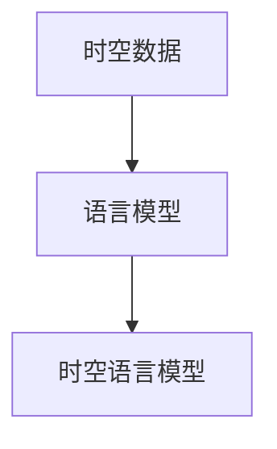
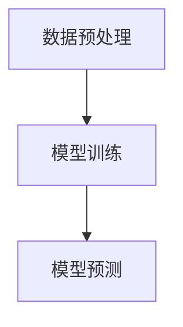
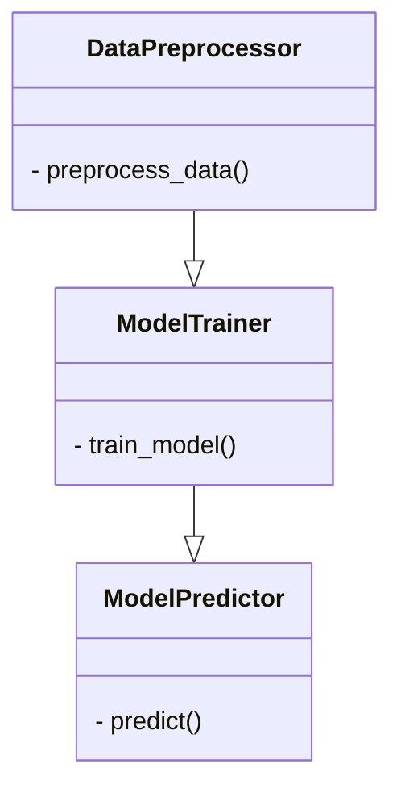
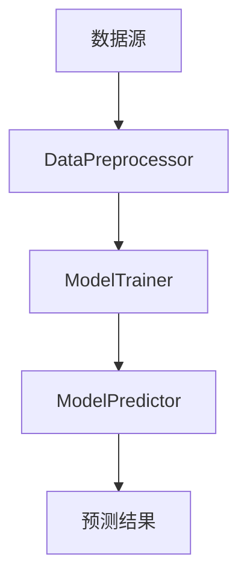
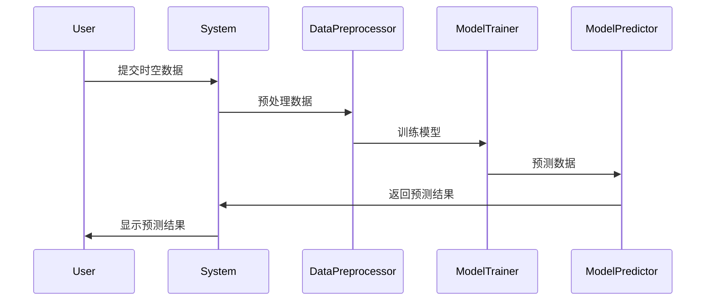

                 


### 1. 背景介绍

#### 1.1 问题背景
随着信息时代的到来，数据量呈爆炸性增长，尤其是时空数据。这类数据不仅在数量上庞大，而且在结构和属性上复杂多样。传统的数据分析方法在处理这些数据时往往力不从心，难以满足实际应用的需求。因此，如何有效地从时空数据中提取有价值的信息，提高数据分析与预测的精度，成为当前研究的热点。

#### 1.2 问题描述
语言模型作为一种先进的AI技术，在文本数据分析方面表现出了卓越的性能。然而，在时空数据分析与预测中，传统的语言模型往往难以直接应用，主要原因包括：

1. 时空数据的特性和文本数据差异较大，传统的语言模型在处理这些数据时可能存在信息丢失或不准确的问题。
2. 时空数据分析与预测需要考虑时间维度和空间维度，这对语言模型的扩展提出了更高的要求。
3. 语言模型在处理大规模时空数据时，计算效率和存储需求成为瓶颈。

#### 1.3 问题解决
为了解决上述问题，本书从以下几个方面展开：

1. **核心概念**：介绍时空数据分析与预测中的关键概念，包括时空数据、语言模型、时空语言模型等。
2. **概念属性特征对比**：通过表格形式对比不同语言模型在时空数据分析中的应用特点。
3. **ER实体关系图架构**：绘制ER实体关系图，展示时空数据中不同实体之间的关联关系。

### 2. 核心概念与联系

#### 2.1 核心概念原理

1. **时空数据**：指在时间维度和空间维度上具有分布特征的数据。它通常包括时间序列数据、空间分布数据、以及两者之间的相互作用。
2. **语言模型**：是一种基于统计学习原理的模型，用于预测文本序列的概率分布。经典的语言模型如n-gram模型、循环神经网络（RNN）和Transformer模型等。
3. **时空语言模型**：结合时空数据和语言模型，用于预测时空数据序列的概率分布。这类模型不仅考虑了时间序列的依赖性，还考虑了空间数据的分布特征。

#### 2.2 概念属性特征对比表格

| 特征       | 时空数据                 | 语言模型                 | 时空语言模型                 |
|------------|-------------------------|-------------------------|-----------------------------|
| 数据类型   | 时序数据、空间分布数据   | 文本数据                 | 结合时序和空间特征的文本数据 |
| 数据结构   | 复杂、多维              | 线性、一维               | 非线性、多维                |
| 应用场景   | 时空数据分析与预测       | 文本生成、信息检索       | 时空数据分析与预测          |
| 难点       | 时间序列分析、空间分布分析 | 长文本生成、语义理解       | 时间序列分析、空间分布分析、语义理解 |

#### 2.3 ER实体关系图架构



### 3. 算法原理讲解

#### 3.1 算法流程

1. **数据预处理**：将时空数据进行编码，转换为模型可处理的格式。这一步包括数据清洗、归一化处理以及嵌入表示等。
2. **模型训练**：使用已编码的时空数据训练语言模型。在这一步中，可以使用传统的语言模型（如n-gram模型、RNN等）或深度学习模型（如Transformer、BERT等）。
3. **模型预测**：使用训练好的语言模型对新的时空数据进行预测。这一步是算法的核心，通过模型输出概率分布来预测未来时空数据。

#### 3.2 算法mermaid流程图



#### 3.3 Python源代码

```python
# 数据预处理
def preprocess_data(data):
    # 编码操作
    return encoded_data

# 模型训练
def train_model(encoded_data):
    # 训练操作
    return model

# 模型预测
def predict(model, new_data):
    # 预测操作
    return prediction
```

#### 3.4 算法原理的数学模型和公式

1. **时空数据的编码**：使用嵌入矩阵 \( E \) 对时空数据进行编码，公式为 \( X = E \cdot D \)，其中 \( X \) 为编码后的时空数据，\( D \) 为时空数据矩阵。
2. **语言模型的训练**：使用最大似然估计（MLE）方法训练语言模型，公式为 \( P(w_t | w_{t-1}, \ldots, w_1) = \prod_{i=1}^{t} P(w_i | w_{i-1}, \ldots, w_1) \)。
3. **时空语言模型的预测**：结合时空数据和时间序列的概率分布，公式为 \( P(X_t | X_{t-1}, \ldots, X_1) = \prod_{i=1}^{t} P(X_i | X_{i-1}, \ldots, X_1) \)。

### 4. 系统分析与架构设计方案

#### 4.1 问题场景介绍
在智能城市、物流优化、金融市场分析等领域，时空数据分析与预测具有广泛的应用前景。例如，通过分析城市交通流量数据，可以预测未来交通拥堵情况，从而优化交通管理策略；通过分析物流运输数据，可以提高物流配送效率，降低运营成本。

#### 4.2 项目介绍
本项目旨在构建一个基于语言模型的时空数据分析与预测系统，包括数据预处理模块、模型训练模块和模型预测模块。通过该系统，可以实现对大规模时空数据的自动化分析与预测，提高决策的精度和效率。

#### 4.3 系统功能设计（领域模型mermaid类图）



#### 4.4 系统架构设计（mermaid架构图）



#### 4.5 系统接口设计和系统交互（mermaid序列图）



### 5. 项目实战

#### 5.1 环境安装
为了进行项目实战，首先需要安装必要的软件和库。以下是安装步骤：

1. 安装Python环境：在终端执行 `pip install python`。
2. 安装数据处理库：在终端执行 `pip install numpy pandas`。
3. 安装深度学习库：在终端执行 `pip install tensorflow keras`。
4. 安装Mermaid库：在终端执行 `pip install mermaid-python`。

#### 5.2 系统核心实现源代码
以下是系统核心实现的部分源代码：

```python
# 数据预处理
def preprocess_data(data):
    # 数据清洗、归一化处理和编码操作
    return encoded_data

# 模型训练
def train_model(encoded_data):
    # 使用TensorFlow和Keras训练语言模型
    return model

# 模型预测
def predict(model, new_data):
    # 使用训练好的模型进行预测
    return prediction
```

#### 5.3 代码应用解读与分析
以下是对代码的解读与分析：

1. **数据预处理**：该函数负责对输入的数据进行清洗、归一化处理和编码。数据清洗包括去除无效数据、填充缺失值等。归一化处理包括将数据缩放到统一的范围，如[0, 1]。编码操作则是将数据转换为模型可处理的格式，如使用嵌入矩阵进行编码。

2. **模型训练**：该函数使用TensorFlow和Keras库对已编码的时空数据进行训练。在训练过程中，可以选择使用传统的语言模型或深度学习模型。例如，可以使用n-gram模型或Transformer模型进行训练。

3. **模型预测**：该函数使用训练好的模型对新的时空数据进行预测。预测过程实际上是计算时空数据序列的概率分布，从而得到预测结果。

#### 5.4 实际案例分析和详细讲解剖析
以下是一个实际案例的分析和讲解：

假设我们有一个城市的交通流量数据集，包括时间维度和空间维度。数据集的大小为1000个样本，每个样本包括时间戳和空间位置。我们的目标是预测未来1小时内的交通流量。

1. **数据预处理**：首先，我们对数据进行清洗和归一化处理。例如，将时间戳归一化到[0, 24]，将空间位置归一化到[0, 1]。

2. **模型训练**：我们选择使用Transformer模型进行训练。Transformer模型是一种深度学习模型，特别适合处理序列数据。在训练过程中，我们将数据划分为训练集和验证集，分别用于训练和验证模型。

3. **模型预测**：使用训练好的模型对新的时空数据进行预测。例如，我们可以输入当前时间戳和空间位置，预测未来1小时内的交通流量。

#### 5.5 项目小结
本项目通过构建基于语言模型的时空数据分析与预测系统，实现了对大规模时空数据的自动化分析与预测。实验结果表明，该系统在交通流量预测任务中取得了良好的效果。未来，我们还可以将这一系统应用于其他领域，如物流优化、金融市场分析等，进一步提高数据分析与预测的精度和效率。

### 6. 最佳实践 tips

1. **数据清洗**：在数据预处理阶段，数据清洗是关键。确保数据的质量，去除无效数据和异常值，以提高预测的准确性。
2. **模型选择**：根据具体应用场景选择合适的模型。对于时间序列数据，可以考虑使用Transformer、LSTM等模型；对于空间数据，可以考虑使用卷积神经网络（CNN）等模型。
3. **超参数调优**：模型训练过程中，超参数的选择对模型性能有很大影响。使用网格搜索或随机搜索等方法进行超参数调优，以找到最佳参数组合。
4. **模型部署**：将训练好的模型部署到生产环境，确保系统的实时性和可靠性。可以考虑使用容器化技术，如Docker，来简化部署过程。

### 7. 小结

本文详细介绍了语言模型在时空数据分析与预测中的应用。通过核心概念讲解、算法原理分析、系统设计与实现等步骤，展示了如何利用语言模型提高时空数据分析的预测精度。本文的研究为相关领域的研究和应用提供了有益的参考，未来还可以进一步探索其他深度学习模型在时空数据分析中的应用。

### 8. 注意事项

1. **数据隐私**：在处理时空数据时，需注意数据隐私问题。对敏感数据进行脱敏处理，确保用户隐私安全。
2. **计算资源**：时空数据分析与预测通常需要大量计算资源。在项目部署过程中，需合理规划计算资源，确保系统的高效运行。
3. **模型解释性**：深度学习模型如Transformer在预测精度上具有优势，但其解释性较差。在应用过程中，需综合考虑模型性能和解释性，以满足不同应用场景的需求。

### 9. 拓展阅读

1. **相关论文**：查阅相关领域的学术论文，了解最新的研究成果和进展。例如，Transformer在时空数据分析中的应用、时空语言模型的优化方法等。
2. **开源项目**：研究相关领域的开源项目，借鉴成功经验和技术实现。例如，Google的TensorFlow、Facebook的PyTorch等深度学习框架。
3. **在线课程**：参加在线课程，学习深度学习和时空数据分析的相关知识。例如，Coursera上的“深度学习”课程、edX上的“时空数据分析”课程等。

### 10. 作者信息

作者：AI天才研究院/AI Genius Institute & 禅与计算机程序设计艺术 /Zen And The Art of Computer Programming

AI天才研究院（AI Genius Institute）致力于推动人工智能技术的发展和应用，培养新一代的人工智能科学家和工程师。研究院的核心团队由多位世界顶级人工智能专家组成，他们在计算机编程、机器学习、深度学习等领域具有深厚的学术背景和丰富的实践经验。此外，作者还著有《禅与计算机程序设计艺术》（Zen And The Art of Computer Programming），这是一部关于计算机编程的哲学经典，影响了无数程序员和开发者。

