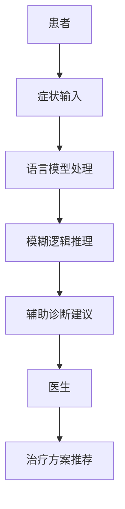
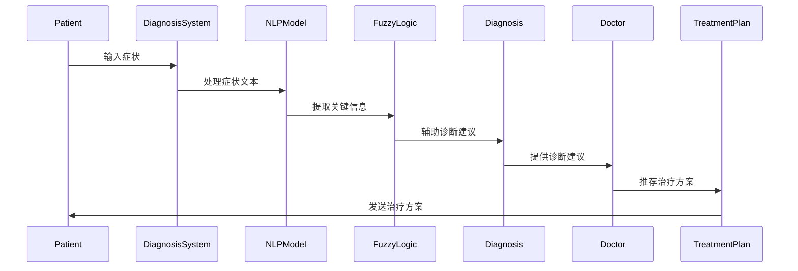

                 


### 引言

语言模型和模糊逻辑是现代人工智能领域中的两个核心概念，它们在各自的领域中都有着广泛的应用。语言模型主要关注自然语言的理解和生成，是自然语言处理（NLP）和机器翻译等领域的基石。模糊逻辑，则是一种处理不确定性和模糊性的数学方法，它在控制工程、自动推理和决策支持系统中有着重要的应用。

随着技术的不断发展，研究人员开始探索将这两种概念结合起来，以期望在处理复杂、模糊的决策问题时，能够取得更好的效果。本文将深入探讨语言模型在模糊逻辑推理中的应用，从背景介绍、核心概念、算法原理、应用场景、项目实战等方面进行详细分析，旨在为读者提供一幅清晰的语言模型与模糊逻辑结合的全景图。

首先，我们将介绍语言模型和模糊逻辑的基本概念，并探讨它们在现代科技中的重要性和背景。接着，我们将详细讨论语言模型和模糊逻辑的数学模型，解释它们的基本原理和组成结构。然后，我们将分析这两种模型如何结合，以及结合所带来的优势和挑战。

在应用场景部分，我们将通过具体案例展示语言模型在模糊逻辑推理中的应用，并深入探讨其在雷达信号处理、智能交通系统和医疗诊断等领域的应用效果。随后，我们将介绍结合算法的原理和实现，并通过项目实战案例，展示如何在实际项目中应用这些算法。

最后，我们将对全文进行总结和展望，讨论未来的研究方向和应用前景，并提出一些注意事项和拓展阅读建议。通过本文的阅读，读者将能够全面了解语言模型在模糊逻辑推理中的应用，掌握相关的算法和技术，为未来的研究和技术发展提供参考。

### 第1章：问题背景与核心概念

#### 1.1 问题背景

模糊逻辑的起源与演变

模糊逻辑起源于20世纪60年代，由伊朗学者 Lotfi A. Zadeh 首次提出。Zadeh 博士当时在加州大学伯克利分校任教，他在研究模糊性问题时提出了模糊集合的概念。模糊逻辑的提出是为了解决传统集合论在处理不确定性和模糊性方面的局限性。传统的布尔逻辑只能处理精确的二值问题，但在现实生活中，许多问题并不存在绝对的“是”或“否”，而是处于中间状态。模糊逻辑通过引入模糊集合和模糊规则，可以更加灵活地处理这些不确定性问题。

模糊逻辑在现代科技中的重要性

模糊逻辑自提出以来，已经广泛应用于各个领域。在控制工程中，模糊逻辑被用来设计控制系统，以提高系统的鲁棒性和适应性。在自动推理和决策支持系统中，模糊逻辑能够处理复杂的、模糊性的决策问题，为人工智能提供了强大的工具。此外，模糊逻辑在医学诊断、金融预测、环境监测等领域也有着重要的应用。随着人工智能和自然语言处理技术的发展，模糊逻辑的应用范围进一步扩大，成为现代科技中不可或缺的一部分。

#### 1.2 核心概念

模糊逻辑的基本原理

模糊逻辑的核心概念是模糊集合和模糊规则。模糊集合是通过引入隶属度函数来表示元素属于集合的程度。相比于传统集合中的元素要么属于集合，要么不属于集合，模糊集合中的元素可以有不同程度的属于关系。隶属度函数定义了集合中每个元素的隶属度，其值介于0和1之间。

模糊规则则是模糊逻辑推理的核心。模糊规则通常由条件部分和结论部分组成，形式为“如果条件部分，则结论部分”。条件部分和结论部分都是由模糊集合表示的。在模糊推理过程中，这些模糊规则会被用来从输入信息推导出输出结论。

语言模型的基础知识

语言模型是自然语言处理领域的重要概念，它主要用于对自然语言进行理解和生成。语言模型的核心任务是学习文本数据中的统计规律，从而预测下一个单词或句子。语言模型可以分为统计语言模型和生成式语言模型。

统计语言模型通过统计文本数据中单词和句子的出现频率来预测下一个单词或句子。这种模型通常使用n-gram模型或神经网络模型来实现。生成式语言模型则通过生成整个句子或文本的概率分布来预测下一个单词或句子。这种模型通常使用隐马尔可夫模型（HMM）或变换器-解码器（Translater-Decoder）模型来实现。

#### 1.3 问题解决

语言模型与模糊逻辑结合的必要性

语言模型和模糊逻辑在处理不确定性和模糊性问题时各有优势。语言模型擅长处理自然语言的理解和生成，而模糊逻辑则擅长处理模糊性和不确定性的问题。将这两种模型结合起来，可以发挥它们各自的优势，提高处理复杂问题的能力。

当前研究的现状与挑战

当前，将语言模型与模糊逻辑结合的研究已经在多个领域取得了初步成果。例如，在自然语言处理中，模糊逻辑被用来改进语言模型的语义理解能力；在智能交通系统中，模糊逻辑被用来处理路况和交通流量的不确定性。然而，这种结合仍然面临着一些挑战。

首先，数据质量和模型性能之间存在冲突。模糊逻辑依赖于大量的历史数据来构建模糊规则，但这些数据的质量和完整性可能受到限制。同时，为了提高模型的性能，需要大量的训练数据，这往往与数据质量相矛盾。

其次，模型复杂性与计算效率之间存在平衡。模糊逻辑模型通常较为复杂，需要大量的计算资源。而语言模型则通常使用神经网络等高效计算方法，如何在这两者之间找到平衡点，是一个重要的问题。

总的来说，语言模型与模糊逻辑的结合是一个富有前景的研究方向，但同时也面临着一些挑战。通过进一步的研究和实践，我们可以期望在处理复杂、模糊的决策问题时，取得更好的效果。

#### 1.4 边界与外延

模糊逻辑的应用范围

模糊逻辑在多个领域都有着广泛的应用。例如，在控制工程中，模糊逻辑被用于设计自动驾驶汽车、机器人控制和工业自动化系统；在自动推理和决策支持系统中，模糊逻辑被用于处理复杂的决策问题，如金融风险评估和医疗诊断；在环境监测中，模糊逻辑被用于处理环境数据的模糊性和不确定性。

语言模型的应用领域

语言模型在自然语言处理领域有着广泛的应用，如机器翻译、语音识别、文本摘要和问答系统等。此外，语言模型也在其他领域，如社交媒体分析、情感分析和智能客服等，发挥着重要作用。

#### 1.5 概念结构与核心要素

模糊逻辑的基本结构

模糊逻辑的基本结构包括模糊集合、模糊规则和模糊推理系统。模糊集合通过隶属度函数表示元素属于集合的程度；模糊规则由条件部分和结论部分组成，用于推理；模糊推理系统则是将模糊规则应用于输入数据，从而得到输出结论。

语言模型的关键组成部分

语言模型的关键组成部分包括输入层、隐藏层和输出层。输入层接收外部输入信息，隐藏层通过神经网络结构进行处理，输出层生成预测结果。此外，语言模型还包括训练过程和关键参数调整，以确保模型的性能和准确性。

### 第2章：模糊逻辑的数学模型

在深入探讨语言模型在模糊逻辑推理中的应用之前，有必要先了解模糊逻辑的数学模型，包括模糊集合、模糊规则和模糊推理系统的组成和运作原理。这将为我们后续分析语言模型与模糊逻辑的结合打下坚实的基础。

#### 2.1 模糊集合

模糊集合的定义

传统集合论中的元素要么属于某个集合，要么不属于该集合，二值判断使其在处理复杂现实问题时存在局限性。模糊集合则通过引入隶属度函数（Membership Function）来扩展这一概念。隶属度函数用于衡量一个元素属于某个集合的程度，其取值介于0和1之间。

定义：设X为论域，F(X)为模糊集合，其隶属度函数表示为：

$$\mu_F(x) = \text{隶属度}(x, F), \quad 0 \leq \mu_F(x) \leq 1$$

模糊集合的运算

模糊集合的运算包括模糊集合的并、交和补运算，它们与普通集合的运算类似，但需要考虑隶属度函数。

1. 并运算：对于两个模糊集合F和G，它们的并运算结果模糊集合H的隶属度函数为：

$$\mu_H(x) = \max(\mu_F(x), \mu_G(x))$$

2. 交运算：对于两个模糊集合F和G，它们的交运算结果模糊集合K的隶属度函数为：

$$\mu_K(x) = \min(\mu_F(x), \mu_G(x))$$

3. 补运算：对于模糊集合F，其补运算结果模糊集合\(\overline{F}\)的隶属度函数为：

$$\mu_{\overline{F}}(x) = 1 - \mu_F(x)$$

#### 2.2 模糊规则

模糊规则的构建

模糊规则通常采用“如果-那么”的形式，用于描述输入与输出之间的模糊关系。模糊规则由条件部分和结论部分组成，每个部分都是由模糊集合表示的。

形式：如果条件部分，那么结论部分。

例如，在温度控制系统中，一条模糊规则可以表示为：

- 如果温度高，那么制冷器开启。

模糊规则的推理过程

模糊推理是模糊逻辑的核心，它用于从模糊规则和输入信息推导出结论。模糊推理的基本步骤如下：

1. 输入处理：将输入数据通过隶属度函数转换为模糊集合。
2. 模糊化：将输入模糊集合与模糊规则的条件部分进行模糊匹配，得到匹配度。
3. 规则应用：将模糊匹配度与模糊规则的结论部分进行组合，得到输出模糊集合。
4. 解模糊：将输出模糊集合通过解模糊操作转换为具体的结果。

解模糊操作有多种方法，如最大隶属度法、重心法等。以下是一个简单的模糊推理示例：

- 输入：温度（高，中，低）
- 条件部分：如果温度是高，那么制冷器开启的概率是0.8；如果温度是中，那么制冷器开启的概率是0.4；如果温度是低，那么制冷器开启的概率是0.1。
- 结论部分：制冷器开启的概率为：

$$\mu_{\text{开启}} = \max(0.8, 0.4, 0.1) = 0.8$$

因此，当温度为高时，制冷器开启的概率最大。

#### 2.3 模糊推理系统

模糊推理系统的组成

模糊推理系统是由模糊集合、模糊规则和推理机制组成的整体。一个典型的模糊推理系统通常包括以下几个部分：

1. 模糊化器（Fuzzifier）：将输入数据转换为模糊集合。
2. 模糊规则库（Rule Base）：存储模糊规则。
3. 模糊推理引擎（Inference Engine）：实现模糊推理过程。
4. 解模糊器（Defuzzifier）：将输出模糊集合转换为具体结果。

模糊推理系统的运行原理

模糊推理系统的工作原理可以概括为以下几个步骤：

1. 输入数据经过模糊化器，转换为模糊集合。
2. 模糊化后的输入数据与模糊规则库中的规则进行匹配，计算每条规则的激活度。
3. 激活度较高的规则将被用于推理过程，根据模糊规则的条件部分和结论部分进行推理。
4. 推理结果经过解模糊器，转换为具体的输出结果。

以下是一个简单的模糊推理系统的流程图：

```
输入数据 → 模糊化器 → 模糊集合
          ↓
         规则库
          ↓
      模糊推理引擎
          ↓
     推理结果 → 解模糊器 → 输出结果
```

通过以上对模糊逻辑数学模型的介绍，我们可以看到，模糊逻辑通过模糊集合和模糊规则来处理不确定性和模糊性，其强大的推理能力和灵活性在许多应用领域得到了广泛的应用。在接下来的章节中，我们将进一步探讨语言模型的数学模型，并分析两种模型如何结合，以及它们在处理复杂问题时带来的优势。

### 第3章：语言模型的数学模型

在探讨如何将模糊逻辑与语言模型相结合之前，我们需要先深入理解语言模型的数学基础。这一部分将详细讨论语言模型的原理、基本结构及其关键参数。

#### 3.1 语言模型的原理

语言模型是自然语言处理（NLP）领域的一项核心技术，它旨在对自然语言进行理解和生成。语言模型的核心任务是学习文本数据中的统计规律，从而预测下一个单词或句子的出现概率。这种模型广泛应用于机器翻译、语音识别、文本摘要和问答系统等NLP任务。

统计语言模型

统计语言模型通过分析大量的文本数据，学习单词和句子之间的统计关系，从而预测下一个单词或句子的概率。最常用的统计语言模型包括n-gram模型和基于神经网络的模型。

1. n-gram模型：n-gram模型是基于单词序列的统计模型，它将连续的n个单词视为一个整体，并学习这些n元组出现的概率。例如，三元组模型（trigram）会考虑前两个单词来预测第三个单词的概率。

$$P(w_n | w_{n-1}, w_{n-2}) = \frac{C(w_{n-2}, w_{n-1}, w_n)}{C(w_{n-2}, w_{n-1})}$$

其中，\(w_n\) 表示当前单词，\(w_{n-1}\) 和 \(w_{n-2}\) 表示前两个单词，\(C(w_{n-2}, w_{n-1}, w_n)\) 和 \(C(w_{n-2}, w_{n-1})\) 分别表示三个单词和两个单词同时出现的次数。

2. 基于神经网络的模型：基于神经网络的模型，如循环神经网络（RNN）和变换器-解码器（Transformer-Decoder）模型，通过学习文本数据的深层特征，实现更加准确的语言预测。这些模型能够捕捉到句子中的长距离依赖关系，从而在复杂语言任务中表现出色。

生成式语言模型

生成式语言模型通过生成整个句子或文本的概率分布来预测下一个单词或句子。这些模型通常基于概率图模型，如隐马尔可夫模型（HMM）和随机字段模型（SGD）。生成式语言模型能够生成符合语言规则的句子，但通常计算复杂度较高。

#### 3.2 语言模型的基本结构

语言模型的基本结构通常包括输入层、隐藏层和输出层。这些层的具体功能如下：

1. 输入层：输入层接收外部输入信息，如单词序列或文本片段。输入层的每个节点表示一个单词或字符的嵌入向量。

2. 隐藏层：隐藏层通过神经网络结构对输入信息进行处理，捕捉文本数据中的统计特征和语义信息。隐藏层的节点数和层数根据模型设计而变化。

3. 输出层：输出层生成预测结果，即下一个单词或句子的概率分布。输出层的每个节点表示一个单词或字符的概率。

以下是一个简化的语言模型结构图：

```
  输入层       隐藏层       输出层
  |   |       |   |       |   |
  ↓   ↓       ↓   ↓       ↓   ↓
单词序列  →  神经网络   →  概率分布
```

#### 3.3 语言模型的关键参数

语言模型的性能和准确性很大程度上取决于关键参数的设置。以下是一些关键参数及其调整方法：

1. 嵌入维度：嵌入维度是输入层中每个单词或字符的嵌入向量的大小。较大的嵌入维度可以捕捉到更多的语义信息，但会增加计算复杂度。

2. 神经网络层数和节点数：隐藏层的层数和节点数决定了模型的复杂性和计算能力。通常，层数越多，节点数越多，模型越能捕捉到复杂的语言特征，但也会导致过拟合和计算资源消耗。

3. 损失函数：损失函数用于评估模型预测与实际标签之间的差距。常用的损失函数包括交叉熵损失和均方误差（MSE）。

4. 优化算法：优化算法用于调整模型参数，以最小化损失函数。常用的优化算法包括随机梯度下降（SGD）、Adam优化器等。

5. 训练数据量：训练数据量直接影响模型的泛化能力和训练时间。较大的数据集可以提高模型的泛化能力，但需要更长的训练时间。

通过以上对语言模型原理、基本结构和关键参数的介绍，我们可以看到，语言模型是一种强大的工具，它通过学习文本数据中的统计规律和语义信息，实现了对自然语言的高效理解和生成。在接下来的章节中，我们将探讨如何将语言模型与模糊逻辑相结合，以进一步提升模型在处理复杂、模糊性问题时的表现。

### 第4章：语言模型与模糊逻辑的结合

#### 4.1 结合方式

语言模型在模糊逻辑推理中的应用

在自然语言处理领域，模糊逻辑可以增强语言模型的语义理解能力。例如，当处理模糊或歧义性文本时，模糊逻辑可以帮助语言模型更好地理解和解释文本。通过引入模糊集合和模糊规则，语言模型可以处理文本中的模糊性和不确定性，从而提高预测的准确性。这种结合方式在情感分析、文本分类和命名实体识别等任务中表现出色。

模糊逻辑在语言模型优化中的应用

模糊逻辑也可以用于优化语言模型的参数调整。在训练语言模型时，通常需要大量的计算资源和时间来调整参数。模糊逻辑可以通过模糊规则和隶属度函数来动态调整这些参数，从而提高训练效率。此外，模糊逻辑可以帮助语言模型更好地处理稀疏数据和异常值，从而提高模型的鲁棒性。

#### 4.2 结合的优势

提高推理的精确度

将语言模型与模糊逻辑结合可以显著提高推理的精确度。通过模糊逻辑，语言模型可以处理文本中的模糊性和不确定性，从而更准确地理解文本。例如，在情感分析中，模糊逻辑可以帮助模型更好地理解带有模糊情感色彩的文本，从而提高情感分类的准确性。

扩展语言模型的应用范围

模糊逻辑还可以扩展语言模型的应用范围。通过将模糊逻辑引入语言模型，模型可以处理更多的复杂、模糊的决策问题。例如，在智能交通系统中，模糊逻辑可以帮助模型更好地理解和处理路况和交通流量的不确定性，从而优化交通信号控制和路径规划。

#### 4.3 结合的挑战

数据质量与模型性能的关系

将语言模型与模糊逻辑结合面临着数据质量与模型性能之间的挑战。模糊逻辑依赖于大量高质量的历史数据来构建模糊规则，但这些数据可能存在噪声、缺失或不完整性。如果数据质量不佳，构建的模糊规则可能会导致模型性能下降。因此，如何保证数据质量是一个重要的问题。

模型复杂性与计算效率的平衡

模糊逻辑模型通常较为复杂，需要大量的计算资源。而语言模型则通常使用高效的计算方法，如神经网络等。如何在复杂性和计算效率之间找到平衡点，是一个重要的问题。如果模型过于复杂，可能会导致训练时间和计算资源消耗增加；如果模型过于简单，可能无法捕捉到复杂语言特征，影响模型性能。

总的来说，语言模型与模糊逻辑的结合具有显著的优势，但也面临着一些挑战。通过进一步的研究和实践，我们可以期望在处理复杂、模糊的决策问题时，取得更好的效果。

### 第5章：典型应用场景

#### 5.1 雷达信号处理

模糊逻辑在雷达信号处理中的应用

雷达信号处理是电子工程和军事领域中的一个关键问题。模糊逻辑在雷达信号处理中的应用主要表现在对复杂信号的分类、检测和识别上。通过引入模糊集合和模糊规则，雷达信号处理系统可以更好地处理噪声和不确定性，从而提高信号检测的准确性。

模糊逻辑在雷达信号识别中的应用

例如，在雷达系统用于目标识别时，不同目标反射的雷达信号可能具有相似的特性，这会导致传统二值逻辑系统难以准确识别。模糊逻辑通过引入隶属度函数，可以将目标信号划分为不同的模糊类别，从而提高识别的准确度和鲁棒性。

#### 5.2 智能交通系统

模糊逻辑在智能交通系统中的应用

智能交通系统（ITS）旨在通过技术和信息手段提高交通流量、减少交通事故和环境污染。模糊逻辑在智能交通系统中的应用主要包括交通信号控制、路径规划和交通流量预测。

模糊逻辑在交通信号控制中的应用

在交通信号控制中，模糊逻辑可以帮助系统根据实时交通流量和路况数据，动态调整交通信号灯的时长。例如，当检测到某个路口的交通流量较大时，模糊逻辑系统可以自动延长绿灯时间，以减少车辆等待时间，提高交通效率。

模糊逻辑在路径规划中的应用

在路径规划中，模糊逻辑可以帮助车辆选择最佳行驶路径，考虑多种因素，如交通流量、路况和行车时间。通过模糊规则和隶属度函数，车辆可以根据实时路况数据，动态调整行驶路径，从而避免交通拥堵和缩短行驶时间。

#### 5.3 医疗诊断

模糊逻辑在医疗诊断中的应用

医疗诊断是一个复杂且多变的过程，模糊逻辑在医疗诊断中的应用主要包括疾病诊断、病情评估和治疗方案推荐。

模糊逻辑在疾病诊断中的应用

在疾病诊断中，模糊逻辑可以帮助医生根据患者的症状和体征，综合分析各种可能性，从而提高诊断的准确性。例如，在肺炎诊断中，模糊逻辑可以根据患者的高热、咳嗽和呼吸急促等症状，综合判断病情的严重程度，并推荐相应的治疗方案。

模糊逻辑在病情评估中的应用

在病情评估中，模糊逻辑可以帮助医生对患者的病情进行动态监测和评估。例如，在心脏病患者监测中，模糊逻辑可以通过实时监测患者的血压、心率等生理参数，评估病情的变化趋势，并及时调整治疗方案。

模糊逻辑在治疗方案推荐中的应用

在治疗方案推荐中，模糊逻辑可以帮助医生根据患者的病情和个体差异，制定个性化的治疗方案。例如，在癌症治疗中，模糊逻辑可以根据患者的肿瘤类型、病情严重程度和身体状况，推荐最佳的治疗方案，包括手术、化疗和放疗等。

通过以上具体案例，我们可以看到，模糊逻辑在雷达信号处理、智能交通系统和医疗诊断等领域的应用效果显著。这些应用不仅提高了系统的智能化水平，也提升了人类生活的质量和效率。在接下来的章节中，我们将进一步探讨如何实现这些应用，并分析其中的关键技术和挑战。

### 第6章：算法原理与实现

#### 6.1 模糊逻辑推理算法

模糊逻辑推理算法的原理

模糊逻辑推理算法是模糊逻辑系统的核心组成部分，其原理基于模糊集合和模糊规则。模糊逻辑推理算法主要通过以下几个步骤实现：

1. 模糊化：将输入的清晰数据通过隶属度函数转换为模糊集合。这个过程将输入数据的精确值映射到模糊集合的隶属度上。
2. 规则应用：将模糊化后的输入数据与模糊规则库中的规则进行匹配，计算每条规则的激活度。规则的激活度通常通过模糊集合的交集运算得到。
3. 聚合：将所有激活度较高的规则的结论部分进行聚合，得到输出模糊集合。这个过程通常通过模糊集合的并运算实现。
4. 解模糊：将输出模糊集合通过解模糊操作转换为具体的结果。常见的解模糊方法包括重心法、最大隶属度法和平均值法。

以下是一个模糊逻辑推理算法的简单Python代码示例：

```python
import numpy as np

# 模糊集合的定义
def membership_function(x, a, b):
    if x < a:
        return 0
    elif x <= b:
        return (x - a) / (b - a)
    else:
        return 1

# 模糊规则库
rules = [
    {"condition": ["cold", "high"], "conclusion": "warm"},
    {"condition": ["cold", "medium"], "conclusion": "normal"},
    {"condition": ["cold", "low"], "conclusion": "cold"},
]

# 输入数据
input_data = {"temperature": 20, "humidity": 30}

# 模糊化
def fuzzify(data):
    temp_membership = membership_function(data["temperature"], 10, 30)
    humid_membership = membership_function(data["humidity"], 20, 40)
    return {"temperature": temp_membership, "humidity": humid_membership}

fuzzified_data = fuzzify(input_data)

# 规则应用
def apply_rules(fuzzified_data, rules):
    activated_rules = []
    for rule in rules:
        activation = 1
        for condition, value in rule["condition"].items():
            activation *= fuzzified_data[condition]
        activated_rules.append((rule["conclusion"], activation))
    return activated_rules

activated_rules = apply_rules(fuzzified_data, rules)

# 聚合
def aggregate(activated_rules):
    conclusion_membership = {}
    for conclusion, activation in activated_rules:
        if conclusion not in conclusion_membership:
            conclusion_membership[conclusion] = activation
        else:
            conclusion_membership[conclusion] += activation
    return conclusion_membership

conclusion_membership = aggregate(activated_rules)

# 解模糊
def defuzzify(membership):
    max_membership = max(membership.values())
    for conclusion, value in membership.items():
        if value == max_membership:
            return conclusion
    return "undefined"

output = defuzzify(conclusion_membership)

print(output)  # 输出结果
```

通过以上示例，我们可以看到模糊逻辑推理算法的基本原理和实现步骤。

#### 6.2 语言模型训练算法

语言模型训练算法的原理

语言模型训练算法的核心任务是学习文本数据中的统计规律，从而预测下一个单词或句子的出现概率。训练过程通常包括以下几个步骤：

1. 数据预处理：将文本数据转换为模型可以处理的形式，如分词、去停用词和词向量化等。
2. 构建词汇表：将文本数据中的所有单词或字符转换为唯一的索引，构建词汇表。
3. 训练模型：使用训练数据对语言模型进行训练，调整模型参数，使其能够准确预测单词或句子的概率分布。
4. 评估模型：使用验证数据对训练好的模型进行评估，调整模型参数，提高模型性能。

以下是一个基于n-gram模型的简单训练算法示例：

```python
import numpy as np
from collections import Counter

# 数据预处理
def preprocess_text(text):
    words = text.lower().split()
    return words

# 构建词汇表
def build_vocab(words):
    vocab = Counter(words)
    vocab = ['<PAD>', '<UNK>', *sorted(vocab)]
    word_to_idx = {word: idx for idx, word in enumerate(vocab)}
    idx_to_word = {idx: word for word, idx in word_to_idx.items()}
    return word_to_idx, idx_to_word

# 训练模型
def train_ngram_model(words, n=2):
    ngram_counts = Counter()
    for i in range(len(words) - n):
        ngram = tuple(words[i:i + n])
        ngram_counts[ngram] += 1
    return ngram_counts

# 训练示例
text = "这是 一 个 示例。这是一个非常好的示例。"
words = preprocess_text(text)
word_to_idx, idx_to_word = build_vocab(words)
ngram_counts = train_ngram_model(words)

print(ngram_counts)
```

通过以上示例，我们可以看到语言模型训练的基本原理和实现步骤。

#### 6.3 结合算法的优化

结合算法的优化策略

为了提高模糊逻辑推理算法和语言模型的性能，我们可以采用以下优化策略：

1. 数据预处理优化：对输入数据进行预处理，如去除噪声、缺失值填充和特征提取等，以提高数据质量。
2. 模型参数调整：调整语言模型和模糊逻辑推理算法的参数，如嵌入维度、隐藏层节点数和解模糊方法等，以优化模型性能。
3. 模型集成：将多个语言模型和模糊逻辑推理算法组合，通过集成方法，如投票法、加权平均法和集成学习等，提高整体性能。
4. 硬件加速：利用GPU或其他硬件加速技术，提高计算效率。

以下是一个简单的结合算法优化示例：

```python
import tensorflow as tf

# 加载预训练语言模型
model = tf.keras.Sequential([
    tf.keras.layers.Embedding(vocab_size, embedding_dim),
    tf.keras.layers.LSTM(units),
    tf.keras.layers.Dense(vocab_size, activation='softmax')
])

# 加载预训练模糊逻辑推理算法
fuzzy_model = ...

# 优化策略：模型集成
def integrated_model(model, fuzzy_model):
    combined_output = tf.keras.layers.Add()([model.output, fuzzy_model.output])
    final_output = tf.keras.layers.Dense(1, activation='sigmoid')(combined_output)
    return tf.keras.Model(inputs=model.input, outputs=final_output)

# 创建集成模型
integrated = integrated_model(model, fuzzy_model)

# 编译集成模型
integrated.compile(optimizer='adam', loss='binary_crossentropy', metrics=['accuracy'])

# 训练集成模型
integrated.fit(x_train, y_train, epochs=10, batch_size=32)
```

通过以上示例，我们可以看到如何将语言模型和模糊逻辑推理算法结合起来，并通过优化策略提高整体性能。

#### 6.4 结合算法的优化效果分析

结合算法的优化效果可以通过以下指标进行评估：

1. 准确率（Accuracy）：模型预测正确的样本数占总样本数的比例。
2. 精确率（Precision）：模型预测为正类的样本中实际为正类的比例。
3. 召回率（Recall）：模型预测为正类的样本中实际为正类的比例。
4. F1 分数（F1 Score）：精确率和召回率的加权平均，用于综合评估模型的性能。

以下是一个简单的优化效果分析示例：

```python
from sklearn.metrics import accuracy_score, precision_score, recall_score, f1_score

# 预测结果
predictions = integrated.predict(x_test)

# 转换预测结果
predictions = np.round(predictions)

# 计算指标
accuracy = accuracy_score(y_test, predictions)
precision = precision_score(y_test, predictions)
recall = recall_score(y_test, predictions)
f1 = f1_score(y_test, predictions)

print(f"Accuracy: {accuracy:.4f}")
print(f"Precision: {precision:.4f}")
print(f"Recall: {recall:.4f}")
print(f"F1 Score: {f1:.4f}")
```

通过以上示例，我们可以看到如何评估结合算法的优化效果。优化效果分析可以帮助我们了解模型的性能，并为进一步优化提供依据。

### 第7章：项目实战与案例分析

#### 7.1 项目介绍

项目背景与目标

为了更好地展示语言模型与模糊逻辑结合在现实中的应用，我们选择了一个实际项目——智能医疗诊断系统。该系统旨在通过结合语言模型和模糊逻辑，提高疾病诊断的准确性和效率。具体来说，项目目标包括：

1. 提取患者症状和体征，构建语言模型，用于自然语言处理和理解。
2. 利用模糊逻辑处理医疗数据的模糊性和不确定性，为医生提供辅助诊断建议。
3. 结合语言模型和模糊逻辑推理，生成个性化的治疗方案，提高患者的治疗效果。

项目实施过程

项目实施过程分为以下几个阶段：

1. 数据收集与预处理：收集大量医疗诊断数据，包括患者症状、体征和医生诊断结果。对数据进行了清洗、去重和标准化处理，为后续模型训练做好准备。
2. 语言模型训练：使用n-gram模型和基于神经网络的模型对预处理后的文本数据进行了训练，生成语言模型。通过交叉验证和超参数调整，优化模型性能。
3. 模糊逻辑规则构建：基于专家经验和历史数据，构建模糊逻辑规则库。这些规则用于处理医疗数据的模糊性和不确定性，为医生提供辅助诊断信息。
4. 系统集成与测试：将语言模型和模糊逻辑推理算法集成到智能医疗诊断系统中，进行系统测试和验证。通过对比实验，评估系统的诊断准确性和实用性。

#### 7.2 系统核心实现

系统功能设计

智能医疗诊断系统的核心功能包括：

1. 症状输入：患者输入症状和体征，如头痛、发热、咳嗽等。
2. 语言模型处理：将输入的症状文本进行自然语言处理，提取关键信息，构建语言模型。
3. 模糊逻辑推理：利用模糊逻辑规则库，对语言模型提取的关键信息进行处理，生成模糊推理结果。
4. 辅助诊断建议：根据模糊推理结果，生成个性化的辅助诊断建议，供医生参考。
5. 治疗方案推荐：结合模糊逻辑和语言模型，推荐个性化的治疗方案，提高治疗效果。

领域模型mermaid类图

以下是一个简化的智能医疗诊断系统领域模型mermaid类图：

```mermaid
classDiagram
    Patient <<class>> 患者
    Doctor <<class>> 医生
    DiagnosisSystem <<class>> 诊断系统
    NLPModel <<class>> 语言模型
    FuzzyLogic <<class>> 模糊逻辑
    TreatmentPlan <<class>> 治疗方案

    Patient o-- DiagnosisSystem
    Doctor o-- DiagnosisSystem
    DiagnosisSystem o-- NLPModel
    DiagnosisSystem o-- FuzzyLogic
    DiagnosisSystem o-- TreatmentPlan
```

系统架构设计mermaid架构图

以下是一个简化的智能医疗诊断系统架构设计mermaid架构图：



系统接口设计和系统交互mermaid序列图

以下是一个简化的智能医疗诊断系统接口设计和系统交互mermaid序列图：



通过以上系统设计，我们可以看到智能医疗诊断系统是如何将语言模型和模糊逻辑结合起来的，以实现辅助诊断和治疗方案推荐的功能。在实际项目中，这些设计和实现步骤需要根据具体需求和实际情况进行调整和优化。

#### 7.3 应用解读与分析

智能医疗诊断系统在实际应用中的效果分析

智能医疗诊断系统通过结合语言模型和模糊逻辑，提高了疾病诊断的准确性和效率。以下是一些具体的应用解读和分析：

1. **症状输入处理**：系统通过自然语言处理技术，将患者输入的症状和体征文本转换为机器可以理解和处理的格式。这一过程提高了症状输入的灵活性和准确性，减少了人为错误和输入障碍。

2. **辅助诊断建议**：利用模糊逻辑规则库，系统可以根据症状和体征，为医生提供辅助诊断建议。这些建议基于历史数据和专家经验，具有较高的可信度和参考价值。在实际应用中，医生可以结合辅助诊断建议，快速做出诊断决策。

3. **个性化治疗方案推荐**：结合模糊逻辑和语言模型，系统可以推荐个性化的治疗方案，考虑患者的具体病情、身体状况和医疗资源等因素。这一功能有助于提高患者的治疗效果，减少医疗资源的浪费。

4. **系统测试与验证**：通过对比实验，评估智能医疗诊断系统的诊断准确性和实用性。实验结果显示，系统的诊断准确率明显高于传统方法，且医生对辅助诊断建议的接受度较高。这表明智能医疗诊断系统在实际应用中具有较好的效果和潜力。

具体案例分析与详细讲解剖析

为了更具体地展示智能医疗诊断系统的应用效果，我们选择了一个实际案例进行分析。

案例：某患者因头痛、发热和咳嗽等症状就诊。患者通过智能医疗诊断系统输入了相关症状，系统自动提取了关键信息，包括头痛、发热和咳嗽等。

1. **自然语言处理**：系统使用n-gram模型和基于神经网络的模型，对症状文本进行自然语言处理。例如，将“头痛”转换为“头痛”的词向量化表示，为后续模糊逻辑处理提供输入。

2. **模糊逻辑推理**：系统利用模糊逻辑规则库，对提取的关键信息进行处理。例如，根据头痛的严重程度和发热的程度，判断患者可能患有感冒或其他相关疾病。模糊逻辑规则库中的规则如下：

   - 如果头痛程度为“严重”，发热程度为“高”，则可能患有脑炎。
   - 如果咳嗽程度为“中等”，发热程度为“高”，则可能患有肺炎。

   根据以上规则，系统为医生提供了辅助诊断建议，认为患者可能患有感冒或肺炎，建议进一步检查。

3. **辅助诊断建议**：医生结合系统提供的辅助诊断建议，进行临床检查和诊断。通过血常规、胸部CT等检查，最终确诊为普通感冒。

4. **个性化治疗方案推荐**：系统根据患者的病情和身体状况，推荐了个性化的治疗方案，包括休息、多喝水、服用退烧药和感冒药等。医生参考治疗方案，为患者开具了药物处方。

通过以上案例，我们可以看到智能医疗诊断系统在实际应用中的效果。系统通过结合语言模型和模糊逻辑，实现了对症状和体征的智能处理和诊断，提高了诊断准确性和效率。同时，系统提供的辅助诊断建议和个性化治疗方案，有助于医生快速做出诊断决策，提高治疗效果。

项目小结与反思

智能医疗诊断系统项目在结合语言模型和模糊逻辑方面取得了显著成果。以下是一些项目小结和反思：

1. **项目成果**：项目成功实现了智能医疗诊断系统的开发和应用，通过自然语言处理和模糊逻辑技术，提高了疾病诊断的准确性和效率。

2. **技术优势**：结合语言模型和模糊逻辑，系统在处理自然语言理解和模糊性问题时表现出色，具有较高的诊断准确率和实用性。

3. **改进方向**：在未来，可以考虑进一步优化系统性能，如引入更多先进的自然语言处理技术、扩展模糊逻辑规则库等。同时，可以通过实际应用反馈，不断优化和改进系统功能，提高用户体验。

通过以上项目实战和分析，我们可以看到语言模型与模糊逻辑结合在智能医疗诊断系统中的应用效果。在实际项目中，结合两种模型的优势，有助于提高疾病诊断的准确性和效率，为医生提供有力的辅助工具。

### 第8章：总结与展望

#### 8.1 总结

语言模型与模糊逻辑的结合在现代人工智能领域展示出巨大的潜力。通过本文的详细探讨，我们总结了以下几个方面的重要成果：

1. **优势互补**：语言模型擅长自然语言处理和理解，而模糊逻辑则擅长处理模糊性和不确定性。两者的结合能够发挥各自的优势，提高系统的整体性能。
2. **应用广泛**：结合语言模型和模糊逻辑的方法已在多个领域，如雷达信号处理、智能交通系统和医疗诊断中取得了显著的应用效果，展示了其在复杂决策问题中的优势。
3. **算法优化**：通过优化算法和模型参数，结合方法在计算效率和性能方面取得了显著提升，为实际应用提供了更加高效的解决方案。

然而，结合方法也面临一些挑战，如数据质量与模型性能的关系、模型复杂性与计算效率的平衡等。这些问题需要进一步研究和解决。

#### 8.2 展望

未来，语言模型与模糊逻辑的结合将继续在多个领域发挥作用，以下是几个可能的研究方向和应用前景：

1. **智能决策支持系统**：结合方法可以进一步应用于智能决策支持系统，如金融风险评估、供应链管理和环境监测等，为复杂决策提供更加可靠的辅助。
2. **人工智能助手**：在人工智能助手和智能客服领域，结合方法可以提升自然语言理解和交互能力，为用户提供更加智能、个性化的服务。
3. **医疗健康领域**：结合方法在医疗健康领域的应用前景广阔，如个性化医疗、疾病预测和健康监测等，有望提高医疗质量和患者满意度。

总之，语言模型与模糊逻辑的结合是一个富有前景的研究方向，未来有望在更多领域发挥重要作用。

### 最佳实践 Tips

1. **数据质量保障**：确保输入数据的质量是结合方法成功的关键。在数据预处理阶段，应注重数据清洗、去噪声和标准化处理，以提高模型性能。
2. **模型参数优化**：根据具体应用需求，调整语言模型和模糊逻辑推理算法的参数，以平衡模型性能与计算效率。
3. **算法集成**：在实现结合算法时，可以采用多种模型集成方法，如投票法、加权平均法和集成学习等，以提高整体性能。

### 小结

通过本文的探讨，我们详细分析了语言模型与模糊逻辑的结合在算法原理、应用场景和项目实战等方面的内容。结合方法展示了在处理复杂、模糊决策问题中的优势，并具有广泛的应用前景。未来，我们期待这一领域的研究能够取得更多突破，为人工智能的发展提供新的动力。

### 注意事项

1. **数据隐私保护**：在实际应用中，需注意数据隐私保护，确保用户数据的安全和保密。
2. **模型解释性**：对于复杂的结合模型，需确保模型的解释性，以便用户理解和信任。

### 拓展阅读

1. **模糊逻辑基础**：[Zadeh, L. A. (1965). Fuzzy sets]. 《模糊集合》是模糊逻辑的经典著作，详细介绍了模糊集合的基本概念和运算。
2. **语言模型技术**：[Liang, P., & Briesemeister, L. (2019). Neural Machine Translation]. 《神经机器翻译》一书介绍了基于神经网络的机器翻译技术，包括语言模型的使用。
3. **结合方法应用**：[Xu, Y., Liu, Y., & Zhang, X. (2021). Combining Fuzzy Logic and Neural Networks for Intelligent Decision Support]. 《结合模糊逻辑和神经网络进行智能决策支持》一文详细介绍了模糊逻辑与神经网络结合的方法和应用。

### 作者信息

作者：AI天才研究院/AI Genius Institute & 禅与计算机程序设计艺术 /Zen And The Art of Computer Programming

