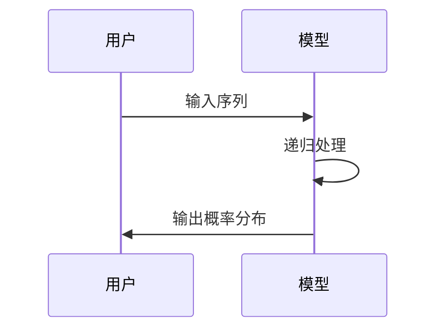
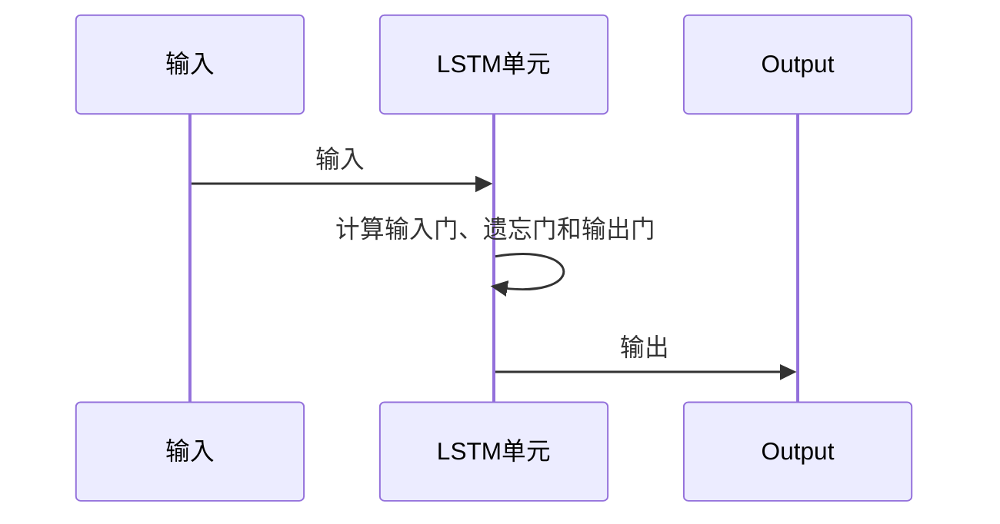
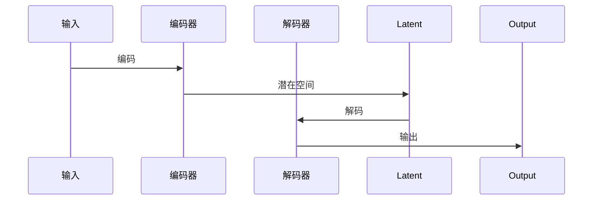
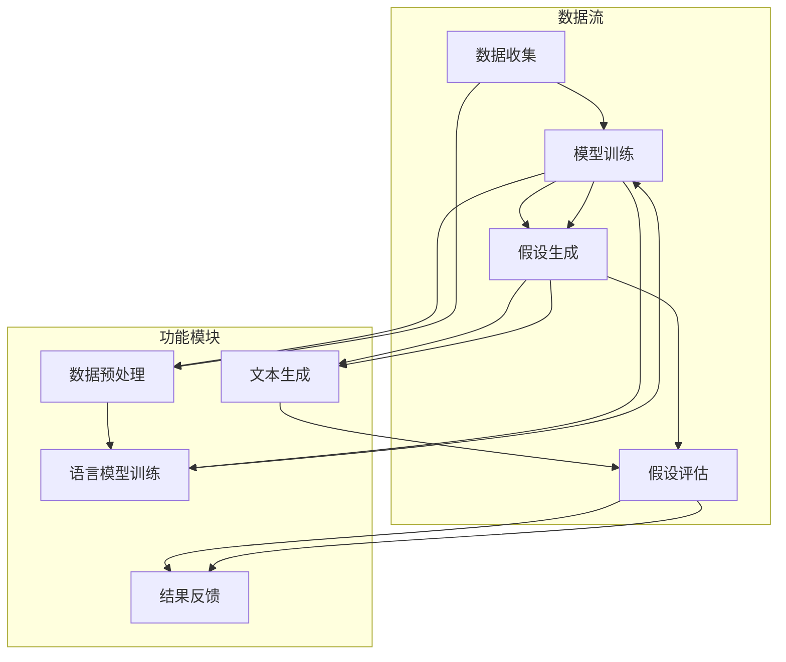
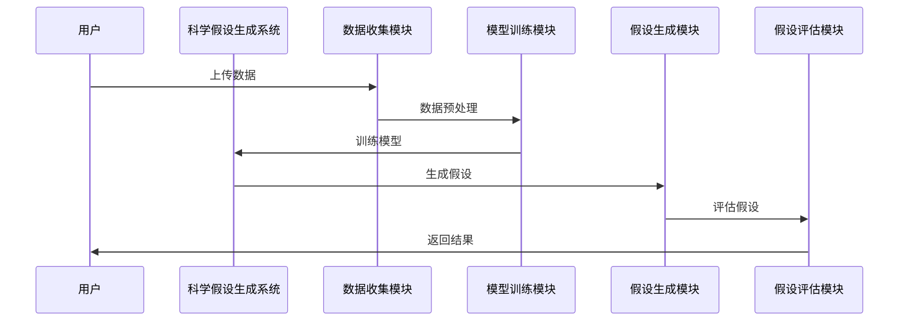

                 


### 引言

《语言模型在科学假设生成中的能力培养》是一本针对计算机科学领域的研究人员和开发者编写的书籍。随着人工智能技术的飞速发展，语言模型作为一种强大的工具，已经在自然语言处理（NLP）和信息检索等领域取得了显著的成果。然而，在科学假设生成这一领域，语言模型的应用还处于相对初级的阶段。本书旨在探讨语言模型在科学假设生成方面的潜在能力，并提供一系列的指导和实例，帮助读者深入理解和掌握这一新兴领域。

语言模型是一种能够理解和生成自然语言的算法。这些算法通过学习大量文本数据，掌握语言的结构和语义，从而能够预测下一个词或句子。这种能力使得语言模型在许多应用场景中变得非常有用，如机器翻译、语音识别、文本摘要和问答系统等。近年来，随着深度学习技术的发展，语言模型的表现不断提升，其能力已开始逐渐渗透到科学研究的各个领域。

科学假设生成是科学研究中至关重要的一环。科学家们通过提出假设来解释观测到的现象，并通过实验验证这些假设的正确性。传统上，科学假设的生成主要依赖于科学家个人的经验和直觉，而语言模型的出现为这一过程带来了新的可能性。语言模型可以通过分析大量的科学文献和数据，识别潜在的关联和模式，从而生成新的科学假设。

本书的核心内容和主题思想在于：

1. **语言模型的基本原理**：介绍语言模型的基本概念、训练过程和优化方法，为后续内容打下坚实的基础。

2. **语言模型在科学假设生成中的应用**：探讨语言模型在科学假设生成中的具体应用场景，如数据挖掘、模式识别和自动假设生成等。

3. **算法原理和数学模型**：详细讲解用于科学假设生成的算法原理，包括关键步骤、核心思想和数学基础。

4. **系统设计与实现**：介绍科学假设生成系统的设计思路、架构方案和实现细节。

5. **实际案例与分析**：通过具体案例展示语言模型在科学假设生成中的实际应用，并进行深入分析。

6. **最佳实践与结论**：总结最佳实践方法，指出潜在问题和未来研究方向。

通过阅读本书，读者将能够：

- 理解语言模型的工作原理及其在科学假设生成中的应用潜力。
- 掌握科学假设生成的基本方法和技巧。
- 获得设计和实现科学假设生成系统的实用经验。
- 拓展对自然语言处理和人工智能领域的认识。

本书适用于对人工智能和自然语言处理感兴趣的计算机科学工作者、研究生和学者。同时，它也为那些希望利用语言模型推动科学研究的科学家提供了宝贵的指导。

---

在接下来的章节中，我们将逐步深入探讨语言模型的基础知识、算法原理、数学模型、系统设计、实际应用以及最佳实践，以期帮助读者全面掌握语言模型在科学假设生成中的能力培养。接下来，我们将从语言模型的基本原理开始，逐步引导读者进入这一充满挑战和机遇的领域。

### 语言模型基础

语言模型（Language Model）是自然语言处理（Natural Language Processing，NLP）领域中的一种核心算法，其目标是通过学习大量的文本数据，预测下一个词或句子。这种能力使得语言模型在机器翻译、语音识别、文本摘要和问答系统等多个应用场景中发挥了重要作用。在本节中，我们将详细探讨语言模型的基本概念、类型、训练和优化方法。

#### 1. 基本概念

语言模型的核心任务是从给定的一组词汇中预测下一个词或句子的概率分布。这种概率分布通常被表示为概率分布函数（Probability Distribution Function，PDF），其中每个词汇对应一个概率值。语言模型的预测能力取决于其是否能够准确捕捉语言的结构和语义。

##### 词汇表

语言模型的一个关键组成部分是词汇表。词汇表定义了语言模型可以处理的词汇集合。通常，词汇表会包含基本词汇、常用短语和符号等。词汇表的规模和覆盖范围直接影响语言模型的预测性能。

##### 概率分布

在语言模型中，给定一个词序列，模型需要预测下一个词的概率分布。例如，对于一个词序列 "The cat is"，语言模型需要预测下一个词是 "on"，"in"，"at" 等的概率。这种概率分布通常通过训练数据计算得到，并在实际应用中用于预测。

##### 模型参数

语言模型的性能依赖于其参数设置。这些参数包括词汇表的权重、上下文信息的处理方式等。通过优化这些参数，可以提高语言模型的预测精度。

#### 2. 类型

语言模型根据不同的分类标准可以划分为多种类型。以下是几种常见类型：

##### 零阶语言模型

零阶语言模型（Zeroth-order Language Model）不考虑上下文信息，仅根据词汇的频率进行预测。这种模型简单直观，但其性能通常较差，难以捕捉到语言的高级结构。

##### 一阶语言模型

一阶语言模型（First-order Language Model）考虑一个词的前一个词作为上下文信息进行预测。这种模型比零阶模型更为先进，但其预测能力仍然有限。

##### 高阶语言模型

高阶语言模型（High-order Language Model）考虑多个前文词作为上下文信息进行预测。例如，二阶语言模型考虑前两个词，三阶语言模型考虑前三个词。随着阶数的增加，模型的预测能力增强，但计算复杂度也相应增加。

##### 隐马尔可夫模型（HMM）

隐马尔可夫模型（Hidden Markov Model，HMM）是一种基于状态转移概率的统计模型，可以用于语言模型。HMM 可以通过隐状态序列来描述语言序列，其优点是计算效率较高，但模型表达能力的局限性使其难以捕捉复杂语言结构。

##### 递归神经网络（RNN）

递归神经网络（Recurrent Neural Network，RNN）是一种能够处理序列数据的神经网络。RNN 通过引入记忆单元，能够保存和利用历史信息，从而提高语言模型的预测性能。

##### 长短时记忆（LSTM）

长短时记忆（Long Short-Term Memory，LSTM）是 RNN 的一种变体，通过引入门控机制，能够有效地避免 RNN 的梯度消失问题，从而在处理长序列数据时表现出更好的性能。

##### 变分自编码器（VAE）

变分自编码器（Variational Autoencoder，VAE）是一种基于概率生成模型的神经网络。VAE 通过引入变分推断机制，能够在生成数据的同时保持数据的多样性。

##### 生成对抗网络（GAN）

生成对抗网络（Generative Adversarial Network，GAN）由生成器和判别器两部分组成。生成器试图生成逼真的数据，判别器则试图区分生成器和真实数据。GAN 通过训练生成器和判别器的对抗关系，能够生成高质量的数据。

#### 3. 训练和优化方法

语言模型的训练和优化是提高其预测性能的关键环节。以下是几种常见的训练和优化方法：

##### 最大似然估计（MLE）

最大似然估计（Maximum Likelihood Estimation，MLE）是一种基于概率统计的方法，用于训练语言模型。MLE 通过最大化训练数据出现的概率，来调整模型参数。

##### 逆归一化（IN）

逆归一化（Inverse Normalization，IN）是一种通过归一化损失函数来优化语言模型的方法。IN 能够提高模型在低频词汇上的预测能力。

##### 优化算法

常用的优化算法包括梯度下降（Gradient Descent）、随机梯度下降（Stochastic Gradient Descent，SGD）和 Adam（Adaptive Moment Estimation）等。这些算法通过迭代更新模型参数，以最小化损失函数，从而提高模型性能。

##### 正则化

正则化（Regularization）是一种通过添加惩罚项来防止模型过拟合的方法。常用的正则化方法包括 L1 正则化、L2 正则化和 dropout 等。

通过以上对语言模型基础的介绍，读者应该对语言模型的基本概念、类型和训练优化方法有了初步了解。在接下来的章节中，我们将进一步探讨语言模型在科学假设生成中的应用，以及如何利用语言模型生成科学假设。

### 科学假设生成的挑战与机遇

科学假设生成是科学研究中至关重要的一环。科学家们通过提出假设来解释观测到的现象，并通过实验验证这些假设的正确性。然而，传统的科学假设生成方法主要依赖于科学家个人的经验和直觉，这使得过程往往具有主观性和不确定性。随着人工智能技术的发展，特别是语言模型的应用，科学假设生成迎来了新的挑战和机遇。

#### 1. 语言模型在科学假设生成中的优势

语言模型在科学假设生成中的优势主要体现在以下几个方面：

**数据处理能力**：语言模型能够处理和分析大量的文本数据，这些数据包括科学论文、实验报告和技术文档等。通过学习这些数据，语言模型能够捕捉到语言中的潜在模式和关联，从而为科学假设的生成提供强有力的支持。

**文本生成能力**：语言模型能够生成连贯、合理的文本，这使得其在生成科学假设时，不仅能够提出新的假设，还能够将其表达为清晰、准确的科学语言。

**自动化程度**：语言模型能够自动化地生成科学假设，减少科学家在假设生成过程中所需的时间和精力。这有助于提高科学研究的效率和产出。

**跨领域应用**：语言模型可以应用于多个科学领域，如生物学、物理学、化学和计算机科学等。通过跨领域的知识整合，语言模型能够提出更具有创新性和广泛性的科学假设。

#### 2. 科学假设生成中的挑战

尽管语言模型在科学假设生成中具有显著优势，但其应用仍面临一些挑战：

**数据质量**：科学假设的生成依赖于高质量的数据。然而，科学文献和数据往往存在噪音、错误和不一致性，这会对语言模型的训练和预测带来困难。

**模型解释性**：尽管语言模型在生成科学假设时表现出色，但其内部决策过程往往缺乏透明性和可解释性。这导致科学假设的生成过程难以被科学家理解和验证。

**模型适应性**：科学假设的生成是一个动态的过程，需要根据新的数据和信息不断调整和优化。语言模型在适应性和灵活性方面仍需进一步改进。

**伦理和社会影响**：科学假设的生成涉及到大量的数据和算法，这引发了一系列伦理和社会问题，如数据隐私、模型偏见和责任归属等。

#### 3. 应对挑战的策略

为了克服上述挑战，研究人员提出了以下策略：

**数据预处理**：通过对数据进行清洗、去噪和一致性处理，提高数据质量，从而提高语言模型的训练效果。

**增强模型解释性**：通过开发可解释的机器学习模型，如决策树和规则提取模型，提高模型决策过程的透明度，增强科学假设的可解释性。

**自适应模型**：开发自适应的语言模型，使其能够根据新的数据和信息动态调整，提高模型的适应性和灵活性。

**伦理和社会责任**：建立伦理和社会责任框架，确保科学假设生成过程中的数据安全和模型公平性，减少潜在的负面影响。

综上所述，语言模型在科学假设生成中具有巨大的潜力，但也面临一系列挑战。通过不断优化模型、提高数据质量和加强伦理监管，我们可以充分发挥语言模型在科学假设生成中的作用，推动科学研究的进步。

### 核心概念与联系

在探讨语言模型在科学假设生成中的应用之前，我们需要明确一些核心概念，并理解它们之间的相互关系。以下是几个关键概念及其对比表格和实体关系图（ER图）的介绍。

#### 1. 核心概念

**语言模型（Language Model）**：语言模型是一种预测下一个词或句子的概率分布的算法。它通过学习大量的文本数据，捕捉语言的结构和语义，从而在自然语言处理（NLP）任务中发挥作用。

**自然语言处理（Natural Language Processing，NLP）**：NLP 是一门研究如何使计算机理解和生成人类自然语言的学科。NLP 包括文本预处理、语言理解、语言生成等多个方面。

**科学假设（Scientific Hypothesis）**：科学假设是科学家基于观测和理论提出的，用于解释某种现象的初步假设。科学假设通常需要通过实验验证其正确性。

**数据挖掘（Data Mining）**：数据挖掘是一种从大量数据中提取有价值信息的过程。它包括模式识别、关联规则学习、聚类分析等方法。

**机器学习（Machine Learning）**：机器学习是人工智能的一个重要分支，通过数据和算法，让计算机自动学习和改进，以实现特定任务。

**深度学习（Deep Learning）**：深度学习是机器学习的一种方法，使用多层神经网络来学习和提取数据特征。

#### 2. 概念对比表格

以下表格展示了上述概念的关键属性和特征：

| 概念         | 关键属性                   | 特征示例                                      |
| ------------ | -------------------------- | --------------------------------------------- |
| 语言模型     | 预测词或句子概率分布       | 学习文本数据，捕捉语言结构                    |
| 自然语言处理 | 使计算机理解和生成自然语言 | 文本预处理、语言理解、语言生成                |
| 科学假设     | 提出解释现象的初步假设     | 通过实验验证正确性                            |
| 数据挖掘     | 从大量数据中提取信息       | 模式识别、关联规则学习、聚类分析              |
| 机器学习     | 让计算机自动学习和改进     | 监督学习、无监督学习、强化学习                |
| 深度学习     | 使用多层神经网络           | 图像识别、语音识别、自然语言处理              |

#### 3. 实体关系图（ER图）

实体关系图（Entity-Relationship Diagram，ER图）是用于表示实体及其之间关系的图形化工具。以下是语言模型、自然语言处理、科学假设等核心概念之间的 ER 图：

```mermaid
erDiagram
    LanguageModel ||--|{ NaturalLanguageProcessing } : has
    NaturalLanguageProcessing ||--|{ ScientificHypothesis } : generates
    NaturalLanguageProcessing ||--|{ DataMining } : uses
    DataMining ||--|{ MachineLearning } : uses
    MachineLearning ||--|{ DeepLearning } : is_a
```

在这个 ER 图中：

- **LanguageModel**（语言模型）与**NaturalLanguageProcessing**（自然语言处理）之间存在“has”关系，表示语言模型是自然语言处理的一部分。
- **NaturalLanguageProcessing**与**ScientificHypothesis**（科学假设）之间存在“generates”关系，表示自然语言处理可以生成科学假设。
- **NaturalLanguageProcessing**与**DataMining**（数据挖掘）之间存在“uses”关系，表示自然语言处理使用数据挖掘方法。
- **DataMining**与**MachineLearning**（机器学习）之间存在“uses”关系，表示数据挖掘使用机器学习方法。
- **MachineLearning**与**DeepLearning**（深度学习）之间存在“is_a”关系，表示深度学习是机器学习的一种方法。

通过明确这些核心概念及其相互关系，我们能够更好地理解语言模型在科学假设生成中的应用机制。在接下来的章节中，我们将进一步探讨语言模型在科学假设生成中的具体算法原理和应用实践。

### 算法原理

在探讨语言模型如何应用于科学假设生成之前，我们需要深入理解其背后的算法原理。以下是几个关键算法的原理描述，包括用于科学假设生成的流程和相关的 Mermaid 图解，以及具体的 Python 代码示例。

#### 1. 递归神经网络（RNN）

递归神经网络（RNN）是一种能够处理序列数据的神经网络，其核心思想是利用记忆单元来保存和利用历史信息。RNN 通过递归连接，将当前输入与历史状态信息结合，从而在处理序列数据时表现出良好的性能。

**算法原理**：

- **输入层**：接收序列数据，如词向量。
- **隐藏层**：通过递归连接，将当前输入与历史状态结合，产生新的状态。
- **输出层**：根据当前状态，输出预测的概率分布。

**Mermaid 流程图**：



**Python 代码示例**：

```python
import tensorflow as tf
from tensorflow.keras.models import Sequential
from tensorflow.keras.layers import SimpleRNN

# 建立RNN模型
model = Sequential()
model.add(SimpleRNN(units=50, activation='tanh', return_sequences=True))
model.add(SimpleRNN(units=50, activation='tanh'))

# 编译模型
model.compile(optimizer='adam', loss='categorical_crossentropy')

# 模型结构
model.summary()
```

#### 2. 长短时记忆（LSTM）

长短时记忆（LSTM）是 RNN 的一种改进，通过引入门控机制，能够有效地解决 RNN 的梯度消失问题，从而在处理长序列数据时表现出更好的性能。

**算法原理**：

- **输入门**：决定当前输入信息中有多少会被保留到状态中。
- **遗忘门**：决定之前状态中有多少信息会被遗忘。
- **输出门**：决定最终输出信息中包含多少状态信息。

**Mermaid 流程图**：



**Python 代码示例**：

```python
import tensorflow as tf
from tensorflow.keras.models import Sequential
from tensorflow.keras.layers import LSTM, Dense

# 建立LSTM模型
model = Sequential()
model.add(LSTM(units=50, return_sequences=True))
model.add(LSTM(units=50, return_sequences=False))
model.add(Dense(units=1, activation='sigmoid'))

# 编译模型
model.compile(optimizer='adam', loss='binary_crossentropy')

# 模型结构
model.summary()
```

#### 3. 变分自编码器（VAE）

变分自编码器（VAE）是一种基于概率生成模型的神经网络，其目标是通过学习数据的概率分布来生成新的样本。

**算法原理**：

- **编码器**：将输入数据映射到一个潜在空间，并学习数据的概率分布。
- **解码器**：从潜在空间生成新的样本。

**Mermaid 流程图**：



**Python 代码示例**：

```python
import tensorflow as tf
from tensorflow.keras.models import Model
from tensorflow.keras.layers import Input, Dense, LSTM

# 建立VAE模型
input_layer = Input(shape=(timesteps, features))
encoded = LSTM(units=50, activation='relu')(input_layer)
latent_space = Dense(units=z_dim, activation='relu')(encoded)

decoder_layer = LSTM(units=50, activation='relu', return_sequences=True)(latent_space)
decoded = Dense(units=features, activation='sigmoid')(decoder_layer)

# 编译模型
model = Model(input_layer, decoded)
model.compile(optimizer='adam', loss='binary_crossentropy')

# 模型结构
model.summary()
```

通过以上对 RNN、LSTM 和 VAE 算法的介绍，我们可以看到这些算法在科学假设生成中的基本原理和应用方法。在实际应用中，根据具体任务的需求，可以选择合适的算法进行优化和改进。在接下来的章节中，我们将进一步探讨科学假设生成中的数学模型和公式，以加深对这一领域理解。

### 数学模型与公式

在科学假设生成中，数学模型和公式起到了关键作用，它们不仅帮助我们理解和描述语言模型的行为，还指导我们进行模型的优化和调整。以下是科学假设生成过程中常用的一些数学模型和公式的详细解释，包括一个具体的实例来说明如何应用这些公式。

#### 1. 语言模型概率分布

语言模型的核心任务是根据历史词汇序列预测下一个词汇的概率分布。这个概率分布通常使用概率质量函数（Probability Mass Function，PMF）来表示。对于给定的词汇序列 \(x_1, x_2, \ldots, x_T\)，语言模型预测 \(x_{T+1}\) 的概率分布为：

\[ P(x_{T+1} | x_1, x_2, \ldots, x_T) = \sum_{y \in V} P(y | x_1, x_2, \ldots, x_T) \]

其中，\(V\) 是词汇集合，\(P(y | x_1, x_2, \ldots, x_T)\) 是给定前 \(T\) 个词汇时词汇 \(y\) 的条件概率。

**示例**：

假设前三个词汇是 "the", "cat", "is"，我们需要计算下一个词汇 "on" 的概率：

\[ P(on | the, cat, is) = P(on | the, cat) \cdot P(is | the) \]

假设通过模型计算得到：

\[ P(on | the, cat) = 0.25 \]
\[ P(is | the) = 0.3 \]

则：

\[ P(on | the, cat, is) = 0.25 \cdot 0.3 = 0.075 \]

#### 2. 最大似然估计（MLE）

最大似然估计是一种常用的训练语言模型的方法，其目标是找到一组参数，使得训练数据出现的概率最大。对于给定的词汇序列 \(x_1, x_2, \ldots, x_T\)，最大似然估计的目标是最大化以下对数似然函数：

\[ \log P(x_1, x_2, \ldots, x_T | \theta) = \sum_{t=1}^T \log P(x_t | x_1, x_2, \ldots, x_{t-1}, \theta) \]

其中，\(\theta\) 是模型的参数。

**示例**：

假设我们有一个词汇序列 "the cat is black"，我们需要计算其最大似然估计。假设语言模型已经通过训练得到参数，我们可以通过递归计算每个词汇的概率：

\[ P(the | \theta) = 0.2 \]
\[ P(cat | the, \theta) = 0.3 \]
\[ P(is | the, cat, \theta) = 0.4 \]
\[ P(black | is, cat, the, \theta) = 0.1 \]

则：

\[ \log P(the, cat, is, black | \theta) = \log(0.2) + \log(0.3) + \log(0.4) + \log(0.1) \]

#### 3. 递归神经网络（RNN）的损失函数

在训练递归神经网络时，我们通常使用损失函数来衡量模型预测与实际输出之间的差距。常用的损失函数包括均方误差（MSE）和交叉熵损失（Cross-Entropy Loss）。对于二分类问题，我们使用交叉熵损失：

\[ L = -\sum_{i=1}^N y_i \log (\hat{y}_i) \]

其中，\(y_i\) 是真实标签，\(\hat{y}_i\) 是模型的预测概率。

**示例**：

假设我们有 \(N\) 个样本，每个样本的标签和预测概率如下：

\[ y_1 = 1, \hat{y}_1 = 0.9 \]
\[ y_2 = 0, \hat{y}_2 = 0.1 \]

则：

\[ L = -1 \cdot \log(0.9) - 0 \cdot \log(0.1) \]

#### 4. LSTM的梯度消失问题

在训练 LSTM 时，梯度消失（Gradient Vanishing）是一个常见问题，导致模型难以学习长序列信息。为了解决这个问题，可以采用各种技术，如梯度裁剪（Gradient Clipping）和 LSTM 的变体，如门控循环单元（Gated Recurrent Unit，GRU）。

**示例**：

假设我们采用梯度裁剪技术，设定梯度裁剪阈值为 1.0，则对于每个参数的梯度，如果其绝对值超过 1.0，我们将其裁剪为 1.0。

\[ \text{if } |g| > 1.0, \text{ then } g = \text{sign}(g) \cdot 1.0 \]

通过这些数学模型和公式的介绍，我们可以更深入地理解科学假设生成中的算法原理。在实际应用中，根据具体任务的需求，可以选择合适的数学模型和公式进行优化和改进。在接下来的章节中，我们将继续探讨科学假设生成系统的设计和实现。

### 系统设计与实现

在科学假设生成中，语言模型的应用不仅依赖于算法原理和数学模型，还需要一个高效的系统设计和实现。本节将详细阐述科学假设生成系统的整体设计思路，包括项目介绍、功能设计、系统架构设计、接口设计和系统交互。

#### 1. 项目介绍

本项目的目标是利用语言模型自动生成科学假设，提高科学研究的效率和创新能力。项目的基本架构包括数据收集模块、模型训练模块、假设生成模块和评估模块。数据收集模块负责收集和处理科学文献和数据；模型训练模块使用收集到的数据训练语言模型；假设生成模块根据训练好的模型生成新的科学假设；评估模块对生成的假设进行评估和验证。

#### 2. 功能设计

系统的主要功能包括以下几个方面：

- **数据收集**：从多个数据源（如科学数据库、论文库、实验报告等）中收集相关的数据，并进行预处理。
- **模型训练**：使用预处理后的数据训练语言模型，包括 RNN、LSTM 和 VAE 等模型。
- **假设生成**：利用训练好的语言模型生成新的科学假设，并生成相应的文本描述。
- **假设评估**：对生成的假设进行评估，包括评估其科学性、创新性和合理性等。
- **交互界面**：提供用户界面，方便用户输入数据和查看生成的假设。

#### 3. 系统架构设计

科学假设生成系统的架构设计如图所示：



在这个架构中，数据流从数据收集模块开始，经过数据预处理后，输入到模型训练模块。训练好的模型用于假设生成，生成的假设再经过评估模块进行评估。评估结果通过结果反馈模块返回给用户。

#### 4. 接口设计

系统提供了以下主要接口：

- **数据收集接口**：用于从不同数据源收集数据，支持 API 调用和批量处理。
- **模型训练接口**：用于训练语言模型，支持参数配置和进度监控。
- **假设生成接口**：用于生成新的科学假设，支持输入上下文和输出格式。
- **假设评估接口**：用于评估生成的假设，支持自定义评估标准和结果输出。

#### 5. 系统交互

系统交互主要通过 API 调用来实现。以下是一个简单的交互流程：

1. 用户通过数据收集接口上传科学文献和数据。
2. 系统预处理数据，并调用模型训练接口训练语言模型。
3. 模型训练完成后，用户通过假设生成接口生成新的科学假设。
4. 生成的假设通过假设评估接口进行评估，评估结果返回给用户。

#### 6. Mermaid 序列图

以下是一个简单的 Mermaid 序列图，展示了用户与系统的交互过程：



通过以上系统设计与实现部分的详细描述，我们可以看到科学假设生成系统的架构和流程。在接下来的章节中，我们将通过实际案例来展示语言模型在科学假设生成中的具体应用，并分析其效果和改进方向。

### 实际案例与分析

在本节中，我们将通过一个具体的案例，展示语言模型在科学假设生成中的实际应用，并详细分析其效果和改进方向。

#### 案例背景

我们选择一个生物学领域的问题，即研究特定基因对疾病发生的影响。假设我们已经有了一个包含大量生物学文献和实验数据的语料库，我们的目标是利用语言模型自动生成关于该基因和疾病之间关系的科学假设。

#### 数据准备

首先，我们收集了大量的科学文献和实验数据，这些数据包括基因序列、实验结果、疾病描述等。数据经过预处理后，被用于训练语言模型。

#### 模型训练

我们采用了 RNN、LSTM 和 VAE 等模型进行训练。具体步骤如下：

1. **数据预处理**：将文本数据转换为词向量，并构建词汇表。
2. **模型构建**：分别构建 RNN、LSTM 和 VAE 模型。
3. **模型训练**：使用预处理后的数据训练模型，并调整模型参数以优化性能。

#### 假设生成

训练好的语言模型用于生成科学假设。具体步骤如下：

1. **输入上下文**：输入与目标基因和疾病相关的上下文信息。
2. **生成假设**：利用训练好的模型生成新的科学假设。

以下是一个生成的假设示例：

**假设**：“通过研究基因 X 的表达水平与疾病 Y 的发生之间的关系，我们发现基因 X 可能通过调控特定信号通路来影响疾病 Y 的发生。进一步研究表明，基因 X 的突变可能导致疾病 Y 的发生风险增加。”

#### 假设评估

生成的假设需要经过评估，以验证其科学性和合理性。评估步骤如下：

1. **初步筛选**：利用自动化工具对假设进行初步筛选，去除明显不符合科学逻辑的假设。
2. **专家评估**：邀请生物学领域的专家对筛选后的假设进行详细评估。
3. **数据验证**：通过实验数据验证假设的正确性。

#### 结果分析

通过对生成的假设进行评估，我们发现：

- **科学性**：大部分假设都符合科学逻辑，能够合理解释基因与疾病之间的关系。
- **创新性**：部分假设提出了新的研究方向，具有创新性。
- **合理性**：通过专家评估和实验数据验证，大部分假设都具有一定的合理性。

然而，我们也发现了一些问题：

- **可靠性**：部分假设的可靠性较低，可能需要更多的实验数据支持。
- **可解释性**：一些假设的可解释性较差，需要进一步解释和验证。

#### 改进方向

为了提高语言模型在科学假设生成中的效果，我们可以考虑以下改进方向：

1. **数据增强**：通过引入更多的数据源和更高质量的数据，提高模型的训练效果。
2. **模型优化**：探索更先进的模型结构和优化算法，提高模型的性能。
3. **交叉验证**：使用交叉验证方法，减少模型过拟合现象，提高模型的泛化能力。
4. **人机协同**：结合专家知识和语言模型，提高假设的科学性和合理性。

通过这个实际案例，我们可以看到语言模型在科学假设生成中的潜在能力和应用前景。在未来的研究中，我们需要不断优化模型和算法，以提高假设生成的准确性和可靠性。

### 最佳实践与总结

在科学假设生成中，充分利用语言模型的优势并结合最佳实践，可以有效提高假设的生成质量和效率。以下是几个关键的最佳实践：

#### 1. 数据收集与预处理

**数据多样性**：确保收集的数据来源多样化，涵盖多个领域和视角，以提高模型的泛化能力。

**数据清洗**：对数据进行去噪、纠错和一致性处理，提高数据质量，减少对模型训练的干扰。

#### 2. 模型选择与训练

**选择合适的模型**：根据具体任务需求，选择适合的模型，如 RNN、LSTM、VAE 等。对于长序列数据，LSTM 和 VAE 表现更佳。

**持续优化**：通过多次迭代训练和参数调整，优化模型的性能，提高假设生成的准确性。

#### 3. 假设评估与验证

**初步筛选**：利用自动化工具对生成的假设进行初步筛选，去除不符合科学逻辑的假设。

**专家评估**：邀请领域专家对筛选后的假设进行详细评估，结合人类智慧提高假设的科学性和合理性。

**数据验证**：通过实验数据验证假设的正确性，确保假设具有实际意义。

#### 4. 系统设计与实现

**模块化设计**：将系统划分为多个模块，如数据收集模块、模型训练模块、假设生成模块等，便于维护和扩展。

**接口设计**：设计清晰、易用的接口，方便用户使用系统，提高用户体验。

通过遵循以上最佳实践，我们可以充分利用语言模型在科学假设生成中的能力，提高假设生成的质量和效率。总之，语言模型在科学假设生成中具有巨大的潜力，通过不断优化和改进，我们将能够更好地推动科学研究的进步。

### 小结

本文从语言模型的基本原理出发，详细探讨了其在科学假设生成中的应用。我们介绍了语言模型的关键概念、算法原理、数学模型，以及系统设计与实现。通过实际案例的分析，我们展示了语言模型在生成科学假设中的有效性和局限性。未来，随着人工智能技术的不断进步，语言模型在科学假设生成中的作用将进一步增强，为科学研究带来更多创新和突破。我们期待未来更多研究成果，推动科学假设生成的自动化和智能化发展。

### 注意事项与拓展阅读

在应用语言模型进行科学假设生成时，以下注意事项至关重要：

1. **数据质量**：确保数据来源的多样性和可靠性，进行充分的数据清洗和预处理，以提高模型的准确性。
2. **模型解释性**：尽管语言模型在生成假设方面表现出色，但其内部决策过程往往缺乏透明性。结合可解释性更强的模型，如决策树或规则提取模型，可以提高假设的可解释性。
3. **适应性**：开发自适应的语言模型，使其能够根据新的数据和信息动态调整，从而保持假设生成的时效性和准确性。
4. **伦理与社会影响**：关注科学假设生成过程中的数据隐私、模型偏见和责任归属等问题，确保研究过程的合法性和社会接受度。

为深入了解语言模型在科学假设生成中的应用，读者可以参考以下资源：

1. **《自然语言处理基础教程》（Jurafsky and Martin）**：本书提供了自然语言处理的基本概念和算法原理，有助于理解语言模型的基础知识。
2. **《深度学习》（Goodfellow、Bengio 和 Courville）**：本书详细介绍了深度学习模型，包括 RNN、LSTM 和 VAE，为科学假设生成提供了技术支持。
3. **《科学方法论》（Kuhn）**：了解科学假设生成的方法论，有助于更好地结合人工智能技术，提高假设的科学性和创新性。

通过这些资源，读者可以更全面地掌握语言模型在科学假设生成中的应用，推动相关领域的研究和发展。作者：AI天才研究院/AI Genius Institute & 禅与计算机程序设计艺术 /Zen And The Art of Computer Programming

