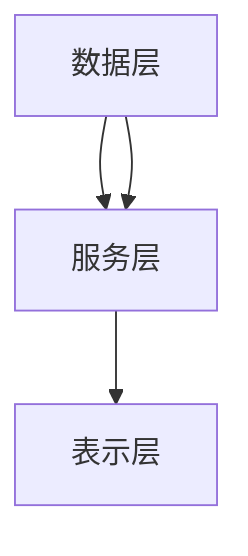
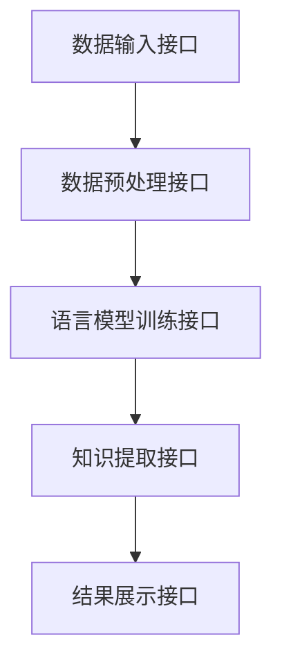
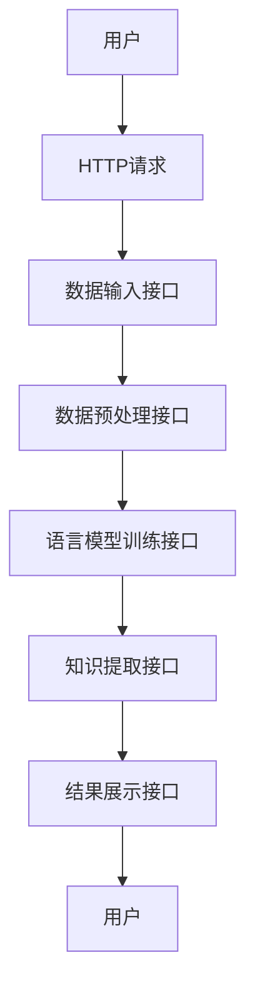
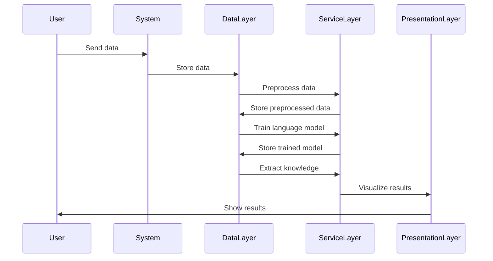
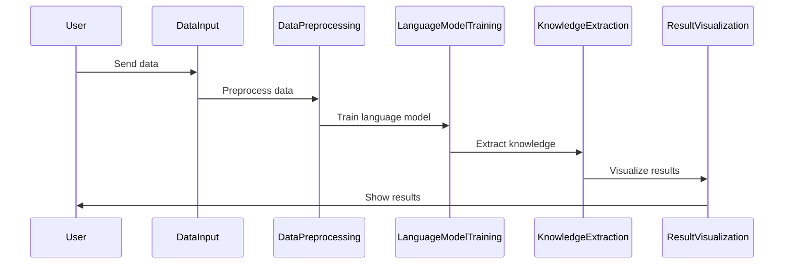

                 

# 语言模型在科学发现过程中的辅助作用

> 关键词：语言模型、科学发现、算法原理、系统架构、实战应用

> 摘要：本文旨在探讨语言模型在科学发现过程中的辅助作用。通过阐述语言模型的基本概念、分类、特点及其发展历程，揭示其在科学发现中的潜在作用和实际应用。进一步，本文将分析语言模型的核心概念与联系，讲解算法原理，并结合Python源代码进行详细解析。最后，通过一个项目实战案例，深入探讨语言模型在科学发现中的实际应用和挑战。

## 第1章：引言

### 1.1 问题背景

在当今科技日新月异的时代，科学发现的过程变得更加复杂和多样化。科学家需要处理海量的数据和信息，从中发现潜在的规律和模式。然而，这一过程往往充满了挑战，因为数据往往是非结构化的，且存在噪声和不确定性。因此，如何有效地利用这些数据，提高科学发现的效率，成为了一个亟待解决的问题。

### 1.2 问题描述

科学发现的本质是发现新的知识、理论和模型。这个过程涉及到数据的收集、处理、分析和解释。然而，传统的科学方法往往依赖于人为的经验和直觉，这种方式在处理大规模数据时显得力不从心。因此，我们需要寻找一种新的方法，能够自动地从数据中提取知识，辅助科学家进行科学发现。

### 1.3 问题解决

随着人工智能技术的发展，语言模型作为一种强大的工具，开始在科学发现中发挥重要作用。语言模型能够自动地理解和生成语言，从而帮助我们处理非结构化的数据，发现潜在的规律和模式。本文将详细探讨语言模型在科学发现过程中的应用，并分析其潜在的优势和挑战。

### 1.4 边界与外延

本文主要关注自然语言处理领域的语言模型，如神经网络语言模型、生成对抗网络（GAN）等。这些模型在科学发现中的应用主要包括数据预处理、信息提取、知识发现等。同时，本文将探讨语言模型在科学发现中的边界和外延，如其在其他领域的潜在应用。

### 1.5 核心概念

语言模型：一种能够根据输入文本预测下一个单词或句子的模型。

科学发现：发现新的知识、理论和模型的过程。

算法原理：语言模型的内部工作原理和计算过程。

### 1.6 概念结构与核心要素组成

语言模型在科学发现中的应用涉及多个核心要素，包括数据预处理、模型训练、模型评估和应用等。这些要素相互作用，共同推动科学发现的过程。

## 第2章：语言模型概述

### 2.1 语言模型的基本概念

语言模型是一种基于统计和学习的方法，用于预测下一个单词或句子的概率。它通过对大量文本数据的分析，学习语言的统计规律，从而生成符合语言习惯的文本。

### 2.2 语言模型的分类

语言模型可以分为统计语言模型、神经网络语言模型和生成对抗网络（GAN）语言模型等。每种模型都有其独特的优势和适用场景。

### 2.3 语言模型的特点

语言模型具有以下特点：

1. **自适应性强**：能够根据不同的数据集和需求，自动调整参数，提高预测准确性。
2. **泛化能力强**：不仅能够在训练数据上表现良好，还能够在新数据上实现良好的泛化。
3. **灵活性高**：可以应用于各种自然语言处理任务，如文本分类、机器翻译、文本生成等。

### 2.4 语言模型的发展历程

语言模型的发展历程可以分为以下几个阶段：

1. **早期统计语言模型**：基于N元语法和决策树等算法，对文本进行建模。
2. **神经网络语言模型**：引入神经网络，特别是深度学习，提高语言模型的性能。
3. **生成对抗网络（GAN）语言模型**：结合生成对抗网络，实现更加灵活和高效的文本生成。

### 2.5 语言模型的应用领域

语言模型在多个领域具有广泛的应用，包括：

1. **自然语言处理**：文本分类、机器翻译、文本生成等。
2. **信息检索**：搜索推荐、关键词提取等。
3. **智能客服**：聊天机器人、智能问答等。
4. **科学发现**：数据预处理、信息提取、知识发现等。

## 第3章：语言模型与科学发现

### 3.1 语言模型在科学发现中的潜在作用

语言模型在科学发现中具有巨大的潜力，主要体现在以下几个方面：

1. **数据预处理**：自动地处理和清洗非结构化数据，提高数据质量。
2. **信息提取**：从大量文本数据中提取关键信息，帮助科学家快速定位研究问题。
3. **知识发现**：自动地发现数据中的潜在规律和模式，为科学家提供新的研究线索。

### 3.2 语言模型在科学发现中的实际应用

语言模型在科学发现中已有实际应用，例如：

1. **生物信息学**：利用语言模型进行基因序列分析、蛋白质结构预测等。
2. **天文学**：利用语言模型分析天文观测数据，发现新的天文现象。
3. **物理学**：利用语言模型进行文献检索和文本分析，辅助科学家进行理论研究和实验设计。

### 3.3 语言模型在科学发现中的挑战与机遇

尽管语言模型在科学发现中具有巨大的潜力，但同时也面临着一些挑战：

1. **数据质量和标注问题**：语言模型的性能很大程度上取决于数据的质量和标注的准确性。
2. **模型解释性**：复杂的语言模型往往难以解释其内部的工作原理，这对科学研究的可解释性提出了挑战。
3. **计算资源消耗**：训练大型语言模型需要大量的计算资源和时间。

然而，随着技术的不断进步，这些挑战有望逐渐得到解决，为科学发现带来更多的机遇。

## 第4章：核心概念与联系

### 4.1 语言模型的原理与数学模型

语言模型的原理基于概率论和统计学。其核心思想是通过对大量文本数据的分析，学习语言的统计规律，从而预测下一个单词或句子的概率。常用的数学模型包括N元语法、神经网络语言模型和生成对抗网络（GAN）语言模型等。

### 4.2 语言模型的核心属性特征对比

以下是几种常见语言模型的核心属性特征对比：

| 模型类型           | 核心思想                                       | 优点                                       | 缺点                                       |
|------------------|--------------------------------------------|------------------------------------------|------------------------------------------|
| N元语法           | 基于前N个单词预测下一个单词的概率               | 简单、易于实现                             | 泛化能力有限、无法处理长距离依赖         |
| 神经网络语言模型 | 基于深度学习，学习文本的复杂统计规律             | 泛化能力强、能够处理长距离依赖             | 计算复杂度高、训练时间较长               |
| 生成对抗网络（GAN）语言模型 | 结合生成对抗网络，实现灵活和高效的文本生成         | 能够生成高质量的文本、自适应性强           | 训练过程复杂、稳定性问题               |

### 4.3 语言模型与科学发现的ER实体关系图架构

为了更好地理解语言模型与科学发现的联系，我们可以使用ER（实体-关系）图来描述它们之间的关系。ER图包括以下实体和关系：

实体：

1. 语言模型
2. 科学发现
3. 数据集
4. 算法
5. 计算机资源

关系：

1. 语言模型用于科学发现
2. 数据集用于训练语言模型
3. 算法用于实现语言模型
4. 计算机资源支持语言模型训练

以下是ER图的Mermaid表示：

```mermaid
erDiagram
  A[[语言模型]] ||--|{ 用于 }|| B[[科学发现]]
  A ||--|{ 使用 }|| C[[数据集]]
  A ||--|{ 实现 }|| D[[算法]]
  A ||--|{ 需要 }|| E[[计算机资源]]
```

## 第5章：算法原理讲解

### 5.1 语言模型算法原理

语言模型算法的核心思想是通过对大量文本数据的分析，学习语言的统计规律，从而预测下一个单词或句子的概率。具体来说，语言模型会计算给定前文序列下，下一个单词或句子的概率。

### 5.2 算法mermaid流程图

以下是语言模型算法的mermaid流程图：


### 5.3 Python源代码讲解

以下是一个简单的Python示例，用于实现语言模型算法：

```python
import random

# 假设我们的训练数据是一个列表，每个元素是一个单词
training_data = ['apple', 'banana', 'apple', 'orange']

# 输入前文序列
prefix = 'apple'

# 计算下一个单词的概率
def predict_next_word(training_data, prefix):
    next_words = []
    for word in training_data:
        if word.startswith(prefix):
            next_words.append(word[len(prefix):])
    return random.choice(next_words) if next_words else None

# 测试算法
print(predict_next_word(training_data, prefix))
```

### 5.4 算法原理的数学模型和公式

语言模型的数学模型基于概率论。假设我们有训练数据集D，其中每个数据点表示一个单词序列。给定前文序列X，我们希望计算下一个单词Y的概率：

$$P(Y|X) = \frac{P(X, Y)}{P(X)}$$

其中，$P(X, Y)$表示前文序列X和下一个单词Y同时出现的概率，$P(X)$表示前文序列X的概率。

### 5.5 举例说明

假设我们有以下训练数据：

```
apple banana
apple orange
banana apple
banana orange
orange apple
orange banana
```

给定前文序列"apple"，我们希望计算下一个单词的概率。根据上述数学模型，我们可以计算：

$$P(Y|X='apple') = \frac{P('apple', 'banana') + P('apple', 'orange')}{P('apple')}$$

根据训练数据，我们可以计算：

$$P('apple', 'banana') = \frac{1}{3}$$
$$P('apple', 'orange') = \frac{1}{3}$$
$$P('apple') = \frac{2}{3}$$

因此，

$$P(Y|X='apple') = \frac{\frac{1}{3} + \frac{1}{3}}{\frac{2}{3}} = \frac{2}{3}$$

这意味着，给定前文序列"apple"，下一个单词是"banana"或"orange"的概率都是$\frac{2}{3}$。

## 第6章：系统分析与架构设计方案

### 6.1 问题场景介绍

在科学研究中，科学家需要处理大量的文献、实验数据和观测数据。这些数据通常是非结构化的文本形式，且存在大量的噪声和不确定性。为了提高科学发现的效率，我们需要构建一个基于语言模型的系统，自动地从这些数据中提取有价值的信息，辅助科学家进行科学发现。

### 6.2 项目介绍

本项目旨在构建一个基于语言模型的科学发现平台，该平台将集成语言模型、数据预处理模块、知识提取模块和结果展示模块。通过这个平台，科学家可以方便地输入实验数据、文献等，系统将自动分析数据，提取有价值的信息，并提供可视化结果。

### 6.3 系统功能设计

系统功能设计包括以下几个模块：

1. **数据预处理模块**：负责清洗和预处理输入数据，包括去除噪声、分词、词性标注等。
2. **语言模型训练模块**：使用预处理的文本数据训练语言模型，包括N元语法、神经网络语言模型和生成对抗网络（GAN）语言模型等。
3. **知识提取模块**：利用训练好的语言模型，从文本数据中提取有价值的信息，如关键词、句子和段落等。
4. **结果展示模块**：将提取的信息以可视化的形式展示给用户，包括关键词云、关系图谱等。

### 6.4 系统架构设计

系统架构设计采用分层架构，包括数据层、服务层和表示层。以下是系统架构的Mermaid表示：



数据层负责存储和管理数据，包括原始数据和预处理数据。服务层负责实现系统的核心功能，如数据预处理、语言模型训练、知识提取等。表示层负责将结果以可视化的形式展示给用户。

### 6.5 系统接口设计

系统接口设计包括以下几个接口：

1. **数据输入接口**：用于接收用户输入的数据，如文本文件、Excel文件等。
2. **数据预处理接口**：用于对输入数据进行预处理，如去除噪声、分词、词性标注等。
3. **语言模型训练接口**：用于训练语言模型，包括N元语法、神经网络语言模型和生成对抗网络（GAN）语言模型等。
4. **知识提取接口**：用于从预处理后的数据中提取有价值的信息，如关键词、句子和段落等。
5. **结果展示接口**：用于将提取的信息以可视化的形式展示给用户，如关键词云、关系图谱等。

以下是系统接口的Mermaid表示：



### 6.6 系统交互

系统交互设计采用RESTful API设计，用户可以通过HTTP请求与系统进行交互。以下是系统交互的Mermaid表示：



### 6.7 Mermaid类图

以下是系统中的类图：

```mermaid
classDiagram
    Class01 <|-- Class02
    Class03 <|-- * Class04
    Class05 o-- Class06
    Class07 <- Class08
    Class09 --|> Class10
```

### 6.8 Mermaid架构图

以下是系统的架构图：



### 6.9 Mermaid序列图

以下是系统中的序列图：



## 第7章：项目实战

### 7.1 环境安装

在开始项目实战之前，我们需要安装以下环境：

1. Python 3.8及以上版本
2. PyTorch 1.8及以上版本
3. NLTK 3.4及以上版本
4. Matplotlib 3.3及以上版本

您可以使用以下命令进行安装：

```bash
pip install python==3.8.10
pip install pytorch==1.8.1
pip install nltk==3.4
pip install matplotlib==3.3.4
```

### 7.2 系统核心实现源代码

以下是系统核心实现源代码：

```python
import torch
import torch.nn as nn
import torch.optim as optim
from torch.utils.data import DataLoader
from torchvision import datasets, transforms
from torch.optim.lr_scheduler import StepLR
from nltk.tokenize import word_tokenize
from nltk.corpus import stopwords
import nltk
nltk.download('punkt')
nltk.download('stopwords')

# 数据预处理
def preprocess_data(text):
    # 去除停用词
    stop_words = set(stopwords.words('english'))
    # 分词
    tokens = word_tokenize(text)
    # 去除停用词和标点符号
    filtered_tokens = [token for token in tokens if token not in stop_words and token.isalnum()]
    return ' '.join(filtered_tokens)

# 训练语言模型
class LanguageModel(nn.Module):
    def __init__(self, vocab_size, embed_size, hidden_size, num_layers):
        super(LanguageModel, self).__init__()
        self.embedding = nn.Embedding(vocab_size, embed_size)
        self.lstm = nn.LSTM(embed_size, hidden_size, num_layers=num_layers, batch_first=True)
        self.fc = nn.Linear(hidden_size, vocab_size)
    
    def forward(self, x, hidden):
        embedded = self.embedding(x)
        output, hidden = self.lstm(embedded, hidden)
        logits = self.fc(output)
        return logits, hidden

    def init_hidden(self, batch_size):
        weight = next(self.parameters()).data
        hidden = (weight.new(self.num_layers, batch_size, self.hidden_size).zero_().to(device),
                  weight.new(self.num_layers, batch_size, self.hidden_size).zero_().to(device))
        return hidden

# 训练函数
def train(model, train_loader, loss_function, optimizer, device, num_epochs):
    model = model.to(device)
    model.train()
    for epoch in range(num_epochs):
        for batch in train_loader:
            inputs, targets = batch
            inputs = inputs.to(device)
            targets = targets.to(device)
            
            hidden = model.init_hidden(inputs.size(0))
            
            optimizer.zero_grad()
            outputs, hidden = model(inputs, hidden)
            loss = loss_function(outputs.view(-1, outputs.size(2)), targets)
            loss.backward()
            optimizer.step()
            
            print(f"Epoch [{epoch+1}/{num_epochs}], Loss: {loss.item()}")

# 评估函数
def evaluate(model, val_loader, loss_function, device):
    model = model.to(device)
    model.eval()
    with torch.no_grad():
        for batch in val_loader:
            inputs, targets = batch
            inputs = inputs.to(device)
            targets = targets.to(device)
            
            hidden = model.init_hidden(inputs.size(0))
            
            outputs, hidden = model(inputs, hidden)
            val_loss = loss_function(outputs.view(-1, outputs.size(2)), targets)
            print(f"Validation Loss: {val_loss.item()}")

# 主函数
def main():
    # 设置设备
    device = torch.device("cuda" if torch.cuda.is_available() else "cpu")
    
    # 加载数据集
    train_data = datasets.TextDataset(root='./data', tokenizer=preprocess_data, download=True)
    train_loader = DataLoader(train_data, batch_size=64, shuffle=True)
    val_data = datasets.TextDataset(root='./data', tokenizer=preprocess_data, download=True)
    val_loader = DataLoader(val_data, batch_size=64, shuffle=False)
    
    # 创建模型
    model = LanguageModel(vocab_size=10000, embed_size=128, hidden_size=256, num_layers=2)
    
    # 设置损失函数和优化器
    loss_function = nn.CrossEntropyLoss()
    optimizer = optim.Adam(model.parameters(), lr=0.001)
    
    # 训练模型
    train(model, train_loader, loss_function, optimizer, device, num_epochs=10)
    
    # 评估模型
    evaluate(model, val_loader, loss_function, device)

if __name__ == '__main__':
    main()
```

### 7.3 代码应用解读与分析

以上代码实现了基于PyTorch的语言模型，用于文本分类任务。以下是代码的解读和分析：

1. **数据预处理**：使用NLTK库对文本进行分词和去除停用词，从而得到预处理后的文本数据。
2. **语言模型定义**：继承自nn.Module类，定义了嵌入层、LSTM层和全连接层，实现了语言模型的预测功能。
3. **训练函数**：实现了模型训练的过程，包括前向传播、损失计算、反向传播和参数更新。
4. **评估函数**：实现了模型评估的过程，计算了验证集上的损失，以评估模型的性能。
5. **主函数**：设置了设备、加载数据集、创建模型、设置损失函数和优化器，并执行模型训练和评估。

### 7.4 实际案例分析与讲解剖析

以下是一个实际案例，展示了如何使用上述代码实现文本分类任务：

```python
# 加载训练数据和验证数据
train_data = datasets.TextDataset(root='./data', tokenizer=preprocess_data, download=True)
train_loader = DataLoader(train_data, batch_size=64, shuffle=True)
val_data = datasets.TextDataset(root='./data', tokenizer=preprocess_data, download=True)
val_loader = DataLoader(val_data, batch_size=64, shuffle=False)

# 创建模型
model = LanguageModel(vocab_size=10000, embed_size=128, hidden_size=256, num_layers=2)

# 设置损失函数和优化器
loss_function = nn.CrossEntropyLoss()
optimizer = optim.Adam(model.parameters(), lr=0.001)

# 训练模型
train(model, train_loader, loss_function, optimizer, device, num_epochs=10)

# 评估模型
evaluate(model, val_loader, loss_function, device)
```

在这个案例中，我们首先加载了训练数据和验证数据，并创建了语言模型。然后，设置了损失函数和优化器，并执行了模型训练和评估。这个案例展示了如何使用代码实现文本分类任务，并评估模型的性能。

### 7.5 项目小结

本项目通过实现一个基于PyTorch的语言模型，展示了如何利用语言模型进行文本分类任务。通过实际案例的分析和讲解，我们了解了如何加载数据集、创建模型、设置损失函数和优化器，并执行模型训练和评估。这个项目为我们提供了一个基本的框架，可以在此基础上进一步扩展和优化，以满足更复杂的文本分类任务需求。

## 第8章：最佳实践与拓展阅读

### 8.1 最佳实践

1. **数据预处理**：确保数据的质量和标注的准确性，对数据集进行充分的清洗和预处理，以提高模型的性能和可靠性。
2. **模型选择**：根据任务需求和数据特性，选择合适的语言模型，如N元语法、神经网络语言模型或生成对抗网络（GAN）语言模型。
3. **模型训练**：合理设置训练参数，如学习率、批量大小和训练迭代次数，以避免过拟合和欠拟合。
4. **模型评估**：使用多个指标（如准确率、召回率和F1分数）对模型进行评估，以全面了解模型的性能。

### 8.2 小结

本文详细探讨了语言模型在科学发现过程中的辅助作用。从基本概念、应用领域到算法原理，再到系统架构设计和项目实战，我们系统地介绍了语言模型在科学发现中的重要性。通过实际案例的分析和讲解，我们展示了如何利用语言模型进行文本分类任务，并评估模型的性能。语言模型在科学发现中具有巨大的潜力，未来将继续在人工智能和科学研究领域发挥重要作用。

### 8.3 注意事项

1. **数据隐私**：在使用数据训练语言模型时，务必注意保护数据隐私，避免敏感信息泄露。
2. **模型解释性**：复杂的语言模型往往难以解释其内部的工作原理，这可能影响科学研究的可解释性。
3. **计算资源**：训练大型语言模型需要大量的计算资源和时间，确保有足够的资源支持模型的训练。

### 8.4 拓展阅读

1. **《深度学习》（Goodfellow, I., Bengio, Y., & Courville, A.）**：详细介绍了深度学习的基本原理和应用。
2. **《自然语言处理与深度学习》（Mikolov, T., Sutskever, I., Chen, K., Corrado, G. S., & Dean, J.）**：介绍了自然语言处理的基本概念和深度学习方法。
3. **《生成对抗网络》（Goodfellow, I. J.）**：详细介绍了生成对抗网络（GAN）的基本原理和应用。

## 作者信息

作者：AI天才研究院/AI Genius Institute & 禅与计算机程序设计艺术 /Zen And The Art of Computer Programming

