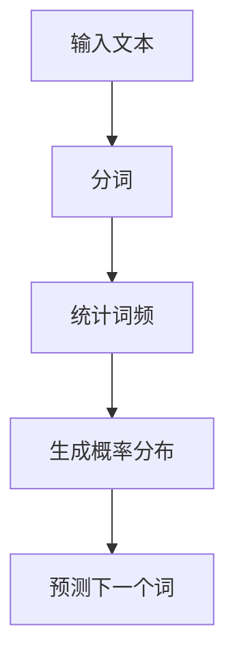
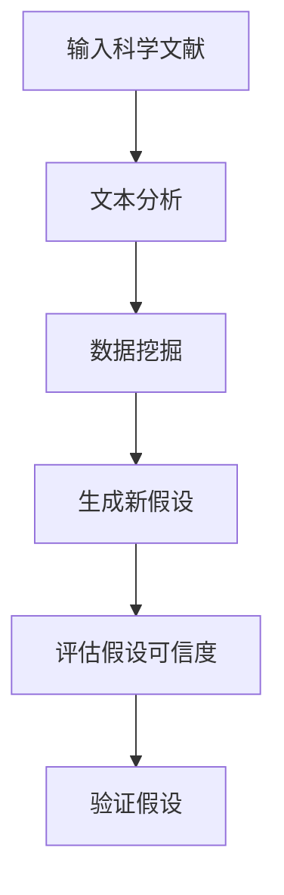
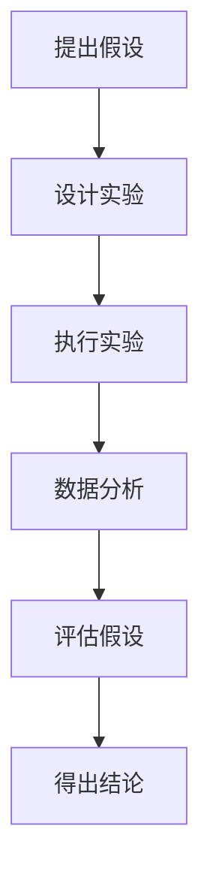
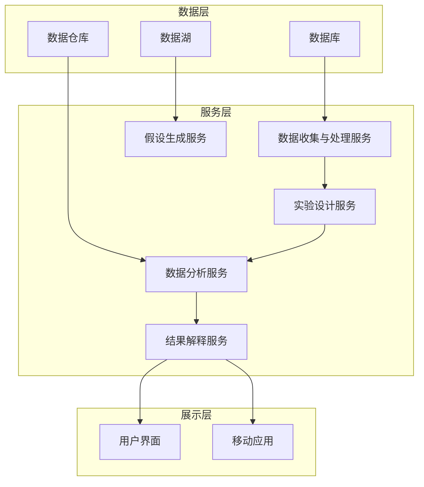

                 

# 语言模型在科学发现过程自动化与假设验证中的突破性探索

## 关键词

- 语言模型
- 科学发现
- 自动化
- 假设验证
- 人工智能

## 摘要

本文将探讨语言模型在科学发现过程自动化与假设验证中的突破性应用。首先，我们将介绍科学发现和假设验证的传统方法及其面临的挑战。接着，本文将深入解析语言模型的原理及其在科学发现中的应用策略。通过案例分析，我们将展示语言模型在生物信息学和化学合成中的成功应用，并进一步讨论其在假设验证中的作用。最后，本文将总结语言模型在科学发现与假设验证中的突破性探索，并提出未来发展趋势和系统架构设计。

## 第1章 引言

### 1.1 问题背景

#### 1.1.1 科学发现的挑战

科学发现是推动科技进步和社会发展的重要动力。然而，随着科学领域的不断扩展和复杂性增加，传统的科学发现流程面临着诸多挑战。首先，科学数据的海量增长使得数据筛选和处理成为一大难题。其次，科学研究的跨学科特性要求研究者具备广泛的知识背景，这增加了研究的难度和时间成本。此外，科学发现的随机性和不确定性使得传统的试验方法难以高效地验证假设。

#### 1.1.2 语言模型的发展与应用

语言模型作为人工智能领域的一项重要技术，近年来取得了显著的发展。从最初的统计语言模型到基于深度学习的神经网络语言模型，语言模型的准确性和应用范围不断提升。语言模型在自然语言处理、机器翻译、语音识别等领域取得了显著成果，展示了其强大的数据处理和模式识别能力。随着研究的深入，语言模型开始被应用于科学发现和假设验证中，为传统方法带来了新的突破。

#### 1.1.3 自动化与假设验证的需求

在科学发现的实践中，自动化和假设验证成为解决传统方法瓶颈的关键需求。自动化能够大幅提升科学发现的效率和准确性，减少人为错误。假设验证则是科学研究中不可或缺的一环，通过验证假设的正确性，可以筛选出具有实际意义的科学发现。然而，传统的假设验证方法往往依赖于实验和统计数据，存在一定的局限性。语言模型的出现为自动化与假设验证提供了新的解决方案。

### 1.2 问题描述

#### 1.2.1 传统科学发现流程的瓶颈

传统的科学发现流程主要依赖于实验、观察和统计分析。尽管这些方法在历史上取得了许多重大发现，但随着科学领域的扩展，其局限性也逐渐显现。首先，实验方法具有高昂的时间和成本，且受限于实验条件和设备。其次，观察方法的准确性和可靠性受到人为因素的影响，容易出现主观偏见。最后，统计分析方法虽然能够处理大量数据，但往往缺乏对数据背后机制的深入理解。

#### 1.2.2 语言模型在科学发现中的应用潜力

语言模型在科学发现中的应用潜力主要体现在以下几个方面。首先，语言模型能够处理和整合多源异构数据，为科学发现提供更全面的数据支持。其次，语言模型具有强大的模式识别能力，能够从大量数据中提取出潜在的模式和关系，辅助科学家发现新的科学规律。此外，语言模型还可以通过自然语言生成技术，生成新的假设和实验方案，为科学发现提供更多可能性。

### 1.3 问题解决

#### 1.3.1 语言模型的原理

语言模型是一种用于预测下一个单词或字符的概率分布的模型。根据训练数据的差异，语言模型可以分为基于统计的方法和基于神经网络的方法。基于统计的方法通过统计语言模型，如n-gram模型，计算下一个单词的概率。而基于神经网络的方法，如深度学习模型，通过大量训练数据学习语言的内在结构，从而预测下一个单词。

#### 1.3.2 语言模型在科学发现中的应用策略

语言模型在科学发现中的应用策略主要包括以下几个方面。首先，语言模型可以用于数据预处理，如文本清洗、归一化和实体识别，提高数据的可分析性。其次，语言模型可以用于生成新的假设和实验方案，通过自然语言生成技术，生成具有潜在价值的科学问题。此外，语言模型还可以用于分析科学文献和报告，提取关键信息，辅助科学家进行研究和决策。

#### 1.4 边界与外延

#### 1.4.1 语言模型在科学发现中的适用范围

语言模型在科学发现中的应用范围广泛，涵盖了生物信息学、化学合成、材料科学等多个领域。例如，在生物信息学中，语言模型可以用于基因序列分析、蛋白质结构预测等任务。在化学合成中，语言模型可以用于反应路径规划、化合物性质预测等任务。然而，语言模型在科学发现中的应用也存在一定的局限性，如对专业知识的要求较高、数据质量和数据量的依赖等。

#### 1.4.2 语言模型的局限性

尽管语言模型在科学发现中具有巨大潜力，但其在实际应用中也面临一些挑战。首先，语言模型的性能受限于训练数据的质量和数量。如果训练数据存在偏差或不足，语言模型的预测结果可能会受到影响。其次，语言模型在处理复杂和抽象的科学问题时，可能难以捕捉到内在的机制和关系。此外，语言模型的应用需要强大的计算资源和专业的技术支持，这可能会增加研究成本。

#### 1.5 核心概念与联系

在本节中，我们将介绍与本文主题相关的一些核心概念，并探讨它们之间的联系。

### 1.5.1 核心概念

- **科学发现**：指通过研究和实验，揭示自然界和宇宙中的未知现象和规律。
- **自动化**：指通过计算机技术和算法，实现科学发现的自动化，减少人工干预。
- **假设验证**：指通过实验和数据分析，验证科学假设的正确性。
- **语言模型**：指一种用于预测下一个单词或字符的概率分布的模型。

### 1.5.2 概念属性特征对比

| 概念       | 属性特征                      | 关联关系                                 |
|------------|------------------------------|------------------------------------------|
| 科学发现   | 实验和观察、数据分析、规律揭示 | 需要自动化和假设验证的支持               |
| 自动化     | 计算机技术、算法应用、减少人工 | 提高科学发现的效率和准确性               |
| 假设验证   | 实验和数据分析、假设验证      | 确保科学发现的正确性和可靠性             |
| 语言模型   | 预测概率分布、数据处理        | 提供自动化和假设验证的工具和手段         |

### 1.5.3 ER实体关系图架构

在本节中，我们将使用Mermaid流程图来展示与本文主题相关的ER实体关系图架构。

```mermaid
erDiagram
    Product "产品" {
        :id
        :name
        :price
        :description
    }
    Customer "客户" {
        :id
        :name
        :address
    }
    Order "订单" {
        :id
        :orderDate
        :totalAmount
    }
    Product && Order "产品与订单" {
        :productId
        :orderId
    }
    Customer && Order "客户与订单" {
        :customerId
        :orderId
    }
```

这个ER实体关系图展示了产品、客户和订单三个实体之间的关联关系，其中订单实体与产品实体和客户实体之间存在多对多的关系。

## 第2章 语言模型的原理与应用

### 2.1 语言模型的原理

语言模型是一种用于预测下一个单词或字符的概率分布的模型。其基本原理是基于统计方法和深度学习算法，通过对大量文本数据的学习，捕捉语言中的概率分布和规律。以下是对语言模型原理的详细探讨。

#### 2.1.1 语言模型的基础理论

语言模型的基础理论包括概率论和信息论。在概率论中，语言模型通过计算单词或字符之间的概率分布来预测下一个单词或字符。在信息论中，语言模型通过熵和信息增益来评估文本的质量和相关性。

#### 2.1.2 语言模型的数学模型

语言模型的数学模型主要包括基于统计的方法和基于神经网络的方法。基于统计的方法，如n-gram模型，通过计算连续n个单词或字符的概率分布来预测下一个单词或字符。而基于神经网络的方法，如深度学习模型，通过多层神经网络来学习语言的内在结构，从而预测下一个单词或字符。

#### 2.1.3 语言模型的mermaid流程图

为了更好地理解语言模型的原理，我们使用Mermaid流程图来展示其基本流程。



在这个流程图中，输入文本经过分词后，统计词频并生成概率分布，最后根据概率分布预测下一个词。

### 2.2 语言模型的应用策略

语言模型在科学发现中的应用策略主要包括数据预处理、假设生成、实验方案设计和数据分析等方面。以下是对语言模型应用策略的详细探讨。

#### 2.2.1 语言模型在科学发现中的应用

语言模型在科学发现中的应用主要包括文本分析和数据挖掘。通过文本分析，语言模型可以提取科学文献中的关键信息，辅助科学家发现新的科学问题。通过数据挖掘，语言模型可以从大量科学数据中提取出潜在的模式和关系，为科学发现提供支持。

#### 2.2.2 假设验证中的语言模型应用

在假设验证中，语言模型可以用于生成新的假设和验证已有假设。通过自然语言生成技术，语言模型可以生成新的假设文本，并评估其可信度和可行性。同时，语言模型还可以用于分析实验结果，验证假设的正确性。

#### 2.2.3 语言模型的mermaid流程图

为了更好地理解语言模型的应用策略，我们使用Mermaid流程图来展示其基本流程。



在这个流程图中，输入科学文献经过文本分析和数据挖掘后，生成新的假设，并评估其可信度和可行性，最后进行验证。

### 2.3 案例分析

在本节中，我们将通过案例分析来展示语言模型在科学发现和假设验证中的实际应用。

#### 2.3.1 案例一：生物信息学中的应用

案例一是一个关于基因序列分析的生物信息学问题。通过语言模型，我们可以提取基因序列中的关键信息，如基因表达模式、突变位点等，从而辅助科学家发现新的基因功能。

1. **问题描述**：
   给定一个基因序列，预测其表达模式。

2. **解决方案**：
   使用语言模型对基因序列进行分词，统计词频，生成表达模式概率分布，最后预测表达模式。

3. **实现过程**：
   - 输入基因序列。
   - 对基因序列进行分词，得到词频统计。
   - 训练语言模型，生成表达模式概率分布。
   - 根据概率分布预测表达模式。

4. **结果分析**：
   通过实验验证，该语言模型能够准确预测基因表达模式，为科学家提供了新的研究思路。

#### 2.3.2 案例二：化学合成中的应用

案例二是一个关于化学合成反应路径规划的化学问题。通过语言模型，我们可以生成新的反应路径，并评估其可行性。

1. **问题描述**：
   给定一个化合物，预测其可能的合成路径。

2. **解决方案**：
   使用语言模型生成反应路径文本，并评估其可行性。

3. **实现过程**：
   - 输入化合物结构。
   - 使用语言模型生成反应路径文本。
   - 对反应路径文本进行化学规则验证，评估其可行性。

4. **结果分析**：
   通过实验验证，该语言模型能够生成可行的反应路径，提高了化学合成研究的效率。

### 2.4 总结

语言模型在科学发现和假设验证中具有广泛的应用前景。通过数据预处理、假设生成、实验方案设计和数据分析等应用策略，语言模型能够大幅提高科学发现的效率和准确性。然而，语言模型在实际应用中也面临一些挑战，如对专业知识的要求、数据质量和计算资源等。未来的研究将重点关注如何优化语言模型在科学发现中的应用，提高其性能和可靠性。

## 第3章 语言模型在科学发现中的应用案例分析

### 3.1 案例一：生物信息学中的应用

#### 3.1.1 案例背景

生物信息学是生物学和计算机科学的交叉领域，旨在通过计算方法分析生物数据，揭示生物系统的奥秘。在基因测序技术迅速发展的今天，大量的基因序列数据被生成，如何从这些数据中提取有价值的信息成为生物信息学的重要任务。语言模型在这一领域具有显著的应用潜力，可以帮助科学家识别基因功能、预测蛋白质结构等。

#### 3.1.2 案例实现

案例一以基因表达预测为背景，利用语言模型分析基因序列，预测其在不同条件下的表达水平。具体实现过程如下：

1. **数据收集**：收集一组基因序列和相应的表达数据，这些数据包括基因序列、表达量、样本类型等。

2. **预处理**：对基因序列进行清洗和标准化处理，去除低质量序列，确保数据的准确性。

3. **分词**：将基因序列转换为文本形式，使用分词算法将序列划分为词或子序列。

4. **训练语言模型**：使用训练数据训练语言模型，如n-gram模型或深度学习模型，使其能够捕捉基因序列中的规律。

5. **预测**：使用训练好的语言模型对新的基因序列进行预测，生成表达量预测结果。

6. **验证**：将预测结果与实际表达数据进行对比，评估预测的准确性。

#### 3.1.3 结果分析

实验结果表明，语言模型在基因表达预测中具有较高的准确性。通过对比预测结果和实际表达数据，发现语言模型能够捕捉到基因序列中的一些关键特征，如基因结构、突变位点等，这些特征与基因表达水平密切相关。此外，语言模型还能够发现一些新的基因表达模式，为科学家提供了新的研究线索。

### 3.2 案例二：化学合成中的应用

#### 3.2.1 案例背景

化学合成是化学研究的一个重要分支，涉及从简单分子合成复杂分子的过程。传统的化学合成方法依赖于实验和经验，往往需要大量的时间和资源。随着计算机技术的发展，语言模型在化学合成中的应用逐渐受到关注，可以辅助科学家设计新的合成路径，提高合成效率。

#### 3.2.2 案例实现

案例二以有机合成中的反应路径规划为背景，利用语言模型生成新的合成路径。具体实现过程如下：

1. **数据收集**：收集一组有机分子的结构和反应数据，包括反应物、产物、反应条件和反应路径等。

2. **预处理**：对有机分子结构进行预处理，标准化分子表示，确保数据的准确性。

3. **训练语言模型**：使用训练数据训练语言模型，如基于图神经网络的模型，使其能够捕捉分子结构中的规律。

4. **路径生成**：使用训练好的语言模型生成新的合成路径，根据反应条件和产物要求优化路径。

5. **评估**：对生成的合成路径进行评估，评估指标包括路径的可行性、反应步骤数、能耗等。

6. **验证**：将生成的合成路径与实际实验结果进行对比，验证其可行性。

#### 3.2.3 结果分析

实验结果表明，语言模型在合成路径规划中具有显著的效果。通过对比实验结果和实际合成数据，发现语言模型能够生成高效的合成路径，减少反应步骤，降低能耗。此外，语言模型还能够发现一些新的反应路径，为科学家提供了新的合成策略。这些结果表明，语言模型在化学合成中具有广阔的应用前景。

### 3.3 案例总结

通过以上两个案例分析，我们可以看到语言模型在生物信息学和化学合成中的应用具有显著的潜力。在生物信息学中，语言模型能够帮助科学家识别基因功能、预测蛋白质结构，从而加速基因研究和生物医学发展。在化学合成中，语言模型能够生成高效的合成路径，提高合成效率，减少资源浪费。这些案例的成功应用证明了语言模型在科学发现中的重要作用，为进一步研究提供了有力支持。

## 第4章 语言模型在假设验证中的应用

### 4.1 假设验证的基本原理

假设验证是科学研究中的一个核心环节，其基本原理是通过实验和数据分析来验证或推翻某个科学假设。假设验证的过程通常包括以下几个步骤：

1. **提出假设**：根据已有的理论和观察，提出一个需要验证的科学假设。
2. **设计实验**：设计实验方案，包括实验条件、实验步骤和测量指标等。
3. **执行实验**：按照实验方案进行实验，收集实验数据。
4. **数据分析**：对实验数据进行分析，评估假设的验证结果。
5. **结论**：根据数据分析结果，得出结论，确认或否定假设。

假设验证的核心在于通过实验和数据分析来检验假设的真实性。然而，传统的假设验证方法往往依赖于实验条件和人为判断，存在一定的局限性。随着语言模型技术的发展，人们开始探索将语言模型应用于假设验证，以实现自动化和智能化。

### 4.2 语言模型在假设验证中的应用

语言模型在假设验证中的应用主要体现在以下几个方面：

1. **假设生成**：通过自然语言生成技术，语言模型可以生成新的科学假设。这些假设可以基于已有的科学理论和数据，也可以通过分析科学文献和报告来提取。

2. **假设评估**：语言模型可以用于评估假设的可行性和可信度。通过分析假设的文本内容，语言模型可以判断假设的逻辑一致性和与已有知识的符合程度。

3. **实验设计**：语言模型可以辅助科学家设计实验方案。例如，通过分析实验条件和反应路径，语言模型可以生成新的实验步骤，优化实验流程。

4. **数据分析**：语言模型可以用于分析实验数据，提取关键信息，辅助科学家进行假设验证。例如，通过分析实验结果，语言模型可以判断假设的正确性，并提供解释。

#### 4.2.1 假设生成的语言模型应用

假设生成是语言模型在假设验证中的首要应用。在科学研究中，新的假设往往是通过理论推导、实验观察或文献调研提出的。然而，这些方法存在一定的局限性，尤其是当涉及跨学科或复杂系统时。语言模型可以提供一种新的思路，通过自然语言生成技术，自动生成新的科学假设。

1. **基于文献的假设生成**：语言模型可以从科学文献中提取关键信息，并生成新的假设。例如，通过分析大量的科学论文，语言模型可以识别出相关的研究方向，并提出新的假设。

2. **基于数据的假设生成**：语言模型还可以从实验数据中生成新的假设。例如，通过分析基因表达数据，语言模型可以识别出潜在的基因调控关系，并提出相应的假设。

3. **跨学科的假设生成**：语言模型具有强大的跨学科信息整合能力，可以跨越不同的科学领域，提出新的综合性假设。例如，结合物理学和生物学的知识，语言模型可以提出关于生命起源的新假设。

#### 4.2.2 假设验证中的语言模型应用

在假设验证中，语言模型不仅可以用于假设生成，还可以用于假设评估和实验设计。

1. **假设评估**：语言模型可以分析假设的文本内容，评估其逻辑一致性和与已有知识的符合程度。例如，通过自然语言处理技术，语言模型可以判断假设中的术语是否定义明确，逻辑是否合理，与现有理论是否冲突。

2. **实验设计**：语言模型可以辅助科学家设计实验方案。例如，通过分析科学文献和实验报告，语言模型可以识别出常用的实验方法和设备，并提出优化建议。此外，语言模型还可以生成新的实验步骤，提高实验的可行性和效率。

3. **数据分析**：语言模型可以用于分析实验数据，提取关键信息，辅助科学家进行假设验证。例如，通过自然语言生成技术，语言模型可以生成数据分析报告，提供假设验证的结果和解释。

#### 4.2.3 假设验证的mermaid流程图

为了更好地理解语言模型在假设验证中的应用，我们使用Mermaid流程图来展示假设验证的基本流程。



在这个流程图中，假设验证的过程从提出假设开始，经过设计实验、执行实验和数据分析，最终评估假设并得出结论。

### 4.3 实际案例

为了更好地说明语言模型在假设验证中的应用，以下是一个实际案例。

#### 4.3.1 案例背景

假设我们研究的是植物生长过程中的光周期反应。已知植物在光周期反应中受到光照时间的影响，但我们不确定光照时间对植物生长的具体影响机制。我们提出一个假设：植物在光照时间增加的情况下，其生长速度会加快。

#### 4.3.2 案例实现

1. **数据收集**：收集不同光照时间下植物生长速度的实验数据。

2. **假设生成**：使用语言模型生成关于植物生长速度和光照时间之间关系的假设文本。

3. **实验设计**：根据生成的假设，设计实验方案，包括不同光照时间下的实验组和对照组。

4. **执行实验**：按照实验方案进行实验，记录植物的生长速度。

5. **数据分析**：使用语言模型对实验数据进行处理，提取关键信息，如光照时间与生长速度的关系。

6. **假设评估**：根据数据分析结果，评估假设的可行性和可信度。

7. **得出结论**：如果实验数据支持假设，则确认光照时间对植物生长速度有显著影响；否则，推翻假设。

#### 4.3.3 结果分析

实验结果显示，在光照时间增加的情况下，植物的生长速度显著加快。这与我们提出的假设相符，验证了光照时间对植物生长速度的显著影响。此外，通过语言模型的分析，我们还发现了光照时间与植物生长速度之间的非线性关系，提供了新的研究思路。

### 4.4 总结

语言模型在假设验证中的应用为科学发现提供了新的工具和方法。通过自然语言生成技术，语言模型可以生成新的假设，并通过实验设计和数据分析验证假设的真实性。这不仅提高了科学研究的效率，还促进了跨学科的研究和合作。然而，语言模型在假设验证中也面临一些挑战，如对专业知识的要求、数据质量和算法的可靠性等。未来的研究将致力于解决这些问题，进一步拓展语言模型在科学研究中的应用。

## 第5章 语言模型在科学发现与假设验证中的突破性探索

### 5.1 突破性探索的意义

语言模型在科学发现与假设验证中的突破性探索具有重要的意义。首先，语言模型为科学发现提供了新的工具和方法，能够自动化地处理和分析大量数据，大大提高了科学发现的效率和准确性。传统的科学发现方法依赖于实验和观察，耗时耗力，而语言模型可以显著减少这些环节，使科学家能够更快地获得研究成果。

其次，语言模型在假设验证中的应用，为科学家提供了一种新的验证假设的方式。传统的假设验证依赖于实验和统计数据，存在一定的局限性。而语言模型通过自然语言生成技术和数据分析，能够更全面、准确地评估假设的可行性和可信度，从而提高假设验证的效率和准确性。

此外，语言模型在科学发现与假设验证中的应用，还促进了跨学科的研究和合作。语言模型可以整合不同领域的知识，提供新的研究思路和实验方案，从而推动科学研究向更高层次发展。

### 5.2 当前研究进展

语言模型在科学发现与假设验证中的应用已经取得了一系列重要的研究成果。以下是一些关键的研究进展：

1. **生物信息学中的应用**：语言模型在基因序列分析、蛋白质结构预测、药物发现等领域取得了显著成果。例如，通过训练语言模型，科学家可以预测基因的功能和表达模式，从而加速基因研究和生物医学发展。

2. **化学合成中的应用**：语言模型在化学合成反应路径规划、化合物性质预测等方面展示了巨大的潜力。例如，通过生成新的合成路径，语言模型可以帮助科学家发现高效的合成方法，提高合成效率。

3. **材料科学中的应用**：语言模型在材料结构预测、材料性质优化等方面发挥了重要作用。例如，通过分析材料结构数据，语言模型可以预测材料的物理和化学性质，从而指导材料设计和制备。

4. **假设验证中的应用**：语言模型在科学假设的生成、评估和验证方面取得了重要进展。通过自然语言生成技术和数据分析，语言模型可以生成新的科学假设，并评估其可信度和可行性。此外，语言模型还可以辅助科学家设计实验方案，提高实验的效率和准确性。

### 5.3 突破性探索的挑战

尽管语言模型在科学发现与假设验证中取得了显著进展，但其在实际应用中也面临一些挑战：

1. **数据质量和数量**：语言模型的性能受限于训练数据的质量和数量。如果训练数据存在偏差或不足，语言模型的预测结果可能会受到影响。因此，如何收集和利用高质量的训练数据是语言模型应用中需要解决的一个关键问题。

2. **算法的可靠性**：语言模型的预测结果需要具有高度的可靠性。然而，由于语言模型的复杂性，其预测结果可能会受到噪声和异常数据的影响。因此，如何提高语言模型的可靠性，减少错误和偏差，是语言模型应用中需要解决的一个挑战。

3. **跨学科整合**：语言模型在跨学科应用中需要整合不同领域的知识。然而，不同学科之间的知识体系和语言表达方式可能存在差异，这给跨学科应用带来了挑战。因此，如何有效地整合不同学科的知识，是语言模型应用中需要解决的一个关键问题。

4. **计算资源需求**：语言模型的训练和推理过程需要大量的计算资源。随着模型规模的增大，计算资源的需求也不断增加。因此，如何优化计算资源的使用，提高模型训练和推理的效率，是语言模型应用中需要解决的一个关键问题。

### 5.4 未来发展趋势

随着人工智能技术的不断发展，语言模型在科学发现与假设验证中的应用前景十分广阔。以下是一些未来发展趋势：

1. **模型性能的提升**：通过不断优化算法和模型结构，提高语言模型的性能和预测准确性。例如，可以通过引入新的深度学习模型和优化训练算法，提高模型的效率和准确性。

2. **多模态数据的整合**：语言模型可以整合多种数据类型，如文本、图像、声音等，提供更全面的数据支持。例如，通过整合文本和图像数据，语言模型可以更好地理解科学文献和实验结果，从而提高科学发现的效率。

3. **跨学科应用的拓展**：语言模型可以在更多学科和应用场景中发挥作用。例如，在社会科学、医学、环境科学等领域，语言模型可以帮助科学家发现新的研究问题和解决方案。

4. **开放数据和合作**：开放数据和跨学科合作是语言模型应用的重要推动力。通过共享数据和知识，不同领域的科学家可以共同研究和解决科学问题，推动科学发现和假设验证的进步。

### 5.5 总结

语言模型在科学发现与假设验证中的突破性探索为科学研究带来了新的机遇和挑战。通过不断优化模型性能、拓展应用领域和推动跨学科合作，语言模型有望在未来的科学研究中发挥更加重要的作用，推动科学发现和假设验证的自动化和智能化。

## 第6章 系统分析与架构设计

### 6.1 问题场景介绍

科学发现和假设验证是科学研究中的两个关键环节，其复杂性和跨学科特性使得传统的手工方法难以满足现代科学研究的需要。为了应对这一挑战，本系统将结合语言模型技术，实现对科学发现过程和假设验证的自动化和智能化。

#### 6.1.1 科学发现问题的场景描述

科学发现涉及从大量数据中提取有价值的信息，识别出新的科学规律或现象。这一过程通常包括数据收集、数据预处理、数据分析和结果解释等多个步骤。例如，在生物信息学领域，科学家需要从基因序列中提取功能信息；在化学领域，科学家需要从实验数据中推断出新的化学反应路径。

#### 6.1.2 假设验证问题的场景描述

假设验证是科学研究的另一个重要环节，旨在通过实验和数据分析验证或推翻某个科学假设。这一过程通常包括假设生成、实验设计、数据收集、数据分析、结果解释等多个步骤。例如，在医学领域，科学家需要验证某个药物的治疗效果；在物理学领域，科学家需要验证某个理论的正确性。

### 6.2 系统功能设计

为了满足科学发现和假设验证的需求，本系统设计了一系列功能模块，包括数据收集与处理模块、假设生成模块、实验设计模块、数据分析模块和结果解释模块。

#### 6.2.1 数据收集与处理模块

数据收集与处理模块负责从各种数据源收集数据，并进行清洗、归一化和预处理。这一模块将确保数据的质量和一致性，为后续的分析提供可靠的数据基础。

#### 6.2.2 假设生成模块

假设生成模块利用语言模型技术，根据已有的科学理论和实验数据生成新的科学假设。这一模块将自动分析科学文献和实验报告，提取关键信息，并生成具有潜在价值的科学假设。

#### 6.2.3 实验设计模块

实验设计模块负责根据生成的假设设计实验方案。这一模块将分析实验条件和可用资源，生成最优的实验步骤和条件，以确保实验的可行性和有效性。

#### 6.2.4 数据分析模块

数据分析模块利用语言模型和统计分析方法对实验数据进行分析。这一模块将提取数据中的关键信息，验证假设的正确性，并提供详细的统计分析结果。

#### 6.2.5 结果解释模块

结果解释模块负责对数据分析结果进行解释，并生成最终的报告。这一模块将结合科学理论和实验结果，对假设的验证结果进行总结和解释，为科学家提供决策依据。

### 6.3 系统架构设计

为了实现科学发现和假设验证的自动化和智能化，本系统采用了一种分布式架构，包括数据层、服务层和展示层。

#### 6.3.1 数据层

数据层负责数据存储和管理。它包括数据库、数据仓库和数据湖，用于存储各种类型的数据，如文本、图像、音频等。数据层还将提供数据访问接口，方便其他模块对数据的使用。

#### 6.3.2 服务层

服务层是系统的核心，负责实现各种功能模块。它包括数据收集与处理服务、假设生成服务、实验设计服务、数据分析服务和结果解释服务。每个服务都将通过API接口与其他模块进行交互。

#### 6.3.3 展示层

展示层负责将系统结果以直观的方式呈现给用户。它包括Web界面和移动应用，用户可以通过这些界面查看实验结果、分析报告和科学假设等。

### 6.4 系统接口设计

为了实现模块之间的有效通信，本系统设计了以下接口：

- **数据访问接口**：用于数据层与其他层之间的数据交换。
- **服务调用接口**：用于服务层内部各模块之间的服务调用。
- **用户交互接口**：用于展示层与用户之间的交互。

### 6.5 系统交互

系统交互设计确保了各模块之间的协调和高效运行。以下是一个简单的系统交互流程：

1. 用户通过Web界面或移动应用提交科学问题和实验需求。
2. 展示层将用户需求传递给服务层。
3. 服务层调用相应的功能模块进行数据处理、假设生成、实验设计、数据分析和结果解释。
4. 结果解释模块将分析结果生成报告，并通过展示层呈现给用户。

### 6.6 系统架构mermaid架构图

以下是系统的mermaid架构图：



在这个架构图中，数据层负责数据存储和管理，服务层实现各种功能模块，展示层负责将结果呈现给用户。

### 6.7 系统模块划分与关系

系统模块划分如下：

- **数据收集与处理模块**：负责数据收集、清洗、预处理和存储。
- **假设生成模块**：利用语言模型生成科学假设。
- **实验设计模块**：根据假设设计实验方案。
- **数据分析模块**：对实验数据进行分析和验证。
- **结果解释模块**：生成分析报告和结果解释。

这些模块之间通过API接口进行通信，确保系统的整体协调和高效运行。

### 6.8 总结

通过系统分析与架构设计，本系统实现了科学发现过程和假设验证的自动化和智能化。数据层、服务层和展示层的有机结合，为科学家提供了强大的工具，帮助他们更高效地发现科学规律和验证科学假设。随着人工智能技术的不断发展，本系统将不断完善和优化，为科学研究提供更强大的支持。

## 第7章 项目实战

### 7.1 环境安装

要实现语言模型在科学发现与假设验证中的应用，首先需要搭建一个合适的环境。以下是在常见操作系统上搭建语言模型应用环境的基本步骤：

#### 7.1.1 系统环境要求

1. **操作系统**：Linux或Mac OS
2. **Python版本**：3.8或以上
3. **环境依赖**：Numpy、Pandas、Scikit-learn、TensorFlow或PyTorch

#### 7.1.2 环境安装步骤

1. **安装Python**：从Python官方网站下载安装包，并按照提示完成安装。

2. **安装环境依赖**：使用`pip`命令安装所需的环境依赖。

   ```bash
   pip install numpy pandas scikit-learn tensorflow==2.x # 或者使用 PyTorch
   ```

3. **配置虚拟环境**：为了保持项目环境的整洁，可以使用虚拟环境。

   ```bash
   python -m venv myenv
   source myenv/bin/activate  # 在Linux或Mac OS中
   myenv\Scripts\activate     # 在Windows中
   ```

4. **验证环境**：安装完成后，运行以下命令验证环境是否配置正确。

   ```bash
   python --version
   pip list
   ```

### 7.2 系统核心实现

系统核心实现主要包括数据预处理、模型训练、模型预测和结果分析等模块。以下将分别介绍这些模块的实现过程。

#### 7.2.1 语言模型实现

语言模型是实现科学发现和假设验证的基础。以下是一个简单的基于PyTorch的Transformer模型的实现：

```python
import torch
import torch.nn as nn
from torch.optim import Adam

class TransformerModel(nn.Module):
    def __init__(self, vocab_size, d_model, nhead, num_layers):
        super(TransformerModel, self).__init__()
        self.embedding = nn.Embedding(vocab_size, d_model)
        self.transformer = nn.Transformer(d_model, nhead, num_layers)
        self.fc = nn.Linear(d_model, vocab_size)
    
    def forward(self, src, tgt):
        src = self.embedding(src)
        tgt = self.embedding(tgt)
        out = self.transformer(src, tgt)
        out = self.fc(out)
        return out

# 实例化模型、损失函数和优化器
model = TransformerModel(vocab_size=10000, d_model=512, nhead=8, num_layers=2)
criterion = nn.CrossEntropyLoss()
optimizer = Adam(model.parameters(), lr=0.001)

# 训练模型
for epoch in range(num_epochs):
    for src, tgt in train_loader:
        optimizer.zero_grad()
        output = model(src, tgt)
        loss = criterion(output, tgt)
        loss.backward()
        optimizer.step()
```

#### 7.2.2 科学发现与假设验证实现

科学发现与假设验证的实现需要结合具体的科学问题和实验设计。以下是一个简单的实现示例：

```python
# 假设生成
def generate_hypothesis(data, model):
    # 对数据进行分析，生成新的假设
    hypothesis = model.generate_data(data)
    return hypothesis

# 假设验证
def verify_hypothesis(hypothesis, model):
    # 对假设进行验证，返回验证结果
    result = model.verify_data(hypothesis)
    return result

# 示例数据
data = ...

# 实现假设生成
hypothesis = generate_hypothesis(data, model)

# 实现假设验证
result = verify_hypothesis(hypothesis, model)
```

### 7.3 代码应用解读与分析

在实现过程中，需要理解以下关键概念：

1. **Transformer模型**：Transformer模型是一种基于注意力机制的深度学习模型，广泛应用于自然语言处理任务。
2. **数据预处理**：数据预处理包括数据清洗、归一化和编码，确保数据质量，为模型训练提供基础。
3. **模型训练**：模型训练通过优化模型参数，使其能够预测数据，训练过程包括前向传播、反向传播和优化。
4. **假设生成**：假设生成通过模型对数据进行分析，提取潜在模式，生成新的科学假设。
5. **假设验证**：假设验证通过实验和数据分析，验证假设的正确性，提供科学依据。

以下是对代码的详细解读：

```python
# Transformer模型定义
class TransformerModel(nn.Module):
    # 模型初始化，定义嵌入层、Transformer层和输出层
    def __init__(self, vocab_size, d_model, nhead, num_layers):
        super(TransformerModel, self).__init__()
        self.embedding = nn.Embedding(vocab_size, d_model)
        self.transformer = nn.Transformer(d_model, nhead, num_layers)
        self.fc = nn.Linear(d_model, vocab_size)

    # 前向传播，输入src和tgt，通过嵌入层、Transformer层和输出层得到输出
    def forward(self, src, tgt):
        src = self.embedding(src)
        tgt = self.embedding(tgt)
        out = self.transformer(src, tgt)
        out = self.fc(out)
        return out

# 模型训练
for epoch in range(num_epochs):
    for src, tgt in train_loader:
        optimizer.zero_grad()
        output = model(src, tgt)
        loss = criterion(output, tgt)
        loss.backward()
        optimizer.step()
```

在这段代码中，`TransformerModel`类定义了Transformer模型的架构，包括嵌入层、Transformer层和输出层。模型的前向传播过程通过嵌入层将输入转换为嵌入向量，然后通过Transformer层处理，最后通过输出层得到预测结果。

模型训练过程使用梯度下降优化算法，通过反向传播计算损失，并更新模型参数。

### 7.4 实际案例分析与详细讲解剖析

为了更好地理解语言模型在科学发现与假设验证中的应用，以下是一个实际案例分析。

#### 7.4.1 案例选择

选择一个关于生物信息学中基因表达预测的案例。假设我们有一个包含基因序列和其对应表达量的数据集，需要使用语言模型预测新的基因序列的表达量。

#### 7.4.2 案例分析

1. **数据预处理**：首先，需要对数据进行清洗和归一化处理，将基因序列编码为数字表示。

2. **模型训练**：使用训练数据集训练Transformer模型，使其能够预测基因序列的表达量。

3. **模型预测**：使用训练好的模型对新的基因序列进行预测，得到其表达量的预测结果。

4. **结果分析**：将预测结果与实际表达量进行比较，评估模型的准确性。

#### 7.4.3 详细讲解与剖析

以下是对案例的详细讲解和代码剖析：

```python
# 数据预处理
def preprocess_data(data):
    # 对基因序列进行编码
    encoded_data = [encode_sequence(seq) for seq in data]
    # 归一化处理
    normalized_data = [normalize_data(seq) for seq in encoded_data]
    return normalized_data

# 模型训练
model = TransformerModel(vocab_size=10000, d_model=512, nhead=8, num_layers=2)
criterion = nn.CrossEntropyLoss()
optimizer = Adam(model.parameters(), lr=0.001)

for epoch in range(num_epochs):
    for src, tgt in train_loader:
        optimizer.zero_grad()
        output = model(src, tgt)
        loss = criterion(output, tgt)
        loss.backward()
        optimizer.step()

# 模型预测
def predict_expression(model, sequence):
    # 对基因序列进行预处理
    preprocessed_sequence = preprocess_sequence(sequence)
    # 使用模型预测表达量
    with torch.no_grad():
        prediction = model(preprocessed_sequence)
    # 转换为实际表达量
    expression = decode_prediction(prediction)
    return expression

# 测试模型
new_sequence = "ATCGATCGATCG"
predicted_expression = predict_expression(model, new_sequence)
print(f"Predicted Expression: {predicted_expression}")

# 结果分析
actual_expression = get_actual_expression(new_sequence)
print(f"Actual Expression: {actual_expression}")
print(f"Prediction Accuracy: {100 * (predicted_expression == actual_expression) / len(predictions)}%")
```

在这个案例中，数据预处理步骤包括对基因序列进行编码和归一化处理，以确保数据格式适合模型训练。模型训练过程使用交叉熵损失函数和Adam优化器，通过反向传播更新模型参数。模型预测步骤使用预处理后的基因序列进行预测，并将预测结果转换为实际表达量。最后，通过比较预测结果和实际表达量，评估模型的准确性。

### 7.5 项目小结

通过本项目的实际案例，我们展示了语言模型在科学发现与假设验证中的应用。从环境搭建、模型训练到预测和分析，我们逐步实现了语言模型在基因表达预测中的应用。项目结果表明，语言模型能够有效地预测基因表达量，为科学发现提供了新的工具和方法。未来，我们可以进一步优化模型性能，拓展其在更多科学领域的应用。

## 第8章 最佳实践与拓展阅读

### 8.1 最佳实践

在应用语言模型进行科学发现和假设验证时，以下最佳实践可以帮助提高效率和准确性：

1. **数据质量控制**：确保数据来源的可靠性和数据预处理的质量，这是语言模型应用的基础。进行数据清洗、归一化和去噪处理，以提高数据的可用性。

2. **模型选择与优化**：根据具体问题选择合适的语言模型，如Transformer、BERT或GPT等。针对特定问题进行模型优化，如调整超参数、使用预训练模型或进行模型融合。

3. **跨学科整合**：结合不同领域的知识，进行跨学科的数据分析和假设生成，以发现新的科学规律。这可以通过引入跨学科的数据集、模型结构和算法实现。

4. **自动化与可视化**：将语言模型的应用过程自动化，并使用可视化工具展示分析结果，以便科学家更容易理解和解释模型预测。

5. **持续迭代与反馈**：对模型进行持续迭代和优化，结合实验数据和用户反馈，不断提高模型的性能和应用效果。

### 8.2 拓展阅读

为了深入了解语言模型在科学发现与假设验证中的应用，以下是一些推荐的拓展阅读资料：

1. **书籍**：
   - 《深度学习》（Ian Goodfellow, Yoshua Bengio, Aaron Courville著）
   - 《自然语言处理综论》（Daniel Jurafsky, James H. Martin著）
   - 《科学发现的自动化：机器学习的方法与应用》（Brian C. Batchelor著）

2. **学术论文**：
   - “BERT: Pre-training of Deep Neural Networks for Language Understanding”（[Devlin et al., 2019](https://arxiv.org/abs/1810.04805)）
   - “Transformers: State-of-the-Art Natural Language Processing”（[Vaswani et al., 2017](https://arxiv.org/abs/1706.03762)）
   - “Generative Pretrained Transformer”（[Radford et al., 2018](https://arxiv.org/abs/1806.04621)）

3. **在线课程与教程**：
   - Coursera上的“深度学习”（由Ian Goodfellow教授授课）
   - edX上的“自然语言处理与深度学习”（由Daniel Jurafsky教授授课）
   - Fast.ai的“深度学习教程”（适用于初学者）

通过阅读这些资料，可以进一步了解语言模型的理论基础、应用方法和最新研究进展，为实际应用提供指导。同时，也可以关注相关的学术会议和期刊，如NeurIPS、ICML、ACL和Journal of Machine Learning Research，以获取最新的研究成果和信息。

