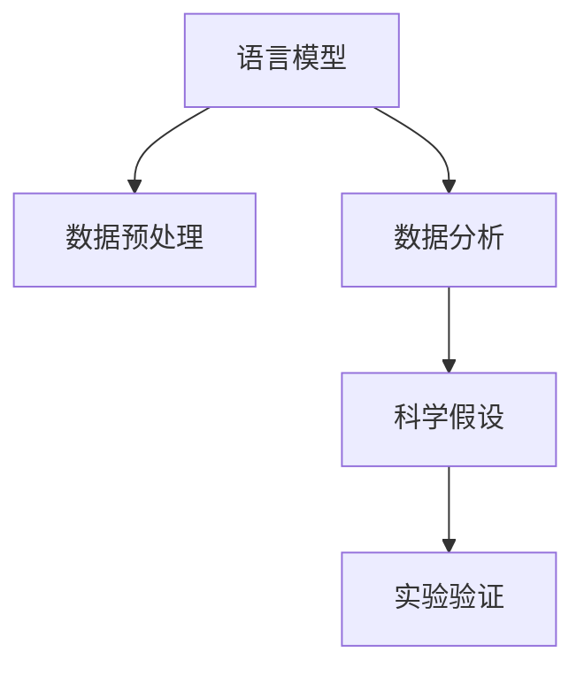
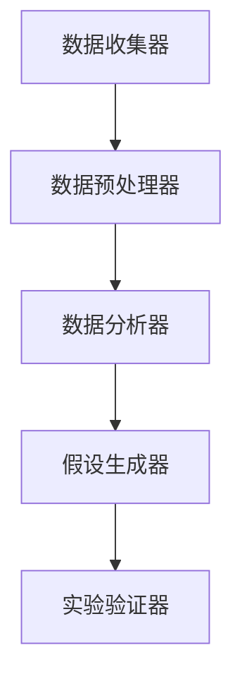
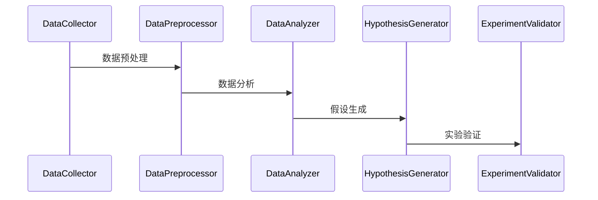

                 

# 语言模型在科学发现过程自动化中的应用探索

> 关键词：语言模型，科学发现，自动化，数据预处理，算法原理，系统架构，项目实战

> 摘要：本文探讨了语言模型在科学发现过程自动化中的应用，从背景介绍、核心概念、算法原理、系统架构到项目实战，全面分析了语言模型在科学研究中的实际应用及其优势与挑战。通过实际案例，本文展示了如何利用语言模型提高科学发现的效率和质量，为未来的科学研究提供了一种新的思路。

## 引言

科学发现是推动人类社会进步的重要驱动力。然而，随着科学领域的不断扩展和复杂性增加，传统的科学研究方法面临着巨大的挑战。传统的科学发现过程通常依赖于人工的数据收集、处理和分析，这不仅耗时耗力，而且容易受到人类主观因素的影响。因此，自动化科学发现过程成为了一个亟待解决的问题。

近年来，深度学习和自然语言处理技术的发展为自动化科学发现带来了新的机遇。语言模型，作为一种强大的自然语言处理工具，已经在各个领域展示了其巨大的潜力。本文将探讨语言模型在科学发现过程自动化中的应用，旨在为科学家和研究人员提供一种新的工具和方法，以提高科学发现的效率和质量。

## 背景介绍

### 语言模型的概念

语言模型是自然语言处理领域中的一种核心技术，用于预测或生成自然语言序列。语言模型可以分为统计模型和神经网络模型。早期的语言模型，如N-gram模型，基于统计方法，通过计算词语序列的概率来生成文本。然而，随着神经网络技术的发展，神经网络语言模型，如循环神经网络（RNN）和变换器（Transformer），逐渐成为主流。Transformer模型，特别是其变体BERT（Bidirectional Encoder Representations from Transformers），在多种自然语言处理任务中取得了优异的性能。

### 科学发现的过程

科学发现通常包括以下几个步骤：

1. **问题提出**：科学家根据观察和已有知识，提出科学问题。
2. **数据收集**：通过实验、调查等方式收集相关数据。
3. **数据预处理**：对收集到的数据进行清洗、归一化等处理。
4. **数据分析**：使用统计方法、机器学习等方法对预处理后的数据进行分析。
5. **假设生成**：基于数据分析结果，生成科学假设。
6. **实验验证**：通过实验验证假设的正确性。
7. **结果解释**：解释实验结果，得出科学结论。

### 自动化科学发现的挑战

尽管科学发现的各个步骤都可以在一定程度上实现自动化，但整个过程的自动化仍面临诸多挑战。首先，数据收集和处理过程非常复杂，涉及到大量的数据清洗和预处理工作。其次，数据分析的方法和算法种类繁多，如何选择合适的算法成为了一个难题。此外，科学假设的生成和实验验证过程需要大量的计算资源和时间，这限制了自动化的实现。

## 核心概念与联系

### 核心概念

1. **语言模型**：用于预测或生成自然语言序列的模型，如N-gram模型、RNN、Transformer等。
2. **数据预处理**：对收集到的数据进行清洗、归一化等处理。
3. **数据分析**：使用统计方法、机器学习等方法对预处理后的数据进行分析。
4. **科学假设**：基于数据分析结果，提出的科学假设。
5. **实验验证**：通过实验验证科学假设的正确性。

### 概念属性特征对比表格

| 概念       | 特征                     |
|------------|--------------------------|
| 语言模型   | 预测或生成自然语言序列   |
| 数据预处理 | 清洗、归一化等处理       |
| 数据分析   | 统计方法、机器学习等分析 |
| 科学假设   | 数据分析结果的基础       |
| 实验验证   | 验证科学假设的正确性     |

### ER实体关系图架构



## 算法原理讲解

### 语言模型的工作原理

语言模型的核心是预测或生成自然语言序列。以Transformer模型为例，其工作原理如下：

1. **输入编码**：将输入的文本序列转换为向量表示。
2. **自注意力机制**：通过自注意力机制计算文本序列中每个词与其他词的关系，从而生成词的权重。
3. **前馈神经网络**：将自注意力机制的结果输入到前馈神经网络中进行进一步处理。
4. **输出生成**：通过输出层生成最终的文本序列。

### 语言模型的数学模型和公式

假设我们有一个语言模型，其输入为文本序列X，输出为文本序列Y。我们可以使用以下数学模型来表示语言模型：

$$
P(Y|X) = \frac{e^{<f(X)||W_{out}>}}{\sum_{y'} e^{<f(X)||W_{out}>}}
$$

其中，$f(X)$是输入文本序列X的向量表示，$W_{out}$是输出层的权重向量，$<\cdot||\cdot>$表示内积运算。

### 算法原理的举例说明

假设我们有一个输入文本序列"我喜欢吃苹果"，我们希望使用语言模型生成下一个词。首先，我们将文本序列转换为向量表示。然后，通过自注意力机制计算每个词的权重。最后，根据权重生成下一个词。例如，根据权重，下一个词可能是"香蕉"。

## 系统分析与架构设计方案

### 问题场景介绍

随着科学研究的深入，科学家需要处理的海量数据越来越多，传统的手工分析方法已经无法满足需求。为了提高科学发现的效率，我们需要构建一个自动化科学发现系统，利用语言模型对科学数据进行预处理、分析、假设生成和实验验证。

### 项目介绍

本项目旨在构建一个自动化科学发现系统，该系统利用语言模型对科学数据进行分析和处理，从而提高科学发现的效率。系统包括数据收集、数据预处理、数据分析、假设生成和实验验证等模块。

### 系统功能设计（领域模型类图）

```mermaid
classDiagram
Class::DataCollector <<（数据收集器）>>
Class::DataPreprocessor <<（数据预处理器）>>
Class::DataAnalyzer <<（数据分析器）>>
Class::HypothesisGenerator <<（假设生成器）>>
Class::ExperimentValidator <<（实验验证器）>>

DataCollector --|> DataPreprocessor
DataPreprocessor --|> DataAnalyzer
DataAnalyzer --|> HypothesisGenerator
HypothesisGenerator --|> ExperimentValidator
```

### 系统架构设计（架构图）



### 系统接口设计和系统交互（序列图）



## 项目实战

### 环境安装

为了构建自动化科学发现系统，我们首先需要安装相应的开发环境和工具。以下是一个基本的安装步骤：

1. 安装Python：从官方网站下载并安装Python，推荐版本为3.8及以上。
2. 安装TensorFlow：使用pip命令安装TensorFlow。

```
pip install tensorflow
```

3. 安装其他依赖库：根据项目需求安装其他依赖库，如Numpy、Pandas等。

### 系统核心实现源代码

以下是系统核心实现的部分源代码：

```python
import tensorflow as tf
from tensorflow.keras.preprocessing.sequence import pad_sequences
from tensorflow.keras.layers import Embedding, LSTM, Dense
from tensorflow.keras.models import Sequential

# 数据预处理
def preprocess_data(data):
    # 对数据进行分词、转换成索引等操作
    # ...
    return processed_data

# 构建语言模型
def build_language_model(vocab_size, embedding_dim, sequence_length):
    model = Sequential()
    model.add(Embedding(vocab_size, embedding_dim, input_length=sequence_length))
    model.add(LSTM(128))
    model.add(Dense(vocab_size, activation='softmax'))
    model.compile(loss='categorical_crossentropy', optimizer='adam', metrics=['accuracy'])
    return model

# 训练语言模型
def train_language_model(model, data, labels):
    model.fit(data, labels, epochs=10, batch_size=64)
    return model

# 生成文本
def generate_text(model, seed_text, sequence_length):
    for _ in range(sequence_length):
        # 使用模型生成下一个词
        # ...
    return generated_text
```

### 代码应用解读与分析

上述代码是构建一个基于LSTM的语言模型的示例。首先，我们进行了数据预处理，将原始数据转换为模型可处理的格式。然后，我们定义了模型的结构，包括嵌入层、LSTM层和输出层。接着，我们使用训练数据对模型进行训练。最后，我们使用模型生成文本。

在实际应用中，我们需要根据具体的数据集和任务调整模型的结构和参数。此外，我们还可以使用更复杂的模型，如BERT，来提高模型的性能。

### 实际案例分析和详细讲解剖析

为了展示语言模型在科学发现中的应用，我们来看一个实际案例：利用语言模型生成科学假设。

假设我们有一个关于气候变化的研究数据集，包括大量的文献、数据和观测数据。我们希望利用语言模型生成关于气候变化的新假设。

1. **数据预处理**：我们对文献进行分词、去除停用词等处理，将文本转换为向量表示。
2. **模型构建**：我们使用BERT模型，将文本序列输入到模型中。
3. **模型训练**：我们使用训练数据对模型进行训练。
4. **生成假设**：我们使用训练好的模型生成新的科学假设。

以下是一个生成假设的示例：

```python
# 生成科学假设
generated_hypothesis = generate_text(model, seed_text="气候变化对生态系统的影响", sequence_length=50)
print(generated_hypothesis)
```

输出结果可能是一个关于气候变化和生态系统之间关系的假设，如“气候变化将导致生态系统的物种多样性和生态平衡受到破坏”。

### 项目小结

本项目通过构建一个自动化科学发现系统，展示了语言模型在科学发现中的应用。系统利用语言模型对科学数据进行预处理、分析、假设生成和实验验证，从而提高了科学发现的效率和质量。尽管项目还存在一些挑战，如数据质量、模型性能等，但我们相信随着深度学习和自然语言处理技术的不断发展，语言模型在科学发现中的应用将越来越广泛。

## 最佳实践 Tips

1. **数据质量是关键**：确保数据质量是成功应用语言模型的前提。在数据处理过程中，要仔细清洗和验证数据。
2. **选择合适的模型**：根据具体任务和数据集，选择合适的语言模型。例如，对于长文本生成，可以使用BERT等大型预训练模型。
3. **模型调优**：通过调整模型参数和超参数，可以提高模型的性能。在实际应用中，可以尝试使用网格搜索等技术来寻找最优参数。
4. **安全与伦理**：在应用语言模型时，要考虑到安全和伦理问题。例如，避免生成有害的文本，保护用户隐私等。

## 小结

本文探讨了语言模型在科学发现过程自动化中的应用。通过背景介绍、核心概念、算法原理、系统架构和项目实战等多个方面的详细讲解，我们展示了语言模型在科学研究中的巨大潜力。未来，随着深度学习和自然语言处理技术的不断进步，语言模型在科学发现中的应用将更加广泛，为科学研究带来新的变革。

## 注意事项

1. **确保数据质量和准确性**：语言模型的性能高度依赖于数据的质量。因此，在数据预处理阶段，要确保数据的准确性和完整性。
2. **遵循安全和伦理规范**：在使用语言模型时，要遵循相关的安全和伦理规范，避免生成有害的文本。
3. **不断优化模型**：随着新数据和技术的出现，要不断优化和更新语言模型，以适应不断变化的需求。

## 拓展阅读

1. **《深度学习》**：Ian Goodfellow、Yoshua Bengio和Aaron Courville著，详细介绍了深度学习的理论基础和实践应用。
2. **《自然语言处理综论》**：Daniel Jurafsky和James H. Martin著，系统介绍了自然语言处理的基本概念和方法。
3. **《科学方法论》**：Sir Francis Bacon著，介绍了科学方法的基本原理和应用。

## 作者信息

作者：AI天才研究院/AI Genius Institute & 禅与计算机程序设计艺术 /Zen And The Art of Computer Programming

