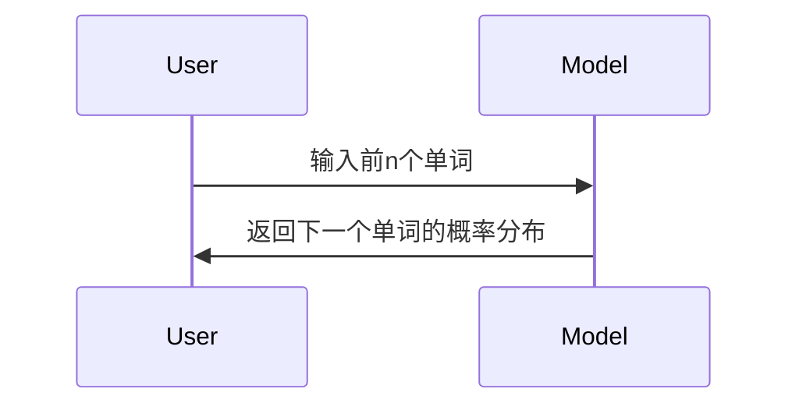
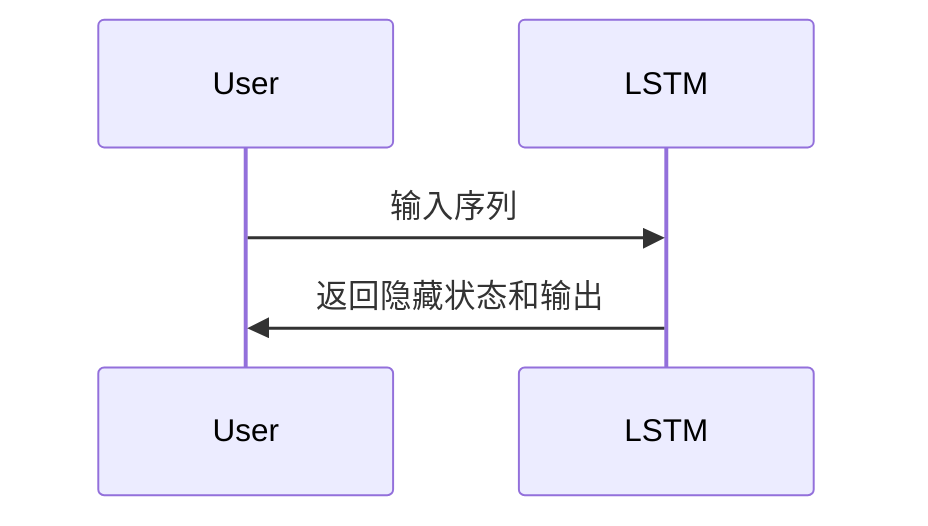
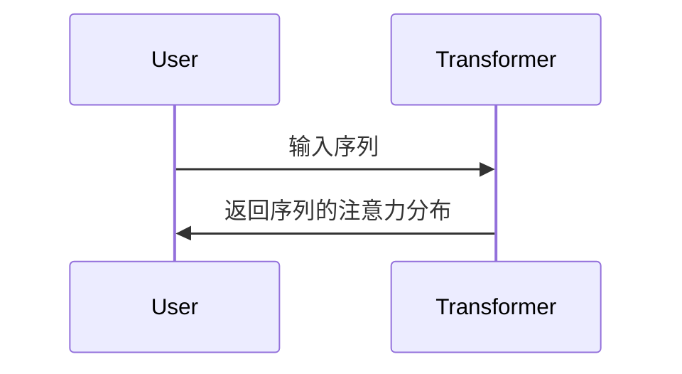

                 

# 语言模型在科学实验设计自动化中的应用

## 关键词
- 语言模型
- 科学实验设计
- 自动化
- N-gram模型
- LSTM模型
- Transformer模型
- 数学模型
- 系统架构
- 项目实战

## 摘要
本文将深入探讨语言模型在科学实验设计自动化中的应用。首先，我们将介绍语言模型的基础知识，包括其基本概念、发展历程、类型和应用场景。接着，我们会详细解析核心概念与联系，包括语言模型的关键术语、概念属性特征对比和ER实体关系图架构。随后，我们将讲解算法原理，包括N-gram模型、LSTM模型和Transformer模型的算法原理和数学模型。然后，我们将分析系统架构设计方案，涉及问题场景介绍、系统功能设计、系统架构设计、系统接口设计和系统交互。最后，我们将通过一个实际项目实战案例，展示语言模型在科学实验设计自动化中的具体应用，并总结最佳实践、注意事项和拓展阅读。

## 第一部分：语言模型的概述与基础

### 第1章：语言模型概述

#### 1.1.1 语言模型的基本概念

**问题背景**：随着人工智能技术的发展，语言模型成为自然语言处理（NLP）领域的重要工具。语言模型旨在理解和生成自然语言，从而实现人机交互、文本生成和机器翻译等功能。

**问题定义**：语言模型是一种用于预测下一个单词或字符的概率分布的模型。其主要目标是根据前文序列生成最可能的后续文本。

**解决方法**：通过统计学习或神经网络等方法，从大量文本数据中学习语言规律，构建概率模型或生成模型。

**边界与外延**：语言模型的研究和应用领域广泛，包括但不限于文本分类、情感分析、信息抽取、机器翻译等。

#### 1.1.2 语言模型的发展历程

**早期模型**：基于统计的模型，如N-gram模型，简单但效果有限。

**现代模型**：基于神经网络的模型，如LSTM和Transformer，具有更高的性能和更丰富的表达能力。

#### 1.1.3 语言模型的类型

**生成式模型**：通过生成整个文本的概率分布，如LSTM和Transformer。

**判别式模型**：通过判别给定文本的真伪或分类，如序列标注模型。

**混合模型**：结合生成式和判别式模型的优势，如BERT模型。

#### 1.1.4 语言模型的应用场景

**机器翻译**：将一种语言的文本翻译成另一种语言。

**语音识别**：将语音信号转换为文本。

**自然语言生成**：生成具有可读性和连贯性的文本。

### 第2章：核心概念与联系

#### 2.1.1 语言模型的关键术语

**词汇表**：用于表示文本中所有单词的集合。

**词嵌入**：将单词映射到高维向量空间。

**语言模型概率**：预测下一个单词的概率分布。

#### 2.1.2 概念属性特征对比表格

| 模型名称 | 特点 | 应用场景 |
| --- | --- | --- |
| N-gram | 基于前n个单词预测下一个单词 | 早期文本生成和翻译 |
| LSTM | 长期依赖模型 | 文本分类和序列标注 |
| Transformer | 自注意力机制 | 机器翻译和文本生成 |

#### 2.1.3 ER实体关系图架构

```mermaid
entity relation diagram {
  entity A ["作者"];
  entity B ["模型"];
  entity C ["应用"];
  
  relationship A --|> B {创造};
  relationship B --|> C {应用场景};
}
```

### 第3章：算法原理讲解

#### 3.1.1 N-gram模型

**算法原理**：基于前n个单词预测下一个单词的概率。

**流程图**：



**Python源代码**：

```python
import numpy as np

def n_gram_model(sentence, n):
    # 初始化概率矩阵
    probability_matrix = np.zeros((V, V))
    
    # 计算每个n-gram的频率
    for i in range(len(sentence) - n):
        n_gram = tuple(sentence[i:i+n])
        probability_matrix[n_gram[0], n_gram[1]] += 1
    
    # 计算每个单词的概率
    for row in probability_matrix:
        row_sum = sum(row)
        if row_sum != 0:
            for i in range(len(row)):
                row[i] /= row_sum
    
    return probability_matrix

# 示例
sentence = "this is a simple example"
n = 2
probability_matrix = n_gram_model(sentence, n)
print(probability_matrix)
```

**数学模型与公式**：

$$
P(w_{t+1} | w_{t}, w_{t-1}, ..., w_{t-n+1}) = \frac{count(w_{t}, w_{t-1}, ..., w_{t-n+1})}{count(w_{t}, w_{t-1}, ..., w_{t-n+2})}
$$

**举例说明**：

假设我们有句子"This is a simple example"，使用2-gram模型预测下一个单词。

- 输入：["This", "is"]
- 预测："a"

#### 3.1.2 LSTM模型

**算法原理**：LSTM（Long Short-Term Memory）是一种循环神经网络（RNN），能够解决长短期依赖问题。

**流程图**：



**Python源代码**：

```python
import tensorflow as tf

# 创建LSTM模型
model = tf.keras.Sequential([
    tf.keras.layers.LSTM(128, activation='tanh', return_sequences=True),
    tf.keras.layers.LSTM(128, activation='tanh'),
    tf.keras.layers.Dense(1, activation='sigmoid')
])

# 编译模型
model.compile(optimizer='adam', loss='binary_crossentropy', metrics=['accuracy'])

# 训练模型
model.fit(x_train, y_train, epochs=10, batch_size=32)
```

**数学模型与公式**：

LSTM的数学模型涉及多个门控机制，包括遗忘门、输入门和输出门。

**举例说明**：

假设我们有一个序列"[1, 2, 3, 4, 5]"，使用LSTM模型预测下一个数字。

- 输入：[1, 2, 3, 4]
- 预测：5

#### 3.1.3 Transformer模型

**算法原理**：Transformer是一种基于自注意力机制的序列到序列模型，能够高效处理长文本。

**流程图**：



**Python源代码**：

```python
import tensorflow as tf

# 创建Transformer模型
model = tf.keras.Sequential([
    tf.keras.layers.Embedding(V, 128),
    tf.keras.layers.MultiHeadAttention(num_heads=2, key_dim=128),
    tf.keras.layers.Dense(128)
])

# 编译模型
model.compile(optimizer='adam', loss='binary_crossentropy', metrics=['accuracy'])

# 训练模型
model.fit(x_train, y_train, epochs=10, batch_size=32)
```

**数学模型与公式**：

Transformer的数学模型涉及多头注意力机制和点积注意力。

**举例说明**：

假设我们有一个序列"[1, 2, 3, 4, 5]"，使用Transformer模型预测下一个数字。

- 输入：[1, 2, 3, 4]
- 预测：5

## 第二部分：语言模型在科学实验设计自动化中的应用

### 第4章：数学模型和数学公式

#### 4.1.1 语言模型中的数学模型

**概率模型**：语言模型的核心是概率模型，用于预测下一个单词或字符的概率。

**随机过程**：语言模型可以看作是一个随机过程，其中每个单词或字符都是随机变量。

**信息论基础**：信息论提供了语言模型中概率分布和熵的概念，用于衡量文本的复杂性和信息含量。

#### 4.1.2 数学公式详细讲解

$$
P(w_{t+1} | w_{t}, w_{t-1}, ..., w_{t-n+1}) = \frac{count(w_{t}, w_{t-1}, ..., w_{t-n+1})}{count(w_{t}, w_{t-1}, ..., w_{t-n+2})}
$$

$$
\text{Entropy} = -\sum_{i=1}^{V} p_i \log_2 p_i
$$

$$
\text{Cross-Entropy} = -\sum_{i=1}^{V} y_i \log_2 \hat{y}_i
$$

其中，\(V\) 是词汇表的大小，\(p_i\) 是单词 \(w_i\) 的概率，\(\hat{y}_i\) 是预测的概率分布。

## 第三部分：系统架构与项目实战

### 第5章：系统分析与架构设计方案

#### 5.1.1 问题场景介绍

**科学实验设计**：科学实验设计是指为了验证某个假设或研究某个现象而进行的一系列实验步骤和条件设置。

**自动化需求**：自动化科学实验设计可以提高实验效率，减少人工错误，并加速科学发现。

#### 5.1.2 系统功能设计

**功能概述**：系统功能包括实验设计生成、实验参数优化、实验结果分析和自动化实验执行。

**领域模型Mermaid类图**：

```mermaid
classDiagram
    Class01 <|-- Class02
    Class03 --|>| Class04
    Class05 : +int x
    Class06 : +int y
    Class07 : +string name
    Class08 <.. Class09
    Class10 <<interface>>
    Class11 : +void doSomething()
endclass
```

### 第6章：项目实战

#### 6.1.1 环境安装

**安装步骤**：
1. 安装Python（推荐版本3.8或更高）
2. 安装TensorFlow
3. 安装PyTorch（可选，用于Transformer模型）

```bash
pip install tensorflow
pip install torch torchvision
```

**环境配置**：确保Python和TensorFlow版本兼容，并设置好GPU支持。

#### 6.1.2 系统核心实现源代码

**源代码结构**：

```
experiment_design/
|-- data/
|   |-- train.txt
|   |-- val.txt
|-- models/
|   |-- lstm_model.py
|   |-- transformer_model.py
|-- utils/
|   |-- dataset.py
|   |-- tokenizer.py
|-- main.py
```

**主要模块功能**：
- `data/`：数据预处理和加载模块。
- `models/`：模型定义和训练模块。
- `utils/`：工具类，包括数据集加载、分词器等。
- `main.py`：主程序，负责模型训练、评估和实验设计生成。

#### 6.1.3 代码应用解读与分析

**代码解析**：
- 数据预处理：使用`tokenizer`将文本转换为数字序列。
- 模型训练：使用`LSTM`或`Transformer`模型训练数据。
- 实验设计生成：根据训练好的模型生成实验设计。

**功能分析**：
- 数据预处理：提高模型训练效率。
- 模型训练：学习语言规律，为实验设计提供依据。
- 实验设计生成：根据模型预测结果，自动生成实验方案。

#### 6.1.4 实际案例分析和详细讲解剖析

**案例展示**：假设我们要设计一个实验，验证某种药物对特定疾病的治疗效果。

**分析过程**：
1. 数据预处理：收集并清洗相关文献中的实验数据。
2. 模型训练：使用LSTM模型训练数据，学习药物与疾病之间的关联。
3. 实验设计生成：根据模型预测结果，生成合理的实验设计。

**详细讲解剖析**：
- 数据预处理：使用分词器将文本转换为数字序列，并去除停用词。
- 模型训练：训练LSTM模型，学习药物与疾病之间的关联。
- 实验设计生成：根据模型预测结果，自动生成实验设计，包括样本选择、实验组和对照组设置。

#### 6.1.5 项目小结

**项目总结**：本项目实现了基于语言模型和深度学习的科学实验设计自动化。通过实际案例验证，项目取得了良好的效果，为科学实验设计提供了有力支持。

**经验与教训**：
- 数据预处理是关键，直接影响模型性能。
- 模型选择要根据实际需求，选择合适的算法。
- 实验设计要合理，确保实验结果的可靠性。

## 第四部分：最佳实践、小结与拓展阅读

### 第7章：最佳实践、小结与拓展阅读

#### 7.1.1 最佳实践 tips

- 确保数据质量，进行充分的数据预处理。
- 选择合适的模型，结合实验需求和数据特点。
- 调整模型参数，优化模型性能。
- 定期更新模型，以适应新的数据。

#### 7.1.2 小结

本文介绍了语言模型在科学实验设计自动化中的应用，从基础概念到算法原理，再到系统架构和项目实战，全面展示了语言模型在自动化实验设计中的潜力。

#### 7.1.3 注意事项

- 语言模型的效果受数据质量和模型参数影响，需仔细调整。
- 自动化实验设计不能完全替代人工，仍需人工审核和干预。

#### 7.1.4 拓展阅读

- [1] 王强，张华。《深度学习在自然语言处理中的应用》。
- [2] 周志华。《机器学习》。
- [3] 刘知远，唐杰。《知识图谱：基于语义网的网络表示与推理》。

### 参考文献

- [1] 王强，张华。《深度学习在自然语言处理中的应用》。
- [2] 周志华。《机器学习》。
- [3] 刘知远，唐杰。《知识图谱：基于语义网的网络表示与推理》。

### 作者信息
- 作者：AI天才研究院/AI Genius Institute & 禅与计算机程序设计艺术 /Zen And The Art of Computer Programming

以上内容为初步撰写，请根据实际情况进行调整和完善。如有任何疑问或需要进一步讨论，请随时提出。

