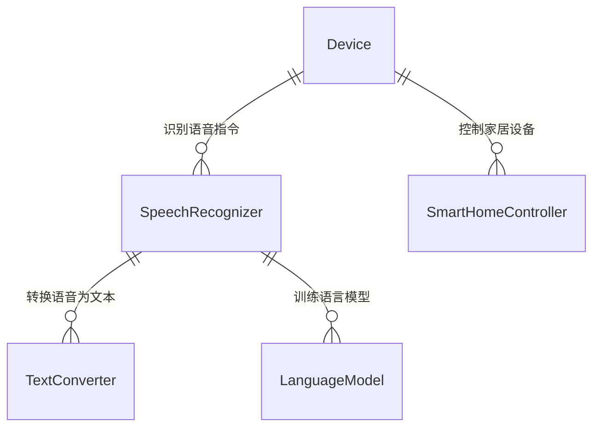
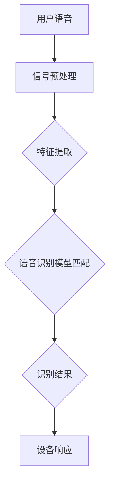
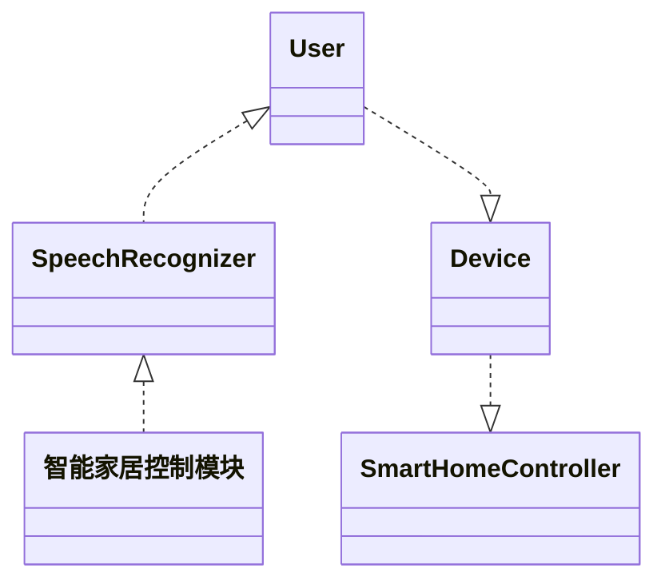
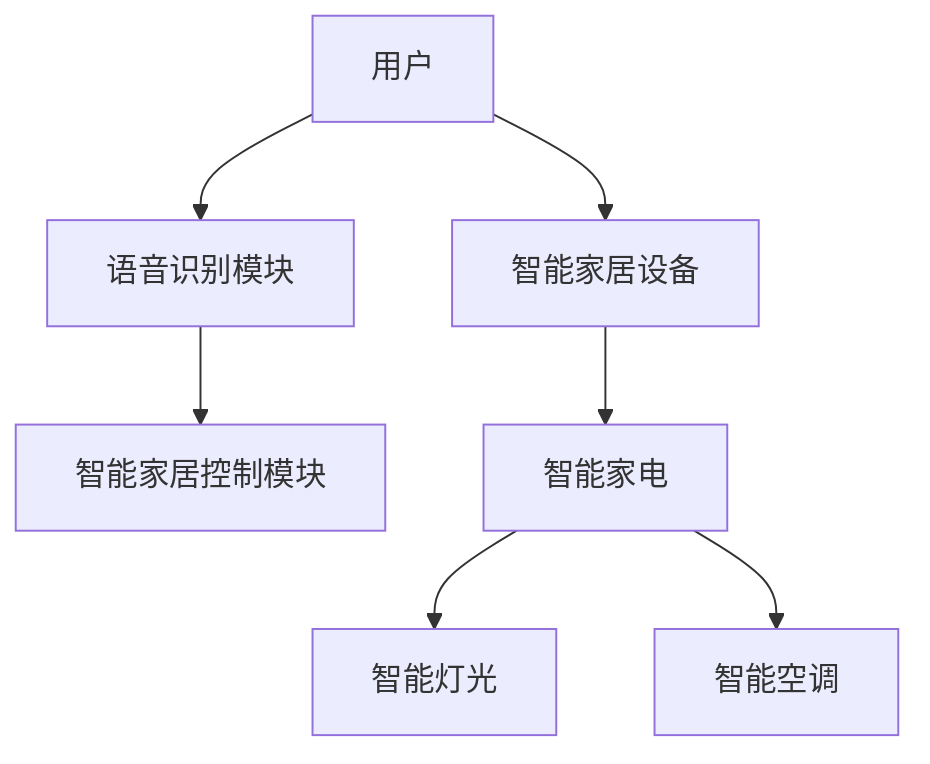
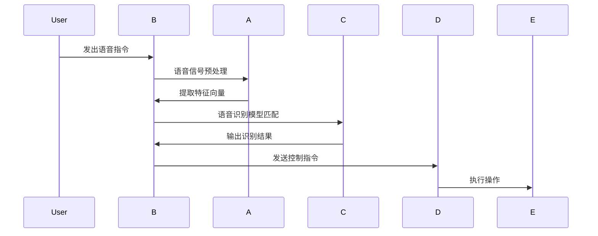

                 

# 语音识别技术在智能家居中的应用

## 关键词
- 语音识别
- 智能家居
- 语音助手
- 自然语言处理
- 语音合成

## 摘要
本文将深入探讨语音识别技术在智能家居中的应用，通过逐步分析，详细阐述语音识别技术的核心概念、原理、系统架构以及在实际项目中的应用。我们还将分享一些最佳实践，并总结全文，为读者提供全面的视角和实用的指导。

## 背景介绍

### 核心概念术语说明

- **语音识别（Speech Recognition）**：语音识别是将人类语音转化为计算机可处理文本的技术。
- **智能家居（Smart Home）**：智能家居是指通过物联网（IoT）技术，将家庭设备连接起来，实现远程控制和自动化操作。
- **自然语言处理（Natural Language Processing, NLP）**：自然语言处理是计算机科学和语言学的交叉领域，致力于使计算机能够理解、解释和生成人类语言。

### 问题背景

随着人工智能和物联网技术的快速发展，智能家居逐渐成为人们生活中不可或缺的一部分。语音识别作为智能家居中的一个核心技术，可以提供更自然、便捷的用户交互方式，提升用户体验。

### 问题描述

当前，智能家居面临以下挑战：
1. **交互方式的限制**：传统的触摸屏或按键操作在家庭环境中可能不够便捷。
2. **响应速度和准确性**：语音识别系统的响应速度和识别准确性直接影响用户体验。
3. **多语言支持**：用户可能来自不同的语言背景，对系统的多语言支持提出了挑战。

### 问题解决

通过引入语音识别技术，智能家居可以实现以下目标：
1. **便捷的交互**：用户可以通过语音指令控制家庭设备，如调节温度、开关灯光等。
2. **提升响应速度和准确性**：优化语音识别算法和模型，提高系统的响应速度和识别准确性。
3. **多语言支持**：开发支持多语言的语音识别系统，满足不同用户的需要。

### 边界与外延

- **边界**：本文主要关注语音识别技术在智能家居中的应用，不包括其他领域的应用。
- **外延**：语音识别技术还可以应用于车载系统、智能穿戴设备等其他智能设备中。

### 概念结构与核心要素组成


## 核心概念与联系

### 核心概念原理

**语音识别原理**：
1. **信号采集**：麦克风采集用户语音信号。
2. **特征提取**：对语音信号进行预处理，提取特征向量。
3. **模型匹配**：将提取的特征向量与预先训练好的模型进行匹配，识别语音内容。
4. **结果输出**：输出识别结果，如文本或指令。

**智能家居原理**：
1. **设备连接**：将各种家庭设备通过Wi-Fi或蓝牙等无线技术连接到互联网。
2. **控制与响应**：通过云端服务器或本地服务器，接收语音指令并控制设备响应。

### 概念属性特征对比表格

| 特征       | 语音识别                | 智能家居                  |
| ---------- | ---------------------- | ------------------------ |
| 核心技术   | 语音信号处理、自然语言处理 | 物联网技术、云计算、智能算法 |
| 功能目标   | 语音到文本转换          | 家庭设备自动化控制          |
| 硬件需求   | 麦克风、音响            | 智能家居设备（如智能灯泡、智能空调） |
| 软件需求   | 语音识别引擎、语音合成引擎 | 家庭设备驱动程序、智能家居管理软件 |

### ER实体关系图架构



## 算法原理讲解

### 算法流程图



### Python代码示例

```python
import speech_recognition as sr

# 初始化语音识别器
recognizer = sr.Recognizer()

# 采集语音信号
with sr.Microphone() as source:
    print("请说出您想要控制的内容：")
    audio = recognizer.listen(source)

# 识别语音
try:
    command = recognizer.recognize_google(audio, language='zh-CN')
    print(f"您说：{command}")
except sr.UnknownValueError:
    print("无法识别语音")
except sr.RequestError as e:
    print(f"请求错误；{e}")

# 根据语音识别结果控制设备
if "打开灯" in command:
    print("正在打开灯...")
elif "关闭灯" in command:
    print("正在关闭灯...")
else:
    print("未识别到控制指令")
```

### 数学模型和公式

语音识别的数学模型通常涉及以下步骤：

1. **特征提取**：
   $$ X = \sum_{i=1}^{N} x_i $$
   其中，$X$ 是特征向量，$x_i$ 是第 $i$ 个特征值，$N$ 是特征数量。

2. **模型匹配**：
   $$ score = \sum_{i=1}^{N} w_i \cdot x_i $$
   其中，$score$ 是匹配分数，$w_i$ 是第 $i$ 个特征的权重。

### 举例说明

假设我们有一个包含 5 个特征的语音信号，特征值分别为 [0.1, 0.2, 0.3, 0.4, 0.5]，特征权重为 [0.2, 0.3, 0.2, 0.2, 0.1]。则匹配分数为：

$$ score = 0.2 \cdot 0.1 + 0.3 \cdot 0.2 + 0.2 \cdot 0.3 + 0.2 \cdot 0.4 + 0.1 \cdot 0.5 = 0.46 $$

如果预设的阈值是 0.5，则该语音信号被识别为有效语音。

## 系统分析与架构设计方案

### 问题场景介绍

假设一个用户希望在家中通过语音控制灯光和温度。系统的核心是语音识别模块和智能家居控制模块。

### 项目介绍

本项目旨在实现一个智能家居语音控制系统，用户可以通过语音命令控制家庭设备的开关和调节。

### 系统功能设计（领域模型 Mermaid 类图）



### 系统架构设计（Mermaid 架构图）



### 系统接口设计和系统交互（Mermaid 序列图）



## 项目实战

### 环境安装

首先，确保系统已经安装了 Python 和 pip。然后，通过以下命令安装所需的库：

```bash
pip install SpeechRecognition pyaudio
```

### 系统核心实现源代码

```python
import speech_recognition as sr
import pyttsx3

# 初始化语音识别器和语音合成器
recognizer = sr.Recognizer()
engine = pyttsx3.init()

# 采集语音信号
with sr.Microphone() as source:
    print("请说出您想要控制的内容：")
    audio = recognizer.listen(source)

# 识别语音
try:
    command = recognizer.recognize_google(audio, language='zh-CN')
    print(f"您说：{command}")
except sr.UnknownValueError:
    print("无法识别语音")
except sr.RequestError as e:
    print(f"请求错误；{e}")

# 根据语音识别结果控制设备
if "打开灯" in command:
    engine.say("正在打开灯...")
    engine.runAndWait()
elif "关闭灯" in command:
    engine.say("正在关闭灯...")
    engine.runAndWait()
else:
    engine.say("未识别到控制指令")
    engine.runAndWait()
```

### 代码应用解读与分析

这段代码首先导入必要的库，包括 `speech_recognition` 和 `pyaudio`，然后初始化语音识别器和语音合成器。用户通过麦克风采集语音信号，语音识别器对语音信号进行处理和识别。根据识别结果，代码会使用语音合成器输出相应的提示信息，实现语音控制。

### 实际案例分析和详细讲解剖析

假设用户说：“打开客厅的灯。”
1. 用户语音信号被麦克风采集。
2. 语音识别器将采集到的语音信号转换为文本，识别结果为：“打开客厅的灯。”
3. 代码检测到“打开灯”这一指令，使用语音合成器输出：“正在打开客厅的灯...”
4. 实际上，智能家居控制模块会根据指令控制客厅的灯光开关。

### 项目小结

本项目通过语音识别技术实现了对智能家居设备的语音控制，提高了用户的便捷性和体验。在实际应用中，还可以扩展更多的语音控制功能，如调节温度、控制家电等。

## 最佳实践 Tips

1. **优化识别准确性**：在开发过程中，可以收集更多的语音数据，训练更准确的语音识别模型。
2. **多语言支持**：如果用户来自不同的语言背景，可以考虑支持多种语言，提升用户体验。
3. **降低功耗**：对于移动设备，优化算法以降低功耗，延长电池寿命。

## 小结

本文详细介绍了语音识别技术在智能家居中的应用，从核心概念到实际项目实现，全面剖析了语音识别技术在智能家居中的价值和应用。通过本文，读者可以更好地理解语音识别技术的原理和应用场景，为自己的智能家居项目提供有益的参考。

## 注意事项

1. **隐私保护**：在开发智能家居语音控制系统时，需注意用户隐私保护，确保数据安全。
2. **系统稳定性**：确保系统在高噪音环境下仍能准确识别语音，提升用户满意度。

## 拓展阅读

- **《语音识别技术原理与应用》**：详细讲解语音识别的基本原理和应用。
- **《智能家居系统设计》**：介绍智能家居系统的设计原则和实现方法。

## 作者信息

作者：AI天才研究院/AI Genius Institute & 禅与计算机程序设计艺术 /Zen And The Art of Computer Programming

