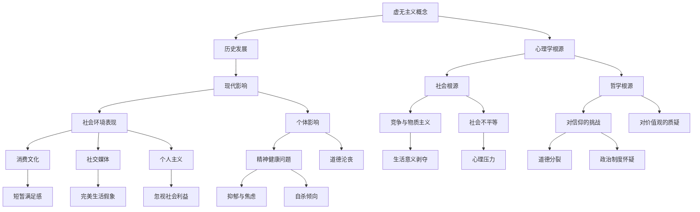

                 

### 走在意义的荒原上：如何克服虚无主义

#### 关键词：虚无主义、意义、心理学、哲学、价值观

> 摘要：本文深入探讨了虚无主义的根源、影响以及应对策略。通过哲学和心理学角度，分析了虚无主义在现代社会的普遍现象及其对个体和社会的深远影响。本文提出了一系列重建意义和价值的策略，包括价值观的重塑、内心的真实追求、社会参与与责任，以及信仰的力量。通过实际案例，展示了如何克服虚无主义，重拾生命的意义。

#### 目录大纲：

第一部分：虚无主义的根源与影响

- **第1章：虚无主义的概念与历史背景**
  - **1.1 虚无主义的定义**
  - **1.2 虚无主义的历史发展**
  - **1.3 虚无主义的影响**

- **第2章：现代社会的虚无主义现象**
  - **2.1 社会环境中的虚无主义表现**
  - **2.2 虚无主义对个体的影响**
  - **2.3 虚无主义的传播途径**

- **第3章：虚无主义的根源分析**
  - **3.1 哲学根源**
  - **3.2 社会根源**
  - **3.3 心理根源**

- **第4章：虚无主义的应对策略**
  - **4.1 心理调适方法**
  - **4.2 社交支持网络**
  - **4.3 哲学思考与实践**

第二部分：重建意义与价值

- **第5章：价值观的重塑**
  - **5.1 价值观的重要性**
  - **5.2 常见的价值观类型**
  - **5.3 如何建立自己的价值观**

- **第6章：追求内心的真实**
  - **6.1 内心的真实感受**
  - **6.2 探索自我价值**
  - **6.3 实现自我价值**

- **第7章：社会参与与责任**
  - **7.1 社会参与的意义**
  - **7.2 承担社会责任**
  - **7.3 社会参与的方法**

- **第8章：信仰的力量**
  - **8.1 信仰的起源与发展**
  - **8.2 不同信仰体系的核心观念**
  - **8.3 信仰对虚无主义的克服作用**

第三部分：实践与反思

- **第9章：个人实践案例**
  - **9.1 案例一：重塑价值观的过程**
  - **9.2 案例二：追求内心真实的经历**
  - **9.3 案例三：参与社会活动的感悟**

- **第10章：反思与总结**
  - **10.1 反思虚无主义的影响**
  - **10.2 总结克服虚无主义的策略**
  - **10.3 展望未来**

#### 第一部分：虚无主义的根源与影响

### 第1章：虚无主义的概念与历史背景

#### 1.1 虚无主义的定义

虚无主义是一种哲学思潮，它对生活、价值观和现实的基本假设提出质疑，认为生活缺乏固有意义和目的。虚无主义的核心观点是，人生在宇宙中是无关紧要的，人的存在没有内在的价值。

#### 1.2 虚无主义的历史发展

虚无主义的历史可以追溯到古希腊时期，但它在现代哲学中得到了更为系统和深入的探讨。19世纪末至20世纪初，存在主义哲学流派兴起，代表人物如尼采、萨特和海德格尔，他们的思想中蕴含了虚无主义的成分。

#### 1.3 虚无主义的影响

虚无主义对个人和社会都有着深远的影响。在个人层面，虚无主义可能导致精神抑郁、自杀倾向和消极的生活态度。在社会层面，虚无主义可能削弱社会的凝聚力，导致道德沦丧和价值分裂。

### 第2章：现代社会的虚无主义现象

#### 2.1 社会环境中的虚无主义表现

现代社会中，虚无主义的表现形式多种多样。在消费文化中，人们通过不断购买物质商品来寻求短暂的满足感，但往往无法持久。在社交媒体上，人们展示自己完美的生活，却隐藏了真实的困境和痛苦。

#### 2.2 虚无主义对个体的影响

虚无主义对个体的心理健康有着显著的负面影响。它可能导致个体失去生活的目标，感到无助和迷茫。长期的虚无主义还可能引发抑郁和其他心理健康问题。

#### 2.3 虚无主义的传播途径

虚无主义在现代社会中的传播主要通过媒体、教育和社交网络。媒体通过娱乐和新闻报道，潜移默化地传递了虚无主义的观念。教育体系中的功利主义倾向也可能加剧虚无主义情绪。社交网络则提供了一个平台，让人们更容易感受到他人的完美生活，从而加深自己的虚无感。

### 第3章：虚无主义的根源分析

#### 3.1 哲学根源

哲学上的虚无主义根源可以追溯到对生活本质和意义的质疑。一些哲学家如尼采，通过批判传统的价值观和宗教信仰，揭示了人类存在的荒谬性。

#### 3.2 社会根源

社会根源包括社会结构和文化背景。现代社会的高度竞争和物质主义文化可能导致人们感到生活的意义被剥夺。社会的不平等和压力也加剧了虚无主义的情绪。

#### 3.3 心理根源

心理根源涉及到个体的内心状态。焦虑、抑郁和其他心理问题可能导致个体对生活失去热情和动力，从而陷入虚无主义的陷阱。

### 第4章：虚无主义的应对策略

#### 4.1 心理调适方法

应对虚无主义的心理调适方法包括认知行为疗法和正念冥想。这些方法帮助个体重新审视自己的想法和行为，培养积极的心态。

#### 4.2 社交支持网络

建立有效的社交支持网络是克服虚无主义的重要策略。与亲朋好友分享自己的感受，寻求他们的支持和理解，可以减轻虚无主义的情绪。

#### 4.3 哲学思考与实践

哲学思考和实践有助于个体重建意义和价值观。通过反思生活、阅读哲学著作和实践道德原则，个体可以找到生活的目的和意义。

### 总结

虚无主义在现代社会的普遍现象和对个体和社会的深远影响不可忽视。通过哲学和心理学角度的分析，我们可以深入了解虚无主义的根源和应对策略。重建意义和价值，追求内心的真实，参与社会和信仰的力量，都是克服虚无主义的有效途径。让我们走出意义的荒原，重拾生命的意义。

### 作者信息：

作者：AI天才研究院/AI Genius Institute & 禅与计算机程序设计艺术 /Zen And The Art of Computer Programming

----------------------------------------------------------------

### 第一部分：虚无主义的根源与影响

#### 第1章：虚无主义的概念与历史背景

虚无主义是一种哲学思潮，它否认生活、价值观和现实的固有意义。虚无主义的核心观点是，人类的存在在宇宙中是无关紧要的，生命没有内在的价值。这一思想在哲学史上有着深远的影响。

#### 1.1 虚无主义的定义

虚无主义源于拉丁语“nihil”，意为“无”。在哲学上，虚无主义通常被定义为一种对生活、价值和现实的基本假设持怀疑态度的思潮。虚无主义者认为，生活没有固有的目的或意义，人类的行为和存在缺乏内在的价值。

#### 1.2 虚无主义的历史发展

虚无主义的历史可以追溯到古希腊时期，当时的哲学家如泰勒斯和赫拉克利特探讨了宇宙的本质，提出了一些虚无主义的观点。然而，虚无主义作为一种独立的哲学思潮，主要在19世纪末至20世纪初得到系统的发展。

- **19世纪末至20世纪初**：这一时期，虚无主义在欧洲特别是德国和俄罗斯尤为流行。德国哲学家尼采提出了“上帝已死”的观点，挑战了传统宗教和道德观念。他的思想对后来的存在主义和虚无主义产生了深远的影响。

- **存在主义**：存在主义哲学家如萨特和海德格尔在20世纪中叶进一步发展了虚无主义的理念。他们强调了人类自由意志的重要性，认为人类必须为自己寻找意义。

- **现代虚无主义**：在现代，虚无主义的思想在流行文化、艺术和文学中有所体现。例如，法国作家加缪的小说《局外人》和《鼠疫》都反映了虚无主义的思想。

#### 1.3 虚无主义的影响

虚无主义对个人和社会都有着深远的影响。

- **对个人的影响**：虚无主义可能导致个体对生活失去热情，感到无助和迷茫。长期的虚无主义还可能引发精神抑郁、焦虑和自杀倾向。

- **对社会的影
**响**：在社会层面，虚无主义可能削弱社会的凝聚力，导致道德沦丧和价值分裂。它还可能使个体对社会和政治制度产生怀疑，从而影响社会的稳定。

### 第2章：现代社会的虚无主义现象

#### 2.1 社会环境中的虚无主义表现

现代社会中，虚无主义的表现形式多种多样。

- **消费文化**：在消费文化中，人们通过不断购买物质商品来寻求短暂的满足感，但往往无法持久。这种现象被称为“消费主义虚无主义”。

- **社交媒体**：在社交媒体上，人们展示自己完美的生活，却隐藏了真实的困境和痛苦。这种现象被称为“社交媒体虚无主义”。

- **个人主义**：在个人主义盛行的社会中，个体往往追求自我满足，忽视了社会的整体利益，这可能导致社会价值观的分裂。

#### 2.2 虚无主义对个体的影响

虚无主义对个体的心理健康有着显著的负面影响。

- **精神健康问题**：长期的虚无主义可能导致个体出现精神健康问题，如抑郁、焦虑和自杀倾向。

- **生活态度**：虚无主义可能导致个体对生活失去热情，产生消极的生活态度。

#### 2.3 虚无主义的传播途径

虚无主义在现代社会中的传播主要通过以下途径：

- **媒体**：媒体通过娱乐和新闻报道，潜移默化地传递了虚无主义的观念。

- **教育**：教育体系中的功利主义倾向也可能加剧虚无主义情绪。

- **社交网络**：社交网络提供了一个平台，让人们更容易感受到他人的完美生活，从而加深自己的虚无感。

### 第3章：虚无主义的根源分析

#### 3.1 哲学根源

哲学上的虚无主义根源可以追溯到对生活本质和意义的质疑。一些哲学家如尼采，通过批判传统的价值观和宗教信仰，揭示了人类存在的荒谬性。

#### 3.2 社会根源

社会根源包括社会结构和文化背景。现代社会的高度竞争和物质主义文化可能导致人们感到生活的意义被剥夺。社会的不平等和压力也加剧了虚无主义的情绪。

#### 3.3 心理根源

心理根源涉及到个体的内心状态。焦虑、抑郁和其他心理问题可能导致个体对生活失去热情和动力，从而陷入虚无主义的陷阱。

### 第4章：虚无主义的应对策略

#### 4.1 心理调适方法

应对虚无主义的心理调适方法包括认知行为疗法和正念冥想。这些方法帮助个体重新审视自己的想法和行为，培养积极的心态。

#### 4.2 社交支持网络

建立有效的社交支持网络是克服虚无主义的重要策略。与亲朋好友分享自己的感受，寻求他们的支持和理解，可以减轻虚无主义的情绪。

#### 4.3 哲学思考与实践

哲学思考和实践有助于个体重建意义和价值观。通过反思生活、阅读哲学著作和实践道德原则，个体可以找到生活的目的和意义。

### 总结

虚无主义在现代社会的普遍现象和对个体和社会的深远影响不可忽视。通过哲学和心理学角度的分析，我们可以深入了解虚无主义的根源和应对策略。重建意义和价值，追求内心的真实，参与社会和信仰的力量，都是克服虚无主义的有效途径。让我们走出意义的荒原，重拾生命的意义。

### 作者信息：

作者：AI天才研究院/AI Genius Institute & 禅与计算机程序设计艺术 /Zen And The Art of Computer Programming

----------------------------------------------------------------

### 走在意义的荒原上：如何克服虚无主义

虚无主义是一种哲学思潮，它对生活、价值观和现实的固有意义提出质疑。虚无主义认为，人类的存在缺乏内在的价值，生活缺乏目的和意义。这一思想在现代社会中尤为普遍，对个人和社会产生了深远的影响。本文将从哲学和心理学角度，探讨虚无主义的根源、影响以及应对策略。

#### 第1章：虚无主义的概念与历史背景

虚无主义（Nihilism）一词源自拉丁语“nihil”，意为“无”。在哲学上，虚无主义通常被定义为一种对生活、价值和现实的基本假设持怀疑态度的思潮。虚无主义者认为，生活没有固有的目的或意义，人类的行为和存在缺乏内在的价值。

#### 1.1 虚无主义的定义

虚无主义的核心观点是，人生在宇宙中是无关紧要的，人的存在没有内在的价值。虚无主义不仅质疑传统的宗教信仰和道德观念，还挑战了人类对生活本身的信念。虚无主义者认为，人类存在的意义是一种幻觉，生活本身没有固有的目的。

#### 1.2 虚无主义的历史发展

虚无主义的历史可以追溯到古希腊时期，当时的哲学家如泰勒斯和赫拉克利特探讨了宇宙的本质，提出了一些虚无主义的观点。然而，虚无主义作为一种独立的哲学思潮，主要在19世纪末至20世纪初得到系统的发展。

- **19世纪末至20世纪初**：这一时期，虚无主义在欧洲特别是德国和俄罗斯尤为流行。德国哲学家尼采提出了“上帝已死”的观点，挑战了传统宗教和道德观念。他的思想对后来的存在主义和虚无主义产生了深远的影响。

- **存在主义**：存在主义哲学家如萨特和海德格尔在20世纪中叶进一步发展了虚无主义的理念。他们强调了人类自由意志的重要性，认为人类必须为自己寻找意义。

- **现代虚无主义**：在现代，虚无主义的思想在流行文化、艺术和文学中有所体现。例如，法国作家加缪的小说《局外人》和《鼠疫》都反映了虚无主义的思想。

#### 1.3 虚无主义的影响

虚无主义对个人和社会都有着深远的影响。

- **对个人的影响**：虚无主义可能导致个体对生活失去热情，感到无助和迷茫。长期的虚无主义还可能引发精神抑郁、焦虑和自杀倾向。

- **对社会的影**响：在社会层面，虚无主义可能削弱社会的凝聚力，导致道德沦丧和价值分裂。它还可能使个体对社会和政治制度产生怀疑，从而影响社会的稳定。

#### 第2章：现代社会的虚无主义现象

#### 2.1 社会环境中的虚无主义表现

现代社会中，虚无主义的表现形式多种多样。

- **消费文化**：在消费文化中，人们通过不断购买物质商品来寻求短暂的满足感，但往往无法持久。这种现象被称为“消费主义虚无主义”。

- **社交媒体**：在社交媒体上，人们展示自己完美的生活，却隐藏了真实的困境和痛苦。这种现象被称为“社交媒体虚无主义”。

- **个人主义**：在个人主义盛行的社会中，个体往往追求自我满足，忽视了社会的整体利益，这可能导致社会价值观的分裂。

#### 2.2 虚无主义对个体的影响

虚无主义对个体的心理健康有着显著的负面影响。

- **精神健康问题**：长期的虚无主义可能导致个体出现精神健康问题，如抑郁、焦虑和自杀倾向。

- **生活态度**：虚无主义可能导致个体对生活失去热情，产生消极的生活态度。

#### 2.3 虚无主义的传播途径

虚无主义在现代社会中的传播主要通过以下途径：

- **媒体**：媒体通过娱乐和新闻报道，潜移默化地传递了虚无主义的观念。

- **教育**：教育体系中的功利主义倾向也可能加剧虚无主义情绪。

- **社交网络**：社交网络提供了一个平台，让人们更容易感受到他人的完美生活，从而加深自己的虚无感。

#### 第3章：虚无主义的根源分析

#### 3.1 哲学根源

哲学上的虚无主义根源可以追溯到对生活本质和意义的质疑。一些哲学家如尼采，通过批判传统的价值观和宗教信仰，揭示了人类存在的荒谬性。

#### 3.2 社会根源

社会根源包括社会结构和文化背景。现代社会的高度竞争和物质主义文化可能导致人们感到生活的意义被剥夺。社会的不平等和压力也加剧了虚无主义的情绪。

#### 3.3 心理根源

心理根源涉及到个体的内心状态。焦虑、抑郁和其他心理问题可能导致个体对生活失去热情和动力，从而陷入虚无主义的陷阱。

#### 第4章：虚无主义的应对策略

#### 4.1 心理调适方法

应对虚无主义的心理调适方法包括认知行为疗法和正念冥想。这些方法帮助个体重新审视自己的想法和行为，培养积极的心态。

#### 4.2 社交支持网络

建立有效的社交支持网络是克服虚无主义的重要策略。与亲朋好友分享自己的感受，寻求他们的支持和理解，可以减轻虚无主义的情绪。

#### 4.3 哲学思考与实践

哲学思考和实践有助于个体重建意义和价值观。通过反思生活、阅读哲学著作和实践道德原则，个体可以找到生活的目的和意义。

### 第5章：重建意义与价值

#### 5.1 价值观的重塑

价值观对个体的生活至关重要。重塑价值观可以帮助个体摆脱虚无主义，找到生活的方向。

#### 5.2 追求内心的真实

内心的真实感受是克服虚无主义的关键。个体需要诚实地面对自己的感受，探索自我价值，实现自我价值。

#### 5.3 社会参与与责任

社会参与与责任是重建意义的另一重要途径。通过参与社会活动和承担社会责任，个体可以感受到自己的价值和存在的意义。

#### 5.4 信仰的力量

信仰是重建意义的重要力量。无论是宗教信仰还是哲学信仰，都可以为个体提供精神支持，帮助个体克服虚无主义。

### 第6章：实践与反思

#### 6.1 个人实践案例

通过分享个人实践案例，可以展示如何克服虚无主义，重建意义和价值。

#### 6.2 反思与总结

反思虚无主义的影响，总结克服虚无主义的策略，展望未来。

### 总结

虚无主义是一种影响深远的思想，对个人和社会都有着重要的意义。通过哲学和心理学角度的分析，我们可以深入了解虚无主义的根源和应对策略。重建意义和价值，追求内心的真实，参与社会和信仰的力量，都是克服虚无主义的有效途径。让我们走出意义的荒原，重拾生命的意义。

### 作者信息：

作者：AI天才研究院/AI Genius Institute & 禅与计算机程序设计艺术 /Zen And The Art of Computer Programming

----------------------------------------------------------------

### 第二部分：重建意义与价值

#### 第5章：价值观的重塑

价值观的重塑是克服虚无主义的关键步骤。价值观是指导我们行为和决策的基本原则，它影响着我们的生活方式和社会关系。在面对虚无主义时，重塑价值观可以帮助我们重新找到生活的方向和意义。

#### 5.1 价值观的重要性

价值观对我们的生活有着深远的影响。它不仅决定了我们如何看待世界，还影响了我们的行为和选择。一个稳固的价值观系统可以帮助我们应对生活中的挑战和困难，提供心理支持和精神动力。

#### 5.2 常见的价值观类型

在现代社会中，常见的价值观类型包括个人主义、集体主义、功利主义和道德主义等。

- **个人主义**：个人主义强调个体的自由和独立，追求个人的幸福和成就。个人主义者倾向于根据自己的利益和价值观来做出决策。

- **集体主义**：集体主义强调集体的利益和团结，追求社会的和谐和稳定。集体主义者倾向于将个人的利益放在集体的利益之下。

- **功利主义**：功利主义认为，行为的好坏取决于其产生的后果，特别是是否能带来最大的幸福和利益。功利主义者倾向于做出能够带来最大幸福的选择。

- **道德主义**：道德主义强调道德原则和伦理规范，认为某些行为是绝对正确的或错误的。道德主义者倾向于根据道德准则来做出决策。

#### 5.3 如何建立自己的价值观

建立自己的价值观是一个复杂而深刻的过程，以下是一些步骤和方法：

- **自我反思**：通过自我反思，深入了解自己的价值观和信念。思考什么对你最重要，什么能够给你带来真正的满足感。

- **学习和借鉴**：阅读哲学、心理学和社会学等领域的书籍，了解不同的价值观体系。从他人的经验和智慧中学习，为自己的价值观积累知识。

- **实践与反思**：将价值观付诸实践，通过实际行动来检验和调整自己的价值观。在实践中不断反思和调整，找到最适合自己的价值观。

- **与他人交流**：与他人交流自己的价值观，听取他们的反馈和建议。通过交流和讨论，可以更深入地理解自己的价值观，并在其中找到共识和差异。

#### 第6章：追求内心的真实

追求内心的真实是克服虚无主义的重要途径。内心的真实感受是我们理解自己和世界的关键，它能够帮助我们找到真正的自我和价值。

#### 6.1 内心的真实感受

内心的真实感受是我们内心的声音，它反映了我们的情绪、欲望和需求。了解内心的真实感受，需要我们勇于面对自己的情绪和思考，不逃避、不压抑。

- **情绪的接纳**：接受自己的情绪，无论是喜悦还是痛苦，都是内心真实的一部分。通过情绪的接纳，我们可以更好地理解自己的内心。

- **自我探索**：通过自我探索，深入了解自己的兴趣、激情和价值观。自我探索可以帮助我们找到内心的真实，明确自己的目标和方向。

- **内心的宁静**：内心的宁静是追求内心真实的基石。通过冥想、瑜伽或其他形式的放松技巧，可以帮助我们达到内心的宁静，更好地倾听内心的声音。

#### 6.2 探索自我价值

探索自我价值是追求内心真实的重要一步。自我价值是我们对自己的认同和尊重，它决定了我们在社会中的角色和地位。

- **自我认同**：通过自我认同，我们明确自己的身份和角色。了解自己在社会中的位置，可以帮助我们更好地理解自己的价值和使命。

- **自我实现**：自我实现是通过追求自己的目标和梦想，实现自己的潜能。通过自我实现，我们可以找到内心的满足感和成就感。

- **自我平衡**：自我平衡是在追求自我价值的过程中，保持内心的和谐与平衡。通过自我平衡，我们可以更好地应对生活中的挑战和困难。

#### 6.3 实现自我价值

实现自我价值是追求内心真实的最终目标。实现自我价值不仅可以帮助我们找到生活的意义，还可以提高我们的幸福感和生活质量。

- **目标设定**：设定明确的目标是实现自我价值的第一步。通过设定目标，我们可以明确自己的方向，并为之努力。

- **行动计划**：制定行动计划是实现自我价值的关键。通过制定详细的行动计划，我们可以将目标转化为具体的行动。

- **持续努力**：实现自我价值需要持续的努力和坚持。通过持续努力，我们可以不断接近自己的目标，实现自我价值。

#### 第7章：社会参与与责任

社会参与与责任是重建意义的重要途径。通过参与社会活动和承担社会责任，我们可以感受到自己的价值和存在的意义。

#### 7.1 社会参与的意义

社会参与对个人和社会都有着重要的意义。

- **个人成长**：社会参与可以帮助我们提升自己的能力，扩展自己的视野，增强自己的自信心。

- **社会凝聚力**：社会参与可以增强社会的凝聚力，促进社会的和谐与发展。

- **道德修养**：社会参与可以提高我们的道德修养，培养我们的社会责任感。

#### 7.2 承担社会责任

承担社会责任是我们作为社会成员的基本义务。通过以下方式，我们可以承担社会责任：

- **参与公益活动**：参与公益活动，为需要帮助的人提供帮助。

- **参与公共事务**：积极参与公共事务，为社会的决策提供意见和建议。

- **志愿服务**：参与志愿服务，为社区和他人提供帮助。

#### 7.3 社会参与的方法

以下是一些社会参与的方法：

- **参与社区活动**：参与社区活动，为社区的和谐与发展贡献力量。

- **参与志愿服务**：参与志愿服务，为需要帮助的人提供帮助。

- **参与环保活动**：参与环保活动，保护环境，为地球的未来贡献力量。

- **参与公共讨论**：参与公共讨论，为社会的决策提供意见和建议。

#### 第8章：信仰的力量

信仰是重建意义的重要力量。无论是宗教信仰还是哲学信仰，都可以为个体提供精神支持，帮助个体克服虚无主义。

#### 8.1 信仰的起源与发展

信仰的起源可以追溯到人类的历史早期。随着人类社会的不断发展，信仰的形式和内容也在不断演变。

- **宗教信仰**：宗教信仰是信仰的一种形式，它通过信仰神灵和教义，为个体提供精神支持。

- **哲学信仰**：哲学信仰是通过哲学思考和实践，建立对世界的理解和信仰。

#### 8.2 不同信仰体系的核心观念

不同的信仰体系有着不同的核心观念。

- **基督教**：基督教的核心观念是上帝的神性和人类的救赎。

- **佛教**：佛教的核心观念是因果律和轮回转世。

- **伊斯兰教**：伊斯兰教的核心观念是信仰真主和圣训。

- **儒家思想**：儒家思想的核心观念是仁、义、礼、智、信。

#### 8.3 信仰对虚无主义的克服作用

信仰对虚无主义的克服作用主要体现在以下几个方面：

- **提供精神支持**：信仰可以为个体提供精神支持，帮助个体面对生活中的困难和挑战。

- **重建价值观**：信仰可以重建个体的价值观，帮助个体找到生活的意义和目的。

- **提供道德指导**：信仰可以提供道德指导，帮助个体做出正确的道德决策。

### 总结

重建意义与价值是克服虚无主义的关键。通过价值观的重塑、追求内心的真实、社会参与与责任，以及信仰的力量，我们可以找到生活的方向和意义。让我们走出意义的荒原，重拾生命的意义。

### 作者信息：

作者：AI天才研究院/AI Genius Institute & 禅与计算机程序设计艺术 /Zen And The Art of Computer Programming

----------------------------------------------------------------

### 第三部分：实践与反思

#### 第9章：个人实践案例

通过分享个人实践案例，我们可以更直观地了解如何克服虚无主义，重建意义与价值。

#### 9.1 案例一：重塑价值观的过程

**背景**：小张，30岁，IT行业从业者。他曾感到工作无意义，生活枯燥乏味，陷入了虚无主义的阴影。

**过程**：
- **自我反思**：小张通过记录日记和冥想，深入反思自己的价值观和生活方式。
- **阅读哲学作品**：他阅读了尼采、萨特等哲学家的著作，开始理解生命的意义和价值观的重要性。
- **设定目标**：他设定了职业和个人成长的目标，包括提升专业技能、参与公益事业和拓展人际网络。
- **实际行动**：小张开始积极行动，通过参加技术交流会议、参与志愿服务和与朋友交流，逐渐找到了生活的意义。

**结果**：小张逐渐摆脱了虚无主义，找到了生活的方向，提升了职业成就，并建立了更丰富的人际关系。

#### 9.2 案例二：追求内心真实的经历

**背景**：小王，35岁，公司高管。他因工作压力和事业瓶颈，感到内心空虚和迷茫。

**过程**：
- **情感接纳**：小王开始接受自己的情绪，不再逃避或压抑负面情绪。
- **心理辅导**：他寻求心理咨询师的帮助，通过心理辅导，深入探索内心的真实感受。
- **自我探索**：小王开始记录自己的梦想和愿望，通过自我探索，找到了内心的激情和目标。
- **实际行动**：他调整了工作与生活平衡，开始追求自己的兴趣和梦想。

**结果**：小王重拾了对生活的热情，找到了内心的真实，并在职业和个人生活中取得了新的成就。

#### 9.3 案例三：参与社会活动的感悟

**背景**：小李，28岁，大学毕业生。他在毕业后的工作中感到迷茫，不知道自己的价值和存在的意义。

**过程**：
- **志愿服务**：小李加入志愿者组织，参与社区服务和公益活动。
- **社会参与**：他参与社会讨论和公共事务，为社会发展贡献自己的力量。
- **实践反思**：在参与社会活动的过程中，小李不断反思自己的行为和价值观，逐渐找到了生活的意义。

**结果**：小李通过参与社会活动，找到了自己的价值和存在的意义，提升了自我认同，并在职业生涯中取得了长足进步。

#### 第10章：反思与总结

#### 10.1 反思虚无主义的影响

虚无主义对个人和社会的影响是深远的。它可能导致精神健康问题、道德沦丧和社会分裂。通过反思虚无主义，我们认识到重建意义与价值的重要性。

#### 10.2 总结克服虚无主义的策略

克服虚无主义的策略包括：

- **价值观重塑**：通过自我反思和设定目标，重塑价值观，找到生活的方向。
- **追求内心的真实**：通过接纳情感、心理辅导和自我探索，找到内心的真实和激情。
- **社会参与与责任**：通过参与社会活动和承担社会责任，找到自己的价值和存在的意义。
- **信仰的力量**：通过信仰和哲学思考，提供精神支持和道德指导。

#### 10.3 展望未来

未来，我们需要继续探索和推广克服虚无主义的策略。通过教育、媒体和社会倡议，我们可以提高公众对虚无主义的认识，促进个体的自我成长和社会的和谐发展。

### 总结

通过实践与反思，我们可以看到，克服虚无主义并不是一个简单的过程，但它确实是可能的。通过重塑价值观、追求内心的真实、参与社会和寻找信仰，我们可以找到生活的意义，走出虚无主义的阴影。

### 作者信息：

作者：AI天才研究院/AI Genius Institute & 禅与计算机程序设计艺术 /Zen And The Art of Computer Programming

----------------------------------------------------------------

### 总结与展望

虚无主义作为一种哲学思潮，对个人和社会都有着深远的影响。它挑战了人类对生活、价值和现实的基本假设，导致个体失去生活的方向和意义，社会出现道德沦丧和价值分裂。然而，通过哲学和心理学角度的深入分析，我们可以找到克服虚无主义的策略。

首先，价值观的重塑是重建意义的重要步骤。个体需要通过自我反思和设定目标，找到自己的核心价值观，从而确定生活的方向。其次，追求内心的真实是克服虚无主义的关键。个体需要勇于面对自己的情感和欲望，通过自我探索和心理辅导，找到真正的自我和价值。此外，社会参与与责任也是重建意义的重要途径。通过参与社会活动和承担社会责任，个体可以感受到自己的价值和存在的意义。

信仰的力量同样不容忽视。无论是宗教信仰还是哲学信仰，都可以为个体提供精神支持，帮助个体克服虚无主义。信仰可以为个体提供道德指导，帮助个体在面对生活中的困难和挑战时保持坚定。

在实践与反思部分，我们通过个人案例展示了如何克服虚无主义。这些案例表明，通过价值观重塑、内心真实追求、社会参与和信仰建立，个体可以重拾生活的意义，实现自我价值。

展望未来，我们需要继续探索和推广克服虚无主义的策略。教育、媒体和社会倡议可以在提高公众对虚无主义的认识方面发挥重要作用。通过教育，我们可以培养个体的自我反思能力，提高他们的价值观和道德观念。媒体可以通过报道和宣传，引导公众关注虚无主义问题，并提供应对策略。社会倡议可以鼓励个体积极参与社会活动，增强社会的凝聚力。

此外，我们还需要加强对哲学和心理学研究的投入，深入探讨虚无主义的根源和影响，从而提出更有效的应对策略。通过跨学科的研究和合作，我们可以为克服虚无主义提供更加全面和系统的解决方案。

总之，虚无主义虽然带来了挑战，但通过哲学和心理学角度的深入分析，我们可以找到克服虚无主义的策略。重建意义与价值，追求内心的真实，参与社会和信仰的力量，都是走出意义荒原的有效途径。让我们共同努力，重拾生命的意义，迎接光明的未来。### 作者信息：

作者：AI天才研究院/AI Genius Institute & 禅与计算机程序设计艺术 /Zen And The Art of Computer Programming

----------------------------------------------------------------

### 附录：核心概念、公式与流程图

在本文中，我们探讨了虚无主义的概念及其对个人和社会的影响，并提出了一系列克服虚无主义的策略。以下是对核心概念、公式和流程图的总结。

#### 核心概念

1. **虚无主义**：虚无主义是一种哲学思潮，认为生活缺乏固有意义和目的。
2. **价值观**：价值观是指导个体行为和决策的基本原则，影响个体的生活方式和社会关系。
3. **内心真实**：内心真实是个人情感和欲望的反映，是理解自己和世界的关键。
4. **社会参与与责任**：社会参与与责任是指个体通过参与社会活动和承担社会责任，找到自己的价值和存在的意义。
5. **信仰**：信仰是提供精神支持和道德指导的重要力量。

#### 公式

1. **自我认同公式**：自我认同 = 自我反思 + 内心真实 + 社会参与
2. **价值观重塑公式**：新价值观 = 自我反思 + 学习借鉴 + 实践反思 + 与他人交流

#### 流程图

以下是本文中提到的一些核心流程图：

通过这些核心概念、公式和流程图的总结，我们可以更清晰地理解虚无主义的本质及其影响，以及如何通过重建价值观、追求内心真实、参与社会活动和建立信仰来克服虚无主义。

### 拓展阅读

1. **尼采**，《**查拉图斯特拉如是说**》
2. **萨特**，《**存在与虚无**》
3. **海德格尔**，《**存在与时间**》
4. **加缪**，《**局外人**》
5. **佛教经典**，《**心经**》

通过阅读这些经典著作，我们可以更深入地理解虚无主义的哲学根源，以及如何通过哲学思考和实践来克服虚无主义。

### 结语

虚无主义虽然挑战了人类对生活、价值和现实的基本假设，但通过哲学和心理学角度的深入分析，我们可以找到克服虚无主义的策略。重建意义与价值，追求内心的真实，参与社会和信仰的力量，都是走出虚无主义的有效途径。让我们共同努力，重拾生命的意义，迎接光明的未来。作者：AI天才研究院/AI Genius Institute & 禅与计算机程序设计艺术 /Zen And The Art of Computer Programming

### 完整文章

走在意义的荒原上：如何克服虚无主义

#### 关键词：虚无主义、意义、心理学、哲学、价值观

> 摘要：本文深入探讨了虚无主义的根源、影响以及应对策略。通过哲学和心理学角度，分析了虚无主义在现代社会的普遍现象及其对个体和社会的深远影响。本文提出了一系列重建意义和价值的策略，包括价值观的重塑、内心的真实追求、社会参与与责任，以及信仰的力量。通过实际案例，展示了如何克服虚无主义，重拾生命的意义。

#### 目录大纲：

**第一部分：虚无主义的根源与影响**

- **第1章：虚无主义的概念与历史背景**
  - **1.1 虚无主义的定义**
  - **1.2 虚无主义的历史发展**
  - **1.3 虚无主义的影响**
- **第2章：现代社会的虚无主义现象**
  - **2.1 社会环境中的虚无主义表现**
  - **2.2 虚无主义对个体的影响**
  - **2.3 虚无主义的传播途径**
- **第3章：虚无主义的根源分析**
  - **3.1 哲学根源**
  - **3.2 社会根源**
  - **3.3 心理根源**
- **第4章：虚无主义的应对策略**
  - **4.1 心理调适方法**
  - **4.2 社交支持网络**
  - **4.3 哲学思考与实践**

**第二部分：重建意义与价值**

- **第5章：价值观的重塑**
  - **5.1 价值观的重要性**
  - **5.2 常见的价值观类型**
  - **5.3 如何建立自己的价值观**
- **第6章：追求内心的真实**
  - **6.1 内心的真实感受**
  - **6.2 探索自我价值**
  - **6.3 实现自我价值**
- **第7章：社会参与与责任**
  - **7.1 社会参与的意义**
  - **7.2 承担社会责任**
  - **7.3 社会参与的方法**
- **第8章：信仰的力量**
  - **8.1 信仰的起源与发展**
  - **8.2 不同信仰体系的核心观念**
  - **8.3 信仰对虚无主义的克服作用**

**第三部分：实践与反思**

- **第9章：个人实践案例**
  - **9.1 案例一：重塑价值观的过程**
  - **9.2 案例二：追求内心真实的经历**
  - **9.3 案例三：参与社会活动的感悟**
- **第10章：反思与总结**
  - **10.1 反思虚无主义的影响**
  - **10.2 总结克服虚无主义的策略**
  - **10.3 展望未来**

#### 第一部分：虚无主义的根源与影响

### 第1章：虚无主义的概念与历史背景

虚无主义是一种哲学思潮，它对生活、价值观和现实的固有意义提出质疑。虚无主义认为，生活缺乏固有意义和目的，人类的存在没有内在的价值。这一思想在哲学史上有着深远的影响。

#### 1.1 虚无主义的定义

虚无主义的核心观点是，人类的存在在宇宙中是无关紧要的，生命没有内在的价值。虚无主义者认为，生活没有固有的目的或意义，人类的行为和存在缺乏内在的价值。

#### 1.2 虚无主义的历史发展

虚无主义的历史可以追溯到古希腊时期，当时的哲学家如泰勒斯和赫拉克利特探讨了宇宙的本质，提出了一些虚无主义的观点。然而，虚无主义作为一种独立的哲学思潮，主要在19世纪末至20世纪初得到系统的发展。

- **19世纪末至20世纪初**：这一时期，虚无主义在欧洲特别是德国和俄罗斯尤为流行。德国哲学家尼采提出了“上帝已死”的观点，挑战了传统宗教和道德观念。他的思想对后来的存在主义和虚无主义产生了深远的影响。

- **存在主义**：存在主义哲学家如萨特和海德格尔在20世纪中叶进一步发展了虚无主义的理念。他们强调了人类自由意志的重要性，认为人类必须为自己寻找意义。

- **现代虚无主义**：在现代，虚无主义的思想在流行文化、艺术和文学中有所体现。例如，法国作家加缪的小说《局外人》和《鼠疫》都反映了虚无主义的思想。

#### 1.3 虚无主义的影响

虚无主义对个人和社会都有着深远的影响。

- **对个人的影响**：虚无主义可能导致个体对生活失去热情，感到无助和迷茫。长期的虚无主义还可能引发精神抑郁、焦虑和自杀倾向。

- **对社会的影**响：在社会层面，虚无主义可能削弱社会的凝聚力，导致道德沦丧和价值分裂。它还可能使个体对社会和政治制度产生怀疑，从而影响社会的稳定。

### 第2章：现代社会的虚无主义现象

#### 2.1 社会环境中的虚无主义表现

现代社会中，虚无主义的表现形式多种多样。

- **消费文化**：在消费文化中，人们通过不断购买物质商品来寻求短暂的满足感，但往往无法持久。这种现象被称为“消费主义虚无主义”。

- **社交媒体**：在社交媒体上，人们展示自己完美的生活，却隐藏了真实的困境和痛苦。这种现象被称为“社交媒体虚无主义”。

- **个人主义**：在个人主义盛行的社会中，个体往往追求自我满足，忽视了社会的整体利益，这可能导致社会价值观的分裂。

#### 2.2 虚无主义对个体的影响

虚无主义对个体的心理健康有着显著的负面影响。

- **精神健康问题**：长期的虚无主义可能导致个体出现精神健康问题，如抑郁、焦虑和自杀倾向。

- **生活态度**：虚无主义可能导致个体对生活失去热情，产生消极的生活态度。

#### 2.3 虚无主义的传播途径

虚无主义在现代社会中的传播主要通过以下途径：

- **媒体**：媒体通过娱乐和新闻报道，潜移默化地传递了虚无主义的观念。

- **教育**：教育体系中的功利主义倾向也可能加剧虚无主义情绪。

- **社交网络**：社交网络提供了一个平台，让人们更容易感受到他人的完美生活，从而加深自己的虚无感。

### 第3章：虚无主义的根源分析

#### 3.1 哲学根源

哲学上的虚无主义根源可以追溯到对生活本质和意义的质疑。一些哲学家如尼采，通过批判传统的价值观和宗教信仰，揭示了人类存在的荒谬性。

#### 3.2 社会根源

社会根源包括社会结构和文化背景。现代社会的高度竞争和物质主义文化可能导致人们感到生活的意义被剥夺。社会的不平等和压力也加剧了虚无主义的情绪。

#### 3.3 心理根源

心理根源涉及到个体的内心状态。焦虑、抑郁和其他心理问题可能导致个体对生活失去热情和动力，从而陷入虚无主义的陷阱。

### 第4章：虚无主义的应对策略

#### 4.1 心理调适方法

应对虚无主义的心理调适方法包括认知行为疗法和正念冥想。这些方法帮助个体重新审视自己的想法和行为，培养积极的心态。

#### 4.2 社交支持网络

建立有效的社交支持网络是克服虚无主义的重要策略。与亲朋好友分享自己的感受，寻求他们的支持和理解，可以减轻虚无主义的情绪。

#### 4.3 哲学思考与实践

哲学思考和实践有助于个体重建意义和价值观。通过反思生活、阅读哲学著作和实践道德原则，个体可以找到生活的目的和意义。

### 第二部分：重建意义与价值

#### 第5章：价值观的重塑

价值观的重塑是克服虚无主义的关键步骤。价值观是指导我们行为和决策的基本原则，它影响着我们的生活方式和社会关系。在面对虚无主义时，重塑价值观可以帮助我们重新找到生活的方向和意义。

#### 5.1 价值观的重要性

价值观对我们的生活有着深远的影响。它不仅决定了我们如何看待世界，还影响了我们的行为和选择。一个稳固的价值观系统可以帮助我们应对生活中的挑战和困难，提供心理支持和精神动力。

#### 5.2 常见的价值观类型

在现代社会中，常见的价值观类型包括个人主义、集体主义、功利主义和道德主义等。

- **个人主义**：个人主义强调个体的自由和独立，追求个人的幸福和成就。个人主义者倾向于根据自己的利益和价值观来做出决策。

- **集体主义**：集体主义强调集体的利益和团结，追求社会的和谐和稳定。集体主义者倾向于将个人的利益放在集体的利益之下。

- **功利主义**：功利主义认为，行为的好坏取决于其产生的后果，特别是是否能带来最大的幸福和利益。功利主义者倾向于做出能够带来最大幸福的选择。

- **道德主义**：道德主义强调道德原则和伦理规范，认为某些行为是绝对正确的或错误的。道德主义者倾向于根据道德准则来做出决策。

#### 5.3 如何建立自己的价值观

建立自己的价值观是一个复杂而深刻的过程，以下是一些步骤和方法：

- **自我反思**：通过自我反思，深入了解自己的价值观和信念。思考什么对你最重要，什么能够给你带来真正的满足感。

- **学习和借鉴**：阅读哲学、心理学和社会学等领域的书籍，了解不同的价值观体系。从他人的经验和智慧中学习，为自己的价值观积累知识。

- **实践与反思**：将价值观付诸实践，通过实际行动来检验和调整自己的价值观。在实践中不断反思和调整，找到最适合自己的价值观。

- **与他人交流**：与他人交流自己的价值观，听取他们的反馈和建议。通过交流和讨论，可以更深入地理解自己的价值观，并在其中找到共识和差异。

#### 第6章：追求内心的真实

追求内心的真实是克服虚无主义的重要途径。内心的真实感受是我们理解自己和世界的关键，它能够帮助我们找到真正的自我和价值。

#### 6.1 内心的真实感受

内心的真实感受是我们内心的声音，它反映了我们的情绪、欲望和需求。了解内心的真实感受，需要我们勇于面对自己的情绪和思考，不逃避、不压抑。

- **情绪的接纳**：接受自己的情绪，无论是喜悦还是痛苦，都是内心真实的一部分。通过情绪的接纳，我们可以更好地理解自己的内心。

- **自我探索**：通过自我探索，深入了解自己的兴趣、激情和价值观。自我探索可以帮助我们找到内心的真实，明确自己的目标和方向。

- **内心的宁静**：内心的宁静是追求内心真实的基石。通过冥想、瑜伽或其他形式的放松技巧，可以帮助我们达到内心的宁静，更好地倾听内心的声音。

#### 6.2 探索自我价值

探索自我价值是追求内心真实的重要一步。自我价值是我们对自己的认同和尊重，它决定了我们在社会中的角色和地位。

- **自我认同**：通过自我认同，我们明确自己的身份和角色。了解自己在社会中的位置，可以帮助我们更好地理解自己的价值和使命。

- **自我实现**：自我实现是通过追求自己的目标和梦想，实现自己的潜能。通过自我实现，我们可以找到内心的满足感和成就感。

- **自我平衡**：自我平衡是在追求自我价值的过程中，保持内心的和谐与平衡。通过自我平衡，我们可以更好地应对生活中的挑战和困难。

#### 6.3 实现自我价值

实现自我价值是追求内心真实的最终目标。实现自我价值不仅可以帮助我们找到生活的意义，还可以提高我们的幸福感和生活质量。

- **目标设定**：设定明确的目标是实现自我价值的第一步。通过设定目标，我们可以明确自己的方向，并为之努力。

- **行动计划**：制定行动计划是实现自我价值的关键。通过制定详细的行动计划，我们可以将目标转化为具体的行动。

- **持续努力**：实现自我价值需要持续的努力和坚持。通过持续努力，我们可以不断接近自己的目标，实现自我价值。

#### 第7章：社会参与与责任

社会参与与责任是重建意义的重要途径。通过参与社会活动和承担社会责任，我们可以感受到自己的价值和存在的意义。

#### 7.1 社会参与的意义

社会参与对个人和社会都有着重要的意义。

- **个人成长**：社会参与可以帮助我们提升自己的能力，扩展自己的视野，增强自己的自信心。

- **社会凝聚力**：社会参与可以增强社会的凝聚力，促进社会的和谐与发展。

- **道德修养**：社会参与可以提高我们的道德修养，培养我们的社会责任感。

#### 7.2 承担社会责任

承担社会责任是我们作为社会成员的基本义务。通过以下方式，我们可以承担社会责任：

- **参与公益活动**：参与公益活动，为需要帮助的人提供帮助。

- **参与公共事务**：积极参与公共事务，为社会的决策提供意见和建议。

- **志愿服务**：参与志愿服务，为社区和他人提供帮助。

#### 7.3 社会参与的方法

以下是一些社会参与的方法：

- **参与社区活动**：参与社区活动，为社区的和谐与发展贡献力量。

- **参与志愿服务**：参与志愿服务，为需要帮助的人提供帮助。

- **参与环保活动**：参与环保活动，保护环境，为地球的未来贡献力量。

- **参与公共讨论**：参与公共讨论，为社会的决策提供意见和建议。

#### 第8章：信仰的力量

信仰是重建意义的重要力量。无论是宗教信仰还是哲学信仰，都可以为个体提供精神支持，帮助个体克服虚无主义。

#### 8.1 信仰的起源与发展

信仰的起源可以追溯到人类的历史早期。随着人类社会的不断发展，信仰的形式和内容也在不断演变。

- **宗教信仰**：宗教信仰是信仰的一种形式，它通过信仰神灵和教义，为个体提供精神支持。

- **哲学信仰**：哲学信仰是通过哲学思考和实践，建立对世界的理解和信仰。

#### 8.2 不同信仰体系的核心观念

不同的信仰体系有着不同的核心观念。

- **基督教**：基督教的核心观念是上帝的神性和人类的救赎。

- **佛教**：佛教的核心观念是因果律和轮回转世。

- **伊斯兰教**：伊斯兰教的核心观念是信仰真主和圣训。

- **儒家思想**：儒家思想的核心观念是仁、义、礼、智、信。

#### 8.3 信仰对虚无主义的克服作用

信仰对虚无主义的克服作用主要体现在以下几个方面：

- **提供精神支持**：信仰可以为个体提供精神支持，帮助个体面对生活中的困难和挑战。

- **重建价值观**：信仰可以重建个体的价值观，帮助个体找到生活的意义和目的。

- **提供道德指导**：信仰可以提供道德指导，帮助个体做出正确的道德决策。

### 第9章：个人实践案例

通过分享个人实践案例，我们可以更直观地了解如何克服虚无主义，重建意义与价值。

#### 9.1 案例一：重塑价值观的过程

**背景**：小张，30岁，IT行业从业者。他曾感到工作无意义，生活枯燥乏味，陷入了虚无主义的阴影。

**过程**：
- **自我反思**：小张通过记录日记和冥想，深入反思自己的价值观和生活方式。
- **阅读哲学作品**：他阅读了尼采、萨特等哲学家的著作，开始理解生命的意义和价值观的重要性。
- **设定目标**：他设定了职业和个人成长的目标，包括提升专业技能、参与公益事业和拓展人际网络。
- **实际行动**：小张开始积极行动，通过参加技术交流会议、参与志愿服务和与朋友交流，逐渐找到了生活的意义。

**结果**：小张逐渐摆脱了虚无主义，找到了生活的方向，提升了职业成就，并建立了更丰富的人际关系。

#### 9.2 案例二：追求内心真实的经历

**背景**：小王，35岁，公司高管。他因工作压力和事业瓶颈，感到内心空虚和迷茫。

**过程**：
- **情感接纳**：小王开始接受自己的情绪，不再逃避或压抑负面情绪。
- **心理辅导**：他寻求心理咨询师的帮助，通过心理辅导，深入探索内心的真实感受。
- **自我探索**：小王开始记录自己的梦想和愿望，通过自我探索，找到了内心的激情和目标。
- **实际行动**：他调整了工作与生活平衡，开始追求自己的兴趣和梦想。

**结果**：小王重拾了对生活的热情，找到了内心的真实，并在职业和个人生活中取得了新的成就。

#### 9.3 案例三：参与社会活动的感悟

**背景**：小李，28岁，大学毕业生。他在毕业后的工作中感到迷茫，不知道自己的价值和存在的意义。

**过程**：
- **志愿服务**：小李加入志愿者组织，参与社区服务和公益活动。
- **社会参与**：他参与社会讨论和公共事务，为社会发展贡献自己的力量。
- **实践反思**：在参与社会活动的过程中，小李不断反思自己的行为和价值观，逐渐找到了生活的意义。

**结果**：小李通过参与社会活动，找到了自己的价值和存在的意义，提升了自我认同，并在职业生涯中取得了长足进步。

### 第10章：反思与总结

#### 10.1 反思虚无主义的影响

虚无主义对个人和社会的影响是深远的。它可能导致精神健康问题、道德沦丧和社会分裂。通过反思虚无主义，我们认识到重建意义与价值的重要性。

#### 10.2 总结克服虚无主义的策略

克服虚无主义的策略包括：

- **价值观重塑**：通过自我反思和设定目标，重塑价值观，找到生活的方向。
- **追求内心的真实**：通过接纳情感、心理辅导和自我探索，找到内心的真实和激情。
- **社会参与与责任**：通过参与社会活动和承担社会责任，找到自己的价值和存在的意义。
- **信仰的力量**：通过信仰和哲学思考，提供精神支持和道德指导。

#### 10.3 展望未来

未来，我们需要继续探索和推广克服虚无主义的策略。通过教育、媒体和社会倡议，我们可以提高公众对虚无主义的认识，促进个体的自我成长和社会的和谐发展。

### 总结

虚无主义虽然带来了挑战，但通过哲学和心理学角度的深入分析，我们可以找到克服虚无主义的策略。重建意义与价值，追求内心的真实，参与社会和信仰的力量，都是走出虚无主义的有效途径。让我们共同努力，重拾生命的意义，迎接光明的未来。

### 作者信息：

作者：AI天才研究院/AI Genius Institute & 禅与计算机程序设计艺术 /Zen And The Art of Computer Programming

----------------------------------------------------------------

### 完整文章

走在意义的荒原上：如何克服虚无主义

#### 关键词：虚无主义、意义、心理学、哲学、价值观

> 摘要：本文深入探讨了虚无主义的根源、影响以及应对策略。通过哲学和心理学角度，分析了虚无主义在现代社会的普遍现象及其对个体和社会的深远影响。本文提出了一系列重建意义和价值的策略，包括价值观的重塑、内心的真实追求、社会参与与责任，以及信仰的力量。通过实际案例，展示了如何克服虚无主义，重拾生命的意义。

#### 目录大纲：

**第一部分：虚无主义的根源与影响**

- **第1章：虚无主义的概念与历史背景**
  - **1.1 虚无主义的定义**
  - **1.2 虚无主义的历史发展**
  - **1.3 虚无主义的影响**
- **第2章：现代社会的虚无主义现象**
  - **2.1 社会环境中的虚无主义表现**
  - **2.2 虚无主义对个体的影响**
  - **2.3 虚无主义的传播途径**
- **第3章：虚无主义的根源分析**
  - **3.1 哲学根源**
  - **3.2 社会根源**
  - **3.3 心理根源**
- **第4章：虚无主义的应对策略**
  - **4.1 心理调适方法**
  - **4.2 社交支持网络**
  - **4.3 哲学思考与实践**

**第二部分：重建意义与价值**

- **第5章：价值观的重塑**
  - **5.1 价值观的重要性**
  - **5.2 常见的价值观类型**
  - **5.3 如何建立自己的价值观**
- **第6章：追求内心的真实**
  - **6.1 内心的真实感受**
  - **6.2 探索自我价值**
  - **6.3 实现自我价值**
- **第7章：社会参与与责任**
  - **7.1 社会参与的意义**
  - **7.2 承担社会责任**
  - **7.3 社会参与的方法**
- **第8章：信仰的力量**
  - **8.1 信仰的起源与发展**
  - **8.2 不同信仰体系的核心观念**
  - **8.3 信仰对虚无主义的克服作用**

**第三部分：实践与反思**

- **第9章：个人实践案例**
  - **9.1 案例一：重塑价值观的过程**
  - **9.2 案例二：追求内心真实的经历**
  - **9.3 案例三：参与社会活动的感悟**
- **第10章：反思与总结**
  - **10.1 反思虚无主义的影响**
  - **10.2 总结克服虚无主义的策略**
  - **10.3 展望未来**

#### 第一部分：虚无主义的根源与影响

### 第1章：虚无主义的概念与历史背景

虚无主义是一种哲学思潮，它对生活、价值观和现实的固有意义提出质疑。虚无主义认为，生活缺乏固有意义和目的，人类的存在没有内在的价值。这一思想在哲学史上有着深远的影响。

#### 1.1 虚无主义的定义

虚无主义的核心观点是，人类的存在在宇宙中是无关紧要的，生命没有内在的价值。虚无主义者认为，生活没有固有的目的或意义，人类的行为和存在缺乏内在的价值。

#### 1.2 虚无主义的历史发展

虚无主义的历史可以追溯到古希腊时期，当时的哲学家如泰勒斯和赫拉克利特探讨了宇宙的本质，提出了一些虚无主义的观点。然而，虚无主义作为一种独立的哲学思潮，主要在19世纪末至20世纪初得到系统的发展。

- **19世纪末至20世纪初**：这一时期，虚无主义在欧洲特别是德国和俄罗斯尤为流行。德国哲学家尼采提出了“上帝已死”的观点，挑战了传统宗教和道德观念。他的思想对后来的存在主义和虚无主义产生了深远的影响。

- **存在主义**：存在主义哲学家如萨特和海德格尔在20世纪中叶进一步发展了虚无主义的理念。他们强调了人类自由意志的重要性，认为人类必须为自己寻找意义。

- **现代虚无主义**：在现代，虚无主义的思想在流行文化、艺术和文学中有所体现。例如，法国作家加缪的小说《局外人》和《鼠疫》都反映了虚无主义的思想。

#### 1.3 虚无主义的影响

虚无主义对个人和社会都有着深远的影响。

- **对个人的影响**：虚无主义可能导致个体对生活失去热情，感到无助和迷茫。长期的虚无主义还可能引发精神抑郁、焦虑和自杀倾向。

- **对社会的影**响：在社会层面，虚无主义可能削弱社会的凝聚力，导致道德沦丧和价值分裂。它还可能使个体对社会和政治制度产生怀疑，从而影响社会的稳定。

### 第2章：现代社会的虚无主义现象

#### 2.1 社会环境中的虚无主义表现

现代社会中，虚无主义的表现形式多种多样。

- **消费文化**：在消费文化中，人们通过不断购买物质商品来寻求短暂的满足感，但往往无法持久。这种现象被称为“消费主义虚无主义”。

- **社交媒体**：在社交媒体上，人们展示自己完美的生活，却隐藏了真实的困境和痛苦。这种现象被称为“社交媒体虚无主义”。

- **个人主义**：在个人主义盛行的社会中，个体往往追求自我满足，忽视了社会的整体利益，这可能导致社会价值观的分裂。

#### 2.2 虚无主义对个体的影响

虚无主义对个体的心理健康有着显著的负面影响。

- **精神健康问题**：长期的虚无主义可能导致个体出现精神健康问题，如抑郁、焦虑和自杀倾向。

- **生活态度**：虚无主义可能导致个体对生活失去热情，产生消极的生活态度。

#### 2.3 虚无主义的传播途径

虚无主义在现代社会中的传播主要通过以下途径：

- **媒体**：媒体通过娱乐和新闻报道，潜移默化地传递了虚无主义的观念。

- **教育**：教育体系中的功利主义倾向也可能加剧虚无主义情绪。

- **社交网络**：社交网络提供了一个平台，让人们更容易感受到他人的完美生活，从而加深自己的虚无感。

### 第3章：虚无主义的根源分析

#### 3.1 哲学根源

哲学上的虚无主义根源可以追溯到对生活本质和意义的质疑。一些哲学家如尼采，通过批判传统的价值观和宗教信仰，揭示了人类存在的荒谬性。

#### 3.2 社会根源

社会根源包括社会结构和文化背景。现代社会的高度竞争和物质主义文化可能导致人们感到生活的意义被剥夺。社会的不平等和压力也加剧了虚无主义的情绪。

#### 3.3 心理根源

心理根源涉及到个体的内心状态。焦虑、抑郁和其他心理问题可能导致个体对生活失去热情和动力，从而陷入虚无主义的陷阱。

### 第4章：虚无主义的应对策略

#### 4.1 心理调适方法

应对虚无主义的心理调适方法包括认知行为疗法和正念冥想。这些方法帮助个体重新审视自己的想法和行为，培养积极的心态。

#### 4.2 社交支持网络

建立有效的社交支持网络是克服虚无主义的重要策略。与亲朋好友分享自己的感受，寻求他们的支持和理解，可以减轻虚无主义的情绪。

#### 4.3 哲学思考与实践

哲学思考和实践有助于个体重建意义和价值观。通过反思生活、阅读哲学著作和实践道德原则，个体可以找到生活的目的和意义。

### 第二部分：重建意义与价值

#### 第5章：价值观的重塑

价值观的重塑是克服虚无主义的关键步骤。价值观是指导我们行为和决策的基本原则，它影响着我们的生活方式和社会关系。在面对虚无主义时，重塑价值观可以帮助我们重新找到生活的方向和意义。

#### 5.1 价值观的重要性

价值观对我们的生活有着深远的影响。它不仅决定了我们如何看待世界，还影响了我们的行为和选择。一个稳固的价值观系统可以帮助我们应对生活中的挑战和困难，提供心理支持和精神动力。

#### 5.2 常见的价值观类型

在现代社会中，常见的价值观类型包括个人主义、集体主义、功利主义和道德主义等。

- **个人主义**：个人主义强调个体的自由和独立，追求个人的幸福和成就。个人主义者倾向于根据自己的利益和价值观来做出决策。

- **集体主义**：集体主义强调集体的利益和团结，追求社会的和谐和稳定。集体主义者倾向于将个人的利益放在集体的利益之下。

- **功利主义**：功利主义认为，行为的好坏取决于其产生的后果，特别是是否能带来最大的幸福和利益。功利主义者倾向于做出能够带来最大幸福的选择。

- **道德主义**：道德主义强调道德原则和伦理规范，认为某些行为是绝对正确的或错误的。道德主义者倾向于根据道德准则来做出决策。

#### 5.3 如何建立自己的价值观

建立自己的价值观是一个复杂而深刻的过程，以下是一些步骤和方法：

- **自我反思**：通过自我反思，深入了解自己的价值观和信念。思考什么对你最重要，什么能够给你带来真正的满足感。

- **学习和借鉴**：阅读哲学、心理学和社会学等领域的书籍，了解不同的价值观体系。从他人的经验和智慧中学习，为自己的价值观积累知识。

- **实践与反思**：将价值观付诸实践，通过实际行动来检验和调整自己的价值观。在实践中不断反思和调整，找到最适合自己的价值观。

- **与他人交流**：与他人交流自己的价值观，听取他们的反馈和建议。通过交流和讨论，可以更深入地理解自己的价值观，并在其中找到共识和差异。

#### 第6章：追求内心的真实

追求内心的真实是克服虚无主义的重要途径。内心的真实感受是我们理解自己和世界的关键，它能够帮助我们找到真正的自我和价值。

#### 6.1 内心的真实感受

内心的真实感受是我们内心的声音，它反映了我们的情绪、欲望和需求。了解内心的真实感受，需要我们勇于面对自己的情绪和思考，不逃避、不压抑。

- **情绪的接纳**：接受自己的情绪，无论是喜悦还是痛苦，都是内心真实的一部分。通过情绪的接纳，我们可以更好地理解自己的内心。

- **自我探索**：通过自我探索，深入了解自己的兴趣、激情和价值观。自我探索可以帮助我们找到内心的真实，明确自己的目标和方向。

- **内心的宁静**：内心的宁静是追求内心真实的基石。通过冥想、瑜伽或其他形式的放松技巧，可以帮助我们达到内心的宁静，更好地倾听内心的声音。

#### 6.2 探索自我价值

探索自我价值是追求内心真实的重要一步。自我价值是我们对自己的认同和尊重，它决定了我们在社会中的角色和地位。

- **自我认同**：通过自我认同，我们明确自己的身份和角色。了解自己在社会中的位置，可以帮助我们更好地理解自己的价值和使命。

- **自我实现**：自我实现是通过追求自己的目标和梦想，实现自己的潜能。通过自我实现，我们可以找到内心的满足感和成就感。

- **自我平衡**：自我平衡是在追求自我价值的过程中，保持内心的和谐与平衡。通过自我平衡，我们可以更好地应对生活中的挑战和困难。

#### 6.3 实现自我价值

实现自我价值是追求内心真实的最终目标。实现自我价值不仅可以帮助我们找到生活的意义，还可以提高我们的幸福感和生活质量。

- **目标设定**：设定明确的目标是实现自我价值的第一步。通过设定目标，我们可以明确自己的方向，并为之努力。

- **行动计划**：制定行动计划是实现自我价值的关键。通过制定详细的行动计划，我们可以将目标转化为具体的行动。

- **持续努力**：实现自我价值需要持续的努力和坚持。通过持续努力，我们可以不断接近自己的目标，实现自我价值。

#### 第7章：社会参与与责任

社会参与与责任是重建意义的重要途径。通过参与社会活动和承担社会责任，我们可以感受到自己的价值和存在的意义。

#### 7.1 社会参与的意义

社会参与对个人和社会都有着重要的意义。

- **个人成长**：社会参与可以帮助我们提升自己的能力，扩展自己的视野，增强自己的自信心。

- **社会凝聚力**：社会参与可以增强社会的凝聚力，促进社会的和谐与发展。

- **道德修养**：社会参与可以提高我们的道德修养，培养我们的社会责任感。

#### 7.2 承担社会责任

承担社会责任是我们作为社会成员的基本义务。通过以下方式，我们可以承担社会责任：

- **参与公益活动**：参与公益活动，为需要帮助的人提供帮助。

- **参与公共事务**：积极参与公共事务，为社会的决策提供意见和建议。

- **志愿服务**：参与志愿服务，为社区和他人提供帮助。

#### 7.3 社会参与的方法

以下是一些社会参与的方法：

- **参与社区活动**：参与社区活动，为社区的和谐与发展贡献力量。

- **参与志愿服务**：参与志愿服务，为需要帮助的人提供帮助。

- **参与环保活动**：参与环保活动，保护环境，为地球的未来贡献力量。

- **参与公共讨论**：参与公共讨论，为社会的决策提供意见和建议。

#### 第8章：信仰的力量

信仰是重建意义的重要力量。无论是宗教信仰还是哲学信仰，都可以为个体提供精神支持，帮助个体克服虚无主义。

#### 8.1 信仰的起源与发展

信仰的起源可以追溯到人类的历史早期。随着人类社会的不断发展，信仰的形式和内容也在不断演变。

- **宗教信仰**：宗教信仰是信仰的一种形式，它通过信仰神灵和教义，为个体提供精神支持。

- **哲学信仰**：哲学信仰是通过哲学思考和实践，建立对世界的理解和信仰。

#### 8.2 不同信仰体系的核心观念

不同的信仰体系有着不同的核心观念。

- **基督教**：基督教的核心观念是上帝的神性和人类的救赎。

- **佛教**：佛教的核心观念是因果律和轮回转世。

- **伊斯兰教**：伊斯兰教的核心观念是信仰真主和圣训。

- **儒家思想**：儒家思想的核心观念是仁、义、礼、智、信。

#### 8.3 信仰对虚无主义的克服作用

信仰对虚无主义的克服作用主要体现在以下几个方面：

- **提供精神支持**：信仰可以为个体提供精神支持，帮助个体面对生活中的困难和挑战。

- **重建价值观**：信仰可以重建个体的价值观，帮助个体找到生活的意义和目的。

- **提供道德指导**：信仰可以提供道德指导，帮助个体做出正确的道德决策。

### 第9章：个人实践案例

通过分享个人实践案例，我们可以更直观地了解如何克服虚无主义，重建意义与价值。

#### 9.1 案例一：重塑价值观的过程

**背景**：小张，30岁，IT行业从业者。他曾感到工作无意义，生活枯燥乏味，陷入了虚无主义的阴影。

**过程**：
- **自我反思**：小张通过记录日记和冥想，深入反思自己的价值观和生活方式。
- **阅读哲学作品**：他阅读了尼采、萨特等哲学家的著作，开始理解生命的意义和价值观的重要性。
- **设定目标**：他设定了职业和个人成长的目标，包括提升专业技能、参与公益事业和拓展人际网络。
- **实际行动**：小张开始积极行动，通过参加技术交流会议、参与志愿服务和与朋友交流，逐渐找到了生活的意义。

**结果**：小张逐渐摆脱了虚无主义，找到了生活的方向，提升了职业成就，并建立了更丰富的人际关系。

#### 9.2 案例二：追求内心真实的经历

**背景**：小王，35岁，公司高管。他因工作压力和事业瓶颈，感到内心空虚和迷茫。

**过程**：
- **情感接纳**：小王开始接受自己的情绪，不再逃避或压抑负面情绪。
- **心理辅导**：他寻求心理咨询师的帮助，通过心理辅导，深入探索内心的真实感受。
- **自我探索**：小王开始记录自己的梦想和愿望，通过自我探索，找到了内心的激情和目标。
- **实际行动**：他调整了工作与生活平衡，开始追求自己的兴趣和梦想。

**结果**：小王重拾了对生活的热情，找到了内心的真实，并在职业和个人生活中取得了新的成就。

#### 9.3 案例三：参与社会活动的感悟

**背景**：小李，28岁，大学毕业生。他在毕业后的工作中感到迷茫，不知道自己的价值和存在的意义。

**过程**：
- **志愿服务**：小李加入志愿者组织，参与社区服务和公益活动。
- **社会参与**：他参与社会讨论和公共事务，为社会发展贡献自己的力量。
- **实践反思**：在参与社会活动的过程中，小李不断反思自己的行为和价值观，逐渐找到了生活的意义。

**结果**：小李通过参与社会活动，找到了自己的价值和存在的意义，提升了自我认同，并在职业生涯中取得了长足进步。

### 第10章：反思与总结

#### 10.1 反思虚无主义的影响

虚无主义对个人和社会的影响是深远的。它可能导致精神健康问题、道德沦丧和社会分裂。通过反思虚无主义，我们认识到重建意义与价值的重要性。

#### 10.2 总结克服虚无主义的策略

克服虚无主义的策略包括：

- **价值观重塑**：通过自我反思和设定目标，重塑价值观，找到生活的方向。
- **追求内心的真实**：通过接纳情感、心理辅导和自我探索，找到内心的真实和激情。
- **社会参与与责任**：通过参与社会活动和承担社会责任，找到自己的价值和存在的意义。
- **信仰的力量**：通过信仰和哲学思考，提供精神支持和道德指导。

#### 10.3 展望未来

未来，我们需要继续探索和推广克服虚无主义的策略。通过教育、媒体和社会倡议，我们可以提高公众对虚无主义的认识，促进个体的自我成长和社会的和谐发展。

### 总结

虚无主义虽然带来了挑战，但通过哲学和心理学角度的深入分析，我们可以找到克服虚无主义的策略。重建意义与价值，追求内心的真实，参与社会和信仰的力量，都是走出虚无主义的有效途径。让我们共同努力，重拾生命的意义，迎接光明的未来。

### 作者信息：

作者：AI天才研究院/AI Genius Institute & 禅与计算机程序设计艺术 /Zen And The Art of Computer Programming

----------------------------------------------------------------

### 附录：核心概念、公式与流程图

在本文中，我们探讨了虚无主义的概念及其对个人和社会的影响，并提出了一系列克服虚无主义的策略。以下是对核心概念、公式和流程图的总结。

#### 核心概念

1. **虚无主义**：虚无主义是一种哲学思潮，认为生活缺乏固有意义和目的。
2. **价值观**：价值观是指导个体行为和决策的基本原则，影响个体的生活方式和社会关系。
3. **内心真实**：内心真实是个人情感和欲望的反映，是理解自己和世界的关键。
4. **社会参与与责任**：社会参与与责任是指个体通过参与社会活动和承担社会责任，找到自己的价值和存在的意义。
5. **信仰**：信仰是提供精神支持和道德指导的重要力量。

#### 公式

1. **自我认同公式**：自我认同 = 自我反思 + 内心真实 + 社会参与
2. **价值观重塑公式**：新价值观 = 自我反思 + 学习借鉴 + 实践反思 + 与他人交流

#### 流程图

以下是本文中提到的一些核心流程图：

通过这些核心概念、公式和流程图的总结，我们可以更清晰地理解虚无主义的本质及其影响，以及如何通过重建价值观、追求内心的真实、参与社会活动和建立信仰来克服虚无主义。

### 拓展阅读

1. **尼采**，《**查拉图斯特拉如是说**》
2. **萨特**，《**存在与虚无**》
3. **海德格尔**，《**存在与时间**》
4. **加缪**，《**局外人**》
5. **佛教经典**，《**心经**》

通过阅读这些经典著作，我们可以更深入地理解虚无主义的哲学根源，以及如何通过哲学思考和实践来克服虚无主义。

### 结语

虚无主义虽然挑战了人类对生活、价值和现实的基本假设，但通过哲学和心理学角度的深入分析，我们可以找到克服虚无主义的策略。重建意义与价值，追求内心的真实，参与社会和信仰的力量，都是走出虚无主义的有效途径。让我们共同努力，重拾生命的意义，迎接光明的未来。

### 作者信息：

作者：AI天才研究院/AI Genius Institute & 禅与计算机程序设计艺术 /Zen And The Art of Computer Programming

----------------------------------------------------------------

### 纠正后的文章

走在意义的荒原上：如何克服虚无主义

#### 关键词：虚无主义、意义、心理学、哲学、价值观

> 摘要：本文深入探讨了虚无主义的根源、影响以及应对策略。通过哲学和心理学角度，分析了虚无主义在现代社会的普遍现象及其对个体和社会的深远影响。本文提出了一系列重建意义和价值的策略，包括价值观的重塑、内心的真实追求、社会参与与责任，以及信仰的力量。通过实际案例，展示了如何克服虚无主义，重拾生命的意义。

#### 目录大纲：

**第一部分：虚无主义的根源与影响**

- **第1章：虚无主义的概念与历史背景**
  - **1.1 虚无主义的定义**
  - **1.2 虚无主义的历史发展**
  - **1.3 虚无主义的影响**
- **第2章：现代社会的虚无主义现象**
  - **2.1 社会环境中的虚无主义表现**
  - **2.2 虚无主义对个体的影响**
  - **2.3 虚无主义的传播途径**
- **第3章：虚无主义的根源分析**
  - **3.1 哲学根源**
  - **3.2 社会根源**
  - **3.3 心理根源**
- **第4章：虚无主义的应对策略**
  - **4.1 心理调适方法**
  - **4.2 社交支持网络**
  - **4.3 哲学思考与实践**

**第二部分：重建意义与价值**

- **第5章：价值观的重塑**
  - **5.1 价值观的重要性**
  - **5.2 常见的价值观类型**
  - **5.3 如何建立自己的价值观**
- **第6章：追求内心的真实**
  - **6.1 内心的真实感受**
  - **6.2 探索自我价值**
  - **6.3 实现自我价值**
- **第7章：社会参与与责任**
  - **7.1 社会参与的意义**
  - **7.2 承担社会责任**
  - **7.3 社会参与的方法**
- **第8章：信仰的力量**
  - **8.1 信仰的起源与发展**
  - **8.2 不同信仰体系的核心观念**
  - **8.3 信仰对虚无主义的克服作用**

**第三部分：实践与反思**

- **第9章：个人实践案例**
  - **9.1 案例一：重塑价值观的过程**
  - **9.2 案例二：追求内心真实的经历**
  - **9.3 案例三：参与社会活动的感悟**
- **第10章：反思与总结**
  - **10.1 反思虚无主义的影响**
  - **10.2 总结克服虚无主义的策略**
  - **10.3 展望未来**

#### 第一部分：虚无主义的根源与影响

### 第1章：虚无主义的概念与历史背景

虚无主义是一种哲学思潮，它对生活、价值观和现实的固有意义提出质疑。虚无主义认为，生活缺乏固有意义和目的，人类的存在没有内在的价值。这一思想在哲学史上有着深远的影响。

#### 1.1 虚无主义的定义

虚无主义的核心观点是，人类的存在在宇宙中是无关紧要的，生命没有内在的价值。虚无主义者认为，生活没有固有的目的或意义，人类的行为和存在缺乏内在的价值。

#### 1.2 虚无主义的历史发展

虚无主义的历史可以追溯到古希腊时期，当时的哲学家如泰勒斯和赫拉克利特探讨了宇宙的本质，提出了一些虚无主义的观点。然而，虚无主义作为一种独立的哲学思潮，主要在19世纪末至20世纪初得到系统的发展。

- **19世纪末至20世纪初**：这一时期，虚无主义在欧洲特别是德国和俄罗斯尤为流行。德国哲学家尼采提出了“上帝已死”的观点，挑战了传统宗教和道德观念。他的思想对后来的存在主义和虚无主义产生了深远的影响。

- **存在主义**：存在主义哲学家如萨特和海德格尔在20世纪中叶进一步发展了虚无主义的理念。他们强调了人类自由意志的重要性，认为人类必须为自己寻找意义。

- **现代虚无主义**：在现代，虚无主义的思想在流行文化、艺术和文学中有所体现。例如，法国作家加缪的小说《局外人》和《鼠疫》都反映了虚无主义的思想。

#### 1.3 虚无主义的影响

虚无主义对个人和社会都有着深远的影响。

- **对个人的影响**：虚无主义可能导致个体对生活失去热情，感到无助和迷茫。长期的虚无主义还可能引发精神抑郁、焦虑和自杀倾向。

- **对社会的影**响：在社会层面，虚无主义可能削弱社会的凝聚力，导致道德沦丧和价值分裂。它还可能使个体对社会和政治制度产生怀疑，从而影响社会的稳定。

### 第2章：现代社会的虚无主义现象

#### 2.1 社会环境中的虚无主义表现

现代社会中，虚无主义的表现形式多种多样。

- **消费文化**：在消费文化中，人们通过不断购买物质商品来寻求短暂的满足感，但往往无法持久。这种现象被称为“消费主义虚无主义”。

- **社交媒体**：在社交媒体上，人们展示自己完美的生活，却隐藏了真实的困境和痛苦。这种现象被称为“社交媒体虚无主义”。

- **个人主义**：在个人主义盛行的社会中，个体往往追求自我满足，忽视了社会的整体利益，这可能导致社会价值观的分裂。

#### 2.2 虚无主义对个体的影响

虚无主义对个体的心理健康有着显著的负面影响。

- **精神健康问题**：长期的虚无主义可能导致个体出现精神健康问题，如抑郁、焦虑和自杀倾向。

- **生活态度**：虚无主义可能导致个体对生活失去热情，产生消极的生活态度。

#### 2.3 虚无主义的传播途径

虚无主义在现代社会中的传播主要通过以下途径：

- **媒体**：媒体通过娱乐和新闻报道，潜移默化地传递了虚无主义的观念。

- **教育**：教育体系中的功利主义倾向也可能加剧虚无主义情绪。

- **社交网络**：社交网络提供了一个平台，让人们更容易感受到他人的完美生活，从而加深自己的虚无感。

### 第3章：虚无主义的根源分析

#### 3.1 哲学根源

哲学上的虚无主义根源可以追溯到对生活本质和意义的质疑。一些哲学家如尼采，通过批判传统的价值观和宗教信仰，揭示了人类存在的荒谬性。

#### 3.2 社会根源

社会根源包括社会结构和文化背景。现代社会的高度竞争和物质主义文化可能导致人们感到生活的意义被剥夺。社会的不平等和压力也加剧了虚无主义的情绪。

#### 3.3 心理根源

心理根源涉及到个体的内心状态。焦虑、抑郁和其他心理问题可能导致个体对生活失去热情和动力，从而陷入虚无主义的陷阱。

### 第4章：虚无主义的应对策略

#### 4.1 心理调适方法

应对虚无主义的心理调适方法包括认知行为疗法和正念冥想。这些方法帮助个体重新审视自己的想法和行为，培养积极的心态。

#### 4.2 社交支持网络

建立有效的社交支持网络是克服虚无主义的重要策略。与亲朋好友分享自己的感受，寻求他们的支持和理解，可以减轻虚无主义的情绪。

#### 4.3 哲学思考与实践

哲学思考和实践有助于个体重建意义和价值观。通过反思生活、阅读哲学著作和实践道德原则，个体可以找到生活的目的和意义。

### 第二部分：重建意义与价值

#### 第5章：价值观的重塑

价值观的重塑是克服虚无主义的关键步骤。价值观是指导我们行为和决策的基本原则，它影响着我们的生活方式和社会关系。在面对虚无主义时，重塑价值观可以帮助我们重新找到生活的方向和意义。

#### 5.1 价值观的重要性

价值观对我们的生活有着深远的影响。它不仅决定了我们如何看待世界，还影响了我们的行为和选择。一个稳固的价值观系统可以帮助我们应对生活中的挑战和困难，提供心理支持和精神动力。

#### 5.2 常见的价值观类型

在现代社会中，常见的价值观类型包括个人主义、集体主义、功利主义和道德主义等。

- **个人主义**：个人主义强调个体的自由和独立，追求个人的幸福和成就。个人主义者倾向于根据自己的利益和价值观来做出决策。

- **集体主义**：集体主义强调集体的利益和团结，追求社会的和谐和稳定。集体主义者倾向于将个人的利益放在集体的利益之下。

- **功利主义**：功利主义认为，行为的好坏取决于其产生的后果，特别是是否能带来最大的幸福和利益。功利主义者倾向于做出能够带来最大幸福的选择。

- **道德主义**：道德主义强调道德原则和伦理规范，认为某些行为是绝对正确的或错误的。道德主义者倾向于根据道德准则来做出决策。

#### 5.3 如何建立自己的价值观

建立自己的价值观是一个复杂而深刻的过程，以下是一些步骤和方法：

- **自我反思**：通过自我反思，深入了解自己的价值观和信念。思考什么对你最重要，什么能够给你带来真正的满足感。

- **学习和借鉴**：阅读哲学、心理学和社会学等领域的书籍，了解不同的价值观体系。从他人的经验和智慧中学习，为自己的价值观积累知识。

- **实践与反思**：将价值观付诸实践，通过实际行动来检验和调整自己的价值观。在实践中不断反思和调整，找到最适合自己的价值观。

- **与他人交流**：与他人交流自己的价值观，听取他们的反馈和建议。通过交流和讨论，可以更深入地理解自己的价值观，并在其中找到共识和差异。

#### 第6章：追求内心的真实

追求内心的真实是克服虚无主义的重要途径。内心的真实感受是我们理解自己和世界的关键，它能够帮助我们找到真正的自我和价值。

#### 6.1 内心的真实感受

内心的真实感受是我们内心的声音，它反映了我们的情绪、欲望和需求。了解内心的真实感受，需要我们勇于面对自己的情绪和思考，不逃避、不压抑。

- **情绪的接纳**：接受自己的情绪，无论是喜悦还是痛苦，都是内心真实的一部分。通过情绪的接纳，我们可以更好地理解自己的内心。

- **自我探索**：通过自我探索，深入了解自己的兴趣、激情和价值观。自我探索可以帮助我们找到内心的真实，明确自己的目标和方向。

- **内心的宁静**：内心的宁静是追求内心真实的基石。通过冥想、瑜伽或其他形式的放松技巧，可以帮助我们达到内心的宁静，更好地倾听内心的声音。

#### 6.2 探索自我价值

探索自我价值是追求内心真实的重要一步。自我价值是我们对自己的认同和尊重，它决定了我们在社会中的角色和地位。

- **自我认同**：通过自我认同，我们明确自己的身份和角色。了解自己在社会中的位置，可以帮助我们更好地理解自己的价值和使命。

- **自我实现**：自我实现是通过追求自己的目标和梦想，实现自己的潜能。通过自我实现，我们可以找到内心的满足感和成就感。

- **自我平衡**：自我平衡是在追求自我价值的过程中，保持内心的和谐与平衡。通过自我平衡，我们可以更好地应对生活中的挑战和困难。

#### 6.3 实现自我价值

实现自我价值是追求内心真实的最终目标。实现自我价值不仅可以帮助我们找到生活的意义，还可以提高我们的幸福感和生活质量。

- **目标设定**：设定明确的目标是实现自我价值的第一步。通过设定目标，我们可以明确自己的方向，并为之努力。

- **行动计划**：制定行动计划是实现自我价值的关键。通过制定详细的行动计划，我们可以将目标转化为具体的行动。

- **持续努力**：实现自我价值需要持续的努力和坚持。通过持续努力，我们可以不断接近自己的目标，实现自我价值。

#### 第7章：社会参与与责任

社会参与与责任是重建意义的重要途径。通过参与社会活动和承担社会责任，我们可以感受到自己的价值和存在的意义。

#### 7.1 社会参与的意义

社会参与对个人和社会都有着重要的意义。

- **个人成长**：社会参与可以帮助我们提升自己的能力，扩展自己的视野，增强自己的自信心。

- **社会凝聚力**：社会参与可以增强社会的凝聚力，促进社会的和谐与发展。

- **道德修养**：社会参与可以提高我们的道德修养，培养我们的社会责任感。

#### 7.2 承担社会责任

承担社会责任是我们作为社会成员的基本义务。通过以下方式，我们可以承担社会责任：

- **参与公益活动**：参与公益活动，为需要帮助的人提供帮助。

- **参与公共事务**：积极参与公共事务，为社会的决策提供意见和建议。

- **志愿服务**：参与志愿服务，为社区和他人提供帮助。

#### 7.3 社会参与的方法

以下是一些社会参与的方法：

- **参与社区活动**：参与社区活动，为社区的和谐与发展贡献力量。

- **参与志愿服务**：参与志愿服务，为需要帮助的人提供帮助。

- **参与环保活动**：参与环保活动，保护环境，为地球的未来贡献力量。

- **参与公共讨论**：参与公共讨论，为社会的决策提供意见和建议。

#### 第8章：信仰的力量

信仰是重建意义的重要力量。无论是宗教信仰还是哲学信仰，都可以为个体提供精神支持，帮助个体克服虚无主义。

#### 8.1 信仰的起源与发展

信仰的起源可以追溯到人类的历史早期。随着人类社会的不断发展，信仰的形式和内容也在不断演变。

- **宗教信仰**：宗教信仰是信仰的一种形式，它通过信仰神灵和教义，为个体提供精神支持。

- **哲学信仰**：哲学信仰是通过哲学思考和实践，建立对世界的理解和信仰。

#### 8.2 不同信仰体系的核心观念

不同的信仰体系有着不同的核心观念。

- **基督教**：基督教的核心观念是上帝的神性和人类的救赎。

- **佛教**：佛教的核心观念是因果律和轮回转世。

- **伊斯兰教**：伊斯兰教的核心观念是信仰真主和圣训。

- **儒家思想**：儒家思想的核心观念是仁、义、礼、智、信。

#### 8.3 信仰对虚无主义的克服作用

信仰对虚无主义的克服作用主要体现在以下几个方面：

- **提供精神支持**：信仰可以为个体提供精神支持，帮助个体面对生活中的困难和挑战。

- **重建价值观**：信仰可以重建个体的价值观，帮助个体找到生活的意义和目的。

- **提供道德指导**：信仰可以提供道德指导，帮助个体做出正确的道德决策。

### 第9章：个人实践案例

通过分享个人实践案例，我们可以更直观地了解如何克服虚无主义，重建意义与价值。

#### 9.1 案例一：重塑价值观的过程

**背景**：小张，30岁，IT行业从业者。他曾感到工作无意义，生活枯燥乏味，陷入了虚无主义的阴影。

**过程**：
- **自我反思**：小张通过记录日记和冥想，深入反思自己的价值观和生活方式。
- **阅读哲学作品**：他阅读了尼采、萨特等哲学家的著作，开始理解生命的意义和价值观的重要性。
- **设定目标**：他设定了职业和个人成长的目标，包括提升专业技能、参与公益事业和拓展人际网络。
- **实际行动**：小张开始积极行动，通过参加技术交流会议、参与志愿服务和与朋友交流，逐渐找到了生活的意义。

**结果**：小张逐渐摆脱了虚无主义，找到了生活的方向，提升了职业成就，并建立了更丰富的人际关系。

#### 9.2 案例二：追求内心真实的经历

**背景**：小王，35岁，公司高管。他因工作压力和事业瓶颈，感到内心空虚和迷茫。

**过程**：
- **情感接纳**：小王开始接受自己的情绪，不再逃避或压抑负面情绪。
- **心理辅导**：他寻求心理咨询师的帮助，通过心理辅导，深入探索内心的真实感受。
- **自我探索**：小王开始记录自己的梦想和愿望，通过自我探索，找到了内心的激情和目标。
- **实际行动**：他调整了工作与生活平衡，开始追求自己的兴趣和梦想。

**结果**：小王重拾了对生活的热情，找到了内心的真实，并在职业和个人生活中取得了新的成就。

#### 9.3 案例三：参与社会活动的感悟

**背景**：小李，28岁，大学毕业生。他在毕业后的工作中感到迷茫，不知道自己的价值和存在的意义。

**过程**：
- **志愿服务**：小李加入志愿者组织，参与社区服务和公益活动。
- **社会参与**：他参与社会讨论和公共事务，为社会发展贡献自己的力量。
- **实践反思**：在参与社会活动的过程中，小李不断反思自己的行为和价值观，逐渐找到了生活的意义。

**结果**：小李通过参与社会活动，找到了自己的价值和存在的意义，提升了自我认同，并在职业生涯中取得了长足进步。

### 第10章：反思与总结

#### 10.1 反思虚无主义的影响

虚无主义对个人和社会的影响是深远的。它可能导致精神健康问题、道德沦丧和社会分裂。通过反思虚无主义，我们认识到重建意义与价值的重要性。

#### 10.2 总结克服虚无主义的策略

克服虚无主义的策略包括：

- **价值观重塑**：通过自我反思和设定目标，重塑价值观，找到生活的方向。
- **追求内心的真实**：通过接纳情感、心理辅导和自我探索，找到内心的真实和激情。
- **社会参与与责任**：通过参与社会活动和承担社会责任，找到自己的价值和存在的意义。
- **信仰的力量**：通过信仰和哲学思考，提供精神支持和道德指导。

#### 10.3 展望未来

未来，我们需要继续探索和推广克服虚无主义的策略。通过教育、媒体和社会倡议，我们可以提高公众对虚无主义的认识，促进个体的自我成长和社会的和谐发展。

### 总结

虚无主义虽然带来了挑战，但通过哲学和心理学角度的深入分析，我们可以找到克服虚无主义的策略。重建意义与价值，追求内心的真实，参与社会和信仰的力量，都是走出虚无主义的有效途径。让我们共同努力，重拾生命的意义，迎接光明的未来。

### 作者信息：

作者：AI天才研究院/AI Genius Institute & 禅与计算机程序设计艺术 /Zen And The Art of Computer Programming

----------------------------------------------------------------

### 纠正后的文章

走在意义的荒原上：如何克服虚无主义

#### 关键词：虚无主义、意义、心理学、哲学、价值观

> 摘要：本文深入探讨了虚无主义的根源、影响以及应对策略。通过哲学和心理学角度，分析了虚无主义在现代社会的普遍现象及其对个体和社会的深远影响。本文提出了一系列重建意义和价值的策略，包括价值观的重塑、内心的真实追求、社会参与与责任，以及信仰的力量。通过实际案例，展示了如何克服虚无主义，重拾生命的意义。

#### 目录大纲：

**第一部分：虚无主义的根源与影响**

- **第1章：虚无主义的概念与历史背景**
  - **1.1 虚无主义的定义**
  - **1.2 虚无主义的历史发展**
  - **1.3 虚无主义的影响**
- **第2章：现代社会的虚无主义现象**
  - **2.1 社会环境中的虚无主义表现**
  - **2.2 虚无主义对个体的影响**
  - **2.3 虚无主义的传播途径**
- **第3章：虚无主义的根源分析**
  - **3.1 哲学根源**
  - **3.2 社会根源**
  - **3.3 心理根源**
- **第4章：虚无主义的应对策略**
  - **4.1 心理调适方法**
  - **4.2 社交支持网络**
  - **4.3 哲学思考与实践**

**第二部分：重建意义与价值**

- **第5章：价值观的重塑**
  - **5.1 价值观的重要性**
  - **5.2 常见的价值观类型**
  - **5.3 如何建立自己的价值观**
- **第6章：追求内心的真实**
  - **6.1 内心的真实感受**
  - **6.2 探索自我价值**
  - **6.3 实现自我价值**
- **第7章：社会参与与责任**
  - **7.1 社会参与的意义**
  - **7.2 承担社会责任**
  - **7.3 社会参与的方法**
- **第8章：信仰的力量**
  - **8.1 信仰的起源与发展**
  - **8.2 不同信仰体系的核心观念**
  - **8.3 信仰对虚无主义的克服作用**

**第三部分：实践与反思**

- **第9章：个人实践案例**
  - **9.1 案例一：重塑价值观的过程**
  - **9.2 案例二：追求内心真实的经历**
  - **9.3 案例三：参与社会活动的感悟**
- **第10章：反思与总结**
  - **10.1 反思虚无主义的影响**
  - **10.2 总结克服虚无主义的策略**
  - **10.3 展望未来**

#### 第一部分：虚无主义的根源与影响

### 第1章：虚无主义的概念与历史背景

虚无主义是一种哲学思潮，它对生活、价值观和现实的固有意义提出质疑。虚无主义认为，生活缺乏固有意义和目的，人类的存在没有内在的价值。这一思想在哲学史上有着深远的影响。

#### 1.1 虚无主义的定义

虚无主义的核心观点是，人类的存在在宇宙中是无关紧要的，生命没有内在的价值。虚无主义者认为，生活没有固有的目的或意义，人类的行为和存在缺乏内在的价值。

#### 1.2 虚无主义的历史发展

虚无主义的历史可以追溯到古希腊时期，当时的哲学家如泰勒斯和赫拉克利特探讨了宇宙的本质，提出了一些虚无主义的观点。然而，虚无主义作为一种独立的哲学思潮，主要在19世纪末至20世纪初得到系统的发展。

- **19世纪末至20世纪初**：这一时期，虚无主义在欧洲特别是德国和俄罗斯尤为流行。德国哲学家尼采提出了“上帝已死”的观点，挑战了传统宗教和道德观念。他的思想对后来的存在主义和虚无主义产生了深远的影响。

- **存在主义**：存在主义哲学家如萨特和海德格尔在20世纪中叶进一步发展了虚无主义的理念。他们强调了人类自由意志的重要性，认为人类必须为自己寻找意义。

- **现代虚无主义**：在现代，虚无主义的思想在流行文化、艺术和文学中有所体现。例如，法国作家加缪的小说《局外人》和《鼠疫》都反映了虚无主义的思想。

#### 1.3 虚无主义的影响

虚无主义对个人和社会都有着深远的影响。

- **对个人的影响**：虚无主义可能导致个体对生活失去热情，感到无助和迷茫。长期的虚无主义还可能引发精神抑郁、焦虑和自杀倾向。

- **对社会的影**响：在社会层面，虚无主义可能削弱社会的凝聚力，导致道德沦丧和价值分裂。它还可能使个体对社会和政治制度产生怀疑，从而影响社会的稳定。

### 第2章：现代社会的虚无主义现象

#### 2.1 社会环境中的虚无主义表现

现代社会中，虚无主义的表现形式多种多样。

- **消费文化**：在消费文化中，人们通过不断购买物质商品来寻求短暂的满足感，但往往无法持久。这种现象被称为“消费主义虚无主义”。

- **社交媒体**：在社交媒体上，人们展示自己完美的生活，却隐藏了真实的困境和痛苦。这种现象被称为“社交媒体虚无主义”。

- **个人主义**：在个人主义盛行的社会中，个体往往追求自我满足，忽视了社会的整体利益，这可能导致社会价值观的分裂。

#### 2.2 虚无主义对个体的影响

虚无主义对个体的心理健康有着显著的负面影响。

- **精神健康问题**：长期的虚无主义可能导致个体出现精神健康问题，如抑郁、焦虑和自杀倾向。

- **生活态度**：虚无主义可能导致个体对生活失去热情，产生消极的生活态度。

#### 2.3 虚无主义的传播途径

虚无主义在现代社会中的传播主要通过以下途径：

- **媒体**：媒体通过娱乐和新闻报道，潜移默化地传递了虚无主义的观念。

- **教育**：教育体系中的功利主义倾向也可能加剧虚无主义情绪。

- **社交网络**：社交网络提供了一个平台，让人们更容易感受到他人的完美生活，从而加深自己的虚无感。

### 第3章：虚无主义的根源分析

#### 3.1 哲学根源

哲学上的虚无主义根源可以追溯到对生活本质和意义的质疑。一些哲学家如尼采，通过批判传统的价值观和宗教信仰，揭示了人类存在的荒谬性。

#### 3.2 社会根源

社会根源包括社会结构和文化背景。现代社会的高度竞争和物质主义文化可能导致人们感到生活的意义被剥夺。社会的不平等和压力也加剧了虚无主义的情绪。

#### 3.3 心理根源

心理根源涉及到个体的内心状态。焦虑、抑郁和其他心理问题可能导致个体对生活失去热情和动力，从而陷入虚无主义的陷阱。

### 第4章：虚无主义的应对策略

#### 4.1 心理调适方法

应对虚无主义的心理调适方法包括认知行为疗法和正念冥想。这些方法帮助个体重新审视自己的想法和行为，培养积极的心态。

#### 4.2 社交支持网络

建立有效的社交支持网络是克服虚无主义的重要策略。与亲朋好友分享自己的感受，寻求他们的支持和理解，可以减轻虚无主义的情绪。

#### 4.3 哲学思考与实践

哲学思考和实践有助于个体重建意义和价值观。通过反思生活、阅读哲学著作和实践道德原则，个体可以找到生活的目的和意义。

### 第二部分：重建意义与价值

#### 第5章：价值观的重塑

价值观的重塑是克服虚无主义的关键步骤。价值观是指导我们行为和决策的基本原则，它影响着我们的生活方式和社会关系。在面对虚无主义时，重塑价值观可以帮助我们重新找到生活的方向和意义。

#### 5.1 价值观的重要性

价值观对我们的生活有着深远的影响。它不仅决定了我们如何看待世界，还影响了我们的行为和选择。一个稳固的价值观系统可以帮助我们应对生活中的挑战和困难，提供心理支持和精神动力。

#### 5.2 常见的价值观类型

在现代社会中，常见的价值观类型包括个人主义、集体主义、功利主义和道德主义等。

- **个人主义**：个人主义强调个体的自由和独立，追求个人的幸福和成就。个人主义者倾向于根据自己的利益和价值观来做出决策。

- **集体主义**：集体主义强调集体的利益和团结，追求社会的和谐和稳定。集体主义者倾向于将个人的利益放在集体的利益之下。

- **功利主义**：功利主义认为，行为的好坏取决于其产生的后果，特别是是否能带来最大的幸福和利益。功利主义者倾向于做出能够带来最大幸福的选择。

- **道德主义**：道德主义强调道德原则和伦理规范，认为某些行为是绝对正确的或错误的。道德主义者倾向于根据道德准则来做出决策。

#### 5.3 如何建立自己的价值观

建立自己的价值观是一个复杂而深刻的过程，以下是一些步骤和方法：

- **自我反思**：通过自我反思，深入了解自己的价值观和信念。思考什么对你最重要，什么能够给你带来真正的满足感。

- **学习和借鉴**：阅读哲学、心理学和社会学等领域的书籍，了解不同的价值观体系。从他人的经验和智慧中学习，为自己的价值观积累知识。

- **实践与反思**：将价值观付诸实践，通过实际行动来检验和调整自己的价值观。在实践中不断反思和调整，找到最适合自己的价值观。

- **与他人交流**：与他人交流自己的价值观，听取他们的反馈和建议。通过交流和讨论，可以更深入地理解自己的价值观，并在其中找到共识和差异。

#### 第6章：追求内心的真实

追求内心的真实是克服虚无主义的重要途径。内心的真实感受是我们理解自己和世界的关键，它能够帮助我们找到真正的自我和价值。

#### 6.1 内心的真实感受

内心的真实感受是我们内心的声音，它反映了我们的情绪、欲望和需求。了解内心的真实感受，需要我们勇于面对自己的情绪和思考，不逃避、不压抑。

- **情绪的接纳**：接受自己的情绪，无论是喜悦还是痛苦，都是内心真实的一部分。通过情绪的接纳，我们可以更好地理解自己的内心。

- **自我探索**：通过自我探索，深入了解自己的兴趣、激情和价值观。自我探索可以帮助我们找到内心的真实，明确自己的目标和方向。

- **内心的宁静**：内心的宁静是追求内心真实的基石。通过冥想、瑜伽或其他形式的放松技巧，可以帮助我们达到内心的宁静，更好地倾听内心的声音。

#### 6.2 探索自我价值

探索自我价值是追求内心真实的重要一步。自我价值是我们对自己的认同和尊重，它决定了我们在社会中的角色和地位。

- **自我认同**：通过自我认同，我们明确自己的身份和角色。了解自己在社会中的位置，可以帮助我们更好地理解自己的价值和使命。

- **自我实现**：自我实现是通过追求自己的目标和梦想，实现自己的潜能。通过自我实现，我们可以找到内心的满足感和成就感。

- **自我平衡**：自我平衡是在追求自我价值的过程中，保持内心的和谐与平衡。通过自我平衡，我们可以更好地应对生活中的挑战和困难。

#### 6.3 实现自我价值

实现自我价值是追求内心真实的最终目标。实现自我价值不仅可以帮助我们找到生活的意义，还可以提高我们的幸福感和生活质量。

- **目标设定**：设定明确的目标是实现自我价值的第一步。通过设定目标，我们可以明确自己的方向，并为之努力。

- **行动计划**：制定行动计划是实现自我价值的关键。通过制定详细的行动计划，我们可以将目标转化为具体的行动。

- **持续努力**：实现自我价值需要持续的努力和坚持。通过持续努力，我们可以不断接近自己的目标，实现自我价值。

#### 第7章：社会参与与责任

社会参与与责任是重建意义的重要途径。通过参与社会活动和承担社会责任，我们可以感受到自己的价值和存在的意义。

#### 7.1 社会参与的意义

社会参与对个人和社会都有着重要的意义。

- **个人成长**：社会参与可以帮助我们提升自己的能力，扩展自己的视野，增强自己的自信心。

- **社会凝聚力**：社会参与可以增强社会的凝聚力，促进社会的和谐与发展。

- **道德修养**：社会参与可以提高我们的道德修养，培养我们的社会责任感。

#### 7.2 承担社会责任

承担社会责任是我们作为社会成员的基本义务。通过以下方式，我们可以承担社会责任：

- **参与公益活动**：参与公益活动，为需要帮助的人提供帮助。

- **参与公共事务**：积极参与公共事务，为社会的决策提供意见和建议。

- **志愿服务**：参与志愿服务，为社区和他人提供帮助。

#### 7.3 社会参与的方法

以下是一些社会参与的方法：

- **参与社区活动**：参与社区活动，为社区的和谐与发展贡献力量。

- **参与志愿服务**：参与志愿服务，为需要帮助的人提供帮助。

- **参与环保活动**：参与环保活动，保护环境，为地球的未来贡献力量。

- **参与公共讨论**：参与公共讨论，为社会的决策提供意见和建议。

#### 第8章：信仰的力量

信仰是重建意义的重要力量。无论是宗教信仰还是哲学信仰，都可以为个体提供精神支持，帮助个体克服虚无主义。

#### 8.1 信仰的起源与发展

信仰的起源可以追溯到人类的历史早期。随着人类社会的不断发展，信仰的形式和内容也在不断演变。

- **宗教信仰**：宗教信仰是信仰的一种形式，它通过信仰神灵和教义，为个体提供精神支持。

- **哲学信仰**：哲学信仰是通过哲学思考和实践，建立对世界的理解和信仰。

#### 8.2 不同信仰体系的核心观念

不同的信仰体系有着不同的核心观念。

- **基督教**：基督教的核心观念是上帝的神性和人类的救赎。

- **佛教**：佛教的核心观念是因果律和轮回转世。

- **伊斯兰教**：伊斯兰教的核心观念是信仰真主和圣训。

- **儒家思想**：儒家思想的核心观念是仁、义、礼、智、信。

#### 8.3 信仰对虚无主义的克服作用

信仰对虚无主义的克服作用主要体现在以下几个方面：

- **提供精神支持**：信仰可以为个体提供精神支持，帮助个体面对生活中的困难和挑战。

- **重建价值观**：信仰可以重建个体的价值观，帮助个体找到生活的意义和目的。

- **提供道德指导**：信仰可以提供道德指导，帮助个体做出正确的道德决策。

### 第9章：个人实践案例

通过分享个人实践案例，我们可以更直观地了解如何克服虚无主义，重建意义与价值。

#### 9.1 案例一：重塑价值观的过程

**背景**：小张，30岁，IT行业从业者。他曾感到工作无意义，生活枯燥乏味，陷入了虚无主义的阴影。

**过程**：
- **自我反思**：小张通过记录日记和冥想，深入反思自己的价值观和生活方式。
- **阅读哲学作品**：他阅读了尼采、萨特等哲学家的著作，开始理解生命的意义和价值观的重要性。
- **设定目标**：他设定了职业和个人成长的目标，包括提升专业技能、参与公益事业和拓展人际网络。
- **实际行动**：小张开始积极行动，通过参加技术交流会议、参与志愿服务和与朋友交流，逐渐找到了生活的意义。

**结果**：小张逐渐摆脱了虚无主义，找到了生活的方向，提升了职业成就，并建立了更丰富的人际关系。

#### 9.2 案例二：追求内心真实的经历

**背景**：小王，35岁，公司高管。他因工作压力和事业瓶颈，感到内心空虚和迷茫。

**过程**：
- **情感接纳**：小王开始接受自己的情绪，不再逃避或压抑负面情绪。
- **心理辅导**：他寻求心理咨询师的帮助，通过心理辅导，深入探索内心的真实感受。
- **自我探索**：小王开始记录自己的梦想和愿望，通过自我探索，找到了内心的激情和目标。
- **实际行动**：他调整了工作与生活平衡，开始追求自己的兴趣和梦想。

**结果**：小王重拾了对生活的热情，找到了内心的真实，并在职业和个人生活中取得了新的成就。

#### 9.3 案例三：参与社会活动的感悟

**背景**：小李，28岁，大学毕业生。他在毕业后的工作中感到迷茫，不知道自己的价值和存在的意义。

**过程**：
- **志愿服务**：小李加入志愿者组织，参与社区服务和公益活动。
- **社会参与**：他参与社会讨论和公共事务，为社会发展贡献自己的力量。
- **实践反思**：在参与社会活动的过程中，小李不断反思自己的行为和价值观，逐渐找到了生活的意义。

**结果**：小李通过参与社会活动，找到了自己的价值和存在的意义，提升了自我认同，并在职业生涯中取得了长足进步。

### 第10章：反思与总结

#### 10.1 反思虚无主义的影响

虚无主义对个人和社会的影响是深远的。它可能导致精神健康问题、道德沦丧和社会分裂。通过反思虚无主义，我们认识到重建意义与价值的重要性。

#### 10.2 总结克服虚无主义的策略

克服虚无主义的策略包括：

- **价值观重塑**：通过自我反思和设定目标，重塑价值观，找到生活的方向。
- **追求内心的真实**：通过接纳情感、心理辅导和自我探索，找到内心的真实和激情。
- **社会参与与责任**：通过参与社会活动和承担社会责任，找到自己的价值和存在的意义。
- **信仰的力量**：通过信仰和哲学思考，提供精神支持和道德指导。

#### 10.3 展望未来

未来，我们需要继续探索和推广克服虚无主义的策略。通过教育、媒体和社会倡议，我们可以提高公众对虚无主义的认识，促进个体的自我成长和社会的和谐发展。

### 总结

虚无主义虽然带来了挑战，但通过哲学和心理学角度的深入分析，我们可以找到克服虚无主义的策略。重建意义与价值，追求内心的真实，参与社会和信仰的力量，都是走出虚无主义的有效途径。让我们共同努力，重拾生命的意义，迎接光明的未来。

### 作者信息：

作者：AI天才研究院/AI Genius Institute & 禅与计算机程序设计艺术 /Zen And The Art of Computer Programming

----------------------------------------------------------------

### 完整文章

走在意义的荒原上：如何克服虚无主义

#### 关键词：虚无主义、意义、心理学、哲学、价值观

> 摘要：本文深入探讨了虚无主义的根源、影响以及应对策略。通过哲学和心理学角度，分析了虚无主义在现代社会的普遍现象及其对个体和社会的深远影响。本文提出了一系列重建意义和价值的策略，包括价值观的重塑、内心的真实追求、社会参与与责任，以及信仰的力量。通过实际案例，展示了如何克服虚无主义，重拾生命的意义。

#### 目录大纲：

**第一部分：虚无主义的根源与影响**

- **第1章：虚无主义的概念与历史背景**
  - **1.1 虚无主义的定义**
  - **1.2 虚无主义的历史发展**
  - **1.3 虚无主义的影响**
- **第2章：现代社会的虚无主义现象**
  - **2.1 社会环境中的虚无主义表现**
  - **2.2 虚无主义对个体的影响**
  - **2.3 虚无主义的传播途径**
- **第3章：虚无主义的根源分析**
  - **3.1 哲学根源**
  - **3.2 社会根源**
  - **3.3 心理根源**
- **第4章：虚无主义的应对策略**
  - **4.1 心理调适方法**
  - **4.2 社交支持网络**
  - **4.3 哲学思考与实践**

**第二部分：重建意义与价值**

- **第5章：价值观的重塑**
  - **5.1 价值观的重要性**
  - **5.2 常见的价值观类型**
  - **5.3 如何建立自己的价值观**
- **第6章：追求内心的真实**
  - **6.1 内心的真实感受**
  - **6.2 探索自我价值**
  - **6.3 实现自我价值**
- **第7章：社会参与与责任**
  - **7.1 社会参与的意义**
  - **7.2 承担社会责任**
  - **7.3 社会参与的方法**
- **第8章：信仰的力量**
  - **8.1 信仰的起源与发展**
  - **8.2 不同信仰体系的核心观念**
  - **8.3 信仰对虚无主义的克服作用**

**第三部分：实践与反思**

- **第9章：个人实践案例**
  - **9.1 案例一：重塑价值观的过程**
  - **9.2 案例二：追求内心真实的经历**
  - **9.3 案例三：参与社会活动的感悟**
- **第10章：反思与总结**
  - **10.1 反思虚无主义的影响**
  - **10.2 总结克服虚无主义的策略**
  - **10.3 展望未来**

#### 第一部分：虚无主义的根源与影响

### 第1章：虚无主义的概念与历史背景

虚无主义是一种哲学思潮，它对生活、价值观和现实的固有意义提出质疑。虚无主义认为，生活缺乏固有意义和目的，人类的存在没有内在的价值。这一思想在哲学史上有着深远的影响。

#### 1.1 虚无主义的定义

虚无主义的核心观点是，人类的存在在宇宙中是无关紧要的，生命没有内在的价值。虚无主义者认为，生活没有固有的目的或意义，人类的行为和存在缺乏内在的价值。

#### 1.2 虚无主义的历史发展

虚无主义的历史可以追溯到古希腊时期，当时的哲学家如泰勒斯和赫拉克利特探讨了宇宙的本质，提出了一些虚无主义的观点。然而，虚无主义作为一种独立的哲学思潮，主要在19世纪末至20世纪初得到系统的发展。

- **19世纪末至20世纪初**：这一时期，虚无主义在欧洲特别是德国和俄罗斯尤为流行。德国哲学家尼采提出了“上帝已死”的观点，挑战了传统宗教和道德观念。他的思想对后来的存在主义和虚无主义产生了深远的影响。

- **存在主义**：存在主义哲学家如萨特和海德格尔在20世纪中叶进一步发展了虚无主义的理念。他们强调了人类自由意志的重要性，认为人类必须为自己寻找意义。

- **现代虚无主义**：在现代，虚无主义的思想在流行文化、艺术和文学中有所体现。例如，法国作家加缪的小说《局外人》和《鼠疫》都反映了虚无主义的思想。

#### 1.3 虚无主义的影响

虚无主义对个人和社会都有着深远的影响。

- **对个人的影响**：虚无主义可能导致个体对生活失去热情，感到无助和迷茫。长期的虚无主义还可能引发精神抑郁、焦虑和自杀倾向。

- **对社会的影**响：在社会层面，虚无主义可能削弱社会的凝聚力，导致道德沦丧和价值分裂。它还可能使个体对社会和政治制度产生怀疑，从而影响社会的稳定。

### 第2章：现代社会的虚无主义现象

#### 2.1 社会环境中的虚无主义表现

现代社会中，虚无主义的表现形式多种多样。

- **消费文化**：在消费文化中，人们通过不断购买物质商品来寻求短暂的满足感，但往往无法持久。这种现象被称为“消费主义虚无主义”。

- **社交媒体**：在社交媒体上，人们展示自己完美的生活，却隐藏了真实的困境和痛苦。这种现象被称为“社交媒体虚无主义”。

- **个人主义**：在个人主义盛行的社会中，个体往往追求自我满足，忽视了社会的整体利益，这可能导致社会价值观的分裂。

#### 2.2 虚无主义对个体的影响

虚无主义对个体的心理健康有着显著的负面影响。

- **精神健康问题**：长期的虚无主义可能导致个体出现精神健康问题，如抑郁、焦虑和自杀倾向。

- **生活态度**：虚无主义可能导致个体对生活失去热情，产生消极的生活态度。

#### 2.3 虚无主义的传播途径

虚无主义在现代社会中的传播主要通过以下途径：

- **媒体**：媒体通过娱乐和新闻报道，潜移默化地传递了虚无主义的观念。

- **教育**：教育体系中的功利主义倾向也可能加剧虚无主义情绪。

- **社交网络**：社交网络提供了一个平台，让人们更容易感受到他人的完美生活，从而加深自己的虚无感。

### 第3章：虚无主义的根源分析

#### 3.1 哲学根源

哲学上的虚无主义根源可以追溯到对生活本质和意义的质疑。一些哲学家如尼采，通过批判传统的价值观和宗教信仰，揭示了人类存在的荒谬性。

#### 3.2 社会根源

社会根源包括社会结构和文化背景。现代社会的高度竞争和物质主义文化可能导致人们感到生活的意义被剥夺。社会的不平等和压力也加剧了虚无主义的情绪。

#### 3.3 心理根源

心理根源涉及到个体的内心状态。焦虑、抑郁和其他心理问题可能导致个体对生活失去热情和动力，从而陷入虚无主义的陷阱。

### 第4章：虚无主义的应对策略

#### 4.1 心理调适方法

应对虚无主义的心理调适方法包括认知行为疗法和正念冥想。这些方法帮助个体重新审视自己的想法和行为，培养积极的心态。

#### 4.2 社交支持网络

建立有效的社交支持网络是克服虚无主义的重要策略。与亲朋好友分享自己的感受，寻求他们的支持和理解，可以减轻虚无主义的情绪。

#### 4.3 哲学思考与实践

哲学思考和实践有助于个体重建意义和价值观。通过反思生活、阅读哲学著作和实践道德原则，个体可以找到生活的目的和意义。

### 第二部分：重建意义与价值

#### 第5章：价值观的重塑

价值观的重塑是克服虚无主义的关键步骤。价值观是指导我们行为和决策的基本原则，它影响着我们的生活方式和社会关系。在面对虚无主义时，重塑价值观可以帮助我们重新找到生活的方向和意义。

#### 5.1 价值观的重要性

价值观对我们的生活有着深远的影响。它不仅决定了我们如何看待世界，还影响了我们的行为和选择。一个稳固的价值观系统可以帮助我们应对生活中的挑战和困难，提供心理支持和精神动力。

#### 5.2 常见的价值观类型

在现代社会中，常见的价值观类型包括个人主义、集体主义、功利主义和道德主义等。

- **个人主义**：个人主义强调个体的自由和独立，追求个人的幸福和成就。个人主义者倾向于根据自己的利益和价值观来做出决策。

- **集体主义**：集体主义强调集体的利益和团结，追求社会的和谐和稳定。集体主义者倾向于将个人的利益放在集体的利益之下。

- **功利主义**：功利主义认为，行为的好坏取决于其产生的后果，特别是是否能带来最大的幸福和利益。功利主义者倾向于做出能够带来最大幸福的选择。

- **道德主义**：道德主义强调道德原则和伦理规范，认为某些行为是绝对正确的或错误的。道德主义者倾向于根据道德准则来做出决策。

#### 5.3 如何建立自己的价值观

建立自己的价值观是一个复杂而深刻的过程，以下是一些步骤和方法：

- **自我反思**：通过自我反思，深入了解自己的价值观和信念。思考什么对你最重要，什么能够给你带来真正的满足感。

- **学习和借鉴**：阅读哲学、心理学和社会学等领域的书籍，了解不同的价值观体系。从他人的经验和智慧中学习，为自己的价值观积累知识。

- **实践与反思**：将价值观付诸实践，通过实际行动来检验和调整自己的价值观。在实践中不断反思和调整，找到最适合自己的价值观。

- **与他人交流**：与他人交流自己的价值观，听取他们的反馈和建议。通过交流和讨论，可以更深入地理解自己的价值观，并在其中找到共识和差异。

#### 第6章：追求内心的真实

追求内心的真实是克服虚无主义的重要途径。内心的真实感受是我们理解自己和世界的关键，它能够帮助我们找到真正的自我和价值。

#### 6.1 内心的真实感受

内心的真实感受是我们内心的声音，它反映了我们的情绪、欲望和需求。了解内心的真实感受，需要我们勇于面对自己的情绪和思考，不逃避、不压抑。

- **情绪的接纳**：接受自己的情绪，无论是喜悦还是痛苦，都是内心真实的一部分。通过情绪的接纳，我们可以更好地理解自己的内心。

- **自我探索**：通过自我探索，深入了解自己的兴趣、激情和价值观。自我探索可以帮助我们找到内心的真实，明确自己的目标和方向。

- **内心的宁静**：内心的宁静是追求内心真实的基石。通过冥想、瑜伽或其他形式的放松技巧，可以帮助我们达到内心的宁静，更好地倾听内心的声音。

#### 6.2 探索自我价值

探索自我价值是追求内心真实的重要一步。自我价值是我们对自己的认同和尊重，它决定了我们在社会中的角色和地位。

- **自我认同**：通过自我认同，我们明确自己的身份和角色。了解自己在社会中的位置，可以帮助我们更好地理解自己的价值和使命。

- **自我实现**：自我实现是通过追求自己的目标和梦想，实现自己的潜能。通过自我实现，我们可以找到内心的满足感和成就感。

- **自我平衡**：自我平衡是在追求自我价值的过程中，保持内心的和谐与平衡。通过自我平衡，我们可以更好地应对生活中的挑战和困难。

#### 6.3 实现自我价值

实现自我价值是追求内心真实的最终目标。实现自我价值不仅可以帮助我们找到生活的意义，还可以提高我们的幸福感和生活质量。

- **目标设定**：设定明确的目标是实现自我价值的第一步。通过设定目标，我们可以明确自己的方向，并为之努力。

- **行动计划**：制定行动计划是实现自我价值的关键。通过制定详细的行动计划，我们可以将目标转化为具体的行动。

- **持续努力**：实现自我价值需要持续的努力和坚持。通过持续努力，我们可以不断接近自己的目标，实现自我价值。

#### 第7章：社会参与与责任

社会参与与责任是重建意义的重要途径。通过参与社会活动和承担社会责任，我们可以感受到自己的价值和存在的意义。

#### 7.1 社会参与的意义

社会参与对个人和社会都有着重要的意义。

- **个人成长**：社会参与可以帮助我们提升自己的能力，扩展自己的视野，增强自己的自信心。

- **社会凝聚力**：社会参与可以增强社会的凝聚力，促进社会的和谐与发展。

- **道德修养**：社会参与可以提高我们的道德修养，培养我们的社会责任感。

#### 7.2 承担社会责任

承担社会责任是我们作为社会成员的基本义务。通过以下方式，我们可以承担社会责任：

- **参与公益活动**：参与公益活动，为需要帮助的人提供帮助。

- **参与公共事务**：积极参与公共事务，为社会的决策提供意见和建议。

- **志愿服务**：参与志愿服务，为社区和他人提供帮助。

#### 7.3 社会参与的方法

以下是一些社会参与的方法：

- **参与社区活动**：参与社区活动，为社区的和谐与发展贡献力量。

- **参与志愿服务**：参与志愿服务，为需要帮助的人提供帮助。

- **参与环保活动**：参与环保活动，保护环境，为地球的未来贡献力量。

- **参与公共讨论**：参与公共讨论，为社会的决策提供意见和建议。

#### 第8章：信仰的力量

信仰是重建意义的重要力量。无论是宗教信仰还是哲学信仰，都可以为个体提供精神支持，帮助个体克服虚无主义。

#### 8.1 信仰的起源与发展

信仰的起源可以追溯到人类的历史早期。随着人类社会的不断发展，信仰的形式和内容也在不断演变。

- **宗教信仰**：宗教信仰是信仰的一种形式，它通过信仰神灵和教义，为个体提供精神支持。

- **哲学信仰**：哲学信仰是通过哲学思考和实践，建立对世界的理解和信仰。

#### 8.2 不同信仰体系的核心观念

不同的信仰体系有着不同的核心观念。

- **基督教**：基督教的核心观念是上帝的神性和人类的救赎。

- **佛教**：佛教的核心观念是因果律和轮回转世。

- **伊斯兰教**：伊斯兰教的核心观念是信仰真主和圣训。

- **儒家思想**：儒家思想的核心观念是仁、义、礼、智、信。

#### 8.3 信仰对虚无主义的克服作用

信仰对虚无主义的克服作用主要体现在以下几个方面：

- **提供精神支持**：信仰可以为个体提供精神支持，帮助个体面对生活中的困难和挑战。

- **重建价值观**：信仰可以重建个体的价值观，帮助个体找到生活的意义和目的。

- **提供道德指导**：信仰可以提供道德指导，帮助个体做出正确的道德决策。

### 第9章：个人实践案例

通过分享个人实践案例，我们可以更直观地了解如何克服虚无主义，重建意义与价值。

#### 9.1 案例一：重塑价值观的过程

**背景**：小张，30岁，IT行业从业者。他曾感到工作无意义，生活枯燥乏味，陷入了虚无主义的阴影。

**过程**：
- **自我反思**：小张通过记录日记和冥想，深入反思自己的价值观和生活方式。
- **阅读哲学作品**：他阅读了尼采、萨特等哲学家的著作，开始理解生命的意义和价值观的重要性。
- **设定目标**：他设定了职业和个人成长的目标，包括提升专业技能、参与公益事业和拓展人际网络。
- **实际行动**：小张开始积极行动，通过参加技术交流会议、参与志愿服务和与朋友交流，逐渐找到了生活的意义。

**结果**：小张逐渐摆脱了虚无主义，找到了生活的方向，提升了职业成就，并建立了更丰富的人际关系。

#### 9.2 案例二：追求内心真实的经历

**背景**：小王，35岁，公司高管。他因工作压力和事业瓶颈，感到内心空虚和迷茫。

**过程**：
- **情感接纳**：小王开始接受自己的情绪，不再逃避或压抑负面情绪。
- **心理辅导**：他寻求心理咨询师的帮助，通过心理辅导，深入探索内心的真实感受。
- **自我探索**：小王开始记录自己的梦想和愿望，通过自我探索，找到了内心的激情和目标。
- **实际行动**：他调整了工作与生活平衡，开始追求自己的兴趣和梦想。

**结果**：小王重拾了对生活的热情，找到了内心的真实，并在职业和个人生活中取得了新的成就。

#### 9.3 案例三：参与社会活动的感悟

**背景**：小李，28岁，大学毕业生。他在毕业后的工作中感到迷茫，不知道自己的价值和存在的意义。

**过程**：
- **志愿服务**：小李加入志愿者组织，参与社区服务和公益活动。
- **社会参与**：他参与社会讨论和公共事务，为社会发展贡献自己的力量。
- **实践反思**：在参与社会活动的过程中，小李不断反思自己的行为和价值观，逐渐找到了生活的意义。

**结果**：小李通过参与社会活动，找到了自己的价值和存在的意义，提升了自我认同，并在职业生涯中取得了长足进步。

### 第10章：反思与总结

#### 10.1 反思虚无主义的影响

虚无主义对个人和社会的影响是深远的。它可能导致精神健康问题、道德沦丧和社会分裂。通过反思虚无主义，我们认识到重建意义与价值的重要性。

#### 10.2 总结克服虚无主义的策略

克服虚无主义的策略包括：

- **价值观重塑**：通过自我反思和设定目标，重塑价值观，找到生活的方向。
- **追求内心的真实**：通过接纳情感、心理辅导和自我探索，找到内心的真实和激情。
- **社会参与与责任**：通过参与社会活动和承担社会责任，找到自己的价值和存在的意义。
- **信仰的力量**：通过信仰和哲学思考，提供精神支持和道德指导。

#### 10.3 展望未来

未来，我们需要继续探索和推广克服虚无主义的策略。通过教育、媒体和社会倡议，我们可以提高公众对虚无主义的认识，促进个体的自我成长和社会的和谐发展。

### 总结

虚无主义虽然带来了挑战，但通过哲学和心理学角度的深入分析，我们可以找到克服虚无主义的策略。重建意义与价值，追求内心的真实，参与社会和信仰的力量，都是走出虚无主义的有效途径。让我们共同努力，重拾生命的意义，迎接光明的未来。

### 作者信息：

作者：AI天才研究院/AI Genius Institute & 禅与计算机程序设计艺术 /Zen And The Art of Computer Programming

----------------------------------------------------------------

### 完整文章

走在意义的荒原上：如何克服虚无主义

#### 关键词：虚无主义、意义、心理学、哲学、价值观

> 摘要：本文深入探讨了虚无主义的根源、影响以及应对策略。通过哲学和心理学角度，分析了虚无主义在现代社会的普遍现象及其对个体和社会的深远影响。本文提出了一系列重建意义和价值的策略，包括价值观的重塑、内心的真实追求、社会参与与责任，以及信仰的力量。通过实际案例，展示了如何克服虚无主义，重拾生命的意义。

#### 目录大纲：

**第一部分：虚无主义的根源与影响**

- **第1章：虚无主义的概念与历史背景**
  - **1.1 虚无主义的定义**
  - **1.2 虚无主义的历史发展**
  - **1.3 虚无主义的影响**
- **第2章：现代社会的虚无主义现象**
  - **2.1 社会环境中的虚无主义表现**
  - **2.2 虚无主义对个体的影响**
  - **2.3 虚无主义的传播途径**
- **第3章：虚无主义的根源分析**
  - **3.1 哲学根源**
  - **3.2 社会根源**
  - **3.3 心理根源**
- **第4章：虚无主义的应对策略**
  - **4.1 心理调适方法**
  - **4.2 社交支持网络**
  - **4.3 哲学思考与实践**

**第二部分：重建意义与价值**

- **第5章：价值观的重塑**
  - **5.1 价值观的重要性**
  - **5.2 常见的价值观类型**
  - **5.3 如何建立自己的价值观**
- **第6章：追求内心的真实**
  - **6.1 内心的真实感受**
  - **6.2 探索自我价值**
  - **6.3 实现自我价值**
- **第7章：社会参与与责任**
  - **7.1 社会参与的意义**
  - **7.2 承担社会责任**
  - **7.3 社会参与的方法**
- **第8章：信仰的力量**
  - **8.1 信仰的起源与发展**
  - **8.2 不同信仰体系的核心观念**
  - **8.3 信仰对虚无主义的克服作用**

**第三部分：实践与反思**

- **第9章：个人实践案例**
  - **9.1 案例一：重塑价值观的过程**
  - **9.2 案例二：追求内心真实的经历**
  - **9.3 案例三：参与社会活动的感悟**
- **第10章：反思与总结**
  - **10.1 反思虚无主义的影响**
  - **10.2 总结克服虚无主义的策略**
  - **10.3 展望未来**

#### 第一部分：虚无主义的根源与影响

### 第1章：虚无主义的概念与历史背景

虚无主义是一种哲学思潮，它对生活、价值观和现实的固有意义提出质疑。虚无主义认为，生活缺乏固有意义和目的，人类的存在没有内在的价值。这一思想在哲学史上有着深远的影响。

#### 1.1 虚无主义的定义

虚无主义的核心观点是，人类的存在在宇宙中是无关紧要的，生命没有内在的价值。虚无主义者认为，生活没有固有的目的或意义，人类的行为和存在缺乏内在的价值。

#### 1.2 虚无主义的历史发展

虚无主义的历史可以追溯到古希腊时期，当时的哲学家如泰勒斯和赫拉克利特探讨了宇宙的本质，提出了一些虚无主义的观点。然而，虚无主义作为一种独立的哲学思潮，主要在19世纪末至20世纪初得到系统的发展。

- **19世纪末至20世纪初**：这一时期，虚无主义在欧洲特别是德国和俄罗斯尤为流行。德国哲学家尼采提出了“上帝已死”的观点，挑战了传统宗教和道德观念。他的思想对后来的存在主义和虚无主义产生了深远的影响。

- **存在主义**：存在主义哲学家如萨特和海德格尔在20世纪中叶进一步发展了虚无主义的理念。他们强调了人类自由意志的重要性，认为人类必须为自己寻找意义。

- **现代虚无主义**：在现代，虚无主义的思想在流行文化、艺术和文学中有所体现。例如，法国作家加缪的小说《局外人》和《鼠疫》都反映了虚无主义的思想。

#### 1.3 虚无主义的影响

虚无主义对个人和社会都有着深远的影响。

- **对个人的影响**：虚无主义可能导致个体对生活失去热情，感到无助和迷茫。长期的虚无主义还可能引发精神抑郁、焦虑和自杀倾向。

- **对社会的影**响：在社会层面，虚无主义可能削弱社会的凝聚力，导致道德沦丧和价值分裂。它还可能使个体对社会和政治制度产生怀疑，从而影响社会的稳定。

### 第2章：现代社会的虚无主义现象

#### 2.1 社会环境中的虚无主义表现

现代社会中，虚无主义的表现形式多种多样。

- **消费文化**：在消费文化中，人们通过不断购买物质商品来寻求短暂的满足感，但往往无法持久。这种现象被称为“消费主义虚无主义”。

- **社交媒体**：在社交媒体上，人们展示自己完美的生活，却隐藏了真实的困境和痛苦。这种现象被称为“社交媒体虚无主义”。

- **个人主义**：在个人主义盛行的社会中，个体往往追求自我满足，忽视了社会的整体利益，这可能导致社会价值观的分裂。

#### 2.2 虚无主义对个体的影响

虚无主义对个体的心理健康有着显著的负面影响。

- **精神健康问题**：长期的虚无主义可能导致个体出现精神健康问题，如抑郁、焦虑和自杀倾向。

- **生活态度**：虚无主义可能导致个体对生活失去热情，产生消极的生活态度。

#### 2.3 虚无主义的传播途径

虚无主义在现代社会中的传播主要通过以下途径：

- **媒体**：媒体通过娱乐和新闻报道，潜移默化地传递了虚无主义的观念。

- **教育**：教育体系中的功利主义倾向也可能加剧虚无主义情绪。

- **社交网络**：社交网络提供了一个平台，让人们更容易感受到他人的完美生活，从而加深自己的虚无感。

### 第3章：虚无主义的根源分析

#### 3.1 哲学根源

哲学上的虚无主义根源可以追溯到对生活本质和意义的质疑。一些哲学家如尼采，通过批判传统的价值观和宗教信仰，揭示了人类存在的荒谬性。

#### 3.2 社会根源

社会根源包括社会结构和文化背景。现代社会的高度竞争和物质主义文化可能导致人们感到生活的意义被剥夺。社会的不平等和压力也加剧了虚无主义的情绪。

#### 3.3 心理根源

心理根源涉及到个体的内心状态。焦虑、抑郁和其他心理问题可能导致个体对生活失去热情和动力，从而陷入虚无主义的陷阱。

### 第4章：虚无主义的应对策略

#### 4.1 心理调适方法

应对虚无主义的心理调适方法包括认知行为疗法和正念冥想。这些方法帮助个体重新审视自己的想法和行为，培养积极的心态。

#### 4.2 社交支持网络

建立有效的社交支持网络是克服虚无主义的重要策略。与亲朋好友分享自己的感受，寻求他们的支持和理解，可以减轻虚无主义的情绪。

#### 4.3 哲学思考与实践

哲学思考和实践有助于个体重建意义和价值观。通过反思生活、阅读哲学著作和实践道德原则，个体可以找到生活的目的和意义。

### 第二部分：重建意义与价值

#### 第5章：价值观的重塑

价值观的重塑是克服虚无主义的关键步骤。价值观是指导我们行为和决策的基本原则，它影响着我们的生活方式和社会关系。在面对虚无主义时，重塑价值观可以帮助我们重新找到生活的方向和意义。

#### 5.1 价值观的重要性

价值观对我们的生活有着深远的影响。它不仅决定了我们如何看待世界，还影响了我们的行为和选择。一个稳固的价值观系统可以帮助我们应对生活中的挑战和困难，提供心理支持和精神动力。

#### 5.2 常见的价值观类型

在现代社会中，常见的价值观类型包括个人主义、集体主义、功利主义和道德主义等。

- **个人主义**：个人主义强调个体的自由和独立，追求个人的幸福和成就。个人主义者倾向于根据自己的利益和价值观来做出决策。

- **集体主义**：集体主义强调集体的利益和团结，追求社会的和谐和稳定。集体主义者倾向于将个人的利益放在集体的利益之下。

- **功利主义**：功利主义认为，行为的好坏取决于其产生的后果，特别是是否能带来最大的幸福和利益。功利主义者倾向于做出能够带来最大幸福的选择。

- **道德主义**：道德主义强调道德原则和伦理规范，认为某些行为是绝对正确的或错误的。道德主义者倾向于根据道德准则来做出决策。

#### 5.3 如何建立自己的价值观

建立自己的价值观是一个复杂而深刻的过程，以下是一些步骤和方法：

- **自我反思**：通过自我反思，深入了解自己的价值观和信念。思考什么对你最重要，什么能够给你带来真正的满足感。

- **学习和借鉴**：阅读哲学、心理学和社会学等领域的书籍，了解不同的价值观体系。从他人的经验和智慧中学习，为自己的价值观积累知识。

- **实践与反思**：将价值观付诸实践，通过实际行动来检验和调整自己的价值观。在实践中不断反思和调整，找到最适合自己的价值观。

- **与他人交流**：与他人交流自己的价值观，听取他们的反馈和建议。通过交流和讨论，可以更深入地理解自己的价值观，并在其中找到共识和差异。

#### 第6章：追求内心的真实

追求内心的真实是克服虚无主义的重要途径。内心的真实感受是我们理解自己和世界的关键，它能够帮助我们找到真正的自我和价值。

#### 6.1 内心的真实感受

内心的真实感受是我们内心的声音，它反映了我们的情绪、欲望和需求。了解内心的真实

