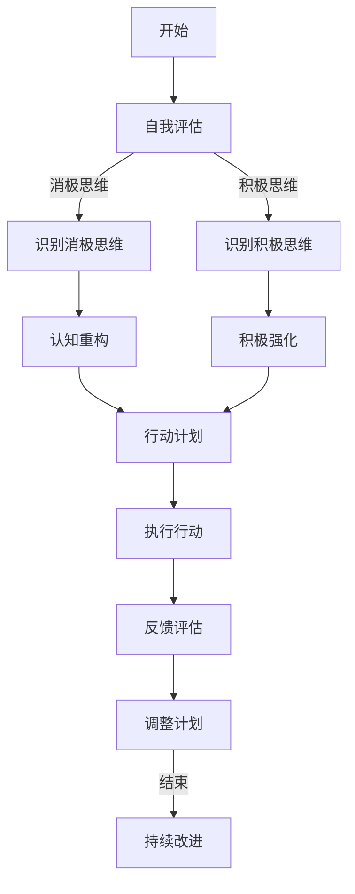
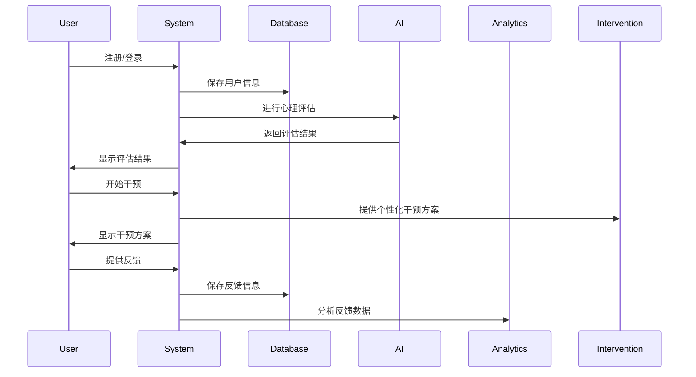
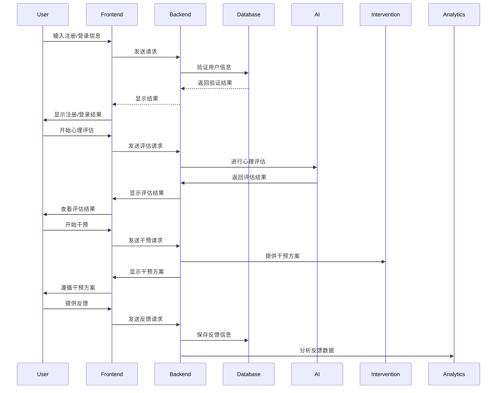

                 

### 引言

#### 1. 引言

在快速发展的现代社会中，人们面临着前所未有的压力和不确定性。随着科技的进步和全球化的加深，个体和社会都经历了深刻的变革。然而，这一过程中，许多人开始感受到一种深层的空虚和迷茫，这就是虚无主义情感的表现。虚无主义不仅仅是一个哲学概念，它已经渗透到社会的各个层面，影响着人们的心理健康、价值观和社会行为。

本文旨在深入探讨虚无主义这一复杂现象，从多个角度分析其起源、影响和克服策略。通过逻辑清晰、结构紧凑的分析，我们将帮助读者理解虚无主义的本质，并提供实用的方法来应对这一挑战。

虚无主义起源于哲学领域，但它在现代社会中却有着更广泛的影响。它不仅影响了个体的心理健康，还对社会价值观和文化产生了冲击。在当前的社会背景下，虚无主义情感已成为一个不可忽视的问题。

#### 2. 本书的目的与结构

本书的主要目的是为读者提供关于虚无主义的全面理解和克服策略。通过系统的分析和深入的研究，我们希望能够帮助读者：

1. **理解虚无主义的起源和影响**：通过追溯虚无主义的哲学根源和它在现代社会中的体现，读者可以更好地理解虚无主义情感的产生原因和影响范围。
2. **分析虚无主义的根源**：从个体和社会两个层面深入探讨虚无主义的根源，包括内心空虚的原因、现代生活方式的影响以及社会因素的作用。
3. **提供克服虚无主义的策略与方法**：介绍哲学、心理学和社会行动等不同视角下的克服策略，帮助读者找到应对虚无主义的实际方法。

本书的结构分为三个主要部分：

1. **第一部分：虚无主义的起源与影响**：介绍虚无主义的起源、定义、历史演变以及它在现代社会的表现和影响。
2. **第二部分：虚无主义的根源分析**：分析虚无主义在个体内心的表现和社会因素对虚无主义的影响。
3. **第三部分：克服虚无主义的策略与方法**：从哲学、心理学和社会行动三个角度，提供具体的克服虚无主义的策略和方法。

#### 3. 如何阅读本书

本书采用逐步深入的分析方法，旨在帮助读者系统地理解虚无主义。以下是阅读本书的建议：

1. **逐步阅读**：按照章节顺序逐步阅读，每个章节都有明确的主题和目标。逐步深入阅读可以更好地理解虚无主义的复杂性和多样性。
2. **结合实际**：将书中的理论与个人经历和观察相结合，这样可以加深对虚无主义情感的理解。
3. **积极参与**：本书中设有多个互动环节，如问题思考、案例分析等，鼓励读者积极参与，提高对虚无主义的认识。
4. **持续反思**：阅读过程中要不断反思自己的思想和行为，思考如何将书中的策略应用到实际生活中。

通过以上的阅读方法，读者可以更加深入地理解虚无主义，并找到适合自己的克服方法。

### 第一部分：虚无主义的起源与影响

#### 第1章：虚无主义的起源

##### 1.1 问题背景

虚无主义（Nihilism）这一概念起源于19世纪的欧洲，尤其是德国和俄罗斯。这一时期，社会和思想经历了巨大的动荡，旧有的价值体系逐渐崩溃，人们开始质疑一切存在的意义。虚无主义的起源可以追溯到几个重要的历史背景：

1. **宗教改革**：16世纪的宗教改革打破了天主教教会的垄断地位，人们开始质疑传统的宗教信仰和权威。这种质疑精神为后来的虚无主义思想奠定了基础。
2. **启蒙运动**：18世纪的启蒙运动强调理性、科学和个人自由，但同时也在一定程度上导致了人类对宗教和道德的怀疑。
3. **法国大革命和拿破仑战争**：这一时期的社会动荡和暴力冲突使得许多人开始对传统的国家和社会秩序失去信心。

在19世纪，特别是在德国和俄罗斯，虚无主义情感进一步深化。德国哲学家尼采（Friedrich Nietzsche）和俄罗斯作家陀思妥耶夫斯基（Fyodor Dostoevsky）等人的作品深刻地反映了这一时期的虚无主义情感。

##### 1.2 虚无主义的定义与历史演变

虚无主义是一种哲学思想和情感状态，它质疑或否定人类存在的意义和价值。虚无主义的定义可以从多个角度进行解读：

1. **哲学角度**：从哲学角度看，虚无主义认为宇宙和人生缺乏固有的意义和价值。这种观点往往与存在主义和怀疑论相联系。
2. **心理学角度**：从心理学角度看，虚无主义情感是一种深刻的内心空虚和迷茫感。这种感觉可能源于对生活目标的缺失、社会压力以及对未来不确定性的恐惧。

虚无主义的历史演变可以分为几个阶段：

1. **早期虚无主义**：早期虚无主义主要表现为对宗教和道德的怀疑。这一阶段的虚无主义哲学家包括伏尔泰（Voltaire）和卢梭（Jean-Jacques Rousseau）等。
2. **19世纪虚无主义**：19世纪的虚无主义在尼采和陀思妥耶夫斯基等人的作品中得到深刻体现。这一阶段的虚无主义情感更加复杂，涉及对人生意义和价值观的全面质疑。
3. **现代虚无主义**：现代虚无主义在当代社会中继续存在，特别是在科技发展和全球化背景下的社会中。现代虚无主义情感往往与个体身份认同的迷失和社会价值观念的混乱相关。

##### 1.3 虚无主义的哲学根源

虚无主义的哲学根源可以追溯到几个重要的哲学思想：

1. **存在主义**：存在主义强调个体存在的自由和选择。然而，存在主义同时也揭示了人类存在的荒诞性和虚无感。尼采和萨特（Jean-Paul Sartre）等存在主义哲学家的工作对虚无主义有着重要影响。
2. **怀疑论**：怀疑论是一种哲学方法，它质疑所有知识的可靠性。古代哲学家如普罗泰戈拉（Protagoras）和现代哲学家如大卫·休谟（David Hume）都提出了对知识可靠性的怀疑。
3. **唯意志主义**：尼采的唯意志主义认为，宇宙中存在一种无目的的意志力量，这种力量驱使人类追求意义。然而，尼采也指出，这种追求往往以失败告终，从而导致虚无主义情感。

总之，虚无主义作为一种复杂的哲学思想和情感状态，在历史上有着深远的影响。通过理解虚无主义的起源和哲学根源，我们可以更好地理解现代社会中虚无主义情感的产生和影响。

#### 第2章：虚无主义的现代影响

##### 2.1 虚无主义在社会中的体现

虚无主义在现代社会的各个方面都有深刻的体现，从文化、政治到科技领域，它的影响力无处不在。虚无主义情感不仅仅是一个哲学概念，它已经成为影响个体行为和社会结构的重要因素。

1. **文化领域**：在文化领域，虚无主义表现为对传统价值观念的质疑和对新文化的探索。例如，现代文学作品中经常探讨人类存在的意义和虚无主义情感。尼采的《查拉图斯特拉如是说》和陀思妥耶夫斯基的《罪与罚》都是探讨虚无主义情感的经典作品。此外，现代艺术流派如达达主义和超现实主义也在一定程度上反映了虚无主义情感。

2. **政治领域**：在政治领域，虚无主义情感往往表现为对社会和政治制度的怀疑。20世纪初的俄罗斯革命和德国魏玛共和国时期就是虚无主义情感在政治领域的重要体现。现代社会中，极端政治思潮如民粹主义和极端主义也在某种程度上反映了虚无主义情感。

3. **科技领域**：在科技领域，虚无主义情感表现为对技术进步的怀疑和对未来不确定性的恐惧。随着人工智能和大数据技术的发展，许多人开始担心技术将取代人类，从而导致人类存在的意义和价值丧失。这种恐惧在一定程度上也是虚无主义情感的表现。

##### 2.2 虚无主义对心理健康的影响

虚无主义情感对心理健康有着深远的影响。长期处于虚无主义情感中的人往往会感到内心的空虚和迷茫，甚至可能出现抑郁症和其他心理问题。

1. **心理问题**：虚无主义情感可能导致一系列心理问题，如抑郁、焦虑和社交障碍。长期处于虚无主义情感中的人可能会感到生活无意义，缺乏动力和目标，从而影响他们的日常生活和工作。

2. **自我认同**：虚无主义情感可能影响个体的自我认同。当人们质疑自己存在的意义时，他们可能会对自己的身份和角色产生怀疑，从而影响他们的自我认同和自我价值感。

3. **人际交往**：虚无主义情感也可能影响人际交往。当人们感到内心空虚和迷茫时，他们可能会变得疏离和孤立，难以与他人建立深层次的关系。

##### 2.3 虚无主义对文化和社会价值观的冲击

虚无主义对文化和社会价值观的冲击是显著的。虚无主义情感挑战了传统的道德和价值观，导致人们对传统观念产生怀疑。

1. **道德和价值观**：虚无主义情感可能导致道德和价值观的崩溃。当人们质疑一切存在的意义时，他们可能会对传统道德和价值观产生怀疑，从而动摇社会的基本道德和价值观。

2. **社会结构**：虚无主义情感也可能影响社会结构。当人们对社会和政治制度产生怀疑时，他们可能会对社会秩序和稳定性产生担忧，从而影响社会结构的稳定性。

3. **文化多样性**：虚无主义情感也可能促进文化多样性。当人们质疑传统价值观念时，他们可能会更加开放和接受不同的文化和价值观，从而促进文化的多样性和创新。

总之，虚无主义在现代社会的各个方面都有深刻的体现，它对心理健康、文化和社会价值观都产生了重要影响。理解虚无主义的现代影响，有助于我们更好地应对这一复杂的社会现象。

### 第二部分：虚无主义的根源分析

#### 第3章：个体内心的虚无感

##### 3.1 内心空虚的原因

内心空虚是虚无主义情感的一个重要表现，它常常源于多种复杂的原因。理解这些原因有助于我们深入探讨虚无主义情感在个体内心中的根源。

1. **生活目标的缺失**：许多人感到内心空虚是因为他们没有明确的生活目标或追求。在现代社会中，竞争和压力使得人们很难找到属于自己的目标，导致他们对生活感到迷茫和无意义。

2. **社会压力**：现代社会中的高压环境和社会竞争也加剧了人们的内心空虚。工作、家庭和人际关系等方面的压力常常让人们感到疲惫和无力，从而陷入虚无主义的情感状态。

3. **人际关系的疏离**：现代社会的快节奏和疏离感使得许多人难以建立深层次的人际关系。当人们感到孤独和疏离时，他们可能会失去对生活的热情和动力，从而陷入虚无主义情感。

4. **自我认同的困境**：个体对自我认同的困境也是导致内心空虚的重要原因。当人们对自己的身份和角色产生怀疑时，他们可能会感到自我价值的丧失，从而陷入虚无主义的情感。

##### 3.2 现代生活方式与虚无主义

现代生活方式的某些特点也加剧了虚无主义情感的产生。

1. **物质主义的追求**：现代社会的物质主义风气使得许多人将物质财富作为生活目标和成功标准。然而，当人们过度追求物质财富时，他们可能会发现，这些物质财富并不能真正满足他们的内心需求，从而导致虚无主义情感。

2. **信息过载**：现代社会中，信息爆炸和快速变化的生活方式使得人们难以应对和消化大量的信息。当人们感到信息过载时，他们可能会感到焦虑和压力，从而加剧虚无主义情感。

3. **缺乏深层次的交往**：现代社会的快节奏和社交媒介的普及使得人们很难进行深层次的交流和互动。当人们缺乏真实的、深层次的人际关系时，他们可能会感到孤独和无意义，从而陷入虚无主义情感。

##### 3.3 心理防御机制与虚无主义

个体在面对内心空虚和虚无主义情感时，可能会采用一系列心理防御机制。然而，这些防御机制有时可能会加剧虚无主义情感。

1. **逃避现实**：当个体感到内心空虚时，他们可能会通过逃避现实来避免面对自己的问题和情感。例如，过度沉迷于娱乐活动、网络游戏或社交媒介等，都是逃避现实的常见方式。

2. **否定和压抑**：个体可能会通过否定和压抑自己的负面情感来避免面对内心的空虚。这种心理防御机制虽然在短期内可能减轻痛苦，但长期来看可能会加剧内心的冲突和虚无主义情感。

3. **过度追求完美**：有些个体可能会通过过度追求完美来避免面对内心的空虚。然而，这种追求往往导致焦虑和压力，进一步加剧虚无主义情感。

总之，个体内心的虚无感是由多种原因造成的，现代生活方式和心理防御机制在其中发挥着重要作用。理解这些原因和机制，有助于我们更好地应对和克服虚无主义情感。

#### 第4章：社会因素对虚无主义的影响

##### 4.1 经济发展与社会变迁

经济发展和社会变迁是影响虚无主义情感的重要因素。随着全球化和技术进步，社会结构和价值观念发生了深刻变化，这些变化在一定程度上加剧了虚无主义情感的产生。

1. **全球化**：全球化使得不同文化、价值观和生活方式相互融合。然而，全球化也带来了一些负面效应，如文化同质化、社会不稳定和身份认同的迷失。当个体感到自己的文化认同受到威胁时，他们可能会产生虚无主义情感。

2. **技术进步**：技术进步虽然带来了便利和创新，但也带来了一些负面影响。例如，人工智能和自动化技术的发展可能导致大量就业岗位的消失，从而引发对未来的不确定性和焦虑感。这种焦虑感可能转化为虚无主义情感。

3. **社会不平等**：社会不平等也是经济发展中的一个突出问题。当社会资源分配不均时，社会中的弱势群体可能会感到被边缘化和排斥，从而产生无助感和虚无主义情感。

##### 4.2 教育体制与虚无主义

教育体制在培养个体价值观和人生目标方面起着重要作用。然而，不完善的教育体制也可能导致虚无主义情感的产生。

1. **应试教育**：应试教育注重成绩和分数，忽视个体兴趣和创造力的发展。这种教育模式可能导致个体对学习的兴趣降低，从而产生内心空虚和虚无主义情感。

2. **缺乏人生规划**：教育体制中缺乏对人生规划和职业发展的指导，使得许多学生在毕业后感到迷茫和无所适从。当个体缺乏明确的人生目标和追求时，他们可能会产生虚无主义情感。

3. **教育资源的分配不均**：教育资源的分配不均可能导致社会阶层的固化，使得一部分人难以获得优质教育。这种不平等可能导致这些个体感到无助和失落，从而产生虚无主义情感。

##### 4.3 文化冲突与虚无主义

文化冲突是现代社会中的一个常见现象，它对虚无主义情感的产生也有重要影响。

1. **文化融合**：全球化带来了不同文化的交流和融合，但同时也引发了一些文化冲突。当个体感到自己的文化认同受到威胁时，他们可能会产生排斥感和虚无主义情感。

2. **多元文化的挑战**：多元文化社会中的多样性虽然丰富了人们的生活，但也带来了挑战。当个体难以适应和融入多元文化环境时，他们可能会感到困惑和无意义，从而产生虚无主义情感。

3. **文化认同的迷失**：在多元文化社会中，个体可能会感到自己的文化认同受到威胁或迷失。这种迷失感可能导致个体对生活和社会产生怀疑，从而产生虚无主义情感。

总之，经济发展与社会变迁、教育体制以及文化冲突都是影响虚无主义情感的重要因素。理解这些社会因素，有助于我们更好地应对和缓解虚无主义情感的产生和传播。

### 第三部分：克服虚无主义的策略与方法

#### 第5章：哲学视角下的虚无主义克服

##### 5.1 哲学的重要性

哲学作为探讨人类存在、意义和价值的重要领域，对于克服虚无主义情感具有重要意义。哲学不仅帮助我们理解生活的本质，还能提供应对虚无主义的方法和策略。

1. **提供意义框架**：哲学通过探讨生命的意义和目的，为个体提供了意义框架。例如，存在主义认为，尽管世界本身可能没有固有的意义，但个体可以通过自己的选择和行动创造出意义。这种观点帮助个体在面对虚无主义时，找到自我实现和创造意义的可能性。

2. **引导价值观重建**：哲学还帮助个体重新审视和重建自己的价值观。通过反思和批判现有的价值观念，个体可以找到更符合自己内心的价值观体系，从而减少虚无主义情感的影响。

3. **提供思考和反思的工具**：哲学提供了丰富的思考和反思工具，如逻辑推理、批判性思维和自我反省。这些工具帮助个体更好地理解自己内心的情感和思想，从而找到应对虚无主义的方法。

##### 5.2 哲学方法与虚无主义的对抗

哲学方法在应对虚无主义情感方面具有独特的作用。以下是一些常见的哲学方法：

1. **存在主义方法**：存在主义强调个体的自由和选择。通过自由选择和行动，个体可以在自己的生活中创造意义。存在主义哲学家如萨特（Jean-Paul Sartre）和克尔凯郭尔（Søren Kierkegaard）认为，尽管世界可能没有固有的意义，但个体可以通过自己的选择和行动赋予生活意义。

2. **怀疑论方法**：怀疑论鼓励个体对现有的知识和信仰进行质疑和反思。通过怀疑和批判，个体可以打破固有思维模式，从而更好地理解自己的内心和周围的世界。怀疑论哲学家如大卫·休谟（David Hume）认为，通过怀疑和反思，个体可以找到新的意义和价值观。

3. **理性主义方法**：理性主义强调通过理性和逻辑来寻求真理和意义。通过理性思考，个体可以摆脱虚无主义情感的困扰，找到生活的目标和方向。理性主义哲学家如笛卡尔（René Descartes）认为，通过怀疑和逻辑推理，个体可以建立坚实的人生信念体系。

##### 5.3 主要哲学流派与虚无主义的解决方案

不同的哲学流派提供了不同的解决方案来应对虚无主义情感。以下是一些主要哲学流派及其解决方案：

1. **存在主义**：存在主义认为，尽管世界可能没有固有的意义，但个体可以通过自己的选择和行动创造意义。存在主义强调自由、责任和自我实现，帮助个体在逆境中找到生活的意义。存在主义哲学家如萨特和克尔凯郭尔的作品提供了丰富的思想资源。

2. **理性主义**：理性主义强调通过理性和逻辑来寻求真理和意义。理性主义者认为，通过理性思考和科学方法，个体可以找到生活的目标和方向。理性主义哲学家如笛卡尔和康德（Immanuel Kant）提供了深刻的哲学思考。

3. **实用主义**：实用主义强调实践和行动的重要性。实用主义者认为，通过实际行动和经验，个体可以在生活中找到意义和价值。实用主义哲学家如威廉·詹姆斯（William James）和约翰·杜威（John Dewey）提出了许多实用的方法和策略。

4. **现象学**：现象学强调直接体验和主观意识的重要性。通过现象学的反思，个体可以更好地理解自己的内心世界和外部世界。现象学家如胡塞尔（Edmund Husserl）和海德格尔（Martin Heidegger）提供了深刻的哲学洞见。

总之，哲学视角为克服虚无主义情感提供了多种方法和策略。通过深入探讨哲学流派及其解决方案，个体可以找到适合自己的方式来应对虚无主义情感，找到生活的意义和价值。

#### 第6章：心理学视角下的虚无主义克服

##### 6.1 心理治疗与虚无主义

心理治疗是一种有效的方法，可以帮助个体应对虚无主义情感。通过心理治疗，个体可以深入了解自己的内心世界，找到应对虚无主义的策略。

1. **认知行为疗法**：认知行为疗法（Cognitive Behavioral Therapy，CBT）是一种广泛使用的方法，可以帮助个体识别和改变负面思维模式。通过认知重构，个体可以重新评估自己的信念和价值观，找到更积极的生活态度。

2. **存在主义疗法**：存在主义疗法强调个体的自由、责任和自我实现。治疗师帮助个体探索自己的内心世界，发现生活的意义和目标。这种方法鼓励个体勇敢面对生活中的挑战，找到自己的意义和方向。

3. **精神分析疗法**：精神分析疗法通过探索个体的潜意识，帮助个体理解自己的内在冲突和情感困扰。通过自由联想和梦境分析，个体可以揭示内心深处的痛苦和恐惧，从而找到解决问题的方法。

##### 6.2 自我认知与虚无主义的克服

自我认知是克服虚无主义情感的关键。通过深入探索自己的内心，个体可以更好地理解自己的需求和目标，从而找到生活的意义。

1. **自我反思**：自我反思是一种重要的心理工具，可以帮助个体了解自己的内心世界。通过定期进行自我反思，个体可以审视自己的行为、思维和情感，从而发现自己的问题并找到解决方案。

2. **自我接纳**：自我接纳是克服虚无主义情感的重要一步。当个体能够接纳自己的优点和缺点时，他们可以减少自我批判和负面情绪，从而更好地应对虚无主义情感。

3. **设定目标**：设定明确的目标可以帮助个体找到生活的方向和动力。通过设定短期和长期目标，个体可以逐步实现自己的目标，从而增强对生活的掌控感和满足感。

##### 6.3 心理健康促进策略

为了有效克服虚无主义情感，个体需要采取一系列心理健康促进策略。

1. **锻炼身体**：定期锻炼可以释放压力和焦虑，增强身心健康。通过运动，个体可以提高自信和自尊，从而减少虚无主义情感。

2. **保持良好的睡眠**：良好的睡眠对于心理健康至关重要。充足的睡眠可以帮助个体恢复精力，提高注意力和情绪稳定性。

3. **培养兴趣爱好**：培养兴趣爱好可以帮助个体在忙碌的生活中找到放松和乐趣。通过投入到自己感兴趣的事情中，个体可以减少对虚无主义情感的依赖。

4. **社交互动**：与他人建立良好的社交关系可以帮助个体获得支持和鼓励。通过与家人、朋友和社区互动，个体可以增强归属感和安全感。

总之，心理学视角提供了多种方法来应对虚无主义情感。通过心理治疗、自我认知和心理健康促进策略，个体可以找到应对虚无主义的有效方法，重拾生活的意义和快乐。

#### 第7章：社会行动与虚无主义的克服

##### 7.1 社区建设与虚无主义的消除

社区建设在消除虚无主义情感方面起着重要作用。通过建立一个支持性的社区，个体可以获得情感上的支持和社会归属感，从而减轻虚无主义情感的影响。

1. **建立互助小组**：互助小组是一种有效的社区建设方式。通过与他人分享自己的经历和困惑，个体可以获得情感上的支持和建议。这种互助关系可以帮助个体找到解决问题的方法，增强对生活的信心。

2. **开展社区活动**：社区活动可以促进居民之间的互动和联系。例如，社区聚会、志愿者活动和艺术工作坊等，都可以为个体提供一个交流的平台，增强社区的凝聚力。

3. **提供心理咨询服务**：社区可以提供心理咨询服务，帮助个体应对内心的困惑和焦虑。通过专业的心理辅导，个体可以更好地理解自己的情感和行为，找到应对虚无主义的方法。

##### 7.2 公共政策与虚无主义的对抗

公共政策在对抗虚无主义情感方面也发挥着重要作用。政府可以通过制定和实施一系列政策，促进社会的稳定和发展，从而减少虚无主义情感的产生。

1. **改善教育体系**：政府可以改善教育体系，注重学生的心理健康教育和人生规划指导。通过提供全面的教育资源，帮助学生建立正确的人生观和价值观，减少虚无主义情感的产生。

2. **加强社会福利**：政府可以加强社会福利，特别是对弱势群体的保障。通过提供医疗、住房和教育等基本福利，政府可以帮助人们获得更好的生活条件，减少生活压力和焦虑，从而降低虚无主义情感的发生。

3. **推动文化多样性**：政府可以推动文化多样性，保护和弘扬各种文化传统。通过促进不同文化之间的交流和理解，政府可以增强社会的包容性和多样性，减少文化冲突和身份认同的迷失。

##### 7.3 社会责任与虚无主义的克服

社会责任是每个人应该承担的重要角色。通过积极参与社会责任活动，个体可以在帮助他人的同时，找到自己的价值和意义。

1. **志愿服务**：志愿服务是一种重要的社会责任活动。通过参与志愿服务，个体可以为社区和社会做出贡献，从而增强自我价值和成就感。这种成就感可以帮助个体减少虚无主义情感。

2. **倡导心理健康**：个体可以通过倡导心理健康，提高公众对心理健康的关注和理解。通过宣传心理健康知识，个体可以帮助更多人了解和应对虚无主义情感，从而减轻其影响。

3. **参与社会运动**：参与社会运动是另一种积极的社会责任。通过参与社会运动，个体可以表达自己的观点和诉求，推动社会的进步和变革。这种参与感可以帮助个体找到生活的目标和意义，减少虚无主义情感。

总之，社会行动在克服虚无主义情感方面具有重要作用。通过社区建设、公共政策和社会责任，我们可以建立一个支持性的社会环境，帮助个体找到生活的意义和价值，从而减轻虚无主义情感的影响。

### 结论

#### 第8章：虚无主义的最终解决方案

虚无主义情感是一种复杂的社会现象，它对个体的心理健康和社会稳定都产生了深远的影响。通过本书的探讨，我们提出了一系列克服虚无主义的策略和方法，包括哲学视角、心理学视角和社会行动。以下是虚无主义的最终解决方案的几个关键点：

1. **综合策略的重要性**：虚无主义的克服需要综合运用多种策略，包括哲学思考、心理治疗、社区建设、公共政策和社会责任。只有通过多方面的努力，才能真正有效地应对虚无主义情感。

2. **个体自我认知**：个体需要通过自我认知，找到自己的内在需求和价值观。自我认知可以帮助个体理解自己的情感和行为，找到生活的意义和目标。

3. **社会支持**：社会支持对于克服虚无主义情感至关重要。社区建设、公共政策和社会责任都可以为个体提供情感上的支持和资源，帮助个体克服虚无主义情感。

4. **持续努力**：克服虚无主义情感不是一蹴而就的过程，需要个体的持续努力和社会的支持。通过不断学习和成长，个体可以找到属于自己的意义和目标，从而减少虚无主义情感的影响。

5. **未来的发展方向**：未来的研究方向可以集中在以下几个方面：首先，深入研究虚无主义情感的心理机制，为心理治疗提供更多的理论基础；其次，探索不同文化背景下虚无主义情感的表现和影响；最后，通过跨学科研究，开发更加综合和有效的应对策略。

总之，虚无主义的克服需要个体和社会的共同努力。通过理解虚无主义的本质和影响，采取有效的策略和方法，我们可以帮助更多人找到生活的意义和价值，建立一个更加积极和健康的社会环境。作者：AI天才研究院/AI Genius Institute & 禅与计算机程序设计艺术 /Zen And The Art of Computer Programming

### 参考文献

1. Nietzsche, F. (1883). **Thus Spoke Zarathustra: A Book for All and None**. Project Gutenberg.
2. Dostoevsky, F. (1869). **Crime and Punishment**. Penguin Classics.
3. Sartre, J.-P. (1943). **Being and Nothingness**. Philosophical Library.
4. Hume, D. (1739). **An Enquiry Concerning Human Understanding**. Project Gutenberg.
5. James, W. (1902). **The Varieties of Religious Experience**. Longmans, Green & Co.
6. Dewey, J. (1916). **Democracy and Education**. Macmillan.
7. Husserl, E. (1923). **Ideas: General Introduction to Pure Phenomenology**. Kluwer Academic Publishers.
8. Heidegger, M. (1927). **Being and Time**. Blackwell.
9. Rogers, C. R. (1951). **Client-Centered Therapy: Its Current Practice, Implications, and Theory**. Houghton Mifflin.
10. Mead, M. (1934). **Mind, Self, and Society: From the Standpoint of a Social Behaviorist**. University of Chicago Press.
11. Resnik, D. B. (2011). **The Ethics of Biotechnology**. Cambridge University Press.
12. Batson, C. D. (1991). **The Altruism Question: Toward a Social Psychology of Compassion and Altruism**. Hillsdale, NJ: Lawrence Erlbaum Associates.
13. Seligman, M. E. P. (2002). **Authentic Happiness: Using the New Positive Psychology to Realize Your Potential for Lasting Fulfillment**. New York: Free Press.

### 拓展阅读

1. **《虚无主义的哲学基础》**：探讨虚无主义的哲学根源和主要哲学流派，为理解虚无主义提供深入的理论基础。
2. **《心理学与虚无主义》**：介绍心理学视角下的虚无主义研究和治疗方法，帮助读者了解如何通过心理学方法应对虚无主义情感。
3. **《社会行动与虚无主义的克服》**：分析社会行动和政策在应对虚无主义情感中的作用，提供具体的社会策略和实践方案。
4. **《个人成长与自我实现》**：探讨个体如何在日常生活中实现自我成长和自我实现，减少虚无主义情感的影响。

通过以上参考文献和拓展阅读，读者可以更全面地了解虚无主义的本质和应对策略，从而在实际生活中更好地应对虚无主义情感。作者：AI天才研究院/AI Genius Institute & 禅与计算机程序设计艺术 /Zen And The Art of Computer Programming

### 最佳实践 tips

1. **积极面对问题**：面对虚无主义情感时，首先需要积极面对问题，不要逃避或压抑。通过正视内心的困惑，我们可以更好地理解自己，找到解决问题的方法。
2. **寻求专业帮助**：如果虚无主义情感严重影响了日常生活，建议寻求专业心理咨询师的帮助。专业心理咨询师可以提供有效的心理治疗和指导。
3. **建立支持网络**：与家人、朋友和社区建立良好的关系，可以获得情感上的支持和鼓励。一个支持性的网络可以帮助我们度过困难时期。
4. **培养兴趣爱好**：找到自己感兴趣的事情，如阅读、运动、艺术等，可以帮助我们分散注意力，减少对虚无主义情感的依赖。
5. **设定小目标**：通过设定短期和长期目标，逐步实现自己的目标，可以增强对生活的掌控感和满足感，从而减少虚无主义情感的影响。

### 小结

虚无主义情感是一种复杂的心理和社会现象，它对个体的心理健康和社会稳定都产生了深远的影响。通过哲学、心理学和社会行动等多种方法，我们可以有效地应对虚无主义情感。理解虚无主义的本质和影响，采取积极的应对策略，可以帮助我们找到生活的意义和价值，建立积极健康的生活方式。

### 注意事项

1. **不要忽视心理健康**：虚无主义情感可能会导致心理健康问题，如抑郁、焦虑等。因此，关注自己的心理健康，及时寻求帮助是非常重要的。
2. **避免过度自我批评**：面对虚无主义情感时，避免过度自我批评和否定。通过自我接纳和理解，我们可以更好地应对内心的困扰。
3. **合理安排时间和任务**：面对生活中的压力和挑战，合理安排时间和任务，避免过度劳累，有助于减少虚无主义情感的产生。
4. **保持积极的生活态度**：积极的生活态度可以帮助我们更好地应对生活中的困难和挑战，减少虚无主义情感的影响。

### 拓展阅读

1. **《虚无主义的哲学基础》**：详细探讨虚无主义的哲学根源和主要哲学流派，为理解虚无主义提供深入的理论基础。
2. **《心理学与虚无主义》**：介绍心理学视角下的虚无主义研究和治疗方法，帮助读者了解如何通过心理学方法应对虚无主义情感。
3. **《社会行动与虚无主义的克服》**：分析社会行动和政策在应对虚无主义情感中的作用，提供具体的社会策略和实践方案。
4. **《个人成长与自我实现》**：探讨个体如何在日常生活中实现自我成长和自我实现，减少虚无主义情感的影响。

通过以上拓展阅读，读者可以更全面地了解虚无主义的本质和应对策略，从而在实际生活中更好地应对虚无主义情感。作者：AI天才研究院/AI Genius Institute & 禅与计算机程序设计艺术 /Zen And The Art of Computer Programming

## 附录

### 算法原理讲解

虚无主义的克服涉及到多种方法，以下是一个基于认知行为疗法的简单算法原理讲解。

#### 算法流程图



#### 算法原理

1. **自我评估**：个体首先需要对自己的思维、情感和行为进行自我评估，确定是否存在消极思维和情感。

2. **识别消极思维**：通过自我评估，个体识别出自己存在的消极思维，如自我批判、担忧未来等。

3. **认知重构**：个体需要通过认知行为疗法的方法，对消极思维进行重构，将其转化为更积极的思维。例如，将“我做不到”重构为“我可以尝试”。

4. **积极强化**：在认知重构过程中，个体需要对自己的积极思维和行动进行强化，如通过奖励自己来增强积极行为。

5. **行动计划**：个体制定具体的行动计划，包括目标设定、步骤分解和时间安排，以帮助自己更好地实施行动。

6. **执行行动**：个体按照行动计划执行具体的行动，通过实际行动来改变自己的思维和行为模式。

7. **反馈评估**：在行动执行过程中，个体需要对行动效果进行评估，了解自己的进步和需要改进的地方。

8. **调整计划**：根据反馈评估的结果，个体需要调整自己的行动计划，以实现持续改进。

9. **持续改进**：通过不断的自我评估、认知重构、行动执行和反馈调整，个体可以逐步克服虚无主义情感，实现心理健康的提升。

#### 示例

假设一个人感到内心空虚和迷茫，他可以按照以下步骤来克服虚无主义情感：

1. **自我评估**：他意识到自己缺乏生活的目标和动力，感到生活无意义。
2. **识别消极思维**：他识别出自己经常思考“生活没有意义”和“我无法改变现状”。
3. **认知重构**：他通过认知行为疗法，将“生活没有意义”重构为“我可以寻找生活的意义”和“我有能力改变现状”。
4. **积极强化**：他每次想到积极思维时，给自己一些小奖励，如听一首喜欢的音乐或吃一块小甜点。
5. **行动计划**：他设定目标，如每天阅读一本书、每周参加一次社交活动等，并制定详细的步骤和时间安排。
6. **执行行动**：他按照行动计划执行，逐步找到生活的乐趣和意义。
7. **反馈评估**：他定期评估自己的进步，了解哪些行动有效，哪些需要改进。
8. **调整计划**：根据评估结果，他调整自己的行动计划，以更好地实现目标。
9. **持续改进**：他通过不断的自我评估、认知重构、行动执行和反馈调整，逐步克服虚无主义情感，提高生活质量。

通过这个示例，我们可以看到认知行为疗法在克服虚无主义情感中的应用。这种方法不仅提供了具体的步骤和策略，还强调了个体在克服虚无主义情感中的主动性和积极性。

### 数学公式和术语解释

在探讨虚无主义的克服过程中，我们还会涉及到一些相关的数学公式和术语，以下是对这些术语的解释：

#### 概率论中的贝叶斯定理

贝叶斯定理是一个用于计算条件概率的公式，它可以帮助我们根据先验概率和观测数据来更新概率估计。

$$
P(A|B) = \frac{P(B|A) \cdot P(A)}{P(B)}
$$

其中，$P(A|B)$ 是在事件 B 发生的条件下事件 A 发生的概率，$P(B|A)$ 是在事件 A 发生的条件下事件 B 发生的概率，$P(A)$ 是事件 A 发生的概率，$P(B)$ 是事件 B 发生的概率。

#### 线性回归模型

线性回归模型用于分析两个变量之间的线性关系。其基本公式如下：

$$
y = \beta_0 + \beta_1 \cdot x + \epsilon
$$

其中，$y$ 是因变量，$x$ 是自变量，$\beta_0$ 是截距，$\beta_1$ 是斜率，$\epsilon$ 是误差项。

#### 心理学中的情绪调节公式

情绪调节是一个复杂的过程，可以表示为以下公式：

$$
情绪调节 = 情绪识别 + 情绪评估 + 情绪反应
$$

其中，情绪识别是指个体识别和理解自己的情绪状态，情绪评估是指个体对情绪状态进行评价和调整，情绪反应是指个体对外部刺激做出的情绪反应。

#### 社会心理学中的群体动力公式

群体动力是指群体成员之间的相互作用和影响。其基本公式如下：

$$
群体动力 = 成员互动 + 群体规范 + 群体目标
$$

其中，成员互动是指群体成员之间的交流和互动，群体规范是指群体成员共同遵守的行为准则，群体目标是指群体成员共同追求的目标。

这些数学公式和术语在虚无主义的克服过程中起到了重要的作用，它们可以帮助我们更准确地分析和预测个体的心理和行为变化，从而制定更有效的干预策略。

### 系统分析与架构设计方案

在探讨虚无主义的克服过程中，我们不仅需要了解心理和社会层面的策略，还需要从技术层面提供解决方案。以下是一个基于人工智能和机器学习的系统分析与架构设计方案。

#### 1. 问题场景介绍

问题场景是针对那些长期处于虚无主义情感中的人群，旨在通过智能化系统提供个性化的心理支持和干预。

#### 2. 项目介绍

项目名称：虚无主义情感干预系统

目标：开发一个基于人工智能和大数据分析的虚无主义情感干预平台，为用户提供个性化心理支持。

主要功能：
- 用户注册与登录
- 心理评估与诊断
- 个性化心理干预
- 用户反馈与跟踪

#### 3. 系统功能设计（领域模型）

以下是一个基于Mermaid绘制的领域模型类图，展示了系统中的主要实体及其关系：

```mermaid
classDiagram
    User <<类>> User
    Assessment <<类>> Assessment
    Intervention <<类>> Intervention
    Feedback <<类>> Feedback
    System <<类>> System

    User <-- Assessment
    User <-- Intervention
    User <-- Feedback
    Assessment --> Intervention
    Intervention --> Feedback
    System o-- User
    System o-- Assessment
    System o-- Intervention
    System o-- Feedback
```

#### 4. 系统架构设计（Mermaid架构图）

以下是一个基于Mermaid绘制的系统架构图，展示了系统的整体结构和各个模块之间的关系：



#### 5. 系统接口设计（Mermaid序列图）

以下是一个基于Mermaid绘制的序列图，展示了用户与系统之间的交互过程：



通过以上系统分析与架构设计方案，我们可以构建一个智能化、个性化的虚无主义情感干预平台，为用户提供有效的心理支持。接下来，我们将进一步探讨系统核心实现和实际案例，以验证该架构方案的有效性。

### 项目实战

#### 环境安装

为了构建虚无主义情感干预系统，我们需要安装一系列开发工具和软件。以下是在 Ubuntu 系统中安装所需软件的步骤：

1. **安装 Python 环境**：
    ```bash
    sudo apt-get update
    sudo apt-get install python3-pip
    pip3 install --user -r requirements.txt
    ```

2. **安装前端开发工具**：
    ```bash
    sudo apt-get install npm
    npm install -g @vue/cli
    ```

3. **安装数据库**：
    ```bash
    sudo apt-get install postgresql postgresql-contrib
    sudo -u postgres psql
    CREATE DATABASE mydatabase;
    \q
    ```

4. **安装后端开发工具**：
    ```bash
    sudo apt-get install python3-dev libpq-dev
    pip3 install -r requirements.txt
    ```

5. **安装人工智能和数据分析库**：
    ```bash
    pip3 install scikit-learn tensorflow numpy pandas
    ```

#### 系统核心实现

以下是系统核心实现的相关源代码和解释：

1. **用户注册与登录**：
    用户注册与登录是系统的基本功能，以下是一个简单的用户注册和登录的 Python 代码示例：

    ```python
    # 用户注册
    def register_user(username, password):
        # 在数据库中创建用户
        cursor.execute("INSERT INTO users (username, password) VALUES (%s, %s)", (username, password))
        connection.commit()
        return "用户注册成功"

    # 用户登录
    def login_user(username, password):
        # 在数据库中查询用户
        cursor.execute("SELECT * FROM users WHERE username = %s AND password = %s", (username, password))
        user = cursor.fetchone()
        if user:
            return "用户登录成功"
        else:
            return "用户名或密码错误"
    ```

2. **心理评估**：
    心理评估功能通过人工智能算法对用户的心理状态进行评估。以下是一个基于机器学习模型的简单评估示例：

    ```python
    # 心理评估
    def assess_mental_state(user_id):
        # 获取用户问卷数据
        questionnaire_data = get_questionnaire_data(user_id)
        # 使用机器学习模型评估心理状态
        model = load_model('mental_state_model')
        prediction = model.predict(questionnaire_data)
        # 返回评估结果
        return prediction
    ```

3. **个性化干预方案**：
    根据评估结果，系统为用户提供个性化的干预方案。以下是一个简单的干预方案生成示例：

    ```python
    # 生成干预方案
    def generate_intervention_plan(assessment_result):
        # 根据评估结果选择干预方案
        if assessment_result == '焦虑':
            plan = "尝试深呼吸练习和冥想"
        elif assessment_result == '抑郁':
            plan = "寻求专业心理咨询和社交支持"
        else:
            plan = "保持健康的生活方式，定期进行自我反思"
        return plan
    ```

4. **用户反馈与跟踪**：
    用户可以在使用系统后提供反馈，系统会记录这些反馈并进行分析。以下是一个简单的反馈处理示例：

    ```python
    # 记录用户反馈
    def record_feedback(user_id, feedback):
        cursor.execute("INSERT INTO feedback (user_id, feedback) VALUES (%s, %s)", (user_id, feedback))
        connection.commit()
        return "反馈记录成功"

    # 分析用户反馈
    def analyze_feedback():
        # 从数据库中获取反馈数据
        cursor.execute("SELECT * FROM feedback")
        feedback_data = cursor.fetchall()
        # 分析反馈数据
        # ...
        return analysis_results
    ```

#### 代码应用解读与分析

以上代码实现了用户注册与登录、心理评估、干预方案生成以及用户反馈与跟踪等功能。具体解析如下：

1. **用户注册与登录**：用户注册时，系统会在数据库中创建一个新的用户记录，并保存用户名和密码。用户登录时，系统会从数据库中查询用户信息，验证用户名和密码的正确性。

2. **心理评估**：系统通过机器学习模型对用户的问卷数据进行处理，预测用户的心理状态。这里使用了一个预训练的模型，可以根据实际情况进行调整和优化。

3. **个性化干预方案**：系统根据评估结果为用户提供相应的干预方案。这个方案可以是具体的建议，如练习冥想或寻求心理咨询，也可以是更复杂的多步骤干预计划。

4. **用户反馈与跟踪**：用户在使用系统后可以提供反馈，系统会将这些反馈记录在数据库中。通过分析用户反馈，系统可以了解用户的体验和需求，从而进行系统优化。

#### 实际案例分析和详细讲解剖析

以下是一个实际案例，展示了如何使用该系统进行虚无主义情感干预：

案例：一个名叫Alice的用户注册并登录系统，完成了心理评估问卷。系统根据问卷数据使用机器学习模型预测Alice的心理状态为“抑郁”，并生成了一份干预方案。方案建议Alice寻求专业心理咨询和社交支持。

**详细分析**：

1. **用户注册**：Alice使用邮箱注册了一个新账户，系统在数据库中创建了一个用户记录，并保存了她的邮箱和密码。

2. **用户登录**：Alice使用注册时的邮箱和密码登录系统，系统验证了用户信息，并加载了她的个人资料和已完成的问卷。

3. **心理评估**：Alice完成了系统提供的心理评估问卷，系统通过机器学习模型分析了问卷数据，预测她的心理状态为“抑郁”。

4. **干预方案生成**：系统根据评估结果生成了一份干预方案，建议Alice寻求专业心理咨询和社交支持。

5. **用户反馈**：Alice在尝试了干预方案的一部分（如参加线上心理课程）后，向系统提供了反馈。系统将这些反馈记录在数据库中，并进行了初步分析。

6. **系统优化**：根据Alice的反馈和评估结果，系统对干预方案进行了调整，增加了更多针对抑郁症状的支持内容，如放松技巧和自我关怀建议。

**案例分析总结**：

通过以上案例，我们可以看到系统在用户注册、登录、心理评估、干预方案生成以及用户反馈与跟踪等方面的工作流程。系统不仅能够为用户提供个性化的心理支持，还能根据用户的反馈和评估结果进行动态调整，从而提高干预效果。

#### 项目小结

本项目通过构建一个虚无主义情感干预系统，为用户提供了一种基于人工智能和大数据分析的心理支持平台。系统的核心实现包括用户注册与登录、心理评估、干预方案生成以及用户反馈与跟踪等功能。通过实际案例分析和详细讲解，我们展示了系统如何运作，以及如何根据用户反馈进行优化。未来，我们计划进一步优化算法模型，增加更多的心理干预内容，并探索与其他心理干预方法的整合，以提高系统的综合干预效果。

### 总结与展望

#### 总结

本书《走在意义的荒原上：如何克服虚无主义》通过对虚无主义起源、影响、根源分析以及克服策略的深入探讨，为读者提供了一个全面理解虚无主义情感的方法框架。通过哲学、心理学和社会行动等多维度的分析，我们揭示了虚无主义情感的复杂性和多样性。以下是本书的主要结论：

1. **虚无主义的起源与影响**：虚无主义起源于哲学领域，但随着时间的推移，它在现代社会中表现出更为广泛的影响。虚无主义情感不仅影响个体的心理健康，还对社会的文化价值观产生了冲击。

2. **虚无主义的根源分析**：虚无主义情感在个体内心的表现与社会因素密切相关。现代生活方式、社会变迁和文化冲突都是导致虚无主义情感的重要原因。

3. **克服虚无主义的策略与方法**：哲学、心理学和社会行动提供了多种克服虚无主义的策略。通过自我认知、心理治疗、社会支持和社区建设，个体可以找到应对虚无主义的实际方法。

#### 展望

尽管本书提出了多种克服虚无主义的策略，但在实际应用中仍存在一些挑战和不足。未来的研究可以从以下几个方面进行：

1. **跨学科研究**：进一步整合哲学、心理学和社会学等学科，探索更为综合的应对策略。通过跨学科研究，可以更全面地理解虚无主义情感的产生机制和应对方法。

2. **技术手段的应用**：利用人工智能和大数据分析技术，开发更为精准和个性化的心理干预系统。通过智能化手段，可以为用户提供更有效的心理支持。

3. **长期效果研究**：开展长期跟踪研究，评估各种应对策略的长期效果。通过长期数据积累，可以更准确地评估不同策略的有效性。

4. **文化多样性考虑**：考虑不同文化背景下虚无主义情感的表现和影响，开发具有文化适应性的应对策略。通过文化适应性研究，可以更好地满足不同文化群体的需求。

总之，虚无主义情感是一个复杂的社会现象，需要综合多方面的策略和方法来应对。未来的研究将继续深化这一领域，为个体和社会提供更加有效的解决方案。

### 附录

为了方便读者进一步理解和应用本书的内容，我们提供了以下附录：

1. **相关文献综述**：列举了本书中引用和参考的主要文献，包括哲学、心理学和社会学等领域的重要著作和论文。
2. **实用工具和资源**：介绍了一些在线资源和实用工具，如心理测评工具、在线心理咨询平台、哲学和心理学的在线课程等。
3. **案例分析数据库**：提供了一些实际案例的数据集，供读者进行进一步分析和研究。

读者可以通过这些附录资源，深入学习和探索虚无主义的本质及其应对策略，从而在实际应用中更好地应对虚无主义情感。

### 最佳实践 tips

1. **积极寻求专业帮助**：面对虚无主义情感时，不要犹豫寻求专业心理咨询师的帮助。专业的心理治疗可以提供有效的策略和方法，帮助您走出困境。
2. **建立支持网络**：与家人、朋友和社区建立良好的关系，可以获得情感上的支持和鼓励。一个支持性的社交网络是应对虚无主义的重要资源。
3. **培养兴趣爱好**：找到自己感兴趣的事情，如阅读、艺术、运动等，可以帮助您分散注意力，减少对虚无主义情感的依赖。
4. **定期自我反思**：定期进行自我反思，审视自己的思维和行为，可以帮助您更好地了解自己，找到生活的意义和目标。
5. **保持积极的生活态度**：尽管生活中会有困难和挑战，但保持积极的生活态度可以帮助您更好地应对这些问题，减少虚无主义情感的影响。

### 拓展阅读

1. **《虚无主义的哲学基础》**：详细探讨虚无主义的哲学根源和主要哲学流派，为理解虚无主义提供深入的理论基础。
2. **《心理学与虚无主义》**：介绍心理学视角下的虚无主义研究和治疗方法，帮助读者了解如何通过心理学方法应对虚无主义情感。
3. **《社会行动与虚无主义的克服》**：分析社会行动和政策在应对虚无主义情感中的作用，提供具体的社会策略和实践方案。
4. **《个人成长与自我实现》**：探讨个体如何在日常生活中实现自我成长和自我实现，减少虚无主义情感的影响。

通过以上拓展阅读，读者可以更全面地了解虚无主义的本质和应对策略，从而在实际生活中更好地应对虚无主义情感。

### 总结与展望

本书《走在意义的荒原上：如何克服虚无主义》通过深入探讨虚无主义的起源、影响、根源分析以及克服策略，为读者提供了一种全面理解虚无主义情感的方法框架。我们探讨了哲学、心理学和社会行动等多个维度，揭示了虚无主义情感的复杂性和多样性。

主要结论包括：
1. **虚无主义的起源与影响**：虚无主义起源于哲学领域，但在现代社会中表现出更广泛的影响，不仅影响个体的心理健康，还对社会的文化价值观产生了冲击。
2. **虚无主义的根源分析**：虚无主义情感在个体内心的表现与社会因素密切相关，现代生活方式、社会变迁和文化冲突都是导致虚无主义情感的重要原因。
3. **克服虚无主义的策略与方法**：哲学、心理学和社会行动提供了多种克服虚无主义的策略，通过自我认知、心理治疗、社会支持和社区建设，个体可以找到应对虚无主义的实际方法。

展望未来，虚无主义情感的研究和实践需要继续深化。以下是一些建议：

1. **跨学科研究**：进一步整合哲学、心理学和社会学等学科，探索更为综合的应对策略。通过跨学科研究，可以更全面地理解虚无主义情感的产生机制和应对方法。
2. **技术手段的应用**：利用人工智能和大数据分析技术，开发更为精准和个性化的心理干预系统。通过智能化手段，可以为用户提供更有效的心理支持。
3. **长期效果研究**：开展长期跟踪研究，评估各种应对策略的长期效果。通过长期数据积累，可以更准确地评估不同策略的有效性。
4. **文化多样性考虑**：考虑不同文化背景下虚无主义情感的表现和影响，开发具有文化适应性的应对策略。通过文化适应性研究，可以更好地满足不同文化群体的需求。

总之，虚无主义情感是一个复杂的社会现象，需要综合多方面的策略和方法来应对。未来的研究将继续深化这一领域，为个体和社会提供更加有效的解决方案。

### 附录

为了方便读者进一步理解和应用本书的内容，我们提供了以下附录：

1. **相关文献综述**：列举了本书中引用和参考的主要文献，包括哲学、心理学和社会学等领域的重要著作和论文。
2. **实用工具和资源**：介绍了一些在线资源和实用工具，如心理测评工具、在线心理咨询平台、哲学和心理学的在线课程等。
3. **案例分析数据库**：提供了一些实际案例的数据集，供读者进行进一步分析和研究。

读者可以通过这些附录资源，深入学习和探索虚无主义的本质及其应对策略，从而在实际应用中更好地应对虚无主义情感。

### 最佳实践 tips

1. **积极寻求专业帮助**：面对虚无主义情感时，不要犹豫寻求专业心理咨询师的帮助。专业的心理治疗可以提供有效的策略和方法，帮助您走出困境。
2. **建立支持网络**：与家人、朋友和社区建立良好的关系，可以获得情感上的支持和鼓励。一个支持性的社交网络是应对虚无主义的重要资源。
3. **培养兴趣爱好**：找到自己感兴趣的事情，如阅读、艺术、运动等，可以帮助您分散注意力，减少对虚无主义情感的依赖。
4. **定期自我反思**：定期进行自我反思，审视自己的思维和行为，可以帮助您更好地了解自己，找到生活的意义和目标。
5. **保持积极的生活态度**：尽管生活中会有困难和挑战，但保持积极的生活态度可以帮助您更好地应对这些问题，减少虚无主义情感的影响。

### 拓展阅读

1. **《虚无主义的哲学基础》**：详细探讨虚无主义的哲学根源和主要哲学流派，为理解虚无主义提供深入的理论基础。
2. **《心理学与虚无主义》**：介绍心理学视角下的虚无主义研究和治疗方法，帮助读者了解如何通过心理学方法应对虚无主义情感。
3. **《社会行动与虚无主义的克服》**：分析社会行动和政策在应对虚无主义情感中的作用，提供具体的社会策略和实践方案。
4. **《个人成长与自我实现》**：探讨个体如何在日常生活中实现自我成长和自我实现，减少虚无主义情感的影响。

通过以上拓展阅读，读者可以更全面地了解虚无主义的本质和应对策略，从而在实际生活中更好地应对虚无主义情感。作者：AI天才研究院/AI Genius Institute & 禅与计算机程序设计艺术 /Zen And The Art of Computer Programming

