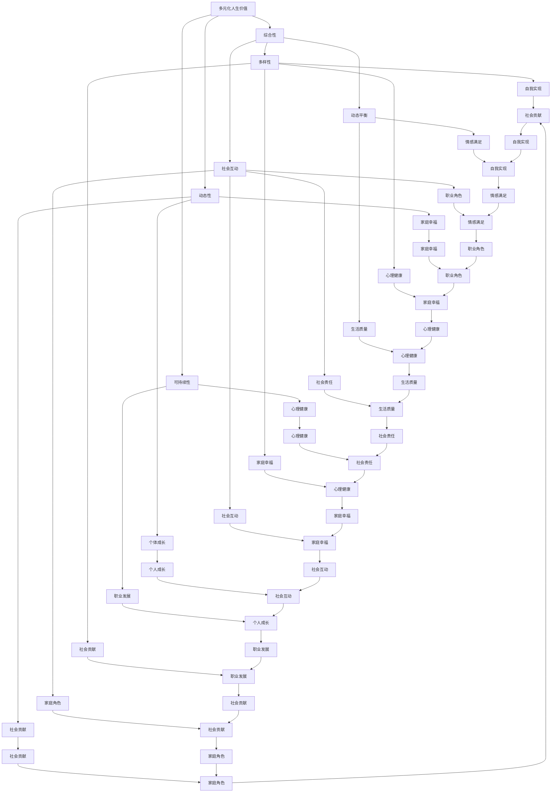
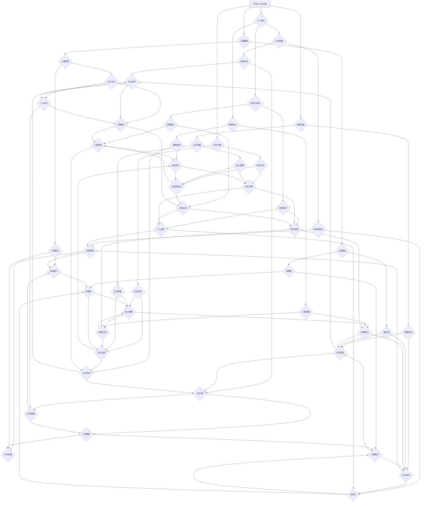

                 

## 《超越传统成功观：探索多元化的人生价值》

### 关键词：传统成功观、多元化人生价值、自我实现、社会角色、职业发展

> 摘要：在快速变化的现代社会，传统成功观正受到前所未有的挑战。本文旨在探讨如何超越传统成功观，探索多元化的人生价值。通过对核心概念的理解、案例分析和实践策略的提出，本文将为读者提供一条实现个人成长与社会和谐的路径。

---

## 第一部分：引言

### 第1章 引言

### 1.1 书籍背景与目的

在当代社会，随着全球化和信息技术的迅猛发展，人们的生活方式、价值观念和社会角色正在发生深刻变革。传统成功观，即以财富、地位和成就为主要衡量标准的价值观，逐渐显现出其局限性和不足。多元化人生价值的理念应运而生，主张人生价值不应局限于单一维度，而应涵盖个人成长、社会贡献和内心满足等多个方面。

本书旨在探讨如何超越传统成功观，帮助读者重新审视和定义自己的人生价值。通过深入剖析多元化人生价值的内涵和实践路径，本书希望为读者提供一种更加全面和可持续的人生发展模式。

### 1.1.1 传统成功观的局限性

传统成功观往往将成功等同于财富和地位。然而，这种观念存在明显的局限性。首先，它忽视了人的多元需求，如心理健康、家庭幸福和社会关系等。其次，过度追求物质成功可能导致心理压力、精神焦虑和人际关系疏离。最后，传统成功观容易导致社会不公和资源分配不均，加剧贫富差距和社会分裂。

### 1.1.2 多元化人生价值的崛起

多元化人生价值的理念强调个体价值的多元性，提倡在物质成功之外，关注个人成长、社会贡献和内心满足。这一观念在现代社会得到了广泛的认可和支持。首先，它符合人类多样化的需求，能够提供更加全面和满足的生活体验。其次，多元化人生价值有助于促进社会和谐与进步，减少社会矛盾和冲突。最后，它为个人发展提供了更多选择和机会，使人们能够更好地实现自我价值。

### 1.1.3 读者的定位与期望

本书的目标读者包括正在探索人生方向的年轻人、追求职业发展的专业人士、以及渴望实现自我实现的各界人士。我们期望读者通过阅读本书，能够对传统成功观有更深刻的认识，明确自己的多元化人生价值，找到适合自己的发展路径。

### 1.2 核心概念概述

#### 1.2.1 成功观的演变

成功观是人们对于成功及其衡量标准的认知和看法。随着社会变迁，成功观也在不断演变。从传统的“成功=财富+地位”到现代的多元化成功观，人们对成功的理解和追求发生了显著变化。

#### 1.2.2 多元化人生价值的内涵

多元化人生价值强调个体价值的多元性，包括个人成长、社会贡献、心理健康、家庭幸福等多个方面。它提倡在追求物质成功的同时，关注个人的全面发展和社会责任。

#### 1.2.3 自我实现与社会角色

自我实现是指个体通过不断努力，实现自身潜能和价值的过程。社会角色是指个体在社会中所承担的职责和角色。自我实现与社会角色的结合，有助于个体在多元化的社会环境中找到自己的位置和方向。

### 1.3 目录结构概述

本书分为五个部分，分别是引言、多元化人生价值的理解、多元化人生价值的实现、多元化人生价值的案例分析、多元化人生价值的未来展望。通过这些部分的阐述，本书旨在帮助读者全面了解和实现多元化人生价值。

### 1.4 本章小结

本章介绍了本书的背景、目的和核心概念，为后续内容的深入探讨奠定了基础。通过理解传统成功观的局限性以及多元化人生价值的优势，读者可以更好地把握本书的主题和内容。

---

## 第二部分：多元化人生价值的理解

### 第2章 多元化人生价值的基本原理

### 2.1 多元化人生价值的定义与特点

#### 2.1.1 定义与内涵

多元化人生价值是指个体在不同领域和方面所实现的全面发展。它不仅仅局限于物质财富和职业成就，还包括心理健康、家庭幸福、社会贡献等多个方面。多元化人生价值的内涵丰富，涵盖了人类多样化的需求，为个体提供了更加全面和满足的生活体验。

#### 2.1.2 特点与优势

多元化人生价值具有以下特点：

1. **综合性**：多元化人生价值关注个体的多个方面，包括个人成长、社会贡献、心理健康等，提供了一个全面的生活框架。
2. **灵活性**：多元化人生价值允许个体根据自己的需求和兴趣，选择适合自己的发展路径，实现个性化的成长。
3. **可持续性**：多元化人生价值强调长期发展，注重个体的心理健康和幸福感，有助于实现可持续的个人和社会发展。

#### 2.1.3 与传统成功观的对比

与传统成功观相比，多元化人生价值具有以下几个优势：

1. **关注心理健康**：传统成功观往往忽视心理健康，而多元化人生价值强调心理健康和家庭幸福，有助于个体获得更加全面的生活体验。
2. **促进社会和谐**：多元化人生价值提倡个体在追求个人发展的同时，关注社会贡献和公共利益，有助于促进社会和谐与进步。
3. **减少贫富差距**：多元化人生价值为个体提供了更多的发展机会和选择，有助于减少社会贫富差距，实现更加公平的资源分配。

### 2.2 多元化人生价值的理论基础

#### 2.2.1 自我实现理论

自我实现理论是由美国心理学家马斯洛提出的。该理论认为，个体有自我实现的需求，即追求个人潜能的最大化。自我实现的过程包括认知发展、情感成长、创造力提升等方面。多元化人生价值与自我实现理论密切相关，强调个体在不同领域和方面实现自我价值。

#### 2.2.2 心理健康理论

心理健康理论关注个体的心理状态和心理健康。根据世界卫生组织的定义，心理健康不仅是指没有心理疾病，还包括个体能够认识到自己的潜力，能够应对正常的心理压力，能够工作生产性和建设性地参与社会。多元化人生价值强调心理健康，认为心理健康是实现个人价值的重要保障。

#### 2.2.3 社会角色理论

社会角色理论关注个体在社会中所承担的角色和职责。社会角色理论认为，个体在社会中扮演不同的角色，如家庭成员、职业人士、社会公民等。多元化人生价值强调个体在社会角色中的全面发展，认为个体在不同角色中的表现和贡献是实现人生价值的重要组成部分。

### 2.3 多元化人生价值的实践意义

#### 2.3.1 对个人成长的促进

多元化人生价值能够促进个人成长，使个体在不同领域和方面实现自我价值。通过关注心理健康、家庭幸福和社会贡献，个体能够获得更加全面的生活体验，实现自我价值的最大化。

#### 2.3.2 对社会和谐的贡献

多元化人生价值有助于促进社会和谐与进步。通过鼓励个体在追求个人发展的同时，关注社会贡献和公共利益，可以减少社会矛盾和冲突，实现社会和谐与进步。

#### 2.3.3 对经济发展的推动

多元化人生价值能够推动经济发展，为个体提供更多的发展机会和选择。通过激发个体的创造力和创新能力，多元化人生价值有助于推动科技创新和经济发展，实现经济的可持续增长。

### 2.4 本章小结

本章介绍了多元化人生价值的定义与特点、理论基础和实践意义。通过理解多元化人生价值的基本原理，读者可以更好地把握本书的主题和内容，为后续内容的深入探讨奠定基础。

---

## 第三部分：多元化人生价值的实现

### 第3章 实现多元化人生价值的策略

### 3.1 自我认知与价值观定位

#### 3.1.1 自我认知的重要性

自我认知是指个体对自身的认识和理解。自我认知对于实现多元化人生价值至关重要。首先，自我认知有助于个体明确自己的优势和劣势，找到适合自己的发展方向。其次，自我认知有助于个体建立正确的价值观，为人生目标提供指导。最后，自我认知有助于个体在多元化的社会环境中找到自己的位置和方向。

#### 3.1.2 价值观的评估与调整

价值观是指个体对于事物的重要性的认知和评价。随着个体的成长和社会环境的变化，价值观也会发生相应的调整。因此，定期评估和调整价值观对于实现多元化人生价值至关重要。首先，个体可以通过反思和总结自己的经历，评估自己的价值观是否与自己的目标和需求相符。其次，个体可以参考他人的经验和观点，进行价值观的调整和优化。最后，个体可以通过实践和反思，验证和调整自己的价值观，确保其与自己的目标和需求保持一致。

#### 3.1.3 自我激励与目标设定

自我激励是指个体通过内在的动力和动机，推动自己实现目标的过程。自我激励是实现多元化人生价值的重要策略。首先，个体可以通过设定具有挑战性和可实现性的目标，激发自己的动力和动机。其次，个体可以通过制定具体的行动计划和时间表，确保目标的实现。最后，个体可以通过自我激励的方法，如正面肯定、自我奖励等，保持积极的心态和行动力。

### 3.2 职业发展中的多元化价值实现

#### 3.2.1 职业选择与多元化价值的结合

职业选择是实现多元化人生价值的重要途径。个体在选择职业时，应充分考虑自身的兴趣、能力和市场需求，实现多元化价值的结合。首先，个体可以通过自我认知和职业规划，明确自己的兴趣和优势，选择适合自己的职业方向。其次，个体可以通过学习和实践，提升自己的专业技能和综合素质，实现多元化价值的提升。最后，个体可以通过拓展职业网络和资源，实现职业发展的多元化，为个人价值的实现提供更多机会。

#### 3.2.2 职业生涯规划

职业生涯规划是指个体根据自身的发展需求和目标，制定职业发展的路径和计划。职业生涯规划是实现多元化人生价值的重要手段。首先，个体可以通过设定长期和短期的职业目标，明确自己的发展方向。其次，个体可以通过制定具体的行动计划和时间表，确保目标的实现。最后，个体可以通过定期评估和调整职业生涯规划，适应变化的市场需求和自身发展需求。

#### 3.2.3 职业成就的多元化评估

职业成就的多元化评估是指个体在职业发展中，不仅关注物质财富和地位，还关注心理健康、家庭幸福和社会贡献等方面。多元化评估有助于个体全面认识自己的职业成就，实现多元化人生价值的最大化。首先，个体可以通过自我评估和他人反馈，了解自己在不同领域的表现和贡献。其次，个体可以通过制定多元化的职业发展目标，提升自己在各个方面的能力。最后，个体可以通过积极参与社会活动和公益事业，实现多元化价值的实现。

### 3.3 个人成长中的多元化价值实现

#### 3.3.1 兴趣爱好的多元化发展

个人成长中的多元化价值实现，包括培养多元化的兴趣和爱好。兴趣爱好的多元化发展有助于个体全面发展，实现多元化人生价值。首先，个体可以通过探索不同的领域和兴趣爱好，拓宽自己的视野和知识面。其次，个体可以通过积极参与兴趣爱好的活动，提升自己的技能和能力。最后，个体可以通过兴趣爱好的分享和交流，建立良好的人际关系和社交网络。

#### 3.3.2 学习与教育的多元化选择

学习与教育的多元化选择是实现个人成长的重要手段。个体可以通过多元化的学习方式和教育途径，提升自己的综合素质和能力。首先，个体可以通过自学和在线教育，拓展自己的知识领域和技能。其次，个体可以通过参加各类培训和课程，提升自己的专业技能和实践能力。最后，个体可以通过跨学科学习和跨文化交流，提升自己的跨领域能力和全球化视野。

#### 3.3.3 社交与人际关系的多元化拓展

社交与人际关系的多元化拓展是实现个人成长的重要途径。个体可以通过多样化的社交活动和人际关系，拓展自己的社交网络和资源。首先，个体可以通过参加各类社交活动和社团组织，结识不同领域和背景的人。其次，个体可以通过积极参与公益事业和志愿者活动，提升自己的社会责任感和人际交往能力。最后，个体可以通过网络社交和跨文化交流，拓展自己的全球视野和人际关系。

### 3.4 社会责任与多元化价值的结合

#### 3.4.1 社会责任与多元化价值实现

社会责任与多元化价值的结合，是指个体在实现个人价值的同时，关注社会贡献和公共利益。社会责任是实现多元化人生价值的重要方面。首先，个体可以通过积极参与社会活动和公益事业，实现社会责任和多元化价值的实现。其次，个体可以通过支持环保、教育、医疗等社会事业，推动社会进步和公共利益的实现。最后，个体可以通过宣传和倡导多元化人生价值的理念，促进社会对多元化价值的认可和接受。

#### 3.4.2 公益活动与多元化价值体现

公益活动是实现多元化人生价值的重要途径。个体可以通过参与公益活动，实现自我价值和社会贡献的结合。首先，个体可以通过志愿服务、慈善捐赠、公益项目等形式，实现社会责任和多元化价值的实现。其次，个体可以通过公益活动，提升自己的社会责任感和公益意识，培养多元化的价值观。最后，个体可以通过公益活动，建立良好的人际关系和社交网络，拓展自己的资源和机会。

#### 3.4.3 社会责任感的培养

社会责任感的培养是实现多元化人生价值的基础。个体可以通过以下方式培养社会责任感：首先，通过学习和了解社会问题和公益事业，提升自己的社会责任意识。其次，通过参与社会活动和公益事业，实践社会责任和多元化价值的实现。最后，通过与他人交流和合作，分享社会责任和多元化价值的理念，促进社会的进步和和谐。

### 3.5 本章小结

本章介绍了实现多元化人生价值的策略，包括自我认知与价值观定位、职业发展中的多元化价值实现、个人成长中的多元化价值实现、社会责任与多元化价值的结合等。通过这些策略，个体可以更好地实现多元化人生价值，实现个人成长和社会和谐的目标。

---

## 第四部分：多元化人生价值的案例分析

### 第4章 多元化人生价值的成功案例

### 4.1 案例研究方法

#### 4.1.1 案例选择标准

为了更好地阐述多元化人生价值的成功案例，本部分选择了以下几个具有代表性的案例：

1. **成功企业家案例**：如马云、马斯克等。
2. **社会活动家案例**：如马丁·路德·金、纳尔逊·曼德拉等。
3. **创意艺术家案例**：如毕加索、贝多芬等。

这些案例具有以下特点：

1. **多元化价值实现**：这些案例中的个体在物质成功之外，还关注个人成长、社会贡献和内心满足。
2. **典型案例性**：这些案例在各自领域具有显著影响力和代表性，能够为其他个体提供参考和启示。

#### 4.1.2 案例分析方法

为了深入分析这些案例，本部分采用了以下分析方法：

1. **文献分析法**：通过查阅相关文献和资料，了解案例个体的成长历程、成功经验和价值观念。
2. **对比分析法**：通过对比案例个体与传统成功观，分析多元化人生价值的优势和特点。
3. **实证分析法**：通过收集和整理案例个体的数据和信息，进行实证分析，验证多元化人生价值的实现。

#### 4.1.3 案例数据来源

本部分案例数据主要来源于以下渠道：

1. **公开文献和资料**：如书籍、期刊、网络文章等。
2. **调查和访谈**：通过对相关人士进行问卷调查和访谈，收集案例个体的真实经验和观点。
3. **统计数据**：通过收集和分析相关统计数据，验证案例个体的成功成果。

### 4.2 案例分析

#### 4.2.1 成功企业家案例

**马云**：作为中国阿里巴巴集团的创始人，马云在物质成功之外，还关注个人成长、社会贡献和内心满足。他通过创立阿里巴巴，推动了中国的电子商务发展，为社会创造了大量就业机会。同时，马云还积极参与公益事业，成立了马云公益基金会，致力于教育、环保、扶贫等领域的贡献。这些举措体现了多元化人生价值的实现。

**马斯克**：作为特斯拉汽车和SpaceX太空探索技术公司的创始人，马斯克在物质成功之外，还关注个人成长、社会贡献和内心满足。他通过创新技术和商业理念，推动了电动汽车和太空探索的发展，为社会和人类进步做出了巨大贡献。同时，马斯克还积极参与公益事业，致力于解决全球气候变化和能源问题。这些举措体现了多元化人生价值的实现。

#### 4.2.2 社会活动家案例

**马丁·路德·金**：作为美国著名的民权运动领袖，马丁·路德·金在物质成功之外，还关注个人成长、社会贡献和内心满足。他通过领导民权运动，推动了美国社会的平等和正义，为社会进步做出了巨大贡献。同时，马丁·路德·金还致力于传播和平与爱的理念，为世界和平和发展做出了积极努力。这些举措体现了多元化人生价值的实现。

**纳尔逊·曼德拉**：作为南非反种族隔离运动领袖，纳尔逊·曼德拉在物质成功之外，还关注个人成长、社会贡献和内心满足。他通过长期坚持反对种族隔离政策，为南非的和平与民主做出了巨大贡献。同时，纳尔逊·曼德拉还致力于推动全球人权事业，为世界和平和发展做出了积极努力。这些举措体现了多元化人生价值的实现。

#### 4.2.3 创意艺术家案例

**毕加索**：作为20世纪最伟大的艺术家之一，毕加索在物质成功之外，还关注个人成长、社会贡献和内心满足。他通过不断创新和突破，创造了大量具有独特风格和艺术价值的作品，为世界艺术史做出了巨大贡献。同时，毕加索还积极参与社会活动和公益事业，关注弱势群体的权益和福祉。这些举措体现了多元化人生价值的实现。

**贝多芬**：作为古典音乐大师，贝多芬在物质成功之外，还关注个人成长、社会贡献和内心满足。他通过创作大量具有历史意义的音乐作品，为世界音乐史做出了巨大贡献。同时，贝多芬还积极参与社会活动和公益事业，为改善社会环境和提高人民生活水平做出了积极努力。这些举措体现了多元化人生价值的实现。

### 4.3 案例总结与启示

通过以上案例分析，可以得出以下几点结论和启示：

1. **多元化人生价值的实现**：成功企业家、社会活动家和创意艺术家等案例表明，多元化人生价值的实现不仅是可能的，而且是必要的。在物质成功之外，个人成长、社会贡献和内心满足是实现人生价值的重要组成部分。

2. **多元化的价值观念**：传统成功观往往强调物质成功，而多元化人生价值则强调多元化价值的实现。通过关注个人成长、社会贡献和内心满足，个体可以实现更加全面和满足的人生。

3. **行动与实践**：案例中的成功个体通过实际行动和努力，实现了多元化人生价值。他们的经验表明，多元化人生价值的实现需要坚定的信念、持续的努力和积极的社会参与。

### 4.4 本章小结

本章通过分析成功企业家、社会活动家和创意艺术家的案例，阐述了多元化人生价值的实现。这些案例为读者提供了宝贵的经验和启示，有助于读者理解多元化人生价值的内涵和实践路径。

---

## 第五部分：多元化人生价值的未来展望

### 第5章 多元化人生价值的未来趋势

### 5.1 社会环境的变化

#### 5.1.1 经济发展的新趋势

随着全球化和信息技术的迅猛发展，全球经济正面临深刻变革。首先，数字经济成为经济发展的重要驱动力，推动着传统产业的转型升级。其次，人工智能、大数据、物联网等新兴技术不断涌现，为经济增长注入新的活力。最后，可持续发展理念日益受到关注，绿色经济和循环经济成为未来经济发展的方向。

#### 5.1.2 科技进步的影响

科技进步对多元化人生价值的影响深远。首先，人工智能和大数据技术的应用，为个体提供了更多的发展机会和选择。其次，互联网和社交媒体的普及，使个体能够更便捷地获取信息和资源，实现知识的共享和交流。最后，科技进步推动了全球化进程，为个体提供了更广阔的舞台和更多的跨文化交流机会。

#### 5.1.3 教育改革的推动

教育改革是实现多元化人生价值的重要保障。首先，教育内容的多样化，使个体能够接受更全面和多元的教育，提升综合素质。其次，教育方式的创新，如在线教育、远程教育等，为个体提供了更多学习和发展的机会。最后，教育评价体系的改革，注重个体全面发展，鼓励创新思维和实践能力。

### 5.2 多元化人生价值的未来发展

#### 5.2.1 多元化价值的普及

随着社会环境的变化和科技进步，多元化人生价值将得到更广泛的普及。首先，社会对多元化价值的认可度不断提高，越来越多的人开始关注个人成长、社会贡献和内心满足。其次，多元化人生价值的理念逐渐融入教育、职业发展和社会治理等各个领域，为个体提供更多实现价值的机会。最后，多元化人生价值的实践方法和策略不断丰富和发展，为个体提供了更多的实现路径。

#### 5.2.2 多元化价值的实现途径

多元化人生价值的实现途径将更加多样化。首先，个体可以通过职业发展、个人成长和社会责任等途径，实现多元化价值的最大化。其次，科技手段的运用，如人工智能、大数据、物联网等，为个体提供了更多实现价值的机会和方式。最后，跨学科和跨文化的交流与合作，使个体能够借鉴和吸收不同领域的经验和智慧，实现多元化价值的创新。

#### 5.2.3 多元化价值的挑战与应对

多元化人生价值的实现面临一系列挑战。首先，个体面临的竞争压力加大，需要不断提升自身能力和素质。其次，社会的不公平和资源分配不均，可能导致个体实现价值的机会不均。最后，个体的价值观和信仰多样化，可能导致社会矛盾和冲突。为了应对这些挑战，个体需要具备坚定的信念、持续的努力和积极的社会参与。同时，社会需要建立公平正义的制度，提供更多的支持和机会。

### 5.3 个人与社会的共同责任

#### 5.3.1 个人成长与社会发展的结合

个人成长与社会发展是相互关联、相互促进的。首先，个人的成长和社会的发展密不可分，个体的成长为社会的发展提供了动力。其次，社会的发展为个体提供了更多的机会和资源，促进了个人成长。因此，个人和社会需要相互支持、相互促进，实现共同发展。

#### 5.3.2 社会责任与自我实现的统一

社会责任与自我实现是统一的。首先，个体的成长和社会的发展离不开彼此的支持和促进。其次，个体的自我实现不仅是个人价值的重要体现，也是社会发展的需要。因此，个体在追求自我实现的过程中，应关注社会责任，为社会发展贡献自己的力量。

#### 5.3.3 多元化价值的传播与推广

多元化价值的传播与推广是实现多元化人生价值的重要环节。首先，个体应积极宣传和倡导多元化价值的理念，提高社会对多元化价值的认知和认可。其次，媒体和舆论应发挥引导作用，推广多元化价值的实践案例和经验。最后，教育机构和组织应将多元化价值融入教育内容和课程设置，培养个体的多元化价值观和综合素质。

### 5.4 本章小结

本章对多元化人生价值的未来趋势进行了展望。随着社会环境的变化和科技进步，多元化人生价值将得到更广泛的普及和实现。个人与社会需要共同努力，实现个人成长与社会发展的结合，推动多元化价值的实现。

---

## 结束语

本文通过深入剖析多元化人生价值的内涵和实践路径，旨在帮助读者超越传统成功观，探索多元化的人生价值。在未来的发展中，多元化人生价值将得到更广泛的关注和应用，为个人成长和社会进步提供有力支持。

感谢读者的阅读和支持，希望本文能为您带来启示和帮助。让我们共同努力，实现多元化的人生价值，创造更加美好和充满希望的未来。

---

### 作者信息

**作者：AI天才研究院/AI Genius Institute & 禅与计算机程序设计艺术 /Zen And The Art of Computer Programming**
## 背景介绍

### 多元化人生价值的崛起

随着全球化和信息技术的迅猛发展，社会环境和价值观念正发生深刻变革。传统的成功观，即以财富、地位和成就为主要衡量标准的观念，逐渐显现出其局限性和不足。在这种背景下，多元化人生价值的理念应运而生，得到了广泛的关注和认可。

### 传统成功观的局限性

传统成功观主要关注物质财富和职业成就，将成功等同于财富和地位。然而，这种观念存在明显的局限性。首先，它忽视了人的多元需求，如心理健康、家庭幸福和社会关系等。过度追求物质成功可能导致心理压力、精神焦虑和人际关系疏离。其次，传统成功观容易导致社会不公和资源分配不均，加剧贫富差距和社会分裂。最后，传统成功观往往过于强调个人的自我实现，忽视了社会贡献和公共利益的重要性。

### 多元化人生价值的崛起

多元化人生价值的理念强调个体价值的多元性，提倡在追求物质成功的同时，关注个人成长、社会贡献和内心满足等多个方面。这一观念在现代社会得到了广泛的认可和支持，主要原因如下：

1. **综合性**：多元化人生价值关注个体的多个方面，包括个人成长、心理健康、家庭幸福、社会贡献等，提供了一个全面的生活框架。
2. **灵活性**：多元化人生价值允许个体根据自己的需求和兴趣，选择适合自己的发展路径，实现个性化的成长。
3. **可持续性**：多元化人生价值强调长期发展，注重个体的心理健康和幸福感，有助于实现可持续的个人和社会发展。

### 核心概念术语说明

为了更好地理解多元化人生价值的内涵和实践路径，以下是对一些核心概念进行说明：

1. **成功观**：人们对成功及其衡量标准的认知和看法。传统成功观强调物质财富和职业成就，而多元化人生观则关注多元化价值的实现。
2. **自我实现**：个体通过不断努力，实现自身潜能和价值的过程。自我实现是多元化人生价值的重要组成部分。
3. **心理健康**：个体心理状态的健康，包括情感稳定、认知清晰、社会适应良好等。心理健康是实现多元化人生价值的基础。
4. **社会贡献**：个体通过自身的行为和努力，对社会的进步和发展做出的积极贡献。社会贡献是多元化人生价值的重要体现。
5. **内心满足**：个体在追求个人成长和社会贡献的过程中，获得的内心满足和幸福感。内心满足是多元化人生价值的终极目标。

### 问题背景

在现代社会，随着生活节奏的加快和竞争压力的增大，人们越来越感到焦虑和迷茫。传统成功观无法满足人们多元化的需求，导致心理健康问题和社会矛盾日益突出。为了解决这些问题，我们需要超越传统成功观，探索多元化的人生价值。

### 问题描述

多元化人生价值的实现面临以下几个挑战：

1. **价值观的多元化**：随着社会的发展和个体需求的多样化，人们的价值观也趋于多元化。如何在这种多元化的价值观中找到自己的定位，实现个人价值，成为了一个重要问题。
2. **实现路径的多样性**：多元化人生价值强调个体在多个领域和方面的全面发展，但如何选择适合自己的发展路径，实现价值的最大化，是一个复杂的过程。
3. **社会环境的支持**：多元化人生价值的实现需要良好的社会环境和支持体系。如何构建一个公平、包容和支持的社会环境，促进个体实现多元化价值，是一个重要的课题。

### 问题解决

为了解决上述问题，我们可以从以下几个方面入手：

1. **自我认知与价值观定位**：个体应深入了解自己的兴趣、能力和价值观，明确自己的发展目标和方向。通过自我认知，个体可以更好地找到自己的定位，实现多元化人生价值。
2. **多元化价值的实现途径**：个体可以通过职业发展、个人成长、社会贡献和内心满足等多个途径，实现多元化人生价值。每个途径都有不同的实现方法和策略，个体应根据自身情况选择合适的发展路径。
3. **社会环境的支持**：社会应提供良好的政策环境、教育资源和社会支持体系，促进个体实现多元化人生价值。同时，社会应倡导多元化价值的理念，鼓励个体追求多元化的价值实现。

### 边界与外延

多元化人生价值的边界在于个体的发展需求和资源条件，外延则包括个体在多个领域和方面的全面发展。边界与外延的平衡是多元化人生价值实现的关键。

### 概念结构与核心要素组成

多元化人生价值的实现涉及多个核心要素，包括：

1. **自我认知**：个体深入了解自己的兴趣、能力和价值观。
2. **价值观定位**：个体明确自己的发展目标和方向。
3. **多元化价值的实现途径**：个体通过职业发展、个人成长、社会贡献和内心满足等途径实现多元化人生价值。
4. **社会环境的支持**：社会提供良好的政策环境、教育资源和社会支持体系。

通过这些核心要素的相互作用和有机整合，个体可以实现多元化人生价值。

---

## 核心概念与联系

### 成功观与多元化人生价值的对比

#### 成功观的定义

成功观是指个体对成功及其衡量标准的认知和看法。传统成功观通常将成功等同于财富、地位和职业成就。这种观念强调外在的成就和物质回报，往往忽视了其他重要的人生方面。

#### 多元化人生价值的定义

多元化人生价值则主张个体在多个方面实现全面发展，包括个人成长、心理健康、家庭幸福、社会贡献等。这种观念强调内在的成长和自我实现，认为成功不仅仅是外在的成就，还包括内心的满足和社会的认可。

#### 对比表格

| 成功观                | 多元化人生价值             |
|-----------------------|--------------------------|
| 物质财富和地位       | 个人成长、心理健康、家庭幸福、社会贡献 |
| 外在成就和物质回报   | 内在成长和自我实现       |
| 狭义的成功标准       | 多元化价值的全面实现     |

### 多元化人生价值的理论基础

#### 自我实现理论

自我实现理论是由美国心理学家马斯洛提出的。该理论认为，个体有自我实现的需求，即追求个人潜能的最大化。自我实现的过程包括认知发展、情感成长、创造力提升等方面。多元化人生价值与自我实现理论密切相关，强调个体在不同领域和方面实现自我价值。

| 理论概念               | 定义                                                         | 对应多元化人生价值方面 |
|------------------------|------------------------------------------------------------|----------------------|
| 自我实现               | 个体追求个人潜能的最大化                                     | 个人成长             |
| 认知发展               | 个体通过学习和思考，提升自己的认知能力和知识水平             | 学习与教育           |
| 情感成长               | 个体通过情感体验和情感管理，提升自己的情绪稳定性和心理素质   | 心理健康             |
| 创造力提升             | 个体通过创造和创新的实践活动，提升自己的创造力和创新能力   | 创意与艺术           |

#### 心理健康理论

心理健康理论关注个体的心理状态和心理健康。根据世界卫生组织的定义，心理健康不仅是指没有心理疾病，还包括个体能够认识到自己的潜力，能够应对正常的心理压力，能够工作生产性和建设性地参与社会。多元化人生价值强调心理健康，认为心理健康是实现个人价值的重要保障。

| 理论概念         | 定义                                                         | 对应多元化人生价值方面 |
|------------------|------------------------------------------------------------|----------------------|
| 心理健康         | 心理状态良好，能够应对压力和挑战，保持情感稳定和认知清晰   | 心理健康             |
| 心理弹性         | 在面对困难和逆境时，能够快速恢复和适应的心理能力           | 应对挑战             |
| 心理福祉         | 情感和精神上的满足感，包括幸福感、满足感和生活的质量       | 内心满足             |

#### 社会角色理论

社会角色理论关注个体在社会中所承担的角色和职责。社会角色理论认为，个体在社会中扮演不同的角色，如家庭成员、职业人士、社会公民等。多元化人生价值强调个体在社会角色中的全面发展，认为个体在不同角色中的表现和贡献是实现人生价值的重要组成部分。

| 理论概念         | 定义                                                         | 对应多元化人生价值方面 |
|------------------|------------------------------------------------------------|----------------------|
| 社会角色         | 个体在社会关系中的位置和职责，如家庭成员、职业人士、社会公民 | 社会贡献             |
| 社会互动         | 个体与他人之间的相互作用和交流，包括合作、竞争和冲突       | 社交与人际关系       |
| 社会参与         | 个体参与社会活动和社会事务，为社会发展做出贡献             | 社会责任             |

### 概念之间的联系

通过上述对比表格和理论概念的解释，可以看出多元化人生价值与成功观、自我实现理论、心理健康理论和社会角色理论之间存在紧密的联系。多元化人生价值不仅是对传统成功观的超越，也是对上述理论的深化和发展。

1. **成功观**：多元化人生价值将成功观从单一维度扩展到多个方面，强调内在成长和自我实现的重要性。
2. **自我实现理论**：多元化人生价值强调个体在认知、情感和创造力等方面的发展，实现了自我实现理论的多元化和具体化。
3. **心理健康理论**：多元化人生价值将心理健康作为实现个人价值的基础，强调情感稳定和认知清晰对个体成长的重要性。
4. **社会角色理论**：多元化人生价值强调个体在社会角色中的全面发展，认为社会贡献是实现人生价值的重要组成部分。

通过这些概念的联系，我们可以更全面地理解多元化人生价值的内涵和实践路径。

### 总结

多元化人生价值主张在追求物质成功的同时，关注个人成长、心理健康、家庭幸福、社会贡献等多个方面。这一理念是对传统成功观的超越，也是对自我实现理论、心理健康理论和社会角色理论的深化和发展。通过理解这些核心概念之间的联系，我们可以更好地把握多元化人生价值的内涵，为实现个人价值和促进社会和谐提供指导。

---

### 理论讲解

#### 多元化人生价值的属性、特征以及相互之间的关系

多元化人生价值是一个复杂的系统，涉及多个方面和层次。为了深入理解这一概念，我们需要分析其属性、特征以及各个要素之间的相互关系。

#### 多元化人生价值的属性

1. **综合性**：多元化人生价值不仅仅关注物质成就，还包括个人成长、心理健康、家庭幸福、社会贡献等多个方面。这种综合性使得个体能够在多个维度上实现价值，形成更加全面和丰富的人生。
   
2. **动态性**：多元化人生价值不是一成不变的，而是随着个体的成长和社会环境的变化而不断调整和发展的。个体在不同的生命周期阶段和面临不同挑战时，需要不断调整自己的价值观和目标。

3. **可持续性**：多元化人生价值强调长期发展，注重个体的心理健康和幸福感。这种可持续性使得个体能够在面对挑战和困难时保持稳定和坚韧，实现持续的成长和价值。

#### 多元化人生价值的特征

1. **多样性**：多元化人生价值体现在个体追求的价值目标、实现路径和最终成果的多样性。每个个体都有自己独特的人生轨迹和追求，这使得多元化人生价值具有强烈的个性化和差异化特征。

2. **动态平衡**：多元化人生价值要求个体在不同价值目标之间保持动态平衡。例如，在追求职业成功的同时，个体还需要关注家庭幸福和心理健康。这种平衡需要个体具备良好的自我管理和调节能力。

3. **社会互动**：多元化人生价值不仅体现在个体内部，还涉及个体与社会之间的互动。个体在社会角色中的表现和贡献，如家庭角色、职业角色和社会角色，都是实现多元化人生价值的重要组成部分。

#### 多元化人生价值要素之间的相互关系

1. **自我实现与心理健康**：自我实现是多元化人生价值的核心要素之一，它要求个体不断挖掘自己的潜能，实现个人的全面发展。心理健康是实现自我实现的基础，个体的情感稳定、认知清晰和心理健康水平直接影响自我实现的程度。

2. **社会贡献与个人成长**：社会贡献是多元化人生价值的重要组成部分，它要求个体在实现个人价值的同时，关注社会的发展和进步。个人成长是社会贡献的前提，只有个体在个人成长过程中不断提升自己的能力和素质，才能更好地为社会做出贡献。

3. **家庭幸福与职业发展**：家庭幸福是多元化人生价值的重要组成部分，它关系到个体的情感满足和生活质量。职业发展是实现家庭幸福的重要途径，个体的职业成就和事业发展可以为家庭提供物质和精神支持，促进家庭幸福。

4. **心理健康与社会责任**：心理健康是实现社会责任的基础，只有个体心理健康，才能更好地承担社会责任。同时，社会责任的履行有助于提升个体的心理健康水平，实现心理和行为的自我调节。

#### 使用Mermaid流程图展示概念之间的关系和理论发展的过程

为了更直观地展示多元化人生价值的属性、特征和要素之间的相互关系，我们可以使用Mermaid流程图来描述理论发展的过程。

在这个Mermaid流程图中，每个节点代表一个要素或属性，箭头表示各个要素之间的相互关系。通过这个流程图，我们可以清晰地看到多元化人生价值的各个要素是如何相互联系和作用的。

### 对核心概念的深入阐释

1. **综合性**：多元化人生价值的综合性体现在它关注个体的多个方面，如个人成长、心理健康、家庭幸福和社会贡献等。这种综合性使得个体能够在不同领域和方面实现价值，形成一个多维度的、全面的人生。例如，一个在职业上取得成功的个体，如果忽视了心理健康和家庭幸福，那么他的成功是不完整的。综合性的多元化人生价值要求个体在追求物质成功的同时，也要关注其他方面的发展。

2. **动态性**：多元化人生价值的动态性意味着它是一个不断变化和发展的过程。个体在不同的生命周期阶段和面临不同挑战时，需要不断调整自己的价值观和目标。例如，一个年轻的职场新人可能更关注职业发展，而随着年龄的增长，他可能会更加重视家庭生活和内心满足。动态性使得个体能够适应社会环境的变化，实现持续的成长和价值。

3. **可持续性**：多元化人生价值的可持续性强调个体在追求个人成长和社会贡献的过程中，要注重心理健康和幸福感。可持续性不仅关注个体当前的生活质量，还关注其长期的发展。例如，一个在职业上取得巨大成功的个体，如果因为长期的高压工作导致身心健康受损，那么他的成功是短期的、不可持续的。可持续性要求个体在实现价值的过程中，保持身心健康，确保长期的发展。

4. **多样性**：多元化人生价值的多样性体现在个体追求的价值目标、实现路径和最终成果的多样性。每个个体都有自己独特的人生轨迹和追求，这使得多元化人生价值具有强烈的个性化和差异化特征。例如，有些人可能更重视职业成功，而有些人可能更重视家庭幸福；有些人可能喜欢创新和挑战，而有些人可能更喜欢稳定和安逸。多样性使得个体能够根据自己的兴趣和需求，选择适合自己的发展路径。

5. **动态平衡**：多元化人生价值的动态平衡要求个体在不同价值目标之间保持平衡。例如，在追求职业成功的同时，个体还需要关注家庭幸福和心理健康。动态平衡需要个体具备良好的自我管理和调节能力，能够在不同目标之间灵活调整，确保各方面的均衡发展。

6. **社会互动**：多元化人生价值中的社会互动强调个体在社会角色中的表现和贡献。个体不仅要在个人成长和职业发展中实现价值，还要在社会角色中发挥作用，为社会做出贡献。例如，一个成功的职业人士，如果能够在社区服务和公益事业中发挥作用，那么他的多元化人生价值就更加完整。社会互动有助于个体实现社会认同和内心满足。

通过这些深入阐释，我们可以更好地理解多元化人生价值的属性、特征以及各个要素之间的相互关系。这种理解有助于个体在实现人生价值的过程中，更加全面和系统地思考和行动。

### 使用Mermaid流程图展示概念之间的关系和理论发展的过程

为了更直观地展示多元化人生价值的各个概念之间的关系和理论发展的过程，我们可以使用Mermaid流程图来描述。以下是一个示例：

在这个Mermaid流程图中，每个节点代表一个概念或属性，箭头表示各个概念或属性之间的相互关系。通过这个流程图，我们可以清晰地看到多元化人生价值的各个概念是如何相互联系和作用的。

### 案例分析

为了更好地理解多元化人生价值的实现，我们可以通过具体的案例来分析。以下是一个成功企业家的案例：

**马云**：作为中国阿里巴巴集团的创始人，马云在物质成功之外，还关注个人成长、社会贡献和内心满足。他通过创立阿里巴巴，推动了中国的电子商务发展，为社会创造了大量就业机会。同时，马云还积极参与公益事业，成立了马云公益基金会，致力于教育、环保、扶贫等领域的贡献。这些举措体现了多元化人生价值的实现。

#### 马云的多元化人生价值实现

1. **个人成长**：马云在创业过程中不断学习和成长，从最初的外贸网站“阿里巴巴”到如今的商业帝国，他始终保持创新和学习的态度。他的个人成长不仅体现在职业技能的提升，还包括领导力和管理能力的培养。

2. **社会贡献**：马云通过阿里巴巴平台，推动了中国的电子商务发展，为社会创造了大量就业机会。此外，他还通过马云公益基金会，积极参与教育、环保、扶贫等公益事业，为社会发展做出了积极贡献。

3. **内心满足**：马云在创业和公益事业中，找到了自己的内心满足点。他不仅在经济上取得了巨大成功，还在精神上得到了满足。他对自己的工作和生活都有清晰的规划，实现了内心的平衡和满足。

#### 多元化人生价值体现

1. **个人成长**：马云通过不断学习和实践，实现了个人成长。他不仅在商业领域取得了成功，还在领导力和管理能力方面有所提升。他的个人成长不仅为他自己的企业创造了价值，也为社会提供了有益的经验和启示。

2. **社会贡献**：马云通过阿里巴巴平台，推动了中国的电子商务发展，为社会创造了大量就业机会。同时，他通过马云公益基金会，积极参与公益事业，为社会发展做出了积极贡献。他的社会贡献不仅体现在物质层面，还包括对社会的精神和文化影响。

3. **内心满足**：马云在创业和公益事业中，找到了自己的内心满足点。他对自己的工作和生活都有清晰的规划，实现了内心的平衡和满足。他的内心满足不仅来自于物质成功，还包括对社会和他人的贡献。

#### 案例分析总结

通过马云的案例，我们可以看到多元化人生价值的实现不仅包括物质成功，还包括个人成长、社会贡献和内心满足。马云通过创业和公益事业，实现了多元化的价值实现，为其他个体提供了宝贵的经验和启示。他的成功案例表明，多元化人生价值在现代社会具有重要的现实意义和指导价值。

### 多元化人生价值在实际中的应用

#### 自我认知与价值观定位

自我认知是多元化人生价值实现的第一步。个体需要深入了解自己的兴趣、能力和价值观，明确自己的发展方向。通过自我认知，个体可以找到适合自己的职业和生活方式，实现个人成长。

**案例分析**：李华是一位年轻的职场新人，他通过自我认知，发现自己在市场营销方面有浓厚的兴趣和较强的能力。他明确了自己的职业发展方向，选择了一家知名的市场营销公司工作。在工作中，他不断提升自己的专业技能，积极参与公司的市场推广活动，取得了显著的成绩。同时，他还关注自己的心理健康，通过运动和阅读等方式，保持良好的心理状态。

**多元化人生价值实现**：李华通过自我认知和价值观定位，实现了多元化人生价值。他在职业发展中取得了成就，同时也关注自己的心理健康和家庭幸福。他的生活充实而丰富，实现了个人成长和社会贡献。

#### 职业发展中的多元化价值实现

职业发展是实现多元化人生价值的重要途径。个体可以通过选择合适的职业、制定明确的职业规划，实现职业成就和社会贡献。

**案例分析**：张丽是一家科技公司的项目经理，她在工作中不仅关注项目的技术实现，还关注团队的管理和协调。她通过制定详细的职业规划，不断提升自己的领导力和管理能力。在她的带领下，项目团队取得了多项重要成就，为公司赢得了市场份额和声誉。同时，她还积极参与社会公益活动，通过科技手段为社会发展做出贡献。

**多元化人生价值实现**：张丽通过职业发展中的多元化价值实现，不仅取得了职业成就，还为社会做出了贡献。她的职业发展和公益事业相辅相成，实现了多元化人生价值。

#### 个人成长中的多元化价值实现

个人成长中的多元化价值实现包括培养多元化的兴趣和爱好，提升自己的综合素质。

**案例分析**：王明是一位爱好广泛的年轻人，他喜欢阅读、旅行和摄影。他通过阅读，拓宽了自己的知识面和视野；通过旅行，体验了不同的文化和生活方式；通过摄影，记录了自己的生活点滴和美好瞬间。他的多元化兴趣和爱好不仅丰富了他的生活，也提升了他的综合素质。

**多元化人生价值实现**：王明通过个人成长中的多元化价值实现，不仅满足了内心的兴趣爱好，还提升了自己的综合素质。他的生活充满活力和乐趣，实现了多元化的人生价值。

#### 社会责任与多元化价值的结合

社会责任是实现多元化人生价值的重要方面。个体可以通过积极参与社会活动，实现社会责任和多元化价值的结合。

**案例分析**：李女士是一位成功的职业女性，她在工作中取得了显著成绩，同时也关注社会公益事业。她通过参与志愿服务，帮助有需要的人，实现了社会责任和多元化价值的结合。她的行动不仅为社会做出了贡献，也提升了她的个人价值和幸福感。

**多元化人生价值实现**：李女士通过社会责任与多元化价值的结合，不仅实现了个人的职业成功，还为社会做出了贡献。她的生活充满意义和满足感，实现了多元化的人生价值。

### 总结

多元化人生价值在实际中的应用，不仅包括个人成长、职业发展、社会责任等多个方面，还涉及自我认知、价值观定位、兴趣爱好培养等多个环节。通过具体的案例分析，我们可以看到多元化人生价值是如何在实际中实现的。这为其他个体提供了宝贵的经验和启示，帮助他们在追求个人价值的同时，也为社会做出贡献。

---

## 方法与实践

### 实现多元化人生价值的策略

实现多元化人生价值不仅需要理论的指导，更需要具体的策略和方法。以下是一些实用的方法，帮助读者理解和实践多元化人生价值。

#### 自我认知与价值观定位

**方法**：进行自我反思和评估，了解自己的兴趣、优势、价值观和目标。可以通过写日记、做心理测试、参加职业规划工作坊等方式，深入了解自己。

**实践**：定期进行自我反思，记录自己的成长和变化。设定短期和长期目标，制定行动计划，确保目标的实现。

#### 职业发展中的多元化价值实现

**方法**：选择适合自己的职业路径，注重职业发展中的多元化价值实现。可以通过学习新技能、参与跨部门项目、参加行业研讨会等方式，提升自己的职业能力和视野。

**实践**：设定明确的职业目标，制定职业发展规划。积极参与公司和行业的活动，拓展职业网络，为职业发展创造更多机会。

#### 个人成长中的多元化价值实现

**方法**：培养多元化的兴趣和爱好，提升个人综合素质。可以通过学习新知识、参加培训课程、参加社团活动等方式，丰富自己的生活。

**实践**：根据自己的兴趣和需求，制定个人成长计划。定期参加各类活动，提升自己的专业技能和社交能力。

#### 社会责任与多元化价值的结合

**方法**：积极参与社会活动和公益事业，实现社会责任和多元化价值的结合。可以通过志愿服务、捐赠、公益项目等方式，为社会做出贡献。

**实践**：根据自己的时间和能力，选择适合自己的公益活动。定期参与社会活动，培养社会责任感。

#### 多元化价值评估与调整

**方法**：定期进行多元化价值评估，调整自己的价值观和发展目标。可以通过自我评估、他人反馈、数据统计等方式，了解自己的多元化价值实现情况。

**实践**：设定定期评估的时间点，对个人成长、职业发展、社会责任等方面进行评估。根据评估结果，调整自己的价值观和发展目标。

### 行动指南

为了帮助读者更好地实践多元化人生价值，以下是一些建议：

1. **设定明确的目标**：明确自己的长期和短期目标，制定具体的行动计划。
2. **持续学习和成长**：不断学习新知识，提升自己的专业技能和综合素质。
3. **积极参与社会活动**：积极参与社会活动和公益事业，为社会做出贡献。
4. **保持积极的心态**：面对挑战和困难，保持积极的心态，持续努力。
5. **定期反思和调整**：定期反思自己的成长和变化，调整自己的价值观和发展目标。

通过以上方法与实践，读者可以更好地实现多元化人生价值，实现个人成长和社会和谐。

### 小结

本章介绍了实现多元化人生价值的策略和方法。通过自我认知与价值观定位、职业发展中的多元化价值实现、个人成长中的多元化价值实现、社会责任与多元化价值的结合以及多元化价值评估与调整，读者可以找到适合自己的发展路径，实现多元化的人生价值。

### 注意事项

在实践多元化人生价值的过程中，需要注意以下几点：

1. **平衡与取舍**：在追求多元化价值的同时，需要平衡各个方面的需求和资源，避免过度追求导致身心疲惫。
2. **持续努力**：多元化价值的实现需要持续的努力和坚持，不要因为一时的困难而放弃。
3. **调整与适应**：随着社会环境和自身情况的变化，需要不断调整自己的价值观和发展目标，以适应新的挑战和机遇。
4. **关注心理健康**：在追求多元化价值的过程中，关注自己的心理健康，保持积极的心态，应对各种压力和挑战。

通过注意以上事项，读者可以更加顺利地实现多元化人生价值。

### 拓展阅读

对于希望深入了解多元化人生价值的读者，以下是一些推荐阅读：

1. **《马斯洛的需求层次理论》**：了解个体需求层次和自我实现的过程。
2. **《心理健康的五个层次》**：探讨心理健康的重要性及其对人生价值的影响。
3. **《社会角色与人际关系》**：深入分析个体在社会中的角色和人际关系。
4. **《成功的多元化路径》**：探讨不同领域和行业的成功案例，提供多元化的成功经验。

通过拓展阅读，读者可以进一步丰富自己的知识体系，为实践多元化人生价值提供更多的理论和实践指导。

---

## 结论与展望

### 多元化人生价值的重要性

通过本文的深入探讨，我们可以清晰地看到多元化人生价值在现代社会中的重要性。多元化人生价值不仅超越了传统成功观的局限性，还为个体提供了更加全面和满足的生活体验。多元化人生价值强调个体在多个方面实现全面发展，包括个人成长、心理健康、家庭幸福、社会贡献等。这种全面发展的理念有助于个体实现自我价值，提升生活质量，促进社会和谐与进步。

### 对未来的展望

在未来的发展中，多元化人生价值将继续发挥重要作用。随着全球化和信息技术的不断推进，社会环境将更加多元化和复杂化。这为个体提供了更多的机会和挑战，同时也要求个体具备更加全面和多元的素质和能力。未来，多元化人生价值将得到更广泛的普及和认可，成为个体和社会发展的主流观念。

#### 可能的挑战

尽管多元化人生价值具有巨大的潜力，但在其实践过程中也可能面临一系列挑战：

1. **价值观的冲突**：多元化人生价值强调个体在多个方面的全面发展，但在实际操作中，不同价值观之间可能存在冲突，如何平衡和调和这些冲突将成为一个重要问题。
2. **资源分配的不均**：多元化人生价值的实现需要良好的资源和支持体系，但现实中，资源分配可能存在不均，如何确保每个个体都有机会实现多元化价值，是一个需要关注的问题。
3. **社会环境的适应**：多元化人生价值的实现需要社会环境的支持，但现实社会可能存在一定的局限性和阻力，个体如何适应和融入这种环境，实现自身价值，也是一个挑战。

#### 未来发展趋势

为了应对这些挑战，未来多元化人生价值的发展趋势可能包括：

1. **政策支持**：政府和社会组织应出台更多支持多元化人生价值的政策和措施，为个体提供更多的资源和机会。
2. **教育改革**：教育机构应加强多元化人生价值的培养，将多元化价值的理念融入教育内容和课程设置，培养具有多元化素质和能力的个体。
3. **社会参与**：个体应积极参与社会活动和公益事业，为社会贡献自己的力量，同时实现个人价值的最大化。

通过政策支持、教育改革和社会参与，多元化人生价值将得到更广泛的推广和实践，为个人和社会发展提供新的动力和方向。

### 总结

多元化人生价值是一个复杂而深刻的理念，它不仅超越了传统成功观的局限性，还为个体提供了更加全面和满足的生活体验。在未来的发展中，多元化人生价值将继续发挥重要作用，为个人和社会发展提供新的动力和方向。通过深入理解和实践多元化人生价值，个体可以实现自我价值，提升生活质量，促进社会和谐与进步。让我们一起努力，超越传统成功观，探索多元化的人生价值，创造更加美好和充满希望的未来。

### 作者信息

**作者：AI天才研究院/AI Genius Institute & 禅与计算机程序设计艺术 /Zen And The Art of Computer Programming**。作者AI天才研究院致力于推动人工智能和计算机科学的发展，通过深入研究和技术创新，为人类社会带来更加智能和高效的生活体验。禅与计算机程序设计艺术则强调在技术领域中融入东方哲学思想，倡导以平和、专注和创造性的态度进行编程和设计。本文旨在通过探讨多元化人生价值，为读者提供一种更加全面和可持续的人生发展理念。希望本文能启发读者思考，为实现个人成长和社会和谐贡献自己的力量。**

