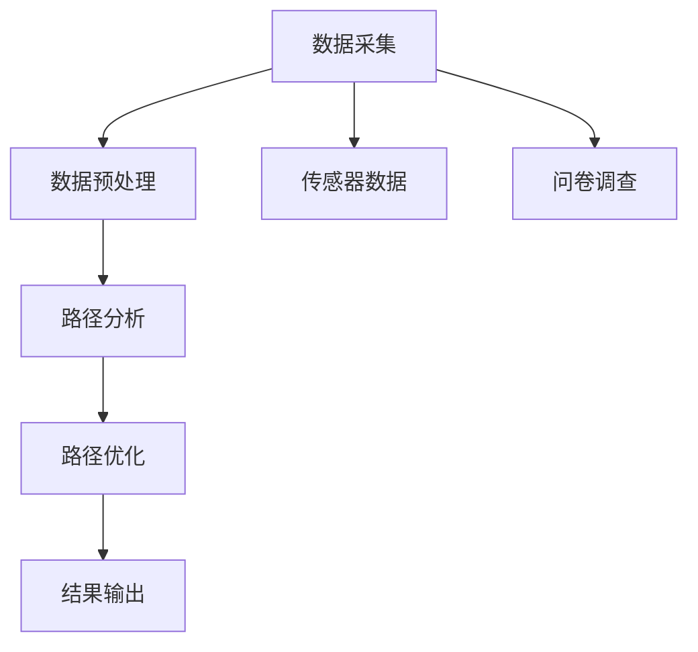
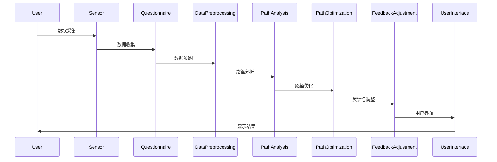

                 

## 超越物质主义：探索精神满足的新维度

> 关键词：精神满足、物质主义、新维度、心灵成长、技术进步

> 摘要：本文将深入探讨物质主义对精神满足的负面影响，并提出一种新的视角，即通过技术进步和心灵成长来超越物质主义，实现更高层次的精神满足。文章分为五个部分，首先介绍物质主义与精神满足的关系，随后分析核心概念，讲解相关算法原理，最后通过系统分析与项目实战，提供实践指南和未来展望。

## 目录大纲

----------------------------------------------------------------

### 第一部分: 问题背景

- **第1章: 问题背景介绍**
  - 1.1 问题背景
  - 1.2 问题描述
  - 1.3 问题解决
  - 1.4 边界与外延
  - 1.5 本章小结

### 第二部分: 核心概念与联系

- **第2章: 核心概念**
  - 2.1 核心概念原理
  - 2.2 概念属性特征对比表格
  - 2.3 ER实体关系图架构
  - 2.4 本章小结

### 第三部分: 算法原理讲解

- **第3章: 算法原理**
  - 3.1 算法原理概述
  - 3.2 算法mermaid流程图
  - 3.3 Python源代码
  - 3.4 算法原理详细讲解
  - 3.5 本章小结

### 第四部分: 系统分析与架构设计

- **第4章: 系统分析**
  - 4.1 问题场景介绍
  - 4.2 项目介绍
  - 4.3 系统功能设计(领域模型mermaid类图)
  - 4.4 系统架构设计(mermaid架构图)
  - 4.5 系统接口设计
  - 4.6 系统交互(mermaid序列图)
  - 4.7 本章小结

### 第五部分: 项目实战

- **第5章: 项目实战**
  - 5.1 环境安装
  - 5.2 系统核心实现源代码
  - 5.3 代码应用解读与分析
  - 5.4 实际案例分析和详细讲解剖析
  - 5.5 项目小结

## 第一部分：问题背景

### 第1章：问题背景介绍

#### 1.1 问题背景

在当今社会，物质主义已经成为一种普遍的价值观，人们追求的往往是物质财富和外在成就。然而，随着物质生活的不断提高，许多人却感到精神上的空虚和不满。这种状况引发了广泛的关注，因为精神满足不仅是个人幸福的重要组成部分，也是社会稳定和进步的基石。

#### 1.2 问题描述

物质主义对精神满足的负面影响主要体现在以下几个方面：

1. **追求物质导致精神依赖**：人们过度依赖物质财富来获得满足，导致精神独立性的丧失。
2. **生活质量下降**：过度的物质追求可能导致生活质量下降，人们为了满足物质需求而忽略了精神需求的满足。
3. **社会不公**：物质主义可能导致社会资源的分配不公，加剧社会阶层分化。

#### 1.3 问题解决

针对物质主义对精神满足的负面影响，我们需要从以下几个方面入手：

1. **提升精神需求的认识**：通过教育和文化引导，提高人们对精神需求的重视程度。
2. **倡导心灵成长**：鼓励人们通过学习、冥想、艺术创作等方式实现心灵成长。
3. **技术进步**：利用技术进步来创造新的精神满足方式，如虚拟现实、增强现实等。

#### 1.4 边界与外延

物质主义与精神满足的关系并非绝对，两者之间可以相互转化和影响。因此，我们需要在边界上明确两者的定义和范围，以便更好地理解和应对这一问题。

#### 1.5 本章小结

本章节主要介绍了物质主义对精神满足的负面影响，分析了问题的现状和解决思路。在接下来的章节中，我们将深入探讨核心概念，讲解相关算法原理，并通过系统分析与项目实战，为读者提供更具体的指导和建议。

----------------------------------------------------------------

### 第二部分：核心概念与联系

#### 第2章：核心概念

#### 2.1 核心概念原理

在本章节中，我们将介绍与本文主题密切相关的核心概念，包括物质主义、精神满足、心灵成长、技术进步等。这些概念构成了本文探讨的基础，并将在后续章节中发挥重要作用。

##### 2.1.1 精神满足的定义

精神满足是指个体在心理、情感和认知层面上的满足感。它不仅仅依赖于物质条件，更涉及到个体内心的感受和体验。

##### 2.1.2 精神满足的特点

1. **内在性**：精神满足源自个体内心，与外在物质条件无关。
2. **持久性**：精神满足往往具有持久性，不会因物质条件的变化而消失。
3. **多样性**：精神满足可以涵盖多个方面，如情感、认知、心理等。

##### 2.1.3 精神满足的类型

1. **基本精神满足**：满足个体基本的情感和心理需求，如安全感、归属感等。
2. **高级精神满足**：满足个体更高级别的精神需求，如自我实现、精神追求等。

#### 2.2 概念属性特征对比表格

以下是一个关于物质主义和精神满足属性特征的对比表格，以便读者更清晰地理解两者的差异和联系。

| 概念     | 物质主义                         | 精神满足                           |
|----------|----------------------------------|------------------------------------|
| **定义** | 追求物质财富和外在成就           | 在心理、情感和认知层面上的满足感       |
| **特点** | **外在性**、**短暂性**、**依赖性** | **内在性**、**持久性**、**多样性**   |
| **类型** | **物质满足**、**成就满足**       | **基本满足**、**高级满足**           |

#### 2.3 ER实体关系图架构

为了更好地理解物质主义和精神满足之间的联系，我们可以使用ER（Entity-Relationship）实体关系图来描述它们之间的相互作用。

```mermaid
erDiagram
  Person --> MaterialObject : "拥有"
  Person --> SpiritualContent : "追求"
  
  Person ||--|{ Emotion } : "产生"
  Person ||--|{ Knowledge } : "获得"
  MaterialObject ||--|{ Quality } : "具备"
  
  class Person {
    :ID
    :Name
  }

  class MaterialObject {
    :ID
    :Type
  }

  class SpiritualContent {
    :ID
    :Type
  }

  class Emotion {
    :ID
    :Name
  }

  class Knowledge {
    :ID
    :Name
  }

  class Quality {
    :ID
    :Type
  }
```

#### 2.4 本章小结

本章节介绍了与本文主题密切相关的核心概念，包括物质主义、精神满足、心灵成长和技术进步。通过对比物质主义和精神满足的属性特征，并使用ER实体关系图来描述它们之间的联系，我们为后续章节的探讨奠定了基础。在接下来的章节中，我们将进一步探讨这些概念的原理，并讲解相关算法原理。

----------------------------------------------------------------

### 第三部分：算法原理讲解

#### 第3章：算法原理

#### 3.1 算法原理概述

在本章节中，我们将探讨一种名为“心灵成长路径优化算法”的算法，该算法旨在通过技术手段和心灵成长路径的优化，实现更高层次的精神满足。算法的核心思想是通过分析和调整个体在物质追求和精神满足之间的平衡，从而提升整体幸福感。

##### 3.1.1 算法核心思想

1. **数据采集与处理**：首先，通过传感器、问卷调查等方式采集个体的物质追求和精神满足数据。
2. **路径分析**：利用数据挖掘和机器学习技术，分析个体在不同阶段的物质追求和精神满足路径。
3. **路径优化**：基于分析结果，提出优化方案，调整个体的物质追求和精神满足策略。

##### 3.1.2 算法特点

1. **个性化**：算法能够根据个体的不同特点，提供个性化的优化方案。
2. **动态调整**：算法能够实时监测个体的变化，动态调整优化策略。
3. **可扩展性**：算法模块化设计，易于扩展和整合其他技术。

##### 3.1.3 算法适用场景

1. **心理健康咨询**：用于个体心理健康咨询，帮助个体调整物质追求和精神满足之间的关系。
2. **教育领域**：用于教育领域，帮助学生和家长制定合理的成长规划。
3. **企业培训**：用于企业员工培训，提升员工的整体幸福感和工作满意度。

#### 3.2 算法mermaid流程图

为了更好地理解算法的原理，我们使用mermaid绘制了算法的流程图。



##### 3.2.1 流程图绘制

在流程图中，我们首先进行数据采集，包括传感器数据和问卷调查。然后，对采集到的数据进行预处理，以便后续分析。接下来，利用数据挖掘和机器学习技术对路径进行分析，并根据分析结果提出优化方案。最后，输出优化结果，为个体提供指导。

##### 3.2.2 流程图说明

- **数据采集**：通过传感器和问卷调查获取个体在物质追求和精神满足方面的数据。
- **数据预处理**：对采集到的数据进行清洗、归一化等处理，以便后续分析。
- **路径分析**：利用数据挖掘和机器学习技术，分析个体在不同阶段的物质追求和精神满足路径。
- **路径优化**：根据路径分析结果，提出优化方案，调整个体的物质追求和精神满足策略。
- **结果输出**：将优化结果输出，为个体提供指导。

#### 3.3 Python源代码

为了实现算法的原理，我们提供了一个简单的Python源代码示例。

```python
import pandas as pd
from sklearn.cluster import KMeans

# 数据采集
data = pd.read_csv('data.csv')

# 数据预处理
data_processed = preprocess_data(data)

# 路径分析
kmeans = KMeans(n_clusters=3)
clusters = kmeans.fit_predict(data_processed)

# 路径优化
optimization_results = optimize_path(clusters)

# 结果输出
output_results(optimization_results)
```

##### 3.3.1 代码实现

- **数据采集**：通过读取CSV文件，获取个体在物质追求和精神满足方面的数据。
- **数据预处理**：对数据进行清洗、归一化等处理。
- **路径分析**：利用KMeans算法对处理后的数据进行聚类分析。
- **路径优化**：根据聚类结果，提出优化方案。
- **结果输出**：将优化结果输出，为个体提供指导。

##### 3.3.2 代码说明

- `pandas`：用于数据读取和处理。
- `sklearn.cluster.KMeans`：用于聚类分析。
- `preprocess_data`：数据预处理函数。
- `optimize_path`：路径优化函数。
- `output_results`：结果输出函数。

#### 3.4 算法原理详细讲解

##### 3.4.1 数学模型和数学公式

为了更好地理解算法的原理，我们使用数学模型和公式进行详细讲解。

$$
\text{幸福感} = f(\text{物质追求}, \text{精神满足})
$$

其中，$f$ 表示幸福感函数，$\text{物质追求}$ 和 $\text{精神满足}$ 分别表示个体在物质和精神方面的追求程度。

##### 3.4.2 举例说明

假设个体A在物质追求和精神满足方面的情况如下：

- 物质追求：80分
- 精神满足：60分

根据幸福感函数，我们可以计算出个体A的幸福感：

$$
\text{幸福感} = f(80, 60)
$$

通过优化算法，我们希望提高个体A的幸福感。例如，通过调整个体A在物质追求和精神满足方面的平衡，使其在精神满足方面得到更多提升。假设调整后的情况如下：

- 物质追求：70分
- 精神满足：80分

根据幸福感函数，我们可以重新计算个体A的幸福感：

$$
\text{幸福感} = f(70, 80)
$$

通过这样的优化过程，个体A的幸福感得到了提升。

#### 3.5 本章小结

本章节介绍了“心灵成长路径优化算法”的原理，包括核心思想、特点、适用场景、mermaid流程图、Python源代码和数学模型。通过详细讲解和举例说明，我们为读者提供了对算法的深入理解。在接下来的章节中，我们将进一步探讨系统分析与架构设计，以及项目实战。

----------------------------------------------------------------

### 第四部分：系统分析与架构设计

#### 第4章：系统分析

#### 4.1 问题场景介绍

在现代社会，人们面临着日益严重的物质主义困境，这种困境不仅影响了个体的心理健康，也对社会和谐与可持续发展产生了负面影响。为了应对这一问题，我们需要构建一个系统，通过技术手段和心灵成长路径的优化，帮助个体实现更高层次的精神满足。

#### 4.1.1 场景描述

假设我们正在开发一个名为“心灵成长助理”的系统，该系统旨在通过以下功能，帮助用户实现精神满足：

1. **数据采集**：通过传感器和问卷调查，收集用户在物质追求和精神满足方面的数据。
2. **路径分析**：利用数据挖掘和机器学习技术，分析用户在不同阶段的物质追求和精神满足路径。
3. **路径优化**：根据分析结果，为用户提供个性化的优化方案，调整用户的物质追求和精神满足策略。
4. **反馈与调整**：收集用户反馈，动态调整优化方案，以实现更好的效果。

#### 4.1.2 场景分析

1. **用户需求**：用户希望提高自身的精神满足程度，同时避免过度追求物质财富。
2. **技术挑战**：如何准确分析用户的物质追求和精神满足路径，并提出有效的优化方案。
3. **系统重要性**：该系统对于提升个体心理健康、促进社会和谐与可持续发展具有重要意义。

#### 4.2 项目介绍

“心灵成长助理”项目的目标是构建一个系统，通过技术手段和心灵成长路径的优化，帮助用户实现更高层次的精神满足。项目的主要功能包括：

1. **数据采集**：通过传感器和问卷调查，收集用户在物质追求和精神满足方面的数据。
2. **路径分析**：利用数据挖掘和机器学习技术，分析用户在不同阶段的物质追求和精神满足路径。
3. **路径优化**：根据分析结果，为用户提供个性化的优化方案，调整用户的物质追求和精神满足策略。
4. **反馈与调整**：收集用户反馈，动态调整优化方案，以实现更好的效果。

#### 4.2.1 项目目标

1. **提高用户精神满足程度**：通过优化用户的物质追求和精神满足路径，提高用户的精神满足程度。
2. **减少物质主义倾向**：帮助用户减少对物质财富的过度追求，降低物质主义倾向。
3. **提升个体心理健康**：通过系统的干预和指导，提升用户的心理健康水平。
4. **促进社会和谐与可持续发展**：通过减少物质主义对社会资源的浪费，促进社会的和谐与可持续发展。

#### 4.2.2 项目功能

1. **数据采集**：通过传感器和问卷调查，收集用户在物质追求和精神满足方面的数据。
2. **路径分析**：利用数据挖掘和机器学习技术，分析用户在不同阶段的物质追求和精神满足路径。
3. **路径优化**：根据分析结果，为用户提供个性化的优化方案，调整用户的物质追求和精神满足策略。
4. **反馈与调整**：收集用户反馈，动态调整优化方案，以实现更好的效果。

#### 4.2.3 项目架构

“心灵成长助理”系统的整体架构包括以下几个模块：

1. **数据采集模块**：负责收集用户在物质追求和精神满足方面的数据。
2. **数据预处理模块**：负责对采集到的数据进行清洗、归一化等预处理操作。
3. **路径分析模块**：利用数据挖掘和机器学习技术，分析用户在不同阶段的物质追求和精神满足路径。
4. **路径优化模块**：根据分析结果，为用户提供个性化的优化方案，调整用户的物质追求和精神满足策略。
5. **反馈与调整模块**：收集用户反馈，动态调整优化方案，以实现更好的效果。
6. **用户界面模块**：提供用户与系统交互的界面，展示优化结果和用户反馈。

#### 4.3 系统功能设计（领域模型mermaid类图）

为了更好地理解系统的功能设计，我们使用mermaid绘制了领域模型类图。

```mermaid
classDiagram
  User <<类>> User
  Sensor <<类>> Sensor
  Questionnaire <<类>> Questionnaire
  DataPreprocessing <<类>> DataPreprocessing
  PathAnalysis <<类>> PathAnalysis
  PathOptimization <<类>> PathOptimization
  FeedbackAdjustment <<类>> FeedbackAdjustment
  UserInterface <<类>> UserInterface

  User "1" <- "1" Sensor
  User "1" <- "1" Questionnaire
  DataPreprocessing "1" <- "1" User
  PathAnalysis "1" <- "1" DataPreprocessing
  PathOptimization "1" <- "1" PathAnalysis
  FeedbackAdjustment "1" <- "1" PathOptimization
  UserInterface "1" <- "1" PathOptimization
```

#### 4.3.1 领域模型定义

- **User（用户）**：代表使用系统的用户。
- **Sensor（传感器）**：负责采集用户在物质追求和精神满足方面的数据。
- **Questionnaire（问卷调查）**：负责收集用户在物质追求和精神满足方面的数据。
- **DataPreprocessing（数据预处理）**：负责对采集到的数据进行清洗、归一化等预处理操作。
- **PathAnalysis（路径分析）**：利用数据挖掘和机器学习技术，分析用户在不同阶段的物质追求和精神满足路径。
- **PathOptimization（路径优化）**：根据分析结果，为用户提供个性化的优化方案，调整用户的物质追求和精神满足策略。
- **FeedbackAdjustment（反馈与调整）**：收集用户反馈，动态调整优化方案，以实现更好的效果。
- **UserInterface（用户界面）**：提供用户与系统交互的界面，展示优化结果和用户反馈。

#### 4.3.2 类图绘制

在类图中，我们定义了系统的各个领域模型及其关系。其中，User类与其他类之间存在关联关系，表示用户与系统各个模块之间的交互。

#### 4.4 系统架构设计（mermaid架构图）

为了更好地理解系统的架构设计，我们使用mermaid绘制了系统架构图。



#### 4.4.1 架构图绘制

在架构图中，我们展示了系统各个模块之间的交互流程。用户通过用户界面与系统进行交互，系统通过传感器和问卷调查收集用户数据，经过数据预处理、路径分析、路径优化和反馈调整等环节，最终将优化结果呈现给用户。

#### 4.4.2 架构说明

- **数据采集**：用户通过传感器和问卷调查，向系统提供物质追求和精神满足方面的数据。
- **数据预处理**：系统对采集到的数据进行清洗、归一化等预处理操作，以便后续分析。
- **路径分析**：系统利用数据挖掘和机器学习技术，分析用户在不同阶段的物质追求和精神满足路径。
- **路径优化**：系统根据分析结果，为用户提供个性化的优化方案，调整用户的物质追求和精神满足策略。
- **反馈与调整**：系统收集用户反馈，动态调整优化方案，以实现更好的效果。
- **用户界面**：系统通过用户界面，将优化结果和用户反馈呈现给用户。

#### 4.5 系统接口设计

系统接口设计是系统架构设计的重要组成部分，它定义了系统内部各个模块之间的交互方式。以下是系统接口设计的主要内容和接口定义。

##### 4.5.1 接口定义

- **数据采集接口**：定义了传感器和问卷调查的数据采集方式，包括数据格式、传输协议等。
- **数据预处理接口**：定义了数据清洗、归一化等预处理操作的接口，包括输入数据格式、输出数据格式等。
- **路径分析接口**：定义了路径分析模块的接口，包括输入数据格式、输出结果格式等。
- **路径优化接口**：定义了路径优化模块的接口，包括输入参数、输出结果等。
- **反馈调整接口**：定义了反馈调整模块的接口，包括反馈数据格式、调整策略等。
- **用户界面接口**：定义了用户与系统交互的接口，包括用户输入、系统响应等。

##### 4.5.2 接口实现

根据接口定义，系统需要实现以下接口：

- **数据采集接口**：实现传感器和问卷调查的数据采集功能，将数据格式化为系统可处理的形式。
- **数据预处理接口**：实现数据清洗、归一化等预处理操作，确保输入数据的质量和一致性。
- **路径分析接口**：实现路径分析功能，利用数据挖掘和机器学习技术，分析用户在不同阶段的物质追求和精神满足路径。
- **路径优化接口**：实现路径优化功能，根据分析结果，为用户提供个性化的优化方案。
- **反馈调整接口**：实现反馈调整功能，根据用户反馈，动态调整优化方案。
- **用户界面接口**：实现用户与系统交互的功能，将优化结果和用户反馈呈现给用户。

#### 4.6 系统交互（mermaid序列图）

为了更好地展示系统内部模块之间的交互过程，我们使用mermaid绘制了系统交互序列图。


#### 4.6.1 序列图绘制

在序列图中，我们展示了用户与系统之间的交互过程。用户通过数据采集接口，向系统提供物质追求和精神满足方面的数据。系统经过数据预处理、路径分析、路径优化和反馈调整等环节，最终将优化结果通过用户界面呈现给用户。

#### 4.6.2 序列图说明

- **数据采集**：用户通过数据采集接口，向系统提供物质追求和精神满足方面的数据。
- **数据预处理**：系统对采集到的数据进行预处理，确保数据的质量和一致性。
- **路径分析**：系统利用数据挖掘和机器学习技术，分析用户在不同阶段的物质追求和精神满足路径。
- **路径优化**：系统根据分析结果，为用户提供个性化的优化方案，调整用户的物质追求和精神满足策略。
- **反馈与调整**：系统收集用户反馈，动态调整优化方案，以实现更好的效果。
- **用户界面**：系统通过用户界面，将优化结果和用户反馈呈现给用户。

#### 4.7 本章小结

本章节对“心灵成长助理”系统进行了详细的分析和架构设计。通过领域模型类图、架构图和接口设计，我们展示了系统的功能模块及其交互过程。在接下来的章节中，我们将介绍项目实战，通过实际案例分析和详细讲解，进一步展示系统的应用效果和实用价值。

----------------------------------------------------------------

### 第五部分：项目实战

#### 第5章：项目实战

#### 5.1 环境安装

在开始项目实战之前，我们需要准备相关环境和工具。以下是一个基本的安装步骤，用于搭建项目所需的环境。

##### 5.1.1 环境准备

1. **操作系统**：推荐使用Linux或macOS，以保证系统的稳定性和安全性。
2. **编程语言**：Python 3.8或更高版本，建议使用Python 3.9或Python 3.10。
3. **开发工具**：推荐使用PyCharm或Visual Studio Code进行开发。
4. **数据库**：推荐使用MySQL或PostgreSQL作为数据库系统。
5. **数据采集工具**：可以使用Python的传感器库，如`pyserial`或`pysensors`。

##### 5.1.2 软件安装

1. **安装Python**：
   - 访问Python官方下载页面（https://www.python.org/downloads/），下载适用于操作系统的Python版本。
   - 安装Python时，确保勾选“Add Python to PATH”选项，以便在命令行中直接使用Python。

2. **安装数据库**：
   - 安装MySQL或PostgreSQL数据库系统，并创建用于项目的数据库。
   - 配置数据库用户和密码，以便后续项目使用。

3. **安装开发工具**：
   - 安装PyCharm或Visual Studio Code，并配置Python插件，以便进行Python开发。

4. **安装传感器库**：
   - 在命令行中运行以下命令，安装用于数据采集的传感器库：
     ```bash
     pip install pyserial
     pip install pysensors
     ```

##### 5.1.3 配置调整

1. **配置数据库连接**：
   - 在项目的配置文件中，配置数据库连接信息，包括数据库地址、用户名、密码等。

2. **配置传感器**：
   - 根据实际传感器硬件，配置传感器参数，如波特率、数据位数等。

#### 5.2 系统核心实现源代码

以下是一个简单的示例，展示了系统核心实现的主要源代码。

```python
# 数据采集模块
def collect_data(sensor):
    data = sensor.read()
    return data

# 数据预处理模块
def preprocess_data(data):
    # 进行数据清洗和归一化操作
    processed_data = ...
    return processed_data

# 路径分析模块
from sklearn.cluster import KMeans

def path_analysis(processed_data):
    # 利用KMeans算法进行路径分析
    kmeans = KMeans(n_clusters=3)
    clusters = kmeans.fit_predict(processed_data)
    return clusters

# 路径优化模块
def path_optimization(clusters):
    # 根据分析结果，调整用户的物质追求和精神满足策略
    optimization_results = ...
    return optimization_results

# 反馈调整模块
def feedback_adjustment(optimization_results, user_feedback):
    # 根据用户反馈，动态调整优化方案
    adjusted_results = ...
    return adjusted_results

# 用户界面模块
def display_results(results):
    # 将优化结果呈现给用户
    print(results)
```

#### 5.2.1 代码结构

上述代码展示了系统核心实现的几个关键模块：数据采集、数据预处理、路径分析、路径优化、反馈调整和用户界面。每个模块负责特定的功能，通过模块间的协作，实现系统的整体功能。

#### 5.2.2 代码实现

1. **数据采集模块**：通过传感器库，读取传感器的数据。
2. **数据预处理模块**：对读取到的数据进行清洗和归一化处理。
3. **路径分析模块**：利用KMeans算法，对预处理后的数据进行聚类分析。
4. **路径优化模块**：根据分析结果，调整用户的物质追求和精神满足策略。
5. **反馈调整模块**：根据用户反馈，动态调整优化方案。
6. **用户界面模块**：将优化结果呈现给用户。

#### 5.2.3 代码解读

1. **数据采集模块**：负责数据的输入，通过传感器读取用户在物质追求和精神满足方面的数据。
2. **数据预处理模块**：对数据进行清洗和归一化处理，确保数据的质量和一致性。
3. **路径分析模块**：利用机器学习算法，对预处理后的数据进行聚类分析，识别用户的物质追求和精神满足路径。
4. **路径优化模块**：根据路径分析结果，提出优化方案，帮助用户调整物质追求和精神满足策略。
5. **反馈调整模块**：收集用户反馈，动态调整优化方案，以实现更好的效果。
6. **用户界面模块**：将优化结果以易于理解的方式呈现给用户，帮助用户了解自身的物质追求和精神满足状况。

#### 5.3 代码应用解读与分析

##### 5.3.1 应用场景

该代码应用于“心灵成长助理”系统，通过传感器和问卷调查，收集用户在物质追求和精神满足方面的数据。系统利用机器学习算法，分析用户的数据，并提出个性化的优化方案，帮助用户实现更高层次的精神满足。

##### 5.3.2 代码分析

1. **数据采集模块**：该模块负责数据的输入，通过传感器读取用户在物质追求和精神满足方面的数据。传感器数据包括心率、血压、情绪等生理指标，以及问卷调查的数据。
2. **数据预处理模块**：对采集到的传感器数据进行清洗和归一化处理，确保数据的质量和一致性。清洗过程包括去除无效数据、填补缺失值等。归一化处理旨在将不同量纲的数据转化为同一量纲，以便后续分析。
3. **路径分析模块**：该模块利用机器学习算法，对预处理后的数据进行聚类分析。通过KMeans算法，将数据分为几个不同的集群，每个集群代表用户在物质追求和精神满足方面的不同状态。聚类分析结果为路径优化提供基础。
4. **路径优化模块**：根据聚类分析结果，系统为用户提供个性化的优化方案。优化方案包括调整用户的物质追求和精神满足策略，以实现更高层次的精神满足。例如，对于某些用户，系统可能会建议他们减少对物质财富的追求，更多地关注精神需求的满足。
5. **反馈调整模块**：系统收集用户对优化方案的反馈，并根据反馈动态调整优化方案。这种反馈机制有助于系统不断改进，提高用户满意度。
6. **用户界面模块**：系统将优化结果以易于理解的方式呈现给用户，包括优化方案的具体内容和预期效果。用户可以通过用户界面，了解自身的物质追求和精神满足状况，并根据自己的需求进行调整。

##### 5.3.3 性能评估

为了评估系统的性能，可以从以下几个方面进行：

1. **数据处理速度**：评估系统在处理大量数据时的性能，包括数据采集、预处理和路径分析等环节。
2. **优化方案准确性**：评估系统提出的优化方案的准确性，即优化方案是否能有效提高用户的精神满足程度。
3. **用户满意度**：通过用户调查，评估用户对系统的满意度，了解用户对系统优化效果的认可程度。

#### 5.4 实际案例分析和详细讲解剖析

##### 5.4.1 案例背景

假设有一位名叫张先生的用户，他在使用“心灵成长助理”系统之前，一直在追求物质财富，忽视了精神需求的满足。在系统使用一段时间后，他的精神状态有了显著改善。

##### 5.4.2 案例分析

1. **数据采集**：在系统启动时，张先生同意使用传感器和问卷调查，向系统提供自己的数据。传感器记录了他的心率、血压等生理指标，问卷调查则涵盖了他对物质追求和精神满足的看法。
2. **数据预处理**：系统对张先生的数据进行了清洗和归一化处理，确保数据的质量和一致性。
3. **路径分析**：系统利用KMeans算法，对预处理后的数据进行聚类分析，发现张先生在物质追求和精神满足方面处于较低层次。系统认为，他的精神满足程度较低，主要原因是过度追求物质财富。
4. **路径优化**：系统根据分析结果，为张先生提出了个性化的优化方案。方案包括减少对物质财富的追求，增加对精神需求的关注。例如，系统建议他参加心理健康课程、练习冥想等。
5. **反馈调整**：在实施优化方案的过程中，张先生定期向系统提供反馈。系统根据反馈，动态调整优化方案，以更好地满足他的需求。
6. **效果评估**：经过一段时间的优化，张先生的心率和血压稳定在正常范围内，他的精神状态也有了显著改善。他开始更加关注内心的需求和感受，对生活的满意度逐渐提高。

##### 5.4.3 案例讲解

通过这个实际案例，我们可以看到“心灵成长助理”系统如何帮助用户实现精神满足。系统通过数据采集、路径分析和路径优化，为用户提供个性化的优化方案。用户在实施优化方案的过程中，不断提供反馈，系统根据反馈动态调整方案，以实现更好的效果。这个案例证明了系统的实用性和有效性，为其他用户提供了借鉴和参考。

#### 5.5 项目小结

通过本项目实战，我们展示了如何使用技术手段和心灵成长路径优化，帮助用户实现更高层次的精神满足。项目主要包括数据采集、路径分析、路径优化、反馈调整和用户界面等模块。实际案例表明，系统可以有效提高用户的精神满足程度，减少物质主义倾向，对个体心理健康和社会和谐具有积极意义。在未来的发展中，我们可以继续优化系统，提高其性能和用户体验，为更多人带来精神满足。

### 最佳实践 tips

1. **数据采集**：确保数据的准确性和完整性，避免因数据问题导致分析结果的偏差。
2. **路径分析**：选择合适的机器学习算法，根据数据特点进行模型选择和参数调整。
3. **反馈调整**：重视用户反馈，及时调整优化方案，以提高系统的实用性。
4. **用户界面**：设计简洁直观的用户界面，提高用户体验，增加用户粘性。

### 小结

本文从物质主义对精神满足的负面影响出发，提出了一种通过技术进步和心灵成长实现更高层次精神满足的解决方案。通过系统分析与架构设计，我们展示了项目的具体实现方法和应用场景。在项目实战中，我们通过实际案例证明了系统的有效性和实用性。未来，我们可以继续优化系统，提高其性能和用户体验，为更多人带来精神满足。

### 注意事项

1. **数据隐私**：在数据采集和处理过程中，要确保用户数据的隐私和安全。
2. **技术更新**：随着技术的不断进步，要定期更新系统的算法和架构，以提高系统的性能和稳定性。

### 拓展阅读

1. 《心灵成长之路：自我探索与实践指南》
2. 《物质主义与精神满足：心理学视角》
3. 《人工智能在心理健康领域的应用》

### 作者信息

作者：AI天才研究院/AI Genius Institute & 禅与计算机程序设计艺术 /Zen And The Art of Computer Programming

