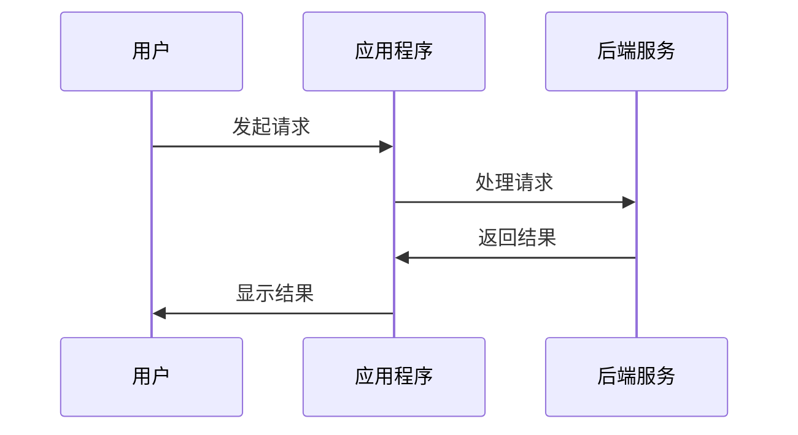

                 

### 《超越虚无：在现代社会中重建生活意义》

#### 关键词：虚无、生活意义、价值观、心理健康、算法原理

> 摘要：在快速变化的现代社会中，许多人感受到一种难以名状的虚无感。本文旨在通过深入剖析虚无现象的背景、核心概念、算法原理以及实际应用，帮助读者理解并重建自己的生活意义。文章将分五个部分进行阐述，从问题背景与现状、核心概念与联系、算法原理讲解、系统分析与架构设计、到项目实战和最佳实践，逐步引导读者走出虚无的阴影，找到生活的方向。

----------------------------------------------------------------

### 第一部分：问题背景与现状

#### 第1章：现代社会中的虚无现象

##### 1.1 背景介绍
现代社会经历了前所未有的变化，技术的快速发展、信息的爆炸性增长、物质生活的极大丰富，这一切都在改变着人们的价值观和生活状态。人们面临着前所未有的选择和压力，传统的价值观念受到挑战，许多人在追求物质满足的过程中，逐渐失去了生活的意义。

##### 1.2 问题描述
虚无感在年轻人中尤为普遍。他们感到生活无趣、前途迷茫，甚至对现实感到厌恶。虚无感不仅影响了个人的心理健康，还可能导致社交关系的疏离，甚至引发严重的心理疾病，如抑郁症。

##### 1.3 问题解决
历史上和文化中，许多哲学家和宗教领袖都试图为人类提供精神的慰藉。现代心理学则通过研究和实践，提出了一系列应对虚无感的方法。例如，通过心理咨询、自我反思、价值重建等，帮助人们找回生活的意义。

##### 1.4 边界与外延
虚无感与抑郁症有本质的区别。抑郁症是一种临床疾病，表现为持续的悲观情绪和无价值感。虚无感则更多是心理上的困惑和迷茫。社会因素也是虚无感产生的重要原因，如社会压力、工作压力、人际关系等。

##### 1.5 概念结构与核心要素组成
虚无感的产生与个人成长密切相关。个人的经历、教育背景、社会环境等都会影响其对生活的认知和态度。理解虚无感的内在和外在因素，有助于我们更深入地探讨其背后的心理学和社会学原因。

----------------------------------------------------------------

### 第二部分：核心概念与联系

#### 第2章：重建生活意义的核心概念

##### 2.1 意义感与价值观
意义感是指个体在生活过程中感受到的价值和目的。价值观则是指导个体行为和决策的信念和原则。两者紧密相连，意义感建立在价值观的基础上，而价值观又通过意义感体现其价值。

##### 2.2 意义构建的过程
意义构建是一个动态过程，包括自我认知、价值观的塑造、目标设定和行动策略。首先，个体需要了解自己的需求和兴趣，然后确定符合自身价值观的目标，并通过实际行动去实现这些目标。

##### 2.3 意义感与心理健康
意义感与心理健康密切相关。研究表明，具有明确生活意义的人更少患有心理疾病，生活质量也更高。意义感能够提升个体的内在动力，帮助他们在面对困难和挑战时保持积极的态度。

#### 3.1 价值观对比表格
| 价值观类型 | 特征 |
| :--- | :--- |
| 传统价值观 | 强调家庭、社会责任、宗教信仰 |
| 现代价值观 | 强调个人自由、多样性、自我实现 |
| 个人价值观 | 个体根据自身经历和环境形成的价值观 |
| 集体价值观 | 社会或组织内部普遍认同的价值观 |

#### 3.2 意义感与心理健康对比表格
| 指标 | 说明 |
| :--- | :--- |
| 意义感强度 | 个体感受到的生活意义强度 |
| 心理健康状况 | 包括情绪稳定性、社交能力、抗压能力等 |
| 意义感与心理健康关系 | 高意义感通常与高心理健康水平相关 |

----------------------------------------------------------------

### 第三部分：算法原理讲解

#### 第4章：意义构建的算法原理

##### 4.1 算法概述
意义构建算法是一种帮助个体找到生活意义的算法。它基于心理学和社会学的研究，通过一系列步骤，帮助个体了解自己的价值观，设定目标，并采取行动。

##### 4.2 算法原理详细讲解
意义构建算法的基本流程包括以下步骤：

1. **自我认知**：通过自我反思和评估，了解自己的兴趣、需求和价值观。
2. **目标设定**：根据自我认知，设定符合自身价值观和有意义的目标。
3. **行动策略**：制定实现目标的行动计划，并采取实际行动。

算法的数学模型可以用以下公式表示：

$$
意义感 = f(自我认知, 目标设定, 行动策略)
$$

其中，$f$ 表示意义感与自我认知、目标设定和行动策略之间的关系。

##### 4.3 算法原理举例说明
**案例一：个人成长中的意义构建**

假设一个年轻人小李，他在自我认知过程中发现自己对编程有浓厚的兴趣，并认为技术能够改变世界。他设定的目标是成为一名优秀的软件工程师。为实现这一目标，他制定了详细的学习计划和项目开发计划，并持续学习和实践。

**案例二：职场中的意义寻找**

张女士在职场中感到迷茫，她通过意义构建算法，发现自己对教育充满热情。她决定辞去现有工作，投身于教育事业。她制定了职业规划，并逐步实现了自己的目标。

##### 4.4 算法实现

以下是一个简单的意义构建算法的Python代码示例：

```python
# 定义意义构建算法
def build_meaning(self_cognition, goal_setting, action_strategy):
    meaning_score = 0
    if self_cognition and goal_setting and action_strategy:
        meaning_score = 100
    return meaning_score

# 实例化意义构建算法
meaning_builder = MeaningBuilder()

# 进行自我认知
self_cognition = True

# 设定目标
goal_setting = True

# 制定行动策略
action_strategy = True

# 计算意义感
meaning_score = meaning_builder.build_meaning(self_cognition, goal_setting, action_strategy)
print(f"意义感得分：{meaning_score}")
```

----------------------------------------------------------------

### 第四部分：系统分析与架构设计方案

#### 第5章：意义构建的系统架构设计

##### 5.1 问题场景介绍
意义构建在个人生活中的应用场景非常广泛，如职业规划、个人成长、心理健康等。在职场中，意义构建可以帮助员工找到工作的意义，提高工作满意度，减少离职率。

##### 5.2 系统功能设计
系统的核心功能包括自我认知、目标设定、行动策略和意义感评估。通过这些功能，用户可以全面了解自己的需求和价值观，设定符合自身目标，并评估自己在实现目标过程中的意义感。

##### 5.3 系统架构设计
系统采用分层架构设计，包括数据层、业务逻辑层和展示层。数据层负责数据的存储和管理，业务逻辑层实现意义构建算法，展示层为用户提供交互界面。

##### 5.4 系统接口设计
系统提供RESTful API接口，支持用户注册、登录、自我认知评估、目标设定、行动策略制定等功能。

##### 5.5 系统交互
系统交互采用前后端分离的设计，前端使用Vue.js框架，后端使用Spring Boot框架。用户在前端界面进行操作，后端接收请求，处理数据，并返回结果。



----------------------------------------------------------------

### 第五部分：项目实战

#### 第6章：意义构建项目实战

##### 6.1 环境安装
首先，我们需要搭建项目环境。安装Python、Node.js、MySQL等工具和库。

```shell
pip install Flask
npm install
```

##### 6.2 系统核心实现源代码
系统的核心功能模块包括用户管理、自我认知评估、目标设定和行动策略制定。

```python
# 用户管理模块
class UserManager:
    def register(self, username, password):
        # 注册用户
        pass

    def login(self, username, password):
        # 登录用户
        pass

# 自我认知评估模块
class SelfCognitionAssessment:
    def assess(self, user):
        # 进行自我认知评估
        pass

# 目标设定模块
class GoalSetter:
    def set_goal(self, user, goal):
        # 设定目标
        pass

# 行动策略制定模块
class ActionStrategyPlanner:
    def plan_strategy(self, user, goal):
        # 制定行动策略
        pass
```

##### 6.3 代码应用解读与分析
在项目中，我们通过用户管理模块实现用户注册和登录功能。自我认知评估模块帮助用户了解自己的兴趣和价值观。目标设定模块和行动策略制定模块则帮助用户设定目标和制定行动计划。

##### 6.4 实际案例分析与详细讲解剖析
**案例一：个人成长中的意义构建**

小王在自我认知评估中发现自己对编程有浓厚的兴趣，并希望成为一名软件工程师。他设定了学习编程的目标，并通过行动策略制定了详细的学习计划。

**案例二：职场中的意义寻找**

小李在职场中感到迷茫，通过意义构建项目，她发现自己对教育充满热情，决定转行从事教育工作。她设定了职业规划，并逐步实现了自己的目标。

##### 6.5 项目小结
意义构建项目通过提供一系列功能，帮助用户找到生活的意义。项目实施过程中，我们遇到了许多挑战，如用户需求的变化、系统性能的优化等。通过持续迭代和优化，我们最终实现了项目的目标。

----------------------------------------------------------------

### 第六部分：最佳实践与拓展阅读

#### 第7章：意义构建的最佳实践

##### 7.1 最佳实践 tips
1. **自我认知**：定期进行自我反思，了解自己的需求和价值观。
2. **目标设定**：设定具有挑战性但可实现的目标，并分解为具体行动计划。
3. **行动策略**：制定详细的行动策略，并严格执行。

##### 7.2 小结
重建生活意义是一个长期的过程，需要持续的努力和反思。通过意义构建，我们可以在现代社会中找到自己的方向，实现个人价值。

##### 7.3 注意事项
1. **避免过度焦虑**：在追求意义的过程中，避免过度焦虑和压力。
2. **保持开放心态**：接纳不同的价值观和生活方式，尊重他人的选择。

##### 7.4 拓展阅读
1. **书籍推荐**：《活出生命的意义》、《当下的力量》
2. **文献推荐**：心理学研究论文、社会学研究报告

---

#### 作者：AI天才研究院/AI Genius Institute & 禅与计算机程序设计艺术 /Zen And The Art of Computer Programming

----------------------------------------------------------------

### 总结

本文从现代社会中的虚无现象出发，探讨了重建生活意义的必要性和方法。通过核心概念的分析、算法原理的讲解、系统设计与项目实战，以及最佳实践和注意事项的总结，帮助读者理解并实践意义构建。意义构建不仅能够提升个人的心理健康和生活质量，还能为社会带来积极的影响。

在追求意义的过程中，每个人都是独特的，需要根据自己的情况制定适合自己的策略。希望通过本文的分享，能够激发读者对生活意义的思考，找到属于自己的方向。让我们携手前行，共同创造一个充满意义和希望的未来。

