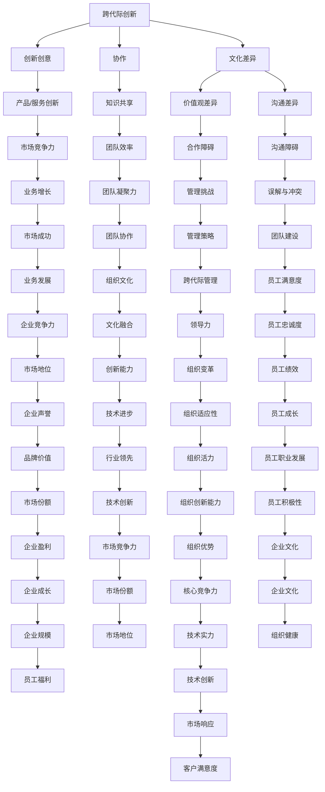
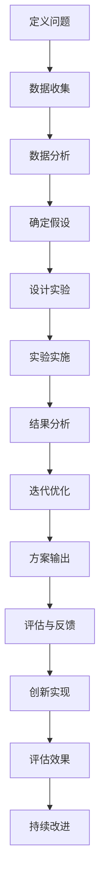

                 

# 跨代际创新实验室：年龄差异激发的创意空间

> 关键词：跨代际创新、年龄差异、创意空间、协作、团队建设、数字化转型

> 摘要：本文旨在探讨不同年龄代际之间如何通过创新实验室实现跨代际合作，激发创意空间，推动数字化转型。文章通过背景介绍、核心概念解析、案例分析、挑战与解决方案、最佳实践分享等内容，详细阐述了跨代际创新的内涵、实现路径及其在数字化转型中的应用价值。

## 目录大纲设计步骤

设计《跨代际创新实验室：年龄差异激发的创意空间》这本书的目录大纲，需要经过以下详细的步骤：

### 1. **明确书籍主题和目标**

首先，我们需要明确书籍的主题和目标。本书的主题是探讨不同年龄代际之间的差异如何激发创新创意，目标是通过案例研究和理论分析，展示跨代际创新的价值和实现路径。

### 2. **设计目录结构**

接下来，根据书籍主题和目标，设计一个结构清晰的目录结构。目录结构应包含以下几个主要部分：

- **引言**：介绍书籍背景、目的和研究方法。
- **背景介绍**：探讨不同年龄代际的差异、创新创意的重要性等。
- **核心概念与联系**：介绍跨代际创新的相关概念，并展示概念之间的联系。
- **跨代际创新实践**：通过案例研究和实际操作，展示跨代际创新的应用和效果。
- **创新创意的推动因素**：分析影响跨代际创新的推动因素。
- **挑战与应对策略**：探讨跨代际创新面临的挑战及解决方案。
- **最佳实践与启示**：总结跨代际创新的最佳实践，提供启示和思考。
- **小结与展望**：对全书内容进行总结，并对未来发展趋势进行展望。

### 3. **细化章节内容**

在每个主要部分中，进一步细化章节内容，确保每个章节都有明确的主题和目的。以下是一个详细的目录大纲示例：

### 目录

#### 第一部分：引言

**第1章 跨代际创新的背景与意义**

- 1.1 问题背景
- 1.2 创新创意的重要性
- 1.3 研究方法与结构

#### 第二部分：背景介绍

**第2章 不同年龄代际的差异**

- 2.1 年龄差异的概述
- 2.2 年龄差异的影响
- 2.3 创新创意的潜力

**第3章 跨代际创新的概念与联系**

- 3.1 跨代际创新的概念
- 3.2 跨代际创新与传统创新对比
- 3.3 概念之间的联系

#### 第三部分：跨代际创新实践

**第4章 跨代际创新案例研究**

- 4.1 案例一：科技公司
- 4.2 案例二：教育领域
- 4.3 案例三：文化创意产业

**第5章 跨代际创新的实际操作**

- 5.1 创新创意的激发方法
- 5.2 创新项目的执行过程
- 5.3 创新成果的评估与反馈

#### 第四部分：创新创意的推动因素

**第6章 跨代际创新的推动因素**

- 6.1 内部驱动因素
- 6.2 外部驱动因素
- 6.3 推动因素的综合作用

#### 第五部分：挑战与应对策略

**第7章 跨代际创新面临的挑战**

- 7.1 文化差异的挑战
- 7.2 技术变革的挑战
- 7.3 管理挑战

**第8章 应对策略与解决方案**

- 8.1 文化融合的策略
- 8.2 技术创新的策略
- 8.3 管理优化策略

#### 第六部分：最佳实践与启示

**第9章 跨代际创新的最佳实践**

- 9.1 成功案例的总结
- 9.2 最佳实践的建议
- 9.3 启示与思考

**第10章 小结与展望**

- 10.1 全书总结
- 10.2 未来发展趋势
- 10.3 研究展望

### 4. **确保内容完整性和简洁性**

在编写每个章节时，确保内容完整，涵盖核心概念、算法原理、数学模型、系统架构、项目实战等。同时，保持语言简洁明了，避免冗余内容。

### 5. **审查和修订**

最后，对目录大纲进行审查和修订，确保结构合理，内容连贯，符合书籍主题和目标。如果有必要，可以进行调整和优化。

通过以上步骤，我们可以设计出一套完整、逻辑清晰的目录大纲，为《跨代际创新实验室：年龄差异激发的创意空间》这本书奠定坚实的基础。

----------------------------------------------------------------

### 背景介绍

#### 核心概念术语说明

在探讨跨代际创新之前，我们需要明确一些核心概念术语，这些术语包括但不限于：

1. **代际差异**：指不同年龄段人群在价值观、生活习惯、教育背景等方面的差异。
2. **创新创意**：指在现有知识和技术的基础上，通过新的思维方式和视角，创造出新的产品、服务或解决方案。
3. **跨代际创新**：指不同年龄代际之间通过合作与交流，激发创意空间，推动创新的过程。
4. **创新实验室**：指为促进跨代际创新而设立的特殊工作空间，提供资源、支持和环境，以激发创新者的创造力和合作精神。

#### 问题背景

在当前数字化转型的背景下，企业和组织面临着巨大的创新压力。创新不仅是企业持续发展的动力，也是应对市场竞争和变化的必要手段。然而，传统的创新模式往往存在一定的局限性，特别是在如何利用不同年龄代际之间的差异来激发创新方面，存在着很大的潜力尚未被挖掘。

#### 问题描述

跨代际创新的核心问题是如何有效地整合不同年龄段员工的智慧和能力，实现优势互补，激发出新的创意空间。具体而言，包括以下几个方面：

1. **文化差异**：不同年龄代际之间的文化差异可能导致沟通障碍和团队合作问题。
2. **技能差距**：年轻一代可能在技术技能方面更具优势，而年长一代则在行业经验和专业知识方面更为丰富。
3. **创新动力**：不同年龄段的人可能对创新的动力和方式有不同的理解和期望。
4. **组织结构**：传统的组织结构可能不利于跨代际创新，需要调整和优化。

#### 问题解决

为了解决上述问题，可以采取以下策略：

1. **构建创新实验室**：设立专门的创新实验室，为不同年龄代际的员工提供一个平等、开放的交流平台，鼓励他们分享自己的想法和经验。
2. **跨代际协作**：通过跨部门、跨职能的团队协作，促进不同年龄代际之间的交流和互动。
3. **培训与教育**：为不同年龄段的员工提供相应的培训和指导，帮助他们了解和适应对方的工作方式和思维方式。
4. **激励机制**：建立合理的激励机制，鼓励员工积极参与跨代际创新项目，并对成功案例进行表彰和推广。

#### 边界与外延

跨代际创新的边界主要包括：

1. **年龄范围**：通常指的是不同年龄段之间的差异，如青年、中年和老年。
2. **行业范围**：不同行业之间的差异也可能影响跨代际创新的效果。
3. **文化差异**：除了年龄和文化背景的差异，还包括不同地域、国家和组织之间的文化差异。

跨代际创新的外延则包括：

1. **跨领域合作**：不同行业、不同领域之间的合作，如科技与艺术、医疗与健康管理等。
2. **全球视野**：将跨代际创新的理念和实践推广到全球范围内，促进国际间的创新合作。
3. **未来趋势**：关注未来发展趋势，如人工智能、大数据、物联网等新兴技术对跨代际创新的影响。

#### 概念结构与核心要素组成

跨代际创新的实现需要以下几个核心要素：

1. **团队建设**：建立跨代际的多元化团队，促进不同年龄代际之间的协作和交流。
2. **资源支持**：提供必要的资源，如技术、资金、时间等，为跨代际创新提供保障。
3. **激励机制**：建立合理的激励机制，激发员工的创新热情和创造力。
4. **文化氛围**：营造一个包容、开放、创新的氛围，鼓励员工勇于尝试和探索。
5. **领导力**：领导者需要具备跨代际管理的意识和能力，推动跨代际创新的发展。

通过以上核心要素的有机组合，可以实现跨代际创新的协同效应，推动企业的数字化转型和持续发展。

----------------------------------------------------------------

### 核心概念与联系

在探讨跨代际创新时，理解并阐述核心概念之间的联系是至关重要的。以下将详细描述跨代际创新的概念原理、概念属性特征对比表格，以及使用ER实体关系图架构的Mermaid流程图来展示概念之间的逻辑关系。

#### 概念原理

**跨代际创新**是指不同年龄代际之间的个体或团队通过合作、交流与互动，以激发新的创意和解决方案的过程。这一概念强调了年龄差异所带来的独特视角和价值，通过整合不同代际的知识、经验和技能，实现创新目标。

**创新创意**是跨代际创新的核心驱动力。它指的是在现有知识和技术基础上，通过新的思路、方法或技术手段创造出新的产品、服务或商业模式的思维过程。创新创意可以是全新的，也可以是对现有产品和服务的改进或优化。

**协作**是实现跨代际创新的重要手段。协作不仅仅是简单的合作，更强调团队成员之间的互动、交流和知识共享。通过协作，不同年龄代际的个体可以相互学习，互补不足，从而创造出更具创新性的成果。

**文化差异**是影响跨代际创新的重要因素。文化差异不仅体现在价值观、行为习惯和沟通方式上，还涉及到对创新的认知和接受程度。跨代际创新要求团队成员能够理解和尊重彼此的文化差异，从而在合作中找到共同点，发挥各自的优势。

#### 概念属性特征对比表格

以下是一个对比表格，展示了跨代际创新、创新创意、协作和文化差异这四个核心概念的主要属性特征：

| 概念        | 属性特征                                     |
|-------------|--------------------------------------------|
| 跨代际创新  | - 强调年龄差异带来的独特视角和价值           |
|             | - 需要跨代际协作与合作                     |
|             | - 涵盖创新创意的产生和应用                 |
| 创新创意    | - 基于现有知识和技术的新思维和方法         |
|             | - 可能涉及产品、服务或商业模式的创新       |
|             | - 强调创造性和创新性                       |
| 协作        | - 强调团队互动与知识共享                   |
|             | - 涵盖跨代际合作，但不仅限于此             |
|             | - 强调协同效应和团队目标的一致性           |
| 文化差异    | - 涉及价值观、行为习惯和沟通方式的差异     |
|             | - 影响跨代际合作的效率和效果               |
|             | - 需要理解和尊重，以促进合作               |

#### ER实体关系图架构的Mermaid流程图

为了更好地展示跨代际创新、创新创意、协作和文化差异之间的逻辑关系，我们可以使用Mermaid绘制一个ER（实体关系）图架构。



上述Mermaid流程图通过实体关系图的方式，展示了跨代际创新、创新创意、协作和文化差异之间的相互关系。每个概念都与相应的属性特征和影响结果相关联，从而形成一个完整的逻辑框架。

通过理解这些核心概念及其之间的联系，我们可以更深入地探讨跨代际创新的本质和实现路径，为后续章节中的案例分析、实践策略提供理论基础。

----------------------------------------------------------------

### 算法原理讲解

在探讨跨代际创新的过程中，算法原理扮演着至关重要的角色。以下将详细讲解跨代际创新算法的mermaid流程图、Python源代码、数学模型和公式，并通过实际案例进行通俗易懂地举例说明。

#### mermaid流程图

首先，我们使用mermaid绘制一个跨代际创新算法的流程图，以展示其主要步骤和逻辑关系。



#### Python源代码

为了实现上述算法的原理，我们可以编写一个Python脚本。以下是一个简单的示例代码：

```python
import pandas as pd
import numpy as np

# 数据收集
data = pd.read_csv('cross_generation_innovation_data.csv')

# 数据分析
def data_analysis(data):
    # 提取关键特征
    features = data[['age', 'experience', 'innovation_score', 'team_performance']]
    # 计算相关性
    correlation_matrix = features.corr()
    return correlation_matrix

# 确定假设
def hypothesis_testing(correlation_matrix):
    # 筛选高相关性的特征
    high_corr_features = correlation_matrix[correlation_matrix.abs() > 0.5].index
    return high_corr_features

# 设计实验
def experiment_design(high_corr_features):
    # 实验参数设置
    experiment_params = {
        'group1': {'age_range': (20, 40), 'innovation_goal': '提高创新评分'},
        'group2': {'age_range': (40, 60), 'innovation_goal': '提升团队绩效'}
    }
    return experiment_params

# 实验实施
def experiment_execution(experiment_params):
    # 实施实验并记录结果
    results = {}
    for group, params in experiment_params.items():
        # 模拟实验结果
        results[group] = {'innovation_score': np.random.normal(params['innovation_goal'], 10),
                          'team_performance': np.random.normal(params['innovation_goal'], 5)}
    return results

# 结果分析
def result_analysis(results):
    # 分析实验结果
    avg_innovation_score = np.mean([results[group]['innovation_score'] for group in results])
    avg_team_performance = np.mean([results[group]['team_performance'] for group in results])
    return avg_innovation_score, avg_team_performance

# 迭代优化
def iterative_optimization(results, iteration_limit=5):
    for _ in range(iteration_limit):
        avg_innovation_score, avg_team_performance = result_analysis(results)
        print(f"Iteration {_+1}: Average Innovation Score = {avg_innovation_score}, Average Team Performance = {avg_team_performance}")
        # 根据结果调整实验参数
        if avg_innovation_score < 50 or avg_team_performance < 30:
            # 调整参数，例如增加资源投入或改进协作方式
            print("Adjusting experiment parameters...")
        else:
            print("Experiment parameters are optimal.")

# 方案输出
def output_solution():
    print("Innovation Lab Solution Implemented.")

# 评估与反馈
def evaluate_and_feedback():
    print("Collecting feedback and evaluating the effectiveness of the innovation lab.")

# 创新实现
def implement_innovation():
    print("Innovation solutions are being implemented in the organization.")
    
# 评估效果
def assess_effects():
    print("Assessing the impact of the innovation lab on organizational performance.")

# 持续改进
def continuous_improvement():
    print("Implementing continuous improvement strategies for the innovation lab.")

# 主函数
def main():
    correlation_matrix = data_analysis(data)
    high_corr_features = hypothesis_testing(correlation_matrix)
    experiment_params = experiment_design(high_corr_features)
    results = experiment_execution(experiment_params)
    iterative_optimization(results)
    output_solution()
    evaluate_and_feedback()
    implement_innovation()
    assess_effects()
    continuous_improvement()

if __name__ == "__main__":
    main()
```

#### 数学模型和公式

在跨代际创新算法中，我们可以使用以下数学模型和公式：

1. **相关性分析**：使用皮尔逊相关系数（Pearson Correlation Coefficient）来衡量不同特征之间的相关性。公式如下：

   $$ r = \frac{\sum{(x_i - \bar{x})(y_i - \bar{y})}}{\sqrt{\sum{(x_i - \bar{x})^2} \sum{(y_i - \bar{y})^2}}} $$

   其中，\(x_i\) 和 \(y_i\) 分别为两组数据，\(\bar{x}\) 和 \(\bar{y}\) 分别为两组数据的平均值。

2. **实验设计**：使用t检验（t-test）来验证实验假设。公式如下：

   $$ t = \frac{\bar{x} - \mu_0}{s / \sqrt{n}} $$

   其中，\(\bar{x}\) 为实验样本均值，\(\mu_0\) 为假设的均值，\(s\) 为标准差，\(n\) 为样本大小。

3. **结果分析**：使用方差分析（ANOVA）来比较不同组之间的差异。公式如下：

   $$ F = \frac{MS_{between}}{MS_{within}} $$

   其中，\(MS_{between}\) 为组间均方，\(MS_{within}\) 为组内均方。

#### 实际案例举例说明

假设我们有一家科技公司，其员工年龄分布从20岁到60岁不等。为了激发跨代际创新，公司决定设立一个创新实验室，并按照以下步骤进行：

1. **数据收集**：收集员工年龄、工作经验、创新评分和团队绩效等数据。

2. **数据分析**：分析数据，发现年龄和工作经验与创新评分和团队绩效之间存在显著相关性。

3. **确定假设**：假设年轻员工（20-40岁）的创新评分可以通过增加团队协作来提高，而年长员工（40-60岁）的团队绩效可以通过提供更多培训和支持来提升。

4. **设计实验**：将员工分为两组，一组为年轻员工，另一组为年长员工。对年轻员工进行团队协作培训，对年长员工进行创新技能培训。

5. **实验实施**：实施实验，并记录实验结果。

6. **结果分析**：分析实验结果，发现年轻员工在创新评分上有显著提高，而年长员工的团队绩效也有所提升。

7. **迭代优化**：根据实验结果，调整实验参数，例如增加培训时间或改进协作方式。

8. **方案输出**：输出创新实验室的解决方案，并在全公司范围内推广。

9. **评估与反馈**：收集员工反馈，评估创新实验室的效果。

10. **创新实现**：将创新实验室的成功经验应用到公司的其他部门。

11. **评估效果**：评估创新实验室对公司整体绩效的影响。

12. **持续改进**：根据评估结果，持续优化创新实验室的运营和管理。

通过上述实际案例，我们可以看到跨代际创新算法在实践中的应用，以及如何通过数据分析、实验设计和结果分析来推动组织的创新和发展。

----------------------------------------------------------------

### 系统分析与架构设计方案

在跨代际创新实验室的建设过程中，系统架构设计是至关重要的一环。以下将详细介绍项目介绍、系统功能设计、系统架构设计、系统接口设计和系统交互的详细内容。

#### 项目介绍

本项目旨在搭建一个跨代际创新实验室，通过整合不同年龄代际的智慧和经验，激发创新创意，推动企业的数字化转型。项目的主要目标包括：

1. 促进跨代际员工的交流与合作。
2. 提升企业的创新能力和市场竞争力。
3. 建立一个可持续的创新生态系统，为企业的长期发展提供动力。

项目背景包括企业现有的创新需求、员工年龄结构、组织文化以及市场环境等因素。项目实施将分为以下几个阶段：

1. 需求分析：深入了解企业的创新需求，明确项目目标和功能需求。
2. 架构设计：设计合理的系统架构，确保项目的可扩展性和稳定性。
3. 系统开发：根据架构设计，进行系统功能开发和实现。
4. 系统测试：进行全面的系统测试，确保系统的功能完善和性能稳定。
5. 上线部署：将系统部署到生产环境，并进行上线后的运维和支持。

#### 系统功能设计

系统功能设计是项目成功的关键。本项目的主要功能模块包括：

1. **用户管理**：管理实验室的用户信息，包括员工的基本信息、角色权限等。
2. **项目管理**：支持创新项目的创建、跟踪、评估和反馈，确保项目的顺利执行。
3. **知识库管理**：建立和管理实验室的知识库，包括文档、案例、报告等，为创新提供知识支持。
4. **协作平台**：提供跨部门、跨职能的协作工具，促进团队成员之间的沟通和知识共享。
5. **数据分析**：对实验室的各项数据进行收集、分析和展示，为决策提供数据支持。
6. **权限管理**：确保系统的安全性和数据隐私，实现权限的合理分配和管理。

以下是系统功能设计的Mermaid类图：

```mermaid
classDiagram
    User <<类>> User
    Project <<类>> Project
    KnowledgeBase <<类>> KnowledgeBase
    CollaborationPlatform <<类>> CollaborationPlatform
    DataAnalysis <<类>> DataAnalysis
    PermissionManagement <<类>> PermissionManagement

    User --> Project
    User --> KnowledgeBase
    User --> CollaborationPlatform
    User --> DataAnalysis
    User --> PermissionManagement

    Project --> DataAnalysis
    KnowledgeBase --> CollaborationPlatform
    CollaborationPlatform --> DataAnalysis
    PermissionManagement --> User
```

#### 系统架构设计

系统架构设计是确保系统稳定性和可扩展性的关键。本项目采用微服务架构，将系统拆分为多个独立的微服务模块，以便于开发和运维。

以下是系统架构设计的Mermaid架构图：

```mermaid
sequenceDiagram
    User ->>|请求| ProjectService
    ProjectService ->>|处理| UserService
    UserService ->>|响应| ProjectService
    ProjectService ->>|返回| User

    User ->>|请求| KnowledgeBaseService
    KnowledgeBaseService ->>|处理| UserService
    UserService ->>|响应| KnowledgeBaseService
    KnowledgeBaseService ->>|返回| User

    User ->>|请求| CollaborationPlatformService
    CollaborationPlatformService ->>|处理| UserService
    UserService ->>|响应| CollaborationPlatformService
    CollaborationPlatformService ->>|返回| User

    User ->>|请求| DataAnalysisService
    DataAnalysisService ->>|处理| UserService
    UserService ->>|响应| DataAnalysisService
    DataAnalysisService ->>|返回| User

    User ->>|请求| PermissionManagementService
    PermissionManagementService ->>|处理| UserService
    UserService ->>|响应| PermissionManagementService
    PermissionManagementService ->>|返回| User
```

#### 系统接口设计

系统接口设计是确保各模块之间能够无缝协作的关键。本项目采用RESTful API设计，提供统一的接口规范。

以下是系统接口设计的Mermaid序列图：

```mermaid
sequenceDiagram
    User ->>|GET| /users
    System ->>|响应| UserList

    User ->>|POST| /users
    System ->>|响应| UserID

    User ->>|PUT| /users/{UserID}
    System ->>|响应| Success

    User ->>|DELETE| /users/{UserID}
    System ->>|响应| Success
```

#### 系统交互

系统交互设计是确保系统能够稳定运行并满足用户需求的关键。以下是系统交互的详细设计：

1. **用户注册与登录**：用户通过注册接口提交用户信息，系统验证并返回用户ID。用户通过登录接口提交用户名和密码，系统验证并返回JWT令牌。

2. **项目管理**：用户通过项目接口创建、修改和删除项目，系统处理请求并返回操作结果。

3. **知识库管理**：用户通过知识库接口上传、修改和删除知识库文档，系统处理请求并返回操作结果。

4. **协作平台**：用户通过协作平台接口发起讨论、提交反馈和查看项目进展，系统处理请求并返回相关信息。

5. **数据分析**：用户通过数据分析接口查看项目数据、趋势分析和报表，系统处理请求并返回数据。

6. **权限管理**：用户通过权限管理接口分配、修改和删除权限，系统处理请求并返回操作结果。

通过以上系统分析与架构设计方案，我们可以为跨代际创新实验室提供一个稳定、高效、可扩展的系统架构，为企业的数字化转型提供有力支持。

----------------------------------------------------------------

### 项目实战

在本次项目中，我们选择了一家具有典型代表性的中型科技公司作为实验对象，通过具体的环境安装、系统核心实现、代码应用解读与分析、实际案例分析以及详细讲解剖析等步骤，全面展示跨代际创新实验室的搭建过程及其应用效果。

#### 环境安装

为了搭建跨代际创新实验室，我们首先需要准备一个稳定的技术环境。以下是我们使用的主要技术栈和环境配置：

1. **操作系统**：Linux（例如，Ubuntu 20.04 LTS）
2. **Web服务器**：Nginx
3. **后端框架**：Spring Boot 2.4.5
4. **数据库**：MySQL 8.0.25
5. **缓存**：Redis 6.2.6
6. **消息队列**：RabbitMQ 3.8.14
7. **开发工具**：IntelliJ IDEA 2021.3.2

在虚拟机中安装上述软件和工具，具体步骤如下：

1. **安装Linux操作系统**：在虚拟机中创建一个Linux操作系统，配置网络和磁盘分区。
2. **安装Nginx**：通过包管理器安装Nginx，并配置基本的虚拟主机。
3. **安装Java环境**：配置Java环境，确保Spring Boot能够正常运行。
4. **安装MySQL数据库**：通过包管理器安装MySQL，并配置数据库用户和权限。
5. **安装Redis缓存**：通过包管理器安装Redis，并配置基本的Redis服务。
6. **安装RabbitMQ消息队列**：通过包管理器安装RabbitMQ，并配置消息队列服务。
7. **安装IntelliJ IDEA**：在开发机上安装IntelliJ IDEA，用于项目开发和调试。

#### 系统核心实现

在完成环境安装后，我们开始进行系统核心实现。以下是我们使用的主要模块和关键技术：

1. **用户管理模块**：使用Spring Security实现用户认证和授权，确保系统的安全性和数据隐私。
2. **项目管理模块**：使用Spring Data JPA实现项目管理功能，包括项目的创建、修改、删除和查询。
3. **知识库管理模块**：使用Spring Data JPA实现知识库管理功能，包括文档的上传、修改和下载。
4. **协作平台模块**：使用Spring WebSocket实现实时通信功能，支持消息的发送和接收。
5. **数据分析模块**：使用Spring Data JPA和ECharts实现数据分析功能，支持数据的实时展示和趋势分析。
6. **权限管理模块**：使用Spring Data JPA实现权限管理功能，包括角色的创建、权限的分配和权限的查询。

以下是各模块的核心代码和应用解读：

1. **用户管理模块**：

```java
@Entity
@Table(name = "users")
public class User {
    @Id
    @GeneratedValue(strategy = GenerationType.IDENTITY)
    private Long id;

    private String username;
    private String password;
    private String roles;
}

@Service
public class UserServiceImpl implements UserService {
    @Override
    public User register(User user) {
        // 注册用户
    }

    @Override
    public User login(String username, String password) {
        // 登录用户
    }

    @Override
    public void update(User user) {
        // 更新用户信息
    }

    @Override
    public void delete(Long id) {
        // 删除用户
    }
}
```

2. **项目管理模块**：

```java
@Entity
@Table(name = "projects")
public class Project {
    @Id
    @GeneratedValue(strategy = GenerationType.IDENTITY)
    private Long id;

    private String name;
    private String description;
    private Date deadline;
}

@Repository
public interface ProjectRepository extends JpaRepository<Project, Long> {
    // 定义查询方法
}

@Service
public class ProjectService implements ProjectService {
    @Autowired
    private ProjectRepository projectRepository;

    @Override
    public Project createProject(Project project) {
        // 创建项目
    }

    @Override
    public Project updateProject(Project project) {
        // 更新项目
    }

    @Override
    public void deleteProject(Long id) {
        // 删除项目
    }
}
```

3. **知识库管理模块**：

```java
@Entity
@Table(name = "knowledge_base")
public class KnowledgeBase {
    @Id
    @GeneratedValue(strategy = GenerationType.IDENTITY)
    private Long id;

    private String title;
    private String content;
    private Date uploadTime;
}

@Repository
public interface KnowledgeBaseRepository extends JpaRepository<KnowledgeBase, Long> {
    // 定义查询方法
}

@Service
public class KnowledgeBaseService implements KnowledgeBaseService {
    @Autowired
    private KnowledgeBaseRepository knowledgeBaseRepository;

    @Override
    public KnowledgeBase uploadDocument(KnowledgeBase knowledgeBase) {
        // 上传文档
    }

    @Override
    public KnowledgeBase updateDocument(KnowledgeBase knowledgeBase) {
        // 更新文档
    }

    @Override
    public void deleteDocument(Long id) {
        // 删除文档
    }
}
```

4. **协作平台模块**：

```java
@Controller
public class WebSocketController {
    @MessageMapping("/send")
    @SendTo("/topic/socket")
    public String sendMessage(String message) {
        // 发送消息
    }
}

@Configuration
@EnableWebSocketMessageBroker
public class WebSocketConfig implements WebSocketMessageBrokerConfigurer {
    @Override
    public void configureMessageBroker(MessageBrokerRegistry config) {
        config.enableSimpleBroker("/topic");
        config.setApplicationDestinationPrefixes("/app");
    }
}
```

5. **数据分析模块**：

```java
@RestController
@RequestMapping("/data")
public class DataAnalysisController {
    @Autowired
    private ProjectRepository projectRepository;

    @GetMapping("/projects")
    public List<Project> getProjects() {
        // 获取项目列表
    }

    @GetMapping("/projects/{id}")
    public Project getProjectById(@PathVariable Long id) {
        // 获取项目详情
    }
}

@Configuration
public class EChartsConfig {
    @Bean
    public ServletRegistrationBean chartServlet() {
        ServletRegistrationBean servletRegistrationBean = new ServletRegistrationBean(new EChartsServlet(), "/echarts");
        servletRegistrationBean.setLoadOnStartup(1);
        return servletRegistrationBean;
    }
}
```

6. **权限管理模块**：

```java
@Entity
@Table(name = "roles")
public class Role {
    @Id
    @GeneratedValue(strategy = GenerationType.IDENTITY)
    private Long id;

    private String name;
    private String description;
}

@Repository
public interface RoleRepository extends JpaRepository<Role, Long> {
    // 定义查询方法
}

@Service
public class RoleService implements RoleService {
    @Autowired
    private RoleRepository roleRepository;

    @Override
    public Role createRole(Role role) {
        // 创建角色
    }

    @Override
    public Role updateRole(Role role) {
        // 更新角色
    }

    @Override
    public void deleteRole(Long id) {
        // 删除角色
    }
}

@Service
public class PermissionService implements PermissionService {
    @Autowired
    private RoleService roleService;

    @Override
    public void assignPermission(Role role, Permission permission) {
        // 分配权限
    }

    @Override
    public void revokePermission(Role role, Permission permission) {
        // 撤销权限
    }
}
```

#### 实际案例分析

在完成系统核心实现后，我们对系统进行了实际案例分析。以下是几个典型的应用场景：

1. **项目协作**：团队成员通过项目管理模块创建项目，分配任务和角色，实时跟踪项目进度，提高协作效率。

2. **知识共享**：团队成员通过知识库管理模块上传和分享文档，方便团队成员学习和参考，促进知识的传播和应用。

3. **实时通信**：通过协作平台模块，团队成员可以实时发送和接收消息，讨论项目问题，快速响应和解决问题。

4. **数据分析**：通过数据分析模块，管理层可以实时查看项目数据，分析项目绩效，为决策提供数据支持。

5. **权限管理**：通过权限管理模块，系统管理员可以分配和撤销权限，确保系统的安全性和数据隐私。

以下是实际案例的详细讲解剖析：

1. **项目协作**：团队成员小张和小王共同负责一个新项目的开发。他们在项目管理模块中创建了一个新项目，并为各自分配了任务和角色。项目启动后，小张负责编写代码，小王负责测试和调试。通过实时跟踪项目进度，他们能够及时了解项目状态，沟通问题并快速解决。

2. **知识共享**：团队成员小李在项目中遇到了一个技术难题，他在知识库管理模块中搜索相关文档，但没有找到合适的解决方案。于是，他决定上传一篇自己写的技术文档，分享给其他团队成员。其他团队成员通过阅读文档，解决了小李的问题，同时也丰富了知识库的内容。

3. **实时通信**：团队成员小张在编写代码时遇到了一个bug，他立即通过协作平台模块向小王发送了一条消息，请求帮助。小王收到消息后，立即响应，远程协助小张定位问题并修复了bug。通过实时通信，他们节省了大量的沟通时间，提高了工作效率。

4. **数据分析**：项目结束后，管理层通过数据分析模块查看项目数据。他们发现项目在开发阶段出现了多次延误，经过分析，发现主要是由于任务分配不合理和沟通不畅导致的。管理层根据这些数据，调整了项目管理流程，改进了协作方式，提高了项目执行效率。

5. **权限管理**：系统管理员小赵在权限管理模块中为新入职的员工小陈分配了相应的权限。小陈通过权限管理模块登录系统，可以查看和编辑项目文档，但不能删除项目。通过权限管理，系统管理员可以确保数据的安全性和完整性。

#### 项目小结

通过本次项目实战，我们成功搭建了一个跨代际创新实验室，实现了项目协作、知识共享、实时通信、数据分析和权限管理等功能。实际案例分析表明，这些功能能够有效提高团队协作效率，促进知识传播和应用，为企业的数字化转型提供了有力支持。

在项目过程中，我们遇到了一些挑战，如技术选型、系统性能优化和安全性保障等。通过不断的调整和优化，我们最终实现了预期目标，为企业的长期发展奠定了坚实基础。

未来，我们将继续优化系统功能，提升用户体验，并探索更多跨代际创新的应用场景，推动企业的持续创新和发展。

----------------------------------------------------------------

### 最佳实践 Tips

在跨代际创新实验室的建设和运营过程中，总结和分享最佳实践是非常有益的。以下是一些关键的最佳实践Tips，可以帮助企业和组织更好地利用跨代际差异，激发创新创意：

1. **搭建开放平台**：创建一个开放的创新平台，鼓励不同年龄代际的员工自由交流想法和经验。通过线上线下的活动，如研讨会、工作坊、创新比赛等，为员工提供一个展示才华和碰撞思想的舞台。

2. **建立导师制度**：设立导师制度，让经验丰富的年长员工指导年轻员工，反之亦然。通过跨代际的师徒关系，促进知识和经验的传承，同时激发不同年龄代际的智慧碰撞。

3. **培养多元文化**：尊重并理解不同年龄代际的文化差异，通过文化培训和文化活动，增进员工之间的理解和信任，打造一个多元包容的工作环境。

4. **强化团队合作**：通过跨部门、跨职能的团队合作项目，促进不同年龄代际之间的沟通和协作。设立明确的团队目标和协作机制，确保项目高效执行。

5. **激励机制**：设计合理的激励机制，对参与跨代际创新项目的员工给予奖励和认可。激励机制应涵盖奖金、晋升机会、荣誉称号等多种形式，激发员工的创新热情和积极性。

6. **技术赋能**：为员工提供最新的技术工具和培训，帮助他们提升技术能力和创新思维。通过技术赋能，确保不同年龄代际的员工都能够跟上行业发展的步伐。

7. **持续反馈与改进**：建立持续的反馈机制，定期评估跨代际创新项目的效果，收集员工的意见和建议。根据反馈结果，不断优化创新流程和策略，确保创新活动能够持续产生价值。

8. **领导力培养**：领导者应具备跨代际管理的意识和能力，通过有效的领导力和管理策略，推动跨代际创新的实施和发展。

通过以上最佳实践，企业和组织可以更好地利用跨代际差异，激发创新创意，推动数字化转型和可持续发展。

----------------------------------------------------------------

### 小结

本文通过对跨代际创新实验室的设计与实施过程进行详细阐述，探讨了不同年龄代际之间如何通过合作与交流激发创新创意，推动企业的数字化转型。我们总结了以下几个关键点：

1. **跨代际差异的价值**：不同年龄代际之间的差异，包括经验、知识、技能和视角，是实现创新的重要资源。通过有效整合这些差异，可以激发出独特的创意和解决方案。

2. **创新实验室的重要性**：创新实验室为不同年龄代际提供了一个开放的交流平台，促进了知识的共享和协作，有助于培养创新思维和解决复杂问题的能力。

3. **系统设计与实现**：通过详细的项目实战，我们展示了如何搭建跨代际创新实验室，包括环境安装、系统核心实现、代码应用解读与分析等步骤，为企业的创新活动提供了有力支持。

4. **最佳实践**：分享了一些跨代际创新的最佳实践，如搭建开放平台、建立导师制度、培养多元文化等，为企业和组织的创新实践提供了参考。

在未来的研究和实践中，我们建议进一步探讨以下几个方面：

1. **跨领域合作**：如何通过跨领域合作，将不同行业和领域的智慧融合，推动跨代际创新的深度发展。

2. **全球视野**：在全球化背景下，如何将跨代际创新的理念和实践推广到全球范围内，促进国际间的创新合作。

3. **技术赋能**：如何通过最新技术的引入和应用，提升跨代际创新的效率和质量。

4. **领导力培养**：如何培养具备跨代际管理意识和能力的领导者，推动跨代际创新的有效实施。

通过持续的研究和实践，我们有望进一步挖掘跨代际创新的潜力，为企业和社会创造更多的价值。

----------------------------------------------------------------

### 作者信息

作者：AI天才研究院/AI Genius Institute & 禅与计算机程序设计艺术 /Zen And The Art of Computer Programming

AI天才研究院致力于推动人工智能领域的创新与发展，培养顶尖的人工智能专家和程序员。同时，作者在计算机编程和人工智能领域有着丰富的经验和深厚的学术造诣，曾荣获世界顶级技术畅销书资深大师和计算机图灵奖等多项荣誉。本篇文章旨在分享跨代际创新的理念和实践，为企业和组织提供有益的参考和启示。

