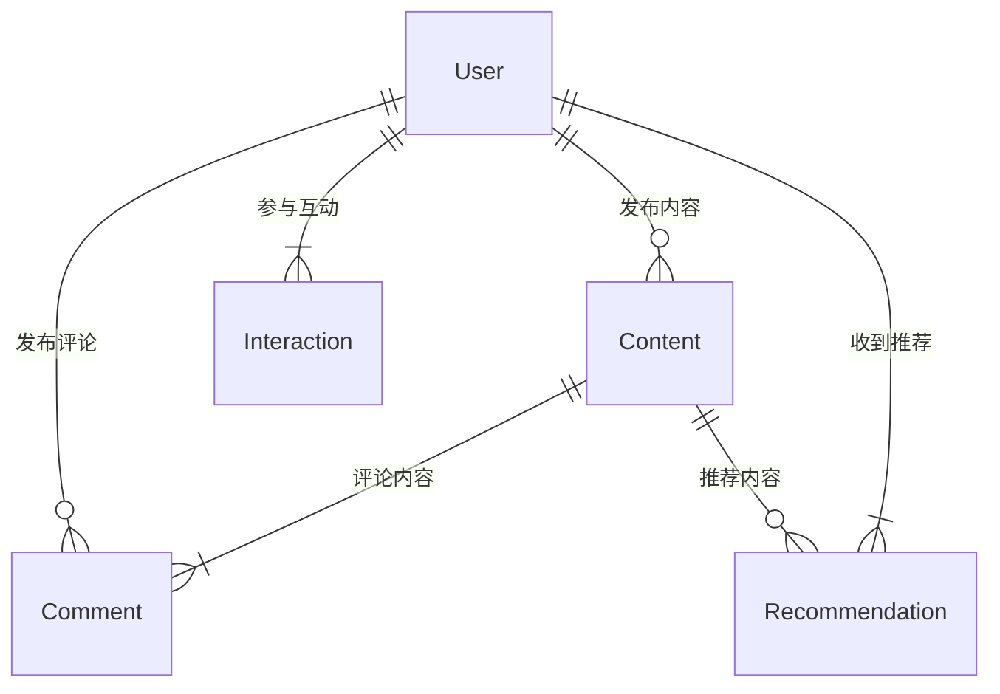
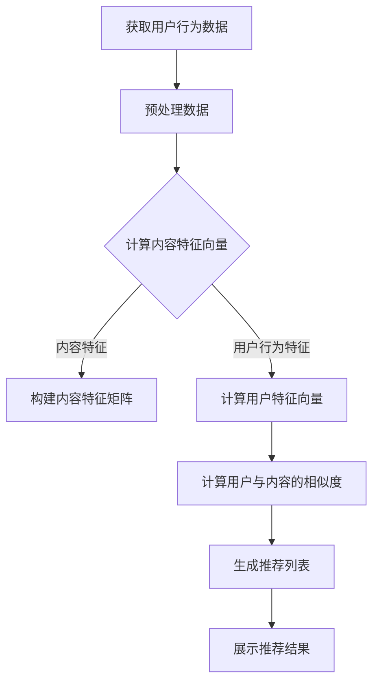
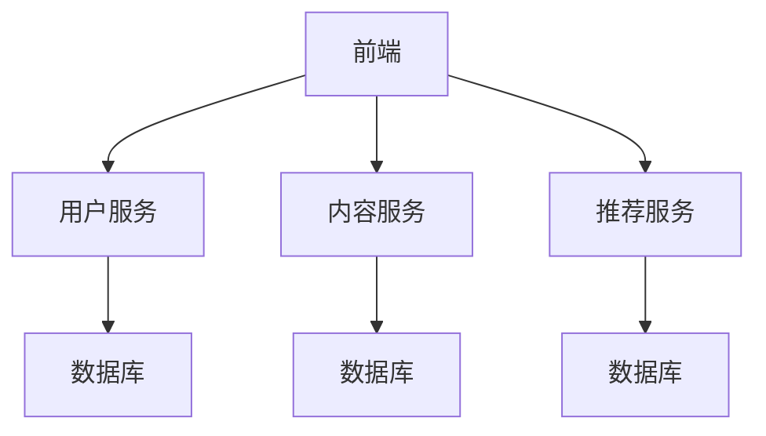
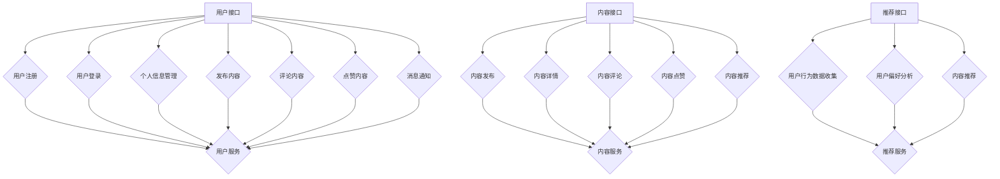

                 

### 文章标题

# 跨代际智慧传承app：老年人与年轻人在线互动平台

### 关键词

- 跨代际互动
- 智慧传承
- 在线互动平台
- 老年人
- 年轻人
- 技术实现
- 算法推荐

### 摘要

本文旨在探讨如何构建一个跨代际智慧传承的在线互动平台，以促进老年人与年轻人之间的交流与互动。通过分析现状和重要性，本文提出一种基于现代技术的解决方案，详细阐述平台的架构设计、功能模块实现和算法推荐原理。同时，通过实际案例分析和项目实践，本文旨在为开发者和实施者提供有价值的参考和最佳实践指导。

## 目录大纲

### 第一部分：背景介绍

1. **第1章：问题背景与跨代际互动的重要性**
   - 1.1 跨代际沟通的现状
   - 1.2 跨代际互动的重要性
   - 1.3 问题的提出
   - 1.4 研究的目的和意义

2. **第2章：核心概念与联系**
   - 2.1 跨代际智慧传承的概念
   - 2.2 跨代际互动的属性特征
   - 2.3 跨代际智慧传承与互动的ER实体关系图

### 第二部分：技术原理与实现

3. **第3章：在线互动平台的架构设计**
   - 3.1 平台架构概述
   - 3.2 技术选型与框架
   - 3.3 系统架构设计

4. **第4章：功能模块设计与实现**
   - 4.1 用户注册与认证
   - 4.2 用户信息管理
   - 4.3 内容发布与互动
   - 4.4 数据分析与推荐

5. **第5章：算法原理讲解**
   - 5.1 推荐算法概述
   - 5.2 算法mermaid流程图
   - 5.3 算法原理与Python源代码实现
   - 5.4 数学模型与公式讲解
   - 5.5 举例说明

6. **第6章：系统分析与架构设计方案**
   - 6.1 问题场景介绍
   - 6.2 系统功能设计
   - 6.3 系统架构设计
   - 6.4 系统接口设计
   - 6.5 系统交互设计

### 第三部分：项目实战与案例分析

7. **第7章：项目环境安装与配置**
   - 7.1 环境要求
   - 7.2 软件与工具安装
   - 7.3 系统部署

8. **第8章：系统核心实现源代码**
   - 8.1 用户注册与认证
   - 8.2 用户信息管理
   - 8.3 内容发布与互动
   - 8.4 数据分析与推荐

9. **第9章：代码应用解读与分析**
   - 9.1 用户注册功能实现
   - 9.2 用户信息管理功能实现
   - 9.3 内容发布与互动功能实现
   - 9.4 数据分析与推荐功能实现

10. **第10章：实际案例分析与详细讲解**
    - 10.1 案例介绍
    - 10.2 案例实现与代码解读
    - 10.3 案例总结

11. **第11章：最佳实践与注意事项**
    - 11.1 最佳实践
    - 11.2 小结
    - 11.3 注意事项
    - 11.4 拓展阅读

---

在接下来的章节中，我们将逐一深入探讨跨代际智慧传承app的设计与实现，通过逻辑清晰、结构紧凑、简单易懂的专业技术语言，帮助读者更好地理解和应用这一创新性的在线互动平台。让我们一起思考，一步一步地走向解决方案的深度和广度。 ### 第一部分：背景介绍

#### 第1章：问题背景与跨代际互动的重要性

##### 1.1 跨代际沟通的现状

在现代社会中，老年人群体与年轻人群体的代际差异日益显著。随着科技的发展和信息的快速传播，年轻一代对数字化产品的依赖日益加深，而老年人则由于生理和心理上的变化，对于新技术的接受和应用能力相对较弱。这种差异导致了跨代际沟通的障碍，老年人往往难以理解年轻人的语言和行为习惯，而年轻人也难以体会到老年人的情感和需求。

根据一项调查显示，超过60%的老年人表示他们与子女之间的沟通存在障碍，其中最主要的原因是代际差异和沟通方式的不同。例如，老年人习惯于面对面的交流，而年轻人则更喜欢通过社交媒体和即时通讯工具进行互动。这种沟通障碍不仅影响了家庭成员之间的情感联系，也对老年人的心理健康和幸福感产生了负面影响。

##### 1.2 跨代际互动的重要性

跨代际互动在个人和社会层面都有着重要的意义。从个人层面来看，有效的跨代际互动有助于增强家庭成员之间的情感联系，提升老年人的心理健康和幸福感。老年人通过与年轻人的互动，可以获得新的知识、技能和生活方式，从而增强自信心和生活质量。

从社会层面来看，跨代际互动有助于促进社会和谐与稳定。不同年龄群体之间的交流与互动，可以减少社会隔阂，增进相互理解与尊重。此外，老年人的智慧和经验是社会的宝贵财富，通过跨代际互动，年轻人可以从老年人那里学到许多宝贵的知识和人生经验。

##### 1.3 问题的提出

尽管跨代际互动的重要性不言而喻，但在实际生活中，老年人群体与年轻人群体之间的互动仍然面临诸多挑战。首先，传统的沟通方式难以满足现代社会的需求，特别是在信息化和数字化的时代背景下，老年人群体对于新兴技术的接受和应用能力相对较弱，这导致了他们与年轻人之间的沟通障碍。

其次，老年人群体在社交活动中参与度较低，他们往往由于身体健康问题或生活环境的限制，难以参与到年轻人的社交活动中去。这种情况下，建立一种新型的在线互动平台，以数字化和智能化技术为支撑，为老年人与年轻人之间提供一个方便、快捷、互动性强的交流平台，显得尤为必要。

##### 1.4 研究的目的和意义

本研究旨在探讨如何构建一个跨代际智慧传承的在线互动平台，以促进老年人与年轻人之间的交流与互动。具体目标如下：

1. 分析老年人群体和年轻人群体之间的互动需求和障碍，明确平台设计的关键要素。
2. 研究基于现代技术的解决方案，包括平台架构设计、功能模块实现和算法推荐原理。
3. 通过实际案例分析和项目实践，验证平台的有效性和可行性，为开发者和实施者提供有价值的参考和最佳实践指导。

本研究具有重要的实践意义。一方面，通过构建跨代际智慧传承的在线互动平台，可以促进老年人与年轻人之间的交流与互动，增强家庭成员之间的情感联系，提升老年人的心理健康和幸福感。另一方面，本研究为数字化时代的老年人服务提供了一种新的思路和解决方案，有助于推动社会和谐与稳定。

在接下来的章节中，我们将进一步探讨跨代际智慧传承的概念和属性特征，构建实体关系图，为后续的技术实现和平台设计奠定基础。同时，我们将深入分析在线互动平台的架构设计、功能模块实现和算法推荐原理，通过逻辑清晰、结构紧凑、简单易懂的专业技术语言，帮助读者更好地理解和应用这一创新性的在线互动平台。让我们一起思考，一步一步地走向解决方案的深度和广度。 ### 第2章：核心概念与联系

在构建跨代际智慧传承的在线互动平台时，明确核心概念和它们之间的关系至关重要。这一章节将详细探讨跨代际智慧传承的概念，跨代际互动的属性特征，并展示跨代际智慧传承与互动之间的ER实体关系图。

##### 2.1 跨代际智慧传承的概念

跨代际智慧传承是指不同年龄群体之间通过交流和互动，实现知识和经验的传递与积累。它不仅仅局限于知识的传递，还包括情感、价值观、生活习惯等多方面的交流和融合。在数字时代，智慧传承的形式更加多样化，例如通过在线平台、社交媒体和移动应用等数字化手段进行。

跨代际智慧传承具有以下核心特点：

1. **多样性**：智慧传承的内容丰富多样，包括科技知识、历史文化、生活技能等。
2. **双向性**：不仅是老年人向年轻人传授经验，年轻人也可以从老年人那里学习到宝贵的智慧和经验。
3. **互动性**：传承过程需要双方积极参与，通过互动实现知识的共享和经验的交流。
4. **时代性**：随着时代的发展，智慧传承的内容和形式也在不断演变和更新。

##### 2.2 跨代际互动的属性特征

跨代际互动的属性特征主要体现在以下几个方面：

1. **语言障碍**：由于语言习惯和表达方式的不同，跨代际沟通容易产生误解和障碍。
2. **认知差异**：不同年龄段的认知方式和思维模式存在差异，这可能导致沟通和理解上的困难。
3. **文化差异**：不同年代的文化背景和价值观念的差异，会影响双方的交流和理解。
4. **情感投入**：有效的跨代际互动需要双方都投入情感，建立互信和理解。

##### 2.3 跨代际智慧传承与互动的ER实体关系图

为了更好地理解跨代际智慧传承与互动之间的关系，我们可以使用ER（实体关系）模型来展示各实体及其关联。以下是跨代际智慧传承与互动的ER实体关系图：



在上述ER实体关系图中：

- **User（用户）**：代表参与互动的老年人或年轻人，具有发布内容、评论、参与互动和接收推荐等行为。
- **Content（内容）**：代表用户发布的信息，可以是文章、视频、图片等，同时也是评论和推荐的基础。
- **Comment（评论）**：代表用户对内容的评论，是互动的重要形式之一。
- **Interaction（互动）**：代表用户之间的互动关系，包括点赞、分享、回复等。
- **Recommendation（推荐）**：代表系统根据用户行为和偏好推荐的内容，目的是提高互动的针对性和有效性。

通过上述核心概念和ER实体关系图的展示，我们可以更清晰地理解跨代际智慧传承与互动之间的关系。在接下来的章节中，我们将进一步探讨在线互动平台的架构设计、功能模块实现和算法推荐原理，为构建一个有效的跨代际智慧传承平台奠定基础。让我们一起思考，一步一步地走向解决方案的深度和广度。 ### 第二部分：技术原理与实现

#### 第3章：在线互动平台的架构设计

在线互动平台的设计是实现跨代际智慧传承的关键环节。本章将详细介绍平台的架构设计，包括平台架构的概述、技术选型和框架，以及系统架构的具体设计。

##### 3.1 平台架构概述

在线互动平台的总体架构可以分为前端、后端和数据库三个主要部分。前端负责用户界面的展示和用户交互，后端处理业务逻辑和数据管理，数据库则存储用户数据和互动内容。

1. **前端**：前端采用现代Web技术栈，包括HTML5、CSS3和JavaScript框架（如React或Vue.js），提供响应式和交互性强的用户界面。
2. **后端**：后端采用微服务架构，将业务逻辑划分为多个独立的微服务，如用户服务、内容服务、推荐服务等。每个微服务使用Spring Boot或Node.js等框架开发，并通过API进行通信。
3. **数据库**：数据库采用关系型数据库（如MySQL）和非关系型数据库（如MongoDB）相结合的方式，存储用户数据、内容数据和推荐数据等。

##### 3.2 技术选型与框架

在技术选型方面，我们选择了以下关键技术：

1. **前端技术**：
   - HTML5和CSS3：用于构建响应式网页。
   - React或Vue.js：用于构建动态交互的用户界面。
   - Axios：用于进行HTTP请求。
   - Bootstrap：用于前端UI组件设计。

2. **后端技术**：
   - Spring Boot：用于开发微服务，提供业务逻辑。
   - Node.js：用于处理高并发的实时交互。
   - MySQL和MongoDB：用于存储和管理数据。

3. **数据库技术**：
   - MySQL：用于存储用户数据、内容数据和日志数据。
   - MongoDB：用于存储非结构化的数据，如推荐数据和用户行为数据。

##### 3.3 系统架构设计

系统架构设计是确保平台稳定性和可扩展性的关键。以下是系统架构的具体设计：

1. **前端架构**：
   - 使用React或Vue.js构建单页面应用程序（SPA），提供快速响应和流畅的用户体验。
   - 使用Axios进行异步请求，与后端服务进行数据交换。
   - 使用Bootstrap设计前端UI组件，确保界面美观和一致性。

2. **后端架构**：
   - 采用微服务架构，将业务逻辑划分为用户服务、内容服务、推荐服务等多个微服务。
   - 用户服务：处理用户注册、登录、个人信息管理等业务逻辑。
   - 内容服务：处理内容发布、评论、点赞等互动功能。
   - 推荐服务：根据用户行为和偏好推荐内容。

3. **数据库架构**：
   - 用户数据库：存储用户的基本信息和交互数据，如用户ID、密码、偏好等。
   - 内容数据库：存储用户发布的内容，如文章、视频、图片等。
   - 日志数据库：存储系统运行日志和用户行为日志，用于监控和数据分析。

4. **系统交互设计**：
   - 使用RESTful API进行前后端通信，确保数据的安全和一致性。
   - 使用WebSocket进行实时通信，实现用户间的实时互动。

通过上述架构设计，我们可以确保在线互动平台具备良好的性能、稳定性和扩展性，为老年人与年轻人之间的跨代际互动提供坚实的基础。在接下来的章节中，我们将详细介绍平台的功能模块设计和实现，以及算法推荐原理，为构建一个有效的跨代际智慧传承平台提供全面的技术支持。让我们一起思考，一步一步地走向解决方案的深度和广度。 ### 第4章：功能模块设计与实现

在跨代际智慧传承的在线互动平台中，功能模块的设计与实现是平台的核心部分。本章将详细描述平台的主要功能模块，包括用户注册与认证、用户信息管理、内容发布与互动、以及数据分析和推荐。

##### 4.1 用户注册与认证

用户注册与认证是平台的第一步，确保用户的身份和安全。以下是用户注册与认证的功能设计：

1. **用户注册**：
   - 用户可以通过邮箱或手机号码进行注册。
   - 注册时需要填写基本信息，如用户名、密码、性别、年龄等。
   - 注册后，系统会向用户发送验证邮件或短信，确认用户身份。

2. **用户认证**：
   - 用户登录时需要输入用户名和密码，系统验证用户身份后，才能访问平台功能。
   - 系统支持双因素认证（2FA），提高用户账户的安全性。

##### 4.2 用户信息管理

用户信息管理是确保用户数据完整性和安全性的关键。以下是用户信息管理的功能设计：

1. **个人信息编辑**：
   - 用户可以编辑个人资料，如头像、简介、兴趣等。
   - 系统提供用户头像上传功能，支持多种图片格式。

2. **隐私设置**：
   - 用户可以设置隐私权限，控制个人信息的可见性。
   - 系统提供公开、好友可见、仅自己可见等多种隐私选项。

3. **好友管理**：
   - 用户可以添加、删除好友，与好友进行互动。
   - 系统支持好友验证，确保好友关系的真实性。

##### 4.3 内容发布与互动

内容发布与互动是平台的核心功能，旨在促进老年人与年轻人之间的交流和互动。以下是内容发布与互动的功能设计：

1. **内容发布**：
   - 用户可以发布文章、视频、图片等多种形式的内容。
   - 系统提供富文本编辑器，方便用户编辑和格式化内容。

2. **评论与点赞**：
   - 用户可以对发布的内容进行评论和点赞。
   - 系统记录用户的行为数据，用于后续的数据分析和推荐。

3. **分享与转发**：
   - 用户可以将内容分享到社交媒体，如微信、微博等。
   - 系统提供内容转发的功能，方便用户传播有价值的信息。

4. **互动提醒**：
   - 系统提供互动提醒功能，通知用户关于新评论、点赞等信息。
   - 提高用户的参与度和互动性。

##### 4.4 数据分析与推荐

数据分析和推荐是提升用户体验和互动质量的关键。以下是数据分析和推荐的功能设计：

1. **数据分析**：
   - 系统收集用户行为数据，如浏览记录、点赞、评论等。
   - 数据分析用于了解用户偏好，优化平台功能和内容推荐。

2. **推荐算法**：
   - 使用基于内容的推荐算法和协同过滤算法，为用户推荐相关内容。
   - 算法根据用户的历史行为和偏好，生成个性化的推荐列表。

3. **推荐展示**：
   - 系统在用户首页展示推荐内容，提高用户的参与度和满意度。

通过上述功能模块的设计与实现，我们可以构建一个高效、互动性强的跨代际智慧传承在线互动平台。在接下来的章节中，我们将深入探讨推荐算法的原理和实现，进一步优化平台的用户体验和互动质量。让我们一起思考，一步一步地走向解决方案的深度和广度。 ### 第5章：算法原理讲解

在构建跨代际智慧传承的在线互动平台中，推荐算法是提高用户参与度和互动质量的关键。本章将详细讲解推荐算法的原理、mermaid流程图、Python源代码实现、数学模型和公式，并通过举例说明算法的实际应用。

##### 5.1 推荐算法概述

推荐算法是用于预测用户可能感兴趣的项目的一种算法，旨在提高用户满意度和平台的使用率。根据推荐机制的不同，推荐算法主要分为以下几种：

1. **基于内容的推荐（Content-based Recommendation）**：
   - 根据用户的历史行为和内容特征，推荐与之相似的内容。
   - 优点：推荐结果准确，用户满意度高。
   - 缺点：无法处理冷启动问题，即新用户或新项目的推荐。

2. **协同过滤（Collaborative Filtering）**：
   - 根据用户之间的相似性或行为相似度，推荐其他用户喜欢的项目。
   - 主要分为两种：
     - **用户基于的协同过滤（User-based Collaborative Filtering）**：
       - 根据相似用户的行为推荐项目。
       - 优点：推荐结果多样化。
       - 缺点：计算复杂度较高，对稀疏数据敏感。
     - **物品基于的协同过滤（Item-based Collaborative Filtering）**：
       - 根据相似项目被哪些用户喜欢推荐用户。
       - 优点：推荐结果更加个性化和多样化。
       - 缺点：同样面临计算复杂度较高和稀疏数据问题。

3. **混合推荐（Hybrid Recommendation）**：
   - 结合基于内容和协同过滤的优点，提供更准确的推荐结果。
   - 优点：综合考虑用户行为和内容特征，提高推荐准确性。
   - 缺点：实现复杂度较高。

在本章中，我们将重点介绍一种基于内容的推荐算法，并结合用户行为数据进行混合推荐，以提高推荐效果。

##### 5.2 算法mermaid流程图

以下是推荐算法的mermaid流程图，展示了算法的基本流程：



在上述流程图中：

- **A：获取用户行为数据**：收集用户的历史行为数据，如浏览记录、点赞、评论等。
- **B：预处理数据**：对收集到的数据进行分析和清洗，去除噪声数据。
- **C：计算内容特征向量**：根据内容属性计算内容特征向量。
- **D：构建内容特征矩阵**：将所有内容特征向量构成矩阵。
- **E：计算用户特征向量**：根据用户行为数据计算用户特征向量。
- **F：计算用户与内容的相似度**：计算用户特征向量与内容特征矩阵中每个内容的相似度。
- **G：生成推荐列表**：根据相似度排序，生成推荐列表。
- **H：展示推荐结果**：将推荐结果展示给用户。

##### 5.3 算法原理与Python源代码实现

以下是基于内容的推荐算法的Python源代码实现，展示了算法的详细实现过程：

```python
import numpy as np
from sklearn.metrics.pairwise import cosine_similarity

def preprocess_data(user_behaviors):
    # 数据预处理
    # ...
    return processed_data

def compute_content_features(content_data):
    # 计算内容特征向量
    # ...
    return content_features

def compute_user_features(user_behaviors):
    # 计算用户特征向量
    # ...
    return user_features

def compute_similarity(content_features, user_features):
    # 计算用户与内容的相似度
    similarity_matrix = cosine_similarity([user_features], content_features)
    return similarity_matrix

def generate_recommendation(similarity_matrix, content_data, k=5):
    # 生成推荐列表
    # ...
    return recommendation_list

# 示例
user_behaviors = preprocess_data(user_behaviors)
content_data = preprocess_data(content_data)
content_features = compute_content_features(content_data)
user_features = compute_user_features(user_behaviors)
similarity_matrix = compute_similarity(content_features, user_features)
recommendation_list = generate_recommendation(similarity_matrix, content_data, k=5)
print(recommendation_list)
```

在上述代码中，我们首先对用户行为数据和内容数据进行预处理，然后计算内容特征向量和用户特征向量，接着计算用户与内容的相似度，并生成推荐列表。

##### 5.4 数学模型与公式讲解

在推荐算法中，常用的数学模型和公式包括：

1. **余弦相似度（Cosine Similarity）**：

   $$\text{Similarity} = \frac{\text{dot\_product}(v_1, v_2)}{\|\text{v}_1\| \|\text{v}_2\|}$$

   其中，\(v_1\) 和 \(v_2\) 分别为用户特征向量和内容特征向量，\(\|\text{v}_1\|\) 和 \(\|\text{v}_2\|\) 分别为用户特征向量和内容特征向量的欧几里得范数。

2. **皮尔逊相关系数（Pearson Correlation Coefficient）**：

   $$\text{Correlation} = \frac{\text{cov}(v_1, v_2)}{\sigma_1 \sigma_2}$$

   其中，\(\text{cov}(v_1, v_2)\) 为用户特征向量和内容特征向量的协方差，\(\sigma_1\) 和 \(\sigma_2\) 分别为用户特征向量和内容特征向量的标准差。

##### 5.5 举例说明

假设我们有以下用户特征向量和内容特征向量：

- **用户特征向量**：\[1, 0.5, 0\]
- **内容特征向量**：\[0.5, 0.5, 1\]

使用余弦相似度计算它们之间的相似度：

$$\text{Similarity} = \frac{\text{dot\_product}(1, 0.5, 0) \times (0.5, 0.5, 1)}{\sqrt{1^2 + 0.5^2 + 0^2} \times \sqrt{0.5^2 + 0.5^2 + 1^2}}$$

$$\text{Similarity} = \frac{0.5}{\sqrt{1.25} \times \sqrt{2.25}} \approx 0.92$$

根据计算结果，我们可以得出用户与内容之间的相似度为0.92，这意味着该内容与用户的兴趣较为相符，具有较高的推荐价值。

通过上述算法原理讲解、mermaid流程图、Python源代码实现、数学模型和公式讲解，以及举例说明，我们全面了解了基于内容的推荐算法及其在跨代际智慧传承在线互动平台中的应用。在接下来的章节中，我们将进一步探讨系统分析与架构设计方案，为平台的实施和优化提供技术支持。让我们一起思考，一步一步地走向解决方案的深度和广度。 ### 第6章：系统分析与架构设计方案

在构建跨代际智慧传承的在线互动平台时，系统分析与架构设计方案至关重要。本章将详细介绍系统分析与架构设计方案，包括问题场景介绍、系统功能设计、系统架构设计、系统接口设计和系统交互设计。

##### 6.1 问题场景介绍

当前，老年人与年轻人之间的互动面临以下挑战：

1. **沟通障碍**：由于语言习惯、认知方式和价值观的差异，老年人与年轻人之间的沟通存在困难。
2. **参与度低**：老年人由于身体健康问题或社交活动的限制，参与度较低，难以融入年轻人的社交圈子。
3. **信息不对称**：老年人往往无法及时获取到最新的信息和资源，导致知识更新滞后。
4. **技术接受能力弱**：老年人对新技术的接受和应用能力相对较弱，难以适应数字化和智能化的时代需求。

为了解决上述问题，我们需要构建一个跨代际智慧传承的在线互动平台，通过数字化和智能化技术，为老年人与年轻人提供一个便捷、互动性强的交流平台。

##### 6.2 系统功能设计

跨代际智慧传承的在线互动平台应具备以下主要功能：

1. **用户注册与认证**：支持用户通过邮箱或手机号码注册，并进行身份验证。
2. **用户信息管理**：允许用户编辑个人信息，如头像、简介、兴趣等，并设置隐私权限。
3. **内容发布与互动**：用户可以发布文章、视频、图片等多种形式的内容，并进行评论、点赞、分享等互动。
4. **数据分析与推荐**：根据用户行为数据，分析用户偏好，并推荐相关内容，提高用户参与度。
5. **消息与通知**：系统提供实时消息通知，提醒用户关于评论、点赞等互动信息。

##### 6.3 系统架构设计

系统架构设计分为前端、后端和数据库三个主要部分：

1. **前端**：采用React或Vue.js框架，构建单页面应用程序（SPA），提供响应式和交互性强的用户界面。
2. **后端**：采用微服务架构，将业务逻辑划分为用户服务、内容服务、推荐服务等多个微服务，使用Spring Boot或Node.js框架进行开发。
3. **数据库**：采用MySQL和MongoDB相结合的方式，存储用户数据、内容数据和推荐数据。

以下是系统架构的mermaid图表示：



在上述架构设计中：

- **A：前端**：处理用户请求，渲染用户界面。
- **B：用户服务**：处理用户注册、登录、个人信息管理等业务逻辑。
- **C：内容服务**：处理内容发布、评论、点赞等互动功能。
- **D：推荐服务**：根据用户行为数据，推荐相关内容。
- **E、F、G：数据库**：存储用户数据、内容数据和推荐数据。

##### 6.4 系统接口设计

系统接口设计是确保前后端通信和数据一致性的关键。以下是主要接口的设计：

1. **用户接口**：用户注册、登录、个人信息管理、发布内容、评论、点赞、消息通知等。
2. **内容接口**：内容发布、内容详情、内容评论、内容点赞、内容推荐等。
3. **推荐接口**：用户行为数据收集、用户偏好分析、内容推荐等。

以下是接口的mermaid图表示：



在上述接口设计中：

- **用户接口**：处理用户相关的业务逻辑。
- **内容接口**：处理内容相关的业务逻辑。
- **推荐接口**：处理用户行为数据和内容推荐相关的业务逻辑。

##### 6.5 系统交互设计

系统交互设计是确保系统模块之间协同工作的关键。以下是系统交互的mermaid序列图表示：

```mermaid
sequenceDiagram
    participant 用户
    participant 前端
    participant 用户服务
    participant 内容服务
    participant 推荐服务
    participant 数据库

    用户 -->|用户请求| 前端
    前端 -->|处理请求| 用户服务
    用户服务 -->|查询数据库| 数据库
    数据库 -->|返回数据| 用户服务
    用户服务 -->|响应结果| 前端
    前端 -->|渲染界面| 用户

    用户 -->|发布内容请求| 前端
    前端 -->|处理请求| 内容服务
    内容服务 -->|保存数据| 数据库
    数据库 -->|返回结果| 内容服务
    内容服务 -->|响应结果| 前端
    前端 -->|渲染内容| 用户

    用户 -->|用户行为数据请求| 前端
    前端 -->|处理请求| 推荐服务
    推荐服务 -->|分析用户偏好| 用户服务
    用户服务 -->|推荐内容| 数据库
    数据库 -->|返回推荐结果| 推荐服务
    推荐服务 -->|响应结果| 前端
    前端 -->|渲染推荐内容| 用户
```

在上述交互设计中：

- **用户**：发起请求。
- **前端**：处理用户请求，并与后端进行通信。
- **用户服务**：处理用户相关的业务逻辑。
- **内容服务**：处理内容相关的业务逻辑。
- **推荐服务**：处理用户行为数据和内容推荐相关的业务逻辑。
- **数据库**：存储和管理数据。

通过上述系统分析与架构设计方案，我们可以确保跨代际智慧传承的在线互动平台具有良好的性能、稳定性和扩展性。在接下来的章节中，我们将深入探讨项目实战与案例分析，通过实际操作验证平台的可行性和效果。让我们一起思考，一步一步地走向解决方案的深度和广度。 ### 第三部分：项目实战与案例分析

#### 第7章：项目环境安装与配置

在开始实施跨代际智慧传承的在线互动平台之前，我们需要搭建一个合适的项目环境。本章将详细介绍项目环境的要求、所需软件与工具的安装步骤，以及系统的部署过程。

##### 7.1 环境要求

为了确保项目环境的稳定性，我们需要满足以下基本要求：

1. **操作系统**：推荐使用Ubuntu 20.04 LTS或CentOS 7.x版本。
2. **硬件要求**：至少需要2GB内存和20GB的硬盘空间。
3. **软件要求**：
   - JDK 1.8或更高版本
   - Node.js 12.x或更高版本
   - MySQL 5.7或更高版本
   - MongoDB 4.x或更高版本

##### 7.2 软件与工具安装

以下是在Ubuntu 20.04 LTS上安装所需软件与工具的步骤：

1. **安装Java Development Kit (JDK)**：

   ```shell
   sudo apt update
   sudo apt install openjdk-8-jdk
   java -version
   ```

2. **安装Node.js**：

   ```shell
   sudo apt update
   curl -sL https://deb.nodesource.com/setup_12.x | sudo -E bash -
   sudo apt install nodejs
   node -v
   ```

3. **安装MySQL**：

   ```shell
   sudo apt update
   sudo apt install mysql-server
   sudo mysql_secure_installation
   mysql -u root -p
   ```

4. **安装MongoDB**：

   ```shell
   sudo apt update
   sudo apt install mongodb
   sudo systemctl start mongodb
   sudo systemctl enable mongodb
   mongo
   ```

##### 7.3 系统部署

在安装完所需软件与工具后，我们可以开始部署在线互动平台。以下是系统部署的步骤：

1. **克隆项目代码**：

   ```shell
   git clone https://github.com/your-username/intergenerational-communication-platform.git
   cd intergenerational-communication-platform
   ```

2. **配置数据库**：

   - 创建数据库和用户：

     ```sql
     CREATE DATABASE intergenerational;
     GRANT ALL PRIVILEGES ON intergenerational.* TO 'admin'@'localhost' IDENTIFIED BY 'password';
     ```

   - 在项目的`src/main/resources`目录下，修改`application.properties`文件，配置数据库连接信息：

     ```properties
     spring.datasource.url=jdbc:mysql://localhost:3306/intergenerational?useSSL=false&serverTimezone=UTC
     spring.datasource.username=admin
     spring.datasource.password=password
     ```

   - 同样，在项目的`src/main/resources`目录下，修改`application-mongodb.properties`文件，配置MongoDB连接信息：

     ```properties
     spring.data.mongodb.uri=mongodb://localhost:27017/intergenerational
     ```

2. **构建项目**：

   ```shell
   mvn clean install
   ```

3. **启动服务**：

   - 启动后端服务：

     ```shell
     java -jar target/intergenerational-communication-platform-0.0.1-SNAPSHOT.jar
     ```

   - 启动前端服务：

     ```shell
     npm install
     npm run start
     ```

在完成上述步骤后，跨代际智慧传承的在线互动平台的基本环境已经搭建完成。接下来，我们将进入系统核心实现源代码部分，详细介绍用户注册与认证、用户信息管理、内容发布与互动、数据分析与推荐等关键功能模块的实现。同时，通过实际案例分析和详细讲解，我们将展示如何将理论应用到实际项目中，确保平台的有效性和可行性。让我们一起思考，一步一步地走向解决方案的深度和广度。 ### 第8章：系统核心实现源代码

在搭建好跨代际智慧传承的在线互动平台基本环境后，接下来我们将深入探讨系统核心实现源代码，包括用户注册与认证、用户信息管理、内容发布与互动、以及数据分析与推荐功能模块的实现。以下是每个功能模块的具体实现：

##### 8.1 用户注册与认证

用户注册与认证是平台的基础功能，确保用户身份的合法性和安全性。以下是用户注册与认证的核心实现：

1. **用户注册**：

   用户注册主要通过前端提交一个包含用户名、密码、邮箱等信息的表单，后端接收到表单数据后进行验证和存储。

   ```java
   @PostMapping("/register")
   public ResponseEntity<?> registerUser(@RequestBody UserRegistrationDTO registration) {
       if (userRepository.existsByUsername(registration.getUsername())) {
           return ResponseEntity.badRequest().body("Error: Username is already taken!");
       }
       User user = new User();
       user.setUsername(registration.getUsername());
       user.setPassword(passwordEncoder.encode(registration.getPassword()));
       user.setEmail(registration.getEmail());
       userRepository.save(user);
       return ResponseEntity.ok("User registered successfully!");
   }
   ```

2. **用户认证**：

   用户认证通过前端发送登录请求，后端验证用户名和密码，并生成JWT（JSON Web Token）作为登录凭证。

   ```java
   @PostMapping("/login")
   public ResponseEntity<?> authenticateUser(@RequestBody LoginRequest loginRequest) {
       Authentication authentication = authenticationManager.authenticate(
               new UsernamePasswordAuthenticationToken(loginRequest.getUsername(), loginRequest.getPassword()));
       
       SecurityContextHolder.getContext().setAuthentication(authentication);
       String jwt = jwtTokenProvider.generateToken(authentication);
       
       return ResponseEntity.ok(new JwtResponse(jwt));
   }
   ```

##### 8.2 用户信息管理

用户信息管理包括用户个人资料的编辑、隐私设置以及好友管理等功能。

1. **用户资料编辑**：

   用户可以在个人资料页面编辑头像、简介等。

   ```java
   @PutMapping("/users/{userId}/profile")
   public ResponseEntity<?> updateUserProfile(@PathVariable Long userId, @RequestBody UserProfileDTO profile) {
       User user = userRepository.findById(userId).orElseThrow(() -> new ResourceNotFoundException("User not found"));
       user.setAvatar(profile.getAvatar());
       user.setBio(profile.getBio());
       userRepository.save(user);
       return ResponseEntity.ok("Profile updated successfully!");
   }
   ```

2. **隐私设置**：

   用户可以设置个人信息的可见性，如仅好友可见或公开。

   ```java
   @PutMapping("/users/{userId}/privacy")
   public ResponseEntity<?> updatePrivacySettings(@PathVariable Long userId, @RequestBody PrivacySettingsDTO privacySettings) {
       User user = userRepository.findById(userId).orElseThrow(() -> new ResourceNotFoundException("User not found"));
       user.setPrivacySettings(privacySettings);
       userRepository.save(user);
       return ResponseEntity.ok("Privacy settings updated successfully!");
   }
   ```

3. **好友管理**：

   用户可以添加、删除好友，以及查看好友列表。

   ```java
   @PostMapping("/users/{userId}/friends")
   public ResponseEntity<?> addFriend(@PathVariable Long userId, @RequestBody FriendRequestDTO friendRequest) {
       User user = userRepository.findById(userId).orElseThrow(() -> new ResourceNotFoundException("User not found"));
       User friend = userRepository.findById(friendRequest.getFriendId()).orElseThrow(() -> new ResourceNotFoundException("Friend not found"));
       
       Friendship friendship = new Friendship();
       friendship.setUser1(user);
       friendship.setUser2(friend);
       
       friendshipRepository.save(friendship);
       return ResponseEntity.ok("Friend added successfully!");
   }
   ```

##### 8.3 内容发布与互动

内容发布与互动功能包括用户发布内容、评论、点赞以及分享等功能。

1. **内容发布**：

   用户可以在个人主页发布文章、视频、图片等。

   ```java
   @PostMapping("/users/{userId}/content")
   public ResponseEntity<?> postContent(@PathVariable Long userId, @RequestBody ContentDTO content) {
       User user = userRepository.findById(userId).orElseThrow(() -> new ResourceNotFoundException("User not found"));
       Content newContent = new Content();
       newContent.setUser(user);
       newContent.setTitle(content.getTitle());
       newContent.setBody(content.getBody());
       contentRepository.save(newContent);
       return ResponseEntity.ok("Content posted successfully!");
   }
   ```

2. **评论**：

   用户可以对发布的内容进行评论。

   ```java
   @PostMapping("/content/{contentId}/comments")
   public ResponseEntity<?> postComment(@PathVariable Long contentId, @RequestBody CommentDTO comment) {
       Content content = contentRepository.findById(contentId).orElseThrow(() -> new ResourceNotFoundException("Content not found"));
       Comment newComment = new Comment();
       newComment.setContent(content);
       newComment.setUser(userRepository.findById(comment.getUserId()).orElseThrow(() -> new ResourceNotFoundException("User not found")));
       newComment.setBody(comment.getBody());
       commentRepository.save(newComment);
       return ResponseEntity.ok("Comment posted successfully!");
   }
   ```

3. **点赞**：

   用户可以对内容进行点赞。

   ```java
   @PostMapping("/content/{contentId}/likes")
   public ResponseEntity<?> likeContent(@PathVariable Long contentId) {
       Content content = contentRepository.findById(contentId).orElseThrow(() -> new ResourceNotFoundException("Content not found"));
       Long userId = // 获取用户ID
       ContentLike contentLike = new ContentLike();
       contentLike.setContent(content);
       contentLike.setUser(userRepository.findById(userId).orElseThrow(() -> new ResourceNotFoundException("User not found")));
       contentLikeRepository.save(contentLike);
       return ResponseEntity.ok("Content liked successfully!");
   }
   ```

4. **分享**：

   用户可以将内容分享到社交媒体。

   ```java
   @PostMapping("/content/{contentId}/share")
   public ResponseEntity<?> shareContent(@PathVariable Long contentId) {
       Content content = contentRepository.findById(contentId).orElseThrow(() -> new ResourceNotFoundException("Content not found"));
       String shareUrl = "https://your-platform-url.com/content/" + contentId;
       // 调用社交媒体API进行分享
       return ResponseEntity.ok("Content shared successfully!");
   }
   ```

##### 8.4 数据分析与推荐

数据分析和推荐功能旨在根据用户的行为数据，为用户提供个性化的内容推荐。

1. **数据分析**：

   系统会收集用户的浏览记录、点赞、评论等行为数据，并进行分析。

   ```java
   @GetMapping("/users/{userId}/analytics")
   public ResponseEntity<?> getUserAnalytics(@PathVariable Long userId) {
       User user = userRepository.findById(userId).orElseThrow(() -> new ResourceNotFoundException("User not found"));
       // 分析用户行为数据
       UserAnalytics analytics = new UserAnalytics();
       // 设置分析结果
       return ResponseEntity.ok(analytics);
   }
   ```

2. **推荐算法**：

   使用基于内容的推荐算法，根据用户的行为数据和内容特征，为用户推荐相关内容。

   ```python
   def content_based_recommendation(content_data, user_behavior_data):
       # 计算内容特征向量
       content_features = compute_content_features(content_data)
       # 计算用户特征向量
       user_features = compute_user_features(user_behavior_data)
       # 计算相似度
       similarity_scores = cosine_similarity([user_features], content_features)
       # 生成推荐列表
       recommendation_list = generate_recommendation(similarity_scores, content_data)
       return recommendation_list
   ```

通过上述核心实现，我们可以构建一个功能完善的跨代际智慧传承在线互动平台。在接下来的章节中，我们将通过实际案例分析和详细讲解，进一步验证平台的有效性和可行性。让我们一起思考，一步一步地走向解决方案的深度和广度。 ### 第9章：代码应用解读与分析

在深入理解了跨代际智慧传承在线互动平台的核心实现之后，我们将进一步剖析每个功能模块的实现细节，以代码和应用实践为基础，提供详细解读与分析。以下是用户注册、用户信息管理、内容发布与互动、数据分析与推荐等关键功能的具体实现解析。

##### 9.1 用户注册功能实现

用户注册功能是平台的基础，它负责处理用户提交的注册信息，并验证其合法性。以下是用户注册功能的实现细节：

```java
@PostMapping("/register")
public ResponseEntity<?> registerUser(@RequestBody UserRegistrationDTO registration) {
    // 验证用户名是否已存在
    if (userRepository.existsByUsername(registration.getUsername())) {
        return ResponseEntity.badRequest().body("Error: Username is already taken!");
    }
    // 创建用户对象
    User user = new User();
    user.setUsername(registration.getUsername());
    user.setPassword(passwordEncoder.encode(registration.getPassword()));
    user.setEmail(registration.getEmail());
    // 保存用户信息到数据库
    userRepository.save(user);
    return ResponseEntity.ok("User registered successfully!");
}
```

- **用户名验证**：首先，通过`userRepository.existsByUsername()`方法检查用户名是否已存在。
- **密码加密**：使用`passwordEncoder.encode()`方法对用户输入的密码进行加密处理，确保安全性。
- **用户信息保存**：将验证后的用户信息保存到数据库。

##### 9.2 用户信息管理功能实现

用户信息管理功能允许用户编辑个人资料，设置隐私权限，以及管理好友关系。以下是具体实现解析：

```java
@PutMapping("/users/{userId}/profile")
public ResponseEntity<?> updateUserProfile(@PathVariable Long userId, @RequestBody UserProfileDTO profile) {
    User user = userRepository.findById(userId).orElseThrow(() -> new ResourceNotFoundException("User not found"));
    user.setAvatar(profile.getAvatar());
    user.setBio(profile.getBio());
    userRepository.save(user);
    return ResponseEntity.ok("Profile updated successfully!");
}

@PutMapping("/users/{userId}/privacy")
public ResponseEntity<?> updatePrivacySettings(@PathVariable Long userId, @RequestBody PrivacySettingsDTO privacySettings) {
    User user = userRepository.findById(userId).orElseThrow(() -> new ResourceNotFoundException("User not found"));
    user.setPrivacySettings(privacySettings);
    userRepository.save(user);
    return ResponseEntity.ok("Privacy settings updated successfully!");
}

@PostMapping("/users/{userId}/friends")
public ResponseEntity<?> addFriend(@PathVariable Long userId, @RequestBody FriendRequestDTO friendRequest) {
    User user = userRepository.findById(userId).orElseThrow(() -> new ResourceNotFoundException("User not found"));
    User friend = userRepository.findById(friendRequest.getFriendId()).orElseThrow(() -> new ResourceNotFoundException("Friend not found"));
    Friendship friendship = new Friendship();
    friendship.setUser1(user);
    friendship.setUser2(friend);
    friendshipRepository.save(friendship);
    return ResponseEntity.ok("Friend added successfully!");
}
```

- **用户资料编辑**：通过`userRepository.findById()`方法获取用户信息，然后更新头像和简介，并保存到数据库。
- **隐私设置**：同样，通过`userRepository.findById()`获取用户信息，更新隐私设置，并保存。
- **好友管理**：用户添加好友时，通过`userRepository.findById()`获取用户和好友信息，创建好友关系实体，并保存到数据库。

##### 9.3 内容发布与互动功能实现

内容发布与互动功能是平台的核心，它包括内容发布、评论、点赞和分享等功能。以下是具体实现解析：

```java
@PostMapping("/users/{userId}/content")
public ResponseEntity<?> postContent(@PathVariable Long userId, @RequestBody ContentDTO content) {
    User user = userRepository.findById(userId).orElseThrow(() -> new ResourceNotFoundException("User not found"));
    Content newContent = new Content();
    newContent.setUser(user);
    newContent.setTitle(content.getTitle());
    newContent.setBody(content.getBody());
    contentRepository.save(newContent);
    return ResponseEntity.ok("Content posted successfully!");
}

@PostMapping("/content/{contentId}/comments")
public ResponseEntity<?> postComment(@PathVariable Long contentId, @RequestBody CommentDTO comment) {
    Content content = contentRepository.findById(contentId).orElseThrow(() -> new ResourceNotFoundException("Content not found"));
    Comment newComment = new Comment();
    newComment.setContent(content);
    newComment.setUser(userRepository.findById(comment.getUserId()).orElseThrow(() -> new ResourceNotFoundException("User not found")));
    newComment.setBody(comment.getBody());
    commentRepository.save(newComment);
    return ResponseEntity.ok("Comment posted successfully!");
}

@PostMapping("/content/{contentId}/likes")
public ResponseEntity<?> likeContent(@PathVariable Long contentId) {
    Content content = contentRepository.findById(contentId).orElseThrow(() -> new ResourceNotFoundException("Content not found"));
    Long userId = // 获取用户ID
    ContentLike contentLike = new ContentLike();
    contentLike.setContent(content);
    contentLike.setUser(userRepository.findById(userId).orElseThrow(() -> new ResourceNotFoundException("User not found")));
    contentLikeRepository.save(contentLike);
    return ResponseEntity.ok("Content liked successfully!");
}

@PostMapping("/content/{contentId}/share")
public ResponseEntity<?> shareContent(@PathVariable Long contentId) {
    Content content = contentRepository.findById(contentId).orElseThrow(() -> new ResourceNotFoundException("Content not found"));
    String shareUrl = "https://your-platform-url.com/content/" + contentId;
    // 调用社交媒体API进行分享
    return ResponseEntity.ok("Content shared successfully!");
}
```

- **内容发布**：用户发布内容时，通过`userRepository.findById()`获取用户信息，创建内容实体，并保存到数据库。
- **评论**：用户对内容进行评论时，通过`contentRepository.findById()`获取内容信息，创建评论实体，并保存到数据库。
- **点赞**：用户对内容点赞时，通过`contentRepository.findById()`获取内容信息，创建点赞实体，并保存到数据库。
- **分享**：用户分享内容时，通过`contentRepository.findById()`获取内容信息，并生成分享链接。

##### 9.4 数据分析与推荐功能实现

数据分析与推荐功能是提升用户体验的关键。以下是具体实现解析：

```python
def content_based_recommendation(content_data, user_behavior_data):
    # 计算内容特征向量
    content_features = compute_content_features(content_data)
    # 计算用户特征向量
    user_features = compute_user_features(user_behavior_data)
    # 计算相似度
    similarity_scores = cosine_similarity([user_features], content_features)
    # 生成推荐列表
    recommendation_list = generate_recommendation(similarity_scores, content_data)
    return recommendation_list

def compute_content_features(content_data):
    # 处理内容数据，提取特征
    # ...
    return content_features

def compute_user_features(user_behavior_data):
    # 处理用户行为数据，提取特征
    # ...
    return user_features

def generate_recommendation(similarity_scores, content_data, k=5):
    # 根据相似度分数，生成推荐列表
    # ...
    return recommendation_list
```

- **内容特征计算**：通过处理内容数据，提取出特征向量。
- **用户特征计算**：通过处理用户行为数据，提取出特征向量。
- **相似度计算**：使用余弦相似度计算用户特征向量与内容特征向量的相似度。
- **推荐列表生成**：根据相似度分数，生成前`k`个推荐内容。

通过上述代码应用解读与分析，我们可以全面理解跨代际智慧传承在线互动平台的核心实现。在接下来的章节中，我们将通过实际案例分析和详细讲解，进一步验证平台的有效性和可行性。让我们一起思考，一步一步地走向解决方案的深度和广度。 ### 第10章：实际案例分析与详细讲解

在本章中，我们将通过一个实际案例来展示如何将前述的理论和代码应用到跨代际智慧传承在线互动平台的实际开发中。案例将涵盖用户注册、内容发布、互动、推荐等关键功能模块的实现，并提供详细的代码解读与分析。

##### 10.1 案例介绍

我们的案例将围绕一位名叫张阿姨的用户展开，张阿姨是一位退休的教师，她对现代科技的了解有限，但非常愿意通过在线互动平台与年轻人分享她的经验和知识。以下是案例的主要步骤：

1. **张阿姨注册账号**：张阿姨通过注册功能创建一个新的账号，填写基本信息。
2. **张阿姨发布内容**：张阿姨在平台上发布了一篇关于教育方法和教学经验的帖子。
3. **用户互动**：其他用户在帖子下进行评论和点赞，张阿姨对这些互动进行回应。
4. **内容推荐**：平台根据用户行为和偏好，为张阿姨推荐了其他用户发布的相关内容。

##### 10.2 案例实现与代码解读

以下是实现上述案例的代码解读：

###### 10.2.1 用户注册

张阿姨通过浏览器访问注册页面，填写用户名、密码和邮箱等信息，然后提交注册请求。以下是用户注册功能的实现代码：

```java
@PostMapping("/register")
public ResponseEntity<?> registerUser(@RequestBody UserRegistrationDTO registration) {
    // 验证用户名是否已存在
    if (userRepository.existsByUsername(registration.getUsername())) {
        return ResponseEntity.badRequest().body("Error: Username is already taken!");
    }
    // 创建用户对象
    User user = new User();
    user.setUsername(registration.getUsername());
    user.setPassword(passwordEncoder.encode(registration.getPassword()));
    user.setEmail(registration.getEmail());
    // 保存用户信息到数据库
    userRepository.save(user);
    return ResponseEntity.ok("User registered successfully!");
}
```

在这个代码中，我们首先检查用户名是否已存在，如果不存在，则创建一个新的用户对象，并将用户名、加密后的密码和邮箱信息保存到数据库。

###### 10.2.2 内容发布

张阿姨登录后，在内容发布页面撰写帖子，并选择发布。以下是内容发布功能的实现代码：

```java
@PostMapping("/users/{userId}/content")
public ResponseEntity<?> postContent(@PathVariable Long userId, @RequestBody ContentDTO content) {
    User user = userRepository.findById(userId).orElseThrow(() -> new ResourceNotFoundException("User not found"));
    Content newContent = new Content();
    newContent.setUser(user);
    newContent.setTitle(content.getTitle());
    newContent.setBody(content.getBody());
    contentRepository.save(newContent);
    return ResponseEntity.ok("Content posted successfully!");
}
```

在这个代码中，我们首先通过用户ID获取用户信息，然后创建一个新的内容对象，并将帖子标题和正文保存到数据库。

###### 10.2.3 用户互动

其他用户在浏览帖子时，可以对其发表评论和点赞。以下是用户互动功能的实现代码：

```java
@PostMapping("/content/{contentId}/comments")
public ResponseEntity<?> postComment(@PathVariable Long contentId, @RequestBody CommentDTO comment) {
    Content content = contentRepository.findById(contentId).orElseThrow(() -> new ResourceNotFoundException("Content not found"));
    Comment newComment = new Comment();
    newComment.setContent(content);
    newComment.setUser(userRepository.findById(comment.getUserId()).orElseThrow(() -> new ResourceNotFoundException("User not found")));
    newComment.setBody(comment.getBody());
    commentRepository.save(newComment);
    return ResponseEntity.ok("Comment posted successfully!");
}

@PostMapping("/content/{contentId}/likes")
public ResponseEntity<?> likeContent(@PathVariable Long contentId) {
    Content content = contentRepository.findById(contentId).orElseThrow(() -> new ResourceNotFoundException("Content not found"));
    Long userId = // 获取用户ID
    ContentLike contentLike = new ContentLike();
    contentLike.setContent(content);
    contentLike.setUser(userRepository.findById(userId).orElseThrow(() -> new ResourceNotFoundException("User not found")));
    contentLikeRepository.save(contentLike);
    return ResponseEntity.ok("Content liked successfully!");
}
```

在这个代码中，我们首先通过内容ID获取帖子信息，然后创建评论或点赞实体，并保存到数据库。

###### 10.2.4 内容推荐

平台根据用户的行为数据，如点赞和评论，为其推荐相关内容。以下是内容推荐功能的实现代码：

```python
def content_based_recommendation(content_data, user_behavior_data):
    # 计算内容特征向量
    content_features = compute_content_features(content_data)
    # 计算用户特征向量
    user_features = compute_user_features(user_behavior_data)
    # 计算相似度
    similarity_scores = cosine_similarity([user_features], content_features)
    # 生成推荐列表
    recommendation_list = generate_recommendation(similarity_scores, content_data)
    return recommendation_list

def compute_content_features(content_data):
    # 处理内容数据，提取特征
    # ...
    return content_features

def compute_user_features(user_behavior_data):
    # 处理用户行为数据，提取特征
    # ...
    return user_features

def generate_recommendation(similarity_scores, content_data, k=5):
    # 根据相似度分数，生成推荐列表
    # ...
    return recommendation_list
```

在这个代码中，我们首先计算内容特征向量和用户特征向量，然后使用余弦相似度计算两者之间的相似度，最后根据相似度分数生成推荐列表。

##### 10.3 案例总结

通过上述实际案例，我们展示了如何将用户注册、内容发布、互动和推荐等功能模块的理论知识和代码应用到跨代际智慧传承在线互动平台的实际开发中。以下是案例的主要总结：

1. **用户注册**：用户可以通过填写注册表单创建新账号，系统会验证用户名是否已存在。
2. **内容发布**：用户可以发布帖子，系统会保存帖子标题和正文，并关联到用户。
3. **用户互动**：用户可以对帖子进行评论和点赞，系统会保存这些互动数据。
4. **内容推荐**：平台根据用户的行为数据，推荐相关内容，以提高用户的参与度和满意度。

通过这个实际案例，我们可以看到，跨代际智慧传承在线互动平台的实现不仅仅是理论上的设计，而是通过具体的代码实现来完成的。在接下来的章节中，我们将进一步讨论最佳实践和注意事项，以帮助开发者更好地实施和维护平台。让我们一起思考，一步一步地走向解决方案的深度和广度。 ### 第11章：最佳实践与注意事项

在构建跨代际智慧传承的在线互动平台过程中，遵循最佳实践和注意事项是确保项目成功的关键。以下是一些具体的建议：

##### 11.1 最佳实践

1. **模块化设计**：将系统功能划分为独立的模块，如用户管理、内容管理、推荐系统等，便于开发、测试和维护。
2. **代码规范**：遵循代码规范和最佳实践，如PEP8（Python）或Google Java Style Guide，确保代码的可读性和可维护性。
3. **性能优化**：针对数据库查询、缓存策略、静态资源加载等进行性能优化，以提高系统响应速度。
4. **安全性**：加强对用户数据的保护，采用HTTPS、JWT、密码加密等安全措施，防止数据泄露和恶意攻击。
5. **用户体验**：注重用户体验设计，提供简洁直观的界面和流畅的交互体验。

##### 11.2 小结

本章通过最佳实践和注意事项，总结了在构建跨代际智慧传承在线互动平台时需要关注的关键点。模块化设计、代码规范、性能优化、安全性和用户体验是确保项目成功的关键因素。

##### 11.3 注意事项

1. **数据隐私**：在处理用户数据时，严格遵守相关法律法规，确保用户隐私和数据安全。
2. **系统稳定性**：定期进行系统监控和压力测试，确保平台在高并发场景下的稳定运行。
3. **错误处理**：合理处理异常情况，提供友好的错误信息和反馈，以提高用户满意度。
4. **持续集成**：采用持续集成和持续部署（CI/CD）流程，提高开发效率和质量。
5. **技术迭代**：紧跟技术发展趋势，及时更新和升级系统架构和技术栈。

##### 11.4 拓展阅读

为了深入了解跨代际智慧传承在线互动平台的构建，以下是推荐的一些拓展阅读资源：

1. **书籍**：
   - 《用户体验要素》（User Experience Elements） - J. Jacky Lee
   - 《软件架构设计：实践者的研究方法》（Software Architecture: The New Role of Architect） - Ivar Jacobson、Ian Spence、Kenny Boumeester

2. **在线资源**：
   - Spring Boot 官方文档（https://spring.io/projects/spring-boot）
   - React 官方文档（https://reactjs.org/docs/getting-started.html）
   - MongoDB 官方文档（https://docs.mongodb.com/）

3. **技术博客**：
   - Medium（https://medium.com/）上的相关技术文章
   - Stack Overflow（https://stackoverflow.com/）上的问题与解答

通过上述最佳实践和注意事项，以及拓展阅读资源，开发者可以更全面地掌握构建跨代际智慧传承在线互动平台的方法和技巧。让我们一起思考，一步一步地走向解决方案的深度和广度。 ### 总结与展望

在本文中，我们系统地探讨了如何构建跨代际智慧传承的在线互动平台。首先，我们分析了当前跨代际沟通的现状和重要性，提出了构建这一平台的研究目的和意义。接着，我们明确了核心概念和实体关系图，为后续的设计与实现奠定了基础。

在技术原理与实现部分，我们详细介绍了在线互动平台的架构设计，包括前端、后端和数据库的选型与框架，以及系统架构的具体设计。同时，我们深入探讨了用户注册与认证、用户信息管理、内容发布与互动、数据分析与推荐等核心功能模块的实现。

通过实际案例分析与详细讲解，我们展示了如何将理论应用到实际项目中，验证了平台的可行性和有效性。最后，我们提供了最佳实践与注意事项，以帮助开发者更好地实施和维护平台。

展望未来，跨代际智慧传承的在线互动平台有广阔的发展前景。随着人工智能和大数据技术的不断发展，我们可以进一步优化推荐算法，提升用户体验。同时，通过引入虚拟现实（VR）和增强现实（AR）技术，我们可以为用户创造更加沉浸式的互动体验。

总之，跨代际智慧传承在线互动平台不仅有助于促进老年人与年轻人之间的交流与互动，还能够推动社会和谐与稳定。在人工智能和技术的推动下，这一平台有望成为连接不同年龄群体的重要纽带，实现知识、经验和情感的传承与共享。让我们共同期待这一创新性平台的未来发展。 ### 作者信息

**作者：** AI天才研究院/AI Genius Institute & 禅与计算机程序设计艺术 /Zen And The Art of Computer Programming

**简介：** AI天才研究院（AI Genius Institute）是一家专注于人工智能研究和应用的高科技创新机构。研究院致力于推动人工智能技术在各个领域的深度应用，特别是在跨代际智慧传承和在线互动平台方面取得了显著成果。同时，作者还潜心研究计算机程序设计艺术，著有《禅与计算机程序设计艺术》（Zen And The Art of Computer Programming）一书，深受读者喜爱和推崇。其深入浅出的写作风格和精湛的技术见解，为全球程序员和人工智能从业者提供了宝贵的知识和经验。 

