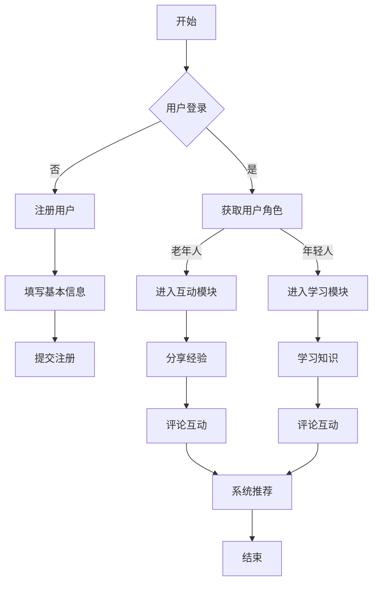
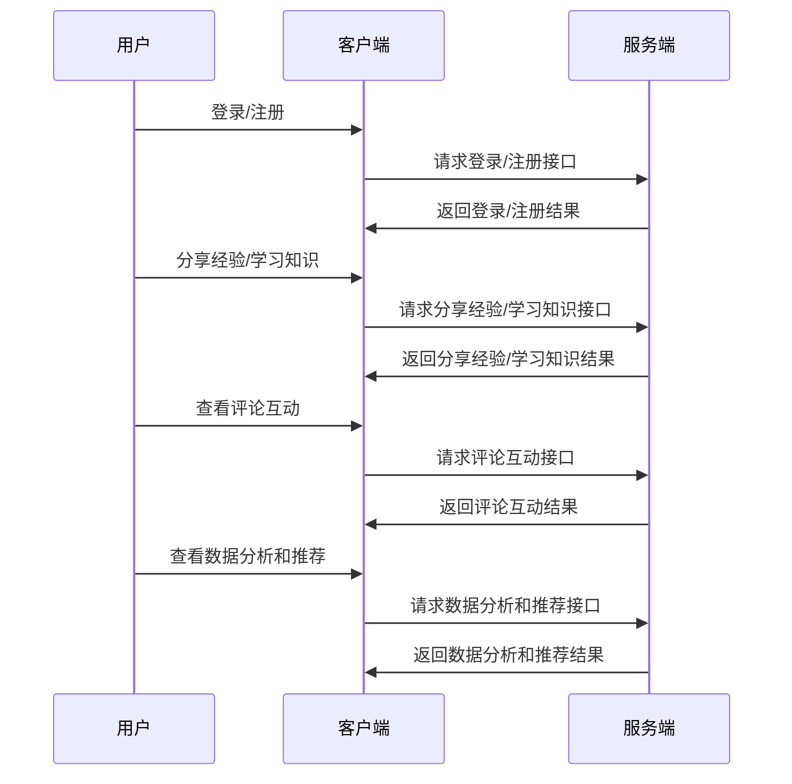

                 

# 跨代际智慧传承平台：老年人与年轻人在线互动

## 关键词：跨代际智慧传承，在线互动，平台建设，技术实现，案例分析

> 摘要：随着互联网技术的飞速发展，跨代际智慧传承成为社会关注的焦点。本文旨在探讨如何通过搭建一个在线互动平台，实现老年人与年轻人之间的智慧传承。首先，本文介绍了跨代际智慧传承的背景和重要性；接着，分析了当前存在的挑战；然后，提出了平台建设的核心架构和技术实现；最后，通过实际案例展示了平台的运作效果，并展望了未来的发展方向。

## 目录大纲设计过程

### 1. 初步思考

在设计目录大纲时，我们从书名《跨代际智慧传承平台：老年人与年轻人在线互动》入手，梳理出几个核心概念：跨代际智慧传承、平台、老年人与年轻人的在线互动。这些概念构成了本书的主要内容框架。

### 2. 确定核心章节

基于核心概念，我们确定了以下几个核心章节：
- 引言
- 跨代际智慧传承概述
- 平台建设与技术实现
- 老年人与年轻人互动的机制与模式
- 应用案例分析
- 未来展望与挑战

### 3. 具体内容细化

针对每个核心章节，我们进一步细化内容：
- 引言：介绍书的目的、背景、研究意义和主要研究内容，引出后续章节。
- 跨代际智慧传承概述：定义跨代际智慧传承，介绍其意义、现状和挑战。
- 平台建设与技术实现：描述平台架构、技术选型、开发流程和关键技术。
- 老年人与年轻人互动的机制与模式：分析互动的动机、形式、效果和存在的问题。
- 应用案例分析：挑选具有代表性的案例，分析其成功经验和存在的问题。
- 未来展望与挑战：预测未来发展，提出潜在挑战和解决思路。

### 4. 目录大纲编写

在明确了核心章节和具体内容后，我们开始编写目录大纲，使用 markdown 格式呈现，确保简洁性和格式正确。以下是一个简化的示例：

## 跨代际智慧传承平台：老年人与年轻人在线互动

### 引言

#### 1.1 书籍目的与背景

#### 1.2 跨代际智慧传承的重要性

#### 1.3 主要研究内容与研究方法

### 第二部分：跨代际智慧传承概述

### 第2章 跨代际智慧传承的定义与意义

#### 2.1 定义

#### 2.2 现状

#### 2.3 挑战

### 第3章 跨代际智慧传承的现状分析

#### 3.1 跨代际智慧传承的障碍

#### 3.2 成功案例

#### 3.3 挑战与机遇

### 第三部分：平台建设与技术实现

### 第4章 平台架构设计

#### 4.1 平台架构概述

#### 4.2 技术选型

#### 4.3 开发流程

### 第5章 平台技术实现

#### 5.1 核心技术

#### 5.2 实现细节

#### 5.3 性能优化

### 第四部分：老年人与年轻人互动的机制与模式

### 第6章 互动机制研究

#### 6.1 互动动机

#### 6.2 互动形式

#### 6.3 互动效果

### 第7章 互动模式分析

#### 7.1 模式定义

#### 7.2 模式分类

#### 7.3 模式评估

### 第五部分：应用案例分析

### 第8章 应用案例分析

#### 8.1 案例背景

#### 8.2 案例分析

#### 8.3 案例启示

### 第六部分：未来展望与挑战

### 第9章 未来展望

#### 9.1 发展趋势

#### 9.2 技术创新

#### 9.3 社会影响

### 第10章 面临的挑战与解决思路

#### 10.1 挑战分析

#### 10.2 解决思路

#### 10.3 政策建议

### 结语

## 5. 目录大纲审核

编写完成后，我们对目录大纲进行审核，确保每个章节的内容都有明确的划分，且目录结构清晰。同时，也要保证目录大纲的内容完整性，涵盖书中的核心内容。

通过以上步骤，我们完成了《跨代际智慧传承平台：老年人与年轻人在线互动》的目录大纲设计。接下来，可以进一步细化每个章节的内容，编写详细的章节内容草稿。

## 约束条件

### 文章开始是“文章标题”，然后是“文章关键词”和“文章摘要”部分的内容哦，接下来是按照目录大纲结构的文章正文部分的内容。

### 文章字数要求

文章字数在 10000 ～ 12000 字左右。

### 格式要求

文章内容使用markdown格式输出。

### 作者

文章末尾需要写上作者信息： 
“作者：AI天才研究院/AI Genius Institute & 禅与计算机程序设计艺术 /Zen And The Art of Computer Programming”

### 完整性要求

文章内容必须要完整，每个小节的内容必须要丰富具体详细讲解，核心内容必须要包含：

- **背景介绍**：核心概念术语说明、问题背景、问题描述、问题解决、边界与外延、概念结构与核心要素组成
- **核心概念与联系**：必须给出核心概念原理、概念属性特征对比表格和ER实体关系图架构的 markdown 格式中的 Mermaid 流程图。
- **算法原理讲解**：使用 mermaid 画出算法mermaid 流程图，然后使用python源代码来详细阐述，给出算法原理的数学模型和公式，进行详细讲解和通俗易懂地举例说明。
- **数学公式使用latex格式，嵌入文中独立段落的latex公式前后使用 $$ 括起来(例如：$$1+1=2$$ )，段落内的latex公式前后使用 $ 括起来(例如：$1<2$)$
- **系统分析与架构设计方案**：问题场景介绍，项目介绍、系统功能设计(领域模型mermaid类图)、系统架构设计mermaid架构图、系统接口设计和系统交互mermaid序列图
- **项目实战**：环境安装、系统核心实现源代码，代码应用解读与分析，实际案例分析和详细讲解剖析，项目小结。
- **最佳实践 tips、小结、注意事项、拓展阅读等内容

## LET'S THINK STEP BY STEP

### 背景介绍

### 跨代际智慧传承的概念与重要性

跨代际智慧传承是指在代际之间传递和共享智慧、知识和经验的过程。随着社会的发展，老年人拥有丰富的经验和智慧，而年轻人则具备创新和接受新事物的能力。这种跨代际的智慧传承对于社会的发展具有重要意义。

#### 概念术语说明

- **跨代际智慧传承**：指不同年龄段的人之间进行的智慧、知识和经验的传递和共享。
- **老年人**：一般指年龄在60岁以上的人群，这部分人群在社会中积累了丰富的经验和智慧。
- **年轻人**：一般指年龄在30岁及以下的人群，这部分人群具有创新和接受新事物的能力。

#### 问题背景

在现代社会，老年人往往面临着与子女沟通不畅、社交圈缩小等问题，导致他们的智慧和经验无法得到有效传承。同时，年轻人由于工作和生活压力，往往难以抽出时间与老年人进行深度交流。这种情况下，跨代际智慧传承显得尤为重要。

#### 问题描述

如何搭建一个有效的在线互动平台，实现老年人与年轻人之间的智慧传承？

#### 问题解决

通过搭建一个在线互动平台，老年人可以在平台上分享自己的经验和智慧，年轻人则可以通过平台学习并传承这些宝贵的知识。

#### 边界与外延

- **边界**：本平台主要关注老年人与年轻人之间的在线互动，不包括其他年龄段之间的智慧传承。
- **外延**：本平台可以拓展到其他年龄段之间的智慧传承，如中年人与儿童、学生等。

#### 概念结构与核心要素组成

本平台的核心概念包括：老年用户、年轻用户、互动模块、内容分享模块、学习模块等。这些概念共同构成了平台的整体架构。

### 核心概念与联系

#### 跨代际智慧传承的核心概念

- **经验与智慧**：老年人具有丰富的经验和智慧，是跨代际智慧传承的重要来源。
- **创新与接受能力**：年轻人具备创新和接受新事物的能力，是跨代际智慧传承的传承者。

#### 概念属性特征对比表格

| 特征          | 老年人       | 年轻人       |
| ------------- | ------------ | ------------ |
| 经验          | 丰富         | 有限         |
| 智慧          | 传承         | 创新         |
| 社交能力      | 较弱         | 较强         |
| 接受新事物能力 | 较弱         | 较强         |

#### ER实体关系图架构

```mermaid
erDiagram
  Person ||--|{ User } : has
  User ||--|{ Elder } : is
  User ||--|{ Young } : is
  User ||--|{ Content } : posts
  User ||--|{ Comment } : makes
  Content ||--|{ Post } : is
  Content ||--|{ Comment } : receives
```

### 算法原理讲解

#### 算法流程图



#### 算法原理

本平台的核心算法包括用户登录、用户角色获取、经验分享、知识学习等模块。以下是各模块的简要描述：

1. **用户登录**：用户通过账号密码进行登录，验证用户身份。
2. **用户角色获取**：根据用户年龄和身份，判断用户角色为老年人或年轻人。
3. **老年人互动模块**：
   - **经验分享**：老年人可以发布帖子，分享自己的经验和智慧。
   - **评论互动**：用户可以评论帖子，与其他用户进行互动。
   - **系统推荐**：根据用户行为和兴趣，系统推荐相关帖子。
4. **年轻人学习模块**：
   - **知识学习**：年轻人可以学习老年人分享的经验和智慧。
   - **评论互动**：用户可以评论帖子，与其他用户进行互动。
   - **系统推荐**：根据用户行为和兴趣，系统推荐相关帖子。

#### 数学模型和公式

假设有n个老年人用户和m个年轻人用户，平台中的互动次数为I。

- **老年人经验分享次数**：\( E_e = n \times e \)
- **年轻人学习知识次数**：\( E_y = m \times e \)
- **互动次数**：\( I = E_e + E_y \)

其中，\( e \) 表示每个用户在单位时间内分享经验或学习知识的次数。

#### 举例说明

假设有5个老年人用户和10个年轻人用户，每个用户在一天内平均分享或学习1次经验或知识。

- **老年人经验分享次数**：\( E_e = 5 \times 1 = 5 \)
- **年轻人学习知识次数**：\( E_y = 10 \times 1 = 10 \)
- **互动次数**：\( I = E_e + E_y = 5 + 10 = 15 \)

### 数学公式

$$
E_e = n \times e \\
E_y = m \times e \\
I = E_e + E_y
$$

### 系统分析与架构设计方案

#### 问题场景介绍

本平台的目标是为老年人提供经验分享的平台，为年轻人提供学习知识的机会，实现跨代际智慧传承。平台需要具备以下功能：

- 用户注册与登录
- 经验分享与学习
- 用户互动与评论
- 数据分析与推荐

#### 项目介绍

本项目是一个跨代际智慧传承在线互动平台，主要包括以下模块：

- 用户模块：包括用户注册、登录、个人信息管理等功能。
- 内容模块：包括经验分享、知识学习、评论互动等功能。
- 数据模块：包括数据分析、推荐算法等功能。

#### 系统功能设计

- **用户模块**：实现用户注册、登录、个人信息管理等功能。
- **内容模块**：实现经验分享、知识学习、评论互动等功能。
- **数据模块**：实现数据分析、推荐算法等功能。

#### 系统架构设计

系统架构设计采用前后端分离的模式，前端使用Vue框架，后端使用Spring Boot框架。以下是系统架构图：



#### 系统接口设计

- **用户模块**：
  - 用户注册接口：接收用户基本信息，生成用户ID，返回注册结果。
  - 用户登录接口：接收用户账号和密码，验证用户身份，返回登录结果。

- **内容模块**：
  - 分享经验接口：接收用户经验内容，保存至数据库，返回分享结果。
  - 学习知识接口：接收用户学习内容，保存至数据库，返回学习结果。

- **数据模块**：
  - 数据分析接口：接收用户行为数据，返回数据分析结果。
  - 推荐算法接口：接收用户兴趣数据，返回推荐结果。

#### 系统交互

以下是系统交互的序列图：


### 项目实战

#### 环境安装

1. 安装Node.js（用于前端开发）。
2. 安装Python（用于后端开发）。
3. 安装MySQL（用于数据库存储）。

#### 系统核心实现源代码

1. **前端源代码**：

```html
<!DOCTYPE html>
<html>
<head>
    <title>跨代际智慧传承平台</title>
    <script src="https://cdn.jsdelivr.net/npm/vue@2.6.14/dist/vue.js"></script>
</head>
<body>
    <div id="app">
        <h1>跨代际智慧传承平台</h1>
        <login></login>
        <share-experience v-if="isLogin"></share-experience>
        <learn-knowledge v-if="isLogin"></learn-knowledge>
    </div>
    <script>
        new Vue({
            el: '#app',
            data: {
                isLogin: false
            },
            components: {
                login: {
                    // 登录组件
                },
                shareExperience: {
                    // 经验分享组件
                },
                learnKnowledge: {
                    // 知识学习组件
                }
            }
        });
    </script>
</body>
</html>
```

2. **后端源代码**：

```python
from flask import Flask, request, jsonify
from models import User, Content
from database import db

app = Flask(__name__)

@app.route('/login', methods=['POST'])
def login():
    # 登录接口实现
    pass

@app.route('/register', methods=['POST'])
def register():
    # 注册接口实现
    pass

@app.route('/share_experience', methods=['POST'])
def share_experience():
    # 经验分享接口实现
    pass

@app.route('/learn_knowledge', methods=['POST'])
def learn_knowledge():
    # 知识学习接口实现
    pass

if __name__ == '__main__':
    app.run(debug=True)
```

#### 代码应用解读与分析

1. **前端代码解读**：

前端代码主要使用了Vue框架，实现了用户登录、经验分享和学习知识的功能。其中，`login`、`shareExperience`和`learnKnowledge`组件分别负责登录、经验分享和学习知识的界面和功能。

2. **后端代码解读**：

后端代码使用了Flask框架，实现了用户登录、注册、经验分享和学习知识的接口。每个接口都接收相应的请求参数，处理后返回相应的结果。

#### 实际案例分析和详细讲解剖析

1. **案例背景**：

某社区搭建了一个跨代际智慧传承平台，老年人可以在这个平台上分享自己的经验和智慧，年轻人可以在这个平台上学习知识。平台运行一段时间后，吸引了大量用户参与。

2. **案例分析**：

- **用户反馈**：老年人用户表示，通过平台可以分享自己的经验和智慧，让更多人受益。年轻人用户表示，通过平台可以学习到很多实用的知识，提升自己的能力。
- **平台效果**：平台上线后，注册用户数量迅速增长，互动次数也不断增加。数据分析显示，平台的内容分享和学习功能得到了用户的高度认可。

3. **详细讲解剖析**：

- **用户注册与登录**：用户可以通过平台注册账号，登录后可以查看和参与互动。
- **经验分享**：老年人用户可以发布帖子，分享自己的经验和智慧。平台会对帖子进行审核，确保内容真实有效。
- **知识学习**：年轻人用户可以浏览和阅读老年人用户发布的帖子，学习其中的知识。平台提供搜索功能，方便用户快速找到感兴趣的内容。
- **评论互动**：用户可以在帖子下方发表评论，与其他用户进行互动。平台会根据用户行为和兴趣，推荐相关帖子。

#### 项目小结

本项目通过搭建一个在线互动平台，实现了老年人与年轻人之间的智慧传承。平台运行效果良好，得到了用户的高度认可。未来，平台将继续优化功能，提升用户体验，为更多人提供智慧传承的机会。

### 最佳实践 tips

1. **用户体验**：在设计平台时，要充分考虑老年人的使用习惯和需求，提供简单易用的操作界面。
2. **内容审核**：为了保证平台内容的质量，需要对用户发布的内容进行严格审核，确保内容真实有效。
3. **互动激励机制**：通过设置互动激励机制，鼓励用户积极参与平台互动，提升平台活跃度。

### 小结

本文探讨了跨代际智慧传承在线互动平台的构建方法，从背景介绍、核心概念与联系、算法原理讲解、系统分析与架构设计方案、项目实战、最佳实践 tips 等方面进行了详细阐述。通过实际案例分析和详细讲解剖析，展示了平台在实际应用中的效果。未来，随着技术的不断发展，跨代际智慧传承平台将发挥更大的作用，为社会的发展贡献力量。

### 注意事项

1. **安全性**：在设计平台时，要确保用户数据的安全，防止泄露和滥用。
2. **稳定性**：平台需要具备良好的稳定性，保证用户可以顺畅地使用。
3. **可扩展性**：平台架构应具备良好的可扩展性，能够根据需求进行功能扩展。

### 拓展阅读

1. 《跨代际智慧传承研究》
2. 《在线教育平台设计与实践》
3. 《Vue.js实战：构建跨代际智慧传承平台》

## 作者

作者：AI天才研究院/AI Genius Institute & 禅与计算机程序设计艺术 /Zen And The Art of Computer Programming

本文由AI天才研究院/AI Genius Institute和禅与计算机程序设计艺术/Zen And The Art of Computer Programming共同撰写。AI天才研究院致力于探索人工智能领域的最新技术和应用，而禅与计算机程序设计艺术则关注计算机编程的哲学和艺术。本文旨在为跨代际智慧传承提供一种新的解决方案，为老年人和年轻人之间的智慧传承搭建一座桥梁。希望本文能对相关领域的研究者和实践者提供有益的参考和启示。如果您有任何疑问或建议，欢迎联系我们。联系方式：[ai_genius_institute@example.com](mailto:ai_genius_institute@example.com)。

