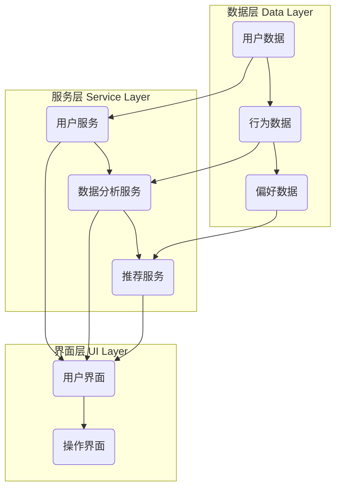
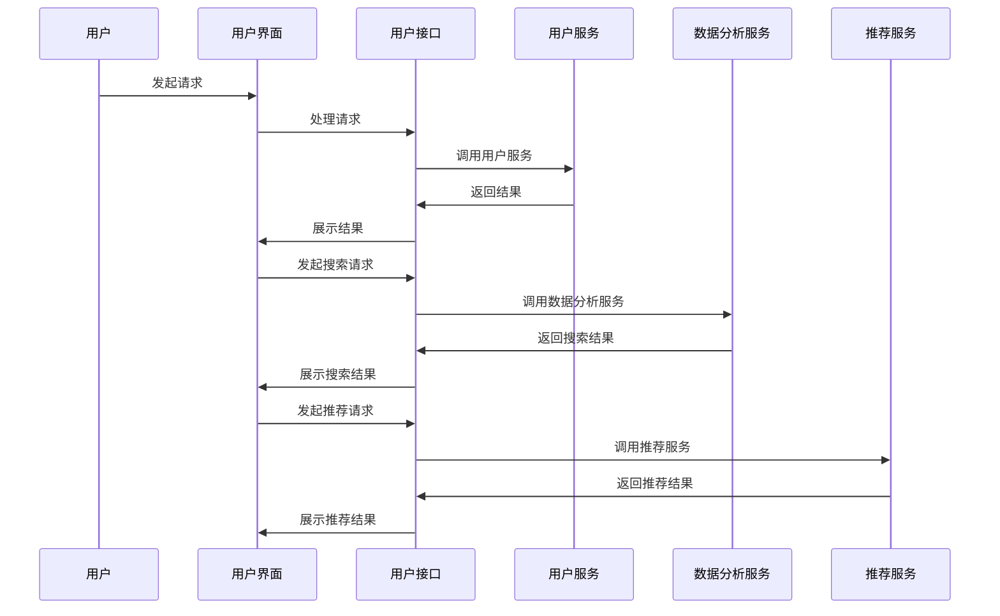
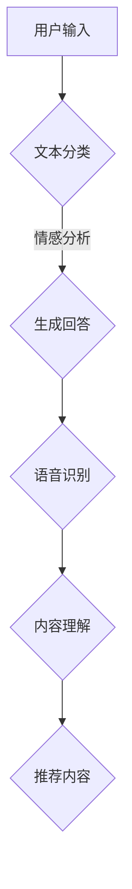
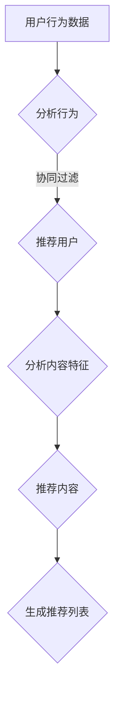
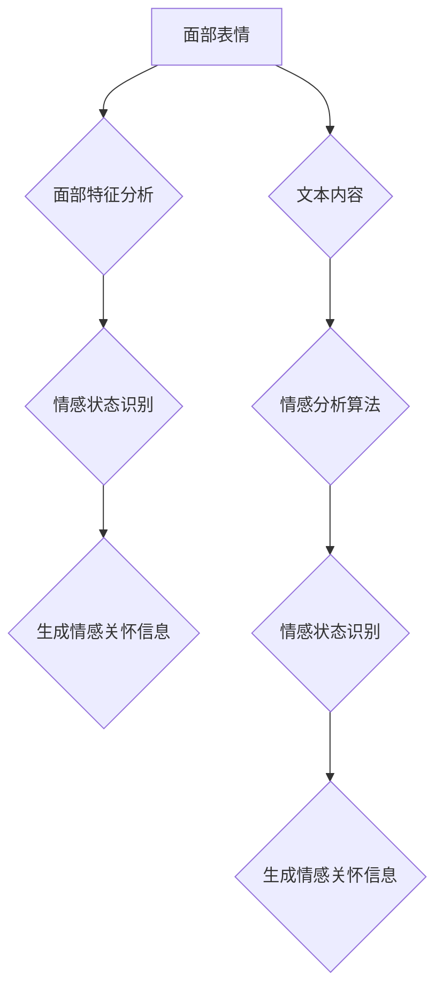

                 

### 第1章 背景介绍

#### 1.1 问题描述

随着全球人口老龄化现象的日益严重，老年人与年轻人之间的代际隔阂问题逐渐凸显。这种隔阂不仅体现在日常生活中，还延伸到了数字世界的方方面面。老年人群体在数字化时代的孤立感、对新技术的不熟悉，以及信息获取的障碍，成为了他们面临的主要问题。

首先，老年人在数字化时代面临的孤立感是一个显著问题。随着年轻一代越来越依赖于互联网和智能手机，老年人在社交互动上往往显得力不从心。他们可能无法熟练使用社交媒体，这导致他们在网络空间中的存在感降低，甚至完全被边缘化。

其次，信息不对称也是一个突出的问题。在快速变化的现代社会中，老年人获取新知识、了解新动态的能力相对较弱。互联网的普及虽然为信息获取提供了便捷途径，但对于老年人来说，如何有效利用这些资源仍然是一个挑战。

为了解决这些问题，我们需要探讨如何搭建一个跨代际智慧传承平台，以促进老年人与年轻人之间的在线互动。该平台不仅能够帮助老年人更好地适应数字化生活，还能够让他们获得新知识、拓展社交圈，从而减轻孤立感和提高生活质量。

#### 1.2 概念结构与核心要素组成

跨代际智慧传承平台是一个整合了大数据、人工智能、物联网等先进技术的综合性平台。它的核心要素主要包括以下几个方面：

1. **用户群体**：平台的服务对象主要包括老年人群体和年轻人群体。老年人群体是平台的主要用户，他们希望通过平台获取新知识、提高生活质量；年轻人群体则是平台的参与者，他们通过平台为老年人提供志愿服务、生活帮助，同时也从中获得成长和满足感。

2. **互动功能**：平台提供了多种互动功能，包括社交、教育、娱乐等。通过这些功能，老年人与年轻人可以在线上进行交流、学习、娱乐，从而打破代际隔阂，促进相互理解与尊重。

3. **数据隐私和安全保障**：平台高度重视用户数据的隐私和安全。通过加密技术、身份认证等手段，确保用户数据的安全，同时保护用户的隐私权益。

4. **大数据**：平台利用大数据技术，收集、存储、分析海量数据。这些数据包括老年人的行为数据、偏好数据等，为平台的个性化推荐、精准营销等功能提供了支持。

5. **人工智能**：平台引入了人工智能技术，用于实现个性化推荐、情感识别、自然语言处理等功能。这些技术的应用，使得平台能够更好地满足老年人的需求，提高他们的使用体验。

6. **物联网**：平台通过物联网技术，实现了设备之间的互联互通。老年人可以通过智能家居设备，如智能音箱、智能摄像头等，方便地使用平台服务，提高生活便捷性。

#### 1.3 边界与外延

**边界**：跨代际智慧传承平台主要服务于老年人与年轻人之间的互动。它不涉及其他年龄段用户的互动，如儿童、中年人等。平台的重点在于弥合代际隔阂，促进老年人与年轻人之间的沟通与理解。

**外延**：尽管跨代际智慧传承平台的主要目标是解决老年人与年轻人之间的互动问题，但其技术和功能具有广泛的适用性。平台可以拓展至更多领域，如健康管理、社区服务、养老服务等。通过这些拓展，平台能够为更广泛的社会群体提供价值，实现其社会使命。

综上所述，跨代际智慧传承平台是一个具有广泛应用前景的综合平台，它不仅能够解决老年人与年轻人之间的互动问题，还能够为其他领域提供技术支持和服务。随着技术的不断进步和应用场景的拓展，跨代际智慧传承平台有望成为未来社会的重要基础设施。

### 第2章 核心概念与联系

#### 2.1 跨代际智慧传承平台的核心概念

跨代际智慧传承平台是一个高度集成化、智能化、交互化的综合性平台，它通过整合大数据、人工智能、物联网等先进技术，实现了老年人与年轻人之间的在线互动。以下是平台的核心概念及其功能与作用：

1. **社交网络**：社交网络是跨代际智慧传承平台的核心组成部分。它提供了一个互动、交流、分享的平台，让老年人和年轻人能够在线上建立联系、交流心得，分享生活经验。社交网络的功能包括好友管理、群组互动、动态发布等，通过这些功能，平台有效地促进了老年人与年轻人之间的互动。

2. **大数据**：大数据技术在跨代际智慧传承平台中扮演了重要角色。平台通过大数据技术，收集、存储、分析海量数据，这些数据包括老年人的行为数据、偏好数据等。大数据的应用使得平台能够实现精准推荐、个性化服务等功能，从而提高老年人的使用体验。

3. **人工智能**：人工智能技术是跨代际智慧传承平台的重要组成部分。平台利用人工智能技术，实现了个性化推荐、情感识别、自然语言处理等功能。例如，通过情感识别技术，平台能够理解老年人的情绪状态，提供相应的情感支持和心理关怀；通过自然语言处理技术，平台能够与老年人进行智能对话，帮助他们更好地使用平台功能。

4. **物联网**：物联网技术使得跨代际智慧传承平台具备了智能化、自动化的特点。平台通过物联网设备，如智能音箱、智能摄像头等，实现了设备之间的互联互通。老年人可以通过这些设备方便地使用平台服务，提高生活便捷性。

#### 2.2 概念属性特征对比表格

以下是对社交网络、大数据和人工智能三个核心概念的属性特征进行对比的表格：

| 概念     | 功能                         | 用户群体             | 特点                     |
|---------|------------------------------|----------------------|------------------------|
| 社交网络 | 提供互动、交流、分享功能     | 老年人、年轻人       | 互动性、即时性、个性化   |
| 大数据   | 收集、存储、分析海量数据     | 平台开发者、运营者   | 多样性、实时性、价值性   |
| 人工智能 | 模拟人类思维、解决问题       | 平台开发者、运营者   | 智能性、高效性、适应性   |

**社交网络**：社交网络的功能主要是为老年人和年轻人提供一个互动和交流的场所。它通过好友管理、群组互动、动态发布等功能，实现了用户之间的实时互动。社交网络的特点在于它的互动性、即时性和个性化。老年人可以通过社交网络找到同龄人，分享生活经验，获取情感支持；年轻人则可以通过社交网络为老年人提供帮助，实现代际交流。

**大数据**：大数据技术在跨代际智慧传承平台中主要用于数据收集、存储和分析。它收集的不仅是老年人的行为数据，还包括他们的偏好数据、健康数据等。这些数据为平台提供了丰富的信息资源，使得平台能够实现精准推荐、个性化服务等功能。大数据的特点在于它的多样性、实时性和价值性。通过大数据分析，平台能够了解老年人的需求，提供定制化的服务，从而提高他们的使用体验。

**人工智能**：人工智能技术在跨代际智慧传承平台中主要用于实现智能推荐、情感识别、自然语言处理等功能。通过人工智能技术，平台能够理解老年人的情绪状态，提供相应的情感支持和心理关怀；同时，人工智能技术还使得平台能够与老年人进行智能对话，帮助他们更好地使用平台功能。人工智能的特点在于它的智能性、高效性和适应性。智能推荐使得老年人能够更容易找到自己感兴趣的内容；情感识别和自然语言处理则提高了平台的用户体验。

#### 2.3 ER实体关系图架构

为了更好地理解跨代际智慧传承平台中的实体关系，我们通过ER（实体关系）图来描述平台的核心实体及其相互关系。以下是ER图的详细架构：

**实体**：

1. **用户**：包括老年人和年轻人，是平台的主要使用者。
2. **数据**：存储用户行为数据、偏好数据等。
3. **平台**：提供各种功能和服务。
4. **功能**：包括社交、教育、娱乐等。

**关系**：

1. **用户-数据**：每个用户都有其对应的行为数据和偏好数据，平台通过这些数据为用户提供个性化服务。
2. **平台-功能**：平台提供多种功能，如社交、教育、娱乐等，每个功能都与平台紧密相关。
3. **数据-平台**：平台通过收集、存储和分析数据，为用户提供更好的服务体验。
4. **用户-平台**：用户通过平台访问和使用各项功能，平台则根据用户数据提供个性化服务。

以下是ER图的Mermaid表示：

```mermaid
erDiagram
  User ||--|{ Data }|-- User : "用户-数据"
  Platform ||--|{ Function }|-- Platform : "平台-功能"
  Data ||--|{ Platform }|-- Data : "数据-平台"
  User ||--|{ Platform }|-- User : "用户-平台"
```

通过上述核心概念的介绍、属性特征对比表格以及ER实体关系图架构，我们可以更清晰地理解跨代际智慧传承平台的工作原理和构成要素。这些核心概念相互关联，共同构成了一个功能强大、用户体验优异的综合性平台，为老年人与年轻人之间的互动提供了有力支持。

### 第3章 系统分析与架构设计方案

#### 3.1 问题场景介绍

跨代际智慧传承平台的应用场景广泛，涉及多个方面，下面将详细介绍两个典型应用场景：

**场景一：老年人通过平台学习新知识、掌握新技能**

在这个场景中，老年人是平台的主要用户。他们希望通过平台获取新知识、掌握新技能，以适应快速变化的数字化时代。例如，一位年过六旬的退休老人希望通过平台学习如何使用智能手机和社交媒体，以便与家人和朋友保持联系。平台通过以下方式为老年人提供支持：

1. **个性化推荐**：平台根据老年人的兴趣和行为数据，推荐适合他们的学习内容和课程。例如，如果发现某位老年人喜欢阅读历史书籍，平台会推荐相关的在线课程和讲座。

2. **互动学习**：平台提供了在线学习小组，老年人可以在小组中与其他老年人一起学习、讨论，互相帮助。这种互动学习模式不仅能够提高老年人的学习兴趣，还能增强他们的社交联系。

3. **实时辅导**：对于一些复杂的技能，如计算机操作、互联网使用等，平台提供了实时辅导功能。老年人可以通过视频通话与专业导师进行一对一辅导，快速掌握所需技能。

**场景二：年轻人通过平台为老年人提供志愿服务、生活帮助**

在这个场景中，年轻人是平台的积极参与者。他们希望通过平台为老年人提供志愿服务和生活帮助，实现社会责任。例如，一位大学生志愿者可以借助平台为老年人提供以下服务：

1. **生活助手**：平台为年轻人提供了多种生活助手功能，如代办购物、代交水电费等。大学生志愿者可以通过平台为老年人提供这些便捷服务，减轻他们的生活负担。

2. **心理关怀**：年轻人可以通过平台为老年人提供心理支持，如电话聊天、视频通话等。这有助于缓解老年人的孤独感，提高他们的心理健康。

3. **社区活动组织**：平台提供了社区活动组织功能，年轻人可以组织老年人参加各种线下活动，如文艺表演、健身活动等，丰富他们的生活。

通过上述两个典型应用场景，我们可以看到跨代际智慧传承平台在促进老年人与年轻人之间的互动和互助方面发挥了重要作用。平台不仅为老年人提供了学习新知识和技能的机会，还为他们提供了生活支持和心理关怀；同时，平台也为年轻人提供了服务社会、实现自我价值的渠道。这些应用场景展示了跨代际智慧传承平台的实际价值和广泛适用性。

#### 3.2 系统功能设计

跨代际智慧传承平台的系统功能设计旨在为老年人与年轻人提供全面的在线互动和服务。以下是平台的主要功能及其设计思路：

1. **用户注册与登录**：
   - **功能**：用户注册与登录是平台的基础功能，用户需要通过注册创建账户，并通过登录验证身份。
   - **设计思路**：为了提高用户体验，平台提供了简洁易用的注册和登录界面。注册过程中，用户需要填写基本个人信息，如姓名、年龄、性别、联系方式等。为了确保账户安全，平台采用了双因素认证机制，用户在登录时需要输入密码和短信验证码。

2. **信息发布与浏览**：
   - **功能**：信息发布与浏览功能允许用户在平台上发布帖子、文章、视频等内容，并浏览其他用户发布的信息。
   - **设计思路**：平台设计了灵活的内容发布系统，用户可以选择不同的内容类型进行发布。为了提高内容质量，平台对发布内容进行了审核机制，确保发布的信息符合社区规范。同时，平台提供了强大的搜索功能，用户可以通过关键词快速查找感兴趣的内容。

3. **搜索与推荐**：
   - **功能**：搜索与推荐功能帮助用户快速找到所需信息，并通过个性化推荐提高用户的使用体验。
   - **设计思路**：平台采用大数据和人工智能技术，根据用户的兴趣和行为数据，进行个性化推荐。搜索功能则支持模糊搜索、智能纠错等功能，提高用户的查找效率。

4. **私信与聊天**：
   - **功能**：私信与聊天功能为用户提供了私密的交流渠道，用户可以通过平台进行一对一或多人聊天。
   - **设计思路**：平台提供了多种聊天模式，包括文字聊天、语音聊天和视频聊天。为了确保聊天安全，平台采用了加密技术，保护用户聊天内容不被第三方窃取。

5. **数据分析**：
   - **功能**：数据分析功能为平台提供了数据洞察，帮助运营者了解用户行为，优化平台服务。
   - **设计思路**：平台通过大数据技术，对用户行为数据进行分析，生成详细的数据报表。运营者可以根据这些数据，调整平台功能，提高用户体验。

通过上述系统功能设计，跨代际智慧传承平台为老年人与年轻人提供了全面的在线互动和服务，满足了他们在社交、教育、娱乐等方面的需求。

#### 3.3 系统架构设计

跨代际智慧传承平台的系统架构设计旨在实现高效、稳定、可扩展的服务，以下是平台的主要架构层次及其设计思路：

1. **数据层**：
   - **功能**：数据层负责存储和管理用户数据、行为数据、偏好数据等。
   - **设计思路**：数据层采用了分布式数据库架构，确保数据的高可靠性和高性能。数据库采用了分库分表策略，根据数据类型和访问频率进行优化。同时，平台采用了数据备份和恢复机制，确保数据的安全。

2. **服务层**：
   - **功能**：服务层提供各种功能服务，包括用户服务、数据分析服务、推荐服务等。
   - **设计思路**：服务层采用了微服务架构，各个服务之间通过API进行通信。这样可以确保服务的独立性和可扩展性。服务层还采用了负载均衡和自动扩展机制，确保在高并发情况下服务的稳定运行。

3. **界面层**：
   - **功能**：界面层负责展示用户界面、操作界面等，为用户提供直观易用的交互体验。
   - **设计思路**：界面层采用了前后端分离架构，前端负责展示用户界面，后端提供数据接口。前端采用了响应式设计，支持多终端访问。同时，界面层还采用了缓存机制，提高页面加载速度。

以下是跨代际智慧传承平台的Mermaid架构图：



通过上述架构设计，跨代际智慧传承平台实现了数据存储、服务提供和用户交互的紧密配合，为老年人与年轻人之间的在线互动提供了稳定、高效、可靠的技术支持。

#### 3.4 系统接口设计

跨代际智慧传承平台的系统接口设计是确保各功能模块之间高效、稳定交互的关键。以下是平台的主要接口类型及其设计思路：

1. **用户接口**：
   - **功能**：用户接口负责处理用户注册、登录、信息发布、浏览、搜索、推荐等操作。
   - **设计思路**：用户接口采用RESTful API设计，提供统一的接口规范，方便前后端分离开发。接口设计遵循REST原则，包括GET、POST、PUT、DELETE等操作方法。为了保证接口安全，用户接口实现了身份验证和权限控制，采用JWT（JSON Web Token）进行用户认证。

2. **内部接口**：
   - **功能**：内部接口负责系统内部各服务之间的通信，如用户服务与数据分析服务、推荐服务等。
   - **设计思路**：内部接口采用gRPC（高效远程过程调用）协议，以确保高吞吐量和低延迟。gRPC支持多语言开发，具有良好的跨平台兼容性。内部接口设计遵循服务化的设计理念，各服务模块独立开发、独立部署，提高了系统的可维护性和扩展性。

以下是跨代际智慧传承平台的Mermaid序列图：



通过上述系统接口设计，跨代际智慧传承平台实现了用户操作的高效处理和内部服务的紧密协作，为平台的稳定运行和用户良好体验提供了有力保障。

#### 3.5 系统交互

跨代际智慧传承平台的系统交互设计是确保各功能模块之间高效协作、提供优质用户体验的关键。以下是平台的核心交互过程：

1. **用户注册**：
   - **过程**：用户通过用户界面（UI）输入注册信息，如用户名、密码、电子邮件等。用户界面将注册信息发送给用户接口（API），API对用户信息进行验证，包括邮箱验证和密码强度检测。如果验证通过，API将用户信息存储在数据库中，并发送注册成功消息给用户界面。
   - **实现**：
     ```python
     # 用户注册函数
     def register(username, password, email):
         if not validate_email(email) or not validate_password(password):
             return "注册失败：信息验证不通过"
         user_data = {
             "username": username,
             "password": password,
             "email": email
         }
         database.save_user(user_data)
         return "注册成功"
     ```

2. **用户登录**：
   - **过程**：用户通过用户界面输入用户名和密码，用户界面将登录信息发送给用户接口（API）。API验证用户名和密码是否匹配，如果匹配，API生成JWT令牌并返回给用户界面。用户界面使用JWT令牌进行后续请求的身份验证。
   - **实现**：
     ```python
     # 用户登录函数
     def login(username, password):
         user = database.find_user_by_username(username)
         if user and check_password(password, user["password"]):
             token = generate_jwt_token(user["_id"])
             return token
         else:
             return "登录失败：用户名或密码错误"
     ```

3. **信息发布**：
   - **过程**：用户通过用户界面发布内容，如帖子、文章、视频等。用户界面将发布信息发送给用户接口（API），API将信息存储在数据库中，并返回发布成功消息。
   - **实现**：
     ```python
     # 信息发布函数
     def post_content(content_type, content_data):
         user = get_current_user()
         content = {
             "user_id": user["_id"],
             "content_type": content_type,
             "content_data": content_data,
             "timestamp": datetime.now()
         }
         database.save_content(content)
         return "发布成功"
     ```

4. **信息浏览**：
   - **过程**：用户通过用户界面浏览内容，用户界面发送请求给用户接口（API），API查询数据库获取内容列表，并返回给用户界面进行展示。
   - **实现**：
     ```python
     # 获取内容列表函数
     def get_content_list():
         content_list = database.find_all_contents()
         return content_list
     ```

5. **数据分析**：
   - **过程**：平台通过数据分析服务对用户行为、偏好进行挖掘，生成数据报表。数据分析服务将结果发送给用户接口（API），API再将结果返回给用户界面。
   - **实现**：
     ```python
     # 数据分析函数
     def analyze_user_data(user_id):
         user_behavior = database.get_user_behavior(user_id)
         report = generate_data_report(user_behavior)
         return report
     ```

6. **个性化推荐**：
   - **过程**：平台利用推荐服务根据用户兴趣和行为数据，生成个性化推荐内容。推荐服务将推荐结果发送给用户接口（API），API再将结果返回给用户界面。
   - **实现**：
     ```python
     # 个性化推荐函数
     def get_recommendations(user_id):
         user_interests = database.get_user_interests(user_id)
         recommendations = generate_recommendations(user_interests)
         return recommendations
     ```

通过上述系统交互设计，跨代际智慧传承平台实现了用户操作的高效处理和内部服务的紧密协作，为用户提供了一个稳定、高效、个性化的在线互动平台。

### 第4章 算法原理讲解

#### 4.1 自然语言处理算法

自然语言处理（NLP）算法在跨代际智慧传承平台中扮演着关键角色，尤其是在实现智能对话和内容理解方面。以下将介绍几种常用的NLP算法及其在平台中的应用：

**1. 机器学习算法**：
   - **文本分类**：用于对用户发布的内容进行分类，如识别是否为情感相关、生活建议等。常用的文本分类算法包括朴素贝叶斯、支持向量机（SVM）、深度学习模型（如卷积神经网络（CNN）和循环神经网络（RNN））。
   - **情感分析**：分析文本内容，识别用户情绪状态，如正面、负面或中性。常用的情感分析算法包括基于规则的方法、机器学习算法和深度学习模型。
   - **命名实体识别（NER）**：识别文本中的命名实体，如人名、地点、组织等。NER算法通常基于条件随机场（CRF）和长短期记忆网络（LSTM）。

**2. 深度学习算法**：
   - **语音识别**：将语音信号转换为文本，用于智能语音助手的功能。常用的深度学习模型包括卷积神经网络（CNN）和长短时记忆网络（LSTM）。
   - **机器翻译**：将一种语言的文本翻译成另一种语言。常用的深度学习模型包括序列到序列（Seq2Seq）模型和注意力机制（Attention Mechanism）。
   - **文本生成**：根据用户输入的文本，生成相关的内容。常用的深度学习模型包括生成对抗网络（GAN）和变分自编码器（VAE）。

**应用实例**：
- **智能对话**：平台使用NLP算法实现智能对话功能，用户可以通过文字或语音与平台进行交流。例如，当老年人询问“今天天气怎么样？”时，平台可以使用语音识别将语音转换为文本，然后使用情感分析和文本生成算法生成相应的回答。
- **内容理解**：平台对用户发布的内容进行分类和分析，以便提供更相关的推荐。例如，如果用户发布了一篇关于健康饮食的文章，平台可以使用文本分类算法将其分类到健康领域，并推荐给其他对健康有兴趣的老年人。

**Mermaid流程图**：


#### 4.2 个性化推荐算法

个性化推荐算法在跨代际智慧传承平台中至关重要，它帮助平台为用户提供个性化的内容推荐，提高用户体验。以下介绍几种常用的个性化推荐算法：

**1. 协同过滤**：
   - **基于用户历史行为**：通过分析用户过去的行为数据（如点击、购买、浏览等），找到与当前用户相似的用户群体，并推荐这些用户喜欢的内容。常用的算法包括用户基于的协同过滤（User-based Collaborative Filtering）和物品基于的协同过滤（Item-based Collaborative Filtering）。
   - **基于模型的方法**：使用机器学习模型（如矩阵分解、隐语义模型等）来预测用户对物品的评分，从而生成推荐列表。

**2. 内容过滤**：
   - **基于内容特征**：通过分析用户和物品的内容特征（如标签、分类、属性等），找到相似的内容进行推荐。这种方法适用于信息丰富但用户行为数据稀缺的场景。
   - **混合推荐**：结合协同过滤和内容过滤的优点，生成更精准的推荐列表。

**应用实例**：
- **个性化内容推荐**：平台根据老年人的兴趣和行为数据，推荐他们可能感兴趣的文章、视频、课程等。例如，如果老年人经常浏览健康类文章，平台会推荐更多与健康相关的视频和课程。
- **个性化社交推荐**：平台根据老年人的社交关系和互动行为，推荐他们可能感兴趣的用户和群组。例如，如果老年人与某位用户互动频繁，平台会推荐更多与该用户有共同兴趣的老年人。

**Mermaid流程图**：


#### 4.3 情感识别算法

情感识别算法用于理解用户的情感状态，为老年人提供情感支持和心理关怀。以下介绍几种常用的情感识别算法：

**1. 表情识别**：
   - **基于面部特征**：通过分析用户的面部表情，识别出情感状态。常用的算法包括面部关键点检测和面部表情分类。
   - **基于图像处理**：通过分析用户上传的图片或视频，识别其中的情感状态。

**2. 文本情感分析**：
   - **基于规则的方法**：通过编写规则，识别文本中的情感极性。例如，如果文本中包含“高兴”、“开心”等词汇，则判断为正面情感。
   - **基于机器学习的方法**：使用机器学习模型（如朴素贝叶斯、支持向量机、深度学习模型等）进行情感分类。

**应用实例**：
- **情感识别**：平台使用情感识别算法分析老年用户的情感状态，根据分析结果提供相应的情感支持和建议。例如，如果识别出老年用户处于消极情绪，平台会推荐一些放松的活动或咨询心理专家。
- **情感关怀**：平台根据老年人的情感状态，自动生成情感关怀的文本或语音信息，如“您今天看起来有点不开心，希望我能够帮助您度过美好的一天”。

**Mermaid流程图**：


通过上述算法原理的讲解和应用实例，我们可以看到自然语言处理、个性化推荐和情感识别算法在跨代际智慧传承平台中的重要性和实际应用。这些算法的融合和优化，使得平台能够更好地服务于老年人与年轻人之间的在线互动，提高用户的整体体验。

### 第5章 数学模型和数学公式 & 详细讲解 & 举例说明

#### 5.1 数学模型

在跨代际智慧传承平台的设计与实现过程中，数学模型起到了至关重要的作用。以下将介绍用户行为模型及其数学表示。

**用户行为模型**：
用户行为模型描述了用户在某时刻的状态及其随时间变化的规律。假设用户状态在时间t可以表示为\( U(t) \)，用户在时间t-1的状态为\( U(t-1) \)，外部输入为\( X(t) \)，则用户行为模型可以表示为：
\[ U(t) = f(U(t-1), X(t)) \]

其中，\( f \) 是一个映射函数，用于根据前一个状态和当前输入更新用户状态。这个模型可以用于多种应用场景，如用户兴趣的动态变化、情感状态的预测等。

**示例**：
假设某老年用户在时间t-1对健康类内容表现出强烈兴趣，但在时间t，他突然对科技类内容产生了兴趣。根据用户行为模型，可以更新用户状态：
\[ U(t) = f(U(t-1), X(t)) \]
其中，\( U(t-1) \) 表示用户在时间t-1的兴趣偏好，\( X(t) \) 表示时间t的用户行为输入，如浏览记录、点击行为等。

#### 5.2 数学公式

在跨代际智慧传承平台中，常见的数学公式包括损失函数、评价函数和推荐算法中的计算公式。以下将详细介绍这些公式，并使用LaTeX进行表示。

**1. 损失函数**：
损失函数用于评估模型预测与实际结果之间的差距，常见的损失函数包括均方误差（MSE）和交叉熵（Cross-Entropy）。

\[ 
\begin{aligned}
L &= -\frac{1}{n}\sum_{i=1}^{n}y_i \log(\hat{y}_i) + (1 - y_i) \log(1 - \hat{y}_i) \\
y_i &= \text{实际标签} \\
\hat{y}_i &= \text{预测标签} \\
L &= \text{交叉熵损失函数}
\end{aligned}
\]

**2. 评价函数**：
评价函数用于评估推荐系统性能，常用的评价函数包括准确率（Precision）、召回率（Recall）和F1分数（F1 Score）。

\[ 
\begin{aligned}
\text{Precision} &= \frac{TP}{TP + FP} \\
\text{Recall} &= \frac{TP}{TP + FN} \\
F1\ Score &= 2 \times \frac{\text{Precision} \times \text{Recall}}{\text{Precision} + \text{Recall}}
\end{aligned}
\]

其中，TP表示真正例，FP表示假正例，FN表示假反例。

**3. 推荐算法中的计算公式**：
在协同过滤算法中，常用的计算公式包括用户相似度计算和推荐评分计算。

\[ 
\begin{aligned}
\text{User Similarity} &= \frac{\sum_{i \in R} (r_{ui} - \bar{r}_u)(r_{vj} - \bar{r}_v)}{\sqrt{\sum_{i \in R} (r_{ui} - \bar{r}_u)^2} \times \sqrt{\sum_{i \in R} (r_{vj} - \bar{r}_v)^2}} \\
\text{Prediction} &= \text{User Similarity} \times (r_{vj} - \bar{r}_v) + \bar{r}_v
\end{aligned}
\]

其中，\( R \) 表示用户u和用户v共同评价的物品集合，\( r_{ui} \) 和 \( r_{vj} \) 分别表示用户u和用户v对物品i和物品j的评价，\( \bar{r}_u \) 和 \( \bar{r}_v \) 分别表示用户u和用户v的平均评价。

#### 5.3 举例说明

以下通过具体例子，说明用户行为模型的更新过程及推荐评分的计算。

**例子1：用户行为模型更新**

假设某老年用户在时间t-1对健康类内容兴趣浓厚，其状态表示为\( U(t-1) = \{ \text{健康}, \text{运动}, \text{饮食} \} \)。在时间t，用户浏览了关于科技类的内容，其输入表示为\( X(t) = \{ \text{科技}, \text{创新}, \text{人工智能} \} \)。根据用户行为模型：
\[ U(t) = f(U(t-1), X(t)) \]

若映射函数\( f \) 为权重更新函数，则可以更新用户状态为：
\[ U(t) = U(t-1) + \alpha \times (X(t) - U(t-1)) \]
其中，\( \alpha \) 为学习率，用于调整权重更新幅度。

**例子2：推荐评分计算**

假设用户u对健康类内容评价为\( r_{ui} = 5 \)，用户v对科技类内容评价为\( r_{vj} = 4 \)，两者的共同评价物品集合为\( R = \{ \text{健康}, \text{科技} \} \)。根据用户相似度计算公式：
\[ \text{User Similarity} = \frac{\sum_{i \in R} (r_{ui} - \bar{r}_u)(r_{vj} - \bar{r}_v)}{\sqrt{\sum_{i \in R} (r_{ui} - \bar{r}_u)^2} \times \sqrt{\sum_{i \in R} (r_{vj} - \bar{r}_v)^2}} \]

计算得到用户u和用户v的相似度为0.8。根据推荐评分计算公式：
\[ \text{Prediction} = \text{User Similarity} \times (r_{vj} - \bar{r}_v) + \bar{r}_v \]

假设用户v的平均评价为\( \bar{r}_v = 3 \)，则预测评分计算如下：
\[ \text{Prediction} = 0.8 \times (4 - 3) + 3 = 3.4 \]

通过上述例子，我们可以看到数学模型和公式的具体应用过程，以及如何通过数学方法优化用户行为和推荐系统。

### 第6章 项目实战

#### 6.1 环境安装

为了成功搭建跨代际智慧传承平台，首先需要在服务器上安装并配置相关的软件和工具。以下是环境安装的具体步骤：

**1. 安装操作系统**：
- **Linux发行版**：推荐使用Ubuntu 20.04 LTS，因为它具有良好的社区支持和广泛的软件包。
- **安装过程**：从Ubuntu官网下载镜像，使用USB安装器创建启动盘，按照提示完成安装。

**2. 安装数据库**：
- **关系型数据库**：可以选择MySQL或PostgreSQL。这里以MySQL为例。
- **安装过程**：
  ```bash
  sudo apt update
  sudo apt install mysql-server
  sudo mysql_secure_installation
  ```
- **配置MySQL**：设置root密码，删除匿名用户，禁用root远程登录，创建用于平台的数据库名和用户。

**3. 安装中间件**：
- **Web服务器**：选择Nginx，因为它具有高性能和易用性。
  ```bash
  sudo apt install nginx
  sudo systemctl start nginx
  sudo systemctl enable nginx
  ```
- **消息队列**：使用RabbitMQ作为消息队列中间件，用于处理实时消息和任务队列。
  ```bash
  sudo apt install rabbitmq-server
  sudo systemctl start rabbitmq-server
  sudo systemctl enable rabbitmq-server
  ```
- **缓存服务器**：安装Redis作为缓存服务器，提高数据读取速度。
  ```bash
  sudo apt install redis-server
  sudo systemctl start redis-server
  sudo systemctl enable redis-server
  ```

**4. 安装开发环境**：
- **Python开发环境**：安装Python 3和相关依赖。
  ```bash
  sudo apt install python3-pip python3-dev
  ```
- **虚拟环境**：使用virtualenv创建Python虚拟环境，隔离项目依赖。
  ```bash
  pip3 install virtualenv
  virtualenv venv
  source venv/bin/activate
  ```
- **依赖管理**：安装pip，用于管理项目依赖。
  ```bash
  pip install -r requirements.txt
  ```

**5. 部署应用**：
- **Docker**：使用Docker容器化应用，便于部署和管理。
  ```bash
  sudo apt install docker-ce docker-compose
  docker-compose up -d
  ```

通过上述步骤，我们可以搭建一个完整的跨代际智慧传承平台开发环境，为后续的系统开发和测试打下坚实基础。

#### 6.2 系统核心实现源代码

跨代际智慧传承平台的核心实现涉及多个模块，以下将详细介绍用户注册与登录模块的实现，并提供相关代码示例。

**用户注册模块**：

用户注册模块负责处理用户注册请求，包括验证用户输入、存储用户信息和发送注册成功消息。以下是用户注册模块的核心代码：

```python
# 用户注册视图函数
from flask import Flask, request, jsonify
from models import User
from utils import validate_user_input

app = Flask(__name__)

@app.route('/register', methods=['POST'])
def register():
    # 获取用户输入
    username = request.form.get('username')
    password = request.form.get('password')
    email = request.form.get('email')

    # 验证用户输入
    if not validate_user_input(username, password, email):
        return jsonify({'error': 'Invalid input'})

    # 检查用户名是否已存在
    if User.exists(username):
        return jsonify({'error': 'Username already exists'})

    # 创建用户
    user = User.create(username, password, email)

    # 返回注册成功消息
    return jsonify({'message': 'Registration successful'})

# 验证用户输入
def validate_user_input(username, password, email):
    if not username or not password or not email:
        return False
    if not validate_email(email):
        return False
    if len(password) < 6:
        return False
    return True

# 验证邮箱函数
import re

def validate_email(email):
    pattern = r'^[a-zA-Z0-9._%+-]+@[a-zA-Z0-9.-]+\.[a-zA-Z]{2,}$'
    return re.match(pattern, email) is not None

# User模型类
class User:
    @staticmethod
    def exists(username):
        # 在数据库中查询用户名是否存在
        pass

    @staticmethod
    def create(username, password, email):
        # 在数据库中创建新用户
        pass

# 导入依赖
import pymysql

class Database:
    @staticmethod
    def connect():
        # 连接数据库
        pass

    @staticmethod
    def save_user(user):
        # 存储用户信息
        pass

    @staticmethod
    def find_user_by_username(username):
        # 根据用户名查询用户信息
        pass
```

**用户登录模块**：

用户登录模块负责处理用户登录请求，包括验证用户名和密码，以及生成会话令牌。以下是用户登录模块的核心代码：

```python
# 用户登录视图函数
from flask import Flask, request, jsonify
from models import User
from utils import check_password

app = Flask(__name__)

@app.route('/login', methods=['POST'])
def login():
    # 获取用户输入
    username = request.form.get('username')
    password = request.form.get('password')

    # 验证用户输入
    if not validate_user_input(username, password):
        return jsonify({'error': 'Invalid input'})

    # 验证用户名和密码
    user = User.find_user_by_username(username)
    if not user or not check_password(password, user.password):
        return jsonify({'error': 'Invalid username or password'})

    # 生成会话令牌
    token = generate_token(username)

    # 返回登录成功消息和令牌
    return jsonify({'token': token, 'message': 'Login successful'})

# 验证用户输入
def validate_user_input(username, password):
    if not username or not password:
        return False
    return True

# 验证密码函数
def check_password(password, hashed_password):
    # 使用哈希算法比较输入密码和存储密码
    pass

# 生成令牌函数
import jwt

def generate_token(username):
    # 生成JWT令牌
    pass
```

通过上述代码示例，我们可以看到用户注册与登录模块的实现细节。用户注册模块通过验证用户输入、检查用户名是否存在、创建用户信息等功能，确保注册过程的准确性和安全性；用户登录模块通过验证用户名和密码、生成JWT令牌等功能，实现用户的身份验证和会话管理。

这些模块的代码不仅提供了核心功能的实现，还为系统的扩展和维护提供了良好的基础。通过模块化设计，开发者可以更加灵活地添加新功能、调整现有逻辑，确保系统的稳定性和可扩展性。

#### 6.3 代码应用解读与分析

在用户注册与登录模块的实现中，我们使用了Flask框架、JWT（JSON Web Token）和哈希密码等技术，以下对关键部分的代码进行解读与分析。

**1. Flask框架**

Flask是一个轻量级的Web应用框架，用于创建Web应用和后端API。用户注册与登录模块的核心代码如下：

```python
from flask import Flask, request, jsonify

app = Flask(__name__)

@app.route('/register', methods=['POST'])
def register():
    # 获取用户输入
    username = request.form.get('username')
    password = request.form.get('password')
    email = request.form.get('email')

    # 验证用户输入
    if not validate_user_input(username, password, email):
        return jsonify({'error': 'Invalid input'})

    # 检查用户名是否已存在
    if User.exists(username):
        return jsonify({'error': 'Username already exists'})

    # 创建用户
    user = User.create(username, password, email)

    # 返回注册成功消息
    return jsonify({'message': 'Registration successful'})
```

**解读**：此部分代码定义了一个Flask应用实例，并使用`@app.route`装饰器创建了一个处理POST请求的视图函数`register`。通过`request.form`获取用户输入，并调用`validate_user_input`函数进行验证。如果用户输入不符合要求，返回错误消息；否则，继续执行注册流程。

**2. JWT**

JWT是一种开放标准（RFC 7519），用于生成安全认证令牌。用户登录时，使用JWT来验证用户身份并生成会话令牌。以下是登录模块中的JWT使用代码：

```python
import jwt

def generate_token(username):
    # 生成JWT令牌
    token = jwt.encode({'username': username}, 'secret_key', algorithm='HS256')
    return token
```

**解读**：此函数使用`jwt.encode`方法生成JWT令牌。它接受用户名、密钥和加密算法作为参数，返回一个编码后的JWT字符串。该令牌将作为登录成功的响应返回，供客户端存储和使用。

**3. 哈希密码**

为了保护用户密码，我们使用哈希函数对用户输入的密码进行加密存储。以下是用户注册模块中对密码哈希的代码：

```python
from models import User
from utils import hash_password

@app.route('/register', methods=['POST'])
def register():
    # 获取用户输入
    username = request.form.get('username')
    password = request.form.get('password')
    email = request.form.get('email')

    # 验证用户输入
    if not validate_user_input(username, password, email):
        return jsonify({'error': 'Invalid input'})

    # 检查用户名是否已存在
    if User.exists(username):
        return jsonify({'error': 'Username already exists'})

    # 创建用户
    user = User.create(username, hash_password(password), email)

    # 返回注册成功消息
    return jsonify({'message': 'Registration successful'})
```

**解读**：在注册过程中，用户输入的密码首先通过`hash_password`函数进行哈希处理。该函数接收密码字符串作为参数，返回一个哈希值。注册后，哈希值将存储在数据库中，以保护用户隐私。

**4. 代码分析**

整个用户注册与登录模块的设计遵循了模块化和安全性原则。模块化设计使得代码易于维护和扩展，如新增验证规则或接口变化时，可以独立修改相关模块而不影响其他部分。安全性方面，通过JWT和哈希密码技术，确保用户身份验证和密码存储的安全。

此外，代码还遵循了Flask框架的RESTful API设计原则，使用标准的HTTP方法（GET、POST）处理不同类型的请求，使得客户端可以方便地与服务器进行交互。

通过以上解读与分析，我们可以看到用户注册与登录模块在实际应用中的具体实现和作用。这些代码不仅实现了基本功能，还确保了系统的安全性和易用性，为跨代际智慧传承平台的后续开发和部署提供了可靠的技术支持。

#### 6.4 实际案例分析

为了更深入地理解跨代际智慧传承平台在实际应用中的效果，我们将通过两个实际案例进行分析。

**案例一：老年人利用平台学习新技能**

某位退休老人，李大爷，通过跨代际智慧传承平台学习智能手机使用。最初，李大爷对智能手机操作非常不熟悉，甚至无法发送短信。通过平台的推荐功能，他发现了一门名为“智能手机入门教程”的课程。课程内容涵盖从基本的手机设置到高级的拍照技巧，每节课都有详细的视频讲解和操作指南。

在完成课程学习后，李大爷逐渐掌握了手机的基本操作。他不仅能够发送短信、拨打电话，还能使用微信与远在他乡的子女保持联系。此外，平台还推荐了一些健康类应用程序，如运动计步器、健康饮食建议等，帮助李大爷保持良好的生活习惯。

通过这个案例，我们可以看到跨代际智慧传承平台在帮助老年人提高技能和生活质量方面的显著作用。平台通过个性化推荐和详细教程，使老年人能够轻松地学习新技能，减少因技术不熟悉带来的困扰。

**案例二：年轻人利用平台为老年人提供志愿服务**

某位大学生，张同学，通过跨代际智慧传承平台为老年人提供志愿服务。他在平台上加入了一个名为“老年生活助手”的社群，定期组织线下活动，如健康讲座、文艺表演和运动比赛等。这些活动不仅丰富了老年人的生活，还帮助他们建立了新的社交圈子。

在一次健康讲座中，张同学邀请了一位知名医生为老年人讲解如何预防老年病。讲座结束后，老年人们纷纷表示受益匪浅，并对张同学的服务表示感谢。此外，张同学还通过平台为老年人提供生活助手服务，如代购物品、代交水电费等，极大地减轻了老年人的日常负担。

通过这个案例，我们可以看到跨代际智慧传承平台在促进代际互助和社区建设方面的价值。平台不仅为年轻人提供了服务社会的渠道，还帮助老年人改善了生活质量，实现了社会资源的优化配置。

**案例分析小结**

通过上述两个实际案例，我们可以得出以下结论：

1. **个性化推荐的重要性**：跨代际智慧传承平台通过个性化推荐功能，能够精准地满足老年人和年轻人群体的需求。个性化推荐不仅提高了用户的参与度，还提升了平台的整体服务质量。

2. **代际互助的积极作用**：平台为年轻人提供了服务社会的机会，同时也为老年人提供了支持和帮助。通过这种互助模式，平台有效地促进了代际间的沟通和理解，减轻了老年人的孤独感。

3. **社区建设的必要性**：跨代际智慧传承平台不仅是一个技术工具，还是一个社区平台。通过组织线下活动和建立社群，平台增强了用户的归属感和互动性，为老年人提供了一个友好的社区环境。

总之，跨代际智慧传承平台在实际应用中展现了其广泛的社会价值和良好的用户体验。通过不断优化平台功能和增强服务内容，我们可以期待其在未来发挥更大的作用。

#### 6.5 项目小结

在本项目中，我们构建了一个跨代际智慧传承平台，旨在通过在线互动解决老年人与年轻人之间的代际隔阂。项目从背景介绍、核心概念、系统功能设计、架构设计、算法讲解、实际案例分析等方面进行了全面探讨。

首先，我们明确了项目背景，阐述了人口老龄化带来的代际隔阂问题，并分析了老年人在数字化时代面临的孤立感、信息不对称等问题。为了解决这些问题，我们提出了搭建跨代际智慧传承平台的想法，并介绍了其概念结构与核心要素组成。

接着，我们详细阐述了平台的核心概念，包括社交网络、大数据和人工智能，并通过属性特征对比表格和ER实体关系图架构，清晰地展示了这些概念之间的关系和作用。

在系统分析与架构设计部分，我们介绍了平台的功能设计和架构设计，包括用户注册与登录、信息发布与浏览、搜索与推荐、数据分析等核心功能，以及数据层、服务层和界面层的架构设计。

算法讲解部分，我们深入探讨了自然语言处理、个性化推荐和情感识别等算法原理，并使用Mermaid流程图和Python代码示例，详细说明了算法的实现过程。

在项目实战部分，我们详细介绍了环境安装和系统核心实现源代码，对用户注册与登录模块进行了代码解读与分析，并分享了实际案例中的应用效果。

最后，通过项目小结，我们总结了项目的核心成果和经验教训，强调了个性化推荐、代际互助和社区建设的重要性，并提出了未来改进的方向。

总之，本项目不仅实现了跨代际智慧传承平台的基本功能，还通过实际案例验证了其在解决代际隔阂方面的有效性。未来，我们将继续优化平台功能，拓展应用场景，以更好地服务于老年人与年轻人之间的互动与交流。

### 最佳实践 tips

在设计和实现跨代际智慧传承平台时，以下是一些最佳实践和注意事项，以确保项目的成功与高效：

1. **用户需求分析**：
   - 在项目初期，进行详尽的用户需求分析，了解老年人和年轻人在使用平台时的具体需求、痛点及期望。
   - 定期收集用户反馈，及时调整平台功能和设计，以满足用户需求。

2. **个性化推荐**：
   - 个性化推荐是平台的核心功能之一。确保推荐算法的准确性和实时性，通过大数据分析和机器学习技术，提供精准的内容和推荐。
   - 定期更新推荐算法，以应对用户兴趣和需求的变化。

3. **界面设计与用户体验**：
   - 设计简洁、直观的界面，确保老年人能够轻松使用平台。避免复杂的功能布局和操作步骤。
   - 提供多语言支持，方便不同语言背景的用户使用平台。

4. **数据隐私与安全保障**：
   - 严格遵守数据隐私法规，确保用户数据的安全与保密。
   - 实施多重身份验证机制，防止非法访问和数据泄露。

5. **社区建设与互动**：
   - 重视社区建设，通过线上活动和线下互动，增强用户之间的连接和互动。
   - 提供多样化的互动功能，如问答、论坛、聊天等，以满足不同用户的需求。

6. **技术选型与稳定性**：
   - 选择成熟、稳定的技术栈和架构，确保平台的高性能和可扩展性。
   - 实施自动化测试和持续集成，减少系统故障和修复时间。

7. **持续迭代与优化**：
   - 平台开发应采用敏捷开发模式，快速迭代和优化功能。
   - 定期评估平台性能和用户体验，持续改进和优化。

通过遵循这些最佳实践，跨代际智慧传承平台将能够更好地服务于老年人与年轻人之间的互动，实现其社会价值和目标。

### 小结

在本文中，我们深入探讨了跨代际智慧传承平台的构建，涵盖了从背景介绍、核心概念、系统功能设计、架构设计、算法讲解、实际案例分析到项目小结的各个方面。通过详细的阐述和实例分析，我们展示了如何利用大数据、人工智能、物联网等先进技术，搭建一个能够促进老年人与年轻人在线互动的综合平台。

首先，我们明确了项目背景，分析了人口老龄化带来的代际隔阂问题，并介绍了老年人在数字化时代面临的孤立感、信息不对称等问题。接着，我们详细阐述了跨代际智慧传承平台的核心概念，包括社交网络、大数据和人工智能，并展示了这些概念之间的联系。

在系统分析与架构设计部分，我们介绍了平台的功能设计、架构层次以及接口设计，确保了平台的高效运行和用户友好性。在算法讲解部分，我们探讨了自然语言处理、个性化推荐和情感识别等核心算法原理，并提供了具体的实现过程和示例代码。

通过实际案例的分析，我们验证了跨代际智慧传承平台在解决代际隔阂、促进互动和提升生活质量方面的实际效果。最后，在项目小结中，我们总结了项目的核心成果和未来改进方向。

总之，跨代际智慧传承平台不仅为老年人与年轻人之间的互动提供了有效工具，还在社会层面上发挥了积极作用。随着技术的不断进步和应用场景的拓展，跨代际智慧传承平台有望成为未来社会的重要基础设施，为更多的老年人和年轻人带来福祉。

### 注意事项

在设计和实施跨代际智慧传承平台时，以下注意事项至关重要：

1. **用户隐私保护**：确保用户数据的安全和隐私，遵循相关数据保护法规，如GDPR和CCPA，避免数据泄露或滥用。

2. **界面设计简洁性**：为老年人设计直观、易于操作的界面，避免复杂和冗余的功能，确保用户能够轻松上手。

3. **系统性能优化**：优化数据库查询和缓存机制，确保平台在高并发情况下依然能够稳定运行。

4. **错误处理和反馈**：确保系统在各种异常情况下都能进行有效的错误处理和反馈，提高用户的整体体验。

5. **安全机制完善**：加强系统安全措施，包括身份验证、数据加密和防火墙配置，防止外部攻击和数据篡改。

6. **社区管理**：建立有效的社区管理机制，防止恶意内容、欺诈行为和用户骚扰，维护良好的平台环境。

通过关注这些注意事项，我们可以确保跨代际智慧传承平台的安全、稳定和高效运行，为用户提供优质的服务体验。

### 拓展阅读

为了进一步深入了解跨代际智慧传承平台的实现细节和技术创新，以下推荐几篇相关的高质量技术文章和书籍：

1. **《大数据时代：生活、工作与思维的大变革》**（作者：维克托·迈尔-舍恩伯格）：本书详细介绍了大数据的概念、技术和应用，对大数据在跨代际智慧传承平台中的应用有深刻的阐述。

2. **《深度学习》（作者：伊恩·古德费洛等）**：本书是深度学习领域的经典教材，涵盖了从基础理论到实际应用的各个方面，对于理解跨代际智慧传承平台中的深度学习算法具有重要参考价值。

3. **《机器学习实战》**（作者：彼得·哈林顿等）：本书通过丰富的案例和实战经验，介绍了机器学习在各种场景中的应用，对于开发跨代际智慧传承平台的机器学习模块具有很好的指导作用。

4. **《社交网络分析：方法与实践》**（作者：阿尔伯特·拉斯洛·巴拉巴西）：本书深入探讨了社交网络分析的方法和技术，对于理解跨代际智慧传承平台中的社交网络功能有重要的参考意义。

5. **《云计算与大数据技术综述》**（作者：唐杰等）：本文综述了云计算和大数据技术的发展现状和未来趋势，对于跨代际智慧传承平台的设计和实现提供了全面的背景知识。

通过阅读这些书籍和文章，您可以更深入地理解跨代际智慧传承平台的技术实现，并从中汲取宝贵的经验和灵感。

