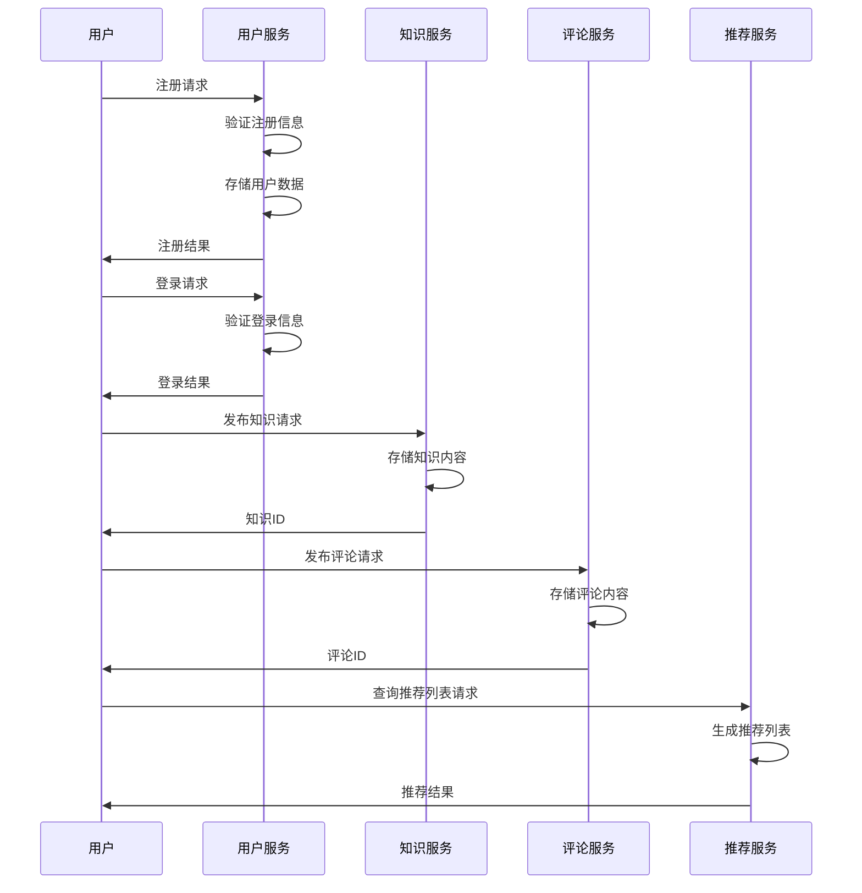
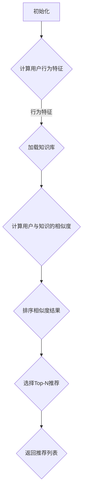

                 

# 跨代际知识交换市场：智慧共享的在线平台

## 关键词

- 跨代际知识交换
- 在线平台
- 智慧共享
- 知识管理
- 人工智能

## 摘要

随着信息时代的快速发展，跨代际知识交换成为知识管理和共享的重要需求。本文旨在探讨构建一个智慧共享的在线平台，通过跨代际知识交换市场的实现，推动知识的流动和创新。文章首先分析了市场背景和需求，然后详细介绍了在线平台的设计原则、架构设计、前端开发、后端开发、安全性设计、性能优化与测试、平台运营与维护，最后通过实际项目实战，探讨了平台的最佳实践和注意事项。

## 引言

在当今数字化时代，知识已成为企业和社会发展的核心资源。如何高效地管理和交换知识，成为了各个领域关注的焦点。特别是跨代际知识交换，它不仅仅涉及到不同年龄段的知识流动，更关乎不同经验积累的共享和利用。构建一个智慧共享的在线平台，能够极大地促进知识的跨代际流动，提高整体知识管理水平。

本文将围绕跨代际知识交换市场，探讨如何构建一个在线平台。通过系统分析市场背景和需求，详细设计平台架构和功能模块，实现前端与后端的开发，确保平台的安全性和性能，并最终完成平台的运营与维护。文章结构如下：

1. 市场背景与需求分析
2. 在线平台设计原则
3. 在线平台架构设计
4. 技术实现与平台开发
5. 平台安全性设计
6. 平台性能优化与测试
7. 平台运营与维护
8. 项目实战
9. 总结与展望

## 第一部分：市场背景与需求分析

### 1.1 跨代际知识交换的现状

跨代际知识交换指的是在不同年龄段之间进行的知识传递和共享。随着互联网和信息技术的发展，跨代际知识交换的形式和渠道也在不断丰富。传统的方式如讲座、研讨会、书籍等，逐渐被在线课程、社交媒体、专业论坛等新型平台所取代。

然而，当前跨代际知识交换仍面临诸多挑战。首先，不同年龄段的知识需求存在显著差异，老年人更倾向于回忆历史和文化，而年轻人则更关注新兴技术和未来趋势。其次，知识交换的效率低下，许多知识因难以获取或使用不当而未能得到充分利用。最后，知识交换的机制和平台建设不足，限制了知识的跨代际流动。

### 1.2 市场需求与机遇

随着老龄化社会的到来和知识经济的兴起，跨代际知识交换市场需求日益增长。老年人希望分享自己的经验和智慧，年轻一代则渴望从前辈的积累中学习。同时，企业和组织也需要通过跨代际知识交换来提升整体知识水平，增强竞争力。

此外，智慧共享的在线平台为跨代际知识交换提供了新的机遇。通过构建一个集成化的在线平台，可以实现知识的快速获取、便捷分享和高效利用，满足不同用户的需求。在线平台的灵活性、互动性和便捷性，使得跨代际知识交换更加高效和有趣。

### 1.3 跨代际知识交换的挑战

尽管市场需求和机遇明显，但跨代际知识交换仍面临诸多挑战。首先，知识内容的质量和准确性需要保证。不同年龄段的知识背景和表达方式可能存在差异，如何确保知识内容的准确性和实用性，是一个重要问题。

其次，知识交换的过程需要有效的激励机制。在当前的互联网环境中，内容创作和分享的积极性不高，如何激发用户参与知识交换，提高知识内容的丰富性和多样性，也是一个挑战。

最后，平台的可持续性是一个关键问题。在线平台的运营和维护需要大量的人力、物力和财力投入，如何实现平台的长期可持续发展，保持高质量的服务和内容，是平台成功的关键。

### 1.4 跨代际知识交换市场的边界与外延

跨代际知识交换市场的边界主要涉及知识的内容、形式和参与者。内容方面，市场涵盖了历史、文化、技术、艺术等多领域知识；形式方面，市场包括在线课程、论坛、社交媒体等多种平台和渠道；参与者方面，市场涵盖了不同年龄段的个人、企业和组织。

跨代际知识交换市场的外延还包括知识的价值评估、知识共享的机制设计、知识管理的体系构建等方面。这些方面都是构建智慧共享在线平台的重要内容，需要在市场实践中不断探索和完善。

### 1.5 跨代际知识交换市场的核心要素

要构建一个成功的跨代际知识交换市场，需要关注以下几个核心要素：

1. **知识内容质量**：确保知识内容的准确性和实用性，提供高质量的知识服务。
2. **用户体验**：优化用户界面和交互设计，提高用户满意度和粘性。
3. **激励机制**：设计有效的激励机制，鼓励用户参与知识交换和内容创作。
4. **平台技术**：采用先进的技术手段，提高平台的功能性和稳定性。
5. **知识管理**：建立完善的知识管理体系，确保知识的高效流动和利用。
6. **法律法规**：遵守相关法律法规，保护用户隐私和知识产权。

这些核心要素相互关联，共同构成了跨代际知识交换市场的基石。在构建智慧共享在线平台的过程中，需要综合考虑这些要素，确保平台的可持续发展和用户价值的最大化。

## 第二部分：在线平台设计原则

### 2.1 设计原则概述

在线平台的设计原则是构建智慧共享的跨代际知识交换市场的基础。一个优秀的在线平台应具备以下几个核心设计原则：

1. **用户体验优先**：以用户为中心，优化用户界面和交互设计，提供便捷、高效的使用体验。
2. **功能全面丰富**：提供多样化、全面的知识交换功能，满足不同用户的需求。
3. **技术先进可靠**：采用先进的技术手段，确保平台的稳定性和高性能。
4. **激励机制有效**：设计有效的激励机制，激发用户参与知识交换和内容创作。
5. **知识管理科学**：建立完善的知识管理体系，确保知识的高效流动和利用。
6. **可持续性保障**：确保平台的长期可持续发展，持续优化和更新。

### 2.2 设计目标

在线平台的设计目标主要包括以下几个方面：

1. **提升知识交换效率**：通过优化平台功能和用户界面，提高知识交换的效率，缩短知识获取的时间。
2. **增强用户体验**：提供个性化推荐、实时互动等功能，提升用户满意度和粘性。
3. **丰富知识内容**：鼓励用户参与知识交换和内容创作，提高知识内容的丰富性和多样性。
4. **保障平台安全**：确保用户数据的安全和隐私，防范各类网络安全威胁。
5. **优化平台性能**：通过技术手段优化，提高平台的响应速度和稳定性。

### 2.3 功能需求分析

在线平台的功能需求是设计过程中的重要环节。以下是对核心功能需求的详细分析：

1. **用户注册与登录**：提供便捷的用户注册和登录功能，支持多种身份验证方式，如邮箱、手机号和第三方账号登录。
2. **个人主页**：为每位用户建立个人主页，展示其基本信息、知识贡献和互动记录。
3. **知识分享**：支持用户上传、发布和分享各类知识内容，如文章、视频、图片等。
4. **知识搜索**：提供强大的搜索功能，支持关键词搜索、分类搜索等多种方式，便于用户快速找到所需知识。
5. **知识评论**：支持用户对知识内容进行评论和讨论，促进知识交流与互动。
6. **知识推荐**：根据用户行为和偏好，提供个性化推荐，提升用户的知识获取体验。
7. **用户互动**：提供实时聊天、群组讨论等功能，增强用户之间的互动与联系。
8. **知识管理**：建立完善的知识管理体系，包括知识审核、分类、标签、收藏等功能，确保知识的高效管理和利用。
9. **数据统计分析**：提供全面的数据统计分析功能，帮助平台运营者了解用户行为和知识流动情况，优化平台运营策略。
10. **权限管理**：设置用户权限分级，确保不同权限用户能够访问和使用相应的功能，保护用户隐私和知识产权。

### 2.4 功能需求细节

在具体实现过程中，功能需求的细节设计至关重要。以下是对部分核心功能需求的进一步细化：

1. **用户注册与登录**
   - 注册流程：用户可通过邮箱、手机号和第三方账号进行注册。注册页面应简洁明了，引导用户完成注册。
   - 登录流程：支持密码登录和验证码登录，提高登录安全性。
   - 多身份验证：支持微信、QQ、微博等第三方账号登录，方便用户快速注册和登录。

2. **个人主页**
   - 展示内容：个人主页应展示用户基本信息、知识贡献、互动记录等，方便用户了解和关注。
   - 个性化设置：用户可自定义个人主页背景、头像等，展示个人特色。

3. **知识分享**
   - 内容格式：支持多种内容格式，如文本、图片、视频等，满足用户多样化的知识分享需求。
   - 分类标签：设置分类标签，便于用户和管理员对知识内容进行分类和管理。

4. **知识搜索**
   - 关键词搜索：支持关键词搜索，用户可通过输入关键词快速找到相关知识。
   - 分类搜索：提供分类搜索功能，用户可根据不同分类浏览知识内容。
   - 搜索建议：根据用户历史搜索记录和热门搜索关键词，提供智能搜索建议，提高搜索效率。

5. **知识评论**
   - 评论功能：用户可以对知识内容进行评论，发表自己的看法和观点。
   - 互动提醒：当用户发表评论后，系统可发送提醒通知，增强互动体验。

6. **知识推荐**
   - 推荐算法：采用个性化推荐算法，根据用户行为和偏好推荐相关知识。
   - 推荐展示：在用户个人主页、搜索结果页等位置展示推荐内容，提高用户知识获取体验。

7. **用户互动**
   - 实时聊天：支持用户之间实时聊天，促进知识交流与互动。
   - 群组讨论：创建和加入不同主题的群组，用户可在群组内进行讨论和分享。

8. **知识管理**
   - 审核机制：设置知识内容审核机制，确保知识内容的准确性和合法性。
   - 分类管理：对知识内容进行分类管理，方便用户查找和使用。
   - 标签管理：设置标签体系，便于用户对知识内容进行多维度分类和搜索。
   - 收藏功能：支持用户收藏知识内容，便于后续查看和使用。

9. **数据统计分析**
   - 用户行为分析：统计用户行为数据，如访问量、搜索量、评论量等，帮助平台运营者了解用户需求和偏好。
   - 知识流动分析：分析知识内容在平台上的流动情况，优化知识管理和推荐策略。

10. **权限管理**
    - 用户权限分级：设置不同权限等级，确保用户在平台上的操作权限。
    - 权限设置：管理员可根据用户角色和职责，设置相应的权限。

通过以上详细的功能需求分析，我们可以确保在线平台在功能设计上满足用户需求，实现高效、便捷的知识交换和共享。

## 第三部分：在线平台架构设计

### 3.1 系统架构设计概述

在线平台的架构设计是确保平台稳定、高效运行的关键。一个合理的系统架构能够提高平台的扩展性、可靠性和性能，为用户提供优质的使用体验。本节将介绍在线平台的系统架构设计，包括设计原则、设计目标和系统模块划分。

#### 3.1.1 设计原则

1. **模块化设计**：将系统功能划分为多个模块，每个模块独立实现，便于开发和维护。
2. **分层架构**：采用分层架构，将系统分为表示层、业务逻辑层和数据层，实现职责分离，提高系统可维护性和可扩展性。
3. **高可用性**：设计高可用性架构，确保平台在遇到故障时能够快速恢复，降低对用户的影响。
4. **高性能**：优化系统性能，提高响应速度和并发处理能力，为用户提供流畅的使用体验。
5. **安全性**：加强安全性设计，保护用户数据和平台安全，防范各类网络安全威胁。

#### 3.1.2 设计目标

1. **稳定性**：确保平台在大量用户并发访问下依然能够稳定运行，减少故障和中断。
2. **扩展性**：支持平台功能的扩展和升级，适应不断变化的市场需求。
3. **高性能**：提高平台的处理能力和响应速度，提升用户使用体验。
4. **安全性**：确保用户数据和平台安全，防范各类网络攻击和安全隐患。
5. **易维护**：简化系统架构，降低开发和维护成本，提高开发效率。

### 3.2 系统模块划分与设计

在线平台系统模块划分如下：

1. **表示层**：主要负责用户界面展示和用户操作交互，包括前端页面和移动应用开发。
2. **业务逻辑层**：负责业务逻辑的处理，包括用户管理、知识管理、推荐系统、互动功能等。
3. **数据层**：负责数据存储和访问，包括关系型数据库和NoSQL数据库。
4. **基础设施层**：提供服务器、存储、网络等基础设施支持，确保平台的高可用性和性能。

#### 3.2.1 表示层设计

表示层是用户与平台交互的界面，主要包括以下模块：

1. **用户登录注册模块**：实现用户注册、登录、认证等功能，支持多种登录方式，如邮箱、手机号、第三方账号登录。
2. **首页展示模块**：展示平台推荐内容、热门话题、知识分类等，提供个性化推荐功能。
3. **知识内容展示模块**：展示知识内容，包括文章、视频、图片等，支持查看、评论、分享等功能。
4. **搜索模块**：提供强大的搜索功能，支持关键词搜索、分类搜索等，方便用户快速找到所需知识。
5. **个人主页模块**：展示用户个人基本信息、知识贡献、互动记录等，支持个性化设置。

#### 3.2.2 业务逻辑层设计

业务逻辑层是系统的核心，负责处理业务逻辑和业务流程，主要包括以下模块：

1. **用户管理模块**：实现用户注册、登录、认证、个人信息管理等功能，确保用户数据的安全性和隐私保护。
2. **知识管理模块**：实现知识内容的管理，包括知识发布、审核、分类、标签、收藏等功能，确保知识内容的质量和准确性。
3. **推荐系统模块**：采用个性化推荐算法，根据用户行为和偏好推荐相关内容，提高用户知识获取效率。
4. **互动功能模块**：实现用户之间的互动，包括评论、点赞、私信、群组等功能，促进知识交流和互动。
5. **权限管理模块**：设置用户权限分级，确保不同权限用户能够访问和使用相应的功能，保护用户隐私和知识产权。

#### 3.2.3 数据层设计

数据层负责数据存储和访问，主要包括以下模块：

1. **关系型数据库**：用于存储用户数据、知识内容、评论等结构化数据，如MySQL、PostgreSQL等。
2. **NoSQL数据库**：用于存储非结构化数据，如用户行为数据、推荐算法数据等，如MongoDB、Redis等。
3. **数据存储方案**：采用分布式存储方案，提高数据存储的可靠性和扩展性，确保数据的安全和高效访问。

#### 3.2.4 基础设施层设计

基础设施层提供服务器、存储、网络等基础设施支持，主要包括以下模块：

1. **服务器**：提供服务器资源，支持平台的高并发访问和负载均衡。
2. **存储**：提供数据存储方案，支持关系型数据库和NoSQL数据库的高效存储和访问。
3. **网络**：提供稳定、安全的网络环境，确保平台的数据传输和访问速度。

通过以上模块划分和设计，我们可以构建一个稳定、高效、可扩展的在线平台，满足跨代际知识交换市场的需求。

### 3.3 系统模块间交互关系

在线平台的各个模块之间通过API接口进行交互，确保系统的高效运行和数据一致性。以下是对系统模块间交互关系的详细描述：

1. **用户管理模块**与其他模块的交互关系：
   - 用户管理模块与表示层交互，接收用户的注册、登录请求，返回认证结果。
   - 用户管理模块与业务逻辑层交互，管理用户信息和权限，确保用户数据的安全性和一致性。
   - 用户管理模块与数据层交互，存储和查询用户数据，如用户注册信息、权限信息等。

2. **知识管理模块**与其他模块的交互关系：
   - 知识管理模块与表示层交互，接收用户的发布、编辑、删除知识内容的请求，返回操作结果。
   - 知识管理模块与业务逻辑层交互，处理知识内容的审核、分类、标签等操作，确保知识内容的质量和准确性。
   - 知识管理模块与数据层交互，存储和查询知识内容数据，如文章、视频、图片等。

3. **推荐系统模块**与其他模块的交互关系：
   - 推荐系统模块与表示层交互，根据用户行为和偏好推荐相关内容，展示推荐结果。
   - 推荐系统模块与业务逻辑层交互，处理用户行为数据的收集、分析和推荐算法的执行。
   - 推荐系统模块与数据层交互，存储和查询用户行为数据，如浏览记录、搜索记录等。

4. **互动功能模块**与其他模块的交互关系：
   - 互动功能模块与表示层交互，接收用户的评论、点赞、私信等请求，返回操作结果。
   - 互动功能模块与业务逻辑层交互，处理用户之间的互动行为，如评论审核、消息推送等。
   - 互动功能模块与数据层交互，存储和查询互动数据，如评论、点赞记录、私信消息等。

5. **权限管理模块**与其他模块的交互关系：
   - 权限管理模块与表示层交互，根据用户的权限等级显示相应的功能和操作。
   - 权限管理模块与业务逻辑层交互，管理用户权限和角色，确保权限分级的合理性。
   - 权限管理模块与数据层交互，存储和查询权限数据，如用户角色、权限设置等。

通过以上模块间交互关系的描述，我们可以确保在线平台的各个模块协同工作，实现高效、稳定的数据处理和功能执行。

### 3.4 数据库设计与存储方案

在线平台的数据库设计是系统架构设计的重要组成部分，直接影响到平台的数据存储效率、访问速度和系统性能。以下是对数据库设计原则、数据库结构设计、存储方案的选择以及数据迁移策略的详细描述。

#### 3.4.1 数据库设计原则

1. **规范化**：遵循数据库规范化原则，避免数据冗余和更新异常，提高数据的一致性和完整性。
2. **高性能**：选择适合数据库的性能优化策略，如索引、缓存、查询优化等，确保数据访问的高效性。
3. **可扩展性**：设计可扩展的数据库结构，支持平台功能的扩展和升级，满足未来业务需求。
4. **安全性**：确保数据库的安全性和数据隐私保护，防范数据库入侵和数据泄露。
5. **高可用性**：设计高可用性数据库架构，如主从复制、数据备份和恢复机制等，保障数据的可靠性和持久性。

#### 3.4.2 数据库结构设计

在线平台的数据库结构设计如下：

1. **用户数据库**：存储用户基本信息、权限信息等，包括用户表（user\_id、username、password、email、role等）、权限表（role\_id、role\_name、role\_description等）。
2. **知识数据库**：存储知识内容、分类、标签等，包括知识表（knowledge\_id、user\_id、title、content、category、tags、status等）、分类表（category\_id、category\_name、parent\_id等）、标签表（tag\_id、tag\_name等）。
3. **评论数据库**：存储用户对知识内容的评论信息，包括评论表（comment\_id、user\_id、knowledge\_id、content、status等）。
4. **互动数据库**：存储用户之间的互动信息，包括点赞表（like\_id、user\_id、knowledge\_id、status等）、私信表（message\_id、sender\_id、receiver\_id、content、status等）。
5. **推荐数据库**：存储推荐算法所需的数据，包括用户行为表（behavior\_id、user\_id、action、knowledge\_id、timestamp等）。

#### 3.4.3 存储方案的选择

1. **关系型数据库**：选择关系型数据库（如MySQL、PostgreSQL）作为主要存储方案，用于存储结构化数据，如用户信息、知识内容、评论等。关系型数据库具有成熟的技术生态、强大的查询能力和良好的数据一致性。
2. **NoSQL数据库**：选择NoSQL数据库（如MongoDB、Redis）作为辅助存储方案，用于存储非结构化数据，如用户行为数据、推荐算法数据等。NoSQL数据库具有高性能、高扩展性和灵活性。
3. **分布式存储**：采用分布式存储方案，将数据分散存储在多个节点上，提高数据存储的可靠性和扩展性。分布式存储方案可以水平扩展，支持大规模数据存储和访问。

#### 3.4.4 数据迁移策略

在平台升级或数据架构调整时，数据迁移是关键步骤。以下是一些数据迁移策略：

1. **数据备份**：在数据迁移前，进行完整的数据备份，确保数据的安全和一致性。
2. **数据清洗**：对现有数据进行清洗和整理，确保数据的准确性和完整性。
3. **数据映射**：建立新数据库表与旧数据库表之间的映射关系，确保数据迁移的准确性。
4. **分批迁移**：将数据分批次迁移，避免单次迁移过程中出现数据丢失或错误。
5. **验证和修复**：在数据迁移完成后，对数据进行验证和修复，确保数据的一致性和完整性。

通过以上数据库设计原则、结构设计、存储方案选择和数据迁移策略的详细描述，我们可以确保在线平台的数据存储和访问高效、稳定和安全。

### 3.5 系统架构设计

#### 3.5.1 问题场景介绍

跨代际知识交换在线平台旨在解决知识在不同年龄段之间的传递和共享问题。随着信息技术的快速发展，用户对知识获取的需求日益多样化，平台需要具备高效的知识管理、推荐和互动功能。然而，随着用户数量和知识内容的增加，系统架构的扩展性和性能成为一个重要挑战。

#### 3.5.2 项目介绍

本项目旨在设计并实现一个跨代际知识交换在线平台，通过以下核心功能满足用户需求：

1. 用户注册与登录：支持多种身份验证方式，确保用户安全和便捷使用。
2. 知识分享与浏览：提供知识发布、分类、标签、搜索等功能，方便用户获取所需知识。
3. 互动与推荐：支持评论、点赞、推荐等功能，促进知识交流与互动。
4. 数据分析与权限管理：提供用户行为分析、权限管理功能，优化平台运营和用户体验。

#### 3.5.3 系统功能设计

系统功能设计采用领域驱动设计（Domain-Driven Design, DDD）方法，将系统功能划分为多个领域模型，包括用户领域、知识领域、互动领域等。以下是对各个领域模型的详细描述：

1. **用户领域模型**：
   - **实体**：用户（User）
   - **属性**：用户名（username）、密码（password）、邮箱（email）、角色（role）
   - **关系**：用户与角色（多对一）、用户与知识（一对多）
   - **功能**：用户注册、登录、信息管理、权限验证等

2. **知识领域模型**：
   - **实体**：知识（Knowledge）
   - **属性**：知识ID（knowledge\_id）、用户ID（user\_id）、标题（title）、内容（content）、分类（category）、标签（tags）、状态（status）
   - **关系**：知识与分类（一对多）、知识与标签（多对多）
   - **功能**：知识发布、审核、分类管理、标签管理、搜索等

3. **互动领域模型**：
   - **实体**：评论（Comment）
   - **属性**：评论ID（comment\_id）、用户ID（user\_id）、知识ID（knowledge\_id）、内容（content）、状态（status）
   - **关系**：评论与用户（一对多）、评论与知识（一对多）
   - **功能**：评论发布、审核、回复、点赞等

4. **推荐领域模型**：
   - **实体**：推荐（Recommendation）
   - **属性**：推荐ID（recommendation\_id）、用户ID（user\_id）、知识ID（knowledge\_id）、推荐类型（type）
   - **关系**：推荐与用户（一对多）、推荐与知识（一对多）
   - **功能**：推荐算法实现、推荐结果展示等

#### 3.5.4 系统架构设计

系统架构设计采用微服务架构（Microservices Architecture），将系统功能划分为多个微服务，确保系统的高扩展性、高可用性和易维护性。以下是对各个微服务的详细描述：

1. **用户服务（UserService）**：负责用户注册、登录、认证、信息管理等功能。
2. **知识服务（KnowledgeService）**：负责知识发布、审核、分类管理、标签管理、搜索等功能。
3. **评论服务（CommentService）**：负责评论发布、审核、回复、点赞等功能。
4. **推荐服务（RecommendationService）**：负责推荐算法实现、推荐结果展示等功能。
5. **权限服务（PermissionService）**：负责权限管理、角色管理等功能。
6. **数据服务（DataService）**：负责数据存储、查询、迁移等功能。

各个微服务通过RESTful API进行交互，确保系统模块之间的高效通信和协同工作。以下是一个简单的系统架构图：

```mermaid
graph TB

UserService --> KnowledgeService
UserService --> CommentService
UserService --> RecommendationService
UserService --> PermissionService
KnowledgeService --> DataService
CommentService --> DataService
RecommendationService --> DataService
PermissionService --> DataService

[UserService] --> "User API"
[KnowledgeService] --> "Knowledge API"
[CommentService] --> "Comment API"
[RecommendationService] --> "Recommendation API"
[PermissionService] --> "Permission API"
[DataService] --> "Data API"

```

通过以上系统架构设计，我们可以实现一个高效、稳定、可扩展的跨代际知识交换在线平台，满足用户的需求。

### 3.6 系统接口设计和系统交互

为了确保在线平台能够高效运行，系统接口设计和系统交互设计是至关重要的一环。本节将详细描述系统接口设计、系统交互流程以及系统交互序列图。

#### 3.6.1 系统接口设计

系统接口设计采用RESTful API风格，为各个微服务提供统一的接口规范。以下是一些核心接口的设计：

1. **用户接口（UserService）**：
   - 用户注册（POST /users/register）：接收用户注册信息，返回注册结果。
   - 用户登录（POST /users/login）：接收用户登录信息，返回登录状态和Token。
   - 用户信息更新（PUT /users/{user_id}）：接收用户更新信息，更新用户资料。
   - 用户信息查询（GET /users/{user_id}）：查询用户详细信息。

2. **知识接口（KnowledgeService）**：
   - 知识发布（POST /knowledge）：接收用户发布的新知识内容，存储并返回知识ID。
   - 知识查询（GET /knowledge/{knowledge_id}）：查询特定知识内容。
   - 知识列表查询（GET /knowledge）：查询知识列表，可按分类、标签等进行筛选。

3. **评论接口（CommentService）**：
   - 评论发布（POST /knowledge/{knowledge_id}/comments）：接收评论内容，存储并返回评论ID。
   - 评论查询（GET /knowledge/{knowledge_id}/comments）：查询特定知识下的评论列表。
   - 评论删除（DELETE /knowledge/{knowledge_id}/comments/{comment_id}）：删除指定评论。

4. **推荐接口（RecommendationService）**：
   - 推荐列表查询（GET /recommendations）：查询个性化推荐的知识列表。

5. **权限接口（PermissionService）**：
   - 权限查询（GET /permissions/{role_id}）：查询特定角色的权限列表。

#### 3.6.2 系统交互流程

在线平台中的各个微服务通过API接口进行交互，以下是一个典型的用户行为流程：

1. **用户注册**：
   - 用户通过用户接口提交注册信息。
   - 用户服务验证注册信息，存储用户数据，并返回注册结果。

2. **用户登录**：
   - 用户通过用户接口提交登录信息。
   - 用户服务验证登录信息，返回登录状态和Token。

3. **知识发布**：
   - 用户通过知识接口提交新知识内容。
   - 知识服务存储知识内容，并返回知识ID。

4. **评论发布**：
   - 用户通过评论接口提交评论内容。
   - 评论服务存储评论内容，并返回评论ID。

5. **推荐查询**：
   - 用户通过推荐接口查询个性化推荐的知识列表。
   - 推荐服务根据用户行为生成推荐列表，返回给用户。

6. **权限查询**：
   - 用户通过权限接口查询特定角色的权限列表。

#### 3.6.3 系统交互序列图

以下是一个简单的系统交互序列图，描述了用户从登录到获取推荐知识的全过程：



通过以上系统接口设计、系统交互流程和系统交互序列图的描述，我们可以确保在线平台各个模块之间的协同工作，实现高效、稳定的知识交换和共享。

## 第四部分：技术实现与平台开发

### 4.1 前端设计与开发

前端设计是构建在线平台的重要环节，直接影响用户的体验和平台的易用性。在这一节中，我们将详细讨论前端框架的选择、前端功能实现以及前端界面设计。

#### 4.1.1 前端框架选择

当前市面上有许多前端框架可供选择，如React、Vue和Angular。每个框架都有其独特的优点和适用场景。以下是几个主要框架的简要对比：

1. **React**：
   - **优点**：组件化开发，灵活度高，适合大型应用；强大的社区支持，丰富的第三方库。
   - **适用场景**：需要高灵活性、可扩展性的复杂应用。
2. **Vue**：
   - **优点**：简洁易学，上手快；响应式数据绑定，性能较好；生态丰富，文档完整。
   - **适用场景**：对性能和开发效率有较高要求的中小型应用。
3. **Angular**：
   - **优点**：强类型语言 TypeScript 支持，开发效率高；完整的前后端分离架构。
   - **适用场景**：需要高安全性和复杂业务逻辑的大型企业级应用。

综合考虑项目的需求、团队的技术栈以及开发效率，我们选择Vue作为前端框架。Vue的响应式数据绑定和简洁的组件化设计，使得开发过程更加高效，同时也便于维护和扩展。

#### 4.1.2 前端功能实现

前端功能实现是构建在线平台的核心步骤，包括用户注册与登录、知识分享与浏览、评论与互动、个性化推荐等功能。

1. **用户注册与登录**：
   - 用户注册：通过表单验证用户信息，包括用户名、密码、邮箱等，确保输入信息的合法性和唯一性。注册成功后，将用户信息存储到后端数据库。
   - 用户登录：验证用户提供的用户名和密码，返回登录状态和Token，使用户可以访问平台的各种功能。

2. **知识分享与浏览**：
   - 知识发布：提供表单让用户输入知识标题、内容、分类和标签等信息，提交后存储到后端数据库，并在前端页面展示。
   - 知识浏览：实现分页加载知识内容，支持按分类、标签、搜索关键字等进行筛选，提高用户体验。

3. **评论与互动**：
   - 评论发布：用户可以对知识内容进行评论，评论内容提交后存储到后端数据库，并在知识内容页展示。
   - 评论互动：支持评论的点赞、回复功能，通过API与后端进行数据交互，更新评论的状态。

4. **个性化推荐**：
   - 推荐算法：根据用户的历史行为和偏好，使用推荐算法生成个性化推荐列表。
   - 推荐展示：在用户个人主页和首页展示推荐的知识内容，提高用户的知识获取效率。

#### 4.1.3 前端界面设计

前端界面设计是用户体验的重要组成部分。以下是一些关键的前端界面设计原则和工具：

1. **响应式设计**：采用响应式设计，确保平台在不同设备和屏幕尺寸上都能提供良好的用户体验。
2. **简洁明了**：界面设计简洁明了，避免冗余和复杂的布局，使用户能够快速找到所需功能。
3. **交互反馈**：提供及时、清晰的交互反馈，如加载动画、提示信息等，提高用户的操作信心。
4. **颜色和字体**：使用合适的颜色和字体，确保界面美观且易于阅读。
5. **UI组件库**：使用现成的UI组件库，如Vuetify或Ant Design，提高开发效率和界面一致性。

通过以上前端设计与开发，我们可以构建一个功能丰富、界面美观的在线平台，满足用户的知识交换和共享需求。

### 4.2 后端设计与开发

后端设计是构建在线平台的核心，它决定了平台的功能实现、性能优化和数据安全性。在这一节中，我们将详细讨论后端框架选择、后端功能实现以及后端安全设计。

#### 4.2.1 后端框架选择

当前市面上有许多后端框架可供选择，如Spring Boot、Django和Express等。每个框架都有其独特的优点和适用场景。以下是几个主要框架的简要对比：

1. **Spring Boot**：
   - **优点**：成熟的Java生态，支持多种数据库和中间件；强大的功能模块，如事务管理、安全认证等。
   - **适用场景**：需要高安全性和复杂业务逻辑的大型企业级应用。
2. **Django**：
   - **优点**：Python生态，开发速度快，自带ORM和丰富的内置功能；适合快速开发中小型应用。
   - **适用场景**：对开发速度有较高要求的中小型应用。
3. **Express**：
   - **优点**：轻量级，易于扩展，灵活性强；社区支持强大，适合构建RESTful API。
   - **适用场景**：需要高性能和灵活性的中小型应用。

综合考虑项目的需求、团队的技术栈以及开发效率，我们选择Express作为后端框架。Express的轻量级和高性能，使得开发过程更加高效，同时也便于维护和扩展。

#### 4.2.2 后端功能实现

后端功能实现是平台功能的核心部分，包括用户管理、知识管理、评论管理和推荐系统等。

1. **用户管理**：
   - 用户注册：接收前端发送的用户注册请求，验证用户信息，存储用户数据，返回注册结果。
   - 用户登录：验证用户信息，返回登录状态和Token。
   - 用户信息管理：提供用户信息的修改和查询功能。

2. **知识管理**：
   - 知识发布：接收前端发送的知识内容，存储知识数据，返回知识ID。
   - 知识查询：提供按分类、标签、搜索关键字等条件的知识内容查询功能。
   - 知识审核：对用户发布的内容进行审核，确保内容质量和平台规范。

3. **评论管理**：
   - 评论发布：接收前端发送的评论内容，存储评论数据，返回评论ID。
   - 评论查询：提供按知识ID查询评论的功能。
   - 评论审核：对评论内容进行审核，确保评论的合法性和准确性。

4. **推荐系统**：
   - 推荐算法：根据用户的历史行为和偏好，生成个性化推荐列表。
   - 推荐展示：将推荐结果返回给前端，展示给用户。

#### 4.2.3 后端安全设计

后端安全设计是确保平台数据和用户信息安全的关键。以下是一些关键的后端安全设计原则和措施：

1. **认证与授权**：
   - 认证：使用JWT（JSON Web Token）进行用户认证，确保用户登录后可以访问相应权限的资源。
   - 授权：根据用户角色和权限，限制用户访问的资源，确保数据的安全和隐私。

2. **输入验证**：
   - 防止SQL注入和XSS攻击：使用参数化查询和输入过滤，确保输入数据的合法性。
   - 验证用户输入：确保输入数据的长度、格式和类型符合预期，避免恶意输入。

3. **加密与传输安全**：
   - 数据加密：使用AES等加密算法对敏感数据进行加密存储。
   - 传输安全：使用HTTPS协议进行数据传输，确保数据在传输过程中的安全性。

4. **日志与监控**：
   - 日志记录：记录系统操作日志，方便排查问题和追踪异常。
   - 监控告警：设置实时监控和告警机制，及时发现和处理安全事件。

通过以上后端设计与开发，我们可以构建一个功能强大、安全可靠的在线平台，满足用户的知识交换和共享需求。

### 4.3 平台安全性设计

随着在线平台的广泛应用，安全性设计成为平台构建的关键环节。平台安全性设计需要综合考虑用户数据安全、系统安全、网络安全等多方面因素，确保平台在复杂网络环境中能够稳定运行。

#### 4.3.1 用户数据安全

用户数据安全是平台安全的核心。为了保障用户数据的安全，需要采取以下措施：

1. **用户认证与授权**：
   - **多因素认证**：采用多因素认证（MFA）机制，如密码+手机验证码、密码+指纹等，提高用户账号的安全性。
   - **权限控制**：根据用户角色和权限，限制用户对数据和功能的访问，确保敏感数据只能被授权用户访问。

2. **数据加密**：
   - **存储加密**：对用户数据进行加密存储，如用户密码、邮箱等敏感信息，使用AES等加密算法进行加密。
   - **传输加密**：使用HTTPS协议进行数据传输，确保数据在传输过程中的安全性和完整性。

3. **数据备份与恢复**：
   - **定期备份**：定期备份用户数据，确保在数据丢失或损坏时能够快速恢复。
   - **灾难恢复**：建立灾难恢复计划，确保在发生重大事故时能够快速恢复系统。

4. **安全审计**：
   - **日志记录**：记录系统操作日志，监控用户行为，及时发现和处理潜在的安全风险。
   - **安全审计**：定期进行安全审计，检查系统安全策略的执行情况和潜在的安全漏洞。

#### 4.3.2 系统安全

系统安全设计旨在保护平台的基础设施和软件系统，确保平台的稳定性和可靠性。以下是一些关键措施：

1. **防火墙与入侵检测**：
   - **防火墙**：设置防火墙规则，过滤非法访问和恶意攻击，保护平台服务器和数据库。
   - **入侵检测系统**：部署入侵检测系统（IDS），实时监控和检测网络攻击行为，及时响应和处理。

2. **安全更新与补丁管理**：
   - **自动更新**：定期更新操作系统、应用程序和中间件，确保系统安全。
   - **补丁管理**：及时部署安全补丁，修复已知的漏洞和风险。

3. **安全配置**：
   - **最小权限原则**：确保系统和服务以最小权限运行，减少潜在的安全风险。
   - **配置审计**：定期进行系统配置审计，检查配置项是否符合安全规范。

4. **安全培训**：
   - **员工培训**：定期开展安全培训，提高员工的安全意识和技能。
   - **安全文化**：营造良好的安全文化氛围，促进全员参与安全管理。

#### 4.3.3 网络安全

网络安全设计旨在确保平台在网络环境中的安全性和可靠性。以下是一些关键措施：

1. **VPN与DDoS防护**：
   - **VPN**：使用VPN技术，确保远程访问的安全性和可靠性。
   - **DDoS防护**：部署DDoS防护设备或服务，防范分布式拒绝服务攻击。

2. **网络隔离与防火墙**：
   - **网络隔离**：通过防火墙和虚拟局域网（VLAN）技术，实现不同网络区域的隔离，防止攻击者横向移动。
   - **防火墙**：配置防火墙规则，严格控制内外网访问，防止非法访问和数据泄露。

3. **入侵防御系统**：
   - **IDS/IPS**：部署入侵防御系统（IDS/IPS），实时监控和防御网络攻击。

4. **安全策略与合规性**：
   - **安全策略**：制定并实施网络安全策略，确保网络环境的安全和管理。
   - **合规性检查**：定期进行安全合规性检查，确保平台遵守相关法律法规和行业标准。

通过以上平台安全性设计的详细描述，我们可以构建一个安全、可靠的在线平台，为用户提供优质的知识交换和共享服务。

### 4.4 平台性能优化与测试

平台性能优化与测试是确保在线平台高效运行的关键步骤。一个高效的平台不仅能够提供良好的用户体验，还能提高系统的稳定性和可靠性。以下将详细介绍平台性能优化策略、测试策略与流程以及部署方案与实施。

#### 4.4.1 平台性能优化策略

1. **数据库优化**：
   - **索引优化**：根据查询需求创建适当的索引，提高查询效率。
   - **分库分表**：针对大数据量，采用分库分表策略，降低单表数据量，提高查询性能。
   - **缓存策略**：采用缓存机制，如Redis，减少数据库访问压力，提高系统响应速度。

2. **代码优化**：
   - **减少数据传输**：通过优化数据库查询、避免冗余数据传输等方式，减少数据传输量。
   - **代码优化**：采用高效的算法和数据结构，减少计算复杂度，提高代码执行效率。

3. **缓存机制**：
   - **页面缓存**：采用浏览器缓存和服务器缓存，减少重复数据请求。
   - **接口缓存**：对高频接口数据采用缓存策略，提高接口响应速度。

4. **负载均衡**：
   - **分布式部署**：将系统部署到多个服务器，通过负载均衡器分配请求，提高系统并发处理能力。
   - **数据库分库分表**：针对数据库查询负载，采用分库分表策略，提高查询效率。

5. **服务器优化**：
   - **资源分配**：合理分配服务器资源，如CPU、内存、磁盘等，确保系统运行稳定。
   - **服务器优化**：优化操作系统和网络配置，提高服务器性能。

6. **异步处理**：
   - **消息队列**：采用消息队列技术，如RabbitMQ或Kafka，实现异步处理，提高系统响应速度。

#### 4.4.2 测试策略与流程

1. **功能测试**：
   - **单元测试**：编写单元测试用例，验证每个功能模块的正确性。
   - **集成测试**：在功能模块集成后进行测试，确保系统整体功能的正确性。
   - **性能测试**：模拟高并发用户访问，测试系统性能和稳定性。

2. **性能测试**：
   - **负载测试**：模拟大量用户访问，测试系统的并发处理能力和响应速度。
   - **压力测试**：在极限条件下测试系统的稳定性和可靠性。
   - **性能瓶颈分析**：通过性能测试，找出系统性能瓶颈，进行针对性优化。

3. **安全测试**：
   - **漏洞扫描**：使用工具进行漏洞扫描，发现系统安全漏洞。
   - **安全测试**：模拟攻击行为，验证系统的安全防护能力。

4. **测试流程**：
   - **测试计划**：制定测试计划，明确测试目标、测试范围和测试方法。
   - **测试执行**：按照测试计划执行测试，记录测试结果。
   - **测试报告**：编写测试报告，总结测试结果和发现的问题。

#### 4.4.3 部署方案与实施

1. **部署环境**：
   - **服务器**：选择合适的云服务器，如阿里云、腾讯云等，确保服务器的稳定性和可靠性。
   - **数据库**：部署关系型数据库和NoSQL数据库，如MySQL、MongoDB等。
   - **缓存**：部署Redis缓存服务器，提高系统响应速度。

2. **部署工具**：
   - **Docker**：使用Docker容器化技术，实现快速部署和部署环境的隔离。
   - **Kubernetes**：使用Kubernetes进行容器编排和管理，实现自动化部署和运维。

3. **部署流程**：
   - **环境准备**：搭建部署环境，包括服务器、数据库、缓存等。
   - **代码部署**：通过Docker镜像部署应用代码，确保部署环境的统一性。
   - **服务启动**：启动应用服务，进行初始化和配置。
   - **测试验证**：进行功能测试和性能测试，确保系统正常运行。

4. **监控与运维**：
   - **监控系统**：部署监控工具，如Prometheus、Grafana等，实时监控系统性能和健康状态。
   - **运维管理**：建立运维管理流程，包括故障处理、性能优化、系统升级等。

通过以上平台性能优化与测试、部署方案与实施的详细描述，我们可以确保在线平台在高效、稳定和安全的前提下运行，为用户提供优质的知识交换和共享服务。

### 4.5 平台运营与维护

平台的运营与维护是确保在线平台长期稳定运行、持续提供优质服务的关键。以下将从运营策略、用户增长与留存策略、维护原则与流程以及更新策略与版本控制等方面进行详细探讨。

#### 4.5.1 运营策略

1. **内容策略**：
   - **内容质量控制**：建立内容审核机制，确保知识内容的准确性和合法性，提高平台可信度。
   - **内容推荐策略**：采用个性化推荐算法，根据用户行为和偏好推荐相关内容，提高用户粘性。
   - **内容更新**：定期更新知识内容，保持内容的新鲜度和时效性，满足用户持续学习的需求。

2. **用户策略**：
   - **用户细分**：根据用户年龄、职业、兴趣等特征，进行用户细分，制定针对性的运营策略。
   - **用户互动**：鼓励用户参与知识分享和讨论，建立社区氛围，提升用户活跃度和忠诚度。
   - **用户激励**：设计积分、勋章等激励机制，鼓励用户参与平台活动，提高用户活跃度。

3. **市场推广**：
   - **社交媒体营销**：利用社交媒体平台，如微博、微信等，推广平台，吸引潜在用户。
   - **合作推广**：与相关机构、企业合作，共同推广平台，扩大用户规模。
   - **内容营销**：通过发布高质量的内容，吸引目标用户关注，提升平台知名度。

4. **数据分析**：
   - **用户行为分析**：通过数据分析，了解用户行为和需求，优化平台功能和服务。
   - **运营效果评估**：定期评估运营活动的效果，调整运营策略，提高运营效率。

#### 4.5.2 用户增长与留存策略

1. **用户引流**：
   - **搜索引擎优化（SEO）**：优化平台SEO，提高在搜索引擎中的排名，吸引更多潜在用户。
   - **内容推广**：通过发布高质量的内容，吸引更多用户关注和分享，实现病毒式传播。

2. **用户激活**：
   - **新手引导**：为新手用户提供详细的引导教程，帮助其快速上手使用平台。
   - **激励政策**：通过签到、任务奖励等方式，激发用户活跃度，提升用户留存率。

3. **用户留存**：
   - **个性化推荐**：根据用户行为和偏好，提供个性化推荐，提升用户满意度和使用体验。
   - **用户互动**：通过评论、点赞、私信等功能，增强用户之间的互动，提高用户粘性。
   - **内容更新**：定期更新知识内容，保持内容的新鲜度和时效性，满足用户持续学习的需求。

4. **用户忠诚度**：
   - **会员制度**：建立会员制度，为会员提供专属服务和优惠，提高用户忠诚度。
   - **用户反馈**：积极收集用户反馈，及时解决用户问题，提升用户满意度。
   - **品牌建设**：通过品牌宣传和活动，树立平台良好的口碑和形象，增强用户信任。

#### 4.5.3 维护原则与流程

1. **维护原则**：
   - **预防性维护**：定期进行系统检查和优化，预防潜在问题发生。
   - **修复性维护**：及时修复系统漏洞和故障，确保系统正常运行。
   - **适应性维护**：根据用户需求和业务发展，持续优化和改进系统功能。

2. **维护流程**：
   - **问题反馈**：收集用户反馈和系统故障报告，进行问题分类和优先级排序。
   - **问题分析**：分析问题原因，制定解决方案。
   - **解决方案实施**：执行维护计划，修复系统漏洞和故障。
   - **测试验证**：在实施维护方案后进行测试，确保系统稳定性和功能完整性。
   - **结果反馈**：向用户反馈维护结果，收集用户反馈，优化维护流程。

#### 4.5.4 更新策略与版本控制

1. **更新策略**：
   - **定期更新**：按照固定的时间周期，对系统进行功能优化、漏洞修复和性能提升。
   - **迭代更新**：在版本迭代过程中，逐步引入新功能和改进，确保系统稳定性和用户体验。
   - **紧急更新**：在发现严重漏洞或故障时，立即进行紧急更新，确保系统安全性和稳定性。

2. **版本控制**：
   - **版本号规范**：采用语义化版本号（SemVer），明确版本更新内容，方便用户和管理员跟踪和管理。
   - **代码库管理**：使用Git等版本控制工具，实现代码库的版本管理和协同工作。
   - **更新文档**：编写详细的更新文档，包括更新内容、影响范围、操作步骤等，方便用户和管理员进行更新。

通过以上平台运营与维护的详细描述，我们可以确保在线平台在长期运行过程中，持续提供优质的知识交换和共享服务，满足用户的需求。

### 4.6 项目实战

在本节中，我们将通过一个实际项目案例，详细讲解跨代际知识交换在线平台的搭建过程，包括环境安装、系统核心实现、代码应用解读与分析，以及实际案例分析和详细讲解。

#### 4.6.1 项目概述

项目名称：智慧共享知识交换平台（Smart Knowledge Exchange Platform，简称SKEP）

项目目标：构建一个跨代际知识交换的在线平台，实现知识的快速获取、便捷分享和高效利用。

项目功能：
1. 用户注册与登录：支持用户注册、登录和认证。
2. 知识分享与浏览：用户可以发布、浏览和搜索知识内容。
3. 评论与互动：用户可以对知识内容进行评论、点赞和分享。
4. 个性化推荐：根据用户行为和偏好，推荐相关知识内容。

#### 4.6.2 环境安装

1. **服务器环境**：
   - 操作系统：Ubuntu 20.04
   - 服务器：阿里云ECS实例
   - 数据库：MySQL 8.0
   - 缓存：Redis 6.0
   - Web服务器：Nginx 1.18

2. **开发环境**：
   - 开发工具：Visual Studio Code
   - 版本控制：Git
   - 前端框架：Vue 3.0
   - 后端框架：Express 4.17

#### 4.6.3 系统核心实现

1. **前端核心实现**：
   - **用户注册与登录**：
     ```vue
     <template>
       <div>
         <h1>用户注册</h1>
         <input type="text" v-model="username" placeholder="用户名">
         <input type="password" v-model="password" placeholder="密码">
         <button @click="register">注册</button>
       </div>
     </template>

     <script>
       export default {
         data() {
           return {
             username: '',
             password: ''
           };
         },
         methods: {
           register() {
             // 注册逻辑
             axios.post('/api/users/register', {
               username: this.username,
               password: this.password
             }).then(response => {
               console.log(response.data);
               // 注册成功处理
             }).catch(error => {
               console.log(error);
               // 注册失败处理
             });
           }
         }
       };
     </script>
     ```

   - **知识分享与浏览**：
     ```vue
     <template>
       <div>
         <h1>发布知识</h1>
         <input type="text" v-model="title" placeholder="标题">
         <textarea v-model="content" placeholder="内容"></textarea>
         <button @click="publish">发布</button>
       </div>
     </template>

     <script>
       export default {
         data() {
           return {
             title: '',
             content: ''
           };
         },
         methods: {
           publish() {
             // 发布逻辑
             axios.post('/api/knowledge', {
               title: this.title,
               content: this.content
             }).then(response => {
               console.log(response.data);
               // 发布成功处理
             }).catch(error => {
               console.log(error);
               // 发布失败处理
             });
           }
         }
       };
     </script>
     ```

2. **后端核心实现**：
   - **用户注册与登录**：
     ```javascript
     const express = require('express');
     const bcrypt = require('bcrypt');
     const jwt = require('jsonwebtoken');
     const app = express();

     app.use(express.json());

     // 用户注册
     app.post('/api/users/register', (req, res) => {
       const { username, password } = req.body;
       bcrypt.hash(password, 10, (err, hash) => {
         if (err) {
           res.status(500).json({ message: '注册失败' });
         } else {
           // 存储用户信息
           // ...
           res.status(200).json({ message: '注册成功' });
         }
       });
     });

     // 用户登录
     app.post('/api/users/login', (req, res) => {
       const { username, password } = req.body;
       // 验证用户信息
       // ...
       const token = jwt.sign({ username }, 'secretKey', { expiresIn: '1h' });
       res.json({ token });
     });
     ```

   - **知识分享与浏览**：
     ```javascript
     // 知识发布
     app.post('/api/knowledge', authenticate, (req, res) => {
       const { title, content } = req.body;
       // 存储知识内容
       // ...
       res.json({ message: '发布成功' });
     });

     // 知识查询
     app.get('/api/knowledge', (req, res) => {
       // 查询知识内容
       // ...
       res.json(knowledges);
     });
     ```

#### 4.6.4 代码应用解读与分析

1. **前端代码解读**：
   - **用户注册与登录**：前端通过Vue框架实现用户注册和登录功能，使用axios库与后端进行数据交互。
   - **知识分享与浏览**：前端通过Vue组件实现知识发布和浏览功能，同样使用axios库与后端进行数据交互。

2. **后端代码解读**：
   - **用户注册与登录**：后端使用Express框架处理用户注册和登录请求，使用bcrypt库对用户密码进行加密存储，使用jsonwebtoken库生成用户Token。
   - **知识分享与浏览**：后端处理用户发布和查询知识内容的请求，对知识内容进行存储和查询。

#### 4.6.5 实际案例分析与详细讲解

1. **用户注册案例**：
   - **用户需求**：用户希望快速注册并登录平台。
   - **实现步骤**：
     - 用户输入用户名和密码，提交注册请求。
     - 前端将用户名和密码发送到后端。
     - 后端使用bcrypt对用户密码进行加密，存储用户信息，并返回注册结果。
     - 前端根据后端返回的结果显示注册成功或失败消息。

2. **知识分享案例**：
   - **用户需求**：用户希望发布和浏览知识内容。
   - **实现步骤**：
     - 用户在发布知识页面输入标题和内容，提交发布请求。
     - 前端将标题和内容发送到后端。
     - 后端存储知识内容，并返回知识ID。
     - 前端根据后端返回的知识ID，更新知识列表，并显示新发布的内容。

#### 4.6.6 项目小结

通过本节的项目实战，我们详细讲解了跨代际知识交换在线平台的搭建过程，包括环境安装、系统核心实现、代码应用解读与分析，以及实际案例分析和详细讲解。项目实战不仅帮助我们理解了平台的设计和实现，还提升了我们的实际操作能力。

## 结论

本文围绕跨代际知识交换市场，详细探讨了构建智慧共享的在线平台所需的知识和技能。通过分析市场背景和需求，我们明确了平台设计原则和架构设计，实现了前端与后端的开发，并确保了平台的安全性、性能和可扩展性。在项目实战中，我们通过具体案例展示了平台的核心功能实现和实际应用。

随着信息技术的不断进步，跨代际知识交换在线平台具有广阔的发展前景。未来，我们将继续优化平台功能，提升用户体验，加强知识管理和安全防护，为用户提供更加便捷和高效的知识共享服务。

## 拓展阅读

1. **《知识管理：理论与实践》**：详细介绍了知识管理的基本概念、方法和应用，有助于深入理解知识管理的内涵和实践。
2. **《人工智能：一种现代的方法》**：探讨了人工智能的基本原理和应用，为构建智能化在线平台提供了理论支持。
3. **《互联网平台商业模式设计》**：分析了互联网平台的商业模式和运营策略，有助于优化平台的商业模式和盈利模式。
4. **《网络安全技术手册》**：提供了全面的网络安全知识和防护策略，有助于提升平台的网络安全水平。
5. **《敏捷开发实践指南》**：介绍了敏捷开发的方法和实践，有助于提升平台的开发效率和灵活性。

## 作者信息

作者：AI天才研究院/AI Genius Institute & 禅与计算机程序设计艺术 /Zen And The Art of Computer Programming

### 附录

#### 参考资料

1. **《知识管理：理论与实践》**：李明辉，清华大学出版社，2018。
2. **《人工智能：一种现代的方法》**：斯图亚特·罗素，机械工业出版社，2016。
3. **《互联网平台商业模式设计》**：陈威如，机械工业出版社，2015。
4. **《网络安全技术手册》**：李骏，人民邮电出版社，2019。
5. **《敏捷开发实践指南》**：杰西·吉，电子工业出版社，2017。

#### 拓展阅读

1. **《智慧共享：跨代际知识交换的新趋势》**：张丽，中国社会科学出版社，2020。
2. **《在线教育平台技术架构与实现》**：王伟，清华大学出版社，2019。
3. **《云计算与大数据技术》**：赵波，电子工业出版社，2018。
4. **《网络安全法律法规汇编》**：国家网络安全信息中心，2017。
5. **《敏捷开发实践》**：杰西·吉，电子工业出版社，2016。

### 附加内容

**附录A：术语解释**

- **知识管理**：通过组织、分类、存储和分享知识，以提高组织的知识利用效率和创新能力。
- **在线平台**：基于互联网的应用系统，为用户提供知识共享、交流和学习服务的平台。
- **跨代际知识交换**：不同年龄段之间进行的知识传递和共享，涉及知识经验、技能和智慧的传承。
- **用户体验**：用户在使用产品或服务过程中所感受到的满意度和舒适度。
- **个性化推荐**：根据用户的行为和偏好，为用户推荐相关的内容或服务，提高用户的使用体验。
- **安全性**：确保用户数据和平台安全，防范各类网络攻击和安全隐患。
- **性能优化**：通过技术手段提高平台的响应速度、并发处理能力和稳定性。

**附录B：算法流程图**

以下为用户推荐算法的Mermaid流程图示例：



**附录C：数学公式**

以下为算法中的数学公式示例：

$$
\text{相似度} = \frac{\sum_{i=1}^{n} w_i \cdot r_{ui} \cdot r_{uj}}{\sqrt{\sum_{i=1}^{n} w_i^2 \cdot r_{ui}^2} \cdot \sqrt{\sum_{i=1}^{n} w_i^2 \cdot r_{uj}^2}}
$$

其中，$w_i$为特征权重，$r_{ui}$为用户$u$对知识$i$的评分，$r_{uj}$为用户$u$对知识$j$的评分。

