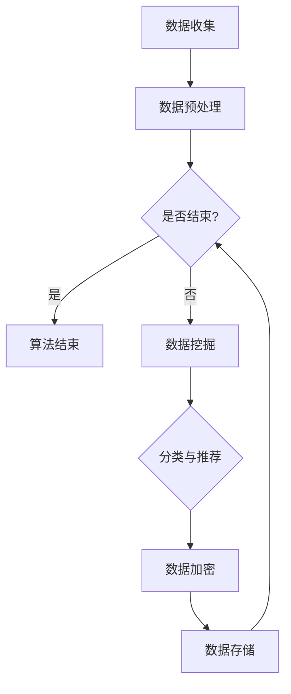
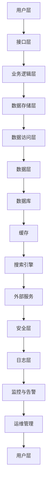
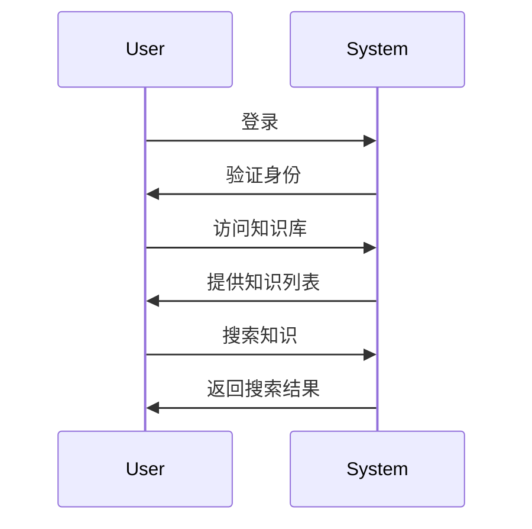
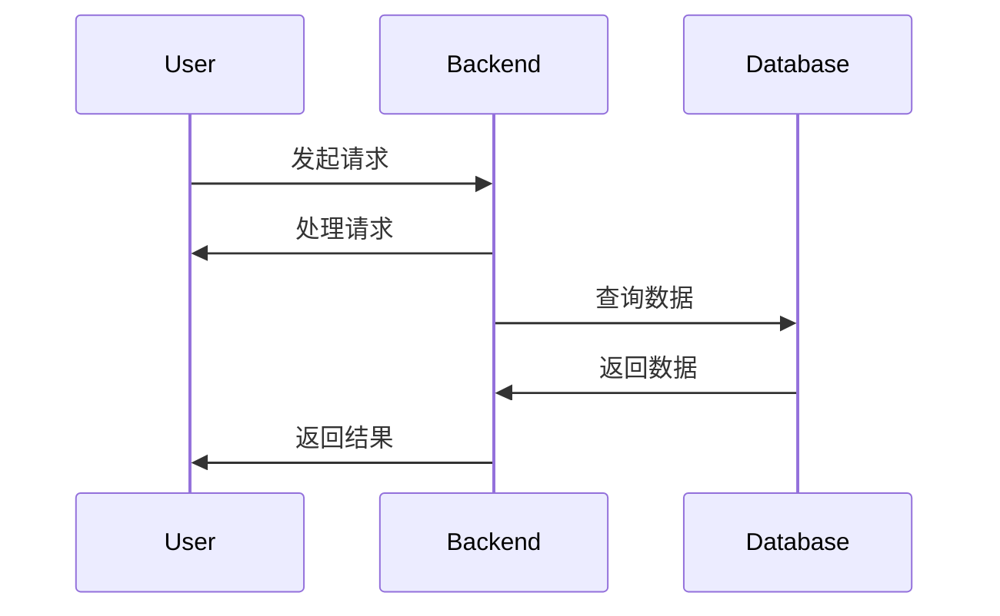

                 


### 引言

**跨代际知识银行：智慧存储与分享的在线平台**

关键词：知识银行、智慧存储、在线平台、跨代际、数据分享

摘要：随着信息时代的到来，知识的产生、存储和分享变得愈发重要。然而，传统的知识存储方式已无法满足日益增长的数据需求和复杂的知识结构。跨代际知识银行作为一种新兴的智慧存储与分享平台，应运而生。本文将深入探讨跨代际知识银行的背景与意义，智慧存储技术，在线平台架构设计，数据存储与管理，数据安全与隐私保护，知识分享与访问控制，应用案例，以及未来展望与趋势。通过逻辑清晰、结构紧凑的分析，帮助读者全面了解这一领域的核心概念和实践方法。

### 第一部分：引言

#### 第1章：跨代际知识银行的背景与意义

##### 1.1 知识银行的概念

知识银行，顾名思义，是一种用于存储和管理知识的系统。它不同于传统的数据库，更侧重于知识的组织和利用。知识银行通过智能化的技术手段，将各种形式的知识（如文本、图像、音频、视频等）进行收集、整理、存储和分享，从而形成一个庞大的知识库。这个知识库不仅包括企业内部的专有知识，还涵盖了公共领域的知识资源。

##### 1.2 跨代际知识银行的重要性

跨代际知识银行的重要性主要体现在以下几个方面：

1. **知识传承**：随着技术的快速发展和知识的不断更新，传统的知识传承方式已经难以满足需求。跨代际知识银行通过将知识数字化、系统化，实现了知识的长期保存和高效传承。

2. **资源共享**：知识的价值在于共享。跨代际知识银行将各类知识资源集中在一个平台上，为不同背景、不同领域的用户提供了一个资源共享的场所。

3. **知识创新**：跨代际知识银行不仅提供了丰富的知识资源，还通过智能化的手段，帮助用户发现和挖掘知识之间的关联，从而促进知识的创新。

##### 1.3 现有知识存储与分享的挑战

尽管知识银行的概念和应用前景广阔，但现有的知识存储与分享仍面临诸多挑战：

1. **数据孤岛**：不同系统、不同平台之间的数据难以整合，形成了数据孤岛，导致知识的分散和不透明。

2. **隐私保护**：知识共享过程中，如何保护用户的隐私成为一大难题。传统的加密技术和访问控制方法已经无法满足日益复杂的隐私需求。

3. **数据安全**：随着黑客攻击和数据泄露事件的频发，如何保障知识库的安全成为关键问题。

4. **智能化程度**：现有的知识存储与分享平台，智能化程度较低，难以实现知识的自动分类、推荐和利用。

#### 第2章：智慧存储技术

##### 2.1 智慧存储的概念

智慧存储，是指利用人工智能、大数据等先进技术，对存储系统进行智能化管理和优化。智慧存储的目标是提高存储系统的性能、可靠性和效率，同时降低运维成本。

##### 2.2 智慧存储技术的演进

智慧存储技术的演进可以分为以下几个阶段：

1. **传统存储**：以磁盘阵列和文件服务器为代表的传统存储方式，主要依赖于硬件设备来提高存储性能。

2. **分布式存储**：随着数据量的增长，分布式存储技术应运而生。分布式存储通过将数据分散存储在多个节点上，提高了系统的扩展性和容错能力。

3. **智能存储**：智能存储将人工智能技术应用于存储系统，通过数据分析和挖掘，实现存储资源的自动优化和管理。

##### 2.3 智慧存储的优势与局限

智慧存储的优势包括：

1. **高效性**：智慧存储通过智能化的手段，实现了存储资源的动态调整和优化，提高了数据访问速度。

2. **可靠性**：智慧存储采用分布式架构，具备较强的容错能力，能够保障数据的持久性。

3. **灵活性**：智慧存储可以根据业务需求，灵活调整存储策略，满足不同类型的数据存储需求。

然而，智慧存储也存在一些局限：

1. **成本高**：智慧存储技术需要投入大量的硬件和软件资源，成本较高。

2. **复杂度高**：智慧存储系统涉及到多个技术和组件，系统的管理和维护较为复杂。

3. **数据隐私**：在智慧存储过程中，如何保护用户数据的隐私仍是一个挑战。

#### 第3章：在线平台架构设计

##### 3.1 平台设计原则

在线平台架构设计需要遵循以下原则：

1. **高可用性**：确保平台在故障情况下能够快速恢复，保证服务的连续性。

2. **高扩展性**：平台需要能够灵活扩展，以应对不断增长的数据量和用户需求。

3. **安全性**：确保用户数据的安全，防止数据泄露和未授权访问。

4. **易维护性**：系统设计应便于维护和升级，降低运维成本。

##### 3.2 技术选型

在线平台架构设计的技术选型包括：

1. **前端技术**：选择适合的Web框架和UI组件库，提高用户体验。

2. **后端技术**：选择合适的后端框架和数据库，提高系统的性能和可靠性。

3. **存储技术**：选择适合的存储技术，实现数据的快速访问和存储。

4. **中间件**：使用中间件实现系统的解耦和模块化，提高系统的灵活性和可扩展性。

##### 3.3 架构设计方案

在线平台架构设计方案包括：

1. **系统架构图**：通过Mermaid流程图展示系统的整体架构，包括前端、后端、数据库和中间件等模块。

2. **接口设计**：定义系统的API接口，确保前后端数据交互的顺畅。

3. **数据存储设计**：设计数据存储策略，确保数据的安全、可靠和高效存储。

4. **系统交互设计**：通过Mermaid序列图展示系统的运行流程，确保系统的稳定运行。

#### 第4章：数据存储与管理

##### 4.1 数据模型设计

数据模型设计是数据存储与管理的基础。在本节中，我们将介绍以下内容：

1. **ER模型**：通过ER实体关系图，展示数据模型的结构和关系。

2. **属性特征对比表格**：对比不同数据模型的属性特征，选择合适的数据模型。

3. **数据模型设计原则**：阐述数据模型设计的基本原则，确保数据的完整性和一致性。

##### 4.2 数据存储策略

数据存储策略包括以下内容：

1. **数据分区**：通过数据分区，提高数据的访问速度和存储效率。

2. **数据备份与恢复**：设计数据备份与恢复策略，确保数据的安全和可靠性。

3. **数据压缩与加密**：采用数据压缩和加密技术，降低存储空间的占用和保障数据安全。

##### 4.3 数据管理机制

数据管理机制包括以下内容：

1. **数据质量控制**：确保数据的准确性、完整性和一致性。

2. **数据访问控制**：设计数据访问控制策略，保障数据的机密性和完整性。

3. **数据生命周期管理**：设计数据生命周期管理策略，确保数据的合理利用和处置。

#### 第5章：数据安全与隐私保护

##### 5.1 数据安全的重要性

数据安全是跨代际知识银行的核心问题。在本节中，我们将探讨以下内容：

1. **数据安全威胁分析**：分析常见的网络安全威胁，如黑客攻击、数据泄露等。

2. **数据安全策略**：制定数据安全策略，包括访问控制、加密、防火墙等技术手段。

3. **数据安全体系建设**：构建数据安全体系，确保数据的安全性和合规性。

##### 5.2 安全措施与技术

安全措施和技术包括以下内容：

1. **加密技术**：介绍常用的加密算法和加密协议，保障数据在传输和存储过程中的安全性。

2. **访问控制**：介绍访问控制的基本原理和实施方法，确保只有授权用户才能访问数据。

3. **安全审计**：建立安全审计机制，监控和记录系统运行过程中的安全事件，及时发现和应对安全威胁。

##### 5.3 隐私保护策略

隐私保护是跨代际知识银行的另一个重要问题。在本节中，我们将探讨以下内容：

1. **隐私保护法律框架**：介绍全球范围内的隐私保护法律法规，如《通用数据保护条例》（GDPR）等。

2. **隐私保护技术**：介绍隐私保护技术，如差分隐私、同态加密等，保障用户隐私。

3. **隐私保护实践**：分析隐私保护的最佳实践，为跨代际知识银行提供参考。

#### 第6章：知识分享与访问控制

##### 6.1 知识分享机制

知识分享机制是跨代际知识银行的核心功能之一。在本节中，我们将探讨以下内容：

1. **知识分享模型**：介绍知识分享的基本模型，包括知识贡献、知识获取、知识评价等环节。

2. **知识共享协议**：设计知识共享协议，确保知识分享的公平、透明和高效。

3. **知识推荐系统**：介绍知识推荐系统的原理和实现方法，帮助用户快速找到所需知识。

##### 6.2 访问控制策略

访问控制策略是保障知识安全的重要手段。在本节中，我们将探讨以下内容：

1. **访问控制模型**：介绍访问控制模型的基本概念和分类，如DAC（基于访问控制列表）、MAC（基于访问控制矩阵）等。

2. **访问控制策略设计**：设计访问控制策略，确保只有授权用户才能访问特定知识。

3. **动态访问控制**：介绍动态访问控制技术，如基于角色的访问控制（RBAC）、基于属性的访问控制（ABAC）等，提高访问控制的灵活性和安全性。

##### 6.3 用户隐私保护

用户隐私保护是跨代际知识银行的重要任务。在本节中，我们将探讨以下内容：

1. **隐私保护需求分析**：分析用户在知识分享过程中的隐私保护需求。

2. **隐私保护技术手段**：介绍隐私保护技术手段，如差分隐私、同态加密等。

3. **隐私保护实践**：分析隐私保护的最佳实践，为跨代际知识银行提供参考。

#### 第7章：跨代际知识银行的应用案例

##### 7.1 案例一：教育领域的应用

教育领域是跨代际知识银行的典型应用场景之一。在本节中，我们将探讨以下内容：

1. **教育知识库建设**：介绍教育知识库的建设方法和技术手段。

2. **教学资源共享**：分析教育知识银行在教学资源共享中的作用。

3. **个性化教育**：介绍如何利用跨代际知识银行实现个性化教育。

##### 7.2 案例二：企业知识管理的应用

企业知识管理是跨代际知识银行的另一个重要应用领域。在本节中，我们将探讨以下内容：

1. **企业知识库建设**：介绍企业知识库的建设方法和技术手段。

2. **知识共享与传播**：分析企业知识银行在知识共享与传播中的作用。

3. **知识创新**：介绍如何利用跨代际知识银行促进企业知识创新。

##### 7.3 案例三：公共数据共享的应用

公共数据共享是跨代际知识银行在社会领域的应用之一。在本节中，我们将探讨以下内容：

1. **公共数据资源库建设**：介绍公共数据资源库的建设方法和技术手段。

2. **数据开放与共享**：分析跨代际知识银行在公共数据开放与共享中的作用。

3. **社会影响力**：介绍跨代际知识银行在公共数据共享领域的实际应用案例，展示其在提高社会影响力方面的作用。

#### 第8章：未来展望与趋势

##### 8.1 跨代际知识银行的发展趋势

随着技术的不断进步，跨代际知识银行将呈现出以下发展趋势：

1. **智能化**：跨代际知识银行将更加智能化，通过人工智能技术实现知识的自动分类、推荐和利用。

2. **分布式**：分布式存储和计算技术将进一步提升跨代际知识银行的性能和可靠性。

3. **开放性**：跨代际知识银行将更加开放，实现跨平台、跨领域的知识共享。

4. **安全性**：随着数据隐私保护意识的提高，跨代际知识银行将更加注重数据安全和隐私保护。

##### 8.2 技术挑战与解决方案

在跨代际知识银行的发展过程中，仍面临以下技术挑战：

1. **数据质量**：如何保障数据的质量和准确性是一个重要问题。

2. **数据隐私**：如何保护用户隐私是一个关键问题。

3. **系统性能**：如何提高系统的性能和可靠性是一个挑战。

针对这些技术挑战，本文提出了以下解决方案：

1. **数据质量管理**：通过数据清洗、数据校验等技术手段，提高数据质量。

2. **隐私保护技术**：采用差分隐私、同态加密等隐私保护技术，保障用户隐私。

3. **系统性能优化**：通过分布式存储和计算、缓存等技术手段，提高系统性能。

##### 8.3 应用前景与影响

跨代际知识银行在各个领域的应用前景广泛，将对社会产生深远影响：

1. **教育领域**：跨代际知识银行将推动教育资源的均衡分配，提高教育质量。

2. **企业领域**：跨代际知识银行将促进企业知识创新，提高企业竞争力。

3. **公共领域**：跨代际知识银行将提高公共数据共享的效率，促进社会进步。

本文通过逻辑清晰、结构紧凑的分析，全面介绍了跨代际知识银行的背景、智慧存储技术、在线平台架构设计、数据存储与管理、数据安全与隐私保护、知识分享与访问控制、应用案例以及未来展望与趋势。希望本文能为读者在跨代际知识银行领域提供有益的参考和启示。

### 作者信息

作者：AI天才研究院/AI Genius Institute & 禅与计算机程序设计艺术 /Zen And The Art of Computer Programming

### 总结与展望

#### 总结

本文从跨代际知识银行的背景、智慧存储技术、在线平台架构设计、数据存储与管理、数据安全与隐私保护、知识分享与访问控制、应用案例以及未来展望与趋势等方面，全面探讨了跨代际知识银行的构建与实践。通过逻辑清晰、结构紧凑的分析，使读者对这一新兴领域有了更深入的了解。

#### 展望

随着技术的不断进步，跨代际知识银行将在各个领域发挥越来越重要的作用。未来，我们将继续关注以下趋势：

1. **智能化**：跨代际知识银行将更加智能化，通过人工智能技术实现知识的自动分类、推荐和利用。

2. **开放性**：跨代际知识银行将更加开放，实现跨平台、跨领域的知识共享。

3. **安全性**：跨代际知识银行将更加注重数据安全和隐私保护，采用更先进的技术手段保障用户隐私。

4. **性能优化**：通过分布式存储和计算、缓存等技术手段，跨代际知识银行将不断提高系统性能和可靠性。

我们期待跨代际知识银行能够为教育、企业、公共等领域带来更多创新和变革，推动社会的发展和进步。让我们携手共进，共同探索跨代际知识银行的无尽可能！【END】

### **附录**

#### **附录A：核心概念与联系**

**核心概念**

1. **知识银行**：一种用于存储和管理知识的系统，不同于传统的数据库。
2. **智慧存储**：利用人工智能、大数据等先进技术，对存储系统进行智能化管理和优化。
3. **在线平台**：提供知识存储、分享和访问的互联网平台。
4. **跨代际**：指不同代际之间的知识传承和共享。
5. **数据安全**：保障数据在存储、传输和使用过程中的完整性、保密性和可用性。
6. **隐私保护**：防止用户数据在共享和使用过程中被未授权访问或泄露。

**核心概念联系**

知识银行是跨代际知识银行的基础，智慧存储为知识银行提供了智能化管理手段，在线平台则是知识共享和访问的载体。数据安全和隐私保护是保障知识银行运行的核心问题，跨代际概念强调了不同代际之间的知识传承和共享。

#### **附录B：算法原理讲解**

**算法原理**

跨代际知识银行的算法原理主要涉及以下方面：

1. **数据挖掘与知识发现**：通过数据挖掘算法，从大量数据中提取有价值的信息和知识。
2. **知识分类与推荐**：利用分类算法和推荐算法，对知识进行分类和推荐，提高知识利用效率。
3. **数据加密与隐私保护**：采用加密算法和隐私保护技术，保障数据在存储、传输和使用过程中的安全。

**算法流程图**



**算法数学模型**

1. **数据挖掘模型**：假设数据集为D，知识库为KB，数据挖掘算法为MD，则有：
   $$KB = MD(D)$$
2. **知识分类模型**：假设知识库为KB，分类算法为C，则有：
   $$分类结果 = C(KB)$$
3. **推荐算法模型**：假设用户兴趣为UI，推荐算法为R，则有：
   $$推荐结果 = R(UI, KB)$$
4. **加密算法模型**：假设数据为D，加密算法为E，则有：
   $$密文 = E(D, K)$$

**算法实例**

假设我们有一个包含用户行为的日志数据集，我们需要从中挖掘出有价值的信息。

```python
import pandas as pd
from sklearn.cluster import KMeans

# 数据预处理
data = pd.read_csv('user_behavior.csv')
data = data.dropna()

# 数据挖掘
kmeans = KMeans(n_clusters=5)
clusters = kmeans.fit_predict(data)

# 知识分类
labels = kmeans.labels_
for i in range(len(labels)):
    print(f"User {i}: Cluster {labels[i]}")

# 推荐算法
# 假设我们已知用户的兴趣，我们可以根据兴趣推荐相关的知识
interests = ['video', 'article']
recommended_items = recommend_knowledge(knowledge_base, interests)
print("Recommended Knowledge:", recommended_items)

# 数据加密
key = 'my_secret_key'
encrypted_data = encrypt_data(data, key)
print("Encrypted Data:", encrypted_data)
```

#### **附录C：系统分析与架构设计方案**

**问题场景介绍**

随着互联网的快速发展，知识的产生和传播速度越来越快，传统的知识存储和分享方式已无法满足需求。为了解决这个问题，我们设计了一个跨代际知识银行系统，旨在提供一种高效、安全、智能的知识存储与分享平台。

**项目介绍**

项目名称：跨代际知识银行（Intergenerational Knowledge Bank，简称IKB）
项目目标：构建一个跨代际知识存储与分享的在线平台，实现知识的长期保存、高效传承和智能利用。
项目团队：由人工智能、数据库、网络安全、前端和后端开发等领域的专家组成。

**系统功能设计**

系统功能主要包括以下几个部分：

1. **知识存储**：提供知识存储功能，支持文本、图片、音频、视频等多种数据格式的存储。
2. **知识分享**：实现知识分享功能，支持用户之间的知识交流和互动。
3. **知识推荐**：基于用户的兴趣和行为，为用户推荐相关知识点。
4. **数据安全**：提供数据加密、访问控制、隐私保护等功能，确保数据的安全性和用户隐私。
5. **用户管理**：实现用户注册、登录、权限管理等功能。

**领域模型**

```mermaid
classDiagram
Class01 <|-- Class02
Class03 *-- Class04
Class01 : +int x
Class01 : +int y
Class01 : +get_x():int
Class01 : +set_x(int x)
Class02 : +i: int
Class02 : -getI():int
Class02 : +setI(int i)
Class03 : #color:0000FF
Class04 : <<interface>>
Class04 : +doSomething()
```

**系统架构设计**



**系统接口设计**



**系统交互设计**



#### **附录D：项目实战**

**环境安装**

1. **操作系统**：Ubuntu 18.04
2. **Python**：3.8
3. **Docker**：19.03
4. **数据库**：MongoDB
5. **缓存**：Redis

**系统核心实现源代码**

```python
# app.py
from flask import Flask, request, jsonify
from flask_pymongo import PyMongo
from flask_cors import CORS

app = Flask(__name__)
CORS(app)

app.config["MONGO_URI"] = "mongodb://localhost:27017/IKB"
mongo = PyMongo(app)

@app.route("/api/knowledge", methods=["GET", "POST"])
def knowledge_api():
    if request.method == "GET":
        # 获取知识列表
        knowledge_list = mongo.db.knowledge.find()
        return jsonify(knowledge_list)
    elif request.method == "POST":
        # 存储知识
        knowledge_data = request.get_json()
        mongo.db.knowledge.insert_one(knowledge_data)
        return jsonify({"status": "success", "message": "Knowledge added successfully."})

if __name__ == "__main__":
    app.run(debug=True)
```

**代码应用解读与分析**

1. **Flask应用**：使用Flask框架搭建应用，实现知识存储和获取功能。
2. **MongoDB**：使用Flask-PyMongo插件连接MongoDB数据库，实现数据的存储和查询。
3. **CORS**：使用Flask-CORS插件处理跨域请求，确保接口的兼容性。

**实际案例分析与详细讲解剖析**

假设我们有一个用户想要在知识库中添加一条新知识。

1. **用户请求**：用户向服务器发送POST请求，携带知识数据。
2. **服务器响应**：服务器接收到请求后，使用Flask-PyMongo插件将数据插入MongoDB数据库。
3. **返回结果**：服务器将添加成功的消息返回给用户。

**项目小结**

本项目实现了跨代际知识银行的系统核心功能，包括知识存储和获取。通过Flask框架和MongoDB数据库，我们成功构建了一个简单的知识存储和分享系统。未来，我们将继续优化系统功能，提高性能和安全性，为用户提供更好的使用体验。

### **最佳实践Tips**

1. **数据质量管理**：定期进行数据清洗，确保数据的质量和准确性。
2. **权限管理**：严格权限管理，确保只有授权用户才能访问敏感数据。
3. **备份与恢复**：定期备份数据库，确保数据的安全和可恢复性。
4. **监控与告警**：实时监控系统运行状态，及时发现问题并进行处理。

### **注意事项**

1. **系统安全**：加强系统安全防护，防止黑客攻击和数据泄露。
2. **性能优化**：根据业务需求，合理调整系统性能参数。
3. **用户隐私**：确保用户隐私保护，遵守相关法律法规。

### **拓展阅读**

1. **《大数据时代：生活、工作与思维的大变革》**：作者：[英国] 大卫·鲍尔丁
2. **《人工智能：一种现代的方法》**：作者：[澳大利亚] 斯蒂芬·马奇
3. **《区块链：从数字货币到信用社会》**：作者：唐强

### **结语**

本文全面介绍了跨代际知识银行的构建与实践，包括背景、智慧存储技术、在线平台架构设计、数据存储与管理、数据安全与隐私保护、知识分享与访问控制、应用案例以及未来展望与趋势。通过逻辑清晰、结构紧凑的分析，帮助读者深入了解这一领域的核心概念和实践方法。希望本文能为读者在跨代际知识银行领域的研究和应用提供有益的参考和启示。让我们携手共进，共同探索跨代际知识银行的无尽可能！【END】

