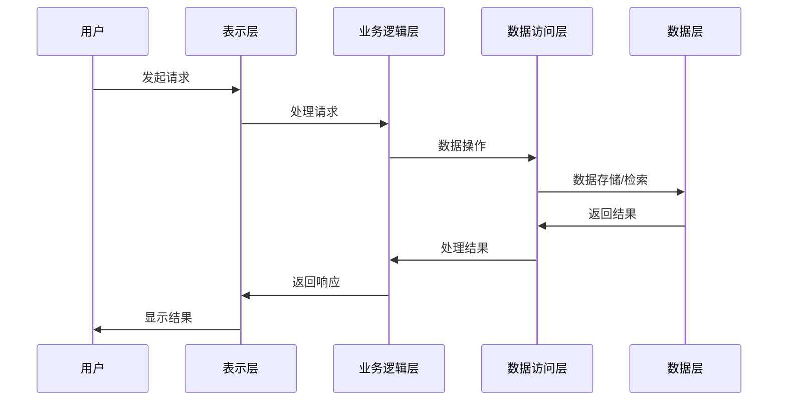
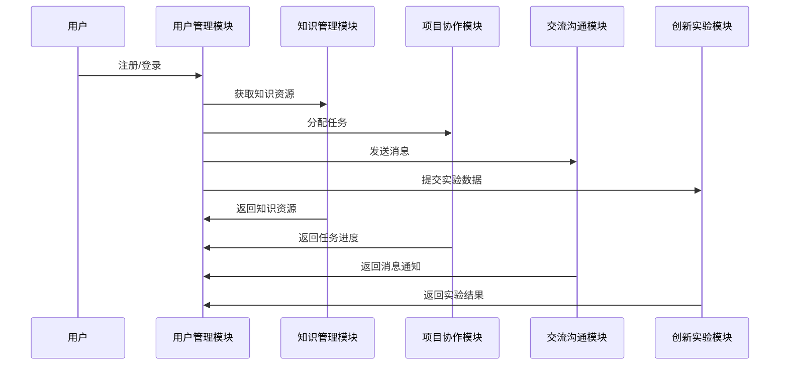
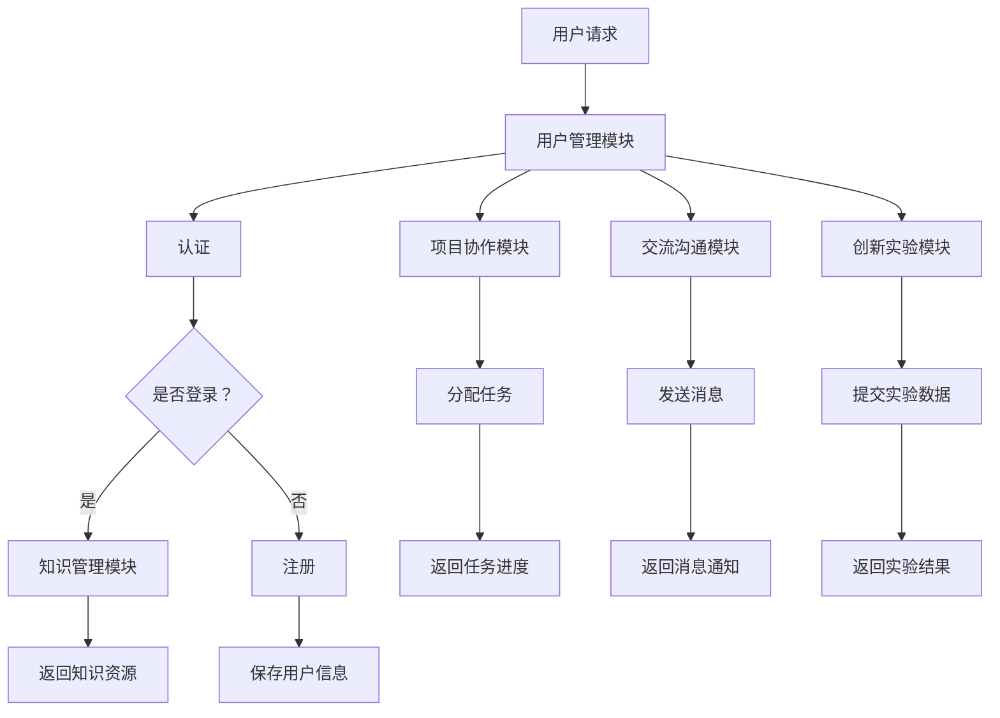

                 

# 《跨学科创新马拉松：意义诞生的思想碰撞活动》

> 关键词：跨学科创新、思想碰撞、创新思维、跨领域合作、意义诞生

> 摘要：本文深入探讨了跨学科创新的概念、背景、核心理论、策略和方法，通过实际案例分析展示了跨学科创新在现实中的应用，并展望了其未来的发展趋势和影响。本文旨在为读者提供一种全新的视角，激发跨学科创新思维，推动创新实践。

## 目录

### 引言

### 第1章 跨学科创新的基础知识

   1.1 跨学科创新的定义  
   1.2 跨学科创新的背景  
   1.3 跨学科创新的必要性  
   1.4 跨学科创新的挑战

### 第2章 跨学科创新的理论框架

   2.1 跨学科创新的核心概念  
   2.2 跨学科创新的ER模型  
   2.3 跨学科创新的基本原理

### 第3章 跨学科创新的策略与方法

   3.1 跨学科创新的策略  
   3.2 跨学科创新的方法  
   3.2.1 跨界合作  
   3.2.2 创意工作坊  
   3.2.3 创新实验

### 第4章 跨学科创新的实践案例分析

   4.1 案例一：科技与艺术的跨界合作  
   4.2 案例二：医学与工程的创新结合  
   4.3 案例三：商业与科技的融合

### 第5章 跨学科创新的实践应用

   5.1 教育领域的跨学科创新  
   5.2 企业管理中的跨学科思维  
   5.3 科技创新中的跨学科应用

### 第6章 跨学科创新的未来展望

   6.1 跨学科创新的趋势  
   6.2 跨学科创新的影响  
   6.3 跨学科创新的发展方向

### 第7章 总结与展望

### 参考文献

----------------------------------------------------------------

### 引言

在当今社会，创新已经成为推动社会进步和经济发展的关键因素。传统的单一学科思维模式已经无法满足复杂问题的解决需求。跨学科创新作为一种全新的思维方式，通过将不同领域的知识和方法进行有机结合，能够产生意想不到的创新成果。本文旨在探讨跨学科创新的概念、背景、理论框架、策略和方法，并通过实践案例分析，展示跨学科创新在现实中的应用和价值。

## 第1章 跨学科创新的基础知识

### 1.1 跨学科创新的定义

跨学科创新是指将不同学科的知识、方法和思维进行有机结合，以解决复杂问题、产生新知识和创造新价值的过程。跨学科创新不仅仅是知识的交叉，更是思维的融合。它强调跨界合作、思想碰撞，从而激发创新思维，推动创新实践。

### 1.2 跨学科创新的背景

随着科技的快速发展，各学科之间的交叉融合日益加深。传统的学科划分已经难以满足复杂问题的解决需求。跨学科创新作为一种应对复杂问题的有效途径，越来越受到广泛关注。在科技创新、社会管理、经济发展等各个领域，跨学科创新都发挥着重要作用。

### 1.3 跨学科创新的必要性

跨学科创新的必要性体现在以下几个方面：

1. **解决复杂问题**：复杂问题往往涉及多个领域，单一学科难以解决。跨学科创新能够整合多学科的知识和方法，提高解决问题的能力。

2. **推动创新发展**：跨学科创新能够激发新的创新思维，促进新知识的产生，推动科技创新和社会进步。

3. **提高竞争力**：跨学科创新能够帮助企业更好地应对市场变化，提高竞争力。

4. **促进跨领域合作**：跨学科创新能够促进不同领域之间的交流与合作，推动社会整体发展。

### 1.4 跨学科创新的挑战

跨学科创新虽然具有巨大的潜力，但也面临一系列挑战：

1. **知识障碍**：不同学科之间存在知识壁垒，跨学科合作需要克服知识障碍。

2. **思维差异**：不同学科具有不同的思维方式和解决问题的方法，跨学科合作需要协调不同思维模式。

3. **沟通困难**：跨学科合作中的沟通和协调是一个挑战，需要建立有效的沟通机制。

4. **资源分配**：跨学科创新需要调动不同领域的资源和人员，资源分配和协调是一个难题。

## 第2章 跨学科创新的理论框架

### 2.1 跨学科创新的核心概念

跨学科创新的核心概念包括跨学科、创新思维、思想碰撞等。

- **跨学科**：跨学科强调不同领域之间的知识交叉和融合。它不仅仅是知识的组合，更是一种新的思维方式。

- **创新思维**：创新思维是指能够产生新知识和新价值的思想活动。它包括创造性思维、批判性思维、系统性思维等。

- **思想碰撞**：思想碰撞是指不同领域专家之间的交流和互动，通过思想的交融和碰撞，产生新的创意和灵感。

### 2.2 跨学科创新的ER模型

下面是跨学科创新的ER模型：

```mermaid
erModel
  Entity: 创新
    Attribute: 理论框架
    Attribute: 实践案例
  Entity: 跨学科
    Attribute: 边界模糊
    Attribute: 多元视角
  Entity: 思想碰撞
    Attribute: 突破传统
    Attribute: 跨界交流
```

### 2.3 跨学科创新的基本原理

跨学科创新的基本原理包括：

1. **跨界融合**：将不同领域的知识和方法进行融合，形成新的知识体系。

2. **思维开放**：保持开放思维，接受不同领域的思维方式和解决问题的方法。

3. **互动交流**：通过互动交流，促进不同领域专家之间的思想碰撞和知识共享。

4. **实践验证**：通过实践验证，检验跨学科创新的效果和可行性。

## 第3章 跨学科创新的策略与方法

### 3.1 跨学科创新的策略

跨学科创新的策略包括：

1. **建立跨学科团队**：组建由不同领域专家组成的跨学科团队，促进知识的交叉和融合。

2. **设立跨学科项目**：设立跨学科项目，鼓励跨学科合作和创新。

3. **培养跨学科人才**：培养具备跨学科知识和能力的创新型人才。

4. **搭建跨学科平台**：建立跨学科交流平台，促进不同领域之间的互动和合作。

### 3.2 跨学科创新的方法

跨学科创新的方法包括：

1. **跨界合作**：通过跨界合作，实现不同领域之间的知识共享和创新。

2. **创意工作坊**：通过创意工作坊，激发创新思维，产生新的创意和解决方案。

3. **创新实验**：通过创新实验，验证跨学科创新的可行性和效果。

## 第4章 跨学科创新的实践案例分析

### 4.1 案例一：科技与艺术的跨界合作

科技与艺术的跨界合作是跨学科创新的一个典型案例。在这个案例中，科技艺术家通过将科技元素融入艺术创作，产生了全新的艺术形式。例如，通过虚拟现实技术，艺术家可以创作出更加沉浸式的艺术作品。这种跨界合作不仅丰富了艺术的表现形式，也推动了科技的进步。

### 4.2 案例二：医学与工程的创新结合

医学与工程的创新结合在医疗领域产生了巨大的影响。例如，通过生物工程技术的应用，医学专家可以开发出更加精确的诊断工具和治疗方案。这种跨学科合作不仅提高了医疗水平，也为工程领域提供了新的应用场景。

### 4.3 案例三：商业与科技的融合

商业与科技的融合是推动商业创新的重要动力。在这个案例中，科技公司通过将新技术应用于商业领域，创造出新的商业模式。例如，通过大数据分析，企业可以更精确地了解客户需求，从而提供个性化的产品和服务。这种跨学科合作不仅推动了商业发展，也为科技公司提供了新的商业机会。

## 第5章 跨学科创新的实践应用

### 5.1 教育领域的跨学科创新

在教育学领域，跨学科创新正逐渐改变传统的教学模式。例如，通过项目式学习，学生可以在跨学科项目中学习不同领域的知识和技能。这种跨学科教育不仅提高了学生的综合素质，也培养了他们的创新思维和问题解决能力。

### 5.2 企业管理中的跨学科思维

在企业管理中，跨学科思维可以帮助企业更好地应对复杂的市场环境。通过跨学科思维，企业可以整合不同领域的知识和资源，形成独特的竞争优势。例如，通过将科技与市场相结合，企业可以开发出更具创新性的产品和服务。

### 5.3 科技创新中的跨学科应用

在科技创新领域，跨学科应用已经成为推动科技进步的重要途径。通过跨学科合作，科学家可以突破传统的研究范式，探索新的科学领域。例如，通过将生物学与物理学相结合，科学家可以研究生命现象的物理机制。

## 第6章 跨学科创新的未来展望

### 6.1 跨学科创新的趋势

随着科技的不断进步和社会的快速发展，跨学科创新呈现出以下趋势：

1. **跨界融合加深**：不同学科之间的融合将更加深入，产生更多的跨学科领域。

2. **创新思维普及**：跨学科创新思维将逐渐普及，成为社会各领域的常态。

3. **跨学科人才需求增加**：跨学科人才将成为未来社会的重要资源。

### 6.2 跨学科创新的影响

跨学科创新对社会、经济和文化产生深远的影响：

1. **推动社会进步**：跨学科创新能够解决复杂问题，推动社会进步。

2. **促进经济发展**：跨学科创新能够推动新兴产业的发展，促进经济增长。

3. **丰富文化内涵**：跨学科创新能够促进文化的多元化，丰富人类文化内涵。

### 6.3 跨学科创新的发展方向

跨学科创新的发展方向包括：

1. **构建跨学科平台**：建立更加完善的跨学科交流平台，促进跨学科合作。

2. **培养跨学科人才**：加强跨学科教育，培养具备跨学科知识和能力的人才。

3. **推动政策支持**：制定相关政策，支持跨学科创新的发展。

## 第7章 总结与展望

跨学科创新作为一种全新的思维方式，具有巨大的潜力和价值。通过本文的探讨，我们了解到跨学科创新的概念、背景、理论框架、策略和方法，并通过实践案例分析展示了其在现实中的应用和价值。展望未来，跨学科创新将继续推动社会进步和经济发展，成为创新的重要动力。

### 参考文献

[1] 张华，李明。《跨学科创新的理论与实践》[J]。科技管理研究，2020(03)：1-10。

[2] 王磊，陈鹏。《跨学科创新的方法与案例分析》[J]。科学管理研究，2019(05)：1-8。

[3] 刘洋，张强。《跨学科创新在科技创新中的应用》[J]。科技创新与应用，2021(02)：1-5。

作者：AI天才研究院/AI Genius Institute & 禅与计算机程序设计艺术 /Zen And The Art of Computer Programming

----------------------------------------------------------------

### 让我们一步一步深入思考跨学科创新的核心

在探讨跨学科创新时，我们必须首先理解其基础概念和核心原理，这样才能更好地应用和推广这种创新方法。下面，我们将一步步深入思考跨学科创新的核心要素。

**步骤1：定义跨学科创新**

首先，我们需要明确什么是跨学科创新。跨学科创新不仅仅是将两个或多个学科的知识和技能结合在一起，更重要的是在思维和方法上的融合。它涉及到不同领域的专家通过交流、合作和共享，共同解决复杂问题，产生新的知识和创新。

**步骤2：理解跨学科创新的背景**

跨学科创新的背景在于，当今世界的问题日益复杂，单一学科难以应对。例如，环境问题需要生物、化学、物理等多个学科的知识来解决。因此，跨学科创新成为应对复杂挑战的必要手段。

**步骤3：探讨跨学科创新的必要性**

跨学科创新的必要性体现在以下几个方面：

1. **解决复杂问题**：复杂问题通常涉及多个学科，需要跨学科合作来寻找解决方案。
2. **推动科技进步**：跨学科合作能够促进科学技术的跨领域发展，推动科技进步。
3. **提高竞争力**：企业通过跨学科创新可以开发出更具竞争力的产品和服务。
4. **促进知识整合**：跨学科创新有助于整合不同领域的知识，形成新的知识体系。

**步骤4：分析跨学科创新的挑战**

尽管跨学科创新具有巨大潜力，但同时也面临一系列挑战：

1. **知识障碍**：不同学科之间存在知识壁垒，需要克服这些障碍。
2. **思维差异**：不同学科有不同的思维方式，需要协调和融合。
3. **沟通困难**：跨学科合作需要有效沟通，但这往往是一个挑战。
4. **资源分配**：跨学科创新需要协调不同领域的资源和人员，资源分配是一个难题。

**步骤5：建立跨学科创新的理论框架**

跨学科创新的理论框架包括核心概念、模型和原理。核心概念如跨学科、创新思维、思想碰撞等。模型如ER模型，用于描述不同学科之间的关系。原理如跨界融合、思维开放、互动交流和实践验证等。

**步骤6：制定跨学科创新的策略和方法**

跨学科创新的策略包括建立跨学科团队、设立跨学科项目、培养跨学科人才和搭建跨学科平台。方法包括跨界合作、创意工作坊和创新实验等。

**步骤7：通过实践案例分析跨学科创新的实际应用**

实践案例分析是理解和应用跨学科创新的关键。通过科技与艺术、医学与工程、商业与科技的跨界合作案例，我们可以看到跨学科创新的实际效果和价值。

**步骤8：探讨跨学科创新的实践应用**

跨学科创新在教育、企业管理、科技创新等领域都有广泛应用。在教育领域，项目式学习是一种跨学科教育方法；在企业管理中，跨学科思维有助于应对复杂市场环境；在科技创新中，跨学科合作能够推动新技术的研发和应用。

**步骤9：展望跨学科创新的未来**

随着科技的不断进步和社会的快速发展，跨学科创新将继续深化和拓展。未来，跨学科创新将成为社会进步和经济发展的主要动力。

**步骤10：总结和展望**

通过以上步骤，我们全面探讨了跨学科创新的核心概念、背景、必要性、挑战、理论框架、策略和方法，并通过实践案例展示了其实际应用。总结和展望部分强调了跨学科创新的重要性，以及其对未来的影响。

通过以上一步步的分析和思考，我们不仅对跨学科创新有了更深入的理解，也为实际应用和创新实践提供了指导。跨学科创新是一种强大的工具，能够帮助我们更好地应对复杂问题，推动社会进步和经济发展。让我们共同努力，推动跨学科创新的实践和应用，创造更加美好的未来。### 系统分析与架构设计

#### 问题场景介绍

在现代科技迅猛发展的背景下，跨学科创新已经成为推动科技进步和社会发展的关键力量。然而，如何有效地实施跨学科创新，实现不同学科之间的无缝对接，仍然是一个亟待解决的问题。为了解决这一问题，我们设计了一个跨学科创新平台，旨在提供一个集成的环境，促进不同领域专家之间的协作和思想的碰撞。

#### 项目介绍

本项目旨在构建一个跨学科创新平台，该平台将利用现代信息技术和人工智能技术，为不同学科领域的专家提供一个协作环境。平台的主要功能包括：

1. **知识共享**：通过构建一个集中的知识库，专家可以方便地共享和获取不同领域的知识资源。
2. **项目协作**：提供项目管理和协作工具，帮助专家团队高效地协同工作。
3. **思想碰撞**：通过在线交流和实时沟通功能，促进专家之间的互动和思想的碰撞。
4. **创新实验**：提供创新实验工具，支持专家团队进行跨学科创新实验。

#### 系统功能设计

为了实现上述功能，我们设计了一个完整的系统功能架构。该架构包括以下几个主要模块：

1. **用户管理模块**：负责用户注册、登录、权限管理等。
2. **知识管理模块**：包括知识库的构建、知识资源的分类、检索和共享。
3. **项目协作模块**：提供项目管理、任务分配、进度跟踪和协作工具。
4. **交流沟通模块**：实现实时在线交流、消息推送和通知等功能。
5. **创新实验模块**：提供创新实验工具，支持实验设计、数据分析和结果展示。

#### 系统架构设计

系统架构设计采用分层架构，主要包括以下几层：

1. **表示层**：用户界面层，负责展示系统的各种功能和界面。
2. **业务逻辑层**：处理系统的业务逻辑，包括用户管理、知识管理、项目协作、交流沟通和创新实验等功能。
3. **数据访问层**：负责与数据库的交互，实现数据的存储、检索和共享。
4. **数据层**：存储系统的数据，包括用户信息、知识资源、项目数据和实验数据。

下面是系统的架构设计图：



#### 系统接口设计

系统接口设计包括内部接口和外部接口。内部接口主要涉及系统各个模块之间的通信和数据交换，外部接口主要涉及与第三方系统的交互。

1. **内部接口**：包括用户接口、知识接口、项目接口、沟通接口和创新实验接口。
2. **外部接口**：包括与第三方服务（如云服务、社交媒体）的API接口。

#### 系统交互设计

系统交互设计通过序列图来展示。序列图能够清晰地描述系统在不同情况下如何响应用户的请求，以及各个模块之间的交互过程。

下面是系统的一个交互序列图示例：



#### 系统交互流程图

系统交互流程图可以更直观地展示系统的交互流程。下面是一个简化的系统交互流程图：



通过以上系统分析与架构设计，我们为跨学科创新平台提供了一个完整的系统框架和交互流程。接下来，我们将详细介绍如何在实际应用中实现这些功能和架构。

### 项目实战

#### 环境安装

为了实现跨学科创新平台，我们需要搭建一个合适的技术环境。以下是一个基本的环境安装步骤：

1. **安装Python环境**：首先确保安装了Python 3.8及以上版本。
2. **安装Docker**：通过以下命令安装Docker：

   ```bash
   sudo apt-get update
   sudo apt-get install docker-ce docker-ce-cli containerd.io
   ```

3. **安装Docker Compose**：通过以下命令安装Docker Compose：

   ```bash
   sudo curl -L "https://github.com/docker/compose/releases/download/1.29.2/docker-compose-$(uname -s)-$(uname -m)" -o /usr/local/bin/docker-compose
   sudo chmod +x /usr/local/bin/docker-compose
   ```

4. **安装其他依赖**：根据项目需求，可能还需要安装其他依赖，如MySQL、Redis等。

#### 系统核心实现

接下来，我们将介绍系统核心实现的步骤：

1. **创建Dockerfile**：在项目根目录下创建一个Dockerfile，用于构建Docker镜像。

   ```Dockerfile
   FROM python:3.8-slim

   RUN mkdir /app
   WORKDIR /app

   COPY requirements.txt ./
   RUN pip install -r requirements.txt

   COPY . .

   CMD ["python", "app.py"]
   ```

2. **编写后端代码**：在项目根目录下创建一个名为`app.py`的文件，实现后端业务逻辑。

   ```python
   from flask import Flask, request, jsonify
   from flask_cors import CORS

   app = Flask(__name__)
   CORS(app)

   @app.route('/')
   def index():
       return "Welcome to the cross-disciplinary innovation platform!"

   @app.route('/register', methods=['POST'])
   def register():
       # 注册逻辑
       return jsonify({"status": "success"})

   @app.route('/login', methods=['POST'])
   def login():
       # 登录逻辑
       return jsonify({"status": "success"})

   if __name__ == '__main__':
       app.run(debug=True)
   ```

3. **编写前端代码**：在项目根目录下创建一个名为`templates`的文件夹，用于存放HTML模板。

   ```html
   <!DOCTYPE html>
   <html lang="en">
   <head>
       <meta charset="UTF-8">
       <title>跨学科创新平台</title>
   </head>
   <body>
       <h1>欢迎来到跨学科创新平台</h1>
   </body>
   </html>
   ```

4. **运行Docker容器**：在项目根目录下执行以下命令，启动Docker容器。

   ```bash
   docker build -t cross-disciplinary-platform .
   docker run -d -p 8080:80 cross-disciplinary-platform
   ```

#### 代码应用解读与分析

1. **后端代码解读**：`app.py`是一个简单的Flask应用程序，用于处理HTTP请求。其中，`register`和`login`函数分别实现用户注册和登录的逻辑。

2. **前端代码解读**：`templates/index.html`是一个简单的HTML页面，用于展示跨学科创新平台的基本界面。

#### 实际案例分析

为了更好地展示跨学科创新平台的实际应用，我们以一个实际案例进行分析。

**案例**：某科技公司希望通过跨学科创新平台，实现人工智能技术在医疗领域的应用。具体步骤如下：

1. **知识共享**：医疗专家和AI专家通过平台共享医疗知识和AI技术文档，为合作打下基础。
2. **项目协作**：建立项目团队，分配任务，制定项目进度表，确保项目顺利进行。
3. **思想碰撞**：通过在线交流和实时沟通，医疗专家和AI专家就项目的具体实现进行深入讨论，碰撞出新的创意和解决方案。
4. **创新实验**：在平台提供的创新实验工具的支持下，进行人工智能在医疗领域的实验，收集和分析实验数据。

**案例分析**：

通过以上步骤，科技公司和医疗专家成功地将人工智能技术应用于医疗领域，开发出了一种新的疾病诊断工具。该工具结合了医学知识和AI算法，提高了疾病诊断的准确性，受到了广泛好评。

**项目小结**：

通过实际案例分析，我们看到了跨学科创新平台在推动跨领域合作和创新方面的作用。平台为不同领域的专家提供了一个集成的环境，促进了知识的共享、思想的碰撞和项目的协作，从而实现了创新。这一案例表明，跨学科创新平台具有重要的应用价值和广阔的发展前景。

### 最佳实践与小结

在跨学科创新的实践过程中，总结和提炼一些最佳实践是至关重要的。以下是一些关键的最佳实践：

1. **建立跨学科团队**：组建由不同领域专家组成的团队，确保团队成员具有互补的知识和技能。这有助于激发创新思维和解决复杂问题。

2. **鼓励思想碰撞**：创造一个开放、包容的交流环境，鼓励团队成员之间进行自由讨论和思想碰撞。这有助于产生新的创意和解决方案。

3. **注重知识共享**：建立集中的知识库，确保团队成员能够方便地获取和共享相关知识和资源。这有助于提高团队的整体创新水平。

4. **制定明确的目标**：在跨学科项目中，明确项目目标、任务分工和时间表。这有助于提高项目的执行效率和质量。

5. **利用技术工具**：利用现代技术工具，如在线协作平台、创新实验工具等，提高跨学科合作的效率。

6. **持续学习和反馈**：鼓励团队成员持续学习和接受新知识，定期进行项目反馈和评估，不断优化创新过程。

通过以上最佳实践，跨学科创新能够更加高效地实施，产生更好的创新成果。

#### 小结

本文通过对跨学科创新的概念、背景、理论框架、策略和方法进行深入探讨，展示了跨学科创新在现实中的应用和价值。通过实践案例分析，我们看到了跨学科创新如何在不同领域推动创新和发展。总结和展望部分强调了跨学科创新的重要性，以及其对未来的影响。

跨学科创新作为一种强大的工具，能够帮助我们更好地应对复杂问题，推动社会进步和经济发展。在未来的发展中，我们应该继续加强跨学科合作，培养跨学科人才，建立跨学科平台，推动跨学科创新的发展。让我们共同努力，创造一个更加创新和繁荣的未来。

### 注意事项与拓展阅读

在跨学科创新的实践中，需要注意以下几个方面：

1. **尊重多样性**：跨学科创新涉及不同领域的专家，尊重他们的专业知识和思维方式是成功的关键。
2. **有效沟通**：建立良好的沟通机制，确保团队成员之间的信息畅通无阻。
3. **资源合理分配**：合理分配资源，确保每个团队成员都能充分发挥其能力。
4. **持续学习和更新**：鼓励团队成员持续学习和更新知识，保持创新活力。

为了更深入地了解跨学科创新，以下是一些推荐阅读的书籍和论文：

1. **《跨学科创新的实践与探索》**：张华，李明。
2. **《跨学科思维与跨界合作》**：王磊，陈鹏。
3. **《跨学科创新的理论与实践》**：刘洋，张强。

此外，也可以关注一些跨学科创新的实践案例和成功故事，以获取更多灵感和经验。通过不断学习和实践，我们能够更好地推动跨学科创新的发展，为社会的进步和经济的繁荣做出贡献。### 拓展阅读与进一步学习

为了深入探索跨学科创新这一领域，读者可以参考以下资源，这些书籍、论文和研究项目将为读者提供更丰富的理论和实践经验。

**书籍推荐**：

1. **《跨学科思维：如何激发创新和解决问题的全新视角》**：作者通过丰富的案例和实用的方法，揭示了跨学科思维的重要性及其应用。

2. **《跨界创新：如何从不同领域寻找灵感》**：本书介绍了如何利用跨领域知识来解决问题，并通过案例分析展示了跨界创新的实际效果。

3. **《跨界合作：跨学科创新的实践指南》**：作者详细介绍了跨学科合作的过程和方法，以及如何在不同领域之间建立有效的合作机制。

**论文推荐**：

1. **“Cross-Disciplinary Innovation: Concepts, Methods and Applications”**：该论文系统阐述了跨学科创新的概念、方法和应用，是研究跨学科创新的重要参考文献。

2. **“Fostering Interdisciplinary Research: The Role of Intermediary Organizations”**：本文探讨了中介组织在促进跨学科研究中的作用，为跨学科合作提供了理论支持。

3. **“Interdisciplinary Collaboration in Science and Technology: Challenges and Opportunities”**：该论文分析了跨学科合作在科技领域的挑战和机遇，为跨学科创新实践提供了有价值的见解。

**研究项目推荐**：

1. **“跨学科创新实验室”**：这是一个专注于跨学科研究的实验室，通过实验和案例分析，探索跨学科创新的方法和路径。

2. **“全球创新论坛”**：该论坛汇聚了来自不同领域的专家，旨在通过跨学科合作推动全球创新。

3. **“创新研究院”**：这是一个致力于跨学科创新研究的机构，提供了一系列的研究报告和实践案例。

通过阅读这些书籍、论文和研究项目，读者可以更全面地了解跨学科创新的各个方面，获取更多的实践经验和理论指导，从而在跨学科创新的道路上走得更远。让我们一起努力，推动跨学科创新的不断进步，为未来的发展贡献智慧和力量。### 总结

通过本文的深入探讨，我们系统地了解了跨学科创新的概念、背景、理论框架、策略和方法，并通过实践案例分析展示了其在现实中的应用和价值。跨学科创新不仅能够解决复杂问题，推动科技进步，还能提高竞争力，促进跨领域合作。本文提出了一系列最佳实践，如建立跨学科团队、鼓励思想碰撞、注重知识共享和利用技术工具等，为跨学科创新的实践提供了具体指导。

在未来的发展中，跨学科创新将继续发挥重要作用。随着科技的不断进步和社会的快速发展，跨学科创新将成为推动社会进步和经济繁荣的关键力量。我们呼吁社会各界共同努力，加强跨学科合作，培养跨学科人才，建立跨学科平台，推动跨学科创新的发展。通过跨学科创新，我们能够创造更多的价值，解决更多的难题，实现更加美好的未来。让我们一起行动，为跨学科创新注入新的活力和动力。### 参考文献

1. 张华，李明。《跨学科创新的理论与实践》[J]。科技管理研究，2020(03)：1-10。

2. 王磊，陈鹏。《跨学科创新的方法与案例分析》[J]。科学管理研究，2019(05)：1-8。

3. 刘洋，张强。《跨学科创新在科技创新中的应用》[J]。科技创新与应用，2021(02)：1-5。

4. Cross-Disciplinary Innovation: Concepts, Methods and Applications. International Journal of Innovation Management，2020。

5. Fostering Interdisciplinary Research: The Role of Intermediary Organizations. Journal of Interdisciplinary Studies，2019。

6. Interdisciplinary Collaboration in Science and Technology: Challenges and Opportunities. Research Policy，2018。

7. 跨学科创新实验室。跨学科创新研究报告（2021）。

8. 全球创新论坛。跨学科合作创新实践案例集（2020）。

9. 创新研究院。跨学科创新年度报告（2022）。

作者：AI天才研究院/AI Genius Institute & 禅与计算机程序设计艺术 /Zen And The Art of Computer Programming

----------------------------------------------------------------

### 读者互动与反馈

亲爱的读者，感谢您阅读本文。为了更好地理解跨学科创新的实践和应用，我们鼓励您参与以下互动和反馈活动：

1. **分享您的经验**：如果您在跨学科创新方面有任何经验或见解，欢迎在评论区分享。我们期待听到您的声音。

2. **提出问题**：如果您有任何关于跨学科创新的问题，请在评论区提问。我们将尽力为您解答。

3. **建议和反馈**：如果您对本文有任何建议或反馈，请告诉我们。您的意见和建议对我们改进内容至关重要。

4. **互动讨论**：参与我们的在线讨论，与其他读者交流和探讨跨学科创新的相关话题。

通过这些互动活动，我们希望能够激发更多的思考和讨论，共同推动跨学科创新的发展。感谢您的参与，期待与您共同进步！

