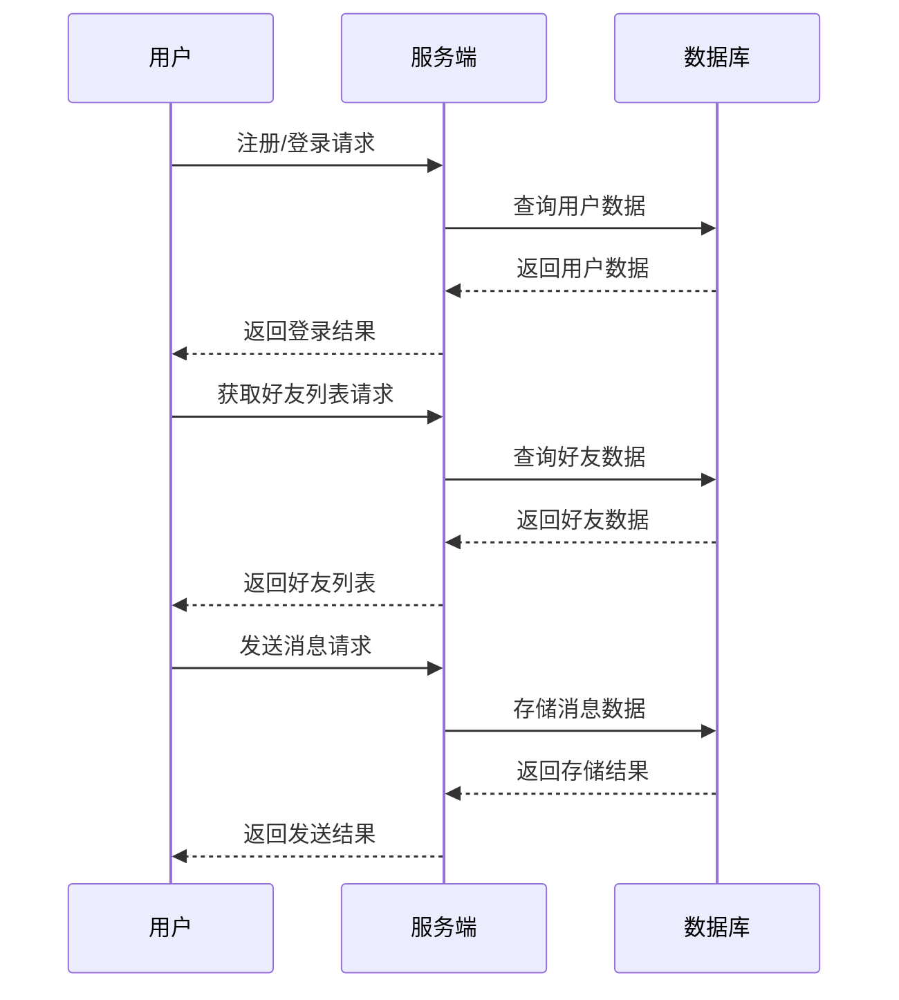
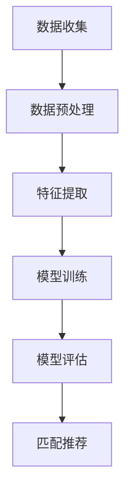
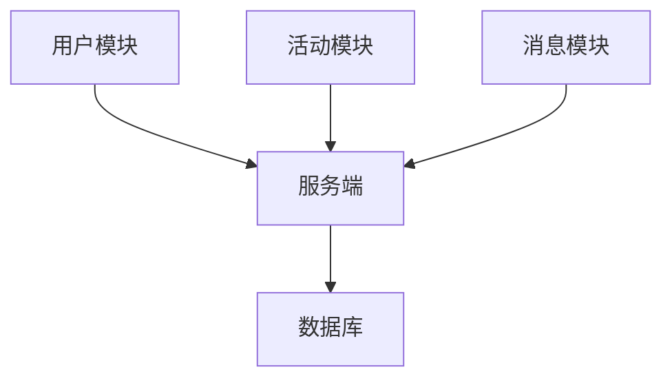
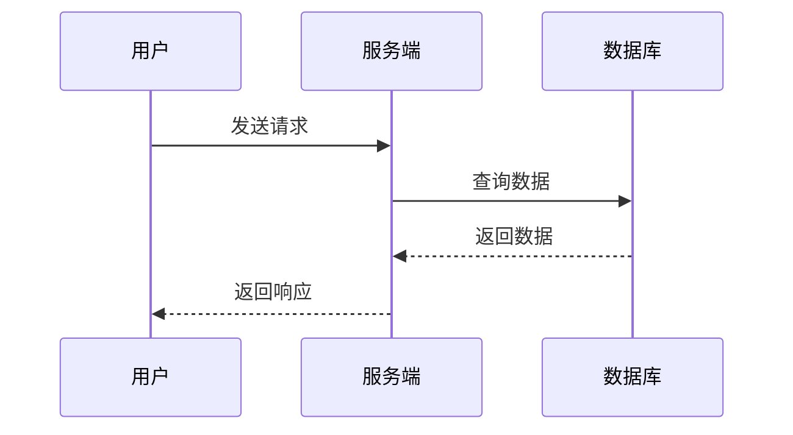

                 

# 跨年龄友谊匹配服务：促进代际交流的在线平台

## 关键词

- 跨年龄友谊
- 在线平台
- 用户画像
- 智能匹配算法
- 代际交流
- 用户体验
- 用户隐私保护

## 摘要

随着社会的发展，代际交流的缺乏成为了一个普遍问题。本文旨在探讨如何构建一个跨年龄友谊匹配服务，通过在线平台促进不同年龄段个体之间的交流和互动。文章首先介绍了问题的背景和问题描述，然后详细阐述了用户画像构建、智能匹配算法设计、平台设计与实现以及用户隐私保护等关键问题。通过逐步分析推理，本文提出了一种有效的解决方案，并讨论了其边界与外延，以及核心概念与联系。本文为跨年龄友谊匹配服务提供了一个系统性的框架，为后续研究和实践提供了有益的参考。

---

### 第1章：引言

#### 1.1 问题背景

在当今快速变化的社会中，代际之间的交流与理解变得越来越重要。然而，由于年龄差异、生活经历、价值观和文化背景的不同，跨年龄的友谊往往难以建立和维护。年轻人和老年人之间的沟通障碍，不仅影响了他们的个人成长和发展，也可能导致社会的不和谐。因此，如何通过技术手段促进代际交流，构建一个有效的跨年龄友谊匹配服务，成为了学术界和工业界共同关注的问题。

#### 1.2 问题描述

跨年龄友谊匹配服务的核心问题是如何通过在线平台，将不同年龄段的个体匹配起来，以促进他们之间的交流和互动。具体来说，这个问题包括以下几个方面：

1. **用户画像构建**：如何收集和分析用户的年龄、兴趣、性格等信息，以构建详细的用户画像。
2. **智能匹配算法**：如何设计并实现智能匹配算法，以根据用户画像推荐合适的交友对象。
3. **平台设计与实现**：如何构建一个功能齐全、用户体验良好的在线平台，以支持用户的交友、互动和活动。
4. **用户隐私保护**：如何在保障用户隐私的前提下，实现跨年龄友谊匹配服务。

#### 1.3 问题解决

为了解决上述问题，本文提出以下方案：

1. **用户画像构建**：通过用户注册信息、行为数据和社交网络数据的收集，构建多维度的用户画像。
2. **智能匹配算法**：设计基于用户画像的智能匹配算法，使用机器学习和数据分析技术，实现高效匹配。
3. **平台设计与实现**：构建一个具有良好用户体验的在线平台，提供交友、互动、活动等功能。
4. **用户隐私保护**：在数据收集、处理和传输过程中，采用加密技术和隐私保护策略，确保用户隐私安全。

#### 1.4 边界与外延

跨年龄友谊匹配服务的边界主要包括：

- **技术实现**：平台的开发、维护和更新。
- **用户隐私保护**：如何在确保用户隐私的前提下提供服务。
- **服务质量**：如何通过技术手段提升用户满意度。

其外延则包括：

- **年龄范围**：不同年龄段个体的界定。
- **匹配算法**：算法的优化和扩展。
- **平台功能**：活动的多样性、用户体验的改进。

#### 1.5 核心概念与联系

- **用户画像**：对用户进行多维度数据分析，形成的用户特征模型。
- **智能匹配算法**：基于用户画像，实现用户之间的智能推荐。
- **平台技术实现**：包括前端设计、后端服务、数据库管理等。
- **用户隐私保护**：在数据处理和传输过程中，确保用户隐私安全。

#### 1.6 本章小结

本章对跨年龄友谊匹配服务的背景、问题描述、问题解决思路以及核心概念进行了介绍。在接下来的章节中，我们将详细探讨用户画像构建、智能匹配算法设计、平台设计与实现等关键问题。

---

### 第2章：用户画像构建

#### 2.1 用户画像概述

##### 2.1.1 用户画像的定义

用户画像（User Profiling）是指通过收集和分析用户在不同维度上的数据，构建出一个综合的用户特征模型。这个模型可以反映用户的年龄、性别、兴趣爱好、行为习惯、价值观等多方面的信息。用户画像的目的是帮助平台更好地了解用户，为其提供个性化的服务。

##### 2.1.2 用户画像的重要性

在跨年龄友谊匹配服务中，用户画像具有以下重要性：

1. **提高匹配准确性**：通过构建详细的用户画像，可以更准确地推荐合适的交友对象。
2. **优化用户体验**：根据用户画像，平台可以提供个性化的推荐和服务，提高用户满意度。
3. **降低运营成本**：通过精准的用户画像，可以更有效地定位用户需求，减少无效的营销和运营成本。

#### 2.2 用户画像的数据来源

用户画像的数据来源主要包括以下几个方面：

1. **用户注册信息**：用户的年龄、性别、职业、教育背景等基本信息。
2. **用户行为数据**：用户的浏览记录、搜索历史、购物行为等。
3. **社交网络数据**：用户的社交圈、兴趣爱好、点赞评论等。
4. **外部数据**：如天气、新闻、市场趋势等。

##### 2.3 用户画像构建方法

用户画像构建主要包括以下几个步骤：

1. **数据收集**：收集用户的各种数据，包括基本信息、行为数据、社交网络数据等。
2. **数据预处理**：对收集到的数据进行清洗、去重、格式化等预处理操作。
3. **特征提取**：从预处理后的数据中提取出用户的行为特征、兴趣特征等。
4. **模型训练**：使用机器学习算法，对提取的特征进行建模，训练出用户画像模型。
5. **模型评估**：评估用户画像模型的准确性、召回率等指标，对模型进行调整和优化。

#### 2.4 用户画像在匹配服务中的应用

用户画像在匹配服务中的应用主要包括以下几个方面：

1. **用户推荐**：根据用户画像，推荐可能感兴趣的朋友。
2. **用户行为预测**：预测用户可能感兴趣的活动、话题等，提供个性化服务。
3. **用户需求分析**：分析用户的需求，优化平台功能和设计。
4. **市场分析**：根据用户画像，分析市场趋势，制定营销策略。

##### 2.5 本章小结

本章介绍了用户画像的基本概念、数据来源、构建方法以及在匹配服务中的应用。通过用户画像，我们可以更好地了解用户，提高匹配准确性，优化用户体验。在下一章中，我们将探讨智能匹配算法的设计。

---

### 第3章：智能匹配算法设计

#### 3.1 智能匹配算法概述

智能匹配算法（Intelligent Matching Algorithm）是跨年龄友谊匹配服务中的核心组件。它通过分析用户的画像，找到具有相似特征或潜在兴趣的个体，从而实现跨年龄的友谊推荐。智能匹配算法的好坏直接影响用户体验和匹配效果。

#### 3.2 智能匹配算法的选择

选择合适的智能匹配算法需要考虑以下几个因素：

1. **匹配准确性**：算法能否准确找到匹配对象，降低误匹配率。
2. **计算效率**：算法的运行速度，特别是对于大规模用户数据的处理能力。
3. **可扩展性**：算法是否容易扩展，以适应未来更多的数据和需求。
4. **用户体验**：算法对用户隐私的影响，以及是否容易操作和理解。

根据上述因素，本章将选择基于协同过滤（Collaborative Filtering）和基于内容推荐（Content-Based Recommendation）相结合的混合匹配算法。

#### 3.3 混合匹配算法原理

混合匹配算法的核心思想是将协同过滤和基于内容推荐相结合，利用两者的优点，提高匹配的准确性和效率。

1. **协同过滤**：
   - **用户基于**：根据用户的行为数据（如浏览记录、点赞、评论等），找到与目标用户相似的用户群体，然后从这些用户中推荐朋友。
   - **物品基于**：根据用户对特定物品的评分或偏好，找到与目标用户兴趣相似的其他用户，进行推荐。

2. **基于内容推荐**：
   - **内容相似度**：通过分析用户的行为和兴趣数据，提取用户的关键特征，然后计算用户之间的内容相似度，推荐具有相似兴趣的用户。

#### 3.4 混合匹配算法实现

以下是混合匹配算法的实现步骤：

1. **数据预处理**：对用户数据和行为数据进行清洗、去重、格式化等预处理操作。
2. **特征提取**：提取用户的行为特征和兴趣特征，如浏览次数、点赞数、评论数、关注人数等。
3. **协同过滤计算**：
   - **用户基于**：计算用户之间的相似度，可以使用余弦相似度、皮尔逊相关系数等方法。
   - **物品基于**：计算用户对物品的评分或偏好，找到与目标用户评分相似的物品，从而找到相似用户。

4. **内容相似度计算**：计算用户之间的内容相似度，可以使用TF-IDF、余弦相似度等方法。

5. **匹配结果生成**：将协同过滤和基于内容推荐的匹配结果进行合并，生成最终的匹配推荐列表。

#### 3.5 算法优化

为了提高匹配算法的效率和准确性，可以采用以下优化方法：

1. **分布式计算**：使用分布式计算框架（如Spark）处理大规模数据，提高计算效率。
2. **缓存机制**：使用缓存技术（如Redis）存储计算结果，减少重复计算。
3. **在线学习**：使用在线学习算法（如梯度提升机），根据用户实时反馈调整推荐策略。

##### 3.6 本章小结

本章介绍了智能匹配算法的设计原则、实现步骤和优化方法。通过混合匹配算法，可以有效地实现跨年龄友谊匹配，提高用户体验和匹配效果。在下一章中，我们将探讨平台设计与实现的问题。

---

### 第4章：平台设计与实现

#### 4.1 平台概述

跨年龄友谊匹配服务的核心是通过在线平台实现用户的交友、互动和活动。平台的设计与实现需要综合考虑用户体验、功能需求、技术实现等多个方面。本节将详细介绍平台的设计和实现。

#### 4.2 平台功能设计

平台的功能设计主要包括以下几个方面：

1. **用户注册与登录**：用户可以通过邮箱、手机号、社交媒体账号等注册和登录平台。
2. **个人资料编辑**：用户可以编辑个人资料，包括头像、姓名、性别、年龄、兴趣爱好等。
3. **好友管理**：用户可以查看好友列表、添加好友、发送消息、管理好友关系等。
4. **活动发布与参与**：用户可以发布活动，邀请好友参与，也可以参加其他用户发布的活动。
5. **消息系统**：平台提供即时消息系统，支持文本、图片、语音等多种消息形式。
6. **隐私设置**：用户可以设置隐私选项，控制个人信息的公开范围。
7. **推荐系统**：根据用户的画像和偏好，推荐可能感兴趣的朋友和活动。

#### 4.3 平台架构设计

平台架构设计需要考虑高可用性、高扩展性、易维护性等因素。以下是平台的基本架构设计：

1. **前端架构**：
   - 使用React或Vue等前端框架，实现响应式网页设计，提升用户体验。
   - 使用Webpack等构建工具，优化前端性能。

2. **后端架构**：
   - 使用Spring Boot等后端框架，实现业务逻辑处理。
   - 使用Redis等缓存数据库，提高系统性能。
   - 使用MySQL等关系型数据库，存储用户数据。

3. **服务架构**：
   - 使用Docker容器化技术，实现服务隔离和部署。
   - 使用Kubernetes进行容器编排和管理。

#### 4.4 系统接口设计

系统接口设计包括内部接口和外部接口。以下是主要接口设计：

1. **用户接口**：
   - 用户注册/登录接口：处理用户的注册、登录和认证。
   - 用户资料接口：处理用户资料的查询、更新和删除。
   - 好友接口：处理好友关系的添加、删除和查询。
   - 消息接口：处理消息的发送、接收和查询。

2. **活动接口**：
   - 活动发布接口：处理活动的创建、发布和更新。
   - 活动查询接口：处理活动的查询、筛选和排序。

3. **推荐接口**：
   - 用户画像接口：处理用户画像的构建和更新。
   - 匹配接口：处理基于用户画像的推荐匹配。

#### 4.5 系统交互设计

系统交互设计主要使用Mermaid绘制序列图，展示系统的交互流程。以下是系统交互设计的Mermaid序列图：



##### 4.6 本章小结

本章介绍了跨年龄友谊匹配服务的平台设计与实现，包括功能设计、架构设计、接口设计和交互设计。通过详细的设计和实现，平台能够为用户提供便捷、高效的交友和交流服务。在下一章中，我们将探讨用户隐私保护的问题。

---

### 第5章：用户隐私保护

#### 5.1 隐私保护的重要性

在跨年龄友谊匹配服务中，用户隐私保护至关重要。随着在线平台的发展，用户的数据泄露和隐私侵犯事件屡见不鲜。用户对隐私保护的担忧，直接影响平台的信任度和用户黏性。因此，如何在提供高效匹配服务的同时，保护用户隐私，成为了平台设计中的重要问题。

#### 5.2 隐私保护策略

为了确保用户隐私，平台可以采用以下策略：

1. **数据加密**：在数据存储和传输过程中，使用加密算法（如AES）对用户数据进行加密，防止数据被非法获取。
2. **访问控制**：通过角色权限控制，确保只有授权用户可以访问特定数据。
3. **日志记录**：记录用户数据的访问和操作日志，以便在发生数据泄露时进行追踪和调查。
4. **匿名化处理**：对用户数据进行匿名化处理，隐藏用户真实身份，降低隐私泄露的风险。
5. **隐私政策**：明确告知用户数据收集、使用和共享的方式，让用户了解自己的隐私权益。

#### 5.3 隐私保护技术实现

以下是平台隐私保护技术的具体实现：

1. **数据加密**：
   - 使用SSL/TLS协议，对用户数据进行加密传输。
   - 使用AES加密算法，对存储在数据库中的用户数据进行加密。

2. **访问控制**：
   - 使用角色权限控制，对不同的用户角色（如普通用户、管理员等）分配不同的权限。
   - 使用Spring Security等框架，实现细粒度的访问控制。

3. **日志记录**：
   - 使用日志框架（如Log4j），记录用户数据的访问和操作日志。
   - 定期对日志进行分析，发现潜在的安全风险。

4. **匿名化处理**：
   - 使用匿名化工具（如Pseudonymizer），对用户数据进行匿名化处理。
   - 在数据分析和挖掘过程中，避免使用能识别用户真实身份的数据。

5. **隐私政策**：
   - 在用户注册和登录界面，展示隐私政策，获取用户的同意。
   - 在用户使用平台的过程中，定期更新隐私政策，确保用户了解最新的隐私保护措施。

#### 5.4 隐私保护效果评估

隐私保护效果评估可以通过以下方法进行：

1. **安全审计**：定期进行安全审计，检查系统是否存在安全漏洞和隐私泄露风险。
2. **用户反馈**：收集用户对隐私保护的反馈，了解用户的满意度和担忧。
3. **合规检查**：检查平台是否符合相关的法律法规要求，如《通用数据保护条例》（GDPR）等。

##### 5.5 本章小结

本章介绍了跨年龄友谊匹配服务中用户隐私保护的重要性和策略，以及技术实现的细节。通过有效的隐私保护措施，平台可以在提供优质服务的同时，确保用户的隐私安全。在下一章中，我们将探讨项目的实战和实现。

---

### 第6章：项目实战

#### 6.1 项目介绍

本节将通过一个实际的项目案例，展示跨年龄友谊匹配服务的实现过程。该项目包括环境安装、系统核心实现和实际案例分析等内容，旨在帮助读者更好地理解跨年龄友谊匹配服务的构建和应用。

#### 6.2 环境安装

要实现跨年龄友谊匹配服务，需要安装以下环境：

1. **操作系统**：Windows/Linux/MacOS
2. **开发工具**：IDE（如IntelliJ IDEA、Visual Studio Code）
3. **数据库**：MySQL/PostgreSQL
4. **缓存数据库**：Redis
5. **消息队列**：RabbitMQ
6. **前端框架**：React/Vue
7. **后端框架**：Spring Boot
8. **容器化工具**：Docker

以下是环境安装的具体步骤：

1. **安装操作系统**：根据个人需求选择合适的操作系统。
2. **安装开发工具**：下载并安装IDE。
3. **安装数据库**：安装MySQL/PostgreSQL，并配置数据库。
4. **安装缓存数据库**：安装Redis，并配置Redis服务。
5. **安装消息队列**：安装RabbitMQ，并配置RabbitMQ服务。
6. **安装前端框架**：下载并安装React/Vue。
7. **安装后端框架**：下载并安装Spring Boot。
8. **安装容器化工具**：安装Docker，并配置Docker服务。

#### 6.3 系统核心实现

跨年龄友谊匹配服务主要包括以下几个核心模块：

1. **用户管理模块**：负责用户的注册、登录、资料管理等功能。
2. **用户画像模块**：负责用户画像的构建、更新和分析。
3. **匹配算法模块**：负责实现智能匹配算法，推荐交友对象。
4. **活动管理模块**：负责活动的发布、参与和管理。
5. **消息系统模块**：负责消息的发送、接收和管理。

以下是系统核心实现的详细步骤：

1. **用户管理模块**：
   - 实现用户注册功能，包括邮箱、手机号、密码等信息的验证。
   - 实现用户登录功能，包括密码加密存储和身份验证。
   - 实现用户资料管理功能，包括头像、姓名、性别、年龄、兴趣爱好等信息的编辑。

2. **用户画像模块**：
   - 收集用户注册信息和行为数据，构建用户画像。
   - 实现用户画像的存储和更新，包括画像的构建、清洗、处理和存储。
   - 实现用户画像的分析，提取用户的行为特征和兴趣特征。

3. **匹配算法模块**：
   - 设计并实现协同过滤和基于内容推荐的混合匹配算法。
   - 实现用户画像的匹配，推荐具有相似兴趣的朋友。
   - 实现匹配结果的存储和查询。

4. **活动管理模块**：
   - 实现活动发布功能，包括活动名称、时间、地点、参与人数等信息的填写。
   - 实现活动参与功能，包括用户报名、审核和取消报名等功能。
   - 实现活动管理功能，包括活动状态的更新、删除和查询。

5. **消息系统模块**：
   - 实现消息的发送和接收，支持文本、图片、语音等多种消息形式。
   - 实现消息的存储和查询，包括消息的索引和搜索功能。
   - 实现消息通知功能，包括系统通知、好友通知等。

#### 6.4 实际案例分析

以下是一个实际案例的分析：

**案例背景**：一个30岁的上班族希望通过平台找到一位年龄在50岁左右的企业家作为朋友，以获取职业发展的建议。

**分析过程**：

1. **用户画像构建**：根据用户的注册信息和行为数据，构建用户画像。用户画像包括年龄、职业、兴趣爱好、行为习惯等特征。
2. **智能匹配**：使用混合匹配算法，根据用户画像推荐可能感兴趣的朋友。算法会根据用户画像的特征，计算出相似度分数，推荐相似度最高的用户。
3. **推荐结果**：平台根据匹配结果，向用户展示推荐的交友对象，用户可以查看推荐理由、个人资料等信息。
4. **用户互动**：用户可以与推荐对象进行聊天、发送消息，了解对方的兴趣爱好和职业背景，建立友谊。

**案例分析**：通过上述过程，用户成功找到了一位符合要求的交友对象，双方在交流中相互学习、分享经验，实现了跨年龄的友谊。

##### 6.5 项目小结

通过本项目的实战，我们展示了如何构建一个跨年龄友谊匹配服务。项目涵盖了环境安装、系统核心实现和实际案例分析等内容，为读者提供了详细的实践指导。在后续的拓展中，可以进一步优化匹配算法、增加活动多样性、提升用户体验等。

---

### 最佳实践与拓展

#### 6.6 最佳实践

1. **数据安全**：确保用户数据在传输和存储过程中的安全性，使用加密技术保护用户隐私。
2. **用户体验**：优化用户界面设计，提高平台的易用性和用户满意度。
3. **性能优化**：采用缓存、分布式计算等技术，提升系统性能和响应速度。
4. **隐私保护**：制定明确的隐私政策，获取用户同意，并严格执行。

#### 6.7 拓展阅读

1. **相关研究**：探讨跨年龄友谊匹配服务的相关研究，如社交网络分析、用户行为预测等。
2. **技术前沿**：了解最新的技术趋势，如人工智能、区块链等在跨年龄友谊匹配服务中的应用。
3. **案例分析**：分析其他成功的跨年龄友谊匹配服务案例，学习其成功经验和不足之处。

---

### 总结

本文详细探讨了跨年龄友谊匹配服务的设计与实现，包括用户画像构建、智能匹配算法设计、平台设计与实现以及用户隐私保护等方面。通过逐步分析推理，本文提出了一种有效的解决方案，为跨年龄友谊匹配服务提供了有益的参考。在未来的研究和实践中，可以进一步优化匹配算法、提升用户体验，探索更多应用场景，为促进代际交流做出贡献。

### 作者信息

作者：AI天才研究院/AI Genius Institute & 禅与计算机程序设计艺术 /Zen And The Art of Computer Programming

---

## 附录

### 数据库ER图

```mermaid
erDiagram
    User ||--|{ Friend }
    User ||--|{ Activity }
    Activity ||--|{ User }
    Message ||--|{ User }
    ChatRoom ||--|{ User }
    ChatMessage ||--|{ ChatRoom }
```

### 用户画像特征对比表格

| 特征          | 描述                               |
| ------------- | ---------------------------------- |
| 年龄          | 用户年龄范围                       |
| 性别          | 用户性别信息                       |
| 职业          | 用户职业信息                       |
| 教育背景      | 用户教育程度                       |
| 兴趣爱好      | 用户兴趣爱好分类                   |
| 行为习惯      | 用户日常行为和消费习惯             |
| 社交网络数据  | 用户在社交平台上的互动数据         |

### 算法流程图



### 系统架构图



### 系统交互序列图



