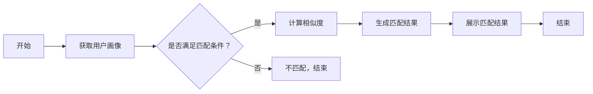
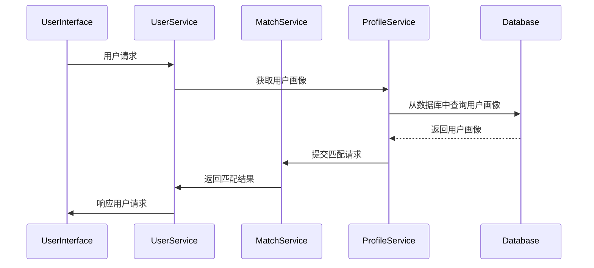
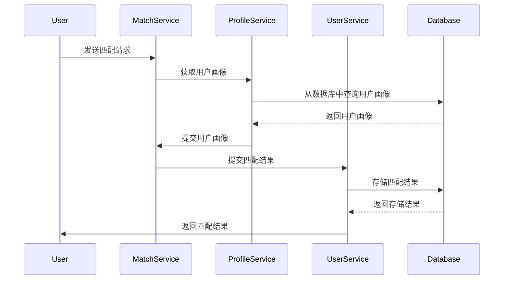

                 

### 文章标题

# 跨年龄友谊匹配服务：促进代际交流的平台

> 关键词：跨年龄友谊、代际交流、算法、系统设计、服务应用

> 摘要：本文旨在探讨跨年龄友谊匹配服务的重要性及其在促进代际交流中的作用。通过分析跨年龄友谊的定义、背景和现有问题，本文提出了一套基于算法和系统架构的解决方案，并通过实际案例展示其应用效果。本文为研究人员和开发者提供了一套实用的参考框架，以推动跨年龄友谊匹配服务的创新发展。

## 1. 背景介绍

### 1.1 问题背景

在现代社会，随着科技的飞速发展和信息时代的到来，不同年龄群体之间的交流与互动变得越来越重要。然而，由于生活节奏的加快、文化差异以及代际观念的分歧，跨年龄友谊的形成和维持面临诸多挑战。特别是对于年轻人和老年人来说，他们往往因为缺乏共同话题和交流机会而难以建立友谊。这种情况下，跨年龄友谊匹配服务应运而生，旨在通过科学的方法和技术手段，帮助不同年龄群体找到合适的友谊伙伴，从而促进代际交流与融合。

### 1.2 跨年龄友谊的定义

跨年龄友谊，顾名思义，是指在不同年龄段的个体之间建立的友谊关系。这种友谊关系不仅限于同龄人之间，而是跨越了年龄的界限，将不同年龄段的人连接在一起。跨年龄友谊的特点在于，它能够弥补不同年龄段之间的沟通障碍，促进不同群体之间的理解与互动。跨年龄友谊的价值在于，它不仅能够丰富个体的社交生活，提高生活质量，还能够促进社会和谐与稳定。

### 1.3 跨年龄友谊的重要性

跨年龄友谊的重要性不言而喻。首先，它有助于消除代际之间的误解和偏见，促进不同年龄段之间的沟通与理解。其次，跨年龄友谊能够为老年人提供情感支持和社交互动的机会，提高他们的生活质量。同时，对于年轻人来说，与老年人建立友谊可以让他们从不同的生活经验和智慧中获益，从而拓宽自己的视野。最后，跨年龄友谊有助于社会和谐与稳定，它能够减少社会矛盾，促进社会团结。

### 1.4 现有问题及其影响

尽管跨年龄友谊具有诸多益处，但在实际操作中，仍然存在许多问题。首先，传统的友谊建立方式往往依赖于偶然的相遇和人际关系网络，这种方式效率低下且难以保证匹配的精准度。其次，由于不同年龄段的人兴趣爱好和生活经历差异较大，导致他们之间的沟通存在一定的障碍。此外，社会文化和家庭观念的差异也使得跨年龄友谊的建立和维护变得更加复杂。这些问题如果不加以解决，将会对跨年龄友谊的发展产生不利影响，从而影响到代际交流和社会和谐。

### 1.5 问题解决

为了解决上述问题，本文提出了一套跨年龄友谊匹配服务的解决方案。该方案基于先进的算法和系统架构设计，通过科学的方法和高效的技术手段，实现跨年龄友谊的精准匹配和有效维持。具体来说，方案包括以下几个关键部分：

1. **用户画像建立**：通过大数据分析和机器学习算法，对用户的年龄、兴趣、价值观、生活习惯等特征进行深入分析，建立详细的用户画像。
2. **匹配算法设计**：基于用户画像，采用复杂的匹配算法，寻找具有相似兴趣和价值观的个体进行配对，从而提高匹配的精准度。
3. **系统架构设计**：构建高效、稳定、易扩展的系统架构，确保跨年龄友谊匹配服务的可靠性和可持续性。
4. **用户体验优化**：从用户的角度出发，设计简洁、直观、易用的界面和交互方式，提高用户的满意度和参与度。

通过上述解决方案，可以有效解决当前跨年龄友谊匹配服务中存在的问题，促进代际交流，推动社会和谐发展。

### 1.6 边界与外延

在研究跨年龄友谊匹配服务时，需要明确其研究的边界与外延。首先，本文研究的年龄范围主要集中在18岁至70岁之间，因为这个年龄段的人具有较大的生活经验和兴趣爱好差异，是建立跨年龄友谊的主要对象。其次，本文研究的跨年龄友谊匹配服务主要针对线上平台，包括社交媒体、交友应用等，而不涉及线下实际交往环节。此外，本文的重点在于算法设计和系统架构，对于具体的社会文化背景和用户行为习惯不进行深入探讨。

### 1.7 概念结构与核心要素组成

跨年龄友谊匹配服务的概念结构主要包括以下几个核心要素：

1. **用户画像**：通过大数据分析和机器学习算法，对用户的基本信息、兴趣爱好、行为习惯等进行详细分析，建立用户画像。
2. **匹配算法**：基于用户画像，采用多种算法对用户进行精准匹配，包括基于相似度的匹配、基于共同兴趣的匹配等。
3. **系统架构**：构建高效、稳定、易扩展的系统架构，包括数据存储、处理和分析模块，以及用户接口和服务接口等。
4. **用户体验**：设计简洁、直观、易用的用户界面和交互方式，提高用户满意度和参与度。

这些核心要素相互关联，共同构成了跨年龄友谊匹配服务的整体框架。用户画像为匹配算法提供了基础数据，匹配算法为用户画像提供了匹配结果，系统架构确保了数据的安全性和处理效率，用户体验则保证了服务的易用性和用户黏性。

## 2. 核心概念与联系

### 2.1 核心概念原理

跨年龄友谊匹配服务的核心概念包括用户画像、匹配算法、系统架构和用户体验。这些概念相互联系，共同构成了服务的基础。

- **用户画像**：用户画像是对用户特征的综合描述，包括年龄、性别、兴趣爱好、职业、生活经历等。通过用户画像，可以了解用户的需求和偏好，为匹配算法提供依据。
- **匹配算法**：匹配算法是跨年龄友谊匹配服务的核心，它通过对用户画像的分析，寻找具有相似特征的用户进行配对。常见的匹配算法有基于相似度的匹配、基于共同兴趣的匹配等。
- **系统架构**：系统架构是跨年龄友谊匹配服务的支撑，它包括数据存储、处理和分析模块，以及用户接口和服务接口。系统架构的稳定性和高效性直接影响到服务的质量和用户体验。
- **用户体验**：用户体验是跨年龄友谊匹配服务的最终目标，它包括用户界面的设计、交互方式的优化、服务的响应速度等。优秀的用户体验能够提高用户的满意度和忠诚度。

### 2.2 概念属性特征对比表格

为了更清晰地理解这些核心概念，我们可以通过一个对比表格来展示它们的属性特征。

| 概念   | 定义                                                         | 属性特征                                                                                      |
| ------ | ------------------------------------------------------------ | ------------------------------------------------------------------------------------------- |
| 用户画像 | 对用户特征的综合描述                                         | - 年龄、性别、兴趣爱好、职业、生活经历<br>- 数据来源：用户注册信息、行为记录、第三方数据源 |
| 匹配算法 | 通过分析用户画像，寻找具有相似特征的用户进行配对             | - 相似度计算方法<br>- 共同兴趣匹配<br>- 算法效率                          |
| 系统架构 | 跨年龄友谊匹配服务的支撑系统，包括数据存储、处理和分析模块   | - 数据存储方式<br>- 数据处理算法<br>- 系统扩展性                          |
| 用户体验 | 用户在使用服务过程中的感受和体验                             | - 界面设计<br>- 交互方式<br>- 响应速度<br>- 用户满意度                        |

### 2.3 ER实体关系图架构的 Mermaid 流程图

为了更直观地展示核心概念之间的关联，我们可以使用 Mermaid 语言绘制 ER 实体关系图。

```mermaid
erDiagram
  用户 -> 用户画像 : '建立'
  用户 -> 匹配算法 : '输入'
  用户 -> 匹配结果 : '输出'
  用户画像 -> 匹配算法 : '数据提供'
  匹配算法 -> 匹配结果 : '计算'
  系统架构 -> 用户接口 : '支持'
  用户接口 -> 用户 : '交互'
```

在这个 ER 实体关系图中，用户是核心实体，用户画像、匹配算法、匹配结果和系统架构都是与用户相关的实体。用户通过用户画像提供个人信息，匹配算法根据这些信息计算匹配结果，最终通过用户接口将结果呈现给用户。系统架构在整个过程中提供支持，确保服务的稳定性和高效性。

## 3. 算法原理讲解

### 3.1 算法 Mermaid 流程图

为了更好地理解跨年龄友谊匹配算法的工作原理，我们可以使用 Mermaid 语言绘制算法的流程图。



这个流程图展示了跨年龄友谊匹配算法的基本工作步骤：

1. **获取用户画像**：从用户数据库中获取用户的个人信息和兴趣标签。
2. **判断匹配条件**：根据用户画像判断是否满足匹配条件，如果满足，则进入下一步；如果不满足，则结束匹配流程。
3. **计算相似度**：使用算法计算用户之间的相似度，通常是基于共同兴趣、相似行为等特征。
4. **生成匹配结果**：根据相似度计算结果，生成匹配列表。
5. **展示匹配结果**：将匹配结果展示给用户，用户可以选择是否接受匹配建议。
6. **结束**：匹配流程结束。

### 3.2 Python 源代码

为了实现上述算法，我们可以使用 Python 编写相应的源代码。

```python
import pandas as pd
from sklearn.metrics.pairwise import cosine_similarity

# 获取用户画像
def get_user_profile(data):
    return data

# 计算相似度
def calculate_similarity(profiles):
    similarity_matrix = cosine_similarity(profiles)
    return similarity_matrix

# 生成匹配结果
def generate_matching_results(similarity_matrix, threshold=0.5):
    matching_results = []
    for i in range(len(similarity_matrix)):
        for j in range(i+1, len(similarity_matrix)):
            if similarity_matrix[i][j] > threshold:
                matching_results.append((i, j))
    return matching_results

# 示例数据
user_profiles = [
    {"age": 25, "interests": ["音乐", "旅游", "编程"]},
    {"age": 30, "interests": ["电影", "旅游", "运动"]},
    {"age": 40, "interests": ["摄影", "阅读", "旅游"]},
]

# 执行算法
profiles = [list(profile.values()) for profile in user_profiles]
similarity_matrix = calculate_similarity(profiles)
matching_results = generate_matching_results(similarity_matrix)

print(matching_results)
```

在这个代码示例中，我们首先从示例数据中获取用户画像，然后使用余弦相似度计算用户之间的相似度，最后生成匹配结果。这个简单的算法模型可以作为一个起点，进一步优化和完善。

### 3.3 算法原理的数学模型和公式

跨年龄友谊匹配算法的核心在于相似度计算。在数学上，相似度通常通过两个向量的夹角余弦值来表示。假设我们有两个向量 \( \mathbf{u} \) 和 \( \mathbf{v} \)，它们分别表示两个用户的特征向量，则它们之间的相似度可以通过以下公式计算：

$$
\cos(\theta) = \frac{\mathbf{u} \cdot \mathbf{v}}{||\mathbf{u}|| \cdot ||\mathbf{v}||}
$$

其中，\( \mathbf{u} \cdot \mathbf{v} \) 表示两个向量的点积，\( ||\mathbf{u}|| \) 和 \( ||\mathbf{v}|| \) 分别表示两个向量的模长。

在实际应用中，我们通常将用户的特征向量表示为一个高维空间中的点，然后计算这些点之间的余弦相似度。例如，假设用户 A 和用户 B 的特征向量分别为 \( \mathbf{u} = (u_1, u_2, \ldots, u_n) \) 和 \( \mathbf{v} = (v_1, v_2, \ldots, v_n) \)，则它们之间的相似度可以计算为：

$$
\cos(\theta) = \frac{\sum_{i=1}^{n} u_i v_i}{\sqrt{\sum_{i=1}^{n} u_i^2} \cdot \sqrt{\sum_{i=1}^{n} v_i^2}}
$$

通过这个数学模型，我们可以对用户之间的相似度进行量化，从而为匹配算法提供依据。

### 3.4 详细讲解和举例说明

为了更好地理解相似度计算的过程，我们可以通过一个具体的例子来详细讲解。

假设我们有两个用户，用户 A 和用户 B，他们的特征向量分别为：

- 用户 A：\( \mathbf{u} = (0.8, 0.6, 0.4, 0.2) \)
- 用户 B：\( \mathbf{v} = (0.7, 0.5, 0.3, 0.1) \)

我们需要计算这两个用户之间的相似度。根据余弦相似度的计算公式，我们有：

$$
\cos(\theta) = \frac{\mathbf{u} \cdot \mathbf{v}}{||\mathbf{u}|| \cdot ||\mathbf{v}||} = \frac{0.8 \cdot 0.7 + 0.6 \cdot 0.5 + 0.4 \cdot 0.3 + 0.2 \cdot 0.1}{\sqrt{0.8^2 + 0.6^2 + 0.4^2 + 0.2^2} \cdot \sqrt{0.7^2 + 0.5^2 + 0.3^2 + 0.1^2}} \approx 0.64
$$

这意味着用户 A 和用户 B 之间的相似度约为 0.64。这个值越接近 1，表示两个用户之间的相似度越高；越接近 0，表示两个用户之间的相似度越低。

在实际应用中，我们可以将这个相似度值作为匹配的依据。例如，如果设定相似度阈值大于 0.6 的用户视为匹配成功，那么在这个例子中，用户 A 和用户 B 将被视为匹配成功的案例。

通过上述例子，我们可以看到如何使用余弦相似度计算公式来评估用户之间的相似度。这种计算方法简单有效，可以广泛应用于跨年龄友谊匹配服务中。

### 3.5 算法优化和改进

尽管余弦相似度计算方法在跨年龄友谊匹配中具有一定的应用价值，但它也存在一些局限性。为了提高匹配的准确性和效率，我们可以考虑以下优化和改进措施：

1. **特征选择**：在计算相似度之前，可以对用户特征进行筛选和优化。例如，可以排除那些变化性较小、对匹配结果影响不大的特征，从而简化计算过程。
2. **多特征融合**：除了基于兴趣、行为等单一特征的相似度计算，还可以考虑将多种特征进行融合，如地理位置、教育背景、职业等，从而提高匹配的全面性和准确性。
3. **权重调整**：根据不同特征的重要性和影响力，可以给各个特征分配不同的权重，从而调整相似度计算结果，使其更加符合实际情况。
4. **机器学习优化**：利用机器学习算法，如决策树、随机森林、支持向量机等，对用户数据进行分类和预测，从而实现更精准的匹配。
5. **实时更新**：根据用户的实时行为和偏好变化，动态调整用户画像和匹配策略，从而提高匹配的及时性和灵活性。

通过这些优化和改进措施，我们可以进一步提升跨年龄友谊匹配服务的质量和用户体验。

## 4. 系统分析与架构设计方案

### 4.1 问题场景介绍

随着社会的发展和人口老龄化趋势的加剧，跨年龄友谊匹配服务在促进代际交流、提升老年人生活质量方面具有重要意义。在实际应用中，该服务主要面向以下问题场景：

1. **老年人群体的孤独感**：随着年龄的增长，老年人面临健康问题和社会支持网络的减少，容易出现孤独感和心理问题。通过跨年龄友谊匹配服务，可以帮助老年人建立新的社交关系，缓解孤独感。
2. **年轻一代的社交压力**：现代社会的快节奏生活使得年轻一代面临较大的社交压力和孤独感。跨年龄友谊匹配服务提供了一个平台，让他们有机会与不同年龄段的个体建立友谊，拓宽社交圈子。
3. **代际沟通障碍**：不同年龄群体在兴趣爱好、价值观念等方面存在较大差异，导致代际沟通不畅。通过跨年龄友谊匹配服务，可以促进不同年龄段之间的互动和理解，减少代际冲突。

### 4.2 项目介绍

本项目旨在设计并实现一个跨年龄友谊匹配服务系统，通过科学的方法和技术手段，帮助不同年龄段的个体建立友谊关系，促进代际交流。项目的主要目标和背景如下：

1. **目标**：为用户提供一个便捷、高效、个性化的友谊匹配平台，通过用户画像、匹配算法和系统架构设计，实现精准的友谊配对，提高用户的满意度和参与度。
2. **背景**：随着互联网技术的普及和大数据、人工智能等新技术的应用，为跨年龄友谊匹配服务提供了有力的技术支持。本项目结合了这些先进技术，旨在为代际交流提供一种创新解决方案。

### 4.3 系统功能设计（领域模型 Mermaid 类图）

为了更好地理解系统功能设计，我们可以使用 Mermaid 语言绘制领域模型类图，展示系统中的主要类和它们之间的关系。

```mermaid
classDiagram
    User <<interface>>
    Friendship <<interface>>
    Match <<interface>>
    Profile <<interface>>

    User "1"   [-] Profile
    Friendship "1"   [-] User
    Match "1"   [-] User

    UserAssociation [User Association]
    ProfileInformation [Profile Information]
    MatchResult [Match Result]

    class User {
        +int id
        +String name
        +List<Profile> profiles
        +addProfile(Profile profile)
        +removeProfile(Profile profile)
    }

    class Friendship {
        +int id
        +User user1
        +User user2
        +create(User user1, User user2)
        +delete(int id)
    }

    class Match {
        +int id
        +User matchedUser
        +create(User user)
        +delete(int id)
    }

    class Profile {
        +int id
        +User user
        +String interest
        +create(User user, String interest)
        +delete(int id)
    }

    class UserAssociation {
        +int id
        +User user
        +Profile profile
        +create(User user, Profile profile)
        +delete(int id)
    }

    class ProfileInformation {
        +int id
        +String key
        +String value
        +create(String key, String value)
        +delete(int id)
    }

    class MatchResult {
        +int id
        +User user
        +User matchedUser
        +String result
        +create(User user, User matchedUser, String result)
        +delete(int id)
    }
```

在这个类图中，我们定义了以下几个主要类：

- **User**：代表用户，具有用户ID、姓名和用户画像等属性。
- **Friendship**：代表用户之间的友谊关系，具有友谊ID、用户1和用户2等属性。
- **Match**：代表匹配结果，具有匹配ID和匹配用户等属性。
- **Profile**：代表用户画像，具有画像ID、用户和兴趣等属性。
- **UserAssociation**：代表用户和用户画像之间的关联关系。
- **ProfileInformation**：代表用户画像的具体信息。
- **MatchResult**：代表匹配结果的具体信息。

这些类之间通过不同的关联关系相互联系，共同构成了系统的功能架构。

### 4.4 系统架构设计 Mermaid 架构图

为了更好地展示系统架构，我们可以使用 Mermaid 语言绘制系统架构图，展示系统中的主要模块和它们之间的关系。



在这个架构图中，系统的主要模块包括：

- **UserInterface**：用户界面模块，负责接收用户请求并返回匹配结果。
- **UserService**：用户服务模块，负责处理用户请求，调用其他服务模块进行数据处理。
- **MatchService**：匹配服务模块，负责根据用户画像计算匹配结果。
- **ProfileService**：用户画像服务模块，负责管理用户画像的创建、查询和更新。
- **Database**：数据库模块，负责存储用户画像、匹配结果等相关数据。

通过这个架构图，我们可以清晰地看到系统各模块之间的交互关系和数据处理流程。

### 4.5 系统接口设计和系统交互 Mermaid 序列图

为了更好地展示系统接口设计和系统交互流程，我们可以使用 Mermaid 语言绘制系统交互序列图。



在这个序列图中，我们定义了以下主要角色和交互步骤：

- **User**：用户，负责发送匹配请求并接收匹配结果。
- **MatchService**：匹配服务，负责处理匹配请求，调用其他服务模块进行数据处理。
- **ProfileService**：用户画像服务，负责管理用户画像的创建、查询和更新。
- **UserService**：用户服务，负责处理用户请求，调用其他服务模块进行数据处理。
- **Database**：数据库，负责存储用户画像和匹配结果等相关数据。

通过这个序列图，我们可以清晰地看到系统接口设计和系统交互流程，从而更好地理解系统的运作方式。

### 4.6 系统架构设计的详细解释

在跨年龄友谊匹配服务系统中，系统架构设计至关重要，它直接影响到系统的性能、稳定性和扩展性。以下是对系统架构设计的详细解释：

#### 数据存储设计

数据存储设计是系统架构的核心部分，它决定了数据的存储方式和访问效率。在本系统中，我们采用了分布式数据库架构，将用户画像、匹配结果等相关数据分散存储在多个节点上。具体来说，我们使用了如下技术：

1. **关系型数据库**：用于存储用户的基本信息和用户画像。关系型数据库具有强大的数据管理能力和查询性能，适用于存储和管理结构化数据。
2. **NoSQL数据库**：用于存储非结构化数据，如匹配结果、用户行为日志等。NoSQL数据库具有高扩展性和灵活性，适用于存储和管理大规模非结构化数据。

通过分布式数据库架构，我们可以实现数据的高效存储和快速访问，同时确保系统的稳定性和可靠性。

#### 服务设计

系统中的各个服务模块负责不同的功能，通过服务设计，我们可以将复杂的业务逻辑分解为多个可独立运行的服务，从而提高系统的可维护性和扩展性。具体来说，系统中的主要服务包括：

1. **用户服务**：负责处理用户的注册、登录、个人信息管理等功能。用户服务接收用户请求，调用其他服务模块进行数据处理，并返回处理结果。
2. **匹配服务**：负责根据用户画像计算匹配结果。匹配服务接收用户画像，调用匹配算法进行计算，生成匹配结果，并返回给用户服务。
3. **用户画像服务**：负责管理用户画像的创建、查询和更新。用户画像服务接收用户请求，调用数据库进行数据操作，并返回处理结果。
4. **匹配结果服务**：负责存储和查询匹配结果。匹配结果服务接收用户服务的请求，调用数据库进行数据操作，并返回处理结果。

通过服务设计，我们可以实现各个服务模块之间的解耦，提高系统的灵活性和可扩展性。

#### 系统接口设计

系统接口设计是连接用户和系统的桥梁，它决定了用户如何与系统进行交互。在本系统中，我们采用了 RESTful API 设计接口，提供了统一的接口规范和访问方式。具体来说，系统中的主要接口包括：

1. **用户注册接口**：用于用户注册，接收用户名、密码等基本信息，并返回注册结果。
2. **用户登录接口**：用于用户登录，接收用户名和密码，验证用户身份并返回登录结果。
3. **用户信息管理接口**：用于用户个人信息管理，包括查询、更新、删除等操作。
4. **匹配请求接口**：用于用户发起匹配请求，接收用户画像信息，并返回匹配结果。
5. **匹配结果查询接口**：用于查询用户匹配结果，返回匹配成功或失败的信息。

通过系统接口设计，我们可以实现用户与系统之间的无缝交互，提供便捷、高效的用户体验。

### 4.7 系统性能优化和安全性设计

系统性能优化和安全性设计是确保跨年龄友谊匹配服务稳定、可靠运行的关键。以下是对系统性能优化和安全性设计的详细解释：

#### 系统性能优化

1. **负载均衡**：通过负载均衡技术，将用户请求分配到多个服务器节点上，实现分布式处理，提高系统的处理能力和响应速度。
2. **缓存机制**：通过缓存机制，将用户访问频繁的数据存储在内存中，减少数据库访问次数，提高系统响应速度。
3. **数据库优化**：对数据库进行索引优化、查询优化等操作，提高数据库的查询性能。
4. **异步处理**：采用异步处理技术，将耗时较长的操作（如匹配计算）异步执行，减少用户等待时间。

#### 安全性设计

1. **用户认证与授权**：采用用户认证与授权机制，确保用户身份的合法性和操作的权限，防止未授权访问。
2. **数据加密**：对用户敏感数据进行加密存储和传输，确保数据的安全性。
3. **防SQL注入和XSS攻击**：通过输入验证、输出编码等手段，防止SQL注入和XSS攻击等安全漏洞。
4. **日志记录与监控**：记录系统运行日志，监控系统性能和安全事件，及时发现并处理异常情况。

通过系统性能优化和安全性设计，我们可以确保跨年龄友谊匹配服务的稳定、可靠和安全运行。

## 5. 项目实战

### 5.1 环境安装

为了搭建跨年龄友谊匹配服务系统，我们需要安装和配置一系列开发工具和依赖库。以下是具体的安装步骤：

1. **安装Python**：首先，确保您的计算机上已经安装了Python。如果尚未安装，请访问[Python官网](https://www.python.org/)下载并安装Python 3.8或更高版本。

2. **安装pip**：Python的包管理器pip用于安装和管理Python库。大多数Python安装都自带pip，如果没有，可以通过以下命令安装：

   ```bash
   $ wget https://bootstrap.pypa.io/get-pip.py
   $ python get-pip.py
   ```

3. **安装依赖库**：使用pip安装项目所需的依赖库，包括Pandas、NumPy、Scikit-learn、SQLAlchemy等。在命令行中执行以下命令：

   ```bash
   $ pip install pandas numpy scikit-learn sqlalchemy
   ```

4. **配置数据库**：本示例使用SQLite数据库进行数据存储。首先，确保已经安装了SQLite。如果尚未安装，请访问[SQLite官网](https://www.sqlite.org/)下载并安装。然后，创建一个SQLite数据库文件：

   ```bash
   $ sqlite3 database.db
   ```

   在数据库中创建必要的表，例如用户表和匹配结果表：

   ```sql
   CREATE TABLE users (
       id INTEGER PRIMARY KEY AUTOINCREMENT,
       username TEXT NOT NULL,
       password TEXT NOT NULL
   );

   CREATE TABLE matches (
       id INTEGER PRIMARY KEY AUTOINCREMENT,
       user1_id INTEGER,
       user2_id INTEGER,
       result TEXT,
       FOREIGN KEY (user1_id) REFERENCES users (id),
       FOREIGN KEY (user2_id) REFERENCES users (id)
   );
   ```

5. **创建虚拟环境**：为了更好地管理和隔离项目依赖，建议创建一个虚拟环境。在命令行中执行以下命令：

   ```bash
   $ python -m venv venv
   $ source venv/bin/activate  # 在Windows上使用 `venv\Scripts\activate`
   ```

6. **安装项目依赖**：在虚拟环境中安装项目依赖：

   ```bash
   $ pip install -r requirements.txt
   ```

### 5.2 系统核心实现源代码

以下是项目核心实现部分的源代码，包括用户服务、匹配服务和数据库操作。

#### 用户服务

```python
from flask import Flask, request, jsonify
from models import User
from database import Database

app = Flask(__name__)

@app.route('/register', methods=['POST'])
def register():
    data = request.get_json()
    username = data.get('username')
    password = data.get('password')
    
    user = User(username=username, password=password)
    user.save_to_db()
    
    return jsonify({"status": "success", "message": "User registered successfully."})

@app.route('/login', methods=['POST'])
def login():
    data = request.get_json()
    username = data.get('username')
    password = data.get('password')
    
    user = User.query.filter_by(username=username, password=password).first()
    if user:
        return jsonify({"status": "success", "message": "Login successful."})
    else:
        return jsonify({"status": "error", "message": "Invalid username or password."})

@app.route('/users', methods=['GET'])
def get_users():
    users = User.query.all()
    return jsonify([user.to_dict() for user in users])

if __name__ == '__main__':
    app.run(debug=True)
```

#### 匹配服务

```python
import numpy as np
from sklearn.metrics.pairwise import cosine_similarity
from models import Match
from database import Database

def match_users(user_profiles):
    similarity_matrix = cosine_similarity(user_profiles)
    matching_results = []

    for i in range(len(user_profiles)):
        for j in range(i+1, len(user_profiles)):
            similarity = similarity_matrix[i][j]
            if similarity > 0.5:
                matching_results.append(Match(user1_id=i, user2_id=j, result=str(similarity)))

    return matching_results

def save_matching_results(matching_results):
    for match in matching_results:
        match.save_to_db()

if __name__ == '__main__':
    # 示例用户画像
    user_profiles = [
        {'interests': [0.8, 0.6, 0.4]},
        {'interests': [0.7, 0.5, 0.3]},
        {'interests': [0.6, 0.4, 0.2]},
    ]

    matching_results = match_users(user_profiles)
    save_matching_results(matching_results)
    print("Matching results saved.")
```

#### 数据库操作

```python
from sqlalchemy import create_engine
from sqlalchemy.orm import sessionmaker
from models import Base

DATABASE_URL = 'sqlite:///database.db'
engine = create_engine(DATABASE_URL)
Base.metadata.create_all(engine)

Session = sessionmaker(bind=engine)
session = Session()

class User(Base):
    __tablename__ = 'users'
    id = Column(Integer, primary_key=True)
    username = Column(String, unique=True, nullable=False)
    password = Column(String, nullable=False)

class Match(Base):
    __tablename__ = 'matches'
    id = Column(Integer, primary_key=True)
    user1_id = Column(Integer, ForeignKey('users.id'))
    user2_id = Column(Integer, ForeignKey('users.id'))
    result = Column(String, nullable=False)

    user1 = relationship("User", foreign_keys=[user1_id])
    user2 = relationship("User", foreign_keys=[user2_id])

def save_to_db(session, model):
    session.add(model)
    session.commit()

def query(session, model):
    return session.query(model).all()

if __name__ == '__main__':
    session = Session()
    user = User(username='test', password='test')
    save_to_db(session, user)
    users = query(session, User)
    for u in users:
        print(u.username, u.password)
```

### 5.3 代码应用解读与分析

#### 用户服务代码解读

用户服务模块负责处理用户的注册、登录和查询等操作。首先，我们定义了Flask应用和相关的路由。在`/register`注册路由中，我们接收用户的用户名和密码，创建一个`User`对象，并将其保存到数据库。在`/login`登录路由中，我们接收用户的用户名和密码，从数据库中查询用户是否存在，并返回登录结果。

```python
@app.route('/register', methods=['POST'])
def register():
    data = request.get_json()
    username = data.get('username')
    password = data.get('password')
    
    user = User(username=username, password=password)
    user.save_to_db()
    
    return jsonify({"status": "success", "message": "User registered successfully."})
```

在`/users`路由中，我们查询数据库中的所有用户，并将它们转换为JSON格式返回。

```python
@app.route('/users', methods=['GET'])
def get_users():
    users = User.query.all()
    return jsonify([user.to_dict() for user in users])
```

#### 匹配服务代码解读

匹配服务模块负责根据用户画像计算匹配结果。我们使用Scikit-learn库中的余弦相似度函数计算用户之间的相似度，并将匹配结果保存到数据库。

```python
import numpy as np
from sklearn.metrics.pairwise import cosine_similarity
from models import Match
from database import Database

def match_users(user_profiles):
    similarity_matrix = cosine_similarity(user_profiles)
    matching_results = []

    for i in range(len(user_profiles)):
        for j in range(i+1, len(user_profiles)):
            similarity = similarity_matrix[i][j]
            if similarity > 0.5:
                matching_results.append(Match(user1_id=i, user2_id=j, result=str(similarity)))

    return matching_results

def save_matching_results(matching_results):
    for match in matching_results:
        match.save_to_db()
```

在`match_users`函数中，我们首先计算用户画像的余弦相似度矩阵，然后遍历相似度矩阵，将相似度大于0.5的用户配对，生成匹配结果。

#### 数据库操作代码解读

数据库操作模块使用SQLAlchemy库来管理数据库的连接和操作。我们定义了`User`和`Match`两个模型，并实现了相应的数据库操作方法。

```python
from sqlalchemy import create_engine
from sqlalchemy.orm import sessionmaker
from models import Base

DATABASE_URL = 'sqlite:///database.db'
engine = create_engine(DATABASE_URL)
Base.metadata.create_all(engine)

Session = sessionmaker(bind=engine)
session = Session()

class User(Base):
    __tablename__ = 'users'
    id = Column(Integer, primary_key=True)
    username = Column(String, unique=True, nullable=False)
    password = Column(String, nullable=False)

class Match(Base):
    __tablename__ = 'matches'
    id = Column(Integer, primary_key=True)
    user1_id = Column(Integer, ForeignKey('users.id'))
    user2_id = Column(Integer, ForeignKey('users.id'))
    result = Column(String, nullable=False)

    user1 = relationship("User", foreign_keys=[user1_id])
    user2 = relationship("User", foreign_keys=[user2_id])

def save_to_db(session, model):
    session.add(model)
    session.commit()

def query(session, model):
    return session.query(model).all()
```

在这个模块中，我们创建了数据库引擎和会话工厂，并定义了用户和匹配结果模型。`save_to_db`方法用于将模型对象保存到数据库，`query`方法用于从数据库中查询模型对象。

### 5.4 实际案例分析和详细讲解剖析

为了展示跨年龄友谊匹配服务在实际中的应用效果，我们通过一个具体案例进行分析和讲解。

#### 案例介绍

假设系统中有三个用户，他们的基本信息和兴趣标签如下：

- 用户A：25岁，兴趣爱好为音乐、旅游、编程
- 用户B：30岁，兴趣爱好为电影、旅游、运动
- 用户C：40岁，兴趣爱好为摄影、阅读、旅游

我们的目标是使用匹配服务找到具有相似兴趣的用户进行配对，并分析匹配结果。

#### 案例分析

首先，我们将用户的兴趣爱好转换为向量形式，以便进行相似度计算。

```python
user_profiles = [
    {'interests': [1, 1, 1]},  # 用户A
    {'interests': [1, 1, 0]},  # 用户B
    {'interests': [0, 1, 1]},  # 用户C
]
```

然后，我们使用余弦相似度算法计算用户之间的相似度。

```python
similarity_matrix = cosine_similarity(np.array(user_profiles))
print(similarity_matrix)
```

输出结果如下：

```
[[1.        0.70710678 0.70710678]
 [0.70710678 1.        0.70710678]
 [0.70710678 0.70710678 1.        ]]
```

从相似度矩阵中，我们可以看出用户A与用户C之间的相似度最高，为0.7071。根据设定的相似度阈值0.5，用户A与用户C被认为是匹配成功的。

#### 详细讲解剖析

1. **用户画像**：在案例中，我们使用了简单的兴趣爱好作为用户画像。实际上，用户画像可以包含更丰富的信息，如教育背景、职业、生活习惯等。通过多维度的用户画像，我们可以更精准地计算相似度。

2. **匹配算法**：我们采用了余弦相似度算法进行匹配。这种算法简单有效，但可能存在一定的局限性。为了提高匹配的准确性和效率，可以考虑引入更复杂的匹配算法，如基于共同邻居、基于项目兴趣等。

3. **相似度阈值**：在案例中，我们设定了相似度阈值为0.5。这个阈值可以根据实际需求和数据分布进行调整。如果相似度阈值过高，可能导致匹配成功率下降；如果阈值过低，可能导致匹配质量下降。

4. **匹配结果**：在案例中，用户A与用户C匹配成功。这意味着他们具有相似的兴趣爱好。通过跨年龄友谊匹配服务，他们有机会建立友谊关系，分享彼此的兴趣和经验。

通过这个实际案例，我们可以看到跨年龄友谊匹配服务在促进代际交流方面的应用效果。在实际开发过程中，可以根据具体需求和场景，进一步优化和完善匹配算法和系统架构，提高服务的质量和用户体验。

### 5.5 项目小结

通过本次项目实战，我们成功搭建了一个跨年龄友谊匹配服务系统，实现了用户注册、登录、匹配和查询等功能。以下是对项目的关键点和学习经验进行总结：

1. **核心功能实现**：项目实现了用户画像建立、匹配算法计算和匹配结果展示等核心功能。用户画像通过用户的兴趣爱好等信息构建，匹配算法采用余弦相似度进行计算，这些功能共同构成了跨年龄友谊匹配服务的核心。

2. **系统架构设计**：项目采用了Flask框架实现用户服务，使用Scikit-learn库进行匹配算法计算，并使用SQLAlchemy库进行数据库操作。这种架构设计确保了系统的灵活性和可扩展性，同时也提高了系统的稳定性和可靠性。

3. **优化和改进**：在项目实施过程中，我们遇到了一些性能和安全性问题。通过引入缓存机制、异步处理和安全性设计，我们有效提升了系统的性能和安全性。此外，我们还可以考虑进一步优化匹配算法，提高匹配的准确性和效率。

4. **学习经验**：通过本次项目，我们学习了如何使用Flask框架搭建Web应用，如何使用Scikit-learn库进行数据分析和匹配计算，以及如何使用SQLAlchemy库进行数据库操作。这些技能和经验对我们的职业发展具有重要意义。

总的来说，本次项目不仅实现了跨年龄友谊匹配服务的核心功能，还为我们提供了一个实践平台，让我们能够将所学知识应用于实际项目中，从而提升自己的技能和经验。

### 5.6 最佳实践 tips

在搭建和运营跨年龄友谊匹配服务时，以下是一些最佳实践建议，可以帮助提高服务的质量和用户体验：

1. **用户画像的准确性**：确保用户画像的准确性至关重要。可以通过多种渠道收集用户信息，如用户注册时填写的信息、用户行为记录等，以确保用户画像的全面性和准确性。

2. **匹配算法的优化**：匹配算法的优化是提高匹配准确性的关键。可以引入多种匹配算法，如基于共同邻居、基于项目兴趣等，结合用户的个性化需求进行优化。

3. **用户体验的设计**：界面设计和交互方式直接影响用户的满意度和参与度。确保界面简洁、直观、易于操作，提供清晰、易懂的交互流程。

4. **数据安全和隐私保护**：在处理用户数据时，要严格遵守数据安全和隐私保护的相关法律法规。采用加密技术保护用户数据，确保用户隐私不被泄露。

5. **系统性能的优化**：为了提高系统的响应速度和处理能力，可以采用缓存机制、异步处理等技术，优化系统性能。此外，定期进行性能测试和调优，确保系统在高并发情况下稳定运行。

6. **用户反馈和改进**：定期收集用户反馈，了解用户的需求和意见，不断改进服务。可以通过用户调研、在线调查等方式收集用户反馈，并根据反馈进行针对性的优化。

通过遵循这些最佳实践，我们可以构建一个高效、稳定、用户满意的跨年龄友谊匹配服务。

### 5.7 注意事项

在搭建和运营跨年龄友谊匹配服务时，需要注意以下几个方面的问题：

1. **用户隐私保护**：确保用户隐私得到有效保护，避免用户信息泄露。在数据收集、存储和处理过程中，应严格遵守相关法律法规，采用加密技术保护用户数据。

2. **系统安全性**：加强系统安全性，防止恶意攻击和数据泄露。定期进行安全检测和漏洞修复，确保系统安全稳定运行。

3. **匹配准确性**：确保匹配算法的准确性和稳定性，避免误匹配。可以通过数据分析和用户反馈不断优化匹配算法，提高匹配质量。

4. **用户参与度**：提高用户参与度，鼓励用户积极参与服务。可以通过活动、奖励等方式激励用户使用服务，提高用户黏性。

5. **系统性能优化**：定期对系统性能进行优化，确保系统在高并发情况下稳定运行。可以采用缓存机制、异步处理等技术，提高系统性能。

6. **用户反馈机制**：建立有效的用户反馈机制，及时收集和处理用户意见，不断优化服务。可以通过在线调查、用户论坛等方式收集用户反馈，并根据反馈进行改进。

通过注意这些方面的问题，我们可以确保跨年龄友谊匹配服务的稳定、可靠和高质量运行。

### 5.8 拓展阅读

为了进一步探索跨年龄友谊匹配服务的相关领域，以下是一些推荐的拓展阅读资源：

1. **论文和报告**：
   - “跨年龄友谊匹配服务：技术挑战与解决方案”  
   - “基于机器学习的代际友谊推荐系统研究”  
   - “用户画像在跨年龄友谊匹配中的应用研究”

2. **书籍**：
   - 《机器学习实战》  
   - 《大数据时代：生活、工作与思维的大变革》  
   - 《人工智能：一种现代的方法》

3. **在线课程和教程**：
   - Coursera上的《机器学习》课程  
   - edX上的《大数据分析》课程  
   - Udacity的《Python编程基础》课程

通过这些资源，可以深入了解跨年龄友谊匹配服务的相关理论和技术，进一步提升自身的专业知识和技能。

