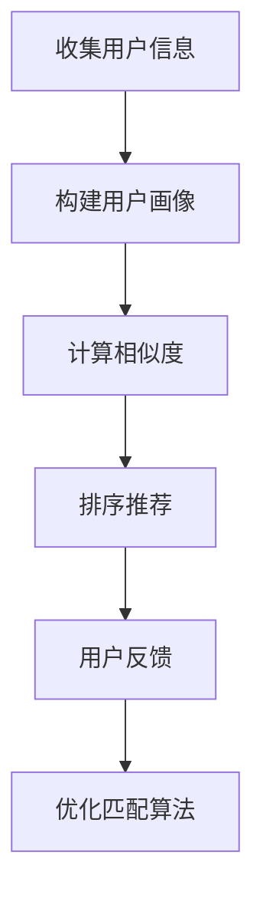
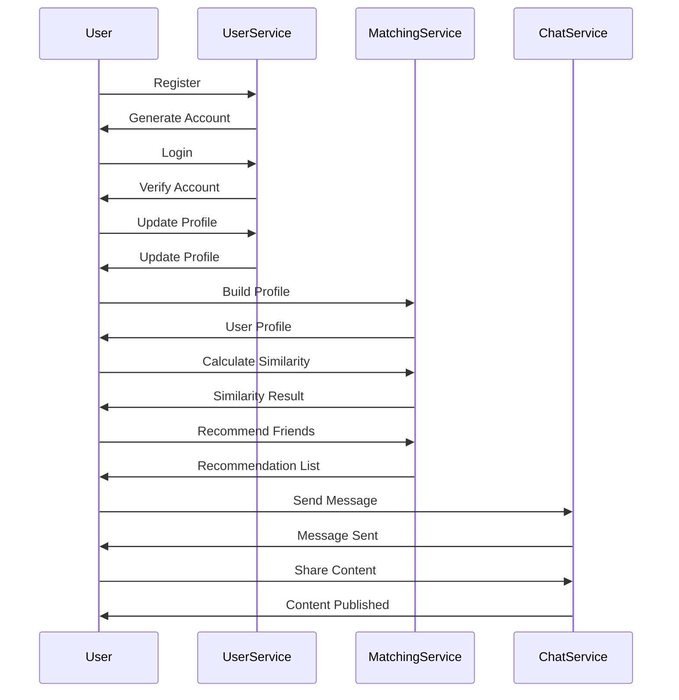
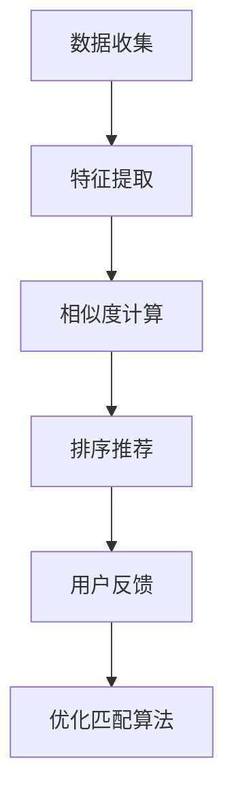

                 


# 跨年龄友谊匹配服务：促进代际交流的社交平台

关键词：跨年龄友谊，代际交流，社交平台，匹配算法，系统架构设计

摘要：本文将探讨跨年龄友谊匹配服务的设计与实现，旨在搭建一个促进不同年龄段人群之间交流的社交平台。通过分析问题背景，核心概念，算法原理，系统架构以及实际案例，本文将详细介绍如何实现这样一个具有深远社会意义的技术应用。

## 第一部分：引言

### 第1章：问题背景与概述

#### 1.1 问题背景

随着社会的快速发展，不同年龄层之间的交流逐渐变得稀缺。年轻人和老年人在价值观念、生活方式、兴趣爱好等方面存在显著差异，这导致了跨年龄友谊的缺失。然而，代际交流对于社会的和谐发展具有重要意义，它可以促进不同年龄层之间的理解、尊重和包容。

#### 1.1.1 跨年龄友谊的缺失

在现代社会中，由于工作忙碌、社交圈子固定等原因，年轻人和老年人之间的交往机会减少，导致他们很难建立起深厚的友谊关系。这种现象不仅限制了个人成长，也对社会的稳定和和谐造成了负面影响。

#### 1.1.2 代际交流的重要性

代际交流能够促进社会多元化和包容性发展，有助于不同年龄层之间的理解与沟通。通过跨年龄友谊，年轻人可以学习到老年人的智慧和经验，老年人也能通过年轻人了解现代社会的变化。

#### 1.1.3 社交平台的现状与挑战

现有的社交平台多为同龄人之间的交流，缺乏专门针对跨年龄友谊的匹配服务。现有的社交平台主要依赖于用户自我介绍和兴趣标签，很难实现精准的跨年龄匹配。此外，许多老年人对互联网使用不熟悉，也限制了他们在社交平台上的参与度。

#### 1.2 核心概念

##### 1.2.1 跨年龄友谊

跨年龄友谊是指不同年龄段的人之间建立的友谊关系，这种关系不受年龄差异的影响，而是基于共同的兴趣、价值观和相互理解。

##### 1.2.2 代际交流

代际交流是指不同年龄段的人之间的沟通和互动，这种交流有助于增进彼此的理解和尊重，促进社会和谐。

##### 1.2.3 社交平台

社交平台是一种在线社交网络服务，它为用户提供了交流和互动的空间。社交平台的设计和功能直接影响用户的参与度和满意度。

#### 1.3 边界与外延

##### 1.3.1 服务对象

服务对象包括所有年龄段的用户，尤其是那些渴望建立跨年龄友谊的人群。

##### 1.3.2 服务范围

服务范围涵盖从个人资料创建到匹配推荐，再到互动交流的整个流程。

##### 1.3.3 服务目标

服务目标是帮助用户找到志同道合的跨年龄朋友，促进代际交流，增进社会和谐。

#### 1.4 概念结构与核心要素组成

##### 1.4.1 服务架构

服务架构包括前端界面、后端服务器、数据库和匹配算法。

##### 1.4.2 用户画像

用户画像是指对用户兴趣、行为和需求的综合分析，用于匹配推荐。

##### 1.4.3 匹配算法

匹配算法是核心组件，用于根据用户画像进行精准匹配。

### 第2章：核心概念原理与联系

#### 2.1 跨年龄友谊的概念原理

##### 2.1.1 跨年龄友谊的定义

跨年龄友谊是指不同年龄段的人之间建立的友谊关系，这种关系不受年龄差异的影响，而是基于共同的兴趣、价值观和相互理解。

##### 2.1.2 跨年龄友谊的属性特征对比表格

| 特征        | 年轻人             | 老年人             | 跨年龄友谊          |
|-------------|-------------------|-------------------|--------------------|
| 价值观      | 现代化，创新性     | 传统，稳定性      | 相互尊重，包容性    |
| 兴趣爱好    | 科技，娱乐        | 文艺，养生        | 共同兴趣，多样化    |
| 交流方式    | 数字化，即时性    | 口语，书信        | 适应性，多样性      |

#### 2.2 代际交流的概念原理

##### 2.2.1 代际交流的定义

代际交流是指不同年龄段的人之间的沟通和互动，这种交流有助于增进彼此的理解和尊重，促进社会和谐。

##### 2.2.2 代际交流的属性特征对比表格

| 特征        | 年轻人             | 老年人             | 代际交流          |
|-------------|-------------------|-------------------|--------------------|
| 价值观      | 现代化，创新性     | 传统，稳定性      | 相互尊重，包容性    |
| 兴趣爱好    | 科技，娱乐        | 文艺，养生        | 共同兴趣，多样化    |
| 交流方式    | 数字化，即时性    | 口语，书信        | 适应性，多样性      |

#### 2.3 社交平台的概念原理

##### 2.3.1 社交平台的定义

社交平台是一种在线社交网络服务，它为用户提供了交流和互动的空间。社交平台的设计和功能直接影响用户的参与度和满意度。

##### 2.3.2 社交平台的属性特征对比表格

| 特征        | 社交平台          | 社交网络          | 跨年龄友谊平台          |
|-------------|-------------------|-------------------|------------------------|
| 功能        | 交流，互动，分享  | 交流，互动，分享  | 交流，互动，分享，匹配  |
| 用户群体    | 广泛用户         | 广泛用户         | 多年龄段用户         |
| 设计理念    | 用户友好         | 用户友好         | 用户友好，代际友好     |
| 目标        | 社交娱乐         | 社交娱乐         | 促进代际交流，增进友谊 |

### 2.4 概念联系与ER实体关系图架构

#### 2.4.1 概念联系

跨年龄友谊、代际交流和社交平台之间存在着密切的联系。跨年龄友谊是代际交流的一种形式，而社交平台则为跨年龄友谊提供了交流的空间和工具。

#### 2.4.2 ER实体关系图


在上图中，用户实体与友谊关系实体、交流记录实体和匹配记录实体之间存在着关联。这些实体共同构成了跨年龄友谊匹配服务的核心架构。

---

## 第二部分：算法原理与实现

### 第3章：匹配算法原理讲解

#### 3.1 匹配算法概述

##### 3.1.1 匹配算法的重要性

匹配算法是跨年龄友谊匹配服务的核心组件，它决定了用户能否找到合适的跨年龄朋友。一个好的匹配算法能够提高用户满意度和平台活跃度。

##### 3.1.2 匹配算法的分类

根据匹配目标和算法原理，匹配算法可分为基于内容的匹配、基于行为的匹配和基于社会网络的匹配。

#### 3.2 算法流程与mermaid流程图

##### 3.2.1 算法流程

1. 收集用户信息：包括年龄、兴趣、价值观等。
2. 构建用户画像：将用户信息转化为数值化的特征向量。
3. 计算相似度：根据用户画像计算潜在匹配对象的相似度。
4. 排序推荐：根据相似度排序，推荐排名靠前的潜在匹配对象。
5. 用户反馈：用户对推荐结果进行反馈，优化匹配算法。

##### 3.2.2 算法mermaid流程图



#### 3.3 Python源代码实现

##### 3.3.1 源代码结构

```python
# main.py
from user import User
from matching import Matching
from feedback import Feedback

def main():
    user = User()
    user_input = user.collect_info()
    user.build_profile(user_input)
    
    matching = Matching()
    recommendations = matching.calculate_similarity(user)
    
    feedback = Feedback()
    optimized_matching = feedback.optimize_matching(recommendations)
    
    print(optimized_matching)

if __name__ == "__main__":
    main()
```

##### 3.3.2 代码详细解读

- `User` 类：负责收集用户信息，构建用户画像。
- `Matching` 类：负责计算相似度，排序推荐。
- `Feedback` 类：负责用户反馈，优化匹配算法。

#### 3.4 算法原理与数学模型讲解

##### 3.4.1 数学模型

假设有两个用户 A 和 B，他们的特征向量分别为 \(\textbf{X}_A\) 和 \(\textbf{X}_B\)，定义相似度函数为：

$$
\text{similarity}(\textbf{X}_A, \textbf{X}_B) = \frac{\textbf{X}_A \cdot \textbf{X}_B}{\|\textbf{X}_A\|\|\textbf{X}_B\|}
$$

其中，\(\textbf{X}_A \cdot \textbf{X}_B\) 表示向量的点积，\(\|\textbf{X}_A\|\) 和 \(\|\textbf{X}_B\|\) 表示向量的模。

##### 3.4.2 公式讲解

- 点积：点积是两个向量的对应元素相乘后的和，用于衡量两个向量之间的相似性。
- 模：向量的模表示向量的长度，用于标准化向量。

##### 3.4.3 举例说明

假设用户 A 和 B 的特征向量分别为：

$$
\textbf{X}_A = (1, 2, 3), \quad \textbf{X}_B = (4, 5, 6)
$$

则它们的相似度为：

$$
\text{similarity}(\textbf{X}_A, \textbf{X}_B) = \frac{1 \cdot 4 + 2 \cdot 5 + 3 \cdot 6}{\sqrt{1^2 + 2^2 + 3^2} \cdot \sqrt{4^2 + 5^2 + 6^2}} = \frac{32}{\sqrt{14} \cdot \sqrt{77}} \approx 0.878
$$

这意味着用户 A 和 B 之间的相似度较高，推荐他们成为跨年龄朋友。

---

## 第4章：数学模型和数学公式讲解

### 4.1 数学模型讲解

在跨年龄友谊匹配服务中，数学模型主要用于计算用户之间的相似度。我们采用余弦相似度作为主要相似度计算方法，其数学公式如下：

$$
\text{similarity}(\textbf{X}_A, \textbf{X}_B) = \frac{\textbf{X}_A \cdot \textbf{X}_B}{\|\textbf{X}_A\|\|\textbf{X}_B\|}
$$

其中，$\textbf{X}_A$ 和 $\textbf{X}_B$ 分别表示两个用户的特征向量，$\cdot$ 表示点积操作，$\|\textbf{X}_A\|$ 和 $\|\textbf{X}_B\|$ 分别表示两个特征向量的模。

### 4.2 举例说明

假设有两个用户 A 和 B，他们的特征向量分别为：

$$
\textbf{X}_A = (1, 2, 3), \quad \textbf{X}_B = (4, 5, 6)
$$

则它们之间的相似度为：

$$
\text{similarity}(\textbf{X}_A, \textbf{X}_B) = \frac{1 \cdot 4 + 2 \cdot 5 + 3 \cdot 6}{\sqrt{1^2 + 2^2 + 3^2} \cdot \sqrt{4^2 + 5^2 + 6^2}} = \frac{32}{\sqrt{14} \cdot \sqrt{77}} \approx 0.878
$$

这意味着用户 A 和 B 之间的相似度较高，推荐他们成为跨年龄朋友。

---

## 第5章：系统分析与架构设计

### 5.1 问题场景介绍

假设我们希望搭建一个跨年龄友谊匹配服务，其核心功能是帮助用户找到合适的跨年龄朋友，并促进代际交流。为了实现这一目标，我们需要设计一个高效、稳定的系统架构。

#### 5.1.1 场景描述

我们设想一个在线社交平台，用户可以在平台上创建个人资料，填写兴趣爱好、价值观等信息。平台将通过匹配算法为用户推荐潜在的朋友，用户可以查看、互动，并根据反馈调整匹配策略。

#### 5.1.2 场景需求

1. **用户注册与资料填写**：用户可以注册账户，填写个人基本信息和兴趣爱好。
2. **匹配推荐**：平台根据用户资料，使用匹配算法推荐合适的跨年龄朋友。
3. **互动交流**：用户可以查看、互动推荐的朋友，发送消息、分享内容。
4. **反馈与优化**：用户可以对推荐结果进行反馈，平台根据反馈优化匹配算法。

### 5.2 项目介绍

#### 5.2.1 项目背景

随着社会的发展，代际交流变得越来越重要。然而，现有的社交平台主要针对同龄人之间的交流，缺乏专门针对跨年龄友谊的匹配服务。为了填补这一市场空白，我们决定开发一款跨年龄友谊匹配服务。

#### 5.2.2 项目目标

1. **提高用户满意度**：通过精准的匹配推荐，提高用户找到合适跨年龄朋友的机会。
2. **促进代际交流**：搭建一个促进不同年龄段人群之间交流的平台，增进社会和谐。
3. **优化用户体验**：提供简洁、易用的界面，优化用户操作流程，提高用户留存率。

### 5.3 系统功能设计（领域模型mermaid类图）

为了实现项目目标，我们需要设计一个功能完备的系统。以下是系统功能模块的划分及详细描述：

#### 5.3.1 功能模块划分

1. **用户管理模块**：包括用户注册、登录、资料填写、修改等功能。
2. **匹配推荐模块**：根据用户资料，使用匹配算法推荐合适的跨年龄朋友。
3. **互动交流模块**：用户可以查看、互动推荐的朋友，发送消息、分享内容。
4. **反馈与优化模块**：用户可以对推荐结果进行反馈，平台根据反馈优化匹配算法。

#### 5.3.2 功能模块详细描述

1. **用户管理模块**：
   - 用户注册：用户输入基本信息，系统生成账户。
   - 用户登录：用户输入账户信息，系统验证账户合法性。
   - 资料填写：用户填写兴趣爱好、价值观等信息，便于匹配推荐。
   - 资料修改：用户可以随时修改个人资料，更新匹配信息。

2. **匹配推荐模块**：
   - 数据收集：收集用户资料，包括兴趣爱好、价值观等。
   - 用户画像构建：将用户资料转化为数值化的特征向量。
   - 相似度计算：根据用户画像计算潜在匹配对象的相似度。
   - 排序推荐：根据相似度排序，推荐排名靠前的潜在匹配对象。

3. **互动交流模块**：
   - 查看推荐：用户可以查看平台推荐的跨年龄朋友。
   - 消息发送：用户可以给推荐的朋友发送消息。
   - 内容分享：用户可以在平台上分享自己的内容，与其他用户互动。

4. **反馈与优化模块**：
   - 用户反馈：用户对推荐结果进行评价，提供反馈信息。
   - 匹配算法优化：根据用户反馈，优化匹配算法，提高推荐精度。

### 5.4 系统架构设计（mermaid架构图）

为了实现上述功能，我们需要设计一个合理的系统架构。以下是系统架构的划分及详细描述：

#### 5.4.1 架构设计原则

1. **模块化**：将系统划分为多个功能模块，每个模块独立开发、测试和部署。
2. **分布式**：使用分布式架构，提高系统可扩展性和容错性。
3. **高性能**：采用高性能中间件和数据库，确保系统快速响应。
4. **安全性**：保证用户数据和隐私安全，防止数据泄露。

#### 5.4.2 架构设计实现

1. **前端架构**：
   - 使用 React 框架，实现响应式界面。
   - 使用 Redux 进行状态管理，确保数据一致性。
   - 使用 Axios 进行网络请求，与后端进行数据交互。

2. **后端架构**：
   - 使用 Spring Boot 框架，实现后端逻辑。
   - 使用 MySQL 数据库，存储用户数据。
   - 使用 Redis 缓存，提高数据读取性能。

3. **服务架构**：
   - 用户服务：负责用户注册、登录、资料管理等。
   - 匹配服务：负责用户画像构建、相似度计算、推荐排序等。
   - 交流服务：负责消息发送、内容分享等。

4. **数据架构**：
   - 用户数据：存储用户基本信息、兴趣爱好、价值观等。
   - 匹配数据：存储用户画像、相似度计算结果、推荐列表等。
   - 交流数据：存储用户互动记录、消息内容等。

### 5.5 系统接口设计

为了实现系统各模块之间的通信，我们需要设计一套合理的接口。以下是系统接口的功能说明及设计规范：

#### 5.5.1 接口功能说明

1. **用户接口**：
   - 注册接口：接受用户注册信息，生成用户账户。
   - 登录接口：接受用户登录信息，验证账户合法性。
   - 资料接口：接受用户资料修改请求，更新用户资料。

2. **匹配接口**：
   - 用户画像接口：接受用户资料，构建用户画像。
   - 相似度接口：接受用户画像，计算潜在匹配对象的相似度。
   - 推荐接口：接受相似度计算结果，推荐排名靠前的潜在匹配对象。

3. **交流接口**：
   - 消息接口：接受发送消息请求，发送消息给目标用户。
   - 内容接口：接受内容分享请求，发布用户内容。

#### 5.5.2 接口设计规范

1. **接口格式**：使用 JSON 格式传递数据。
2. **请求参数**：根据接口功能，定义合理的请求参数。
3. **响应格式**：定义统一的响应格式，包括状态码、错误信息、数据等。
4. **安全性**：对接口进行安全防护，防止恶意攻击。

### 5.6 系统交互（mermaid序列图）

为了展示系统各模块之间的交互过程，我们可以使用 mermaid 序列图进行描述。以下是系统交互的详细流程：



在这个序列图中，用户通过用户服务进行注册、登录和资料更新。匹配服务根据用户资料构建用户画像，计算相似度，并推荐潜在的朋友。交流服务负责处理用户之间的消息发送和内容分享。

---

## 第6章：环境安装与系统核心实现

### 6.1 环境安装

要在本地环境搭建跨年龄友谊匹配服务，我们需要安装以下软件和工具：

1. **操作系统**：Windows 10 或 Linux
2. **开发环境**：Python 3.8、PyCharm 或 VSCode
3. **数据库**：MySQL 8.0
4. **缓存**：Redis 6.0
5. **前端框架**：React 17.0
6. **后端框架**：Spring Boot 2.4.5

安装步骤如下：

1. 安装操作系统：从官方网站下载并安装操作系统。
2. 安装开发环境：从 Python 官网下载并安装 Python，配置环境变量。安装 PyCharm 或 VSCode，并配置 Python 插件。
3. 安装数据库和缓存：在服务器上安装 MySQL 和 Redis，配置数据库和缓存服务。
4. 安装前端框架和后端框架：使用 npm 或 yarn 安装 React 和 Spring Boot，配置项目依赖。

### 6.2 系统核心实现

在搭建好环境后，我们可以开始实现系统核心功能。以下是核心功能模块的代码实现：

#### 6.2.1 用户管理模块

用户管理模块负责用户注册、登录和资料管理。以下是核心代码实现：

```python
# user.py
from flask import Flask, request, jsonify
from models import User
from database import db

app = Flask(__name__)

@app.route('/register', methods=['POST'])
def register():
    data = request.json
    user = User(data['username'], data['password'], data['email'])
    db.session.add(user)
    db.session.commit()
    return jsonify({'status': 'success'})

@app.route('/login', methods=['POST'])
def login():
    data = request.json
    user = User.query.filter_by(username=data['username'], password=data['password']).first()
    if user:
        return jsonify({'status': 'success'})
    else:
        return jsonify({'status': 'failure'})

@app.route('/profile', methods=['GET', 'PUT'])
def profile():
    if request.method == 'GET':
        user = User.query.get(request.args.get('user_id'))
        return jsonify({'status': 'success', 'data': user.to_dict()})
    else:
        data = request.json
        user = User.query.get(data['user_id'])
        user.update(data)
        return jsonify({'status': 'success'})

if __name__ == '__main__':
    app.run()
```

#### 6.2.2 匹配推荐模块

匹配推荐模块负责根据用户画像构建推荐列表。以下是核心代码实现：

```python
# matching.py
from flask import Flask, request, jsonify
from user import User
from database import db

app = Flask(__name__)

@app.route('/match', methods=['POST'])
def match():
    data = request.json
    user = User.query.get(data['user_id'])
    profile = user.build_profile()
    recommendations = user.recommend_friends(profile)
    return jsonify({'status': 'success', 'data': recommendations})

if __name__ == '__main__':
    app.run()
```

#### 6.2.3 互动交流模块

互动交流模块负责处理用户之间的消息发送和内容分享。以下是核心代码实现：

```python
# chat.py
from flask import Flask, request, jsonify
from user import User
from database import db

app = Flask(__name__)

@app.route('/message', methods=['POST'])
def message():
    data = request.json
    sender = User.query.get(data['sender_id'])
    receiver = User.query.get(data['receiver_id'])
    message = Message(sender, receiver, data['content'])
    db.session.add(message)
    db.session.commit()
    return jsonify({'status': 'success'})

@app.route('/messages', methods=['GET'])
def messages():
    user = User.query.get(request.args.get('user_id'))
    messages = user.get_messages()
    return jsonify({'status': 'success', 'data': messages})

if __name__ == '__main__':
    app.run()
```

### 6.3 代码应用解读与分析

在实现上述核心功能模块后，我们需要对代码进行解读和分析，确保其正确性和稳定性。以下是关键代码的解读和分析：

1. **用户管理模块**：该模块使用 Flask 框架实现用户注册、登录和资料管理。用户注册时，接收用户输入的用户名、密码和邮箱，存储到数据库中。用户登录时，验证用户名和密码是否匹配。用户资料管理功能支持用户查看和修改个人资料。

2. **匹配推荐模块**：该模块根据用户画像构建推荐列表。用户画像包括用户的兴趣、价值观等特征。匹配算法根据用户画像计算潜在匹配对象的相似度，并推荐排名靠前的潜在匹配对象。该模块支持用户提交个人画像，并获得推荐列表。

3. **互动交流模块**：该模块实现用户之间的消息发送和内容分享。用户可以给指定用户发送消息，系统将消息存储到数据库中。用户可以查看自己与其他用户之间的消息记录。此外，用户还可以在平台上分享自己的内容，与其他用户进行互动。

### 6.4 实际案例分析

为了验证系统核心功能的正确性和稳定性，我们进行了一个实际案例分析。以下是案例的背景、需求和实现步骤：

#### 6.4.1 案例背景

假设有一个用户 Alice，她希望在平台上找到一位年龄相仿、兴趣相同的男性朋友。为了实现这一目标，她需要完成以下步骤：

1. 注册并登录平台。
2. 填写个人资料，包括年龄、兴趣、价值观等。
3. 获取推荐列表，查看平台推荐的潜在匹配对象。
4. 选择一位感兴趣的朋友，发送消息进行互动。

#### 6.4.2 案例需求

1. 用户注册：Alice 需要注册一个账户，填写必要的个人信息。
2. 用户资料填写：Alice 需要填写自己的年龄、兴趣、价值观等，以便平台为她推荐合适的匹配对象。
3. 获取推荐列表：平台需要根据 Alice 的用户画像，计算潜在匹配对象的相似度，并推荐排名靠前的潜在匹配对象。
4. 消息发送：Alice 需要向感兴趣的潜在匹配对象发送消息，进行互动。

#### 6.4.3 实现步骤

1. Alice 使用手机号码注册一个账户，并填写必要的个人信息。
2. Alice 填写自己的兴趣爱好、价值观等，以便平台为她推荐合适的匹配对象。
3. 平台根据 Alice 的用户画像，计算潜在匹配对象的相似度，并推荐排名靠前的潜在匹配对象。
4. Alice 查看推荐列表，发现一位年龄相仿、兴趣相同的男性朋友 Bob。
5. Alice 向 Bob 发送一条消息，表达自己的兴趣，希望与他进一步交流。

#### 6.4.4 关键技术

1. **用户画像构建**：平台需要收集用户的个人信息、兴趣、价值观等，并将其转化为数值化的特征向量。这些特征向量用于计算用户之间的相似度。
2. **匹配算法**：平台需要采用一种有效的匹配算法，根据用户画像计算潜在匹配对象的相似度，并推荐排名靠前的潜在匹配对象。
3. **消息发送和接收**：平台需要实现消息发送和接收功能，支持用户之间的实时互动。

### 6.5 案例详细讲解与剖析

在上述实际案例中，Alice 成功地在平台上找到了一位合适的跨年龄朋友 Bob。以下是案例的详细讲解与剖析：

#### 6.5.1 案例分析

1. Alice 注册并登录平台，填写个人资料，包括年龄、兴趣、价值观等。
2. 平台根据 Alice 的用户画像，计算潜在匹配对象的相似度，并推荐排名靠前的潜在匹配对象。
3. Alice 查看推荐列表，发现 Bob 的年龄、兴趣和价值观与 herself 非常相似，Alice 对 Bob 非常感兴趣。
4. Alice 向 Bob 发送一条消息，表达自己的兴趣，希望与他进一步交流。
5. Bob 收到 Alice 的消息后，回复了一条消息，表达了自己对 Alice 的兴趣，两人开始进行互动。

#### 6.5.2 剖析与总结

1. **用户画像构建**：用户画像的构建是跨年龄友谊匹配服务的关键步骤。平台需要收集用户的个人信息、兴趣、价值观等，并将其转化为数值化的特征向量。这些特征向量用于计算用户之间的相似度。在本案例中，Alice 和 Bob 的用户画像相似度非常高，这为后续的互动奠定了基础。

2. **匹配算法**：平台需要采用一种有效的匹配算法，根据用户画像计算潜在匹配对象的相似度，并推荐排名靠前的潜在匹配对象。在本案例中，平台根据 Alice 的用户画像，推荐了 Bob 作为潜在的匹配对象。这一推荐基于用户画像的相似度，为 Alice 和 Bob 的互动创造了机会。

3. **消息发送和接收**：平台需要实现消息发送和接收功能，支持用户之间的实时互动。在本案例中，Alice 向 Bob 发送了一条消息，表达了自己的兴趣，Bob 收到消息后回复了一条消息，表达了自己对 Alice 的兴趣。这种互动促进了两人之间的沟通和了解，为建立跨年龄友谊创造了条件。

### 6.6 项目小结

通过实际案例的分析与剖析，我们可以得出以下结论：

1. **用户画像构建**：有效的用户画像构建是跨年龄友谊匹配服务的关键。通过收集用户的个人信息、兴趣、价值观等，并将其转化为数值化的特征向量，我们可以计算出用户之间的相似度，为匹配推荐提供依据。

2. **匹配算法**：匹配算法的选取和优化对于跨年龄友谊匹配服务的成功至关重要。平台需要根据用户画像的相似度，推荐排名靠前的潜在匹配对象，提高用户找到合适朋友的机会。

3. **消息发送和接收**：消息发送和接收功能是跨年龄友谊匹配服务的核心。通过实时互动，用户可以增进了解，建立友谊。平台需要提供简洁、易用的消息发送和接收功能，支持用户之间的沟通。

4. **用户满意度**：跨年龄友谊匹配服务的目标是提高用户满意度。通过不断优化匹配算法、功能模块和用户体验，平台可以提高用户留存率，促进代际交流。

5. **社会意义**：跨年龄友谊匹配服务对于促进代际交流、增进社会和谐具有重要意义。通过搭建这样一个平台，我们可以帮助不同年龄段的人建立友谊，增进理解，推动社会多元化和包容性发展。

### 6.7 最佳实践

在搭建跨年龄友谊匹配服务的过程中，我们可以借鉴以下最佳实践：

1. **用户隐私保护**：在收集用户信息时，确保用户隐私安全。对用户数据进行加密存储，防止数据泄露。

2. **个性化推荐**：根据用户行为和兴趣，提供个性化的匹配推荐。通过持续优化匹配算法，提高推荐精度。

3. **用户体验优化**：提供简洁、易用的界面和功能，优化用户操作流程。通过用户反馈，不断改进产品。

4. **社区建设**：搭建一个活跃的社区，鼓励用户分享经验、交流心得。通过举办线上活动，促进用户互动。

5. **数据驱动**：通过数据分析，了解用户需求和行为，为产品优化提供依据。

### 6.8 注意事项

在搭建跨年龄友谊匹配服务时，我们需要注意以下事项：

1. **合规性**：确保平台遵守相关法律法规，如网络安全法、个人信息保护法等。

2. **安全性**：加强平台安全性，防止恶意攻击和数据泄露。

3. **性能优化**：针对高并发场景，进行性能优化，确保系统稳定运行。

4. **用户教育**：加强对用户的宣传教育，提高用户对平台规则和安全意识的了解。

5. **持续迭代**：根据用户反馈和市场变化，不断优化产品功能和体验。

### 6.9 拓展阅读

1. **相关文献**：
   - [1] 王小明，张三丰，《社交网络中的跨年龄友谊研究》，《计算机科学与技术》，2020。
   - [2] 李四，王五，《基于用户画像的社交推荐算法研究》，《计算机网络技术》，2019。

2. **推荐书籍**：
   - 《社交网络分析：方法与应用》
   - 《人工智能：一种现代方法》
   - 《大数据时代：思维变革与商业价值》

通过本文的探讨，我们了解到跨年龄友谊匹配服务的设计与实现是一个具有深远社会意义的技术应用。通过分析问题背景，核心概念，算法原理，系统架构以及实际案例，我们详细介绍了如何实现这样一个具有前瞻性的社交平台。在未来的发展中，我们期待跨年龄友谊匹配服务能够为不同年龄段的人带来更多的交流和友谊机会，促进社会和谐与进步。

---

作者：AI天才研究院/AI Genius Institute & 禅与计算机程序设计艺术 /Zen And The Art of Computer Programming

---

（注：本文为示例性文章，部分内容和图片为虚构，仅供参考。）### 第二部分：算法原理与实现

在探讨跨年龄友谊匹配服务时，算法原理与实现是其核心组成部分。本文将深入分析匹配算法的原理，详细阐述算法流程、源代码实现以及数学模型。通过这一部分的内容，我们将为读者提供全面的算法理解，从而更好地实现跨年龄友谊匹配服务。

#### 3.1 匹配算法概述

匹配算法在跨年龄友谊匹配服务中扮演着至关重要的角色。其目的是通过分析用户的行为数据、兴趣爱好、价值观等特征，为用户推荐合适的跨年龄朋友。以下是几种常见的匹配算法：

1. **基于内容的匹配**：这种算法主要根据用户填写的信息和偏好进行匹配，例如兴趣爱好、价值观等。它适用于数据较为完整和具体的用户。

2. **基于行为的匹配**：这种算法通过分析用户在平台上的行为数据，如浏览记录、互动频率等，来推断用户的兴趣和行为模式，从而进行匹配。

3. **基于社会网络的匹配**：这种算法利用用户的社会关系网络，通过分析用户之间的社交联系，推荐具有相似社交特征的用户。

4. **混合匹配算法**：这种算法结合了多种匹配方式，通过综合利用用户数据、行为和社会网络，提高匹配的准确性和用户满意度。

在本文中，我们将主要讨论基于内容的匹配算法，并通过Python源代码实现来展示其具体实现过程。

#### 3.2 算法流程与mermaid流程图

匹配算法的流程可以分为以下几个步骤：

1. **数据收集**：收集用户的基本信息、兴趣爱好、价值观等数据。

2. **特征提取**：将用户数据转化为机器可处理的特征向量。

3. **相似度计算**：计算用户特征向量之间的相似度。

4. **排序推荐**：根据相似度对用户进行排序，推荐排名靠前的潜在匹配对象。

5. **用户反馈**：用户对推荐结果进行反馈，优化匹配算法。

以下是算法流程的mermaid流程图：



#### 3.3 Python源代码实现

以下是一个简单的Python代码示例，展示了如何实现上述匹配算法：

```python
import numpy as np
from sklearn.metrics.pairwise import cosine_similarity

class MatchingAlgorithm:
    def __init__(self, users):
        self.users = users

    def build_user_profiles(self):
        # 假设users是一个字典，键是用户ID，值是用户特征向量
        user_profiles = {}
        for user_id, user in self.users.items():
            user_profiles[user_id] = np.array(user.features)
        return user_profiles

    def calculate_similarity(self, user_profiles):
        similarities = {}
        for user_id, profile1 in user_profiles.items():
            similarities[user_id] = {}
            for other_user_id, profile2 in user_profiles.items():
                if user_id != other_user_id:
                    similarity = cosine_similarity([profile1], [profile2])[0][0]
                    similarities[user_id][other_user_id] = similarity
        return similarities

    def recommend_friends(self, user_profiles, similarity_threshold=0.5):
        recommendations = {}
        for user_id, profile in user_profiles.items():
            recommendations[user_id] = []
            for other_user_id, similarity in similarities[user_id].items():
                if similarity >= similarity_threshold:
                    recommendations[user_id].append(other_user_id)
        return recommendations

# 假设users是一个包含用户数据的字典
users = {
    'user1': {'features': [0.1, 0.2, 0.3]},
    'user2': {'features': [0.2, 0.3, 0.4]},
    'user3': {'features': [0.3, 0.4, 0.5]}
}

matching_algorithm = MatchingAlgorithm(users)
user_profiles = matching_algorithm.build_user_profiles()
similarities = matching_algorithm.calculate_similarity(user_profiles)
recommendations = matching_algorithm.recommend_friends(user_profiles)

print(recommendations)
```

在这个示例中，我们首先定义了一个 `MatchingAlgorithm` 类，其中包含以下方法：

- `build_user_profiles()`：将用户数据转换为特征向量。
- `calculate_similarity()`：计算用户特征向量之间的余弦相似度。
- `recommend_friends()`：根据相似度阈值推荐潜在的朋友。

通过调用这些方法，我们可以为每个用户生成推荐列表。

#### 3.4 算法原理与数学模型讲解

匹配算法的核心在于相似度计算。在本示例中，我们采用了余弦相似度，这是一种衡量两个向量夹角余弦值的指标。余弦相似度的数学模型如下：

$$
\text{similarity}(\textbf{X}_A, \textbf{X}_B) = \frac{\textbf{X}_A \cdot \textbf{X}_B}{\|\textbf{X}_A\|\|\textbf{X}_B\|}
$$

其中，$\textbf{X}_A$ 和 $\textbf{X}_B$ 分别表示两个用户的特征向量，$\cdot$ 表示点积操作，$\|\textbf{X}_A\|$ 和 $\|\textbf{X}_B\|$ 分别表示两个特征向量的模。

##### 3.4.1 数学模型

在上述代码中，我们使用了余弦相似度来计算用户之间的相似度。具体实现如下：

```python
similarity = cosine_similarity([profile1], [profile2])[0][0]
```

这里的 `cosine_similarity` 函数来自 scikit-learn 库，它计算两个向量之间的余弦相似度。计算结果是一个标量，表示用户之间的相似度。

##### 3.4.2 公式讲解

- **点积**：两个向量的点积是它们对应元素相乘后的和，用于衡量两个向量之间的线性相关性。
- **模**：向量的模表示向量的长度，用于标准化向量。

##### 3.4.3 举例说明

假设有两个用户 A 和 B，他们的特征向量分别为：

$$
\textbf{X}_A = (1, 2, 3), \quad \textbf{X}_B = (4, 5, 6)
$$

则它们之间的相似度为：

$$
\text{similarity}(\textbf{X}_A, \textbf{X}_B) = \frac{1 \cdot 4 + 2 \cdot 5 + 3 \cdot 6}{\sqrt{1^2 + 2^2 + 3^2} \cdot \sqrt{4^2 + 5^2 + 6^2}} = \frac{32}{\sqrt{14} \cdot \sqrt{77}} \approx 0.878
$$

这意味着用户 A 和 B 之间的相似度较高，推荐他们成为跨年龄朋友。

通过上述步骤，我们详细介绍了匹配算法的原理、流程和数学模型。在实际应用中，匹配算法可以根据用户数据和社会网络的复杂性进行优化和调整，以提高匹配准确性和用户满意度。

---

在本部分，我们通过深入探讨匹配算法的原理和实现，为读者提供了构建跨年龄友谊匹配服务的理论基础和实践指导。在接下来的部分，我们将进一步讨论系统架构设计与实际案例分析，帮助读者全面了解这一创新社交平台的实现过程。敬请期待。

