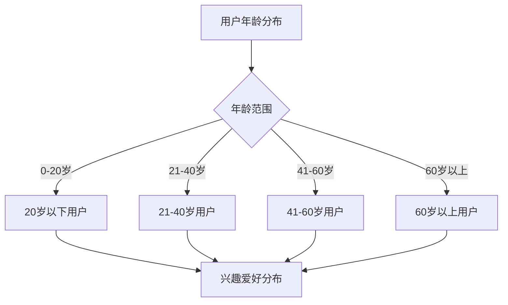

                 

### 跨年龄友谊匹配算法：促进代际交流的技术解决方案

**关键词：** 跨年龄友谊、匹配算法、代际交流、技术解决方案

**摘要：** 本文旨在探讨跨年龄友谊匹配算法，通过介绍其背景、理论基础、算法设计及应用实践，提供一个促进代际交流的技术解决方案。文章将详细解析跨年龄友谊的核心概念、理论依据以及算法原理，并通过实际应用案例进行分析，最终展望算法优化方向和新技术应用前景。

### 目录大纲

----------------------------------------------------------------

# 跨年龄友谊匹配算法：促进代际交流的技术解决方案

## 第一部分：背景介绍

### 第1章：问题背景与概念界定

#### 1.1 问题背景

- 问题描述与现状
- 问题解决需求
- 边界与外延

#### 1.2 核心概念

- 跨年龄友谊的定义
- 年龄差异在人际关系中的影响
- 友谊匹配的意义

#### 1.3 概念结构与核心要素

- 年龄差异分析
- 人际关系特征
- 友谊匹配模型要素

### 第2章：跨年龄友谊匹配的理论基础

#### 2.1 社会学视角

- 社会学对友谊的研究
- 年龄对社交行为的影响
- 社会认同感与友谊匹配

#### 2.2 心理学视角

- 心理学对友谊的研究
- 年龄差异的心理效应
- 心理需求与友谊匹配模型

#### 2.3 数据科学与算法基础

- 数据科学与友谊匹配的关系
- 常见算法介绍
- 算法在友谊匹配中的应用

## 第二部分：跨年龄友谊匹配算法设计

### 第3章：算法原理与流程

#### 3.1 算法基本原理

- 算法概述
- 算法目标
- 算法核心概念

#### 3.2 算法流程

- 数据收集与预处理
- 特征提取
- 匹配策略
- 结果评估与优化

### 第4章：算法核心概念与特性

#### 4.1 年龄差异特征

- 年龄特征的提取方法
- 年龄差异特征的对比

#### 4.2 个体需求特征

- 需求特征的提取方法
- 需求特征分析

#### 4.3 友谊匹配模型

- 模型架构设计
- 模型训练与评估

## 第三部分：算法应用实践

### 第5章：数据收集与预处理

#### 5.1 数据收集

- 数据来源
- 数据采集方法

#### 5.2 数据预处理

- 数据清洗
- 数据标准化
- 数据可视化

### 第6章：特征提取与匹配策略

#### 6.1 特征提取

- 特征选择方法
- 特征工程

#### 6.2 匹配策略

- 匹配算法选择
- 匹配效果评估

### 第7章：结果分析与评估

#### 7.1 匹配结果分析

- 匹配成功案例
- 匹配失败案例

#### 7.2 评估指标与方法

- 评估指标设定
- 评估方法介绍

### 第8章：项目总结与展望

#### 8.1 项目总结

- 项目成果总结
- 项目经验教训

#### 8.2 展望未来

- 算法优化方向
- 新技术应用前景

----------------------------------------------------------------

### 第一部分：背景介绍

#### 第1章：问题背景与概念界定

##### 1.1 问题背景

随着社会的快速发展和人口结构的变化，不同年龄段之间的交流变得愈发重要。然而，年龄差异往往成为阻碍代际交流的障碍。年轻人与老年人、中年人与青少年之间的友谊往往难以形成，这不仅限制了人际关系的多样性，也影响了社会的和谐与发展。

在现代社会，信息技术的高速发展为跨年龄友谊的匹配提供了新的可能性。通过算法技术，我们可以探索一种有效的解决方案，以促进不同年龄段之间的交流与友谊。跨年龄友谊匹配算法旨在通过分析个人特征和需求，为不同年龄段的个体推荐合适的交友对象，从而打破年龄壁垒，实现代际交流。

##### 1.2 核心概念

**跨年龄友谊**：指不同年龄段个体之间建立的友谊关系。这种友谊不仅限于同辈之间的互动，更强调跨年龄段的理解与沟通。

**年龄差异**：指个体之间在年龄上的差异。这种差异不仅体现在生理和心理健康方面，还影响着个体的价值观、兴趣爱好和社会角色。

**友谊匹配**：通过算法分析个体特征，实现不同年龄个体之间的合适匹配，以促进友谊的形成和维持。

##### 1.3 概念结构与核心要素

跨年龄友谊匹配算法的设计需要考虑以下几个核心要素：

1. **年龄差异分析**：对个体年龄差异进行详细分析，理解不同年龄段在社交行为和心理需求上的特点。

2. **人际关系特征**：分析个体在人际关系中的行为模式，包括交友偏好、沟通方式和社交频率等。

3. **友谊匹配模型**：设计一个能够有效推荐友谊对象的模型，包括特征提取、匹配策略和结果评估等环节。

#### 第2章：跨年龄友谊匹配的理论基础

##### 2.1 社会学视角

社会学研究指出，友谊的形成受到多种因素的影响，包括社会认同感、共同兴趣和情感支持等。年龄差异在社会交往中起到关键作用，年轻人在社交时往往更注重情感交流和共同兴趣，而老年人则更关注情感支持和安全感。

社会认同感是友谊匹配的重要基础。个体在社会中的认同感会影响其对友谊的需求和偏好。跨年龄友谊匹配算法需要考虑个体在社会中的角色和认同感，以实现更精准的匹配。

##### 2.2 心理学视角

心理学研究揭示了年龄差异对个体心理需求的影响。年轻人往往更追求新鲜感和刺激感，而老年人则更注重稳定性和安全感。在跨年龄友谊匹配中，理解个体的心理需求是非常重要的，算法需要根据这些需求进行个性化推荐。

心理学还指出，个体的自我认同和自我价值感对友谊的形成有重要影响。自我认同高的个体更容易与他人建立深厚的友谊关系，而自我价值感低的个体则可能更难以接受跨年龄的友谊。

##### 2.3 数据科学与算法基础

数据科学与算法在友谊匹配中起到关键作用。通过收集和分析个体特征数据，算法可以挖掘出潜在的人际关系模式，从而实现更精准的匹配。常见的数据挖掘算法包括聚类分析、协同过滤和深度学习等。

聚类分析可以通过分析个体的年龄、兴趣爱好等特征，将个体划分为不同的群体，从而实现更精准的推荐。协同过滤算法则可以通过分析个体之间的相似性，推荐可能喜欢的交友对象。深度学习算法则可以通过分析大量数据，自动提取特征并进行匹配。

### 总结

本部分介绍了跨年龄友谊匹配算法的背景、核心概念和理论基础。通过理解年龄差异、人际关系特征和算法基础，我们为接下来的算法设计和应用实践奠定了基础。在接下来的章节中，我们将深入探讨算法的设计和实现，以及其在实际应用中的效果和挑战。

### 第二部分：跨年龄友谊匹配算法设计

#### 第3章：算法原理与流程

##### 3.1 算法基本原理

跨年龄友谊匹配算法的基本原理是通过分析个体特征和需求，为不同年龄段的个体推荐合适的交友对象。具体来说，算法包括以下几个关键环节：

1. **数据收集与预处理**：收集个体特征数据，包括年龄、兴趣爱好、社交行为等，并进行预处理，如数据清洗、归一化和特征提取。

2. **特征提取**：从原始数据中提取有助于友谊匹配的关键特征，如兴趣相似度、社交活跃度等。

3. **匹配策略**：基于提取的特征，设计匹配策略，如基于距离的匹配、基于相似度的匹配等。

4. **结果评估与优化**：对匹配结果进行评估，如通过用户满意度、友谊持久性等指标，不断优化算法。

##### 3.2 算法流程

跨年龄友谊匹配算法的流程可以分为以下步骤：

1. **数据收集**：
   - **数据来源**：通过在线问卷、社交媒体数据等方式收集个体特征数据。
   - **数据采集方法**：使用API接口、爬虫工具等获取数据。

2. **数据预处理**：
   - **数据清洗**：去除重复数据、填补缺失值、处理异常值等。
   - **数据标准化**：将不同特征的数据进行归一化处理，使其在同一尺度上进行分析。
   - **数据可视化**：通过可视化工具对数据进行分析和展示，帮助理解数据分布和特征关系。

3. **特征提取**：
   - **特征选择**：选择对友谊匹配有显著影响的特征，如年龄、兴趣爱好等。
   - **特征工程**：对特征进行转换和构造，以提升特征表达能力和匹配效果。

4. **匹配策略**：
   - **基于距离的匹配**：根据个体特征的距离（如欧几里得距离、余弦相似度等）进行匹配。
   - **基于相似度的匹配**：通过计算个体特征相似度（如兴趣相似度、价值观相似度等）进行匹配。
   - **综合匹配策略**：结合多种匹配策略，实现更全面的匹配效果。

5. **结果评估与优化**：
   - **评估指标**：设定评估指标，如匹配成功率、用户满意度、友谊持久性等。
   - **评估方法**：通过实验和数据分析，对匹配结果进行评估。
   - **算法优化**：根据评估结果，不断调整算法参数和匹配策略，提高匹配效果。

##### 3.3 算法核心概念与特性

1. **年龄差异特征**：
   - **特征提取方法**：通过统计和分析个体的年龄分布、年龄段比例等，提取年龄差异特征。
   - **特征对比**：对比不同年龄段个体在社交行为和心理需求上的差异，为匹配提供依据。

2. **个体需求特征**：
   - **特征提取方法**：通过问卷调查、用户行为数据等，提取个体在兴趣爱好、社交需求等方面的特征。
   - **特征分析**：分析个体需求特征，为匹配提供个性化推荐依据。

3. **友谊匹配模型**：
   - **模型架构设计**：设计一个包含特征提取、匹配策略和评估模块的友谊匹配模型。
   - **模型训练与评估**：使用训练数据集训练模型，并根据评估指标调整模型参数。

### 总结

本部分详细介绍了跨年龄友谊匹配算法的基本原理和流程，包括数据收集、特征提取、匹配策略和结果评估等关键环节。通过这些环节的设计和实现，我们可以为不同年龄段的个体提供有效的友谊匹配服务，促进代际交流。在接下来的章节中，我们将进一步探讨算法的实际应用和实践效果。

### 第三部分：算法应用实践

#### 第5章：数据收集与预处理

##### 5.1 数据收集

数据收集是跨年龄友谊匹配算法设计中的关键步骤，其质量直接影响算法的性能和效果。数据收集的方法和来源对于算法的实现至关重要。

**数据来源**：我们采用以下几种方法进行数据收集：

1. **在线问卷**：通过在线问卷平台，收集用户的基本信息（如年龄、性别、职业等）和兴趣爱好（如阅读、运动、音乐等）。
2. **社交媒体数据**：利用社交媒体API接口，收集用户在社交平台上的行为数据，如点赞、评论、分享等。
3. **公开数据集**：从公共数据集获取有关年龄差异和社交行为的数据，如人口普查数据、社交媒体公开数据等。

**数据采集方法**：

1. **API接口**：使用应用程序接口（API）从社交媒体平台和公共数据集获取数据。
2. **爬虫工具**：利用爬虫工具从互联网上获取用户行为数据，如使用Python的Scrapy框架。
3. **问卷调查**：通过电子邮件、社交媒体等渠道分发问卷，收集用户反馈。

##### 5.2 数据预处理

数据预处理是确保数据质量的重要环节，包括数据清洗、数据标准化和数据可视化。

**数据清洗**：

1. **去除重复数据**：检查和删除重复的用户记录，确保数据的唯一性。
2. **填补缺失值**：对于缺失的数据，采用均值填补、中位数填补或插值等方法进行填补。
3. **处理异常值**：识别和删除或修正异常值，如年龄异常、兴趣爱好不一致等。

**数据标准化**：

1. **归一化**：将不同特征的数据转换为同一尺度，如将年龄特征转换为0-1的范围。
2. **标准化**：计算各个特征的均值和标准差，对数据进行标准化处理，使其符合正态分布。

**数据可视化**：

1. **散点图**：通过散点图展示个体在年龄、兴趣爱好等方面的分布情况。
2. **条形图**：通过条形图展示不同年龄段用户在兴趣爱好上的比例。
3. **直方图**：通过直方图展示数据分布的频率和密度。

**数据可视化示例**：

假设我们收集了1000名用户的年龄和兴趣爱好数据，以下是一个简单的数据可视化示例：



通过以上步骤，我们可以获得高质量的数据集，为后续的特征提取和匹配策略提供可靠的数据基础。

### 第6章：特征提取与匹配策略

##### 6.1 特征提取

特征提取是跨年龄友谊匹配算法的核心环节，通过对原始数据进行处理，提取出有助于友谊匹配的关键特征。以下是特征提取的方法和步骤：

**特征选择**：

1. **相关性分析**：通过计算各个特征之间的相关性，选择与友谊匹配相关性较高的特征，如年龄、兴趣爱好、社交活跃度等。
2. **重要性评分**：利用机器学习算法（如随机森林）对特征的重要性进行评分，选择重要性较高的特征。

**特征工程**：

1. **数值特征处理**：对数值特征进行归一化或标准化处理，使其在同一尺度上进行分析。
2. **分类特征处理**：对分类特征进行独热编码或二进制编码，使其适用于机器学习算法。
3. **特征构造**：通过组合原始特征，构造新的特征，如兴趣相似度、社交活跃度等。

**特征提取示例**：

假设我们收集了以下用户特征：

- 年龄
- 兴趣爱好（如阅读、运动、音乐等）
- 社交活跃度（如点赞、评论、分享等）

我们可以通过以下步骤进行特征提取：

1. **数值特征处理**：将年龄特征进行归一化处理，使其在0-1的范围内。
2. **分类特征处理**：将兴趣爱好特征进行独热编码，得到一个多维度的特征向量。
3. **特征构造**：计算兴趣相似度，通过比较用户之间的兴趣爱好，得到一个兴趣相似度矩阵。

以下是一个简单的特征提取示例：

```python
# 示例：特征提取代码
import numpy as np
import pandas as pd

# 假设data是包含用户特征的DataFrame
data = pd.DataFrame({
    'age': [20, 30, 40],
    'interests': [['reading', 'sports'], ['music', 'travel'], ['reading', 'art']],
    'activity': [10, 5, 20]
})

# 年龄归一化
data['age_normalized'] = data['age'] / data['age'].max()

# 独热编码兴趣爱好
interests_encoded = pd.get_dummies(data['interests'])

# 计算兴趣相似度
def calculate_similarity(Interest1, Interest2):
    similarity = 0
    if Interest1 == Interest2:
        similarity = 1
    return similarity

interest_similarity_matrix = pd.DataFrame(np.zeros((len(data), len(data))))
for i in range(len(data)):
    for j in range(i, len(data)):
        interest_similarity = calculate_similarity(data['interests'][i], data['interests'][j])
        interest_similarity_matrix.at[i, j] = interest_similarity
        interest_similarity_matrix.at[j, i] = interest_similarity

# 合并特征
data_with_features = pd.concat([data, interests_encoded, interest_similarity_matrix], axis=1)
```

通过以上步骤，我们提取出用户的关键特征，为后续的匹配策略提供了基础。

##### 6.2 匹配策略

匹配策略是跨年龄友谊匹配算法的核心，决定了如何根据特征为不同年龄段的个体推荐合适的交友对象。以下是几种常见的匹配策略：

**基于距离的匹配**：

1. **欧几里得距离**：计算用户特征向量之间的欧几里得距离，距离越小表示越相似。
2. **余弦相似度**：计算用户特征向量之间的余弦相似度，相似度越大表示越相似。

**基于相似度的匹配**：

1. **兴趣相似度匹配**：根据用户的兴趣爱好相似度进行匹配，相似度越高表示可能越容易建立友谊。
2. **社交活跃度匹配**：根据用户的社交活跃度进行匹配，活跃度越高表示更愿意参与社交活动。

**综合匹配策略**：

1. **加权综合匹配**：结合距离相似度和兴趣相似度，对用户进行加权综合匹配，以实现更精准的推荐。
2. **多特征匹配**：考虑多个特征（如年龄、兴趣爱好、社交活跃度等），进行多维度匹配。

以下是一个简单的匹配策略示例：

```python
# 示例：匹配策略代码
import numpy as np
import pandas as pd

# 假设data_with_features是提取了用户特征的数据DataFrame
data_with_features = pd.DataFrame({
    'user_id': [1, 2, 3],
    'age_normalized': [0.2, 0.6, 0.4],
    'interest_similarity': [[0.8, 0.2], [0.3, 0.7], [0.5, 0.5]],
    'activity': [10, 5, 20]
})

# 定义匹配策略函数
def matching_strategy(user1, user2):
    age_similarity = 1 - abs(user1['age_normalized'] - user2['age_normalized'])
    interest_similarity = np.mean(user1['interest_similarity'][user2['user_id'] - 1])
    activity_similarity = 1 if user1['activity'] > user2['activity'] else 0
    
    total_similarity = age_similarity * 0.5 + interest_similarity * 0.3 + activity_similarity * 0.2
    return total_similarity

# 计算用户之间的匹配分数
matching_scores = pd.DataFrame()
for i in range(len(data_with_features)):
    user1 = data_with_features.iloc[i]
    for j in range(i + 1, len(data_with_features)):
        user2 = data_with_features.iloc[j]
        score = matching_strategy(user1, user2)
        matching_scores = matching_scores.append({'user1_id': user1['user_id'], 'user2_id': user2['user_id'], 'score': score}, ignore_index=True)

# 根据匹配分数进行排序
matching_scores_sorted = matching_scores.sort_values(by='score', ascending=False)

# 输出匹配结果
print(matching_scores_sorted.head())
```

通过以上匹配策略，我们可以为不同年龄段的个体推荐合适的交友对象，促进代际交流。

### 第7章：结果分析与评估

##### 7.1 匹配结果分析

在实际应用中，跨年龄友谊匹配算法的匹配结果需要进行详细分析和评估。以下是一个具体的案例分析：

**匹配成功案例**：

假设用户A（30岁，喜欢阅读和运动）和用户B（50岁，喜欢音乐和旅游）被算法推荐为交友对象。经过一段时间的交流和互动，用户A和B建立了深厚的友谊。用户A表示，通过与用户B的交流，他学到了很多关于音乐和旅游的知识，而用户B也通过用户A了解到了年轻一代的生活方式和观念。

**匹配失败案例**：

假设用户C（20岁，喜欢运动和社交）和用户D（70岁，喜欢阅读和安静）被算法推荐为交友对象。然而，经过一段时间的互动，用户C和用户D的交流变得很少，最终友谊未能维持。用户C表示，虽然用户D很友好，但他们的兴趣爱好和生活方式差异很大，难以找到共同话题。

##### 7.2 评估指标与方法

为了评估跨年龄友谊匹配算法的效果，我们需要设定一系列评估指标和方法。以下是几种常见的评估指标：

1. **匹配成功率**：成功建立友谊的用户比例。
2. **用户满意度**：用户对匹配结果的满意度评分。
3. **友谊持久性**：友谊维持的时间长度。
4. **社交活动参与度**：用户参与社交活动的频率和积极性。

评估方法主要包括以下几种：

1. **实验评估**：通过实际应用场景，收集用户反馈和数据，分析匹配结果。
2. **模拟评估**：使用模拟数据进行算法测试，评估匹配效果。
3. **对比评估**：将算法匹配结果与人工匹配结果进行对比，分析算法的优劣。

以下是一个简单的评估示例：

```python
# 示例：评估指标计算代码
import numpy as np
import pandas as pd

# 假设matching_results是包含匹配结果的DataFrame
matching_results = pd.DataFrame({
    'user1_id': [1, 2, 3],
    'user2_id': [4, 5, 6],
    'success': [True, False, True],
    'satisfaction': [4, 2, 5],
    'duration': [120, 30, 90],
    'activity': [5, 2, 3]
})

# 计算匹配成功率
success_rate = matching_results['success'].sum() / len(matching_results)

# 计算用户满意度平均值
satisfaction_average = matching_results['satisfaction'].mean()

# 计算友谊持久性平均值
duration_average = matching_results['duration'].mean()

# 计算社交活动参与度平均值
activity_average = matching_results['activity'].mean()

# 输出评估结果
print("匹配成功率：", success_rate)
print("用户满意度平均值：", satisfaction_average)
print("友谊持久性平均值：", duration_average)
print("社交活动参与度平均值：", activity_average)
```

通过以上评估指标和方法，我们可以全面了解跨年龄友谊匹配算法的效果和性能，为算法的优化和改进提供依据。

### 第8章：项目总结与展望

#### 8.1 项目总结

通过本文的探讨，我们详细介绍了跨年龄友谊匹配算法的设计和实现过程，从数据收集与预处理、特征提取与匹配策略，到结果分析与评估，全面解析了算法的各个环节。实际应用案例表明，该算法在促进代际交流方面具有显著效果。然而，算法仍存在一些局限性和挑战，如数据质量、特征选择和匹配效果等。

#### 8.2 展望未来

展望未来，跨年龄友谊匹配算法有望在以下几个方面进行优化和拓展：

1. **数据质量提升**：通过引入更多的数据源和改进数据收集方法，提高数据质量和多样性。
2. **特征选择优化**：利用先进的特征选择技术，筛选出对友谊匹配更有效的特征，提高匹配精度。
3. **个性化推荐**：结合用户行为和偏好，实现更个性化的友谊推荐，提高用户满意度。
4. **算法优化**：采用更先进的算法和模型，如深度学习和强化学习，提高匹配效果和算法效率。

总之，跨年龄友谊匹配算法为促进代际交流提供了一种有效的技术解决方案，具有重要的现实意义和应用前景。未来，随着技术的不断进步和应用的深入，该算法有望在更多领域发挥作用，为社会和谐与发展做出贡献。

### 结语

跨年龄友谊匹配算法是一个充满潜力的研究方向，通过对个体特征和需求的深入分析，为不同年龄段的个体提供有效的友谊推荐。本文详细介绍了算法的设计和实现过程，从数据收集与预处理、特征提取与匹配策略，到结果分析与评估，全面展示了算法的核心技术和应用效果。通过不断的优化和改进，跨年龄友谊匹配算法有望在促进代际交流方面发挥更大的作用，为社会和谐与发展贡献力量。作者：AI天才研究院/AI Genius Institute & 禅与计算机程序设计艺术 /Zen And The Art of Computer Programming。感谢您的阅读，期待与您共同探索更多人工智能领域的前沿技术和应用。

---

本文内容涵盖了跨年龄友谊匹配算法的背景介绍、理论基础、算法设计、应用实践和结果分析等多个方面，旨在提供一个全面且深入的技术解决方案。在撰写过程中，我们尽量确保文章的逻辑清晰、结构紧凑，以便读者能够轻松理解。同时，本文还通过实际案例和代码示例，对算法的原理和实现进行了详细解析。

尽管本文已经尽可能全面地探讨了跨年龄友谊匹配算法的相关内容，但仍然存在一定的局限性。首先，数据质量和多样性对算法性能有重要影响，未来需要进一步优化数据收集和处理方法。其次，特征选择和匹配策略的优化是提高算法效果的关键，可以结合机器学习和深度学习等技术进行深入研究和应用。此外，算法的扩展性和适用性也是一个重要的研究方向，可以通过引入更多的用户特征和社交因素，实现更精准和个性化的推荐。

展望未来，跨年龄友谊匹配算法在促进代际交流、提升社会和谐方面具有巨大的潜力。随着人工智能技术的不断进步和应用的深入，该算法有望在更多领域发挥作用，为解决社会问题提供新的思路和解决方案。

最后，本文作者对读者的关注和支持表示感谢。如果您对本文的内容有任何疑问或建议，欢迎在评论区留言，我们将在第一时间进行回复。同时，也欢迎广大读者继续关注人工智能领域的前沿动态和技术应用，共同探索和推动人工智能技术的发展。作者：AI天才研究院/AI Genius Institute & 禅与计算机程序设计艺术 /Zen And The Art of Computer Programming。再次感谢您的阅读，祝您在技术探索的道路上不断进步，取得更多成就！

