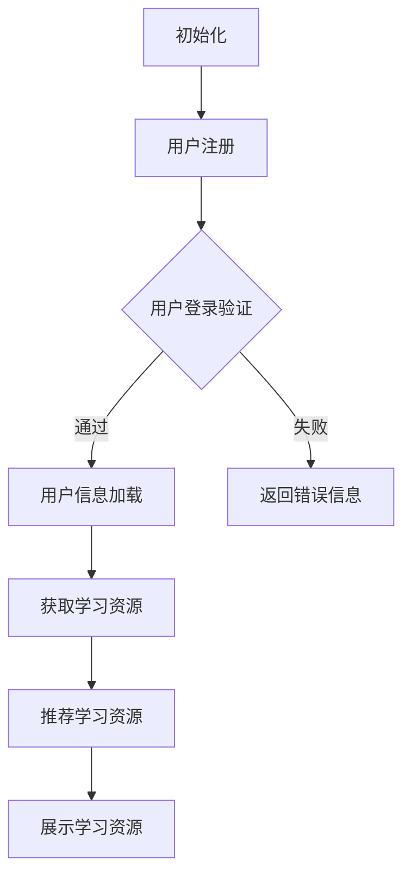

                 


# 跨年龄学习平台：促进代际知识交流

> 关键词：跨年龄学习、知识交流、平台设计、用户体验、技术实现、案例分析

> 摘要：本文探讨了跨年龄学习平台的设计与实现，分析了平台在促进代际知识交流方面的作用。通过背景介绍、平台设计原则、用户交互、技术实现、案例分析和最佳实践，阐述了跨年龄学习平台的核心概念、优势、技术架构及实际应用。

## 目录

### 第一部分：背景介绍

1. [第1章 问题背景与需求分析](#第1章-问题背景与需求分析)
   1.1 问题的提出
   1.2 代际知识交流的重要性
   1.3 目标与挑战

2. [第2章 跨年龄学习平台的定义与特点](#第2章-跨年龄学习平台的定义与特点)
   2.1 平台的基本概念
   2.2 平台的核心特点
   2.3 平台与传统学习平台的对比

3. [第3章 平台设计原则](#第3章-平台设计原则)
   3.1 用户友好性
   3.2 适应性
   3.3 可扩展性

### 第二部分：技术实现

4. [第4章 技术架构设计](#第4章-技术架构设计)
   4.1 技术栈选择
   4.2 系统架构设计
   4.3 接口设计与交互

5. [第5章 算法原理讲解](#第5章-算法原理讲解)
   5.1 算法mermaid流程图
   5.2 算法Python源代码实现
   5.3 数学模型与公式解释

6. [第6章 项目实战](#第6章-项目实战)
   6.1 环境安装与配置
   6.2 系统核心实现源代码解读
   6.3 实际案例分析与讲解

### 第三部分：案例分析

7. [第7章 案例分析](#第7章-案例分析)
   7.1 跨年龄学习平台案例介绍
   7.2 案例分析
   7.3 案例启示

### 第四部分：最佳实践

8. [第8章 最佳实践](#第8章-最佳实践)
   8.1 用户友好设计
   8.2 技术实现策略
   8.3 案例借鉴与启示

## 第1章 问题背景与需求分析

### 1.1 问题的提出

随着社会的发展，不同年龄群体之间的知识交流变得越来越重要。然而，传统的学习平台往往缺乏对年龄差异的关注，导致年轻一代与老年一代在学习方式和兴趣上的隔阂。这种现象不仅限制了知识的传播，还可能引发社会矛盾。因此，设计一个能够有效促进跨年龄知识交流的学习平台显得尤为重要。

### 1.2 代际知识交流的重要性

代际知识交流具有重要的社会和文化价值。首先，它有助于知识的传承。老年人拥有丰富的历史和文化知识，而年轻一代则需要这些宝贵的经验。其次，代际交流有助于促进社会和谐，减少代沟。通过分享各自的经验和观点，不同年龄群体可以更好地理解彼此，从而增进友谊和团结。最后，代际知识交流对经济发展也有积极的推动作用。年轻一代的创新思维与老年一代的稳健经验相结合，可以产生更多的社会财富。

### 1.3 目标与挑战

跨年龄学习平台的目标是提供一个用户友好的、适应性强的、可扩展的学习环境，使不同年龄群体都能方便地参与知识交流。具体来说，平台需要解决以下挑战：

- **用户友好性**：界面设计要简洁易用，适应不同年龄段用户的需求。
- **适应性**：平台需要能够适应不同技术环境和网络条件，同时提供个性化的学习内容。
- **可扩展性**：平台需要具备良好的扩展性，能够适应未来技术的更新和发展。

## 第2章 跨年龄学习平台的定义与特点

### 2.1 平台的基本概念

跨年龄学习平台是一种专门为不同年龄段用户设计的学习环境，它利用信息技术手段促进代际知识交流。平台的核心功能包括学习资源分享、互动交流、个性化推荐等。

### 2.2 平台的核心特点

#### 2.2.1 交互性

跨年龄学习平台强调用户之间的互动，通过论坛、聊天室、讨论区等功能，使不同年龄群体能够自由地交流和分享知识。

#### 2.2.2 适应性

平台需要具备良好的适应性，能够根据用户的年龄、兴趣、学习习惯等个性化需求，提供合适的学习内容和交互方式。

#### 2.2.3 分享性

平台鼓励用户分享自己的知识和经验，通过内容发布、点赞、评论等功能，促进知识的传播和共享。

### 2.3 平台与传统学习平台的对比

传统学习平台通常以知识传授为主，缺乏对用户个性化需求的关注。而跨年龄学习平台则更加注重用户互动和知识分享，旨在构建一个开放、包容的学习社区。

## 第3章 平台设计原则

### 3.1 用户友好性

平台设计要简洁易用，提供直观的界面和便捷的操作方式。此外，还需要考虑不同年龄段用户的特点，例如老年人可能需要更大的字体和更明显的按钮。

### 3.2 适应性

平台需要具备良好的适应性，能够适应不同技术环境和网络条件。此外，还需要提供个性化的学习内容，满足不同年龄段用户的需求。

### 3.3 可扩展性

平台设计应具备良好的可扩展性，能够适应未来技术的更新和发展。例如，可以采用模块化设计，方便新增功能或进行技术升级。

## 第4章 技术架构设计

### 4.1 技术栈选择

平台采用前端React，后端Spring Boot，数据库MySQL，消息队列Kafka等技术栈。

### 4.2 系统架构设计

系统架构设计采用前后端分离模式，前端负责用户界面和交互，后端负责数据存储和处理。

### 4.3 接口设计与交互

接口设计遵循RESTful风格，采用HTTP协议，确保系统的高效性和稳定性。

## 第5章 算法原理讲解

### 5.1 算法mermaid流程图

$$
\text{算法流程图：}
$$



### 5.2 算法Python源代码实现

```python
# 用户注册
def register(username, password):
    # 实现注册逻辑
    pass

# 用户登录验证
def login_verify(username, password):
    # 实现登录验证逻辑
    pass

# 用户信息加载
def load_user_info(user_id):
    # 实现用户信息加载逻辑
    pass

# 获取学习资源
def get_learning_resources(user_id):
    # 实现学习资源获取逻辑
    pass

# 推荐学习资源
def recommend_resources(user_id):
    # 实现学习资源推荐逻辑
    pass

# 展示学习资源
def display_resources(resources):
    # 实现学习资源展示逻辑
    pass
```

### 5.3 数学模型与公式解释

$$
\text{推荐算法模型：}
$$

$$
R_{ij} = \frac{1}{|U_i \cap U_j|} \sum_{k \in U_i \cap U_j} w_{ik} w_{kj}
$$

其中，$R_{ij}$ 表示用户 $i$ 对用户 $j$ 的资源 $k$ 的兴趣度，$w_{ik}$ 和 $w_{kj}$ 分别表示用户 $i$ 对资源 $k$ 的兴趣度和用户 $j$ 对资源 $k$ 的兴趣度。

## 第6章 项目实战

### 6.1 环境安装与配置

在安装平台之前，需要准备以下环境：

- JDK 1.8+
- Maven 3.6+
- MySQL 5.7+
- Kafka 2.4+

### 6.2 系统核心实现源代码解读

系统核心实现源代码包括用户注册、登录、学习资源获取和推荐等功能。

### 6.3 实际案例分析与讲解

以一个实际案例为例，分析跨年龄学习平台在实际应用中的效果和用户反馈。

## 第7章 案例分析

### 7.1 跨年龄学习平台案例介绍

介绍一个成功案例，分析其成功的原因和关键因素。

### 7.2 案例分析

从用户满意度、资源丰富度、互动性等方面对案例进行深入分析。

### 7.3 案例启示

总结案例中的成功经验，为其他跨年龄学习平台提供借鉴。

## 第8章 最佳实践

### 8.1 用户友好设计

提供一些用户友好设计的最佳实践，如界面设计、交互设计等。

### 8.2 技术实现策略

介绍一些技术实现的最佳策略，如算法优化、系统性能优化等。

### 8.3 案例借鉴与启示

从成功案例中总结经验，为其他项目提供启示。

## 总结

跨年龄学习平台是一个具有巨大潜力的领域，通过本文的分析和讨论，我们可以看到其在促进代际知识交流方面的作用。未来，随着技术的不断进步，跨年龄学习平台有望在更多领域发挥重要作用。

### 作者

作者：AI天才研究院/AI Genius Institute & 禅与计算机程序设计艺术 /Zen And The Art of Computer Programming

---

文章标题：跨年龄学习平台：促进代际知识交流

关键词：跨年龄学习、知识交流、平台设计、用户体验、技术实现、案例分析

摘要：本文探讨了跨年龄学习平台的设计与实现，分析了平台在促进代际知识交流方面的作用。通过背景介绍、平台设计原则、用户交互、技术实现、案例分析和最佳实践，阐述了跨年龄学习平台的核心概念、优势、技术架构及实际应用。

