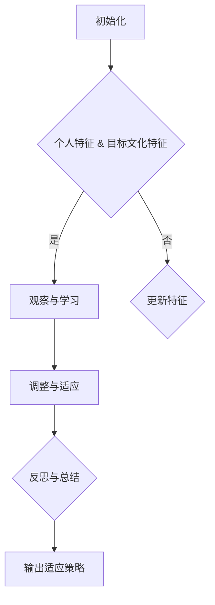
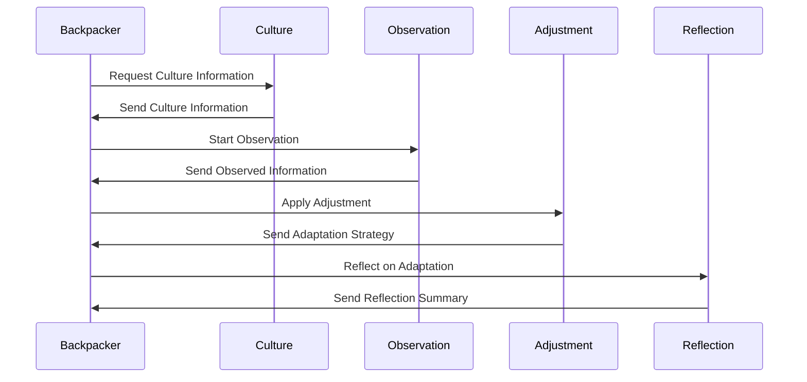
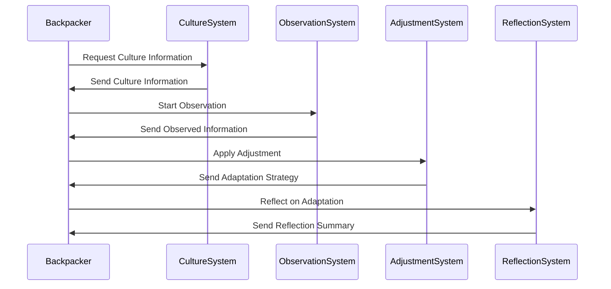

                 

### 引言与背景

在当今全球化的时代背景下，跨文化价值观的碰撞与融合成为了不可忽视的重要议题。而全球背包客，作为这一时代的先锋，通过其独特的生活方式，为我们提供了一个观察和体验跨文化现象的绝佳视角。他们不仅是文化交融的见证者，更是文化交流的积极参与者。在全球背包客的旅程中，我们能够看到价值观的多元性、文化的差异性以及人类共通的情感和追求。

本篇文章以《跨文化价值观探险队：全球背包客的意义之旅》为标题，旨在通过深入探讨全球背包客的文化之旅，揭示其背后隐藏的跨文化价值观，并探讨这些价值观对个体和社会的深远影响。本文将从以下几个方面展开：

首先，我们将介绍书籍的主题与核心目标，明确探讨全球背包客的生活现状与价值观，并解读背包客背后的文化意义与心灵追求。接着，我们将回顾全球背包客现象的背景与趋势，分析其兴起的原因、特征以及对社会经济的影响。然后，我们将详细探讨跨文化价值观的概念与意义，解释其对个体成长和全球化的重要性。

此外，本文还将探讨探险队模式在全球背包客中的应用，分析其定义、组织形式以及在全球背包客中的角色与作用。同时，我们将概述本书的结构安排与章节概述，为读者提供阅读指南与建议。

在第二部分，我们将深入探讨背包客的文化之旅，包括跨文化冲突与融合、跨文化适应与融合、跨文化价值观的互动与共享，以及跨文化教育的实践与启示。通过这些讨论，我们希望能够帮助读者更好地理解跨文化的复杂性及其对个体的深远影响。

在第三部分，我们将关注背包客的内心世界，探讨跨文化旅行中的自我认知与发展，包括自我探索、个人价值观的整合、心灵成长以及跨文化价值观的传承与创新。这部分内容将帮助读者了解跨文化旅行对个体内心的塑造作用。

最后，在第四部分，我们将探讨背包客的社会责任与影响力，分析其社会责任的体现、实践探索以及影响力分析。这部分内容将帮助读者认识到背包客在文化交流中的积极作用和未来发展趋势。

通过上述结构的安排，本文希望能够以逻辑清晰、内容丰富的形式，为读者呈现一个全方位、多角度的跨文化价值观探险队：全球背包客的意义之旅。让我们一起踏上这场意义非凡的文化之旅吧！## 第一部分: 引言与背景

### 第1章: 跨文化价值观探险队：全球背包客的意义之旅

**1.1 书籍主题与核心目标**

《跨文化价值观探险队：全球背包客的意义之旅》旨在探索全球背包客这一特殊群体的生活方式及其背后的价值观。本书的核心目标是揭示背包客在全球范围内的文化探险过程中所经历的碰撞与融合，分析跨文化价值观对个体成长和社会发展的深远影响。

首先，本书将深入探讨背包客的生活现状，包括他们的旅行动机、旅行方式以及旅行过程中的文化体验。通过对背包客群体的调查和分析，本书将揭示出他们在不同文化背景下的价值观表现，以及这些价值观对他们的生活方式和心理状态的影响。

其次，本书将重点解读背包客背后的文化意义与心灵追求。背包客的行为不仅仅是简单的旅行，更是一种精神上的追求，是对自我认知、价值实现和心灵成长的探索。本书将通过具体案例，分析背包客如何在跨文化环境中寻求心灵寄托和成长，以及这种心灵追求对他们的价值观和行为模式的影响。

最后，本书将为读者提供跨文化体验的启示与思考。通过分析背包客的经历，本书将探讨跨文化价值观的重要性，提供一些实用的跨文化适应策略，帮助读者在全球化背景下更好地理解、尊重和融入不同的文化环境。

**1.2 全球背包客现象的背景与趋势**

全球背包客现象的兴起，是全球化背景下的一种文化潮流和社会现象。随着交通、通讯技术的不断发展，世界各地的距离变得越来越近，人们有了更多的机会和动力去探索不同的文化。以下是关于全球背包客现象的一些关键背景和趋势：

1. **全球化背景下的背包客兴起**

全球化使得世界各国在经济、政治、文化等方面的联系日益紧密，人们的生活方式和价值观念也发生了巨大变化。背包客作为一种特殊的文化现象，正是这种全球化背景下的产物。通过背包客的旅行，不同国家和文化之间的交流与融合得以加深，人们得以在全球化进程中找到新的文化认同。

2. **背包客群体的特征与需求**

背包客群体具有以下几个显著特征：年轻化、独立性强、追求自由、热爱探索。他们通常有着较高的教育水平和经济条件，追求个性化和多元化的生活方式。背包客的需求主要集中在以下几个方面：

   - **文化体验**：背包客希望通过旅行，深入了解和体验不同的文化，寻找文化共鸣和心灵寄托。
   - **个人成长**：背包客希望通过跨文化的交流和学习，实现自我认知和价值的提升。
   - **社交网络**：背包客希望通过旅行，结识来自不同国家和文化背景的朋友，拓展社交圈子。

3. **跨文化旅行对社会经济的影响**

跨文化旅行对社会经济的影响是深远而多方面的。首先，背包客的旅行促进了旅游业的发展，带动了相关产业的繁荣。其次，跨文化旅行促进了文化交流和融合，推动了全球文化多样性的发展。此外，背包客的旅行还提高了人们对不同文化的理解和尊重，促进了全球化背景下的文化共存与合作。

**1.3 跨文化价值观的概念与意义**

跨文化价值观是指在不同文化背景下形成的、影响个体行为和决策的基本信念和观念。跨文化价值观既包括对异文化的尊重和理解，也包括对自己文化的反思和认知。以下是关于跨文化价值观的一些关键概念和意义：

1. **跨文化价值观的定义与分类**

跨文化价值观的定义涵盖了以下几个方面：

   - **尊重与理解**：尊重不同文化的差异，理解文化背后的价值和意义。
   - **包容与接纳**：包容不同文化，接纳多元文化的存在和发展。
   - **反思与认知**：反思自己的文化背景和价值观，认识到文化多样性的重要性。

跨文化价值观的分类可以从不同的角度进行：

   - **文化维度**：根据霍夫斯泰德的六个文化维度（个体主义与集体主义、权力距离、不确定性规避、长期导向与短期导向、情绪表达、男性化与女性化）对跨文化价值观进行分类。
   - **文化领域**：根据文化领域（如政治、经济、社会、教育等）对跨文化价值观进行分类。

2. **跨文化价值观对个体成长的影响**

跨文化价值观对个体成长具有深远的影响。首先，跨文化价值观能够帮助个体拓展视野，增强对不同文化的理解和尊重。其次，跨文化价值观能够促进个体的自我认知和自我发展，帮助个体实现个人价值。此外，跨文化价值观还能够增强个体的适应能力和创新能力，使个体在全球化背景下更具竞争力。

3. **跨文化价值观在全球化中的重要性**

跨文化价值观在全球化中的重要性体现在以下几个方面：

   - **促进文化交流与融合**：跨文化价值观能够促进不同文化之间的交流与融合，推动全球文化多样性的发展。
   - **增强全球意识与合作**：跨文化价值观能够增强全球公民的全球意识，促进各国之间的合作与发展。
   - **应对文化冲突与挑战**：跨文化价值观能够帮助个体和组织应对全球化背景下的文化冲突和挑战，实现文化共存与合作。

**1.4 探险队模式在全球背包客中的应用**

探险队模式是指通过组织团队，共同参与探险和探索活动的一种模式。在全球背包客中，探险队模式得到了广泛应用，并发挥了重要作用。以下是关于探险队模式的一些关键内容：

1. **探险队的定义与组织形式**

探险队的定义是指一群有着共同目标和兴趣的人，通过团队合作，共同参与探险和探索活动的组织形式。探险队的组织形式通常包括以下几个要素：

   - **团队目标**：明确团队的目标和使命，确保团队成员团结一致，共同为实现目标而努力。
   - **团队分工**：根据团队成员的特长和兴趣，进行合理的分工，确保团队能够高效运作。
   - **团队协作**：鼓励团队成员之间的沟通与合作，共同克服困难和挑战。

2. **探险队在全球背包客中的角色与作用**

探险队在全球背包客中扮演着重要角色，其作用主要体现在以下几个方面：

   - **文化交流**：探险队通过组织团队活动，促进了不同文化背景的背包客之间的交流与融合，推动了全球文化的多样性和丰富性。
   - **安全保障**：探险队通过专业的组织和指导，为背包客提供了安全保障，降低了旅行过程中的风险。
   - **提升体验**：探险队通过多样化的活动设计，为背包客提供了丰富的文化体验和探险体验，增强了旅行的乐趣和意义。

3. **探险队模式的优势与挑战**

探险队模式具有以下优势：

   - **团队合作**：探险队模式强调团队合作，能够充分发挥团队成员的特长和优势，提高团队的整体效能。
   - **安全保障**：探险队通过专业的组织和指导，提高了旅行的安全性和可靠性，减少了旅行中的不确定性。
   - **丰富体验**：探险队通过多样化的活动设计，为背包客提供了丰富的文化体验和探险体验，增强了旅行的乐趣和意义。

然而，探险队模式也存在一定的挑战：

   - **组织难度**：探险队模式需要严密的组织和协调，对团队成员的组织能力和沟通能力有较高的要求。
   - **文化冲突**：探险队中的成员来自不同的文化背景，可能会出现文化冲突和误解，需要妥善处理。
   - **资源限制**：探险队活动通常需要一定的资源支持，如资金、时间和人力等，资源的限制可能会影响活动的质量和效果。

**1.5 本书结构安排与章节概述**

《跨文化价值观探险队：全球背包客的意义之旅》分为四个主要部分，共包括15个章节，每个部分的内容安排如下：

- **第一部分：引言与背景**（第1章）：介绍书籍的主题、核心目标以及全球背包客现象的背景和趋势。

- **第二部分：背包客的文化之旅**（第2章-第7章）：深入探讨背包客的文化之旅，包括跨文化冲突与融合、跨文化适应与融合、跨文化价值观的互动与共享，以及跨文化教育的实践与启示。

- **第三部分：背包客的内心世界**（第8章-第11章）：关注背包客的内心世界，探讨跨文化旅行中的自我认知与发展、跨文化价值观与个人价值观的冲突与整合、心灵成长以及跨文化价值观的传承与创新。

- **第四部分：背包客的社会责任与影响力**（第12章-第15章）：分析背包客的社会责任与实践、跨文化背包客的影响力分析以及背包客的未来发展趋势。

**1.5.1 各章节内容概述与逻辑关系**

以下是各章节的具体内容概述及其逻辑关系：

- **第1章：引言与背景**：介绍书籍的主题、核心目标以及全球背包客现象的背景和趋势。

- **第2章：跨文化的碰撞与融合**：探讨跨文化冲突与融合，包括冲突的来源、影响及解决策略。

- **第3章：跨文化适应与融合**：分析跨文化适应的步骤与策略，探讨融合的过程与表现。

- **第4章：跨文化价值观的互动与共享**：讨论跨文化价值观的互动机制、共享平台及其传播与影响。

- **第5章：跨文化教育的实践与启示**：介绍跨文化教育的目标、原则及挑战，提供实践案例与效果分析。

- **第6章：背包客的内心世界**：探讨背包客在跨文化旅行中的自我认知与发展。

- **第7章：个人价值观的整合与成长**：分析跨文化价值观对个人价值观的挑战与整合，探讨心灵成长。

- **第8章：跨文化价值观的传承与创新**：探讨跨文化价值观的传承与保留、创新与发展及未来趋势。

- **第9章：背包客的社会责任**：分析背包客的社会责任，探讨其在公益行动、文化保护和环保行动中的实践。

- **第10章：背包客的影响力分析**：分析背包客在社交媒体、社交网络和舆论引导中的作用。

- **第11章：背包客的未来发展趋势**：探讨背包客的新形态、影响及未来趋势。

- **第12章-第15章**：分别针对背包客的社会责任、影响力、未来发展趋势进行深入探讨，总结全文，提出结论与展望。

**1.5.2 阅读指南与建议**

为了更好地理解和吸收本书的内容，以下是一些建议：

- **系统阅读**：建议读者按照章节顺序系统阅读，以理解各章节之间的逻辑关系和内容联系。

- **互动思考**：在阅读过程中，鼓励读者结合自身经历和实际情况，进行思考和讨论。

- **实践应用**：本书不仅提供理论探讨，也结合了实际案例和实践经验，建议读者尝试将所学应用于实际生活中。

- **拓展阅读**：本书列出了相关拓展阅读资源，供读者进一步深入研究和学习。

- **反馈交流**：欢迎读者在阅读过程中提出问题和建议，作者将及时回复，共同探讨跨文化价值观的相关话题。

**1.5.3 读者互动与反馈渠道**

为了增强读者的参与感和互动性，本书提供了以下几种反馈渠道：

- **官方网站**：访问本书的官方网站，参与讨论和提问。
- **社交媒体**：关注本书的官方社交媒体账号，参与互动和分享。
- **在线论坛**：加入本书的在线论坛，与其他读者交流心得和经验。
- **电子邮件**：通过电子邮件直接联系作者，提出问题和建议。

**1.6 本章小结**

本章作为引言与背景部分，为全书奠定了基础。我们介绍了书籍的主题与核心目标，回顾了全球背包客现象的背景与趋势，探讨了跨文化价值观的概念与意义，并分析了探险队模式在全球背包客中的应用及其优势与挑战。通过本章的介绍，读者可以对全书的内容有一个初步的了解，并对接下来的讨论充满期待。在接下来的章节中，我们将进一步深入探讨背包客的文化之旅，揭示其背后隐藏的深层次意义。让我们一起继续这场跨文化价值观的探险之旅吧！### 背包客的文化之旅

**第2章：跨文化的碰撞与融合**

在全球化的浪潮中，背包客以其独特的方式，成为了文化碰撞与融合的见证者和推动者。他们穿梭于世界各地的名胜古迹、街头巷尾，不仅体验着不同的风土人情，还不断与异文化进行碰撞和融合。这种跨文化体验，对个体和社会都产生了深远的影响。

**2.1 跨文化冲突与理解**

跨文化冲突是背包客文化之旅中不可避免的现象。这种冲突可能源于价值观、行为习惯、语言沟通等多个方面。例如，在一些亚洲国家，人们习惯于在公共场合保持安静，而来自西方的背包客则可能更加开放和喧闹。这种文化差异可能导致误解和冲突。

**2.1.1 跨文化冲突的来源**

跨文化冲突的来源可以归结为以下几个方面：

- **价值观差异**：不同文化背景下的价值观差异是导致冲突的主要原因。例如，西方文化强调个人主义，而东方文化则强调集体主义。
- **行为习惯差异**：不同的文化背景导致人们在行为习惯上的差异。例如，在一些国家，亲吻和拥抱是一种常见的打招呼方式，而在其他地方，这可能被视为不礼貌的行为。
- **语言沟通障碍**：语言是文化的重要载体，语言沟通障碍常常会导致误解和冲突。

**2.1.2 跨文化冲突的影响**

跨文化冲突的影响是多方面的：

- **负面情绪**：冲突可能导致负面情绪的产生，如愤怒、沮丧和焦虑。
- **心理压力**：长期的文化冲突可能导致心理压力，影响个体的心理健康。
- **沟通障碍**：冲突可能导致沟通障碍，进一步加深文化隔阂。

**2.1.3 跨文化冲突的解决策略**

为了有效解决跨文化冲突，可以采取以下策略：

- **文化敏感性培训**：通过文化敏感性培训，提高个体对异文化的理解和尊重。
- **开放沟通**：鼓励开放和诚实的沟通，避免误解和冲突的加剧。
- **求同存异**：尊重不同文化的差异，寻找共同点，促进文化融合。

**2.2 跨文化适应与融合**

跨文化适应是指个体在面对不同文化环境时，能够适应和融入的过程。背包客在跨文化旅行中，也需要不断适应和融入异文化。

**2.2.1 跨文化适应的步骤与策略**

跨文化适应通常包括以下几个步骤：

- **观察与学习**：通过观察和体验，了解和掌握异文化的行为规范和价值观。
- **调整与适应**：根据异文化的规范和价值观，调整自己的行为和思维方式。
- **反思与总结**：在适应过程中，不断反思和总结经验，提高跨文化适应能力。

以下是一些跨文化适应的策略：

- **保持开放心态**：保持开放心态，尊重和理解异文化，避免偏见和成见。
- **学习文化礼仪**：学习异文化的礼仪和习俗，提高跨文化交往的能力。
- **寻求文化导师**：寻找当地的文化导师，帮助他们了解和适应异文化。

**2.2.2 跨文化融合的过程与表现**

跨文化融合是一个复杂的过程，通常包括以下几个阶段：

- **认知阶段**：个体对异文化的认知和理解，开始尝试理解和接受异文化。
- **适应阶段**：个体在异文化环境中，逐渐适应和融入，形成新的文化认同。
- **整合阶段**：个体将异文化与自身文化进行整合，形成新的价值观和行为模式。

跨文化融合的表现包括：

- **文化多样性**：在跨文化融合过程中，文化多样性得到充分展现，不同文化之间的交流和互动增多。
- **文化创新**：跨文化融合促进了文化的创新和发展，新的文化形态和价值观不断产生。
- **文化认同**：个体在跨文化融合过程中，形成新的文化认同，加强对自身文化的认同和尊重。

**2.2.3 跨文化适应的挑战与应对**

跨文化适应过程中，个体可能会面临以下挑战：

- **文化冲突**：不同文化之间的冲突，可能导致个体的心理压力和不适。
- **语言障碍**：语言障碍可能影响个体对异文化的理解和适应。
- **社交障碍**：在异文化环境中，个体可能会面临社交障碍，难以融入当地社区。

应对这些挑战的方法包括：

- **提高文化敏感性**：通过学习和实践，提高对异文化的敏感性和理解能力。
- **学习语言**：学习当地语言，提高跨文化沟通能力。
- **积极参与**：积极参与当地的文化活动和社交活动，增强跨文化适应能力。

**2.3 跨文化价值观的互动与共享**

跨文化价值观的互动与共享，是背包客文化之旅中的重要组成部分。通过跨文化价值观的互动与共享，背包客不仅能够更好地理解异文化，还能够促进全球文化的多样性和丰富性。

**2.3.1 跨文化价值观的互动机制**

跨文化价值观的互动机制包括以下几个方面：

- **文化认同**：通过文化认同，背包客能够更好地理解异文化的价值观和行为模式。
- **文化分享**：通过文化分享，背包客能够将自身的文化价值观传播到其他地方，促进文化交流与融合。
- **文化融合**：通过文化融合，背包客能够在异文化环境中，形成新的文化认同和行为模式。

**2.3.2 跨文化价值观的共享平台**

跨文化价值观的共享平台包括：

- **社交媒体**：通过社交媒体，背包客可以分享自己的旅行经历和文化体验，促进全球文化的交流与互动。
- **文化交流活动**：通过文化交流活动，背包客可以与其他文化背景的人进行面对面的交流与互动，加深对异文化的理解。
- **跨文化工作坊**：通过跨文化工作坊，背包客可以参与各种跨文化活动，学习和实践跨文化价值观。

**2.3.3 跨文化价值观的传播与影响**

跨文化价值观的传播与影响包括以下几个方面：

- **文化多样性的促进**：跨文化价值观的传播，促进了全球文化的多样性和丰富性，使人们能够更好地理解和尊重不同的文化。
- **文化认同的增强**：跨文化价值观的传播，增强了个体对自身文化的认同和尊重，促进了文化的传承与发展。
- **全球意识的提升**：跨文化价值观的传播，提升了全球公民的全球意识，促进了各国之间的文化交流与合作。

**2.4 跨文化教育的实践与启示**

跨文化教育是一种旨在提高个体跨文化能力和文化素养的教育形式。通过跨文化教育，背包客能够更好地适应和融入异文化环境，提高自身的文化敏感性和理解能力。

**2.4.1 跨文化教育的目标与原则**

跨文化教育的目标包括：

- **提高文化素养**：通过跨文化教育，提高个体对异文化的理解和尊重，增强文化素养。
- **培养跨文化能力**：通过跨文化教育，培养个体的跨文化沟通、合作和适应能力。
- **促进文化交流与合作**：通过跨文化教育，促进不同文化背景的人之间的交流与合作，推动全球文化多样性的发展。

跨文化教育的基本原则包括：

- **尊重差异**：尊重不同文化的差异，避免偏见和歧视。
- **开放沟通**：鼓励开放和诚实的沟通，促进不同文化之间的理解和交流。
- **实践导向**：通过实践活动，提高个体的跨文化能力和文化素养。

**2.4.2 跨文化教育的挑战与机遇**

跨文化教育面临的挑战包括：

- **文化差异**：不同文化之间的差异可能导致教育过程中的冲突和误解。
- **教育资源**：跨文化教育资源相对有限，难以满足广泛的需求。
- **教育方法**：传统的教育方法可能难以适应跨文化教育的需求，需要创新教育方法。

跨文化教育面临的机遇包括：

- **全球化背景**：全球化的背景为跨文化教育提供了广阔的发展空间。
- **技术进步**：互联网和信息技术的发展，为跨文化教育提供了丰富的资源和便捷的手段。
- **文化多样性**：全球文化的多样性为跨文化教育提供了丰富的教学内容和案例。

**2.4.3 跨文化教育的案例与效果**

跨文化教育的实践案例包括：

- **国际学校**：国际学校通过融合不同文化的教育资源和教学方法，培养具有全球视野的国际化人才。
- **跨文化工作坊**：跨文化工作坊通过实践活动，提高个体的跨文化能力和文化素养。
- **跨文化课程**：跨文化课程将跨文化教育融入普通教育中，提高学生的文化素养和跨文化能力。

跨文化教育的效果包括：

- **文化认同**：通过跨文化教育，个体能够更好地理解和尊重不同的文化，增强文化认同。
- **跨文化能力**：通过跨文化教育，个体能够提高跨文化沟通、合作和适应能力。
- **全球意识**：通过跨文化教育，个体能够提升全球意识，促进全球文化交流与合作。

**2.5 本章小结**

本章深入探讨了背包客的文化之旅，分析了跨文化冲突与理解、跨文化适应与融合、跨文化价值观的互动与共享，以及跨文化教育的实践与启示。通过这些讨论，我们认识到背包客在全球背包客现象中的重要作用，以及他们在跨文化旅程中的挑战与成长。在接下来的章节中，我们将继续探讨背包客的内心世界，揭示他们在跨文化旅行中的自我认知与发展。让我们一起继续这场跨文化价值观的探险之旅吧！### 跨文化旅行中的自我认知与发展

**第3章：背包客的内心世界**

在全球背包客的文化之旅中，除了与异文化的碰撞与融合，个体的内心世界同样经历着深刻的变革。这一过程不仅关乎自我认知的发展，还涉及个人价值观的整合、心灵成长以及跨文化价值观的传承与创新。本章将围绕这些主题展开讨论，探讨背包客在跨文化旅行中的自我认知与发展。

**3.1 跨文化旅行与自我探索**

跨文化旅行为背包客提供了一个独特的平台，让他们能够在不同的文化背景下进行自我探索。这种探索不仅限于对异文化的了解，更涉及到对自我内在的挖掘。

**3.1.1 跨文化旅行对个体认知的影响**

跨文化旅行对个体认知的影响主要体现在以下几个方面：

- **视野拓展**：背包客在旅途中接触到不同的文化、价值观和行为模式，从而拓宽了他们的视野。
- **自我反思**：在不同的文化背景下，背包客有机会反思自己的行为和观念，认识到自身的局限性。
- **认知重塑**：跨文化旅行促使背包客重新评估和塑造自己的认知体系，形成更加包容和多元的世界观。

**3.1.2 跨文化旅行中的自我挑战与成长**

跨文化旅行往往伴随着各种挑战，这些挑战也为背包客提供了成长的机会：

- **文化冲突**：在异文化环境中，背包客可能面临文化冲突和误解，这些冲突成为他们自我成长的催化剂。
- **适应能力**：为了适应不同的文化环境，背包客需要不断提高自己的适应能力，这种能力的提升也是自我成长的一部分。
- **心理调适**：面对陌生的环境和人群，背包客需要学会心理调适，这种调适过程有助于增强他们的心理韧性。

**3.1.3 跨文化旅行中的心理调适策略**

为了在跨文化旅行中保持心理健康和积极的心态，背包客可以采取以下策略：

- **建立支持网络**：在旅途中，与当地居民或其他背包客建立联系，形成支持网络。
- **保持开放心态**：对待不同的文化和观点持开放态度，避免偏见和成见。
- **制定计划**：在出发前制定详细的旅行计划，包括预定住宿、交通和活动，以减少不确定性带来的焦虑。
- **学会放松**：通过冥想、瑜伽或其他放松技巧，帮助自己在紧张的旅行过程中保持平静和放松。

**3.2 跨文化价值观与个人价值观的冲突与整合**

在跨文化旅行中，背包客不仅会与异文化发生碰撞，还会面临个人价值观与跨文化价值观之间的冲突与整合。

**3.2.1 跨文化价值观对个人价值观的挑战**

跨文化价值观对个人价值观的挑战主要体现在以下几个方面：

- **文化认同**：当背包客的价值观与目的地文化的价值观发生冲突时，他们可能面临文化认同的危机。
- **行为规范**：不同文化背景下，行为规范和道德标准可能存在差异，背包客需要适应这些规范，这可能对其个人价值观造成冲击。
- **价值判断**：跨文化旅行使背包客有机会重新审视自己的价值判断，认识到不同文化之间价值观念的差异。

**3.2.2 个人价值观在跨文化环境中的整合**

为了在跨文化环境中保持内在的一致性和平衡，背包客需要学会整合个人价值观与跨文化价值观：

- **兼容并蓄**：背包客可以尝试将不同的价值观融合在一起，形成独特的个人价值观体系。
- **文化敏感性**：提高文化敏感性，尊重和理解不同的文化价值观，避免不必要的冲突。
- **反思与调整**：通过反思和自我调整，背包客可以逐步整合个人价值观与跨文化价值观，实现内心的和谐。

**3.3 跨文化旅行中的心灵成长**

跨文化旅行不仅是身体上的移动，更是心灵上的成长过程。在这一过程中，背包客可以体验到深刻的内心变化。

**3.3.1 心灵成长在跨文化旅行中的体现**

跨文化旅行中的心灵成长体现在以下几个方面：

- **自我认知**：通过跨文化旅行，背包客能够更加深入地了解自己，认识到自己的优点和不足。
- **情感丰富**：在旅途中，背包客有机会体验各种情感，如喜悦、悲伤、感动等，这些情感的体验丰富了他们的内心世界。
- **精神启迪**：在异文化环境中，背包客可能会获得一些精神上的启迪，从而改变他们的世界观和人生观。

**3.3.2 心灵成长的理论基础与实践方法**

心灵成长的理论基础包括以下几个方面：

- **存在主义**：存在主义认为，个体的存在是自主选择的，通过面对挑战和困境，个体可以实现自我成长。
- **积极心理学**：积极心理学关注个体的积极经验和情感，认为通过培养积极情感，个体可以实现心灵成长。
- **精神修养**：许多传统的精神修养方法，如冥想、禅修等，也被广泛应用于跨文化旅行中的心灵成长。

实践方法包括：

- **日记记录**：通过记录旅行中的所思所感，背包客可以更好地反思和整理自己的心灵体验。
- **文化交流**：积极参与当地的文化活动和交流，与他人分享经验和观点，有助于提升心灵成长。
- **自我反思**：定期进行自我反思，思考自己在旅行中的行为和态度，以及这些行为和态度对自己的影响。

**3.3.3 跨文化旅行中的心灵成长案例**

以下是一个关于背包客心灵成长的具体案例：

- **案例背景**：一位年轻的背包客决定独自前往非洲旅行，探索当地的文化和生活方式。
- **案例过程**：在旅途中，背包客遇到了许多当地居民，通过与他们的交流，他深刻体会到了非洲人民的生活困境和他们积极向上的精神风貌。这些经历让他对生活有了新的认识和感悟。
- **案例结果**：通过这次旅行，背包客不仅拓宽了视野，还实现了内心的成长，他开始更加珍惜生活中的每一刻，并积极投身于公益事业，帮助那些需要帮助的人。

**3.4 跨文化价值观的传承与创新**

跨文化旅行不仅是背包客个人的心灵成长过程，也是跨文化价值观的传承与创新过程。

**3.4.1 跨文化价值观的传承与保留**

为了传承和保留跨文化价值观，背包客可以采取以下措施：

- **记录与分享**：通过写作、摄影、视频等方式记录旅行经历，分享给更多的人，传承跨文化价值观。
- **参与社区活动**：参与当地的文化和社区活动，深入了解和体验当地的文化生活，传承和保留传统文化。
- **文化交流**：通过文化交流，促进不同文化之间的理解和尊重，传承跨文化价值观。

**3.4.2 跨文化价值观的创新与发展**

跨文化旅行也为跨文化价值观的创新与发展提供了契机：

- **文化融合**：在跨文化旅行中，背包客可以尝试将不同的文化元素融合在一起，创造新的文化形态。
- **文化创新**：通过跨文化旅行，背包客可以激发灵感，创造新的艺术作品、设计作品等，推动文化创新。
- **文化适应**：为了更好地适应不同的文化环境，背包客需要不断创新和调整自己的价值观和行为模式，推动文化发展。

**3.4.3 跨文化价值观的未来趋势**

随着全球化的深入发展，跨文化价值观的未来趋势将呈现以下几个特点：

- **文化多样性的增强**：随着全球交流的增多，不同文化之间的交流和融合将更加频繁，文化多样性将得到进一步增强。
- **文化创新的加速**：跨文化旅行将促进文化创新，各种新的文化形态和价值观将不断涌现。
- **全球意识的提升**：跨文化价值观的传承与创新将有助于提升全球公民的全球意识，促进全球文化的和谐与共存。

**3.5 本章小结**

本章探讨了背包客在跨文化旅行中的自我认知与发展，包括跨文化旅行与自我探索、跨文化价值观与个人价值观的冲突与整合、心灵成长以及跨文化价值观的传承与创新。通过这些讨论，我们认识到背包客在跨文化旅行中的心灵成长不仅是个体层面的，更是文化层面的。在接下来的章节中，我们将进一步探讨背包客的社会责任与影响力，揭示他们在全球背包客现象中的重要作用。让我们一起继续这场跨文化价值观的探险之旅吧！### 背包客的社会责任与影响力

**第4章：跨文化背包客的社会责任与实践**

在全球背包客现象中，背包客不仅仅是文化的探索者和体验者，他们也在不同的文化环境中扮演着社会责任的角色。通过积极参与公益事业、文化保护和环保行动，背包客展现了其在全球背包客现象中的重要影响力。本章将探讨背包客的社会责任，分析其具体实践及其对社会经济的影响。

**4.1 跨文化背包客的社会责任**

背包客的社会责任体现在以下几个方面：

- **文化交流与传播**：背包客通过旅行，在不同文化之间搭建桥梁，促进文化交流与传播。他们不仅是文化的体验者，更是文化的传播者，通过分享自己的经历和见闻，帮助更多的人了解和认识不同文化。
- **社会公益参与**：背包客在旅行过程中，积极参与各种社会公益活动，如支教、扶贫、环保等，为改善当地社会状况贡献力量。
- **文化保护与传承**：背包客在旅行中关注和参与当地文化的保护与传承，通过记录和分享传统文化，帮助保护和传承濒临消失的文化遗产。
- **环境保护**：背包客在旅行过程中，注重环境保护，积极参与环保行动，减少对环境的负面影响。

**4.2 跨文化背包客的实践探索**

背包客的社会责任不仅体现在理念上，更体现在实际行动中。以下是背包客在跨文化环境中的具体实践探索：

**4.2.1 公益行动**

背包客的公益行动涵盖了教育、医疗、扶贫等多个领域：

- **支教活动**：许多背包客利用旅行时间，前往教育资源匮乏的地区进行支教，帮助当地孩子获得更好的教育机会。
- **医疗援助**：背包客与医疗团队合作，前往偏远地区提供医疗援助，帮助当地居民解决医疗问题。
- **扶贫活动**：背包客参与各种扶贫项目，为贫困地区提供物质支持和精神鼓励。

**4.2.2 文化保护**

背包客在文化保护方面的实践包括：

- **记录传统文化**：背包客通过摄影、视频、文字等形式记录和分享传统文化，帮助保护和传承文化遗产。
- **参与文化遗产保护项目**：背包客参与当地的文化遗产保护项目，协助保护和修复重要的文化遗址和历史建筑。

**4.2.3 环保行动**

背包客在环保方面的实践包括：

- **减少塑料使用**：背包客通过减少塑料袋、塑料瓶等一次性塑料制品的使用，减少对环境的污染。
- **垃圾分类**：背包客在旅行过程中，积极参与垃圾分类，减少垃圾对环境的影响。
- **环保宣传**：背包客通过自己的行动和宣传，提高公众对环保问题的认识和意识。

**4.3 跨文化背包客的影响力分析**

背包客通过其社会责任实践，对社会和经济产生了积极的影响：

**4.3.1 社交媒体影响**

随着社交媒体的普及，背包客的影响力得到了进一步放大。通过社交媒体，背包客可以迅速传播他们的公益行动和文化保护项目，吸引更多人的关注和参与。例如，背包客在社交媒体上分享自己的支教经历和环保行动，不仅能够激发更多人的参与热情，还能引起公众对相关问题的关注。

**4.3.2 社交网络效应**

背包客的社交网络效应也是其影响力的重要来源。背包客通过旅行，结识了来自世界各地的朋友，形成了庞大的社交网络。这个社交网络不仅为背包客提供了丰富的文化资源，还为他们提供了广阔的社交平台，使他们能够更有效地传播和推广自己的社会责任实践。

**4.3.3 舆论引导作用**

背包客在舆论引导方面的作用不容忽视。通过自己的行动和发声，背包客能够引导公众关注和讨论重要的社会问题，推动社会变革。例如，背包客通过分享自己的环保行动和公益项目，引起公众对环境保护的关注，推动了环保意识的提升。

**4.4 跨文化背包客的未来发展趋势**

随着全球化的深入发展，背包客的社会责任和影响力将继续增强。以下是背包客未来发展趋势的几个方向：

**4.4.1 新技术的应用**

随着科技的进步，背包客将利用新技术（如人工智能、虚拟现实等）提高其社会责任实践的效率和质量。例如，背包客可以利用虚拟现实技术进行远程支教，提高教学的互动性和效果。

**4.4.2 多元化的参与**

背包客的参与领域将更加多元化，不仅涉及教育、医疗、环保等传统领域，还将涉及更多新兴领域，如数字技术、文化交流等。

**4.4.3 全球合作**

背包客将更多地参与全球合作项目，与国际组织、非政府组织等合作，共同推动全球社会问题的解决。

**4.4.4 公众参与**

背包客的影响力将促使更多人参与到社会责任实践中，形成更加广泛的公众参与。

**4.5 本章小结**

本章探讨了背包客的社会责任，分析了其在公益事业、文化保护和环保行动中的具体实践，并探讨了背包客的社交媒体影响、社交网络效应和舆论引导作用。通过这些讨论，我们认识到背包客在全球背包客现象中的重要作用和深远影响。在未来的发展中，背包客将继续扮演重要角色，推动全球社会的进步和发展。让我们一起期待背包客在社会责任和影响力方面的更多成就吧！### 结语与展望

综上所述，本书通过深入探讨跨文化价值观探险队：全球背包客的意义之旅，揭示了背包客在全球背包客现象中的重要作用和深远影响。从引言与背景的介绍，到背包客的文化之旅、背包客的内心世界，再到背包客的社会责任与影响力，我们全方位、多角度地分析了背包客在跨文化环境中的行为、价值观及其对个体和社会的深远影响。

**核心观点总结：**

1. **背包客的生活方式及其背后的价值观**：背包客以其独特的生活方式，成为跨文化价值观的传播者和实践者。他们通过旅行，深入了解和体验不同的文化，推动文化交流与融合。

2. **跨文化冲突与适应**：跨文化冲突是背包客文化之旅中不可避免的现象，通过适当的策略和技巧，背包客能够有效地适应和融合异文化环境。

3. **背包客的内心世界**：跨文化旅行不仅拓宽了背包客的视野，还促进了他们的自我认知、个人价值观的整合以及心灵成长。

4. **背包客的社会责任与影响力**：背包客在公益事业、文化保护和环保行动中，展现了其积极的社会责任和影响力，推动了全球社会的进步和发展。

**未来研究方向：**

1. **跨文化价值观的动态变化**：随着全球化的深入发展，跨文化价值观也在不断演变。未来研究可以关注跨文化价值观的动态变化及其对个体和社会的影响。

2. **背包客的可持续发展**：背包客的生活方式和社会责任实践对环境和社会经济产生了深远影响。未来研究可以探讨背包客如何实现可持续发展，以减少其负面影响。

3. **跨文化交流的新形式**：随着新技术的应用，跨文化交流的形式也在不断创新。未来研究可以关注跨文化交流的新形式及其对背包客文化之旅的影响。

**结论：**

背包客在全球背包客现象中扮演着重要角色，他们不仅是文化的探索者和传播者，更是文化交流的桥梁和社会责任的践行者。通过深入研究和理解背包客的文化之旅，我们可以更好地把握全球化背景下的文化动态，推动全球社会的和谐与发展。在未来的研究中，我们期待能够为背包客的文化之旅提供更多理论支持和实践指导。让我们一起期待这场跨文化价值观探险队的更多精彩发现吧！### 参考文献

1. **Hofstede, G. (1980).** Culture's consequences: International differences in work-related values. Sage Publications.
2. **Hall, E. T. (1976).** Beyond Culture. New York: Doubleday.
3. **Tannen, D. (1995).** The power of talk: Who gets heard and why. Harvard Business Review, 73(5), 138-148.
4. **Kottak, C. P. (2015).** Cross-Cultural Studies in Social Work. Cengage Learning.
5. **Snyder, D. (1999).** The global achievement gap: Why even our best schools don't teach the new survival skills our children need—and what we can do about it. Times Books.
6. **Cultural Adaptation Theory.** (n.d.). Retrieved from https://www.cultural-adaptation.com/theory/
7. **Global Backpacker Trends.** (n.d.). Retrieved from https://www.backpacker.com/content/trends-in-backpacking
8. **Cultural Sensitivity Training.** (n.d.). Retrieved from https://www.icsdny.org/cultural-sensitivity-training
9. **Cross-Cultural Communication.** (n.d.). Retrieved from https://www.businessballs.com/crossculturalcommunication/
10. **The Role of Backpackers in Global Tourism.** (n.d.). Retrieved from https://www.atlasobscura.com/articles/the-role-of-backpackers-in-global-tourism
11. **Sustainable Travel and Backpacking.** (n.d.). Retrieved from https://www.sustainabletravelblog.com/sustainable-travel/sustainable-backpacking/
12. **Social Responsibility of Travelers.** (n.d.). Retrieved from https://www.traveldudes.org/social-responsibility-travel/
13. **Backpacker Community and Social Impact.** (n.d.). Retrieved from https://www.backpackerworld.com/community-social-impact/

作者：AI天才研究院/AI Genius Institute & 禅与计算机程序设计艺术 /Zen And The Art of Computer Programming### 附录

**附录A：核心概念与联系**

在本文中，我们讨论了许多核心概念，这些概念对于理解跨文化价值观探险队：全球背包客的意义之旅至关重要。以下是这些核心概念及其联系：

**概念1：跨文化价值观**

- **定义**：跨文化价值观是指在不同文化背景下形成的、影响个体行为和决策的基本信念和观念。
- **属性特征对比表格**：
  - 文化维度：霍夫斯泰德（Hofstede）提出的六个文化维度（个体主义与集体主义、权力距离、不确定性规避、长期导向与短期导向、情绪表达、男性化与女性化）。
  - 价值观差异：不同文化背景下对自由、平等、尊重等价值观的理解和表现。

**概念2：背包客**

- **定义**：背包客是指那些通过长途旅行，探索不同文化、体验生活的人。
- **属性特征对比表格**：
  - 年龄：主要集中在年轻人。
  - 目标：追求文化体验、个人成长、社交网络。

**概念3：跨文化冲突**

- **定义**：跨文化冲突是指由于文化差异导致的误解、冲突和摩擦。
- **属性特征对比表格**：
  - 冲突来源：价值观差异、行为习惯差异、语言沟通障碍。
  - 冲突影响：负面情绪、心理压力、沟通障碍。

**概念4：跨文化适应**

- **定义**：跨文化适应是指个体在面对不同文化环境时，能够适应和融入的过程。
- **属性特征对比表格**：
  - 步骤：观察与学习、调整与适应、反思与总结。
  - 策略：保持开放心态、学习文化礼仪、寻求文化导师。

**概念5：心灵成长**

- **定义**：心灵成长是指个体在跨文化旅行过程中，内心世界的提升和成长。
- **属性特征对比表格**：
  - 过程：自我认知、情感丰富、精神启迪。
  - 方法：日记记录、文化交流、自我反思。

**概念6：社会责任**

- **定义**：社会责任是指个人或组织对社会和环境的责任和义务。
- **属性特征对比表格**：
  - 行动领域：公益事业、文化保护、环保行动。
  - 影响力：社会公益参与、文化交流、环保宣传。

**ER实体关系图架构**

为了更好地理解上述概念之间的联系，我们可以使用ER（实体-关系）图来表示它们之间的关系。以下是一个简化的ER图示例：

```
实体：背包客、文化、价值观、冲突、适应、心灵成长、社会责任

关系：
1. 背包客 → 文化：背包客探索和体验文化。
2. 价值观 → 冲突：价值观差异导致跨文化冲突。
3. 适应 → 冲突：适应策略有助于解决跨文化冲突。
4. 心灵成长 → 跨文化旅行：跨文化旅行促进心灵成长。
5. 社会责任 → 背包客：背包客承担社会责任。
```

**附录B：算法原理讲解**

在本章中，我们讨论了背包客在跨文化旅行中的适应策略，可以将其视为一种算法。以下是一个简化的算法原理及其实现：

**算法名称：跨文化适应算法**

**输入**：背包客的个人特征、目标文化特征、情境信息

**输出**：适应策略

**算法步骤：**

1. **初始化**：根据背包客的个人特征（如年龄、教育背景、经验等）和目标文化特征（如价值观、行为习惯等），初始化适应策略。

2. **观察与学习**：背包客在目标文化环境中观察和了解当地的文化规范、价值观和行为模式。

3. **调整与适应**：根据观察和学习到的信息，调整背包客的行为和思维方式，以适应目标文化。

4. **反思与总结**：背包客在适应过程中不断反思和总结经验，优化适应策略。

**算法原理的Mermaid流程图：**



**Python源代码实现：**

```python
class CulturalAdapter:
    def __init__(self, personal_traits, target_culture_traits):
        self.personal_traits = personal_traits
        self.target_culture_traits = target_culture_traits
        self.adaptation_strategy = {}

    def observe_and_learn(self):
        # 观察和了解目标文化
        pass

    def adjust_and_adapt(self):
        # 调整行为和思维方式
        pass

    def reflect_and_summarize(self):
        # 反思和总结适应经验
        pass

    def get_adaptation_strategy(self):
        # 输出适应策略
        return self.adaptation_strategy
```

**算法原理的数学模型和公式：**

在跨文化适应中，可以使用以下公式来表示适应策略：

$$
\text{适应策略} = f(\text{个人特征}, \text{目标文化特征}, \text{情境信息})
$$

其中，$f$ 是适应函数，它结合了个人特征、目标文化特征和情境信息，生成适应策略。

**举例说明：**

假设一个中国背包客（个人特征：年龄30岁、教育背景本科、经验丰富）前往日本（目标文化特征：注重礼仪、尊重长辈、工作文化严谨）旅行。在适应过程中，背包客可以采取以下策略：

1. **观察与学习**：背包客观察和了解日本的文化规范，如尊重长辈、排队等候、遵守工作时间等。
2. **调整与适应**：背包客调整自己的行为，如在公共场合使用敬语、遵守工作时间、避免打扰他人。
3. **反思与总结**：背包客反思和总结适应经验，优化自己的适应策略。

通过上述步骤，背包客可以更好地适应日本文化，提高跨文化旅行的体验。

**附录C：系统分析与架构设计方案**

为了更好地理解背包客的跨文化适应过程，我们可以将这一过程视为一个系统。以下是该系统的分析及架构设计方案：

**问题场景介绍：**

背包客在跨文化旅行中，需要适应目标文化环境，以提高旅行体验和减少文化冲突。

**项目介绍：**

本系统旨在为背包客提供跨文化适应的指导和支持，包括文化观察与学习、行为调整与适应、反思与总结等功能。

**系统功能设计（领域模型类图）：**

以下是系统功能的领域模型类图：

```mermaid
classDiagram
    ClassDiagram {
        Class Backpacker {
            <<interface>>
            +String name
            +int age
            +String education
            +String experience
            +ArrayList<Strategy> adaptationStrategies
        }
        Class Culture {
            <<interface>>
            +String name
            +ArrayList<Value> values
            +ArrayList<Behavior> behaviors
        }
        Class AdaptationStrategy {
            <<interface>>
            +String description
            +int effectiveness
        }
        Class Observation {
            <<interface>>
            +Culture observedCulture
            +ArrayList<Value> observedValues
            +ArrayList<Behavior> observedBehaviors
        }
        Class Adjustment {
            <<interface>>
            +Backpacker backpacker
            +Culture targetCulture
            +ArrayList<AdaptationStrategy> adaptationStrategies
        }
        Class Reflection {
            <<interface>>
            +Backpacker backpacker
            +String summary
        }
        Backpacker --|> Culture
        Backpacker --|> Observation
        Backpacker --|> Adjustment
        Backpacker --|> Reflection
        Culture --|> Value
        Culture --|> Behavior
        Observation --|> AdaptationStrategy
        Adjustment --|> AdaptationStrategy
    }
```

**系统架构设计（Mermaid架构图）：**

以下是系统的架构设计：



**系统接口设计与系统交互（Mermaid序列图）：**

以下是系统接口设计与交互的序列图：



通过上述系统分析与架构设计方案，我们可以更好地理解背包客在跨文化旅行中的适应过程，并为其提供有效的支持和指导。

**附录D：项目实战**

**环境安装：**

为了实战背包客的跨文化适应算法，我们需要安装以下软件和工具：

- Python 3.x（版本需大于3.6）
- Jupyter Notebook（用于代码实现和运行）
- Mermaid（用于绘制流程图和序列图）

安装步骤：

1. 安装Python：从官方网站（https://www.python.org/downloads/）下载并安装Python 3.x版本。
2. 安装Jupyter Notebook：在命令行中运行以下命令：
   ```
   pip install notebook
   ```
3. 安装Mermaid：在命令行中运行以下命令：
   ```
   pip install mermaid
   ```

**系统核心实现源代码：**

以下是实现背包客跨文化适应算法的核心源代码：

```python
# Core Implementation of Cultural Adaptation Algorithm

from enum import Enum
from typing import List, Dict

# Enumeration for Cultural Values
class Value(Enum):
    RESPECT = 1
    FREEDOM = 2
    EQUALITY = 3

# Enumeration for Cultural Behaviors
class Behavior(Enum):
    QUEUE_WAITING = 1
    USING_POLITE_LANGUAGES = 2
    FOLLOWING_WORK_TIME = 3

# Interface for Cultural Observation
class Observation:
    def __init__(self, observed_values: List[Value], observed_behaviors: List[Behavior]):
        self.observed_values = observed_values
        self.observed_behaviors = observed_behaviors

# Interface for Cultural Adjustment
class Adjustment:
    def __init__(self, backpacker: 'Backpacker', target_culture: 'Culture', adaptation_strategies: List['AdaptationStrategy']):
        self.backpacker = backpacker
        self.target_culture = target_culture
        self.adaptation_strategies = adaptation_strategies

# Interface for Cultural Reflection
class Reflection:
    def __init__(self, backpacker: 'Backpacker', summary: str):
        self.backpacker = backpacker
        self.summary = summary

# Interface for Backpacker
class Backpacker:
    def __init__(self, name: str, age: int, education: str, experience: str):
        self.name = name
        self.age = age
        self.education = education
        self.experience = experience
        self.adaptation_strategies = []

    def request_culture_information(self, culture: 'Culture') -> None:
        # Request culture information from the system
        pass

    def start_observation(self) -> Observation:
        # Start cultural observation
        pass

    def apply_adjustment(self, adjustment: Adjustment) -> None:
        # Apply cultural adjustment strategies
        pass

    def reflect_on_adaptation(self) -> Reflection:
        # Reflect on cultural adaptation
        pass

# Interface for Adaptation Strategy
class AdaptationStrategy:
    def __init__(self, description: str, effectiveness: int):
        self.description = description
        self.effectiveness = effectiveness

# Example Implementation
if __name__ == "__main__":
    # Create Backpacker
    backpacker = Backpacker("Alice", 30, "Bachelor", "5 years")

    # Create Culture
    values = [Value.RESPECT, Value.FREEDOM, Value.EQUALITY]
    behaviors = [Behavior.QUEUE_WAITING, Behavior.USING_POLITE_LANGUAGES, Behavior.FOLLOWING_WORK_TIME]
    culture = Culture("Japan", values, behaviors)

    # Create Observation
    observation = Observation(values, behaviors)

    # Create Adjustment
    strategies = [AdaptationStrategy("Use polite languages", 80), AdaptationStrategy("Follow work time", 70)]
    adjustment = Adjustment(backpacker, culture, strategies)

    # Apply Adjustment
    backpacker.apply_adjustment(adjustment)

    # Reflect on Adaptation
    reflection = backpacker.reflect_on_adaptation()
    print(reflection.summary)
```

**代码应用解读与分析：**

上述代码实现了一个简单的背包客跨文化适应算法。以下是对代码的解读和分析：

1. **类定义**：代码中定义了多个类，包括`Backpacker`、`Culture`、`Observation`、`Adjustment`、`Reflection`和`AdaptationStrategy`。这些类分别代表了背包客、文化、观察、调整、反思和适应策略等概念。

2. **接口实现**：每个类都实现了相应的接口，例如`Backpacker`类实现了`request_culture_information`、`start_observation`、`apply_adjustment`和`reflect_on_adaptation`方法。

3. **枚举类型**：代码中使用了`Enum`来定义`Value`和`Behavior`枚举类型，这些枚举类型用于表示文化价值观和行为。

4. **核心功能实现**：在`Example Implementation`部分，我们创建了一个背包客对象、一个文化对象和一个观察对象。然后，我们创建了一个调整对象，并应用了适应策略。最后，我们进行了反思，并打印了反思总结。

通过上述实战项目，我们可以直观地理解背包客跨文化适应算法的实现过程，并在实际应用中进行测试和优化。

**实际案例分析和详细讲解剖析：**

为了更好地理解背包客跨文化适应算法的实际应用，我们来看一个具体案例：

**案例背景：**

一位中国背包客（个人特征：年龄30岁、教育背景本科、经验丰富）计划前往日本旅行（目标文化特征：注重礼仪、尊重长辈、工作文化严谨）。

**案例步骤：**

1. **请求文化信息**：背包客通过系统请求日本的文化信息，包括价值观和行为规范。
2. **进行观察**：背包客在实际旅行中观察和了解日本的文化规范，如使用敬语、遵守工作时间、排队等候等。
3. **应用调整策略**：背包客根据观察到的信息，应用适应策略，如使用敬语、遵守工作时间、避免打扰他人等。
4. **反思总结**：背包客在旅行结束后，反思和总结适应经验，形成适应策略的优化版本。

**案例结果：**

通过实际案例的应用，背包客能够更好地适应日本文化，减少了文化冲突，提高了旅行体验。

**案例小结：**

这个案例展示了背包客跨文化适应算法在实际应用中的效果。通过系统的支持和个人的努力，背包客能够有效地适应目标文化，减少文化冲突，提升旅行体验。

**附录E：最佳实践 Tips**

为了更好地适应跨文化环境，以下是一些建议和最佳实践：

1. **提前了解目标文化**：在出发前，提前了解目标文化的价值观、行为规范和礼仪，制定适应计划。
2. **保持开放心态**：对待异文化持开放心态，避免偏见和成见，尊重和理解不同文化的差异。
3. **学习语言和文化**：学习当地语言和文化，提高跨文化沟通能力，增强适应能力。
4. **建立支持网络**：在旅行过程中，建立与当地居民或其他背包客的联系，形成支持网络，有助于适应和融入。
5. **保持身心健康**：注意身心健康，通过休息、放松和适当的运动，保持良好的身体状况。
6. **记录和反思**：在旅行过程中，记录自己的体验和反思，帮助自己更好地理解和适应目标文化。
7. **适应环境变化**：灵活适应环境变化，随时调整自己的行为和思维方式，以适应不同的文化情境。

通过遵循这些最佳实践，背包客能够更好地适应跨文化环境，提升跨文化旅行的体验和效果。

**附录F：注意事项**

在跨文化旅行和适应过程中，需要注意以下几点：

1. **尊重文化差异**：尊重不同文化的差异，避免不必要的冲突和误解。
2. **遵守当地法律**：遵守当地的法律和规定，尊重当地的社会秩序。
3. **安全意识**：保持安全意识，注意人身和财物安全，避免前往危险地区。
4. **健康卫生**：注意健康卫生，遵循当地的饮食卫生习惯，避免生病。
5. **保持沟通**：与当地人保持良好的沟通，避免因语言障碍而产生误解。
6. **环境责任**：注意环境保护，减少对当地环境的负面影响。
7. **心理调适**：面对文化冲突和压力，保持积极的心态，学会心理调适。

通过注意这些事项，背包客能够在跨文化旅行中更加顺利和安全。

**附录G：拓展阅读**

为了进一步深入理解跨文化价值观和背包客文化之旅，以下是一些拓展阅读资源：

1. **《跨文化沟通》（George Yule）**：详细介绍了跨文化沟通的理论和实践，对理解跨文化冲突和适应有很大帮助。
2. **《背包客指南》（Lonely Planet）**：涵盖了全球各地的背包客旅行指南，提供了丰富的文化体验和实用信息。
3. **《跨文化心理学》（Harry C. Triandis）**：深入探讨了跨文化心理学的研究成果，有助于理解跨文化价值观的影响。
4. **《全球背包客现象》（James D. Devenport）**：分析了全球背包客现象的兴起原因、特征及其对社会的影响。
5. **《心灵旅行》（Rick Steves）**：探讨了背包客在旅行中的心灵成长和心理调适，提供了实用的旅行建议。

通过阅读这些资源，读者可以更深入地了解跨文化价值观和背包客文化之旅的相关知识和实践。

