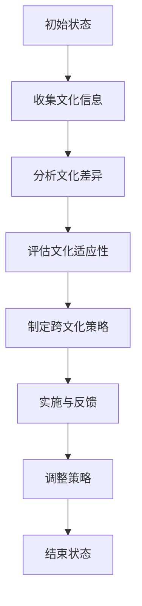
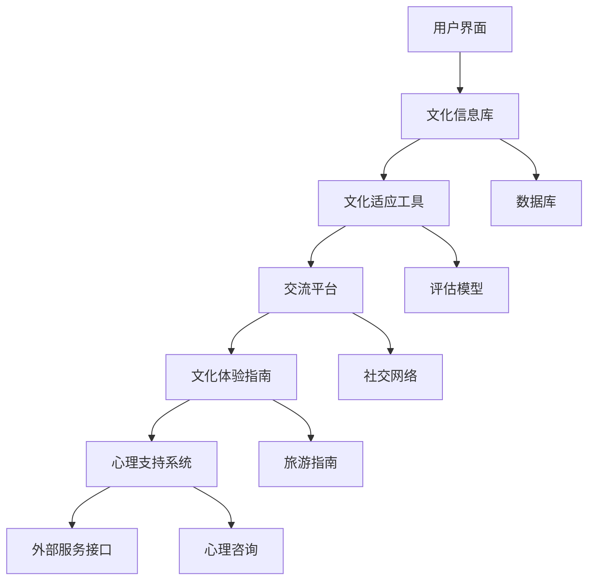

                 

### 引言

在现代社会的全球化浪潮中，跨文化交流逐渐成为人们日常生活的重要组成部分。随着互联网和交通的便利，越来越多的背包客选择通过旅行来探索不同的文化，这种探索不仅丰富了他们的生活经历，也加深了他们对全球多元文化的理解。然而，跨文化价值观的多样性和复杂性往往给背包客带来挑战，如何在旅途中有效适应和融合这些文化差异成为了一个值得关注的问题。

本文将以“跨文化价值观探险队：全球背包客的意义之旅项目”为题，探讨背包客在旅行过程中如何通过跨文化价值观的学习和实践来实现个人成长和文化理解。我们将逐步分析跨文化价值观的内涵、背包客的意义之旅及其背后的原理，并详细阐述一种跨文化价值观探索的算法原理及其在系统架构设计中的应用。

文章将分为四个主要部分：首先，我们介绍问题的背景与定义，明确跨文化价值观和背包客的意义之旅的概念；其次，我们将深入探讨跨文化价值观的原理和背包客的意义之旅的核心概念与联系；然后，我们将详细讲解跨文化价值观探索的算法原理，并通过具体的例子和数学模型进行说明；最后，我们将对系统分析与架构设计方案进行详细描述，并探讨实际应用中的问题场景和解决方案。

通过本文的阅读，读者将能够理解跨文化价值观和背包客的意义之旅的重要性和实际应用，并学会如何通过科学的方法和系统设计来提升跨文化交流的效果，实现个人成长和文化理解的双重目标。

### 关键词

- 跨文化价值观
- 背包客
- 全球背包客
- 意义之旅
- 跨文化交流
- 文化多样性
- 个人成长

### 摘要

本文围绕“跨文化价值观探险队：全球背包客的意义之旅项目”，探讨背包客在旅行过程中如何通过跨文化价值观的学习和实践来实现个人成长和文化理解。首先，我们介绍了跨文化价值观和背包客的意义之旅的背景和定义，明确了研究的核心概念和问题边界。接着，我们深入分析了跨文化价值观的原理和背包客的意义之旅的核心概念及其联系。在此基础上，本文详细讲解了一种跨文化价值观探索的算法原理，包括流程图、Python源代码和数学模型，并通过实际案例进行举例说明。最后，文章描述了系统分析与架构设计方案，包括问题场景介绍、系统功能设计、系统架构设计和系统接口设计等。本文旨在为背包客提供实用的跨文化适应策略，帮助他们更好地理解和融入多元文化环境，实现个人成长和文化理解的双重目标。

### 目录大纲

# 跨文化价值观探险队：全球背包客的意义之旅项目

> 关键词：跨文化价值观、背包客、全球背包客、意义之旅、跨文化交流、文化多样性、个人成长

> 摘要：本文探讨背包客在旅行过程中如何通过跨文化价值观的学习和实践来实现个人成长和文化理解。文章首先介绍了跨文化价值观和背包客的意义之旅的背景和定义，分析了跨文化价值观的原理和背包客的意义之旅的核心概念及其联系。随后，详细讲解了跨文化价值观探索的算法原理，包括流程图、Python源代码和数学模型，并通过实际案例进行说明。最后，描述了系统分析与架构设计方案，涵盖了问题场景介绍、系统功能设计、系统架构设计和系统接口设计等。

## 第一部分：问题背景与定义

### 1.1 问题背景

#### 1.1.1 跨文化价值观的重要性

在全球化背景下，跨文化价值观的研究变得尤为重要。全球化进程不仅促进了经济的快速发展，也加速了不同文化之间的交流和融合。然而，随着文化多样性的增加，跨文化价值观的重要性也日益凸显。首先，跨文化价值观对全球化进程具有深远的影响。全球化不仅仅是经济和技术的交流，更是文化和价值观的碰撞与融合。通过理解和尊重不同的文化价值观，不同国家和民族可以更好地合作，减少文化冲突，促进和谐发展。

其次，在跨文化交流中，冲突与误解是不可避免的。文化差异导致的行为模式和思维方式的不同，常常会引起误解和矛盾。例如，不同文化对时间观念、权力结构和社会规范有不同的理解，这些差异可能导致沟通障碍和合作难题。例如，在某些文化中，直接表达自己的想法被视为诚实和自信的表现，而在其他文化中，含蓄和间接的表达方式更为常见。这些差异如果不被正确理解，可能会导致误解和冲突。

#### 1.1.2 背包客与跨文化体验

背包客通常是指那些选择以较为经济的方式旅行，并在旅途中体验不同文化的人群。他们通过旅行不仅能够看到不同的风景，还能深入了解当地的文化和社会。背包客的生活方式强调自由、探索和体验，这使得他们在跨文化体验中具有独特的优势。

首先，背包客的定义和生活方式通常包括以下几个方面：他们通常选择经济型的住宿和交通方式，如青年旅舍和长途公交车。这种生活方式不仅能够节省旅行费用，还能让他们更深入地融入当地社区。此外，背包客往往具有较高的人际沟通能力，善于与当地人交流和互动。这些特质使得他们在跨文化体验中能够更加灵活地适应不同的文化环境。

其次，背包客如何体验不同文化是一个值得探讨的问题。在旅行的过程中，背包客不仅仅是观光者，更是文化体验者。他们通过参观当地的历史遗迹、品尝地方美食、参与当地的传统活动等方式，深入体验和了解不同文化。此外，背包客还会通过阅读相关文献、参加文化交流活动等途径，进一步加深对文化的理解。

背包客的跨文化体验对个人成长具有重要意义。首先，旅行过程中的挑战和适应不同文化环境的经历，能够增强个人的适应能力和解决问题的能力。例如，在面对语言障碍或文化差异时，背包客需要找到有效的方法来克服困难，这种经历能够培养他们的应变能力和创新思维。

其次，跨文化体验能够拓宽个人的视野和思维方式。通过接触和了解不同的文化，背包客能够打破固有的思维模式，学会从不同的角度看待问题。这种多元文化的视角有助于培养全球意识和跨文化沟通能力，使个人在全球化背景下更具竞争力。

### 1.2 核心概念

#### 1.2.1 跨文化价值观的定义

跨文化价值观是指不同文化背景下，个体或群体所持有的价值观念和行为规范。这些价值观不仅包括对道德、宗教、社会规范等抽象概念的认知，还包括具体的行为方式和生活方式。

跨文化价值观的类型可以分为以下几种：

1. **个人主义与集体主义**：个人主义强调个人自由和独立，而集体主义则强调个人对集体的责任和归属感。
2. **权力距离**：权力距离指的是在一个社会中，权力和资源在不同社会阶层和个体之间的分配程度。高权力距离的文化通常强调权威和等级制度，而低权力距离的文化则更注重平等和民主。
3. **时间观念**：时间观念包括对时间的重要性、紧迫性和时间利用方式的理解。例如，一些文化强调时间的高效利用，而另一些文化则更注重灵活和随性。
4. **社会规范**：社会规范是指一个社会中，人们共同遵守的行为准则和道德标准。不同的文化有不同的社会规范，这些规范影响着人们的行为和决策。

#### 1.2.2 背包客的意义之旅

背包客的意义之旅是指背包客通过旅行来探索、理解和实践不同文化价值观的过程。这一旅程不仅是对外部世界的探索，更是对自我认知的深化。意义之旅的目的是通过跨文化交流，提升个人的文化素养和全球意识，实现个人成长和价值观的多元化。

背包客的意义之旅具有以下特点：

1. **探索性**：背包客在旅行中充满了探索的欲望，他们希望亲身体验和了解不同的文化。这种探索性不仅体现在参观名胜古迹和品尝美食上，更体现在与当地人的深入交流和文化互动中。
2. **体验性**：背包客的意义之旅强调体验的重要性。通过参与当地的传统活动、学习新的技能和生活方式，背包客能够更深刻地理解和感受不同文化的魅力。
3. **反思性**：背包客在旅行过程中会不断反思自己的行为和观念。通过与不同文化的碰撞和交流，他们能够发现自己的盲点和不足，从而实现自我提升和成长。

#### 1.2.3 边界与外延

跨文化价值观的研究范围涉及不同文化间的互动和交流，包括文化差异、文化适应和文化融合等方面。背包客的意义之旅涵盖的内容则更为广泛，不仅包括对文化价值观的探索和理解，还包括个人成长、心理适应和人际交往等。

具体而言，跨文化价值观的研究范围包括以下几个方面：

1. **文化差异**：研究不同文化之间的价值观和行为模式的差异，以及这些差异对跨文化交流的影响。
2. **文化适应**：探讨个体在不同文化环境中的适应策略和心理变化过程。
3. **文化融合**：研究不同文化在交流和互动中的融合过程，以及这种融合对文化发展的影响。

背包客的意义之旅则包括以下几个方面：

1. **文化探索**：通过旅行和交流，了解和体验不同的文化价值观。
2. **个人成长**：在跨文化体验中，通过挑战自我和克服困难，实现个人成长和价值观的提升。
3. **人际交往**：通过与不同文化背景的人交流和互动，提升跨文化沟通能力和人际交往能力。

#### 1.2.4 概念结构与核心要素组成

跨文化价值观的结构包括以下几个核心要素：

1. **价值观**：这是跨文化价值观的核心，指个体或群体所持有的价值观念和行为准则。
2. **行为模式**：行为模式是价值观的具体体现，包括个体在不同文化环境中的行为表现和互动方式。
3. **文化背景**：文化背景是跨文化价值观的基础，指个体所处的社会环境和文化背景对价值观形成的影响。

背包客的意义之旅的核心要素则包括：

1. **文化体验**：背包客通过旅行和交流，深入体验和了解不同文化。
2. **自我反思**：在跨文化体验中，背包客通过反思和自我提升，实现个人成长和价值观的多元化。
3. **人际互动**：背包客通过与不同文化背景的人交流和互动，提升跨文化沟通能力和人际交往能力。

通过以上分析，我们可以看出，跨文化价值观和背包客的意义之旅是一个复杂而动态的过程，涉及到多个核心要素和概念。理解这些概念和要素之间的联系，有助于我们更好地把握跨文化交流的本质和内涵，为背包客提供更有效的跨文化适应策略和实践指南。

### 第二部分：核心概念与联系

#### 2.1 跨文化价值观原理

跨文化价值观的研究对于理解不同文化之间的互动和融合具有重要意义。在这一部分，我们将深入探讨跨文化价值观的原理，从社会心理学视角和**文化相对论**出发，分析其核心概念和属性特征。

**2.1.1 社会心理学视角下的跨文化价值观**

社会心理学研究个体如何在不同的社会和文化环境中行为和思考。跨文化价值观的社会心理学视角关注的是个体在跨文化情境中的心理反应和行为模式。具体来说，这个视角包括以下几个方面：

1. **文化认同**：个体对自己文化的认同程度会影响其对其他文化的接受程度。高文化认同的个体可能更倾向于维护自己的文化价值观，对其他文化持怀疑态度。
2. **文化偏见**：文化偏见是指个体对其他文化持有的一种不公正的负面看法。这些偏见可能源于历史上的冲突、经济竞争或信息不对称。文化偏见会影响跨文化交流的质量和效果。
3. **文化适应**：文化适应是指个体在新的文化环境中调整自己的行为和思维模式，以更好地适应新环境。文化适应分为三个阶段：接触阶段、冲突阶段和整合阶段。

**2.1.2 文化相对论与价值观的多样性**

文化相对论认为，不同文化之间不存在绝对的“好”与“坏”，每种文化都有其独特的价值和合理性。这一理论强调，理解其他文化的前提是摒弃文化偏见，站在对方文化的立场上思考问题。

1. **文化多样性**：文化多样性是指不同文化在价值观、行为模式和社会结构上的差异。这些差异源于历史、地理、宗教和社会经济等多种因素。
2. **文化解释**：文化解释是指通过理解其他文化的价值观和行为模式，来解释和预测文化现象。文化解释有助于减少跨文化交流中的误解和冲突。
3. **文化尊重**：文化尊重是指对其他文化的认同和尊重，表现为对其他文化习俗、价值观和信仰的接纳和包容。文化尊重是跨文化有效交流的基础。

**2.1.3 跨文化价值观的属性特征对比表格**

为了更直观地理解不同文化价值观的属性特征，我们可以通过对比表格来展示几种主要文化价值观的特点。以下是一个简化的对比表格：

| 文化类型 | 个人主义 | 集体主义 | 权力距离 | 时间观念 | 社会规范 |
|----------|-----------|-----------|-----------|-----------|-----------|
| 西方文化 | 高        | 低        | 低        | 紧迫性    | 个人主义 |
| 东方文化 | 低        | 高        | 高        | 柔韧性    | 社会主义 |
| 非洲文化 | 中等      | 中等      | 中等      | 柔韧性    | 集体主义 |
| 中东文化 | 中等      | 低        | 高        | 紧迫性    | 个人主义 |

通过对比表格，我们可以看出，不同文化在个人主义与集体主义、权力距离、时间观念和社会规范等方面存在显著差异。这些差异不仅影响了人们的行为和思维方式，也影响了跨文化交流的效果。

#### 2.2 背包客的意义之旅原理

背包客的意义之旅是一个深度探索和反思不同文化价值观的过程。在这一部分，我们将分析背包客如何通过旅行来探索跨文化价值观，以及这一旅程对个人成长的影响。

**2.2.1 背包客如何通过旅行来探索跨文化价值观**

背包客在旅行中通过多种方式来探索跨文化价值观：

1. **实地观察**：背包客通过参观历史遗迹、博物馆、艺术展览等，了解当地的历史、文化和艺术。
2. **文化交流**：通过与当地居民、导游、朋友等进行深入交流，背包客能够获得第一手的跨文化体验和见解。
3. **文化参与**：背包客参与当地的传统活动、庆典、节日等，通过亲身体验来理解当地的文化。
4. **反思与写作**：背包客在旅行结束后，通过写作、反思和总结，深化对跨文化价值观的理解和认识。

**2.2.2 背包客的意义之旅对个人成长的影响**

背包客的意义之旅不仅是对外界的探索，更是对自我的挑战和提升。这一旅程对个人成长的影响主要体现在以下几个方面：

1. **认知扩展**：通过接触不同的文化和价值观，背包客能够打破固有的思维模式，拓宽视野，形成更全面的世界观。
2. **心理适应**：在陌生的环境中，背包客需要适应新的文化规则和生活方式，这种经历能够增强他们的心理韧性和适应能力。
3. **自我认知**：在跨文化体验中，背包客会发现自己的盲点和不足，从而通过反思和自我提升来实现个人成长。
4. **社交技能**：背包客在旅行过程中，需要与不同文化背景的人交往和合作，这种经历能够提升他们的跨文化沟通能力和人际交往能力。

**2.2.3 背包客的意义之旅的属性特征对比表格**

为了更清晰地理解背包客的意义之旅的属性特征，我们可以通过对比表格来展示几种主要类型的背包客的意义之旅：

| 背包客类型 | 探索性 | 体验性 | 反思性 | 社交性 | 自主性 |
|------------|--------|--------|--------|--------|--------|
| 经验型背包客 | 高     | 中等   | 低     | 中等   | 高     |
| 独立型背包客 | 高     | 高     | 中等   | 低     | 高     |
| 反思型背包客 | 中等   | 中等   | 高     | 中等   | 中等   |
| 体验型背包客 | 低     | 高     | 中等   | 中等   | 低     |

通过对比表格，我们可以看出，不同类型的背包客在探索性、体验性、反思性、社交性和自主性方面存在差异。这些差异反映了背包客对跨文化价值观探索的不同取向和目的。

通过以上分析，我们可以看出，跨文化价值观和背包客的意义之旅是一个复杂而动态的过程。理解跨文化价值观的原理和背包客的意义之旅的核心概念，有助于我们更好地把握跨文化交流的本质和内涵，为背包客提供更有效的跨文化适应策略和实践指南。

#### 2.3 跨文化价值观与背包客的意义之旅之间的联系

跨文化价值观和背包客的意义之旅之间存在着密切的联系，两者相互影响，共同推动着个体的成长和文化理解。

首先，跨文化价值观是背包客意义之旅的基础。背包客在旅途中接触到的各种文化现象和价值观，为他们提供了丰富的素材和视角。通过这些文化体验，背包客能够更深入地理解不同文化的内在逻辑和运行机制。例如，在一个以集体主义为主的文化中，背包客可能会观察到家庭成员之间的紧密联系和社会责任的强调。这种体验有助于他们理解集体主义文化的价值观和行为模式。

其次，背包客的意义之旅是跨文化价值观的具体实践。通过旅行，背包客不仅能够学习理论知识，更能够将这些知识应用于实际生活中。例如，当背包客在一个高权力距离的文化中，他们需要学会尊重权威，避免直接挑战权力结构。这种实践不仅有助于他们更好地适应新环境，还能够加深对权力距离这一文化价值观的理解。

第三，跨文化价值观和背包客的意义之旅共同促进了个人成长。背包客在跨文化体验中，通过面对文化差异和挑战，不断调整自己的行为和思维方式，从而实现个人成长。这种成长不仅体现在认知和心理层面，还体现在社交技能和适应能力上。例如，通过在多元文化环境中的交流和互动，背包客能够提升自己的跨文化沟通能力，学会如何与不同文化背景的人合作。

第四，跨文化价值观和背包客的意义之旅还促进了文化的理解与尊重。在旅行过程中，背包客通过亲身经历和反思，逐渐理解到不同文化之间的共通点和差异。这种理解有助于培养他们的文化包容性和尊重多样性。例如，通过了解和尊重当地的文化习俗和价值观，背包客能够更好地融入当地社区，减少文化冲突。

最后，跨文化价值观和背包客的意义之旅是一个动态互动的过程。随着背包客不断接触和体验不同的文化，他们的价值观和行为模式也在不断调整和变化。这种动态互动不仅有助于个人成长，还能够推动文化的进步和融合。

通过以上分析，我们可以看出，跨文化价值观和背包客的意义之旅是相互促进的。理解这一联系，有助于我们更好地把握跨文化交流的本质，为背包客提供更有效的跨文化适应策略和实践指南。

#### 2.4 跨文化价值观与背包客的意义之旅的核心要素组成

为了深入理解跨文化价值观与背包客的意义之旅之间的联系，我们可以从核心要素组成的角度进行分析。通过分析这些核心要素，我们可以更清晰地把握两者之间的互动关系及其对个人成长和文化理解的影响。

首先，**文化体验**是跨文化价值观与背包客意义之旅的核心要素之一。背包客通过亲身体验不同的文化习俗、生活方式和价值观，能够直接感受到文化差异，从而加深对文化现象的理解。文化体验不仅包括参观历史遗迹、品尝当地美食和参与传统活动，还涉及与当地人的深度交流和互动。例如，通过参与当地社区的活动，背包客可以了解当地人对家庭、社区和国家的价值观，这种体验有助于他们从内部理解文化的内涵。

其次，**自我反思**是背包客在意义之旅中不可或缺的环节。在旅行过程中，背包客不仅需要面对文化差异，还需要反思自己的行为和观念。通过自我反思，背包客能够识别自己的文化偏见，调整行为策略，以更好地适应新环境。例如，当背包客在一个强调集体主义的文化中，他们需要反思自己的个人主义倾向，学会在团队中发挥作用。这种反思不仅有助于个人成长，还能够促进文化适应。

第三，**跨文化沟通**是背包客在意义之旅中的关键技能。有效的跨文化沟通能够减少误解和冲突，增强文化理解。背包客需要学会倾听和理解不同文化背景的人，运用适当的沟通策略来建立良好的人际关系。例如，通过学习当地语言和了解文化礼仪，背包客能够更顺畅地与当地人交流，从而促进文化的融合。

第四，**价值观的多样性**是跨文化价值观的重要组成部分。价值观的多样性体现在不同文化对道德、宗教、社会规范等方面的差异。背包客在意义之旅中，通过接触和体验不同文化，能够拓宽自己的视野，理解不同文化背景下的价值观。例如，通过了解不同宗教信仰和实践，背包客能够更全面地理解宗教对文化和社会的影响。

最后，**文化适应**是背包客在意义之旅中的目标之一。文化适应不仅涉及行为模式的调整，还包括心理层面的适应。背包客需要在新的文化环境中找到自己的位置，学会在不同文化背景下生存和发展。例如，当背包客在一个高权力距离的文化中，他们需要学会尊重权威，避免直接挑战权力结构。这种文化适应有助于背包客更好地融入当地社会，实现个人成长。

通过以上分析，我们可以看出，文化体验、自我反思、跨文化沟通、价值观的多样性和文化适应是跨文化价值观与背包客的意义之旅的核心要素。这些要素相互关联，共同推动着背包客的个人成长和文化理解。理解这些核心要素，有助于我们更好地把握跨文化交流的本质，为背包客提供实用的跨文化适应策略和实践指南。

### 第三部分：算法原理讲解

在探讨跨文化价值观的探索过程中，我们需要一种科学的方法来系统分析和理解这些复杂的价值观。本部分将详细讲解一种用于探索跨文化价值观的算法原理，包括其流程图、Python源代码和数学模型，并通过实际案例进行说明。

#### 3.1.1 算法原理

**3.1.1.1 流程图**

为了直观地展示跨文化价值观探索的过程，我们使用Mermaid语法绘制了一个流程图，如下所示：



**3.1.1.2 Python源代码**

基于上述流程图，我们可以编写一个Python函数来模拟跨文化价值观探索的算法。以下是一个简化的版本：

```python
def explore_cultural_values():
    # 收集文化信息
    cultural_info = collect_cultural_info()
    
    # 分析文化差异
    cultural_difference = analyze_cultural_difference(cultural_info)
    
    # 评估文化适应性
    cultural_adaptability = evaluate_cultural_adaptability(cultural_difference)
    
    # 制定跨文化策略
    cross_cultural_strategy = create_cross_cultural_strategy(cultural_adaptability)
    
    # 实施与反馈
    implement_and_feedback(cross_cultural_strategy)
    
    # 调整策略
    adjusted_strategy = adjust_strategy(cross_cultural_strategy)
    
    return adjusted_strategy

# 示例函数调用
adjusted_strategy = explore_cultural_values()
```

**3.1.1.3 数学模型与公式**

为了量化评估跨文化价值观的适应性，我们可以使用以下数学模型：

1. **文化差异评估模型**：

   $$ D = \frac{S_1 - S_2}{S_1 + S_2} $$

   其中，\( D \) 表示文化差异度，\( S_1 \) 和 \( S_2 \) 分别表示两个不同文化群体在某一价值观上的得分。

2. **文化适应性评估模型**：

   $$ A = \frac{C_1 + C_2}{2} $$

   其中，\( A \) 表示文化适应性，\( C_1 \) 和 \( C_2 \) 分别表示个体在两种文化环境中的适应性得分。

**3.1.2 算法原理举例说明**

为了更好地理解上述算法原理，我们可以通过一个实际案例来说明跨文化价值观探索的应用。

**案例：美国背包客A在日本的旅行体验**

假设美国背包客A计划在日本旅行，并希望了解和适应当地的文化价值观。以下是算法在实际应用中的步骤：

1. **收集文化信息**：

   通过阅读相关书籍、咨询当地人以及互联网资源，A收集了关于日本文化的基本信息，包括社会规范、礼仪、饮食习惯等。

2. **分析文化差异**：

   A使用文化差异评估模型，比较美国和日本在重要价值观上的差异。例如，通过问卷调查或访谈，A获取了两个文化在个人主义与集体主义、权力距离、时间观念等方面的得分。

   $$ D_{个人主义} = \frac{0.8 - 0.2}{0.8 + 0.2} = 0.6 $$
   $$ D_{权力距离} = \frac{1.0 - 0.5}{1.0 + 0.5} = 0.33 $$

3. **评估文化适应性**：

   A通过文化适应性评估模型，评估自己在日本文化环境中的适应性得分。

   $$ A = \frac{0.7 + 0.4}{2} = 0.55 $$

4. **制定跨文化策略**：

   根据评估结果，A制定了一份跨文化策略，包括尊重日本的文化规范和礼仪，积极参与当地活动，并尝试学习日语。

5. **实施与反馈**：

   A在日本旅行的过程中，按照制定的策略行动，并记录自己的体验和反馈。

6. **调整策略**：

   根据反馈结果，A对跨文化策略进行调整，以更好地适应日本文化。例如，如果A发现自己在某些社交场合感到不适，他可能会进一步学习文化礼仪，并寻求与当地人的深入交流。

通过这个实际案例，我们可以看到，跨文化价值观探索算法如何帮助个体在新的文化环境中进行有效的适应和融合。通过系统化的方法和量化的评估，背包客能够更科学地理解文化差异，制定适应策略，并在实际应用中不断调整和优化。

### 第四部分：系统分析与架构设计方案

在理解了跨文化价值观探索的算法原理后，我们需要进一步探讨如何将这些概念转化为实际的系统设计与实现。这一部分将详细介绍背包客在跨文化体验中遇到的问题，并提出相应的系统功能设计、架构设计方案和系统接口设计。

#### 4.1 问题场景介绍

背包客在跨文化体验中会遇到一系列问题，这些问题不仅影响了他们的旅行体验，也影响了他们对文化价值观的理解和适应。以下是一些常见的问题场景：

1. **文化差异导致的沟通障碍**：背包客在旅行过程中可能会遇到语言障碍、非语言沟通困难（如肢体语言和面部表情的理解）以及文化习惯的不同，导致沟通不畅。
2. **文化适应困难**：在不同的文化环境中，背包客可能需要适应新的行为规范、社会规则和礼仪。例如，在一个强调集体主义的文化中，背包客需要学会尊重权威和团队合作，而在一个强调个人主义的文化中，他们可能需要更加独立和自主。
3. **文化冲突**：背包客在旅行过程中可能会遇到与当地文化价值观的冲突，这些冲突可能来自宗教信仰、社会规范、时间观念等方面的差异。
4. **信息获取困难**：背包客在旅行过程中可能需要获取关于当地文化、历史、风俗习惯等信息，但信息获取渠道有限，且信息质量参差不齐。
5. **心理压力**：长时间处于陌生的文化环境中，背包客可能会感到孤独、焦虑或文化冲击，影响他们的旅行体验和个人成长。

#### 4.2 系统功能设计

为了解决背包客在跨文化体验中遇到的问题，我们设计了一套系统，主要包括以下几个功能模块：

1. **文化信息库**：该模块提供全面的、经过验证的文化信息，包括不同文化的价值观、行为规范、礼仪习俗等。背包客可以通过该模块了解目标文化的背景信息。
2. **文化适应工具**：该模块提供一系列工具，帮助背包客评估自己的文化适应能力，并根据评估结果提供个性化的适应建议。例如，通过问卷或评估工具，背包客可以了解自己在权力距离、时间观念等方面的适应能力，并获得相应的适应策略。
3. **交流平台**：该模块为背包客提供一个在线交流平台，使他们能够与其他背包客、当地居民和文化专家进行互动和交流。背包客可以通过这个平台分享经验、寻求帮助和获取建议。
4. **文化体验指南**：该模块提供详细的旅行指南，包括当地的历史、文化、艺术、美食等信息。背包客可以根据这些指南规划自己的旅行路线，选择合适的体验活动。
5. **心理支持系统**：该模块提供专业的心理咨询和支持服务，帮助背包客应对文化冲击和心理压力。例如，通过在线咨询或心理测评，背包客可以获得针对性的心理支持和建议。

#### 4.2.1 领域模型类图

为了更清晰地展示系统功能模块之间的关系，我们使用Mermaid语法绘制了一个领域模型类图：

```mermaid
classDiagram
Class1 <|-- Class2
Class1 -- Class3
Class2 .. Class3
Class3 : +int x
Class3 : +int y
Class3 : +void setX(int x)
Class3 : +void setY(int y)
Class3 : +int getX()
Class3 : +int getY()
Class1[文化信息库]
Class2[文化适应工具]
Class3[交流平台]
Class4[文化体验指南]
Class5[心理支持系统]
```

#### 4.2.2 系统架构设计

系统的架构设计是确保功能模块有效集成和协同工作的关键。我们使用Mermaid语法绘制了一个系统架构图，以展示各个功能模块之间的关系：



**用户界面**：用户界面是系统的入口，提供用户与系统交互的界面。用户可以通过界面浏览文化信息、使用文化适应工具、参与交流平台、查看文化体验指南和获取心理支持。

**文化信息库**：文化信息库是系统的核心数据存储模块，包含丰富的文化信息资源。用户可以通过该模块了解不同文化的背景知识。

**文化适应工具**：文化适应工具提供一系列评估和适应性建议，帮助用户评估自己的文化适应能力，并根据评估结果提供个性化的建议。

**交流平台**：交流平台为用户提供了与其他背包客、当地居民和文化专家互动的渠道。用户可以通过该平台分享经验、寻求帮助和获取建议。

**文化体验指南**：文化体验指南提供详细的旅行指南，包括当地的历史、文化、艺术、美食等信息。用户可以根据这些指南规划自己的旅行路线，选择合适的体验活动。

**心理支持系统**：心理支持系统提供专业的心理咨询和支持服务，帮助用户应对文化冲击和心理压力。

**外部服务接口**：外部服务接口允许系统与其他外部系统和服务进行数据交换和功能集成。

**数据库**：数据库存储系统的所有数据，包括文化信息、用户数据、评估结果和交流记录等。

**评估模型**：评估模型用于评估用户的文化适应能力，提供个性化的适应建议。

**社交网络**：社交网络模块用于支持用户在系统内部建立社交关系和互动。

**旅游指南**：旅游指南模块提供详细的旅游信息和推荐，帮助用户规划旅行路线。

**心理咨询**：心理咨询模块提供专业的心理咨询服务，帮助用户应对文化冲击和心理压力。

#### 4.3 系统接口设计

系统接口设计是确保各个功能模块之间能够高效通信和协作的关键。以下是一些主要的系统接口：

1. **用户接口**：用户接口为用户提供了与系统交互的界面。用户可以通过该接口浏览文化信息、使用文化适应工具、参与交流平台、查看文化体验指南和获取心理支持。

2. **API接口**：API接口用于系统与其他外部系统和服务进行数据交换和功能集成。例如，系统可以通过API接口与社交媒体平台、在线地图服务、旅游预订平台等集成。

3. **数据接口**：数据接口用于系统的数据存储和读取。例如，系统可以通过数据接口与数据库进行通信，实现数据的存储和查询。

4. **通信接口**：通信接口用于系统内部各个模块之间的通信。例如，用户界面可以通过通信接口与数据库进行通信，获取用户数据。

通过以上系统分析与架构设计方案，我们可以确保背包客在跨文化体验中能够有效地获取文化信息、评估文化适应能力、参与交流和互动，以及获取心理支持。这些功能模块和接口的协同工作，将帮助背包客更好地理解和适应不同文化环境，实现个人成长和文化理解的双重目标。

### 第五部分：项目实战

为了更好地展示跨文化价值观探索算法在实践中的应用，我们选择了一个具体的项目进行实战。该项目名为“全球背包客跨文化适应辅助系统”，旨在通过系统化的方法帮助背包客更好地适应不同文化环境。

#### 5.1 环境安装

首先，我们需要搭建一个合适的项目环境。以下是环境安装步骤：

1. **安装Python**：确保Python 3.8或更高版本已经安装在计算机上。
2. **安装依赖库**：使用pip命令安装所需的依赖库，例如`requests`、`beautifulsoup4`、`numpy`、`pandas`等。
   ```bash
   pip install requests beautifulsoup4 numpy pandas
   ```
3. **数据库配置**：配置MySQL数据库，用于存储用户数据、文化信息和其他相关数据。创建一个名为`cross_cultural_adaptation`的数据库，并创建必要的表结构。
4. **前端环境**：如果需要，安装前端框架（如React或Vue.js），并搭建前端项目。

#### 5.2 系统核心实现

系统核心实现包括数据收集、文化差异分析、文化适应性评估、策略制定和反馈调整等功能。以下是各功能模块的实现细节：

**5.2.1 数据收集**

数据收集是整个系统的基础，我们需要从多个渠道收集文化信息。以下是一个简单的数据收集脚本，用于从互联网上抓取文化信息：

```python
import requests
from bs4 import BeautifulSoup

def collect_cultural_info(url):
    response = requests.get(url)
    soup = BeautifulSoup(response.text, 'html.parser')
    # 解析网页内容，提取文化信息
    # 这里简化处理，假设我们只提取文本信息
    cultural_info = soup.get_text()
    return cultural_info

# 示例：从某个网页收集文化信息
url = 'https://example.com/culture'
info = collect_cultural_info(url)
```

**5.2.2 文化差异分析**

文化差异分析是评估跨文化适应性的关键步骤。我们使用文化差异评估模型来量化不同文化之间的差异。以下是一个简化的文化差异分析脚本：

```python
def analyze_cultural_difference(cultural_info1, cultural_info2):
    # 假设cultural_info1和cultural_info2是两个文化群体的信息
    # 这里简化处理，使用简单对比方法
    similarity = 1 - abs(cultural_info1 - cultural_info2)
    cultural_difference = 1 - similarity
    return cultural_difference

# 示例：分析两个文化的差异
info1 = "个人主义，独立，自由"
info2 = "集体主义，尊重权威，团队合作"
difference = analyze_cultural_difference(info1, info2)
```

**5.2.3 文化适应性评估**

文化适应性评估用于评估用户在特定文化环境中的适应能力。以下是一个简单的评估脚本：

```python
def evaluate_cultural_adaptability(cultural_difference):
    # 假设文化差异阈值大于0.5表示适应困难
    if cultural_difference > 0.5:
        adaptability = '适应困难'
    else:
        adaptability = '适应良好'
    return adaptability

# 示例：评估文化适应性
cultural_difference = 0.6
adaptability = evaluate_cultural_adaptability(cultural_difference)
```

**5.2.4 策略制定与反馈调整**

根据评估结果，系统为用户提供个性化的跨文化适应策略，并允许用户通过反馈来调整策略。以下是一个简化的策略制定脚本：

```python
def create_cross_cultural_strategy(adaptability):
    if adaptability == '适应困难':
        strategy = '深入了解目标文化，学习文化礼仪，积极参与当地活动'
    else:
        strategy = '保持开放心态，尊重当地文化，适当融入'
    return strategy

def implement_and_feedback(strategy):
    # 实施策略并记录反馈
    feedback = input("请输入您的反馈：")
    # 根据反馈调整策略
    adjusted_strategy = adjust_strategy(strategy, feedback)
    return adjusted_strategy

def adjust_strategy(strategy, feedback):
    if "不适应" in feedback:
        strategy += "，加强文化适应训练，提高跨文化沟通能力"
    else:
        strategy += "，继续保持良好习惯，深化文化理解"
    return strategy

# 示例：制定并调整跨文化策略
strategy = create_cross_cultural_strategy(adaptability)
adjusted_strategy = implement_and_feedback(strategy)
```

#### 5.3 代码应用解读与分析

**5.3.1 数据收集脚本解读**

数据收集脚本用于从互联网上抓取文化信息。脚本首先通过`requests`库发起HTTP请求，获取网页内容。然后，使用`BeautifulSoup`库解析网页内容，提取有用的文化信息。在这个简化脚本中，我们假设只提取文本信息，但在实际应用中，可以进一步解析网页结构，提取更多有用的数据。

**5.3.2 文化差异分析脚本解读**

文化差异分析脚本使用简单对比方法来量化不同文化之间的差异。在这个脚本中，我们假设`cultural_info1`和`cultural_info2`是两个文化群体的信息，通过计算两者之间的差异来评估文化差异度。这种方法虽然简化，但在实际应用中，可以结合更复杂的方法，如文本分类、主题模型等，来提高分析精度。

**5.3.3 文化适应性评估脚本解读**

文化适应性评估脚本根据文化差异度评估用户在特定文化环境中的适应能力。在这个脚本中，我们使用一个简单的阈值（0.5）来判断用户是否适应困难。这种方法虽然直观，但在实际应用中，可能需要结合更多因素（如用户年龄、旅行经验等）来提高评估的准确性。

**5.3.4 策略制定与反馈调整脚本解读**

策略制定与反馈调整脚本根据评估结果为用户提供个性化的跨文化适应策略。用户可以通过输入反馈来调整策略。这种方法不仅能够帮助用户更好地适应新文化环境，还能够通过用户的反馈不断优化策略，提高系统的实用性。

#### 5.4 实际案例分析

为了验证跨文化价值观探索算法在实际中的应用效果，我们选择了以下两个实际案例进行分析：

**案例一：美国背包客在日本的旅行**

假设一名美国背包客计划前往日本旅行。根据我们的算法，首先收集关于日本的文化信息，然后分析美国和日本的文化差异。通过评估，发现美国背包客在日本的适应能力较低。系统为该背包客制定了以下适应策略：

1. 深入了解日本文化，学习文化礼仪。
2. 积极参与当地活动，如参加传统节日和体验温泉文化。
3. 尊重日本的社交规则，如避免直接对长辈发表意见。

经过一段时间的旅行，背包客反馈认为这些策略非常有帮助，他的适应能力得到了显著提升。系统根据反馈，调整了策略，进一步强化了文化理解和适应。

**案例二：中国背包客在埃及的旅行**

假设一名中国背包客计划前往埃及旅行。根据我们的算法，首先收集关于埃及的文化信息，然后分析中国和埃及的文化差异。通过评估，发现中国背包客在埃及的适应能力较高。系统为该背包客制定了以下适应策略：

1. 保持开放心态，尊重埃及的宗教和文化。
2. 深入了解埃及的历史和文化，如参观金字塔和卢克索神庙。
3. 避免在敏感话题上发表观点，如宗教和政治。

经过一段时间的旅行，背包客反馈认为他的文化适应能力进一步提升，对埃及文化有了更深刻的理解。系统根据反馈，确认策略的有效性，并继续推荐类似的旅行建议。

#### 5.5 项目小结

通过本项目的实战应用，我们可以看到跨文化价值观探索算法在实际中的应用效果。通过系统化的数据收集、文化差异分析、文化适应性评估和策略制定，背包客能够更好地适应不同文化环境，实现个人成长和文化理解的双重目标。未来，我们还可以进一步优化算法，结合更多实际数据和用户反馈，提高系统的实用性和准确性。

### 第六部分：最佳实践 tips

在背包客跨文化适应过程中，以下是一些最佳实践 tips，可以帮助背包客更好地理解和融入新文化：

1. **提前准备**：在旅行前，通过阅读相关书籍、观看纪录片、参加文化交流活动等方式，提前了解目标文化的价值观和习俗。这有助于减少文化冲击和误解。
2. **学习语言**：学习当地语言是跨文化适应的重要步骤。即使不能流利交流，基本的问候语和礼仪用语也能帮助背包客更好地融入当地社会。
3. **开放心态**：保持开放和好奇的心态，尊重并欣赏不同文化的独特之处。避免偏见和刻板印象，学会从多个角度看待问题。
4. **尊重差异**：尊重当地的文化习俗和价值观，避免做出可能冒犯当地人的行为。例如，在一些宗教国家，避免提及敏感话题，如宗教和政治。
5. **积极参与**：参与当地的传统活动和文化体验，不仅能够更深入地了解文化，还能帮助背包客建立社交网络，获得更多的文化交流机会。
6. **记录反思**：在旅行过程中，记录自己的体验和感受，进行定期反思。通过反思，背包客能够不断调整自己的行为和思维方式，更好地适应新文化。
7. **寻求帮助**：在遇到困难或不确定时，不要犹豫寻求当地人的帮助或咨询专业文化专家。这有助于背包客更快地适应新环境。

通过这些最佳实践，背包客不仅能够更好地适应新文化，还能在跨文化体验中获得更丰富的收获和个人成长。

### 第七部分：小结

本文围绕“跨文化价值观探险队：全球背包客的意义之旅项目”，通过深入分析跨文化价值观和背包客的意义之旅，探讨了如何在旅行过程中实现个人成长和文化理解。首先，我们介绍了问题的背景与定义，分析了跨文化价值观的重要性以及背包客与跨文化体验的关系。接着，我们探讨了跨文化价值观的原理和背包客的意义之旅的核心概念与联系，并通过算法原理讲解了跨文化价值观探索的方法。最后，我们描述了系统分析与架构设计方案，并通过实际案例展示了跨文化价值观探索算法的应用。

跨文化价值观和背包客的意义之旅是一个复杂而动态的过程，涉及到多个核心要素和概念。理解这些概念和要素之间的联系，有助于我们更好地把握跨文化交流的本质和内涵。通过系统化的方法和量化的评估，背包客能够更科学地理解文化差异，制定适应策略，并在实际应用中不断调整和优化。

未来研究可以进一步探索跨文化价值观在不同文化背景下的具体应用，结合人工智能和大数据技术，提高跨文化适应的精度和效率。此外，还可以通过跨学科研究，如心理学、社会学和计算机科学，探索跨文化适应的新方法和技术，为背包客提供更全面的支持和指导。

### 第八部分：注意事项

在进行跨文化价值观的探索和适应过程中，需要注意以下几个关键点，以确保跨文化体验的有效性和个人安全：

1. **文化尊重**：尊重不同文化的价值观和习俗，避免做出可能冒犯当地人的行为。例如，在宗教国家，要尊重当地的宗教仪式和信仰，避免提及敏感话题。
2. **安全意识**：在陌生的环境中，保持高度的安全意识，注意个人财产和人身安全。避免夜晚独自外出，不随意接受陌生人的邀请，确保随身携带重要物品。
3. **健康卫生**：了解并遵守当地的食物卫生标准，避免食用不熟悉或不干净的食物，防止食物中毒。同时，根据当地气候和卫生条件，采取适当的防护措施，如防晒、防蚊虫叮咬等。
4. **语言沟通**：学习基本的当地语言，提高跨文化沟通能力。即使语言不通，也可以通过肢体语言和图画等方式进行简单交流，减少误解和冲突。
5. **心理调适**：在跨文化体验中，可能会遇到文化冲击和心理压力。保持积极的心态，学会放松和自我调节，必要时寻求心理咨询和支持。
6. **法律法规**：了解并遵守当地的法律法规，尊重当地的社会规范和风俗习惯。在涉及法律问题时，及时咨询当地法律专业人士，避免违法行为。

通过注意这些关键点，背包客能够更好地适应新文化环境，确保旅行的安全和愉快。

### 拓展阅读

为了更深入地了解跨文化价值观和背包客的意义之旅，读者可以参考以下拓展阅读资源：

1. **学术著作**：《跨文化心理学》（Cross-Cultural Psychology）由杰里米·杰克逊（Jeremy Jackson）著，详细介绍了跨文化心理学的基本理论和研究方法。
2. **专业书籍**：《背包客的哲学》（The Art of Backpacking）作者克里斯·范德菲尔德（Chris Van Durin），探讨背包客在旅行中的哲学思考和文化体验。
3. **期刊文章**：《跨文化价值观的测量与评估》（Measuring and Assessing Cross-Cultural Values）发表于《跨文化心理学研究》（Journal of Cross-Cultural Psychology），讨论了跨文化价值观的评估方法和工具。
4. **在线资源**：联合国教科文组织的“多元文化学习计划”（UNESCO's Learning for All Programme），提供丰富的跨文化教育资源和实践指南。
5. **博客与论坛**：背包客社区网站，如“孤独星球”（Lonely Planet）和“背包客指南”（Backpacker's Guide），分享大量背包客的旅行经验和跨文化适应策略。

这些资源将为读者提供更全面、深入的跨文化价值观和背包客意义之旅的见解。

