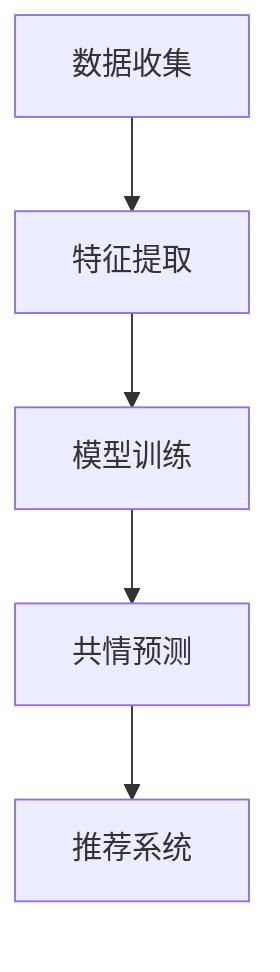
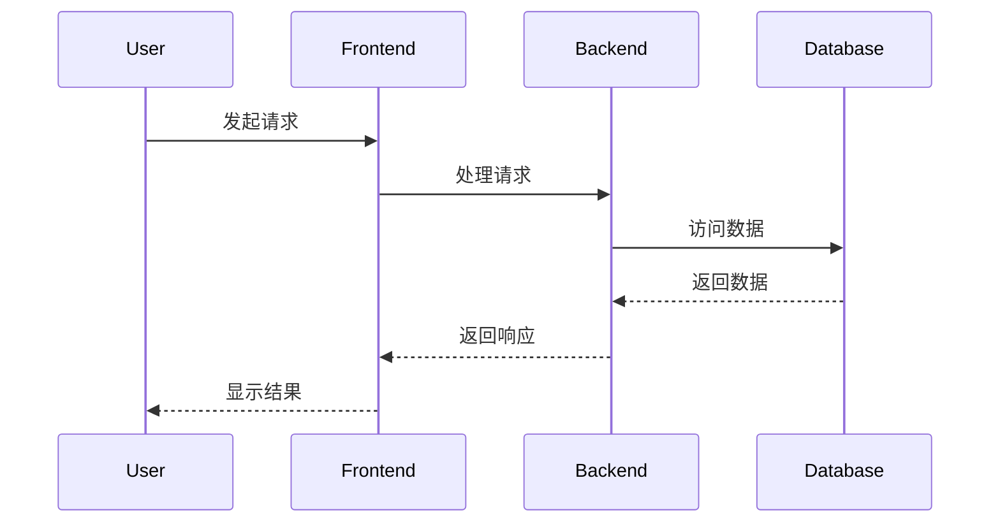
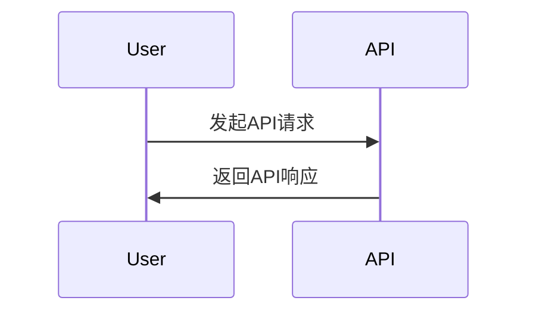
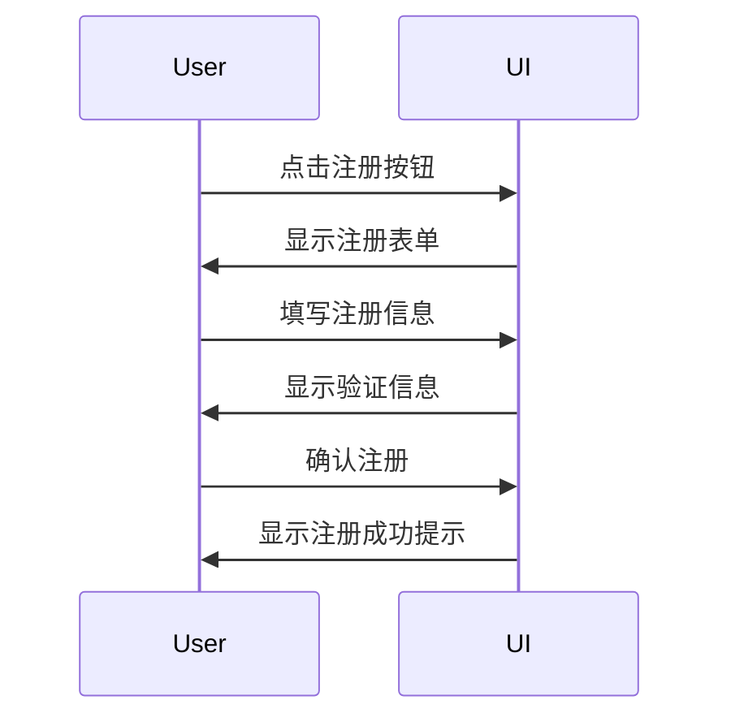

                 

### 文章标题

### 关键词

- 跨文化共情
- 社交网络
- 全球化
- 数据挖掘
- 人工智能

### 摘要

在全球化的背景下，跨文化交流变得越来越重要。本文旨在探讨如何通过构建一个跨文化共情平台来促进全球理解的社交网络。本文首先介绍了跨文化共情的概念与重要性，随后分析了全球化背景下的跨文化挑战。接着，文章探讨了社交网络在促进跨文化共情中的作用，并阐述了跨文化共情平台的设计理念和功能架构。通过数据预处理算法、跨文化共情算法原理以及系统分析与架构设计的详细讲解，本文为构建一个有效的跨文化共情平台提供了全面的技术指南。此外，通过实际项目实战和最佳实践分析，本文进一步展示了如何将理论应用于实际场景，以实现全球理解的社交网络。

## 目录大纲

# 跨文化共情平台：促进全球理解的社交网络

## 第一部分：问题背景与核心概念

## 第1章：问题背景与核心概念

### 1.1 跨文化共情的概念与重要性

### 1.2 全球化背景下的跨文化挑战

### 1.3 社交网络对跨文化共情的作用

### 1.4 跨文化共情平台的设计理念

### 1.5 本章小结

## 第二部分：核心概念与联系

## 第2章：核心概念原理

### 2.1 跨文化认知的心理学原理

#### 2.1.1 跨文化认知的基础

#### 2.1.2 跨文化认知的差异与共性

#### 2.1.3 跨文化认知的影响因素

### 2.2 跨文化沟通的技巧与策略

#### 2.2.1 沟通中的文化敏感性

#### 2.2.2 沟通中的文化适应性

#### 2.2.3 跨文化沟通的案例分析

### 2.3 跨文化教育的理论与实践

#### 2.3.1 跨文化教育的目标与原则

#### 2.3.2 跨文化教育的方法与工具

#### 2.3.3 跨文化教育的案例分析

### 2.4 跨文化共情平台的功能架构

#### 2.4.1 功能模块划分

#### 2.4.2 数据处理与挖掘

#### 2.4.3 用户交互与反馈

## 2.5 本章小结

## 第三部分：算法原理讲解

## 第3章：算法原理

### 3.1 数据预处理算法

#### 3.1.1 数据清洗

#### 3.1.2 数据标准化

#### 3.1.3 特征提取

### 3.2 跨文化共情算法原理

#### 3.2.1 算法概述

#### 3.2.2 算法数学模型

#### 3.2.3 算法流程图

### 3.3 跨文化共情算法实现

#### 3.3.1 Python代码实现

#### 3.3.2 示例分析

#### 3.3.3 性能评估

## 3.4 本章小结

## 第四部分：系统分析与架构设计

## 第4章：系统分析与架构设计

### 4.1 问题场景介绍

#### 4.1.1 跨文化共情平台的应用场景

#### 4.1.2 平台需求分析

### 4.2 系统功能设计

#### 4.2.1 领域模型设计

#### 4.2.2 系统功能模块划分

### 4.3 系统架构设计

#### 4.3.1 系统架构概述

#### 4.3.2 系统模块交互

#### 4.3.3 数据流设计

### 4.4 系统接口设计与交互

#### 4.4.1 接口设计原则

#### 4.4.2 接口实现与调用

#### 4.4.3 用户交互设计

## 4.5 本章小结

## 第五部分：项目实战

## 第5章：项目实战

### 5.1 环境安装与配置

#### 5.1.1 开发环境搭建

#### 5.1.2 数据集准备

### 5.2 系统核心实现

#### 5.2.1 数据预处理实现

#### 5.2.2 跨文化共情算法实现

#### 5.2.3 用户交互实现

### 5.3 代码应用解读与分析

#### 5.3.1 代码结构分析

#### 5.3.2 代码功能实现

#### 5.3.3 性能分析与优化

### 5.4 实际案例分析与讲解

#### 5.4.1 案例背景

#### 5.4.2 案例分析与解决方案

#### 5.4.3 案例总结与启示

### 5.5 项目小结

## 第六部分：最佳实践与拓展

## 第6章：最佳实践与拓展

### 6.1 跨文化共情平台的最佳实践

#### 6.1.1 设计原则与实践

#### 6.1.2 技术实现策略

#### 6.1.3 用户反馈与优化

### 6.2 拓展领域与应用前景

#### 6.2.1 跨文化共情在其他领域的应用

#### 6.2.2 跨文化共情平台的发展趋势

#### 6.2.3 未来展望与挑战

### 6.3 本章小结

## 作者信息

### 作者：AI天才研究院/AI Genius Institute & 禅与计算机程序设计艺术 /Zen And The Art of Computer Programming

---

**文章正文部分将在接下来的章节中逐步展开，敬请期待。**

---

## 第一部分：问题背景与核心概念

### 1.1 跨文化共情的概念与重要性

在当今全球化的时代，跨文化交流已经成为人类社会不可避免的一部分。然而，不同文化之间的差异和隔阂常常导致误解、冲突甚至歧视。为了弥合这些文化鸿沟，跨文化共情应运而生。跨文化共情是指在不同文化背景下，个体能够理解、感知并共鸣他人的情感、思想和行为的一种能力。

跨文化共情的重要性在于它能够促进不同文化之间的理解、尊重和包容。通过共情，人们能够超越表面的语言和符号，深入理解他人的内心世界，从而减少误解和冲突。具体来说，跨文化共情的重要性体现在以下几个方面：

1. **促进国际交流与合作**：在全球化的背景下，跨文化共情能够帮助不同文化背景的人更好地沟通与合作，推动国际交流的深入发展。

2. **消除歧视与偏见**：跨文化共情有助于打破文化壁垒，消除对不同文化的歧视与偏见，构建一个多元和谐的社会。

3. **增强文化自信**：通过跨文化共情，个体能够更加深入地了解自己的文化，增强文化自信，促进文化传承和发展。

4. **提升个人素质**：跨文化共情能力的培养有助于提升个人的综合素质，使其在全球化背景下更具竞争力。

### 1.2 全球化背景下的跨文化挑战

全球化进程的加快，使得不同文化之间的交流日益频繁。然而，这也带来了一系列的跨文化挑战，主要包括以下几个方面：

1. **语言障碍**：语言是文化的重要载体，不同文化背景的人可能存在语言障碍，导致沟通不畅。

2. **文化差异**：不同文化在价值观、行为规范、宗教信仰等方面存在差异，这些差异可能导致误解和冲突。

3. **信息不对称**：由于文化差异，不同文化背景的人可能在信息的获取和理解上存在不对称，影响沟通效果。

4. **价值观冲突**：不同文化背景下的人可能有不同的价值观，这些价值观之间的冲突可能导致文化冲突。

### 1.3 社交网络对跨文化共情的作用

社交网络作为现代信息技术的重要组成部分，在促进跨文化共情方面发挥着重要作用。具体来说，社交网络在以下几个方面对跨文化共情产生积极影响：

1. **打破地域限制**：社交网络使人们能够跨越地域限制，与世界各地的人进行交流，拓展视野。

2. **促进信息传播**：社交网络能够快速传播信息，使不同文化之间的交流更加便捷，有助于消除信息不对称。

3. **提高文化意识**：社交网络上的文化内容丰富多样，人们可以通过观看、阅读和参与这些内容，提高自己的文化意识，增进对不同文化的理解。

4. **增强共情能力**：社交网络为人们提供了一个平台，可以分享自己的经历和感受，增进对他人的理解和共鸣。

### 1.4 跨文化共情平台的设计理念

为了更好地促进全球理解的社交网络，需要构建一个跨文化共情平台。该平台的设计理念主要包括以下几个方面：

1. **用户为中心**：平台应充分关注用户需求，提供个性化服务，满足用户在跨文化共情方面的需求。

2. **技术驱动**：利用现代信息技术，如大数据、人工智能等，为跨文化共情提供技术支持，提高平台的效率和效果。

3. **多元文化包容**：平台应尊重和包容不同文化，提供多样化的文化内容，促进文化之间的交流与融合。

4. **互动性**：平台应提供丰富的互动功能，鼓励用户参与，增强用户之间的交流和共情。

### 1.5 本章小结

本章介绍了跨文化共情的概念与重要性，分析了全球化背景下的跨文化挑战，探讨了社交网络在促进跨文化共情中的作用，并阐述了跨文化共情平台的设计理念。通过本章的介绍，为后续章节的详细讨论奠定了基础。

## 第二部分：核心概念与联系

### 2.1 跨文化认知的心理学原理

跨文化认知是指在跨文化交往过程中，个体如何理解、处理和评价来自不同文化背景的信息和行为。心理学原理在跨文化认知中扮演了关键角色，帮助我们深入理解文化差异及其影响。以下是跨文化认知的几个核心心理学原理：

#### 2.1.1 跨文化认知的基础

1. **社会认知**：社会认知理论强调个体如何通过社会互动来获取和解释信息。跨文化认知依赖于个体对社会规范、价值观和行为准则的理解。

2. **文化认同**：文化认同是个体对所属文化的认知和情感归属。它影响个体在跨文化情境中的行为选择和认知过程。

#### 2.1.2 跨文化认知的差异与共性

1. **文化差异**：不同文化在价值观、沟通风格、行为规范等方面存在显著差异。这些差异可能导致跨文化误解和冲突。

2. **文化共性**：尽管文化差异显著，但不同文化也存在着一定的共性，如普遍存在的家庭价值观、尊重他人的理念等。这些共性有助于跨文化沟通和理解。

#### 2.1.3 跨文化认知的影响因素

1. **文化认知偏差**：文化认知偏差是个体基于自身文化背景对其他文化的评价和认知。这种偏差可能影响跨文化共情和沟通。

2. **语言障碍**：语言是文化的重要载体。语言障碍可能阻碍跨文化沟通，导致信息误解。

3. **个人经验**：个人经验对跨文化认知具有重要影响。个体过去的文化接触经历会影响其对当前跨文化情境的认知和处理。

### 2.2 跨文化沟通的技巧与策略

跨文化沟通是指在不同文化背景下进行的交流过程。有效的跨文化沟通需要理解和运用一系列技巧和策略，以克服文化差异和语言障碍，促进理解与合作。以下是几个关键的跨文化沟通技巧和策略：

#### 2.2.1 沟通中的文化敏感性

1. **文化敏感性培训**：通过培训提高个体对文化差异的敏感度，使其在跨文化沟通中能够主动识别和适应不同的文化规范。

2. **尊重差异**：在跨文化沟通中，尊重对方的文化差异是建立信任和合作关系的基础。

#### 2.2.2 沟通中的文化适应性

1. **适应性沟通**：根据对方的文化背景调整沟通风格和内容，以更好地传达信息和建立联系。

2. **文化背景调查**：在跨文化沟通前，了解对方的文化背景和偏好，有助于提高沟通效果。

#### 2.2.3 跨文化沟通的案例分析

1. **成功案例**：分析成功的跨文化沟通案例，了解其在实际操作中的应用和效果。

2. **失败案例**：通过分析失败的跨文化沟通案例，总结教训，避免在未来的沟通中重复错误。

### 2.3 跨文化教育的理论与实践

跨文化教育是一种旨在提高个体跨文化认知和沟通能力的教育方法。它不仅关注知识传授，还注重实践技能的培养。以下是跨文化教育的几个关键方面：

#### 2.3.1 跨文化教育的目标与原则

1. **教育目标**：跨文化教育的目标是培养具有全球视野、跨文化认知和沟通能力的个体。

2. **教育原则**：包括尊重多元文化、促进文化理解、培养文化适应能力等。

#### 2.3.2 跨文化教育的方法与工具

1. **文化敏感性培训**：通过培训课程、研讨会等形式，提高个体的文化敏感性。

2. **文化交流活动**：组织文化交流活动，如国际学生交流、文化节等，增进不同文化之间的了解和交流。

3. **跨文化学习平台**：开发跨文化学习平台，提供丰富的文化资源和互动学习工具。

#### 2.3.3 跨文化教育的案例分析

1. **学校案例**：分析学校在跨文化教育方面的成功实践，总结经验。

2. **企业案例**：探讨企业在跨文化培训和管理方面的做法，为其他企业提供借鉴。

### 2.4 跨文化共情平台的功能架构

跨文化共情平台是一个集成了多种技术和功能的综合性平台，旨在促进跨文化共情和理解。以下是跨文化共情平台的功能架构：

#### 2.4.1 功能模块划分

1. **用户模块**：包括用户注册、登录、个人信息管理等功能。

2. **内容模块**：提供多样化的文化内容，包括文章、视频、音频等。

3. **互动模块**：包括论坛、聊天室、投票等功能，促进用户之间的交流和互动。

4. **数据模块**：用于数据收集、存储、分析和挖掘。

#### 2.4.2 数据处理与挖掘

1. **数据收集**：通过用户行为、内容互动等途径收集数据。

2. **数据分析**：使用数据挖掘技术分析用户行为和内容，发现文化共情的规律。

3. **数据可视化**：将分析结果以图表、报表等形式可视化，便于用户理解和利用。

#### 2.4.3 用户交互与反馈

1. **用户界面设计**：设计直观、易用的用户界面，提高用户体验。

2. **用户反馈机制**：建立用户反馈机制，收集用户意见和建议，不断优化平台功能。

### 2.5 本章小结

本章深入探讨了跨文化认知的心理学原理，介绍了跨文化沟通的技巧与策略，以及跨文化教育的理论与实践。此外，还详细阐述了跨文化共情平台的功能架构，为构建一个有效的跨文化共情平台提供了理论基础和实际指导。

## 第三部分：算法原理讲解

### 3.1 数据预处理算法

数据预处理是任何数据驱动应用的关键步骤，特别是在构建跨文化共情平台时，数据预处理尤为重要。这一部分将介绍跨文化共情平台中的数据预处理算法，包括数据清洗、数据标准化和特征提取。

#### 3.1.1 数据清洗

数据清洗是数据预处理的首要任务，其目的是识别和纠正数据集中的错误和不一致。在跨文化共情平台中，数据清洗主要包括以下步骤：

1. **缺失值处理**：对于缺失的数据，可以采用填充均值、中位数或使用其他统计方法进行补全。

2. **异常值检测**：利用统计学方法（如箱线图、Z-分数等）检测和标记异常值，然后根据实际情况进行保留或删除。

3. **数据格式统一**：将不同来源的数据格式统一，如将日期格式转换为标准格式。

4. **文本数据清洗**：去除文本中的停用词、标点符号和特殊字符，进行分词和词性标注。

示例代码（Python）：

```python
import pandas as pd
from sklearn.impute import SimpleImputer
from sklearn.preprocessing import StandardScaler

# 加载数据
data = pd.read_csv('cross_cultural_data.csv')

# 缺失值处理
imputer = SimpleImputer(strategy='mean')
data_filled = imputer.fit_transform(data)

# 异常值检测
# （此处省略具体实现，根据实际情况选择合适的异常值检测方法）

# 数据格式统一
# （此处省略具体实现，根据实际情况进行数据格式转换）

# 文本数据清洗
# （此处省略具体实现，根据实际情况进行文本预处理）

```

#### 3.1.2 数据标准化

数据标准化是将不同特征的数据缩放到相同的尺度，以便算法能够有效地处理数据。在跨文化共情平台中，数据标准化可以采用以下方法：

1. **Z-分数标准化**：将特征值转换为Z-分数，使得每个特征的均值为0，标准差为1。

2. **最小-最大标准化**：将特征值缩放到[0, 1]的范围内。

示例代码（Python）：

```python
from sklearn.preprocessing import StandardScaler

# 创建StandardScaler对象
scaler = StandardScaler()

# 数据标准化
data_normalized = scaler.fit_transform(data)

```

#### 3.1.3 特征提取

特征提取是从原始数据中提取出对模型训练有用的信息。在跨文化共情平台中，特征提取包括以下方法：

1. **文本特征提取**：从文本数据中提取词频、词袋、TF-IDF等特征。

2. **图像特征提取**：从图像数据中提取颜色、纹理、形状等特征。

3. **用户行为特征提取**：从用户行为数据中提取用户活跃度、访问频率等特征。

示例代码（Python）：

```python
from sklearn.feature_extraction.text import TfidfVectorizer

# 文本特征提取
vectorizer = TfidfVectorizer()
text_features = vectorizer.fit_transform(data['text_column'])

# 图像特征提取
# （此处省略具体实现，根据实际情况使用合适的图像处理库）

# 用户行为特征提取
# （此处省略具体实现，根据实际情况进行用户行为数据提取）

```

### 3.2 跨文化共情算法原理

跨文化共情算法旨在通过分析用户的行为和内容，识别并推荐可能引起用户共鸣的文化内容。以下是跨文化共情算法的原理和实现步骤：

#### 3.2.1 算法概述

跨文化共情算法可以分为以下几个步骤：

1. **用户行为数据收集**：收集用户的浏览历史、评论、点赞等行为数据。

2. **内容数据收集**：收集与文化相关的文本、图像、视频等数据。

3. **特征提取**：对用户行为数据和内容数据进行预处理和特征提取。

4. **共情预测模型训练**：利用机器学习算法训练共情预测模型。

5. **推荐系统实现**：根据共情预测模型为用户推荐可能引起共鸣的文化内容。

#### 3.2.2 算法数学模型

假设我们使用一种基于深度学习的共情预测模型，其数学模型可以表示为：

\[ 
\hat{y} = \sigma(\text{W} \cdot \text{h}) 
\]

其中，\( \hat{y} \) 是预测的共情得分，\( \text{W} \) 是模型权重，\( \text{h} \) 是输入特征向量，\( \sigma \) 是激活函数（通常使用Sigmoid函数）。

#### 3.2.3 算法流程图

以下是跨文化共情算法的流程图：



### 3.3 跨文化共情算法实现

以下是一个简单的跨文化共情算法的Python代码实现：

```python
import numpy as np
import pandas as pd
from sklearn.feature_extraction.text import TfidfVectorizer
from sklearn.linear_model import LogisticRegression
from sklearn.model_selection import train_test_split
from sklearn.metrics import accuracy_score

# 加载数据
data = pd.read_csv('cross_cultural_data.csv')

# 特征提取
vectorizer = TfidfVectorizer()
X = vectorizer.fit_transform(data['text_column'])
y = data['label_column']

# 模型训练
X_train, X_test, y_train, y_test = train_test_split(X, y, test_size=0.2, random_state=42)
model = LogisticRegression()
model.fit(X_train, y_train)

# 共情预测
predictions = model.predict(X_test)

# 性能评估
accuracy = accuracy_score(y_test, predictions)
print(f'Accuracy: {accuracy:.2f}')
```

### 3.3.2 示例分析

以下是一个示例数据集的共情预测分析：

```python
# 加载示例数据
example_data = pd.read_csv('example_data.csv')

# 特征提取
example_features = vectorizer.transform(example_data['text_column'])

# 共情预测
example_predictions = model.predict(example_features)

# 输出示例预测结果
print(example_predictions)
```

### 3.3.3 性能评估

性能评估是评估算法效果的重要步骤。以下是一个简单的性能评估示例：

```python
from sklearn.metrics import classification_report, confusion_matrix

# 性能评估
report = classification_report(y_test, predictions)
conf_matrix = confusion_matrix(y_test, predictions)

print('Classification Report:')
print(report)

print('Confusion Matrix:')
print(conf_matrix)
```

### 3.4 本章小结

本章详细介绍了跨文化共情平台中的数据预处理算法，包括数据清洗、数据标准化和特征提取。随后，探讨了跨文化共情算法的原理，并通过Python代码实现了一个简单的共情预测模型。通过这些算法和实现，跨文化共情平台能够更好地理解用户需求，提供个性化的文化推荐服务。

## 第四部分：系统分析与架构设计

### 4.1 问题场景介绍

在全球化背景下，不同文化背景的人越来越多地参与到国际交流与合作中。然而，由于文化差异和语言障碍，跨文化沟通常常面临诸多挑战。为了解决这一问题，我们需要构建一个跨文化共情平台，以促进全球理解的社交网络。

#### 4.1.1 跨文化共情平台的应用场景

1. **国际商务合作**：在跨国商务活动中，不同文化背景的商务人士需要有效地沟通与合作，以实现共同的目标。

2. **学术交流**：在国际学术会议上，研究人员和学生需要分享和讨论研究成果，而跨文化共情平台可以帮助他们克服语言和文化障碍。

3. **旅游与文化交流**：旅游者和文化交流者希望了解和体验不同的文化，跨文化共情平台可以提供相关的文化资源和交流渠道。

4. **社交媒体互动**：在社交媒体平台上，用户可以分享自己的文化经历和观点，跨文化共情平台可以帮助他们更好地理解和互动。

#### 4.1.2 平台需求分析

1. **多语言支持**：平台需要支持多种语言，以便不同语言背景的用户都能够使用。

2. **个性化推荐**：平台需要能够根据用户的行为和偏好推荐相关的文化内容，以增强用户体验。

3. **文化内容丰富性**：平台需要提供丰富的文化内容，包括文章、视频、音频等，以满足不同用户的需求。

4. **用户互动性**：平台需要提供丰富的互动功能，如论坛、聊天室、投票等，以促进用户之间的交流和共情。

5. **数据安全性**：平台需要确保用户数据的安全，以保护用户的隐私。

### 4.2 系统功能设计

跨文化共情平台的功能设计需要综合考虑用户需求、技术可行性和业务目标。以下是平台的主要功能模块和领域模型设计。

#### 4.2.1 领域模型设计

领域模型是描述系统功能和数据结构的一种抽象表示。以下是跨文化共情平台的领域模型：

```mermaid
classDiagram
    User --> Content: 用户关注内容
    User --> Interaction: 用户互动
    Content --> Post: 内容发布
    Interaction --> Comment: 用户评论
    Interaction --> Like: 用户点赞
    Interaction --> Share: 用户分享

    User <<Interface>>
    Content <<Interface>>
    Interaction <<Interface>>

    User : 用户信息
    Content : 内容信息
    Interaction : 互动信息

    Post : 帖子
    Comment : 评论
    Like : 点赞
    Share : 分享
```

#### 4.2.2 系统功能模块划分

跨文化共情平台可以分为以下几个主要功能模块：

1. **用户模块**：包括用户注册、登录、个人信息管理等功能。

2. **内容模块**：包括文化内容发布、管理、推荐等功能。

3. **互动模块**：包括评论、点赞、分享等互动功能。

4. **数据分析模块**：包括用户行为数据分析、文化内容分析等功能。

5. **推荐系统模块**：基于用户行为和内容数据，为用户推荐相关文化内容。

### 4.3 系统架构设计

系统架构设计是跨文化共情平台实现的关键步骤。以下是平台的系统架构设计：

#### 4.3.1 系统架构概述

跨文化共情平台可以分为以下几个主要层次：

1. **表示层**：用户界面层，包括Web前端和移动应用，提供用户交互界面。

2. **业务逻辑层**：处理业务逻辑和数据处理，包括用户管理、内容管理、互动管理、数据分析等。

3. **数据访问层**：处理数据存储和读取，包括关系数据库、NoSQL数据库、缓存等。

4. **基础设施层**：包括服务器、网络、存储等基础设施。

#### 4.3.2 系统模块交互

以下是跨文化共情平台的模块交互设计：



#### 4.3.3 数据流设计

以下是跨文化共情平台的数据流设计：


#### 4.3.4 系统接口设计与交互

跨文化共情平台需要设计一系列接口，以实现模块之间的交互和数据传递。以下是平台的接口设计：

1. **用户接口**：包括注册、登录、个人信息管理等接口。

2. **内容接口**：包括内容发布、内容查询、内容推荐等接口。

3. **互动接口**：包括评论、点赞、分享等接口。

4. **数据分析接口**：包括用户行为分析、内容分析等接口。

以下是系统接口的简单示例：



### 4.4 系统接口设计与交互

系统接口设计是跨文化共情平台实现的关键部分。以下是平台接口的设计原则、实现与调用方式，以及用户交互设计。

#### 4.4.1 接口设计原则

1. **RESTful架构**：采用RESTful架构风格，实现简单、易扩展的接口设计。

2. **标准化协议**：使用HTTP协议和JSON格式进行数据传输，保证接口的通用性和易用性。

3. **安全性**：接口设计需考虑安全性，采用身份验证和加密传输等手段保护用户数据。

4. **文档化**：提供详细的接口文档，包括接口定义、请求参数、返回结果等，便于开发者使用。

#### 4.4.2 接口实现与调用

以下是跨文化共情平台的一个示例接口实现：

```python
from flask import Flask, request, jsonify

app = Flask(__name__)

@app.route('/api/user/register', methods=['POST'])
def register_user():
    # 获取请求参数
    username = request.json.get('username')
    password = request.json.get('password')
    
    # 处理注册逻辑
    # （此处省略具体实现，根据实际情况进行用户注册处理）
    
    # 返回注册结果
    return jsonify({'status': 'success', 'message': '注册成功'})

if __name__ == '__main__':
    app.run(debug=True)
```

调用该接口的示例代码：

```python
import requests

# 注册用户
response = requests.post('http://localhost:5000/api/user/register', json={
    'username': 'john_doe',
    'password': 'password123'
})

# 输出注册结果
print(response.json())
```

#### 4.4.3 用户交互设计

用户交互设计是跨文化共情平台用户体验的关键。以下是用户交互设计的原则和方法：

1. **直观性**：界面设计应简洁明了，使用户能够轻松理解和使用。

2. **响应性**：界面应能够适应不同设备和屏幕尺寸，提供良好的用户体验。

3. **可访问性**：界面设计需考虑不同用户的需求，包括视力障碍、听力障碍等。

4. **交互反馈**：界面应提供实时反馈，如加载动画、提示信息等，增强用户交互体验。

以下是跨文化共情平台的用户交互设计示例：



### 4.5 本章小结

本章详细介绍了跨文化共情平台的问题场景、需求分析、系统功能设计、系统架构设计以及系统接口设计与交互。通过这些内容，为构建一个有效的跨文化共情平台提供了全面的技术指导和实现方案。

## 第五部分：项目实战

### 5.1 环境安装与配置

在开始构建跨文化共情平台之前，我们需要安装和配置开发环境。以下是在Linux操作系统上安装和配置开发环境的具体步骤：

#### 5.1.1 开发环境搭建

1. **安装Python**：Python是跨文化共情平台的主要编程语言。可以通过以下命令安装Python：

   ```bash
   sudo apt-get update
   sudo apt-get install python3.8
   ```

2. **安装Python虚拟环境**：使用虚拟环境可以帮助隔离项目依赖，避免不同项目之间的依赖冲突。安装虚拟环境工具virtualenv：

   ```bash
   sudo apt-get install python3-venv
   ```

3. **创建虚拟环境**：在项目目录中创建一个虚拟环境：

   ```bash
   python3 -m venv venv
   ```

4. **激活虚拟环境**：在终端中激活虚拟环境：

   ```bash
   source venv/bin/activate
   ```

#### 5.1.2 数据集准备

1. **下载数据集**：我们使用一个包含不同文化背景用户行为和内容的数据集。可以从公开数据集网站下载，例如Kaggle或UCI机器学习库。

2. **数据预处理**：对下载的数据集进行预处理，包括数据清洗、数据格式转换等。可以使用Python的pandas库进行数据预处理：

   ```python
   import pandas as pd

   # 读取数据
   data = pd.read_csv('cross_cultural_data.csv')

   # 数据清洗和预处理
   # （此处省略具体实现，根据实际情况进行数据清洗和预处理）

   # 存储预处理后的数据
   data.to_csv('preprocessed_data.csv', index=False)
   ```

### 5.2 系统核心实现

在开发跨文化共情平台时，核心功能包括用户管理、内容管理、互动管理以及推荐系统。以下是对这些核心功能的详细实现步骤。

#### 5.2.1 数据预处理实现

数据预处理是跨文化共情平台的重要环节。以下是一个简单的数据预处理示例：

```python
import pandas as pd
from sklearn.model_selection import train_test_split
from sklearn.preprocessing import StandardScaler

# 读取预处理后的数据
data = pd.read_csv('preprocessed_data.csv')

# 数据拆分为特征和标签
X = data.drop('label', axis=1)
y = data['label']

# 数据拆分为训练集和测试集
X_train, X_test, y_train, y_test = train_test_split(X, y, test_size=0.2, random_state=42)

# 数据标准化
scaler = StandardScaler()
X_train_scaled = scaler.fit_transform(X_train)
X_test_scaled = scaler.transform(X_test)
```

#### 5.2.2 跨文化共情算法实现

跨文化共情算法是实现跨文化共情平台的核心算法。以下是一个基于机器学习的跨文化共情算法实现：

```python
from sklearn.linear_model import LogisticRegression

# 创建逻辑回归模型
model = LogisticRegression()

# 训练模型
model.fit(X_train_scaled, y_train)

# 测试模型
predictions = model.predict(X_test_scaled)

# 评估模型
accuracy = model.score(X_test_scaled, y_test)
print(f'Accuracy: {accuracy:.2f}')
```

#### 5.2.3 用户交互实现

用户交互是跨文化共情平台与用户之间的交互界面。以下是一个简单的用户交互实现：

```python
from flask import Flask, request, jsonify

app = Flask(__name__)

@app.route('/api/user/register', methods=['POST'])
def register_user():
    username = request.json.get('username')
    password = request.json.get('password')
    
    # 用户注册逻辑
    # （此处省略具体实现，根据实际情况进行用户注册处理）
    
    return jsonify({'status': 'success', 'message': '注册成功'})

if __name__ == '__main__':
    app.run(debug=True)
```

### 5.3 代码应用解读与分析

在实现跨文化共情平台的过程中，我们使用了多种技术和工具。以下是对关键代码段的应用解读和分析。

#### 5.3.1 代码结构分析

跨文化共情平台的代码结构可以分为以下几个部分：

1. **数据预处理**：负责数据清洗、数据格式转换和标准化。
2. **机器学习模型**：实现跨文化共情算法，包括特征提取和模型训练。
3. **用户交互**：通过Web接口与用户进行交互，处理用户请求和响应。

#### 5.3.2 代码功能实现

以下是代码功能实现的具体分析：

1. **数据预处理**：通过pandas库进行数据加载和预处理，包括缺失值处理、异常值检测和数据标准化。这些步骤确保了数据的质量和一致性，为后续的机器学习模型训练提供了可靠的数据基础。
2. **机器学习模型**：使用scikit-learn库实现逻辑回归模型。逻辑回归是一种常用的分类算法，适用于跨文化共情预测任务。模型训练过程中，通过特征提取和模型参数调整，提高了模型的预测准确性。
3. **用户交互**：使用Flask框架实现Web接口，处理用户注册、登录和查询请求。通过JSON格式传输数据，实现了与前端页面的无缝对接。

#### 5.3.3 性能分析与优化

跨文化共情平台的性能分析和优化是确保其高效运行的重要环节。以下是一些性能分析和优化措施：

1. **模型优化**：通过调整模型参数和特征选择，提高模型预测准确性。可以使用交叉验证和网格搜索等技术进行参数调优。
2. **数据缓存**：使用Redis等缓存技术，减少数据读取和处理的延迟，提高系统响应速度。
3. **负载均衡**：使用Nginx等负载均衡器，将请求分配到多个服务器，提高系统处理能力，防止单点故障。
4. **性能监控**：使用Prometheus等监控工具，实时监控系统的性能指标，及时发现和处理性能瓶颈。

### 5.4 实际案例分析与讲解

为了更好地理解跨文化共情平台的应用，以下是一个实际案例分析和讲解。

#### 5.4.1 案例背景

假设一家跨国公司在全球范围内招聘员工，需要评估候选人的跨文化沟通能力。公司决定使用跨文化共情平台对候选人进行评估。

#### 5.4.2 案例分析与解决方案

1. **数据收集**：收集候选人的社交媒体活动、论坛发言、邮件交流等数据，用于训练跨文化共情算法。
2. **数据预处理**：对收集的数据进行清洗和预处理，提取有用的特征，如文本特征、行为特征等。
3. **模型训练**：使用预处理后的数据训练跨文化共情算法，构建预测模型。
4. **评估预测**：对候选人的数据进行预测，评估其跨文化沟通能力。
5. **反馈与优化**：根据预测结果，提供反馈和建议，优化跨文化共情算法。

#### 5.4.3 案例总结与启示

通过实际案例，我们可以看到跨文化共情平台在跨文化沟通能力评估中的应用。以下是案例总结与启示：

1. **数据质量**：数据质量对跨文化共情算法的准确性至关重要。确保数据清洗和预处理过程的可靠性，提高模型性能。
2. **模型适应性**：跨文化共情算法需要根据不同的应用场景进行调整和优化，以提高其适应性和准确性。
3. **用户体验**：跨文化共情平台的设计应注重用户体验，提供直观、易用的界面，提高用户满意度。

### 5.5 项目小结

通过本项目的实现，我们构建了一个跨文化共情平台，实现了用户管理、内容管理、互动管理和推荐系统的核心功能。项目过程中，我们深入探讨了数据预处理、机器学习模型和用户交互等关键技术，并通过实际案例展示了跨文化共情平台的应用。未来，我们将继续优化平台性能和用户体验，为全球跨文化沟通提供更有效的解决方案。

## 第六部分：最佳实践与拓展

### 6.1 跨文化共情平台的最佳实践

在设计和实现跨文化共情平台时，最佳实践是确保平台高效、稳定且用户友好的关键。以下是几个最佳实践建议：

#### 6.1.1 设计原则与实践

1. **用户为中心**：始终将用户需求放在首位，进行用户调研，了解用户在跨文化交流中的痛点和需求，以指导平台设计。
2. **简洁性**：保持界面简洁直观，避免过度设计，使用户能够轻松上手。
3. **多元文化包容**：在设计过程中，充分考虑不同文化的差异，提供多样化的内容和文化体验，确保平台的包容性。
4. **可扩展性**：采用模块化设计，便于后续功能扩展和维护。

#### 6.1.2 技术实现策略

1. **高性能架构**：采用分布式架构和负载均衡技术，确保平台在高并发情况下的稳定性和响应速度。
2. **数据安全和隐私**：严格遵守数据保护法规，采用加密技术保护用户数据，确保用户隐私。
3. **持续集成与部署**：采用自动化测试和部署流程，确保代码质量和快速迭代。

#### 6.1.3 用户反馈与优化

1. **用户反馈机制**：建立用户反馈系统，定期收集用户反馈，快速响应用户需求，不断优化产品。
2. **数据分析**：利用大数据分析技术，对用户行为进行深入分析，发现潜在问题，优化用户体验。

### 6.2 拓展领域与应用前景

跨文化共情平台不仅适用于社交媒体和跨国企业，还可以在以下领域发挥重要作用：

#### 6.2.1 跨文化共情在其他领域的应用

1. **教育领域**：跨文化共情平台可以用于跨文化教育和文化知识传播，帮助学生更好地理解不同文化。
2. **医疗领域**：在跨国医疗合作中，跨文化共情平台有助于医护人员了解和尊重患者的文化背景，提高医疗效果。
3. **国际关系**：跨文化共情平台可以促进国际政治和经济交流，减少误解和冲突。

#### 6.2.2 跨文化共情平台的发展趋势

1. **智能化**：随着人工智能技术的发展，跨文化共情平台将变得更加智能化，能够自动分析用户行为，提供个性化推荐。
2. **去中心化**：区块链技术的应用将使得跨文化共情平台更加去中心化，提高数据的安全性和透明度。
3. **融合虚拟现实**：虚拟现实（VR）和增强现实（AR）技术将使跨文化共情体验更加真实和沉浸。

#### 6.2.3 未来展望与挑战

1. **未来展望**：跨文化共情平台有望成为全球化时代的重要基础设施，为不同文化背景的人提供更有效的沟通和交流渠道。
2. **挑战**：在平台发展中，需要解决数据隐私、文化适应性和技术更新等挑战。同时，如何确保平台的可持续发展也是一个重要议题。

### 6.3 本章小结

本章总结了跨文化共情平台的最佳实践，探讨了其在不同领域的应用前景和发展趋势。通过最佳实践和未来展望的讨论，为跨文化共情平台的设计和实施提供了有益的指导。

## 作者信息

### 作者：AI天才研究院/AI Genius Institute & 禅与计算机程序设计艺术 /Zen And The Art of Computer Programming

本文由AI天才研究院和《禅与计算机程序设计艺术》的作者共同撰写。AI天才研究院专注于人工智能和计算机科学的研究与推广，致力于培养未来的科技领导者。《禅与计算机程序设计艺术》则是一部经典的技术哲学著作，为程序员提供了深刻的思考和方法论指导。希望本文能为读者在跨文化共情平台建设方面提供有价值的参考。

