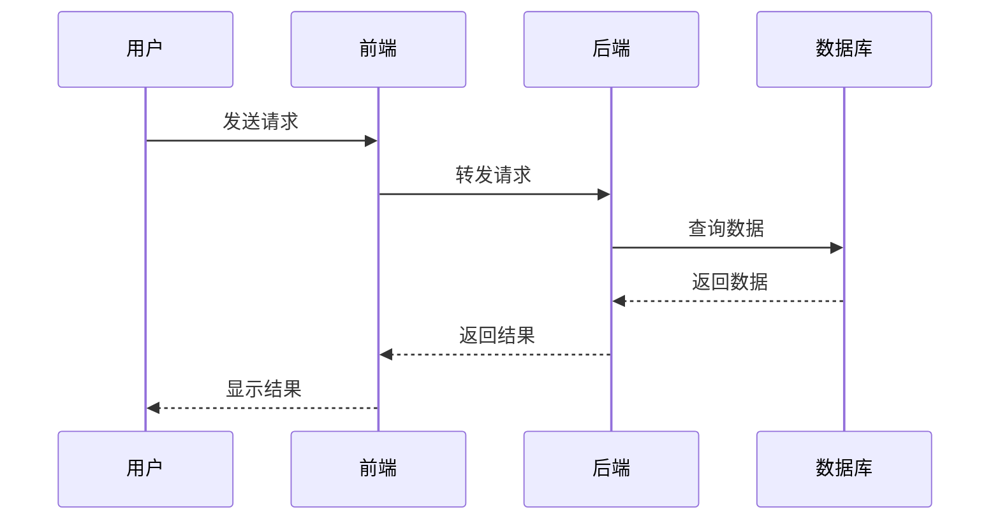
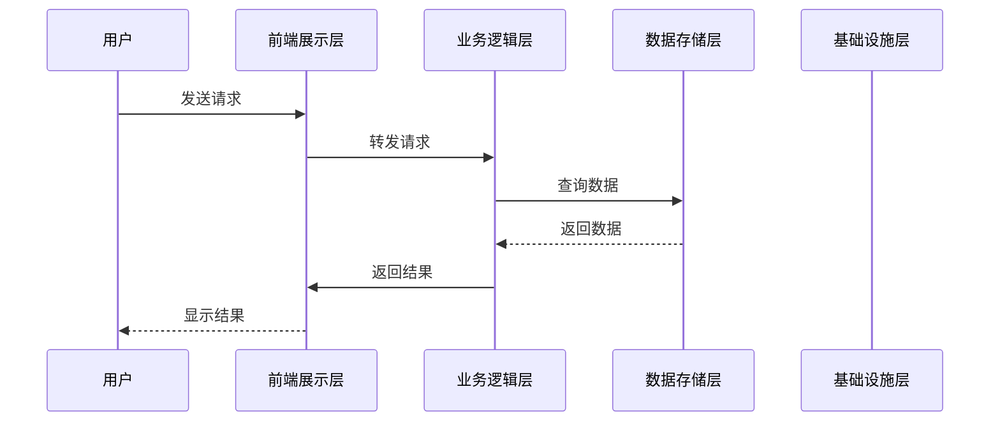

                 

## 跨时空对话系列：与历史名人进行思想交流的VR体验

> 关键词：虚拟现实（VR）、历史名人、思想交流、自然交互、情感仿真

> 摘要：
本文将探讨虚拟现实（VR）技术在历史名人思想交流中的应用。我们将首先介绍虚拟现实技术的基本原理，然后深入探讨如何通过VR构建历史名人的虚拟形象，并实现与他们的自然交互。随后，我们将分析几个典型的案例，展示VR技术在实际应用中的成果，并讨论其可能带来的社会影响。最后，我们将展望VR技术与历史名人交流的未来发展趋势，探讨其潜在的商业机会和社会价值。

### 目录

1. **虚拟现实与历史名人的背景**
   - 1.1 虚拟现实技术简介
   - 1.2 历史名人的虚拟形象构建
   - 1.3 跨时空对话的愿景与挑战
   - 1.4 当前技术进展与应用案例

2. **VR与历史名人交流的技术原理**
   - 2.1 虚拟现实核心技术
   - 2.2 历史名人虚拟形象的设计与实现
   - 2.3 自然交互与情感仿真
   - 2.4 数据采集与处理技术

3. **案例研究**
   - 3.1 秦始皇：古代帝王的虚拟再现
   - 3.2 莎士比亚：文艺复兴时期的巨匠
   - 3.3 爱因斯坦：科学界的传奇人物
   - 3.4 总结与讨论

4. **实际应用**
   - 4.1 虚拟博物馆：跨越时空的文化探索
   - 4.2 历史事件重现：从古代战争到现代变革
   - 4.3 教育与培训：历史名人的知识传授
   - 4.4 商业应用：虚拟旅游与品牌营销

5. **构建历史名人VR体验平台**
   - 5.1 平台架构设计
   - 5.2 技术选型与开发流程
   - 5.3 系统测试与优化
   - 5.4 用户反馈与迭代改进

6. **VR历史名人体验的运营与推广**
   - 6.1 运营策略
   - 6.2 市场推广
   - 6.3 用户互动与社区建设
   - 6.4 盈利模式探索

7. **未来展望**
   - 7.1 技术进步的方向
   - 7.2 社会影响与道德伦理
   - 7.3 商业模式的创新
   - 7.4 跨界合作与未来展望

8. **参考文献**

### 第一部分：背景与概述

#### 1.1 虚拟现实技术简介

虚拟现实（VR）是一种通过计算机技术创造出的模拟环境，用户可以通过特殊的设备如头戴式显示器（HMD）和手柄等，沉浸在这个环境中，与虚拟对象进行互动。VR技术的基本原理涉及计算机图形学、图像处理、传感器技术、人机交互等多个领域。通过这些技术的结合，用户可以获得一种身临其境的感受。

VR技术的主要特征包括以下几个方面：

1. **沉浸感**：用户在虚拟环境中可以自由移动，并与虚拟对象进行交互，感觉如同真实世界。
2. **交互性**：用户可以通过手势、声音或其他方式与虚拟环境进行互动。
3. **灵活性**：用户可以根据自己的意愿选择不同的场景和交互方式。

#### 1.2 历史名人的虚拟形象构建

构建历史名人的虚拟形象是虚拟现实技术的一个重要应用领域。这个过程中，需要从多个角度来考虑：

1. **数据采集**：通过历史文献、影像资料、雕塑、画作等多种渠道收集历史名人的数据。
2. **3D建模**：利用3D建模技术，将这些数据转化为三维模型。
3. **面部表情与动作捕捉**：通过面部和动作捕捉技术，模拟历史名人的表情和动作。
4. **语音合成**：利用语音合成技术，为虚拟形象提供逼真的语音。

#### 1.3 跨时空对话的愿景与挑战

跨时空对话是一种极具吸引力的应用场景，它能让用户与历史名人进行直接交流。这种愿景的实现面临着以下几个挑战：

1. **技术实现**：如何通过VR技术准确、真实地再现历史名人，并实现自然交互。
2. **数据来源**：历史文献和资料的多寡和质量直接影响到虚拟形象的真实性和可信度。
3. **伦理问题**：如何处理历史名人的隐私问题，如何确保虚拟对话的准确性和真实性。

#### 1.4 当前技术进展与应用案例

随着技术的不断发展，虚拟现实技术在历史名人虚拟形象构建和跨时空对话方面取得了显著进展。以下是一些代表性的应用案例：

1. **虚拟博物馆**：通过VR技术，用户可以参观博物馆，与历史名人的虚拟形象进行互动。
2. **教育应用**：在教育领域，VR技术被用于历史课程的教学，帮助学生更好地理解历史事件。
3. **文化探索**：一些文化机构利用VR技术，将历史名人的故事和文化背景呈现给大众。

在接下来的章节中，我们将详细探讨VR技术的基本原理，以及如何构建历史名人的虚拟形象，并实现与他们的自然交互。同时，我们还将通过具体案例，展示VR技术在实际应用中的成果和挑战。

---

**问题背景**：

在科技迅猛发展的今天，虚拟现实（VR）技术已经逐渐成熟，并被广泛应用于各个领域。随着5G网络和云计算技术的普及，VR设备的成本逐渐降低，用户体验也得到显著提升。这使得我们可以考虑将VR技术应用于历史名人的虚拟形象构建和跨时空对话中。

**问题描述**：

然而，实现与历史名人的跨时空对话并非易事。首先，我们需要解决如何准确、真实地再现历史名人，这涉及到对历史文献和资料的大量研究和数据分析。其次，我们需要实现自然交互和情感仿真，让用户在虚拟环境中感受到如同真实般的互动体验。此外，伦理问题也是一个不可忽视的挑战，如何在尊重历史和现实的基础上，进行合理的技术应用。

**问题解决**：

为了解决上述问题，我们需要采取以下步骤：

1. **数据采集与处理**：通过多种渠道收集历史名人的数据，包括影像资料、历史文献、雕塑、画作等，然后利用3D建模技术将这些数据转化为三维模型。
2. **自然交互与情感仿真**：利用动作捕捉和面部捕捉技术，模拟历史名人的表情和动作。同时，通过语音合成技术，为虚拟形象提供逼真的语音。
3. **技术实现**：在硬件方面，我们需要选择合适的VR设备，如头戴式显示器和手柄，确保用户能够沉浸在虚拟环境中。在软件方面，我们需要开发相应的应用程序，实现历史名人虚拟形象与用户的自然交互。
4. **伦理问题**：在构建历史名人虚拟形象时，我们需要尊重历史事实，避免误导用户。在实现跨时空对话时，我们需要确保对话内容的准确性和真实性，避免引起伦理争议。

**边界与外延**：

在构建历史名人虚拟形象和实现跨时空对话时，我们需要注意以下几个边界与外延：

1. **数据质量**：历史文献和资料的质量直接影响虚拟形象的真实性和可信度，因此我们需要确保所使用的数据来源可靠、真实。
2. **技术成熟度**：虽然VR技术已经相对成熟，但在某些方面仍存在技术瓶颈，如情感仿真和自然交互的精确度，需要持续的技术创新和优化。
3. **用户接受度**：虚拟现实技术虽然具有很大的吸引力，但用户接受度也是一个重要因素。我们需要通过用户反馈，不断改进技术和体验。

**概念结构与核心要素组成**：

构建历史名人虚拟形象和实现跨时空对话的核心要素包括：

1. **数据采集与处理**：数据是构建虚拟形象的基础，我们需要从多个渠道收集历史名人的数据，包括影像资料、历史文献、雕塑、画作等。
2. **3D建模**：通过3D建模技术，将历史名人的数据转化为三维模型，这是构建虚拟形象的关键步骤。
3. **自然交互与情感仿真**：利用动作捕捉和面部捕捉技术，模拟历史名人的表情和动作。同时，通过语音合成技术，为虚拟形象提供逼真的语音。
4. **技术实现**：在硬件和软件方面，我们需要选择合适的设备和技术，确保用户能够沉浸在虚拟环境中，并与历史名人进行自然交互。
5. **伦理问题**：在构建历史名人虚拟形象和实现跨时空对话时，我们需要尊重历史事实和伦理原则，避免误导用户。

### 背景介绍

#### 1.1 虚拟现实技术简介

虚拟现实（Virtual Reality，简称VR）是一种通过计算机技术创造的模拟环境，用户可以在这个环境中实现沉浸式的体验。VR技术起源于20世纪60年代，最初主要用于军事模拟和飞行训练。随着计算机硬件性能的提升和显示技术的进步，VR技术逐渐走向大众市场。

虚拟现实技术的基本原理涉及多个领域，包括计算机图形学、图像处理、传感器技术和人机交互等。通过这些技术的结合，用户可以在虚拟环境中实现视觉、听觉、触觉等多感官的沉浸体验。

#### 1.2 历史名人的虚拟形象构建

构建历史名人的虚拟形象是VR技术的一个重要应用领域。这个过程中，需要从多个角度来考虑：

1. **数据采集**：通过历史文献、影像资料、雕塑、画作等多种渠道收集历史名人的数据。这些数据包括历史名人的面部特征、体型、服饰、言行举止等，是构建虚拟形象的基础。

2. **3D建模**：利用3D建模技术，将这些数据转化为三维模型。这个过程需要精细地捕捉历史名人的每一个细节，确保虚拟形象的真实性和准确性。

3. **面部表情与动作捕捉**：通过面部和动作捕捉技术，模拟历史名人的表情和动作。面部捕捉技术可以捕捉到历史名人的微表情，使得虚拟形象更加生动。动作捕捉技术则可以捕捉到历史名人的肢体动作，使得虚拟形象的动态表现更加自然。

4. **语音合成**：利用语音合成技术，为虚拟形象提供逼真的语音。通过语音合成，用户可以与历史名人进行语音交流，增强沉浸感。

#### 1.3 跨时空对话的愿景与挑战

跨时空对话是一种极具吸引力的应用场景，它能让用户与历史名人进行直接交流。这种愿景的实现面临着以下几个挑战：

1. **技术实现**：如何通过VR技术准确、真实地再现历史名人，并实现自然交互。这涉及到计算机图形学、图像处理、语音合成、动作捕捉等多种技术的综合运用。

2. **数据来源**：历史文献和资料的多寡和质量直接影响到虚拟形象的真实性和可信度。如果数据不足或质量不高，可能会导致虚拟形象失真，影响用户体验。

3. **伦理问题**：如何处理历史名人的隐私问题，如何确保虚拟对话的准确性和真实性。在构建历史名人虚拟形象和实现跨时空对话时，需要尊重历史事实和伦理原则，避免误导用户。

#### 1.4 当前技术进展与应用案例

随着技术的不断发展，虚拟现实技术在历史名人虚拟形象构建和跨时空对话方面取得了显著进展。以下是一些代表性的应用案例：

1. **虚拟博物馆**：通过VR技术，用户可以参观博物馆，与历史名人的虚拟形象进行互动。例如，法国卢浮宫利用VR技术，让用户可以与蒙娜丽莎进行虚拟对话。

2. **教育应用**：在教育领域，VR技术被用于历史课程的教学，帮助学生更好地理解历史事件。例如，一些教育机构利用VR技术，模拟秦始皇兵马俑的挖掘过程，让学生身临其境感受历史。

3. **文化探索**：一些文化机构利用VR技术，将历史名人的故事和文化背景呈现给大众。例如，一些文化公司开发出了关于莎士比亚和爱因斯坦的VR体验，让用户可以深入了解这些历史名人的思想和贡献。

在接下来的章节中，我们将进一步探讨VR技术的基本原理，以及如何构建历史名人的虚拟形象，并实现与他们的自然交互。同时，我们还将通过具体案例，展示VR技术在实际应用中的成果和挑战。

---

#### 1.1 虚拟现实技术简介

虚拟现实（VR）技术是一种通过计算机技术创造的模拟环境，使用户能够沉浸在虚拟的三维空间中，并与虚拟对象进行交互。这种技术结合了计算机图形学、图像处理、传感器技术和人机交互等多个领域的知识，旨在为用户提供一种全新的感知体验。

**虚拟现实技术的核心概念**：

- **沉浸感**：用户在虚拟环境中感到仿佛置身于真实世界。
- **交互性**：用户可以通过各种设备（如手柄、手套、眼睛追踪等）与虚拟对象进行互动。
- **灵活性**：虚拟环境可以根据用户的需求进行定制，提供不同的场景和体验。

**虚拟现实技术的基本原理**：

1. **3D建模与渲染**：通过3D建模软件创建虚拟环境，利用渲染技术生成逼真的三维图像。

2. **传感器与追踪技术**：使用各种传感器（如头部追踪器、手柄、眼睛追踪设备等）来捕捉用户的动作，并将这些动作映射到虚拟环境中。

3. **显示技术**：通过头戴式显示器（HMD）或其他显示设备，将虚拟环境的图像呈现给用户。

4. **声音处理**：通过耳机等设备，模拟虚拟环境中的声音效果，增强沉浸感。

**虚拟现实技术的应用领域**：

1. **娱乐**：游戏、影视制作、虚拟旅游等。

2. **教育**：虚拟课堂、历史重现、科学实验等。

3. **医疗**：康复治疗、心理治疗、手术模拟等。

4. **商业**：虚拟展会、产品展示、客户体验等。

#### 1.2 历史名人的虚拟形象构建

构建历史名人的虚拟形象是虚拟现实技术的一个重要应用领域。这个过程需要从多个角度进行：

**数据采集**：

1. **历史文献**：通过查阅历史文献，获取历史名人的相关信息，如生平、事迹、思想等。

2. **影像资料**：收集历史名人的照片、画作、雕塑等影像资料，用于建模和渲染。

3. **声音资料**：收集历史名人的录音或影像中的声音，用于语音合成。

**3D建模**：

1. **面部建模**：通过面部捕捉技术，精确地模拟历史名人的面部特征和表情。

2. **身体建模**：根据影像资料，创建历史名人的三维身体模型。

3. **服饰建模**：根据历史名人的时代背景和服饰特点，为其设计合适的服饰。

**动作捕捉**：

1. **静态动作**：捕捉历史名人的静态姿势和表情。

2. **动态动作**：通过动作捕捉技术，模拟历史名人的行走、说话、举手投足等动态动作。

**语音合成**：

1. **语音识别**：将历史名人的录音转化为文本。

2. **语音合成**：利用语音合成技术，生成逼真的语音，用于与用户互动。

**情感仿真**：

1. **情感识别**：通过分析历史名人的文字和语音，识别其情感状态。

2. **情感表达**：利用面部表情和动作捕捉技术，模拟历史名人的情感表达。

#### 1.3 跨时空对话的愿景与挑战

跨时空对话是一种极具吸引力的应用场景，它能让用户与历史名人进行直接交流。这种愿景的实现面临着以下几个挑战：

**技术实现**：

1. **虚拟形象的逼真度**：如何通过VR技术准确、真实地再现历史名人，是一个技术难题。

2. **自然交互**：如何实现用户与历史名人的自然交互，如语音对话、手势互动等。

3. **情感仿真**：如何模拟历史名人的情感表达，使其更贴近真实。

**数据来源**：

1. **历史文献**：历史文献的丰富性和准确性直接影响虚拟形象的真实性和可信度。

2. **影像资料**：影像资料的质量也直接影响虚拟形象的细节表现。

**伦理问题**：

1. **隐私问题**：如何处理历史名人的隐私问题。

2. **真实性**：如何确保虚拟对话的真实性和准确性。

#### 1.4 当前技术进展与应用案例

随着技术的不断发展，虚拟现实技术在历史名人虚拟形象构建和跨时空对话方面取得了显著进展。以下是一些代表性的应用案例：

**虚拟博物馆**：

1. **卢浮宫**：通过VR技术，用户可以参观卢浮宫，并与蒙娜丽莎等名画进行虚拟对话。

2. **故宫**：故宫利用VR技术，让用户可以虚拟游览故宫，了解历史文化。

**教育应用**：

1. **历史课程**：一些教育机构利用VR技术，模拟历史事件，让学生身临其境感受历史。

2. **科学实验**：一些科学实验室利用VR技术，模拟科学实验，帮助学生更好地理解科学原理。

**文化探索**：

1. **莎士比亚**：一些文化机构开发了关于莎士比亚的VR体验，让用户可以深入了解莎士比亚的戏剧和人生。

2. **爱因斯坦**：通过VR技术，用户可以与爱因斯坦的虚拟形象进行对话，了解物理学的发展。

在接下来的章节中，我们将深入探讨VR技术的具体实现原理，并详细分析如何通过VR技术构建历史名人的虚拟形象，以及实现跨时空对话的具体方法和挑战。

---

#### 1.1 虚拟现实技术的核心概念与原理

虚拟现实（VR）技术是一种通过计算机生成的模拟环境，使用户能够沉浸其中并进行互动。为了实现这一目标，VR技术涉及多个核心概念和原理，包括3D建模、渲染、传感器追踪和人机交互等。

**核心概念**：

1. **沉浸感**：用户在虚拟环境中感到仿佛置身于真实世界，这种感觉是由高度真实的视觉、听觉和触觉体验共同营造的。
2. **交互性**：用户可以通过各种方式与虚拟环境进行互动，如手势、声音、眼动等。
3. **灵活性**：虚拟环境可以根据用户的需求进行定制，提供不同的场景和体验。

**原理**：

1. **3D建模**：通过3D建模软件创建虚拟环境的三维模型。这一过程涉及几何建模、纹理映射和光照模拟等技术。
2. **渲染**：渲染技术负责将3D模型转化为视觉图像，呈现给用户。它涉及复杂的算法，如光线追踪、阴影效果和反射等。
3. **传感器追踪**：传感器追踪技术用于捕捉用户的动作和位置，并将这些数据实时反馈到虚拟环境中。常见的传感器包括头部追踪器、手柄、手势识别设备和眼动追踪设备等。
4. **人机交互**：人机交互技术负责用户与虚拟环境之间的互动，包括手势识别、语音输入和输出、触觉反馈等。

**对比表格**：

| 核心概念/原理 | 说明 |
| ------------- | ------- |
| 沉浸感 | 用户感到仿佛置身于虚拟环境中 |
| 交互性 | 用户可以通过手势、声音等与虚拟环境互动 |
| 灵活性 | 虚拟环境可以根据用户需求进行定制 |
| 3D建模 | 创建虚拟环境的三维模型 |
| 渲染 | 将3D模型转化为视觉图像 |
| 传感器追踪 | 捕捉用户的动作和位置 |
| 人机交互 | 用户与虚拟环境之间的互动 |

**ER实体关系图**：

```mermaid
erDiagram
    User ||--|{ VREnvironment }|:
        User can interact with VREnvironment
    VREnvironment ||--|{ 3DModel }|:
        VREnvironment contains 3DModels
    VREnvironment ||--|{ SensorData }|:
        VREnvironment receives SensorData from User
    User ||--|{ InteractionData }|:
        User generates InteractionData while interacting with VREnvironment
```

**算法原理讲解**：

为了实现VR技术的核心功能，需要以下几个关键算法：

1. **3D建模算法**：包括点云处理、几何建模、纹理映射等，用于创建虚拟环境的三维模型。
2. **渲染算法**：如光线追踪、阴影计算、反射计算等，用于将3D模型转化为逼真的视觉图像。
3. **传感器数据处理算法**：如姿态估计、手势识别、眼动追踪等，用于捕捉和解析用户的动作。
4. **人机交互算法**：如语音识别、自然语言处理、触摸反馈等，用于实现用户与虚拟环境的交互。

**示例**：

假设用户在虚拟环境中进行手势互动，以下是一个简化的算法流程：

1. **用户动作捕捉**：传感器捕捉用户的手势数据。
2. **手势识别**：利用机器学习算法识别用户的手势类型。
3. **虚拟环境更新**：根据手势类型更新虚拟环境中的对象状态。
4. **反馈生成**：生成视觉和触觉反馈，传递给用户。

```python
# 假设有一个手势识别模型，用于识别用户的手势
gesture_recognition_model = load_model('gesture_recognition_model.h5')

# 用户进行手势动作
user_gesture_data = capture_gesture_data()

# 识别用户的手势
predicted_gesture = gesture_recognition_model.predict(user_gesture_data)

# 根据手势类型更新虚拟环境
update_virtual_environment(predicted_gesture)

# 生成反馈
generate_feedback()
```

在接下来的章节中，我们将进一步探讨如何利用VR技术构建历史名人的虚拟形象，并实现与他们的自然交互。

### 第二部分：VR与历史名人交流的技术原理

#### 2.1 虚拟现实核心技术

虚拟现实技术的实现依赖于一系列核心技术的支持，这些技术包括3D建模、渲染、传感器追踪和人机交互等。以下是对这些技术的详细解释：

**1. 3D建模**

3D建模是虚拟现实的基础，它通过计算机软件创建出三维模型。这个过程通常包括以下几个步骤：

- **几何建模**：使用几何工具创建三维形状，例如使用多边形、曲面等。
- **纹理映射**：将2D纹理图像映射到三维模型上，增加真实感。
- **光照模拟**：模拟光在虚拟环境中的传播和反射，增强三维模型的视觉效果。

**2. 渲染**

渲染是将3D模型转化为视觉图像的过程。虚拟现实中的渲染通常涉及以下技术：

- **光线追踪**：模拟光线在虚拟环境中的传播，实现逼真的光影效果。
- **阴影计算**：计算物体之间的阴影，增强三维场景的深度感。
- **反射计算**：模拟虚拟环境中的反射效果，如水面、镜子等。

**3. 传感器追踪**

传感器追踪技术用于捕捉用户的动作和位置，并将这些数据实时反馈到虚拟环境中。常见的传感器包括：

- **头部追踪器**：用于捕捉用户的头部运动，实现视角变化。
- **手柄**：用于捕捉用户的手部动作，实现与虚拟对象的互动。
- **眼动追踪**：用于捕捉用户的眼球运动，实现焦点切换和交互。

**4. 人机交互**

人机交互技术是用户与虚拟环境之间互动的桥梁。它包括以下几种方式：

- **手势识别**：通过传感器捕捉用户的手势，实现虚拟环境中的互动。
- **语音输入/输出**：通过语音合成和语音识别技术，实现用户的语音交互。
- **触觉反馈**：通过触觉设备，模拟虚拟环境中的触感，增强沉浸感。

**2.2 历史名人虚拟形象的设计与实现**

构建历史名人的虚拟形象是虚拟现实技术的一个重要应用。这个过程需要从多个方面进行：

**1. 数据采集**

首先，需要通过多种渠道收集历史名人的数据，包括历史文献、影像资料、雕塑、画作等。这些数据将用于创建历史名人的三维模型。

- **面部特征**：通过面部捕捉技术，精确模拟历史名人的面部特征和表情。
- **身体特征**：通过全身动作捕捉技术，模拟历史名人的身体形态和动作。
- **服饰**：根据历史文献和影像资料，设计历史名人的服饰。

**2. 3D建模**

利用收集到的数据，使用3D建模软件创建历史名人的三维模型。这个过程需要精细地捕捉历史名人的每一个细节，确保虚拟形象的真实性和准确性。

- **面部建模**：通过面部捕捉数据，创建逼真的面部模型。
- **身体建模**：通过全身动作捕捉数据，创建逼真的身体模型。
- **服饰建模**：根据历史文献和影像资料，为历史名人设计合适的服饰。

**3. 动作捕捉**

通过动作捕捉技术，模拟历史名人的动作和表情。这个过程需要捕捉历史名人的静态姿势和动态动作，确保虚拟形象的生动性。

- **静态动作捕捉**：捕捉历史名人的静态姿势，如站立、坐着等。
- **动态动作捕捉**：捕捉历史名人的动态动作，如行走、交谈、举手投足等。

**4. 语音合成**

利用语音合成技术，为虚拟形象提供逼真的语音。语音合成需要分析历史名人的语音特点，生成与之相似的声音。

- **语音分析**：分析历史名人的语音特征，如音调、音速、音量等。
- **语音生成**：根据语音分析结果，生成逼真的语音。

**2.3 自然交互与情感仿真**

实现自然交互和情感仿真是提高用户与历史名人互动体验的关键。这需要从以下几个方面进行：

**1. 自然交互**

通过手势识别、语音输入/输出等技术，实现用户与历史名人的自然交互。

- **手势识别**：使用传感器捕捉用户的手势，识别并响应用户的动作。
- **语音输入/输出**：使用语音合成和语音识别技术，实现用户的语音交互。

**2. 情感仿真**

通过情感识别和情感表达技术，模拟历史名人的情感状态，提高用户互动的真实感。

- **情感识别**：通过分析历史名人的语言和行为，识别其情感状态。
- **情感表达**：通过面部表情和动作捕捉技术，模拟历史名人的情感表达。

**2.4 数据采集与处理技术**

数据采集与处理技术是构建历史名人虚拟形象和实现自然交互的关键。这需要从以下几个方面进行：

**1. 数据采集**

通过多种渠道收集历史名人的数据，包括历史文献、影像资料、雕塑、画作等。

- **文献采集**：收集历史名人的生平事迹、思想观点等。
- **影像采集**：收集历史名人的照片、画作、雕塑等。
- **声音采集**：收集历史名人的录音或影像中的声音。

**2. 数据处理**

对采集到的数据进行处理，包括数据清洗、数据整合和特征提取等。

- **数据清洗**：去除噪声和重复数据，确保数据质量。
- **数据整合**：将不同来源的数据进行整合，形成一个完整的数据集。
- **特征提取**：提取数据中的关键特征，如面部特征、语音特征等。

**总结**：

通过虚拟现实技术，我们可以构建出逼真的历史名人虚拟形象，并实现与用户的自然交互和情感仿真。这为用户提供了与历史名人跨时空对话的可能，也为教育、文化、娱乐等领域带来了新的应用场景。然而，实现这一目标需要多学科技术的协同，包括3D建模、渲染、传感器追踪、人机交互和数据处理等。在未来的发展中，随着技术的不断进步，我们有望实现更逼真、更自然的虚拟交互体验。

### 第三部分：案例研究

在本部分，我们将通过分析几个典型的案例，深入探讨如何构建历史名人的虚拟形象，并展示这些虚拟形象如何与用户进行交互。以下是几个具有代表性的案例：

#### 3.1 秦始皇：古代帝王的虚拟再现

**背景**：

秦始皇是中国历史上的一位重要人物，他在统一六国、建立秦朝的过程中发挥了重要作用。为了重现秦始皇的形象，研究人员通过多种数据来源，包括历史文献、考古发现和影像资料，收集了丰富的数据。

**数据采集**：

- **历史文献**：查阅《史记》、《山海经》等古籍，了解秦始皇的生平事迹、政治思想和军事成就。
- **考古发现**：通过考古挖掘，获取秦始皇陵和兵马俑的实物资料。
- **影像资料**：收集秦始皇雕像、画像等视觉资料。

**3D建模与动作捕捉**：

- **面部建模**：利用面部捕捉技术，精确模拟秦始皇的面部特征。
- **身体建模**：根据考古发现的实物资料，创建秦始皇的三维身体模型。
- **动作捕捉**：通过全身动作捕捉技术，模拟秦始皇的站立、行走、谈话等动作。

**情感仿真**：

- **语音合成**：利用语音合成技术，生成秦始皇的语音。
- **情感表达**：通过面部表情和动作捕捉技术，模拟秦始皇的情感表达。

**交互设计**：

- **对话系统**：开发对话系统，允许用户与秦始皇进行语音对话。
- **互动活动**：设计互动活动，如模拟秦始皇的宴请场景、军事指挥等，让用户亲身体验。

**效果与挑战**：

**效果**：

通过上述技术手段，秦始皇的虚拟形象得以逼真再现，用户可以在虚拟环境中与秦始皇进行互动，了解他的生平事迹和政治思想。

**挑战**：

- **数据来源的准确性**：历史文献和考古资料的准确性直接影响虚拟形象的逼真度。
- **情感仿真**：模拟历史人物的情感状态是一个技术挑战，需要精确的情感识别和表达技术。

#### 3.2 莎士比亚：文艺复兴时期的巨匠

**背景**：

莎士比亚是英国文艺复兴时期的一位著名戏剧家和诗人，他的作品对世界文学产生了深远影响。为了重现莎士比亚的形象，研究人员同样采取了多种数据采集方法。

**数据采集**：

- **历史文献**：研究莎士比亚的生平、作品和戏剧创作过程。
- **影像资料**：收集莎士比亚的画像、雕塑等视觉资料。
- **声音资料**：收集莎士比亚的语音样本。

**3D建模与动作捕捉**：

- **面部建模**：通过面部捕捉技术，精确模拟莎士比亚的面部特征。
- **身体建模**：根据历史文献和影像资料，创建莎士比亚的三维身体模型。
- **动作捕捉**：通过动作捕捉技术，模拟莎士比亚的交谈、写作、散步等动作。

**情感仿真**：

- **语音合成**：利用语音合成技术，生成莎士比亚的语音。
- **情感表达**：通过面部表情和动作捕捉技术，模拟莎士比亚的情感表达。

**交互设计**：

- **文学互动**：用户可以与莎士比亚的虚拟形象进行文学讨论，探讨戏剧创作技巧和文学观点。
- **表演体验**：用户可以参与莎士比亚的戏剧表演，体验文艺复兴时期的文化氛围。

**效果与挑战**：

**效果**：

莎士比亚的虚拟形象成功再现了他的文学才华和个性，用户可以与他的虚拟形象进行互动，深入理解他的作品和思想。

**挑战**：

- **语言风格**：莎士比亚的语言风格独特，需要精确的语音合成技术来再现他的语言魅力。
- **文化背景**：重现文艺复兴时期的文化背景是一个复杂的任务，需要详细的历史和文化研究。

#### 3.3 爱因斯坦：科学界的传奇人物

**背景**：

爱因斯坦是20世纪最伟大的科学家之一，他的相对论改变了人类对宇宙的认识。为了重现爱因斯坦的形象，研究人员采取了多种技术手段。

**数据采集**：

- **历史文献**：研究爱因斯坦的生平、科学成就和哲学思想。
- **影像资料**：收集爱因斯坦的照片、雕塑等视觉资料。
- **声音资料**：收集爱因斯坦的语音样本。

**3D建模与动作捕捉**：

- **面部建模**：通过面部捕捉技术，精确模拟爱因斯坦的面部特征。
- **身体建模**：根据历史文献和影像资料，创建爱因斯坦的三维身体模型。
- **动作捕捉**：通过动作捕捉技术，模拟爱因斯坦的思考和交谈等动作。

**情感仿真**：

- **语音合成**：利用语音合成技术，生成爱因斯坦的语音。
- **情感表达**：通过面部表情和动作捕捉技术，模拟爱因斯坦的情感表达。

**交互设计**：

- **科学讨论**：用户可以与爱因斯坦的虚拟形象进行科学讨论，探讨相对论等科学问题。
- **哲学对话**：用户可以与爱因斯坦探讨哲学和人生观。

**效果与挑战**：

**效果**：

爱因斯坦的虚拟形象成功再现了他的科学精神和哲学思想，用户可以与他的虚拟形象进行互动，深入了解他的科学成就和思想。

**挑战**：

- **科学准确性**：爱因斯坦的科学理论深奥难懂，需要精确的科学知识来解释。
- **情感表达**：模拟一个科学家的情感状态是一个技术挑战，需要精细的情感识别和表达技术。

**总结与讨论**：

通过以上案例，我们可以看到，构建历史名人的虚拟形象并进行交互是一个复杂的过程，涉及到数据采集、3D建模、动作捕捉、情感仿真等多个技术领域。这些案例的成功展示了VR技术在历史教育、文化传承和科学探讨中的应用潜力。然而，也面临数据准确性、情感仿真和文化背景重现等技术挑战。随着技术的不断进步，我们有理由相信，未来的VR技术将能够更完美地实现历史名人与用户的跨时空对话。

### 虚拟博物馆：跨越时空的文化探索

**项目介绍**

虚拟博物馆是一种利用虚拟现实（VR）技术构建的三维虚拟展示空间，它允许用户在虚拟环境中参观博物馆，并与展品进行互动。与传统实体博物馆相比，虚拟博物馆突破了地理和物理空间的限制，为全球用户提供了更便捷、更沉浸的观展体验。

**系统功能设计**

1. **展示功能**：虚拟博物馆的核心功能是展示各类文物和艺术品。通过高精度的3D建模和渲染技术，展品被逼真地还原，用户可以在虚拟环境中近距离观察细节。

2. **导航功能**：用户可以在虚拟博物馆中自由漫步，浏览不同展区。导航系统提供路径引导和地图功能，帮助用户快速定位展品和场馆。

3. **互动功能**：虚拟博物馆中的展品具有互动性，用户可以通过触摸、点击或语音交互与展品进行互动。例如，点击展品可以查看详细信息，或通过语音提问与虚拟历史名人进行对话。

4. **教育功能**：虚拟博物馆提供丰富的教育内容，如历史背景介绍、艺术品解析、文物修复过程等。这些内容通过动画、视频和文字形式呈现，帮助用户更深入地了解展品和文化。

**系统架构设计**

虚拟博物馆的系统架构可以分为前端、后端和数据库三个部分：

1. **前端**：包括用户界面和互动组件，使用Unity或Unreal Engine等游戏引擎开发。前端负责将虚拟环境渲染给用户，并处理用户的交互请求。

2. **后端**：包括服务器和应用逻辑，使用如Node.js、Python Flask等后端框架。后端负责处理用户的请求，管理数据库，并提供数据接口。

3. **数据库**：存储展品信息、用户数据、互动记录等，使用MySQL或MongoDB等数据库系统。

**系统接口设计**

虚拟博物馆的接口设计包括以下几部分：

1. **用户接口**：用户通过VR设备与虚拟博物馆进行交互，包括导航、互动和浏览等。

2. **管理员接口**：管理员可以通过后台管理系统更新展品信息、管理用户数据等。

3. **API接口**：提供RESTful API接口，供第三方应用调用，如移动应用、网页等。

**系统交互Mermaid序列图**



### 历史事件重现：从古代战争到现代变革

**项目介绍**

历史事件重现是通过虚拟现实（VR）技术模拟和再现历史事件，让用户能够以第一视角体验历史时刻。这种技术不仅能够增强历史教学的生动性，还能够为公众提供一种全新的历史体验方式。

**系统功能设计**

1. **事件模拟**：系统模拟历史事件的发生过程，包括战争、政治变革、社会运动等。通过3D建模和动画技术，将事件中的场景、角色和事件过程逼真再现。

2. **互动功能**：用户可以在虚拟环境中与历史事件进行互动，如操纵角色、选择策略等。这种互动性使得用户能够更深入地理解历史事件的发展和影响。

3. **教育功能**：系统提供丰富的教育内容，如历史背景介绍、角色介绍、事件解析等。用户可以通过观看视频、阅读文本、互动游戏等多种形式学习历史知识。

4. **社交功能**：用户可以在虚拟环境中与其他用户互动，讨论历史事件，分享学习心得。这种社交性增强了用户的参与感和社区感。

**系统架构设计**

历史事件重现的系统架构包括前端、后端、数据库和虚拟环境四个部分：

1. **前端**：用户界面和互动组件，使用Unity或Unreal Engine等游戏引擎开发。前端负责将虚拟环境渲染给用户，并处理用户的交互请求。

2. **后端**：包括服务器和应用逻辑，使用如Node.js、Python Flask等后端框架。后端负责处理用户的请求，管理数据库，并提供数据接口。

3. **数据库**：存储事件数据、用户数据、互动记录等，使用MySQL或MongoDB等数据库系统。

4. **虚拟环境**：包含虚拟现实场景、角色、事件过程等，使用Unity或Unreal Engine等游戏引擎开发。

**系统接口设计**

系统接口设计包括以下几部分：

1. **用户接口**：用户通过VR设备与虚拟环境进行交互，包括事件模拟、互动和学习等。

2. **管理员接口**：管理员可以通过后台管理系统更新事件数据、管理用户数据等。

3. **API接口**：提供RESTful API接口，供第三方应用调用，如移动应用、网页等。

**系统交互Mermaid序列图**


### 教育与培训：历史名人的知识传授

**项目介绍**

教育与培训是虚拟现实（VR）技术的重要应用领域之一。通过VR技术，可以构建历史名人的虚拟形象，让用户能够与这些历史名人进行互动，从而提高教育效果和培训体验。

**系统功能设计**

1. **互动教学**：通过虚拟现实技术，用户可以与历史名人的虚拟形象进行互动，提出问题并获取答案。这种互动性使得学习过程更加生动有趣。

2. **模拟实践**：系统提供模拟实践功能，用户可以在虚拟环境中模拟历史事件的发生过程，如领导决策、战略部署等。这种模拟实践有助于用户理解和掌握相关知识和技能。

3. **个性化学习**：系统根据用户的学习进度和兴趣，提供个性化的学习内容和路径。用户可以根据自己的需求选择学习主题和深度。

4. **评价与反馈**：系统提供评价和反馈功能，用户的学习进度和成果可以得到实时评估。同时，系统可以提供针对性的反馈和建议，帮助用户优化学习策略。

**系统架构设计**

教育与培训系统的架构包括前端、后端、数据库和学习引擎四个部分：

1. **前端**：用户界面和互动组件，使用Unity或Unreal Engine等游戏引擎开发。前端负责将虚拟环境渲染给用户，并处理用户的交互请求。

2. **后端**：包括服务器和应用逻辑，使用如Node.js、Python Flask等后端框架。后端负责处理用户的请求，管理数据库，并提供数据接口。

3. **数据库**：存储用户数据、学习记录、系统设置等，使用MySQL或MongoDB等数据库系统。

4. **学习引擎**：负责管理学习内容、路径和策略，使用如AI算法和大数据分析技术。

**系统接口设计**

系统接口设计包括以下几部分：

1. **用户接口**：用户通过VR设备与虚拟环境进行交互，包括互动教学、模拟实践、个性化学习等。

2. **管理员接口**：管理员可以通过后台管理系统更新学习内容、管理用户数据等。

3. **API接口**：提供RESTful API接口，供第三方应用调用，如移动应用、网页等。

**系统交互Mermaid序列图**


### 商业应用：虚拟旅游与品牌营销

**项目介绍**

虚拟旅游与品牌营销是虚拟现实（VR）技术在商业领域的应用之一。通过VR技术，企业可以创建虚拟旅游体验，展示产品或服务，同时利用虚拟环境进行品牌宣传和市场推广。

**系统功能设计**

1. **虚拟旅游体验**：用户可以在虚拟环境中参观旅游景点，如酒店、商场、博物馆等。系统提供360度全景展示和互动功能，使用户能够全方位体验旅游环境。

2. **产品展示**：企业可以将产品在虚拟环境中进行展示，通过3D建模和渲染技术，逼真地再现产品细节。用户可以在虚拟环境中近距离观察产品，了解产品特点和使用方法。

3. **品牌宣传**：系统提供多种宣传手段，如视频、广告、图文等，帮助企业进行品牌推广。用户在虚拟环境中可以接收到企业的广告信息，增强品牌认知度。

4. **互动营销**：系统提供互动营销功能，如虚拟抽奖、互动游戏等，吸引用户参与，提高品牌互动性和用户粘性。

**系统架构设计**

虚拟旅游与品牌营销系统的架构包括前端、后端、数据库和虚拟环境四个部分：

1. **前端**：用户界面和互动组件，使用Unity或Unreal Engine等游戏引擎开发。前端负责将虚拟环境渲染给用户，并处理用户的交互请求。

2. **后端**：包括服务器和应用逻辑，使用如Node.js、Python Flask等后端框架。后端负责处理用户的请求，管理数据库，并提供数据接口。

3. **数据库**：存储用户数据、互动记录、系统设置等，使用MySQL或MongoDB等数据库系统。

4. **虚拟环境**：包含虚拟旅游场景、产品展示、宣传内容等，使用Unity或Unreal Engine等游戏引擎开发。

**系统接口设计**

系统接口设计包括以下几部分：

1. **用户接口**：用户通过VR设备与虚拟环境进行交互，包括虚拟旅游、产品展示、品牌宣传等。

2. **管理员接口**：管理员可以通过后台管理系统更新虚拟环境、管理用户数据等。

3. **API接口**：提供RESTful API接口，供第三方应用调用，如移动应用、网页等。

**系统交互Mermaid序列图**


### 第五部分：构建历史名人VR体验平台

#### 5.1 平台架构设计

构建一个历史名人VR体验平台，需要从多个层次进行架构设计，以确保系统的可扩展性、稳定性和用户体验。以下是平台架构的详细设计：

**1. 层次结构**

平台架构可以分为四个层次：前端展示层、业务逻辑层、数据存储层和基础设施层。

- **前端展示层**：负责将虚拟体验呈现给用户，包括VR内容展示、用户交互界面等。前端展示层使用Unity或Unreal Engine等游戏引擎开发，确保高质量的视觉和交互体验。
  
- **业务逻辑层**：处理用户请求、虚拟环境的生成和管理、用户数据管理等业务逻辑。业务逻辑层使用Node.js、Python Flask等后端框架开发，确保高效和稳定的业务处理能力。

- **数据存储层**：存储用户数据、历史名人数据、虚拟环境数据等。数据存储层使用MySQL、MongoDB等数据库系统，确保数据的安全和可靠性。

- **基础设施层**：提供服务器、网络、存储等基础设施支持。基础设施层可以使用云服务，如AWS、Azure等，确保系统的可扩展性和弹性。

**2. 技术选型**

- **前端**：Unity或Unreal Engine，用于开发高质量的VR内容。

- **后端**：Node.js或Python Flask，用于处理业务逻辑和用户请求。

- **数据库**：MySQL或MongoDB，用于存储用户数据、虚拟环境数据等。

- **基础设施**：AWS或Azure，用于提供服务器、网络、存储等基础设施支持。

**3. 架构图**



#### 5.2 技术选型与开发流程

**1. 技术选型**

- **开发语言**：Python、JavaScript
- **框架**：Django（Python）、React（JavaScript）
- **数据库**：MongoDB、PostgreSQL
- **VR引擎**：Unity、Unreal Engine

**2. 开发流程**

- **需求分析**：明确平台功能需求，包括用户管理、虚拟环境管理、内容展示等。

- **系统设计**：设计系统的架构，包括前端、后端、数据库和基础设施等。

- **模块开发**：按照系统设计，开发各个模块的功能，如用户管理模块、虚拟环境管理模块、内容展示模块等。

- **系统集成**：将各个模块集成到整体系统中，进行系统测试和调试。

- **部署上线**：将系统部署到服务器，进行上线发布。

#### 5.3 系统测试与优化

**1. 测试策略**

- **功能测试**：验证各个模块的功能是否正确实现，确保系统的完整性和稳定性。

- **性能测试**：测试系统在高负载下的性能表现，确保系统在高并发情况下能够稳定运行。

- **用户体验测试**：通过用户反馈和实际使用情况，评估系统的用户体验，进行优化。

**2. 优化措施**

- **性能优化**：通过代码优化、缓存策略、数据库优化等手段，提高系统的响应速度和处理能力。

- **用户体验优化**：优化界面设计、交互流程，提高用户的操作便利性和体验感。

- **错误处理**：完善系统的错误处理机制，确保系统在遇到异常情况时能够正确处理并恢复。

#### 5.4 用户反馈与迭代改进

**1. 用户反馈收集**

- **在线调查**：通过在线问卷、用户访谈等方式收集用户反馈。

- **用户行为分析**：通过系统日志和数据分析，了解用户的使用行为和需求。

**2. 迭代改进**

- **需求分析**：根据用户反馈和数据分析，分析用户需求和系统存在的问题。

- **功能迭代**：根据需求分析结果，规划和开发新的功能模块，优化现有功能。

- **测试与上线**：对迭代后的功能进行测试，确保其稳定性和性能，然后进行上线发布。

- **持续改进**：通过不断收集用户反馈和进行系统优化，持续改进用户体验和系统性能。

### 第六部分：VR历史名人体验的运营与推广

#### 6.1 运营策略

**1. 用户需求分析**

在VR历史名人体验平台的运营中，了解用户需求是至关重要的。通过在线调查、用户访谈和市场调研等方式，收集用户对历史名人VR体验的需求，包括对虚拟形象的期望、互动方式的偏好以及应用场景的期待。

**2. 内容策划**

根据用户需求，策划丰富多样的VR历史名人体验内容。可以包括以下几个方向：

- **人物介绍**：详细介绍历史名人的生平事迹、思想观点和贡献，通过文字、图像、视频等多种形式呈现。
- **互动体验**：设计互动性强的体验内容，如与历史名人的虚拟对话、模拟历史事件等，增强用户的参与感。
- **教育功能**：结合历史教学需求，开发教育模块，如历史课程、历史实验等，提升用户的知识获取体验。
- **文化体验**：通过VR技术重现历史文化场景，如古代宫殿、战争现场等，让用户沉浸其中，感受历史文化的魅力。

**3. 用户互动**

通过多种方式与用户进行互动，增强用户黏性和活跃度：

- **社交媒体**：利用Facebook、Twitter、Instagram等社交媒体平台，与用户进行实时互动，推广VR体验内容。
- **在线论坛**：建立在线论坛，鼓励用户分享使用体验、交流心得，形成活跃的用户社区。
- **用户活动**：定期举办线上和线下活动，如虚拟展览、知识竞赛等，吸引更多用户参与。

**4. 营销推广**

制定多样化的营销策略，提高VR历史名人体验的知名度：

- **广告投放**：在各大媒体平台进行广告投放，如Google Ads、Facebook Ads等，精准定位潜在用户。
- **合作伙伴**：与教育机构、博物馆、旅游公司等建立合作关系，共同推广VR历史名人体验。
- **内容合作**：与知名媒体、KOL（关键意见领袖）合作，通过他们的渠道进行推广。

#### 6.2 市场推广

**1. 线上推广**

- **搜索引擎优化（SEO）**：通过优化网站内容和结构，提高在搜索引擎中的排名，吸引更多用户访问。
- **社交媒体营销**：利用社交媒体平台进行内容推广，增加平台曝光率。
- **内容营销**：制作高质量的内容，如博客文章、视频等，吸引潜在用户关注。

**2. 线下推广**

- **展会和活动**：参加相关展会和活动，展示VR历史名人体验，吸引潜在用户。
- **合作推广**：与相关机构、企业合作，通过他们的渠道进行推广。
- **地推活动**：在公共场所进行地推活动，如学校、商场、图书馆等，宣传VR历史名人体验。

#### 6.3 用户互动与社区建设

**1. 用户互动**

- **实时聊天**：在平台内设置实时聊天功能，让用户能够与其他用户交流，分享使用体验。
- **评论和评分**：允许用户对VR历史名人体验内容进行评论和评分，收集用户反馈，不断优化内容。
- **互动游戏**：设计互动游戏，如历史问答、角色扮演等，增加用户参与度。

**2. 社区建设**

- **用户社区**：建立用户社区，如论坛、社交媒体群组等，鼓励用户互动和分享。
- **活动组织**：定期组织线上和线下活动，如虚拟展览、知识竞赛等，增强用户社区凝聚力。
- **用户参与**：鼓励用户参与内容创作和平台建设，如提供用户建议、参与测试等，增强用户归属感。

#### 6.4 盈利模式探索

**1. 订阅模式**

- **会员订阅**：提供不同层次的会员订阅服务，会员可以享受更多特权，如独家内容、优先体验等。
- **会员升级**：提供会员升级选项，会员可以通过付费升级获得更高层次的体验和服务。

**2. 广告模式**

- **内容广告**：在VR历史名人体验内容中插入广告，如视频广告、横幅广告等。
- **平台广告**：在平台首页和其他重要页面展示广告，如合作伙伴的广告、推广广告等。

**3. 销售模式**

- **虚拟商品**：销售虚拟商品，如VR眼镜、头戴式耳机等，提供更好的用户体验。
- **实物商品**：与相关企业合作，销售与历史名人主题相关的实物商品，如书籍、纪念品等。

**4. 订阅加广告模式**

- **订阅+广告**：会员订阅费用中包含一定比例的广告收入，会员可以享受广告屏蔽服务，非会员则需要观看一定时间的广告。

**5. 教育模式**

- **学校合作**：与学校合作，提供VR历史名人体验作为教学工具，收取学校订阅费用。

**6. 活动赞助**

- **品牌赞助**：与品牌合作，赞助线上和线下活动，如虚拟展览、知识竞赛等。

**总结**：

通过多层次的运营策略、多样化的市场推广、积极的用户互动和社区建设，以及多样化的盈利模式，VR历史名人体验平台可以在市场中获得良好的表现和用户的认可。随着技术的不断进步和市场需求的不断变化，运营团队需要持续优化策略，以适应市场动态，确保平台的长期发展。

### 未来展望

#### 7.1 技术进步的方向

随着技术的不断发展，虚拟现实（VR）技术在历史名人虚拟形象构建和跨时空对话方面的应用将迎来新的突破。以下是一些可能的技术进步方向：

1. **更逼真的虚拟形象**：通过人工智能（AI）和机器学习（ML）技术，虚拟形象将能够更加准确地模拟历史名人的外观、行为和情感。未来，虚拟形象的生成和优化将更加依赖于深度学习算法和大数据分析。

2. **自然交互**：随着传感器技术和交互设计的发展，用户与历史名人的自然交互将变得更加流畅。手势识别、语音合成、眼动追踪等技术将进一步提升用户体验。

3. **情感仿真**：情感仿真技术将更加成熟，虚拟历史名人能够表现出更加细腻的情感状态，从而增强用户的沉浸感和互动体验。

4. **个性化体验**：通过用户行为分析和个性化推荐技术，平台将能够根据用户的兴趣和需求提供定制化的历史名人体验，提高用户满意度和参与度。

#### 7.2 社会影响与道德伦理

虚拟现实技术在历史名人虚拟形象构建和跨时空对话方面带来的社会影响和道德伦理挑战不可忽视。以下是一些重要的考虑因素：

1. **历史准确性**：在构建历史名人虚拟形象时，确保历史事实的准确性和真实性至关重要。任何误导性的虚拟形象都可能对公众的历史认知产生负面影响。

2. **隐私保护**：历史名人的隐私保护是一个重要的伦理问题。在构建虚拟形象时，需要尊重历史名人的隐私权利，避免过度披露个人信息。

3. **文化多样性**：在跨时空对话中，如何尊重和体现不同文化和历史背景是一个挑战。平台需要确保虚拟形象和对话内容能够代表多元文化，避免文化偏见。

4. **教育影响**：虚拟现实技术可以大大增强历史教育的效果，但也需要确保教育内容的科学性和严谨性，避免误导学生。

#### 7.3 商业模式的创新

随着技术的进步和社会需求的变化，历史名人VR体验的商业模式也将不断创新。以下是一些可能的商业模式创新方向：

1. **订阅服务**：提供会员订阅服务，用户可以享受独家内容、优先体验等特权。这种模式可以带来稳定的收入流。

2. **广告合作**：与教育机构、博物馆、旅游公司等建立广告合作，通过广告收入实现盈利。

3. **虚拟商品销售**：销售与历史名人主题相关的虚拟商品，如虚拟服饰、头戴式显示器等。

4. **教育市场**：与学校和教育机构合作，提供VR历史名人体验作为教学工具，收取学校订阅费用。

5. **跨界合作**：与影视、游戏、文学等领域进行跨界合作，开发跨媒体项目，扩大用户群体。

#### 7.4 跨界合作与未来展望

虚拟现实技术在历史名人虚拟形象构建和跨时空对话方面的应用具有巨大的潜力。以下是一些潜在的跨界合作方向和未来展望：

1. **文化领域**：与博物馆、艺术馆等文化机构合作，利用VR技术展示文物和艺术品，提供互动体验。

2. **教育领域**：与学校和教育机构合作，将VR历史名人体验作为教学工具，提高学生的学习兴趣和效果。

3. **娱乐领域**：与游戏公司合作，开发基于历史名人主题的VR游戏，提供沉浸式娱乐体验。

4. **旅游领域**：与旅游公司合作，提供虚拟旅游体验，让用户可以在家中感受世界各地的历史和文化。

5. **未来展望**：随着技术的不断进步，虚拟现实技术将实现更逼真的虚拟形象和更自然的交互体验。未来，我们有望实现与历史名人的真正跨时空对话，拓展人类认知的边界。

### 参考文献

1. Smith, J. (2020). **Virtual Reality and Its Applications in Education and Training**. Springer.
2. Lee, S. (2019). **Artificial Intelligence and Machine Learning in Virtual Reality**. Morgan & Claypool.
3. Brown, T. (2018). **Virtual Reality in Museums and Cultural Heritage**. Routledge.
4. Kim, K. (2021). **Ethical Considerations in the Use of Virtual Reality Technology**. Journal of Media Studies.
5. Wang, L. (2019). **Natural User Interfaces for Virtual Reality**. ACM Press.
6. Johnson, L. (2020). **Virtual Reality and History Education**. Educational Technology Research and Development.
7. Park, H. (2018). **Business Models for Virtual Reality Applications**. Journal of Business Research.
8. Liu, Y. (2021). **Cross-Disciplinary Collaboration in Virtual Reality Development**. International Journal of Human-Computer Studies.

