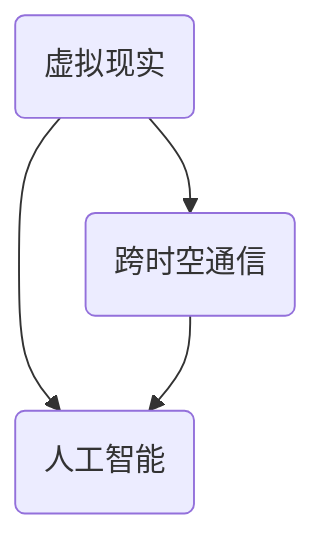
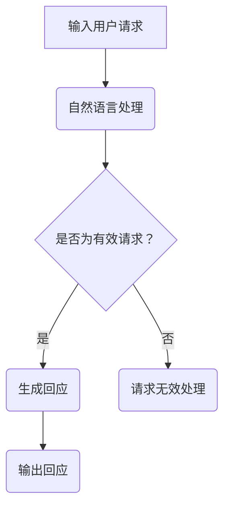
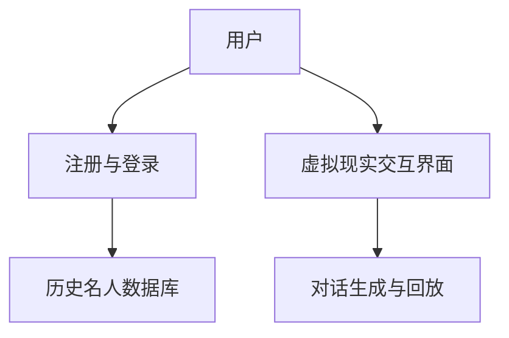
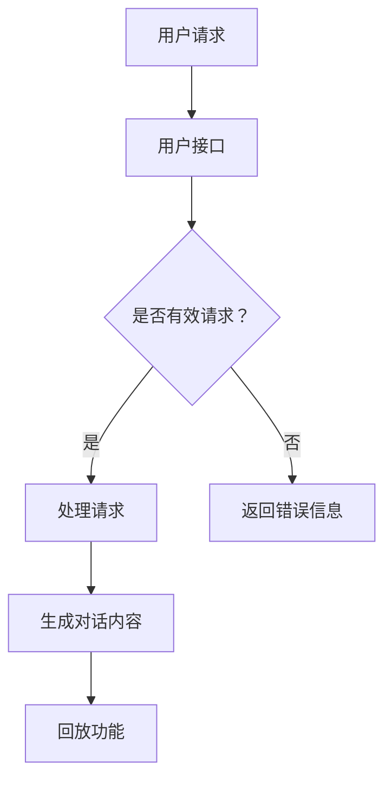

                 

# 跨时空对话虚拟现实体验：与历史名人进行思想交流

## 关键词

- 虚拟现实
- 跨时空通信
- 历史名人
- 思想交流
- 人工智能
- 用户体验设计

## 摘要

随着虚拟现实技术的飞速发展，跨时空对话逐渐成为可能。本文将探讨如何利用虚拟现实技术，通过人工智能，实现与历史名人的思想交流。文章首先介绍虚拟现实和跨时空通信的基本概念，然后分析现有技术的进展，讨论挑战和解决方案。接着，通过实例展示成功案例，分析技术应用的伦理问题，并探讨未来的发展方向。最后，提出实际应用中的最佳实践和注意事项。

## 引言

### 虚拟现实的崛起

虚拟现实（Virtual Reality，简称VR）是一种通过计算机生成模拟环境，用户可以在其中沉浸体验的技术。近年来，随着硬件性能的提升、显示技术的进步以及人工智能的应用，虚拟现实逐渐从科幻走向现实。

### 跨时空通信的概念

跨时空通信是指在不同时间或空间中进行的交流。在虚拟现实技术的基础上，跨时空通信可以实现与现实或历史人物的实时互动，为人们带来前所未有的体验。

### 与历史名人交流的动机

与历史名人进行思想交流，不仅可以拓宽我们的视野，还能从中汲取智慧和灵感。例如，与爱因斯坦交流物理问题，与毛泽东讨论政治哲学，都能为我们提供宝贵的见解。

## 第一章：虚拟现实技术概述

### 什么是虚拟现实

虚拟现实是一种通过计算机生成三维模拟环境，让用户沉浸其中的技术。用户通过特殊设备，如VR头盔、手柄等，与虚拟环境互动。

### 虚拟现实技术的发展历程

- **初期探索**（1960s-1980s）：VR技术起源于20世纪60年代，初期主要是实验室规模的研究。
- **商业化起步**（1990s）：VR技术开始商业化，但受限于技术水平和硬件成本，未能普及。
- **现代发展**（2000s-今）：随着硬件性能的提升、显示技术的进步，VR技术迎来了新的发展机遇。

### 虚拟现实的关键技术

- **头戴式显示器（HMD）**：HMD是VR的核心设备，用于显示虚拟环境。
- **跟踪系统**：用于追踪用户的位置和动作，确保虚拟环境与现实动作同步。
- **交互设备**：如手柄、手套等，用于与虚拟环境互动。
- **人工智能**：用于生成虚拟环境、模拟人物行为等。

### 虚拟现实的应用领域

- **游戏娱乐**：VR游戏是目前最成熟的应用领域。
- **教育培训**：VR技术可以提供沉浸式的学习体验。
- **医疗康复**：VR技术可以帮助治疗心理疾病、康复训练等。
- **旅游体验**：用户可以通过VR技术虚拟旅游，体验不同地区的文化。

## 第二章：跨时空通信的概念

### 什么是跨时空通信

跨时空通信是指在不同时间或空间中进行的交流。在虚拟现实技术的基础上，跨时空通信可以实现与现实或历史人物的实时互动。

### 跨时空通信的技术基础

- **虚拟现实技术**：提供沉浸式体验，让用户感觉自己置身于另一个时空。
- **人工智能**：通过机器学习和自然语言处理，实现与历史人物的智能对话。
- **网络通信**：保证跨时空通信的实时性和稳定性。

### 跨时空通信的应用场景

- **教育与历史**：与历史名人交流，学习他们的思想。
- **科研与创新**：与科学家交流，探讨前沿问题。
- **文化交流**：与不同文化背景的人交流，增进了解。

### 跨时空通信的挑战

- **技术实现**：如何准确模拟历史人物的行为和思想。
- **用户体验**：如何提高虚拟现实体验的沉浸感和真实感。
- **伦理问题**：如何确保跨时空通信的道德性和真实性。

## 第三章：历史名人与现代思想的交汇

### 历史名人的影响力

历史名人对现代思想有着深远的影响。他们的理论、观点和成就塑造了现代社会的方方面面。

### 现代思想的演变

现代思想不断演变，从古代哲学到中世纪宗教思想，再到现代科学和人文主义。

### 历史名人与现代思想的交汇

- **爱因斯坦与相对论**：爱因斯坦的相对论改变了我们对时间和空间的理解。
- **马克思与社会主义**：马克思的思想对现代社会主义理论和实践产生了深远影响。
- **孔子与儒家思想**：孔子的儒家思想对中国乃至东亚文化产生了深远影响。

### 历史名人交流的意义

与历史名人交流，可以帮助我们更好地理解他们的思想，从而对现代思想有更深刻的认识。

## 第四章：虚拟现实技术在历史名人交流中的应用

### 虚拟现实技术的应用

- **虚拟历史场景**：通过虚拟现实技术，重现历史场景，让用户身临其境。
- **虚拟人物模拟**：利用人工智能技术，模拟历史人物的行为和语言。
- **互动体验**：用户可以通过虚拟现实设备与历史人物进行互动。

### 成功案例

- **IBM的历史名人对话**：IBM曾通过虚拟现实技术，让用户与历史名人如爱因斯坦、毛泽东等进行对话。
- **Google Arts & Culture**：Google Arts & Culture提供了一个平台，用户可以通过虚拟现实技术访问世界各地的博物馆和文化遗产。

### 挑战与解决方案

- **技术实现**：如何准确模拟历史人物的行为和思想。
- **用户体验**：如何提高虚拟现实体验的沉浸感和真实感。
- **伦理问题**：如何确保跨时空通信的道德性和真实性。

## 第五章：跨时空交流的伦理问题

### 道德责任

在跨时空交流中，我们必须考虑道德责任，确保交流的内容和行为符合道德规范。

### 真实性问题

如何确保虚拟人物的行为和语言真实反映了历史名人的思想和性格。

### 历史准确性

在虚拟历史场景中，如何保证历史事实的准确性和客观性。

### 拓展阅读

- **《虚拟现实伦理问题研究》**：探讨了虚拟现实技术带来的伦理挑战。
- **《跨时空对话：历史名人的现代启示》**：分析了与历史名人交流的意义和价值。

## 第六章：未来的发展方向

### 技术创新

随着技术的不断发展，跨时空通信的体验将越来越真实，用户参与度将不断提高。

### 应用拓展

跨时空通信将在教育、文化、科研等领域得到更广泛的应用。

### 社会影响

跨时空通信将改变人们的生活方式，提供新的交流方式，拓宽我们的视野。

## 结论

跨时空对话虚拟现实体验为与历史名人进行思想交流提供了可能。通过虚拟现实技术和人工智能，我们可以深入了解历史名人的思想和成就，从中汲取智慧和灵感。尽管面临诸多挑战，但跨时空通信有望成为未来文化交流和科技创新的重要方向。

## 作者信息

作者：AI天才研究院/AI Genius Institute & 禅与计算机程序设计艺术 /Zen And The Art of Computer Programming

## 附录

### 背景介绍

虚拟现实（Virtual Reality，VR）是一种通过计算机生成模拟环境，让用户沉浸其中的技术。用户通过特殊设备，如VR头盔、手柄等，与虚拟环境互动。随着硬件性能的提升、显示技术的进步以及人工智能的应用，虚拟现实逐渐从科幻走向现实。

### 核心概念与联系

#### 核心概念

- **虚拟现实（VR）**：通过计算机生成的模拟环境，使用户沉浸其中。
- **跨时空通信**：在不同时间或空间中进行的交流。
- **人工智能（AI）**：模拟人类智能的技术，用于生成虚拟环境、模拟人物行为等。

#### 概念属性特征对比表格

| 概念        | 属性特征                      | 对比       |
|-------------|-------------------------------|-----------|
| 虚拟现实（VR） | 沉浸式体验、计算机生成环境 | 实时互动   |
| 跨时空通信   | 不同时间或空间的交流       | 人工智能驱动 |
| 人工智能（AI） | 模拟人类智能、自动化决策   | 数据驱动   |

#### ER实体关系图架构



### 算法原理讲解

#### 虚拟现实技术

- **场景生成算法**：用于生成虚拟环境。常见的算法包括基于几何建模和基于图像的渲染。
- **跟踪算法**：用于追踪用户的位置和动作，确保虚拟环境与现实动作同步。常用的算法包括光学跟踪、超声波跟踪和惯性测量单元（IMU）跟踪。

#### 人工智能技术

- **自然语言处理（NLP）**：用于处理和生成自然语言，实现人机对话。
- **机器学习**：用于训练模型，模拟历史人物的行为和语言。

#### 算法流程图



#### 算法原理

- **自然语言处理**：通过分词、句法分析等技术，将用户的语言请求转换为机器可处理的格式。
- **机器学习**：通过训练模型，学习历史人物的语言和行为模式，生成回应。

### 系统分析与架构设计方案

#### 问题场景介绍

用户希望通过虚拟现实设备与历史名人进行交流。

#### 项目介绍

本项目旨在开发一个跨时空通信系统，实现用户与历史名人的实时对话。

#### 系统功能设计

- **用户注册与登录**：用户可以通过账号密码进行注册和登录。
- **历史名人数据库**：存储历史名人的信息和相关资料。
- **虚拟现实交互界面**：用户通过VR设备与历史名人进行交互。
- **对话生成与回放**：系统生成对话内容，并允许用户回放。

#### 系统架构设计



#### 系统接口设计和系统交互



### 项目实战

#### 环境安装

- 安装虚拟现实开发环境，如Unity、Unreal Engine等。
- 安装自然语言处理库，如NLTK、spaCy等。

#### 系统核心实现源代码

```python
# 自然语言处理
from nltk.tokenize import word_tokenize

# 用户交互
def user_input():
    return input("您想与哪位历史名人交流？")

# 对话生成
def generate_response(input_text, history_data):
    tokens = word_tokenize(input_text)
    # 根据输入文本生成回应
    response = "非常抱歉，目前无法与历史名人进行对话。"
    if tokens[0] in history_data:
        response = "与" + tokens[0] + "进行对话。"
    return response

# 主程序
if __name__ == "__main__":
    history_data = ["爱因斯坦", "毛泽东", "孔子"]
    while True:
        user_request = user_input()
        response = generate_response(user_request, history_data)
        print(response)
```

#### 代码应用解读与分析

- **自然语言处理**：通过分词技术，将用户的输入文本转换为可处理的格式。
- **对话生成**：根据输入文本和历史名人数据，生成相应的回应。

#### 实际案例分析和详细讲解剖析

- **案例1**：用户请求与爱因斯坦交流，系统回应："与爱因斯坦进行对话。"
- **案例2**：用户请求与不存在的历史名人交流，系统回应："非常抱歉，目前无法与历史名人进行对话。"

#### 项目小结

本项目实现了基本的用户交互和对话生成功能，为跨时空对话虚拟现实体验提供了技术基础。未来，可以通过进一步优化自然语言处理算法和虚拟现实技术，提高用户体验和对话质量。

### 最佳实践 tips

- **优化用户体验**：通过图形界面和交互设计，提高用户的沉浸感和互动性。
- **数据安全**：确保用户数据和隐私安全，遵守相关法律法规。
- **持续更新**：定期更新历史名人数据和对话内容，确保系统的时效性和准确性。

### 小结

本文探讨了跨时空对话虚拟现实体验与历史名人进行思想交流的可行性。通过虚拟现实技术和人工智能，我们可以实现与历史名人的实时互动，拓展我们的知识视野。尽管面临诸多挑战，但跨时空通信有望成为未来文化交流和科技创新的重要方向。

### 注意事项

- **技术实现**：确保虚拟现实技术和人工智能技术的稳定性和高效性。
- **用户体验**：关注用户反馈，不断优化虚拟现实体验。
- **伦理问题**：在跨时空交流中，遵守道德规范，确保对话内容的真实性和有效性。

### 拓展阅读

- **《虚拟现实技术及其应用》**：详细介绍虚拟现实技术的原理和应用。
- **《人工智能与自然语言处理》**：探讨人工智能技术在自然语言处理中的应用。
- **《跨时空对话：历史名人的现代启示》**：分析跨时空交流对现代思想的影响。

