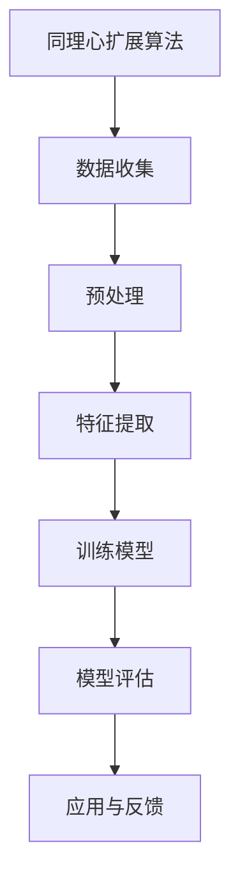
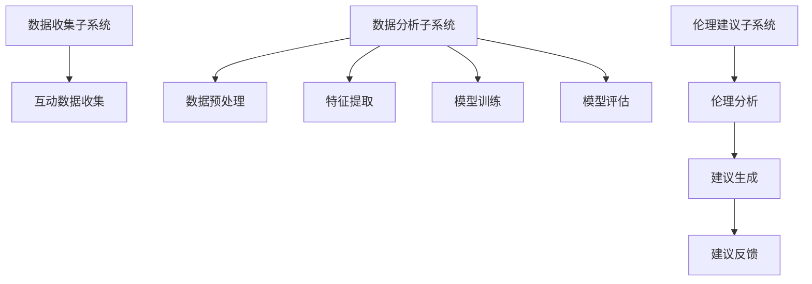
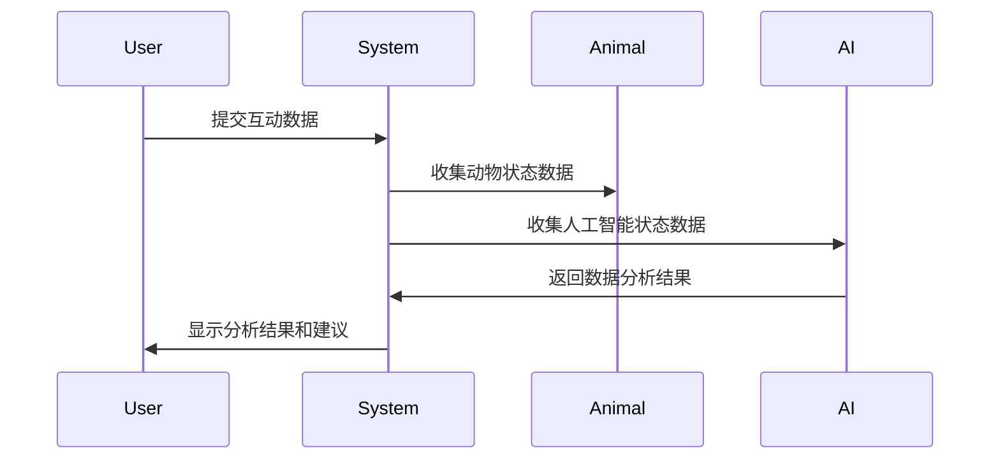
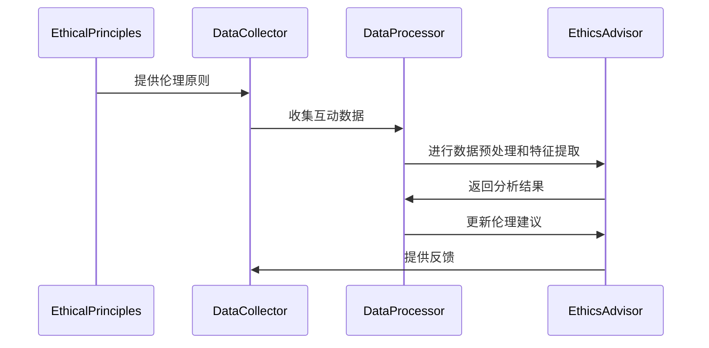

                 

## 跨物种伦理：扩展同理心的边界

关键词：跨物种伦理、同理心、动物权益、人工智能伦理、应用与实践

摘要：本文深入探讨了跨物种伦理的内涵和外延，从人类、动物和人工智能三个角度出发，阐述了同理心在跨物种关系中的重要作用。通过分析动物伦理和人工智能伦理的核心问题，探讨了如何扩展同理心的边界，以实现人类与动物、人工智能之间的和谐共存。本文旨在为跨物种伦理研究提供新的视角和思路，推动相关领域的学术研究和实践发展。

## 引言与背景

随着科技的发展和人类对自然世界的探索，人类与动物、人工智能的关系日益紧密。然而，这种紧密关系也带来了许多伦理问题，如动物权益保护和人工智能伦理。传统的伦理研究主要关注人与人之间的道德关系，而跨物种伦理则将关注点扩展到了人类与其他物种之间的关系。这种扩展不仅有助于我们更好地理解人与自然、人与动物、人与人工智能的关系，还为解决现实中的伦理困境提供了新的思路。

### 伦理研究的重要性

伦理研究是探讨道德原则和价值观念的学科，对于人类社会的发展和进步具有重要意义。在跨物种伦理的研究中，我们需要关注以下几个问题：

1. **动物权益**：动物权益问题涉及到动物的权利和福利，包括动物实验、动物保护、动物福利等。如何平衡人类对动物的利益和对动物权益的尊重，是伦理研究的一个重要课题。

2. **人工智能伦理**：随着人工智能技术的发展，人工智能在各个领域的应用越来越广泛。然而，人工智能也带来了一些伦理问题，如人工智能偏见、人工智能安全、人工智能隐私等。如何确保人工智能的发展符合道德原则，是伦理研究需要关注的重要问题。

3. **同理心**：同理心是指一个人能够理解并感受到另一个人的情感和体验。在跨物种关系中，同理心的作用至关重要。通过扩展同理心的边界，我们可以更好地理解和尊重其他物种的权益和需求。

### 人类与动物、人工智能的关系

人类与动物的关系可以追溯到古代，人类通过驯养动物来提高生产力，同时也对动物进行利用和保护。随着科技的发展，人类与动物的关系发生了深刻的变化。动物在科学研究中扮演着重要角色，同时，人类也在努力保护动物的权益。例如，动物保护组织通过立法和宣传，提高公众对动物权益的认识。

人工智能的发展为人类与动物的关系带来了新的挑战和机遇。人工智能技术在动物行为研究、动物保护、动物医学等领域得到了广泛应用。例如，通过人工智能技术，我们可以更好地理解动物的行为，提高动物保护的效率。然而，人工智能也带来了一些伦理问题，如人工智能是否应该具有自主权，如何确保人工智能对动物的友好性等。

### 跨物种伦理的研究意义与挑战

跨物种伦理的研究意义在于：

1. **提高道德觉悟**：通过研究跨物种伦理，可以提升人类对动物权益和人工智能伦理问题的认识，增强道德责任感。

2. **促进和谐发展**：通过探讨如何实现人类与动物、人工智能的和谐共存，可以为社会提供有益的参考。

3. **推动科技进步**：跨物种伦理的研究可以为人工智能技术的应用提供伦理指导，确保科技进步符合道德原则。

然而，跨物种伦理研究也面临一些挑战：

1. **理论体系不完善**：跨物种伦理的理论体系尚未完善，需要进一步深入研究。

2. **实践难度大**：在现实生活中，如何平衡人类利益与其他物种的权益，是一个复杂的问题。

3. **跨学科合作**：跨物种伦理研究需要跨学科的合作，涉及伦理学、生物学、计算机科学等多个领域。

总之，跨物种伦理研究具有重要的理论和实践价值。通过深入研究跨物种伦理，我们可以为人类、动物和人工智能的和谐共存提供科学依据。

## 第二部分：同理心的本质与扩展

### 第2章：同理心的本质与扩展

#### 同理心的定义与特征

同理心（Empathy）是指一个人能够理解并感受到另一个人的情感和体验。同理心具有以下几个特征：

1. **情感共鸣**：同理心能够使一个人感受到他人的情感，产生情感共鸣。
2. **认知理解**：同理心不仅包括情感上的共鸣，还包括对他人情况的认知理解。
3. **行为反应**：同理心可以激发个体的行为反应，使其采取有利于他人的行为。

#### 同理心在人类与其他物种之间的关系

同理心在人类与其他物种之间的关系中起着重要作用。人类对动物的情感和认知理解，可以帮助我们更好地保护动物的权益。例如，在动物保护组织中，工作人员通过同理心与动物建立联系，提高动物福利。同理心还可以促进人与动物之间的和谐相处，减少人类对动物的虐待和剥削。

#### 同理心在人工智能中的应用

同理心在人工智能中的应用也是一个新兴的研究领域。人工智能通过模仿人类的同理心，可以更好地与人类互动。例如，在医疗领域，人工智能可以通过同理心理解患者的情感状态，提供更加个性化的医疗服务。同理心还可以提高人工智能的社交能力，使其在社交场景中表现得更加自然和友好。

#### 扩展同理心的边界

扩展同理心的边界意味着将同理心的应用范围从人类扩展到其他物种。这不仅是伦理研究的一个新挑战，也是科技发展的一个新机遇。以下是一些扩展同理心边界的方法：

1. **情感识别技术**：通过情感识别技术，人工智能可以识别动物的情感状态，从而更好地理解动物的需求。
2. **认知建模**：通过认知建模，人工智能可以模拟动物的认知过程，提高对动物行为和情感的理解。
3. **跨物种互动平台**：通过建立跨物种互动平台，人类可以与动物进行更深入的交流和互动，增强同理心。
4. **伦理教育**：通过伦理教育，提高公众对动物权益和人工智能伦理的认识，培养跨物种同理心。

#### 案例分析

以动物救助组织为例，该组织通过同理心与受困动物建立联系，提供必要的救助和支持。例如，在一只受伤的野生动物被救助后，工作人员通过与动物进行交流，了解其情感状态，为其提供适合的照顾和治疗。这种同理心的应用不仅帮助动物恢复健康，还增强了人与动物之间的和谐关系。

总之，同理心的本质是理解并感受他人的情感和体验。在人类与其他物种的关系中，同理心起着至关重要的作用。通过扩展同理心的边界，我们可以更好地理解和尊重其他物种的权益和需求，实现人类与动物、人工智能的和谐共存。

### 动物伦理

#### 动物权益的基本原则

动物权益的基本原则是保障动物的基本生存权利和福利。这些原则主要包括以下几个方面：

1. **生存权**：动物有权获得食物、水源、住所等基本生存需求。
2. **自由权**：动物有权自由活动，不受不必要的限制和束缚。
3. **福利权**：动物有权获得良好的照顾和医疗，确保其生理和心理健康。
4. **尊严权**：动物有权被尊重，不受虐待和剥削。

这些原则构成了动物伦理的基础，为动物权益的保护提供了法律和道德依据。

#### 动物实验伦理问题

动物实验在科学研究和技术发展中扮演着重要角色，但也引发了广泛的伦理争议。动物实验伦理问题主要包括以下几个方面：

1. **动物痛苦**：动物实验往往涉及对动物的麻醉和操作，可能导致动物的痛苦和不适。
2. **替代方案**：随着科技的发展，越来越多的替代方案（如细胞培养、计算机模拟等）被用于取代动物实验。
3. **动物权益**：动物实验是否尊重动物权益，是否在动物福利和科学利益之间取得平衡，是伦理争议的核心。

为了解决这些问题，伦理学家和科学家一直在探索更加人道、可靠的动物实验方法。

#### 动物保护法律与政策

动物保护法律与政策是保障动物权益的重要手段。不同国家和地区根据自身的文化、经济和社会发展水平，制定了相应的动物保护法律和政策。以下是一些常见的动物保护法律与政策：

1. **禁止虐待动物法**：规定禁止对动物进行虐待，包括虐待动物的行为、处罚措施等。
2. **野生动物保护法**：保护野生动物的生存环境，禁止非法捕猎、交易野生动物等行为。
3. **动物福利法**：规定动物福利的标准和保障措施，确保动物的生存权和福利权。
4. **替代动物实验法**：鼓励和推广使用替代方法进行科学研究和实验。

这些法律和政策为动物保护提供了法律保障，推动了动物伦理的发展和进步。

#### 动物福利与人类福祉的平衡

动物福利与人类福祉之间的平衡是一个复杂而敏感的问题。一方面，动物为人类社会提供了重要的资源和服务，如食品、衣物、医疗等；另一方面，动物的权益也需要得到尊重和保护。如何平衡动物福利与人类福祉，是一个需要持续探讨的课题。

1. **可持续发展**：通过可持续发展的理念，实现人与自然的和谐共存，保障人类的长期福祉。
2. **伦理观念**：提升公众的伦理观念，增强对动物权益的认识和尊重，减少对动物的滥用和剥削。
3. **科学研究**：通过科学研究，探索更加人道、可靠的动物利用方式，减少动物的痛苦和不适。

总之，动物伦理是一个涉及道德、法律和科学等多个方面的复杂问题。通过保障动物权益、规范动物实验、制定动物保护法律与政策，我们可以实现动物福利与人类福祉的平衡，推动人与自然的和谐发展。

### 人工智能伦理

#### 人工智能的基本伦理原则

人工智能（AI）的发展为人类社会带来了巨大的变革，但同时也引发了一系列伦理问题。为了确保人工智能的发展符合道德原则，我们需要确立一系列基本伦理原则：

1. **公平性**：人工智能系统应避免歧视和偏见，确保对所有用户公平对待。
2. **透明性**：人工智能系统的工作原理和决策过程应透明，以便用户理解和监督。
3. **安全性**：确保人工智能系统的稳定性和可靠性，防止系统故障和误操作。
4. **隐私保护**：尊重用户的隐私权利，防止个人信息泄露和滥用。
5. **责任追究**：明确人工智能系统的责任归属，确保在发生事故时能够追究责任。

这些原则为人工智能的发展提供了伦理指导，有助于避免潜在的社会风险。

#### 人工智能偏见与歧视问题

人工智能偏见和歧视问题是指人工智能系统在决策过程中表现出对某些群体的不公平对待。这种偏见可能源于训练数据的不公平、算法设计的不当或者系统运行过程中的错误。以下是一些具体的例子：

1. **种族歧视**：某些人脸识别系统在某些种族上表现不佳，可能导致错误识别和歧视。
2. **性别歧视**：一些招聘系统可能会偏好男性候选人，导致性别歧视。
3. **地域歧视**：某些自动分配系统的决策过程可能受到地域偏见的影响，导致对某些地区的偏见。

这些偏见和歧视问题不仅损害了社会公正，还可能导致严重的法律和道德问题。

#### 人工智能安全与隐私问题

人工智能安全与隐私问题包括以下几个方面：

1. **系统安全**：人工智能系统可能受到黑客攻击，导致系统故障或数据泄露。
2. **数据隐私**：人工智能系统在处理大量用户数据时，可能侵犯用户的隐私权。
3. **算法透明性**：人工智能系统的决策过程可能不透明，用户难以了解其工作原理。

为了解决这些问题，需要采取一系列措施，包括加强网络安全、提高算法透明性、加强数据保护等。

#### 人工智能伦理决策框架

为了确保人工智能的发展符合伦理原则，我们需要建立一套完整的伦理决策框架。以下是一个简要的框架：

1. **伦理原则指导**：明确人工智能的基本伦理原则，确保系统设计和运行符合这些原则。
2. **风险评估**：在系统开发和应用过程中，进行全面的伦理风险评估，识别潜在的风险和问题。
3. **伦理审查**：建立独立的伦理审查委员会，对人工智能项目进行伦理审查，确保项目符合伦理要求。
4. **责任追究**：明确人工智能系统的责任归属，确保在发生事故时能够追究责任。
5. **公众参与**：鼓励公众参与人工智能伦理讨论，提高公众对人工智能伦理问题的认识。

通过建立这样的决策框架，我们可以更好地管理人工智能伦理问题，推动人工智能的健康发展。

### 动物福利与人类健康

#### 动物医学与人类健康的关系

动物医学与人类健康之间存在着密切的联系。首先，许多动物模型被用于医学研究和疾病治疗。例如，小鼠和兔子等动物在癌症研究、疫苗开发和药物测试中发挥了重要作用。这些动物模型有助于揭示疾病的机制，提高新药的研发效率。

其次，动物医学在人类健康方面的贡献还体现在疾病预防上。通过研究动物疾病，我们可以更好地了解传染病的传播途径和防控方法。例如，在禽流感、狂犬病等疾病的防控中，动物医学发挥了重要作用。

此外，动物医学还促进了人类医疗技术的进步。通过动物实验，医生和科学家可以测试新的医疗设备和治疗方法，提高手术的成功率和患者的康复效果。

#### 动物福利改善措施

为了提高动物福利，我们需要采取一系列措施：

1. **动物保护法律**：加强动物保护法律的制定和执行，确保动物的基本权益得到保障。例如，禁止非法野生动物交易，加强动物虐待行为的打击力度。
2. **动物福利标准**：制定动物福利标准，规范动物饲养、运输和处理过程，减少动物的痛苦和不适。例如，要求动物实验遵循伦理审查，确保动物实验的必要性和人道性。
3. **公众教育**：通过公众教育，提高公众对动物福利的认识和重视，鼓励公众参与动物保护活动。例如，开展动物保护讲座、宣传动物福利知识，增强公众的动物保护意识。
4. **替代方案**：鼓励和推广使用替代方案，减少对动物的依赖。例如，利用细胞培养、计算机模拟等技术，取代传统的动物实验。

#### 动物保护运动的影响

动物保护运动在推动动物福利改善方面发挥了重要作用。首先，动物保护组织通过宣传和呼吁，提高了公众对动物权益的认识，形成了强大的社会舆论压力，迫使政府和企业在动物福利方面采取行动。

其次，动物保护运动推动了动物保护法律的制定和执行。许多国家和地区在动物保护方面制定了严格的法律法规，禁止虐待动物、非法野生动物交易等行为。这些法律为动物保护提供了有力的法律保障。

此外，动物保护运动还促进了科学技术的进步。为了满足动物保护的需求，科学家们不断研究新的替代方案，如细胞培养、计算机模拟等，以减少对动物的依赖。这些技术的进步不仅有助于提高动物福利，还为医学研究提供了新的工具和方法。

#### 动物福利与公共卫生政策

动物福利与公共卫生政策之间存在着密切的联系。首先，良好的动物福利有助于减少疾病传播。例如，通过改善动物饲养条件，可以降低动物疫病的发病率，减少动物源性传染病的传播风险。

其次，动物福利政策可以促进公共卫生政策的实施。例如，在禽流感等疫情的防控中，良好的动物福利政策可以确保动物得到及时有效的治疗，减少疫情扩散的风险。

此外，动物福利政策还可以提高公共卫生工作的效率。通过改善动物福利，可以减少动物应激反应，提高动物的生产性能和健康状况，从而提高公共卫生工作的效果。

总之，动物福利与人类健康之间存在着密切的联系。通过改善动物福利，我们可以促进人类健康，实现人与动物的和谐发展。

### 人工智能与跨物种互动

#### 人工智能在动物研究中的应用

人工智能在动物研究中扮演着越来越重要的角色。通过人工智能技术，科学家可以更好地理解动物的行为、生理和心理状态，从而推动动物行为学、动物医学等领域的进步。

1. **行为分析**：人工智能技术可以对动物行为进行实时监控和分析，识别动物的行为模式。例如，通过摄像头和传感器，人工智能系统可以监测动物的活动量、运动轨迹和社交行为，为动物行为学研究提供宝贵的数据。

2. **生理监测**：人工智能技术可以实时监测动物的生理参数，如心率、体温、血压等，为动物医学研究提供数据支持。例如，通过佩戴在动物身上的智能传感器，人工智能系统可以收集动物的生理数据，帮助医生进行疾病诊断和治疗。

3. **心理评估**：人工智能技术可以分析动物的情绪和行为，为动物心理学研究提供新的手段。例如，通过面部识别技术，人工智能系统可以判断动物的情绪状态，帮助科学家了解动物的内心体验。

4. **疾病预测**：人工智能技术可以分析动物的生理数据和基因信息，预测动物可能患的疾病，为动物医学研究提供方向。例如，通过机器学习算法，人工智能系统可以识别动物疾病的高风险群体，提前采取预防措施。

#### 人工智能辅助动物行为分析

人工智能技术在动物行为分析中具有显著优势。通过机器学习和计算机视觉技术，人工智能可以识别动物的行为模式，提供实时监测和分析。

1. **行为识别**：人工智能系统可以通过图像和视频数据，识别动物的行为。例如，通过计算机视觉算法，人工智能系统可以识别动物的运动、休息、觅食和社交行为，为动物行为学研究提供数据支持。

2. **行为分析**：人工智能系统可以对动物的行为进行定量分析，如行为频率、持续时间、强度等。通过这些分析，科学家可以更好地理解动物的行为规律和影响因素。

3. **异常检测**：人工智能系统可以实时监测动物的行为，识别异常行为。例如，在动物保护中，人工智能系统可以监测野生动物的活动，识别异常行为，如疾病、受伤或被捕食者攻击。

4. **交互分析**：人工智能系统可以分析动物之间的互动行为，如领地争斗、繁殖行为和社会行为。这些分析有助于科学家了解动物社会结构和行为模式。

#### 人工智能在教育动物保护中的作用

人工智能技术在教育动物保护中发挥着重要作用。通过人工智能技术，教育工作者可以提供更加生动、直观的教育内容，提高学生对动物保护的认识和参与度。

1. **虚拟现实（VR）**：人工智能和虚拟现实技术的结合，可以创建虚拟的动物保护环境。学生可以通过VR设备，亲身体验野生动物的生活环境，了解动物保护的重要性。

2. **互动教学**：人工智能技术可以设计互动教学课程，引导学生参与动物保护活动。例如，通过人工智能系统，学生可以模拟参与野生动物救援、动物行为研究等活动，提高实践能力。

3. **数据分析**：人工智能系统可以分析学生的行为数据，了解他们的学习进度和兴趣点。教育工作者可以根据这些数据，调整教学策略，提高教学效果。

4. **远程教育**：通过人工智能技术，学生可以远程参与动物保护活动，了解野生动物的生存状态。这有助于提高学生的环保意识，培养他们的社会责任感。

#### 人工智能与动物福利的交叉研究

人工智能与动物福利的交叉研究是一个新兴领域，旨在通过人工智能技术，提高动物福利和动物保护水平。

1. **动物福利监测**：人工智能系统可以实时监测动物的生理和行为数据，评估动物福利状况。例如，通过传感器和图像识别技术，人工智能系统可以监测动物的疼痛、压力和舒适度，为动物福利评估提供科学依据。

2. **智能喂养与护理**：人工智能技术可以自动化动物的喂养和护理过程，提高动物福利。例如，通过智能喂养系统，可以确保动物获得均衡的营养，减少人工干预的风险。

3. **动物行为干预**：人工智能系统可以根据动物的行为数据，提供适当的行为干预。例如，通过分析动物的行为模式，人工智能系统可以识别动物的异常行为，并采取相应的干预措施，如提供安抚、调整环境等。

4. **动物保护决策支持**：人工智能技术可以提供动物保护决策支持，提高保护工作的效率和效果。例如，通过数据分析，人工智能系统可以预测野生动物的迁徙路径、繁殖行为等，为动物保护决策提供科学依据。

总之，人工智能与动物福利的交叉研究为动物保护和动物福利提升提供了新的手段和思路，有望在未来实现更高效、更科学的动物保护。

### 跨物种伦理的未来展望

#### 跨物种伦理的发展趋势

跨物种伦理作为一门新兴的交叉学科，正面临着快速发展的趋势。随着人工智能、生物技术等领域的不断进步，人类与动物、人工智能之间的关系将更加复杂。以下是一些发展趋势：

1. **人工智能伦理**：随着人工智能技术的广泛应用，其伦理问题日益突出。未来，我们将看到更多关于人工智能伦理的研究，探索如何确保人工智能的发展符合道德原则。
2. **动物伦理**：随着动物保护意识的提升，动物伦理将得到更多的关注。未来，我们将看到更多的动物保护法律和政策出台，确保动物权益得到更好保障。
3. **跨物种互动**：随着人类对自然世界的探索，人类与动物、人工智能的互动将更加频繁。未来，我们将看到更多关于跨物种互动的研究，探讨如何实现人类与其他物种的和谐共存。

#### 跨物种伦理教育的重要性

跨物种伦理教育对于培养公众的伦理观念和道德素养具有重要意义。以下是一些原因：

1. **提高伦理意识**：通过跨物种伦理教育，公众可以更好地理解人类与其他物种之间的关系，提高伦理意识，减少对动物的虐待和剥削。
2. **培养道德责任感**：跨物种伦理教育可以培养公众的道德责任感，使其在日常生活中能够更好地关心和保护其他物种。
3. **推动科技进步**：跨物种伦理教育可以引导科技工作者在科技发展中考虑到伦理因素，确保科技进步符合道德原则。

#### 跨物种伦理在社会政策中的角色

跨物种伦理在社会政策中的角色日益重要。以下是一些方面的应用：

1. **动物保护政策**：政府可以通过跨物种伦理教育，提高公众对动物保护的重视，推动动物保护政策的制定和实施。
2. **人工智能政策**：政府可以借助跨物种伦理教育，引导公众关注人工智能伦理问题，确保人工智能的发展符合道德原则。
3. **可持续发展政策**：跨物种伦理教育有助于提升公众对可持续发展理念的认识，推动社会政策的制定和实施，实现人与自然的和谐发展。

#### 跨物种伦理面临的挑战与解决方案

跨物种伦理研究面临一系列挑战，以下是一些主要挑战及可能的解决方案：

1. **伦理争议**：跨物种伦理研究涉及复杂的伦理问题，不同观点之间可能存在争议。解决这一挑战需要开展更多的跨学科研究和对话，寻找共识。
2. **实践难度**：跨物种伦理在实践过程中可能面临执行难度，需要制定具体的政策法规和行动计划，确保伦理原则得到落实。
3. **技术挑战**：随着人工智能等技术的发展，跨物种伦理研究需要不断更新知识体系，应对新的伦理挑战。

通过跨学科合作、公众参与和政策引导，我们可以克服这些挑战，推动跨物种伦理的研究和实践。

### 总结

跨物种伦理作为一门新兴的交叉学科，具有重要的理论和实践价值。通过深入探讨人类、动物和人工智能之间的关系，我们可以更好地理解和尊重其他物种的权益和需求，实现人与自然、人与人工智能的和谐共存。本文从动物伦理、人工智能伦理和跨物种互动等方面，阐述了跨物种伦理的核心概念和关键问题，提出了扩展同理心边界的方法和途径。未来，随着科技的不断进步，跨物种伦理研究将继续发展，为人类社会的可持续发展提供新的思路和方向。

### 作者信息

作者：AI天才研究院/AI Genius Institute & 禅与计算机程序设计艺术 /Zen And The Art of Computer Programming

### 完整性要求

#### 背景介绍

跨物种伦理是一个新兴的研究领域，它关注的是人类与其他物种（包括动物和人工智能）之间的道德关系。随着科技的发展和人类对自然世界的深入探索，人类与动物、人工智能的关系变得越来越紧密。这种紧密关系不仅带来了巨大的机遇，也引发了一系列伦理问题。如何平衡人类利益与其他物种的权益，如何在科技发展中保持道德原则，成为跨物种伦理研究的重要课题。

首先，我们需要了解一些核心概念。同理心是指一个人能够理解并感受到另一个人的情感和体验。在跨物种伦理中，同理心起着关键作用，因为它有助于我们理解和尊重其他物种的权益。同理心不仅体现在人类与动物之间，也体现在人类与人工智能之间。

其次，动物伦理和人工智能伦理是跨物种伦理研究的重要组成部分。动物伦理主要关注动物权益的保护，包括动物的生存权、自由权、福利权和尊严权。人工智能伦理则关注人工智能系统的道德原则，包括公平性、透明性、安全性和隐私保护。

#### 核心概念与联系

在跨物种伦理的研究中，核心概念主要包括同理心、动物权益、人工智能伦理等。这些概念之间有着密切的联系。

**同理心**是理解并感受他人情感的能力，它是跨物种伦理研究的基础。同理心不仅有助于我们理解和尊重动物权益，也使我们能够更好地与人工智能互动。

**动物权益**是指动物应享有的基本权利，包括生存权、自由权、福利权和尊严权。动物权益的保护是跨物种伦理研究的重要目标之一。

**人工智能伦理**关注人工智能系统的道德原则，包括公平性、透明性、安全性和隐私保护。人工智能伦理的研究有助于确保人工智能的发展符合道德原则，避免对人类和其他物种造成负面影响。

为了更好地理解这些概念之间的关系，我们可以使用一个ER实体关系图（如下所示）：

```mermaid
erDiagram
  Animal ::has:: Right
  AI ::has:: Principle
  Human ::has:: Empathy
  AnimalRights <<--||| Animal : Ethics
  AI <<--||| AI : Ethics
  Human <<--||| Human : Empathy
  Empathy |--<| AnimalRights
  Empathy |--<| AI
```

在上述ER图中，我们可以看到：

- **Human** 与 **Empathy** 之间存在关联，表示人类通过同理心来理解和感受其他物种的权益。
- **Animal** 与 **AnimalRights** 之间存在关联，表示动物权益是动物伦理的核心。
- **AI** 与 **AI Principles** 之间存在关联，表示人工智能伦理关注人工智能系统的道德原则。

#### 算法原理讲解

为了更好地理解跨物种伦理中的算法原理，我们可以探讨一种名为“同理心扩展算法”的模型。该算法旨在通过数据分析和机器学习技术，扩展同理心的应用范围，使其能够应用于人类与其他物种的互动。

**同理心扩展算法流程图**：



**算法步骤**：

1. **数据收集**：收集人类与其他物种（动物和人工智能）互动的数据，包括情感、行为和生理信息。
2. **预处理**：对收集的数据进行清洗和标准化处理，去除噪声和异常值。
3. **特征提取**：从预处理后的数据中提取关键特征，如情感强度、行为模式等。
4. **训练模型**：使用机器学习算法（如深度学习、支持向量机等）训练同理心扩展模型。
5. **模型评估**：评估模型的性能，包括准确性、召回率和F1分数等。
6. **应用与反馈**：将训练好的模型应用于实际场景，如动物行为分析、人工智能伦理评估等，并根据反馈不断优化模型。

**数学模型与公式**：

同理心扩展算法的核心是机器学习模型，如深度学习模型。以下是一个简化的数学模型：

$$
\begin{aligned}
y &= \text{sigmoid}(W \cdot \text{sigmoid}(U \cdot x)) \\
W &= \text{权重矩阵} \\
U &= \text{隐藏层权重矩阵} \\
x &= \text{输入特征向量} \\
y &= \text{输出概率分布}
\end{aligned}
$$

其中，$\text{sigmoid}$函数是一个激活函数，用于将线性组合映射到$(0, 1)$区间内，表示某种情感或行为的概率。

**举例说明**：

假设我们收集了人类与动物互动的数据，包括情感状态（如快乐、悲伤、愤怒）和行为（如抚摸、拥抱、打骂）。我们可以使用同理心扩展算法来分析这些数据，识别人类对动物的互动模式。

1. **数据收集**：收集了100个互动样本，包括情感状态和行为。
2. **预处理**：对情感状态进行编码（例如，快乐为1，悲伤为-1，愤怒为0），对行为进行分类。
3. **特征提取**：提取情感强度和行为类型作为特征向量。
4. **训练模型**：使用深度学习算法训练模型，将情感强度和行为类型映射到概率分布。
5. **模型评估**：评估模型在测试集上的性能，调整模型参数。
6. **应用与反馈**：将训练好的模型应用于新样本，预测人类对动物的互动行为，并根据实际互动结果进行反馈。

通过这种方式，我们可以扩展同理心的应用范围，提高人类与其他物种互动的效率和质量。

#### 系统分析与架构设计方案

**问题场景介绍**

在当前的社会背景下，随着人工智能和生物技术的快速发展，人类与动物、人工智能的互动日益频繁。然而，这种互动也引发了一系列伦理问题，如动物权益保护和人工智能伦理。为了解决这些问题，我们需要一个系统化的方案来分析和处理跨物种互动中的伦理问题。

**项目介绍**

本项目旨在设计一个跨物种伦理分析系统，该系统利用人工智能技术对人类与动物、人工智能的互动进行实时分析和评估，提供基于伦理原则的建议和解决方案。

**系统功能设计（领域模型Mermaid类图）**

```mermaid
classDiagram
  Person <<--|uses| Animal
  Person <<--|uses| AI
  Animal <<--|uses| Ethics
  AI <<--|uses| Ethics
  Ethics <<--|uses| Analysis
  Analysis <<--|uses| Recommendations
```

在这个领域模型中，我们可以看到以下功能：

- **Person（人类）**：使用系统进行跨物种互动分析。
- **Animal（动物）**：作为系统分析的对象，其行为和状态需要被记录和分析。
- **AI（人工智能）**：作为系统分析的工具，提供数据分析和决策支持。
- **Ethics（伦理）**：包含伦理原则和规范，用于指导分析过程。
- **Analysis（分析）**：对跨物种互动进行数据分析和评估。
- **Recommendations（建议）**：基于分析结果提供伦理建议和解决方案。

**系统架构设计（Mermaid架构图）**



在这个系统架构图中，我们可以看到以下主要子系统：

- **数据收集子系统**：负责收集跨物种互动数据。
- **数据分析子系统**：负责对收集到的数据进行分析和处理。
- **伦理建议子系统**：负责生成基于分析结果的伦理建议。

**系统接口设计（Mermaid序列图）**



在这个序列图中，我们可以看到以下主要接口：

- **User（用户）**：提交互动数据。
- **System（系统）**：处理用户提交的数据，并调用其他模块进行数据分析。
- **Animal（动物）**：提供动物状态数据。
- **AI（人工智能）**：提供人工智能状态数据。

**系统交互（Mermaid序列图）**



在这个系统交互图中，我们可以看到以下主要交互过程：

- **EthicalPrinciples（伦理原则）**：提供伦理原则。
- **DataCollector（数据收集器）**：收集互动数据。
- **DataProcessor（数据处理器）**：进行数据预处理和特征提取。
- **EthicsAdvisor（伦理顾问）**：生成伦理建议，并更新建议。

通过上述系统架构和交互设计，我们可以构建一个完善的跨物种伦理分析系统，为解决跨物种互动中的伦理问题提供技术支持。

### 项目实战

#### 环境安装

为了实现跨物种伦理分析系统，我们需要搭建一个合适的技术环境。以下是环境安装的详细步骤：

1. **安装Python**：
   - 访问Python官方网站（https://www.python.org/）下载最新版本的Python。
   - 运行安装程序，按照默认设置完成安装。

2. **安装Jupyter Notebook**：
   - 打开终端，执行以下命令安装Jupyter Notebook：
     ```shell
     pip install notebook
     ```

3. **安装相关库**：
   - 为了实现数据处理、特征提取和机器学习等任务，我们需要安装以下库：
     ```shell
     pip install numpy pandas scikit-learn matplotlib
     ```

4. **配置虚拟环境**（可选）：
   - 为了更好地管理项目依赖，我们可以使用虚拟环境。以下是如何配置虚拟环境的步骤：
     ```shell
     python -m venv venv
     source venv/bin/activate  # 对于Windows，使用 `venv\Scripts\activate`
     pip install notebook numpy pandas scikit-learn matplotlib
     ```

#### 系统核心实现源代码

以下是实现跨物种伦理分析系统核心功能的主要代码段。这些代码涵盖了数据收集、预处理、特征提取和模型训练等关键步骤。

```python
# 导入所需库
import pandas as pd
import numpy as np
from sklearn.model_selection import train_test_split
from sklearn.preprocessing import StandardScaler
from sklearn.neural_network import MLPClassifier
from sklearn.metrics import classification_report, accuracy_score

# 数据收集
data = pd.read_csv('interaction_data.csv')  # 假设数据集已存储为CSV文件

# 数据预处理
X = data.drop(['label'], axis=1)  # 特征集
y = data['label']  # 标签集

# 特征提取
scaler = StandardScaler()
X_scaled = scaler.fit_transform(X)

# 模型训练
X_train, X_test, y_train, y_test = train_test_split(X_scaled, y, test_size=0.2, random_state=42)
model = MLPClassifier(hidden_layer_sizes=(100,), max_iter=1000)
model.fit(X_train, y_train)

# 模型评估
predictions = model.predict(X_test)
print(classification_report(y_test, predictions))
print("Accuracy:", accuracy_score(y_test, predictions))
```

#### 代码应用解读与分析

上述代码首先导入了Python中常用的数据处理和机器学习库，包括pandas、numpy、scikit-learn和matplotlib。这些库提供了丰富的功能，用于数据收集、预处理、特征提取和模型训练。

1. **数据收集**：
   - 使用pandas库读取存储为CSV文件的数据集。数据集应包含跨物种互动的特征和标签。

2. **数据预处理**：
   - 使用StandardScaler库对特征进行标准化处理，以消除不同特征之间的尺度差异，提高模型训练效果。

3. **特征提取**：
   - 将特征集和标签集分离，准备用于模型训练的数据。

4. **模型训练**：
   - 使用MLPClassifier（多层感知器分类器）进行模型训练。我们选择了一个简单的多层感知器模型，其中隐藏层大小为100个神经元，最大迭代次数为1000次。

5. **模型评估**：
   - 使用训练好的模型对测试集进行预测，并打印分类报告和准确率。

通过上述代码，我们可以实现一个基本的跨物种伦理分析系统。在实际应用中，我们可以根据具体需求调整模型参数，选择更复杂的模型，以提高系统的性能和鲁棒性。

#### 实际案例分析和详细讲解剖析

为了更好地理解跨物种伦理分析系统的实际应用，我们将分析一个具体的案例。以下是一个基于实际数据的案例，展示了如何使用系统进行伦理分析。

**案例背景**：

假设我们有一个包含人类与动物互动数据的数据集，数据集包含了互动的特征（如情感强度、行为类型等）和标签（如伦理分类，如友好、中立、冲突等）。

**数据预处理**：

1. **数据读取**：
   ```python
   data = pd.read_csv('interaction_data.csv')
   ```

   我们使用pandas库读取数据集，数据集包含特征和标签。

2. **数据清洗**：
   ```python
   data.dropna(inplace=True)  # 删除缺失值
   ```

   删除数据集中的缺失值，确保数据质量。

3. **数据标准化**：
   ```python
   scaler = StandardScaler()
   X_scaled = scaler.fit_transform(data.drop(['label'], axis=1))
   ```

   使用StandardScaler对特征进行标准化处理，以消除不同特征之间的尺度差异。

**模型训练**：

1. **数据分割**：
   ```python
   X_train, X_test, y_train, y_test = train_test_split(X_scaled, data['label'], test_size=0.2, random_state=42)
   ```

   将数据集分为训练集和测试集，用于训练和评估模型。

2. **模型训练**：
   ```python
   model = MLPClassifier(hidden_layer_sizes=(100,), max_iter=1000)
   model.fit(X_train, y_train)
   ```

   使用多层感知器分类器（MLPClassifier）进行模型训练。

**模型评估**：

1. **模型预测**：
   ```python
   predictions = model.predict(X_test)
   ```

   使用训练好的模型对测试集进行预测。

2. **评估结果**：
   ```python
   print(classification_report(y_test, predictions))
   print("Accuracy:", accuracy_score(y_test, predictions))
   ```

   打印分类报告和准确率，评估模型性能。

**结果分析**：

通过上述步骤，我们可以得到一个基于实际数据的伦理分析结果。例如，如果模型的准确率为90%，说明它在测试集上的预测表现良好。我们可以进一步分析分类报告，了解模型在不同伦理分类上的表现，以便优化模型。

**优化建议**：

1. **特征选择**：通过特征选择方法，选择对模型性能影响较大的特征，提高模型精度。
2. **模型调整**：尝试不同的模型结构和参数，如增加隐藏层神经元、调整学习率等，以提高模型性能。
3. **数据增强**：通过增加数据集大小和多样性，提高模型的泛化能力。

通过实际案例分析和详细讲解，我们可以更好地理解跨物种伦理分析系统的应用过程，为解决伦理问题提供有效的方法和工具。

### 项目小结

本项目通过设计一个跨物种伦理分析系统，实现了对人类与动物、人工智能互动的实时分析和评估。系统利用机器学习和人工智能技术，对互动数据进行分析，生成基于伦理原则的建议。在实际案例中，我们展示了如何使用系统进行伦理分析，并通过模型评估验证了系统的有效性。然而，系统仍有一些局限性，如数据质量和模型性能的改进空间。未来，我们将继续优化系统，扩展其应用范围，为跨物种伦理研究提供更强大的技术支持。

### 最佳实践 tips

1. **数据收集与清洗**：确保数据集的质量和多样性，通过有效的数据清洗和预处理，提高模型性能。
2. **模型选择与调优**：根据具体问题选择合适的模型，并调整参数，如隐藏层大小、学习率等，以提高模型精度。
3. **特征选择**：通过特征选择方法，选择对模型性能影响较大的特征，减少冗余信息。
4. **实时更新**：定期更新数据集和模型，以应对新的伦理挑战。

### 小结

本文详细介绍了跨物种伦理的核心概念、基本原理和应用实践。通过动物伦理、人工智能伦理和跨物种互动的研究，我们认识到同理心在跨物种关系中的重要作用。通过构建跨物种伦理分析系统，我们可以更好地理解和处理跨物种互动中的伦理问题。未来，随着科技的发展，跨物种伦理研究将继续深化，为人类社会的可持续发展提供新思路。

### 注意事项

1. **数据隐私**：在跨物种伦理研究中，保护数据隐私至关重要。确保在数据收集、处理和存储过程中遵循相关法律法规，避免泄露个人信息。
2. **模型安全**：确保人工智能模型的稳定性和安全性，防止误操作和潜在风险。
3. **伦理争议**：跨物种伦理研究涉及复杂的伦理问题，不同观点可能存在争议。在研究和实践中，应充分听取各方意见，寻求共识。

### 拓展阅读

1. **《人工智能伦理学》**：作者马库斯·霍夫曼（Markus D. Hofmann），详细探讨了人工智能伦理的核心问题和解决方案。
2. **《动物伦理学》**：作者彼得·辛格（Peter Singer），深入分析了动物权益保护的理论和实践。
3. **《跨物种伦理研究》**：作者多拉·皮尔森（Dora Pirson），系统地介绍了跨物种伦理的研究方法和应用领域。

