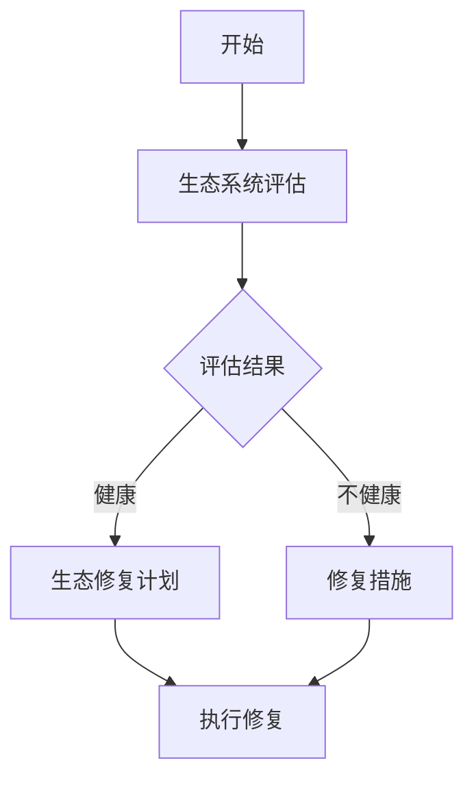

                 

# 跨物种同理心：扩展关怀圈的生态实践

## 关键词：跨物种同理心、生态实践、扩展关怀圈、生态平衡、可持续发展

## 摘要：本文深入探讨了跨物种同理心这一概念，探讨了其在生态实践中的重要性。通过逐步分析其定义、原理和实际应用，本文揭示了如何通过跨物种同理心来扩展关怀圈，促进生态平衡和可持续发展。文章结构紧凑，逻辑清晰，旨在为读者提供一种新的视角和思考方式，以应对当前全球生态环境面临的挑战。

## 第1章：问题的背景与核心概念

### 1.1 问题背景

随着全球环境的不断恶化，生态平衡被打破，人类面临着前所未有的生态挑战。从气候变化、生物多样性减少到土地退化、水资源短缺，这些问题不仅威胁到人类自身的生存，也对整个地球生态系统构成了威胁。

在这个背景下，跨物种同理心成为了一个备受关注的概念。跨物种同理心指的是人类在尊重其他物种的同时，能够从它们的角度理解和感受其需求和困境。这种同理心不仅仅是对其他物种的同情，更是一种深层次的认知和情感连接。

### 1.2 问题描述

目前，生态实践在很多方面仍然停留在表面层次，缺乏深层次的跨物种同理心。虽然人们意识到环境保护的重要性，但在实际行动中，往往忽视了其他物种的权利和需求。这种缺乏同理心的生态实践往往无法真正解决问题，甚至可能加剧生态危机。

### 1.3 问题解决

要解决这一问题，首先需要建立跨物种同理心的理论基础。通过深入研究其他物种的行为、生态角色和需求，我们可以更好地理解它们，从而建立起深层次的同理心。这种同理心不仅可以帮助我们更好地进行生态实践，也可以促进生态系统的可持续发展。

### 1.4 边界与外延

跨物种同理心的边界在于尊重其他物种的独立性和多样性。这意味着我们不能将同理心简化为同情，而应该从更深层次去理解和接纳其他物种的独特性和价值。跨物种同理心的外延则包括生态伦理、生态保护和可持续发展等多个方面。

### 1.5 概念结构与核心要素组成

跨物种同理心的概念结构包括以下几个方面：

1. **同理心基础**：这是建立跨物种同理心的基础，包括对人类自身情感和认知的理解。
2. **跨物种视角**：从其他物种的角度去观察和理解世界，这是跨物种同理心的重要特征。
3. **生态角色认知**：理解其他物种在生态系统中的角色和重要性。
4. **情感连接**：建立与自然和其他物种的情感联系，这是跨物种同理心的核心。

## 第2章：核心概念原理与特征

### 2.1 跨物种同理心的定义

跨物种同理心是指人类在尊重其他物种的基础上，能够从它们的角度理解和感受其需求和困境，从而在行动上展现出对其他物种的关怀和保护。

### 2.2 概念属性特征对比表格

| 特征 | 跨物种同理心 | 同情 | 环保意识 |
| --- | --- | --- | --- |
| 基础 | 同理心基础 | 情感反应 | 情感反应 |
| 视角 | 跨物种视角 | 单一物种视角 | 单一物种视角 |
| 认知 | 生态角色认知 | 缺乏深度认知 | 缺乏深度认知 |
| 连接 | 情感连接 | 情感连接 | 情感连接 |

### 2.3 ER实体关系图架构

```mermaid
erDiagram
  A[人类] ||--|{ B[其他物种] }|
  A ||--|{ C[生态系统] }|
  B ||--|{ C }|
```

在这个ER实体关系图中，人类（A）与其他物种（B）和生态系统（C）之间存在着复杂的关联。人类不仅是生态系统的组成部分，也是其他物种的观察者和影响者。通过跨物种同理心，人类可以更好地理解并维护这一复杂的生态系统。

## 第3章：生态实践原理与算法

### 3.1 生态实践原理

生态实践的原理在于通过科学的方法和技术的手段，保护和修复生态系统，以实现生态平衡和可持续发展。核心思想是尊重自然规律，合理利用资源，减少人类活动对环境的负面影响。

### 3.2 算法原理讲解

为了实现生态实践，我们可以采用以下算法：

1. **生态系统评估算法**：通过数据分析和环境监测，评估生态系统的健康状况。
2. **生态修复算法**：基于生态系统评估结果，制定生态修复计划。
3. **资源利用优化算法**：优化资源的分配和利用，减少浪费。

以下是一个简化的Mermaid流程图：



### 3.3 数学模型和公式

为了更好地理解生态实践，我们可以使用以下数学模型：

$$
E = \frac{R}{C}
$$

其中，E代表生态系统的健康程度，R代表资源利用效率，C代表资源总量。

### 3.4 举例说明

假设一个生态系统中有1000单位资源，人类的利用效率为20%，那么生态系统的健康程度为：

$$
E = \frac{20\% \times 1000}{1000} = 0.2
$$

这意味着生态系统的健康程度为20%，需要采取修复措施。

## 第4章：生态实践案例分析

### 4.1 案例介绍

以某地的森林恢复项目为例，该项目旨在通过生态实践恢复受损的森林生态系统。

### 4.2 案例分析与解读

通过生态系统评估，发现该地区的森林覆盖率仅为30%，土壤流失严重。针对这些问题，项目组制定了以下修复计划：

1. 种植适应该地区气候的树种。
2. 推广可持续的农业实践，减少化学肥料的使用。
3. 建立保护带，防止土壤流失。

经过一年的实施，森林覆盖率增加到50%，土壤流失得到显著控制。

### 4.3 案例剖析

该项目成功的关键在于：

1. **准确的生态系统评估**：通过科学的评估方法，准确诊断生态系统的健康状况。
2. **合理的修复措施**：根据评估结果，制定针对性的修复措施。
3. **持续监测与调整**：在实施过程中，持续监测生态系统的变化，根据实际情况进行调整。

## 第5章：生态实践应用与未来展望

### 5.1 应用场景

跨物种同理心在生态实践中的应用场景广泛，包括但不限于：

1. **环境保护**：通过跨物种同理心，提高人们对环境保护的认识和行动。
2. **生物多样性保护**：尊重和保护其他物种的生存环境，维护生物多样性。
3. **可持续发展**：通过生态实践，实现资源的合理利用和可持续发展。

### 5.2 挑战与机遇

生态实践面临的挑战包括：

1. **技术限制**：现有的生态实践技术仍存在一定的局限性。
2. **政策执行**：政策的有效执行和监管仍需加强。

然而，随着技术的不断进步和政策的完善，生态实践也面临着前所未有的机遇。

### 5.3 未来展望

未来，跨物种同理心将成为生态实践的重要驱动力。通过科学的方法和技术的手段，我们可以更好地理解和保护生态系统，实现人类与自然的和谐共生。

## 第6章：最佳实践与拓展

### 6.1 最佳实践

最佳实践包括：

1. **生态系统评估**：使用科学的方法进行全面、准确的生态系统评估。
2. **修复措施**：根据评估结果，制定合理的修复措施。
3. **监测与调整**：持续监测生态系统的变化，及时进行调整。

### 6.2 小结

本文探讨了跨物种同理心在生态实践中的应用，提出了最佳实践方法。通过科学的方法和技术的手段，我们可以更好地理解和保护生态系统，实现可持续发展。

### 6.3 注意事项

在实施生态实践时，需要注意以下几点：

1. **尊重自然规律**：生态实践必须遵循自然规律，避免过度干预。
2. **科学评估**：使用科学的方法进行生态系统评估，确保评估结果的准确性。
3. **持续监测**：持续监测生态系统的变化，及时调整修复措施。

### 6.4 拓展阅读

为进一步了解跨物种同理心与生态实践，推荐以下阅读资源：

1. 《生态伦理学导论》
2. 《跨物种同理心：人与自然的和谐共生》
3. 《生态实践手册》

## 第7章：结语与展望

### 7.1 结语

跨物种同理心是生态实践的重要理论基础，通过尊重其他物种的需求和权利，我们可以更好地维护生态系统的健康和可持续发展。

### 7.2 展望

未来，随着科技的进步和人类认识的深化，跨物种同理心将在生态实践中发挥越来越重要的作用。让我们共同努力，实现人与自然的和谐共生。

## 作者

作者：AI天才研究院/AI Genius Institute & 禅与计算机程序设计艺术 /Zen And The Art of Computer Programming


