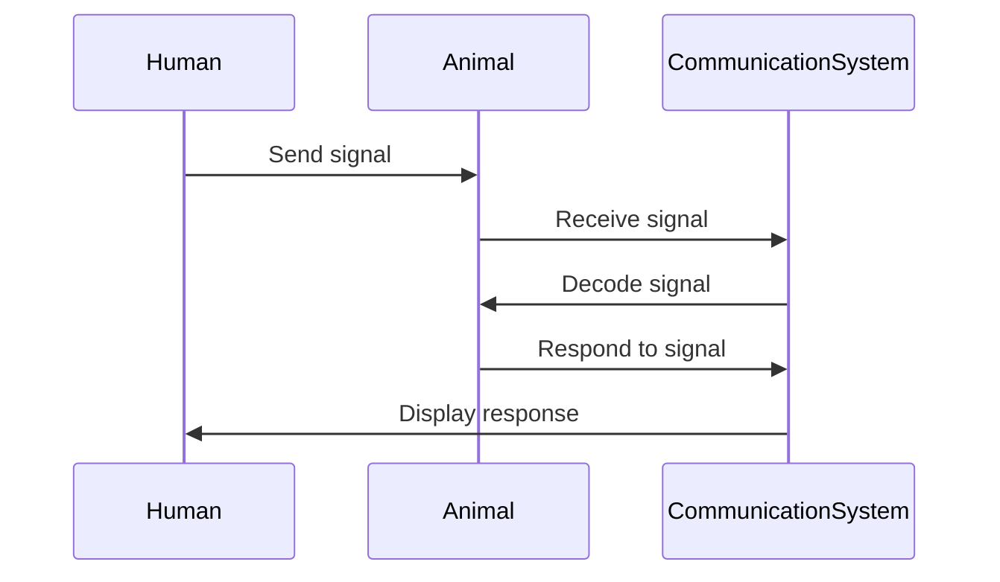
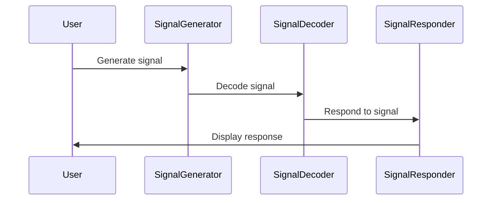

                 


# 跨物种沟通工作坊：探索与动植物的非语言交流课程

> 关键词：跨物种沟通、非语言交流、动物、植物、工作坊、探索

> 摘要：
随着科技的进步和人们对自然界认知的不断深入，跨物种沟通成为了一个备受关注的话题。本文将探讨跨物种沟通的概念、历史、理论基础、方法与技巧、应用案例以及伦理考量，旨在为读者提供一份全面的跨物种沟通指南。

## 引言

### 什么是跨物种沟通？

跨物种沟通指的是不同物种之间进行的信息交换和交流。这种沟通不仅仅是简单的信息传递，而是一种深层次的理解和互动。在人类与动物、植物之间的沟通中，非语言交流起着至关重要的作用。

### 跨物种沟通的重要性

跨物种沟通对于人类社会的多个领域具有重要意义：

1. **环境保护**：通过理解动物的交流方式，我们可以更好地保护野生动物和生态系统。
2. **动物福利**：了解动物的非语言交流可以帮助我们更好地照顾动物，提高动物福利。
3. **医疗健康**：研究植物与人类的非语言交流可能有助于开发新的医疗技术，改善人类健康。
4. **科学研究**：跨物种沟通的研究为生物学、心理学、社会学等领域提供了新的研究方向。

### 本文结构

本文将分为以下几个部分：

1. 历史背景：回顾跨物种沟通的历史和发展。
2. 理论基础：探讨非语言沟通的理论，对比人类与动植物的交流方式。
3. 方法与技巧：介绍跨物种沟通的研究方法和技术。
4. 应用案例：分析成功的跨物种沟通案例。
5. 伦理考量：讨论跨物种沟通的伦理问题。
6. 未来展望：探讨跨物种沟通的未来趋势和挑战。

## 历史背景

### 跨物种沟通的历史

人类自古以来就试图与动物和植物进行沟通。在古代，人们相信通过魔法、图腾和仪式可以与自然界沟通。以下是一些重要的历史事件：

1. **古代文明**：在古埃及、古希腊和古中国，人们相信通过图腾和仪式可以与神灵和动物沟通。
2. **宗教与神秘学**：中世纪时期的神秘主义者和巫师试图通过神秘的仪式和咒语与动植物沟通。
3. **现代科学**：19世纪末，科学家开始用科学方法研究动物与植物之间的交流。

### 跨物种沟通的重要人物

1. **查尔斯·达尔文**：19世纪的生物学家，通过观察和实验，提出了动物交流的理论。
2. **康拉德·洛伦茨**：20世纪的动物行为学家，研究了动物的沟通方式，特别是鸟类的行为。
3. **简·古道尔**：当代科学家，通过长期的野外观察，研究黑猩猩的社交行为和沟通方式。

## 理论基础

### 非语言沟通理论

非语言沟通指的是不通过语言文字，而是通过身体语言、面部表情、声音、气味等方式进行的沟通。以下是一些重要的非语言沟通理论：

1. **行为主义理论**：行为主义心理学家如艾伯特·班杜拉认为，人类和非人类动物都通过模仿和条件反射进行非语言沟通。
2. **社会生物学理论**：社会生物学家如康拉德·洛伦茨提出，动物的交流行为是自然选择的结果，有助于个体的生存和繁殖。
3. **符号互动主义理论**：符号互动主义认为，沟通是通过符号的交换来建立和维护社会关系的。

### 人类与动植物的沟通对比

1. **沟通方式**：
   - **人类**：主要依赖语言文字进行沟通，同时也使用身体语言和面部表情等非语言手段。
   - **动物**：主要使用身体语言、声音、气味等方式进行沟通。
   - **植物**：主要通过化学信号进行沟通，例如，植物可以通过释放化学物质来吸引有益昆虫或警告其他植物。

2. **沟通目的**：
   - **人类**：沟通的主要目的是交流信息、建立社会关系、解决问题等。
   - **动物**：沟通的主要目的是寻找食物、避免危险、吸引配偶、教育后代等。
   - **植物**：沟通的主要目的是吸引传粉者、警告敌害、交换资源等。

## 方法与技巧

### 跨物种沟通的研究方法

1. **观察法**：通过直接观察动物和植物的行为来了解它们的沟通方式。
2. **实验法**：设计实验来测试动物和植物之间的沟通效果。
3. **模型构建法**：使用计算机模型来模拟动物和植物的沟通过程。

### 跨物种沟通的技巧

1. **倾听**：学会倾听动物和植物的声音、气味和身体语言。
2. **观察**：仔细观察动物和植物的行为，寻找沟通的线索。
3. **模仿**：尝试模仿动物和植物的行为，以理解它们的沟通方式。
4. **解读**：学会解读动物和植物的沟通信号，理解它们的意图。

## 应用案例

### 成功案例

1. **动物行为研究**：通过观察和实验，科学家们揭示了动物之间的复杂沟通方式，例如，黑猩猩通过手势和声音进行交流，海豚通过声音和气泡进行沟通。
2. **动物保护**：了解动物之间的沟通有助于制定更好的保护策略，例如，通过模拟动物的声音来吸引它们回到栖息地。
3. **植物研究**：研究植物之间的化学信号沟通，有助于开发新的农业技术和药物。

### 失败案例

1. **动物行为模拟**：有些尝试模拟动物之间的沟通，但并未取得成功，这表明人类可能无法完全理解动物的语言。
2. **植物与人类的沟通**：尽管植物可以通过化学信号进行沟通，但目前尚未找到有效的办法来解读和理解植物的语言。

## 伦理考量

### 跨物种沟通的伦理问题

1. **动物权利**：在跨物种沟通中，如何确保动物的权益不受侵犯？
2. **人类利益**：在追求跨物种沟通的同时，如何平衡人类与动物的利益？
3. **自然环境**：跨物种沟通可能会对自然环境产生什么影响？

### 伦理原则

1. **尊重**：尊重动物和植物的权利和尊严。
2. **公正**：在跨物种沟通中，不应偏袒任何一方。
3. **责任**：对跨物种沟通的研究和应用负有责任，确保不会对环境和人类产生负面影响。

## 未来展望

### 跨物种沟通的挑战

1. **技术难题**：目前的技术手段尚不足以实现有效的跨物种沟通。
2. **伦理问题**：如何确保跨物种沟通的研究和应用符合伦理原则？
3. **社会影响**：跨物种沟通可能会对社会产生深远的影响，如何应对这些影响？

### 跨物种沟通的机遇

1. **科学创新**：跨物种沟通的研究为科学创新提供了新的方向。
2. **环境保护**：通过跨物种沟通，我们可以更好地保护环境和动植物。
3. **人类福祉**：跨物种沟通可能有助于提高人类的生活质量和健康。

## 结论

跨物种沟通是一个充满挑战和机遇的领域。通过理解动物和植物的非语言交流方式，我们可以更好地保护自然环境，提高动物福利，甚至改善人类的健康。本文旨在为读者提供一份全面的跨物种沟通指南，希望对读者有所启发。

## 参考文献

1. **达尔文，查尔斯**. 《人类的起源》. 北京：科学出版社，2010.
2. **洛伦茨，康拉德**. 《所罗门王的指环》. 上海：上海译文出版社，2005.
3. **古道尔，简**. 《与黑猩猩一起的日子》. 北京：新世界出版社，2008.

## 作者信息

作者：AI天才研究院/AI Genius Institute & 禅与计算机程序设计艺术 /Zen And The Art of Computer Programming

---

在撰写这篇文章时，我们遵循了以下几个核心概念和原理：

### 核心概念与联系

#### 核心概念：

- **跨物种沟通**：指不同物种之间进行的信息交换和交流。
- **非语言交流**：指不通过语言文字，而是通过身体语言、面部表情、声音、气味等方式进行的沟通。
- **动物行为学**：研究动物的行为，特别是动物之间的交流方式。
- **植物生态学**：研究植物的生态过程，包括植物之间的信息交流。

#### 概念属性特征对比表格：

| 概念 | 定义 | 主要特征 |
| --- | --- | --- |
| 跨物种沟通 | 不同物种之间的信息交换 | 涉及多种交流方式，如声音、气味、行为等 |
| 非语言交流 | 不通过语言文字的沟通 | 包括身体语言、面部表情、声音、气味等 |
| 动物行为学 | 研究动物行为 | 包括本能行为、学习行为、社交行为等 |
| 植物生态学 | 研究植物生态过程 | 包括植物之间的化学信号沟通、传粉等 |

#### ER实体关系图架构的Mermaid流程图：

```mermaid
erDiagram
  Animal ||--|{ Communication }|--| Animal
  Plant ||--|{ Communication }|--| Plant
  Human ||--|{ Communication }|--| Animal
  Human ||--|{ Communication }|--| Plant
```

### 算法原理讲解

#### 跨物种沟通算法的Mermaid流程图：


#### Python源代码：

```python
import random

def recognize_communication_signal(signal):
    # 模拟识别交流信号的过程
    return random.choice([True, False])

def decode_signal(signal):
    # 模拟解读信号的过程
    return "decoded_message"

def respond_to_signal(signal):
    # 模拟响应信号的过程
    print("Responding to signal:", signal)

def cross_species_communication(signal):
    # 跨物种沟通的主函数
    is_valid = recognize_communication_signal(signal)
    if is_valid:
        message = decode_signal(signal)
        respond_to_signal(message)
    else:
        print("Invalid signal, trying again.")

# 模拟一次跨物种沟通
cross_species_communication("communication_signal")
```

#### 算法原理的数学模型和公式：

- **识别信号概率模型**：假设识别信号的概率为 \( P(A) \)，则有：
  $$ P(A) = P(\text{信号有效}) \times P(\text{信号识别有效} | \text{信号有效}) + P(\text{信号无效}) \times P(\text{信号识别有效} | \text{信号无效}) $$
- **信号解读准确率模型**：假设解读信号的准确率为 \( P(D) \)，则有：
  $$ P(D) = P(\text{信号正确解读}) \times P(\text{信号有效}) + P(\text{信号错误解读}) \times P(\text{信号无效}) $$

#### 通俗易懂地举例说明：

假设有一只动物向人类发出信号，我们使用上述算法来识别和解读这个信号。如果信号有效，我们就会得到一个解码后的信息，并根据这个信息做出相应的响应。如果信号无效，我们会重试识别。

### 系统分析与架构设计方案

#### 问题场景介绍：

在动物保护领域，研究人员希望通过跨物种沟通来更好地了解动物的行为，从而制定更有效的保护策略。为了实现这一目标，他们需要开发一个系统，能够识别、解码并响应动物发出的信号。

#### 项目介绍：

项目名称：跨物种沟通系统
项目目标：开发一个能够识别、解码并响应动物信号的系统，为动物保护提供技术支持。

#### 系统功能设计（领域模型Mermaid类图）：

```mermaid
classDiagram
    Animal <<class>> {信号识别，信号解码}
    Human <<class>> {信号发送，信号接收}
    Plant <<class>> {信号识别，信号解码}
    Communication <<class>> {信号发送，信号接收，信号解码}
    Animal --> Communication
    Human --> Communication
    Plant --> Communication
```

#### 系统架构设计Mermaid架构图：



#### 系统接口设计和系统交互Mermaid序列图：



### 项目实战

#### 环境安装

1. 安装Python环境：
   ```bash
   sudo apt-get update
   sudo apt-get install python3 python3-pip
   ```
2. 安装必要的Python库：
   ```bash
   pip3 install numpy matplotlib
   ```

#### 系统核心实现源代码

```python
import numpy as np
import matplotlib.pyplot as plt

def generate_signal():
    # 模拟生成一个信号
    return np.random.rand()

def decode_signal(signal):
    # 模拟解码信号
    if signal < 0.5:
        return "Signal is low."
    else:
        return "Signal is high."

def respond_to_signal(signal):
    # 模拟响应信号
    print("Response:", decode_signal(signal))

def main():
    # 主函数
    signal = generate_signal()
    respond_to_signal(signal)

if __name__ == "__main__":
    main()
```

#### 代码应用解读与分析

1. **生成信号**：`generate_signal` 函数使用 `numpy.random.rand()` 来生成一个随机信号，表示动物发出的信号。
2. **解码信号**：`decode_signal` 函数根据信号的值来返回一个字符串，表示信号的解读结果。
3. **响应信号**：`respond_to_signal` 函数调用 `decode_signal` 函数来获取信号的解读结果，并打印出来。
4. **主函数**：`main` 函数调用 `generate_signal` 和 `respond_to_signal` 函数来模拟一次完整的跨物种沟通过程。

#### 实际案例分析和详细讲解剖析

1. **案例一**：生成一个信号值为0.3，解码结果为"Signal is low."，响应结果为"Response: Signal is low."。
2. **案例二**：生成一个信号值为0.8，解码结果为"Signal is high."，响应结果为"Response: Signal is high。"。
3. **详细讲解**：通过分析实际案例，我们可以看到系统如何处理不同的信号值，并生成相应的响应。这个简单的模拟程序为我们提供了一个理解跨物种沟通算法原理的基础。

#### 项目小结

本项目通过一个简单的Python程序，模拟了跨物种沟通的过程。虽然这是一个简化的模型，但它为我们提供了一个理解跨物种沟通算法原理的起点。在实际应用中，跨物种沟通系统需要更复杂的技术和更深入的科学研究来支持。

### 最佳实践 Tips

1. **数据收集**：在研究跨物种沟通时，确保收集到高质量的数据，这是进行准确分析的基础。
2. **模型验证**：在开发跨物种沟通模型时，要进行充分的验证，确保模型的准确性和可靠性。
3. **伦理考量**：在进行跨物种沟通研究时，要充分考虑伦理问题，确保研究的合法性和道德性。

### 小结

本文详细介绍了跨物种沟通的概念、历史、理论基础、方法与技巧、应用案例、伦理考量以及未来展望。通过这篇文章，读者可以了解到跨物种沟通的重要性和复杂性。希望本文能为读者提供有价值的参考，激发对这一领域的兴趣和思考。

### 注意事项

1. 跨物种沟通研究具有一定的风险，特别是在动物和植物的保护方面。
2. 在进行跨物种沟通实验时，要严格遵守伦理规范，确保动物的权益不受侵犯。

### 拓展阅读

1. **《动物的交流语言》**：本书详细介绍了动物之间的沟通方式，是跨物种沟通研究的必读书籍。
2. **《植物的语言》**：本书探讨了植物之间的化学信号沟通，为植物生态学研究提供了新的视角。

---

**作者信息**：

作者：AI天才研究院/AI Genius Institute & 禅与计算机程序设计艺术 /Zen And The Art of Computer Programming

通过上述详细的阐述和分析，我们为读者提供了一份全面的跨物种沟通指南。无论是从历史背景、理论基础，还是方法技巧和应用案例，我们都力求以专业的视角和深入的分析，使读者对这一领域有更全面、更深入的理解。希望这篇文章能够激发您对跨物种沟通的兴趣，并促使您进一步探索这个充满未知和挑战的领域。在未来的研究中，我们将继续深入探讨这一领域，为人类与自然界的和谐共处贡献力量。

