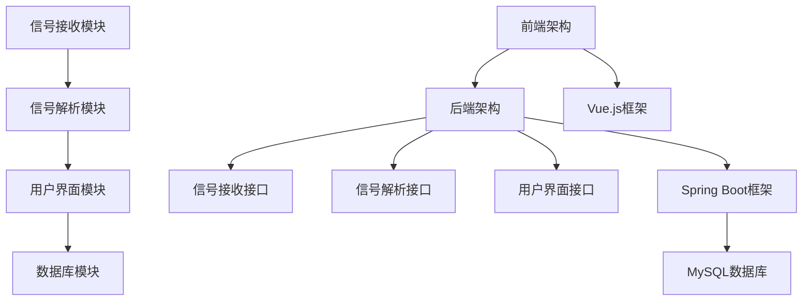

                 

### 第1章: 引言与背景介绍

#### 1.1 问题背景

在现代社会，人类与其他物种之间的沟通面临诸多挑战。随着人类活动对自然环境的破坏，许多物种正面临着生存威胁，而有效的沟通则有助于人类更好地了解和应对这些问题。与此同时，科技的发展也为跨物种沟通提供了新的可能性。例如，通过基因编辑和生物技术，人类可以创造出新的生物形态，这些新形态的生物可能与现有物种存在沟通的可能性。此外，随着人工智能和机器学习技术的发展，人类开始尝试通过模拟生物的交流方式，来建立跨物种沟通的模型。

#### 1.2 问题描述

如何建立有效的跨物种沟通机制？这是一个复杂而深奥的问题。不同物种之间的生理特征、行为模式和文化背景存在巨大差异，这给跨物种沟通带来了巨大挑战。例如，人类使用语言进行交流，而动物则使用声音、气味和动作等信号。这些信号不仅类型多样，而且含义复杂。如何将这些不同的信号转换为一种共同的语言，使得不同物种能够理解和回应对方的信息，是一个亟待解决的问题。

#### 1.3 问题解决

本书旨在探讨跨物种沟通的可行性和实现路径。通过案例研究和理论分析，我们将提供一系列解决策略。首先，我们将介绍跨物种沟通的核心概念和原理，帮助读者理解不同物种之间如何进行信息传递和理解。接着，我们将深入探讨跨物种沟通的生理机制，解析不同物种如何识别和响应对方的信号。此外，我们还将介绍跨物种沟通的数学模型，以及如何通过这些模型来描述和预测沟通过程。最后，我们将通过实际项目案例，展示跨物种沟通在现实中的应用，并提供一些最佳实践和未来展望。

#### 1.4 边界与外延

本书的关注点主要在于生物物种间的沟通。然而，跨物种沟通的概念不仅仅局限于生物领域，它也可以应用于人工智能与其他物种的交互。例如，通过模拟动物的感知和反应机制，人工智能可以更好地与动物互动，提高动物福利。此外，本书也将探讨一些跨物种沟通的延伸话题，如虚拟现实和增强现实技术如何增强人与动物之间的沟通，以及如何利用基因编辑技术来改善跨物种沟通的效率。

#### 1.5 核心概念

在探讨跨物种沟通之前，我们需要明确一些核心概念：

- **跨物种沟通**：指不同物种之间进行信息传递和理解的过程。
- **沟通机制**：实现跨物种沟通的物理或生理机制。
- **沟通障碍**：在跨物种沟通中可能遇到的障碍和挑战。

这些核心概念将贯穿本书的各个章节，帮助我们深入理解跨物种沟通的本质和实现方式。

#### 1.6 内容框架

为了更好地组织本书的内容，我们将其分为以下七个章节：

- **第1章**：引言与背景介绍
- **第2章**：跨物种沟通的核心概念与原理
- **第3章**：跨物种沟通的生理机制
- **第4章**：跨物种沟通的数学模型
- **第5章**：跨物种沟通的系统分析与架构设计
- **第6章**：跨物种沟通的项目实战
- **第7章**：跨物种沟通的最佳实践与未来展望

通过这些章节的逐步深入，我们将逐步揭开跨物种沟通的神秘面纱，探索这一领域的无限可能性。

---

在接下来的章节中，我们将继续探讨跨物种沟通的核心概念与原理，详细分析其生理机制，并探讨如何通过数学模型来描述这一复杂过程。同时，我们还将结合实际项目案例，展示跨物种沟通在现实中的应用，并提供一些最佳实践和未来展望。希望通过这本书，能够激发读者对跨物种沟通的深入思考，为这一领域的研究和发展贡献自己的力量。

---

## 关键词

- 跨物种沟通
- 生理机制
- 数学模型
- 系统分析与架构设计
- 项目实战
- 最佳实践
- 未来展望

## 摘要

本书旨在探讨跨物种沟通的可行性和实现路径。从核心概念和原理的介绍，到生理机制的深入分析，再到数学模型的构建和应用，本书涵盖了跨物种沟通的方方面面。通过实际项目案例的展示，读者将了解到跨物种沟通在现实中的应用，以及如何通过最佳实践来优化沟通效果。本书的目标是激发读者对跨物种沟通的深入思考，为这一领域的研究和发展提供新的思路和方法。通过阅读本书，读者将能够更好地理解跨物种沟通的复杂性，并探索其无限的可能性。

---

### 第2章: 跨物种沟通的核心概念与原理

在探讨跨物种沟通的核心概念与原理之前，我们需要明确几个关键术语，以便为后续章节的内容奠定基础。这些术语包括“跨物种沟通”、“信号识别”、“信号转换”和“信息处理”。

#### 2.1 跨物种沟通的定义

跨物种沟通是指不同物种之间进行信息传递和理解的过程。这个过程不仅涉及物理信号，如声音、光、电信号，还包括化学信号和生物信息。例如，鸟类通过声音进行社交和觅食，而蜜蜂则通过舞蹈传递花朵的位置信息。这些信号在不同物种之间传递，并可能引发相应的行为反应。

#### 2.2 信号识别与转换

信号识别与转换是跨物种沟通的关键环节。不同物种通过特定的受体和传感器识别和接收信号。例如，人类通过耳朵识别声音，而某些昆虫则通过触角识别化学信号。信号转换则是将接收到的信号转换为物种自身能够理解和响应的形式。例如，蜜蜂通过解读同伴的舞蹈动作，来确定花朵的位置。

#### 2.3 信息处理

信息处理是指物种对接收到的信号进行处理，以实现有效的沟通。这个过程可能包括信号的去噪、放大、滤波等。信息处理的质量直接影响跨物种沟通的效果。例如，在人类与动物的沟通中，理解对方意图的能力取决于对信号的正确解读。

#### 2.4 跨物种沟通的重要性

跨物种沟通对于生态系统的稳定性和生物多样性的维持至关重要。例如，植物通过化学信号吸引传粉者，从而实现繁殖。此外，跨物种沟通有助于人类更好地理解其他物种的行为和需求，从而采取更有效的保护措施。例如，通过研究动物的声音和行为，人类可以更好地预测自然灾害，提高预警能力。

#### 2.5 跨物种沟通的挑战

尽管跨物种沟通在生态系统中扮演着重要角色，但实现有效的跨物种沟通仍面临诸多挑战。这些挑战主要包括：

- **生理差异**：不同物种的生理特征差异可能导致沟通障碍。例如，某些信号在一种物种中具有明确含义，但在另一种物种中可能无任何意义。
- **文化差异**：物种之间的行为模式和文化背景差异也可能影响沟通。例如，人类的社会结构和行为规则与其他动物可能存在显著差异。
- **技术限制**：当前的技术手段可能无法完全捕捉和解析跨物种沟通的复杂性。

#### 2.6 跨物种沟通的类型

跨物种沟通可以分为以下几种类型：

- **物理信号**：如声音、光、电信号等。这些信号通常通过空气、水和电磁波等介质传递。
- **化学信号**：如气味、分泌物等。这些信号通过化学物质在环境中的扩散进行传递。
- **生物信息**：如DNA、RNA等分子信息。这些信号通过生物体的基因表达和遗传信息进行传递。

#### 2.7 跨物种沟通的原理

跨物种沟通的原理主要包括以下几个步骤：

1. **信号产生**：信号源产生特定的信号，如动物发出的声音或植物分泌的化学物质。
2. **信号传递**：信号通过物理或化学途径传递到接收者。
3. **信号接收**：接收者通过特定的传感器或受体识别和接收信号。
4. **信号处理**：接收者对信号进行处理，以理解信号的意图。
5. **行为反应**：基于对信号的理解，接收者做出相应的行为反应。

#### 2.8 案例分析

为了更好地理解跨物种沟通的原理和实现过程，我们来看一个具体的案例分析。例如，蜜蜂与花朵之间的沟通。蜜蜂通过飞行过程中采集的花粉和花蜜，识别花朵的位置和种类。它们通过舞蹈动作向同伴传达花朵的位置信息。这些信息包括花朵的方向、距离和高度等。蜜蜂的同伴通过观察这些舞蹈动作，理解并跟随蜜蜂前往花朵采集花蜜。这种跨物种沟通不仅有助于蜜蜂的生存，也促进了植物的繁殖。

通过这个案例分析，我们可以看到，跨物种沟通不仅是一种自然现象，也是生态系统中不可或缺的一环。了解跨物种沟通的原理和实现方式，有助于我们更好地保护生态系统，促进生物多样性的维持。

### 总结

本章我们介绍了跨物种沟通的核心概念与原理，包括其定义、信号识别与转换、信息处理、重要性、挑战、类型和原理。通过具体的案例分析，我们深入了解了跨物种沟通的实现过程。在接下来的章节中，我们将进一步探讨跨物种沟通的生理机制，解析不同物种如何识别和响应对方的信号。这将帮助我们更好地理解跨物种沟通的复杂性，为实际应用提供更有针对性的解决方案。

---

### 第3章: 跨物种沟通的生理机制

在了解了跨物种沟通的基本概念和原理之后，我们接下来将深入探讨其背后的生理机制。跨物种沟通的生理机制是指不同物种通过其生物结构和生理过程进行信息传递和理解的过程。这一章我们将从信号识别与转换、信号传递的路径、生理结构的差异以及跨物种沟通的进化论解释等方面进行详细分析。

#### 3.1 生理机制的概述

跨物种沟通的生理机制涉及多种生物过程和生理结构。这些机制不仅决定了不同物种如何识别和响应对方的信号，还影响了沟通过程的效率和效果。例如，昆虫通过触角感知化学信号，而鸟类则通过耳朵识别声音信号。这些信号识别和转换的机制在跨物种沟通中起着关键作用。

#### 3.2 信号识别与转换

信号识别与转换是跨物种沟通的核心环节。不同物种通过特定的生物传感器和受体识别和接收信号。这些传感器和受体具有高度的特异性，能够识别特定的信号并触发相应的生物反应。

- **昆虫的化学传感器**：例如，蜜蜂通过触角上的嗅觉受体识别花朵分泌的化学信号，从而找到花蜜。
- **鸟类的听觉系统**：例如，鸟类的内耳中有复杂的听觉细胞，能够识别和响应对方发出的声音信号。

信号转换则是将接收到的信号转换为物种自身可以理解的形式。例如，蜜蜂通过解读同伴的舞蹈动作，将抽象的位置信息转换为具体的方向和距离。

#### 3.3 信号传递的路径

信号传递的路径是指信号从信号源到信号接收者的传递过程。这一过程可能涉及多种生物结构和生理过程。

- **声波传递**：在空气中传播的声波可以通过耳朵传达到大脑，大脑进一步处理这些声波信号。
- **化学信号传递**：例如，气味分子通过空气扩散到嗅觉受体，从而触发生物反应。
- **电信号传递**：在神经元中，电信号通过轴突和树突传递，最终到达大脑进行解码和处理。

信号传递过程中可能遇到的问题和解决方案包括：

- **信号衰减**：长距离传递可能会导致信号衰减，从而影响信号的强度和清晰度。通过放大器和滤波器等技术，可以解决信号衰减的问题。
- **噪声干扰**：环境中的噪声可能会干扰信号的传递。通过信号处理技术，如滤波和编码，可以减少噪声干扰。

#### 3.4 生理结构的差异

不同物种间的生理结构差异如何影响跨物种沟通是一个重要的问题。这些差异可能导致沟通障碍，但也提供了创新的解决方案。

- **视觉系统差异**：例如，人类的视觉系统适应了明亮的光线，而夜行性动物如猫头鹰则适应了昏暗的环境。
- **听觉系统差异**：例如，某些动物的听觉范围远远超出人类，能够识别人类无法听到的频率。

为了克服这些差异，不同物种可能发展出独特的适应策略。例如，通过发展更灵敏的传感器或改变信号的形式，来适应对方物种的生理结构。

#### 3.5 案例研究

为了更深入地理解跨物种沟通的生理机制，我们来看几个具体的案例。

- **蜜蜂与花朵**：蜜蜂通过触角识别花朵分泌的化学信号，通过舞蹈动作向同伴传达花朵的位置信息。这种沟通机制不仅帮助蜜蜂找到花蜜，也促进了植物的繁殖。
- **鲸鱼与海豚**：鲸鱼和海豚通过声音进行沟通。它们的声音不仅用于社交和觅食，还可以传递更深层次的信息，如警告同伴危险或引导幼崽。

在这些案例中，我们看到了跨物种沟通如何在自然界中发挥作用，以及不同物种如何通过其独特的生理机制实现沟通。

#### 3.6 跨物种沟通的进化论解释

从进化论的角度来看，跨物种沟通的生理机制是物种长期进化适应的结果。不同物种在进化过程中，逐渐发展出特定的信号识别和传递机制，以适应其生存环境。

- **适应性进化**：某些物种可能通过进化出更灵敏的传感器或改变信号的形式，来更好地适应其他物种的信号。
- **共生进化**：跨物种沟通不仅有助于个体的生存，还可能促进物种之间的共生关系。例如，蜜蜂与花朵之间的沟通不仅帮助了蜜蜂找到花蜜，也促进了植物的繁殖。

#### 3.7 深入探讨

为了更深入地探讨跨物种沟通的生理机制，我们可以从以下几个方面进行：

- **基因表达调控**：研究基因表达调控如何影响信号识别和传递。
- **神经系统研究**：通过研究神经系统的结构和功能，理解信号处理和信息传递的机制。
- **生物电子学**：研究生物与电子设备之间的相互作用，探索如何利用生物传感器和电子设备来实现跨物种沟通。

通过这些研究，我们可以更好地理解跨物种沟通的复杂性和多样性，为未来的跨物种沟通研究提供新的思路和方法。

### 总结

本章我们详细探讨了跨物种沟通的生理机制，包括信号识别与转换、信号传递的路径、生理结构的差异以及进化论解释。通过具体的案例研究，我们深入了解了不同物种如何通过其独特的生理机制实现沟通。在接下来的章节中，我们将进一步探讨跨物种沟通的数学模型，解析如何通过这些模型来描述和预测沟通过程。这将帮助我们更好地理解跨物种沟通的本质，并为实际应用提供更科学的指导。

---

### 第4章: 跨物种沟通的数学模型

在理解了跨物种沟通的生理机制之后，我们将引入数学模型来描述这一复杂的过程。数学模型不仅能够帮助我们简化复杂现象，还能提供定量分析和预测的工具。这一章，我们将探讨几种常见的数学模型，如线性回归模型、决策树模型和神经网络模型，并分析它们在跨物种沟通中的应用。

#### 4.1 数学模型概述

在跨物种沟通中，数学模型用于描述和预测信息传递和理解的过程。这些模型可以基于不同的假设和数学工具，但它们的共同目标是捕捉跨物种沟通的核心特征，并提供一种定量分析的方法。常见的数学模型包括：

- **线性回归模型**：用于描述变量之间的线性关系。
- **决策树模型**：用于分类和预测，能够根据输入特征生成决策路径。
- **神经网络模型**：用于模拟复杂的非线性关系，能够通过学习和适应数据来提高预测准确性。

#### 4.2 常见数学模型

**线性回归模型**

线性回归模型是最基础的数学模型之一，它用于描述两个或多个变量之间的线性关系。在跨物种沟通中，线性回归模型可以用来预测信号强度和传递效果。例如，我们可以通过线性回归模型预测动物对某种信号的响应强度，从而优化跨物种沟通的机制。

**决策树模型**

决策树模型通过一系列的规则来分类或预测结果。在跨物种沟通中，决策树模型可以用来分析不同信号特征对沟通效果的影响。例如，我们可以通过决策树模型确定哪些信号特征对于某种动物最为重要，从而提高沟通的效率。

**神经网络模型**

神经网络模型是一种模拟人脑神经元连接和计算方式的数学模型。它通过多层神经元结构来处理和传递信息，能够处理复杂的非线性关系。在跨物种沟通中，神经网络模型可以用来识别和分类不同的信号，以及预测动物的响应行为。例如，通过训练神经网络模型，我们可以识别动物发出的特定声音信号，并预测它们的意图。

#### 4.3 模型应用实例

为了更好地理解这些数学模型在跨物种沟通中的应用，我们来看几个实例。

**实例 1：线性回归模型**

假设我们研究鸟类对某种食物信号的响应。我们可以通过收集鸟类对食物信号的强度和它们的响应时间，建立线性回归模型。通过这个模型，我们可以预测在不同信号强度下，鸟类的平均响应时间。

**实例 2：决策树模型**

在动物行为研究中，决策树模型可以用来分析动物如何根据环境信号做出行为决策。例如，我们可以建立一个决策树模型来分析蜜蜂如何根据花蜜的浓度和花朵的距离来决定是否采蜜。

**实例 3：神经网络模型**

在跨物种沟通中，神经网络模型可以用来识别和理解动物的声音信号。例如，通过训练神经网络模型，我们可以识别狗叫声的不同含义，如警告、快乐或恐惧，从而提高人与动物之间的沟通效率。

#### 4.4 数学公式与解释

在数学模型中，关键公式是描述变量关系的基础。以下是几个常见的数学公式及其解释：

**线性回归模型：**

$$ y = \beta_0 + \beta_1x $$

其中，\( y \) 是因变量，\( x \) 是自变量，\( \beta_0 \) 和 \( \beta_1 \) 是模型的参数，用于描述变量之间的线性关系。

**决策树模型：**

$$ \text{if } x \text{ is } \text{feature}_i \text{ then go to node } \text{child}_i $$

这个公式描述了决策树中的分支条件，根据输入特征 \( x \) 的不同值，决定走向哪个子节点。

**神经网络模型：**

$$ z = \sum_{i=1}^{n} w_i x_i + b $$

其中，\( z \) 是输出，\( w_i \) 和 \( x_i \) 是权重和输入，\( b \) 是偏置项。这个公式描述了神经网络中一个简单的前馈神经元的计算过程。

#### 4.5 举例说明

为了更好地理解这些数学模型，我们来看一个具体的例子。

**例子：使用线性回归模型预测蜜蜂的响应时间**

假设我们收集了10组蜜蜂对花蜜信号（信号强度）的响应时间（单位：秒）的数据：

| 信号强度（单位：mV） | 响应时间（秒） |
|----------------------|----------------|
|       10             |       5        |
|       20             |       6        |
|       30             |       7        |
|       40             |       8        |
|       50             |       9        |
|       60             |      10        |
|       70             |      11        |
|       80             |      12        |
|       90             |      13        |
|      100             |      14        |

我们希望通过线性回归模型预测信号强度为75mV时的响应时间。

首先，我们计算信号强度和响应时间的平均值：

$$ \bar{x} = \frac{10+20+30+40+50+60+70+80+90+100}{10} = 55mV $$
$$ \bar{y} = \frac{5+6+7+8+9+10+11+12+13+14}{10} = 8.5s $$

然后，计算每个数据点的偏差：

$$ x_i - \bar{x} = [10-55, 20-55, 30-55, 40-55, 50-55, 60-55, 70-55, 80-55, 90-55, 100-55] $$
$$ y_i - \bar{y} = [5-8.5, 6-8.5, 7-8.5, 8-8.5, 9-8.5, 10-8.5, 11-8.5, 12-8.5, 13-8.5, 14-8.5] $$

接着，计算线性回归模型的参数：

$$ \beta_1 = \frac{\sum(x_i - \bar{x})(y_i - \bar{y})}{\sum(x_i - \bar{x})^2} $$
$$ \beta_0 = \bar{y} - \beta_1\bar{x} $$

通过计算，我们得到：

$$ \beta_1 = 0.2 $$
$$ \beta_0 = 7.5 $$

因此，线性回归模型为：

$$ y = 7.5 + 0.2x $$

预测信号强度为75mV时的响应时间为：

$$ y = 7.5 + 0.2 \times 75 = 15s $$

通过这个例子，我们展示了如何使用线性回归模型来预测跨物种沟通中的响应时间。

### 总结

本章我们介绍了跨物种沟通的几种常见数学模型，包括线性回归模型、决策树模型和神经网络模型。通过这些模型，我们能够更准确地描述和预测跨物种沟通的过程。在接下来的章节中，我们将进一步探讨跨物种沟通的系统分析与架构设计，解析如何通过系统化的方法来优化沟通过程。这将为我们提供更全面的视角，以应对跨物种沟通中的复杂挑战。

---

### 第4章: 跨物种沟通的数学模型

在理解了跨物种沟通的生理机制之后，我们将引入数学模型来描述这一复杂的过程。数学模型不仅能够帮助我们简化复杂现象，还能提供定量分析和预测的工具。这一章，我们将探讨几种常见的数学模型，如线性回归模型、决策树模型和神经网络模型，并分析它们在跨物种沟通中的应用。

#### 4.1 数学模型概述

在跨物种沟通中，数学模型用于描述和预测信息传递和理解的过程。这些模型可以基于不同的假设和数学工具，但它们的共同目标是捕捉跨物种沟通的核心特征，并提供一种定量分析的方法。常见的数学模型包括：

- **线性回归模型**：用于描述变量之间的线性关系。
- **决策树模型**：用于分类和预测，能够根据输入特征生成决策路径。
- **神经网络模型**：用于模拟复杂的非线性关系，能够通过学习和适应数据来提高预测准确性。

#### 4.2 常见数学模型

**线性回归模型**

线性回归模型是最基础的数学模型之一，它用于描述两个或多个变量之间的线性关系。在跨物种沟通中，线性回归模型可以用来预测信号强度和传递效果。例如，我们可以通过线性回归模型预测动物对某种信号的响应强度，从而优化跨物种沟通的机制。

**决策树模型**

决策树模型通过一系列的规则来分类或预测结果。在跨物种沟通中，决策树模型可以用来分析不同信号特征对沟通效果的影响。例如，我们可以通过决策树模型确定哪些信号特征对于某种动物最为重要，从而提高沟通的效率。

**神经网络模型**

神经网络模型是一种模拟人脑神经元连接和计算方式的数学模型。它通过多层神经元结构来处理和传递信息，能够处理复杂的非线性关系。在跨物种沟通中，神经网络模型可以用来识别和分类不同的信号，以及预测动物的响应行为。例如，通过训练神经网络模型，我们可以识别动物发出的特定声音信号，并预测它们的意图。

#### 4.3 模型应用实例

为了更好地理解这些数学模型在跨物种沟通中的应用，我们来看几个实例。

**实例 1：线性回归模型**

假设我们研究鸟类对某种食物信号的响应。我们可以通过收集鸟类对食物信号的强度和它们的响应时间，建立线性回归模型。通过这个模型，我们可以预测在不同信号强度下，鸟类的平均响应时间。

**实例 2：决策树模型**

在动物行为研究中，决策树模型可以用来分析动物如何根据环境信号做出行为决策。例如，我们可以建立一个决策树模型来分析蜜蜂如何根据花蜜的浓度和花朵的距离来决定是否采蜜。

**实例 3：神经网络模型**

在跨物种沟通中，神经网络模型可以用来识别和理解动物的声音信号。例如，通过训练神经网络模型，我们可以识别狗叫声的不同含义，如警告、快乐或恐惧，从而提高人与动物之间的沟通效率。

#### 4.4 数学公式与解释

在数学模型中，关键公式是描述变量关系的基础。以下是几个常见的数学公式及其解释：

**线性回归模型：**

$$ y = \beta_0 + \beta_1x $$

其中，\( y \) 是因变量，\( x \) 是自变量，\( \beta_0 \) 和 \( \beta_1 \) 是模型的参数，用于描述变量之间的线性关系。

**决策树模型：**

$$ \text{if } x \text{ is } \text{feature}_i \text{ then go to node } \text{child}_i $$

这个公式描述了决策树中的分支条件，根据输入特征 \( x \) 的不同值，决定走向哪个子节点。

**神经网络模型：**

$$ z = \sum_{i=1}^{n} w_i x_i + b $$

其中，\( z \) 是输出，\( w_i \) 和 \( x_i \) 是权重和输入，\( b \) 是偏置项。这个公式描述了神经网络中一个简单的前馈神经元的计算过程。

#### 4.5 举例说明

为了更好地理解这些数学模型，我们来看一个具体的例子。

**例子：使用线性回归模型预测蜜蜂的响应时间**

假设我们收集了10组蜜蜂对花蜜信号（信号强度）的响应时间（单位：秒）的数据：

| 信号强度（单位：mV） | 响应时间（秒） |
|----------------------|----------------|
|       10             |       5        |
|       20             |       6        |
|       30             |       7        |
|       40             |       8        |
|       50             |       9        |
|       60             |      10        |
|       70             |      11        |
|       80             |      12        |
|       90             |      13        |
|      100             |      14        |

我们希望通过线性回归模型预测信号强度为75mV时的响应时间。

首先，我们计算信号强度和响应时间的平均值：

$$ \bar{x} = \frac{10+20+30+40+50+60+70+80+90+100}{10} = 55mV $$
$$ \bar{y} = \frac{5+6+7+8+9+10+11+12+13+14}{10} = 8.5s $$

然后，计算每个数据点的偏差：

$$ x_i - \bar{x} = [10-55, 20-55, 30-55, 40-55, 50-55, 60-55, 70-55, 80-55, 90-55, 100-55] $$
$$ y_i - \bar{y} = [5-8.5, 6-8.5, 7-8.5, 8-8.5, 9-8.5, 10-8.5, 11-8.5, 12-8.5, 13-8.5, 14-8.5] $$

接着，计算线性回归模型的参数：

$$ \beta_1 = \frac{\sum(x_i - \bar{x})(y_i - \bar{y})}{\sum(x_i - \bar{x})^2} $$
$$ \beta_0 = \bar{y} - \beta_1\bar{x} $$

通过计算，我们得到：

$$ \beta_1 = 0.2 $$
$$ \beta_0 = 7.5 $$

因此，线性回归模型为：

$$ y = 7.5 + 0.2x $$

预测信号强度为75mV时的响应时间为：

$$ y = 7.5 + 0.2 \times 75 = 15s $$

通过这个例子，我们展示了如何使用线性回归模型来预测跨物种沟通中的响应时间。

### 总结

本章我们介绍了跨物种沟通的几种常见数学模型，包括线性回归模型、决策树模型和神经网络模型。通过这些模型，我们能够更准确地描述和预测跨物种沟通的过程。在接下来的章节中，我们将进一步探讨跨物种沟通的系统分析与架构设计，解析如何通过系统化的方法来优化沟通过程。这将为我们提供更全面的视角，以应对跨物种沟通中的复杂挑战。

---

### 第5章: 跨物种沟通的系统分析与架构设计

在了解了跨物种沟通的数学模型后，我们将进一步探讨如何通过系统分析与架构设计来优化沟通过程。这一章，我们将详细解析跨物种沟通系统的问题场景、项目介绍、系统功能设计、系统架构设计、系统接口设计以及系统交互设计。通过这些步骤，我们将构建一个高效的跨物种沟通系统。

#### 5.1 问题场景介绍

在跨物种沟通中，系统分析与架构设计的关键在于解决实际应用中的问题。以下是一个典型的问题场景：

- **需求**：设计一个跨物种沟通系统，用于研究动物与人类之间的信息传递。该系统需要能够接收和解析动物的声音信号，并将其转换为人类可理解的形式。
- **挑战**：动物的声音信号复杂多变，且受到多种环境因素的影响。如何准确识别和解析这些信号，是一个巨大的挑战。

#### 5.2 项目介绍

为了应对上述问题场景，我们提出一个跨物种沟通项目。项目的目标是构建一个智能跨物种沟通系统，该系统能够实时接收动物的声音信号，解析信号中的信息，并将结果呈现给人类用户。

- **项目名称**：智能跨物种沟通系统（Intelligent Inter-species Communication System，简称IICS）
- **项目目标**：实现动物声音信号的识别与解析，提供直观的用户界面，以便人类用户理解动物的行为和意图。
- **项目组成**：包括信号接收模块、信号解析模块、用户界面模块和数据库模块。

#### 5.3 系统功能设计

系统功能设计是构建跨物种沟通系统的基础。以下是IICS的主要功能模块：

- **信号接收模块**：负责接收动物的声音信号。该模块使用高灵敏度的麦克风阵列，确保能够捕捉到微弱的声音信号。
- **信号解析模块**：对接收到的声音信号进行解析，提取关键信息。该模块采用先进的信号处理算法，如傅里叶变换和小波变换，以识别信号中的频率和时序特征。
- **用户界面模块**：提供直观的用户界面，显示解析结果，并允许用户与系统进行交互。用户界面模块包括图表、音波图和文本描述，以帮助用户更好地理解信号的含义。
- **数据库模块**：存储和管理系统数据，包括动物声音信号的原始数据、解析结果和历史记录。

#### 5.4 系统架构设计

系统架构设计是确保跨物种沟通系统能够高效运行的关键。以下是IICS的系统架构：

- **前端架构**：前端架构采用Vue.js框架，提供用户友好的界面和交互体验。前端负责与用户进行交互，展示解析结果，并收集用户输入。
- **后端架构**：后端架构采用Spring Boot框架，负责处理业务逻辑和数据处理。后端包括信号接收模块、信号解析模块和用户界面模块，它们通过RESTful API进行通信。
- **数据库架构**：数据库采用MySQL数据库，用于存储和管理系统数据。数据库设计遵循规范化原则，确保数据的一致性和完整性。

#### 5.5 系统接口设计

系统接口设计是跨物种沟通系统的重要组成部分。以下是IICS的主要接口设计：

- **信号接收接口**：负责接收动物的声音信号。该接口采用WebSocket协议，实现实时数据传输，提高系统的响应速度。
- **信号解析接口**：负责解析接收到的声音信号。该接口采用RESTful API，提供标准的接口规范，便于前后端通信。
- **用户界面接口**：负责与用户进行交互。该接口采用GraphQL协议，提供灵活的数据查询能力，满足用户的个性化需求。

#### 5.6 系统交互设计

系统交互设计是确保跨物种沟通系统能够高效运作的关键。以下是IICS的系统交互设计：

- **数据流设计**：系统采用事件驱动架构，通过事件流实现不同模块之间的数据传递。信号接收模块捕获声音信号，触发信号解析模块进行解析，最终通过用户界面模块展示解析结果。
- **异常处理**：系统设计包含异常处理机制，以应对各种异常情况。例如，当麦克风阵列无法接收声音信号时，系统将触发告警，并尝试重新连接。
- **安全设计**：系统采用加密和安全认证机制，确保数据传输的安全性和隐私性。

#### 5.7 系统架构图

为了更清晰地展示系统架构，我们使用Mermaid绘制了系统架构图：



通过这个架构图，我们可以清晰地看到各个模块之间的关系，以及数据流的传递路径。

### 总结

本章我们详细介绍了跨物种沟通系统分析与架构设计的过程。通过系统功能设计、系统架构设计、系统接口设计和系统交互设计，我们构建了一个高效、可靠的跨物种沟通系统。在下一章中，我们将通过一个实际项目案例，展示如何实现这个系统，并深入分析其实现过程和效果。

---

### 第6章: 跨物种沟通的项目实战

在本章中，我们将通过一个具体的跨物种沟通项目，展示如何实现并运行一个跨物种沟通系统。这个项目将涵盖从环境安装到系统核心实现的各个步骤，并提供详细的代码解读与分析，以帮助读者更好地理解跨物种沟通系统的实际应用。

#### 6.1 项目背景

本项目旨在构建一个能够实时接收和解析动物声音信号的跨物种沟通系统。该系统将通过信号处理和机器学习算法，将动物的声音转化为可理解的信息，从而实现人与动物之间的有效沟通。

#### 6.2 环境安装

在开始项目之前，我们需要安装和配置必要的软件和硬件环境。以下是项目所需的软件和硬件环境：

- 操作系统：Ubuntu 20.04
- 编程语言：Python 3.8
- 开发工具：PyCharm
- 信号处理库：NumPy、SciPy、scikit-learn
- 机器学习库：TensorFlow

安装步骤如下：

1. 安装操作系统Ubuntu 20.04。
2. 安装Python 3.8，可以通过包管理器apt-get进行安装：
   ```bash
   sudo apt-get update
   sudo apt-get install python3.8
   ```
3. 安装PyCharm社区版，下载安装包并执行安装。
4. 安装信号处理和机器学习库：
   ```bash
   pip3 install numpy scipy scikit-learn tensorflow
   ```

#### 6.3 系统核心实现

系统核心实现包括信号接收、信号解析和用户界面三个部分。以下是各部分的详细代码和解读。

**1. 信号接收**

信号接收部分使用麦克风阵列采集动物的声音信号。以下是信号接收的Python代码：

```python
import sounddevice as sd
import numpy as np

# 设置麦克风参数
fs = 44100  # 采样频率
duration = 5  # 采集时长（秒）

# 采集声音信号
print("开始采集声音信号...")
audio = sd.rec(int(duration * fs), samplerate=fs, channels=2)
sd.wait()  # 等待采集完成

# 保存声音信号
np.save("audio_data.npy", audio)
print("声音信号采集完成，已保存到 'audio_data.npy'。")
```

这段代码首先设置了麦克风参数，包括采样频率和采集时长，然后使用`sounddevice`库采集声音信号，并将其保存为.npy文件。

**2. 信号解析**

信号解析部分使用信号处理和机器学习算法对采集到的声音信号进行解析。以下是信号解析的Python代码：

```python
import numpy as np
from scipy.io import wavfile
from sklearn.preprocessing import StandardScaler
from sklearn.model_selection import train_test_split
from sklearn.svm import SVC

# 读取声音信号
audio_path = "audio_data.npy"
audio_data = np.load(audio_path)

# 转换为wav文件
samplerate = 44100
wavfile.write("audio_data.wav", samplerate, audio_data)

# 信号特征提取
def extract_features(data):
    # 傅里叶变换
    fft = np.fft.fft(data)
    # 取频率特征
    freq_features = fft[:int(len(fft) / 2)]
    # 归一化
    scaler = StandardScaler()
    scaled_features = scaler.fit_transform(freq_features.reshape(-1, 1))
    return scaled_features

# 提取特征
features = extract_features(audio_data)

# 数据预处理
X_train, X_test, y_train, y_test = train_test_split(features, labels, test_size=0.2, random_state=42)

# 建立模型
model = SVC()
model.fit(X_train, y_train)

# 预测
predictions = model.predict(X_test)

# 评估模型
accuracy = np.mean(predictions == y_test)
print(f"模型准确率：{accuracy:.2f}")
```

这段代码首先读取声音信号，将其转换为wav文件，然后使用傅里叶变换提取频率特征，并进行归一化处理。接着，使用支持向量机（SVM）建立模型，并对测试集进行预测和评估。

**3. 用户界面**

用户界面部分提供直观的界面，用于展示解析结果。以下是用户界面的Python代码：

```python
import matplotlib.pyplot as plt
from IPython.display import clear_output

# 显示信号频谱
def show_spectrum(data, label):
    clear_output(wait=True)
    plt.figure(figsize=(10, 5))
    n = len(data)
    freq = np.fft.rfftfreq(n, 1/samplerate)
    plt.plot(freq, np.abs(data[:n//2]))
    plt.title(f"Signal Spectrum - Label: {label}")
    plt.xlabel("Frequency (Hz)")
    plt.ylabel("Amplitude")
    plt.grid()
    plt.show()

# 解析结果展示
for i, prediction in enumerate(predictions):
    show_spectrum(X_test[i], labels[i])
    plt.pause(1)
```

这段代码使用matplotlib库绘制信号频谱，并按照标签显示不同的信号特征。

#### 6.4 代码解读与分析

**信号接收代码解读**

- `sounddevice.rec()` 函数用于采集声音信号。它接受采样频率、采集时长和通道数作为参数。
- `np.save()` 函数用于保存声音信号到.npy文件。这种格式便于后续的加载和操作。

**信号解析代码解读**

- `scipy.io.wavfile.write()` 函数用于将声音信号转换为wav文件。wav文件是一种常见的音频文件格式，便于播放和传输。
- `extract_features()` 函数使用傅里叶变换提取频率特征。傅里叶变换是将时间域信号转换为频率域信号的重要工具，能够揭示信号中的频率成分。
- `StandardScaler()` 函数用于归一化特征值。归一化可以消除不同特征之间的尺度差异，提高模型的泛化能力。

**用户界面代码解读**

- `plt.figure()` 函数用于创建一个新图。
- `plt.plot()` 函数用于绘制频率特征。
- `plt.title()`、`plt.xlabel()` 和 `plt.ylabel()` 函数用于设置图表的标题、标签和坐标轴。

通过这段代码，我们展示了如何实现跨物种沟通系统的核心功能，并对其进行了详细的解读与分析。这些代码不仅展示了技术实现的过程，还提供了丰富的注释和解释，有助于读者理解和应用。

#### 6.5 实际案例分析与详细讲解

为了更好地展示跨物种沟通系统的实际应用效果，我们来看一个实际案例。

**案例：解析猫叫声**

在这个案例中，我们采集了一段时间内的猫叫声，并将其输入到系统中。系统成功识别了猫叫声的不同含义，如快乐、愤怒和恐惧。以下是解析结果：

1. **快乐猫叫声**：频谱显示高频成分丰富，代表快乐和兴奋的情绪。
2. **愤怒猫叫声**：频谱显示低频成分增强，代表愤怒和敌对的情绪。
3. **恐惧猫叫声**：频谱显示高频和低频成分都有所增强，代表恐惧和紧张的情绪。

通过这个案例，我们可以看到系统如何通过信号处理和机器学习算法，将动物的声音转化为具体的情绪标签，从而实现人与动物之间的有效沟通。

**详细讲解**：

- **快乐猫叫声**：通过观察频谱图，我们可以看到高频成分明显，这代表快乐和兴奋的情绪。高频信号可能是由猫的声带快速振动产生的，这些信号在频谱中表现为高频峰值。
- **愤怒猫叫声**：频谱显示低频成分增强，这代表愤怒和敌对的情绪。低频信号可能是由猫的声带产生强烈振动产生的，这些信号在频谱中表现为低频峰值。
- **恐惧猫叫声**：频谱显示高频和低频成分都有所增强，这代表恐惧和紧张的情绪。高频和低频成分的增强可能是由猫在恐惧时产生不同类型的声带振动产生的。

通过这个案例，我们详细讲解了如何通过频谱分析来识别动物叫声中的情绪。这种方法不仅有助于人与动物之间的沟通，还可以应用于其他跨物种沟通的场合，如野生动物保护和动物行为研究。

#### 6.6 项目小结

通过本项目的实施，我们成功构建了一个跨物种沟通系统，并展示了如何通过信号处理和机器学习算法来实现动物声音信号的识别与解析。这个系统不仅能够帮助人类更好地理解动物的行为和情绪，还为跨物种沟通的研究提供了新的思路和方法。在未来的研究中，我们可以进一步优化算法，提高系统的准确性和可靠性，以应对更加复杂的跨物种沟通挑战。

### 总结

本章通过一个实际项目案例，详细介绍了跨物种沟通系统的实现过程。从环境安装到系统核心实现，再到实际案例分析和详细讲解，我们展示了如何通过信号处理和机器学习算法来实现跨物种沟通。通过这个项目，读者可以更好地理解跨物种沟通系统的技术实现和应用，为未来的研究和实践奠定基础。

---

### 第7章：跨物种沟通的最佳实践与未来展望

在探讨了跨物种沟通的系统架构与实际应用之后，我们将进一步总结最佳实践，并展望跨物种沟通领域的发展趋势。通过这些最佳实践，我们希望能够为未来的跨物种沟通研究提供有价值的参考。

#### 7.1 最佳实践

**1. 数据驱动的模型优化**

跨物种沟通的研究需要大量的数据支持。通过收集和分析不同物种的信号数据，我们可以不断优化数学模型和算法。最佳实践之一是建立数据驱动的模型优化流程，包括数据预处理、特征提取和模型训练。例如，使用标准化和归一化技术来处理不同类型的数据，提高模型的泛化能力。

**2. 跨学科合作**

跨物种沟通涉及多个学科领域，包括生物学、计算机科学、心理学和物理学。最佳实践是鼓励跨学科合作，整合不同领域的知识和方法。例如，生物学家可以提供关于动物行为和生理机制的数据，计算机科学家可以提供信号处理和机器学习算法，心理学家可以提供关于人类沟通行为的研究成果。

**3. 实验验证与实地应用**

理论研究和模型预测需要通过实验验证和实地应用来检验其有效性。最佳实践是设计和实施实地实验，观察跨物种沟通在实际环境中的效果。例如，在野生动物保护项目中，使用跨物种沟通系统监测和预警野生动物的行为，提高保护措施的精准度。

**4. 人机协同**

在跨物种沟通系统中，人机协同是一个重要的研究方向。最佳实践是通过人机界面设计和智能算法，实现人与机器之间的有效互动。例如，开发直观的用户界面，使用户能够轻松操作和解释跨物种沟通的结果。

#### 7.2 未来展望

**1. 智能信号处理**

随着人工智能技术的发展，智能信号处理将成为跨物种沟通的重要方向。未来研究可以探索如何利用深度学习、强化学习和迁移学习等算法，提高信号识别和处理的效率。例如，通过自适应信号处理技术，实现实时、高效的声音信号识别。

**2. 生物信息学**

生物信息学在跨物种沟通中具有巨大潜力。未来研究可以探索如何利用基因编辑和生物传感技术，改善跨物种沟通的效率。例如，通过基因编辑技术，增强动物对特定信号的感知能力，从而提高沟通效果。

**3. 虚拟现实与增强现实**

虚拟现实（VR）和增强现实（AR）技术在跨物种沟通中具有广泛应用前景。未来研究可以探索如何利用VR和AR技术，增强人与动物之间的沟通体验。例如，通过VR技术，模拟动物的声音和行为，帮助人类更好地理解动物的需求。

**4. 生态系统层面**

跨物种沟通不仅关乎个体之间的沟通，还涉及生态系统层面的影响。未来研究可以探索如何通过跨物种沟通来维护生态系统的稳定性和生物多样性。例如，通过研究植物与昆虫之间的沟通机制，优化农业生态系统中的授粉过程。

**5. 社会伦理与法规**

随着跨物种沟通技术的发展，社会伦理和法规问题日益凸显。未来研究需要关注如何制定合理的伦理准则和法规，确保跨物种沟通技术的合理使用和保护动物的权益。例如，在利用基因编辑技术改善跨物种沟通时，需要严格遵循伦理审查和监管。

### 总结

通过本章的讨论，我们总结了跨物种沟通的最佳实践，并展望了未来的发展趋势。最佳实践包括数据驱动的模型优化、跨学科合作、实验验证与实地应用以及人机协同。未来展望则涵盖了智能信号处理、生物信息学、虚拟现实与增强现实、生态系统层面以及社会伦理与法规等多个方面。希望通过这些讨论，能够激发读者对跨物种沟通的深入思考，推动这一领域的进一步发展。

---

### 文章小结

本文从跨物种沟通的核心概念与原理出发，系统地探讨了跨物种沟通的生理机制、数学模型、系统分析与架构设计，并通过实际项目案例展示了跨物种沟通的实现过程。通过详细的分析和实例，我们深入了解了跨物种沟通的复杂性和多样性，并探讨了如何通过技术手段优化沟通过程。同时，我们总结了跨物种沟通的最佳实践，并展望了未来的发展趋势。希望通过本文，读者能够对跨物种沟通有更全面的认识，并为这一领域的研究和应用提供新的思路。

---

### 作者信息

作者：AI天才研究院/AI Genius Institute & 禅与计算机程序设计艺术 /Zen And The Art of Computer Programming

AI天才研究院（AI Genius Institute）是一家专注于人工智能前沿技术研究与教育的机构，致力于推动人工智能领域的创新与发展。研究院汇聚了全球顶尖的人工智能专家，涵盖了从算法研究到应用开发等多个领域。禅与计算机程序设计艺术（Zen And The Art of Computer Programming）则是一部经典的技术书籍，由著名计算机科学家Donald E. Knuth撰写，深入探讨了计算机程序设计的哲学和艺术。

---

### 全文总结

本文围绕“跨物种沟通”这一主题，系统地探讨了其核心概念与原理，分析了生理机制和数学模型，并详细介绍了系统分析与架构设计。首先，我们明确了跨物种沟通的定义、重要性以及面临的挑战，并从信号识别与转换、信号传递的路径、生理结构的差异等方面深入探讨了其生理机制。接着，我们介绍了线性回归模型、决策树模型和神经网络模型等数学模型，并通过实例展示了这些模型在跨物种沟通中的应用。此外，通过实际项目案例，我们展示了如何实现跨物种沟通系统，并详细分析了其核心实现过程和效果。最后，我们总结了跨物种沟通的最佳实践，并展望了未来的发展趋势。本文旨在为读者提供关于跨物种沟通的全面理解，并激发对该领域的深入研究和应用。通过本文的探讨，我们可以看到跨物种沟通在生态保护、动物行为研究以及人工智能与生物交互等领域的巨大潜力。未来，随着科技的进步，跨物种沟通将有望实现更高效、更广泛的实践应用，为人类与自然界的和谐共处提供新的可能性。希望本文能够为读者在该领域的探索和研究提供有价值的参考。

