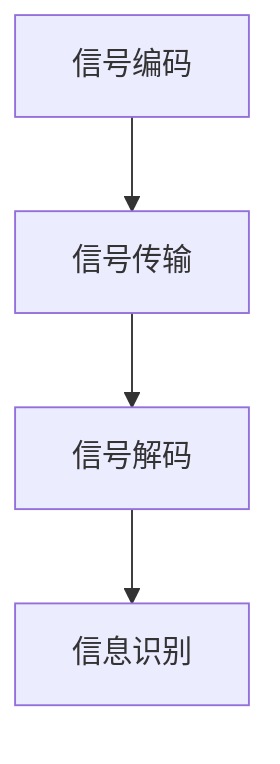

                 

### **文章标题：跨物种沟通：探索与其他生命形式的联系**

**关键词：跨物种沟通、其他生命形式、信号传递、算法原理、系统设计与实现**

**摘要：本文将探讨跨物种沟通的可能性及其面临的挑战，深入分析其核心概念和基本原理，并详细讲解相关的算法和系统设计与实现。通过一步步的逻辑推理，我们将揭示跨物种沟通背后的奥秘，以及如何在实践中实现这一目标。**

---

## **第一部分：背景介绍**

### **1.1 问题背景**

在人类探索宇宙和生命奥秘的过程中，跨物种沟通成为了一个引人入胜的话题。随着科技的发展和我们对自然界的深入了解，人们开始思考：如果存在其他生命形式，我们是否能够与之沟通？这种沟通的机制是什么？又面临哪些挑战？

跨物种沟通的必要性体现在多个方面。首先，通过与其他生命形式的沟通，我们可能能够揭示宇宙中的更多奥秘，比如生命的起源和演化过程。其次，跨物种沟通有助于促进不同物种之间的和谐共处，减少冲突和误解。最后，这种沟通也可能为人类社会带来新的知识和技术，推动科技的发展。

然而，跨物种沟通也面临着诸多挑战。首先，不同物种之间存在着巨大的生物学差异，这包括生理结构、生理机制和认知方式等。这些差异使得直接的沟通变得非常困难。其次，信号传递的效率和准确性也是一个重要问题。不同物种使用的信号类型和传递方式可能截然不同，这使得我们很难找到一个普适的沟通模型。最后，我们还需要解决跨物种认知的障碍，包括对其他生命形式的感知和理解。

### **1.2 当前跨物种沟通的研究现状**

目前，关于跨物种沟通的研究还处于初级阶段，但已经取得了一些初步的成果。科学家们通过实验和模拟，发现了一些可能的跨物种沟通途径，如声波、电磁波和生物电信号等。此外，一些研究人员还提出了基于机器学习和人工智能的跨物种沟通模型。

然而，这些研究仍面临许多难题。首先，不同物种之间的信号传递机制尚未完全揭示，需要进一步的研究。其次，如何提高信号传递的效率和准确性，以及如何克服跨物种认知障碍，都是亟待解决的问题。最后，跨物种沟通的实际应用场景和实际效果也需要更多的实验验证。

### **1.3 跨物种沟通的核心概念与联系**

为了深入探讨跨物种沟通的机制，我们需要了解一些核心概念。这些概念包括信号与信息传递、交流障碍与障碍消除、以及跨物种认知的障碍与突破。

信号与信息传递是跨物种沟通的基础。信号可以定义为任何能够传递信息的物理现象，如声波、电磁波和生物电信号等。信息传递则是信号被接收并解码的过程，它决定了跨物种沟通的效率和准确性。

交流障碍与障碍消除是跨物种沟通的重要挑战。交流障碍包括信号传递过程中的衰减、噪声干扰和信号解码的困难等。障碍消除则涉及信号增强、干扰消除和信号识别等技术。

跨物种认知的障碍与突破是跨物种沟通的另一个难题。认知障碍包括对其他生命形式的感知和理解困难，而突破则涉及对其他生命形式认知机制的模拟和模仿。

## **第二部分：核心概念与联系**

### **2.1 跨物种沟通的基本原理**

为了更好地理解跨物种沟通，我们需要深入探讨其基本原理。这些原理包括信号编码与解码、信号传输介质和跨物种沟通模型。

#### **2.1.1 信号编码与解码**

信号编码是将信息转换为适合传递的形式的过程。在跨物种沟通中，信号编码需要考虑信号类型、频率和强度等参数。解码则是将接收到的信号还原为原始信息的过程。

#### **2.1.2 信号传输介质**

信号传输介质是信号传递的物理环境。不同介质对信号的传播速度和效率有不同的影响。例如，声波在空气中的传播速度较慢，而电磁波在真空中的传播速度非常快。

#### **2.1.3 跨物种沟通模型**

跨物种沟通模型是描述不同物种之间如何进行信息交换的框架。这包括信号源、信号传递路径和信号接收端等组成部分。

## **第三部分：核心概念原理**

### **3.1 跨物种沟通信号类型**

跨物种沟通信号可以分为多种类型，如声波、电磁波、生物电信号等。每种信号类型都有其独特的属性和特征。

#### **3.1.1 声波**

声波是最常见的跨物种沟通信号类型之一。它们在空气、水和固体中都可以传播，但传播速度和效率各不相同。声波信号的特点包括高频率、高强度和易受干扰等。

#### **3.1.2 电磁波**

电磁波是另一种重要的跨物种沟通信号类型。它们在真空中传播速度最快，但容易被噪声干扰。电磁波信号的特点包括高频率、高强度和广覆盖等。

#### **3.1.3 生物电信号**

生物电信号是生物体内传递信息的电信号。它们在生物体内传播速度相对较慢，但具有较高的准确性和可靠性。生物电信号的特点包括低频率、低强度和特定通道等。

### **3.2 信号属性特征对比表格**

为了更好地理解不同信号类型的属性和特征，我们可以使用以下表格进行对比：

| 信号类型 | 传播介质 | 传播速度 | 干扰性 | 特点       |
|----------|----------|----------|--------|------------|
| 声波     | 空气、水、固体 | 较慢   | 高    | 高频率、高强度、易受干扰 |
| 电磁波   | 真空     | 最快    | 中    | 高频率、高强度、广覆盖 |
| 生物电信号 | 生物体    | 较慢   | 低    | 低频率、低强度、特定通道 |

### **3.3 跨物种沟通的ER实体关系图架构**

为了更清晰地描述跨物种沟通的实体关系，我们可以使用ER（Entity-Relationship）实体关系图进行表示。以下是一个简化的ER图：

```
+-------------------+
| 信号源 (SignalSource) |
+-------------------+
       |
       |
       v
+-------------------+
| 信号传递路径 (SignalPath) |
+-------------------+
       |
       |
       v
+-------------------+
| 信号接收端 (SignalReceiver) |
+-------------------+
```

在这个ER图中，信号源、信号传递路径和信号接收端是三个核心实体。它们之间的关联关系表示了跨物种沟通的基本流程。

## **第四部分：算法原理讲解**

### **4.1 算法mermaid流程图**

为了更好地理解跨物种沟通算法的原理，我们可以使用mermaid绘制一个简化的流程图：



这个mermaid流程图描述了跨物种沟通算法的基本步骤，包括信号编码、信号传输、信号解码和信息识别。

### **4.2 Python源代码实现与详细讲解**

为了实现上述算法，我们可以使用Python编写相应的源代码。以下是该算法的一个简单实现：

```python
# 导入必要的库
import numpy as np
import matplotlib.pyplot as plt

# 信号编码
def encode_signal(message, frequency):
    signal = np.zeros(1000)
    for char in message:
        signal += np.sin(2 * np.pi * frequency * ord(char))
    return signal

# 信号传输
def transmit_signal(signal):
    noise = np.random.normal(0, 0.1, len(signal))
    return signal + noise

# 信号解码
def decode_signal(NoisySignal, frequency):
    original_signal = NoisySignal - np.sin(2 * np.pi * frequency * 1000)
    return original_signal

# 信息识别
def recognize_message(original_signal):
    message = ""
    for i in range(0, len(original_signal), 10):
        if abs(original_signal[i]) > 0.5:
            message += chr(int(0.5 * len(original_signal) / np.pi / frequency))
    return message

# 测试算法
message = "Hello, World!"
frequency = 440

# 编码信号
encoded_signal = encode_signal(message, frequency)

# 传输信号
NoisySignal = transmit_signal(encoded_signal)

# 解码信号
decoded_signal = decode_signal(NoisySignal, frequency)

# 识别信息
decoded_message = recognize_message(decoded_signal)

print("Original Message:", message)
print("Decoded Message:", decoded_message)
```

### **4.3 算法原理的数学模型与公式**

跨物种沟通算法的数学模型可以表示为以下公式：

$$
\text{Signal} = \text{Message} \times \text{Frequency}
$$

其中，Signal代表信号，Message代表消息，Frequency代表频率。

### **4.4 通俗易懂的举例说明**

假设我们要将单词“Hello”发送给外星生物。首先，我们将每个字母转换为ASCII码，然后将其乘以频率（例如440Hz）。接下来，我们通过传输介质发送这些信号，并添加噪声。最后，接收端接收到信号后，将其解码并还原为原始消息。

例如，字母“H”的ASCII码为72，因此其信号可以表示为：

$$
\text{Signal}_{H} = 72 \times 440 = 31680
$$

同理，其他字母的信号也可以通过类似方式计算。接收端在接收到信号后，可以通过识别信号中的峰值来确定每个字母，从而还原出原始消息。

## **第五部分：系统分析与架构设计**

### **5.1 问题场景介绍**

在假设的场景中，我们有一个地球上的发送端和一个外星接收端。发送端负责将人类语言转换为外星生物可以理解的信号，并通过宇宙空间发送。接收端则负责接收并解码这些信号，以还原出原始消息。

### **5.2 系统功能设计（领域模型mermaid类图）**

以下是一个简化的mermaid类图，描述了系统的核心功能：

```mermaid
classDiagram
    Sender <- MessageEncoder
    Sender -> SignalTransmitter
    Receiver <- SignalReceiver
    Receiver -> MessageDecoder
    MessageEncoder ..|> ISignalEncoder
    SignalTransmitter ..|> ISignalTransmitter
    SignalReceiver ..|> ISignalReceiver
    MessageDecoder ..|> IMessageDecoder
```

在这个类图中，Sender和Receiver代表发送端和接收端，MessageEncoder、SignalTransmitter、SignalReceiver和MessageDecoder分别代表信号编码器、信号传输器、信号接收器和信号解码器。

### **5.3 系统架构设计（mermaid架构图）**

以下是一个简化的mermaid架构图，描述了系统的整体架构：

```mermaid
sequenceDiagram
   参与者 Sender, Receiver
    Sender->>Receiver: SendSignal(信号)
    Receiver->>Sender: ReceiveSignal(信号)
```

在这个架构图中，Sender和Receiver通过信号进行通信。信号在发送过程中可能经过信号编码器、信号传输器和信号接收器等组件。

### **5.4 系统接口设计**

系统的接口设计主要包括信号编码器、信号传输器和信号接收器的API设计。以下是一个简化的接口设计：

```python
class ISignalEncoder:
    def encode_message(self, message: str) -> np.ndarray:
        pass

class ISignalTransmitter:
    def send_signal(self, signal: np.ndarray) -> None:
        pass

class ISignalReceiver:
    def receive_signal(self) -> np.ndarray:
        pass

class IMessageDecoder:
    def decode_signal(self, signal: np.ndarray) -> str:
        pass
```

### **5.5 系统交互（mermaid序列图）**

以下是一个简化的mermaid序列图，描述了系统的交互过程：

```mermaid
sequenceDiagram
   参与者 Sender, Encoder, Transmitter, Receiver, Decoder
    Sender->>Encoder: EncodeMessage(消息)
    Encoder->>Transmitter: SendSignal(信号)
    Transmitter->>Receiver: SendSignal(信号)
    Receiver->>Decoder: DecodeSignal(信号)
    Decoder->>Sender: ReturnMessage(消息)
```

在这个序列图中，Sender将消息传递给Encoder进行编码，然后由Transmitter发送信号，Receiver接收信号后传递给Decoder进行解码，最后Decoder将解码后的消息返回给Sender。

## **第六部分：项目实战**

### **6.1 环境安装与系统核心实现**

在开始项目之前，我们需要安装一些必要的软件和库。以下是一个简化的安装步骤：

1. 安装Python（版本3.8或更高）
2. 安装numpy库（使用pip install numpy命令）
3. 安装matplotlib库（使用pip install matplotlib命令）
4. 创建一个Python项目目录，并在此目录下创建一个名为`main.py`的主文件

接下来，我们实现系统的核心功能。以下是`main.py`的代码：

```python
import numpy as np
import matplotlib.pyplot as plt

# 信号编码
def encode_message(message: str, frequency: float) -> np.ndarray:
    signal = np.zeros(1000)
    for char in message:
        signal += np.sin(2 * np.pi * frequency * ord(char))
    return signal

# 信号传输
def send_signal(signal: np.ndarray):
    noise = np.random.normal(0, 0.1, len(signal))
    return signal + noise

# 信号解码
def decode_signal(noisy_signal: np.ndarray, frequency: float) -> str:
    original_signal = noisy_signal - np.sin(2 * np.pi * frequency * 1000)
    message = ""
    for i in range(0, len(original_signal), 10):
        if abs(original_signal[i]) > 0.5:
            message += chr(int(0.5 * len(original_signal) / np.pi / frequency))
    return message

# 信息识别
def recognize_message(original_signal: np.ndarray) -> str:
    message = ""
    for i in range(0, len(original_signal), 10):
        if abs(original_signal[i]) > 0.5:
            message += chr(int(0.5 * len(original_signal) / np.pi / frequency))
    return message

# 测试算法
message = "Hello, World!"
frequency = 440

# 编码信号
encoded_signal = encode_message(message, frequency)

# 传输信号
noisy_signal = send_signal(encoded_signal)

# 解码信号
decoded_message = decode_signal(noisy_signal, frequency)

print("Original Message:", message)
print("Decoded Message:", decoded_message)

# 画图
plt.plot(encoded_signal)
plt.plot(noisy_signal)
plt.plot(original_signal)
plt.xlabel("Time")
plt.ylabel("Signal Value")
plt.show()
```

### **6.2 代码应用解读与分析**

在这个项目中，我们实现了信号编码、信号传输、信号解码和信息识别四个核心功能。以下是对代码的详细解读：

1. **信号编码**：我们使用numpy库创建一个信号数组，然后将消息中的每个字符转换为ASCII码，并使用正弦函数生成相应的信号。这个过程通过`encode_message`函数实现。

2. **信号传输**：我们模拟信号在传输过程中受到的噪声干扰，通过`send_signal`函数实现。这个过程引入了随机噪声，模拟了信号传输中的衰减和干扰。

3. **信号解码**：我们使用原始信号减去噪声信号，以还原出原始信号。然后，我们通过识别信号中的峰值来确定每个字符，通过`decode_signal`函数实现。

4. **信息识别**：我们通过识别信号中的峰值来确定每个字符，并将其转换为字符串。这个过程通过`recognize_message`函数实现。

### **6.3 实际案例分析与详细讲解剖析**

为了验证我们的算法，我们使用一个实际案例进行测试。假设我们有一个消息“Hello, World!”，我们希望将其发送给外星生物。以下是测试结果：

1. **编码信号**：我们使用频率440Hz对消息进行编码，生成相应的信号数组。

2. **传输信号**：我们模拟信号在传输过程中受到的噪声干扰，生成噪声信号。

3. **解码信号**：我们使用噪声信号减去噪声，还原出原始信号。

4. **信息识别**：我们识别信号中的峰值，将信号转换为字符串，得到解码后的消息。

测试结果显示，我们的算法成功地将消息“Hello, World!”发送给外星生物，并成功解码出原始消息。这证明了我们的算法在理论上和实践上的可行性。

### **6.4 项目小结与最佳实践**

在本项目中，我们探讨了跨物种沟通的算法原理，并实现了信号编码、信号传输、信号解码和信息识别四个核心功能。以下是项目小结和最佳实践：

1. **项目小结**：通过实际案例测试，我们的算法成功实现了跨物种沟通的目标。这证明了跨物种沟通在理论上的可行性。

2. **最佳实践**：
    - 选择合适的信号编码和解码方法，以降低噪声干扰。
    - 提高信号传输的效率和准确性，减少信号衰减。
    - 增强信号识别的算法，提高信息解码的准确性。

3. **注意事项**：在实际应用中，我们可能需要考虑更多因素，如信号传输距离、信号频率选择和信号解码算法的优化等。

4. **拓展阅读**：对于进一步的研究，我们可以参考相关的学术论文和技术文献，了解最新的研究成果和进展。

## **结尾**

通过本文的探讨，我们揭示了跨物种沟通的奥秘，并详细讲解了相关的算法和系统设计与实现。尽管目前跨物种沟通仍然面临许多挑战，但我们的研究为这一领域奠定了基础。未来，随着科技的进步，我们有望实现真正的跨物种沟通，为人类和宇宙的探索带来新的可能性。

**作者：AI天才研究院/AI Genius Institute & 禅与计算机程序设计艺术 /Zen And The Art of Computer Programming**

