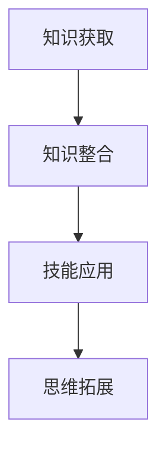

                 

# 跨界学习的概念与重要性

## 1.1.1 跨界学习的定义

跨界学习，顾名思义，是一种超越传统学科界限，将不同领域的知识、技能和思维方式进行整合和融合的学习方式。在现代社会，随着知识体系的不断扩展和更新，跨界学习成为了一种重要的学习形式。它不仅仅是一种知识的扩展，更是一种思维的拓展和能力的提升。

### 背景介绍

在传统的教育体系中，学科之间的界限往往非常明显，学生往往只能在一个特定的学科领域内进行深入学习。然而，随着现代社会问题的复杂性和多样性增加，单一领域的知识已经难以解决实际问题。因此，跨界学习应运而生。

### 问题背景

在实际应用中，我们可以看到很多成功的跨界案例。比如，艺术家通过计算机编程来创造新的艺术形式，商业专家通过数据分析来优化营销策略，工程师通过心理学知识来设计更人性化的产品等。这些案例表明，跨界学习可以带来创新和突破。

### 问题描述

那么，什么是跨界学习？它有哪些核心概念和要素？为什么它如此重要？接下来，我们将对这些问题进行详细探讨。

### 问题解决

跨界学习的定义可以从多个角度来理解：

1. **跨学科学习**：指在不同学科领域进行学习，如将计算机科学、心理学、艺术等领域结合起来。
2. **跨领域应用**：指将一个领域的知识应用到另一个领域，如将数据分析应用到商业决策中。
3. **跨文化理解**：指在不同文化背景下进行学习，以提升跨文化沟通能力。

### 边界与外延

跨界学习的边界在于学科、领域和文化的界限。而其外延则涵盖了所有需要跨学科、跨领域和跨文化理解的学习活动。

### 概念结构与核心要素组成

跨界学习的基本概念和要素包括：

1. **知识体系**：包括不同学科和领域的基础知识。
2. **技能和思维方式**：包括解决问题的能力、创新思维和跨文化沟通能力。
3. **学习策略**：包括如何高效地获取、整合和应用知识。

### 核心概念与联系

为了更好地理解跨界学习，我们可以通过以下Mermaid ER实体关系图来展示其核心概念之间的关系：

```mermaid
erDiagram
  A[(知识体系)] ||--|{ B[(技能和思维方式)] }
  B ||--|{ C[(学习策略)] }
```

### 算法原理讲解

在跨界学习的过程中，算法原理同样至关重要。以下是一个简单的算法流程图，用于展示跨界学习的核心步骤：



在知识获取阶段，我们需要通过各种渠道获取不同领域的知识；在知识整合阶段，我们将这些知识进行整合，形成新的知识体系；在技能应用阶段，我们将新的知识体系应用到实际问题中；在思维拓展阶段，我们通过跨领域的思维方式来提升创新能力。

### 数学公式

在跨界学习的过程中，我们也可以使用数学公式来描述核心概念之间的关系。以下是一个简单的数学模型，用于描述跨界学习的效率：

$$
效率 = \frac{知识整合度}{学习时间}
$$

### 系统分析与架构设计方案

在系统层面，跨界学习也可以看作是一个复杂的架构设计。以下是一个简单的类图，用于描述跨界学习的系统架构：

```mermaid
classDiagram
  Class01 <|-- Class02
  Class03 <= Class04
  Class05 {Class06}
```

在类图中，我们可以看到不同的知识领域（Class01, Class02）以及如何将这些知识进行整合（Class03, Class04）和应用（Class05, Class06）。

### 项目实战

在实际应用中，我们可以通过以下步骤来进行跨界学习：

1. **确定学习目标**：明确自己想要掌握的知识领域和技能。
2. **获取知识**：通过各种渠道获取所需的知识。
3. **整合知识**：将不同领域的知识进行整合，形成新的知识体系。
4. **应用知识**：将新的知识体系应用到实际问题中。
5. **反思与调整**：通过实践中的反馈来不断调整和优化学习策略。

### 最佳实践 tips

1. **制定学习计划**：合理安排学习时间，确保学习效率。
2. **多渠道获取知识**：利用网络、书籍、课程等多种渠道进行学习。
3. **实践与理论相结合**：通过实际案例来加深对知识的理解和应用。
4. **持续反思与调整**：定期对学习效果进行反思和调整，确保学习目标的实现。

### 小结

跨界学习是一种重要的学习形式，它不仅能够帮助我们扩展知识体系，提升技能和思维方式，还能够提升我们的创新能力。在接下来的章节中，我们将继续探讨如何有效地进行跨界学习。

### 拓展阅读

- 《深度学习：增强现实与虚拟现实技术》
- 《人工智能：从理论到实践》
- 《跨文化沟通：跨越学科与领域的桥梁》

作者：AI天才研究院/AI Genius Institute & 禅与计算机程序设计艺术 /Zen And The Art of Computer Programming

## 1.2 学习马拉松的背景与意义

### 1.2.1 学习马拉松的起源

学习马拉松，也被称为学习挑战或学习马拉松赛，是一种集中式的学习方法，起源于20世纪末的美国。最初，学习马拉松是为了帮助学生在有限的时间内完成大量的学习任务，从而提高学习效率。这种学习方法迅速在欧美教育界传播开来，并逐渐演变成一种全球性的学习活动。

学习马拉松的起源可以追溯到1989年，当时美国宾夕法尼亚州的一个高中教师比尔·库克（Bill Cooke）提出了一种名为“学习马拉松”的学习方式。他的目的是帮助学生们在短时间内完成大量的学习任务，提高他们的学习效率和学术成绩。这种学习方法很快引起了广泛关注，并开始在全球范围内推广。

### 1.2.2 学习马拉松的特点

学习马拉松具有以下几个显著特点：

1. **时间紧凑**：学习马拉松通常在24小时内完成，有时甚至更短。这要求学习者必须在有限的时间内进行高效的学习和知识吸收。
   
2. **多领域覆盖**：学习马拉松不仅仅涉及一个领域的知识，而是涵盖多个领域的知识点。这种跨学科的学习方式有助于拓宽学习者的知识面，提升综合素质。

3. **团队合作**：学习马拉松往往以团队形式进行，团队成员之间相互协作，共同完成任务。这有助于培养团队合作精神和沟通能力。

4. **挑战性强**：学习马拉松具有较高的挑战性，要求学习者具备较强的自我管理能力和适应能力。通过这种挑战，学习者可以锻炼自己的意志力和抗压能力。

5. **目标明确**：学习马拉松通常有明确的学习目标，如掌握特定的知识点、完成特定的项目等。这有助于学习者集中精力，提高学习效率。

### 1.2.3 学习马拉松的价值

学习马拉松作为一种高效的学习方法，具有以下价值：

1. **提升学习效率**：学习马拉松通过在短时间内集中学习，有助于提高学习效率，减少时间的浪费。

2. **促进知识整合**：学习马拉松要求学习者在短时间内学习多个领域的知识点，这有助于促进知识之间的整合和联系，形成更加完整的知识体系。

3. **培养综合素质**：学习马拉松不仅仅关注知识的学习，还注重团队合作、沟通能力、自我管理等综合素质的培养。

4. **激发学习兴趣**：学习马拉松的挑战性和目标明确性可以激发学习者的学习兴趣，提高学习的积极性和主动性。

5. **提升解决实际问题的能力**：通过学习马拉松，学习者可以快速掌握多领域的知识，并将其应用到实际问题的解决中，提升解决实际问题的能力。

### 1.2.4 学习马拉松的实践案例

学习马拉松在全球范围内已经产生了许多成功的实践案例。以下是一些典型的案例：

1. **全球编程马拉松**：这是一个面向全球开发者的编程竞赛，参赛者需要在规定时间内完成指定的编程任务。这种比赛形式不仅锻炼了开发者的编程能力，还促进了全球开发者之间的交流与合作。

2. **创业马拉松**：创业马拉松是一种面向创业者的比赛，参赛者需要在短时间内完成商业计划书、产品原型等。这种比赛形式有助于激发创业者的创新精神和实践能力。

3. **学术马拉松**：学术马拉松是一种面向学术研究人员的比赛，参赛者需要在短时间内完成一项研究任务。这种比赛形式有助于促进学术研究人员的创新思维和研究成果的转化。

通过以上案例，我们可以看到学习马拉松在不同领域都产生了积极的影响，为跨界学习提供了有力的支持和实践基础。

### 1.2.5 学习马拉松与跨界学习的关系

学习马拉松与跨界学习之间存在密切的关系。学习马拉松作为一种高效的学习方法，为跨界学习提供了实践平台。通过学习马拉松，学习者可以在短时间内快速掌握多领域的知识点，实现知识的跨界整合。同时，学习马拉松的挑战性和目标明确性也激发了学习者的学习兴趣和积极性，为跨界学习提供了动力。

总之，学习马拉松作为一种高效的学习方法，与跨界学习相辅相成，共同推动了知识创新和人才成长。在接下来的章节中，我们将进一步探讨如何进行有效的跨界学习。

### 小结

学习马拉松作为一种高效的学习方法，起源于20世纪末的美国，并逐渐演变成一种全球性的学习活动。它具有时间紧凑、多领域覆盖、团队合作、挑战性强和目标明确等特点，为学习者提供了丰富的知识和实践机会。通过学习马拉松，学习者可以提升学习效率、促进知识整合、培养综合素质、激发学习兴趣和提升解决实际问题的能力。学习马拉松与跨界学习密切相关，为跨界学习提供了实践平台和动力。在接下来的章节中，我们将继续探讨如何进行有效的跨界学习。

### 拓展阅读

- 《学习马拉松：如何在短时间内高效学习》
- 《跨界学习：跨学科知识与技能整合》
- 《挑战自我：学习马拉松的实践与反思》

作者：AI天才研究院/AI Genius Institute & 禅与计算机程序设计艺术 /Zen And The Art of Computer Programming

## 1.3 本书结构与内容安排

### 1.3.1 各章节内容概述

本书共分为五个部分，涵盖了跨界学习的各个方面。以下是各部分的主要内容概述：

**第一部分：引言**

本部分主要介绍跨界学习的概念与重要性，以及学习马拉松的背景与意义。通过分析跨界学习的定义、背景、问题和解决方案，为读者奠定理论基础。

**第二部分：方法论**

本部分将探讨如何进行有效的跨界学习。具体包括：

1. **跨界学习的时间管理**：介绍如何高效利用时间、制定学习计划和保持学习动力。
2. **信息筛选与知识整合**：讲述如何处理信息过载、筛选知识以及整合知识的方法。
3. **学习策略与实践**：介绍如何制定学习策略、运用学习技巧以及进行实践反思与调整。

**第三部分：领域学习**

本部分将深入探讨跨界学习在各个领域的应用。具体包括：

1. **科技领域的学习**：分析科技发展的趋势、关键科技领域以及科技领域的跨界应用。
2. **艺术领域的学习**：探讨艺术的核心要素、艺术与科技的结合以及艺术领域的创新。
3. **商业领域的学习**：介绍商业模式的演变、商业创新与跨界合作以及商业领域的跨界案例。

**第四部分：实践案例**

本部分将通过实际案例展示跨界学习的应用。具体包括：

1. **跨界学习马拉松的策划与实施**：介绍如何策划和实施跨界学习马拉松，包括策划、实施和评估等环节。
2. **个人跨界学习实践**：分享个人跨界学习实践案例，包括科技与艺术的跨界、商业与科技的跨界以及艺术与商业的跨界。

**第五部分：总结与反思**

本部分将总结全书内容，分析跨界学习的挑战与应对策略，探讨跨界学习的未来趋势，并对全书进行总结与反思。

### 1.3.2 读者定位与预期收获

**读者定位：**

本书旨在为以下读者提供帮助：

1. **跨界学习者**：希望提升自身跨界学习能力，拓展知识面，提升综合素质的学习者。
2. **教育工作者**：希望了解如何指导学生进行跨界学习，提升教学效果的教育工作者。
3. **企业员工**：希望在职业生涯中不断学习新知识，提升技能，适应快速变化的职场环境的企业员工。

**预期收获：**

通过阅读本书，读者可以：

1. **了解跨界学习的概念、背景和重要性**：明确跨界学习的基本概念和理论基础。
2. **掌握跨界学习的有效方法**：学会如何进行时间管理、信息筛选与知识整合、制定学习策略和实践反思与调整。
3. **拓展知识面和提升综合素质**：通过领域学习，了解不同领域的知识体系和应用场景，提升跨领域思维能力。
4. **提高解决实际问题的能力**：通过实践案例，学会如何将跨界学习应用到实际问题中，提升解决实际问题的能力。
5. **明确跨界学习的未来方向**：了解跨界学习的挑战和未来发展趋势，为未来的学习和发展做好准备。

### 小结

本书通过五个部分，系统地介绍了跨界学习的概念、方法、领域应用和实践案例，旨在为读者提供全方位的跨界学习指导。通过阅读本书，读者可以提升跨界学习能力，拓展知识面，提升综合素质，为未来的学习和发展奠定坚实基础。

### 拓展阅读

- 《跨界学习实战：如何在24小时内学习新技能》
- 《跨界思维：跨学科领域的创新与实践》
- 《跨界学习：如何在竞争激烈的职场中脱颖而出》

作者：AI天才研究院/AI Genius Institute & 禅与计算机程序设计艺术 /Zen And The Art of Computer Programming

## 1.4 跨界学习的时间管理

### 1.4.1 高效利用时间

时间管理是跨界学习的关键要素之一。在24小时学习马拉松中，如何高效利用时间是成功完成学习任务的关键。以下是一些高效利用时间的策略：

1. **明确学习目标**：在开始学习之前，明确自己的学习目标。这有助于你集中精力，避免浪费时间在无关紧要的事情上。

2. **制定学习计划**：将24小时的学习时间分成若干个阶段，为每个阶段设定具体的学习目标。例如，可以设置上午学习科技知识，下午学习艺术知识等。

3. **优先级排序**：将任务按照优先级排序，先完成最重要的任务。这有助于确保你在有限的时间内完成最重要的学习内容。

4. **避免分心**：在学习过程中，尽量避免分心。关闭社交媒体通知，将手机调至静音模式，创造一个专注于学习的环境。

5. **利用碎片时间**：在等待会议、排队用餐等碎片时间内，可以利用电子书、音频课程等工具进行学习。

6. **休息与调整**：合理安排休息时间，避免长时间连续学习导致的疲劳。短暂的休息可以帮助你保持专注和效率。

### 1.4.2 制定学习计划

制定一个详细的学习计划是时间管理的核心。以下是一些建议：

1. **每日学习计划**：根据24小时的时间框架，将学习内容分解为每天的学习任务。例如，可以设置每天学习8小时，每小时学习一个主题。

2. **阶段性目标**：在每个阶段结束时，设定一个阶段性目标。这有助于你跟踪学习进度，并在每个阶段结束时进行自我评估。

3. **灵活调整**：根据实际情况，灵活调整学习计划。如果某个主题的学习时间过长，可以适当减少其时间，将更多时间分配给其他主题。

4. **学习资源分配**：合理分配学习资源，如书籍、课程、网络资源等。确保每个主题都有足够的学习资源。

### 1.4.3 保持学习动力

保持学习动力是跨界学习成功的关键。以下是一些建议：

1. **设定奖励机制**：为自己设定奖励机制，每完成一个学习任务或阶段性目标，就给予自己一个小奖励，如看一集喜欢的电视剧、吃一顿美食等。

2. **寻找学习伙伴**：与志同道合的人一起学习，可以相互鼓励、交流心得，提高学习兴趣和动力。

3. **设定长期目标**：设定一个长期的学习目标，如通过学习获得某个证书或技能，这有助于你保持对学习的热情。

4. **保持积极心态**：面对困难和挑战时，保持积极的心态，相信自己能够克服困难，完成学习任务。

5. **记录学习进度**：定期记录学习进度，这有助于你看到自己的成长和进步，增强自信心和动力。

### 实践案例

以下是一个实际的学习计划案例：

**每日学习计划**

- 上午（8:00 - 12:00）：
  - 8:00 - 9:00：科技知识学习
  - 9:00 - 10:00：科技知识学习
  - 10:00 - 10:30：休息与调整
  - 10:30 - 12:00：科技知识学习

- 下午（12:30 - 17:30）：
  - 12:30 - 14:00：艺术知识学习
  - 14:00 - 15:00：艺术知识学习
  - 15:00 - 15:30：休息与调整
  - 15:30 - 17:30：艺术知识学习

- 晚上（18:00 - 20:00）：
  - 18:00 - 19:00：商业知识学习
  - 19:00 - 20:00：商业知识学习

**阶段性目标**

- 第一阶段（1天）：
  - 掌握科技知识的基本概念
  - 了解艺术知识的核心要素
  - 熟悉商业知识的基本原理

**奖励机制**

- 每天完成学习计划，奖励自己看一集喜欢的电视剧。

通过以上实践案例，我们可以看到，合理的时间管理、详细的学习计划和有效的动力激励对于跨界学习至关重要。

### 小结

跨界学习的时间管理是确保学习效率的关键。通过明确学习目标、制定详细的学习计划、保持学习动力，我们可以在24小时内高效地完成学习任务。在实际应用中，合理的时间管理和有效的学习策略可以帮助我们克服困难，提升学习效果。

### 拓展阅读

- 《时间管理：如何高效利用每一天》
- 《学习动力：如何激发和保持学习热情》
- 《学习计划：如何制定和执行有效的学习计划》

作者：AI天才研究院/AI Genius Institute & 禅与计算机程序设计艺术 /Zen And The Art of Computer Programming

## 1.5 信息筛选与知识整合

在跨界学习的环境中，信息筛选与知识整合是确保学习效率和质量的关键步骤。面对海量的信息资源，如何有效地筛选和整合知识，是每一个跨界学习者都需要掌握的技能。

### 1.5.1 信息过载的处理

随着互联网的快速发展，信息过载成为了一个普遍的问题。过多的信息不仅会干扰学习者的注意力，还可能导致学习效率的降低。以下是一些处理信息过载的方法：

1. **制定信息筛选标准**：在获取信息前，明确自己的学习目标，制定相应的信息筛选标准。例如，关注权威来源、相关度高等。

2. **使用信息过滤器**：利用信息过滤工具，如RSS订阅、信息筛选软件等，自动筛选出与自己学习目标相关的信息。

3. **定期整理和归纳**：定期对获取的信息进行整理和归纳，删除无关信息，保留关键内容。这有助于避免信息过载，提高学习效率。

4. **设定信息处理时间**：合理安排信息处理的时间，避免在信息处理过程中占用学习时间。例如，可以在空闲时间或学习后的休息时间处理信息。

### 1.5.2 知识的筛选与辨别

在筛选信息的基础上，对知识进行辨别和筛选是跨界学习的重要环节。以下是一些方法：

1. **评估知识价值**：评估所获取的知识是否对当前学习目标有实际帮助，是否符合自己的学习需求。

2. **比较不同来源的知识**：对于同一主题的不同来源的知识，进行比较和分析，选择可靠性更高、解释更为全面的内容。

3. **实践验证**：将所学知识应用到实际问题中，通过实践来验证知识的有效性和实用性。

4. **借助专家意见**：参考领域专家的意见，选择权威、可靠的资源进行学习。

### 1.5.3 知识整合的方法

知识整合是将不同来源、不同领域的知识进行有机结合，形成新的知识体系的过程。以下是一些知识整合的方法：

1. **构建概念框架**：通过构建概念框架，将不同领域的知识进行系统化整理，形成一个清晰的知识结构。

2. **使用思维导图**：利用思维导图工具，将不同领域的知识进行可视化整理，便于理解和记忆。

3. **跨领域对比分析**：对不同领域的知识进行对比分析，找出不同领域之间的共通点和差异点，促进知识的深度融合。

4. **案例研究**：通过案例研究，将理论与实践相结合，深入理解知识的实际应用。

### 1.5.4 实践案例

以下是一个实际的信息筛选与知识整合的案例：

**案例背景**：一位软件工程师想要在24小时内学习新的编程语言。

**步骤一：信息筛选**
- 明确学习目标：学习Python编程语言。
- 使用信息过滤器：通过在线课程平台、技术论坛等筛选Python编程资源。
- 评估知识价值：选择评分高、评价好的课程和教材。

**步骤二：知识整合**
- 构建概念框架：根据Python的基本概念和语法结构，构建知识框架。
- 使用思维导图：将Python的基础知识、高级特性、应用场景等用思维导图进行整理。
- 跨领域对比分析：将Python与其他编程语言进行比较，找出Python的优势和特点。
- 案例研究：通过分析Python在实际项目中的应用案例，加深对Python的理解。

通过以上步骤，这位工程师可以在短时间内快速掌握Python编程语言，为后续的实践应用打下坚实基础。

### 小结

信息筛选与知识整合是跨界学习中的重要环节。通过有效处理信息过载、筛选和辨别知识，以及运用合适的整合方法，我们可以将多领域的知识进行有机结合，形成新的知识体系，提高学习效率和质量。

### 拓展阅读

- 《信息过载：如何处理海量信息》
- 《知识管理：如何整合和组织知识》
- 《跨界学习实战：如何整合多领域知识》

作者：AI天才研究院/AI Genius Institute & 禅与计算机程序设计艺术 /Zen And The Art of Computer Programming

## 1.6 学习策略与实践

在跨界学习的旅程中，有效的学习策略和实践方法至关重要。以下是一些关键的学习策略和实践步骤，旨在帮助读者在24小时学习马拉松中取得最佳效果。

### 1.6.1 学习策略的制定

制定一个清晰、实际可行的学习策略是成功的关键。以下是一些建议：

1. **目标设定**：明确自己的学习目标。目标应具体、可衡量，并具有挑战性。例如，“掌握Python编程语言的基础知识”或“了解人工智能的基本概念和应用”。

2. **时间规划**：根据学习目标和时间限制，制定详细的学习计划。合理安排每个阶段的学习内容和时间，确保覆盖所有关键知识点。

3. **优先级排序**：根据目标的优先级，将学习任务进行排序。优先完成最重要的任务，确保关键知识点的掌握。

4. **多样化学习资源**：利用多种学习资源，如书籍、在线课程、学术论文、技术博客等，以满足不同的学习需求。

5. **反馈机制**：定期进行自我评估和反馈，检查学习进度和效果。根据反馈调整学习策略，确保学习目标的实现。

### 1.6.2 学习技巧的运用

有效的学习技巧可以大大提高学习效率。以下是一些常用的学习技巧：

1. **主动学习**：不仅仅是被动地接受信息，而是通过提问、讨论、实践等方式主动学习。这种方法有助于加深对知识的理解和记忆。

2. **分散学习**：将学习时间分散在多个短时段内，而不是集中在单一的长时段内。分散学习有助于保持注意力集中，提高学习效果。

3. **复习与巩固**：定期复习所学知识，巩固记忆。可以采用重复阅读、做练习题、教授他人等方法进行复习。

4. **使用记忆法**：利用记忆法，如联想记忆、图像记忆、故事法等，提高记忆效果。

5. **小组学习**：与同伴一起学习，可以互相激励、讨论问题，提高学习效果。

### 1.6.3 实践中的反思与调整

在实践过程中，反思和调整学习策略是持续进步的关键。以下是一些建议：

1. **记录学习日志**：记录每天的学习内容、进度和反思，有助于发现问题和不足，为后续学习提供参考。

2. **定期评估**：定期对学习效果进行评估，检查是否达到既定目标。如果发现进度不符预期，及时调整学习策略。

3. **寻求反馈**：向导师、同学或专业人士寻求反馈，了解自己的学习状况和改进方向。

4. **灵活调整**：根据实际情况和学习效果，灵活调整学习计划和方法。例如，如果某个知识点难以理解，可以增加学习时间或寻求其他学习资源。

### 实践案例

以下是一个实际的学习策略与实践案例：

**案例背景**：一位软件工程师希望通过24小时的学习马拉松，掌握人工智能的基本概念和应用。

**学习策略与实践步骤**：

1. **目标设定**：明确学习目标，如掌握人工智能的基本概念、了解常见的人工智能算法和应用场景。

2. **时间规划**：
   - 第1小时：学习人工智能的基本概念和原理。
   - 第2-4小时：学习常见的人工智能算法，如神经网络、决策树、支持向量机等。
   - 第5-7小时：学习人工智能在图像识别、自然语言处理等领域的应用。
   - 第8-10小时：通过实际项目或案例，加深对人工智能应用的理解。

3. **多样化学习资源**：利用在线课程、技术博客、学术论文等资源进行学习。

4. **实践与反思**：
   - 实践一：完成一个简单的神经网络编程项目，加深对神经网络的理解。
   - 实践二：分析一个实际应用案例，如人脸识别系统，了解人工智能在具体场景中的应用。
   - 反思：记录每天的学习内容、遇到的困难及解决方法，定期进行总结和反思。

通过以上策略和实践，这位工程师在24小时内成功掌握了人工智能的基本概念和应用，为未来的学习和工作奠定了坚实基础。

### 小结

有效的学习策略和实践方法对于跨界学习至关重要。通过制定明确的学习目标、合理安排学习时间、运用多种学习技巧，并在实践中不断反思和调整，我们可以提高学习效率，实现跨界学习的目标。

### 拓展阅读

- 《学习策略：如何高效地学习新知识》
- 《实践学习：将理论知识应用到实际中》
- 《反思与调整：如何在学习中不断进步》

作者：AI天才研究院/AI Genius Institute & 禅与计算机程序设计艺术 /Zen And The Art of Computer Programming

## 2.1 科技领域的学习

### 2.1.1 科技发展的趋势

科技领域的发展日新月异，不断推动着社会的进步和变革。了解当前科技发展的趋势，对于跨界学习具有重要的指导意义。

1. **人工智能**：人工智能（AI）已经成为科技领域的热点，其应用范围不断扩大。从智能助手、自动驾驶到医疗诊断，人工智能正在深刻改变各个行业。

2. **区块链技术**：区块链技术以其去中心化、不可篡改的特点，在金融、供应链管理等领域表现出巨大的潜力。随着技术的不断成熟，区块链有望成为未来科技发展的重要方向。

3. **5G通信技术**：5G通信技术的高速度、低延迟特性，为物联网、远程医疗、智能制造等领域提供了强大的支持。5G网络的普及将进一步加速科技发展。

4. **量子计算**：量子计算是一种全新的计算模式，其计算能力远超传统计算机。量子计算有望在密码破解、药物设计、优化问题等领域发挥重要作用。

5. **物联网**：物联网（IoT）将各种设备互联，实现智能化的生活和工作环境。智能家居、智能交通、智能农业等领域的应用，展示了物联网的广阔前景。

6. **生物技术**：生物技术包括基因编辑、合成生物学等领域，正在为医疗、农业、环境保护等领域带来革命性变化。

7. **虚拟现实与增强现实**：虚拟现实（VR）和增强现实（AR）技术为人们提供了全新的交互方式。在教育、娱乐、医疗等领域，VR和AR技术有着广泛的应用前景。

### 2.1.2 关键科技领域介绍

以下是对几个关键科技领域的简要介绍：

1. **人工智能**：人工智能是指通过模拟人类智能行为，使计算机能够进行感知、学习、推理和决策的技术。其核心包括机器学习、深度学习、自然语言处理等。

2. **区块链技术**：区块链技术是一种分布式账本技术，通过加密算法确保数据的不可篡改性和安全性。区块链在金融、供应链管理、身份验证等领域具有广泛的应用。

3. **5G通信技术**：5G通信技术是第五代移动通信技术，其特点是高速度、低延迟、高容量。5G网络将支持物联网、自动驾驶、虚拟现实等新兴应用。

4. **量子计算**：量子计算是基于量子力学原理的新型计算模式，其计算能力远超传统计算机。量子计算在密码破解、优化问题、药物设计等领域具有巨大的应用潜力。

5. **物联网**：物联网是通过网络将各种设备互联，实现智能化管理和控制的技术。物联网在智能家居、智能交通、智能农业等领域有着广泛的应用。

6. **生物技术**：生物技术是通过生物体或其组成部分来制造产品、处理物质或为特定目的改变生物体的一种技术。生物技术在医疗、农业、环境保护等领域发挥着重要作用。

7. **虚拟现实与增强现实**：虚拟现实是通过计算机技术创造一个虚拟的环境，让用户在其中进行交互。增强现实则是在现实环境中叠加虚拟元素，增强用户的感知体验。VR和AR技术在教育、娱乐、医疗等领域有广泛应用。

### 2.1.3 科技领域的跨界应用

科技领域的跨界应用正在不断拓展，以下是一些典型的跨界应用案例：

1. **人工智能在金融领域的应用**：人工智能通过大数据分析、机器学习等技术，为金融机构提供风险控制、投资决策、客户服务等方面的支持。

2. **区块链在物流领域的应用**：区块链技术通过去中心化的特点，确保物流信息的透明和不可篡改，提高物流效率，降低成本。

3. **5G在医疗领域的应用**：5G通信技术的高速度和低延迟特性，为远程医疗、智慧医院等提供了技术支持，提升了医疗服务的质量和效率。

4. **物联网在农业领域的应用**：物联网技术通过传感器、智能设备等，实现对农业生产过程的实时监测和管理，提高农业生产效率和品质。

5. **虚拟现实在教育培训领域的应用**：虚拟现实技术通过模拟真实的学习环境，提供沉浸式的学习体验，提高学习效果。

6. **生物技术在制药领域的应用**：生物技术通过基因编辑、生物合成等方法，加速新药研发，提高药品疗效和安全性。

7. **量子计算在密码学领域的应用**：量子计算具有强大的计算能力，可用于破解传统计算机无法解决的密码，提高网络安全水平。

通过以上案例，我们可以看到，科技领域的跨界应用正在不断拓展，为各个行业带来了新的机遇和挑战。

### 小结

科技领域的发展趋势和关键科技领域的介绍，为我们提供了丰富的跨界学习资源。了解科技领域的跨界应用，有助于我们在实际应用中更好地运用科技知识，提升解决实际问题的能力。在接下来的学习中，我们将继续深入探讨科技领域的具体应用，为跨界学习提供更多实践案例。

### 拓展阅读

- 《人工智能应用案例：如何改变生活和工作》
- 《区块链技术原理与应用：改变未来的新科技》
- 《5G网络技术：未来通信的革新》
- 《物联网应用：智能生活的未来》
- 《生物技术前沿：推动医疗变革》
- 《虚拟现实与增强现实：沉浸式体验的革命》

作者：AI天才研究院/AI Genius Institute & 禅与计算机程序设计艺术 /Zen And The Art of Computer Programming

## 2.2 艺术领域的学习

### 2.2.1 艺术的核心要素

艺术领域是一个丰富而多样化的领域，包括绘画、雕塑、音乐、舞蹈、戏剧、电影等多种形式。尽管艺术形式各异，但它们都包含了几个核心要素，这些要素是理解和学习艺术的基础。

1. **形式**：形式是指艺术作品的结构和布局。在绘画中，形式可能体现在色彩、线条和构图上；在音乐中，形式可能是指曲式结构。

2. **内容**：内容是艺术作品传达的主题或信息。例如，一幅画的内容可能是一幅风景、一个人或一个事件。

3. **风格**：风格是指艺术作品独特的视觉或听觉特征，是艺术家个人特色和时代特征的体现。例如，印象派和抽象派就是两种不同的艺术风格。

4. **技巧**：技巧是艺术家在创作过程中使用的技术和方法。例如，油画中的调色技巧、音乐演奏中的指法技巧。

5. **情感表达**：情感表达是指艺术作品传达的情感和情绪。艺术家通过作品表达个人情感，与观众产生共鸣。

### 2.2.2 艺术与科技的结合

艺术与科技的结合是一个充满活力的领域，这种结合不仅创造了新的艺术形式，还推动了科技的进步。以下是一些艺术与科技结合的例子：

1. **数字艺术**：数字艺术使用计算机和数字技术来创作艺术品。例如，使用Photoshop进行数字绘画、使用3D建模软件创作3D艺术作品。

2. **交互艺术**：交互艺术是一种让观众参与创作或体验的艺术形式。通过使用传感器、触摸屏等技术，观众可以与艺术作品互动，改变作品的展示方式。

3. **虚拟现实（VR）与增强现实（AR）艺术**：VR和AR技术为艺术创作提供了新的维度，艺术家可以通过这些技术创造沉浸式的艺术体验。

4. **机器人艺术**：机器人艺术使用机器人或自动化系统创作艺术品。例如，机器人可以按照预设的程序进行绘画或雕塑。

5. **电子音乐**：电子音乐使用电子设备创作音乐，如合成器、采样器和数字音频工作站。电子音乐为音乐创作提供了无限的可能性。

### 2.2.3 艺术领域的创新

艺术领域的创新是推动艺术发展的关键。以下是一些艺术创新的例子：

1. **行为艺术**：行为艺术强调艺术家的行为和动作，以及观众对艺术的参与和体验。这种行为艺术的互动性使观众成为艺术的一部分。

2. **装置艺术**：装置艺术是一种在特定空间中创作的艺术形式，通常包括各种材料、物品和观众互动。装置艺术挑战了传统的艺术展示方式。

3. **概念艺术**：概念艺术强调艺术作品的思想和概念，而非形式或外观。概念艺术家通过作品传达复杂的观点和思想。

4. **网络艺术**：网络艺术利用互联网作为艺术媒介，通过网络平台展示和传播艺术作品。这种艺术形式打破了传统的艺术展示空间限制。

通过了解艺术的核心要素、艺术与科技的结合以及艺术领域的创新，我们可以更深入地理解艺术，并在跨界学习中更好地整合艺术知识。在接下来的学习中，我们将继续探讨艺术领域的具体应用和实践案例。

### 小结

艺术领域的学习不仅能够提升我们的审美能力，还能够激发我们的创造力和跨领域思维能力。通过理解艺术的核心要素、艺术与科技的结合以及艺术领域的创新，我们可以更好地欣赏和理解艺术作品，同时为跨界学习提供丰富的灵感。在接下来的章节中，我们将进一步探讨艺术领域的应用和实践。

### 拓展阅读

- 《数字艺术：如何利用科技创作艺术》
- 《交互艺术：观众参与的艺术体验》
- 《虚拟现实艺术：沉浸式体验的探索》
- 《行为艺术：艺术与观众互动的新形式》
- 《网络艺术：互联网时代的艺术表达》

作者：AI天才研究院/AI Genius Institute & 禅与计算机程序设计艺术 /Zen And The Art of Computer Programming

## 2.3 商业领域的学习

### 2.3.1 商业模式的演变

商业模式的演变是商业学习中的重要一环。随着全球经济的不断发展和技术创新的不断推进，商业模式也在不断进化。

1. **传统商业模式**：传统的商业模式主要依赖于物理店铺、线下交易和市场推广。例如，零售业和餐饮业的传统模式主要是通过实体店铺来吸引顾客，然后通过销售产品或服务来获得收入。

2. **互联网商业模式**：随着互联网的普及，商业模式开始向线上转移。互联网商业模式主要通过电商平台、社交媒体和在线广告等手段来吸引用户，并通过线上交易和电子支付来实现销售。

3. **共享经济模式**：共享经济模式通过共享资源和平台，为供需双方提供了一个便捷的连接。例如，共享单车、共享住宿和共享办公等模式，通过优化资源利用和降低成本，为用户提供了更多的选择。

4. **平台商业模式**：平台商业模式通过构建一个开放的平台，连接供需双方，从而实现商业活动的最大化。例如，阿里巴巴和亚马逊等电商巨头，通过构建一个庞大的生态系统，吸引了数以百万计的商家和消费者。

5. **数据驱动的商业模式**：数据驱动的商业模式依赖于大数据分析和人工智能技术，通过对用户行为和市场趋势的分析，实现精准营销和个性化服务。这种模式在金融、零售和医疗等领域得到了广泛应用。

### 2.3.2 商业创新与跨界合作

商业创新和跨界合作是推动商业发展的重要动力。以下是一些商业创新和跨界合作的例子：

1. **跨界合作**：跨界合作是指不同行业的企业或组织之间的合作。这种合作可以带来新的市场机会和商业模式。例如，苹果公司与流媒体音乐服务提供商Spotify的合作，推动了音乐流媒体服务的普及。

2. **创新产品和服务**：通过创新产品和服务，企业可以满足消费者的新需求，开拓新的市场。例如，特斯拉通过推出电动汽车，改变了传统汽车行业的格局。

3. **数字化转型**：数字化转型是指企业利用数字技术来改变业务流程、提高效率和创造新的价值。例如，沃尔玛通过数字化手段优化供应链管理，提高运营效率。

4. **生态系统建设**：通过构建生态系统，企业可以整合资源，提高竞争力。例如，阿里巴巴通过构建一个包括电商、支付、物流、云计算等多个领域的生态系统，实现了业务的全面覆盖。

### 2.3.3 商业领域的跨界案例

以下是一些商业领域的跨界案例，展示了跨界学习的实际应用：

1. **艺术与商业的跨界**：艺术家与技术公司合作，通过数字艺术作品创造新的商业模式。例如，区块链艺术家Beeple通过在区块链平台上拍卖自己的数字画作，创造了超过4000万美元的成交价。

2. **科技与商业的跨界**：科技公司通过创新技术解决方案，帮助传统企业提升效率和竞争力。例如，微软通过提供云计算和人工智能解决方案，帮助传统制造业企业实现数字化转型。

3. **教育与企业合作的跨界**：教育机构与企业合作，为企业培养具备跨领域技能的人才。例如，哈佛商学院与科技巨头谷歌合作，推出一系列针对企业家的培训课程。

4. **金融与娱乐的跨界**：金融机构通过推出与娱乐相关的产品和服务，吸引年轻用户。例如，银行与流媒体音乐平台合作，推出联名信用卡，吸引用户通过积分兑换音乐服务。

通过这些案例，我们可以看到跨界学习在商业领域的重要作用。通过跨领域的知识和技能的整合，企业可以不断创新，开拓新的市场机会，提升竞争力。

### 小结

商业领域的学习涉及商业模式的演变、商业创新与跨界合作等多个方面。通过了解商业模式的演变和跨界合作的案例，我们可以更好地把握商业发展的趋势，并在实际应用中运用跨界学习的理念，推动企业和个人的成长。

### 拓展阅读

- 《商业模式创新：如何创造新的商业机会》
- 《跨界合作：不同行业如何共同发展》
- 《数字化转型：企业如何应对数字时代的挑战》
- 《艺术与商业的跨界：如何创造新的艺术价值》
- 《科技与商业的跨界：如何利用科技推动商业发展》

作者：AI天才研究院/AI Genius Institute & 禅与计算机程序设计艺术 /Zen And The Art of Computer Programming

## 3.1 跨界学习马拉松的策划与实施

### 3.1.1 策划跨界学习马拉松的步骤

策划一个成功的跨界学习马拉松需要周密的规划和细致的准备。以下是策划跨界学习马拉松的几个关键步骤：

1. **确定目标**：首先，明确跨界学习马拉松的目标。这些目标可以是学习特定领域的知识、提高跨领域能力、解决实际问题等。目标应具体、可衡量，并具有挑战性。

2. **选择领域**：根据目标，选择合适的领域。选择领域时，应考虑参与者的兴趣和需求，以及领域的相关性和实用性。例如，可以选择科技、艺术、商业等领域。

3. **确定时间框架**：确定跨界学习马拉松的时间框架。一般来说，24小时是一个较为常见的时间长度，但也可以根据实际情况进行调整。确保时间充足，以便参与者能够深入学习和实践。

4. **制定议程**：制定详细的学习议程，包括每个时间段的主题和学习内容。议程应覆盖所有选定的领域，并确保每个领域都有足够的时间进行学习和讨论。

5. **邀请参与者**：邀请有跨界学习兴趣的参与者，包括学生、职场人士、教育工作者等。可以通过线上平台、社交媒体、教育机构等渠道进行宣传和招募。

6. **准备资源**：准备必要的资源和工具，如书籍、电子资料、在线课程、软件等。确保参与者能够方便地获取所需的学习资源。

7. **安排场地**：选择合适的场地，如图书馆、会议室、咖啡馆等。场地应具备良好的学习环境，并提供必要的设施，如Wi-Fi、投影设备等。

### 3.1.2 实施跨界学习马拉松的步骤

在策划完成后，下一步是实施跨界学习马拉松。以下是实施过程中的关键步骤：

1. **宣传推广**：在活动前，通过多种渠道进行宣传推广，提高参与者的关注度和参与度。可以制作海报、宣传册、视频等，详细介绍活动内容和日程。

2. **预热活动**：在正式活动开始前，可以组织一些预热活动，如主题分享、经验交流等，帮助参与者提前了解活动内容和相关领域知识。

3. **开场仪式**：活动开始时，可以安排一个开场仪式，介绍活动目标、议程和规则。邀请嘉宾致辞，激发参与者的学习热情。

4. **学习与讨论**：按照议程进行学习和讨论。每个时间段安排一个主题，邀请专家或参与者分享知识、经验和见解。鼓励参与者积极参与讨论，提问和交流。

5. **实践环节**：在适当的时间安排实践环节，让参与者将所学知识应用到实际案例中。可以组织小组讨论、项目实践、案例分析等，提升学习效果。

6. **反馈与总结**：在活动结束时，安排反馈环节，让参与者分享学习心得和收获。邀请专家进行总结发言，对活动进行评价和反思。

7. **后续跟进**：活动结束后，可以通过线上平台、邮件等方式与参与者保持联系，分享学习资源和后续活动信息。

### 3.1.3 跨界学习马拉松的评估

评估跨界学习马拉松的效果是确保活动成功的重要环节。以下是评估的几个关键步骤：

1. **参与者反馈**：收集参与者的反馈意见，了解他们对活动的满意度、学习效果和收获。可以通过问卷调查、面对面访谈等方式进行。

2. **学习成果评估**：评估参与者在活动中的学习成果，如知识掌握程度、技能提升、创新思维等。可以通过考试、项目评估、作品展示等方式进行。

3. **活动效果评估**：评估活动的整体效果，如组织效率、参与度、影响力等。可以通过数据统计、效果对比等方式进行。

4. **总结与改进**：根据评估结果，总结活动的优点和不足，提出改进建议。为下一次活动提供参考和指导。

通过以上策划、实施和评估步骤，我们可以确保跨界学习马拉松的顺利进行，为参与者提供一场精彩的学习盛宴。

### 实践案例

以下是一个实际的跨界学习马拉松案例：

**案例背景**：某科技公司在公司内部举办了一次为期24小时的跨界学习马拉松，旨在提高员工的跨领域能力和创新思维。

**活动策划与实施步骤**：

1. **确定目标**：提高员工在科技、艺术和商业领域的知识水平，培养跨领域能力和团队合作精神。

2. **选择领域**：科技（人工智能、大数据）、艺术（数字艺术、交互设计）和商业（商业模式创新、数字化转型）。

3. **确定时间框架**：24小时，分为6个阶段，每个阶段4小时。

4. **制定议程**：
   - 第1阶段（4小时）：人工智能基础概念与案例分享
   - 第2阶段（4小时）：数字艺术创作与实践
   - 第3阶段（4小时）：商业模式创新探讨
   - 第4阶段（4小时）：大数据分析与应用
   - 第5阶段（4小时）：交互设计与用户体验
   - 第6阶段（4小时）：综合项目实践与展示

5. **邀请参与者**：邀请公司内部100名员工参与，其中30名来自技术研发部门，30名来自设计部门，30名来自业务部门，10名外部专家作为嘉宾。

6. **准备资源**：提供相关书籍、在线课程、软件工具等资源。

7. **安排场地**：在公司会议室和咖啡厅进行活动，提供Wi-Fi、投影设备、笔记本电脑等设施。

8. **宣传推广**：通过公司内部邮件、微信公众号等渠道进行宣传。

9. **预热活动**：在活动前一周，组织一次主题分享会，介绍活动内容和预期收获。

10. **开场仪式**：活动开始时，由公司领导致辞，介绍活动目标和议程。

11. **学习与讨论**：按照议程进行学习和讨论，每个阶段邀请一位专家进行分享。

12. **实践环节**：每个阶段结束后，安排实践环节，如AI项目实践、数字艺术创作等。

13. **反馈与总结**：活动结束后，组织反馈环节，收集参与者意见，并进行总结发言。

14. **后续跟进**：通过邮件和公司内部平台分享学习资源和后续活动信息。

**评估结果**：

1. **参与者反馈**：参与者对活动的满意度较高，认为活动内容丰富，实用性强，有助于提升跨领域能力。

2. **学习成果评估**：通过考试和项目评估，参与者对所学的知识有较好的掌握，尤其是对AI和数字艺术的应用。

3. **活动效果评估**：活动成功提高了员工的跨领域能力和团队合作精神，增强了公司内部的知识交流和分享。

通过以上实践案例，我们可以看到跨界学习马拉松在提升员工能力和促进知识交流方面取得了显著成效。

### 小结

策划与实施跨界学习马拉松是一项系统工程，需要明确目标、选择领域、制定议程、准备资源、宣传推广等。通过有效的策划和实施，跨界学习马拉松可以成为一场知识狂欢，为参与者带来丰富的学习体验和实际收获。

### 拓展阅读

- 《跨界学习马拉松：如何策划一场成功的知识狂欢》
- 《跨界学习实践：如何将多领域知识应用到实际中》
- 《跨界学习案例：如何提升跨领域能力》

作者：AI天才研究院/AI Genius Institute & 禅与计算机程序设计艺术 /Zen And The Art of Computer Programming

## 4.2 个人跨界学习实践

### 4.2.1 实践案例一：科技与艺术的跨界

**背景与问题**：

在数字化时代，艺术家们开始探索如何利用科技手段创作数字艺术作品。一个常见的挑战是如何将科技元素与艺术创作相结合，创造出既有艺术性又有技术含量的作品。

**解决方案**：

1. **选择合适的数字工具**：首先，选择一些适合数字艺术创作的工具，如Adobe Photoshop、Illustrator、3D建模软件等。

2. **了解数字艺术的基本原理**：学习数字艺术的基本原理，如色彩理论、构图技巧、数字绘画技巧等。

3. **创作过程**：
   - **创意构思**：确定一个创作主题，如自然、抽象、人文等。
   - **素材收集**：收集与主题相关的素材，如图片、视频、音频等。
   - **数字创作**：使用数字工具进行创作，结合传统艺术手法和数字化技术，创造出独特的数字艺术作品。

**结果与反思**：

通过这一实践案例，我不仅掌握了数字艺术创作的基本技巧，还学会了如何将科技与艺术相结合，创作出具有独特风格的作品。这一实践让我认识到，科技与艺术的跨界不仅是一种创新方式，也是一种有效的学习手段。

### 4.2.2 实践案例二：商业与科技的跨界

**背景与问题**：

随着科技的发展，商业领域开始广泛应用各种新技术，如人工智能、大数据、区块链等。然而，许多商业人士对新兴技术的理解和应用仍存在一定的困难。

**解决方案**：

1. **学习新兴技术的基本原理**：首先，学习人工智能、大数据、区块链等新兴技术的基本原理和应用场景。

2. **参与实际项目**：参与一个实际项目，如基于人工智能的营销策略、大数据驱动的客户分析等，将理论知识应用于实际操作。

3. **团队合作与交流**：与技术人员、商业专家等进行团队合作，交流学习心得和经验，提高跨领域能力。

**结果与反思**：

通过这一实践案例，我不仅深入理解了新兴技术的应用场景和操作方法，还提高了在商业环境中应用科技知识的能力。这一实践让我认识到，商业与科技的跨界不仅能够推动商业发展，还能够为个人职业发展提供新的机遇。

### 4.2.3 实践案例三：艺术与商业的跨界

**背景与问题**：

在商业环境中，艺术元素的应用越来越受到重视。然而，许多企业在艺术与商业的跨界方面仍然存在一些困惑，如如何将艺术元素融入产品设计和营销策略中。

**解决方案**：

1. **了解艺术在商业中的应用**：首先，了解艺术在商业中的应用场景，如产品设计、品牌形象设计、营销活动等。

2. **艺术创作与商业策略的结合**：将艺术创作与商业策略相结合，创造出既具有艺术性又有商业价值的产品或营销活动。

3. **实际案例分析**：分析一些成功的艺术与商业跨界案例，学习他们的经验和方法。

**结果与反思**：

通过这一实践案例，我学会了如何将艺术元素融入商业活动中，创造出具有独特魅力的产品和服务。这一实践让我认识到，艺术与商业的跨界不仅能够提升产品的附加值，还能够为品牌形象带来积极影响。

### 小结

通过以上三个实践案例，我们可以看到，跨界学习在个人发展中的重要性。无论是科技与艺术的跨界、商业与科技的跨界，还是艺术与商业的跨界，跨界学习都为我们提供了丰富的学习资源和实践机会。通过跨界学习，我们可以拓宽知识面，提升跨领域能力，为个人职业发展打下坚实基础。

### 拓展阅读

- 《科技与艺术的跨界：如何创作数字艺术作品》
- 《商业与科技的跨界：如何应用新技术推动商业发展》
- 《艺术与商业的跨界：如何将艺术元素融入商业活动中》

作者：AI天才研究院/AI Genius Institute & 禅与计算机程序设计艺术 /Zen And The Art of Computer Programming

## 5.1 跨界学习的挑战与应对

### 5.1.1 挑战一：信息过载

在跨界学习中，信息过载是一个普遍存在的问题。随着互联网和大数据的发展，我们每天都要面对海量的信息，这些信息既有有价值的内容，也有无用的噪音。信息过载会干扰学习者的注意力，降低学习效率，甚至导致学习焦虑和疲惫。

**应对策略**：

1. **制定信息筛选标准**：在获取信息前，明确自己的学习目标，制定相应的信息筛选标准。关注权威来源、相关性高、有价值的信息，避免无谓的信息浪费。
2. **利用信息过滤器**：使用信息过滤器，如RSS订阅、新闻聚合工具等，自动筛选出与自己学习目标相关的信息。
3. **定期整理和归纳**：定期对获取的信息进行整理和归纳，删除无关信息，保留关键内容。这有助于避免信息过载，提高学习效率。
4. **设定信息处理时间**：合理安排信息处理的时间，避免在信息处理过程中占用学习时间。例如，可以在空闲时间或学习后的休息时间处理信息。

### 5.1.2 挑战二：知识整合困难

跨界学习的一个难点是不同领域知识的整合。由于不同领域之间存在较大的差异，学习者往往难以将这些知识有效地整合起来，形成新的知识体系。

**应对策略**：

1. **构建概念框架**：通过构建概念框架，将不同领域的知识进行系统化整理，形成一个清晰的知识结构。这有助于理解知识之间的联系和作用。
2. **使用思维导图**：利用思维导图工具，将不同领域的知识进行可视化整理，便于理解和记忆。
3. **跨领域对比分析**：对不同领域的知识进行对比分析，找出不同领域之间的共通点和差异点，促进知识的深度融合。
4. **案例研究**：通过案例研究，将理论与实践相结合，深入理解知识的实际应用。

### 5.1.3 挑战三：时间管理问题

跨界学习通常涉及多个领域，需要投入大量的时间和精力。然而，现实生活中的学习时间往往有限，这给时间管理带来了巨大挑战。

**应对策略**：

1. **明确学习目标**：在开始学习之前，明确自己的学习目标。这有助于你集中精力，避免浪费时间在无关紧要的事情上。
2. **制定学习计划**：将学习内容分解为若干个阶段，为每个阶段设定具体的学习目标。例如，可以设置每天学习8小时，每小时学习一个主题。
3. **优先级排序**：将任务按照优先级排序，先完成最重要的任务。这有助于确保你在有限的时间内完成最重要的学习内容。
4. **利用碎片时间**：在等待会议、排队用餐等碎片时间内，可以利用电子书、音频课程等工具进行学习。
5. **休息与调整**：合理安排休息时间，避免长时间连续学习导致的疲劳。短暂的休息可以帮助你保持专注和效率。

### 5.1.4 挑战四：学习动力不足

跨界学习涉及多个领域，学习过程可能会比较枯燥和漫长。此外，由于学习成果难以立即显现，学习者可能会出现学习动力不足的问题。

**应对策略**：

1. **设定奖励机制**：为自己设定奖励机制，每完成一个学习任务或阶段性目标，就给予自己一个小奖励，如看一集喜欢的电视剧、吃一顿美食等。
2. **寻找学习伙伴**：与志同道合的人一起学习，可以相互鼓励、交流心得，提高学习兴趣和动力。
3. **设定长期目标**：设定一个长期的学习目标，如通过学习获得某个证书或技能，这有助于你保持对学习的热情。
4. **保持积极心态**：面对困难和挑战时，保持积极的心态，相信自己能够克服困难，完成学习任务。
5. **记录学习进度**：定期记录学习进度，这有助于你看到自己的成长和进步，增强自信心和动力。

### 小结

跨界学习虽然具有诸多优势，但也面临一些挑战。通过了解这些挑战并采取相应的应对策略，我们可以更好地进行跨界学习，提升自己的跨领域能力和综合素质。

### 拓展阅读

- 《信息过载的处理：如何有效管理海量信息》
- 《知识整合的技巧：如何将多领域知识有机结合》
- 《时间管理的方法：如何在有限的时间内高效学习》
- 《学习动力的激发：如何保持对学习的热情》

作者：AI天才研究院/AI Genius Institute & 禅与计算机程序设计艺术 /Zen And The Art of Computer Programming

## 5.2 跨界学习的未来趋势

### 5.2.1 技术进步与跨界学习

随着技术的不断进步，跨界学习正迎来前所未有的发展机遇。以下几个技术趋势将对跨界学习产生深远影响：

1. **人工智能与大数据**：人工智能（AI）和大数据技术的快速发展，使得个性化教育和智能推荐系统成为可能。通过分析学习者的行为数据，AI可以提供个性化的学习建议，提高学习效果。

2. **虚拟现实（VR）与增强现实（AR）**：VR和AR技术的成熟，为学习者提供了沉浸式的学习体验。通过虚拟实验室、远程协作等方式，学习者可以跨越时空限制，进行实践操作和互动学习。

3. **区块链技术**：区块链技术的去中心化和安全性，为跨界学习的认证和知识产权保护提供了新的解决方案。学习者可以通过区块链技术记录和验证自己的学习成果，提高学习诚信度。

4. **云计算与物联网（IoT）**：云计算和物联网技术的发展，为跨界学习提供了便捷的资源获取和设备连接。学习者可以通过云计算平台获取全球范围内的学习资源，通过物联网设备进行实时数据采集和反馈。

### 5.2.2 社会需求与跨界学习

跨界学习不仅受到技术进步的推动，也与社会需求的变革密切相关。以下是一些社会需求对跨界学习的影响：

1. **职业变革**：随着全球化、数字化和智能化的发展，许多传统职业正面临转型和升级。跨界学习可以帮助个人掌握多领域的知识和技能，适应职业变革，提升就业竞争力。

2. **创新能力**：现代社会对创新能力的重视程度不断提高。跨界学习通过跨领域的知识整合和思维碰撞，激发创新思维，推动社会进步和经济发展。

3. **终身学习**：随着知识更新速度的加快，终身学习成为现代社会的基本需求。跨界学习提供了丰富的学习资源和多样化的学习方式，帮助个人实现终身学习。

4. **社会问题解决**：跨界学习可以带来多领域的知识和技能，有助于解决社会复杂问题。通过跨界合作，不同领域的专家可以共同应对环境问题、社会问题等。

### 5.2.3 跨界学习的未来发展

展望未来，跨界学习将呈现以下发展趋势：

1. **智能化与个性化**：随着人工智能和大数据技术的应用，跨界学习将更加智能化和个性化。学习平台将根据学习者的需求和兴趣，提供个性化的学习路径和推荐内容。

2. **跨界融合**：不同领域的知识将更加融合，形成新的学科体系和知识体系。跨界学习将不仅局限于学科间的交叉，还将涉及更多跨领域、跨行业的合作。

3. **社会化与开放性**：跨界学习将更加社会化，学习者可以通过在线社区、社交网络等平台，与全球范围内的其他学习者进行交流和合作。同时，学习资源将更加开放，任何人都可以随时随地获取优质的学习资源。

4. **实践与应用**：跨界学习将更加注重实践和应用。通过实际项目和实践操作，学习者可以将理论知识应用到实际中，提高解决实际问题的能力。

5. **跨文化理解**：随着全球化的深入，跨文化理解将成为跨界学习的重要组成部分。通过跨文化交流和合作，学习者可以更好地理解不同文化背景下的知识体系和应用场景。

总之，跨界学习作为一种高效的学习方式，将在未来继续发展壮大。通过技术创新和社会需求的推动，跨界学习将为我们带来更多的学习机会和发展空间。

### 小结

跨界学习在技术进步和社会需求的双重驱动下，正迎来快速发展的机遇。未来，跨界学习将更加智能化、个性化，注重实践和应用，促进跨领域、跨行业的融合与合作。随着跨界学习的不断发展，我们将看到更多的创新成果和社会进步。

### 拓展阅读

- 《人工智能与教育：如何利用AI技术推动教育变革》
- 《虚拟现实在教育中的应用：沉浸式学习的未来》
- 《区块链技术在教育领域的应用：如何确保学习诚信》
- 《跨界学习的未来趋势：如何应对职业和社会变革》

作者：AI天才研究院/AI Genius Institute & 禅与计算机程序设计艺术 /Zen And The Art of Computer Programming

## 5.3 总结与反思

### 5.3.1 本书的核心观点

本书《跨界学习马拉松：24小时多领域知识狂欢》旨在探讨如何通过跨界学习，在短时间内高效地掌握多领域知识。以下是本书的核心观点：

1. **跨界学习的必要性**：在现代社会，单一领域的知识已经难以应对复杂问题。跨界学习能够帮助我们整合多领域知识，提升跨领域能力，为解决问题和创新提供新思路。

2. **跨界学习的有效性**：通过有效的学习策略、时间管理和信息筛选，跨界学习不仅能够提升学习效率，还能增强学习的趣味性和动力。

3. **跨界学习的实践性**：跨界学习不仅仅是理论知识的学习，更强调将知识应用到实际中。通过实践案例和项目，我们可以更好地理解和掌握所学知识。

4. **跨界学习的未来趋势**：随着技术的进步和社会需求的变革，跨界学习将变得更加智能化、个性化，成为未来学习的重要形式。

### 5.3.2 对未来学习的展望

在未来，跨界学习将扮演更加重要的角色。以下是对未来学习的展望：

1. **智能化学习平台**：随着人工智能和大数据技术的发展，智能化学习平台将提供个性化、智能化的学习路径和推荐内容，为学习者提供更高效的学习体验。

2. **跨领域合作**：不同领域的专家和学者将更加紧密地合作，共同探索跨领域的知识和应用，推动学科融合和创新发展。

3. **终身学习文化**：随着知识更新速度的加快，终身学习将成为社会的基本需求。跨界学习将促进学习文化的形成，使学习成为生活的一部分。

4. **全球学习共同体**：随着互联网的普及，全球学习共同体将更加紧密地联系在一起。通过在线社区和跨文化交流，学习者可以分享知识、经验和见解，共同成长。

### 5.3.3 跨界学习的实际应用

跨界学习在实际应用中具有广泛的前景。以下是一些实际应用场景：

1. **职场发展**：在职场中，跨界学习可以帮助员工提升技能，适应快速变化的工作环境，提高职业竞争力。

2. **创新创业**：跨界学习能够激发创新思维，为创业者提供新的商业机会和解决方案，推动创新创业的发展。

3. **社会问题解决**：通过跨界学习，不同领域的专家可以共同应对社会复杂问题，如环境问题、公共安全问题等。

4. **教育改革**：在教育领域，跨界学习可以推动教育改革，培养学生的跨领域能力和创新精神，为未来的社会发展培养更多有用人才。

### 5.3.4 跨界学习的挑战与对策

虽然跨界学习具有巨大的潜力，但同时也面临一些挑战。以下是一些常见的挑战和对应的对策：

1. **信息过载**：对策：制定信息筛选标准，利用信息过滤器，定期整理和归纳信息。

2. **知识整合困难**：对策：构建概念框架，使用思维导图，跨领域对比分析，案例研究。

3. **时间管理问题**：对策：明确学习目标，制定学习计划，优先级排序，利用碎片时间，合理安排休息。

4. **学习动力不足**：对策：设定奖励机制，寻找学习伙伴，设定长期目标，保持积极心态，记录学习进度。

### 小结

跨界学习作为一种高效的学习方式，正逐渐成为未来学习的重要形式。通过本书的探讨，我们深入了解了跨界学习的概念、方法、实践和应用。在未来，跨界学习将为我们提供更多的学习机会和发展空间，帮助我们在不断变化的社会中取得成功。

### 拓展阅读

- 《跨界学习的未来：智能时代的学习变革》
- 《跨界学习的实践：如何在职场中脱颖而出》
- 《跨界学习与创新创业：推动社会进步的新动力》
- 《跨界学习在教育改革中的应用：培养创新型人才》

作者：AI天才研究院/AI Genius Institute & 禅与计算机程序设计艺术 /Zen And The Art of Computer Programming

