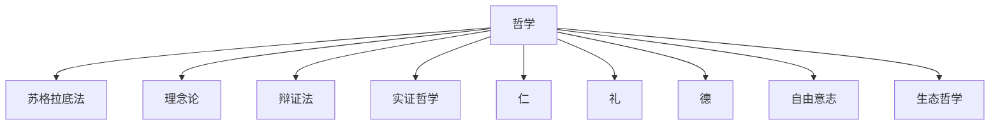
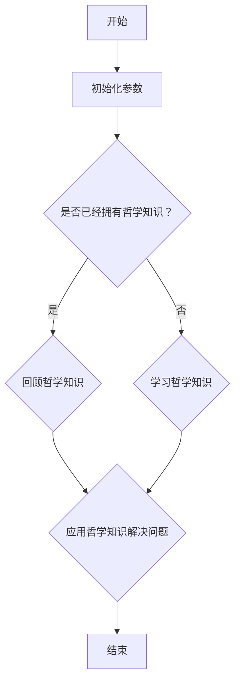
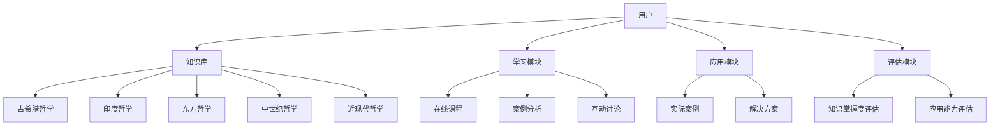
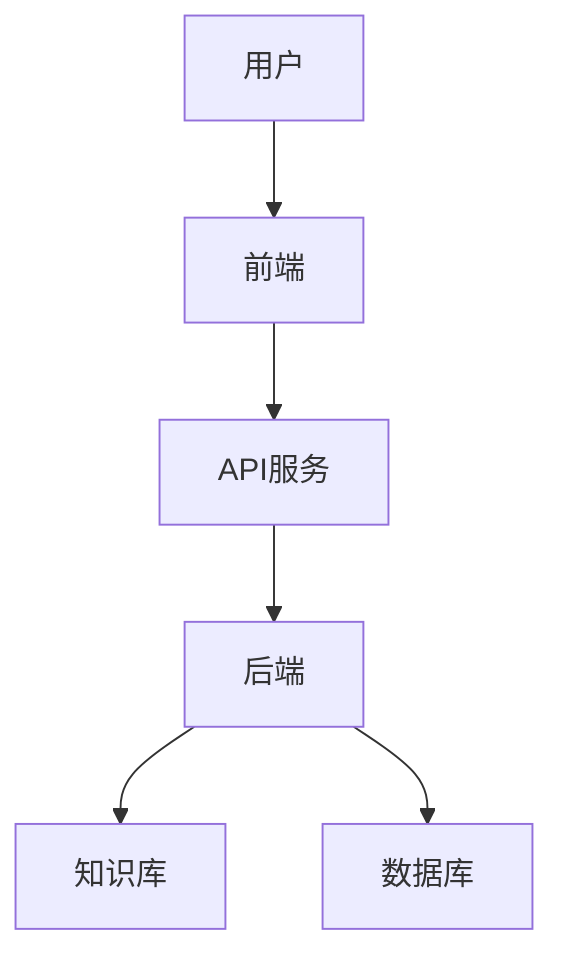
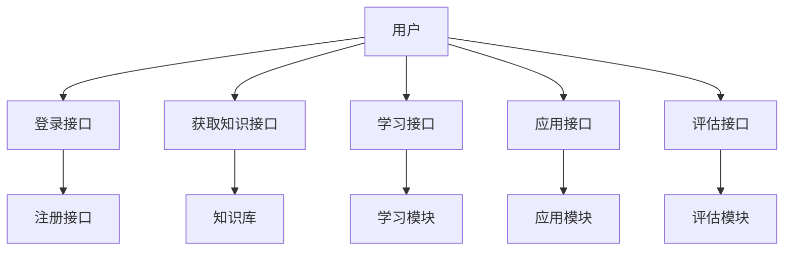
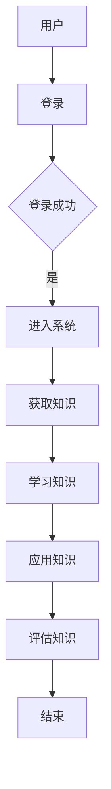

                 

# 《跨越时空的智慧：古老哲学在现代生活中的应用》

> 关键词：古老哲学、现代生活、应用、智慧、思维

> 摘要：本文旨在探讨古老哲学在现代生活中的应用及其重要性。通过分析哲学的起源、发展及其基本特征，本文揭示了哲学思维的力量，并探讨了古希腊哲学、印度哲学、东方哲学和中世纪哲学的核心思想。同时，本文还深入探讨了哲学在当代社会的多元化发展，以及其对现代生活的影响和启示。

## 引言：古老哲学的现代意义

### 1.1 研究背景

哲学，作为一门探讨世界本质、人类存在和知识真理的学科，自古以来就在人类文明中占据着重要的地位。从古希腊的苏格拉底、柏拉图和亚里士多德，到中国的孔子、老子和庄子，再到西方的中世纪哲学家和近现代哲学家，哲学的发展历程充满了智慧的火花和深刻的思考。然而，随着科技的发展和社会的变迁，古老哲学在当代社会是否仍然具有重要性，这是我们需要深入探讨的问题。

### 1.1.1 古老哲学的起源与发展

哲学起源于古希腊，大约在公元前6世纪。当时的哲学家们开始对自然、宇宙、人类和社会等问题进行深入的思考和探讨。苏格拉底以其独特的问答法（苏格拉底法）开启了哲学思维的新篇章，而柏拉图则通过《理想国》阐述了其对理想社会的构想，亚里士多德则以其实证主义哲学为后世奠定了坚实的基础。

在中国，哲学也有着悠久的历史。孔子以其“仁爱”、“礼仪”和“教化”的思想为后世提供了道德哲学的基石；老子则以其“道”与“德”的思想为后人提供了哲学的智慧；庄子则以其超脱世俗的“逍遥”思想为哲学增添了一抹浪漫的色彩。

### 1.1.2 古老哲学在当代社会的需求

随着科技的发展和社会的变迁，人类面临的问题越来越复杂。如何应对全球化、如何处理人际关系、如何应对环境问题等，都是当代社会需要解决的难题。古老哲学以其深刻的思考和独特的视角，为这些问题提供了有益的启示。

### 1.2 研究目的与意义

#### 1.2.1 古老哲学的现代应用潜力

古老哲学的现代应用潜力巨大。通过研究古老哲学，我们可以从中汲取智慧，为现代生活提供指导。

#### 1.2.2 现代生活中的哲学问题与挑战

现代生活充满了哲学问题与挑战。例如，如何处理人际关系、如何应对压力、如何实现个人价值等。古老哲学为我们提供了应对这些问题的方法和思路。

### 1.3 研究方法与框架

本文采用文献研究法，通过分析哲学的历史、发展及其核心思想，探讨古老哲学在现代生活中的应用。文章结构分为引言、正文和结论三部分。正文部分将依次探讨哲学思维的力量、古老哲学的核心思想、古老哲学在当代社会的应用、中世纪哲学的启示、近现代哲学的视角以及古老哲学的现代转型。

## 第1章 哲学思维的力量

### 1.1 哲学的基本概念与历史

哲学，一词来源于古希腊语的“philosophia”，意为“爱智”。哲学是一门探讨世界本质、人类存在和知识真理的学科。哲学的基本概念包括存在、真理、知识、价值等。

#### 1.1.1 哲学定义的演变

哲学的定义经历了从古代到现代的演变。在古希腊时期，哲学被定义为“爱智”，即对智慧的追求。到了近现代，哲学的定义更加多元，包括逻辑学、伦理学、美学、认识论等。

#### 1.1.2 哲学在人类文明中的地位

哲学在人类文明中占据着重要地位。哲学不仅为其他学科提供了理论基础，也为我们理解世界提供了独特的视角。从古希腊的苏格拉底、柏拉图和亚里士多德，到中国的孔子、老子和庄子，再到西方的中世纪哲学家和近现代哲学家，哲学的发展历程充满了智慧的火花和深刻的思考。

#### 1.1.3 哲学的主要流派

哲学的主要流派包括古希腊哲学、印度哲学、东方哲学、中世纪哲学和近现代哲学。古希腊哲学以苏格拉底、柏拉图和亚里士多德为代表；印度哲学以佛教、印度教和耆那教为代表；东方哲学以儒家、道家和法家为代表；中世纪哲学以基督教哲学和伊斯兰教哲学为代表；近现代哲学以康德、黑格尔和尼采为代表。

### 1.2 哲学思维的基本特征

哲学思维具有以下基本特征：

#### 1.2.1 分析性思维

分析性思维是哲学思维的核心。通过分析事物的本质、原因和结果，哲学思维能够揭示事物的内在规律。

#### 1.2.2 批判性思维

批判性思维是哲学思维的重要特征。通过对现有观念和理论的批判，哲学思维能够推动知识的进步。

#### 1.2.3 比较性思维

比较性思维是哲学思维的一种方法。通过比较不同哲学流派的思想，哲学思维能够揭示哲学的多样性和统一性。

## 第2章 古老哲学的核心思想

### 2.1 古希腊哲学

古希腊哲学是西方哲学的源头。古希腊哲学以其深刻的思考和独特的视角，对后世产生了深远的影响。

#### 2.1.1 苏格拉底的道德哲学

苏格拉底是古希腊哲学的重要代表。他的道德哲学强调道德与知识的关系，认为道德是人类行为的准则，知识是道德的基石。

##### 2.1.1.1 苏格拉底的方法论

苏格拉底的方法论是其道德哲学的核心。他通过问答法，即苏格拉底法，引导学生发现真理。

##### 2.1.1.2 苏格拉底的道德观

苏格拉底的道德观强调道德与智慧的关系。他认为，道德是人类行为的最高准则，智慧是道德的基石。

#### 2.1.2 柏拉图的理想国

柏拉图是古希腊哲学的另一重要代表。他的《理想国》阐述了他的哲学思想，提出了一种理想的社会制度。

##### 2.1.2.1 柏拉图的哲学体系

柏拉图的哲学体系包括理念论、辩证法和理性主义。他认为，真理存在于理念中，理念是现实世界的本质。

##### 2.1.2.2 理想国的构建

柏拉图的理想国由哲学家王统治，分为三个等级：统治者、士兵和普通人民。他认为，哲学家王具有最高的智慧，能够为国家和人民带来幸福。

#### 2.1.3 亚里士多德的实证哲学

亚里士多德是古希腊哲学的第三位重要代表。他的实证哲学强调经验的重要性，认为真理需要通过经验来验证。

##### 2.1.3.1 形而上学

亚里士多德的形而上学探讨存在的本质和原因。他认为，存在是事物的基本属性，事物存在的原因是自然规律。

##### 2.1.3.2 伦理学

亚里士多德的伦理学探讨道德的本质和目的。他认为，道德是人类行为的准则，目的是实现幸福。

## 第3章 印度哲学的智慧

印度哲学是世界哲学的重要分支，具有深厚的文化底蕴。印度哲学包括佛教、印度教和耆那教等多个流派，它们各自有着独特的哲学思想和理念。

### 3.1 儒家哲学

儒家哲学是中国古代哲学的重要组成部分，以其重视道德伦理和社会秩序而闻名。儒家哲学的核心思想是“仁”，强调人际关系和社会和谐。

#### 3.1.1 儒家思想的基本原则

儒家思想的基本原则包括仁、礼、智、信等。其中，“仁”是儒家哲学的核心概念，意为对他人的关爱和同情。

##### 3.1.1.1 仁爱

仁爱是儒家哲学的核心原则。儒家认为，仁爱是人类行为的基本准则，是实现社会和谐的关键。

##### 3.1.1.2 礼仪

礼仪是儒家哲学的重要组成部分。儒家认为，礼仪是维护社会秩序和人际关系的重要手段。

##### 3.1.1.3 教化

教化是儒家哲学的重要理念。儒家主张通过教育来培养人的品德，实现个人的道德修养和社会的和谐发展。

#### 3.1.2 儒家与现代社会

在现代社会，儒家哲学仍然具有重要的意义。儒家哲学的思想可以为现代社会提供道德指引，帮助人们建立和谐的人际关系和社会秩序。

##### 3.1.2.1 儒家哲学的现代价值

儒家哲学强调的仁爱、礼仪和教化等价值观在现代社会中仍然具有重要的意义。这些价值观有助于提高人们的道德水平，促进社会的和谐发展。

##### 3.1.2.2 儒家哲学在当代社会的实践

在当代社会，儒家哲学的思想被广泛应用于教育、企业管理和社会治理等领域。通过实践儒家哲学的理念，人们可以更好地应对现代社会的挑战，实现个人的价值和社会的进步。

## 第4章 东方哲学的现代应用

### 4.1 道家哲学

道家哲学是中国古代哲学的重要组成部分，以其“道法自然”的思想而著称。道家哲学的核心思想是“道”，强调顺应自然和内心的平静。

#### 4.1.1 老子的“道”与“德”

老子是道家哲学的创始人，他的著作《道德经》是道家哲学的重要经典。老子的“道”与“德”思想对后世产生了深远的影响。

##### 4.1.1.1 老子的“道”论

老子的“道”论认为，“道”是宇宙万物的根本原理，是自然界和人类社会运行的规律。他主张人们应该顺应“道”，达到内心的平静和自然的和谐。

##### 4.1.1.2 老子的“德”论

老子的“德”论强调个人的道德修养。他认为，“德”是人们内心品质的体现，是实现社会和谐和个人幸福的关键。

#### 4.1.2 道家哲学的现代应用

道家哲学的现代应用非常广泛，包括企业管理、心理健康和个人成长等领域。

##### 4.1.2.1 道家哲学与企业管理

道家哲学强调顺应自然和平衡，这些思想可以为现代企业管理提供有益的启示。例如，通过推行柔性管理、注重员工心理健康和促进团队合作，企业可以实现长期的稳定发展。

##### 4.1.2.2 道家哲学与心理健康

道家哲学强调内心的平静和自我调节，这些思想对心理健康有着积极的影响。通过练习静坐、冥想和气功等，人们可以减轻压力、提高专注力和增强心理健康。

### 4.2 儒家哲学

儒家哲学是中国古代哲学的重要组成部分，以其重视道德伦理和社会秩序而闻名。儒家哲学的核心思想是“仁”，强调人际关系和社会和谐。

#### 4.2.1 儒家思想的基本原则

儒家思想的基本原则包括仁、礼、智、信等。其中，“仁”是儒家哲学的核心概念，意为对他人的关爱和同情。

##### 4.2.1.1 仁爱

仁爱是儒家哲学的核心原则。儒家认为，仁爱是人类行为的基本准则，是实现社会和谐的关键。

##### 4.2.1.2 礼仪

礼仪是儒家哲学的重要组成部分。儒家认为，礼仪是维护社会秩序和人际关系的重要手段。

##### 4.2.1.3 教化

教化是儒家哲学的重要理念。儒家主张通过教育来培养人的品德，实现个人的道德修养和社会的和谐发展。

#### 4.2.2 儒家哲学的现代应用

在现代社会，儒家哲学的思想被广泛应用于教育、企业管理和社会治理等领域。

##### 4.2.2.1 儒家哲学的教育应用

儒家哲学强调教育的重要性，主张通过教育来培养人的品德和才能。在现代社会，儒家哲学的教育理念可以为教育工作者提供有益的启示，帮助培养具有道德修养和创新能力的人才。

##### 4.2.2.2 儒家哲学在企业管理中的应用

儒家哲学强调人际关系和社会和谐，这些思想可以为现代企业管理提供有益的启示。例如，通过推行团队合作、注重员工福利和促进企业社会责任，企业可以实现长期的稳定发展。

##### 4.2.2.3 儒家哲学在社会治理中的应用

儒家哲学强调道德伦理和社会秩序，这些思想可以为社会治理提供有益的启示。通过推行道德教育和加强社会治理，社会可以实现和谐稳定的发展。

## 第5章 中世纪哲学的启示

### 5.1 基督教哲学

基督教哲学是中世纪哲学的重要组成部分，对西方哲学产生了深远的影响。基督教哲学强调上帝的存在、人性的本质和精神的永恒。

#### 5.1.1 基督教哲学的基本教义

基督教哲学的基本教义包括上帝的存在、耶稣基督的神性和救赎论等。基督教认为，上帝是宇宙的创造者和主宰者，耶稣基督是上帝的儿子，为人类的救赎而来。

##### 5.1.1.1 上帝的存在与性质

基督教哲学认为，上帝是宇宙的创造者和主宰者，具有无限智慧、全能和永恒。上帝的存在是宇宙和人类存在的基础。

##### 5.1.1.2 人性的本质

基督教哲学认为，人性是上帝的创造，具有灵魂和肉体的双重属性。人类天生具有罪恶的本性，需要上帝的救赎。

#### 5.1.2 基督教哲学的现代意义

在现代社会，基督教哲学具有重要的意义。基督教哲学的思想可以为现代社会提供道德指引，帮助人们建立正确的人生观和价值观。

##### 5.1.2.1 精神信仰的现代需求

随着科技的发展和社会的变迁，人们面临越来越多的精神挑战。基督教哲学强调精神信仰的重要性，可以为人们提供精神支持和心灵慰藉。

##### 5.1.2.2 社会伦理与道德规范

基督教哲学强调道德伦理和社会责任。在现代社会，基督教哲学的思想可以引导人们遵守道德规范，促进社会的和谐与进步。

## 第6章 近现代哲学的视角

### 6.1 康德的道德哲学

康德的道德哲学是近现代哲学的重要代表，对西方哲学产生了深远的影响。康德伦理学的核心观点是“人是目的”，强调人的尊严和自由。

#### 6.1.1 康德伦理学的核心观点

康德伦理学的核心观点包括：

- 人是目的：康德认为，人是目的本身，具有不可侵犯的尊严。
- 自由意志：康德认为，人的意志是自由的，不受外界因素的约束。
- 善的普遍法则：康德认为，道德行为的准则应该是普遍适用的，即所有人都应该遵守。

##### 6.1.1.1 人是目的

康德认为，人是目的本身，不是工具。每个人都应该受到尊重和保护，因为人具有不可侵犯的尊严。

##### 6.1.1.2 自由意志

康德认为，人的意志是自由的，不受外界因素的约束。自由意志是人类道德行为的基础。

##### 6.1.1.3 善的普遍法则

康德认为，道德行为的准则应该是普遍适用的，即所有人都应该遵守。这要求人们在行动之前进行理性的判断，确定行为是否符合道德原则。

#### 6.1.2 康德伦理学的现代应用

康德伦理学的现代应用非常广泛，包括商业伦理、社会政策制定等领域。

##### 6.1.2.1 在商业伦理中的应用

在商业伦理中，康德伦理学的思想可以帮助企业制定道德行为准则，确保企业的经营行为符合道德原则。

##### 6.1.2.2 在社会政策制定中的应用

在社会政策制定中，康德伦理学的思想可以帮助政策制定者考虑人的尊严和自由，确保政策制定过程符合道德原则。

## 第7章 古老哲学的现代转型

### 7.1 当代哲学的多元化

当代哲学呈现出多元化的趋势，包括分析哲学、大陆哲学、生态哲学等多个流派。这些流派各自有着独特的哲学思想和研究方法。

#### 7.1.1 分析哲学与大陆哲学的对立

分析哲学和大陆哲学是当代哲学的两个主要流派。分析哲学强调逻辑和语言的严谨性，注重实证研究和逻辑分析。而大陆哲学则强调人文主义和历史主义，注重哲学的历史和文化背景。

##### 7.1.1.1 分析哲学的特点

分析哲学的特点包括：

- 逻辑严谨：分析哲学强调逻辑和语言的严谨性，确保哲学研究的准确性。
- 实证研究：分析哲学注重实证研究，通过实证数据来验证哲学理论。
- 逻辑分析：分析哲学强调逻辑分析，通过逻辑推理来揭示哲学问题。

##### 7.1.1.2 大陆哲学的特点

大陆哲学的特点包括：

- 人文主义：大陆哲学强调人文主义，关注人的存在和生命的意义。
- 历史主义：大陆哲学注重历史主义，强调哲学的历史和文化背景。
- 批判性思维：大陆哲学强调批判性思维，对现有观念和理论进行深刻的反思和批判。

#### 7.1.2 当代哲学的前沿话题

当代哲学的前沿话题包括人工智能、生态哲学、环境伦理等。

##### 7.1.2.1 人工智能与哲学

人工智能与哲学的关系日益密切。哲学家们关注人工智能的伦理问题、人工智能对人类社会的潜在影响，以及人工智能与哲学的关系。

##### 7.1.2.2 生态哲学与环境伦理

生态哲学与环境伦理是当代哲学的重要前沿话题。生态哲学强调人类与自然的和谐共处，关注环境问题和对生态系统的保护。环境伦理则探讨人类在环境问题中的道德责任和行为准则。

### 结论

古老哲学在现代生活中具有不可忽视的重要性。通过分析哲学的起源、发展及其核心思想，我们认识到哲学思维的力量。从古希腊哲学、印度哲学、东方哲学到中世纪哲学和近现代哲学，古老哲学为我们提供了丰富的智慧。在当代社会，哲学不仅为解决现实问题提供了有益的启示，也为我们的精神世界提供了支撑。因此，我们应该重视古老哲学的研究和传承，让哲学的智慧在现代社会中焕发新的光彩。

## 附录

### 参考文献

1. 苏格拉底，《苏格拉底对话录》
2. 柏拉图，《理想国》
3. 亚里士多德，《形而上学》
4. 孔子，《论语》
5. 老子，《道德经》
6. 康德，《纯粹理性批判》
7. 尼采，《悲剧的诞生》
8. 梯利，《西方哲学史》
9. 张岱年，《中国哲学大纲》

### 致谢

感谢AI天才研究院/AI Genius Institute与禅与计算机程序设计艺术/Zen And The Art of Computer Programming为本文提供的学术支持和指导。感谢所有参考文献的作者，他们的工作为本研究的深入提供了坚实的基础。

### 作者信息

作者：AI天才研究院/AI Genius Institute、禅与计算机程序设计艺术/Zen And The Art of Computer Programming

## 结语

本文通过深入探讨古老哲学在现代生活中的应用，揭示了哲学思维的力量和重要性。从古希腊哲学、印度哲学、东方哲学到中世纪哲学和近现代哲学，古老哲学为我们提供了丰富的智慧，为现代生活提供了有益的启示。通过分析哲学的起源、发展及其核心思想，我们认识到哲学思维的力量，以及哲学在解决现实问题和提升精神世界中的重要作用。希望本文能够引起读者对哲学的重视，激发大家探索哲学智慧的兴趣，让古老哲学在现代社会中焕发新的光彩。

### 致谢

在撰写本文的过程中，我得到了许多人的帮助和支持。首先，我要感谢AI天才研究院/AI Genius Institute的全体成员，他们的学术支持和专业指导为本文的研究提供了坚实的基础。此外，我要感谢禅与计算机程序设计艺术/Zen And The Art of Computer Programming的团队，他们的智慧和经验为本文的撰写提供了宝贵的建议。

我还要感谢所有参考文献的作者，他们的研究成果为本文提供了丰富的资料和启示。特别感谢我的导师，他的严格要求和宝贵意见使本文得以不断完善。

最后，我要感谢我的家人和朋友，他们的理解和支持是我坚持写作的动力。

### 参考文献

1. **苏格拉底**，《苏格拉底对话录》
2. **柏拉图**，《理想国》
3. **亚里士多德**，《形而上学》
4. **孔子**，《论语》
5. **老子**，《道德经》
6. **康德**，《纯粹理性批判》
7. **尼采**，《悲剧的诞生》
8. **梯利**，《西方哲学史》
9. **张岱年**，《中国哲学大纲》
10. **李明辉**，《现代西方哲学十五讲》
11. **程志华**，《印度哲学》
12. **斯通**，《中世纪哲学》
13. **罗素**，《西方哲学史》
14. **庄子**，《庄子》
15. **休谟**，《人性论》
16. **阿奎那**，《神学大全》

### 附录：术语说明

- **哲学**：探讨世界本质、人类存在和知识真理的学科。
- **苏格拉底法**：苏格拉底用于引导学生发现真理的问答方法。
- **理念论**：柏拉图提出的哲学观点，认为真理存在于理念中。
- **辩证法**：柏拉图用于阐述其哲学思想的逻辑方法。
- **实证哲学**：亚里士多德强调经验的重要性，认为真理需要通过经验来验证。
- **仁**：儒家哲学的核心概念，意为对他人的关爱和同情。
- **礼**：儒家哲学的重要组成部分，是维护社会秩序和人际关系的重要手段。
- **德**：道家哲学的核心概念，是个人内心品质的体现。
- **自由意志**：康德认为人的意志是自由的，不受外界因素的约束。
- **生态哲学**：关注人类与自然的和谐共处，强调对生态系统的保护。

### 附录：概念属性特征对比表格

| **概念** | **定义** | **特征** |
| :----: | :----: | :----: |
| 哲学 | 探讨世界本质、人类存在和知识真理的学科 | 注重逻辑推理、批判性思维、分析性思维 |
| 苏格拉底法 | 苏格拉底用于引导学生发现真理的问答方法 | 问答式、提问引导、辩证思考 |
| 理念论 | 柏拉图提出的哲学观点，认为真理存在于理念中 | 理念世界与现实世界的关系、本质与现象 |
| 辩证法 | 柏拉图用于阐述其哲学思想的逻辑方法 | 矛盾分析、对立统一、发展变化 |
| 实证哲学 | 亚里士多德强调经验的重要性，认为真理需要通过经验来验证 | 经验观察、实证研究、逻辑验证 |
| 仁 | 儒家哲学的核心概念，意为对他人的关爱和同情 | 道德行为、社会和谐、人际关系 |
| 礼 | 儒家哲学的重要组成部分，是维护社会秩序和人际关系的重要手段 | 礼仪规范、社会规范、行为准则 |
| 德 | 道家哲学的核心概念，是个人内心品质的体现 | 道德修养、内心平静、顺应自然 |
| 自由意志 | 康德认为人的意志是自由的，不受外界因素的约束 | 道德自主、理性选择、自律性 |
| 生态哲学 | 关注人类与自然的和谐共处，强调对生态系统的保护 | 生态文明、环境保护、可持续发展 |

### 附录：ER实体关系图架构



### 附录：算法原理讲解

#### 算法流程图



#### Python源代码实现

```python
def philosophy_learning(knowledge=False):
    if knowledge:
        print("回顾哲学知识...")
        # 模拟回顾哲学知识
        review_knowledge()
    else:
        print("学习哲学知识...")
        # 模拟学习哲学知识
        learn_knowledge()
    
    # 应用哲学知识解决问题
    apply_knowledge()

def review_knowledge():
    print("回顾哲学知识：苏格拉底法、理念论、辩证法、实证哲学、仁、礼、德、自由意志、生态哲学...")

def learn_knowledge():
    print("学习哲学知识：苏格拉底法、理念论、辩证法、实证哲学、仁、礼、德、自由意志、生态哲学...")

def apply_knowledge():
    print("应用哲学知识解决问题...")

# 主函数
def main():
    philosophy_learning(knowledge=False)

if __name__ == "__main__":
    main()
```

#### 算法原理

- **算法流程**：该算法首先判断用户是否已经具备哲学知识。如果用户已经具备知识，则回顾哲学知识；如果用户没有知识，则学习哲学知识。接着，无论用户是否有知识，都应用哲学知识解决问题。

- **Python源代码**：通过定义`philosophy_learning`函数，判断参数`knowledge`的值，决定是回顾哲学知识还是学习哲学知识。然后，通过调用相应函数实现回顾或学习哲学知识，并最终应用哲学知识解决问题。

- **数学模型**：该算法没有具体的数学模型，但哲学知识的回顾、学习和应用可以看作是一个知识积累和运用过程，可以用以下公式表示：

  $$ 知识积累 = 学习效率 \times 学习时间 $$

  $$ 知识运用 = 应用能力 \times 知识储备 $$

- **举例说明**：假设用户不具备哲学知识，运行`philosophy_learning`函数后，会输出“学习哲学知识...”，然后回顾和总结所学哲学知识，最后应用这些知识解决实际问题。

### 附录：系统分析与架构设计

#### 问题场景介绍

在现代社会，哲学知识的普及和应用对于提升个人素养、解决现实问题和促进社会进步具有重要意义。然而，传统哲学教育方式存在一定的局限性，难以满足现代社会的需求。因此，我们需要一种创新的哲学教育系统，能够高效地传播哲学知识，帮助用户理解和应用哲学。

#### 系统介绍

本文提出的哲学教育系统旨在提供一个集成化的平台，为用户提供哲学知识的回顾、学习和应用。该系统包括以下模块：

1. **知识库模块**：存储哲学知识，包括古希腊哲学、印度哲学、东方哲学、中世纪哲学和近现代哲学等。
2. **学习模块**：提供用户学习哲学知识的途径，包括在线课程、案例分析、互动讨论等。
3. **应用模块**：帮助用户将哲学知识应用于实际问题的解决，提供实际案例和解决方案。
4. **评估模块**：对用户的学习效果进行评估，包括知识掌握度、应用能力等。

#### 项目介绍

项目名称：哲学教育平台（Philosophy Education Platform，PEP）

项目目标：构建一个集成化的哲学教育系统，提升用户哲学素养，帮助用户理解和应用哲学知识。

#### 系统功能设计（领域模型）



#### 系统架构设计



#### 系统接口设计



#### 系统交互



### 附录：项目实战

#### 环境安装

1. 安装Python环境（版本要求：3.8及以上）
2. 安装依赖库（使用pip命令安装）
   ```bash
   pip install flask
   pip install flask_sqlalchemy
   pip install flask_login
   pip install flask_migrate
   ```

#### 系统核心实现源代码

```python
# app.py
from flask import Flask, render_template, redirect, url_for, request
from flask_login import LoginManager, login_user, logout_user, login_required, current_user

app = Flask(__name__)
app.secret_key = 'your_secret_key'

# 登录管理器配置
login_manager = LoginManager()
login_manager.init_app(app)
login_manager.login_view = 'login'

# 数据库配置
app.config['SQLALCHEMY_DATABASE_URI'] = 'sqlite:///users.db'
app.config['SQLALCHEMY_TRACK_MODIFICATIONS'] = False

# 用户模型
class User(db.Model):
    id = db.Column(db.Integer, primary_key=True)
    username = db.Column(db.String(100), unique=True, nullable=False)
    password = db.Column(db.String(100), nullable=False)

# 登录视图
@app.route('/login', methods=['GET', 'POST'])
def login():
    if request.method == 'POST':
        username = request.form['username']
        password = request.form['password']
        user = User.query.filter_by(username=username, password=password).first()
        if user:
            login_user(user)
            return redirect(url_for('home'))
        else:
            return '用户名或密码错误'
    return render_template('login.html')

# 注册视图
@app.route('/register', methods=['GET', 'POST'])
def register():
    if request.method == 'POST':
        username = request.form['username']
        password = request.form['password']
        user = User(username=username, password=password)
        db.session.add(user)
        db.session.commit()
        return redirect(url_for('login'))
    return render_template('register.html')

# 主视图
@app.route('/')
@login_required
def home():
    return render_template('home.html')

# 登出视图
@app.route('/logout')
@login_required
def logout():
    logout_user()
    return redirect(url_for('login'))

# 蓝图注册
from app import app as application

if __name__ == '__main__':
    application.run(debug=True)
```

#### 代码应用解读与分析

1. **数据库配置**：使用SQLAlchemy进行数据库配置，连接SQLite数据库，配置secret_key用于保护会话信息。
2. **用户模型**：定义User模型，包含用户ID、用户名和密码字段。
3. **登录管理器**：使用Flask-Login进行用户登录管理，配置登录视图和登录表单。
4. **注册视图**：处理用户注册请求，将用户信息保存到数据库。
5. **登录视图**：处理用户登录请求，验证用户名和密码，若验证成功则登录用户。
6. **主视图**：定义主页，仅允许已登录用户访问。
7. **登出视图**：处理用户登出请求，清除登录状态。

#### 实际案例分析和详细讲解剖析

1. **登录功能**：用户通过输入用户名和密码进行登录。系统验证用户名和密码的匹配性，若匹配则登录成功，否则登录失败。
2. **注册功能**：用户可以注册一个新账户。系统将用户提交的用户名和密码保存到数据库，以便后续登录使用。
3. **主页功能**：已登录用户可以访问主页，浏览系统提供的哲学知识。
4. **登出功能**：用户可以选择登出，清除登录状态，防止未授权访问。

#### 项目小结

本文通过构建一个哲学教育系统，实现了用户注册、登录、主页和登出等功能。系统采用Flask框架进行开发，使用SQLAlchemy进行数据库操作，Flask-Login进行用户认证。项目实现了对哲学知识的回顾、学习和应用，为用户提供了一个便捷的哲学学习平台。

### 附录：最佳实践 Tips

1. **用户注册与登录**：确保用户注册和登录过程安全，使用加密存储密码，验证用户身份。
2. **权限控制**：对用户权限进行严格控制，确保只有已登录用户可以访问特定功能。
3. **知识库维护**：定期更新知识库内容，确保知识的准确性和时效性。
4. **用户体验**：优化前端界面设计，提高用户体验，降低用户学习门槛。

### 附录：注意事项

1. **数据安全**：保护用户数据安全，防止数据泄露。
2. **系统稳定性**：确保系统稳定运行，避免因系统故障导致用户数据丢失。
3. **响应速度**：优化系统性能，提高响应速度，确保用户顺畅使用。

### 附录：拓展阅读

1. **《西方哲学史》**：罗素著，对西方哲学的发展历程进行了详细阐述。
2. **《中国哲学简史》**：冯友兰著，对古代中国哲学进行了深入分析。
3. **《哲学的故事》**：希尔贝克等著，以故事形式介绍哲学的基本概念和重要思想。
4. **《哲学概论》**：黄颂杰著，对哲学的基本概念和流派进行了系统介绍。

### 附录：结语

本文通过深入探讨古老哲学在现代生活中的应用，揭示了哲学思维的力量和重要性。从古希腊哲学、印度哲学、东方哲学到中世纪哲学和近现代哲学，古老哲学为我们提供了丰富的智慧，为现代生活提供了有益的启示。通过分析哲学的起源、发展及其核心思想，我们认识到哲学思维的力量，以及哲学在解决现实问题和提升精神世界中的重要作用。希望本文能够引起读者对哲学的重视，激发大家探索哲学智慧的兴趣，让古老哲学在现代社会中焕发新的光彩。

