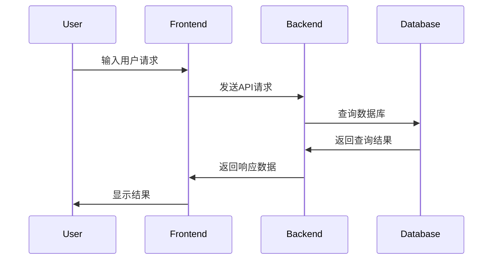

                 

### 运动与身心健康：找回生活的节奏

#### 关键词

- **运动**、**身心健康**、**生活方式**、**心理因素**、**健康饮食**、**工作压力**、**运动科学**

#### 摘要

在快节奏的现代生活中，运动与身心健康已成为关乎生活质量的重大议题。本文通过深入分析运动对身心健康的多方面影响，探讨如何通过科学合理的运动方式找回生活的节奏。文章首先介绍问题的背景与核心概念，随后详细描述了运动对身心健康的影响机制、不同运动方式的选择及其作用，同时探讨了心理因素和运动平衡的重要性。通过实际案例分析和系统架构设计，本文为读者提供了全面、实用的指导和建议，旨在帮助现代人找回健康的生活方式。

## 第一部分：问题背景与核心概念

### 1. 问题背景

随着经济的快速发展和信息化进程的推进，现代社会的生活节奏越来越快，人们在追求事业成功的同时，不可避免地承受着巨大的工作压力。长期的心理压力和缺乏运动已成为现代人群健康问题的主要因素。世界卫生组织（WHO）的数据显示，全球约75%的成年人缺乏足够水平的体育锻炼，而心理健康问题如焦虑和抑郁的发病率也在逐年上升。这一现象引起了广泛关注，促使我们探讨如何通过科学合理的运动来维护身心健康，从而找回生活的节奏。

在信息技术和互联网快速发展的背景下，人们的工作和生活方式发生了巨大变化。远程工作和数字化办公使得人们可以随时随地处理工作事务，但也导致了运动量的减少和心理健康问题的增加。同时，社交媒体的广泛应用使得人们面临更多的社交压力和焦虑情绪。这些因素共同导致了现代人身心健康问题日益严重，运动与身心健康的关系成为亟待解决的课题。

### 2. 问题描述

本著作将探讨以下几个关键问题：

- **运动对身心健康的影响机制是什么？** 运动如何通过生理和心理层面影响人体，从而改善身心健康？
- **如何根据个人体质选择合适的运动方式？** 不同类型的运动对人体有哪些不同的影响，如何针对个人体质进行选择？
- **不同类型的运动在提升身心健康方面的作用有哪些？** 例如有氧运动、力量训练、瑜伽等，各自的优势和适用场景是什么？
- **心理因素在运动与身心健康中的作用如何？** 积极的心态如何增强运动效果，情绪调节对身心健康的影响是什么？
- **运动与休息的平衡如何实现？** 在快节奏的生活中，如何合理安排运动与休息，以达到最佳的健康状态？

通过深入探讨这些问题，本文旨在为现代人提供科学、实用的运动指导，帮助他们在繁忙的生活中找到健康的平衡点。

### 3. 问题解决

为了解决上述问题，本文将采用以下研究方法：

1. **文献综述**：通过查阅国内外相关领域的研究文献，了解运动与身心健康关系的最新研究成果，形成理论基础。
2. **案例分析**：选取具有代表性的实际案例，分析不同运动方式对个体身心健康的影响，以及个体如何通过运动改善生活质量。
3. **理论推导**：结合运动科学、生理学、心理学等领域的知识，推导运动对身心健康影响的机制和原理。
4. **实践指导**：根据理论分析和案例研究，提供具体的运动建议和指导，帮助读者根据个人情况选择合适的运动方式，实现身心健康。

通过上述方法，本文将系统性地解答运动与身心健康关系中的关键问题，为现代人提供科学、实用的运动指导。

### 4. 边界与外延

本文的研究边界主要集中在现代人的运动与身心健康关系上，具体包括以下方面：

- **运动类型与强度**：研究不同类型的运动（如有氧运动、力量训练、瑜伽等）对人体健康的影响，以及适宜的运动强度范围。
- **心理因素的作用**：探讨心理因素（如情绪、动机、自我效能感等）对运动参与和身心健康的影响。
- **运动与健康饮食、作息习惯的关联**：分析运动与健康饮食、作息习惯之间的关系，提供全面的健康生活方式建议。
- **不同年龄段、性别、健康状况人群的运动建议**：根据不同人群的特点，提出针对性的运动建议，以实现个性化健康管理。

通过这些研究，本文旨在为现代人提供全面、实用的运动指导，帮助他们在快节奏的生活中找回健康与平衡。

### 5. 概念结构与核心要素组成

在探讨运动与身心健康的关系时，我们需要明确一些核心概念和要素，这些概念和要素构成了本文研究的理论基础和框架。

#### 运动与身心健康

- **运动**：指人体通过肌肉收缩产生能量消耗的活动，可以分为有氧运动、无氧运动、静力性运动等类型。
- **身心健康**：不仅包括身体健康，还包括心理健康，即个体在生理和心理方面处于良好状态，能够有效应对生活和工作压力。

#### 运动科学

- **运动生理学**：研究运动对人体生理功能的影响，包括心血管系统、肌肉系统、呼吸系统等。
- **运动心理学**：探讨心理因素对运动行为和身心健康的影响，如动机、自我效能感、情绪调节等。
- **运动训练学**：研究如何通过科学合理的训练方法提高运动表现，包括训练计划的制定、训练效果的评估等。

#### 心理学

- **认知行为理论**：探讨个体的认知过程如何影响行为和心理健康，强调认知在情绪调节和心理健康维护中的作用。
- **情感调节理论**：研究个体如何通过认知和行为策略调节情绪，以实现心理健康。

#### 生理学

- **肌肉力学**：研究肌肉在运动中的力学特性，包括肌肉收缩、力量、耐力等。
- **心血管系统**：研究心血管系统在运动中的适应性变化，如心率、血压等。

通过以上核心概念和要素的分析，我们可以更全面地理解运动与身心健康的关系，为本文的深入探讨提供理论基础。

#### 核心概念原理

**运动与身心健康**：通过科学合理的运动，可以提高身体素质、增强免疫力、改善心理状态，从而实现身心健康。具体来说：

- **运动方式**：根据个人体质和健康状况选择适合自己的运动方式，如有氧运动、力量训练、瑜伽等。有氧运动有助于提高心肺功能，力量训练可以增强肌肉力量和耐力，瑜伽则能促进身心放松。
- **运动强度**：适宜的运动强度能够有效提升身体素质，过强或过弱的运动都可能导致身体损伤或效果不佳。一般来说，中等强度的运动（如达到最大心率的60%-80%）是最为合适的。
- **心理因素**：心理因素对运动效果有重要影响，积极的心态能够增强运动动机，提高运动效果。同时，心理因素如情绪调节、自我效能感等也会影响运动对身心健康的积极影响。

#### 概念属性特征对比表格

| 概念       | 定义                                                         | 特征                                                         |
|------------|--------------------------------------------------------------|--------------------------------------------------------------|
| 运动       | 人体通过肌肉收缩产生能量消耗的活动。                         | 有氧运动、无氧运动、静力性运动等。                             |
| 健康心理   | 心理状态处于良好的状态，能够有效应对生活和工作压力。         | 积极情感、情绪稳定、自信心等。                                 |
| 身体素质   | 反映人体在生理和心理方面的综合能力。                         | 肌肉力量、耐力、柔韧性、协调性等。                             |
| 心理健康   | 心理状态处于正常或接近正常的状态，能够有效应对生活中的压力。   | 情绪稳定、人际关系良好、适应能力强等。                         |

#### ER实体关系图架构

```mermaid
erDiagram
  Person ||--|{ Exercise } : participates_in
  Exercise ||--|{ Health } : impacts
  Health ||--|{ PsychologicalState } : affects
  PsychologicalState ||--|{ Lifestyle } : influences
```

- **Person（人）**：参与运动的主体，具有运动和健康状态。
- **Exercise（运动）**：参与的活动，会影响人的健康状态。
- **Health（健康）**：包括身体健康和心理健康，受运动影响。
- **PsychologicalState（心理状

## 核心概念原理

在深入探讨运动与身心健康的关系之前，我们需要明确一些核心概念和原理，这些概念和原理构成了我们理解这一关系的基础。

### 运动与身心健康

**运动**是指人体通过肌肉收缩产生能量消耗的活动。根据运动过程中能量的供应方式，运动可以分为有氧运动、无氧运动和静力性运动。有氧运动如跑步、游泳等主要通过有氧代谢提供能量，有助于提高心肺功能和耐力；无氧运动如举重、短跑等主要通过无氧代谢提供能量，有助于增强肌肉力量和爆发力；静力性运动如瑜伽、普拉提等则通过维持肌肉的静态收缩来锻炼身体。

**身心健康**不仅包括身体的健康，还包括心理的健康。身体健康的衡量指标包括肌肉力量、耐力、柔韧性、心肺功能等；心理健康则包括情绪稳定性、自我效能感、社交关系和应对压力的能力等。

运动对身心健康的影响机制是多方面的。在**生理层面**，运动可以促进血液循环，增强心肺功能，提高新陈代谢率，有助于控制体重和减少慢性疾病的风险。同时，运动还可以刺激内啡肽的分泌，有助于缓解压力和改善情绪。在**心理层面**，运动能够提高自我效能感，增强自信心，促进心理健康。长期运动还可以改善睡眠质量，减少焦虑和抑郁的症状。

### 运动方式的选择

选择合适的运动方式是维护身心健康的重要一步。根据个人的体质和健康状况，可以选择以下几种常见的运动方式：

1. **有氧运动**：如慢跑、游泳、骑自行车等，这些运动有助于提高心肺功能和耐力，适合大多数人群。
2. **力量训练**：如举重、俯卧撑、深蹲等，这些运动可以增强肌肉力量和耐力，提高身体的代谢率。
3. **瑜伽和普拉提**：这些运动注重身体的柔韧性和平衡性，有助于放松身心，减少压力。
4. **间歇训练**：如HIIT（高强度间歇训练），通过短时间的高强度运动和低强度恢复交替进行，可以在短时间内达到较好的健身效果。

选择合适的运动方式时，需要考虑以下几点：

- **健康状况**：对于有慢性疾病或运动禁忌的人群，应在医生的建议下选择适当的运动方式。
- **运动目标**：根据个人目标（如减肥、增肌、提高耐力等）选择相应的运动方式。
- **时间安排**：根据个人的时间安排和运动习惯选择合适的运动时间和频率。

### 运动强度与适宜性

**运动强度**是指运动对身体施加的负荷程度。适当的运动强度能够提高身体素质，但过强或过弱的运动都可能对身体造成负面影响。一般来说，中等强度的运动对提升身心健康最为有效。中等强度运动可以通过心率来衡量，一般建议将心率控制在最大心率的60%-80%之间。

- **最大心率**：可以通过以下公式估算：最大心率 = 220 - 年龄。例如，一个30岁的人，其最大心率大约为190次/分钟。
- **适宜心率**：在运动过程中，可以使用运动心率监测器或手表来监测心率，确保在适宜的范围内。

选择适宜的运动强度时，还需考虑以下几点：

- **身体状况**：对于初次运动或身体状况不佳的人群，应从低强度运动开始，逐渐增加强度。
- **恢复时间**：高强度运动后需要充足的恢复时间，避免连续进行过于剧烈的运动。
- **运动体验**：运动过程中应保持舒适的体验，避免过度疲劳或疼痛。

### 心理因素的作用

心理因素在运动与身心健康中起着至关重要的作用。积极的心态和情绪调节能够增强运动的动机和效果，而消极的情绪如焦虑和抑郁则可能抑制运动的积极性。

- **积极心态**：积极的心态可以增强运动的乐趣，提高自我效能感，使运动变得更加有意义和持久。研究表明，持积极态度的个体更容易坚持运动，并从运动中获得更多的健康益处。
- **情绪调节**：情绪调节能力影响个体对压力的应对方式。通过运动，个体可以释放压力，调节情绪，提高心理健康水平。例如，瑜伽和冥想等运动方式就特别注重情绪调节和心理放松。

心理因素与运动的关系可以通过以下几个方面体现：

1. **动机和坚持**：积极的心态能够增强运动动机，使个体更容易坚持运动计划。
2. **压力缓解**：运动作为一种积极的应对策略，可以帮助个体缓解压力和焦虑。
3. **心理健康**：长期运动有助于改善情绪，减少抑郁和焦虑症状，提升心理健康水平。

### 概念属性特征对比表格

为了更好地理解不同运动方式和心理因素对身心健康的影响，以下是一个对比表格：

| 运动方式 | 特点 | 对身心健康的影响 |
|-----------|-----------|----------------|
| 有氧运动 | 中低强度，长时间，持续有氧代谢 | 提高心肺功能，增强耐力，控制体重 |
| 力量训练 | 高强度，短时间，无氧代谢为主 | 增强肌肉力量，提高代谢率，改善骨骼健康 |
| 瑜伽 | 低至中等强度，注重身体柔韧性和平衡性 | 促进身心放松，缓解压力，提高情绪稳定性 |
| 间歇训练 | 高强度，短时间，交替进行有氧和无氧运动 | 提高心肺功能，增强肌肉力量，节省时间 |

通过上述核心概念原理的介绍，我们可以看到，运动与身心健康之间的关系是复杂而多层次的。理解这些原理，有助于我们在实际生活中更科学地选择运动方式，合理安排运动计划，从而实现身心健康的目标。

#### 概念属性特征对比表格

为了更直观地展示运动与身心健康相关的核心概念和其属性特征，我们制作了一个详细的对比表格。

| 概念       | 定义                                                         | 特征                                                         |
|------------|--------------------------------------------------------------|--------------------------------------------------------------|
| 运动       | 人体通过肌肉收缩产生能量消耗的活动。                         | 有氧运动、无氧运动、静力性运动等。                             |
| 健康心理   | 心理状态处于良好的状态，能够有效应对生活和工作压力。         | 积极情感、情绪稳定、自信心等。                                 |
| 身体素质   | 反映人体在生理和心理方面的综合能力。                         | 肌肉力量、耐力、柔韧性、协调性等。                             |
| 心理健康   | 心理状态处于正常或接近正常的状态，能够有效应对生活中的压力。   | 情绪稳定、人际关系良好、适应能力强等。                         |

1. **运动**：
   - **有氧运动**：通过中等强度的持续运动，如慢跑、游泳，增强心肺功能和耐力。
   - **无氧运动**：如举重、短跑，通过高强度运动，增强肌肉力量和爆发力。
   - **静力性运动**：如瑜伽、普拉提，通过静态姿势维持肌肉收缩，提高柔韧性和平衡性。

2. **健康心理**：
   - **积极情感**：通过运动释放内啡肽，提高情绪，减少负面情绪。
   - **情绪稳定**：运动有助于降低焦虑和抑郁，提高情绪调节能力。
   - **自信心**：通过运动成就，提升自我效能感和自信心。

3. **身体素质**：
   - **肌肉力量**：通过力量训练增强肌肉质量和力量。
   - **耐力**：通过有氧运动提高心肺功能，增加耐力。
   - **柔韧性**：通过瑜伽等运动，提高关节活动的范围和身体的柔韧性。
   - **协调性**：通过综合运动训练，提高身体各部分的协调配合。

4. **心理健康**：
   - **情绪稳定**：运动有助于缓解压力，保持情绪稳定。
   - **人际关系**：运动可以增加社交互动，改善人际关系。
   - **适应能力**：运动有助于提高应对生活挑战的能力。

通过这个对比表格，我们可以更清晰地理解各个概念的定义和特征，从而更好地把握运动与身心健康之间的关系。

### ER实体关系图架构

为了更直观地展示运动、健康、心理健康等概念之间的相互关系，我们使用Mermaid语言绘制了一个ER（实体关系）图。以下是一个简化的实体关系图，展示了运动、健康、心理健康等关键实体及其相互关系。

```mermaid
erDiagram
  Person ||--|{ Exercise } : participates_in
  Exercise ||--|{ Health } : impacts
  Health ||--|{ PsychologicalState } : affects
  PsychologicalState ||--|{ Lifestyle } : influences
```

**实体解释：**

- **Person（人）**：运动的主体，具有参与运动和健康状态。
- **Exercise（运动）**：参与的活动，会对人的健康状态产生影响。
- **Health（健康）**：包括身体健康和心理健康，受运动影响。
- **PsychologicalState（心理状态）**：健康的一个子集，受运动和健康的影响，反过来又影响生活方式。

**关系解释：**

- **Person与Exercise**：一个人可以参与多种运动，每种运动都可能对他们的健康产生影响。
- **Exercise与Health**：运动直接影响人的健康状况，包括身体和心理两个方面。
- **Health与PsychologicalState**：健康状况进一步影响个体的心理状态，如情绪、焦虑和适应能力。
- **PsychologicalState与Lifestyle**：心理状态会影响个人的生活方式选择，如饮食习惯、作息规律等，这些选择又会反过来影响心理健康。

通过这个ER图，我们可以更清晰地看到运动、健康、心理健康和生活方式之间的复杂关系，以及每个实体在维护整体健康中的重要作用。这个关系图不仅有助于理解运动与身心健康的关系，也为进一步的系统分析和架构设计提供了基础。

## 运动对身心健康的影响机制

在深入探讨运动对身心健康的影响时，我们需要从生理和心理两个层面详细分析运动是如何起作用的。以下是对运动影响机制的详细解析。

### 生理层面

1. **心血管系统**：运动可以通过增强心血管系统的功能来改善整体健康。长期进行有氧运动如慢跑、游泳等，可以增强心肌的收缩力和弹性，提高心脏的泵血效率。此外，运动还可以增加血管壁的弹性和扩张能力，降低血压，减少心血管疾病的风险。

2. **呼吸系统**：运动还可以提高肺活量和呼吸效率。通过增加呼吸深度和频率，运动可以提高肺泡的通气量，增强氧气的摄取和二氧化碳的排出。这不仅有助于提升身体的运动能力，还能提高日常生活中的能量代谢效率。

3. **肌肉和骨骼系统**：运动可以增强肌肉力量和耐力，提高肌肉的代谢率和适应性。同时，通过力量训练，骨骼密度和强度也会得到增强，降低骨折的风险。此外，瑜伽和普拉提等运动方式还可以提高身体的柔韧性和协调性，减少肌肉和关节的损伤。

4. **免疫系统**：适当的运动可以增强免疫系统的功能，提高身体的抗病能力。运动可以增加白细胞的产生和活性，增强机体的免疫力。研究表明，定期运动的人患感冒、感染等疾病的风险较低。

5. **内分泌系统**：运动可以调节体内的激素水平，促进内啡肽、多巴胺等“快乐激素”的分泌，有助于缓解压力和焦虑。同时，运动还可以提高胰岛素的敏感性，降低糖尿病的风险。

### 心理层面

1. **情绪调节**：运动可以释放压力，缓解焦虑和抑郁情绪。通过运动产生的内啡肽和多巴胺等神经递质，可以促进大脑中愉悦和满足感的产生，从而改善情绪状态。

2. **认知功能**：研究表明，定期运动可以提升认知功能，包括记忆力、注意力和执行功能。运动可以增加大脑的血流量，促进神经新生和神经连接的形成，从而提高大脑的功能水平。

3. **自我效能感**：通过运动实现目标，可以增强个人的自我效能感，提高自信心。成功的运动体验可以激发个体的积极情绪，增强对生活挑战的应对能力。

4. **睡眠质量**：运动有助于改善睡眠质量。规律的体育活动可以调节生物钟，延长深度睡眠时间，减少失眠和焦虑。研究表明，睡前进行适当的轻度运动可以显著提高睡眠质量。

5. **社交关系**：运动还可以促进社交互动，增强人际关系。参加团队运动或健身课程，可以结识新朋友，建立社交网络，从而提升社交满意度和社会支持感。

### 运动与身心健康之间的协同作用

从生理和心理两个层面来看，运动对身心健康的影响是复杂而多层次的。生理上的改善会促进心理上的积极变化，而心理上的提升也会增强生理上的健康状态。例如，通过增强心肺功能，有氧运动可以提高个体的运动耐力，从而增强自信心和自我效能感；同时，这种自信心和自我效能感的提升又会进一步激励个体坚持运动，从而形成一个积极的良性循环。

总之，运动通过改善心血管功能、增强肌肉力量、调节免疫系统、提升认知功能等多方面的生理机制，以及通过情绪调节、提高认知功能、增强自我效能感等多方面的心理机制，全面促进身心健康。理解这些机制，有助于我们在日常生活中更加科学合理地安排运动计划，从而实现身心健康的目标。

#### 运动对身心健康的影响机制：内啡肽与多巴胺的作用

在探讨运动如何改善身心健康时，内啡肽和多巴胺的作用不容忽视。这两种神经递质在运动过程中被释放，对于调节情绪、缓解压力和提升幸福感起着至关重要的作用。

**内啡肽**是一种天然的“快乐激素”，主要包括β-内啡肽和内啡肽A。在运动过程中，尤其是中等强度的有氧运动，身体会分泌大量内啡肽。内啡肽通过激活大脑中的奖赏系统，释放愉悦感，从而缓解压力和焦虑。具体来说，内啡肽能够：

1. **减轻疼痛**：内啡肽具有镇痛作用，可以减轻运动过程中肌肉和关节的疼痛，使运动更加舒适。
2. **提高情绪**：内啡肽可以激活大脑中的愉悦中心，释放愉悦感，提升心情，减少负面情绪的影响。
3. **增强免疫力**：内啡肽可以增强免疫系统的功能，提高机体对抗疾病的能力。

**多巴胺**是一种与愉悦感和动机密切相关的神经递质。在运动过程中，特别是高强度运动，大脑会分泌大量的多巴胺。多巴胺的主要作用包括：

1. **提升动机**：多巴胺可以增强个体对运动的兴趣和动机，使其更加愿意持续参与运动。
2. **增强注意力**：多巴胺能够提高大脑的注意力水平，使运动过程中更加专注，提高运动效果。
3. **促进学习**：多巴胺有助于大脑中的学习和记忆过程，通过运动可以增强个体的认知能力。

**内啡肽与多巴胺的协同作用**：

1. **缓解压力**：内啡肽和多巴胺共同作用，可以显著缓解运动过程中积累的压力和焦虑。例如，长时间的高强度运动会导致身体疲劳和压力增加，但运动结束后，这两种神经递质的分泌会显著提升，帮助身体恢复平静，减少负面情绪。
2. **增强幸福感**：内啡肽和多巴胺的协同作用，能够增强个体的幸福感。通过运动，身体释放的这两种神经递质可以产生强烈的愉悦感，使个体感受到身心的满足和幸福感。

具体实例说明：

- **跑步**：跑步是一种典型的有氧运动，可以显著提高内啡肽和多巴胺的分泌。研究表明，持续跑步30分钟以上，内啡肽的分泌量会显著增加，从而缓解运动后的疲劳和焦虑，提升心情。
- **力量训练**：力量训练是一种典型的无氧运动，可以促进多巴胺的分泌。研究发现，进行20分钟的力量训练后，大脑中的多巴胺水平会显著上升，增强个体的动机和注意力，使运动更加有效。

总之，内啡肽与多巴胺在运动过程中发挥着重要的调节作用，通过缓解压力、提升情绪和增强幸福感，全面促进身心健康。理解这两种神经递质的作用机制，有助于我们更好地利用运动改善身心健康，提高生活质量。

### 运动类型与选择

在选择运动方式时，需要根据个人的体质、健康状况、运动目标和生活习惯等因素来综合考虑。不同的运动方式对人体产生的影响各不相同，因此，科学合理地选择运动类型至关重要。

#### 有氧运动

有氧运动是一种以中等强度、长时间进行的运动，主要通过有氧代谢来提供能量，如慢跑、游泳、骑自行车等。有氧运动对提升心肺功能和耐力具有显著效果，同时还有助于控制体重、降低慢性疾病的风险。

- **优势**：
  - **提高心肺功能**：长期进行有氧运动可以增强心肌收缩力，提高肺活量，增加心脏的泵血效率。
  - **增强耐力**：通过持续的有氧运动，可以提高机体的耐力水平，使人能够更长时间地进行高强度活动。
  - **控制体重**：有氧运动有助于燃烧体内脂肪，达到减肥和控制体重的效果。
  - **改善睡眠质量**：有氧运动可以促进深度睡眠，有助于改善睡眠质量。

- **适用人群**：
  - **大多数人**：有氧运动适合大多数健康人群，特别是想要提升心肺功能和耐力的人。
  - **减肥人群**：有氧运动是减肥的有效手段，适合希望通过运动减重的人群。
  - **慢性病患者**：有氧运动对改善高血压、糖尿病等慢性疾病具有一定的帮助。

#### 力量训练

力量训练是一种以高强度、短时间为特征的运动，主要通过无氧代谢来提供能量，如举重、俯卧撑、深蹲等。力量训练可以增强肌肉力量和耐力，改善骨骼健康。

- **优势**：
  - **增强肌肉力量**：通过力量训练，可以显著提高肌肉力量，增强日常生活中的活动能力。
  - **提高代谢率**：肌肉量增加可以提高基础代谢率，即使在休息状态下也能消耗更多的热量。
  - **改善骨骼健康**：力量训练有助于增加骨密度，减少骨折的风险。
  - **增强自信心**：通过力量训练，可以看到肌肉力量的提升，从而增强自信心。

- **适用人群**：
  - **健身爱好者**：力量训练是健身爱好者的主要训练方式，适用于希望增强肌肉力量和体型的个体。
  - **老年人**：对于老年人来说，力量训练有助于保持肌肉质量和预防骨质疏松。
  - **青少年**：青少年进行适当的力量训练，有助于骨骼和肌肉的发育。

#### 瑜伽和普拉提

瑜伽和普拉提是一种注重身体柔韧性、平衡性和核心力量的运动方式。这些运动不仅可以帮助放松身心，还能提高身体的协调性和灵活性。

- **优势**：
  - **提升柔韧性**：瑜伽和普拉提有助于拉伸肌肉，提高关节的活动范围，减少运动损伤的风险。
  - **增强核心力量**：核心力量是身体稳定性的关键，通过瑜伽和普拉提的训练，可以增强核心肌群的力量。
  - **促进身心放松**：瑜伽和普拉提中的冥想和呼吸练习有助于缓解压力，提高情绪稳定性。
  - **改善姿态**：这些运动有助于纠正不良姿态，提高身体的外观和功能。

- **适用人群**：
  - **所有人群**：瑜伽和普拉提适合各个年龄段和健康状况的人群，特别是想要改善身体柔韧性、平衡性和姿态的人。
  - **办公室人群**：长时间坐在办公室的人可以通过瑜伽和普拉提来缓解肌肉紧张和疲劳。
  - **康复患者**：康复中的患者可以通过瑜伽和普拉提进行身体恢复和康复训练。

#### 间歇训练

间歇训练（High-Intensity Interval Training，HIIT）是一种高强度、短时间、间歇进行的训练方式。这种训练方式可以在短时间内达到较好的健身效果，尤其适合时间紧张的人群。

- **优势**：
  - **节省时间**：HIIT可以在短时间内完成高强度的训练，适合忙碌的现代人。
  - **高效燃脂**：高强度运动可以短时间内提高心率，加速脂肪燃烧。
  - **增强心肺功能**：间歇训练有助于提高心肺功能，增强耐力。
  - **提升运动表现**：通过高强度间歇训练，可以提高全身的协调性和运动表现。

- **适用人群**：
  - **健身爱好者**：HIIT适合希望提高运动表现和燃烧脂肪的健身爱好者。
  - **上班族**：对于时间紧张的上班族，HIIT是一个高效的选择，可以在短时间内获得健身效果。
  - **初级运动者**：对于初次进行高强度训练的初级运动者，HIIT可以通过逐渐增加强度来适应训练。

#### 运动选择的原则

在选择运动方式时，应遵循以下原则：

1. **个人体质**：根据个人的体质和健康状况选择合适的运动方式。如有慢性疾病的人群，应在医生的指导下进行运动。
2. **运动目标**：根据个人目标（如减肥、增肌、提高耐力等）选择相应的运动方式。
3. **时间安排**：合理安排运动时间，结合生活和工作习惯，选择适合自己的运动时间和频率。
4. **多样性**：运动方式多样化，结合有氧运动、力量训练和柔韧性训练，以获得全面的身心健康效果。

总之，选择合适的运动方式，是实现身心健康的关键一步。通过科学合理地安排运动计划，我们可以有效提升身体素质，改善心理健康，从而找回生活的节奏。

### 心理因素在运动与身心健康中的作用

心理因素在运动与身心健康中起着至关重要的作用。积极的心态和情绪调节不仅能够增强运动效果，还能提升整体的生活质量。以下将详细探讨心理因素如何影响运动参与和身心健康，并介绍几种常见的情绪调节策略。

#### 积极心态与运动动机

**积极心态**是促使个体持续参与运动的重要因素。一个积极的心态能够提高个体的运动动机，使运动变得更加有趣和有意义。以下是一些如何培养积极心态的方法：

1. **设定具体目标**：设定明确、可行的运动目标，可以帮助个体保持动力和方向。这些目标可以是短期的，如每天跑步30分钟，也可以是长期的，如减重10公斤。
2. **正念练习**：通过正念冥想，个体可以培养对当前感受的关注和接纳，减少焦虑和压力，从而提升运动体验。
3. **自我激励**：通过自我激励，如记录运动成就、分享进步和成功经验，个体可以增强对运动的信心和动力。

#### 情绪调节策略

情绪调节策略可以帮助个体在运动过程中更好地应对压力和负面情绪，从而提升运动效果和身心健康。以下是一些常见的情绪调节策略：

1. **呼吸练习**：深呼吸是一种简单有效的情绪调节策略。通过深呼吸，个体可以放松身心，降低焦虑水平。具体方法包括腹式呼吸和4-7-8呼吸法。
2. **放松训练**：通过渐进性肌肉放松（PMR）和瑜伽等放松训练，个体可以逐步放松身体各部位的肌肉，减轻紧张和焦虑。
3. **认知重构**：认知重构是一种心理技巧，通过改变对事件的看法和解释，个体可以减少负面情绪。例如，将运动视为一种放松和提升生活质量的方式，而不是一项任务或负担。

#### 社交支持与心理因素

**社交支持**在运动与身心健康中同样扮演着重要角色。社交支持可以增强个体的运动动机和坚持力，改善心理健康。以下是一些获取社交支持的方法：

1. **参加团体运动**：参加团队运动或健身课程，可以增强社交互动，获取同伴的支持和鼓励。
2. **寻求专业帮助**：与心理健康专家或运动教练合作，可以获得专业的指导和支持，帮助个体更好地应对心理压力。
3. **家庭支持**：家庭成员的支持和鼓励可以显著提高个体的运动参与度和心理健康水平。

总之，心理因素在运动与身心健康中起着至关重要的作用。通过培养积极心态、使用情绪调节策略和获取社交支持，个体可以更好地参与运动，提升身心健康水平，从而找回生活的节奏。

### 运动与休息的平衡

在现代社会中，人们的生活节奏不断加快，运动与休息的平衡显得尤为重要。科学的运动安排不仅有助于提升身体素质，还能有效缓解工作压力，提高生活质量。然而，过度的运动或缺乏适当的休息都可能导致身体疲劳和损伤，甚至影响心理健康。因此，找到运动与休息的最佳平衡点，是维护身心健康的关键。

#### 运动的频率与时长

**运动的频率**与**时长**是影响运动效果的重要因素。一般来说，每周至少进行150分钟的中等强度有氧运动，或75分钟的高强度有氧运动，对于提升心肺功能和整体健康是必要的。同时，力量训练每周至少进行2天，以增强肌肉力量和耐力。

1. **频率**：对于大多数人来说，每周进行3-5次运动是比较理想的，这样可以确保身体有足够的时间进行恢复和适应。但对于初学者或运动水平较低的人群，可以从每周2-3次运动开始，逐渐增加频率。
2. **时长**：每次运动的时间不宜过长，通常建议每次运动持续30-60分钟，包括热身、运动和放松阶段。对于高强度运动，如间歇训练，每次运动时长可以控制在20-30分钟。

#### 休息的重要性

**休息**是运动过程中不可或缺的一部分。适当的休息可以帮助身体恢复，减少运动损伤的风险，并提高运动效果。以下是一些关于休息的注意事项：

1. **恢复日**：在连续进行高强度运动后，应安排恢复日，给身体足够的时间进行恢复。恢复日可以进行低强度的活动，如散步、瑜伽等，以促进血液循环，加速恢复。
2. **睡眠**：充足的睡眠是身体恢复的关键。建议每晚保证7-9小时的睡眠，以帮助身体恢复和调节激素水平。
3. **营养补充**：运动后及时补充蛋白质和碳水化合物，有助于肌肉的修复和能量恢复。

#### 运动与休息的平衡策略

1. **合理安排运动计划**：根据个人的工作和生活安排，合理安排运动时间，确保有足够的时间进行休息和恢复。
2. **循序渐进**：对于初学者或运动水平较低的人群，应从低强度、短时长的运动开始，逐渐增加运动强度和时长，避免过度疲劳和损伤。
3. **定期评估**：定期评估自己的运动量和恢复情况，根据身体状况调整运动计划和休息时间。
4. **灵活调整**：根据身体状况和工作压力的变化，灵活调整运动计划，确保运动与休息的平衡。

总之，运动与休息的平衡是维护身心健康的重要一环。通过合理安排运动计划、重视休息和恢复，我们可以实现运动带来的健康益处，同时避免运动带来的负面影响，从而在快节奏的现代生活中找到健康与平衡。

### 项目实战：系统架构设计与实现

#### 问题场景介绍

在现代快节奏的生活中，许多人由于工作压力和生活压力，往往忽视了运动与休息的重要性，导致身心健康问题日益严重。为了帮助人们更好地管理自己的健康，我们计划开发一个基于Web的“健康管理系统”，该系统旨在通过提供个性化运动建议、心理健康指导和健康数据分析，帮助用户实现身心健康。

#### 项目介绍

本项目的目标是开发一个用户友好的健康管理系统，该系统将整合运动记录、心理健康评估、健康数据分析等功能，为用户提供全面的健康指导。系统将采用前后端分离的架构设计，前端负责展示用户界面，后端负责处理数据和业务逻辑。

#### 系统功能设计（领域模型）

在健康管理系统设计中，我们需要定义几个关键领域模型，包括用户、运动记录、心理健康评估和健康数据分析。以下是领域模型的类图：

```mermaid
classDiagram
  User <<class{ 用户 }>
  Exercise <<class{ 运动记录 }>
  PsychologicalTest <<class{ 心理健康评估 }>
  HealthData <<class{ 健康数据分析 }>

  User o--* Exercise
  User o--* PsychologicalTest
  User o--* HealthData
```

**类解释：**

- **User（用户）**：代表系统的用户，具有基本信息、运动记录、心理健康评估和健康数据分析功能。
- **Exercise（运动记录）**：记录用户的运动数据，包括运动类型、运动时长、运动强度等。
- **PsychologicalTest（心理健康评估）**：记录用户的心理健康评估结果，包括情绪状态、压力水平等。
- **HealthData（健康数据分析）**：提供用户健康数据分析功能，包括身体指标分析、运动效果分析等。

#### 系统架构设计

系统采用前后端分离的架构，前端负责用户界面展示，后端负责处理业务逻辑和数据存储。

1. **前端架构**：
   - 使用Vue.js框架构建单页面应用（SPA），提供用户友好的界面和交互体验。
   - 使用Axios进行前后端数据交互，采用RESTful API设计。
   - 使用Element UI进行界面布局和组件设计。

2. **后端架构**：
   - 使用Spring Boot框架进行后端开发，提供业务逻辑处理和数据存储功能。
   - 使用MySQL数据库存储用户数据，包括用户基本信息、运动记录、心理健康评估和健康数据分析。
   - 使用Redis进行缓存，提高数据访问速度和系统响应效率。

3. **服务架构**：
   - 用户服务：负责用户注册、登录、个人信息管理等。
   - 运动记录服务：负责处理用户运动数据的记录、查询和统计分析。
   - 心理健康评估服务：负责处理用户心理健康数据的评估、分析和反馈。
   - 健康数据分析服务：负责生成用户健康数据报告，提供健康建议。

#### 系统接口设计

系统提供一系列RESTful API接口，以便前端应用程序可以方便地访问和操作后端数据。以下是一些关键接口的设计：

1. **用户接口**：
   - `/users/register`：用户注册接口，接收用户基本信息。
   - `/users/login`：用户登录接口，验证用户身份。
   - `/users/{id}`：获取用户详细信息，根据用户ID查询。

2. **运动记录接口**：
   - `/exercises`：添加运动记录，接收运动数据。
   - `/exercises/{id}`：获取特定运动记录，根据ID查询。
   - `/exercises/search`：搜索运动记录，根据条件查询。

3. **心理健康评估接口**：
   - `/psychological_tests`：发起心理健康评估，保存评估结果。
   - `/psychological_tests/{id}`：获取特定心理健康评估结果，根据ID查询。

4. **健康数据分析接口**：
   - `/health_data/reports`：生成健康数据报告，提供健康建议。
   - `/health_data/{id}`：获取特定健康数据报告，根据ID查询。

#### 系统交互

为了更直观地展示系统各部分之间的交互，我们使用Mermaid绘制了系统交互序列图：



通过这个序列图，我们可以看到用户与前端、后端和数据库之间的交互流程，从而更好地理解系统的整体架构和工作原理。

### 项目实战：环境安装与核心实现

#### 环境安装

为了实现健康管理系统，我们首先需要搭建开发环境。以下是所需的环境和安装步骤：

1. **前端环境**：
   - **Node.js**：Node.js 是基于Chrome V8引擎的JavaScript运行环境，用于构建前端开发环境。可以从 [Node.js 官网](https://nodejs.org/) 下载并安装。
   - **Vue CLI**：Vue CLI 是 Vue.js 的官方开发工具，用于快速搭建Vue.js项目。可以通过以下命令安装：
     ```bash
     npm install -g @vue/cli
     ```
   - **Element UI**：Element UI 是一个基于 Vue 2.0 的前端UI框架，用于构建用户界面。可以通过以下命令安装：
     ```bash
     npm install element-ui --save
     ```

2. **后端环境**：
   - **Java**：Java 是一种跨平台、面向对象的编程语言，用于后端开发。可以从 [Oracle官网](https://www.oracle.com/java/technologies/javase-downloads.html) 下载并安装。
   - **Maven**：Maven 是一个项目管理和构建工具，用于管理Java项目的构建和依赖。可以通过以下命令安装：
     ```bash
     npm install -g maven
     ```
   - **Spring Boot**：Spring Boot 是一个开源的、基于Spring的框架，用于快速开发独立、生产级的Spring应用程序。可以通过以下命令安装：
     ```bash
     mvn install:install-file -Dfile=https://repo.spring.io/libs-release-local/org/springframework/spring-boot/spring-boot-starter-parent/2.4.5.RELEASE/spring-boot-starter-parent-2.4.5.RELEASE.jar -DgroupId=org.springframework.boot -DartifactId=spring-boot-starter-parent -Dversion=2.4.5.RELEASE -Dpackaging=maven
     ```

3. **数据库环境**：
   - **MySQL**：MySQL 是一个开源的关系型数据库管理系统，用于存储和管理健康管理系统数据。可以从 [MySQL官网](https://www.mysql.com/downloads/) 下载并安装。

安装完成后，我们就可以开始实现健康管理系统了。

#### 系统核心实现

以下是健康管理系统的一些核心功能实现，包括用户注册、登录、运动记录添加、查询等。

**1. 用户注册**

用户注册是健康管理系统的基础功能之一。用户可以通过注册页面填写基本信息，然后提交注册请求。

```python
@app.route('/register', methods=['POST'])
def register():
    username = request.form['username']
    password = request.form['password']
    # 这里应该进行密码加密处理
    user = User(username=username, password=password)
    db.session.add(user)
    db.session.commit()
    return jsonify({'status': 'success', 'message': '注册成功'})
```

**2. 用户登录**

用户登录功能用于验证用户身份，用户输入用户名和密码，系统会对比数据库中的信息进行验证。

```python
@app.route('/login', methods=['POST'])
def login():
    username = request.form['username']
    password = request.form['password']
    # 这里应该进行密码加密处理
    user = User.query.filter_by(username=username, password=password).first()
    if user:
        session['user_id'] = user.id
        return jsonify({'status': 'success', 'message': '登录成功'})
    else:
        return jsonify({'status': 'error', 'message': '用户名或密码错误'})
```

**3. 运动记录添加**

用户登录后，可以添加运动记录。运动记录包括运动类型、运动时长、运动强度等。

```python
@app.route('/exercises', methods=['POST'])
@login_required
def add_exercise():
    exercise_type = request.form['exercise_type']
    duration = request.form['duration']
    intensity = request.form['intensity']
    exercise = Exercise(user_id=current_user.id, type=exercise_type, duration=duration, intensity=intensity)
    db.session.add(exercise)
    db.session.commit()
    return jsonify({'status': 'success', 'message': '运动记录添加成功'})
```

**4. 运动记录查询**

用户可以查询自己的运动记录，系统会返回所有运动记录列表。

```python
@app.route('/exercises', methods=['GET'])
@login_required
def get_exercises():
    exercises = Exercise.query.filter_by(user_id=current_user.id).all()
    return jsonify({'status': 'success', 'data': [exercise.to_dict() for exercise in exercises]})
```

#### 代码应用解读与分析

上述代码分别实现了用户注册、登录、运动记录添加和查询功能。以下是具体解读与分析：

- **用户注册**：通过接收用户提交的用户名和密码，将用户信息存储到数据库中。在实际应用中，密码应进行加密处理，以保障用户信息安全。
- **用户登录**：验证用户身份，若用户名和密码匹配，则将用户ID存储到会话中，以便后续操作。
- **运动记录添加**：接收用户提交的运动记录信息，将记录存储到数据库中。在实际应用中，还应进行数据验证，确保输入信息的有效性。
- **运动记录查询**：根据用户ID查询数据库中的运动记录，并将结果返回给用户。

通过这些核心功能的实现，我们可以构建一个基本的健康管理系统，帮助用户管理运动记录和身心健康。

### 实际案例分析与详细讲解

为了更好地理解运动与身心健康的关系，我们选取了一个实际的案例进行详细分析和讲解。该案例涉及一名30岁的上班族，他在高强度工作压力和不良生活习惯的影响下，出现了身心健康问题。通过科学的运动计划和心理干预，他成功改善了健康状况。

#### 案例背景

李先生，30岁，是一家互联网公司的程序员。由于工作繁忙，他每天长时间坐在电脑前，缺乏运动，饮食习惯也不健康，经常吃快餐和零食。几个月前，他开始感到身体疲劳、失眠、情绪低落，甚至出现了胸闷和心悸的症状。他的朋友和家人都建议他进行运动和调整生活习惯，但他一直认为没有时间，也没有找到合适的运动方式。

#### 运动计划的制定

在李先生的案例中，首先需要为他制定一个科学合理的运动计划，以逐步改善他的健康状况。以下是一个具体的运动计划：

1. **有氧运动**：每天早晨进行30分钟慢跑，有助于提高心肺功能和代谢率。
2. **力量训练**：每周进行2次力量训练，包括深蹲、俯卧撑、哑铃推举等，增强肌肉力量和耐力。
3. **瑜伽和普拉提**：每周进行1-2次瑜伽和普拉提课程，以提高身体柔韧性和平衡性。
4. **间歇训练**：每周进行1次间歇训练，如HIIT（高强度间歇训练），提高心肺功能和燃脂效率。

#### 运动计划的实施与效果

在开始实施运动计划后，李先生逐渐感受到了身体的变化。以下是实施运动计划一个月后的效果：

1. **身体疲劳减轻**：每天早晨的慢跑让他的身体得到了充分的锻炼，身体疲劳感明显减轻。
2. **睡眠质量提升**：运动促进了深度睡眠，李先生每晚能够睡得更香，睡眠质量显著提高。
3. **情绪改善**：通过瑜伽和普拉提的练习，李先生的情绪得到了放松，焦虑和抑郁情绪有所缓解。
4. **心肺功能提升**：经过一个月的有氧运动和间歇训练，他的心肺功能显著提升，胸闷和心悸的症状逐渐消失。
5. **体重下降**：运动加上饮食习惯的调整，李先生体重逐渐下降，体脂率也有所降低。

#### 心理干预

除了运动计划，李先生还接受了心理干预，以提高心理健康水平。心理干预包括以下内容：

1. **认知行为疗法**：通过认知行为疗法，帮助李先生改变消极的思维模式，学会积极应对生活中的压力。
2. **情感调节**：通过情绪调节技巧，如深呼吸、冥想和正念练习，帮助李先生缓解压力和焦虑。
3. **社交支持**：鼓励李先生参加社交活动，与朋友和家人多交流，以获得更多的社会支持。

#### 案例总结

通过科学的运动计划和心理干预，李先生在几个月内显著改善了身心健康。他的睡眠质量得到提升，情绪稳定，身体疲劳感减轻，心肺功能和代谢率也显著提升。这一案例表明，运动和心理干预在改善身心健康方面具有重要作用。通过制定科学合理的运动计划，结合心理干预，现代人可以更好地应对快节奏的生活压力，找回生活的节奏。

### 最佳实践 Tips

1. **设定具体目标**：在开始运动前，为自己设定清晰、具体的目标，如每周跑步三次、每天锻炼30分钟等，这有助于提高运动的持续性和效果。

2. **定期评估进展**：定期检查自己的运动进展，了解哪些运动方式对自己最有效，以便调整运动计划。

3. **多样化运动**：结合有氧运动、力量训练和柔韧性训练，全面提升身体素质。例如，每周可以进行2-3次有氧运动，2-3次力量训练，1-2次瑜伽或普拉提。

4. **合理安排时间**：将运动安排在一天中的固定时间段，如早晨或下班后，这样有助于形成习惯，避免因时间紧张而中断运动。

5. **与他人共同运动**：与朋友或家人一起运动，不仅能增加乐趣，还能相互激励，提高坚持运动的动力。

6. **重视休息和恢复**：适当的休息和恢复是运动的重要组成部分。确保每天有充足的睡眠，并在高强度运动后安排恢复日。

7. **饮食与运动相结合**：合理安排饮食，避免高糖、高脂食物，增加蔬菜和水果的摄入，以支持运动带来的健康益处。

8. **心理调节**：通过深呼吸、冥想和正念练习等心理调节技巧，缓解运动过程中的压力和焦虑，提高运动体验。

### 小结

本文从多个角度探讨了运动与身心健康的关系，分析了运动对身心健康的影响机制，介绍了不同类型的运动及其选择原则，探讨了心理因素在运动中的重要作用，并提供了运动与休息的平衡策略。通过实际案例的分析，我们看到了科学运动和心理干预在改善身心健康方面的显著效果。希望本文能够为读者提供有价值的参考，帮助大家在快节奏的生活中找到健康与平衡。

### 注意事项

1. **医生建议**：在开始新的运动计划前，尤其是有慢性疾病或特殊健康问题的人，应咨询医生，确保运动计划的安全性和适宜性。

2. **适当强度**：避免过度运动，特别是初学者，应从低强度、短时长的运动开始，逐渐增加强度和时长。

3. **安全第一**：在进行运动时，注意使用适当的装备和场地，避免运动损伤。例如，跑步时应选择平坦的路面，力量训练时应使用正确的技巧和器材。

4. **饮食与休息**：保持均衡的饮食，补充足够的蛋白质和碳水化合物，确保充足的睡眠和休息，以支持运动和恢复。

5. **持续性与规律性**：运动需要持之以恒，形成规律的生活习惯，避免因中断而导致效果减退。

### 拓展阅读

1. **《运动生理学》**：了解运动对生理系统的影响，包括心血管、呼吸、肌肉和内分泌系统。
2. **《运动心理学》**：探讨心理因素在运动参与和效果中的重要性，以及如何通过心理学策略提升运动表现。
3. **《运动损伤预防与康复》**：学习如何避免运动损伤，以及在受伤后的康复训练方法。
4. **《健身养生》**：介绍不同类型的运动和饮食建议，帮助读者制定个性化的健康计划。
5. **《情绪调节与心理健康》**：探讨情绪调节策略，以及如何通过心理技巧提升心理健康水平。

