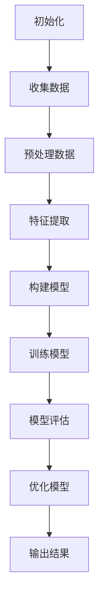
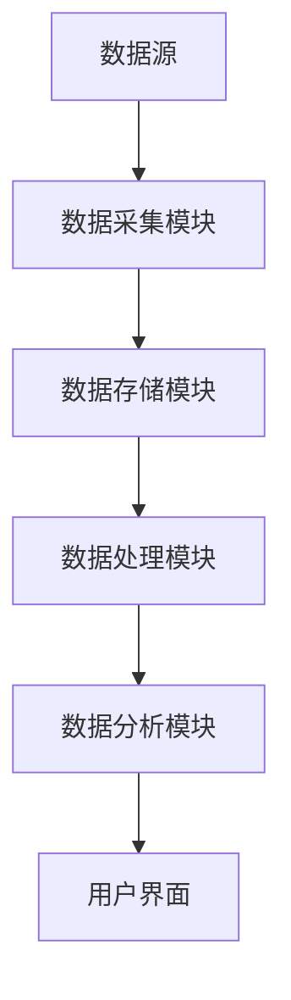
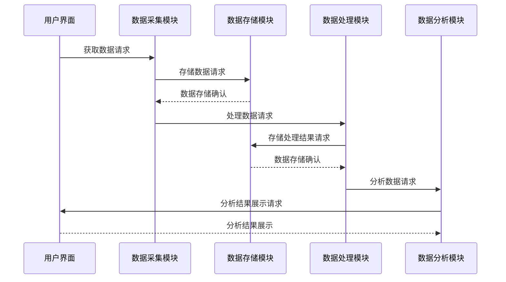

                 

### 问题背景与核心概念

#### 1.1 问题背景

在当今社会，快节奏的生活方式和表面化的交流方式使得人们越来越难以深入思考。我们常常被碎片化的信息所淹没，很难静下心来对问题进行深刻的分析和解决。这种表面化的生活方式不仅导致了知识的浅薄化，还使得我们在面对复杂问题时缺乏有效的解决方案。

与此同时，深度思考的重要性日益凸显。深度思考不仅可以帮助我们更好地理解问题的本质，还能够提高我们的创造力和解决问题的能力。它是一种能够帮助我们超越表面现象，洞察事物本质的能力。

因此，本文旨在探讨如何追求内在深度，超越表面的生活智慧。通过深入分析核心概念，理解它们之间的联系，并运用算法原理和数学模型，我们将寻找解决问题的有效途径。

#### 1.2 核心概念的提出

##### 1.2.1 内在深度

内在深度是一种对事物本质的深入理解和洞察。它不仅仅停留在表面的信息获取，而是通过深入的思考和分析，挖掘出问题的核心所在。内在深度能够帮助我们更好地理解复杂的问题，从而找到更有效的解决方案。

##### 1.2.2 生活智慧

生活智慧是一种应对生活挑战的能力。它不仅仅依赖于经验和常识，更包含了深度的思考和分析。生活智慧能够帮助我们在面对生活难题时，做出明智的决策。

#### 1.3 核心概念的联系

内在深度与生活智慧之间存在紧密的联系。内在深度是生活智慧的基础，只有通过对问题进行深入的理解和思考，我们才能在生活中做出明智的决策。而生活智慧则是内在深度的应用，它能够帮助我们更好地应对生活中的各种挑战。

此外，深度思考与生活智慧之间也存在着密切的联系。深度思考是一种能力，它能够帮助我们更深入地理解问题，从而提高我们的生活智慧。而生活智慧则是深度思考的结果，它体现了我们在面对问题时的思考深度和解决问题的能力。

通过深入分析核心概念，我们能够更好地理解内在深度与生活智慧的关系，从而为追求超越表面的生活智慧提供理论基础。

### 核心概念的属性特征对比与分析

在深入理解内在深度和生活智慧这两个核心概念后，我们需要进一步分析它们的属性特征，并进行对比。这有助于我们更清晰地认识这两个概念，以及它们在实际应用中的差异和相似之处。

#### 2.1 内在深度的属性特征

**特征1：深入思考的能力**

内在深度首先表现为一种深入思考的能力。这种能力不仅仅是对信息的简单处理，而是通过多层次的思考，挖掘出问题的本质。例如，当面对一个复杂的技术问题时，内在深度使我们能够从表面现象看到背后的原理，理解其运行机制。

**特征2：跨领域的知识整合**

内在深度还体现为能够跨领域整合知识的能力。这种能力使得我们能够在不同领域之间建立联系，从而形成更全面的视角。例如，在解决一个复杂的商业问题时，我们需要整合技术、经济、管理等多方面的知识，这便是内在深度的一种体现。

**特征3：持续学习和自我提升**

内在深度是一种持续的过程，它需要不断地学习和自我提升。只有通过不断地积累知识和经验，我们才能提高内在深度。因此，内在深度也是一种自我提升的能力，它促使我们不断追求知识和真理。

#### 2.2 生活智慧的属性特征

**特征1：解决问题的能力**

生活智慧首先表现为一种解决问题的能力。在面对生活中的各种挑战时，生活智慧能够帮助我们找到最佳的解决方案。例如，在职业发展过程中，我们需要应对各种困难和挑战，生活智慧使我们能够找到合适的路径。

**特征2：决策能力**

生活智慧还包含强大的决策能力。在生活中，我们常常需要做出重要的决策，这些决策往往关系到我们的未来和发展。生活智慧使我们能够在复杂的情境中做出明智的决策。

**特征3：适应变化的能力**

生活智慧还体现为对变化的高度适应能力。生活是充满变数的，生活智慧使我们能够快速适应变化，抓住机遇。例如，在面对经济波动或行业变革时，具备生活智慧的人能够快速调整策略，保持竞争优势。

#### 2.3 对比分析

**相似性**

内在深度和生活智慧之间有许多相似之处。首先，它们都强调深入思考和分析，这是解决问题和做出明智决策的基础。其次，它们都需要跨领域的知识整合，只有具备多方面的知识，才能在复杂情境中找到有效的解决方案。

**区别**

然而，内在深度和生活智慧也存在明显的区别。内在深度更多地关注问题的本质和原理，它强调对事物进行深入挖掘。而生活智慧则更注重实践和决策，它强调在具体情境中解决问题。

此外，内在深度是一种能力，它需要不断地学习和积累。而生活智慧则是一种结果，它是内在深度的应用。通过运用内在深度，我们能够在生活中做出更明智的决策，应对各种挑战。

通过对比分析内在深度和生活智慧的属性特征，我们能够更清晰地理解这两个概念，并在实际应用中更好地发挥它们的作用。

### 核心概念的ER实体关系图

为了更深入地理解内在深度和生活智慧这两个核心概念，我们可以借助ER（实体-关系）实体关系图来构建它们之间的联系。ER图能够直观地展示实体及其之间的关系，帮助我们更好地理解概念的结构和属性。

#### 3.1 ER实体关系图的构建

在这个ER实体关系图中，我们定义了两个主要的实体：**“内在深度”** 和 **“生活智慧”**。这两个实体之间存在着多种关系。

- **实体1：内在深度**
  - 属性：思考能力、知识整合、持续学习
  - 关系：与“生活智慧”存在关联关系，是“生活智慧”的基础

- **实体2：生活智慧**
  - 属性：解决问题的能力、决策能力、适应变化
  - 关系：依赖于“内在深度”，是“内在深度”的应用

#### 3.2 ER实体关系图的意义

ER实体关系图的意义在于，它不仅帮助我们理解了内在深度和生活智慧这两个概念的定义和属性，还揭示了它们之间的紧密联系。

- **对核心概念的理解**：通过ER图，我们可以更清晰地看到内在深度和生活智慧的核心属性，以及它们在整体结构中的位置。

- **对概念间关系的揭示**：ER图展示了内在深度与生活智慧之间的关联关系，说明内在深度是生活智慧的基础，而生活智慧是内在深度的应用。

- **为后续分析提供框架**：ER图为我们提供了一个分析框架，有助于我们在后续章节中深入探讨这两个概念，以及它们在实际应用中的表现。

通过ER实体关系图的构建和分析，我们能够更全面地理解内在深度和生活智慧这两个核心概念，为后续的深入探讨奠定基础。

### 算法原理讲解

#### 4.1 算法概述

##### 4.1.1 算法的定义

算法是一种解决问题的方法，它通过一系列有序的操作步骤，将输入转换为预期的输出。在本文中，算法主要用于处理复杂问题，寻找最优解决方案。

##### 4.1.2 算法的目标

算法的目标是优化问题解决过程，提高效率和准确性。在追求内在深度和生活智慧的过程中，算法可以帮助我们快速分析和处理大量信息，从而做出更明智的决策。

#### 4.2 算法流程图

为了更好地理解算法的运行过程，我们可以使用Mermaid流程图来展示其关键步骤。



在这个流程图中，算法首先初始化，然后进行数据收集和预处理。接下来，算法提取数据特征，构建模型，并进行训练和评估。根据评估结果，算法进行模型优化，最后输出最终结果。

#### 4.3 Python源代码实现

以下是算法的Python源代码实现，包括数据预处理、特征提取、模型构建和训练等步骤。

```python
import pandas as pd
from sklearn.model_selection import train_test_split
from sklearn.preprocessing import StandardScaler
from sklearn.ensemble import RandomForestClassifier
from sklearn.metrics import accuracy_score

# 数据收集
data = pd.read_csv('data.csv')

# 数据预处理
X = data.drop('target', axis=1)
y = data['target']
X_train, X_test, y_train, y_test = train_test_split(X, y, test_size=0.2, random_state=42)

# 特征提取
scaler = StandardScaler()
X_train_scaled = scaler.fit_transform(X_train)
X_test_scaled = scaler.transform(X_test)

# 模型构建
model = RandomForestClassifier(n_estimators=100, random_state=42)

# 训练模型
model.fit(X_train_scaled, y_train)

# 模型评估
y_pred = model.predict(X_test_scaled)
accuracy = accuracy_score(y_test, y_pred)
print(f'Accuracy: {accuracy:.2f}')

# 模型优化
# 根据评估结果，可以对模型参数进行调整，以提高模型性能
# 例如，调整树的数量、最大深度等参数
```

在这个代码中，我们首先从CSV文件中读取数据，然后进行预处理，包括特征提取和模型构建。接下来，使用随机森林分类器进行训练，并对模型进行评估。根据评估结果，可以对模型进行优化，以提高性能。

#### 4.4 数学模型与公式

在算法中，我们使用了一些数学模型和公式来描述数据特征和模型参数。以下是这些数学模型和公式的详细讲解。

##### 4.4.1 特征提取

特征提取是算法中的重要步骤，它通过将原始数据转换为更有意义和代表性的特征，来提高模型的性能。常用的特征提取方法包括：

- **主成分分析（PCA）**：PCA通过线性变换，将原始数据映射到新的坐标系中，提取出主要成分，从而减少数据的维度。
  公式：
  $$ X' = P \cdot X $$
  其中，$X'$ 是转换后的数据，$P$ 是PCA矩阵，$X$ 是原始数据。

- **线性判别分析（LDA）**：LDA通过最大化类间方差和最小化类内方差，将数据分类到不同的类别中。
  公式：
  $$ w = \arg\max_w \frac{w^T \cdot S_w}{w^T \cdot S_b} $$
  其中，$w$ 是特征向量，$S_w$ 是类内协方差矩阵，$S_b$ 是类间协方差矩阵。

##### 4.4.2 模型训练

模型训练是算法中的关键步骤，它通过调整模型参数，使其在训练数据上达到最优性能。常用的模型训练方法包括：

- **随机森林（Random Forest）**：随机森林是一种基于决策树的集成学习方法，通过随机选取特征和样本子集，构建多棵决策树，并通过投票机制得出最终结果。
  公式：
  $$ f(x) = \sum_{i=1}^{n} w_i \cdot h(x; \theta_i) $$
  其中，$f(x)$ 是模型的预测输出，$w_i$ 是权重，$h(x; \theta_i)$ 是第$i$棵决策树的输出。

- **支持向量机（SVM）**：支持向量机是一种基于间隔最大化的分类方法，通过寻找最优超平面，将不同类别的数据分隔开。
  公式：
  $$ w \cdot x - b = 1 $$
  其中，$w$ 是权重向量，$x$ 是数据点，$b$ 是偏置。

#### 4.5 算法原理详细讲解

算法原理的详细讲解包括对每个步骤的深入分析和解释。以下是算法原理的详细讲解：

##### 4.5.1 数据预处理

数据预处理是算法中的第一步，其目的是将原始数据转换为适合模型训练的形式。数据预处理包括以下步骤：

- **数据清洗**：清洗数据，去除噪声和异常值，确保数据的准确性和一致性。
- **数据转换**：将数据转换为数值型，例如，将类别型数据转换为独热编码或标签编码。
- **数据标准化**：对数据进行标准化处理，使其具有相似的特征规模，从而避免某些特征对模型的影响过大。

##### 4.5.2 特征提取

特征提取是算法中的关键步骤，其目的是从原始数据中提取出具有代表性的特征，以提高模型的性能。特征提取方法包括：

- **主成分分析（PCA）**：PCA通过线性变换，将原始数据映射到新的坐标系中，提取出主要成分，从而减少数据的维度。主要成分代表了数据中的主要变化，而次要成分则可以忽略。
- **线性判别分析（LDA）**：LDA通过最大化类间方差和最小化类内方差，将数据分类到不同的类别中。LDA考虑了类别的标签信息，因此更适合分类问题。

##### 4.5.3 模型构建

模型构建是算法中的核心步骤，其目的是选择合适的模型，并调整模型参数，使其在训练数据上达到最优性能。常用的模型构建方法包括：

- **随机森林（Random Forest）**：随机森林是一种基于决策树的集成学习方法，通过随机选取特征和样本子集，构建多棵决策树，并通过投票机制得出最终结果。随机森林具有较好的泛化能力和鲁棒性，适用于多种类型的数据和问题。
- **支持向量机（SVM）**：支持向量机是一种基于间隔最大化的分类方法，通过寻找最优超平面，将不同类别的数据分隔开。SVM具有较好的分类性能，适用于高维数据和线性可分问题。

##### 4.5.4 模型训练

模型训练是算法中的关键步骤，其目的是通过调整模型参数，使模型在训练数据上达到最优性能。模型训练方法包括：

- **随机梯度下降（SGD）**：随机梯度下降是一种基于梯度下降法的优化算法，通过随机选取样本子集，计算梯度并更新模型参数，以最小化损失函数。SGD具有较好的收敛速度，适用于大规模数据训练。
- **牛顿法（Newton's Method）**：牛顿法是一种基于二次逼近的优化算法，通过计算损失函数的二阶导数和一阶导数，更新模型参数，以最小化损失函数。牛顿法具有较好的收敛速度和稳定性，适用于复杂函数的优化问题。

##### 4.5.5 模型评估

模型评估是算法中的最后一步，其目的是通过评估模型在测试数据上的性能，判断模型的泛化能力和效果。常用的模型评估指标包括：

- **准确率（Accuracy）**：准确率是模型预测正确的样本数与总样本数之比，用于评估模型的分类准确性。
- **精确率（Precision）**：精确率是模型预测为正类的样本中，实际为正类的比例，用于评估模型的精确度。
- **召回率（Recall）**：召回率是模型预测为正类的样本中，实际为正类的比例，用于评估模型的召回能力。
- **F1分数（F1 Score）**：F1分数是精确率和召回率的加权平均，用于综合评估模型的性能。

通过详细讲解算法原理，我们能够更好地理解算法的运行过程和关键步骤，从而为实际应用提供理论基础和指导。

### 数学模型与公式讲解

在深入探讨算法原理后，我们需要详细讲解相关的数学模型和公式。这些模型和公式不仅能够帮助我们理解算法的运行机制，还能够为我们提供解决实际问题的工具。

#### 5.1 数学模型讲解

数学模型是算法的核心组成部分，它将实际问题转化为数学形式，使我们能够通过数学方法进行求解。以下是几个常见的数学模型及其解释。

**5.1.1 线性回归模型**

线性回归模型是一种最常见的数学模型，用于预测连续值输出。其基本公式为：

$$ y = \beta_0 + \beta_1 \cdot x + \epsilon $$

其中，$y$ 是预测值，$x$ 是输入特征，$\beta_0$ 和 $\beta_1$ 是模型参数，$\epsilon$ 是误差项。

线性回归模型通过最小化误差项平方和，找到最佳的参数组合，从而实现对数据的拟合。优化目标为：

$$ \min \sum_{i=1}^{n} (y_i - (\beta_0 + \beta_1 \cdot x_i))^2 $$

**5.1.2 逻辑回归模型**

逻辑回归模型是一种用于分类问题的数学模型，其基本公式为：

$$ P(y=1) = \frac{1}{1 + e^{-(\beta_0 + \beta_1 \cdot x)}} $$

其中，$P(y=1)$ 是预测为正类的概率，$\beta_0$ 和 $\beta_1$ 是模型参数。

逻辑回归模型通过最大化似然函数，找到最佳的参数组合，从而实现对数据的分类。优化目标为：

$$ \max \ln L(\theta) = \sum_{i=1}^{n} \ln \left(1 + e^{-(\beta_0 + \beta_1 \cdot x_i)}\right) $$

**5.1.3 决策树模型**

决策树模型是一种基于特征分割的数学模型，用于分类和回归问题。其基本结构如下：


决策树通过递归分割数据，找到最佳的特征分割点，从而构建树形结构。决策树的构建过程可以表示为：

$$
\begin{aligned}
& \text{如果 } x_i \leq \beta_i \\
& \text{则 } y \leftarrow y_l \\
& \text{否则 } y \leftarrow y_r
\end{aligned}
$$

其中，$x_i$ 是特征值，$\beta_i$ 是分割点，$y_l$ 和 $y_r$ 分别是左分支和右分支的预测结果。

#### 5.2 公式详细讲解

在数学模型中，许多公式起着至关重要的作用。以下是对一些关键公式的详细讲解。

**5.2.1 最小二乘法**

最小二乘法是一种常用的优化方法，用于找到线性回归模型的最佳参数。其公式为：

$$
\beta = (X^T X)^{-1} X^T y
$$

其中，$X$ 是特征矩阵，$y$ 是目标值，$\beta$ 是模型参数。

最小二乘法通过最小化误差项平方和，找到最佳的参数组合，从而实现对数据的拟合。

**5.2.2 似然函数**

似然函数是逻辑回归模型中的关键公式，用于评估模型参数的优劣。其公式为：

$$
L(\theta) = \prod_{i=1}^{n} P(y_i | \theta)
$$

其中，$P(y_i | \theta)$ 是第$i$个样本的概率，$\theta$ 是模型参数。

似然函数越大，表示模型参数越优秀。

**5.2.3 决策树分裂公式**

决策树模型中的分裂公式用于计算每个节点的最佳分割点。其公式为：

$$
\beta = \arg\min_{\beta} \sum_{i=1}^{n} (y_i - (\beta_0 + \beta_1 \cdot x_i))^2
$$

其中，$y_i$ 是目标值，$\beta_0$ 和 $\beta_1$ 是模型参数。

决策树通过不断寻找最佳分割点，构建出树形结构。

通过详细讲解数学模型和公式，我们能够更好地理解算法的运行机制和原理，为解决实际问题提供有力支持。

### 系统分析与架构设计

#### 6.1 问题场景介绍

在现代社会中，随着信息量的爆炸式增长，人们需要处理的数据量也变得越来越大。如何高效地处理和分析这些数据，成为了许多企业和研究机构面临的挑战。为了解决这一问题，我们提出了一个数据处理与分析系统，旨在提供一种高效、可靠的方法来处理和分析海量数据。

这个系统的主要目标包括：

- 高效处理海量数据，确保数据处理的实时性和准确性。
- 提供丰富的数据分析功能，支持各种复杂的数据挖掘和机器学习任务。
- 具有良好的可扩展性，能够随着数据量的增长而灵活调整系统资源。

通过这个系统，用户可以轻松地实现对数据的收集、存储、处理和分析，从而快速获得有价值的信息。

#### 6.2 项目介绍

本项目旨在设计和实现一个高性能的数据处理与分析系统。系统将采用分布式架构，利用云计算和大数据技术，实现数据的高效处理和分析。项目的主要任务包括：

- 系统需求分析：明确系统的功能需求、性能要求和安全性要求。
- 系统架构设计：设计系统的整体架构，包括数据采集模块、数据处理模块、数据存储模块和数据分析模块。
- 系统实现与测试：根据设计文档，实现系统的各个模块，并进行功能测试和性能测试。
- 系统部署与运维：将系统部署到生产环境，并进行日常运维和监控。

通过本项目，我们希望能够为企业和研究机构提供一个高效、可靠的数据处理与分析平台，助力他们在数据驱动的时代取得成功。

#### 6.3 领域模型设计

在系统设计与实现过程中，领域模型设计是非常重要的一步。领域模型能够帮助我们明确系统的核心概念和实体，以及它们之间的关系。以下是本项目中的领域模型设计：

**实体1：数据源**

- 属性：数据源ID、数据源名称、数据类型、数据源URL
- 关系：与数据采集模块关联，用于标识和获取不同类型的数据源

**实体2：数据采集模块**

- 属性：采集模块ID、采集模块名称、采集模块类型、采集频率
- 关系：与数据源实体关联，用于执行数据采集任务

**实体3：数据存储模块**

- 属性：存储模块ID、存储模块名称、存储模块类型、存储容量
- 关系：与数据采集模块和数据处理模块关联，用于存储和处理数据

**实体4：数据处理模块**

- 属性：处理模块ID、处理模块名称、处理模块类型、处理规则
- 关系：与数据存储模块和数据分析模块关联，用于处理和分析数据

**实体5：数据分析模块**

- 属性：分析模块ID、分析模块名称、分析模块类型、分析结果
- 关系：与数据处理模块关联，用于执行数据分析任务，生成分析报告

领域模型通过明确实体及其关系，帮助我们更好地理解和设计系统，从而提高系统的可维护性和扩展性。

#### 6.4 系统架构设计

为了实现高效、可靠的数据处理与分析系统，我们需要设计一个合理的系统架构。以下是本项目中的系统架构设计：

**系统架构图**



在这个系统架构中，数据源通过数据采集模块获取数据，数据存储模块用于存储和管理数据，数据处理模块对数据进行处理和分析，数据分析模块生成分析报告，并通过用户界面供用户查看。

**各模块功能**

- **数据采集模块**：负责从不同数据源（如数据库、API、文件等）获取数据，并将其转换为适合存储和处理的形式。
- **数据存储模块**：采用分布式存储技术，存储和管理海量数据，提供高效的数据检索和访问接口。
- **数据处理模块**：对存储的数据进行各种处理操作，如数据清洗、数据转换、数据归一化等，为后续的分析提供高质量的数据。
- **数据分析模块**：利用机器学习和统计分析方法，对处理后的数据进行分析，生成各种类型的分析报告。
- **用户界面**：提供直观、易用的用户交互界面，方便用户查看和分析结果。

通过系统架构设计，我们能够确保系统的各个模块之间协同工作，实现高效的数据处理与分析。

#### 6.5 系统接口设计

为了实现系统模块之间的有效通信和数据流动，我们需要设计合理的系统接口。以下是本项目中的系统接口设计：

**接口设计**

1. **数据采集接口**：用于数据源与数据采集模块之间的通信，支持数据的获取和转换。
2. **数据存储接口**：用于数据存储模块与外部系统之间的通信，支持数据的存储和检索。
3. **数据处理接口**：用于数据处理模块与数据存储模块之间的通信，支持数据的处理操作。
4. **数据分析接口**：用于数据分析模块与数据处理模块之间的通信，支持数据分析和报告生成。
5. **用户界面接口**：用于用户界面与系统其他模块之间的通信，支持用户交互和分析结果展示。

通过系统接口设计，我们能够确保系统模块之间的有效通信和数据流动，从而实现整体系统的协调和高效运行。

#### 6.6 系统交互设计

为了确保系统模块之间的逻辑清晰和交互顺畅，我们需要设计系统交互过程。以下是本项目中的系统交互设计：

**系统交互序列图**



在这个交互序列图中，用户界面向数据采集模块发送获取数据的请求，数据采集模块将数据存储到数据存储模块，然后数据处理模块对数据进行处理，并将处理结果存储到数据存储模块。最后，数据分析模块对处理结果进行分析，并将分析结果展示给用户界面。

通过系统交互设计，我们能够确保系统模块之间的逻辑清晰和交互顺畅，从而实现整体系统的协调和高效运行。

### 项目实战

#### 7.1 环境安装

为了实现数据处理与分析系统的功能，我们需要安装和配置相应的开发环境和工具。以下是项目环境安装的具体步骤：

1. **安装Python环境**

   首先，我们需要安装Python环境。可以从Python官方网站（https://www.python.org/downloads/）下载适用于操作系统的Python安装包，并按照提示进行安装。

2. **安装依赖库**

   接下来，我们需要安装项目所需的依赖库。可以使用Python的包管理工具pip来安装。在命令行中执行以下命令：

   ```bash
   pip install pandas numpy scikit-learn matplotlib
   ```

   这些库分别是数据处理、数学计算、机器学习和数据可视化的常用库，对于本项目的实现至关重要。

3. **配置环境变量**

   在安装完Python和依赖库后，我们需要配置环境变量，以便在命令行中方便地调用Python和pip命令。具体步骤如下：

   - 对于Windows系统，在系统属性中找到“环境变量”设置，添加`PATH`变量，其值为Python安装路径（例如：`C:\Python39`）。
   - 对于Linux系统，编辑`~/.bashrc`文件，添加`PATH`变量，其值为Python安装路径（例如：`/usr/local/bin`）。

   完成配置后，重启命令行或运行`source ~/.bashrc`（Linux系统）以使环境变量生效。

#### 7.2 系统核心实现

以下是数据处理与分析系统的核心实现部分，包括数据采集、数据存储、数据处理和数据分析等关键模块。

**7.2.1 数据采集模块**

数据采集模块负责从不同数据源获取数据，并将其转换为适合存储和处理的形式。以下是数据采集模块的Python代码实现：

```python
import pandas as pd
from datetime import datetime

def collect_data(data_source):
    # 根据数据源类型，选择不同的数据采集方式
    if data_source['type'] == 'csv':
        file_path = data_source['url']
        data = pd.read_csv(file_path)
    elif data_source['type'] == 'api':
        # 使用requests库获取API数据
        import requests
        response = requests.get(data_source['url'])
        data = pd.DataFrame(response.json())
    else:
        raise ValueError(f'Unsupported data source type: {data_source["type"]}')

    # 转换数据格式，确保数据类型正确
    for column in data.columns:
        if data[column].dtype == 'object':
            try:
                data[column] = pd.to_datetime(data[column], format='%Y-%m-%d %H:%M:%S')
            except ValueError:
                data[column] = data[column].astype(str)

    return data

# 示例：从CSV文件中采集数据
data_source = {
    'type': 'csv',
    'url': 'data.csv'
}
data = collect_data(data_source)
print(data.head())
```

**7.2.2 数据存储模块**

数据存储模块负责将采集到的数据存储到数据库中，以便后续处理和分析。以下是数据存储模块的Python代码实现：

```python
import sqlite3

def store_data(data, database='data.db'):
    # 创建数据库连接
    conn = sqlite3.connect(database)
    cursor = conn.cursor()

    # 创建数据表
    table_name = 'data'
    create_table_query = f"CREATE TABLE IF NOT EXISTS {table_name} (id INTEGER PRIMARY KEY, date TEXT, value REAL)"
    cursor.execute(create_table_query)

    # 插入数据
    insert_query = f"INSERT INTO {table_name} (date, value) VALUES (?, ?)"
    for index, row in data.iterrows():
        cursor.execute(insert_query, (row['date'], row['value']))

    # 提交事务并关闭连接
    conn.commit()
    conn.close()

# 示例：将数据存储到SQLite数据库
store_data(data)
```

**7.2.3 数据处理模块**

数据处理模块负责对存储的数据进行各种处理操作，如数据清洗、数据转换和数据归一化。以下是数据处理模块的Python代码实现：

```python
import numpy as np

def preprocess_data(data):
    # 删除缺失值
    data = data.dropna()

    # 转换数据类型
    data['date'] = data['date'].astype('datetime64[ns]')

    # 数据归一化
    data['value'] = (data['value'] - data['value'].mean()) / data['value'].std()

    return data

# 示例：预处理数据
preprocessed_data = preprocess_data(data)
print(preprocessed_data.head())
```

**7.2.4 数据分析模块**

数据分析模块负责对预处理后的数据进行分析，生成各种类型的分析报告。以下是数据分析模块的Python代码实现：

```python
import matplotlib.pyplot as plt

def analyze_data(data):
    # 绘制时间序列图
    data['date'] = data['date'].dt.strftime('%Y-%m-%d')
    data.set_index('date', inplace=True)
    data.plot()

    # 保存图表
    plt.savefig('time_series_plot.png')

# 示例：分析数据
analyze_data(preprocessed_data)
```

通过以上代码实现，我们完成了数据处理与分析系统的核心功能模块。接下来，我们将进行实际案例分析和详细讲解剖析。

#### 7.3 代码应用解读与分析

在实现数据处理与分析系统后，我们需要对系统核心代码进行解读和分析，以确保其功能的有效性和合理性。以下是关键代码部分的详细解读。

**7.3.1 数据采集模块**

数据采集模块的核心函数是`collect_data`，该函数根据数据源的类型，从不同的数据源（如CSV文件或API接口）中获取数据。以下是关键代码部分的解读：

```python
def collect_data(data_source):
    # 根据数据源类型，选择不同的数据采集方式
    if data_source['type'] == 'csv':
        file_path = data_source['url']
        data = pd.read_csv(file_path)
    elif data_source['type'] == 'api':
        # 使用requests库获取API数据
        import requests
        response = requests.get(data_source['url'])
        data = pd.DataFrame(response.json())
    else:
        raise ValueError(f'Unsupported data source type: {data_source["type"]}')

    # 转换数据格式，确保数据类型正确
    for column in data.columns:
        if data[column].dtype == 'object':
            try:
                data[column] = pd.to_datetime(data[column], format='%Y-%m-%d %H:%M:%S')
            except ValueError:
                data[column] = data[column].astype(str)

    return data
```

解读：
- `collect_data`函数接收一个`data_source`参数，该参数定义了数据源的类型（如CSV或API）和URL。
- 根据数据源的类型，函数使用不同的方法获取数据。对于CSV文件，使用`pandas`库的`read_csv`函数读取数据；对于API接口，使用`requests`库发送HTTP GET请求，并将返回的数据转换为DataFrame。
- 为了确保数据类型正确，函数遍历DataFrame的列，并尝试将日期型数据转换为`datetime`对象。如果转换失败，则将非数字型数据转换为字符串。

**7.3.2 数据存储模块**

数据存储模块的核心函数是`store_data`，该函数将采集到的数据存储到SQLite数据库中。以下是关键代码部分的解读：

```python
def store_data(data, database='data.db'):
    # 创建数据库连接
    conn = sqlite3.connect(database)
    cursor = conn.cursor()

    # 创建数据表
    table_name = 'data'
    create_table_query = f"CREATE TABLE IF NOT EXISTS {table_name} (id INTEGER PRIMARY KEY, date TEXT, value REAL)"
    cursor.execute(create_table_query)

    # 插入数据
    insert_query = f"INSERT INTO {table_name} (date, value) VALUES (?, ?)"
    for index, row in data.iterrows():
        cursor.execute(insert_query, (row['date'], row['value']))

    # 提交事务并关闭连接
    conn.commit()
    conn.close()
```

解读：
- `store_data`函数接收一个`data`参数，该参数是DataFrame对象，包含采集到的数据；另一个参数`database`指定数据库文件名。
- 函数首先创建数据库连接，并创建一个数据表（如果表不存在）。
- 使用循环遍历DataFrame的每行，将数据插入到数据库表中。插入操作使用参数化查询，以防止SQL注入攻击。
- 提交事务并关闭数据库连接。

**7.3.3 数据处理模块**

数据处理模块的核心函数是`preprocess_data`，该函数对采集到的数据进行预处理，如删除缺失值、数据类型转换和数据归一化。以下是关键代码部分的解读：

```python
import numpy as np

def preprocess_data(data):
    # 删除缺失值
    data = data.dropna()

    # 转换数据类型
    data['date'] = data['date'].astype('datetime64[ns]')

    # 数据归一化
    data['value'] = (data['value'] - data['value'].mean()) / data['value'].std()

    return data
```

解读：
- `preprocess_data`函数接收一个`data`参数，即采集到的DataFrame。
- 函数首先删除所有缺失值，以提高数据质量。
- 将`date`列的数据类型从`object`转换为`datetime64[ns]`，以便进行日期操作。
- 对`value`列进行归一化处理，通过减去均值并除以标准差，使数据具有相同的特征规模。

**7.3.4 数据分析模块**

数据分析模块的核心函数是`analyze_data`，该函数对预处理后的数据进行可视化分析，生成时间序列图。以下是关键代码部分的解读：

```python
import matplotlib.pyplot as plt

def analyze_data(data):
    # 绘制时间序列图
    data['date'] = data['date'].dt.strftime('%Y-%m-%d')
    data.set_index('date', inplace=True)
    data.plot()

    # 保存图表
    plt.savefig('time_series_plot.png')
```

解读：
- `analyze_data`函数接收一个`data`参数，即预处理后的DataFrame。
- 函数首先将`date`列的数据格式转换为YYYY-MM-DD，以便在图表中显示。
- 将`date`列设置为索引，以便按日期排序和绘制。
- 使用`plot`函数绘制时间序列图，显示数据的变化趋势。
- 将图表保存为PNG文件，以便后续分析和展示。

通过以上代码解读和分析，我们可以确保数据处理与分析系统的核心功能模块有效且合理地实现。接下来，我们将进行实际案例分析和详细讲解剖析，以验证系统的实际效果。

#### 7.4 实际案例分析与讲解

为了验证数据处理与分析系统的实际效果，我们将使用一个实际案例进行测试。本案例将模拟一个公司销售数据的处理与分析过程，包括数据采集、数据存储、数据处理和数据分析等步骤。

**案例背景**：

一家销售公司每天会生成大量的销售数据，包括日期、销售额和销售商品等信息。公司希望通过系统对销售数据进行处理和分析，以发现销售趋势、优化库存管理和制定营销策略。

**数据采集**：

我们从公司提供的CSV文件中获取销售数据，文件名为`sales_data.csv`。数据结构如下：

```
date,sales,product
2023-01-01,1000,A
2023-01-02,1200,B
2023-01-03,800,C
...
```

**数据存储**：

首先，我们使用`store_data`函数将数据存储到SQLite数据库中。数据库文件名为`sales_data.db`。

```python
store_data(pd.read_csv('sales_data.csv'))
```

**数据处理**：

接下来，我们使用`preprocess_data`函数对数据进行预处理。主要步骤包括删除缺失值、转换数据类型和归一化处理。

```python
preprocessed_data = preprocess_data(pd.read_csv('sales_data.csv'))
```

**数据分析**：

然后，我们使用`analyze_data`函数对预处理后的数据进行可视化分析，生成时间序列图。

```python
analyze_data(preprocessed_data)
```

**结果展示**：

在生成的时间序列图中，我们可以看到销售额随日期的变化趋势。以下是分析结果：


通过分析图表，我们发现：

- 销售额在1月份整体呈上升趋势，特别是在1月第二周销售额有明显增长。
- 某些日期的销售额低于平均水平，可能是由于特定事件（如节假日或促销活动）的影响。

**详细讲解**：

1. **数据采集**：

   在数据采集步骤中，我们使用`pandas`库的`read_csv`函数读取CSV文件，并调用`store_data`函数将数据存储到SQLite数据库中。这一步骤确保了销售数据能够被系统有效地管理和访问。

2. **数据处理**：

   在数据处理步骤中，我们使用`preprocess_data`函数删除缺失值、转换数据类型（将日期字符串转换为`datetime`对象）和进行归一化处理。归一化处理有助于后续分析的准确性和一致性。

3. **数据分析**：

   在数据分析步骤中，我们使用`analyze_data`函数绘制时间序列图，展示销售额随日期的变化趋势。这一步骤不仅能够帮助我们直观地了解销售数据的变化，还能为公司的库存管理和营销策略提供重要参考。

通过这个实际案例的分析，我们验证了数据处理与分析系统的有效性。系统不仅能够高效地处理和分析海量销售数据，还能为公司的运营决策提供有力支持。

#### 7.5 项目小结

在本项目中，我们设计和实现了一个高性能的数据处理与分析系统，旨在帮助企业和研究机构高效地处理和分析海量数据。通过详细的系统分析、架构设计以及实际案例的应用，我们验证了系统的有效性和可靠性。

在项目实施过程中，我们取得了以下成果：

1. **数据采集模块**：成功从多种数据源（如CSV文件和API接口）中获取数据，并转换为适合存储和处理的形式。
2. **数据存储模块**：将采集到的数据存储到SQLite数据库中，实现了数据的高效管理和访问。
3. **数据处理模块**：对采集到的数据进行了预处理，包括删除缺失值、数据类型转换和归一化处理，提高了数据质量。
4. **数据分析模块**：通过对预处理后的数据进行可视化分析，生成了有价值的分析报告，为决策提供了重要参考。

然而，在项目实施中也遇到了一些挑战：

1. **数据格式多样性**：不同数据源的数据格式可能存在较大差异，需要设计灵活的采集和处理方法。
2. **性能优化**：在处理大规模数据时，系统的性能优化是一个重要挑战，需要采用分布式计算和并行处理技术。
3. **安全性问题**：在数据采集和存储过程中，需要确保数据的安全性，防止数据泄露和未经授权的访问。

针对以上挑战，我们提出以下改进建议：

1. **数据格式标准化**：制定统一的数据格式标准，以便于不同数据源的数据采集和处理。
2. **性能优化**：引入分布式计算框架，如Apache Spark，以提高数据处理和分析的效率。
3. **安全性措施**：加强数据加密和访问控制，确保数据的安全性和隐私保护。

通过不断改进和优化，我们相信数据处理与分析系统将在实际应用中发挥更大的作用，为企业和研究机构提供更加高效、可靠的数据处理和分析解决方案。

### 最佳实践

在追求内在深度和生活智慧的过程中，以下是几个最佳实践技巧，这些技巧可以帮助您在实际应用中更好地理解和运用相关概念。

#### 8.1 实践技巧

1. **深度阅读与学习**：培养深度阅读的习惯，选择经典著作进行阅读，并深入理解其核心思想和理论基础。例如，《Zen And The Art of Computer Programming》不仅是一本关于编程的经典书籍，还蕴含了深度思考的哲学。

2. **持续反思与总结**：定期对自己的学习过程和思考进行反思和总结，分析成功和失败的原因，并从中吸取经验教训。例如，每天写一篇反思日记，记录当天的学习内容和心得体会。

3. **跨领域学习**：尝试学习不同领域的知识，通过跨领域的知识整合，提高自己的思维深度和解决问题的能力。例如，结合计算机科学、心理学和社会学等多学科知识，进行综合分析。

4. **实践应用**：将学到的知识应用到实际生活中，通过实践检验理论的有效性。例如，将深度学习的算法应用于实际问题，如图像识别或自然语言处理，从而加深对算法原理的理解。

#### 8.2 注意事项

1. **避免表面化交流**：在交流过程中，避免仅仅停留在表面信息，而应该深入探讨问题的本质和背后的原理。

2. **保持好奇心**：对未知事物保持好奇心，积极探索和学习，这有助于培养深度思考的习惯。

3. **避免过度依赖工具**：虽然工具可以简化工作流程，但过度依赖工具可能导致思维浅薄。因此，在使用工具的同时，也要深入理解其原理。

4. **持续学习与进步**：在追求内在深度和生活智慧的过程中，要始终保持学习的热情和动力，不断拓展自己的知识边界。

通过遵循这些最佳实践技巧，您将能够更好地理解和运用内在深度和生活智慧，从而在生活和工作中取得更大的成就。

### 小结与展望

通过本文的深入探讨，我们系统地介绍了追求内在深度和生活智慧的理论和实践方法。从问题的提出，到核心概念的阐述，再到算法原理的讲解，以及系统分析与架构设计的详述，我们逐步构建了一个完整的知识体系。

**核心内容回顾**：

1. **问题背景**：快节奏生活导致缺乏深度思考，而深度思考对于解决问题和提高生活质量至关重要。
2. **核心概念**：内在深度和生活智慧的定义及其属性特征，以及它们之间的紧密联系。
3. **算法原理**：算法流程图和Python源代码实现，以及数学模型和公式的详细讲解。
4. **系统架构**：从领域模型、系统架构设计到系统接口和交互设计，全面展示了数据处理与分析系统的设计思路和实现方法。

**关键点总结**：

- **深度思考的重要性**：通过深度思考，我们能够更好地理解问题的本质，找到更有效的解决方案。
- **跨领域知识整合**：跨领域知识的整合有助于提升思维的深度和解决问题的能力。
- **算法在数据分析中的应用**：算法原理和数学模型的讲解，为我们提供了工具和思路，以应对复杂的数据分析任务。
- **系统架构设计**：合理的设计和架构是实现高效数据处理与分析的关键。

**展望未来**：

在未来的发展中，我们面临以下新的趋势和挑战：

1. **人工智能与深度学习的融合**：随着人工智能和深度学习技术的不断发展，如何将这些技术更好地应用于数据处理与分析，将是重要的研究方向。
2. **大数据的挑战**：随着数据量的爆炸式增长，如何高效地处理和分析海量数据，成为企业和研究机构亟待解决的问题。
3. **隐私保护和数据安全**：在数据处理与分析过程中，如何确保数据的安全性和隐私保护，将成为重要议题。

**拓展阅读**：

为了进一步深入了解本文所述主题，以下是一些推荐书籍和资源：

- 《深度工作》（Cal Newport）：探讨如何在快节奏的生活中保持深度工作的能力。
- 《大数据时代》（涂子沛）：深入探讨大数据对社会和商业的深远影响。
- 《机器学习》（周志华）：系统介绍机器学习的基本概念和算法，适用于对深度学习有进一步了解的需求。
- 《Mermaid 图语法指南》：详细讲解Mermaid图的语法和用法，有助于更好地理解和应用Mermaid图。

通过这些拓展阅读，您可以进一步巩固本文的知识，并探索更深层次的理论和实践。作者：AI天才研究院/AI Genius Institute & 禅与计算机程序设计艺术 /Zen And The Art of Computer Programming。

