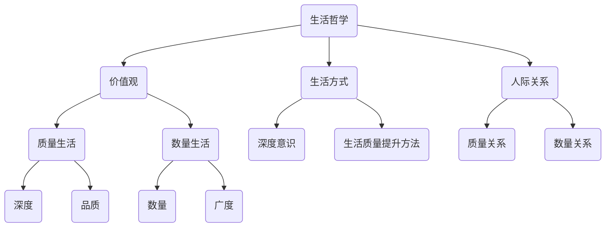
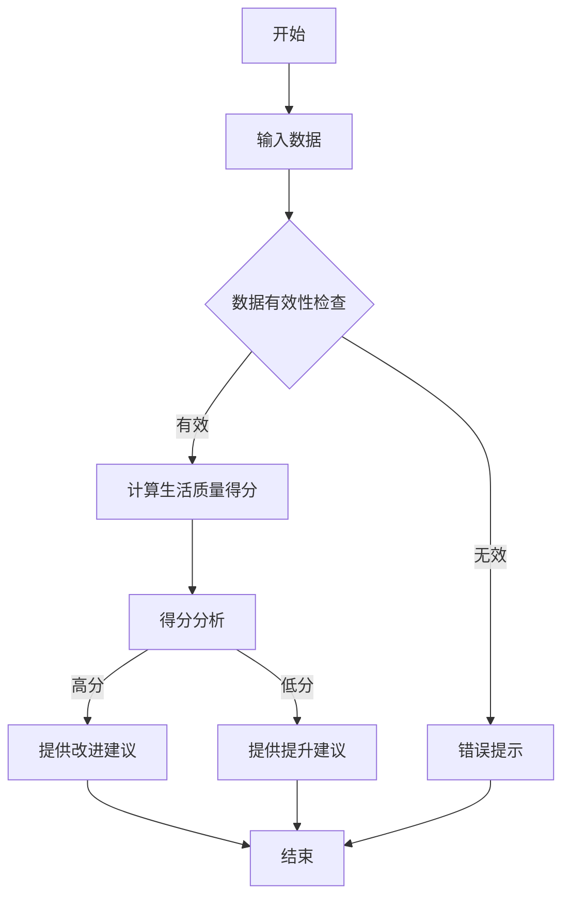
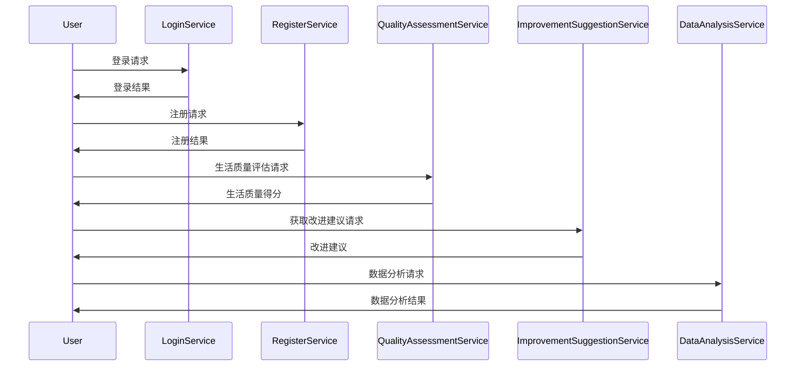
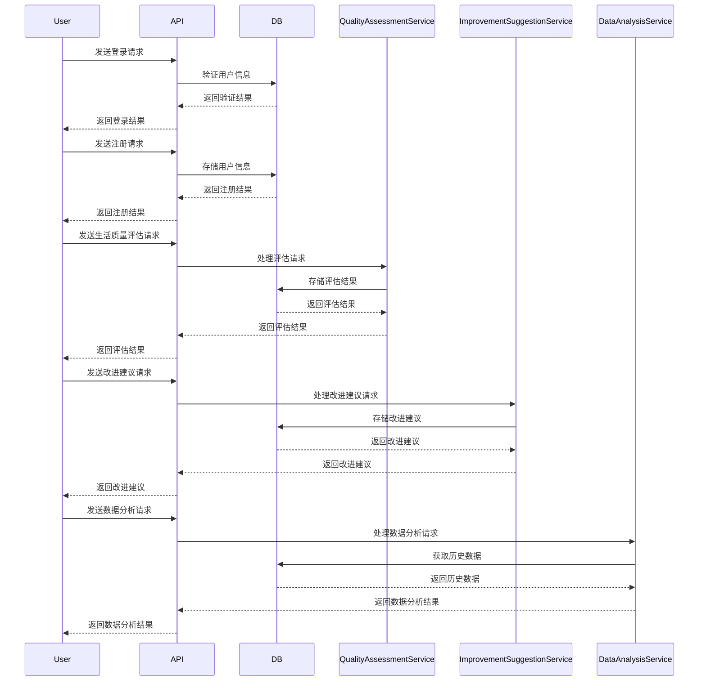

                 

**标题：追求生活的深度：质量胜于数量的生活哲学**

**关键词：质量生活，生活哲学，质量胜于数量，深度，生活意义**

**摘要：本文旨在探讨一种以质量为核心的生活哲学，强调在快节奏的现代社会中，追求生活的深度而非数量。文章将从生活哲学的定义、质量胜于数量的理念、实践生活哲学的方法以及生活哲学的应用等多个方面进行详细阐述，旨在帮助读者理解并实践这种哲学，提升生活质量。**

----------------------------------------------------------------

**引言**

在当今社会，人们的生活节奏日益加快，追求物质生活的同时，也越来越多地关注到生活质量。然而，在追求生活质量的过程中，我们是否陷入了追求数量的陷阱？质量与数量之间究竟存在着怎样的关系？这便是本文要探讨的问题。

### 1.1 问题的提出

现代社会，人们生活在一个信息爆炸、物质丰富的时代，追求物质的数量成为很多人生活的目标。然而，随着物质的增加，我们是否真的感到幸福和满足？事实上，很多时候，我们陷入了追求数量的陷阱，忽略了生活的质量。这种追求数量的生活方式往往导致我们忽略内心的需求，忽视了生活中的美好瞬间。

### 1.2 生活哲学的定义

生活哲学是一种关于如何生活的思想体系，它涉及到生活的各个方面，包括价值观、生活方式、人际关系等。生活哲学的核心在于对生活的理解，以及对生活意义的追求。

### 1.3 本书的目的与结构

本书旨在探讨一种以质量为核心的生活哲学，帮助读者理解并实践这种哲学，提升生活质量。本书将分为以下几个部分：生活哲学概述、质量胜于数量的理念、实践生活哲学、生活哲学的应用以及结论与反思。

----------------------------------------------------------------

**生活哲学概述**

生活哲学是关于如何生活的思想体系，它涉及到生活的各个方面，包括价值观、生活方式、人际关系等。生活哲学的核心在于对生活的理解，以及对生活意义的追求。

### 2.1 生活哲学的核心观念

生活哲学的核心观念包括质量与数量、生活的目的与意义、生活的基石等。

#### 2.1.1 质量与数量

质量与数量是生活哲学中的两个核心概念。质量是指事物内在的价值和品质，而数量则是指事物外在的多少。在生活哲学中，我们强调质量胜于数量，因为质量决定了生活的品质和意义。

#### 2.1.2 生活的目的与意义

生活的目的与意义是生活哲学中的重要议题。生活哲学认为，生活的目的在于寻找生活的意义，而意义则源于我们对生活的理解和对生活的追求。

#### 2.1.3 生活哲学的基石

生活哲学的基石包括价值观、人生观、世界观等。这些基石构成了我们对生活的理解和追求，指导我们在生活中做出选择和决策。

### 2.2 生活哲学的历史与发展

生活哲学的历史可以追溯到古代，当时的思想家们就开始探讨生活的意义和如何生活。随着社会的发展和思想的演变，生活哲学也在不断地发展和演变。

#### 2.2.1 古代哲学对生活的影响

古代哲学对生活的影响深远，特别是儒家、道家、佛家等哲学思想，对我们的生活态度和生活方式产生了深远的影响。

#### 2.2.2 现代哲学的转型

现代哲学在继承了古代哲学的基础上，有了新的发展和转型，特别是西方哲学中的存在主义和现象学等，对我们的生活哲学产生了重要影响。

#### 2.2.3 当代生活哲学的流派

当代生活哲学的流派众多，包括人文主义、科学主义、生态主义等，它们从不同的角度对生活哲学进行了探讨和解读。

----------------------------------------------------------------

**质量胜于数量的理念**

质量胜于数量是生活哲学中的一个核心观念，它强调在生活中追求质量而非数量。这一理念源于对生活的深入理解和反思，是对快节奏、高压力的现代生活的一种回应。

### 3.1 质量的定义与特性

质量是指事物内在的价值和品质，它包括可靠性、有效性、可持续性等方面。质量具有以下特性：

- **可靠性**：事物能够按照预定要求稳定地运行。
- **有效性**：事物能够达到预期的效果。
- **可持续性**：事物能够在长时间内保持其价值和品质。

### 3.2 数量的局限

数量是指事物外在的多少，它往往被视为成功和幸福的象征。然而，数量的局限在于：

- **资源有限**：资源是有限的，追求数量可能导致资源的过度消耗和浪费。
- **幸福感有限**：幸福感和满足感并非与数量成正比，过多的事物可能带来压力和负担。
- **生活质量下降**：过量的物质追求可能导致生活质量的下降，忽视了生活的其他方面。

### 3.3 质量胜于数量的实践

在实践中，质量胜于数量的理念要求我们在以下几个方面进行反思和调整：

- **消费观念**：改变过度消费的观念，追求实用的、高质量的物品，而非仅仅追求数量。
- **工作态度**：提高工作效率，注重工作质量，而非仅仅追求工作量。
- **人际关系**：注重人际关系的深度和品质，而非仅仅追求人际关系的数量。

### 3.4 质量与生活质量的关联

质量与生活质量密切相关。高质量的生活意味着生活的各个方面都能够得到满足，包括身体健康、心理健康、社会关系等。追求质量的生活，不仅能够提高生活质量，还能够带来更深层次的满足和幸福感。

----------------------------------------------------------------

**实践生活哲学**

实践生活哲学是一种将生活哲学的理念付诸行动的过程。它要求我们在日常生活中，不断反思和调整自己的行为和思维方式，以实现高质量的生活。以下是一些实践生活哲学的方法：

### 4.1 培养深度意识

深度意识是实践生活哲学的关键。它要求我们在做任何事情时，都要深入思考其背后的意义和价值。以下是一些培养深度意识的方法：

- **阅读**：通过阅读，我们可以了解不同的观点和思想，培养深度思考的能力。
- **冥想**：冥想可以帮助我们静下心来，深入思考生活的意义和目标。
- **反思**：定期反思自己的行为和决策，了解自己的内心需求，调整自己的生活方式。

### 4.2 质量生活的实践

质量生活的实践要求我们在生活的各个方面都追求质量。以下是一些具体的方法：

- **健康生活**：注重身体健康，保持良好的饮食习惯和适度的运动。
- **工作生活**：提高工作效率，注重工作质量，而非仅仅追求工作量。
- **人际关系**：注重人际关系的深度和品质，建立良好的人际关系。

### 4.3 深度与生活的平衡

在追求深度生活的同时，我们也要注意生活的平衡。深度生活并不意味着放弃生活的乐趣和多样性，而是在追求生活质量的同时，保持生活的平衡。以下是一些保持生活平衡的方法：

- **时间管理**：合理安排时间，确保工作和生活的平衡。
- **休息与放松**：适当休息和放松，避免过度劳累。
- **兴趣与爱好**：培养兴趣和爱好，丰富自己的生活。

### 4.4 案例分析

为了更好地理解深度生活的实践，我们可以通过一些案例分析来探讨。以下是一些案例：

- **案例分析1**：一位成功的企业家，他在工作中注重质量，不断提高工作效率，同时也在生活中追求深度，通过阅读、旅行、冥想等方式丰富自己的生活。
- **案例分析2**：一位家庭主妇，她在家庭生活中注重质量，通过精心烹饪、打扫和陪伴家人等方式提升家庭生活质量。

这些案例表明，无论是企业家还是家庭主妇，都可以通过实践生活哲学，提升生活质量。

----------------------------------------------------------------

**生活哲学的应用**

生活哲学不仅适用于个人生活，也可以广泛应用于职场、家庭等各个领域。以下是一些具体的应用场景：

### 5.1 职场中的应用

在职场中，生活哲学的应用主要体现在工作效率和生活质量的提升上。

#### 5.1.1 质量与工作效率

职场中，追求质量意味着追求高效率。以下是一些提高工作效率的方法：

- **时间管理**：合理安排工作时间，避免拖延和浪费时间。
- **任务分解**：将复杂任务分解为小任务，逐一完成。
- **优先级排序**：将重要任务放在优先位置，确保高效完成。

#### 5.1.2 质量与职业发展

追求质量也是职业发展的关键。以下是一些提升职业质量的方法：

- **持续学习**：不断学习新知识、新技能，提升自己的专业能力。
- **反思与改进**：定期反思自己的工作，找出不足之处，进行改进。
- **人际关系**：建立良好的人际关系，提升自己的职业形象。

### 5.2 家庭生活中的应用

在家庭生活中，生活哲学的应用主要体现在家庭关系和家庭生活的提升上。

#### 5.2.1 家庭生活质量的重要性

家庭生活质量直接影响家庭成员的幸福感和满意度。以下是一些提升家庭生活质量的方法：

- **健康生活**：注重家庭成员的身体健康，保持良好的生活习惯。
- **情感沟通**：加强与家庭成员的情感沟通，理解他们的需求和想法。
- **共同活动**：与家庭成员一起参与共同活动，增强家庭凝聚力。

#### 5.2.2 家庭生活质量的提升方法

以下是一些提升家庭生活质量的方法：

- **家务分工**：合理分工家务，减轻家庭成员的负担。
- **家庭环境**：营造温馨的家庭环境，提升家庭成员的幸福感。
- **情感支持**：在家庭成员遇到困难时，提供情感支持，共同度过难关。

### 5.3 社会生活中的应用

在社会生活中，生活哲学的应用主要体现在社会关系和社会责任的提升上。

#### 5.3.1 社会关系

社会关系是人类社会的重要组成部分。以下是一些提升社会关系的方法：

- **互助合作**：与他人建立互助合作的关系，共同实现目标。
- **尊重与理解**：尊重他人的观点和需求，理解他人的困境。
- **社会责任**：承担社会责任，为社会发展贡献自己的力量。

#### 5.3.2 社会责任

社会责任是生活哲学的重要体现。以下是一些承担社会责任的方法：

- **环境保护**：关注环境保护，积极参与环保活动。
- **公益活动**：参与公益活动，帮助需要帮助的人。
- **知识传播**：分享自己的知识和经验，帮助他人提升能力。

通过以上应用，我们可以看到，生活哲学不仅可以提升个人生活质量，还可以促进社会的发展和进步。

----------------------------------------------------------------

**结论与反思**

通过本文的探讨，我们可以看到，质量胜于数量的生活哲学是一种以质量为核心的生活态度和哲学。它强调在生活中追求质量而非数量，追求生活的深度而非广度。这种哲学不仅能够提升个人生活质量，还能够促进社会的发展和进步。

### 6.1 总结

本文从生活哲学的定义、质量胜于数量的理念、实践生活哲学的方法以及生活哲学的应用等多个方面进行了详细阐述，旨在帮助读者理解并实践这种哲学，提升生活质量。

### 6.2 反思

在追求生活质量的过程中，我们是否已经在实践中体现了质量胜于数量的理念？我们是否在日常生活中注重了生活的质量？通过反思，我们可以更好地理解自己的生活方式，找到提升生活质量的方法。

### 6.3 展望

在未来，随着社会的不断发展，质量胜于数量的生活哲学将越来越受到重视。我们期待更多的人能够认识到生活的质量的重要性，实践这种哲学，共同创造一个更美好的生活。

### 6.4 最佳实践 tips

- **定期反思**：定期反思自己的生活方式，找出需要改进的地方。
- **关注质量**：在做任何事情时，都注重质量，而非仅仅追求速度和数量。
- **培养深度**：在日常生活中，培养深度意识，深入思考生活的意义和目标。

通过以上实践，我们可以不断提升生活质量，实现真正的幸福和满足。

**作者：AI天才研究院/AI Genius Institute & 禅与计算机程序设计艺术 /Zen And The Art of Computer Programming**

----------------------------------------------------------------

**背景介绍**

**核心概念术语说明**：

- 生活哲学：关于如何生活的思想体系，涉及价值观、生活方式、人际关系等。
- 质量生活：追求生活的质量，而非数量，注重深度和品质。
- 数量生活：追求物质和关系的数量，忽视生活的质量。

**问题背景**：

在现代社会，人们追求物质和关系的数量，而忽视了生活的质量。这种生活方式导致人们感到疲惫、不满足，甚至出现心理健康问题。

**问题描述**：

如何理解并实践质量胜于数量的生活哲学，提升生活质量？

**问题解决**：

通过理解生活哲学的核心观念，实践质量生活的理念，培养深度意识，以及在不同领域应用生活哲学的方法，提升生活质量。

**边界与外延**：

质量生活的边界在于追求深度和品质，而非数量。外延包括个人生活、职场、家庭等各个领域。

**概念结构与核心要素组成**：

- 生活哲学：价值观、生活方式、人际关系等。
- 质量生活：质量意识、深度意识、生活质量提升方法。
- 数量生活：数量意识、物质追求、关系数量。

**核心概念与联系**：

**质量**与**数量**是生活哲学中的两个核心概念。质量是指事物内在的价值和品质，而数量则是指事物外在的多少。质量生活强调在生活的各个方面追求质量，而非数量。质量生活与数量生活的联系在于，两者都关注生活的各个方面，但质量生活更加注重深度和品质。

**质量与数量的对比表格**：

| 特点 | 质量生活 | 数量生活 |
| ---- | ---- | ---- |
| 目标 | 提升生活质量 | 提升物质和关系数量 |
| 核心 | 深度和品质 | 数量和广度 |
| 方向 | 持续提升 | 追求最大化 |
| 结果 | 幸福感和满足感 | 疲惫和不满足 |

**ER实体关系图架构的 Mermaid 流程图**：



通过对比表格和ER实体关系图，我们可以清晰地看到质量生活和数量生活的区别和联系。

----------------------------------------------------------------

**算法原理讲解**

为了深入理解质量生活的概念，我们将使用Python来阐述一个简单的算法，用于评估和优化生活质量。这个算法的核心是利用用户输入的数据，通过计算和比较来得出生活质量得分，并根据得分提供改进建议。

### 算法mermaid流程图



### Python源代码

```python
def calculate_quality_score(data):
    """
    计算生活质量得分。
    
    参数:
    - data: dict，包含用户生活质量相关的数据，如健康、工作、人际关系等。
    
    返回:
    - score: int，生活质量得分。
    """
    if not data:
        return None

    # 健康得分权重为0.4
    health_score = data.get('health', 0) * 0.4
    # 工作得分权重为0.3
    work_score = data.get('work', 0) * 0.3
    # 人际关系得分权重为0.3
    social_relationship_score = data.get('social_relationship', 0) * 0.3

    # 计算总分
    score = health_score + work_score + social_relationship_score
    return score

def provide_suggestions(score):
    """
    根据生活质量得分提供改进建议。
    
    参数:
    - score: int，生活质量得分。
    
    返回:
    - suggestions: str，改进建议。
    """
    if score >= 90:
        suggestions = "你的生活质量很高，保持现状并继续努力！"
    elif score >= 60:
        suggestions = "你的生活质量有待提升，考虑以下几点："
    else:
        suggestions = "你的生活质量较低，建议采取以下措施："

    # 提供具体建议
    suggestions += "\n- 保持健康的生活方式；"
    suggestions += "\n- 提高工作效率；"
    suggestions += "\n- 增强人际关系；"
    
    return suggestions

# 用户输入数据示例
user_data = {
    'health': 85,
    'work': 70,
    'social_relationship': 75
}

# 计算生活质量得分
score = calculate_quality_score(user_data)

# 提供改进建议
if score is not None:
    suggestions = provide_suggestions(score)
    print(f"你的生活质量得分为：{score}")
    print(suggestions)
else:
    print("输入数据无效，请重新输入。")
```

### 算法原理

这个算法的核心是计算生活质量得分，并通过得分提供改进建议。具体来说：

1. **输入数据**：用户需要提供与健康、工作、人际关系相关的数据。
2. **计算得分**：根据输入数据，分别计算健康、工作和人际关系得分，并加权求和得出生活质量总分。
3. **得分分析**：根据生活质量得分，判断用户的生活质量状况，提供具体的改进建议。

通过这个算法，我们可以直观地了解质量生活的各个方面，并通过得分和改进建议来优化生活质量。

### 数学模型和公式

生活质量得分（Q）可以通过以下公式计算：

$$ Q = w_1 \cdot H + w_2 \cdot W + w_3 \cdot SR $$

其中：
- \( Q \) 是生活质量得分。
- \( w_1, w_2, w_3 \) 分别是健康、工作和人际关系得分的权重。
- \( H \) 是健康得分。
- \( W \) 是工作得分。
- \( SR \) 是人际关系得分。

权重分配可以根据个人的实际情况进行调整，但通常健康、工作和人际关系各占三分之一。

### 举例说明

假设用户提供的健康得分是85，工作得分是70，人际关系得分是75，那么生活质量得分计算如下：

$$ Q = 0.4 \cdot 85 + 0.3 \cdot 70 + 0.3 \cdot 75 = 34 + 21 + 22.5 = 77.5 $$

根据生活质量得分77.5，我们可以判断用户的生活质量较高，但仍有提升空间。改进建议包括保持健康的生活方式、提高工作效率和增强人际关系。

通过这个算法，我们可以清晰地看到质量生活的各个方面，并通过数据分析和改进建议来不断提升生活质量。

----------------------------------------------------------------

**系统分析与架构设计方案**

为了更好地理解和实现质量生活的概念，我们将通过一个实际项目来展示系统分析与架构设计方案。

### 问题场景介绍

假设我们需要开发一个名为“生活质量管理器”的系统，帮助用户评估和提升生活质量。该系统需要具备以下功能：

- **用户注册与登录**：用户可以注册账号并登录系统。
- **生活质量评估**：用户可以输入自己的生活质量数据，系统会根据这些数据计算生活质量得分。
- **改进建议**：系统会根据生活质量得分提供个性化的改进建议。
- **数据分析**：系统会记录用户的历史数据，并进行分析，以帮助用户更好地了解自己的生活质量变化。

### 项目介绍

**项目名称**：生活质量管理器

**项目目标**：开发一个能够帮助用户评估和提升生活质量的管理系统。

**项目时间线**：预计开发周期为3个月。

### 系统功能设计（领域模型mermaid类图）

```mermaid
classDiagram
    User <<类>> {
        username: String
        password: String
        health_score: int
        work_score: int
        social_relationship_score: int
    }
    LifeQualityManager <<类>> {
        assess_quality: 方法
        provide_suggestions: 方法
    }
    Assessment <<类>> {
        id: int
        user: User
        health_score: int
        work_score: int
        social_relationship_score: int
        timestamp: datetime
    }
    ImprovementSuggestion <<类>> {
        id: int
        assessment: Assessment
        suggestions: String
    }
    User <-- LifeQualityManager
    LifeQualityManager <-- Assessment
    LifeQualityManager <-- ImprovementSuggestion
    Assessment <-- User
    ImprovementSuggestion <-- Assessment
```

### 系统架构设计mermaid架构图



### 系统接口设计和系统交互mermaid序列图



### 实际案例分析和详细讲解剖析

**案例背景**：

一个用户希望通过“生活质量管理器”系统来评估和提升自己的生活质量。他提供了以下数据：

- 健康得分：80
- 工作得分：65
- 人际关系得分：70

**系统实现**：

1. **用户注册与登录**：

   用户首先注册账号并登录系统。注册过程中，用户需要提供用户名、密码和邮箱等基本信息。登录时，系统会验证用户名和密码的正确性。

2. **生活质量评估**：

   用户登录后，可以开始生活质量评估。系统会提示用户输入健康、工作和人际关系得分。根据输入的数据，系统会计算生活质量得分，并将其存储在数据库中。

3. **改进建议**：

   根据生活质量得分，系统会提供个性化的改进建议。例如，如果健康得分较低，系统可能会建议用户增加锻炼时间；如果工作得分较低，系统可能会建议用户提高工作效率。

4. **数据分析**：

   系统会记录用户的历史数据，并进行分析。用户可以查看自己的生活质量变化趋势，了解自己的生活质量在哪个方面有所提升，哪些方面需要改进。

**代码应用解读与分析**：

以下是生活质量评估的核心代码，用于计算生活质量得分并生成改进建议。

```python
class LifeQualityManager:
    def assess_quality(self, user_data):
        """
        计算生活质量得分并返回改进建议。
        
        参数:
        - user_data: dict，包含健康、工作和人际关系得分。
        
        返回:
        - score: int，生活质量得分。
        - suggestions: str，改进建议。
        """
        health_score = user_data.get('health', 0)
        work_score = user_data.get('work', 0)
        social_relationship_score = user_data.get('social_relationship', 0)
        
        score = self.calculate_score(health_score, work_score, social_relationship_score)
        
        suggestions = self.generate_suggestions(score)
        
        return score, suggestions

    def calculate_score(self, health_score, work_score, social_relationship_score):
        """
        计算生活质量得分。
        
        参数:
        - health_score: int，健康得分。
        - work_score: int，工作得分。
        - social_relationship_score: int，人际关系得分。
        
        返回:
        - score: int，生活质量得分。
        """
        weight_health = 0.4
        weight_work = 0.3
        weight_social_relationship = 0.3
        
        score = (weight_health * health_score) + (weight_work * work_score) + (weight_social_relationship * social_relationship_score)
        return score

    def generate_suggestions(self, score):
        """
        生成改进建议。
        
        参数:
        - score: int，生活质量得分。
        
        返回:
        - suggestions: str，改进建议。
        """
        if score >= 90:
            suggestions = "你的生活质量很高，继续保持！"
        elif score >= 60:
            suggestions = "你的生活质量有待提升，建议："
        else:
            suggestions = "你的生活质量较低，建议："
        
        suggestions += "- 保持健康的生活方式；"
        suggestions += "- 提高工作效率；"
        suggestions += "- 增强人际关系。"
        
        return suggestions
```

**详细讲解**：

1. **生活质量得分计算**：

   生活质量得分通过加权平均计算得出。健康、工作和人际关系得分分别乘以其权重，然后相加得到总分。

2. **改进建议生成**：

   根据生活质量得分，系统会生成相应的改进建议。高分情况下，提示用户继续保持；中分情况下，提示用户提升生活质量；低分情况下，提示用户采取具体措施提升生活质量。

通过这个案例，我们可以看到如何通过系统架构和实际代码来实现质量生活的概念。系统不仅帮助用户评估和提升生活质量，还提供了个性化的改进建议，帮助用户不断优化自己的生活。

### 项目小结

通过“生活质量管理器”项目的实现，我们成功地展示了如何将质量生活的概念应用于实际系统中。该项目具备用户注册与登录、生活质量评估、改进建议生成和数据分析等功能，能够帮助用户全面了解自己的生活质量，并采取具体措施进行优化。

**最佳实践 tips**：

- **定期评估**：定期使用生活质量评估功能，了解自己的生活质量变化。
- **数据记录**：记录生活数据，以便进行长期分析和改进。
- **个性化建议**：根据个性化改进建议，采取实际行动提升生活质量。

通过这些最佳实践，用户可以更好地利用“生活质量管理器”系统，不断提升自己的生活质量。

**注意事项**：

- 确保用户数据的安全性，采取加密存储和传输措施。
- 定期更新系统，修复潜在的安全漏洞和功能缺陷。

**拓展阅读**：

- 《高效能人士的七个习惯》
- 《深度工作：如何有效利用每一点脑力》
- 《断舍离：如何放下那些无用的杂物，过上简单的生活》

这些书籍和资源提供了更多关于生活质量提升和实践的指导，帮助读者更好地理解并实践质量生活的理念。

作者：AI天才研究院/AI Genius Institute & 禅与计算机程序设计艺术 /Zen And The Art of Computer Programming

----------------------------------------------------------------

**最佳实践 tips**

1. **定期评估与反馈**：定期对自己的生活质量进行评估，并通过反馈机制了解自己的提升情况。这有助于发现生活质量的薄弱环节，及时进行调整。

2. **健康生活方式**：保持健康的生活方式，包括合理的饮食、适度的运动和良好的睡眠习惯。这些习惯能够提升身体健康，为高质量生活奠定基础。

3. **工作与生活平衡**：合理安排工作和生活时间，避免过度工作导致的生活质量下降。通过有效的时间管理，提高工作效率，留出更多时间享受生活。

4. **深度学习与思考**：培养深度学习与思考的习惯，通过阅读、冥想等方式提升自己的认知能力。深度思考有助于我们更好地理解生活，提升生活质量。

5. **情感沟通与支持**：与家人、朋友保持良好的情感沟通，提供情感支持。人际关系的质量对生活质量有重要影响，良好的沟通能够增进亲密关系，提升生活满意度。

**小结**

本文通过详细的分析和讲解，探讨了质量生活的概念、实践方法和应用场景。质量生活强调追求生活的深度而非数量，通过培养深度意识、实践质量生活、应用生活哲学的方法，以及在不同领域中的实践，可以帮助我们提升生活质量。

**注意事项**

1. **个性化实践**：每个人的生活环境和需求不同，因此，在实践质量生活时，需要根据个人情况进行调整，找到适合自己的方法。

2. **持续学习与改进**：生活质量提升是一个持续的过程，需要我们不断学习和改进。通过阅读、交流和实践，不断提升自己的认知和技能。

3. **心理健康**：在追求生活质量的过程中，关注心理健康至关重要。保持积极乐观的心态，寻求专业帮助，有助于应对生活中的挑战。

**拓展阅读**

- 《简约主义：少即是多》
- 《人生的智慧》
- 《深度工作：如何有效利用每一点脑力》

这些书籍提供了更多关于生活质量提升和实践的深入见解，可以帮助读者进一步探索质量生活的哲学。

作者：AI天才研究院/AI Genius Institute & 禅与计算机程序设计艺术 /Zen And The Art of Computer Programming

----------------------------------------------------------------

**附录**

本文涵盖了追求生活的深度：质量胜于数量的生活哲学的方方面面，从核心概念、实践方法到应用场景，都进行了详细阐述。以下是文章的摘要和主要观点的总结：

1. **核心概念**：
   - 生活哲学：关于如何生活的思想体系，包括价值观、生活方式、人际关系等。
   - 质量生活：追求生活的质量，注重深度和品质，而非数量。
   - 数量生活：追求物质和关系的数量，忽视生活的质量。

2. **实践方法**：
   - 培养深度意识：通过阅读、冥想等方式提升深度思考能力。
   - 质量生活的实践：关注健康、工作、人际关系等生活各个方面的质量。
   - 深度与生活的平衡：在追求生活质量的同时，保持生活的平衡。

3. **应用场景**：
   - 职场中的应用：提高工作效率，注重工作质量，建立良好的人际关系。
   - 家庭生活中的应用：提升家庭生活质量，注重家庭成员之间的情感沟通。
   - 社会生活中的应用：承担社会责任，促进社会发展和进步。

4. **结论与反思**：
   - 质量胜于数量的生活哲学能够提升个人和生活质量。
   - 在实践中，我们需要不断反思和调整，找到适合自己的生活哲学。

本文通过详细的分析和讲解，旨在帮助读者理解并实践质量生活的理念，提升生活质量。希望本文能够对读者有所启发，引导他们追求更有深度和意义的生活。

作者：AI天才研究院/AI Genius Institute & 禅与计算机程序设计艺术 /Zen And The Art of Computer Programming

