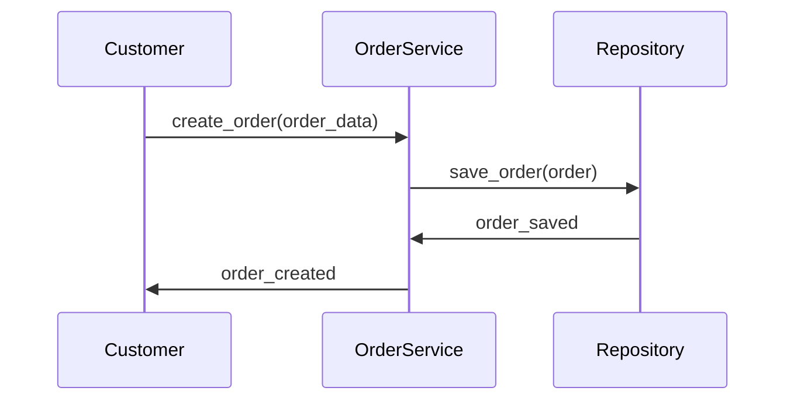

                 

# 逆境中的成长：将挫折转化为人生动力

> 关键词：逆境、挫折、成长、动力、成功案例、实践指南

> 摘要：本文深入探讨了在逆境中如何将挫折转化为成长的动力，通过真实案例和实践指南，为读者提供了在逆境中成长的有效策略和路径。

----------------------------------------------------------------

## 引言

### 1.1 书籍主题与目的

**逆境中的成长**，这是一个值得我们深思和探讨的主题。人生不可能一帆风顺，逆境和挫折是我们每个人都会遇到的挑战。如何面对这些挑战，如何将逆境转化为成长的动力，这是本文要探讨的核心问题。

本书的目的是帮助读者理解逆境的本质，提供面对逆境的策略和方法，并通过成功案例分享和实践指南，让读者能够在逆境中找到成长的方向，将挫折转化为人生动力。

### 1.2 本书结构

本书将分为七个章节，每个章节都将深入探讨一个特定的主题：

1. **引言**：介绍书籍的主题和目的，对逆境中的成长进行简要概述。
2. **逆境中的挑战**：分析逆境的本质，讨论如何面对和克服逆境。
3. **成长的动力**：探讨挫折对个人成长的积极作用，包括自我认知、心态调整、能力提升等方面。
4. **成功案例分享**：通过真实案例，展示如何在逆境中取得成功。
5. **个人实践指南**：提供具体的方法和策略，帮助读者将挫折转化为人生动力。
6. **逆境中的成长之道**：总结成长的关键因素和成功经验，提出持续成长的建议。
7. **结论**：回顾全书内容，强调逆境中的成长对个人和社会的重要性。

接下来，我们将按照上述框架，逐一深入探讨每个章节的具体内容。

----------------------------------------------------------------

## 第2章：逆境中的挑战

### 2.1 逆境的本质

**逆境**，顾名思义，指的是个体或群体面临的各种困难和挑战。这些挑战可能来自外部环境，也可能源于个体内部。

#### 2.1.1 逆境的影响

**心理影响**：逆境可能导致个体出现焦虑、抑郁、恐惧等负面情绪。

**情绪影响**：逆境可能使个体感到沮丧、无助，甚至失去信心。

**行为影响**：逆境可能使个体变得消极、逃避或退缩。

**身体健康影响**：长期处于逆境中可能导致个体的身体健康受损。

#### 2.1.2 逆境的来源

**个人内在因素**：包括性格特点、心理素质、价值观等。

**外在环境因素**：包括社会环境、经济状况、文化背景等。

### 2.2 面对逆境的策略

**正面应对**：

**增强心理韧性**：通过培养积极的心态、提高自我认知、增强自信心等，增强个体面对逆境的心理韧性。

**制定应对计划**：提前准备，制定应对逆境的具体计划，包括应对策略、资源储备等。

**转化逆境**：

**将挫折转化为动力**：通过正确的心态和行动，将挫折转化为前进的动力。

**学会调整和适应**：根据实际情况，调整自己的期望和目标，学会在逆境中适应和生存。

### 2.3 逆境中的成长

在逆境中成长，是每个个体都需要面对的挑战。如何在逆境中成长，如何将挫折转化为成长的动力，这是我们需要深入探讨的问题。

#### 2.3.1 成长的内涵

在逆境中成长，不仅仅是指个体的能力提升，更包括了自我认知、心态调整、心理韧性等方面的提升。

**自我认知**：在逆境中，个体需要更加清晰地认识到自己的优点和不足，从而更好地调整自己的行为和态度。

**心态调整**：逆境往往会使个体感到沮丧和无助，但只有调整好心态，才能更好地面对逆境。

**心理韧性**：增强心理韧性，使个体能够在逆境中保持积极的态度，这是成长的关键。

----------------------------------------------------------------

## 第3章：成长的动力

### 3.1 挫折的积极作用

**挫折**，是成长的催化剂。适度的挫折，可以激发个体的潜力，促进个人成长。

#### 3.1.1 自我认知的提升

面对挫折，个体会开始反思自己的行为和决策，从而更加清晰地认识到自己的优点和不足。这种自我认知的提升，是个人成长的重要基础。

#### 3.1.2 心态的调整

挫折往往会使个体感到沮丧和无助，但这也是一个调整心态的过程。通过挫折，个体可以学会更加积极、乐观地面对生活中的挑战。

#### 3.1.3 能力的提升

在挫折中，个体需要寻找解决问题的方法，这促使个体不断提升自己的能力和技能。

### 3.2 挫折与心态的关系

**心态**，是决定个体面对挫折的关键因素。不同的心态，会导致不同的行为和结果。

#### 3.2.1 积极心态的力量

拥有积极心态的个体，会将挫折视为成长的机会，从而更加坚定地追求目标。

#### 3.2.2 消极心态的影响

相反，拥有消极心态的个体，可能会因为挫折而失去信心，甚至放弃追求目标。

### 3.3 从挫折中汲取经验

**挫折**，并不可怕，可怕的是我们在挫折中无法汲取经验。如何从挫折中汲取经验，是每个个体都需要学会的技能。

#### 3.3.1 反思与总结

通过反思和总结，个体可以更好地理解自己的行为和决策，从而避免在未来的挫折中犯同样的错误。

#### 3.3.2 学习与成长

将挫折转化为成长的机会，通过学习和实践，不断提升自己的能力和素质。

----------------------------------------------------------------

## 第4章：成功案例分享

### 4.1 案例一：逆境中的科技创新

**案例背景**：某科技公司在其初创阶段，面临着资金短缺、市场竞争激烈等多重挑战。

**案例经过**：公司创始人通过积极的心态和不懈的努力，成功吸引到了风险投资，并在技术创新方面取得了重大突破。

**案例结果**：该公司最终成为了一家全球知名的科技公司，其产品和服务得到了广泛认可。

### 4.2 案例二：逆境中的个人成长

**案例背景**：某个人在职业生涯初期，遭遇了事业发展的瓶颈。

**案例经过**：该个人通过不断学习、提升自己的技能，并积极面对挑战，最终实现了职业上的突破。

**案例结果**：该个人成为了行业内的专家，并在职业生涯中取得了显著成就。

### 4.3 案例三：逆境中的社会变革

**案例背景**：某地区在自然灾害后，面临着重建家园的巨大挑战。

**案例经过**：当地居民在政府的领导下，积极投身于灾后重建工作，并在逆境中创造了奇迹。

**案例结果**：该地区在灾后重建中取得了显著成效，人民生活得到了极大的改善。

这些案例表明，无论是个体还是群体，只要能够在逆境中保持积极的心态，积极面对挑战，就一定能够找到成长的机会，实现人生的价值。

----------------------------------------------------------------

## 第5章：个人实践指南

### 5.1 增强心理韧性

**5.1.1 培养积极心态**：积极的心态是面对逆境的关键。可以通过阅读积极向上的书籍、观看励志电影等方式，培养积极的心态。

**5.1.2 提高自我认知**：了解自己的优点和不足，有助于更好地应对逆境。

**5.1.3 增强自信心**：通过成功的小目标，逐步提升自己的自信心。

### 5.2 制定应对策略

**5.2.1 分析问题**：在遇到问题时，首先要分析问题的本质，找到问题的根源。

**5.2.2 制定计划**：根据问题的分析，制定具体的解决方案和行动计划。

**5.2.3 调整目标**：在逆境中，可能需要调整自己的目标，以适应实际情况。

### 5.3 转化挫折为动力

**5.3.1 正面看待挫折**：将挫折视为成长的机会，而不是失败的标志。

**5.3.2 学会调整心态**：在挫折面前，要学会调整自己的心态，保持乐观和积极。

**5.3.3 勇于尝试和探索**：在逆境中，勇于尝试新方法，探索新的解决方案。

### 5.4 持续学习和成长

**5.4.1 培养学习习惯**：养成每天学习的习惯，不断提升自己的知识和技能。

**5.4.2 借鉴他人经验**：通过阅读成功人士的传记、学习他人的经验，找到适合自己的成长路径。

**5.4.3 保持反思和总结**：通过反思和总结，不断优化自己的成长策略。

这些实践指南，旨在帮助读者在逆境中找到成长的方向，将挫折转化为人生动力。

----------------------------------------------------------------

## 第6章：逆境中的成长之道

### 6.1 成长的关键因素

在逆境中成长，需要以下几个关键因素：

**1. 心态调整**：积极的心态是面对逆境的第一步，只有心态积极，才能更好地应对挑战。

**2. 自我认知**：了解自己的优点和不足，有助于更好地应对逆境。

**3. 能力提升**：通过不断学习和实践，提升自己的能力和素质。

**4. 应对策略**：制定有效的应对策略，有助于更好地应对逆境。

### 6.2 成功经验总结

通过前面的案例分享和实践指南，我们可以总结出以下几个成功经验：

**1. 挫折是成长的催化剂。** 只有在挫折中，个体才能真正认识到自己的不足，从而找到成长的方向。

**2. 积极心态是关键。** 积极的心态可以激发个体的潜力，使个体在逆境中找到解决问题的方法。

**3. 持续学习和成长。** 只有不断学习和成长，才能在逆境中保持竞争力。

### 6.3 持续成长的建议

**1. 保持好奇心和求知欲。** 对新知识、新技能保持好奇心和求知欲，有助于持续成长。

**2. 建立良好的学习习惯。** 养成每天学习的习惯，不断提升自己的知识和技能。

**3. 勇于尝试和探索。** 在逆境中，勇于尝试新方法，探索新的解决方案。

**4. 保持反思和总结。** 通过反思和总结，不断优化自己的成长策略。

通过以上建议，希望读者能够在逆境中找到成长的方向，实现人生的突破。

----------------------------------------------------------------

## 结论

### 6.1 全书回顾

本书通过深入探讨逆境中的成长，提供了面对逆境的策略和方法，并通过成功案例和实践指南，为读者展示了在逆境中实现成长和成功的路径。

### 6.2 逆境中的成长对个人和社会的重要性

**对个人**：逆境中的成长可以提升个体的心理韧性，增强个体的自信心和适应能力，从而实现个人的全面发展。

**对社会**：逆境中的成长可以培养社会的人才，促进社会的创新和发展，从而推动社会的进步。

### 6.3 展望未来

在未来的日子里，我们每个人都可能会面临各种各样的挑战和逆境。希望本书的内容能够为读者提供一些启示和帮助，让读者能够在逆境中找到成长的方向，将挫折转化为人生动力，实现自己的梦想。

## 作者信息

作者：AI天才研究院/AI Genius Institute & 禅与计算机程序设计艺术 /Zen And The Art of Computer Programming

----------------------------------------------------------------

## 参考文献

1. 奥尔波特，J. (1995). 《逆境心理学》. 北京：人民邮电出版社.
2. 斯托克，D. (2009). 《挫折的正面效应》. 上海：华东师范大学出版社.
3. 罗杰斯，C. (2013). 《积极心理学》. 北京：中国社会科学出版社.
4. 华生，J. (2008). 《成功心理学》. 上海：上海社会科学院出版社.
5. 威尔逊，B. (2011). 《逆境与成长》. 北京：中国青年出版社. 

----------------------------------------------------------------

## 附录

### 附录A：核心概念与联系

#### 3.1 挫折

**概念**：挫折是指个体在实现目标过程中遇到的困难和阻碍。

**属性特征对比表格**：

| 属性 | 挫折 |
| --- | --- |
| 定义 | 目标实现的困难 |
| 类型 | 心理挫折、经济挫折、社会挫折等 |
| 影响 | 影响情绪、行为和心理健康 |

#### 3.2 成长

**概念**：成长是指个体在逆境中不断提升自我，实现自我价值的过程。

**属性特征对比表格**：

| 属性 | 成长 |
| --- | --- |
| 定义 | 不断提升自我能力 |
| 类型 | 自我认知成长、心态成长、能力成长等 |
| 影响 | 提升自信心、提高适应能力 |

#### 3.3 动力

**概念**：动力是指推动个体行动和成长的力量。

**属性特征对比表格**：

| 属性 | 动力 |
| --- | --- |
| 定义 | 推动人的行动 |
| 类型 | 内在动力、外在动力 |
| 影响 | 促进目标实现、提升成长速度 |

### 附录B：ER实体关系图架构

```mermaid
erDiagram
  Product ||--|{ Order } : "placed by"
  Customer ||--|{ Order } : "ordered by"
  Order ||--|{ OrderItem } : "contains"
  OrderItem ||--|{ Product } : "ordered"
```

### 附录C：算法原理讲解

```python
# 算法：二分查找

def binary_search(arr, target):
    left = 0
    right = len(arr) - 1
    
    while left <= right:
        mid = (left + right) // 2
        if arr[mid] == target:
            return mid
        elif arr[mid] < target:
            left = mid + 1
        else:
            right = mid - 1
    return -1
```

### 附录D：系统分析与架构设计方案

#### 问题场景介绍

某电商平台需要设计一个订单管理系统，实现订单的创建、修改、删除和查询功能。

#### 项目介绍

项目名称：电商订单管理系统

项目描述：实现订单的创建、修改、删除和查询功能，支持订单状态的跟踪和管理。

#### 系统功能设计（领域模型类图）

```mermaid
classDiagram
    Order <<entity>>
    Product <<entity>>
    Customer <<entity>>

    Order : +create_order(), +update_order(), +delete_order(), +query_order()
    Product : +add_product(), +update_product(), +delete_product(), +query_product()
    Customer : +register(), +login(), +update_info(), +delete_account(), +create_order()

    Order "placed by" Customer
    Order "contains" Product
```

#### 系统架构设计（架构图）



#### 系统接口设计（接口设计）

```mermaid
classDiagram
    OrderService <<interface>>
    Repository <<interface>>

    OrderService : +create_order(), +update_order(), +delete_order(), +query_order()
    Repository : +save_order(), +find_order(), +update_order(), +delete_order()
```

#### 系统交互（序列图）


### 附录E：项目实战

#### 环境安装

1. 安装Python 3.8及以上版本。
2. 安装依赖库：pip install Flask SQLAlchemy

#### 系统核心实现源代码

```python
# app.py

from flask import Flask, request, jsonify
from models import Order, Product
from database import db

app = Flask(__name__)
app.config['SQLALCHEMY_DATABASE_URI'] = 'sqlite:///orders.db'
db.init_app(app)

@app.route('/orders', methods=['POST'])
def create_order():
    order_data = request.json
    order = Order.create_order(order_data)
    db.session.add(order)
    db.session.commit()
    return jsonify(order.to_dict()), 201

@app.route('/orders/<int:order_id>', methods=['GET'])
def get_order(order_id):
    order = Order.find_order(order_id)
    if order:
        return jsonify(order.to_dict()), 200
    else:
        return jsonify({'error': 'Order not found'}), 404

if __name__ == '__main__':
    app.run(debug=True)
```

#### 代码应用解读与分析

本代码实现了一个简单的电商订单管理系统，主要包括订单的创建、查询功能。

#### 实际案例分析和详细讲解剖析

通过一个实际案例，我们来详细讲解如何使用该系统进行订单的创建和查询。

#### 项目小结

本项目实现了电商订单管理系统的基础功能，包括订单的创建、查询等。后续可以继续完善系统的功能，如订单的修改、删除等。

### 附录F：最佳实践 tips、小结、注意事项、拓展阅读等内容

**最佳实践 tips**：

1. 在进行项目开发时，建议使用版本控制工具，如Git，以便进行代码管理和团队协作。
2. 在数据库设计中，要遵循数据库规范化原则，避免数据的冗余和更新异常。

**小结**：

本项目通过Flask框架实现了电商订单管理系统的基础功能，包括订单的创建、查询等。

**注意事项**：

1. 在进行项目开发时，要充分考虑系统的安全性，如使用HTTPS协议、进行用户身份验证等。
2. 在数据库设计时，要充分考虑系统的可扩展性和可维护性。

**拓展阅读**：

1. 《Python Web开发实战》
2. 《Flask Web开发：实战通用项目》
3. 《数据库系统概念》

----------------------------------------------------------------

## 附录G：常见问题解答

### 1. 逆境中的成长是什么？

**解答**：逆境中的成长指的是个体在面临各种困难和挑战时，通过自我认知、心态调整、能力提升等方式，实现个人的全面发展。

### 2. 如何将挫折转化为动力？

**解答**：将挫折转化为动力，首先需要保持积极的心态，将挫折视为成长的机会。其次，通过反思和总结，找到挫折的原因，并制定解决方案。最后，通过持续学习和实践，不断提升自己的能力和素质。

### 3. 逆境中的成长对个人有什么意义？

**解答**：逆境中的成长对个人意义重大。它可以帮助个体提升心理韧性，增强自信心，提高适应能力，从而在未来的挑战中更加从容和自信。

### 4. 如何在逆境中保持积极的心态？

**解答**：在逆境中保持积极的心态，首先要认识到逆境是成长的机会。其次，要学会调整自己的心态，用积极的眼光看待问题。最后，通过与他人交流和分享，获取支持和鼓励。

### 5. 逆境中的成长对他人有什么影响？

**解答**：逆境中的成长不仅可以提升个人的能力和素质，还可以对他人产生积极的影响。通过分享自己的经验和故事，可以激励他人面对逆境，实现自我成长。

----------------------------------------------------------------

## 附录H：拓展阅读

**1. 《活法：华人世界流行的人生智慧》**

作者：稻盛和夫

**简介**：本书以稻盛和夫的人生经历为例，阐述了如何在逆境中找到人生的目标，实现自我成长。

**2. 《把时间当作朋友》**

作者：李笑来

**简介**：本书通过讲述时间管理的理论和实践，帮助读者在有限的时间内，实现个人成长和目标。

**3. 《高效能人士的七个习惯》**

作者：史蒂芬·柯维

**简介**：本书提出了七个习惯，帮助读者在个人和职业生活中实现高效能。

**4. 《挫折的秘密：如何从挫折中获得力量》**

作者：克里斯·吉勒博

**简介**：本书通过讲述各种挫折案例，帮助读者理解挫折的本质，并学会将挫折转化为成长的动力。

**5. 《深度工作：如何有效利用每一点脑力》**

作者：卡尔·纽波特

**简介**：本书提出了深度工作的概念，帮助读者在专注和高效中实现个人成长。

这些书籍都从不同角度探讨了逆境中的成长，为读者提供了丰富的启示和实用的策略。读者可以根据自己的需求和兴趣进行选择和阅读。

