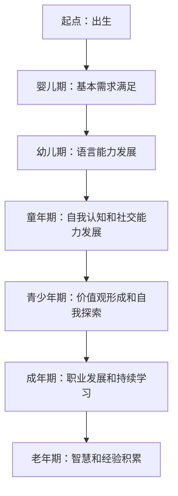
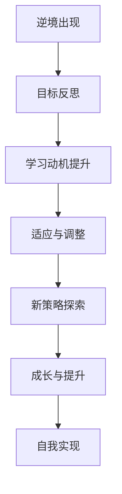
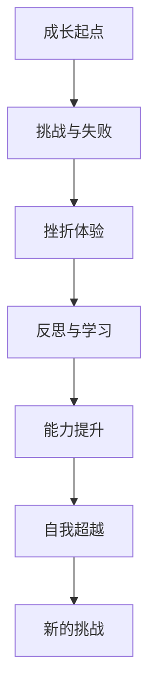
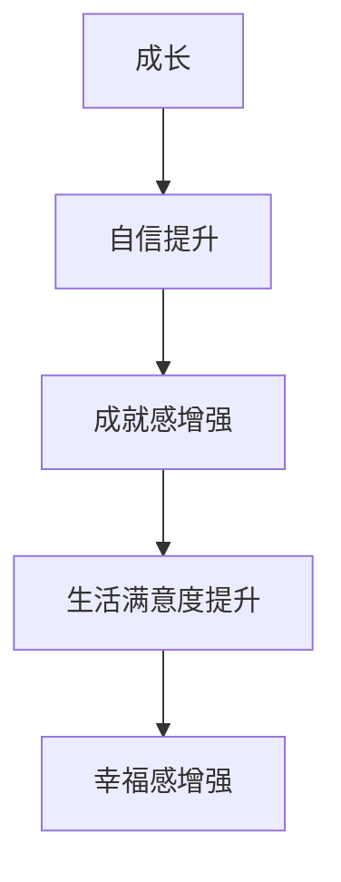

                 

### 第一部分：问题背景与核心概念

#### 第1章：挫折与逆境的定义

**1.1 逆境的定义与背景**

在探讨成长与挫折的关系之前，我们需要明确什么是逆境。逆境，通常指的是个体或组织在面临外界压力、挑战或不利条件时所经历的一种状态。这种状态不仅体现在经济、政治和社会环境中，也体现在个人生活中。根据心理学研究，逆境普遍存在于人类的生活中，几乎每个人在一生中都会遇到不同程度的逆境。

在现代社会，随着竞争的加剧和社会变迁的加速，个体和组织面临的外部压力和不确定性大大增加，从而使得逆境成为了一个值得深入探讨的话题。根据美国心理学会（APA）的数据，大约70%的成年人表示他们经历过某种形式的严重压力或逆境，这些逆境可能来自于工作、家庭、健康或经济等方面。

**案例引用：** 例如，全球金融危机期间，许多企业面临倒闭的威胁，许多个体则失去了工作，这种经济逆境对全球的社会和经济系统产生了深远的影响。

**1.2 挫折的双重作用**

挫折是逆境的一种具体表现形式，它指的是个体在追求目标或期望时遭遇的阻碍或失败。挫折的双重作用体现在它既有可能成为成长的阻碍，也有可能成为成长的契机。心理学研究表明，适度的挫折有助于个体的发展，因为它可以激发个体的反思和自我调整能力。然而，过度的挫折则可能导致个体的心理压力和焦虑，甚至可能损害个体的心理健康。

**案例引用：** 以教育领域为例，一些研究表明，适度的考试压力有助于学生的学业进步，但过度的考试压力则可能导致学生的焦虑和成绩下降。

**1.3 挫折与逆境的关系**

挫折与逆境之间存在密切的关系。挫折往往是逆境中的具体表现，而逆境则是挫折的背景和总体环境。在逆境中，个体或组织可能会经历一系列的挫折，这些挫折既是逆境的一部分，也是逆境中成长的重要推动力。

**图示分析：** 下图展示了挫折与逆境的内在联系。挫折（F）是逆境（T）的具体表现，而逆境（T）则是挫折（F）的总体背景和环境。

```
      +------+           +------+
      | 挫折 |----------->|  逆境 |
      +------+           +------+
```

**1.4 逆境下的挑战与机遇**

逆境不仅带来了挑战，同时也孕育着机遇。在逆境中，个体和组织需要寻找新的解决方案和机会，这种探索和创新的过程往往能够促进成长和发展。例如，在科技行业中，许多创新和突破都是在逆境中产生的，比如微软在个人电脑普及之前的市场困境，以及苹果公司在面对市场挑战时推出的革命性产品。

**案例引用：** 以苹果公司为例，乔布斯在1985年离开苹果公司后，通过创建NeXT公司，以及在1997年回到苹果公司，带领苹果公司在逆境中实现了复兴，推出了一系列革命性的产品，如iPod、iPhone和iPad。

**总结：** 通过对挫折与逆境的定义和关系的分析，我们可以看到，逆境和挫折并不是完全负面的，它们是成长和发展的催化剂。在接下来的章节中，我们将进一步探讨成长的概念及其在逆境中的重要性，以及个体和组织如何在逆境中实现自我提升和成长。

#### 第2章：核心概念与联系

**2.1 成长的定义与本质**

成长，是一个广泛而深远的概念，涉及到个体的心理、情感、智力和社会能力的发展。从心理学角度来看，成长是指个体通过学习、体验和适应环境变化，逐渐达到更加成熟和综合发展的状态。成长不仅仅是身体上的成长，更重要的是心理和认知能力的发展。

**图解成长过程：**



**2.2 逆境中的成长机制**

在逆境中成长，涉及到一系列复杂的机制和过程。首先，逆境往往迫使个体重新评估自己的目标和价值观，这种反思有助于个体更清晰地认识自我，找到新的方向和动力。其次，逆境中的挑战和失败能够激发个体的学习动机和适应能力，促使个体寻找新的解决方案。

**成长机制流程图：**



**2.3 成长与挫折的相互作用**

成长与挫折之间的相互作用是理解逆境中成长的关键。挫折可以看作是成长过程中的一个环节，它既是挑战，也是机遇。适度的挫折能够促进个体反思和成长，但过度的挫折则可能导致挫败感和逃避行为。

**图示成长与挫折的相互作用：**



**实例分析：** 以一位年轻的软件工程师为例，他在职业生涯的早期遇到了一个重大的挫折，他的项目由于技术问题而失败。这个挫折迫使他对自己的技能和项目管理能力进行深刻反思，从而推动了他在后续项目中的快速成长和提升。

**总结：** 通过对成长、逆境和挫折的概念和关系的分析，我们可以看到，逆境中的成长是一个动态的过程，它涉及到个体对逆境的适应、反思和学习。在接下来的章节中，我们将通过具体的案例来探讨个体和群体如何在逆境中实现自我成长和提升。

### 第二部分：具体案例与成长路径

#### 第3章：逆境中的个体成长

**3.1 成长故事：案例一**

**背景介绍：** 小明是一名年轻的技术工程师，他在一家初创公司工作。由于公司资金链断裂，小明所在的项目被迫停止，他因此失去了工作。这个挫折对他的打击非常大，但他并没有选择放弃。

**关键步骤：** 小明首先进行自我反思，认识到这是一个很好的机会来提升自己的技能和职业素养。他开始学习新的编程语言和技术，并积极参加线上和线下的技术研讨会。在这个过程中，他不仅提升了自己的技术能力，还建立了一个强大的技术社区。

**结果：** 最终，小明的努力得到了回报，他得到了一家知名科技公司的录用，并在新的工作中发挥了重要作用。这个经历让他深刻体会到，挫折并不是终点，而是成长的新起点。

**3.2 心理调适：应对挫折**

**背景介绍：** 面对挫折，个体的心理调适能力显得尤为重要。小李是一名项目经理，他在一次大型项目中由于沟通失误导致项目失败，这给他带来了极大的心理压力。

**关键步骤：** 小李首先通过自我反思，认识到问题的根源。然后，他主动寻求同事和领导的建议，从他们的反馈中找到了改进的方法。同时，他通过练习瑜伽和冥想，缓解了压力和焦虑。

**结果：** 通过心理调适，小李不仅恢复了信心，还学会了如何更好地应对未来可能遇到的挫折。他的职业发展因此更加顺利，成为了一个成功的项目经理。

**3.3 自我认知与目标设定**

**背景介绍：** 小王是一名年轻的创业者，他的初创公司在市场竞争中面临巨大的压力。他意识到，要想在逆境中生存，他需要重新审视自己的目标和定位。

**关键步骤：** 小王首先进行了自我认知，明确了自身的优势和不足。然后，他重新设定了公司的目标，专注于细分市场，并提供定制化的服务。

**结果：** 通过自我认知和目标设定，小王的初创公司在逆境中找到了新的发展方向，逐渐摆脱了困境，并实现了稳定增长。

**总结：** 通过这三个案例，我们可以看到，个体在逆境中的成长涉及到多个方面，包括心理调适、自我认知和目标设定等。这些过程不仅帮助个体克服了挫折，还促进了他们的自我提升和职业发展。

#### 第4章：逆境中的组织成长

**4.1 组织逆境的定义与特征**

**定义：** 组织逆境是指企业或组织在面临外部压力、内部挑战或不确定因素时所经历的一种困境状态。这种困境可能来自市场竞争、政策变化、技术革新等多种因素。

**特征：** 组织逆境通常表现为以下特征：

1. **外部压力：** 包括市场变化、客户需求变化、竞争对手压力等。
2. **内部挑战：** 如组织结构问题、管理困难、员工士气低落等。
3. **不确定性：** 由于未来不可预测，组织在应对逆境时面临很大的不确定性。

**案例引用：** 例如，2008年的全球金融危机对许多企业造成了巨大冲击，导致许多企业陷入财务困境，甚至破产。

**4.2 组织成长策略**

在逆境中，组织需要采取一系列策略来应对挑战，实现成长。以下是一些关键策略：

1. **创新：** 通过技术创新、产品创新或服务创新来寻找新的市场机会。
2. **合作：** 与其他组织建立合作关系，共享资源，共同应对挑战。
3. **灵活调整：** 根据市场变化和内部情况，灵活调整战略和运营模式。

**案例引用：** 苹果公司在面临市场挑战时，通过推出iPhone等一系列创新产品，成功实现了逆境中的成长。

**4.3 组织文化与逆境应对**

**组织文化的定义与作用：** 组织文化是企业价值观、行为准则和工作方式的集合，它对组织的逆境应对能力有着重要的影响。

1. **共同价值观：** 强调团队合作、创新精神和客户导向，有助于提高组织的凝聚力。
2. **支持性环境：** 提供心理支持和职业发展机会，帮助员工在逆境中保持积极态度。

**案例引用：** 以谷歌公司为例，谷歌的文化强调创新、自由探索和员工福利，这种文化帮助谷歌在多个逆境中保持了良好的发展态势。

**总结：** 通过分析组织在逆境中的成长策略和文化建设，我们可以看到，组织在逆境中的成长不仅仅是技术和策略的调整，更重要的是文化的支持和员工的积极应对。在接下来的章节中，我们将探讨社会层面的成长和影响。

#### 第5章：逆境中的社会成长

**5.1 社会逆境的影响**

**定义：** 社会逆境指的是一个社会在面临重大挑战、危机或冲突时所经历的一种状态。这种状态可能由经济衰退、自然灾害、政治动荡、疫情等因素引起。

**影响：** 社会逆境对个体和社会的影响深远且复杂，主要体现在以下几个方面：

1. **经济影响：** 经济衰退可能导致失业率上升、企业倒闭，从而影响社会的整体经济状况。
2. **心理健康：** 突发的危机和不确定性会对个体的心理健康产生负面影响，如焦虑、抑郁和压力增加。
3. **社会关系：** 社会逆境可能导致社会关系的紧张和冲突，影响社会的稳定和和谐。

**案例引用：** 例如，新冠疫情对全球经济和社会产生了巨大影响，导致许多国家面临经济衰退和社会动荡。

**5.2 社会支持系统的建立**

为了在逆境中实现社会成长，建立有效的社会支持系统至关重要。社会支持系统包括政府、非政府组织、社区和个人等多方面力量，它们共同协作，为个体和社会提供必要的支持和帮助。

**关键要素：**

1. **政府作用：** 政府可以通过政策制定和资源分配，为受影响的人群提供经济援助、医疗保障和社会福利。
2. **非政府组织：** 非政府组织（NGO）和非营利组织在提供紧急救援、心理支持和社区服务方面发挥着重要作用。
3. **社区参与：** 社区的互助和合作可以增强社会凝聚力，为个体提供情感支持和实际帮助。
4. **个人责任：** 每个个体也应该承担社会责任，帮助他人，共同应对社会逆境。

**案例引用：** 在新冠疫情期间，许多国家和地区通过建立紧急医疗系统、提供经济援助和开展疫苗接种工作，有效减轻了疫情对社会的冲击。

**5.3 社会责任与成长**

在逆境中，社会责任不仅是应对危机的一种手段，更是推动社会成长的重要动力。社会责任感使个体和组织在面对挑战时，不仅关注自身的利益，更关注社会的整体福祉。

**关键作用：**

1. **促进社会公正：** 通过承担社会责任，个体和组织能够推动社会公正，减少不平等现象。
2. **增强社会凝聚力：** 社会责任使个体和群体更加团结，共同面对逆境，增强社会的整体应对能力。
3. **推动创新与进步：** 社会责任激发个体和组织的创新精神，促进技术进步和社会发展。

**案例引用：** 例如，全球科技巨头在疫情期间通过捐赠资金、物资和技术支持，帮助抗击疫情，同时也推动了医疗科技和公共卫生的发展。

**总结：** 社会在逆境中的成长不仅依赖于个体的努力，更需要社会支持系统的建立和社会责任的承担。通过有效的社会支持系统和积极的社会责任，社会可以更好地应对逆境，实现持续发展和进步。

### 第三部分：实践指南与成长策略

#### 第6章：逆境中的实践指南

**6.1 成长计划制定**

在逆境中制定成长计划是个人实现自我提升的关键步骤。一个有效的成长计划应该包括以下关键要素：

**目标设定：** 首先，明确个人目标。这些目标可以是短期的，如学习一项新技能，也可以是长期的，如提升职业地位或实现事业突破。目标应具体、可衡量，同时具有挑战性。

**时间管理：** 成长计划需要合理安排时间。制定时间表，确保每天有固定的学习和工作时间，避免拖延和过度劳累。

**反馈机制：** 定期进行自我评估和反馈，了解自己在成长过程中的进步和不足。通过反馈，调整计划和方法，确保持续进步。

**案例引用：** 小张在失业期间，制定了详细的职业提升计划。他每天早晨学习新技术，下午参加线上研讨会，并每周与职业顾问进行反馈交流。最终，他成功找到了一份满意的工作。

**6.2 实践案例分析**

以下是一些实际案例，展示了个人在逆境中如何通过实践实现成长：

**案例一：** 小王是一名软件工程师，在经历了一次项目失败后，他决定进行自我提升。他参加了多个编程培训课程，并通过实践项目提升了自己的技术能力。最终，他获得了一家知名科技公司的录用。

**案例二：** 小李在创业过程中遇到了资金短缺的问题。她通过向社会融资、寻求合作伙伴和优化运营模式，成功度过了困境，并将公司发展壮大。

**6.3 成长障碍与解决**

在成长过程中，个体可能会遇到各种障碍。以下是一些常见的成长障碍及其解决策略：

**1. 情绪障碍：** 挫折和失败可能导致情绪低落。解决策略包括心理调适、寻求专业心理咨询和参加情绪管理课程。

**2. 知识障碍：** 缺乏必要的知识和技能可能阻碍成长。解决策略包括参加培训课程、阅读相关书籍和寻求导师指导。

**3. 资源障碍：** 缺乏资金、时间或社会资源可能影响成长。解决策略包括寻求政府援助、非政府组织支持和社会资源的整合。

**案例引用：** 小赵在创业初期面临资金短缺的问题。他通过申请政府创业贷款、寻求投资者和优化成本管理，成功解决了资源障碍，并将公司发展壮大。

**总结：** 通过制定成长计划、实践案例分析和解决成长障碍，个体可以在逆境中实现自我提升和成长。这些实践指南不仅适用于个人，也为组织和社会在逆境中的发展提供了有益的启示。

#### 第7章：成长策略与自我提升

**7.1 成长策略概述**

在逆境中实现自我提升，需要一系列科学和有效的策略。以下是几种关键的成长策略：

**1. 自我反思：** 定期进行自我反思是个人成长的重要步骤。通过反思，个体可以认识到自己的优势和不足，从而制定相应的改进计划。

**2. 持续学习：** 学习是个人成长的关键驱动力。无论是通过课程学习、阅读书籍还是参加研讨会，持续学习都能帮助个体不断提升自己的知识和技能。

**3. 积极沟通：** 与他人进行积极沟通可以帮助个体获取新的视角和经验，促进个人成长。这包括与同事、导师、家人和朋友进行交流。

**4. 目标设定：** 设定明确、具体的目标是个人成长的指南针。目标应具有挑战性，同时是可实现的，以确保个人在不断努力中取得进步。

**5. 心理调适：** 面对逆境，心理调适能力至关重要。通过冥想、瑜伽和心理辅导等方法，个体可以更好地应对压力和挫折。

**7.2 成长与幸福的关系**

成长与幸福感之间存在密切的联系。适度的成长不仅能够提升个人的自信心和成就感，还能增强生活的满意度和幸福感。

**图解成长与幸福的关系：**



**实例分析：** 小张通过持续学习和职业发展，在事业上取得了显著成就。他的自信心和幸福感也随之提升，生活变得更加充实和满足。

**7.3 长期成长规划**

为了实现长期的成长和发展，个体需要制定一个详细的成长规划。以下是一些建议：

**1. 设定长期目标：** 长期目标应与个人的价值观和职业规划相一致。例如，成为一名行业专家或实现职业上的重大突破。

**2. 定期评估：** 每隔一段时间，对成长规划进行评估，确保目标实现的情况，并根据实际情况进行调整。

**3. 持续学习：** 持续学习是长期成长的关键。不仅要学习新技能，还要保持对行业动态和新兴技术的关注。

**4. 建立支持网络：** 建立一个包括导师、同事和朋友的支持网络，以便在成长过程中获取帮助和指导。

**5. 培养自我管理能力：** 培养自我管理能力，包括时间管理、情绪管理和目标设定等，以确保个人能够有效地实现长期目标。

**实例分析：** 小李在制定长期成长规划时，明确了成为一名技术领导者的目标。他通过持续学习、定期评估和建立支持网络，逐步实现了这一目标。

**总结：** 成长策略与自我提升是实现个人价值和幸福感的重要途径。通过自我反思、持续学习、积极沟通、目标设定和心理调适，个体可以在逆境中实现自我提升。同时，制定长期成长规划，有助于确保个人在长期发展中持续进步。这些策略不仅适用于个人，也为组织和社会的发展提供了有益的启示。

### 总结与展望

#### 第8章：逆境中的成长总结与展望

**8.1 成长的重要性**

在逆境中成长，不仅是个体发展的关键，也是社会进步的重要推动力。逆境中的成长使我们能够更好地适应变化、克服挑战，从而实现个人的潜能和社会的繁荣。通过成长，个体能够提升自我认知、增强心理韧性，而社会则能够更加稳定和和谐。

**案例引用：** 例如，在全球金融危机期间，许多企业家通过逆境中的成长，不仅挽救了自己的企业，还推动了整个经济的复苏。

**8.2 未来展望**

随着科技的迅猛发展和全球化进程的加速，未来的成长环境将充满机遇和挑战。人工智能、物联网、区块链等新兴技术将为个体和社会带来新的发展机遇，同时也带来了新的挑战。

**趋势分析：**

1. **个性化成长：** 未来，个性化成长将成为重要趋势。通过大数据和人工智能技术，个体可以更精准地了解自己的需求和潜力，制定个性化的成长计划。
2. **跨领域合作：** 随着技术的发展，不同领域之间的合作将更加紧密。跨领域的合作不仅能够促进创新，还能够解决复杂的全球性问题。
3. **持续学习：** 在未来，终身学习将成为常态。个体和组织都需要不断学习新知识、新技能，以适应快速变化的环境。

**8.3 个人成长倡议**

为了在逆境中实现更好的成长，我们提出以下个人成长倡议：

1. **设定明确目标：** 设定短期和长期目标，确保成长方向清晰。
2. **持续学习：** 保持好奇心，不断学习新知识和技能，适应不断变化的环境。
3. **积极心态：** 保持积极的心态，面对挫折和挑战时，将其视为成长的机会。
4. **建立支持网络：** 建立包括家人、朋友和导师在内的支持网络，获取帮助和指导。
5. **定期反思：** 定期进行自我反思，了解自己的进步和不足，调整成长计划。

**总结：** 逆境中的成长不仅是个人发展的必然途径，也是社会进步的重要动力。通过明确的目标、持续的学习、积极的心态和有效的支持，个体和社会都能在逆境中实现更好的成长。我们鼓励每个人在逆境中积极成长，追求自己的梦想，共同创造一个更加美好的未来。

### 附录：拓展阅读与资源

#### 附录A：拓展阅读

为了帮助读者更深入地了解逆境中的成长，我们推荐以下书籍、文章和网站：

1. **书籍：**
   - 《逆商：如何应对生活中的逆境》（书名：The resilient Spirit；作者：John R. Childress）
   - 《成长之痛：如何应对生活中的挫折》（书名：The Pain of Growth；作者：James M. Fowler）

2. **文章：**
   - 《如何从失败中恢复：一个心理学视角》（文章标题：How to Bounce Back from Failure: A Psychological Perspective；来源：Harvard Business Review）
   - 《逆境中的创新：如何利用挑战实现突破》（文章标题：Innovation under Pressure: How to Thrive in Times of Challenge；来源：MIT Sloan Management Review）

3. **网站：**
   - [国家心理卫生热线](http://www.nmpsh.org.cn)：提供心理健康相关的咨询服务。
   - [Coursera](https://www.coursera.org)：提供大量免费和付费的在线课程，涵盖各种领域。

#### 附录B：成长资源

以下是一些有助于个人成长的工具、课程和社区，供读者参考：

1. **工具：**
   - [Trello](https://trello.com)：一款强大的任务管理工具，有助于个人和时间管理。
   - [Evernote](https://evernote.com)：一款笔记和组织工具，方便记录和整理思路。

2. **课程：**
   - [edX](https://www.edx.org)：提供由全球顶尖大学提供的免费在线课程。
   - [Udemy](https://www.udemy.com)：提供丰富的在线课程，涵盖编程、商业、技术等各个领域。

3. **社区：**
   - [GitHub](https://github.com)：一个代码托管和协作平台，适合技术爱好者和开发者。
   - [LinkedIn](https://www.linkedin.com)：一个职业社交平台，有助于建立职业网络和获取行业信息。

通过阅读拓展材料和利用成长资源，读者可以在逆境中更好地实现自我提升和持续成长。希望这些推荐对您有所帮助。作者：AI天才研究院/AI Genius Institute & 禅与计算机程序设计艺术 /Zen And The Art of Computer Programming

