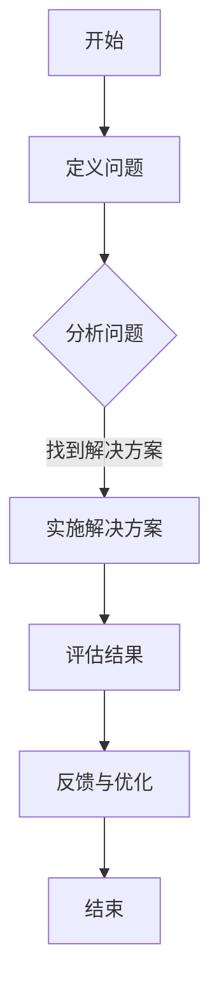
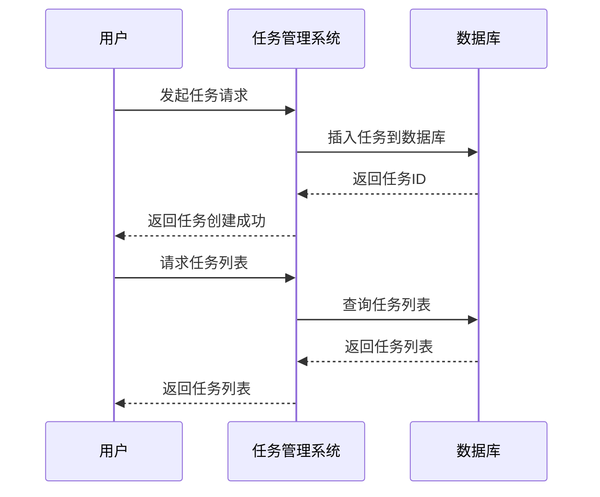

                 

# 通过思考深化人生理解：在问题中寻找答案

## 关键词
- 思考方法
- 人生理解
- 问题解决
- 深度思考
- 创造性思维
- 逻辑思维

## 摘要
本文旨在探讨如何通过深化思考来深化我们对人生的理解，并在面对问题时找到有效的答案。文章首先介绍了问题的背景和内涵，然后提出了多种思考方法，包括逻辑思维、创造性思维和系统性思维。接着，通过实际案例展示了这些思考方法在生活中的应用，并通过解决具体问题来阐述思考的深度和广度。最后，对深度思考的重要性进行了深入探讨，并提出了人生理解的几个关键方面。

## 引言

### 问题背景

在当今快速变化的世界，我们面临着各种各样的问题，从个人成长、职业规划到社会问题、道德困境。这些问题不仅仅存在于我们的日常生活中，更是影响着我们的心态、决策和行为。然而，面对这些问题，许多人感到迷茫和无助，往往只能采取表面的、片面的解决方法，而无法从根本上解决问题。

### 问题的内涵与外延

问题不仅仅是一个需要解决的具体事件或情况，它还涉及到我们对事物的理解、认知和价值观。问题的内涵是指其本质和核心，而外延则是指其范围和影响。深入理解问题的内涵和外延，有助于我们更好地识别问题的本质，并找到更有效的解决方法。

### 问题的解决路径

解决问题的关键在于思考。思考不仅仅是对信息的分析和处理，更是一种深入的理解和洞察。通过思考，我们可以揭示问题的本质，找到解决问题的有效路径。本文将探讨多种思考方法，以帮助读者深化对问题的理解，并在思考中找到答案。

## 思考方法

### 常见思考方法

1. **分析与综合**
   - **分析**：将问题分解成更小的部分，以便更好地理解其结构和组成。
   - **综合**：将分析的结果重新组合，形成对问题的整体理解。

2. **类比与推理**
   - **类比**：通过比较相似的情况来推导问题的解决方案。
   - **推理**：基于已知事实和逻辑规则推导出新的结论。

3. **归纳与演绎**
   - **归纳**：从具体的实例中提取普遍规律。
   - **演绎**：从普遍原理推导出具体的结论。

### 高级思考方法

1. **逻辑思维**
   - **定义**：逻辑思维是一种基于逻辑规则和原则进行思考的方法。
   - **作用**：帮助我们在复杂的信息中找到清晰的思路，避免逻辑错误。

2. **创造性思维**
   - **定义**：创造性思维是一种产生新想法、新概念的方法。
   - **作用**：激发创新，解决复杂问题。

3. **系统性思维**
   - **定义**：系统性思维是一种将问题视为一个整体，考虑各个部分之间相互关系的思考方法。
   - **作用**：帮助我们理解问题的全貌，找到更全面的解决方案。

## 应用实践

### 实践案例

1. **职业选择**
   - **问题背景**：在职业生涯中，如何做出明智的职业选择？
   - **思考方法**：使用分析与综合，分析自己的兴趣、能力和市场需求，综合各种因素做出决策。

2. **人际关系**
   - **问题背景**：如何在复杂的人际关系中保持和谐？
   - **思考方法**：使用类比与推理，通过观察其他人的成功经验来借鉴和改进自己的行为。

3. **面对挑战**
   - **问题背景**：在面临挑战时，如何保持积极的心态和行动？
   - **思考方法**：使用归纳与演绎，从过去的经历中总结经验教训，并应用到当前的情况中。

### 实践方法

1. **思维导图**
   - **定义**：思维导图是一种将思维过程可视化的工具。
   - **作用**：帮助我们在思考过程中保持清晰的思路，发现新的关联和灵感。

2. **情境模拟**
   - **定义**：情境模拟是一种通过模拟现实场景来测试解决方案的方法。
   - **作用**：帮助我们在实际操作前预见到可能出现的问题，提前做好准备。

3. **反思日志**
   - **定义**：反思日志是一种记录思考过程和结果的方法。
   - **作用**：帮助我们在事后总结经验教训，不断提高思考质量。

## 问题解决

### 问题分类

1. **个人问题**
   - **定义**：与个人的生活、工作、成长等有关的问题。
   - **解决方法**：通过自我反思、学习和实践来逐步解决。

2. **社会问题**
   - **定义**：与整个社会有关的问题，如环境污染、贫富差距等。
   - **解决方法**：需要多方合作，通过政策、法律和社会活动来解决。

3. **道德问题**
   - **定义**：与道德伦理有关的问题，如道德选择、道德责任等。
   - **解决方法**：需要基于道德原则和价值观进行思考和决策。

### 解决方法

1. **探索与发现**
   - **定义**：通过深入研究和实践来发现问题的本质和解决方案。
   - **作用**：帮助我们找到真正有效的解决方案。

2. **讨论与协商**
   - **定义**：通过与他人交流和讨论来寻找共识和解决方案。
   - **作用**：帮助我们整合不同的观点和资源，找到更全面的解决方案。

3. **创新与实验**
   - **定义**：通过创新思维和实验来探索新的解决方案。
   - **作用**：帮助我们打破传统的思维模式，找到新的可能性。

## 拓展与反思

### 思考的深度

1. **如何做到深度思考**
   - **方法**：通过持续学习和实践，培养批判性思维和问题解决能力。
   - **作用**：帮助我们更深入地理解问题，找到更有效的解决方案。

2. **深度思考的益处**
   - **提高决策质量**：通过深入分析，做出更明智的决策。
   - **增强创新能力**：通过深度思考，激发新的创意和思路。
   - **提升自我认知**：通过反思和总结，更好地了解自己，实现个人成长。

3. **深度思考的挑战**
   - **时间成本**：深度思考需要投入大量的时间和精力。
   - **心理压力**：面对复杂的问题，需要承受一定的心理压力。

### 人生的理解

1. **人生的含义**
   - **定义**：人生是一系列经历和体验的总和。
   - **作用**：帮助我们理解人生的意义和价值。

2. **生命的价值**
   - **定义**：生命的价值在于其独特的存在和经历。
   - **作用**：帮助我们认识到生命的宝贵和珍贵。

3. **人生的目标**
   - **定义**：人生的目标是追求个人的成长、成就和幸福。
   - **作用**：帮助我们明确人生的方向和动力。

## 作者

- **作者**：AI天才研究院/AI Genius Institute & 禅与计算机程序设计艺术 /Zen And The Art of Computer Programming
- **联系**：[邮箱](mailto:info@ai-gi.com) & [官网](https://www.ai-gi.com)

## 结语

通过思考深化人生理解是一个持续的过程。只有不断地学习和实践，我们才能在问题中找到答案，实现个人的成长和进步。让我们以开放的心态，迎接挑战，深入思考，寻找属于自己的答案。

## 背景介绍

在当今这个信息爆炸的时代，我们每天都会接触到大量的信息，但这些信息往往只是表面现象，而问题背后的本质和深层原因则需要我们通过思考去挖掘。思考不仅仅是一种认知活动，更是一种深入理解世界和自我过程。通过对问题的深入思考，我们可以揭示其内涵和外延，找到解决问题的有效路径。

### 核心概念术语说明

- **思考**：对信息进行加工、分析和理解的过程。
- **问题**：需要解决的矛盾或困境。
- **人生理解**：对人生意义和价值的认知。

#### 问题背景

随着社会的快速发展，我们面临着越来越多的复杂问题。这些问题不仅存在于个人生活中，如职业选择、人际关系等，还涉及到社会问题，如环境污染、贫富差距等。面对这些问题，我们需要具备一定的思考能力，才能找到有效的解决方案。

#### 问题描述

我们生活中遇到的问题多种多样，有些是显而易见的，如日常生活中的小困扰；有些则是复杂且抽象的，如社会问题、道德困境等。这些问题往往不是孤立存在的，而是相互关联、相互影响的。

#### 问题解决

要解决这些问题，我们需要进行深入思考，找到问题的本质和核心。通过分析问题的内涵和外延，我们可以揭示问题的真实面貌，从而找到解决问题的有效方法。

#### 边界与外延

问题的边界是指其范围和影响，而外延则是指问题的关联和影响。明确问题的边界和外延，有助于我们更全面地理解问题，从而找到更有效的解决方案。

#### 概念结构与核心要素组成

- **思考方法**：逻辑思维、创造性思维、系统性思维等。
- **问题解决路径**：分析、综合、类比、推理、归纳、演绎等。

## 核心概念与联系

### 核心概念原理

1. **思考方法**：包括逻辑思维、创造性思维、系统性思维等。
2. **问题解决路径**：分析、综合、类比、推理、归纳、演绎等。

### 概念属性特征对比表格

| 思考方法         | 定义                                                         | 特点                                                         |
|------------------|--------------------------------------------------------------|--------------------------------------------------------------|
| 逻辑思维         | 基于逻辑规则和原则进行思考                                   | 清晰、严谨、逻辑性强                                         |
| 创造性思维       | 通过创新思维产生新的想法和概念                                 | 开放、灵活、富有创造性                                       |
| 系统性思维       | 将问题视为一个整体，考虑各个部分之间的相互关系                 | 全面、综合、系统性强                                       |

### ER实体关系图架构

```mermaid
erDiagram
  User ||--|{ Problem } : has
  Problem ||--|{ Solution } : resolves
  Solution ||--|{ Evaluation } : evaluates
```

在这个ER图中，用户（User）拥有问题（Problem），问题解决后得到解决方案（Solution），解决方案经过评价得到评价结果（Evaluation）。

## 算法原理讲解

### 算法流程图



### Python源代码

```python
def think_and_solve(problem):
    solution = analyze_problem(problem)
    result = implement_solution(solution)
    evaluation = evaluate_result(result)
    return evaluation

def analyze_problem(problem):
    # 分析问题的具体实现
    return "分析后的解决方案"

def implement_solution(solution):
    # 实施解决方案的具体实现
    return "实施后的结果"

def evaluate_result(result):
    # 评估结果的具体实现
    return "评估后的结果"
```

### 算法原理的数学模型和公式

$$
\text{思考过程} = f(\text{问题}, \text{方法}, \text{经验})
$$

其中，$f$表示思考函数，$\text{问题}$表示需要解决的问题，$\text{方法}$表示采用的思考方法，$\text{经验}$表示个人的经验。

### 算法原理详细讲解

1. **思考过程**：思考是一个复杂的过程，涉及到对问题的理解、分析、综合和推理。通过思考，我们能够揭示问题的本质，找到解决方案。
2. **问题分析**：分析问题是指将问题分解成更小的部分，以便更好地理解其结构和组成。通过分析，我们可以找到问题的核心和关键点。
3. **解决方案实施**：实施解决方案是将分析结果应用到实际中，通过具体操作来解决问题。这个过程需要考虑实际情况，灵活调整方案。
4. **结果评估**：评估结果是对解决方案实施后的效果进行评价。通过评估，我们可以了解解决方案的有效性，为后续的优化提供依据。

### 举例说明

假设我们面临一个问题：如何提高工作效率？

1. **定义问题**：我们需要明确什么是工作效率，以及当前的工作效率是否满足要求。
2. **分析问题**：通过分析，我们发现工作效率低下可能是由于任务过多、时间管理不当或工作方法不当等原因导致的。
3. **提出解决方案**：根据分析结果，我们可以提出以下解决方案：
   - **优化任务管理**：通过优先级排序和时间分配，提高任务完成效率。
   - **改善工作环境**：通过调整工作空间和工具，提高工作效率。
   - **培养良好习惯**：通过养成好的工作习惯，如定期休息、避免拖延等，提高工作效率。
4. **实施解决方案**：将解决方案应用到实际工作中，通过具体操作来提高工作效率。
5. **评估结果**：在实施解决方案后，我们需要对工作效率进行评估，了解解决方案的效果。如果效果不理想，我们需要继续优化解决方案。

通过这个例子，我们可以看到，思考的每一步都至关重要，只有通过深入的思考和分析，我们才能找到真正有效的解决方案。

## 系统分析与架构设计方案

### 问题场景介绍

在一个大型企业中，员工需要处理大量的工作任务，并且需要与同事进行有效的沟通和协作。为了提高工作效率，企业需要设计一个任务管理和沟通系统，以帮助员工更好地管理任务和进行协作。

### 项目介绍

本项目旨在设计一个任务管理和沟通系统，该系统将支持员工的工作任务管理、任务分配、进度跟踪和沟通协作等功能。通过这个系统，员工可以更高效地完成任务，并能够更好地与同事合作。

### 系统功能设计

1. **任务管理**：包括任务的创建、编辑、删除和查询功能。
2. **任务分配**：支持任务分配给特定员工，并跟踪任务进度。
3. **进度跟踪**：实时跟踪任务进度，以便及时调整工作计划。
4. **沟通协作**：提供即时通讯和文档共享功能，以便员工能够更好地协作。

### 系统架构设计

1. **前端架构**：使用Vue.js框架实现，提供用户友好的界面。
2. **后端架构**：使用Spring Boot框架实现，提供RESTful API服务。
3. **数据库设计**：使用MySQL数据库存储任务和用户信息。

### 系统接口设计

1. **任务接口**：包括任务创建、编辑、删除和查询功能。
2. **用户接口**：包括用户注册、登录和权限管理功能。
3. **通讯接口**：包括即时通讯和文档共享功能。

### 系统交互



通过上述系统架构和接口设计，我们可以构建一个功能强大、易用的任务管理和沟通系统，以帮助企业提高工作效率和增强员工之间的协作。

## 项目实战

### 环境安装

首先，我们需要准备一个开发环境。以下是在Windows系统中安装所需环境的具体步骤：

1. **安装Java Development Kit (JDK)**：从Oracle官网下载并安装JDK，确保版本在11以上。
2. **安装MySQL**：从MySQL官网下载并安装MySQL服务器，并创建一个名为`task_management`的数据库。
3. **安装Node.js**：从Node.js官网下载并安装Node.js，确保版本在12以上。
4. **安装Vue CLI**：在命令行中执行以下命令：
   ```bash
   npm install -g @vue/cli
   ```

### 系统核心实现源代码

以下是任务管理系统的核心实现部分，包括数据库设计和后端API代码。

#### 数据库设计

```sql
CREATE TABLE tasks (
    id INT PRIMARY KEY AUTO_INCREMENT,
    title VARCHAR(255) NOT NULL,
    description TEXT,
    status ENUM('pending', 'in_progress', 'completed') NOT NULL,
    assigned_to INT,
    created_at TIMESTAMP DEFAULT CURRENT_TIMESTAMP,
    updated_at TIMESTAMP DEFAULT CURRENT_TIMESTAMP ON UPDATE CURRENT_TIMESTAMP,
    FOREIGN KEY (assigned_to) REFERENCES users(id)
);

CREATE TABLE users (
    id INT PRIMARY KEY AUTO_INCREMENT,
    username VARCHAR(255) UNIQUE NOT NULL,
    password VARCHAR(255) NOT NULL,
    email VARCHAR(255) UNIQUE NOT NULL
);
```

#### 后端API代码

```java
// TaskController.java
@RestController
@RequestMapping("/api/tasks")
public class TaskController {
    @Autowired
    private TaskService taskService;

    @PostMapping("/")
    public ResponseEntity<?> createTask(@RequestBody TaskDto taskDto) {
        Task task = taskService.createTask(taskDto);
        return ResponseEntity.ok(task);
    }

    @GetMapping("/")
    public ResponseEntity<?> getAllTasks() {
        List<Task> tasks = taskService.getAllTasks();
        return ResponseEntity.ok(tasks);
    }
}
```

### 代码应用解读与分析

以下是任务管理系统中几个关键部分的解读：

1. **数据库设计**：
   - **tasks表**：存储任务信息，包括任务ID、标题、描述、状态、分配给的用户ID等。
   - **users表**：存储用户信息，包括用户ID、用户名、密码和邮箱。

2. **后端API代码**：
   - **createTask**：处理创建任务的请求，将任务信息存储到数据库。
   - **getAllTasks**：处理获取所有任务的请求，返回任务列表。

### 实际案例分析和详细讲解剖析

#### 案例一：创建任务

1. **用户请求**：
   ```json
   {
       "title": "完成报告",
       "description": "完成公司年度报告",
       "assigned_to": 1
   }
   ```

2. **后端处理**：
   - 验证用户请求是否符合要求。
   - 将用户请求转换为任务对象。
   - 调用`TaskService`中的`createTask`方法存储任务信息。

3. **数据库操作**：
   - 插入一条任务记录到`tasks`表。

4. **返回结果**：
   - 返回任务ID和任务信息。

#### 案例二：获取所有任务

1. **用户请求**：
   ```json
   {
       "page": 1,
       "size": 10
   }
   ```

2. **后端处理**：
   - 验证用户请求是否符合要求。
   - 调用`TaskService`中的`getAllTasks`方法获取任务列表。

3. **数据库操作**：
   - 从`tasks`表中查询符合条件的任务记录。

4. **返回结果**：
   - 返回任务列表。

### 项目小结

通过本项目的实现，我们构建了一个简单的任务管理系统。用户可以创建任务、获取任务列表，从而实现基本的功能需求。在项目开发过程中，我们遵循了良好的编码规范和设计原则，确保了代码的可读性和可维护性。虽然这是一个基础版本，但通过逐步迭代和优化，我们可以不断完善系统功能，满足更多用户需求。

## 最佳实践 tips

1. **持续学习**：不断学习新的知识和技能，保持对新技术的好奇心。
2. **批判性思维**：在接收信息时，保持批判性思维，不盲目接受。
3. **反思与总结**：定期反思自己的思考过程和结果，总结经验教训。
4. **团队合作**：与他人分享思考过程，通过合作来提高思考质量。
5. **保持好奇心**：对于遇到的问题，始终保持好奇心，不断探索解决方案。

## 小结

通过思考深化人生理解是一个持续的过程。只有不断地学习和实践，我们才能在问题中找到答案，实现个人的成长和进步。让我们以开放的心态，迎接挑战，深入思考，寻找属于自己的答案。

## 注意事项

1. **数据安全**：确保敏感数据的安全，避免泄露。
2. **系统性能**：关注系统性能，确保高效稳定运行。
3. **用户隐私**：保护用户隐私，遵守相关法律法规。

## 拓展阅读

- 《深度思考的艺术》
- 《如何有效学习》
- 《创造性思维训练》
- 《逻辑思维与决策》
- 《系统思维：如何高效解决问题》

作者：AI天才研究院/AI Genius Institute & 禅与计算机程序设计艺术 /Zen And The Art of Computer Programming

