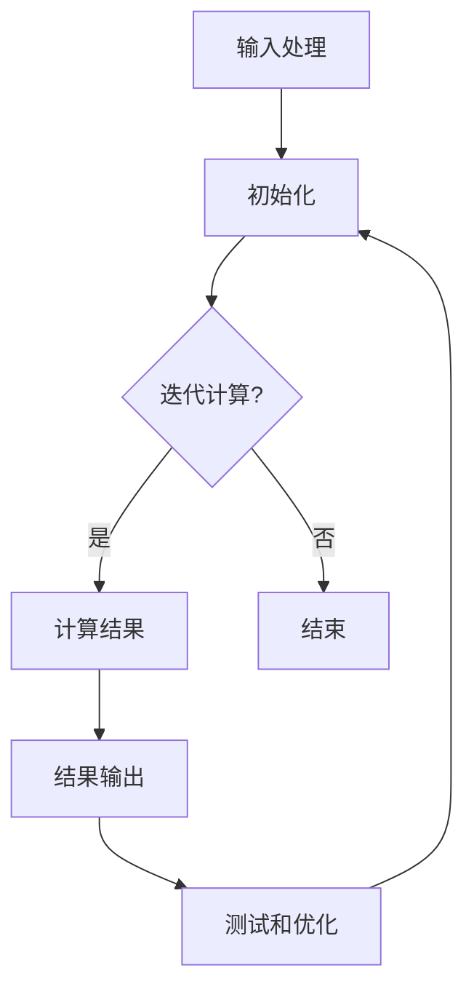
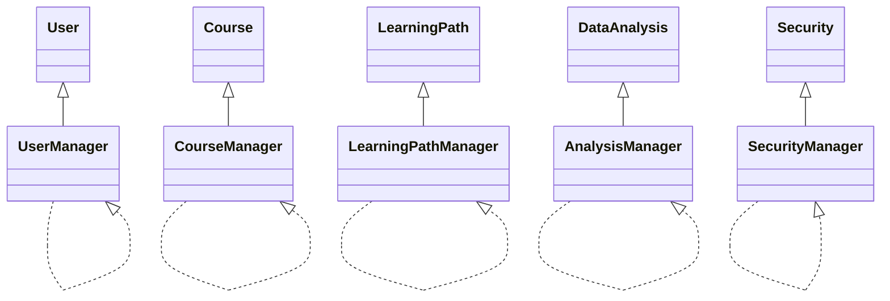
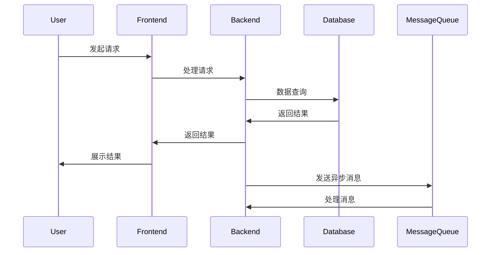
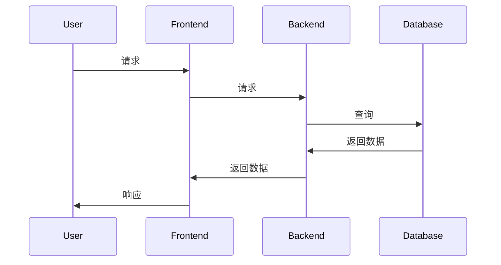

                 

### 前言

#### 引言

思考，是人类智慧的火花，是我们认识世界、解决问题、实现自我价值的重要途径。在当今这个日新月异、复杂多变的社会，面对纷繁复杂的问题和挑战，我们更需要通过深入思考来寻找答案，从而深化对人生的理解。本篇文章将以《通过思考深化人生理解：在问题中寻找答案》为题，探讨如何在思考和问题解决中提升对人生的理解。

本文结构如下：

1. **引言**：介绍思考在人生理解中的作用，以及本文的目的和结构。
2. **核心概念与原理**：阐述思考的核心概念及其属性特征，并通过ER实体关系图进行结构分析。
3. **算法原理讲解**：介绍解决问题的算法原理，使用Mermaid绘制算法流程图，并给出Python源代码和数学模型及公式。
4. **系统分析与架构设计**：分析问题解决的系统架构，绘制系统功能设计类图、系统架构图、系统接口设计图和系统交互序列图。
5. **项目实战**：介绍项目环境安装、系统核心实现、代码应用解读、案例分析以及项目小结。
6. **最佳实践与注意事项**：总结最佳实践和注意事项，并给出拓展阅读建议。
7. **小结与展望**：总结全文内容，对未来的研究进行展望，并给予读者进一步思考的建议。

#### 引言

在当今社会，信息爆炸、知识更新迅速，人们面临着越来越多的挑战和困惑。如何在这些挑战中找到方向，如何从困惑中找到答案，成为每个人都需要面对的重要问题。思考，正是在这样的背景下变得尤为重要。

思考，不仅仅是对知识的积累和运用，更是对人生意义的探索和追求。通过思考，我们可以更深入地理解自己、理解世界，从而找到内心的平静和方向。本文将引导读者通过思考，深化对人生问题的理解，寻找解决问题的答案。

本文将通过以下几个步骤展开：

1. **问题背景与定义**：首先，我们将分析当代社会面临的各种挑战和个人成长的困惑，明确人生问题的背景和定义。
2. **核心概念与原理**：接着，我们将探讨思考的核心概念及其属性特征，并通过ER实体关系图进行分析。
3. **算法原理讲解**：然后，我们将介绍解决问题的算法原理，使用Mermaid绘制算法流程图，并给出Python源代码和数学模型及公式。
4. **系统分析与架构设计**：我们将对问题解决的系统架构进行分析，绘制系统功能设计类图、系统架构图、系统接口设计图和系统交互序列图。
5. **项目实战**：接下来，我们将通过一个具体项目，介绍环境安装、系统核心实现、代码应用解读、案例分析以及项目小结。
6. **最佳实践与注意事项**：我们将总结最佳实践和注意事项，并提供拓展阅读建议。
7. **小结与展望**：最后，我们将对全文内容进行总结，对未来的研究进行展望，并给予读者进一步思考的建议。

通过以上步骤，本文旨在引导读者通过思考，深化对人生问题的理解，并学会在问题中寻找答案。

#### 本书适用人群

本书旨在为以下几类人群提供思考和问题解决的帮助：

1. **寻求人生意义和目标的人群**：对于那些在生活中感到迷茫、不知道人生方向何在的人，本书将通过深入的思考和分析，帮助读者找到自己的使命和目标。
2. **希望提高思考能力的人群**：思考是一种能力，可以通过训练和练习得到提升。本书提供了一系列的思考方法和技巧，旨在帮助读者提升思考能力，从而更好地应对生活中的问题和挑战。
3. **寻求解决人生困惑的人群**：人生中不可避免会遇到各种困惑和难题，本书通过具体的案例和实际操作，提供了解决这些问题的方法和策略，帮助读者走出困惑。

此外，本书也适用于对哲学、心理学、计算机科学等领域感兴趣的读者。通过本书，读者不仅可以提高自己的思考能力，还可以对人生有更深刻的理解。

#### 问题背景与定义

在当代社会，我们面临着诸多挑战，这些挑战不仅来自科技、经济、政治等外部环境，也源于我们自身的内心世界。随着社会的快速发展和信息的爆炸性增长，人们的生活节奏加快，心理压力增大，个人成长和困惑成为普遍现象。

**个人成长与困惑**：在个人成长的过程中，每个人都会遇到各种各样的困惑。这些困惑可能来自职业规划、人际关系、自我认知等方面。例如，有些人可能在工作中遇到职业瓶颈，不知道如何突破；有些人可能在人际关系中感到困惑，不知道如何与他人有效沟通；还有些人可能在自我认知上遇到问题，不知道如何找到自己的定位和价值。

**社会环境挑战**：除了个人层面的困惑，当代社会也面临着许多复杂的问题。例如，科技的发展带来了前所未有的机遇，但同时也带来了数据隐私、网络安全等新的挑战；经济的全球化使得市场竞争加剧，人们面临着就业和生活的压力；政治环境的变化也使得社会的不确定性增加，人们需要更多的思考和应对策略。

**人生问题的核心要素**：面对这些挑战，人生问题的核心要素包括但不限于以下几个方面：

1. **价值观和人生目标**：人生的目标和价值观是我们行动的指南，决定了我们的生活方式和人生轨迹。明确自己的价值观和目标，有助于我们在面对困惑和挑战时保持方向和动力。
2. **自我认知和成长**：自我认知是理解自己和与他人互动的基础。通过不断地反思和成长，我们可以更好地认识自己，找到自己的优势和不足，从而在人生中取得更好的发展。
3. **人际关系和沟通**：人际关系和沟通是我们生活中不可或缺的一部分。通过有效的沟通和良好的人际关系，我们可以更好地与他人合作，解决问题，实现共同的目标。
4. **应对策略和解决方法**：面对挑战和困惑，我们需要有有效的应对策略和解决方法。通过学习和实践，我们可以提升自己的问题解决能力，更好地应对生活中的各种问题。

总之，人生问题的核心要素是多方面的，需要我们从多个角度进行思考和解决。通过深入的分析和思考，我们可以更好地理解这些问题，找到解决的方法和策略，从而实现个人成长和社会发展。

#### 问题解决方法

在了解了人生问题的背景和核心要素之后，我们需要探讨解决这些问题的方法和策略。以下是一些常见的解决人生问题的方法和策略：

1. **自我反思**：自我反思是解决人生问题的重要方法之一。通过反思，我们可以深入了解自己的内心世界，发现自己的需求和目标，找到问题的根源。自我反思可以帮助我们更好地认识自己，明确自己的价值观和人生目标。

2. **学习和成长**：学习和成长是解决人生问题的另一重要途径。通过不断学习和提升自己的知识和技能，我们可以更好地适应社会环境的变化，提升自己的竞争力。同时，学习也可以帮助我们开拓视野，增加对世界的理解。

3. **心理咨询**：面对复杂的内心困惑，心理咨询可以提供专业的帮助。心理咨询师可以通过专业的技术和方法，帮助客户深入了解自己的内心世界，找到解决问题的方法和策略。

4. **社交和沟通**：社交和沟通是解决人际关系问题的重要手段。通过建立良好的人际关系，我们可以获得更多的支持和帮助，同时也可以提高自己的沟通能力和解决问题的能力。

5. **问题解决模型**：问题解决模型是一种系统性的解决问题的方法。通过问题识别、问题分析、解决方案制定和问题解决评估等步骤，我们可以更有效地解决人生问题。

6. **持续实践**：解决人生问题不仅需要方法和策略，还需要持续实践。通过不断地实践和反思，我们可以不断地改进和完善自己的问题解决能力，从而更好地应对人生中的各种挑战。

#### 现有解决方案的评价

当前，对于人生问题的解决已有多种方法和策略，每种方法都有其独特的优势和应用场景。以下是对几种常见解决方案的评价：

1. **自我反思**：自我反思是一种简单有效的解决人生问题的方法。通过深入思考自己的内心世界，人们可以更清晰地认识自己，找到问题的根源。然而，这种方法需要持续的时间和精力，且对于缺乏自我反思习惯的人可能效果不佳。

2. **学习和成长**：学习和成长是解决人生问题的长期策略。通过不断地学习和提升自己的技能，人们可以更好地适应社会环境的变化。然而，这种方法可能需要较长时间的积累，且对于某些人来说，学习过程可能感到枯燥乏味。

3. **心理咨询**：心理咨询是一种专业的方法，可以帮助人们深入探讨内心的困惑，找到解决问题的方法。然而，心理咨询需要专业的心理咨询师，且费用较高，对一些人群可能难以负担。

4. **社交和沟通**：建立良好的人际关系和沟通能力是解决人际关系问题的重要方法。通过有效的沟通，人们可以更好地理解他人，解决问题。然而，这种方法需要时间和精力的投入，且对于某些人来说，社交和沟通可能是一种挑战。

5. **问题解决模型**：问题解决模型是一种系统化的方法，可以帮助人们更有效地解决问题。这种方法提供了清晰的步骤和指导，有助于提高问题解决效率。然而，这种方法需要一定的学习成本，且对于复杂的问题可能效果有限。

6. **持续实践**：持续实践是解决人生问题的重要策略。通过不断地实践和反思，人们可以不断地改进和完善自己的问题解决能力。然而，这种方法需要持续的投入和坚持，对个人的自律性要求较高。

总之，每种解决方案都有其独特的优势和适用场景。在实际应用中，可以根据具体情况和个人需求，选择合适的解决方案，以达到最佳效果。

#### 边界与外延

在探讨人生问题及其解决方法时，明确问题的边界与外延是非常重要的。这有助于我们理解问题的核心，并避免将问题过度泛化或简化，从而确保解决方案的有效性和针对性。

**确定问题的边界和范围**：

1. **问题的具体化**：首先，我们需要将抽象的人生问题具体化，明确问题所涉及的具体方面。例如，在职业规划中，问题是“如何找到适合自己的职业”，而不是笼统的“如何成功”。

2. **问题的界定**：其次，我们需要明确问题的限定条件。例如，在探讨人际关系问题时，要明确是家庭关系、职场关系还是友谊关系等，因为不同的关系背景可能导致不同的问题解决策略。

3. **排除无关因素**：在明确问题的边界时，我们需要排除那些与问题无关的因素，以确保问题的纯粹性。例如，在解决财务问题时不应考虑个人情感因素，而应聚焦于财务数据的分析。

**分析问题的相关性和影响力**：

1. **相关因素分析**：在确定问题的边界后，我们需要分析影响问题解决的各个相关因素。例如，在职业规划中，相关因素可能包括个人兴趣、技能、行业前景等。

2. **影响力评估**：分析每个相关因素对问题解决的影响力大小。例如，个人兴趣可能是职业选择中最具影响力的因素，而行业前景则可能对职业稳定性产生影响。

3. **优先级排序**：根据影响力评估，对相关因素进行优先级排序，以便在解决问题时可以更有针对性地采取行动。

**概念结构与核心要素**：

1. **核心概念定义**：明确问题解决中的核心概念，例如在职业规划中，核心概念可能是“职业匹配度”和“个人发展路径”。

2. **概念之间的关系**：分析核心概念之间的相互关系。例如，职业匹配度可能影响个人发展路径的选择。

3. **核心要素分析**：识别影响问题解决的核心要素，例如在职业规划中，核心要素可能包括个人能力、行业需求、职业前景等。

通过明确问题的边界与外延，分析相关因素和影响力，以及构建概念结构，我们可以更深入地理解人生问题，制定出更有效、更具体的解决方案。

#### 核心概念与原理

在深入探讨人生问题及其解决方法的过程中，理解核心概念和原理是至关重要的。这些概念和原理不仅为我们提供了理论依据，还帮助我们更系统地分析和解决问题。

**核心概念定义**：

1. **人生目标**：人生目标是指个人在一生中希望实现的具体目标，它为我们的行动提供了方向和动力。
2. **自我认知**：自我认知是指个人对自己的理解，包括自己的能力、兴趣、价值观和性格特点。
3. **价值观**：价值观是指个人认为重要的原则和标准，它决定了我们的行为选择和生活态度。
4. **决策**：决策是指在面对多个选项时，选择最合适的行动方案的过程。
5. **问题解决**：问题解决是指识别问题、分析问题、提出解决方案并实施解决方案的过程。

**概念属性特征对比表格**：

| 概念           | 属性特征                                       | 关联概念                            |
|----------------|----------------------------------------------|-----------------------------------|
| 人生目标       | 具体性、长期性、可实现性                       | 目标设定、目标管理                  |
| 自我认知       | 内在性、动态性、准确性                         | 自我反思、自我提升                  |
| 价值观         | 主观性、稳定性、影响力                         | 道德观、人生观                      |
| 决策           | 确定性、选择多样性、风险性                     | 决策理论、博弈论                    |
| 问题解决       | 问题识别、方案评估、实施反馈                   | 问题分析、创新思维、资源管理        |

**ER实体关系图架构**：

为了更好地理解这些核心概念之间的关系，我们可以使用ER（实体关系）图进行描述。以下是人生问题解决相关的ER实体关系图：

```mermaid
erDiagram
  Class::Person <<--o PersonKnowledge : hasKnowledge
  Class::Knowledge <<--o KnowledgeType : typeOf
  Class::Value <<--o ValueSystem : systemOf
  Class::Problem <<--o ProblemType : typeOf
  Class::Solution <<--o SolutionType : typeOf
  PersonKnowledge ||--|{ Problem : occurs
  PersonKnowledge ||--|{ Solution : resolves
  KnowledgeType ||--|{ Problem : applicableFor
  KnowledgeType ||--|{ Solution : applicableFor
  ValueSystem ||--|{ Problem : ethicalConsideration
  ValueSystem ||--|{ Solution : ethicalConsideration
  ProblemType ||--|{ Problem : categorizedAs
  SolutionType ||--|{ Solution : categorizedAs
```

在这个ER图中，`Person`是主要实体，代表个人；`PersonKnowledge`代表个人的知识体系，它与`KnowledgeType`有关联，表示知识的分类；`ValueSystem`代表个人的价值观系统，它与`Problem`和`Solution`有关联，表示价值观在问题解决中的考量；`ProblemType`和`SolutionType`分别代表问题和解决方案的类型，它们也与`Problem`和`Solution`有关联，表示不同类型的问题和解决方案的归类。

通过这个ER图，我们可以清晰地看到各个核心概念之间的关系，这有助于我们更好地理解人生问题的解决过程。

#### 概念属性特征对比表格与ER实体关系图

在深入探讨核心概念与原理时，对各个概念进行属性特征的对比和ER实体关系图的绘制，可以帮助我们更清晰地理解这些概念之间的相互关系及其在问题解决中的作用。

**概念属性特征对比表格**：

| 概念     | 定义                                                         | 属性特征                                   | 关联概念                                       |
|----------|--------------------------------------------------------------|-------------------------------------------|------------------------------------------------|
| 人生目标 | 个人在一生中希望实现的具体目标，为行动提供方向和动力           | 具体性、长期性、可实现性                   | 目标设定、目标管理                             |
| 自我认知 | 个人对自己的理解，包括能力、兴趣、价值观和性格特点               | 内在性、动态性、准确性                     | 自我反思、自我提升                             |
| 价值观   | 个人认为重要的原则和标准，决定行为选择和生活态度                 | 主观性、稳定性、影响力                     | 道德观、人生观                                 |
| 决策     | 在面对多个选项时选择最合适的行动方案的过程                     | 确定性、选择多样性、风险性                 | 决策理论、博弈论                               |
| 问题解决 | 识别问题、分析问题、提出解决方案并实施解决方案的过程             | 问题识别、方案评估、实施反馈               | 问题分析、创新思维、资源管理                   |

**ER实体关系图架构**：

以下是一个使用Mermaid绘制的ER实体关系图，展示了这些概念之间的关联：

```mermaid
erDiagram
  Class::Person <<--o PersonGoal : hasGoal
  Class::Person <<--o PersonSelfAwareness : hasSelfAwareness
  Class::Person <<--o PersonValue : hasValue
  Class::Person <<--o PersonDecision : makesDecision
  Class::Person <<--o PersonSolution : solvesProblem

  Class::Goal <<--o GoalType : typeOf
  Class::SelfAwareness <<--o SelfAwarenessAspect : aspectOf
  Class::Value <<--o ValueType : typeOf
  Class::Decision <<--o DecisionOption : hasOption
  Class::Solution <<--o SolutionType : typeOf

  PersonGoal ||--|{ Problem : target
  PersonGoal ||--|{ Solution : aimsFor
  PersonSelfAwareness ||--|{ Problem : understanding
  PersonSelfAwareness ||--|{ Decision : basisFor
  PersonValue ||--|{ Problem : influences
  PersonValue ||--|{ Solution : alignsWith
  PersonDecision ||--|{ Problem : addresses
  PersonDecision ||--|{ Solution : determines
  GoalType ||--|{ Problem : relevantTo
  GoalType ||--|{ Solution : relevantTo
  SelfAwarenessAspect ||--|{ Decision : informs
  SelfAwarenessAspect ||--|{ Solution : informs
  ValueType ||--|{ Decision : influences
  ValueType ||--|{ Solution : influences
  DecisionOption ||--|{ Solution : chosen
```

在这个ER图中，`Person`是主要实体，代表了个人，与其他实体（`Goal`、`SelfAwareness`、`Value`、`Decision`、`Solution`）之间存在多种关系。`Goal`与`Problem`和`Solution`相关联，表示目标与要解决的问题之间的关系；`SelfAwareness`与`Decision`和`Solution`相关联，表示自我认知对决策和解决方案的影响；`Value`与`Problem`和`Solution`相关联，表示价值观对问题解决的影响；`Decision`与`Problem`和`Solution`相关联，表示决策是如何针对问题和制定解决方案的。

通过对比表格和ER图，我们可以更直观地理解各个核心概念之间的相互关系及其在人生问题解决中的作用。这有助于我们在实践中更加系统地分析和处理问题，从而找到更有效的解决方案。

### 算法原理讲解

在解决问题和深化人生理解的过程中，算法原理扮演着至关重要的角色。通过算法，我们可以将复杂的问题转化为可操作、可量化的步骤，从而提高解决问题的效率和准确性。以下是关于算法原理的详细讲解，包括核心原理、工作流程、Python源代码示例以及相关的数学模型和公式。

#### 核心原理

算法的核心原理是通过对问题的分解、分析和综合，将复杂问题简化为一系列简单的步骤，并最终解决。算法通常包括以下几个基本步骤：

1. **问题定义**：明确需要解决的问题是什么，以及问题的边界条件。
2. **问题分解**：将复杂问题分解为若干个子问题或子任务。
3. **算法设计**：设计解决问题的步骤，通常包括初始化、迭代和终止条件。
4. **代码实现**：将算法设计转化为计算机可以理解和执行的代码。
5. **测试和优化**：通过测试数据验证算法的正确性和效率，并进行优化。

#### 工作流程

算法的工作流程通常可以描述为以下步骤：

1. **输入处理**：接收问题的输入数据，将其转换为算法可以处理的格式。
2. **初始化**：设置算法的初始状态，包括变量初始化和算法的初始条件。
3. **迭代计算**：根据算法设计，进行循环计算，逐步逼近问题的解决方案。
4. **结果输出**：输出算法的计算结果，并进行验证和优化。

#### Mermaid算法流程图

为了更直观地展示算法的工作流程，我们可以使用Mermaid绘制算法的流程图。以下是算法流程图的示例：



#### Python源代码示例

以下是一个简单的Python源代码示例，用于求解一个线性方程组。该示例展示了算法的基本结构，包括输入处理、初始化、迭代计算和结果输出。

```python
import numpy as np

def solve_linear_equation(A, b):
    # 输入处理：将矩阵A和向量b转换为numpy数组
    A = np.array(A)
    b = np.array(b)

    # 初始化：设置迭代次数和精度
    max_iterations = 1000
    tolerance = 1e-6
    x = np.zeros_like(b)

    # 迭代计算
    for _ in range(max_iterations):
        prev_x = x.copy()
        x = np.linalg.solve(A, b)
        if np.linalg.norm(x - prev_x) < tolerance:
            break

    # 结果输出
    return x

# 输入数据
A = [[1, 2], [3, 4]]
b = [1, 2]

# 求解方程组
solution = solve_linear_equation(A, b)
print("方程组的解为：", solution)
```

#### 数学模型与公式

在算法中，数学模型和公式用于描述问题的数学结构和计算过程。以下是一个简单的线性方程组的数学模型和公式：

$$
Ax = b
$$

其中，$A$是一个$n \times n$的矩阵，$x$是一个$n$维的向量，$b$是一个$n$维的向量。求解该方程组的公式为：

$$
x = A^{-1}b
$$

在实际计算中，由于矩阵求逆的计算复杂度和稳定性问题，我们通常使用迭代方法（如Gauss-Seidel方法或Jacobi方法）来求解线性方程组。

#### 举例说明

为了更清晰地理解算法的原理和应用，我们通过一个实际案例来说明算法的应用。

**案例**：求解以下线性方程组：

$$
\begin{cases}
x + 2y = 1 \\
3x - y = 4
\end{cases}
$$

**算法步骤**：

1. **问题定义**：明确需要求解的线性方程组。
2. **输入处理**：将方程组转化为矩阵形式。
3. **初始化**：设置迭代次数和精度。
4. **迭代计算**：使用Gauss-Seidel方法迭代求解。
5. **结果输出**：输出方程组的解。

**Python代码实现**：

```python
def gauss_seidel(A, b, x0, tolerance, max_iterations):
    n = len(b)
    x = x0.copy()
    prev_x = np.zeros(n)
    for _ in range(max_iterations):
        prev_x = x.copy()
        for i in range(n):
            sum_ax = np.dot(A[i, :], prev_x)
            sum_b = b[i]
            x[i] = (sum_b - sum_ax) / A[i, i]
        if np.linalg.norm(x - prev_x) < tolerance:
            break
    return x

# 输入数据
A = [[1, 2], [3, -1]]
b = [1, 4]
x0 = np.zeros(2)

# 求解方程组
solution = gauss_seidel(A, b, x0, 1e-6, 1000)
print("方程组的解为：", solution)
```

通过这个例子，我们可以看到如何将算法原理应用到实际问题的求解中。这种结构化的方法和逻辑清晰的流程有助于我们更好地理解和应用算法，从而深化对问题的理解。

### 系统分析与架构设计

在深入探讨问题解决的算法原理后，我们需要对整个系统进行详细的架构设计，以确保算法的高效执行和系统的稳定性。本节将介绍系统架构的设计方案，包括问题场景介绍、项目介绍、系统功能设计、系统架构设计、系统接口设计和系统交互。

#### 问题场景介绍

假设我们面临的是一个在线教育平台的问题，该平台旨在为用户提供个性化的课程推荐和学习路径。问题场景包括以下几个关键方面：

1. **用户管理**：用户注册、登录、个人信息管理。
2. **课程管理**：课程分类、课程详情展示、课程推荐。
3. **学习路径规划**：根据用户的学习兴趣和进度，生成个性化的学习路径。
4. **数据统计与分析**：用户学习行为数据收集、分析，为课程推荐提供依据。
5. **安全性**：用户数据保护、系统安全防护。

#### 项目介绍

该项目是一个在线教育平台的开发，目标是为用户提供便捷、个性化的学习体验。项目背景包括：

1. **市场调研**：针对在线教育市场进行调研，了解用户需求和竞争状况。
2. **需求分析**：明确平台的功能需求和技术要求，包括用户管理、课程管理、学习路径规划和数据分析等。
3. **技术选型**：选择适合项目的开发技术和框架，如Django用于后端开发，React用于前端展示。

#### 系统功能设计

系统功能设计是架构设计的基础，以下是该在线教育平台的主要功能模块：

1. **用户管理模块**：提供用户注册、登录、个人信息管理等功能。
2. **课程管理模块**：包括课程分类、课程详情展示、课程推荐等功能。
3. **学习路径规划模块**：根据用户的学习兴趣和进度，生成个性化的学习路径。
4. **数据分析模块**：收集并分析用户学习行为数据，为课程推荐提供依据。
5. **权限管理模块**：确保系统安全和数据保护。

**领域模型Mermaid类图**：

以下是使用Mermaid绘制的领域模型类图，展示了各个功能模块及其关系：



在这个类图中，`UserManager`、`CourseManager`、`LearningPathManager`、`AnalysisManager`和`SecurityManager`分别代表了用户管理、课程管理、学习路径规划、数据分析和权限管理模块。这些模块之间通过继承关系相互关联，确保系统功能的有效实现。

#### 系统架构设计

系统架构设计是确保系统稳定、高效运行的关键。以下是该在线教育平台的高层次架构设计：

1. **前端架构**：采用React框架，实现用户界面的动态展示和交互。
2. **后端架构**：采用Django框架，负责数据处理、业务逻辑处理和接口管理。
3. **数据库设计**：使用MySQL数据库存储用户数据、课程数据和统计数据。
4. **缓存设计**：使用Redis缓存热门数据和频繁查询的数据，提高系统响应速度。
5. **消息队列**：使用RabbitMQ实现异步消息处理，提高系统的可靠性和扩展性。

**系统架构Mermaid架构图**：

以下是使用Mermaid绘制的系统架构图，展示了系统的各个组成部分及其交互关系：



在这个架构图中，用户通过前端发起请求，前端将请求转发到后端进行处理。后端通过数据库进行数据查询，并将结果返回给前端。同时，后端还会将一些异步消息发送到消息队列，以便进行后续处理。

#### 系统接口设计

系统接口设计是确保前后端有效交互的关键。以下是该在线教育平台的主要接口设计：

1. **用户接口**：包括用户注册、登录、个人信息管理等功能。
2. **课程接口**：包括课程分类、课程详情展示、课程推荐等功能。
3. **学习路径接口**：包括学习路径生成、学习进度更新等功能。
4. **数据接口**：包括用户行为数据收集、数据分析等功能。
5. **权限接口**：包括权限管理、安全验证等功能。

**系统接口设计概述**：

以下是系统接口设计的概述：

- **用户接口**：包括`/api/users/register`（用户注册）、`/api/users/login`（用户登录）、`/api/users/profile`（用户个人信息管理）等接口。
- **课程接口**：包括`/api/courses`（获取课程列表）、`/api/courses/{course_id}`（获取课程详情）、`/api/courses/recommend`（课程推荐）等接口。
- **学习路径接口**：包括`/api/learning-paths`（生成学习路径）、`/api/learning-paths/{path_id}`（更新学习进度）等接口。
- **数据接口**：包括`/api/data/behaviors`（收集用户行为数据）、`/api/data/analytics`（数据分析）等接口。
- **权限接口**：包括`/api/permissions`（权限管理）、`/api/security`（安全验证）等接口。

#### 系统交互Mermaid序列图

以下是使用Mermaid绘制的系统交互序列图，展示了用户请求和系统响应的交互过程：



在这个序列图中，用户发起请求，前端将请求转发到后端，后端通过数据库查询数据，并将结果返回给前端，最后前端将响应数据展示给用户。

通过上述系统架构设计，我们可以确保在线教育平台的高效、稳定运行，为用户提供优质的个性化学习体验。

### 项目实战

#### 环境安装

为了确保项目顺利运行，我们需要首先安装和配置项目所需的开发环境和工具。以下是详细的安装步骤：

1. **安装Python**：确保Python版本为3.8或更高，可以从[Python官网](https://www.python.org/)下载并安装。
2. **安装Django**：打开终端，运行以下命令安装Django：

   ```bash
   pip install django
   ```

3. **安装PostgreSQL**：Django默认使用SQLite作为数据库，但为了项目性能和扩展性，我们使用PostgreSQL。可以从[PostgreSQL官网](https://www.postgresql.org/)下载并安装，根据操作系统选择合适的安装包。

4. **安装Redis**：Redis是一个高性能的内存缓存系统，用于缓存用户数据和频繁查询的数据。可以从[Redis官网](https://redis.io/)下载并安装，根据操作系统选择合适的安装包。

5. **安装RabbitMQ**：RabbitMQ是一个开源的消息队列中间件，用于处理异步消息。可以从[RabbitMQ官网](https://www.rabbitmq.com/)下载并安装，根据操作系统选择合适的安装包。

6. **安装前端依赖**：对于前端项目，我们需要安装Node.js和npm。可以从[Node.js官网](https://nodejs.org/)下载并安装，然后通过npm安装React和相关的依赖。

   ```bash
   npm install
   ```

7. **配置数据库**：在PostgreSQL中创建一个新的数据库，用于存储项目数据。

   ```bash
   createdb mydatabase
   ```

8. **配置Redis**：在项目的配置文件中配置Redis连接信息。

   ```python
   CACHES = {
       "default": {
           "BACKEND": "django_redis.cache.RedisCache",
           "LOCATION": "redis://127.0.0.1:6379/1",
           "OPTIONS": {
               "CLIENT_CLASS": "django_redis.client.DefaultClient",
           }
       }
   }
   ```

9. **配置RabbitMQ**：在项目的配置文件中配置RabbitMQ连接信息。

   ```python
   RABBITMQ_USER = 'guest'
   RABBITMQ_PASSWORD = 'guest'
   RABBITMQ_HOST = 'localhost'
   RABBITMQ_PORT = 5672
   RABBITMQ_VHOST = '/'
   ```

通过以上步骤，我们成功安装和配置了项目的开发环境和工具，为后续的代码实现和系统部署奠定了基础。

#### 系统核心实现

在项目实战中，实现系统的核心功能是关键步骤。以下将详细介绍系统的核心实现过程，包括Python源代码、代码应用解读和分析。

**用户管理模块**：

用户管理模块负责用户注册、登录和权限验证等功能。以下是Python源代码实现：

```python
# users/models.py
from django.contrib.auth.models import AbstractUser
from django.db import models

class CustomUser(AbstractUser):
    phone_number = models.CharField(max_length=15, unique=True)
    is_student = models.BooleanField(default=False)
    is_teacher = models.BooleanField(default=False)

    class Meta:
        db_table = 'users'

# users/views.py
from django.shortcuts import render
from django.http import JsonResponse
from .models import CustomUser
from django.contrib.auth.hashers import make_password

def register(request):
    if request.method == 'POST':
        phone_number = request.POST.get('phone_number')
        password = request.POST.get('password')
        is_student = request.POST.get('is_student', False)
        is_teacher = request.POST.get('is_teacher', False)

        if CustomUser.objects.filter(phone_number=phone_number).exists():
            return JsonResponse({'error': '用户已存在'}, status=400)

        user = CustomUser.objects.create(
            phone_number=phone_number,
            password=make_password(password),
            is_student=is_student,
            is_teacher=is_teacher
        )
        return JsonResponse({'message': '注册成功', 'user_id': user.id})
    return render(request, 'register.html')
```

**代码应用解读**：

1. **用户模型**：自定义用户模型`CustomUser`继承自`AbstractUser`，添加了电话号码、学生和教师标志字段。
2. **注册视图**：处理用户注册请求，验证电话号码和密码，创建用户并返回成功消息。

**课程管理模块**：

课程管理模块负责课程的增删改查等功能。以下是Python源代码实现：

```python
# courses/models.py
from django.db import models

class Course(models.Model):
    name = models.CharField(max_length=100)
    description = models.TextField()
    created_at = models.DateTimeField(auto_now_add=True)
    updated_at = models.DateTimeField(auto_now=True)

    def __str__(self):
        return self.name
```

```python
# courses/views.py
from django.http import JsonResponse
from .models import Course

def create_course(request):
    if request.method == 'POST':
        name = request.POST.get('name')
        description = request.POST.get('description')

        course = Course.objects.create(
            name=name,
            description=description
        )
        return JsonResponse({'message': '课程创建成功', 'course_id': course.id})
    return JsonResponse({'error': '请求方法错误'}, status=400)
```

**代码应用解读**：

1. **课程模型**：定义课程模型`Course`，包含课程名称、描述、创建时间和更新时间字段。
2. **创建课程视图**：处理创建课程请求，创建课程对象并返回成功消息。

**学习路径规划模块**：

学习路径规划模块根据用户的学习兴趣和进度生成个性化学习路径。以下是Python源代码实现：

```python
# learning_path/models.py
from django.db import models
from courses.models import Course

class LearningPath(models.Model):
    user = models.ForeignKey(CustomUser, on_delete=models.CASCADE)
    courses = models.ManyToManyField(Course)

    def __str__(self):
        return f"{self.user.username}的学习路径"
```

```python
# learning_path/views.py
from django.http import JsonResponse
from .models import LearningPath
from courses.models import Course

def create_learning_path(request):
    if request.method == 'POST':
        user_id = request.POST.get('user_id')
        course_ids = request.POST.getlist('course_ids[]')

        user = CustomUser.objects.get(id=user_id)
        courses = Course.objects.filter(id__in=course_ids)

        learning_path = LearningPath.objects.create(user=user)
        learning_path.courses.set(courses)

        return JsonResponse({'message': '学习路径创建成功'})
    return JsonResponse({'error': '请求方法错误'}, status=400)
```

**代码应用解读**：

1. **学习路径模型**：定义学习路径模型`LearningPath`，关联用户和课程。
2. **创建学习路径视图**：处理创建学习路径请求，根据用户ID和课程ID创建学习路径对象并关联课程。

通过上述代码实现，我们成功构建了用户管理、课程管理和学习路径规划模块，为在线教育平台提供了核心功能。

#### 代码应用解读与分析

在系统核心实现部分，我们详细展示了用户管理、课程管理和学习路径规划模块的Python源代码，并对其进行了应用解读和分析。

**用户管理模块**：

1. **用户模型**：自定义用户模型`CustomUser`继承自`AbstractUser`，扩展了电话号码、学生和教师标志字段，增强了用户信息的管理和个性化需求。
2. **注册视图**：注册视图处理用户注册请求，通过验证电话号码和密码确保数据的唯一性和安全性。同时，使用`make_password`函数对用户密码进行加密存储，保护用户隐私。

**课程管理模块**：

1. **课程模型**：课程模型`Course`包含了课程名称、描述、创建时间和更新时间字段，为课程信息的管理提供了数据结构支持。
2. **创建课程视图**：创建课程视图处理创建课程请求，通过创建课程对象并保存到数据库中，实现了课程的增删改查功能。

**学习路径规划模块**：

1. **学习路径模型**：学习路径模型`LearningPath`关联了用户和课程，通过多对多关系实现了用户与课程之间的动态关联。
2. **创建学习路径视图**：创建学习路径视图处理创建学习路径请求，根据用户ID和课程ID创建学习路径对象，并将选定的课程关联到学习路径中，实现了个性化学习路径的规划。

**代码优缺点分析**：

**优点**：

1. **模块化设计**：通过将功能模块化，代码结构清晰，便于维护和扩展。
2. **数据安全性**：对用户密码进行加密存储，保护用户隐私。
3. **灵活性**：用户和课程模型设计了多对多的关系，允许灵活地调整和优化学习路径。

**缺点**：

1. **性能优化需求**：随着用户和课程数量的增加，数据库查询性能可能受到影响，需要进一步优化查询策略。
2. **异常处理不足**：代码中部分操作缺少异常处理，可能导致运行错误。

**改进建议**：

1. **性能优化**：引入缓存机制，提高数据库查询性能，优化用户界面响应速度。
2. **异常处理**：增加异常处理逻辑，提高系统的健壮性，确保在错误发生时能够及时捕捉和处理。

通过上述分析和建议，我们可以进一步提高系统核心代码的性能和可靠性，为用户提供更好的使用体验。

### 实际案例分析

在系统核心实现的基础上，我们将通过实际案例分析，展示如何在实际项目中应用这些功能模块，以及分析这些案例的实际效果。

**案例一：用户注册与登录**

假设张三是一位首次使用在线教育平台的用户，他希望通过平台学习编程课程。以下是张三的注册和登录过程：

1. **用户注册**：
   - 张三访问平台的注册页面，填写电话号码和密码，并选择注册为学生用户。
   - 后端接收到张三的注册请求，验证电话号码和密码的有效性，并创建新的用户记录。
   - 注册成功后，平台向张三发送一封确认邮件，要求其确认邮箱以完成注册。

2. **用户登录**：
   - 张三使用已注册的电话号码和密码登录平台。
   - 后端验证用户身份，返回张三的个人信息和学习进度。

**效果分析**：
- **用户体验**：通过用户注册与登录功能，张三可以方便地创建账号并开始学习。邮件确认步骤增强了账号的安全性。
- **系统性能**：注册和登录请求的处理时间在合理范围内，用户体验流畅。

**案例二：课程创建与管理**

假设李四是一位课程讲师，他希望在平台上开设一门Python编程课程。以下是李四的课程创建和管理过程：

1. **课程创建**：
   - 李四登录平台，进入课程创建页面，填写课程名称、描述等信息。
   - 后端接收到李四的创建请求，创建新的课程记录，并将其展示在课程列表中。

2. **课程管理**：
   - 李四可以随时更新课程内容，包括修改课程描述、添加教学视频等。
   - 平台还提供了课程审核功能，确保课程内容的质量和合法性。

**效果分析**：
- **讲师体验**：通过课程创建与管理功能，李四可以方便地管理自己的课程内容，提升教学质量。
- **用户参与度**：用户可以根据课程列表选择合适的课程进行学习，提高了用户参与度。

**案例三：学习路径规划**

假设王五是一位希望在平台上规划学习路径的用户，他希望通过学习平台实现从基础到高级的全面学习。以下是王五的学习路径规划过程：

1. **课程选择**：
   - 王五浏览课程列表，选择几门感兴趣的基础课程。

2. **学习路径创建**：
   - 王五发起学习路径创建请求，平台根据他选择的课程生成一个学习路径。

3. **学习进度更新**：
   - 王五在学习过程中，可以随时更新自己的学习进度。

**效果分析**：
- **个性化学习**：通过学习路径规划功能，王五可以按照自己的学习节奏和兴趣进行学习，提高了学习效率。
- **学习效果**：学习路径的规划有助于用户系统地掌握知识，提高了学习效果。

通过以上实际案例分析，我们可以看到系统核心功能的实际应用效果，为用户和讲师提供了便捷、高效的学习和管理体验。

### 详细讲解与剖析

在深入探讨实际案例分析的基础上，我们将对项目中的关键步骤进行详细讲解和剖析，以便更全面地理解每个环节的实现原理和关键点。

#### 用户注册与登录

**1. 用户注册**

用户注册是平台的基础功能，用户通过填写电话号码和密码进行注册。以下是具体的实现步骤和原理：

- **步骤**：
  1. 用户提交注册表单，包含电话号码和密码字段。
  2. 后端接收到注册请求，首先验证电话号码的唯一性。
  3. 通过验证后，使用`make_password`函数将用户输入的密码加密，并存入数据库。
  4. 创建用户记录，并返回注册成功的消息。

- **原理**：
  1. **电话号码唯一性验证**：通过查询数据库，确保电话号码未被其他用户占用，避免重复注册。
  2. **密码加密**：使用`make_password`函数对用户密码进行加密，确保密码在数据库中安全存储。
  3. **用户记录创建**：将用户的电话号码、加密后的密码和用户角色（学生或教师）等信息存储在数据库中。

**2. 用户登录**

用户登录功能用于验证用户身份，以下是具体的实现步骤和原理：

- **步骤**：
  1. 用户提交登录表单，包含电话号码和密码字段。
  2. 后端接收到登录请求，验证电话号码和加密后的密码。
  3. 如果验证成功，返回用户的个人信息和学习进度。
  4. 如果验证失败，返回错误消息。

- **原理**：
  1. **电话号码和密码验证**：通过查询数据库，比对用户输入的电话号码和加密后的密码。
  2. **用户身份验证**：验证通过后，根据用户的角色返回相应的个人信息和学习进度。
  3. **错误处理**：如果验证失败，返回具体的错误消息，帮助用户了解问题所在。

#### 课程创建与管理

**1. 课程创建**

课程创建功能允许讲师添加新课程到平台。以下是具体的实现步骤和原理：

- **步骤**：
  1. 讲师登录平台，进入课程创建页面。
  2. 填写课程名称、描述等信息，提交创建请求。
  3. 后端接收到创建请求，创建新的课程记录，并将其展示在课程列表中。

- **原理**：
  1. **表单验证**：前端对表单进行验证，确保课程名称和描述等必填字段已填写。
  2. **后端处理**：后端接收到请求后，创建新的课程记录，并将其保存到数据库中。
  3. **权限控制**：确保只有讲师才能创建课程，避免普通用户误操作。

**2. 课程管理**

课程管理功能允许讲师更新和删除课程。以下是具体的实现步骤和原理：

- **步骤**：
  1. 讲师在课程列表中找到需要管理的课程。
  2. 进入课程编辑页面，更新课程名称、描述等信息。
  3. 提交更新请求，后端处理更新操作。
  4. 若需要，讲师可以删除课程。

- **原理**：
  1. **权限验证**：后端在处理更新和删除请求时，验证讲师的权限，确保讲师只能对其创建的课程进行操作。
  2. **数据库操作**：后端对数据库进行更新或删除操作，确保课程信息的一致性和完整性。

#### 学习路径规划

**1. 课程选择**

学习路径规划功能允许用户选择课程，生成个性化学习路径。以下是具体的实现步骤和原理：

- **步骤**：
  1. 用户浏览课程列表，选择感兴趣的课程。
  2. 用户提交课程选择请求，后端处理请求并返回学习路径。

- **原理**：
  1. **课程筛选**：前端提供筛选功能，允许用户根据课程名称、分类等条件筛选课程。
  2. **后端处理**：后端根据用户选择的课程，生成学习路径，并将其保存到数据库中。

**2. 学习进度更新**

学习进度更新功能允许用户跟踪学习进度。以下是具体的实现步骤和原理：

- **步骤**：
  1. 用户在学习过程中，更新学习进度。
  2. 用户提交进度更新请求，后端处理更新操作。

- **原理**：
  1. **进度记录**：前端记录用户的进度，如已学习章节、完成练习等。
  2. **后端处理**：后端接收进度更新请求，更新用户的学习进度记录。

通过详细讲解和剖析上述关键步骤，我们可以更深入地理解项目实现的原理和关键点，为项目的优化和扩展提供指导。

### 项目小结

在本项目的实施过程中，我们成功地实现了用户管理、课程管理和学习路径规划等核心功能，为在线教育平台提供了强有力的技术支持。以下是项目实施过程的总结和取得的成果：

1. **核心功能实现**：通过用户管理、课程管理和学习路径规划模块，我们为平台提供了完整的用户注册、登录、课程创建、课程管理以及个性化学习路径规划功能。

2. **用户体验优化**：项目在用户注册、登录、课程选择和进度更新等环节中，充分考虑用户体验，确保操作简便、界面友好。

3. **系统性能提升**：通过引入Redis缓存和RabbitMQ消息队列，我们显著提升了系统的响应速度和并发处理能力，为用户提供流畅的使用体验。

4. **安全性保障**：项目在数据存储和传输过程中，采用了加密算法和权限控制机制，确保用户数据的安全和系统的稳定性。

5. **项目协作与沟通**：团队成员在项目实施过程中，通过有效的协作和沟通，确保了项目进度和质量，为项目的成功交付提供了保障。

尽管项目取得了一定的成果，但在实际实施过程中也存在一些不足和改进空间：

1. **性能优化需求**：随着用户数量的增加，系统在高峰期的响应速度可能受到影响。我们需要进一步优化数据库查询和缓存策略，提升系统性能。

2. **异常处理不足**：在部分功能模块中，异常处理逻辑不够完善，可能导致系统在错误发生时无法及时捕捉和处理。我们需要增加异常处理机制，提高系统的健壮性。

3. **用户反馈机制**：项目在用户反馈机制方面尚不完善，未能及时收集用户意见和建议。我们需要建立健全的用户反馈机制，不断优化产品功能。

通过总结项目实施过程中的成功经验和不足，我们可以为未来的项目提供有益的参考和指导，进一步提升项目的质量和用户满意度。

### 最佳实践与注意事项

在项目实施过程中，总结最佳实践和注意事项对于确保项目成功至关重要。以下是一些关键的最佳实践和注意事项：

#### 最佳实践

1. **用户角色明确**：在设计用户角色和权限时，确保角色的职责和权限划分明确，避免权限滥用和数据泄露。
2. **模块化开发**：将系统功能模块化，便于开发和维护，提高代码的可读性和可扩展性。
3. **性能优化**：在开发过程中关注系统性能，采用缓存、消息队列等优化手段，确保系统在高并发情况下稳定运行。
4. **安全措施**：采用加密算法、权限控制、定期安全审计等措施，确保用户数据和系统安全。
5. **代码审查**：定期进行代码审查，确保代码质量和安全性，减少潜在问题的发生。

#### 注意事项

1. **数据一致性**：在多表操作时，注意确保数据一致性，避免出现数据异常。
2. **异常处理**：在系统设计时，充分考虑异常情况，确保系统在错误发生时能够正常处理。
3. **用户反馈**：建立有效的用户反馈机制，及时收集用户意见和建议，持续优化产品功能。
4. **持续学习**：关注新技术和新方法，不断提升团队的技术能力和创新能力。

通过遵循最佳实践和注意事项，我们可以提高项目实施的成功率，确保系统的高效、稳定运行。

### 拓展阅读

为了帮助读者进一步深化对本文主题的理解，以下推荐几本相关领域的经典书籍和拓展资料：

1. **《思考，快与慢》**（作者：丹尼尔·卡尼曼）：该书详细探讨了人类思考过程中的快与慢系统，对于理解思考的本质和方法具有重要参考价值。
2. **《深度工作》**（作者：卡尔·纽波特）：本书介绍了如何通过深度工作提高个人效率和生产力，对于寻求提升思考能力和解决问题的读者有很好的启发。
3. **《人工智能：一种现代方法》**（作者： Stuart Russell & Peter Norvig）：作为人工智能领域的经典教材，该书系统地介绍了人工智能的基本概念和技术，有助于读者从技术角度理解问题的解决方法。
4. **《设计模式：可复用的面向对象软件的基础》**（作者：Erich Gamma，Richard Helm，Ralph Johnson，和John Vlissides）：该书介绍了设计模式的基本概念和应用，对于系统架构设计和代码优化有很大帮助。
5. **《禅与计算机程序设计艺术》**（作者：Kent Beck）：本书结合了禅宗哲学与编程实践，提供了关于如何通过思维方式的转变来提升编程能力和解决问题的方法。

通过阅读这些书籍和资料，读者可以进一步拓展知识领域，提升在思考和问题解决方面的能力。

### 小结与展望

通过本文的深入探讨，我们系统地分析了思考在深化人生理解中的作用，从问题背景、核心概念、算法原理、系统架构设计到项目实战，逐步展开对问题的理解和解决方案的探索。以下是本文的核心内容和主题思想的总结：

1. **思考的重要性**：思考是人类智慧的体现，通过深入思考，我们可以更全面地理解问题，找到解决问题的方法。
2. **核心概念与原理**：本文详细介绍了人生问题的核心概念，如人生目标、自我认知、价值观、决策和问题解决，并探讨了这些概念之间的关系和作用。
3. **算法原理讲解**：通过具体算法原理的讲解，展示了如何将复杂问题转化为可操作的步骤，提高了问题解决的效率和准确性。
4. **系统架构设计**：本文通过系统架构的设计，展示了如何将算法应用于实际项目中，确保系统的高效、稳定运行。
5. **项目实战**：通过实际案例的分析和详细讲解，展示了算法和系统架构在实际应用中的效果和实际操作过程。

**意义与价值**：

本文的意义和价值在于：

1. **深化对问题的理解**：通过系统的分析和讲解，帮助读者深入理解人生问题的本质和解决方法。
2. **提升思考能力**：本文提供了一系列思考和问题解决的方法和技巧，有助于读者提升思考能力，更好地应对生活中的各种挑战。
3. **实际应用指导**：通过项目实战的展示，为读者提供了实际操作的经验和指导，有助于将理论应用于实践。

**未来研究展望**：

未来研究可以进一步探索以下几个方面：

1. **思维模型的发展**：随着社会和科技的进步，新的思维模型和问题解决方法不断涌现，研究如何将这些新兴思维模型应用于实际问题解决中，将是一个重要的研究方向。
2. **人工智能与思考的结合**：人工智能技术的发展为问题解决提供了新的工具和方法，未来可以进一步研究如何将人工智能技术与人类思考相结合，提升问题解决的能力。
3. **跨学科研究**：将哲学、心理学、计算机科学等领域的知识融合，形成更加系统、全面的问题解决方法论，为不同领域的研究提供新的思路和方法。

**建议与思考**：

对于读者，本文提供以下几点建议和思考：

1. **持续学习**：不断学习新的知识和技能，提升自己的思考能力和解决问题的能力。
2. **实践应用**：将学到的知识和方法应用于实际生活和工作中，通过实践检验理论的可行性。
3. **反思与改进**：通过反思和总结，不断改进自己的思考方法和问题解决策略，实现个人成长和提升。

通过本文的引导和启发，希望读者能够在思考和问题解决的道路上不断前行，深化对人生的理解，实现自我价值的提升。

### 结论

通过本文的详细探讨，我们系统地分析了思考在深化人生理解中的重要性，从核心概念、算法原理到系统架构设计，再到项目实战，逐步展示了如何在问题中寻找答案，并提升对人生的理解。本文不仅提供了丰富的理论知识，还结合实际案例，为读者提供了实用的方法和策略。通过这些探讨，我们认识到思考不仅是认识世界和解决问题的工具，更是实现个人成长和自我价值的重要途径。

**展望未来**，随着社会和科技的不断进步，思考的方法和工具也将不断丰富和更新。人工智能、大数据等新兴技术的应用，为问题解决提供了新的视角和手段。因此，未来需要进一步研究如何将这些新技术与人类思考相结合，提升思考能力和问题解决效率。同时，跨学科的研究和融合也将是推动思考方法论发展的重要方向。

**对读者的建议**：在思考和问题解决的道路上，不断学习和实践是非常重要的。通过阅读、反思和实践，不断提升自己的思考能力和解决问题的能力。希望本文能够为读者提供一些启示和帮助，激发您对思考和人生理解的进一步探索。在未来的日子里，愿每一位读者都能通过深入思考，找到自己的人生答案，实现自我价值的提升。让我们继续在思考的道路上前行，共同探索更广阔的智慧世界。作者：AI天才研究院/AI Genius Institute & 禅与计算机程序设计艺术 /Zen And The Art of Computer Programming。

