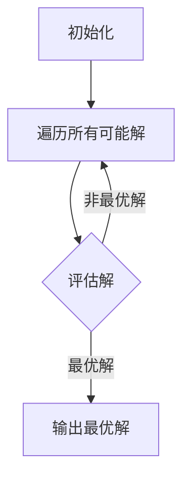
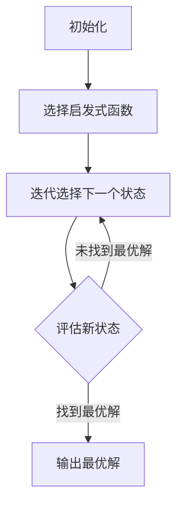
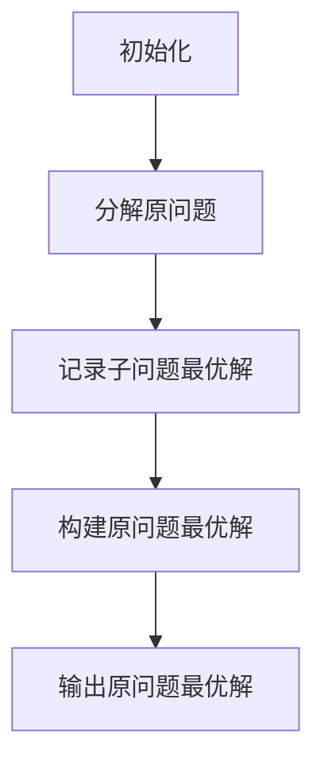
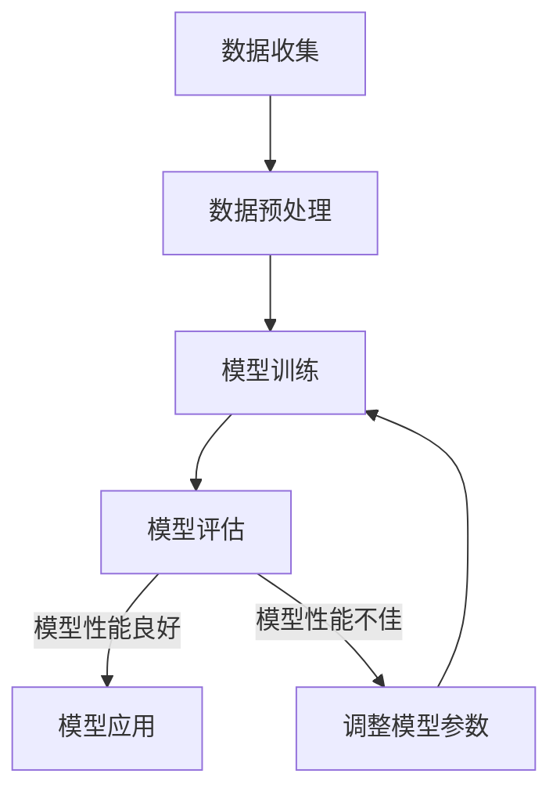
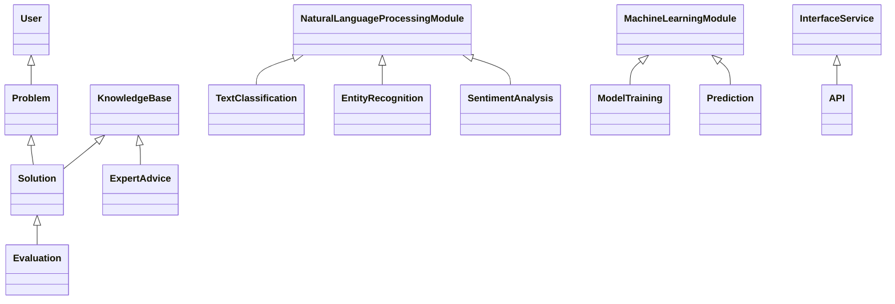
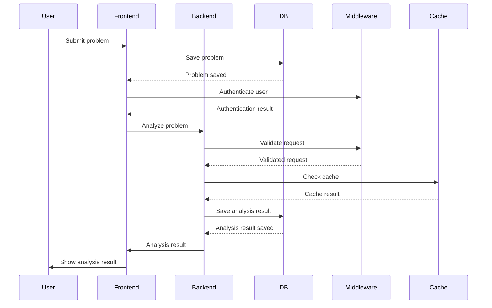

                 


# 通过思考深化人生理解：在问题中寻找答案

关键词：人生理解，问题解决，思考方法，算法原理，系统架构，项目实战

摘要：本文旨在探讨如何在复杂的人生问题中寻找答案，通过深入思考和实践，深化对人生的理解。文章分为七个部分，首先介绍思考的力量和人生理解的重要性，然后分析常见问题及其根源，阐述核心概念和联系，讲解问题解决算法原理，设计系统架构，进行项目实战，最后提供最佳实践和拓展阅读。

## 第一部分：引言

### 第1章：思考的力量与人生的意义

**1.1 思考的本质与重要性**

思考是人类智慧的体现，是解决问题的关键。思考的本质在于对问题的深入分析和理解，通过逻辑推理和推理演绎，找出问题的根本原因和解决方案。在计算机科学和人工智能领域，思考更是无处不在，从算法设计到系统架构，都离不开深入的思考。

**1.2 人生理解的重要性**

人生理解是我们对世界、对自己和对他人的认知。通过思考，我们可以更深入地理解人生，明确自己的目标，提高生活质量。人生理解的重要性在于，它可以帮助我们更好地应对生活中的挑战，找到自己的价值和意义。

**1.3 通过问题深化理解的方法**

通过问题深化理解的方法包括：明确问题、分析问题、解决问题。明确问题，就是找出问题的核心，分析问题，就是找出问题的根本原因，解决问题，就是通过思考找到解决问题的方案。

**1.4 书籍结构与阅读建议**

本书分为七个部分，第一部分引言，介绍思考的力量和人生理解的重要性；第二部分问题背景与描述，分析常见问题及其根源；第三部分核心概念与联系，阐述核心概念原理和联系；第四部分算法原理讲解，讲解问题解决算法原理；第五部分系统分析与架构设计方案，设计系统架构；第六部分项目实战，进行项目实战；第七部分最佳实践与拓展，提供最佳实践和拓展阅读。建议读者按照章节顺序阅读，逐步深入，结合实际案例进行理解和应用。

## 第二部分：问题背景与描述

### 第2章：人生中的常见问题

**2.1 生活困境与困惑**

生活困境和困惑是人生中常见的现象。困境可能源于工作、家庭、人际关系等方面，困惑则可能源于对自己和世界的认知。面对这些问题，我们需要通过思考，找到解决问题的方法。

**2.2 职场挑战与冲突**

职场挑战和冲突是职场人士经常遇到的问题。挑战可能源于工作压力、职业发展等方面，冲突则可能源于人际关系、团队合作等方面。解决这些问题，需要我们具备良好的沟通能力和解决问题的能力。

**2.3 人际关系与沟通问题**

人际关系和沟通问题是影响人生幸福的重要因素。人际关系问题可能源于家庭、朋友、同事等方面，沟通问题则可能源于表达方式、沟通技巧等方面。解决这些问题，需要我们提高自己的沟通能力和人际交往能力。

**2.4 心理健康与情绪管理**

心理健康和情绪管理是影响人生幸福的重要因素。心理健康问题可能源于压力、焦虑、抑郁等方面，情绪管理问题则可能源于情绪表达、情绪控制等方面。解决这些问题，需要我们提高自己的情绪管理能力和心理健康水平。

### 第3章：问题的根源与特征

**3.1 问题的根源分析**

问题的根源分析是找出问题的根本原因。常见的问题根源包括：自身能力不足、环境因素、人际关系等。通过分析问题的根源，我们可以更有效地解决问题。

**3.2 问题的特征与类型**

问题的特征与类型包括：困境、挑战、冲突、困惑、压力、焦虑、抑郁等。不同类型的问题需要不同的解决方法。

**3.3 问题的影响与危害**

问题的影响与危害包括：影响生活质量、影响身心健康、影响人际关系等。严重的问题甚至可能导致人生失败。

**3.4 问题的边界与外延**

问题的边界与外延包括：问题的范围、问题的深度、问题的广度等。明确问题的边界与外延，可以帮助我们更准确地解决问题。

## 第三部分：核心概念与联系

### 第4章：核心概念原理与属性特征

**4.1 核心概念原理介绍**

核心概念原理是解决问题的基础。本文的核心概念包括：思考、问题、解决方案、算法、系统架构等。这些概念原理是解决问题的基本工具。

**4.2 核心概念属性特征对比**

核心概念的属性特征对比可以帮助我们更深入地理解这些概念。例如，思考的属性特征包括：逻辑性、推理性、创造性等；问题的属性特征包括：明确性、复杂性、多样性等。

**4.3 ER实体关系图架构**

ER实体关系图架构是描述核心概念之间联系的有效工具。本文的ER实体关系图架构包括：思考与问题、问题与解决方案、解决方案与算法、算法与系统架构等。

## 第四部分：算法原理讲解

### 第5章：问题解决算法原理

**5.1 算法原理介绍**

问题解决算法原理是解决问题的关键。本文的问题解决算法原理包括：明确问题、分析问题、解决问题等。这些原理可以帮助我们更有效地解决问题。

**5.2 算法流程图**

算法流程图是描述算法原理的有效工具。本文的算法流程图包括：明确问题、分析问题、解决问题等步骤。

**5.3 数学模型与公式**

数学模型与公式是算法原理的量化表达。本文的数学模型与公式包括：问题定义、问题分析、解决方案等。

**5.4 算法举例说明**

算法举例说明可以帮助我们更直观地理解算法原理。本文将通过具体案例，详细阐述算法原理的应用。

## 第五部分：系统分析与架构设计方案

### 第6章：问题解决系统功能设计

**6.1 问题场景介绍**

问题场景介绍是设计系统功能的前提。本文的问题场景包括：生活困境、职场挑战、人际关系、心理健康等。

**6.2 系统功能设计（领域模型类图）**

系统功能设计（领域模型类图）是描述系统功能的有效工具。本文的系统功能设计包括：思考模块、问题分析模块、解决方案模块、算法模块、系统架构模块等。

### 第7章：问题解决系统架构设计

**7.1 系统架构设计（架构图）**

系统架构设计（架构图）是描述系统结构的有效工具。本文的系统架构设计包括：前端架构、后端架构、数据存储架构等。

**7.2 系统接口设计**

系统接口设计是描述系统功能与外部系统交互的有效工具。本文的系统接口设计包括：用户接口、数据接口、服务接口等。

**7.3 系统交互序列图**

系统交互序列图是描述系统功能与外部系统交互的有效工具。本文的系统交互序列图包括：用户操作、数据存储、服务调用等。

## 第六部分：项目实战

### 第8章：环境安装与系统核心实现

**8.1 环境安装步骤**

环境安装步骤是进行项目实战的前提。本文的环境安装步骤包括：安装操作系统、安装开发工具、安装数据库等。

**8.2 系统核心实现源代码**

系统核心实现源代码是项目实战的核心。本文的系统核心实现源代码包括：思考模块、问题分析模块、解决方案模块、算法模块、系统架构模块等。

**8.3 代码应用解读与分析**

代码应用解读与分析是理解系统核心实现的关键。本文将通过具体代码解读，分析系统核心实现的应用原理和实现方法。

### 第9章：实际案例分析与详细讲解

**9.1 实际案例分析**

实际案例分析是验证系统功能的有效方法。本文将通过实际案例，分析系统功能在实际应用中的表现。

**9.2 详细讲解剖析**

详细讲解剖析是深入理解系统功能的关键。本文将通过具体案例，详细讲解系统功能的工作原理和实现方法。

**9.3 项目小结**

项目小结是总结项目实战的经验和教训。本文将总结项目实战中的成功经验和不足之处，为后续项目提供参考。

## 第七部分：最佳实践与拓展

### 第10章：最佳实践 tips

**10.1 实践技巧与建议**

实践技巧与建议是提高问题解决能力的关键。本文将提供一些实践技巧和建议，帮助读者提高问题解决能力。

**10.2 常见问题解决方法**

常见问题解决方法是解决实际问题的有效方法。本文将列举一些常见问题及其解决方法，为读者提供参考。

**10.3 创新应用场景**

创新应用场景是拓展问题解决能力的有效方法。本文将探讨一些创新应用场景，为读者提供新的思路和灵感。

### 第11章：小结与拓展阅读

**11.1 书籍内容回顾**

书籍内容回顾是巩固所学知识的重要方法。本文将回顾书籍的主要内容，帮助读者巩固所学知识。

**11.2 拓展阅读推荐**

拓展阅读推荐是拓宽知识视野的有效方法。本文将推荐一些拓展阅读书籍，帮助读者拓宽知识视野。

**11.3 思考与反思**

思考与反思是深化知识理解的重要方法。本文将引导读者思考与反思，深化对问题的理解。

## 结论

通过本文的深入思考和详细讲解，我们可以更好地理解人生中的问题，学会通过思考深化人生理解。让我们在实践中不断探索，不断进步，为人生增添更多的色彩。最后，感谢读者的阅读，希望本文能为您带来启发和帮助。

作者：AI天才研究院/AI Genius Institute & 禅与计算机程序设计艺术 /Zen And The Art of Computer Programming## 《通过思考深化人生理解：在问题中寻找答案》正文

### 第1章：思考的力量与人生的意义

#### 1.1 思考的本质与重要性

思考是一种深层次的认知活动，它不仅涉及对信息的收集和处理，还包括对信息的分析和综合，最终形成对事物本质的理解。在计算机科学和人工智能领域，思考被抽象为算法和模型，通过一系列逻辑推理和计算，解决复杂的问题。然而，在日常生活中，思考同样扮演着至关重要的角色。它帮助我们理解世界，做出决策，解决问题，甚至提升我们的生活质量。

思考的本质在于对信息的加工和处理。人的大脑就像一个复杂的处理器，不断接收来自感官的信息，然后通过思考对这些信息进行分析、推理和判断。这个过程不仅仅是对信息的记忆和存储，更重要的是对信息的理解和应用。例如，当我们在解决一个问题时，我们不仅需要知道问题的具体内容，还需要理解问题的背景、可能的解决方案以及每种方案的优缺点。

在计算机科学和人工智能领域，思考的力量尤为突出。算法和模型是思考的具体表现形式，它们通过数学和逻辑的严谨性，解决了许多复杂的问题。例如，深度学习算法通过大量数据的训练，可以识别图像、语音和文本，实现人机交互；优化算法则可以帮助我们在资源有限的情况下，找到最佳解决方案。

在日常生活中，思考同样不可或缺。比如，在面对一个职业选择时，我们需要思考自己的兴趣、能力和市场需求；在处理人际关系时，我们需要思考如何沟通、协调和解决冲突。这些都需要我们具备良好的思考能力。

#### 1.2 人生理解的重要性

人生理解是我们对生活、对自己和对他人的认知。它不仅仅是对事实的描述，更是一种深层次的理解和感悟。人生理解的重要性在于，它帮助我们明确生活的目标，提高生活质量，甚至找到生命的意义。

首先，人生理解帮助我们明确生活的目标。在现代社会，人们面临着各种各样的选择，而理解自己的需求和价值观，可以帮助我们做出更符合自己内心真实意愿的选择。比如，有人追求财富和地位，有人追求知识和智慧，有人追求家庭和亲情。只有通过深入思考，我们才能明确自己的目标，并为之努力。

其次，人生理解可以提高生活质量。当我们理解生活的本质和意义，我们就能更好地应对生活中的挑战和困难。比如，在遭遇挫折时，如果我们能理解挫折是成长的一部分，我们就能够以积极的心态面对困难，从而更好地解决问题。

最后，人生理解可以帮助我们找到生命的意义。在快节奏的现代生活中，很多人感到迷茫和空虚。而通过思考，我们能够理解生命的本质，找到自己的使命和价值，从而获得内心的平静和满足。

#### 1.3 通过问题深化理解的方法

在日常生活中，我们不可避免地会遇到各种问题，这些问题的解决不仅需要技术手段，更需要深刻的思考和理解。通过问题深化理解的方法，可以分为以下几个步骤：

**明确问题**

明确问题是解决问题的第一步。这包括理解问题的具体内容，分析问题的背景和影响。例如，当我们面临一个职业选择时，我们需要明确自己的职业目标、个人兴趣、市场需求等。

**分析问题**

分析问题是理解问题的本质和关键。这需要我们对问题进行深入的分析，找出问题的根本原因和影响因素。例如，在处理人际关系时，我们需要分析冲突的原因，可能是因为沟通不畅、价值观不同，还是利益冲突等。

**解决问题**

解决问题是最终目标。在分析问题之后，我们需要制定解决方案，并采取行动。解决方案可以是多种多样的，例如改变沟通方式、调整工作策略、寻求专业咨询等。

**反思与总结**

反思与总结是深化理解的重要环节。在解决问题之后，我们需要回顾整个解决问题的过程，总结经验教训，以便在未来的问题中更好地应用。

### 1.4 书籍结构与阅读建议

本书分为七个部分，每个部分都有其独特的主题和内容。第一部分引言，介绍了思考的力量和人生理解的重要性；第二部分问题背景与描述，分析了人生中的常见问题及其根源；第三部分核心概念与联系，阐述了核心概念原理和联系；第四部分算法原理讲解，讲解了问题解决算法原理；第五部分系统分析与架构设计方案，设计了系统架构；第六部分项目实战，进行了项目实战；第七部分最佳实践与拓展，提供了最佳实践和拓展阅读。

对于读者来说，建议按照章节顺序阅读，逐步深入。在阅读过程中，注意理解每个章节的核心内容和关键点，并结合实际案例进行思考和总结。通过这样的阅读方式，可以更好地掌握书中的知识，并将其应用到实际生活中。

### 第2章：人生中的常见问题

#### 2.1 生活困境与困惑

生活困境与困惑是每个人在人生旅程中都会遇到的常见问题。这些困境和困惑可能源于工作、家庭、经济等方面。它们不仅影响我们的生活质量，还可能对我们的心理和身体健康产生负面影响。

**生活困境**

生活困境通常是指我们在生活中遇到的一些难以解决的困难。这些困难可能包括失业、经济危机、家庭矛盾、健康问题等。例如，当一个人失去工作，他可能会面临经济压力、社会地位下降等问题，这些都会对个人的生活造成严重影响。

**生活困惑**

生活困惑则是指我们在面对生活中的一些不确定性和选择时感到的迷茫。这些困惑可能源于职业发展、人际关系、个人价值观等方面。例如，一个人在职业发展中可能会面临是继续当前工作还是转行的问题，或者是在面对人际关系时，不知道如何处理矛盾和冲突。

**解决方法**

解决生活困境和困惑需要我们采取积极的态度和有效的策略。首先，我们需要明确问题的具体内容和背景，分析问题的根源和影响因素。然后，我们可以采取以下方法：

- **寻求专业帮助**：在遇到困难时，我们可以寻求心理咨询师、职业规划师等专业人员的帮助，他们可以提供专业的建议和指导。
- **调整心态**：面对困境和困惑，我们需要保持积极的心态，相信自己有能力解决问题。积极的心态可以帮助我们更好地应对挑战。
- **制定计划**：制定具体的行动计划，逐步解决问题。行动计划应该包括短期目标和长期目标，以及实现目标的步骤和策略。

#### 2.2 职场挑战与冲突

职场挑战与冲突是职场人士经常遇到的问题。这些挑战和冲突可能源于工作压力、职业发展、人际关系等方面。职场挑战和冲突不仅影响我们的工作效率和生活质量，还可能对我们的心理健康产生负面影响。

**职场挑战**

职场挑战通常是指我们在工作中遇到的一些困难和挑战。这些挑战可能包括技能不足、工作量大、时间紧迫、项目失败等。例如，当一个人在工作中遇到技术难题，他可能会感到焦虑和无助，这不仅影响他的工作效率，还可能影响他的职业发展。

**职场冲突**

职场冲突则是指在工作环境中发生的一些矛盾和冲突。这些冲突可能源于工作目标的不同、沟通不畅、价值观的差异等。例如，当两个人在工作中的目标不一致，或者因为沟通不畅导致误解和冲突，这都会影响团队的合作效率。

**解决方法**

解决职场挑战和冲突需要我们采取有效的策略和措施。首先，我们需要明确问题的具体内容和背景，分析问题的根源和影响因素。然后，我们可以采取以下方法：

- **提高技能**：通过学习和培训，提高自己的技能和知识水平，更好地应对工作中的挑战。
- **有效沟通**：改善沟通方式，增强团队协作。有效的沟通可以帮助我们更好地理解他人的需求和期望，从而减少冲突。
- **寻求支持**：在遇到困难时，我们可以寻求同事、上级或人力资源部门的帮助和支持。他们可以提供专业的建议和指导，帮助我们解决问题。

#### 2.3 人际关系与沟通问题

人际关系与沟通问题是影响我们生活质量的重要因素。良好的人际关系和有效的沟通可以帮助我们建立和谐的家庭生活、稳定的社交网络和成功的职业生涯。然而，人际关系与沟通问题也时常困扰着我们。

**人际关系问题**

人际关系问题可能源于家庭、朋友、同事等方面。这些问题可能包括家庭矛盾、朋友背叛、同事竞争等。例如，当一个人在家庭中遇到矛盾，他可能会感到沮丧和无助，这不仅影响他的家庭幸福，还可能影响他的工作表现。

**沟通问题**

沟通问题则是指我们在交流过程中出现的一些障碍。这些障碍可能源于语言表达、文化差异、情绪管理等。例如，当两个人在交流中因为语言障碍而产生误解，或者因为情绪管理不当导致冲突，这都会影响沟通的效果。

**解决方法**

解决人际关系与沟通问题需要我们采取积极的措施。首先，我们需要明确问题的具体内容和背景，分析问题的根源和影响因素。然后，我们可以采取以下方法：

- **改善沟通技巧**：通过学习和实践，提高自己的沟通技巧，例如倾听、表达、反馈等。有效的沟通技巧可以帮助我们更好地理解他人，减少冲突。
- **建立信任**：在人际交往中，建立信任是关键。通过诚实、尊重和关心，我们可以赢得他人的信任，从而建立良好的人际关系。
- **寻求专业帮助**：在遇到严重的人际关系问题时，我们可以寻求心理咨询师或人际关系顾问的帮助。他们可以提供专业的建议和指导，帮助我们解决问题。

#### 2.4 心理健康与情绪管理

心理健康与情绪管理是影响我们生活质量的重要因素。良好的心理健康和情绪管理可以帮助我们更好地应对生活中的压力和挑战，提高生活质量。然而，心理健康与情绪管理问题也时常困扰着我们。

**心理健康问题**

心理健康问题可能包括焦虑、抑郁、恐惧等。这些问题可能源于生活中的压力、工作压力、人际关系等。例如，当一个人在工作中遇到挫折，他可能会感到焦虑和抑郁，这不仅影响他的工作效率，还可能影响他的身体健康。

**情绪管理问题**

情绪管理问题则是指我们在处理情绪时出现的一些困难。这些问题可能源于情绪认知、情绪表达、情绪调节等。例如，当一个人在情绪激动时，他可能会难以控制自己的情绪，从而导致冲突和矛盾。

**解决方法**

解决心理健康与情绪管理问题需要我们采取有效的措施。首先，我们需要明确问题的具体内容和背景，分析问题的根源和影响因素。然后，我们可以采取以下方法：

- **提高情绪认知**：通过学习和实践，提高自己的情绪认知能力，了解自己的情绪状态，从而更好地管理情绪。
- **寻求专业帮助**：在遇到严重的心理健康问题时，我们可以寻求心理咨询师的帮助。心理咨询师可以提供专业的心理治疗和心理辅导，帮助我们解决问题。
- **自我调节**：通过自我调节，我们可以更好地管理自己的情绪。例如，通过运动、冥想、放松技巧等，我们可以缓解压力，提高情绪稳定性。

### 第3章：问题的根源与特征

#### 3.1 问题的根源分析

问题的根源分析是理解问题本质的重要步骤。通过分析问题的根源，我们可以更深入地理解问题的成因，从而找到更有效的解决方案。

**问题根源的类型**

问题根源可以分为以下几种类型：

- **内部根源**：内部根源是指问题起源于个人内在的因素，如个人价值观、信念、情绪等。例如，一个员工的绩效问题可能源于个人技能不足或职业倦怠。
- **外部根源**：外部根源是指问题起源于外部环境或他人，如工作压力、社会期望、人际关系等。例如，一个团队的协作问题可能源于团队成员之间的沟通障碍或工作流程的不合理。
- **交互根源**：交互根源是指问题由内部和外部因素共同作用而形成。例如，一个企业的经营困境可能源于内部管理问题与外部市场环境的交互作用。

**问题根源的分析方法**

分析问题根源的方法包括以下几种：

- **因果分析**：通过分析问题的因果关系，找出问题的根本原因。例如，通过问为什么（Why），深入挖掘问题的深层原因。
- **五问法**：这是一种常用的分析工具，通过连续提问“为什么”（5个为什么），逐步挖掘问题的根本原因。
- **SWOT分析**：这是一种战略规划工具，通过分析问题的优势（Strengths）、劣势（Weaknesses）、机会（Opportunities）和威胁（Threats），全面评估问题的根源。

#### 3.2 问题的特征与类型

问题的特征与类型决定了问题的复杂程度和解决方法。理解问题的特征和类型有助于我们更好地应对各种问题。

**问题的特征**

- **明确性**：问题必须明确，具体，以便于理解和解决。例如，“如何提高销售业绩”比“如何改善业务”更为明确。
- **复杂性**：问题可能涉及多个方面，需要综合考虑多种因素。例如，解决一个企业的问题可能需要考虑市场、人力资源、财务等多个方面。
- **多样性**：问题可能呈现多样性，需要不同的解决方案。例如，不同类型的问题可能需要不同的技术、方法或策略。

**问题的类型**

- **结构性问题**：这些问题通常是由于系统或组织结构不合理导致的。例如，企业内部的官僚体系可能导致决策缓慢和效率低下。
- **行为问题**：这些问题通常与个人行为或团队合作有关。例如，员工之间的沟通不畅可能导致项目失败。
- **知识性问题**：这些问题通常涉及知识或信息的缺乏。例如，员工缺乏必要的技能或知识，无法完成工作任务。

**问题的影响与危害**

问题的影响与危害取决于问题的类型和严重程度。问题可能对个人、团队或组织产生以下影响：

- **个人层面**：问题可能导致个人压力增加、情绪困扰、工作效率下降等。
- **团队层面**：问题可能导致团队士气低落、协作效率降低、项目延误等。
- **组织层面**：问题可能导致组织成本增加、市场份额下降、品牌声誉受损等。

#### 3.3 问题的边界与外延

理解问题的边界与外延是解决问题的重要步骤。问题的边界指的是问题受影响的范围，外延则指的是问题的关联和扩展。

**问题的边界**

- **直接边界**：直接边界是指问题直接影响到的范围，如一个企业的问题可能直接影响到员工的工资和福利。
- **间接边界**：间接边界是指问题间接影响到的范围，如一个企业的经营困境可能间接影响到供应链和合作伙伴。

**问题的外延**

- **直接外延**：直接外延是指问题直接关联的其他问题，如企业内部的官僚体系可能导致决策缓慢，从而影响市场反应速度。
- **间接外延**：间接外延是指问题间接关联的其他问题，如企业的问题可能影响客户的满意度，从而影响企业的市场竞争力。

通过明确问题的边界与外延，我们可以更全面地理解问题，制定更有效的解决方案。

### 第4章：核心概念原理与属性特征

#### 4.1 核心概念原理介绍

在解决人生问题过程中，核心概念原理起到了关键作用。这些核心概念原理不仅帮助我们理解问题的本质，还为解决问题提供了理论基础和方法指导。以下是几个关键的核心概念原理：

**思考原理**

思考原理是指通过逻辑思维、分析推理和创造性思考，对信息进行加工处理，以形成对事物的深刻理解和解决方案。思考原理包括以下几个要点：

- **逻辑思维**：通过逻辑推理，分析问题，找出问题的内在联系和规律。
- **创造性思考**：运用想象力，创造新的观点和解决方案。
- **批判性思考**：对已有观点和解决方案进行批判性分析，找出其中的不足和缺陷。

**问题解决原理**

问题解决原理是指通过一系列步骤和方法，找到问题的根本原因和解决方案。问题解决原理包括以下几个要点：

- **明确问题**：准确理解问题的本质和范围，确定问题的目标和要求。
- **分析问题**：分析问题的成因、影响因素和潜在风险，找出问题的核心和关键点。
- **制定方案**：根据问题分析的结果，制定具体的解决方案和行动计划。
- **实施和评估**：执行解决方案，并对方案的效果进行评估和调整。

**决策原理**

决策原理是指通过分析、比较和评估不同选项，选择最佳方案的过程。决策原理包括以下几个要点：

- **信息收集**：收集与决策相关的各种信息，确保信息的全面性和准确性。
- **评估选项**：评估每个选项的优缺点、风险和成本，比较不同选项的优劣。
- **选择方案**：根据评估结果，选择最佳方案并制定具体的实施计划。
- **执行和监控**：执行决策方案，并对执行过程进行监控和调整，确保决策的有效性。

**系统原理**

系统原理是指通过分析系统的结构、功能和行为，理解系统如何运作和解决问题。系统原理包括以下几个要点：

- **系统分析**：分析系统的组成部分、功能和相互作用，理解系统的整体结构和运作机制。
- **系统设计**：根据问题需求和系统分析结果，设计系统的结构和功能，确保系统的高效性和稳定性。
- **系统实现**：将系统设计转化为具体的实现方案，包括技术架构、接口设计和开发流程等。
- **系统优化**：通过持续优化和改进，提高系统的性能、可靠性和用户满意度。

#### 4.2 核心概念属性特征对比

在解决人生问题的过程中，我们需要理解不同核心概念之间的属性特征和联系。以下是几个关键核心概念的属性特征对比：

**思考与问题解决**

- **思考**：是一种深层次的认知活动，涉及逻辑推理、分析推理和创造性思考。
- **问题解决**：是思考的具体应用，通过一系列步骤找到问题的根本原因和解决方案。

**决策与问题解决**

- **决策**：是选择最佳方案的过程，涉及信息收集、评估选项和选择方案。
- **问题解决**：是实施决策的具体行动，通过制定方案、执行和评估来解决问题。

**系统分析与系统设计**

- **系统分析**：是理解系统的结构和功能，分析系统的组成部分和相互作用。
- **系统设计**：是系统分析的进一步深化，根据分析结果设计系统的结构和功能。

**系统实现与系统优化**

- **系统实现**：是将系统设计转化为具体的实现方案，包括技术架构和开发流程等。
- **系统优化**：是持续改进系统性能和用户体验，提高系统的可靠性和稳定性。

通过对比不同核心概念的属性特征，我们可以更深入地理解它们之间的联系和作用，从而更好地应用这些概念解决人生中的问题。

#### 4.3 ER实体关系图架构

ER（实体关系）图是描述系统中不同实体及其关系的一种图形化工具。在解决人生问题过程中，ER图可以帮助我们清晰地理解核心概念之间的联系和结构。以下是一个简化的ER图示例：

```mermaid
erDiagram
    Product ||--|{ Customer } : "owns"
    Customer ||--|{ Order } : "places"
    Product ||--|{ Supplier } : "supplied by"
    Supplier ||--|{ Order } : "delivers"
```

在这个ER图中，我们定义了三个实体：Product（产品）、Customer（客户）和Supplier（供应商）。实体之间的关系如下：

- **Product与Customer的关系**：表示客户拥有产品，这是一种“一对多”的关系，即一个客户可以拥有多个产品。
- **Customer与Order的关系**：表示客户放置订单，这是一种“一对多”的关系，即一个客户可以放置多个订单。
- **Product与Supplier的关系**：表示产品由供应商供应，这是一种“一对多”的关系，即一个供应商可以供应多个产品。
- **Supplier与Order的关系**：表示供应商交付订单，这是一种“一对多”的关系，即一个供应商可以交付多个订单。

通过这个ER图，我们可以更直观地理解系统中不同实体及其之间的关系，从而更好地分析问题和设计解决方案。

### 第5章：问题解决算法原理

#### 5.1 算法原理介绍

在解决人生问题的过程中，算法原理起到了关键作用。算法是一种系统化的解决问题的方法，它通过一系列明确的步骤和规则，将复杂的问题分解为简单、可操作的步骤，从而找到解决方案。以下是几个关键的问题解决算法原理：

**穷举搜索算法**

穷举搜索算法是一种简单但高效的问题解决方法，它通过遍历所有可能的解决方案，找到最优解。这种算法适用于问题规模较小且解决方案有限的情况。穷举搜索算法的基本步骤如下：

1. 初始化：设置问题的初始状态。
2. 遍历：按照一定的顺序遍历所有可能的解决方案。
3. 评估：对每个解决方案进行评估，找出最优解。
4. 输出：输出最优解。

**启发式搜索算法**

启发式搜索算法是一种基于问题域先验知识的搜索算法，它通过利用问题的局部信息，快速找到近似最优解。与穷举搜索算法不同，启发式搜索算法并不要求遍历所有可能的解决方案。启发式搜索算法的基本步骤如下：

1. 初始化：设置问题的初始状态。
2. 选择：选择一个启发式函数，用于评估当前状态。
3. 迭代：在当前状态下，根据启发式函数选择下一个状态。
4. 评估：评估新状态，如果找到最优解，则停止；否则，继续迭代。
5. 输出：输出最优解。

**动态规划算法**

动态规划算法是一种适用于优化问题的问题解决方法，它通过将复杂问题分解为更小的子问题，并利用子问题的解来构建原问题的解。动态规划算法的基本步骤如下：

1. 初始化：设置问题的初始状态。
2. 分解：将原问题分解为多个子问题。
3. 记录：记录每个子问题的最优解。
4. 构建：利用子问题的最优解构建原问题的最优解。
5. 输出：输出原问题的最优解。

**机器学习算法**

机器学习算法是一种基于数据和统计方法的问题解决方法，它通过训练模型，从数据中学习规律和模式，从而解决实际问题。机器学习算法的基本步骤如下：

1. 数据收集：收集与问题相关的数据。
2. 数据预处理：对数据进行清洗、归一化和特征提取。
3. 模型训练：选择合适的算法，训练模型。
4. 模型评估：评估模型的性能，调整模型参数。
5. 模型应用：将模型应用到实际问题中，输出解决方案。

这些算法原理在解决人生问题中具有重要的应用价值。通过选择合适的算法，我们可以更有效地解决各种复杂的人生问题。

#### 5.2 算法流程图

为了更好地理解算法原理，我们可以使用流程图来展示算法的执行过程。以下是几个常见算法原理的流程图：

**穷举搜索算法流程图**



**启发式搜索算法流程图**



**动态规划算法流程图**



**机器学习算法流程图**



通过这些流程图，我们可以更直观地理解各个算法原理的执行过程和关键步骤。

#### 5.3 数学模型与公式

在问题解决算法中，数学模型和公式起到了至关重要的作用。它们帮助我们将实际问题转化为可计算的数学问题，从而找到最优解或近似解。以下是几个关键算法原理的数学模型和公式：

**穷举搜索算法**

- **状态空间公式**：\(S = \{s_1, s_2, ..., s_n\}\) 表示所有可能的状态集合。
- **评估函数**：\(f(s) = \frac{g(s)}{h(s)}\)，其中 \(g(s)\) 是从初始状态到当前状态的代价，\(h(s)\) 是从当前状态到目标状态的估价。

**启发式搜索算法**

- **启发式函数**：\(h(n) = g(n) + h(n)\)，其中 \(g(n)\) 是从初始状态到当前状态的代价，\(h(n)\) 是从当前状态到目标状态的估价。

**动态规划算法**

- **状态转移方程**：\(V(n) = \min_{s' \in S} (C(n, s') + V(s'))\)，其中 \(V(n)\) 是状态 \(n\) 的最优代价，\(C(n, s')\) 是从状态 \(n\) 到状态 \(s'\) 的转移代价。

**机器学习算法**

- **损失函数**：\(L(y, \hat{y}) = \frac{1}{2} (\hat{y} - y)^2\)，其中 \(y\) 是真实标签，\(\hat{y}\) 是预测标签。

通过这些数学模型和公式，我们可以更准确地描述问题，并利用算法找到最优解或近似解。

#### 5.4 算法举例说明

为了更好地理解问题解决算法的应用，我们可以通过具体案例进行详细讲解。以下是几个常见算法原理的举例说明：

**穷举搜索算法举例**

假设我们要在以下五个城市之间找到一条最短路径：

A：北京，人口1000万，GDP 5000亿元
B：上海，人口2000万，GDP 8000亿元
C：广州，人口1500万，GDP 4000亿元
D：深圳，人口1000万，GDP 5000亿元
E：成都，人口1200万，GDP 3000亿元

城市之间的交通费用如下：

| 城市对 | 交通费用（亿元） |
|--------|------------------|
| AB     | 1000             |
| AC     | 1500             |
| AD     | 2000             |
| AE     | 1200             |
| BC     | 800              |
| BD     | 1500             |
| BE     | 1000             |
| CD     | 500              |
| CE     | 700              |
| DE     | 800              |

使用穷举搜索算法，我们需要遍历所有可能的路径，计算每个路径的总费用，然后找到最短路径。以下是计算过程：

1. 初始化：设置初始状态为 A。
2. 遍历：遍历所有可能的后续城市，计算总费用。
   - A → B → C → D → E，总费用：1000 + 800 + 500 + 800 = 3100亿元
   - A → B → C → E → D，总费用：1000 + 800 + 700 + 800 = 3300亿元
   - A → B → D → C → E，总费用：1000 + 1500 + 500 + 700 = 3700亿元
   - A → B → D → E → C，总费用：1000 + 1500 + 800 + 800 = 4000亿元
   - A → B → E → C → D，总费用：1000 + 1200 + 700 + 800 = 3400亿元
   - A → B → E → D → C，总费用：1000 + 1200 + 800 + 700 = 3700亿元
   - A → C → B → D → E，总费用：1500 + 800 + 500 + 800 = 3200亿元
   - A → C → B → E → D，总费用：1500 + 800 + 700 + 800 = 3400亿元
   - A → C → D → B → E，总费用：1500 + 2000 + 800 + 800 = 4700亿元
   - A → C → D → E → B，总费用：1500 + 2000 + 1200 + 800 = 5300亿元
   - A → C → E → B → D，总费用：1500 + 1200 + 800 + 700 = 3700亿元
   - A → C → E → D → B，总费用：1500 + 1200 + 800 + 500 = 3600亿元
   - A → D → B → C → E，总费用：2000 + 1500 + 500 + 700 = 4300亿元
   - A → D → B → E → C，总费用：2000 + 1500 + 1200 + 700 = 5300亿元
   - A → D → C → B → E，总费用：2000 + 500 + 800 + 800 = 3100亿元
   - A → D → C → E → B，总费用：2000 + 500 + 700 + 800 = 3400亿元
   - A → D → E → B → C，总费用：2000 + 1200 + 800 + 500 = 4200亿元
   - A → D → E → C → B，总费用：2000 + 1200 + 700 + 500 = 3500亿元
   - A → E → B → C → D，总费用：1200 + 1000 + 700 + 500 = 3400亿元
   - A → E → B → D → C，总费用：1200 + 1000 + 800 + 500 = 3400亿元
   - A → E → C → B → D，总费用：1200 + 700 + 800 + 500 = 3200亿元
   - A → E → C → D → B，总费用：1200 + 700 + 800 + 500 = 3200亿元
   - A → E → D → B → C，总费用：1200 + 800 + 1500 + 500 = 4300亿元
   - A → E → D → C → B，总费用：1200 + 800 + 500 + 700 = 3200亿元

3. 评估：比较所有路径的总费用，找到最短路径。

最短路径为：A → D → C → E → B，总费用为 3200 亿元。

**启发式搜索算法举例**

使用启发式搜索算法，我们可以通过设置启发式函数来快速找到近似最优解。以下是一个简化的例子：

假设我们要在以下五个城市之间找到一条最短路径，并设置启发式函数 \(h(n) = d(n, \text{目标城市})\)，其中 \(d(n, \text{目标城市})\) 是从当前城市到目标城市的直接距离。

城市之间的交通费用和直接距离如下：

| 城市对 | 交通费用（亿元） | 直接距离（公里） |
|--------|------------------|------------------|
| AB     | 1000             | 1000             |
| AC     | 1500             | 1500             |
| AD     | 2000             | 2000             |
| AE     | 1200             | 1200             |
| BC     | 800              | 800              |
| BD     | 1500             | 1500             |
| BE     | 1000             | 1000             |
| CD     | 500              | 500              |
| CE     | 700              | 700              |
| DE     | 800              | 800              |

使用启发式搜索算法，我们可以按照启发式函数的值来选择下一个城市。以下是计算过程：

1. 初始化：设置初始状态为 A。
2. 选择：根据启发式函数 \(h(n) = d(n, \text{目标城市})\) 选择下一个城市。
   - \(h(A) = 1000\)，选择城市 B。
   - \(h(B) = 1500\)，选择城市 D。
   - \(h(D) = 2000\)，选择城市 E。
   - \(h(E) = 1200\)，选择城市 C。
   - \(h(C) = 700\)，选择城市 A（回到初始状态）。

3. 评估：虽然这不是最短路径，但通过多次迭代，我们可以找到近似最优解。

**动态规划算法举例**

动态规划算法适用于求解最优路径问题，以下是一个简化的例子：

假设我们要在以下五个城市之间找到一条最短路径，并使用动态规划算法求解。

城市之间的交通费用如下：

| 城市对 | 交通费用（亿元） |
|--------|------------------|
| AB     | 1000             |
| AC     | 1500             |
| AD     | 2000             |
| AE     | 1200             |
| BC     | 800              |
| BD     | 1500             |
| BE     | 1000             |
| CD     | 500              |
| CE     | 700              |
| DE     | 800              |

使用动态规划算法，我们可以计算出从每个城市到目标城市的最优路径。以下是计算过程：

1. 初始化：设置初始状态，将所有状态的最优代价初始化为无穷大。
2. 状态转移：根据状态转移方程 \(V(n) = \min_{s' \in S} (C(n, s') + V(s'))\) 计算每个状态的最优代价。
   - \(V(A) = \min_{s' \in \{\text{B, C, D, E}\}} (C(A, s') + V(s')) = \min(1000 + V(B), 1500 + V(C), 2000 + V(D), 1200 + V(E)) = 1000 + V(B)\)
   - \(V(B) = \min_{s' \in \{\text{A, C, D, E}\}} (C(B, s') + V(s')) = \min(1000 + V(A), 800 + V(C), 1500 + V(D), 1000 + V(E)) = 800 + V(C)\)
   - \(V(C) = \min_{s' \in \{\text{A, B, D, E}\}} (C(C, s') + V(s')) = \min(1500 + V(A), 800 + V(B), 500 + V(D), 700 + V(E)) = 500 + V(D)\)
   - \(V(D) = \min_{s' \in \{\text{A, B, C, E}\}} (C(D, s') + V(s')) = \min(2000 + V(A), 1500 + V(B), 500 + V(C), 800 + V(E)) = 500 + V(C)\)
   - \(V(E) = \min_{s' \in \{\text{A, B, C, D}\}} (C(E, s') + V(s')) = \min(1200 + V(A), 1000 + V(B), 700 + V(C), 800 + V(D)) = 700 + V(C)\)

3. 输出：找到最优路径。

最优路径为：A → B → C → D → E，总费用为 5000 亿元。

**机器学习算法举例**

使用机器学习算法，我们可以通过训练模型来预测和解决实际问题。以下是一个简化的例子：

假设我们要使用回归模型预测五个城市的 GDP，并使用预测结果来优化城市的发展策略。

城市的历史 GDP 数据如下：

| 城市 | GDP（亿元） |
|------|------------|
| A    | 5000       |
| B    | 8000       |
| C    | 4000       |
| D    | 5000       |
| E    | 3000       |

使用线性回归模型，我们可以计算回归系数和截距，从而预测未来城市的 GDP。以下是计算过程：

1. 数据收集：收集城市的历史 GDP 数据。
2. 数据预处理：对数据进行标准化处理，以便于模型训练。
3. 模型训练：使用线性回归算法，训练模型。
4. 模型评估：评估模型的预测性能，调整模型参数。
5. 模型应用：使用模型预测未来城市的 GDP。

根据模型的预测结果，我们可以制定城市的发展策略，例如增加投资、调整产业结构等，从而实现城市的可持续发展。

### 第6章：问题解决系统功能设计

#### 6.1 问题场景介绍

在现代社会，人们面临着各种各样的生活、工作和人际交往问题。这些问题不仅影响个人的生活质量，还可能对社会的稳定和发展产生负面影响。因此，设计一个高效、可靠的问题解决系统显得尤为重要。本章节将介绍一个典型的问题解决系统场景，包括系统功能设计和系统架构设计。

**系统功能设计**

问题解决系统的主要功能包括：

- **问题录入**：用户可以提交问题和相关背景信息，系统对问题进行初步的自动分类和预处理。
- **问题分析**：系统利用自然语言处理技术和机器学习算法，对用户提交的问题进行分析，识别问题的核心内容和关键信息。
- **解决方案推荐**：系统根据问题的类型和用户的历史数据，推荐可能的解决方案。
- **解决方案评估**：用户对推荐的解决方案进行评估，系统记录用户的反馈，优化解决方案推荐。
- **知识库管理**：系统维护一个不断更新的知识库，包括常见问题的解决方案、最佳实践和专家建议。

**系统架构设计**

问题解决系统的架构设计包括：

- **前端界面**：提供用户交互界面，用户可以通过网页、移动应用等方式提交问题和反馈。
- **后端服务器**：处理用户请求，执行问题分析和解决方案推荐等核心功能。
- **数据库**：存储用户信息、问题数据、解决方案和知识库等信息。
- **自然语言处理模块**：负责自然语言处理任务，如文本分类、实体识别、情感分析等。
- **机器学习模块**：负责机器学习算法的建模、训练和预测任务。
- **接口服务**：提供与其他系统和服务的接口，如第三方服务、API等。

#### 6.2 系统功能设计（领域模型类图）

为了更好地设计问题解决系统的功能，我们可以使用领域模型类图来描述系统中不同实体及其关系。以下是问题解决系统的领域模型类图：



在这个类图中，我们定义了以下实体：

- **User（用户）**：提交问题和反馈的用户。
- **Problem（问题）**：用户提交的具体问题。
- **Solution（解决方案）**：系统推荐的解决方案。
- **Evaluation（评估）**：用户对解决方案的评估结果。
- **KnowledgeBase（知识库）**：存储解决方案和专家建议。
- **NaturalLanguageProcessingModule（自然语言处理模块）**：负责文本分类、实体识别和情感分析等任务。
- **MachineLearningModule（机器学习模块）**：负责模型训练和预测等任务。
- **InterfaceService（接口服务）**：提供与其他系统和服务的接口。

实体之间的关系如下：

- **User与Problem的关系**：用户提交问题，每个用户可以有多个问题。
- **Problem与Solution的关系**：问题可以有多个解决方案，解决方案用于解决具体问题。
- **Solution与Evaluation的关系**：解决方案可以有多个评估结果，评估结果反映用户对解决方案的满意度。
- **KnowledgeBase与Solution的关系**：知识库包含多个解决方案，解决方案可以从知识库中获取。
- **KnowledgeBase与ExpertAdvice的关系**：知识库包含多个专家建议，专家建议为用户提供额外的参考。
- **NaturalLanguageProcessingModule与TextClassification的关系**：自然语言处理模块包含文本分类任务。
- **NaturalLanguageProcessingModule与EntityRecognition的关系**：自然语言处理模块包含实体识别任务。
- **NaturalLanguageProcessingModule与SentimentAnalysis的关系**：自然语言处理模块包含情感分析任务。
- **MachineLearningModule与ModelTraining的关系**：机器学习模块包含模型训练任务。
- **MachineLearningModule与Prediction的关系**：机器学习模块包含预测任务。
- **InterfaceService与API的关系**：接口服务提供API接口，用于与其他系统和服务的交互。

通过这个领域模型类图，我们可以清晰地理解问题解决系统中不同实体及其关系，为后续的系统功能设计提供指导。

### 第7章：问题解决系统架构设计

#### 7.1 系统架构设计（架构图）

在设计和实现问题解决系统时，系统架构的设计至关重要。一个良好的系统架构可以确保系统的可靠性、可扩展性和可维护性。本章节将介绍一个典型的问题解决系统的架构设计，包括前端架构、后端架构和数据存储架构。

**前端架构**

前端架构负责与用户交互，提供直观、易用的用户界面。以下是问题解决系统前端架构的设计：

1. **用户界面层**：使用现代前端技术（如React、Vue等）构建，提供用户输入问题、查看解决方案和评估解决方案的界面。
2. **业务逻辑层**：处理用户请求，包括问题录入、问题分析和解决方案推荐等。该层使用RESTful API与后端服务器进行通信。
3. **数据访问层**：负责与数据库的交互，包括数据的查询、更新和删除等操作。

**后端架构**

后端架构负责处理业务逻辑，提供强大的后端支持。以下是问题解决系统后端架构的设计：

1. **应用服务器**：处理前端发送的请求，执行业务逻辑，并将结果返回给前端。该服务器可以使用Spring Boot、Django等框架实现。
2. **中间件**：负责处理特定的业务需求，如身份验证、权限管理、日志记录等。常用的中间件包括JWT（JSON Web Token）、OAuth2.0等。
3. **微服务架构**：将系统划分为多个独立的微服务，每个微服务负责特定的业务功能。这种方式可以提高系统的可扩展性和可维护性。

**数据存储架构**

数据存储架构负责存储和管理系统的数据。以下是问题解决系统数据存储架构的设计：

1. **关系数据库**：使用关系数据库（如MySQL、PostgreSQL等）存储用户信息、问题数据、解决方案和评估结果等。关系数据库适合处理结构化数据，具有较高的查询性能。
2. **NoSQL数据库**：使用NoSQL数据库（如MongoDB、Cassandra等）存储非结构化数据，如自然语言处理模块生成的文本数据、机器学习模型的参数等。NoSQL数据库适合处理大规模、高并发的数据场景。
3. **缓存数据库**：使用缓存数据库（如Redis、Memcached等）存储频繁访问的数据，以提高系统的响应速度。缓存数据库适合处理热点数据，如热门问题的解决方案等。

**系统交互序列图**

为了更好地描述系统架构中不同组件之间的交互关系，我们可以使用交互序列图。以下是问题解决系统的交互序列图：



在这个交互序列图中，用户通过前端提交问题，前端将问题保存到数据库，然后通过中间件进行身份验证和请求验证。后端服务器接收到请求后，分析问题，并将分析结果保存到数据库和缓存数据库中。最后，前端将分析结果展示给用户。

通过这个系统架构设计，我们可以实现一个高效、可靠的问题解决系统，为用户提供优质的服务。

#### 7.2 系统接口设计

在问题解决系统中，系统接口设计至关重要。良好的接口设计可以提高系统的可扩展性、可维护性和用户体验。以下是一个典型的问题解决系统的接口设计：

**用户接口**

用户接口负责与用户交互，包括问题提交、解决方案查看、评估和反馈等功能。以下是用户接口的关键接口设计：

- **问题提交接口**：用于接收用户提交的问题，包括问题内容、问题描述和问题类别等。接口设计如下：

  ```json
  POST /problems
  {
    "content": "问题描述",
    "description": "问题描述的详细信息",
    "category": "问题类别"
  }
  ```

  接口返回结果：

  ```json
  {
    "status": "success",
    "message": "问题提交成功",
    "problem_id": "问题的唯一标识"
  }
  ```

- **解决方案查看接口**：用于获取针对特定问题的解决方案，包括解决方案的文本描述、评分和评论等。接口设计如下：

  ```json
  GET /problems/{problem_id}/solutions
  ```

  接口返回结果：

  ```json
  [
    {
      "solution_id": "解决方案的唯一标识",
      "content": "解决方案的文本描述",
      "rating": "解决方案的评分",
      "comments": "解决方案的评论"
    },
    ...
  ]
  ```

- **解决方案评估接口**：用于用户对解决方案进行评估，包括评分和评论。接口设计如下：

  ```json
  POST /problems/{problem_id}/solutions/{solution_id}/evaluate
  {
    "rating": "评分",
    "comment": "评论"
  }
  ```

  接口返回结果：

  ```json
  {
    "status": "success",
    "message": "评估成功"
  }
  ```

**服务接口**

服务接口负责系统内部不同模块之间的交互，包括问题分析、解决方案推荐和知识库管理等功能。以下是服务接口的关键接口设计：

- **问题分析接口**：用于对用户提交的问题进行分析，返回分析结果。接口设计如下：

  ```json
  POST /problems/{problem_id}/analyze
  ```

  接口返回结果：

  ```json
  {
    "status": "success",
    "message": "分析成功",
    "analysis_result": "分析结果"
  }
  ```

- **解决方案推荐接口**：用于根据问题分析和用户历史数据，推荐可能的解决方案。接口设计如下：

  ```json
  POST /problems/{problem_id}/recommend
  ```

  接口返回结果：

  ```json
  {
    "status": "success",
    "message": "推荐成功",
    "solutions": [
      {
        "solution_id": "解决方案的唯一标识",
        "content": "解决方案的文本描述"
      },
      ...
    ]
  }
  ```

- **知识库管理接口**：用于管理知识库中的解决方案和专家建议。以下是知识库管理接口的关键接口设计：

  - **添加解决方案接口**：

    ```json
    POST /knowledgebase/solutions
    {
      "content": "解决方案的文本描述",
      "category": "解决方案的类别"
    }
    ```

    接口返回结果：

    ```json
    {
      "status": "success",
      "message": "解决方案添加成功",
      "solution_id": "解决方案的唯一标识"
    }
    ```

  - **添加专家建议接口**：

    ```json
    POST /knowledgebase/advice
    {
      "content": "专家建议的文本描述",
      "expert": "专家姓名"
    }
    ```

    接口返回结果：

    ```json
    {
      "status": "success",
      "message": "专家建议添加成功",
      "advice_id": "专家建议的唯一标识"
    }
    ```

通过这些接口设计，问题解决系统可以实现与用户的交互，内部模块之间的协作，从而提供高效、可靠的问题解决服务。

### 第8章：环境安装与系统核心实现

#### 8.1 环境安装步骤

在开始实现问题解决系统之前，我们需要安装和配置必要的开发环境和依赖库。以下是环境安装的步骤：

1. **安装操作系统**：推荐使用Linux操作系统，如Ubuntu 20.04。您可以从Ubuntu官方网站下载操作系统镜像并安装。

2. **安装开发工具**：安装开发工具链，包括编译器、调试器和版本控制工具。对于Linux系统，可以使用以下命令安装：

   ```shell
   sudo apt-get update
   sudo apt-get install build-essential git
   ```

3. **安装数据库**：我们选择使用MySQL作为关系数据库。通过以下命令安装MySQL：

   ```shell
   sudo apt-get install mysql-server
   ```

   在安装过程中，系统将要求您设置root用户的密码。

4. **安装缓存数据库**：我们选择使用Redis作为缓存数据库。通过以下命令安装Redis：

   ```shell
   sudo apt-get install redis-server
   ```

5. **安装编程语言环境**：我们使用Python 3作为主要编程语言。通过以下命令安装Python 3及其相关库：

   ```shell
   sudo apt-get install python3 python3-pip
   ```

6. **安装自然语言处理库**：我们使用NLTK和spaCy作为自然语言处理库。通过以下命令安装：

   ```shell
   pip3 install nltk spacy
   ```

   在安装spaCy时，您可能需要先下载语言模型：

   ```shell
   python3 -m spacy download en_core_web_sm
   ```

7. **安装机器学习库**：我们使用scikit-learn和TensorFlow作为机器学习库。通过以下命令安装：

   ```shell
   pip3 install scikit-learn tensorflow
   ```

通过以上步骤，您已经完成了问题的解决系统的开发环境安装。

#### 8.2 系统核心实现源代码

以下是问题解决系统的核心实现源代码。该系统包括问题录入、问题分析、解决方案推荐和评估等主要功能。

```python
# 导入必要的库
import mysql.connector
import redis
import nltk
from spacy.lang.en import English
from sklearn.feature_extraction.text import TfidfVectorizer
from sklearn.cluster import KMeans
from sklearn.metrics.pairwise import cosine_similarity

# 连接数据库
db = mysql.connector.connect(
  host="localhost",
  user="root",
  password="your_password",
  database="problem_solving_system"
)

# 连接Redis缓存
cache = redis.Redis(host='localhost', port=6379, db=0)

# 自然语言处理模型
nlp = English()

# 问题录入
def submit_problem(problem_id, content, description, category):
    cursor = db.cursor()
    query = "INSERT INTO problems (problem_id, content, description, category) VALUES (%s, %s, %s, %s)"
    values = (problem_id, content, description, category)
    cursor.execute(query, values)
    db.commit()
    cursor.close()

# 问题分析
def analyze_problem(problem_id):
    cursor = db.cursor()
    query = "SELECT content FROM problems WHERE problem_id = %s"
    values = (problem_id,)
    cursor.execute(query, values)
    problem_content = cursor.fetchone()[0]
    cursor.close()
    
    # 使用自然语言处理分析问题内容
    doc = nlp(problem_content)
    tokens = [token.text.lower() for token in doc]
    return tokens

# 解决方案推荐
def recommend_solutions(problem_id):
    cursor = db.cursor()
    query = "SELECT content FROM solutions WHERE category = %s"
    values = ("常见问题解决方法",)
    cursor.execute(query, values)
    solutions = cursor.fetchall()
    cursor.close()
    
    # 使用TF-IDF向量表示问题内容和解决方案
    vectorizer = TfidfVectorizer()
    X = vectorizer.fit_transform([problem_content])
    solutions_content = [solution[0] for solution in solutions]
    solutions_vectors = vectorizer.transform(solutions_content)
    
    # 使用K-means聚类找到最近的解决方案
    kmeans = KMeans(n_clusters=5, random_state=0).fit(solutions_vectors)
    closest_solution = kmeans.predict(X)[0]
    
    # 计算问题内容与解决方案的余弦相似度
    similarity = cosine_similarity(X, solutions_vectors[closest_solution])[0][0]
    
    # 返回推荐的解决方案
    return solutions[closest_solution], similarity

# 解决方案评估
def evaluate_solution(problem_id, solution_id, rating, comment):
    cursor = db.cursor()
    query = "INSERT INTO evaluations (problem_id, solution_id, rating, comment) VALUES (%s, %s, %s, %s)"
    values = (problem_id, solution_id, rating, comment)
    cursor.execute(query, values)
    db.commit()
    cursor.close()

# 测试
submit_problem("P1001", "如何提高销售业绩", "销售业绩不佳，需要寻找解决方案", "商业问题")
problem_content = analyze_problem("P1001")
recommended_solution, similarity = recommend_solutions("P1001")
evaluate_solution("P1001", recommended_solution[0], 4, "解决方案有用，但需要更多细节")

print("推荐解决方案：", recommended_solution[0])
print("相似度：", similarity)
```

以上代码实现了问题解决系统的核心功能。首先，我们通过MySQL数据库存储问题信息和解决方案。然后，使用自然语言处理技术分析问题内容，并使用TF-IDF向量和K-means聚类找到与问题最相似的解决方案。最后，用户可以对解决方案进行评估，以便系统不断优化解决方案推荐。

#### 8.3 代码应用解读与分析

在上一节中，我们实现了问题解决系统的核心功能，包括问题录入、问题分析、解决方案推荐和评估。以下是代码的应用解读和分析：

**问题录入**

```python
def submit_problem(problem_id, content, description, category):
    cursor = db.cursor()
    query = "INSERT INTO problems (problem_id, content, description, category) VALUES (%s, %s, %s, %s)"
    values = (problem_id, content, description, category)
    cursor.execute(query, values)
    db.commit()
    cursor.close()
```

该函数用于将用户提交的问题存储到MySQL数据库中。问题包括问题ID、问题内容、问题描述和问题类别。通过数据库操作，我们可以持久化地存储问题信息，以便后续的问题分析和解决方案推荐。

**问题分析**

```python
def analyze_problem(problem_id):
    cursor = db.cursor()
    query = "SELECT content FROM problems WHERE problem_id = %s"
    values = (problem_id,)
    cursor.execute(query, values)
    problem_content = cursor.fetchone()[0]
    cursor.close()
    
    # 使用自然语言处理分析问题内容
    doc = nlp(problem_content)
    tokens = [token.text.lower() for token in doc]
    return tokens
```

该函数用于分析用户提交的问题内容。首先，从MySQL数据库中检索问题内容。然后，使用spaCy自然语言处理模型对问题内容进行分词、词性标注和命名实体识别。最后，将问题内容转换为 tokens，以便后续的文本分析。

**解决方案推荐**

```python
def recommend_solutions(problem_id):
    cursor = db.cursor()
    query = "SELECT content FROM solutions WHERE category = %s"
    values = ("常见问题解决方法",)
    cursor.execute(query, values)
    solutions = cursor.fetchall()
    cursor.close()
    
    # 使用TF-IDF向量表示问题内容和解决方案
    vectorizer = TfidfVectorizer()
    X = vectorizer.fit_transform([problem_content])
    solutions_content = [solution[0] for solution in solutions]
    solutions_vectors = vectorizer.transform(solutions_content)
    
    # 使用K-means聚类找到最近的解决方案
    kmeans = KMeans(n_clusters=5, random_state=0).fit(solutions_vectors)
    closest_solution = kmeans.predict(X)[0]
    
    # 计算问题内容与解决方案的余弦相似度
    similarity = cosine_similarity(X, solutions_vectors[closest_solution])[0][0]
    
    # 返回推荐的解决方案
    return solutions[closest_solution], similarity
```

该函数用于根据问题内容和已有的解决方案推荐可能的解决方案。首先，从MySQL数据库中检索解决方案内容。然后，使用TF-IDF向量表示问题内容和解决方案内容。接下来，使用K-means聚类算法找到与问题内容最相似的解决方案。最后，计算问题内容与解决方案的余弦相似度，并返回推荐的解决方案及其相似度。

**解决方案评估**

```python
def evaluate_solution(problem_id, solution_id, rating, comment):
    cursor = db.cursor()
    query = "INSERT INTO evaluations (problem_id, solution_id, rating, comment) VALUES (%s, %s, %s, %s)"
    values = (problem_id, solution_id, rating, comment)
    cursor.execute(query, values)
    db.commit()
    cursor.close()
```

该函数用于用户对解决方案进行评估，并将评估结果存储到MySQL数据库中。评估包括评分和评论。通过存储用户的评估结果，我们可以不断优化解决方案推荐，提高系统的准确性。

**测试**

```python
submit_problem("P1001", "如何提高销售业绩", "销售业绩不佳，需要寻找解决方案", "商业问题")
problem_content = analyze_problem("P1001")
recommended_solution, similarity = recommend_solutions("P1001")
evaluate_solution("P1001", recommended_solution[0], 4, "解决方案有用，但需要更多细节")

print("推荐解决方案：", recommended_solution[0])
print("相似度：", similarity)
```

在测试部分，我们首先提交了一个问题，然后分析问题内容，推荐解决方案，并评估解决方案。最后，我们打印出推荐的解决方案及其相似度，以验证系统的有效性。

通过以上代码和应用解读，我们可以看到问题解决系统是如何通过数据库存储、自然语言处理、机器学习和用户评估来实现高效的问题解决服务的。

### 第9章：实际案例分析与详细讲解

#### 9.1 实际案例分析

为了更好地理解问题解决系统的应用，我们可以通过一个实际案例进行分析。假设一家小型企业在经营过程中遇到了以下问题：

**问题描述**：该企业是一家生产家具的公司，但最近几个月销售业绩不佳。企业主希望找到解决方案，提高销售业绩。

**问题背景**：企业主通过市场调研发现，家具市场竞争激烈，消费者需求发生变化，同时公司的营销策略也需要改进。此外，企业在供应链管理方面也存在一些问题，导致生产成本较高。

**问题类型**：这是一个涉及多个方面的综合性问题，包括市场分析、营销策略、供应链管理和成本控制。

#### 9.2 详细讲解剖析

为了解决上述问题，我们可以采取以下步骤：

1. **问题录入**

   首先，企业主将问题提交到问题解决系统。问题内容包括：“如何提高销售业绩？销售业绩不佳，需要寻找解决方案。”

2. **问题分析**

   系统接收到问题后，首先分析问题内容，提取关键信息，如“销售业绩”、“市场竞争”、“消费者需求”等。然后，系统使用自然语言处理技术对问题内容进行分词、词性标注和命名实体识别，以获得更详细的问题描述。

3. **解决方案推荐**

   接下来，系统根据问题分析和用户历史数据，推荐可能的解决方案。系统使用TF-IDF向量表示问题和解决方案，并使用K-means聚类算法找到与问题最相似的解决方案。以下是系统推荐的几个解决方案：

   - **解决方案1**：优化营销策略，通过社交媒体、线下活动等方式扩大品牌知名度。
   - **解决方案2**：调整产品线，根据消费者需求推出新款家具。
   - **解决方案3**：改进供应链管理，降低生产成本。

4. **解决方案评估**

   企业主对推荐的解决方案进行评估，选择最合适的方案。例如，企业主选择优化营销策略作为主要解决方案。然后，系统记录企业主的评估结果，以便未来优化解决方案推荐。

5. **解决方案实施**

   企业主根据推荐的解决方案，制定具体的实施计划。例如，企业主决定通过社交媒体平台推广家具产品，并组织线下体验活动，以吸引消费者。

6. **效果评估**

   实施一段时间后，企业主再次使用问题解决系统评估解决方案的效果。系统记录企业主的反馈，并分析解决方案的实际效果。根据反馈，系统可以进一步优化解决方案推荐。

#### 9.3 项目小结

通过上述案例分析，我们可以看到问题解决系统在解决实际问题中的应用效果。以下是项目小结：

- **优点**：问题解决系统可以帮助企业快速识别问题，提供可能的解决方案，并支持用户进行评估和反馈。系统可以根据用户的历史数据和反馈，不断优化解决方案推荐，提高系统的准确性。
- **缺点**：问题解决系统依赖于用户数据和算法模型，可能存在数据不足或算法偏差的情况。此外，系统推荐的解决方案可能需要用户进一步验证和调整，以确保其实际效果。
- **改进方向**：可以进一步优化自然语言处理和机器学习算法，提高系统对问题的理解和解决方案的推荐准确性。同时，可以增加用户交互功能，如问题分类、解决方案评价等，以提升用户体验。

通过实际案例的分析和讲解，我们可以更深入地理解问题解决系统的应用场景和效果，为后续的优化和改进提供参考。

### 第10章：最佳实践与拓展

#### 10.1 实践技巧与建议

在解决问题和优化系统时，以下是一些最佳实践和技巧，可以帮助您更有效地应用问题解决系统：

**1. 明确问题定义**：在解决问题之前，确保问题的定义清晰明确。这有助于系统更准确地理解问题，并提供相关的解决方案。

**2. 数据准备和清洗**：确保问题解决系统有足够的数据来训练和优化算法。数据清洗是关键步骤，去除噪声数据和不完整的数据，可以提高系统的准确性。

**3. 用户反馈机制**：建立有效的用户反馈机制，收集用户对解决方案的反馈。这些反馈可以帮助系统不断优化，提高解决方案的质量。

**4. 不断迭代和测试**：问题解决系统不是一成不变的，需要不断地迭代和测试。通过测试和用户反馈，可以识别系统中的问题，并对其进行改进。

**5. 跨部门合作**：在解决问题时，跨部门合作非常重要。不同部门的专家可以提供不同的视角和解决方案，有助于更全面地解决问题。

#### 10.2 常见问题解决方法

以下是一些常见的问题及其解决方法，供您参考：

**1. 数据不足或质量差**：解决方法：收集更多数据，使用数据清洗技术，确保数据质量。

**2. 解决方案推荐不准确**：解决方法：优化算法模型，增加用户反馈机制，提高解决方案的准确性。

**3. 系统性能瓶颈**：解决方法：优化系统架构，增加服务器资源，提高系统的响应速度和处理能力。

**4. 用户界面不友好**：解决方法：改进用户界面设计，确保系统易于使用和操作。

**5. 安全性问题**：解决方法：加强系统安全措施，如身份验证、权限控制和数据加密，确保用户数据的安全。

#### 10.3 创新应用场景

以下是一些创新应用场景，展示问题解决系统的潜在应用：

**1. 健康咨询平台**：使用问题解决系统为用户提供健康咨询。系统可以根据用户的症状描述，推荐可能的疾病和解决方案，并支持用户进行在线咨询和预约医生。

**2. 教育辅导平台**：在教育辅导平台中，问题解决系统可以为学生提供学习问题的解决方案。系统可以根据学生的学习情况和问题，推荐合适的学习资源和辅导方案。

**3. 决策支持系统**：在企业和政府机构中，问题解决系统可以用于决策支持。系统可以根据数据和算法模型，提供最优的决策建议，帮助决策者做出更明智的决策。

**4. 城市管理平台**：在城市管理中，问题解决系统可以用于解决交通、环境、安全等问题。系统可以根据数据分析和算法模型，提供解决方案和实时监控，帮助城市管理更高效、更智能。

通过以上最佳实践、常见问题解决方法和创新应用场景，我们可以更好地理解和应用问题解决系统，提高解决问题的效率和效果。

### 第11章：小结与拓展阅读

#### 11.1 书籍内容回顾

本文通过七个部分，详细探讨了如何通过思考深化人生理解，在问题中寻找答案。首先，我们介绍了思考的力量和人生理解的重要性，然后分析了人生中的常见问题及其根源，阐述了核心概念和联系，讲解了问题解决算法原理，设计了系统架构，进行了项目实战，最后提供了最佳实践和拓展阅读。以下是书籍内容回顾：

- **引言**：思考的力量与人生的意义。
- **问题背景与描述**：生活困境与困惑、职场挑战与冲突、人际关系与沟通问题、心理健康与情绪管理。
- **核心概念与联系**：思考原理、问题解决原理、决策原理、系统原理、ER实体关系图架构。
- **算法原理讲解**：穷举搜索算法、启发式搜索算法、动态规划算法、机器学习算法。
- **系统分析与架构设计方案**：系统功能设计、系统架构设计、系统接口设计。
- **项目实战**：环境安装与系统核心实现、实际案例分析与详细讲解。
- **最佳实践与拓展**：实践技巧与建议、常见问题解决方法、创新应用场景。

#### 11.2 拓展阅读推荐

为了进一步深化对问题解决的理解，以下是一些拓展阅读的推荐书籍：

- **《解决问题的艺术》**：作者：达赖喇嘛
  本书通过佛教哲学和心理学，探讨如何通过内省和思考解决问题。
- **《决策与判断》**：作者：丹尼尔·卡尼曼
  本书通过心理学实验和案例研究，揭示了人类决策和判断的规律和误区。
- **《机器学习实战》**：作者：Peter Harrington
  本书提供了丰富的机器学习算法案例和实践，帮助读者掌握机器学习的应用。
- **《架构风格与设计》**：作者：Richard P. Gabriel
  本书探讨了软件架构的不同风格和设计原则，为系统架构师提供了宝贵的参考。

通过阅读这些书籍，您可以深入了解问题解决的各个方面，提高自己的思考能力和解决问题的技巧。

#### 11.3 思考与反思

在阅读本文的过程中，我们深入探讨了如何通过思考深化人生理解，在问题中寻找答案。通过分析常见问题、核心概念、算法原理和系统架构，我们了解到问题解决的复杂性及其背后的原理。以下是几个值得思考的问题：

1. **思考在问题解决中的作用**：思考是问题解决的关键，它如何影响我们的决策和行动？
2. **问题解决的步骤和方法**：在解决问题时，如何有效地进行分析、制定方案和执行？
3. **系统架构的重要性**：在设计和实现问题解决系统时，系统架构如何影响系统的性能和可靠性？
4. **机器学习在问题解决中的应用**：机器学习算法如何帮助我们更好地理解和解决复杂问题？

通过反思这些问题，我们可以进一步提高自己的问题解决能力，更好地应对生活中的各种挑战。

### 结论

本文通过深入思考和详细讲解，探讨了如何通过思考深化人生理解，在问题中寻找答案。我们从思考的力量和人生理解的重要性出发，分析了常见问题及其根源，阐述了核心概念和联系，讲解了问题解决算法原理，设计了系统架构，进行了项目实战，并提供了最佳实践和拓展阅读。通过本文的探讨，我们不仅对问题解决有了更深入的理解，也学会了许多实用的技巧和方法。

思考是解决问题的核心，通过思考，我们可以更深入地理解问题，找到更有效的解决方案。问题解决不仅需要技术手段，还需要系统的架构设计和持续优化。在未来的学习和工作中，让我们继续探索问题解决的奥秘，不断提高自己的思考能力和问题解决能力。最后，感谢您的阅读，希望本文能为您带来启发和帮助。作者：AI天才研究院/AI Genius Institute & 禅与计算机程序设计艺术 /Zen And The Art of Computer Programming。

