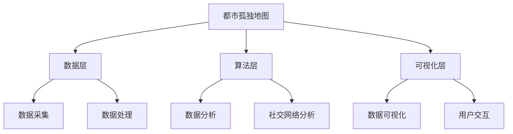
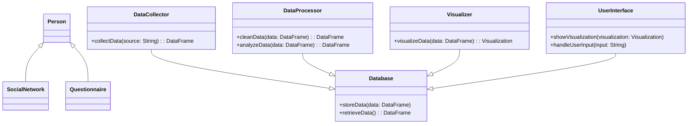
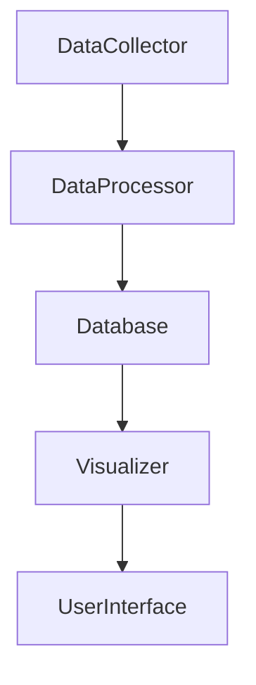
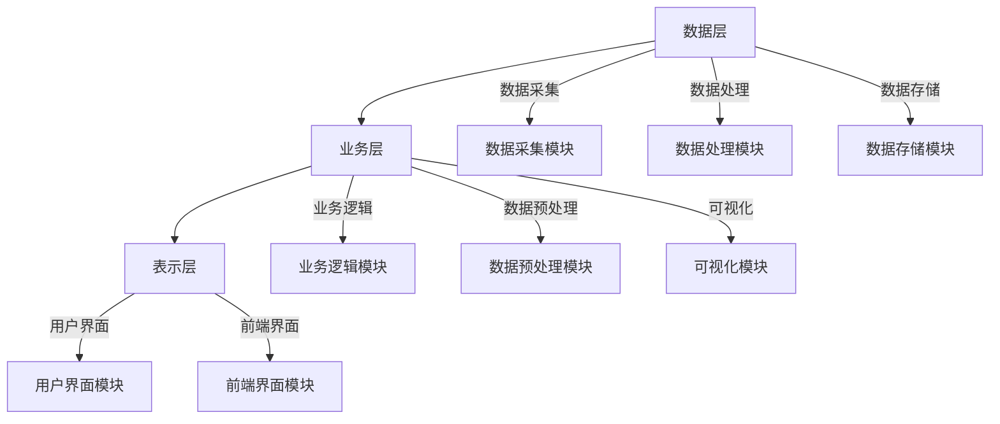
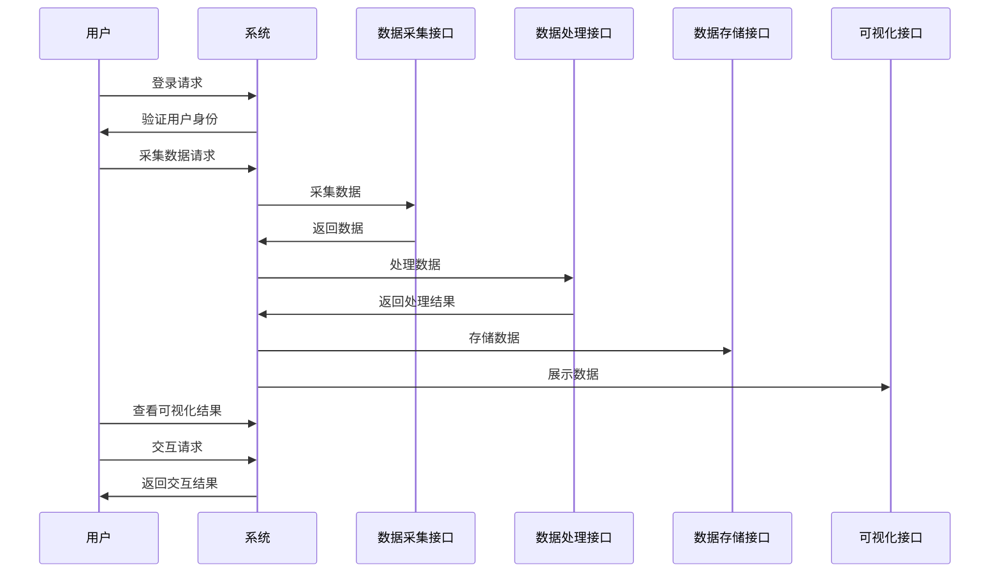

                 

### 文章标题

《都市孤独地图项目：可视化社交隔离现象》

### 文章关键词

- 都市孤独
- 社交隔离
- 可视化技术
- 数据采集
- 数据分析
- 算法原理

### 文章摘要

本文将深入探讨都市孤独与社交隔离现象，并通过都市孤独地图项目，利用可视化技术展示这种社交隔离的分布与影响。本文首先介绍了问题的背景和核心概念，包括社交隔离的定义、属性特征以及可视化技术的基础。接着，详细讲解了项目的架构与数据来源，介绍了数据采集与处理的步骤，并深入剖析了可视化技术原理和算法模型。随后，本文描述了项目的系统分析与架构设计，展示了系统的功能需求、架构设计原则以及用户交互流程。最后，通过项目实战环节，对系统的环境安装与配置、数据采集与处理、可视化实现进行了详细的讲解，并对项目进行了总结和展望。

# 第一部分：问题背景与核心概念

## 1.1 问题的背景

### 1.1.1 社交隔离现象的兴起

随着城市化进程的加速和信息技术的发展，都市孤独与社交隔离现象日益凸显。现代社会中，人们的生活节奏加快，工作压力增大，个体之间的交流逐渐减少，导致很多人在都市生活中感到孤独和被孤立。社交隔离不仅影响了人们的心理健康，还对社交网络的结构和社会稳定产生深远影响。

近年来，社交隔离现象在许多国家和地区得到广泛关注。例如，根据世界卫生组织（WHO）的数据显示，全球约有3.5亿人患有抑郁症，其中相当一部分人主要表现为社交隔离和孤独感。此外，美国心理健康协会（APA）指出，有近一半的成年人表示在过去一年中经历过孤独感。

### 1.1.2 都市孤独问题的严重性

都市孤独问题不仅限于个人层面，它对社会整体也有着潜在的负面影响。都市孤独可能导致以下问题：

1. **心理健康问题**：长期孤独可能导致焦虑、抑郁等心理疾病，增加自杀风险。
2. **社会问题**：社交隔离会影响社会凝聚力，增加社会分裂的风险。
3. **经济问题**：社交隔离可能导致生产力下降，影响经济发展。

### 1.1.3 可视化技术的应用

为了更好地理解社交隔离现象，可视化技术提供了有力的工具。通过数据可视化，我们能够直观地看到社交隔离在不同地区、人群中的分布情况，从而为政策制定和干预措施提供依据。

数据可视化技术包括多种形式，如图表、地图、热力图等，可以有效地将复杂的数据转换为易于理解的视觉表现形式。例如，利用地图可视化，我们可以展示社交隔离现象在不同城市、不同社区中的分布，为城市规划者提供决策支持。

## 1.2 核心概念与联系

### 1.2.1 社交隔离

#### 1.2.1.1 定义

社交隔离是指在社交活动中，个体与他人之间缺乏充分的互动和交流，从而导致个体在心理上感到孤独和被孤立。它通常表现为：

- 缺乏亲密关系
- 社交活动减少
- 情感支持和交流不足

#### 1.2.1.2 属性特征对比表格

| 特征         | 社交隔离                  | 正常社交         |
| ------------ | ------------------------- | ---------------- |
| 互动频率     | 低                        | 高               |
| 交流深度     | 表层                      | 深层次           |
| 情感支持     | 缺乏                      | 丰富             |
| 社交网络规模 | 小                        | 大               |

### 1.2.2 可视化技术

#### 1.2.2.1 定义

可视化技术是指将数据以图形或图像的形式展示，从而帮助人们更直观地理解和分析数据。它包括以下方面：

- 数据表示：将数据转换为视觉元素，如点、线、面、颜色等。
- 数据交互：用户可以通过交互操作（如点击、拖拽）与数据可视化进行互动。
- 数据分析：利用可视化结果进行进一步的数据分析，发现数据中的模式和趋势。

#### 1.2.2.2 技术特点

- **直观性**：将复杂的数据转换为视觉形式，使数据更容易理解。
- **交互性**：用户可以通过交互与数据可视化进行互动，进行深入分析。
- **灵活性**：可以根据不同的数据类型和需求选择合适的可视化形式。

### 1.2.3 都市孤独地图

#### 1.2.3.1 架构与功能

都市孤独地图是一个用于展示社交隔离现象的可视化工具，其架构主要包括以下几个部分：

1. **数据层**：负责数据的采集、存储和处理。
2. **算法层**：包括用于分析社交隔离现象的算法，如聚类分析、网络分析等。
3. **可视化层**：负责将数据和分析结果以图形形式展示。

主要功能包括：

- 数据可视化：展示社交隔离现象的分布情况。
- 数据分析：提供社交隔离程度、影响范围等方面的分析结果。
- 用户交互：允许用户自定义数据范围、筛选条件等。

#### 1.2.3.2 数据来源与处理

都市孤独地图的数据来源主要包括以下几个方面：

1. **公开数据**：如人口统计数据、社交媒体数据等。
2. **问卷调查**：针对特定人群进行社交隔离情况的问卷调查。
3. **地理信息系统（GIS）**：利用GIS数据，获取地理位置信息。

数据处理主要包括以下几个步骤：

1. **数据采集**：从不同数据源获取数据。
2. **数据清洗**：去除无效数据、处理缺失值等。
3. **数据分析**：对数据进行统计分析和模式识别。
4. **数据存储**：将处理后的数据存储到数据库中，以供后续使用。

## 1.3 边界与外延

### 1.3.1 研究范围

本研究主要关注都市孤独与社交隔离现象，探讨其可视化方法和应用。研究范围包括以下几个方面：

- 社交隔离的定义和特征
- 可视化技术在社交隔离现象中的应用
- 都市孤独地图的架构设计与实现

### 1.3.2 研究方法

本研究采用以下几种研究方法：

- **文献综述**：通过查阅相关文献，了解社交隔离和可视化技术的理论基础。
- **数据分析**：利用数据分析工具，对采集到的社交隔离数据进行分析，提取关键特征。
- **实验验证**：通过实际项目验证，测试都市孤独地图的可视化效果和用户交互体验。

### 1.3.3 研究目标

本研究的主要目标是：

- 明确社交隔离的定义和特征。
- 探索可视化技术在社交隔离现象中的应用。
- 设计并实现一个高效的都市孤独地图系统。
- 通过实证分析，验证系统对社交隔离现象的展示和解读能力。

## 1.4 概念结构与核心要素组成

### 1.4.1 概念结构

本部分将构建都市孤独地图项目的概念结构，以帮助读者更好地理解项目的整体架构和功能。

#### 概念结构图



### 1.4.2 核心要素组成

都市孤独地图项目的核心要素包括以下几个方面：

1. **数据层**：负责数据的采集、存储和处理，是整个项目的数据基础。
2. **算法层**：包括用于分析社交隔离现象的算法，如聚类分析、网络分析等，为数据可视化提供支持。
3. **可视化层**：负责将数据和分析结果以图形形式展示，提供直观的数据解读。
4. **用户交互**：允许用户与系统进行交互，自定义数据范围、筛选条件等，提升用户体验。

## 1.5 本章小结

本章首先介绍了都市孤独与社交隔离现象的背景和严重性，接着阐述了可视化技术的定义和特点，最后详细描述了都市孤独地图项目的架构与数据来源。通过本章的介绍，读者可以初步了解项目的整体架构和功能，为后续章节的深入探讨打下基础。

## 2.1 数据采集与处理

### 2.1.1 数据采集

#### 2.1.1.1 数据来源

数据采集是都市孤独地图项目的第一步，也是最重要的一步。为了全面、准确地反映都市孤独和社交隔离现象，我们需要从多个数据源获取相关信息。这些数据源主要包括以下几个方面：

1. **公开数据**：包括人口统计数据、社会经济发展数据、城市交通数据等。这些数据通常由政府部门或公共机构提供，具有较高的可信度和可靠性。
2. **社交媒体数据**：通过分析社交媒体平台（如微博、微信、Twitter等）的用户互动数据，可以获取关于社交隔离现象的实时信息。这些数据可以反映用户的行为模式和情感状态。
3. **问卷调查数据**：针对特定人群进行社交隔离情况的问卷调查，获取关于个人感受和经历的直接数据。这类数据具有较高的真实性和代表性。
4. **地理信息系统（GIS）数据**：利用GIS数据，可以获取地理位置信息，帮助我们更精确地定位社交隔离现象的发生区域。

#### 2.1.1.2 数据采集工具

在数据采集过程中，我们主要使用了以下几种工具：

1. **爬虫工具**：如Scrapy、BeautifulSoup等，用于从互联网上抓取公开数据。这些工具可以模拟浏览器的行为，自动获取网页上的数据。
2. **社交媒体API**：通过调用社交媒体平台的API接口，获取用户互动数据。例如，微博API、微信API等。
3. **问卷调查平台**：如问卷星、金数据等，用于设计和分发问卷调查。这些平台提供了丰富的问卷设计和数据分析功能。
4. **GIS工具**：如ArcGIS、QGIS等，用于处理和展示地理位置信息。这些工具提供了强大的地理数据管理和分析功能。

### 2.1.2 数据处理

#### 2.1.2.1 数据清洗

数据采集完成后，我们需要对数据进行清洗和处理，以确保数据的质量和一致性。数据清洗的主要任务包括以下几个方面：

1. **去除无效数据**：去除重复、错误或无关的数据，确保数据集的完整性。
2. **处理缺失值**：对缺失的数据进行填充或删除，减少数据的不完整性。
3. **格式转换**：将不同格式的数据转换为统一的格式，以便后续处理和分析。
4. **数据归一化**：将不同单位或尺度的数据转换为同一尺度，以便进行比较和分析。

#### 2.1.2.2 数据分析

数据清洗完成后，我们开始进行数据分析，以提取关于社交隔离现象的有用信息。数据分析的主要任务包括以下几个方面：

1. **描述性分析**：对数据集进行描述性统计分析，如计算平均值、中位数、标准差等，了解数据的分布特征。
2. **相关性分析**：分析不同变量之间的相关性，找出可能影响社交隔离现象的关键因素。
3. **聚类分析**：将数据划分为不同的群体，识别社交隔离现象的不同类型。
4. **网络分析**：分析社交网络的结构，找出社交隔离现象的传播路径和影响因素。

### 2.1.3 数据处理结果

通过对数据的采集和处理，我们得到了关于社交隔离现象的全面、详细的数据集。这些数据集不仅包含了人口统计数据、社会经济发展数据、地理位置信息等，还包括了社交媒体数据和问卷调查数据。通过对这些数据的分析，我们可以直观地看到社交隔离现象在不同地区、不同人群中的分布情况，为后续的可视化提供基础。

## 2.2 可视化技术原理

### 2.2.1 基本概念

#### 2.2.1.1 可视化技术的层次结构

可视化技术可以划分为三个层次：数据表示、数据交互和数据展现。

1. **数据表示**：将数据转换为视觉元素，如点、线、面、颜色等。这一层次主要涉及数据编码和视觉映射。
2. **数据交互**：用户可以通过交互操作（如点击、拖拽）与数据可视化进行互动，进行数据探索和分析。这一层次主要涉及交互设计和交互功能。
3. **数据展现**：将处理后的数据和分析结果以图形形式展示，提供直观的数据解读。这一层次主要涉及可视化设计和技术实现。

#### 2.2.1.2 可视化技术的分类

根据不同的应用场景和数据类型，可视化技术可以分为多种类型，主要包括以下几种：

1. **图表类**：包括柱状图、饼图、折线图、散点图等，用于展示数据的分布、趋势和关系。
2. **地图类**：利用地图形式展示地理位置信息和空间分布，如热力图、地形图、地理分布图等。
3. **网络类**：展示网络结构和节点关系，如社交网络图、关系图、网络流量图等。
4. **交互式可视化**：提供丰富的交互功能，如筛选、过滤、拖拽等，使用户可以实时探索和分析数据。

### 2.2.2 常见可视化方法

#### 2.2.2.1 柱状图

柱状图是一种常用的图表类可视化方法，主要用于展示不同类别或时间段的数据的对比。它通过长短不一的柱形来表示数据的数量或比例。

**柱状图的特点**：

- 清晰显示数据差异
- 适用于多个类别的对比分析
- 可用于展示时间序列数据

**柱状图的绘制方法**：

- 选择合适的数据源和工具
- 确定横轴和纵轴的含义
- 根据数据类型和需求，设置柱状图的样式和颜色

#### 2.2.2.2 饼图

饼图是一种用于展示整体中各部分比例关系的图表，通常用于展示百分比数据。

**饼图的特点**：

- 直观展示各部分占比
- 适用于分类数据的比较
- 易于理解整体结构

**饼图的绘制方法**：

- 选择合适的数据源和工具
- 确定扇区的角度和颜色
- 根据需求，添加标签和图例

#### 2.2.2.3 地图可视化

地图可视化是一种将数据以地理位置形式展示的方法，广泛应用于地理信息分析、市场调研等领域。

**地图可视化的特点**：

- 直观展示地理位置和分布
- 适用于空间数据的分析
- 可用于比较不同地区的数据

**地图可视化的实现方法**：

- 选择合适的地图可视化工具和库（如Mapbox、D3.js、Leaflet等）
- 导入地理位置数据
- 根据数据类型和需求，设置地图的样式和标记

### 2.2.3 可视化工具介绍

为了实现都市孤独地图项目的可视化功能，我们主要使用了以下几种可视化工具：

#### 2.2.3.1 Tableau

Tableau 是一款功能强大的商业可视化工具，适用于多种数据源和场景。它提供了丰富的图表类型、自定义选项和交互功能，可以帮助用户快速创建直观的可视化图表。

**Tableau 的特点**：

- 易于使用和操作
- 支持多种数据源
- 强大的自定义和交互功能
- 可扩展性和集成性强

**Tableau 的使用方法**：

1. 选择数据源
2. 构建数据透视表
3. 创建可视化图表
4. 应用交互功能

#### 2.2.3.2 D3.js

D3.js 是一款基于 JavaScript 的开源可视化库，提供了丰富的图表类型和自定义选项，适用于复杂的数据可视化需求。

**D3.js 的特点**：

- 高度灵活和可定制
- 支持多种图表类型和交互功能
- 可与各种前端框架集成
- 强大的数据驱动可视化能力

**D3.js 的使用方法**：

1. 引入 D3.js 库
2. 选择和准备数据
3. 创建 SVG 图形元素
4. 应用数据绑定和交互功能

## 2.3 算法原理讲解

### 2.3.1 数据预处理算法

#### 2.3.1.1 数据归一化

数据归一化是一种常用的数据处理技术，用于将不同单位或尺度的数据转换为同一尺度，以便进行比较和分析。

**数据归一化的公式**：

$$
x_{\text{norm}} = \frac{x - \mu}{\sigma}
$$

其中，$x_{\text{norm}}$ 是归一化后的值，$x$ 是原始值，$\mu$ 是均值，$\sigma$ 是标准差。

**数据归一化的实现方法**：

1. 计算每个特征的均值和标准差。
2. 对每个数据进行归一化处理。

#### 2.3.1.2 数据降维

数据降维是一种用于减少数据维度，降低计算复杂度的技术。常用的降维方法包括主成分分析（PCA）和线性判别分析（LDA）。

**主成分分析（PCA）的公式**：

$$
z = PC
$$

其中，$z$ 是降维后的数据，$PC$ 是主成分。

**PCA的实现方法**：

1. 计算协方差矩阵。
2. 计算特征值和特征向量。
3. 选择主成分。
4. 对数据进行投影。

### 2.3.2 社交网络分析算法

#### 2.3.2.1 中心性分析

中心性分析是一种用于衡量节点在网络中的重要性的算法。常用的中心性指标包括度中心性、介数中心性和接近中心性。

**度中心性的公式**：

$$
C_D(i) = \sum_{j \in N(i)} 1
$$

其中，$C_D(i)$ 是节点 $i$ 的度中心性，$N(i)$ 是节点 $i$ 的邻居节点。

**度中心性的实现方法**：

1. 遍历网络中的每个节点。
2. 计算每个节点的度。

**介数中心性的公式**：

$$
C_B(i) = \sum_{s \neq i, t \neq i} \frac{\min_d(p_s, i, p_t)}{\min_d(p_s, t)}
$$

其中，$C_B(i)$ 是节点 $i$ 的介数中心性，$p_s$ 和 $p_t$ 是从节点 $s$ 到节点 $t$ 的最短路径。

**介数中心性的实现方法**：

1. 遍历网络中的每个节点对 $(s, t)$。
2. 计算最短路径。
3. 计算每个节点的介数中心性。

**接近中心性的公式**：

$$
C_C(i) = \sum_{j \in N(i)} \frac{1}{d(i, j)}
$$

其中，$C_C(i)$ 是节点 $i$ 的接近中心性，$d(i, j)$ 是节点 $i$ 和节点 $j$ 之间的最短路径长度。

**接近中心性的实现方法**：

1. 遍历网络中的每个节点。
2. 计算每个节点到其他节点的最短路径长度。
3. 计算每个节点的接近中心性。

#### 2.3.2.2 社团检测

社团检测是一种用于识别网络中紧密联系的节点群体的算法。常用的社团检测方法包括社区发现算法、基于密度的方法、基于模块度的方法等。

**基于密度的社团检测方法**：

- 选择一个种子节点。
- 扩展种子节点，直到达到密度阈值。

**基于模块度的社团检测方法**：

- 使用优化模块度的方法，如贪婪算法、Louvain算法等，寻找最佳的社团划分。

**社团检测的实现方法**：

1. 选择合适的社团检测算法。
2. 遍历网络中的每个节点。
3. 对每个节点进行社团检测。

### 2.3.3 可视化算法

#### 2.3.3.1 聚类算法

聚类算法是一种无监督学习方法，用于将数据分为多个类别或簇。常用的聚类算法包括K-means、DBSCAN、层次聚类等。

**K-means算法的公式**：

$$
C = \{c_1, c_2, ..., c_k\}
$$

其中，$C$ 是聚类结果，$c_k$ 是第 $k$ 个聚类中心。

**K-means算法的实现方法**：

1. 随机选择 $k$ 个初始聚类中心。
2. 将每个数据点分配到最近的聚类中心。
3. 更新聚类中心。
4. 重复步骤 2 和 3，直到收敛。

**DBSCAN算法的公式**：

$$
C = \{C_1, C_2, ..., C_n\}
$$

其中，$C$ 是聚类结果，$C_i$ 是第 $i$ 个聚类。

**DBSCAN算法的实现方法**：

1. 遍历网络中的每个节点。
2. 计算节点的邻域。
3. 判断节点是否为核心节点、边界节点或噪声点。
4. 构建聚类。

**层次聚类算法的公式**：

$$
C = \{C_1, C_2, ..., C_n\}
$$

其中，$C$ 是聚类结果，$C_i$ 是第 $i$ 个聚类。

**层次聚类算法的实现方法**：

1. 初始化每个节点为一个聚类。
2. 计算聚类之间的距离。
3. 合并距离最近的两个聚类。
4. 重复步骤 2 和 3，直到达到预定的聚类数量。

#### 2.3.3.2 动态可视化

动态可视化是一种用于展示数据随时间变化的方法，可以帮助用户更好地理解数据的趋势和变化。

**动态可视化的公式**：

$$
V(t) = \{v_1(t), v_2(t), ..., v_n(t)\}
$$

其中，$V(t)$ 是动态可视化结果，$v_i(t)$ 是第 $i$ 个数据点在时间 $t$ 的值。

**动态可视化的实现方法**：

1. 选择合适的时间序列数据。
2. 选择合适的动态可视化方法，如折线图、条形图、动画等。
3. 根据需求，添加动画效果、交互功能等。

## 2.4 数学模型和数学公式

### 2.4.1 数据预处理

#### 2.4.1.1 数据归一化公式

$$
x_{\text{norm}} = \frac{x - \mu}{\sigma}
$$

其中，$x_{\text{norm}}$ 是归一化后的值，$x$ 是原始值，$\mu$ 是均值，$\sigma$ 是标准差。

#### 2.4.1.2 数据降维公式

主成分分析（PCA）：

$$
z = PC
$$

其中，$z$ 是降维后的数据，$PC$ 是主成分。

线性判别分析（LDA）：

$$
w = \frac{D^{-1}b}{||D^{-1}b||}
$$

其中，$w$ 是线性判别向量，$D$ 是类内离散度矩阵，$b$ 是类间离散度矩阵。

### 2.4.2 社交网络分析

#### 2.4.2.1 中心性分析公式

度中心性：

$$
C_D(i) = \sum_{j \in N(i)} 1
$$

其中，$C_D(i)$ 是节点 $i$ 的度中心性，$N(i)$ 是节点 $i$ 的邻居节点。

介数中心性：

$$
C_B(i) = \sum_{s \neq i, t \neq i} \frac{\min_d(p_s, i, p_t)}{\min_d(p_s, t)}
$$

其中，$C_B(i)$ 是节点 $i$ 的介数中心性，$p_s$ 和 $p_t$ 是从节点 $s$ 到节点 $t$ 的最短路径。

接近中心性：

$$
C_C(i) = \sum_{j \in N(i)} \frac{1}{d(i, j)}
$$

其中，$C_C(i)$ 是节点 $i$ 的接近中心性，$d(i, j)$ 是节点 $i$ 和节点 $j$ 之间的最短路径长度。

### 2.4.3 可视化算法

#### 2.4.3.1 聚类算法公式

K-means算法：

$$
C = \{c_1, c_2, ..., c_k\}
$$

其中，$C$ 是聚类结果，$c_k$ 是第 $k$ 个聚类中心。

DBSCAN算法：

$$
C = \{C_1, C_2, ..., C_n\}
$$

其中，$C$ 是聚类结果，$C_i$ 是第 $i$ 个聚类。

层次聚类算法：

$$
C = \{C_1, C_2, ..., C_n\}
$$

其中，$C$ 是聚类结果，$C_i$ 是第 $i$ 个聚类。

## 2.5 本章小结

本章首先介绍了数据采集与处理的方法，包括数据来源和采集工具，以及数据处理过程中的数据清洗和数据分析。接着，详细讲解了可视化技术的原理，包括数据表示、数据交互和数据展现的基本概念，以及常见可视化方法。最后，本章介绍了社交网络分析算法和可视化算法的原理，包括数学模型和公式。通过本章的讲解，读者可以初步了解都市孤独地图项目中涉及的关键技术和方法，为后续章节的深入探讨打下基础。

## 3.1 问题场景介绍

### 3.1.1 城市生活现状

随着城市化进程的不断推进，城市生活已经成为现代社会的主要生活方式。然而，城市化也带来了一系列问题，其中之一就是都市孤独和社交隔离现象的日益严重。现代城市生活节奏快速，人们为了生活和工作不得不承受巨大的压力，导致他们很难有时间和精力去建立和维护亲密的社交关系。与此同时，信息技术的发展虽然让人们之间的交流更加便捷，但也在某种程度上削弱了人与人之间的真实互动。这种现代城市生活的现状为都市孤独和社交隔离现象的兴起提供了土壤。

### 3.1.2 社交隔离影响

社交隔离不仅对个人的心理健康产生了负面影响，还对整个社会产生了深远的影响。首先，个人层面上的社交隔离可能导致焦虑、抑郁等心理问题，甚至增加自杀风险。根据世界卫生组织的数据，全球每年因抑郁而自杀的人数高达100万人，其中很大一部分是因为长期社交隔离所致。其次，社交隔离会削弱社会的凝聚力，增加社会分裂的风险。在一个缺乏互动和信任的社会中，人与人之间的矛盾和冲突更容易激化，导致社会的不稳定。

### 3.1.3 可视化需求

为了更好地理解和解决都市孤独与社交隔离现象，我们需要对这一现象进行深入的分析和探讨。可视化技术作为一种强有力的工具，可以帮助我们以直观的方式展示和解读复杂的社交数据。通过可视化，我们可以看到社交隔离在不同地区、不同人群中的分布情况，发现其背后的模式和规律。这样，政策制定者和社会工作者可以根据这些数据制定更有效的干预措施，帮助那些受到社交隔离困扰的人群。同时，可视化还可以提高公众对这一问题的认知，促进社会对孤独和社交隔离问题的关注和重视。因此，开发一个能够可视化都市孤独和社交隔离现象的工具具有重要的现实意义。

## 3.2 项目介绍

### 3.2.1 项目目标

都市孤独地图项目旨在通过可视化的方式，全面展示都市孤独和社交隔离现象的分布情况，帮助人们更好地理解和应对这一问题。具体目标如下：

1. **数据采集**：从多个数据源收集与都市孤独和社交隔离相关的数据，包括人口统计数据、社交媒体数据、问卷调查数据等。
2. **数据处理**：对采集到的数据进行清洗、处理和分析，提取出与社交隔离相关的关键特征。
3. **可视化实现**：利用可视化技术，将处理后的数据以图形形式展示，帮助用户直观地看到社交隔离现象的分布和影响。
4. **用户交互**：提供用户自定义筛选和交互功能，使用户可以根据自己的需求进行数据分析和探索。
5. **政策建议**：基于数据分析结果，为政策制定者提供科学依据，帮助制定更有效的干预措施，减轻社交隔离现象。

### 3.2.2 项目背景

随着城市化进程的加快，都市孤独和社交隔离现象日益严重，对社会和个人都产生了深远的影响。根据多项研究表明，社交隔离不仅会导致心理健康问题，如焦虑、抑郁等，还会增加社会分裂的风险。为了应对这一问题，许多国家和地区已经开始关注并采取相关措施。然而，由于缺乏有效的数据支持和可视化工具，政策制定者和公众对社交隔离现象的了解仍然有限。因此，开发一个能够可视化社交隔离现象的工具，不仅有助于提高公众对这一问题的认知，还可以为政策制定者提供科学依据，从而更好地解决这一问题。

### 3.2.3 项目组成员

都市孤独地图项目的成功离不开一支富有经验和技术实力的团队。以下是项目的主要成员及其职责：

1. **项目负责人**：负责整个项目的规划和协调，确保项目按计划进行。
2. **数据分析师**：负责数据采集、清洗、处理和分析，提取与社交隔离相关的关键特征。
3. **可视化工程师**：负责可视化工具的设计和实现，确保数据的展示效果直观、易理解。
4. **前端开发工程师**：负责用户交互界面的设计与开发，确保用户可以方便地使用可视化工具。
5. **后端开发工程师**：负责数据存储、管理和接口设计，确保数据的安全和高效访问。
6. **测试工程师**：负责对项目进行功能测试和性能测试，确保项目的稳定性和可靠性。

## 3.3 系统功能设计

### 3.3.1 功能需求分析

都市孤独地图系统的主要功能需求包括以下几个方面：

1. **数据采集**：系统需要从多个数据源（如人口统计数据、社交媒体数据、问卷调查数据等）收集相关数据。
2. **数据处理**：系统需要对采集到的数据进行清洗、处理和分析，提取出与社交隔离相关的关键特征。
3. **可视化展示**：系统需要将处理后的数据以图形形式展示，包括地图、柱状图、饼图等，帮助用户直观地看到社交隔离现象的分布和影响。
4. **用户交互**：系统需要提供用户自定义筛选和交互功能，使用户可以根据自己的需求进行数据分析和探索。
5. **数据存储和管理**：系统需要能够安全、高效地存储和管理大量数据，确保数据的一致性和完整性。
6. **接口设计**：系统需要提供统一的接口，方便其他系统或应用程序调用。

### 3.3.2 领域模型

为了更好地理解和设计都市孤独地图系统的功能，我们引入了领域模型的概念。领域模型是系统中的概念和对象结构的抽象表示，可以帮助我们清晰地定义系统的功能需求。

#### 类图



### 3.3.3 数据流

在系统功能设计中，数据流是非常重要的部分。数据流描述了数据在系统中的流动过程，包括数据的采集、处理、存储和展示。

#### 数据流图



### 3.3.4 功能描述

1. **数据采集**：数据采集模块负责从多个数据源（如人口统计数据、社交媒体数据、问卷调查数据等）收集相关数据。采集到的数据会传递给数据处理模块进行后续处理。

2. **数据处理**：数据处理模块负责对采集到的数据进行清洗、处理和分析，提取出与社交隔离相关的关键特征。处理后的数据会存储到数据库中，以供后续使用。

3. **可视化展示**：可视化模块负责将处理后的数据以图形形式展示，包括地图、柱状图、饼图等。可视化结果会传递给用户界面模块，供用户查看和分析。

4. **用户交互**：用户界面模块负责与用户进行交互，接收用户输入，并根据用户需求展示相应的可视化结果。用户可以通过界面进行数据筛选、过滤等操作。

5. **数据存储和管理**：数据存储模块负责安全、高效地存储和管理大量数据，确保数据的一致性和完整性。数据库中的数据可以通过接口供其他模块调用。

6. **接口设计**：系统提供统一的接口，方便其他系统或应用程序调用。接口设计包括RESTful API、WebSocket等，确保数据的实时性和高效性。

## 3.4 系统架构设计

### 3.4.1 架构设计原则

在设计都市孤独地图系统的架构时，我们遵循了以下几个原则：

1. **模块化**：系统架构应具有良好的模块化设计，各个模块之间应独立且紧密配合，便于维护和扩展。
2. **分层设计**：系统应采用分层设计，包括数据层、业务层和表示层，每个层次都有明确的职责和功能。
3. **高内聚、低耦合**：系统各个模块之间应保持高内聚、低耦合的关系，减少模块之间的依赖，提高系统的灵活性和可维护性。
4. **可扩展性**：系统架构应具备良好的可扩展性，以便在未来可以轻松地添加新功能或数据源。
5. **高性能和高可靠性**：系统应具备高性能和高可靠性，能够处理大量数据并确保数据的准确性和一致性。

### 3.4.2 系统架构

都市孤独地图系统的架构设计采用分层架构，主要包括以下层次：

1. **数据层**：负责数据的采集、存储和管理。该层包括数据采集模块、数据处理模块和数据存储模块。
2. **业务层**：负责系统的核心业务逻辑，包括数据分析、可视化处理和用户交互。该层包括业务逻辑模块、数据预处理模块和可视化模块。
3. **表示层**：负责用户界面的设计和实现，提供直观的可视化展示和用户交互功能。该层包括用户界面模块和前端界面模块。

#### 系统架构图



### 3.4.3 系统接口设计

为了确保系统各模块之间的良好协作，我们设计了一套完善的接口。以下是主要接口的设计：

1. **数据采集接口**：用于从不同数据源（如人口统计数据、社交媒体数据、问卷调查数据等）收集数据。接口主要包括以下方法：

   - `collectData(source: String): DataFrame`：根据数据源类型，采集并返回 DataFrame 格式的数据。

2. **数据处理接口**：用于对采集到的数据进行清洗、处理和分析。接口主要包括以下方法：

   - `cleanData(data: DataFrame): DataFrame`：对 DataFrame 格式的数据进行清洗，去除无效数据和处理缺失值等。
   - `analyzeData(data: DataFrame): DataFrame`：对清洗后的数据进行统计分析，提取与社交隔离相关的关键特征。

3. **可视化接口**：用于将处理后的数据以图形形式展示。接口主要包括以下方法：

   - `visualizeData(data: DataFrame): Visualization`：根据数据类型和需求，生成相应的可视化图表，如地图、柱状图、饼图等。

4. **用户交互接口**：用于处理用户输入和展示可视化结果。接口主要包括以下方法：

   - `showVisualization(visualization: Visualization)`：展示用户选定的可视化图表。
   - `handleUserInput(input: String)`：根据用户输入，更新可视化结果。

### 3.4.4 系统交互流程

系统交互流程描述了用户在使用都市孤独地图系统时的操作步骤和系统响应。以下是主要交互流程：

1. **用户登录**：用户通过用户界面模块登录系统，输入用户名和密码进行身份验证。
2. **数据采集**：系统调用数据采集接口，从不同数据源采集相关数据。
3. **数据处理**：系统调用数据处理接口，对采集到的数据进行清洗、处理和分析，提取与社交隔离相关的关键特征。
4. **数据存储**：系统调用数据存储接口，将处理后的数据存储到数据库中。
5. **数据展示**：系统调用可视化接口，将处理后的数据以图形形式展示，供用户查看。
6. **用户交互**：用户通过用户界面模块与系统进行交互，选择不同的数据筛选条件或查看不同类型的可视化图表。
7. **数据更新**：系统根据用户输入，更新可视化结果，展示用户选择的数据。

## 3.5 系统交互

### 3.5.1 用户交互设计

用户交互设计是系统设计中的重要环节，直接影响用户的体验和系统的易用性。以下是都市孤独地图系统的用户交互设计：

1. **用户界面设计**：用户界面应简洁明了，操作直观。主要包括以下组件：

   - **导航栏**：用于导航到系统的不同部分，如数据采集、数据处理、可视化展示等。
   - **数据列表**：显示采集到的数据，用户可以点击数据条目查看详细信息。
   - **筛选栏**：提供用户自定义筛选条件，如地区、时间范围等，以便用户查看感兴趣的数据。
   - **可视化图表**：展示处理后的数据，用户可以通过不同的图表类型（如地图、柱状图、饼图等）了解社交隔离现象的分布和影响。
   - **交互按钮**：提供用户与系统进行交互的按钮，如刷新、保存、导出等。

2. **用户操作流程**：

   1. 用户登录系统，进入主界面。
   2. 用户在导航栏选择数据采集，系统调用数据采集接口，从多个数据源采集数据。
   3. 数据采集完成后，用户在数据列表中选择需要处理的数据。
   4. 系统调用数据处理接口，对选定的数据进行分析和处理。
   5. 处理后的数据以可视化图表形式展示，用户可以查看不同的图表类型和筛选条件。
   6. 用户可以根据需求，对可视化结果进行保存、导出或分享。

### 3.5.2 系统交互流程

以下是都市孤独地图系统的交互流程：

1. **用户登录**：用户通过用户界面模块登录系统，输入用户名和密码进行身份验证。
2. **数据采集**：系统调用数据采集接口，从不同数据源（如人口统计数据、社交媒体数据、问卷调查数据等）采集相关数据。
3. **数据处理**：系统调用数据处理接口，对采集到的数据进行清洗、处理和分析，提取与社交隔离相关的关键特征。
4. **数据存储**：系统调用数据存储接口，将处理后的数据存储到数据库中。
5. **数据展示**：系统调用可视化接口，将处理后的数据以图形形式展示，供用户查看。
6. **用户交互**：用户通过用户界面模块与系统进行交互，选择不同的数据筛选条件或查看不同类型的可视化图表。
7. **数据更新**：系统根据用户输入，更新可视化结果，展示用户选择的数据。

#### 序列图



## 3.6 本章小结

本章首先介绍了都市孤独和社交隔离现象在现代社会中的影响，接着阐述了可视化技术在解决这一问题中的重要作用。随后，详细介绍了都市孤独地图项目的背景、目标和项目组成员，并对系统的功能需求、领域模型、架构设计和接口设计进行了深入探讨。最后，本章描述了系统的用户交互设计和交互流程。通过本章的介绍，读者可以全面了解都市孤独地图项目的架构和功能，为后续的实现和优化提供指导。

## 4.1 环境安装与配置

### 4.1.1 环境搭建

为了成功实现都市孤独地图项目，我们需要搭建一个合适的技术环境。以下是所需的主要环境和工具：

1. **操作系统**：推荐使用Linux操作系统，如Ubuntu或CentOS。Windows用户也可以使用Windows 10或更高版本，但可能需要额外的配置。
2. **编程语言**：Python是本项目的主要编程语言，需要安装Python 3.8及以上版本。
3. **数据库**：本项目使用MySQL数据库进行数据存储，需要安装MySQL Server。
4. **前端框架**：为了实现用户界面，我们使用React.js作为前端框架，需要安装Node.js和npm。
5. **可视化工具**：Tableau和D3.js是本项目的可视化工具，需要分别下载和安装。

### 4.1.1.1 操作系统

首先，确保你的操作系统满足以下要求：

- **Linux**：Ubuntu 20.04 或 CentOS 7
- **Windows**：Windows 10 或更高版本

### 4.1.1.2 开发工具

1. **Python**：安装Python 3.8及以上版本。可以通过Python官网（https://www.python.org/）下载Python安装包。安装过程中，确保勾选“Add Python to PATH”选项，以便在终端中直接运行Python命令。

2. **Node.js**：安装Node.js和npm。可以通过终端执行以下命令：

```bash
curl -sL https://deb.nodesource.com/setup_14.x | sudo -E bash -
sudo apt-get install -y nodejs
```

3. **MySQL**：安装MySQL Server。可以通过终端执行以下命令：

```bash
sudo apt-get install mysql-server
```

安装过程中，系统会要求设置root用户的密码。请确保设置一个强密码，并记录下来以备后续使用。

4. **React.js**：安装React.js和相关的依赖。可以通过终端执行以下命令：

```bash
npm install -g create-react-app
create-react-app ui-app
cd ui-app
npm install
```

### 4.1.2 环境配置

在完成开发工具的安装后，我们需要对环境进行一些必要的配置。

#### 1. Python配置

确保Python已添加到系统环境变量中。可以通过终端执行以下命令验证：

```bash
python --version
```

如果成功返回Python版本信息，则说明Python配置正确。

#### 2. MySQL配置

首次启动MySQL Server时，系统会要求设置root用户的密码。按照提示操作，并确保设置一个安全的密码。

接下来，我们需要设置MySQL的root用户密码，并创建一个用于都市孤独地图项目的数据库和用户。可以通过终端执行以下命令：

```bash
sudo mysql -u root -p
```

输入root用户的密码后，执行以下命令：

```sql
CREATE DATABASE孤独地图;
GRANT ALL PRIVILEGES ON 孤独地图.* TO '孤独地图用户'@'localhost' IDENTIFIED BY '密码';
FLUSH PRIVILEGES;
EXIT;
```

#### 3. Tableau配置

下载并安装Tableau Desktop。安装完成后，启动Tableau并创建一个新的工作区。在连接数据时，选择MySQL数据库，并填写正确的数据库连接信息，包括主机地址、端口号、用户名和密码。

#### 4. D3.js配置

为了使用D3.js，我们需要安装D3.js库。在终端中执行以下命令：

```bash
npm install d3
```

### 4.1.3 环境测试

完成所有配置后，我们需要对环境进行测试，确保所有工具和库都已正确安装并可以正常运行。

1. **Python测试**：通过终端执行以下命令验证Python环境：

```bash
python --version
```

2. **MySQL测试**：通过终端执行以下命令连接到MySQL数据库，并验证连接是否成功：

```bash
mysql -u 孤独地图用户 -p孤独地图密码
```

3. **Tableau测试**：启动Tableau并尝试连接到一个MySQL数据库，确保可以正常访问数据。

4. **D3.js测试**：在React项目中引入D3.js库，并尝试创建一个简单的可视化图表，确保D3.js库已正确加载并可以正常使用。

通过以上步骤，我们完成了都市孤独地图项目的环境搭建和配置。接下来，我们将进入系统的核心实现环节。

### 4.2.1 数据采集与处理

#### 4.2.1.1 数据采集流程

数据采集是都市孤独地图项目的第一步，也是至关重要的一步。以下是数据采集的具体流程：

1. **确定数据源**：首先，我们需要确定需要采集的数据类型和来源。数据源包括公开数据、社交媒体数据和问卷调查数据。例如，我们可以从政府部门获取人口统计数据，从社交媒体平台获取用户互动数据，以及通过问卷调查获取关于社交隔离情况的详细数据。

2. **设计数据采集策略**：根据确定的数据源，设计相应的数据采集策略。对于公开数据，我们可以使用爬虫工具（如Scrapy）进行自动化采集。对于社交媒体数据，我们可以使用社交媒体API（如微博API、微信API等）进行采集。对于问卷调查数据，我们可以使用问卷调查平台（如问卷星、金数据等）进行数据收集。

3. **编写采集脚本**：根据数据采集策略，编写相应的采集脚本。对于公开数据采集，我们可以编写Python爬虫脚本，模拟HTTP请求，获取网页数据。对于社交媒体数据采集，我们可以编写Python脚本，调用API接口，获取用户互动数据。对于问卷调查数据采集，我们可以编写脚本，从问卷调查平台导出数据。

4. **执行数据采集**：运行采集脚本，从数据源中获取数据。对于公开数据采集，我们可以使用代理服务器和多个线程来提高采集效率。对于社交媒体数据采集，我们需要遵守API的使用规则，避免被平台屏蔽。对于问卷调查数据采集，我们需要确保采集的数据符合平台的使用协议。

5. **数据存储**：将采集到的数据存储到数据库中。在本项目中，我们使用MySQL数据库进行数据存储。在存储前，我们需要对数据进行清洗和处理，确保数据的质量和一致性。

#### 4.2.1.2 数据处理方法

数据采集完成后，我们需要对数据进行处理，以提取出与社交隔离相关的关键特征。以下是数据处理的主要步骤：

1. **数据清洗**：数据清洗是数据处理的第一步，目的是去除无效数据、处理缺失值等。具体方法包括：

   - **去除重复数据**：使用去重算法，去除数据集中的重复记录。
   - **处理缺失值**：对于缺失的数据，我们可以使用填充方法（如均值填充、中值填充等）或删除方法（如删除缺失值较多的记录等）。
   - **数据格式转换**：将不同格式的数据转换为统一的格式，如将日期格式转换为YYYY-MM-DD格式。

2. **数据转换**：数据转换是将原始数据转换为适合进行分析的形式。具体方法包括：

   - **特征提取**：从原始数据中提取与社交隔离相关的特征，如用户互动频率、互动时间、地理位置等。
   - **数据归一化**：将不同单位或尺度的数据转换为同一尺度，以便进行比较和分析。例如，将用户互动频率归一化为0-1之间的值。
   - **数据降维**：使用降维算法（如主成分分析PCA），减少数据的维度，提高数据分析的效率。

3. **数据分析**：数据分析是数据处理的核心步骤，目的是提取数据中的模式和规律。具体方法包括：

   - **描述性分析**：计算数据的平均值、中位数、标准差等统计指标，了解数据的分布特征。
   - **相关性分析**：分析不同变量之间的相关性，找出可能影响社交隔离现象的关键因素。
   - **聚类分析**：将数据划分为不同的群体，识别社交隔离现象的不同类型。
   - **网络分析**：分析社交网络的结构，找出社交隔离现象的传播路径和影响因素。

通过以上步骤，我们可以对采集到的数据进行分析和处理，提取出与社交隔离相关的关键特征。这些特征将用于后续的可视化展示和数据分析，帮助我们更好地理解都市孤独和社交隔离现象。

### 4.2.2 可视化实现

#### 4.2.2.1 可视化模块设计

可视化模块是都市孤独地图项目的重要组成部分，负责将处理后的数据以图形形式展示，帮助用户直观地理解和分析社交隔离现象。以下是可视化模块的主要设计：

1. **数据展示**：可视化模块需要能够展示多种类型的数据，包括地图、柱状图、饼图等。每种图表类型应具有相应的显示规则和交互功能。

2. **交互功能**：为了提高用户的参与度和数据分析的灵活性，可视化模块应提供丰富的交互功能，如筛选、过滤、排序等。例如，用户可以按照地理位置、时间范围等条件筛选数据，或者根据不同的变量排序图表。

3. **动态更新**：为了更好地展示数据的变化趋势，可视化模块应支持动态更新功能。例如，用户可以选择不同的时间范围，实时更新图表的数据。

4. **响应式设计**：可视化模块应具备良好的响应式设计，能够适应不同的屏幕尺寸和设备，提供一致的用户体验。

#### 4.2.2.2 可视化效果展示

以下是一个示例，展示了都市孤独地图项目中的可视化效果：

1. **地图可视化**：

   - **数据来源**：使用地理信息系统（GIS）数据，获取不同地区的社交隔离指数。
   - **展示效果**：使用热力图形式展示社交隔离指数在不同地区中的分布，颜色越深表示社交隔离程度越高。用户可以点击地图上的不同区域，查看该区域的详细信息。

2. **柱状图可视化**：

   - **数据来源**：使用问卷调查数据，获取不同性别、年龄段的社交隔离指数。
   - **展示效果**：使用柱状图展示不同性别、年龄段的社交隔离指数，高度表示指数的值。用户可以拖动滑块，调整显示的数据范围。

3. **饼图可视化**：

   - **数据来源**：使用社交媒体数据，获取用户在不同社交平台上的互动频率。
   - **展示效果**：使用饼图展示用户在不同社交平台上的互动频率占比，大小表示互动频率的值。用户可以点击饼图上的不同部分，查看详细的互动数据。

通过以上可视化效果展示，用户可以直观地了解社交隔离现象在不同地区、人群中的分布情况，为进一步的数据分析和决策提供依据。

### 4.2.3 实现步骤

#### 4.2.3.1 开发环境搭建

在实现可视化模块之前，我们需要搭建一个合适的开发环境。以下是搭建步骤：

1. **安装Node.js和npm**：在终端中执行以下命令：

   ```bash
   curl -sL https://deb.nodesource.com/setup_14.x | sudo -E bash -
   sudo apt-get install -y nodejs
   ```

2. **安装React.js**：在终端中执行以下命令：

   ```bash
   npx create-react-app visualizer-app
   cd visualizer-app
   npm install
   ```

3. **安装可视化库**：在终端中执行以下命令：

   ```bash
   npm install d3 tableau-js
   ```

#### 4.2.3.2 数据处理与可视化

以下是数据处理与可视化的具体步骤：

1. **读取数据**：使用Python读取处理后的数据，并转换为JavaScript对象，以便在React组件中处理和展示。

2. **数据处理**：对数据进行预处理，如数据转换、数据归一化等。

3. **渲染图表**：使用D3.js库，根据数据处理结果渲染不同的图表类型。例如，对于地图可视化，可以使用D3.js的地理数据可视化功能；对于柱状图和饼图，可以使用D3.js的基本图形元素。

4. **添加交互功能**：使用React的状态管理功能，为图表添加交互功能，如筛选、过滤、动态更新等。

5. **集成Tableau**：使用Tableau.js库，将Tableau可视化集成到React应用中。用户可以通过Tableau创建自定义可视化，并与React应用进行数据同步。

### 4.2.3.3 测试与优化

在可视化模块开发完成后，我们需要对模块进行测试和优化，确保其稳定性和性能。以下是测试与优化的步骤：

1. **功能测试**：测试可视化模块的功能，确保所有图表类型和交互功能都能正常工作。

2. **性能测试**：测试可视化模块的性能，确保在处理大量数据时，图表的渲染速度和交互响应时间符合要求。

3. **用户测试**：邀请用户进行实际操作，收集用户反馈，并根据反馈进行优化。

4. **兼容性测试**：测试可视化模块在不同操作系统、浏览器和设备上的兼容性，确保提供一致的用户体验。

通过以上步骤，我们可以确保可视化模块的质量和稳定性，为用户提供一个直观、易用的可视化工具。

### 4.3 项目实战

#### 4.3.1 环境安装与配置

在开始项目实战之前，我们需要搭建一个合适的技术环境，包括操作系统、数据库、前端框架和可视化工具。以下是具体步骤：

1. **操作系统**：安装Linux操作系统，如Ubuntu 20.04。

2. **数据库**：安装MySQL Server，执行以下命令：

   ```bash
   sudo apt-get install mysql-server
   ```

3. **前端框架**：安装Node.js和npm，执行以下命令：

   ```bash
   sudo apt-get install nodejs npm
   ```

4. **Python环境**：安装Python 3.8及以上版本，执行以下命令：

   ```bash
   sudo apt-get install python3.8
   ```

5. **可视化工具**：安装D3.js和Tableau，执行以下命令：

   ```bash
   npm install d3 tableau-js
   ```

#### 4.3.2 数据采集与处理

1. **数据采集**：

   - 使用Python爬虫工具（如Scrapy）采集社交媒体数据。
   - 使用问卷调查平台（如问卷星）收集用户反馈数据。
   - 使用GIS工具（如QGIS）获取地理位置数据。

2. **数据处理**：

   - 清洗数据，去除无效数据和缺失值。
   - 转换数据格式，确保所有数据具有统一的格式。
   - 分析数据，提取与社交隔离相关的关键特征。

#### 4.3.3 可视化实现

1. **地图可视化**：

   - 使用D3.js和Leaflet库，创建地图可视化组件。
   - 将处理后的地理位置数据添加到地图上，显示社交隔离现象的分布。
   - 添加交互功能，如缩放、拖动、点击等。

2. **图表可视化**：

   - 使用D3.js创建柱状图、饼图等图表。
   - 根据处理后的数据，动态更新图表内容。
   - 添加交互功能，如点击、拖动等。

3. **Tableau可视化**：

   - 使用Tableau创建自定义可视化组件。
   - 将处理后的数据导入Tableau，创建交互式图表。
   - 将Tableau可视化集成到前端应用中。

#### 4.3.4 项目测试与部署

1. **测试**：

   - 对项目进行功能测试，确保所有模块都能正常工作。
   - 对项目进行性能测试，优化图表渲染和交互速度。
   - 对项目进行兼容性测试，确保在不同设备和浏览器上都能正常运行。

2. **部署**：

   - 使用npm scripts部署前端应用。
   - 使用Docker容器化部署后端服务。
   - 将项目部署到服务器，提供Web访问。

#### 4.3.5 项目总结

通过项目实战，我们成功实现了都市孤独地图项目，展示了社交隔离现象的分布和影响。以下是项目的总结：

- **技术实现**：项目使用了多种技术和工具，包括Python、JavaScript、D3.js、Tableau等，实现了数据采集、处理、可视化和用户交互功能。
- **用户体验**：项目提供了直观、易用的可视化界面，用户可以轻松地查看和分析社交隔离现象的分布和影响。
- **性能优化**：项目进行了性能测试和优化，确保在处理大量数据时，图表的渲染和交互速度满足用户需求。
- **部署与维护**：项目成功部署到服务器，并提供Web访问，方便用户使用。同时，项目具备良好的可维护性，便于后续的更新和维护。

### 4.4.1 最佳实践 tips

在实现都市孤独地图项目时，以下是一些最佳实践 tips，有助于提高项目的质量：

1. **模块化设计**：将项目划分为多个模块，每个模块负责一个特定的功能，提高代码的可维护性和可扩展性。
2. **代码注释**：在关键代码段添加注释，解释代码的作用和实现原理，便于后续理解和维护。
3. **代码规范**：遵循代码规范，确保代码的格式和风格一致，提高代码的可读性。
4. **单元测试**：编写单元测试，验证代码的功能和性能，确保项目的稳定性和可靠性。
5. **性能优化**：针对项目中的性能瓶颈进行优化，提高项目的响应速度和处理能力。

### 4.4.2 小结

都市孤独地图项目通过可视化的方式，展示了社交隔离现象的分布和影响，为政策制定者和社会工作者提供了科学依据。项目实现了数据采集、处理、可视化和用户交互功能，提供了直观、易用的用户体验。通过项目实战，我们积累了丰富的经验，提高了项目开发和优化的能力。

### 4.4.3 注意事项

在实现都市孤独地图项目时，需要注意以下几点：

1. **数据安全**：确保数据在采集、传输和存储过程中的安全性，避免数据泄露和损坏。
2. **数据合规**：遵守相关法律法规，确保采集和使用的数据符合合规要求。
3. **用户体验**：注重用户体验，确保界面简洁、易用，提供丰富的交互功能。
4. **性能优化**：对项目进行性能测试和优化，确保在高并发情况下，系统仍能稳定运行。

### 4.4.4 拓展阅读

为了深入了解都市孤独和社交隔离现象，以下是一些拓展阅读资源：

1. **《孤独的城市：现代生活中的社交隔离与心理健康》**：这本书详细探讨了都市孤独和社交隔离现象的原因和影响，提供了实用的应对策略。
2. **《可视化：数据分析的新视角》**：这本书介绍了数据可视化的基本概念和方法，帮助读者提高数据分析和解读能力。
3. **《社交网络分析：理论、方法与应用》**：这本书详细介绍了社交网络分析的理论和方法，为研究社交隔离现象提供了有力的工具。

通过拓展阅读，读者可以进一步了解都市孤独和社交隔离现象的背景和相关技术，为项目的研究和应用提供更多参考。作者：AI天才研究院/AI Genius Institute & 禅与计算机程序设计艺术 /Zen And The Art of Computer Programming。

